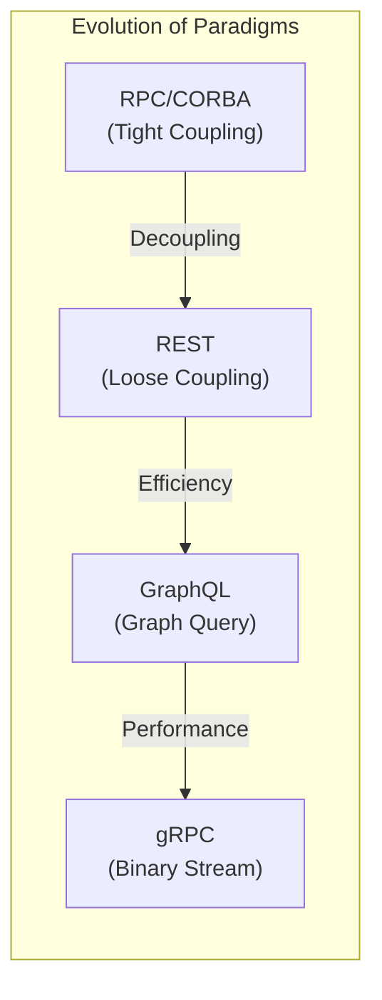
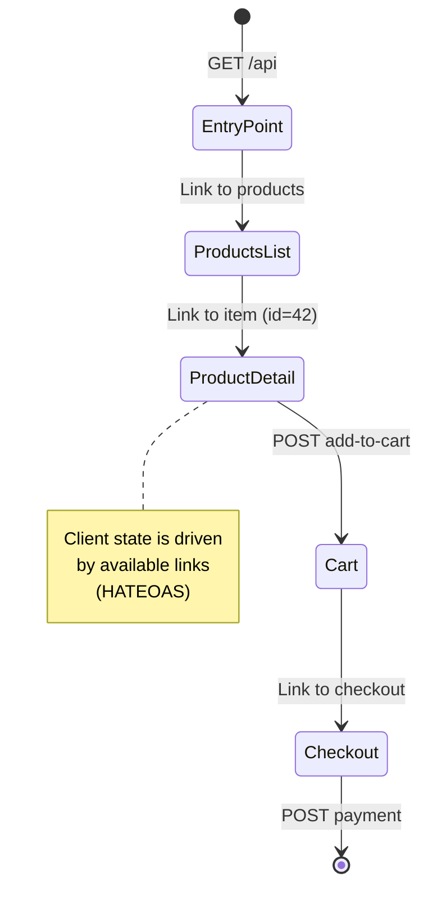
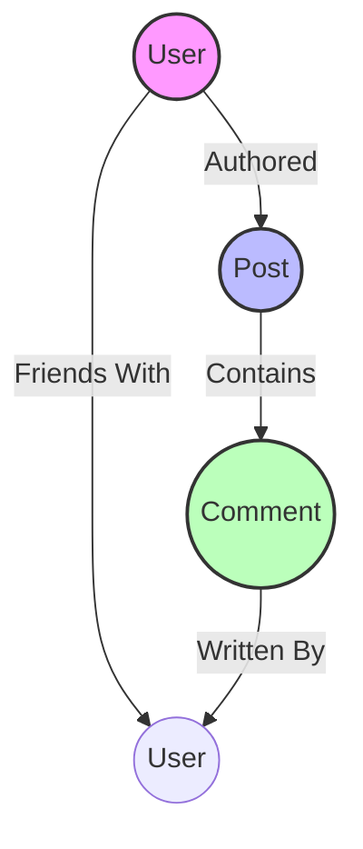
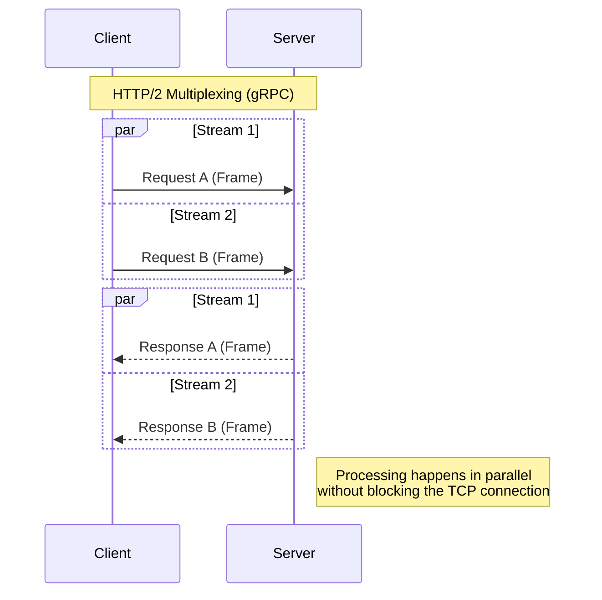
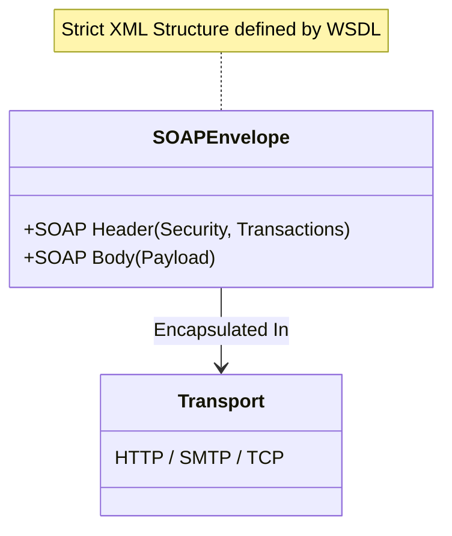
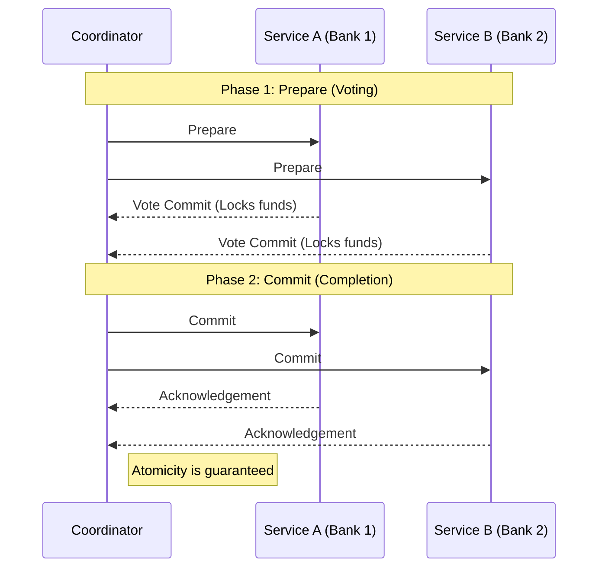
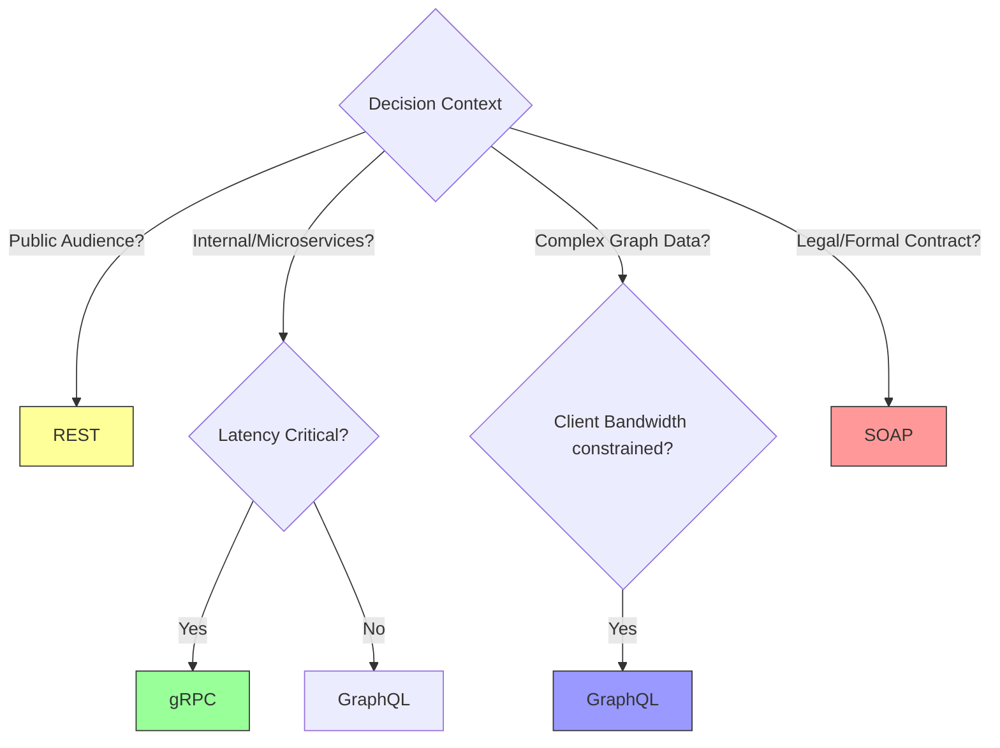

- [1 - Introduction: The Theoretical Landscape of Distributed Computing](#1---introduction-the-theoretical-landscape-of-distributed-computing)
- [2 - Representational State Transfer (REST)](#2---representational-state-transfer-rest)
  - [2.1 - Historical Genesis and Dissertation](#21---historical-genesis-and-dissertation)
  - [2.2 - Theoretical Foundations: Resources and State Machines](#22---theoretical-foundations-resources-and-state-machines)
    - [2.2.1 - The Set-Theoretic Definition of a Resource](#221---the-set-theoretic-definition-of-a-resource)
    - [2.2.2 - The Hypermedia Automaton](#222---the-hypermedia-automaton)
  - [2.3 - Architectural Constraints](#23---architectural-constraints)
  - [2.4 - Mechanics of Operation: HTTP Semantics](#24---mechanics-of-operation-http-semantics)
  - [2.5 - Advantages and Disadvantages](#25---advantages-and-disadvantages)
- [3 - GraphQL](#3---graphql)
  - [3.1 - Context and Graph Theory Origins](#31---context-and-graph-theory-origins)
  - [3.2 - The Schema and Type System](#32---the-schema-and-type-system)
  - [3.3 - Complexity Analysis: The $N+1$ Problem](#33---complexity-analysis-the-n1-problem)
  - [3.4 - Denial of Service via Cyclical Complexity](#34---denial-of-service-via-cyclical-complexity)
  - [3.5 - Advantages and Disadvantages](#35---advantages-and-disadvantages)
- [4 - gRPC (Google Remote Procedure Call)](#4---grpc-google-remote-procedure-call)
  - [4.1 - Context and the Microservices Imperative](#41---context-and-the-microservices-imperative)
  - [4.2 - Architectural Mechanics: HTTP/2 and Protobuf](#42---architectural-mechanics-http2-and-protobuf)
    - [4.2.1 - HTTP/2 Transport Layer](#421---http2-transport-layer)
    - [4.2.2 - Protocol Buffers and Information Theory](#422---protocol-buffers-and-information-theory)
  - [4.3 - Advantages and Disadvantages](#43---advantages-and-disadvantages)
- [5 - SOAP (Simple Object Access Protocol)](#5---soap-simple-object-access-protocol)
  - [5.1 - Legacy and Formalism](#51---legacy-and-formalism)
  - [5.2 - Theoretical Basis: Automata and XML Validation](#52---theoretical-basis-automata-and-xml-validation)
  - [5.3 - The WS-\* Standards and ACID Transactions](#53---the-ws--standards-and-acid-transactions)
- [6 - Comparative Analysis and Decision Matrix](#6---comparative-analysis-and-decision-matrix)
  - [6.1 - Performance and Complexity Comparison](#61---performance-and-complexity-comparison)
  - [6.2 - Decision Framework for Engineers](#62---decision-framework-for-engineers)
- [7 - Conclusion](#7---conclusion)
- [References](#references)


# 1 - Introduction: The Theoretical Landscape of Distributed Computing

The discipline of software engineering is fundamentally a struggle against complexity, a struggle that becomes exponentially more arduous when systems cross the boundary of a single memory space. Distributed computing, the practice of linking autonomous computational entities via a network to achieve a common goal, introduces a class of problems unknown to local programming. These are best encapsulated by the "Fallacies of Distributed Computing," which warn that the network is unreliable, latency is non-zero, bandwidth is finite, and the topology changes.

Application Programming Interfaces (APIs) act as the binding agents in this chaotic environment. They are not merely pipes for data; they are architectural decisions that impose specific constraints on how systems communicate, how state is managed, and how failures are handled. The evolution of API paradigms (from the rigid procedural calls of the 1980s to the hypermedia-driven web and the graph-based query languages of today) reflects a continuous oscillation between competing engineering priorities: strictness versus flexibility, efficiency versus discoverability, and tight versus loose coupling.

**Evolution of Paradigms**


This report provides an exhaustive, expert-level analysis of the four dominant architectural styles in modern computing: Representational State Transfer (REST), GraphQL, Google Remote Procedure Call (gRPC), and the Simple Object Access Protocol (SOAP). We will dissect these not as competing commercial products, but as distinct mathematical and theoretical approaches to the problem of distributed state management. The analysis assumes a reader proficient in software mathematics, exploring the set-theoretic definition of resources in REST, the graph-traversal algorithms inherent in GraphQL, the information-theoretic encoding of gRPC, and the automata-based validation models of SOAP.


# 2 - Representational State Transfer (REST)

## 2.1 - Historical Genesis and Dissertation

REST is frequently misunderstood as a simple protocol for transmitting JSON over HTTP. In reality, it is a sophisticated architectural style defined by Dr. Roy Thomas Fielding in his 2000 doctoral dissertation, "Architectural Styles and the Design of Network-based Software Architecture". Fielding, a principal author of the HTTP/1.1 specification, did not design REST to facilitate generic API calls for mobile apps; rather, he derived it to describe the architectural properties that made the World Wide Web successful and to guide its future evolution.

The primary motivation behind REST was to create a system capable of "anarchic scalability". Unlike previous distributed object protocols like CORBA (Common Object Request Broker Architecture), which required tight coupling and shared object definitions between client and server, the Web needed to function across organisational boundaries, tolerate partial failures, and allow independent evolution of components. Fielding achieved this by imposing a set of strict constraints that induce desirable properties such as visibility, reliability, and scalability.

## 2.2 - Theoretical Foundations: Resources and State Machines

### 2.2.1 - The Set-Theoretic Definition of a Resource

The central abstraction in REST is the **Resource**. While developers often conflate a resource with a database entity (e.g., a row in a Users table), Fielding’s definition is mathematically precise and abstract. A resource $R$ is defined as a temporally varying membership function, $M_R(t)$, which maps a point in time $t$ to a set of equivalent entities or representations.

Formally, we can express a resource $R$ as a mapping:

$$M_R : T \rightarrow \mathcal{P}(E)$$

Where:

  * $T$ represents the continuous domain of time.
  * $E$ is the set of all possible entity representations (documents, images, data streams).
  * $\mathcal{P}(E)$ denotes the power set of $E$, implying that at any instant $t$, the resource maps to a set of values (representations).

This definition is crucial for understanding the concept of "Identifier Stability." The resource identifier (URI) identifies the mapping function, not the value at a specific time. For example, the URI `/software/latest-release` is a resource. At time $t_1$, $M_R(t_1)$ might map to the set containing the binary for "Version 1.0". At time $t_2$, $M_R(t_2)$ might map to "Version 2.0". The identifier remains constant, while the representation returned changes. This abstraction allows the implementation (the server-side logic) to be completely decoupled from the interface (the URI), enabling independent evolution.

### 2.2.2 - The Hypermedia Automaton

The "State Transfer" in REST refers to the movement of the client's application state. A RESTful interaction can be modelled using Automata Theory, specifically as a Non-Deterministic Finite Automaton (NFA) with $\epsilon$-transitions.

In this theoretical model:

  * **States ($Q$):** Each unique representation (page or document) received by the client corresponds to a state.
  * **Alphabet ($\Sigma$):** The set of actions available to the user (e.g., HTTP methods like GET, POST).
  * **Transition Function ($\delta$):** The hypermedia controls (links) embedded within the representation dictate the allowable transitions to new states.
  * **Start State ($q_0$):** The entry point URI of the API.

When a client requests a resource, the server transfers a representation that places the client in a specific state $q_n$. This representation contains the "edges" of the graph—the links to other resources. By selecting a link, the client initiates a transition:

$$q_{next} \in \delta(q_{current}, \text{action})$$

This mechanism is formalised as **HATEOAS** (Hypermedia As The Engine Of Application State). It implies that the client requires no prior knowledge of the API's topology. The valid next states are discovered dynamically, just as a user navigates a website. This distinguishes REST from RPC, where the client must possess a static map (stub) of the available procedures.



## 2.3 - Architectural Constraints

Fielding defined REST through the application of six constraints. A system is only RESTful if it adheres to these principles, which are designed to induce specific architectural properties.

  * **Client-Server:** This constraint enforces a separation of concerns. The client handles the user interface and application state, while the server handles data storage and business logic. This separation allows the components to evolve independently; for instance, the server code can be rewritten in a different language without affecting the client, provided the interface remains uniform.
  * **Stateless:** This is perhaps the most critical constraint for scalability. It dictates that communication must be stateless in nature: each request from client to server must contain all of the information necessary to understand the request, and cannot take advantage of any stored context on the server.
      * *Mathematical Implication:* If the server state is denoted by $S_{srv}$ and the request by $req$, the response function $f$ must satisfy $response = f(req, S_{resource})$, not $f(req, S_{resource}, S_{session})$. This ensures that any request can be routed to any server instance in a cluster, enabling horizontal scalability ($O(N)$ capacity with $N$ servers).
  * **Cacheable:** To mitigate the latency of wide-area networks, REST requires that responses define their cacheability. This allows intermediaries (browsers, CDNs, proxies) to satisfy requests without contacting the origin server, effectively reducing the interaction path length to zero for repeated requests.
  * **Uniform Interface:** This constraint simplifies the architecture by decoupling implementations from the services they provide. It consists of four sub-constraints:
    1.  Identification of resources (URIs).
    2.  Manipulation of resources through representations (Clients hold a representation of the state, e.g., JSON, and modify it).
    3.  Self-descriptive messages (Metadata like Content-Type tells the parser how to interpret the bitstream).
    4.  HATEOAS (State transitions are driven by hypermedia).
  * **Layered System:** The client cannot ordinarily tell whether it is connected directly to the end server or to an intermediary along the way. This enables load balancing and security policies to be enforced by intermediate layers.
  * **Code-on-Demand (Optional):** This allows client functionality to be extended by downloading and executing code in the form of applets or scripts (e.g., JavaScript). This simplifies clients but reduces visibility.

## 2.4 - Mechanics of Operation: HTTP Semantics

While REST is protocol-agnostic, it is almost universally implemented over HTTP. The "Uniform Interface" relies on the standardised semantics of HTTP methods (verbs). Correct implementation requires strict adherence to the mathematical properties of these methods :

  * **Idempotency:** A method is idempotent if applying it multiple times has the same effect as applying it once. Mathematically, $f(f(x)) = f(x)$.
      * PUT and DELETE are idempotent. Deleting a resource twice yields the same system state (the resource is gone) as deleting it once.
  * **Safety:** A method is safe if it does not alter the state of the server.
      * GET is safe. It is a read-only query function.

**Table 1: HTTP Method Semantics in REST**

| Method     | Action                                     | Safe? | Idempotent?  |
| :--------- | :----------------------------------------- | :---- | :----------- |
| **GET**    | Retrieve a representation of a resource.   | Yes   | Yes          |
| **POST**   | Submit data to be processed by a resource. | No    | No           |
| **PUT**    | Replace a resource's representation.       | No    | Yes          |
| **PATCH**  | Apply partial modifications to a resource. | No    | No (usually) |
| **DELETE** | Remove a resource.                         | No    | Yes          |

## 2.5 - Advantages and Disadvantages

**Advantages:**

  * **Scalability:** The stateless nature allows for infinite horizontal scaling and efficient caching.
  * **Decoupling:** HATEOAS allows server logic to change URI structures without breaking clients.
  * **Visibility:** Intermediaries can inspect the self-descriptive messages (headers) to perform caching or security filtering.

**Disadvantages:**

  * **Over-fetching and Under-fetching:** Because resources return fixed representations, clients often receive more data than necessary (over-fetching) or must make multiple requests to assemble related data (under-fetching/N+1 problem).
  * **Lack of Strong Typing:** While JSON schemas exist, REST does not strictly enforce a type system, leading to potential integration errors.


# 3 - GraphQL

## 3.1 - Context and Graph Theory Origins

As the mobile web matured in the early 2010s, the limitations of REST became apparent, particularly for applications with complex, interconnected data models like Facebook. The rigid resource structure of REST forced mobile clients (operating on high-latency, limited-bandwidth networks) to make multiple round-trips to fetch a single screen's worth of data. This inefficiency drove the creation of GraphQL in 2012 (released publicly in 2015).

GraphQL rejects the "resource" abstraction in favour of a Graph Theory model. It views the entire application domain as a single, connected Directed Graph $G = (V, E)$.

  * **Vertices ($V$):** The entities in the system (e.g., Users, Posts, Comments).
  * **Edges ($E$):** The relationships between them (e.g., a User authored a Post).

<!-- end list -->



## 3.2 - The Schema and Type System

In GraphQL, the server defines a Schema using the GraphQL Schema Definition Language (SDL). This schema acts as the type system for the graph, strictly defining which edges exist between nodes. It is a strongly typed contract.

```graphql
type Student {
  id: ID!
  name: String!
  enrolledCourses: [Course!]!
}

type Course {
  id: ID!
  title: String!
  teacher: Teacher!
}
```

Mathematically, the schema defines the allowable traversals. A query is essentially a projection of a subgraph—a request to traverse specific edges starting from a root node and prune the resulting tree to include only specific fields. This enables the client to dictate the shape of the response, solving the over-fetching problem inherent in REST.

## 3.3 - Complexity Analysis: The $N+1$ Problem

The flexibility of GraphQL introduces significant algorithmic challenges on the server, most notably the $N+1$ Query Problem. This occurs when the execution strategy naively follows the graph edges, triggering a database query for every node visited.

Consider a scenario where we wish to fetch a list of $N$ students and the teacher for each of their courses.

**Naive Algorithm (The $O(N)$ Failure):**

1.  **Initial Query:** Fetch all students.
    $$Q_1: \text{SELECT * FROM Students} \rightarrow \text{Returns } N \text{ records.}$$
2.  **Iterative Resolution:** The GraphQL runtime iterates through each of the $N$ students. For each student, it executes the resolver for the teacher field.
    $$Q_{2 \dots N+1}: \text{SELECT * FROM Teachers WHERE id =?}$$

**Complexity Calculation:**
The total number of network round-trips to the database is $1 + N$.
If $N=100$ and the network latency to the database is 5ms, the total time spent in network overhead is:
$$T_{total} = T_{initial} + N \times T_{resolver}$$
$$T_{total} = 5\text{ms} + 100 \times 5\text{ms} = 505\text{ms}$$

For a university student implementing an API, understanding this $O(N)$ complexity is vital. It renders the API unusable at scale.

**Optimised Solution: The DataLoader Pattern:**
To solve this, GraphQL implementations utilise a "DataLoader" pattern, which uses batching and caching. It leverages the event loop (in asynchronous environments like Node.js) to coalesce individual requests.

1.  The runtime registers $N$ requests for teacher IDs.
2.  The DataLoader halts execution until the current "tick" of the event loop finishes.
3.  It executes a single batch query:
$$
Q_{\text{batch}} := \text{SELECT * FROM Teachers WHERE id IN (id\_1, id\_2, \dots, id\_N)}
$$
4.  It maps the results back to the respective promises.

**Optimised Complexity:** $O(1)$ (specifically, 2 queries regardless of $N$).
$$T_{total} = 5\text{ms} + 5\text{ms} = 10\text{ms}$$

This represents a performance improvement of orders of magnitude.

## 3.4 - Denial of Service via Cyclical Complexity

While REST APIs can be secured by rate-limiting endpoints, GraphQL APIs are vulnerable to Complexity Attacks. Because the client defines the query depth, a malicious actor can construct a recursive query that exploits cyclic relationships in the graph.

**Example:** A User has Friends, who are Users, who have Friends...

```graphql
query {
  user {
    friends {
      friends {
        friends {
         ... # Repeat 100 times
        }
      }
    }
  }
}
```

If the average branching factor (number of friends) is $B$, and the depth is $D$, the number of nodes the server attempts to resolve is $O(B^D)$. This is exponential complexity. A branching factor of 5 and a depth of 10 results in $5^{10} \approx 9.7$ million resolvers firing, potentially crashing the server.

**Mathematical Defence: Complexity Scoring**
To secure a GraphQL API, one must implement Static Query Analysis before execution. A complexity score $S$ is calculated for the query tree:

$$S = \sum_{n \in Nodes} (C_n \times M^{d_n})$$

Where:

  * $C_n$ is the base cost of the field (e.g., 1 for scalar, 5 for database fetch).
  * $M$ is a multiplier for depth.
  * $d_n$ is the depth of node $n$.

The server rejects any query where $S > S_{max}$.

## 3.5 - Advantages and Disadvantages

**Advantages:**

  * **Bandwidth Efficiency:** Clients fetch exactly what they need, reducing mobile data usage.
  * **Single Endpoint:** Simplifies client logic and firewall configurations.
  * **Introspection:** The schema allows tools (like GraphiQL) to auto-generate documentation and autocomplete queries.

**Disadvantages:**

  * **Caching Difficulty:** Because all requests are HTTP POSTs to the same URL (`/graphql`), standard HTTP caching (which relies on unique URLs) is impossible. Caching must be handled at the application layer (e.g., Global Object Identification).
  * **Complexity:** Requires sophisticated tooling (DataLoaders, Complexity Analysis) to operate safely and efficiently.


# 4 - gRPC (Google Remote Procedure Call)

## 4.1 - Context and the Microservices Imperative

While REST and GraphQL focus on the interface between the client and the backend, gRPC (open-sourced by Google in 2015) addresses the challenges of inter-service communication within a backend. In a microservices architecture, a single user action might trigger dozens of internal calls between services. In this context, the verbosity of JSON and the latency of HTTP/1.1 are unacceptable bottlenecks. gRPC evolved from "Stubby," Google's internal infrastructure, designed to handle billions of remote procedure calls per second with minimal overhead.

## 4.2 - Architectural Mechanics: HTTP/2 and Protobuf

gRPC distinguishes itself through two fundamental technology choices: HTTP/2 as the transport layer and Protocol Buffers (Protobuf) as the interface description language and serialisation format.

### 4.2.1 - HTTP/2 Transport Layer

Unlike REST (which typically uses HTTP/1.1), gRPC enforces the use of HTTP/2. This provides several mathematical and architectural advantages:

  * **Multiplexing:** HTTP/2 allows multiple streams of data to be interleaved over a single TCP connection. This eliminates the "Head-of-Line Blocking" problem of HTTP/1.1, where a slow request prevents subsequent requests from using the connection.
  * **Binary Framing:** The protocol parses data as binary frames rather than text lines, which is computationally more efficient for machines to parse.
  * **Streaming:** gRPC natively supports four communication patterns: Unary (1:1), Server Streaming (1:N), Client Streaming (N:1), and Bidirectional Streaming (N:N). This is critical for real-time applications like video streaming or stock tickers.

<!-- end list -->



### 4.2.2 - Protocol Buffers and Information Theory

Protocol Buffers is a mechanism for serialising structured data. Unlike JSON, which is "self-describing" (it repeats field names like `"firstName":"Alice"` in every message), Protobuf relies on a pre-defined schema (`.proto` file). The message on the wire contains only field indicators and values.

**Mathematical Analysis: Base 128 Varint Encoding**
A key contributor to Protobuf's efficiency is the Base 128 Varint algorithm used to encode integers. In standard computing, a 64-bit integer always occupies 8 bytes (64 bits), regardless of its value. However, information theory tells us that smaller numbers carry less "surprisal" and should require fewer bits.

The Varint algorithm encodes integers using a variable number of bytes. Each byte has:

  * 1 bit (MSB): Continuation bit ($1$ = more bytes follow, $0$ = last byte).
  * 7 bits: Payload (data).

**Example Calculation: Encoding the Integer 300**
Let us mathematically derive the binary encoding for the number 300 to demonstrate the compression.

1.  **Binary Representation:**
    The integer 300 in binary is $100101100_2$ (9 bits).
2.  **Segmentation (7-bit groups):**
    We process the bits in groups of 7, starting from the Least Significant Bit (LSB).
      * Group 1 (LSB): Take the last 7 bits: 0101100.
      * Remaining: $100101100 >> 7 = 10_2$ (0000010).
      * Group 2 (MSB): Take the remaining 7 bits: 0000010.
3.  **MSB Assignment (Continuation):**
      * Byte 1: This is not the last group, so set MSB to 1.
        Payload 0101100 $\rightarrow$ 10101100 ($172_{10}$ or AC hex).
      * Byte 2: This is the last group, so set MSB to 0.
        Payload 0000010 $\rightarrow$ 00000010 ($2_{10}$ or 02 hex).
4.  **Result:**
    The integer 300 is transmitted as **AC 02**.
      * Size: 2 bytes.
      * Standard int64 size: 8 bytes.
      * **Efficiency:** $75\%$ reduction in payload size.

For signed integers, Protobuf uses ZigZag Encoding, mapping signed integers to unsigned ones so that small negative numbers (like -1) are also encoded efficiently ($0 \rightarrow 0, -1 \rightarrow 1, 1 \rightarrow 2, -2 \rightarrow 3$), preventing the large "Two's Complement" representation (where -1 is all 1s) from inflating the Varint size.

## 4.3 - Advantages and Disadvantages

**Advantages:**

  * **High Performance:** Protobuf serialisation is 5-10x faster than JSON, and payloads are 30-50% smaller. This translates to higher throughput and lower CPU usage.
  * **Code Generation:** The `.proto` file serves as a single source of truth. The `protoc` compiler generates idiomatic client/server code in multiple languages (Java, Go, C++, Python), ensuring type safety across boundaries.
  * **Deadlines/Timeouts:** gRPC supports cascading deadlines. If a top-level request has a 500ms timeout, this context is propagated to all downstream services. If 400ms passes, a downstream service knows it has only 100ms left, or it can cancel execution immediately to save resources.

**Disadvantages:**

  * **Browser Support:** Browsers do not expose the low-level HTTP/2 primitives (specifically, access to trailers) required by gRPC. A proxy (gRPC-Web) is required for frontend use.
  * **Rigidity:** Changing the API requires updating the `.proto` file and regenerating code for all clients. It lacks the flexibility of GraphQL's query composition.
  * **Not Human-Readable:** Debugging requires special tools to decode the binary wire format.


# 5 - SOAP (Simple Object Access Protocol)

## 5.1 - Legacy and Formalism

While often viewed as "legacy" compared to REST and gRPC, SOAP (Simple Object Access Protocol) remains critical in enterprise, financial, and telecommunications sectors. It is a protocol specification, not an architectural style, utilising XML for message formatting. Unlike REST, which relies on the implicit semantics of HTTP, SOAP defines its own envelope, header, and body structure, allowing it to operate over any transport (HTTP, SMTP, TCP).



## 5.2 - Theoretical Basis: Automata and XML Validation

The rigour of SOAP comes from its reliance on XML Schemas (XSD) and WSDL (Web Services Description Language). Validating a SOAP message is a problem rooted in Automata Theory.

An XML Schema defines a "Regular Tree Grammar." Validating a document against this schema is mathematically equivalent to processing the document tree with a Tree Automaton (specifically, a deterministic or non-deterministic tree automaton depending on the schema complexity).

  * **Complexity:** For a document of size $n$, validation is typically linear $O(n)$ in time. However, the constant factors are high due to the complexity of the XML Infoset (namespaces, attributes, text nodes).
  * **Security:** This formal validation ensures that a message is structurally correct before any business logic is executed, a feature often lacking in loosely-typed JSON APIs. This makes SOAP the preferred choice for environments where message integrity is paramount.

## 5.3 - The WS-\* Standards and ACID Transactions

SOAP supports a suite of extensions known as **WS-**\* specifications. The most significant for distributed theory is **WS-AtomicTransaction**. It enables ACID (Atomicity, Consistency, Isolation, Durability) properties across distributed services using a Two-Phase Commit (2PC) protocol.

  * In REST, if a client POSTs to Service A and then POSTs to Service B, and Service B fails, the system is in an inconsistent state.
  * In SOAP with WS-AtomicTransaction, the transaction coordinator ensures that either both succeed or both roll back. This mathematical guarantee of consistency is essential for banking operations.

<!-- end list -->




# 6 - Comparative Analysis and Decision Matrix

The selection of an API architecture is a multi-objective optimisation problem. We must weigh Latency ($L$), Bandwidth ($B$), Development Velocity ($V$), and System Entropy ($H$).

## 6.1 - Performance and Complexity Comparison

**Table 2: Comparative Performance Metrics**

| Feature           | REST                | GraphQL                    | gRPC                   | SOAP                    |
| :---------------- | :------------------ | :------------------------- | :--------------------- | :---------------------- |
| **Transport**     | HTTP/1.1 (Text)     | HTTP/1.1 (Text)            | HTTP/2 (Binary)        | HTTP/SMTP/TCP (Text)    |
| **Serialisation** | JSON (High Entropy) | JSON (High Entropy)        | Protobuf (Low Entropy) | XML (Very High Entropy) |
| **Coupling**      | Loose (HATEOAS)     | Tight (Schema)             | Tight (Stub)           | Tight (WSDL)            |
| **Caching**       | Excellent (HTTP)    | Poor (App-level)           | Poor (No standard)     | Poor (No standard)      |
| **Payload Size**  | Medium              | Low (Exact fetching)       | Lowest (Compression)   | High (XML Tags)         |
| **N+1 Risk**      | High                | High (Requires DataLoader) | Low                    | Low                     |

**Theoretical Insight on Entropy:**
Information theory defines entropy as the average level of "surprise" or information inherent in a variable's possible outcomes.

  * **JSON/XML (High Entropy):** The schema is repeated in every message (`<name>Alice</name>`). The receiver learns both the data ("Alice") and the structure ("name") simultaneously. This redundancy wastes bandwidth.
  * **Protobuf (Low Entropy):** The structure is known a priori via the `.proto` file. The message contains only the data. The "surprise" is minimised to just the values, approaching the theoretical limit of data compression for structured messages.

## 6.2 - Decision Framework for Engineers



**Use REST when:**

  * The API is public-facing. The "Uniform Interface" and standard HTTP error codes make it discoverable by unknown clients.
  * Cacheability is a priority (e.g., serving static content or read-heavy data via CDNs).
  * The system requires "Anarchic Scalability" (independent deployment of client/server).

**Use GraphQL when:**

  * The client is bandwidth-constrained (Mobile/IoT).
  * The domain model is a complex, highly connected graph (Social Networks, E-commerce with nested products/reviews).
  * You are building a "Backend for Frontend" (BFF) to aggregate disparate microservices into a single view.

**Use gRPC when:**

  * Communication is East-West (Service-to-Service inside a data centre).
  * Latency is critical (Real-time gaming, High-frequency trading).
  * You require strong type safety across polyglot teams (e.g., Python AI service talking to Go backend).

**Use SOAP when:**

  * Strict contracts and formal validation are legally mandated (Gov/FinTech).
  * Distributed ACID transactions are required.
  * Integration with legacy Mainframe systems is necessary.


# 7 - Conclusion

The landscape of API architecture is not a linear progression where new technologies obsolete the old. Rather, it is a divergence of tools specialised for different theoretical domains. REST remains the master of the "Open World," relying on the set-theoretic definition of resources and the hypermedia automaton to survive in the chaotic environment of the public Web. GraphQL applies the rigour of Graph Theory to solve the data-fetching inefficiencies of the mobile era, trading complexity on the server for efficiency on the client. gRPC leverages Information Theory and binary encoding to strip away the overhead of text-based communication, providing the raw throughput required for microservices. SOAP remains the fortress of formal correctness, using Automata Theory to validate every byte of data in critical systems.

For the university student and the software architect, the "correct" choice is never a matter of preference, but a derivation from the constraints of the system. It requires balancing the $O(N)$ cost of database round-trips against the complexity of DataLoaders, and the entropy of JSON payloads against the rigidity of binary stubs. True mastery lies not in knowing the syntax of these tools, but in understanding the mathematical reality—the state machines, the graphs, and the automata—that governs them.


# References
1. Fielding, R. T. (2000). *[Architectural Styles and the Design of Network-based Software Architectures](https://www.ics.uci.edu/~fielding/pubs/dissertation/top.htm)*. PhD thesis, University of California, Irvine. ([roy.gbiv.com][1])

2. Hartig, O., & Pérez, J. (2018). *[Semantics and Complexity of GraphQL](https://dl.acm.org/doi/10.1145/3178876.3186014)*. In *Proceedings of the 2018 World Wide Web Conference (WWW ’18)*, pp. 1155–1164. ([ACM Digital Library][2])

3. Mell, P., & Grance, T. (2011). *[The NIST Definition of Cloud Computing](https://nvlpubs.nist.gov/nistpubs/legacy/sp/nistspecialpublication800-145.pdf)*. NIST Special Publication 800-145. ([nvlpubs.nist.gov][3])

4. Brewer, E. A. (2012). *[CAP Twelve Years Later: How the “Rules” Have Changed](https://doi.org/10.1109/MC.2012.37)*. *IEEE Computer*, 45(2), 23–29. ([computer.org][4])

[1]: https://roy.gbiv.com/pubs/dissertation/fielding_dissertation.pdf?utm_source=chatgpt.com "UNIVERSITY OF CALIFORNIA, IRVINE Architectural Styles ..."
[2]: https://dl.acm.org/doi/10.1145/3178876.3186014?utm_source=chatgpt.com "Semantics and Complexity of GraphQL"
[3]: https://nvlpubs.nist.gov/nistpubs/legacy/sp/nistspecialpublication800-145.pdf?utm_source=chatgpt.com "The NIST Definition of Cloud Computing"
[4]: https://www.computer.org/csdl/magazine/co/2012/02/06133253/13rRUxNmPHm?utm_source=chatgpt.com "CAP twelve years later: How the \"rules\" have changed"
