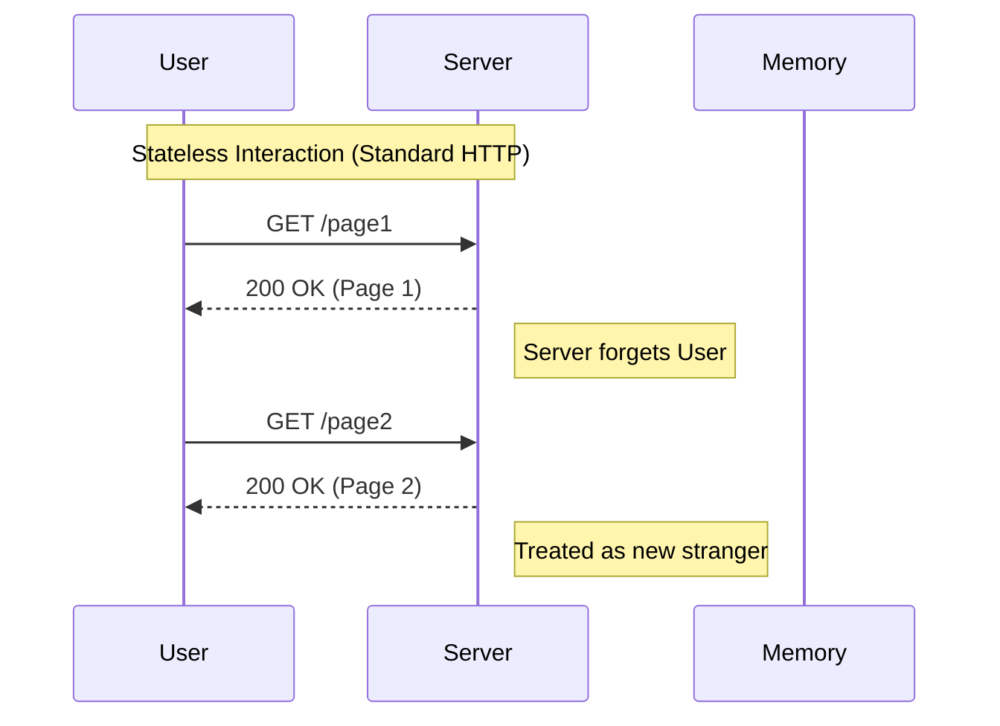
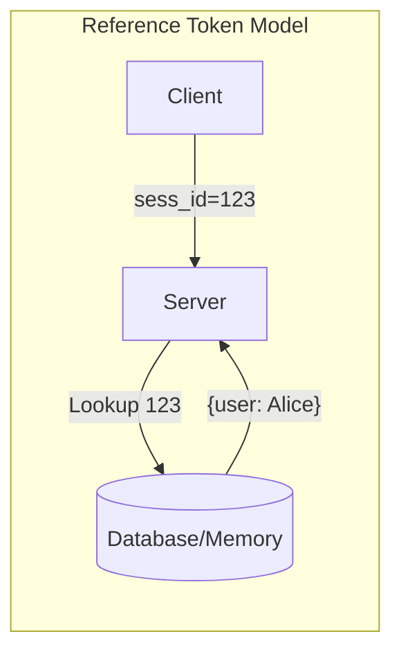
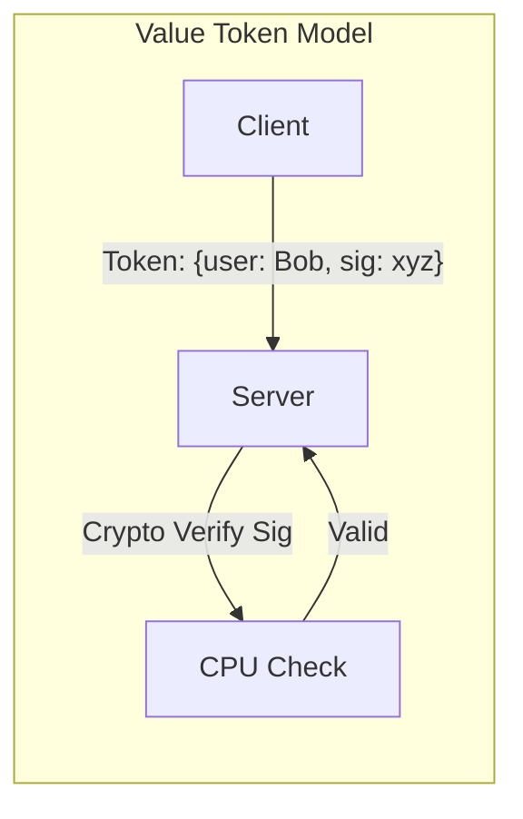
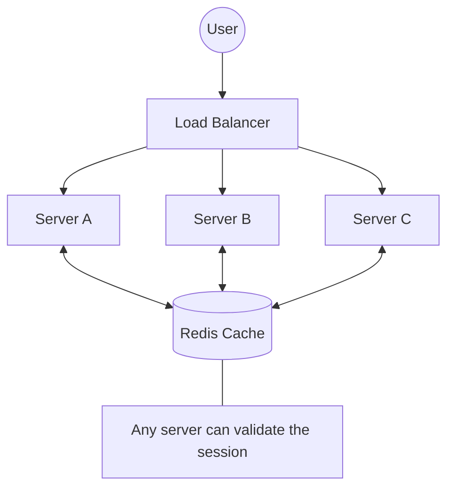
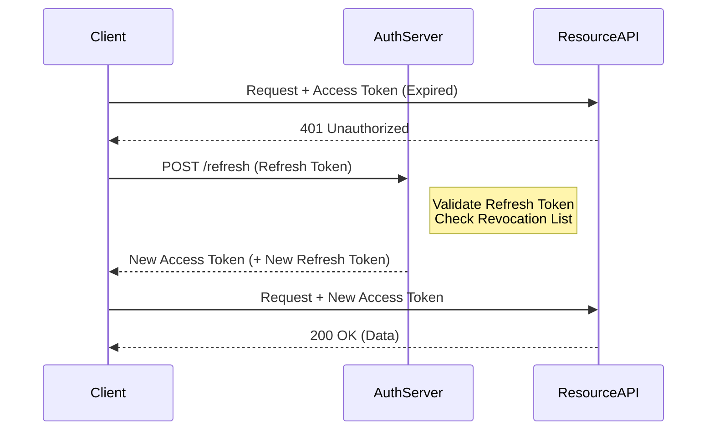
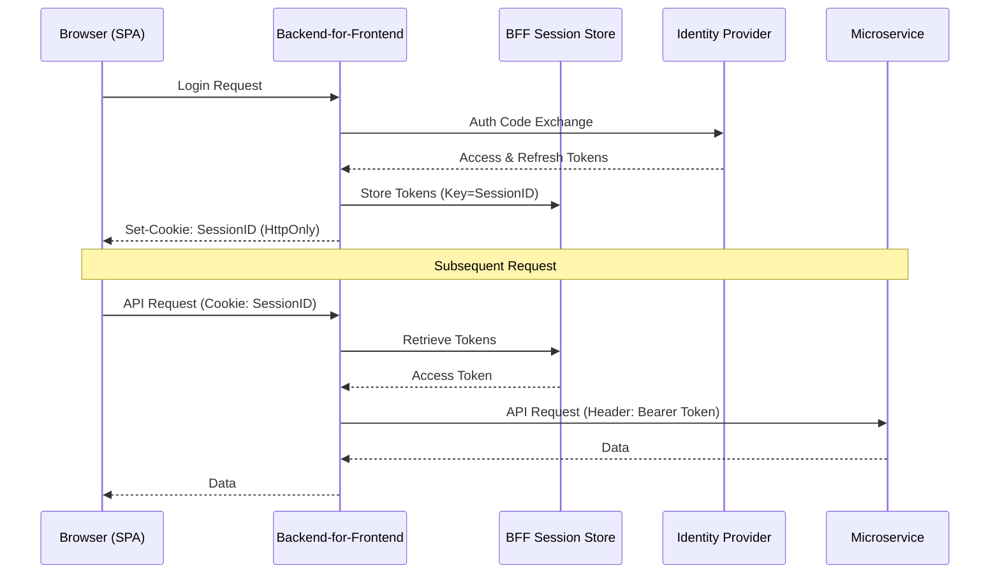
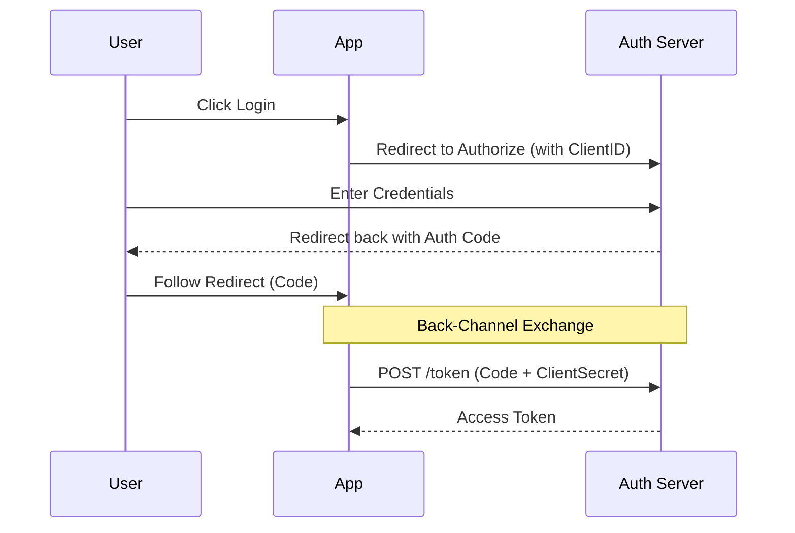

- [1 - The Theoretical Framework of Digital Identity](#1---the-theoretical-framework-of-digital-identity)
  - [1.1 - The Core Theory of Authentication State](#11---the-core-theory-of-authentication-state)
- [2 - Server-Side Session Management: The Reference Token Model](#2---server-side-session-management-the-reference-token-model)
  - [2.1 - The Mechanism of HTTP Cookies](#21---the-mechanism-of-http-cookies)
    - [2.1.1 - Critical Security Attributes](#211---critical-security-attributes)
  - [2.2 - Storage Architectures for Stateful Sessions](#22---storage-architectures-for-stateful-sessions)
    - [2.2.1 - In-Memory and Sticky Sessions](#221---in-memory-and-sticky-sessions)
    - [2.2.2 - Distributed Caching (Redis)](#222---distributed-caching-redis)
  - [2.3 - Advantages and Disadvantages of Reference Tokens](#23---advantages-and-disadvantages-of-reference-tokens)
- [3 - The Stateless Revolution: Value Tokens and RFC 7519 (JWT)](#3---the-stateless-revolution-value-tokens-and-rfc-7519-jwt)
  - [3.1 - The Concept of Self-Contained Identity](#31---the-concept-of-self-contained-identity)
  - [3.2 - Anatomy of a JWT](#32---anatomy-of-a-jwt)
    - [3.2.1 - The Header](#321---the-header)
    - [3.2.2 - The Payload (Claims)](#322---the-payload-claims)
    - [3.2.3 - The Signature](#323---the-signature)
  - [3.3 - Cryptographic Algorithms: Symmetric vs. Asymmetric](#33---cryptographic-algorithms-symmetric-vs-asymmetric)
    - [3.3.1 - Symmetric Signing (HS256)](#331---symmetric-signing-hs256)
    - [3.3.2 - Asymmetric Signing (RS256 / ES256)](#332---asymmetric-signing-rs256--es256)
  - [3.4 - The Revocation Problem](#34---the-revocation-problem)
- [4 - Architectural Paradigms: Monoliths, SPAs, and Microservices](#4---architectural-paradigms-monoliths-spas-and-microservices)
  - [4.1 - The Single Page Application (SPA) Dilemma](#41---the-single-page-application-spa-dilemma)
    - [4.1.1 - LocalStorage vs. HttpOnly Cookies](#411---localstorage-vs-httponly-cookies)
  - [4.2 - The Backend-For-Frontend (BFF) Pattern](#42---the-backend-for-frontend-bff-pattern)
- [5 - Advanced Authorisation Protocols: OAuth 2.0 and OIDC](#5---advanced-authorisation-protocols-oauth-20-and-oidc)
  - [5.1 - The Actors in OAuth 2.0](#51---the-actors-in-oauth-20)
  - [5.2 - Critical Grant Types](#52---critical-grant-types)
  - [5.3 - Token Introspection (RFC 7662)](#53---token-introspection-rfc-7662)
- [6 - Emerging Standards and Cryptographic Agility](#6---emerging-standards-and-cryptographic-agility)
  - [6.1 - PASETO (Platform-Agnostic Security Tokens)](#61---paseto-platform-agnostic-security-tokens)
  - [6.2 - Macaroons and Contextual Caveats](#62---macaroons-and-contextual-caveats)
  - [6.3 - Sender-Constrained Tokens (DPoP)](#63---sender-constrained-tokens-dpop)
- [7 - Security Vectors and Mitigation Strategies](#7---security-vectors-and-mitigation-strategies)
  - [7.1 - OWASP Top 10 Context](#71---owasp-top-10-context)
    - [7.1.1 - Cross-Site Scripting (XSS)](#711---cross-site-scripting-xss)
    - [7.1.2 - Cross-Site Request Forgery (CSRF)](#712---cross-site-request-forgery-csrf)
  - [7.2 - Session Fixation](#72---session-fixation)
- [8 - Operationalising Authentication: Decision Frameworks](#8---operationalising-authentication-decision-frameworks)
  - [8.1 - Comparison Matrix](#81---comparison-matrix)
  - [8.2 - Architectural Recommendations](#82---architectural-recommendations)
  - [8.3 - The Future: WebAuthn and Passkeys](#83---the-future-webauthn-and-passkeys)
- [References](#references)


# 1 - The Theoretical Framework of Digital Identity

The World Wide Web was originally conceived as a stateless medium. In the foundational definition of the Hypertext Transfer Protocol (HTTP), specifically RFC 2616 and its successors, each request sent from a client to a server is treated as an independent transaction. The protocol itself retains no memory of previous interactions. When a user requests a webpage, the server delivers it and immediately forgets the requester. This design is highly efficient for serving static documents but presents a fundamental challenge for interactive applications. Modern software requires continuity. Applications need to 'remember' that the user who just logged in is the same user now requesting to view their private messages or complete a purchase.



This report provides an exhaustive analysis of the mechanisms engineers use to superimpose state upon this stateless substrate. It is critical to understand that 'logging in' is not a permanent state of the connection. Rather, it is the exchange of a credential for a temporary artefact (a session identifier or a token) that must be presented with every subsequent request. The validity, security, and lifecycle of this artefact define the security posture of the entire system. We will explore the evolution from server-side reference tokens to client-side value tokens, analysing the trade-offs in performance, scalability, and security that drive architectural decisions today.

## 1.1 - The Core Theory of Authentication State

The core theory of web authentication relies on the concept of 'proof of possession'. Once a user successfully proves their identity (authentication), usually via a password or biometric, the system must issue a credential that allows the user to bypass this proof for a limited time. This creates a 'session'.

There are two primary schools of thought in managing this session state:

  * **Reference Tokens (Stateful):** The token held by the client is merely a random string (e.g., `sess_id=123`). It has no inherent meaning. The server holds the data associated with that ID in its memory or database. The token is a 'reference' to the state stored on the server.
  * **Value Tokens (Stateless):** The token held by the client contains the data itself (e.g., `{"user_id": 1, "role": "admin"}`). The server does not need to store this data; it only needs to verify that the token was issued by a trusted authority, usually via a cryptographic signature. The token is the 'value' of the state.

**Reference Token Model**


**Value Token Model**


This distinction is the fulcrum upon which all modern authentication architectures balance. The choice determines how the application scales, how it handles mobile devices, and how it secures user data against attack vectors like Cross-Site Scripting (XSS) and Cross-Site Request Forgery (CSRF).


# 2 - Server-Side Session Management: The Reference Token Model

For decades, the standard for web authentication was the server-side session. This approach leverages the HTTP State Management Mechanism, colloquially known as cookies, defined in RFC 6265.

## 2.1 - The Mechanism of HTTP Cookies

A cookie is a small piece of data sent from a server to a user's web browser. The browser stores this data and sends it back to the same server with later requests. This mechanism bridges the stateless gap of HTTP.

The process begins when the server responds to a successful login request with a `Set-Cookie` header.

**HTTP**

```http
Set-Cookie: session_id=xyz123; Path=/; Secure; HttpOnly; SameSite=Strict
```

This header instructs the browser to store the value `session_id=xyz123`. Crucially, RFC 6265 dictates that the browser must automatically include this cookie in the header of every subsequent request to the domain specified.

### 2.1.1 - Critical Security Attributes

It is essential to understand that a cookie without specific security flags is vulnerable.

  * **HttpOnly:** This flag is the primary defence against token theft via XSS. It forbids the browser's JavaScript engine (`document.cookie`) from accessing the cookie. Even if an attacker injects a malicious script into the page, the script cannot read the session ID.
  * **Secure:** This attribute ensures the cookie is only transmitted over encrypted (HTTPS) connections. It prevents the session ID from being intercepted in plain text over an insecure network.
  * **SameSite:** This attribute controls when cookies are sent with cross-site requests, providing defence against CSRF.
      * **Strict:** The cookie is only sent if the request originates from the same site.
      * **Lax:** The cookie is sent with top-level navigations (e.g., clicking a link) but not with cross-site sub-requests (e.g., images or frames). Modern browsers like Chrome now default to Lax if this attribute is unspecified, a shift from previous 'open by default' behaviours.
      * **None:** The cookie is sent with all requests, including cross-site ones. This requires the **Secure** attribute to be set.

## 2.2 - Storage Architectures for Stateful Sessions

In the reference token model, the server must remember the session ID. The scalability of the application depends entirely on where this state is stored.

### 2.2.1 - In-Memory and Sticky Sessions

Early web servers stored sessions in the Random Access Memory (RAM) of the server process. This is extremely fast but introduces a 'Sticky Session' requirement in distributed systems. If an application runs on three servers behind a load balancer, a user's session might exist only on Server A. If the load balancer routes their next request to Server B, they will appear unauthenticated.

Sticky sessions (or session affinity) force the load balancer to route a specific user always to the same server. This creates uneven load distribution and creates a single point of failure; if Server A crashes, all users on it are logged out.

### 2.2.2 - Distributed Caching (Redis)

To solve the sticky session problem, modern architectures use a distributed cache, most commonly Redis. Redis serves as a centralised, in-memory database shared by all application servers.



  * **Workflow:** When a user logs in on Server A, the session is written to Redis. When the user sends a request to Server B, Server B queries Redis to validate the session ID.
  * **Data Structure:** Sessions are typically stored as Redis Strings or Hashes. Redis supports a Time-To-Live (TTL) feature, which automatically deletes keys after a set period. This maps perfectly to session expiration policies.
  * **Performance:** Redis provides sub-millisecond latency, minimising the overhead of this external lookup.

## 2.3 - Advantages and Disadvantages of Reference Tokens

The primary advantage of this model is **Control**. Because the server retains the state, an administrator can instantly revoke a session. If a user's account is compromised, the admin can delete the session from Redis, and the attacker's access is immediately terminated.

The disadvantage is **Coupling**. The client (browser) and the server are tightly coupled. This model struggles in scenarios involving mobile applications (which do not manage cookies natively like browsers) or when the backend is split into hundreds of microservices, each of which would need to query the central Redis store, creating a potential bottleneck.


# 3 - The Stateless Revolution: Value Tokens and RFC 7519 (JWT)

As software architecture migrated towards microservices and Single Page Applications (SPAs), the need for a stateless authentication mechanism became apparent. The industry converged on the JSON Web Token (JWT), defined in RFC 7519.

## 3.1 - The Concept of Self-Contained Identity

A JWT is a compact, URL-safe means of representing claims to be transferred between two parties. Unlike a reference token, a JWT contains all the necessary information about the user within the token itself.

**Statelessness:** When a microservice receives a JWT, it does not need to query a database to verify the user's identity. It only needs to cryptographically validate the token's signature. This allows services to scale independently without overloading a central session store.

## 3.2 - Anatomy of a JWT

A JWT is composed of three parts, separated by dots (`.`): the Header, the Payload, and the Signature.


### 3.2.1 - The Header

The header typically consists of two parts: the type of the token (JWT) and the signing algorithm being used, such as HMAC SHA256 or RSA.

**JSON**

```json
{
  "alg": "HS256",
  "typ": "JWT"
}
```

This JSON object is Base64Url encoded to form the first part of the token.

### 3.2.2 - The Payload (Claims)

The payload contains the claims. Claims are statements about an entity (typically, the user) and additional metadata.

  * **Registered Claims:** These are a set of predefined claims which are not mandatory but recommended, to provide a set of useful, interoperable claims.
      * `iss` (Issuer): Who created the token.
      * `exp` (Expiration Time): The timestamp after which the token must not be accepted.
      * `sub` (Subject): The unique identifier of the user.
      * `aud` (Audience): The recipient for which the JWT is intended.
  * **Public/Private Claims:** Developers can define custom claims, such as `"role": "admin"` or `"email": "user@example.com"`.

**Important Note on Encoding:** The payload is Base64Url encoded, not encrypted. Any observer can decode and read the contents of a JWT. Therefore, sensitive information like passwords or social security numbers must never be stored in a standard JWT payload.

### 3.2.3 - The Signature

The signature is used to verify that the sender of the JWT is who it says it is and to ensure that the message hasn't been changed along the way. It is calculated by taking the encoded header, the encoded payload, and a secret (or private key), and applying the algorithm specified in the header.

$$HMACSHA256(base64UrlEncode(header) + "." + base64UrlEncode(payload), secret)$$

If a client modifies the payload (e.g., changing `"role": "user"` to `"role": "admin"`), the signature calculated by the server will not match the signature on the token, and the request will be rejected.

## 3.3 - Cryptographic Algorithms: Symmetric vs. Asymmetric

The choice of signing algorithm fundamentally dictates the architecture of the system.

### 3.3.1 - Symmetric Signing (HS256)

In this mode, the same secret key is used to both sign and verify the token. This is efficient but requires that every service capable of verifying the token must also share the secret key.

**Risk:** If the secret key is leaked from any one service, the attacker can generate valid tokens for any user. This approach is generally suitable only for monolithic applications where the issuer and verifier are the same entity.

### 3.3.2 - Asymmetric Signing (RS256 / ES256)

This mode uses a Public/Private key pair. The Identity Provider signs the token using a Private Key (which is kept strictly confidential). Any number of downstream services (Resource Servers) can use the corresponding Public Key to verify the signature.

**Advantage:** This enables a distributed trust model. A microservice can verify a token without ever possessing the ability to forge one. This is the standard for modern microservice architectures.

## 3.4 - The Revocation Problem

The most significant disadvantage of JWTs is the difficulty of revocation. Since the server does not store the token state, it cannot simply 'delete' a token to log a user out. A stolen JWT remains valid until its expiration time (`exp`) is reached.

To mitigate this, systems typically use a dual-token architecture:

  * **Access Token:** Short-lived (e.g., 5-15 minutes). Used to access resources.
  * **Refresh Token:** Long-lived (e.g., 7 days). Used to obtain new Access Tokens.

<!-- end list -->



When the Access Token expires, the client sends the Refresh Token to the auth server. The auth server checks if the Refresh Token is still valid (and not revoked/blacklisted) before issuing a new Access Token. This allows the system to revoke access within a short window (the lifetime of the Access Token) by invalidating the Refresh Token.


# 4 - Architectural Paradigms: Monoliths, SPAs, and Microservices

The choice between cookies and tokens is not just a preference; it is dictated by the broader architecture of the web application.

## 4.1 - The Single Page Application (SPA) Dilemma

In a traditional web app, the browser reloads the page on every interaction, making cookies the natural choice. In an SPA (e.g., React, Angular, Vue), the application is a JavaScript bundle that makes asynchronous API calls. The engineer must decide where to store the authentication credential.

### 4.1.1 - LocalStorage vs. HttpOnly Cookies

This is a defining debate in frontend security.

| Feature                | LocalStorage (Token)                                                        | HttpOnly Cookie (Session/Token)                                            |
| :--------------------- | :-------------------------------------------------------------------------- | :------------------------------------------------------------------------- |
| **Accessibility**      | Accessible by JavaScript (`window.localStorage`).                           | Inaccessible to JavaScript.                                                |
| **XSS Vulnerability**  | **High.** If an attacker injects script, they can read and steal the token. | **Low.** Script cannot read the cookie, preventing token exfiltration.     |
| **CSRF Vulnerability** | **None.** Tokens are not sent automatically; code must attach them.         | **High.** Browser sends cookie automatically. Requires anti-CSRF measures. |
| **Size Limit**         | \~5MB per domain.                                                           | \~4KB per cookie.                                                          |

**Recommendation:** The consensus in the security community (OWASP) is that **HttpOnly Cookies** are safer for storing sensitive credentials because preventing token exfiltration (via XSS) is prioritised. While CSRF is a risk with cookies, it can be effectively mitigated using `SameSite` attributes and anti-CSRF tokens, whereas XSS is notoriously difficult to completely eliminate in modern complex JavaScript applications.

## 4.2 - The Backend-For-Frontend (BFF) Pattern

The inherent insecurity of handling tokens in the browser has led to the adoption of the Backend-For-Frontend (BFF) pattern.



In this architecture, the SPA does not handle tokens directly. Instead, a dedicated lightweight backend server sits between the SPA and the downstream APIs.

The Workflow:

1.  **Login:** The user logs in via the BFF. The BFF communicates with the Identity Provider (e.g., Auth0, Okta) to exchange credentials for Access and Refresh Tokens.
2.  **Token Storage:** The BFF stores these tokens in its own server-side session store (e.g., Redis) or an encrypted cookie. It does not send the raw tokens to the browser.
3.  **Session Establishment:** The BFF issues a session cookie to the SPA. This cookie is `HttpOnly`, `Secure`, and `SameSite=Strict`.
4.  **Proxying:** When the SPA needs data, it calls the BFF (sending the cookie). The BFF validates the cookie, retrieves the Access Token from memory, attaches it to the request, and forwards the call to the microservices.

**Strategic Value:** This pattern decouples the frontend from the complexity of token management (refresh loops, storage) and keeps sensitive tokens entirely out of the browser, significantly reducing the attack surface.


# 5 - Advanced Authorisation Protocols: OAuth 2.0 and OIDC

While JWT defines the format of a credential, OAuth 2.0 (RFC 6749) defines the protocol for obtaining it. OpenID Connect (OIDC) is an identity layer built on top of OAuth 2.0.

## 5.1 - The Actors in OAuth 2.0

Understanding the terminology is essential for navigating the documentation.

  * **Resource Owner:** The user who authorises access.
  * **Client:** The application (e.g., the mobile app or web app) requesting access.
  * **Authorisation Server (AS):** The server that issues tokens after authenticating the user (e.g., Auth0, IdentityServer).
  * **Resource Server (RS):** The API that hosts the protected user data and accepts tokens.

## 5.2 - Critical Grant Types

OAuth 2.0 defines several 'flows' or grant types for different scenarios.

  * **Authorisation Code Flow:** The gold standard for web applications. The user is redirected to the AS to log in. The AS redirects back to the Client with a temporary 'code'. The Client exchanges this code for a token via a backend channel. This ensures tokens are never exposed in the URL.
  * **PKCE (Proof Key for Code Exchange):** An extension that secures the Authorisation Code Flow for public clients (like mobile apps) by cryptographically binding the code request to the exchange request, preventing code interception attacks.
  * **Client Credentials Flow:** Used for machine-to-machine communication where no user is present. The application authenticates itself using a Client ID and Secret to obtain a token for its own use.

<!-- end list -->



## 5.3 - Token Introspection (RFC 7662)

In some high-security architectures, passing self-contained JWTs is considered risky because they cannot be revoked. The alternative is Token Introspection.

  * **Mechanism:** The Client sends an opaque Reference Token to the API. The API cannot validate this token locally. Instead, it makes a POST request to the Authorisation Server's Introspection Endpoint (`/introspect`). The AS checks its database and returns the token's status (active/inactive) and metadata.
  * **Trade-off:** This provides the revocability of server-side sessions with the standard interface of OAuth 2.0, but introduces network latency for every API request.


# 6 - Emerging Standards and Cryptographic Agility

The dominance of JWT is being challenged by newer standards designed to address its cryptographic pitfalls.

## 6.1 - PASETO (Platform-Agnostic Security Tokens)

Security researchers have criticised JWT for its cryptographic flexibility, specifically the ability for headers to specify `alg: none` or confuse symmetric/asymmetric algorithms.

PASETO solves this by removing the choice. It uses versioned protocols (e.g., `v4.public`) that enforce specific, secure algorithms (like Ed25519 for signing and XChaCha20-Poly1305 for encryption).

**Philosophy:** Whereas JWT is a "shoot yourself in the foot" standard that requires careful configuration, PASETO is secure by design, offering only two modes: Public (signed) and Local (encrypted).

## 6.2 - Macaroons and Contextual Caveats

Macaroons represent a shift towards decentralised delegation. Unlike a JWT, which is immutable once signed, a Macaroon allows the holder to append new restrictions, known as Caveats, and re-sign the token.

**Example:** A user holds a Macaroon with full access. They wish to delegate access to a third-party print service. They can take their Macaroon, append a caveat "service = printer" and "operation = read-only", and pass this new Macaroon to the printer. The printer can use it, but the target server will enforce the new restrictions. This enables capability-based security models impossible with standard JWTs.

## 6.3 - Sender-Constrained Tokens (DPoP)

A major weakness of standard Bearer tokens is that if they are stolen, they can be used by anyone. DPoP (Demonstrating Proof-of-Possession), defined in RFC 9449, binds the token to the client's private key.

**Mechanism:** The client generates a public/private key pair. When requesting a token, it sends the public key. The token issued includes the public key's thumbprint. When using the token, the client must sign the HTTP request with its private key. The server validates both the token and the signature. Even if the token is stolen, it is useless without the private key.


# 7 - Security Vectors and Mitigation Strategies

## 7.1 - OWASP Top 10 Context

Broken Authentication and Session Management has consistently ranked in the OWASP Top 10 security risks.

### 7.1.1 - Cross-Site Scripting (XSS)

XSS allows attackers to execute scripts in the victim's browser. If tokens are stored in `localStorage`, a single XSS vulnerability compromises the user's entire account.

  * **Mitigation:** The primary defence is moving storage to **HttpOnly Cookies**. Secondary defences include implementing a strict Content Security Policy (CSP) to restrict the sources of executable scripts.

### 7.1.2 - Cross-Site Request Forgery (CSRF)

CSRF exploits the browser's trust in cookies.

  * **Mitigation:**
      * **SameSite Cookies:** Setting `SameSite=Strict` or `Lax` prevents the browser from sending cookies on cross-site requests.
      * **Anti-CSRF Tokens:** The server requires a random token in the request body (which the browser does not automatically send) to validate the request origin.

## 7.2 - Session Fixation

In this attack, the attacker tricks the user into authenticating with a session ID known to the attacker.

  * **Mitigation:** The application must always generate a new session ID immediately after successful authentication. This invalidates any pre-existing session ID the attacker might have injected.


# 8 - Operationalising Authentication: Decision Frameworks

The landscape of options can be overwhelming. The following framework simplifies the decision-making process based on application requirements.

## 8.1 - Comparison Matrix

| Feature            | Server-Side Sessions (Cookies) | JWT (Stateless)           | Backend-For-Frontend (BFF)    |
| :----------------- | :----------------------------- | :------------------------ | :---------------------------- |
| **State Location** | Server (Memory/Redis)          | Client (Token Payload)    | Server (BFF Layer)            |
| **Revocability**   | Immediate                      | Hard (Short TTL required) | Immediate (at BFF layer)      |
| **Scalability**    | Linear (depends on DB/Redis)   | High (Stateless)          | High (Horizontal BFF scaling) |
| **Client Type**    | Browser Only                   | Mobile / Microservices    | Browser (SPA)                 |
| **Security Risk**  | CSRF                           | XSS (if in LocalStorage)  | CSRF (mitigated by BFF)       |

## 8.2 - Architectural Recommendations

  * **For Standard Web Applications (Monoliths):** Use **Server-Side Sessions with HttpOnly cookies**. It is the battle-tested, default approach that offers the best security-to-complexity ratio.
  * **For Single Page Applications (SPAs):** Implement the **BFF Pattern**. Do not manage tokens in the browser. Let the BFF handle the OAuth handshake and issue a secure session cookie to the SPA.
  * **For Microservices:** Use **JWTs** for internal communication. The BFF or Gateway translates the user's session cookie into a JWT, which is then passed downstream to services. Use **RS256** (Asymmetric keys) so that services can verify tokens without sharing secrets.
  * **For High Security / FinTech:** Investigate **DPoP** or **mTLS** (Mutual TLS) to prevent token replay attacks. Ensure tokens are sender-constrained.

## 8.3 - The Future: WebAuthn and Passkeys

The industry is moving towards a passwordless future via WebAuthn. While this changes how a user proves their identity (biometrics instead of passwords), it does not fundamentally change session management—a session is still established after the proof. However, extensions like PRF (Pseudo-Random Function) allow sessions to be cryptographically bound to the user's hardware authenticator, potentially eliminating session hijacking entirely by deriving encryption keys directly from the hardware security module.

# References

1. Visaggio, C. A., & Blasio, L. C. (2010). [Session Management Vulnerabilities in Today’s Web](https://doi.org/10.1109/MSP.2010.114). *IEEE Security & Privacy, 8*(5), 48–56. ([ACM Digital Library][1])

2. Calzavara, S., Focardi, R., Squarcina, M., & Tempesta, M. (2017). [Surviving the Web: A Journey into Web Session Security](https://doi.org/10.1145/3038923). *ACM Computing Surveys, 50*(1), 13:1–13:34. ([ResearchGate][2])

3. Bugliesi, M., Calzavara, S., Focardi, R., Khan, W., & Tempesta, M. (2014). [Provably Sound Browser-Based Enforcement of Web Session Integrity](https://doi.org/10.1109/CSF.2014.33). *2014 IEEE 27th Computer Security Foundations Symposium (CSF)*, 366–380. ([ResearchGate][3])

4. Calzavara, S., Focardi, R., Grimm, N., Maffei, M., & Tempesta, M. (2020). [Language-Based Web Session Integrity](https://doi.org/10.1109/CSF49147.2020.00016). *2020 IEEE 33rd Computer Security Foundations Symposium (CSF)*, 107–122. ([repositum.tuwien.at][4])

5. Squarcina, M., Khodayari, S., Pellegrino, G., & Calzavara, S. (2023). [Cookie Crumbles: Breaking and Fixing Web Session Integrity](https://www.usenix.org/conference/usenixsecurity23/presentation/squarcina-cookie) (USENIX Security 2023). ([ACM Digital Library][5])

6. Mahindrakar, A. P., & Pujeri, R. V. (2020). [Insights of JSON Web Token](https://doi.org/10.35940/ijrte.F7689.038620). *International Journal of Recent Technology and Engineering, 8*(6), 2345–2350. ([IJRTE][6])

7. Mahindrakar, A. P., & Pujeri, R. V. (2020). [Security Implications for JSON Web Token Used in MERN Stack for Developing E-Commerce Web Application](https://doi.org/10.35940/ijeat.A1663.1010120). *International Journal of Engineering and Advanced Technology, 9*(1), 6359–6365. ([ijeat.org][7])

8. Rahmatulloh, A., Gunawan, R., & Nursuwars, F. M. S. (2019). [Performance Comparison of Signed Algorithms on JSON Web Token](https://doi.org/10.1088/1757-899X/550/1/012023). *IOP Conference Series: Materials Science and Engineering, 550*, 012023. ([ResearchGate][8])

9. Nugraha, A. F., Kabetta, H., Setia Buana, I. K., & Budiarto, R. (2023). [Performance and Security Comparison of Json Web Tokens (JWT) and Platform Agnostic Security Tokens (PASETO) on RESTful APIs](https://doi.org/10.1109/ICoCICs58778.2023.10277377). *2023 IEEE International Conference on Cryptography, Informatics, and Cybersecurity (ICoCICs)*. ([ResearchGate][9])

10. Birgisson, A., Politz, J. G., Erlingsson, Ú., Taly, A., Vrable, M., & Lentczner, M. (2014). [Macaroons: Cookies with Contextual Caveats for Decentralized Authorization in the Cloud](https://doi.org/10.14722/ndss.2014.23212). *Network and Distributed System Security Symposium (NDSS 2014)*. ([theory.stanford.edu][10])

11. Fett, D., Küsters, R., & Schmitz, G. (2016). [A Comprehensive Formal Security Analysis of OAuth 2.0](https://doi.org/10.1145/2976749.2978385). *Proceedings of the 2016 ACM SIGSAC Conference on Computer and Communications Security (CCS)*, 1204–1215. ([ACM Digital Library][11])

12. Ferry, N., O’Raw, C., & Curran, K. (2015). [Security Evaluation of the OAuth 2.0 Framework](https://doi.org/10.1108/ICS-12-2013-0089). *Information and Computer Security, 23*(1), 20–41. ([ResearchGate][12])

13. Shernan, E., Carter, H., Tian, D., Traynor, P., & Butler, K. R. B. (2015). [More Guidelines Than Rules: CSRF Vulnerabilities from Noncompliant OAuth 2.0 Implementations](https://doi.org/10.1007/978-3-319-20550-2_13). *Detection of Intrusions and Malware, and Vulnerability Assessment (DIMVA 2015)*, LNCS 9148, 239–260. ([ACM Digital Library][13])

14. Mladenov, V., Mainka, C., & Schwenk, J. (2015). [On the Security of Modern Single Sign-On Protocols: Second-Order Vulnerabilities in OpenID Connect](https://arxiv.org/abs/1508.04324). *CoRR, abs/1508.04324*. ([arXiv][14])

15. Li, W., & Mitchell, C. J. (2016). [Analysing the Security of Google’s Implementation of OpenID Connect](https://doi.org/10.1007/978-3-319-40667-1_18). In *Detection of Intrusions and Malware, and Vulnerability Assessment (DIMVA 2016)*, LNCS 9721, 357–376. ([SciSpace][15])

16. Czeskis, A., Moshchuk, A., Kohno, T., & Wang, H. J. (2013). [Lightweight Server Support for Browser-Based CSRF Protection](https://doi.org/10.1145/2488388.2488413). *Proceedings of the 22nd International World Wide Web Conference (WWW ’13)*, 273–284. ([ACM Digital Library][16])

17. Calzavara, S., Focardi, R., Squarcina, M., & Tempesta, M. (2018). [Surviving the Web: A Journey into Web Session Security](https://doi.org/10.1145/3184558.3186232). *Companion Proceedings of the Web Conference 2018 (WWW ’18 Companion)*, 123–132. ([ACM Digital Library][17])

18. Barbosa, M., Boldyreva, A., Chen, S., & Warinschi, B. (2021). [Provable Security Analysis of FIDO2](https://doi.org/10.1007/978-3-030-84252-9_5). In *Advances in Cryptology – CRYPTO 2021*, LNCS 12827, 125–156. ([ResearchGate][18])

19. Barbosa, M., Boldyreva, A., Chen, S., Cheng, K., & Esquível, L. (2025). [Privacy and Security of FIDO2 Revisited](https://doi.org/10.56553/popets-2025-0100). *Proceedings on Privacy Enhancing Technologies, 2025*(3), 304–332. ([crysp.petsymposium.org][19])

20. Casey, T., Featherstone, P., Brocklesby, K., & Kholosha, A. (2020). [An Interoperable Architecture for Usable Password-Less Web Authentication Using WebAuthn](https://doi.org/10.1007/978-3-030-64455-0_2). In *Human Aspects of Information Security and Assurance (HAISA 2020)*, CCIS 1242, 15–32. ([ACM Digital Library][20])

[1]: https://dl.acm.org/doi/10.1109/MSP.2010.114?utm_source=chatgpt.com "Session Management Vulnerabilities in Today's Web"
[2]: https://www.researchgate.net/publication/314289445_Surviving_the_Web_A_Journey_into_Web_Session_Security?utm_source=chatgpt.com "Surviving the Web: A Journey into Web Session Security"
[3]: https://www.researchgate.net/publication/286593938_Provably_Sound_Browser-Based_Enforcement_of_Web_Session_Integrity?utm_source=chatgpt.com "Provably Sound Browser-Based Enforcement of Web ..."
[4]: https://repositum.tuwien.at/handle/20.500.12708/58182?mode=full&utm_source=chatgpt.com "Language-Based Web Session Integrity - reposiTUm"
[5]: https://dl.acm.org/doi/10.5555/3620237.3620547?utm_source=chatgpt.com "Cookie crumbles: breaking and fixing web session integrity"
[6]: https://www.ijrte.org/portfolio-item/f7689038620/?utm_source=chatgpt.com "F7689038620"
[7]: https://www.ijeat.org/wp-content/uploads/papers/v10i1/A16631010120.pdf?utm_source=chatgpt.com "Security Implications for Json web Token Used in MERN ..."
[8]: https://www.researchgate.net/publication/335367877_Performance_comparison_of_signed_algorithms_on_JSON_Web_Token?utm_source=chatgpt.com "Performance comparison of signed algorithms on JSON ..."
[9]: https://www.researchgate.net/publication/374789395_Performance_and_Security_Comparison_of_Json_Web_Tokens_JWT_and_Platform_Agnostic_Security_Tokens_PASETO_on_RESTful_APIs?utm_source=chatgpt.com "(PDF) Performance and Security Comparison of Json Web ..."
[10]: https://theory.stanford.edu/~ataly/Papers/macaroons.pdf?utm_source=chatgpt.com "Macaroons: Cookies with Contextual Caveats for ..."
[11]: https://dl.acm.org/doi/10.1145/2976749.2978385?utm_source=chatgpt.com "A Comprehensive Formal Security Analysis of OAuth 2.0"
[12]: https://www.researchgate.net/publication/276397514_Security_evaluation_of_the_OAuth_20_framework?utm_source=chatgpt.com "(PDF) Security evaluation of the OAuth 2.0 framework"
[13]: https://dl.acm.org/doi/10.1007/978-3-319-20550-2_13?utm_source=chatgpt.com "More Guidelines Than Rules: CSRF Vulnerabilities ..."
[14]: https://arxiv.org/abs/1508.04324?utm_source=chatgpt.com "On the security of modern Single Sign-On Protocols: Second-Order Vulnerabilities in OpenID Connect"
[15]: https://scispace.com/papers/on-the-security-of-modern-single-sign-on-protocols-openid-6pkih91o7q?utm_source=chatgpt.com "On the security of modern Single Sign-On Protocols: OpenID ..."
[16]: https://dl.acm.org/doi/10.1145/2488388.2488413?utm_source=chatgpt.com "Lightweight server support for browser-based CSRF ..."
[17]: https://dl.acm.org/doi/fullHtml/10.1145/3184558.3186232?utm_source=chatgpt.com "Surviving the Web: A Journey into Web Session Security"
[18]: https://www.researchgate.net/publication/353811238_Provable_Security_Analysis_of_FIDO2?utm_source=chatgpt.com "Provable Security Analysis of FIDO2 | Request PDF"
[19]: https://crysp.petsymposium.org/popets/2025/popets-2025-0100.pdf?utm_source=chatgpt.com "Privacy and Security of FIDO2 Revisited"
[20]: https://dl.acm.org/doi/10.1007/978-3-030-64455-0_2?utm_source=chatgpt.com "An Interoperable Architecture for Usable Password-Less ..."
