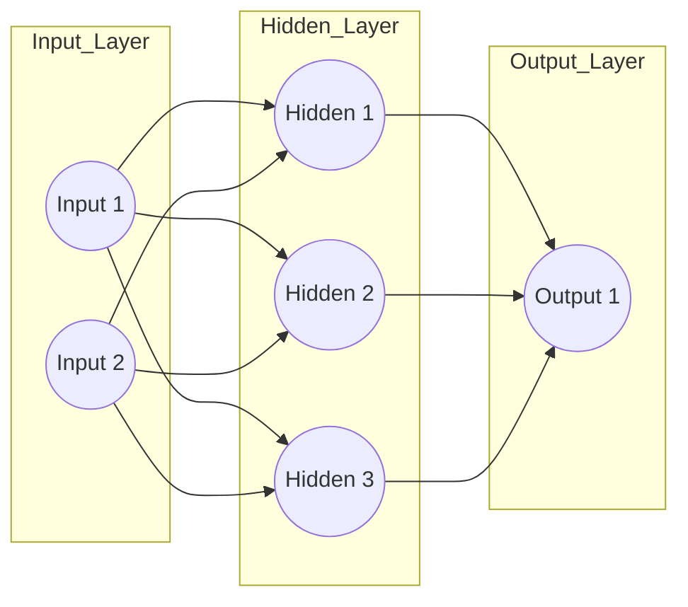
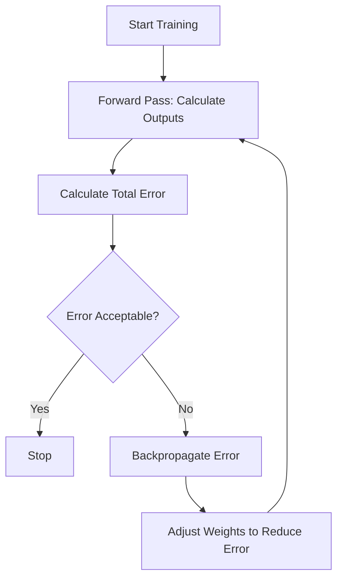
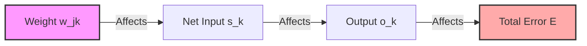
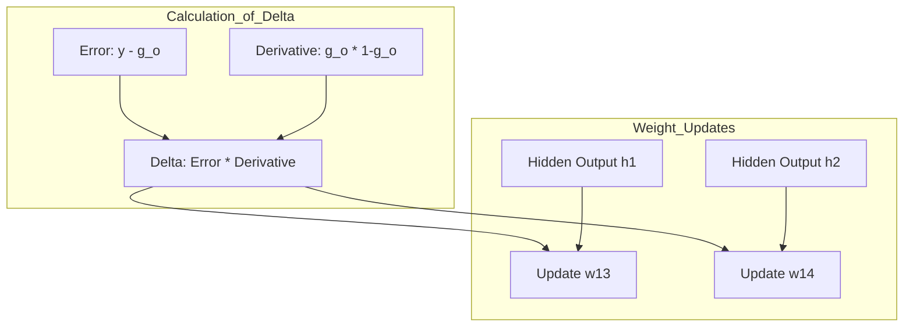
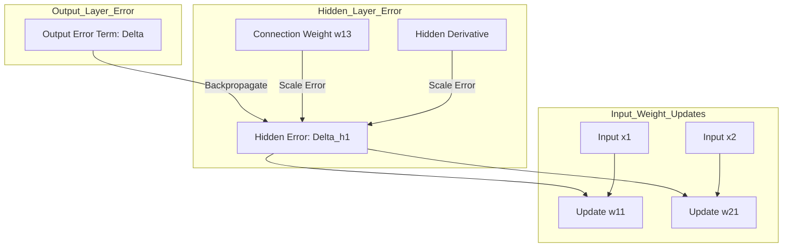
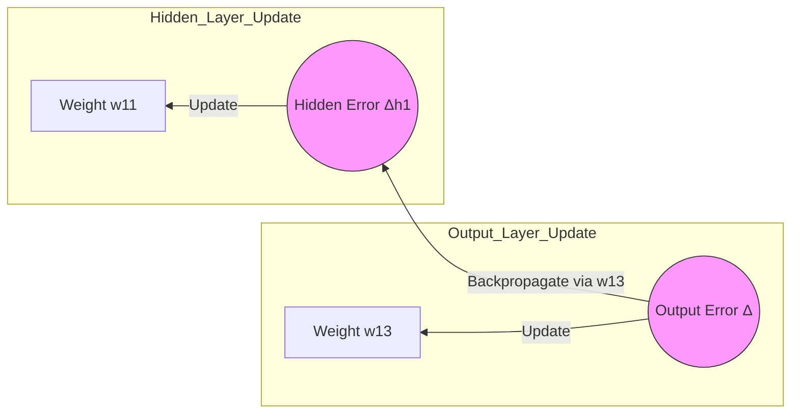

- [1 - Multi-Layer Perceptron (MLP) Architecture](#1---multi-layer-perceptron-mlp-architecture)
	- [1.1 - Structure of Feedforward Networks](#11---structure-of-feedforward-networks)
		- [Input, Hidden, and Output Layers](#input-hidden-and-output-layers)
		- [Connectivity Patterns](#connectivity-patterns)
	- [1.2 - The Forward Pass](#12---the-forward-pass)
		- [Calculating Hidden Unit Activations](#calculating-hidden-unit-activations)
		- [Example Computation: Single Neuron Output](#example-computation-single-neuron-output)
		- [Sequential Evaluation from Input to Output](#sequential-evaluation-from-input-to-output)
	- [1.3 - Representational Power](#13---representational-power)
		- [Solving Non-Linearly Separable Problems (XOR Example)](#solving-non-linearly-separable-problems-xor-example)
		- [Example Computation: XOR Decomposition](#example-computation-xor-decomposition)
		- [Universal Function Approximation Theorem](#universal-function-approximation-theorem)
		- [Creating Non-Linear Decision Boundaries (Ridges and Bumps)](#creating-non-linear-decision-boundaries-ridges-and-bumps)
- [2 - The Back-propagation Algorithm](#2---the-back-propagation-algorithm)
	- [2.1 - Defining Global Error for Multiple Outputs](#21---defining-global-error-for-multiple-outputs)
		- [Total Error Function Formulation](#total-error-function-formulation)
		- [Iterative Reduction of Error](#iterative-reduction-of-error)
	- [2.2 - Application of the Chain Rule](#22---application-of-the-chain-rule)
		- [Dependency of Error on Weights](#dependency-of-error-on-weights)
		- [Calculating Partial Derivatives](#calculating-partial-derivatives)
		- [Example Computation: Deriving Weight Updates](#example-computation-deriving-weight-updates)
	- [2.3 - Weight Updates for Output Layers](#23---weight-updates-for-output-layers)
		- [Calculating the Error Term (Δ)](#calculating-the-error-term-δ)
		- [Relation to the Generalised Delta Rule](#relation-to-the-generalised-delta-rule)
		- [Example Computation: Calculating Output Weight Updates](#example-computation-calculating-output-weight-updates)
	- [2.4 - Weight Updates for Hidden Layers](#24---weight-updates-for-hidden-layers)
		- [Propagating Error Backwards](#propagating-error-backwards)
		- [Summation of Weighted Errors from Subsequent Layers](#summation-of-weighted-errors-from-subsequent-layers)
		- [Example Computation: Deriving Input-to-Hidden Updates](#example-computation-deriving-input-to-hidden-updates)
	- [2.5 - Computational Example of a Back-propagation Step](#25---computational-example-of-a-back-propagation-step)
		- [Step-by-step Derivation for Hidden-to-Output Weights](#step-by-step-derivation-for-hidden-to-output-weights)
		- [Step-by-step Derivation for Input-to-Hidden Weights](#step-by-step-derivation-for-input-to-hidden-weights)

# 1 - Multi-Layer Perceptron (MLP) Architecture

## 1.1 - Structure of Feedforward Networks

A Multi-Layer Perceptron, typically referred to as an Artificial Neural Network (ANN), functions as a mathematical system capable of approximating values or vectors. This architecture is constructed from a densely interconnected set of simple processing elements called units.

### Input, Hidden, and Output Layers

The network possesses a specific layered structure. It is generally composed of three distinct types of layers:

* **Input layer:** Receives signals directly from the external environment.
* **Hidden layers:** Located between input and output layers; these units receive inputs only from other units and send outputs solely to other units.
* **Output layer:** Transmits the final processed signals back to the environment.

### Connectivity Patterns

In a feedforward network, information flows in a single direction. Each layer consists of units that receive input exclusively from the layer directly below them; they subsequently send their output to the units in the layer directly above. A defining characteristic of this architecture is that there are no connections existing between units within the same layer.

To visualise the flow of information in a dense network, consider the following structure:

## 1.2 - The Forward Pass

### Calculating Hidden Unit Activations

In a neural network, each processing unit (neuron) performs a specific calculation. It receives inputs from the previous layer, which are weighted according to their connection strength. The neuron first computes a "net input," which is the weighted sum of these inputs minus a threshold (or plus a bias). This net result is then passed through an activation function (or transfer function) to produce the neuron's final output. This output is often bounded; for example, between 0 and 1 or -1 and 1.

### Example Computation: Single Neuron Output

Let's examine a concrete example of calculating a neuron's output using a Heaviside (step) activation function.

* **Scenario:** A neuron has a transfer function that is a linear weighted sum of its inputs and an activation function that is the Heaviside function.
* **Weights ($w$):** $[0.1, -0.5, 0.4]$
* **Threshold ($\theta$):** 0
* **Input ($x_1$):** $[0.1, -0.5, 0.4]^T$

**Step-by-Step Calculation:**

1. **Calculate the Weighted Sum:** Multiply each input component by its corresponding weight and sum them up.
   $$s = (0.1 \times 0.1) + (-0.5 \times -0.5) + (0.4 \times 0.4)$$
   $$s = 0.01 + 0.25 + 0.16$$
   $$s = 0.42$$

2. **Apply Threshold:** Subtract the threshold from the sum.
   $$s - \theta = 0.42 - 0 = 0.42$$

3. **Apply Activation Function:** The Heaviside function $H(u)$ returns 1 if $u \geq 0$ and 0 otherwise. Since $0.42 \geq 0$, the output $y$ is 1.

### Sequential Evaluation from Input to Output

In a multi-layer network, this calculation process occurs sequentially layer by layer.

1. **Input to Hidden:** First, the hidden layer units calculate their activations based on the values from the input layer.
2. **Hidden to Output:** Once the hidden units have their outputs, these become the inputs for the next layer (often the output layer), which then performs the same calculation.

This sequential flow ensures that non-linear transformations are applied at each step, allowing the network to model complex relationships.

## 1.3 - Representational Power

### Solving Non-Linearly Separable Problems (XOR Example)

Single-layer networks have a fundamental limitation: they can only compute functions that are linearly separable. A classic example of a problem that cannot be solved by a single layer is the Exclusive-OR (XOR) function. In the XOR problem, the data points belonging to different classes are arranged such that no single straight line can separate them.

To solve this, we use a multi-layer network. We can decompose the non-linear XOR function into a combination of linear functions like AND, OR, and NOR. For example, the function $x_1 \text{ XOR } x_2$ can be rewritten as $(x_1 \text{ AND } x_2) \text{ NOR } (x_1 \text{ NOR } x_2)$. Each of these sub-functions is linearly separable and can be solved by a perceptron unit.

### Example Computation: XOR Decomposition

The following table demonstrates how the XOR output is derived by combining the outputs of intermediate hidden units (calculating AND and NOR).

* **Inputs:** $I_1, I_2$
* **Hidden Unit A:** computes $I_1 \text{ AND } I_2$
* **Hidden Unit B:** computes $I_1 \text{ NOR } I_2$
* **Output:** computes $A \text{ NOR } B$

| $I_1$ | $I_2$ | $A$ ($I_1 \text{ AND } I_2$) | $B$ ($I_1 \text{ NOR } I_2$) | Output ($A \text{ NOR } B$) |
| :---- | :---- | :--------------------------- | :--------------------------- | :-------------------------- |
| 0     | 0     | 0                            | 1                            | 0                           |
| 0     | 1     | 0                            | 0                            | 1                           |
| 1     | 0     | 0                            | 0                            | 1                           |
| 1     | 1     | 1                            | 0                            | 0                           |

This layered approach allows the network to correctly classify the inputs according to the XOR logic.

### Universal Function Approximation Theorem

A key concept in neural network theory is the Universal Function Approximation Theorem. It states that a feed-forward neural network with just a single hidden layer can approximate almost any continuous function, provided it has enough hidden units. This confirms that multi-layer networks are extremely powerful computational devices.

### Creating Non-Linear Decision Boundaries (Ridges and Bumps)

Multi-layer networks build complex decision surfaces by combining simpler shapes. Whilst a single unit creates a linear boundary, a hidden layer can combine two opposite-facing threshold functions to create a "ridge" in the decision surface. By combining two ridges, the network can create a "bump". This ability to construct ridges and bumps allows the network to model complex, non-linear functions.

-----

# 2 - The Back-propagation Algorithm

## 2.1 - Defining Global Error for Multiple Outputs

### Total Error Function Formulation

When a neural network has multiple output units, we calculate the error for the entire system. We do this by comparing the target values ($y$) against the actual outputs ($o$) for all output units. The total error ($E_{total}$) is the sum of the squared differences for every output unit $k$:

$$E_{total} = \frac{1}{2}\sum_{k}(y_{k} - o_{k})^{2}$$

### Iterative Reduction of Error

The main goal of training is to minimise this error function. We do this iteratively using a process called gradient descent. The weights are adjusted in steps to move down the error landscape towards a minimum value. Ideally, the error rate declines steadily throughout the training process.

## 2.2 - Application of the Chain Rule

### Dependency of Error on Weights

The network's error relies directly on the weights; these weights determine the final output values. To reduce this error, we must adjust the weights systematically. We calculate the gradient to identify the direction of the steepest increase in error. The negative of this gradient guides us on how to adjust the weights to decrease the error. We find this gradient by taking the derivative of the error function ($E$) with respect to each specific weight ($w$).

### Calculating Partial Derivatives

We apply the chain rule to compute these derivatives for multi-layer networks. This mathematical rule allows us to break down the complex dependency between the global error and a single weight into simpler, manageable components.

For a weight $w_{j,k}$ connecting a hidden unit $j$ to an output unit $k$, the chain rule expands the derivative into three parts:

$$\frac{\partial E}{\partial w_{j,k}} = \frac{\partial E}{\partial o_k} \frac{\partial o_k}{\partial s_k} \frac{\partial s_k}{\partial w_{j,k}}$$

This formula consists of three distinct interactions:

1. **$\frac{\partial E}{\partial o_k}$**: How the error changes as the output $o_k$ changes.
2. **$\frac{\partial o_k}{\partial s_k}$**: How the output $o_k$ changes as the net input sum $s_k$ changes (this uses the derivative of the activation function).
3. **$\frac{\partial s_k}{\partial w_{j,k}}$**: How the net input sum $s_k$ changes as the weight $w_{j,k}$ changes.

The relationships defined by the chain rule can be visualized as follows:

### Example Computation: Deriving Weight Updates

To understand this practically, consider a specific neural network structure. We will derive the update rules for the weights connecting the hidden layer to the output layer.

* **Scenario:** We have a network with two inputs ($x_{1}, x_{2}$), two hidden units ($h_{1}, h_{2}$), and a single output unit ($o$).
* **Weights:** The weights connecting the hidden units to the output are labelled $w_{13}$ and $w_{14}$.
* **Target:** The target value for the training example is $y$.
* **Activation Function:** We use the sigmoid function $g(\cdot)$.

**Step-by-Step Derivation:**

1. **Define the Error:**
   We define the error based on the difference between the target $y$ and the actual output $g(o)$:
   $$Error = y - g(o)$$

2. **Calculate the Delta ($\Delta$):**
   We combine the derivative of the error and the derivative of the sigmoid activation function. The derivative of the sigmoid $g(o)$ is $g(o)(1 - g(o))$. This gives us the error gradient term $\Delta$:
   $$\Delta = (y - g(o))g(o)(1 - g(o))$$

3. **Determine Weight Update Rule (Output Layer):**
   To update the weight $w_{13}$ (which connects hidden unit $h_1$ to the output), we multiply the learning rate $\alpha$, the calculated $\Delta$, and the input from that specific hidden unit ($g(h_1)$):
   $$w_{13} \leftarrow w_{13} + \alpha \Delta g(h_{1})$$

   Similarly, for weight $w_{14}$ connecting $h_2$ to the output:
   $$w_{14} \leftarrow w_{14} + \alpha \Delta g(h_{2})$$

4. **Determine Bias Update Rule:**
   We also must update the bias weight for the output unit ($w_o$). The input for a bias is effectively 1:
   $$w_{o} \leftarrow w_{o} + \alpha \Delta 1$$

This computation demonstrates how the chain rule allows us to propagate the error term $\Delta$ back to specific weights to perform precise updates.

## 2.3 - Weight Updates for Output Layers

### Calculating the Error Term (Δ)

To update the weights connecting the hidden layer to the output layer, we first calculate a "modified error" term, often denoted as $\Delta$. This term represents the product of the error at the output and the derivative of the activation function. For a network using the sigmoid function, where the target is $y$ and the actual output is $g(s)$, the modified error is calculated as:

$$\Delta = g(s)(1 - g(s))(y - g(s))$$

Once $\Delta$ is known, the rule for updating a weight $w_j$ connected to a hidden unit $h_j$ is straightforward:

$$w_j \leftarrow w_j + \alpha h_j \Delta$$

### Relation to the Generalised Delta Rule

This update method is directly related to the Generalised Delta Rule used for single-layer networks. In that context, we updated weights based on the difference between the target and the output, scaled by the derivative of the transfer function. The backpropagation update for the output layer is essentially the same rule, simply applying the logic to the weights coming from the hidden layer rather than direct inputs.

### Example Computation: Calculating Output Weight Updates

Using the specific network structure defined in section 2.2, let's calculate the specific updates for the output weights $w_{13}$ and $w_{14}$.

* **Inputs:** Hidden unit outputs $h_1$ and $h_2$.
* **Target:** $y$
* **Actual Output:** $g(o)$, where $g$ is the sigmoid function.

**Step-by-Step Update:**

1. **Calculate $\Delta$:**
   First, compute the modified error term using the sigmoid derivative.
   $$\Delta = (y - g(o))g(o)(1 - g(o))$$

2. **Update Weight $w_{13}$:**
   This weight connects the top hidden unit ($h_1$) to the output. We use the output of $h_1$ as the input signal.
   $$w_{13} \leftarrow w_{13} + \alpha \Delta g(h_{1})$$

3. **Update Weight $w_{14}$:**
   This weight connects the bottom hidden unit ($h_2$) to the output.
   $$w_{14} \leftarrow w_{14} + \alpha \Delta g(h_{2})$$

4. **Update Bias $w_o$:**
   The bias unit has a constant input of 1.
   $$w_{o} \leftarrow w_{o} + \alpha \Delta$$

<!-- end list -->

## 2.4 - Weight Updates for Hidden Layers

### Propagating Error Backwards

Hidden units present a challenge because we do not have a target value for them; we do not know what their output should be. To solve this, we assign blame for the error. A hidden unit $h_j$ is responsible for a fraction of the error $\Delta$ in every output node it connects to. Therefore, we propagate the error terms backwards from the output layer to the hidden layer. This process uses the weights connecting the layers to determine how much error to attribute to each hidden unit.

### Summation of Weighted Errors from Subsequent Layers

To calculate the specific error term ($\Delta_j$) for a hidden unit, we must look at all the connections leaving that unit. If the network has multiple outputs, the hidden unit contributes to the error at each output. We calculate the total error contribution by summing up the errors from the next layer ($\delta_{k}$), weighted by the connection strengths ($w_{j,k}$).

We then multiply this weighted sum by the derivative of the activation function at the hidden unit. For a sigmoid unit, the update term $\Delta_j$ is calculated as:

$$\Delta_j = g(s_j)(1 - g(s_j)) \sum_{k} (w_{j,k} \Delta_k)$$

Once we have $\Delta_j$, we update the weights connecting the input layer to this hidden unit ($w_{i,j}$) using the same learning rule structure:

$$w_{i,j} \leftarrow w_{i,j} + \alpha x_i \Delta_j$$

### Example Computation: Deriving Input-to-Hidden Updates

Continuing with the specific network structure defined in section 2.2, we will now derive the updates for the weights connecting the inputs to the first hidden unit $h_1$.

* **Target Weights:** $w_{11}$ (connecting $x_1$ to $h_1$) and $w_{21}$ (connecting $x_2$ to $h_1$).
* **Known Values:**
  * $\Delta$: The error term calculated for the output unit (from section 2.3).
  * $w_{13}$: The weight connecting hidden unit $h_1$ to the output $o$.
  * $g(h_1)$: The output of the hidden unit.

**Step-by-Step Derivation:**

1. **Calculate Hidden Error Term ($\Delta_{h1}$):**
   We determine how much $h_1$ contributed to the output error. We take the output error $\Delta$, multiply it by the weight connecting them ($w_{13}$), and then multiply by the derivative of the activation function for $h_1$.
   $$\Delta_{h1} = g(h_1)(1 - g(h_1)) w_{13} \Delta$$

2. **Update Weight $w_{11}$:**
   This weight connects input $x_1$ to hidden unit $h_1$. We update it using the input $x_1$ and the hidden error term $\Delta_{h1}$.
   $$w_{11} \leftarrow w_{11} + \alpha \Delta_{h1} x_1$$

3. **Update Weight $w_{21}$:**
   This weight connects input $x_2$ to hidden unit $h_1$. We update it using the input $x_2$.
   $$w_{21} \leftarrow w_{21} + \alpha \Delta_{h1} x_2$$

4. **Update Bias $w_{h1}$:**
   The bias weight for the hidden unit is updated similarly, using an input of 1.
   $$w_{h1} \leftarrow w_{h1} + \alpha \Delta_{h1} 1$$

<!-- end list -->

## 2.5 - Computational Example of a Back-propagation Step

### Step-by-step Derivation for Hidden-to-Output Weights

To see back-propagation in action, we derive the specific update rules for a network with two inputs ($x_1, x_2$), two hidden units ($h_1, h_2$), and one output unit ($o$) with target $y$. We assume a sigmoid activation function $g(\cdot)$.

1. **Calculate Output Error Gradient ($\Delta$):**
   First, we determine the error term for the output unit. This is the difference between the target and the actual output, multiplied by the derivative of the sigmoid function (which is $g(o)(1-g(o))$).
   $$\Delta = (y - g(o))g(o)(1 - g(o))$$

2. **Update Hidden-to-Output Weights:**
   The weight $w_{13}$ connects the first hidden unit $h_1$ to the output $o$. To update it, we use the learning rate $\alpha$, the error term $\Delta$, and the activation of the hidden unit $g(h_1)$.
   $$w_{13} \leftarrow w_{13} + \alpha \Delta g(h_1)$$

   Similarly, for the weight $w_{14}$ connecting $h_2$ to the output:
   $$w_{14} \leftarrow w_{14} + \alpha \Delta g(h_2)$$

3. **Update Output Bias:**
   The bias weight $w_o$ for the output unit is updated using the same error term $\Delta$, assuming an input of 1.
   $$w_{o} \leftarrow w_{o} + \alpha \Delta$$

### Step-by-step Derivation for Input-to-Hidden Weights

Next, we propagate the error backwards to update the weights connecting the inputs to the hidden layer.

1. **Calculate Hidden Error Gradient ($\Delta_{h1}$):**
   We calculate the error term for the first hidden unit $h_1$. This depends on the error at the output ($\Delta$) weighted by the connection strength ($w_{13}$), multiplied by the derivative of the activation function at $h_1$.
   $$\Delta_{h1} = g(h_1)(1 - g(h_1)) w_{13} \Delta$$

2. **Update Input-to-Hidden Weights:**
   Now we can update the weights feeding into $h_1$. For weight $w_{11}$ (from input $x_1$):
   $$w_{11} \leftarrow w_{11} + \alpha \Delta_{h1} x_1$$

   For weight $w_{21}$ (from input $x_2$):
   $$w_{21} \leftarrow w_{21} + \alpha \Delta_{h1} x_2$$

3. **Update Hidden Bias:**
   Finally, we update the bias weight $w_{h1}$ for the hidden unit.
   $$w_{h1} \leftarrow w_{h1} + \alpha \Delta_{h1}$$

<!-- end list -->

