- [1 - Foundations of Neural Elements](#1---foundations-of-neural-elements)
  - [1.1 - The Biological Inspiration and Artificial Model](#11---the-biological-inspiration-and-artificial-model)
  - [1.2 - Mathematical Definition of a Neuron](#12---mathematical-definition-of-a-neuron)
  - [1.3 - Activation and Transfer Functions](#13---activation-and-transfer-functions)
- [2 - Linear Discriminant Functions and Decision Boundaries](#2---linear-discriminant-functions-and-decision-boundaries)
  - [2.1 - Defining the Discriminant Function](#21---defining-the-discriminant-function)
  - [2.2 - Geometry of Decision Boundaries (Hyperplanes)](#22---geometry-of-decision-boundaries-hyperplanes)
  - [2.3 - Augmented Vector Notation](#23---augmented-vector-notation)
  - [2.4 - Linearly Separable vs. Non-Linearly Separable Data (The XOR Problem)](#24---linearly-separable-vs-non-linearly-separable-data-the-xor-problem)
- [3 - The Perceptron Learning Algorithm](#3---the-perceptron-learning-algorithm)
  - [3.1 - The Error Correction Method (Intuition)](#31---the-error-correction-method-intuition)
  - [3.2 - Perceptron Criterion Function](#32---perceptron-criterion-function)
  - [3.3 - Batch Perceptron Learning](#33---batch-perceptron-learning)
  - [3.4 - Sequential (Online) Perceptron Learning](#34---sequential-online-perceptron-learning)
  - [3.5 - Computational Examples of Perceptron Updates](#35---computational-examples-of-perceptron-updates)
- [4 - Gradient Descent and the Delta Rule](#4---gradient-descent-and-the-delta-rule)
  - [4.1 - The Cost Function (Squared Error)](#41---the-cost-function-squared-error)
  - [4.2 - The Concept of the Error Surface and Gradient Descent](#42---the-concept-of-the-error-surface-and-gradient-descent)
  - [4.3 - Derivation of the Standard Delta Rule (LMS for Linear Units)](#43---derivation-of-the-standard-delta-rule-lms-for-linear-units)
  - [4.4 - The Generalised Delta Rule (For Non-Linear or Sigmoidal Units)](#44---the-generalised-delta-rule-for-non-linear-or-sigmoidal-units)
  - [4.5 - Batch Gradient Descent vs. Stochastic Gradient Descent (SGD)](#45---batch-gradient-descent-vs-stochastic-gradient-descent-sgd)
  - [4.6 - Computational Examples of Delta Rule Updates](#46---computational-examples-of-delta-rule-updates)
- [5 - Minimum Squared Error (MSE) Procedures](#5---minimum-squared-error-mse-procedures)
  - [5.1 - Solving Linear Equations vs. Linear Inequalities](#51---solving-linear-equations-vs-linear-inequalities)
  - [5.2 - The Pseudo-Inverse Solution (Closed Form)](#52---the-pseudo-inverse-solution-closed-form)
  - [5.3 - The Widrow-Hoff (LMS) Algorithm](#53---the-widrow-hoff-lms-algorithm)
- [6 - Optimisation and Generalisation in Learning](#6---optimisation-and-generalisation-in-learning)
  - [6.1 - The Problem of Local Minima](#61---the-problem-of-local-minima)
  - [6.2 - Momentum](#62---momentum)
  - [6.3 - Generalisation, Overfitting, and Underfitting](#63---generalisation-overfitting-and-underfitting)
  - [6.4 - Regularisation Techniques (Validation Sets, Early Stopping)](#64---regularisation-techniques-validation-sets-early-stopping)
  - [6.5 - Introduction to Multi-Layer Networks and Backpropagation (Brief Overview)](#65---introduction-to-multi-layer-networks-and-backpropagation-brief-overview)


# 1 - Foundations of Neural Elements

## 1.1 - The Biological Inspiration and Artificial Model

Artificial Neural Networks (ANNs) are parallel architectures composed of many simple processing elements interconnected to achieve collective computational capabilities. They are inspired by the biological structure of the brain. The human brain is a highly complex, non-linear, and parallel computer composed of approximately 85 billion processing units called neurons. To understand artificial networks, we must first define the biological components that they attempt to simulate.

**Biological Components**

A biological neuron is defined as an information processing unit. It typically consists of four main functional parts:

  * **Dendrites:** These are branching structures that act as the input receivers; they transmit signals from other neurons to the cell body.
  * **Soma (Cell Body):** This is the central part of the cell; it integrates (sums up) the incoming signals from the dendrites.
  * **Axon:** This is a long fibre that acts as the transmission line; it carries the signal away from the cell body to other neurons.
  * **Synapses:** These are the connections between two neurons (specifically between the axon of one neuron and the dendrites of another).


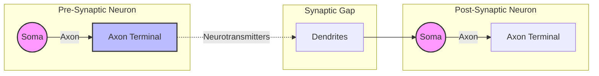

**Signal Transmission and Learning**

Neurons communicate via signals called action potentials. An action potential is the signal outputted by a biological neuron, often described as an electrical impulse or "spike".

The soma integrates inputs from various synapses. Reaching the threshold to fire an action potential involves two mechanisms:

  * **Spatial Summation:** Simultaneous stimulation from a large number of synapses.
  * **Temporal Summation:** Repetitive stimulation of the same synapses.

If the total input exceeds the threshold, the neuron "fires" and sends an action potential down its axon. The frequency of these spikes is called the firing rate (the number of action potentials emitted during a defined time-period).

Crucially, the connection strength at a synapse is not fixed. Synapses can be:

  * **Excitatory:** They increase the likelihood that the receiving neuron will fire (e.g., glutamate).
  * **Inhibitory:** They decrease the likelihood that the receiving neuron will fire (e.g., GABA).

Learning in a biological brain involves synaptic plasticity. This is the ability of the nervous system to adapt by changing the strength (weight) of synapses or creating new connections over time. The scale of this network is immense; a human brain contains approximately $10^{14}$ synapses.

**The Artificial Model**

An Artificial Neural Network is a simplified model of this biological system. We map biological features to mathematical concepts in the following way:

  * **Biological Neuron $\rightarrow$ Artificial Node (Unit):** The core calculation unit.
  * **Synapse $\rightarrow$ Weight ($w$):** Represents the strength of the connection. A positive weight represents an excitatory connection; a negative weight represents an inhibitory connection.
  * **Firing Rate $\rightarrow$ Activation Output ($y$):** The numeric result produced by the node.

**Biological Metaphor**

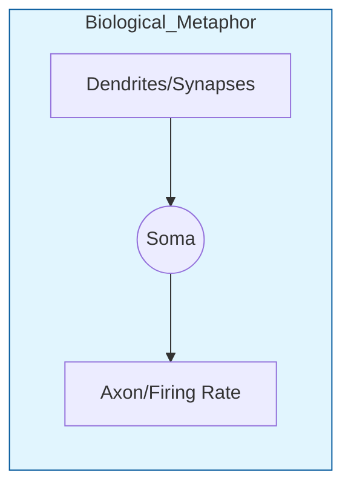

**Mathematical Model**

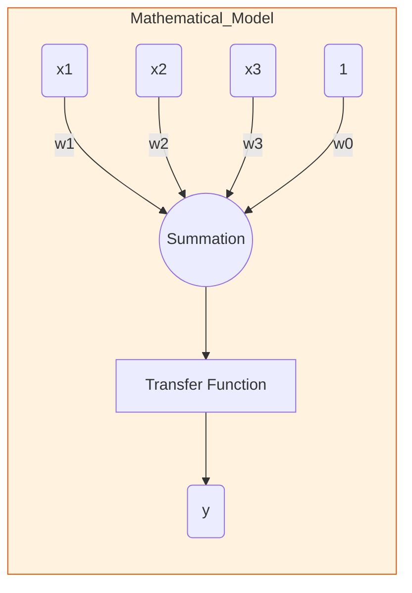

In the artificial model, the processing unit computes a weighted sum of its inputs (simulating the soma's spatial and temporal integration) and passes this sum through a transfer function to produce an output.


## 1.2 - Mathematical Definition of a Neuron

The fundamental building block of an artificial neural network is the artificial neuron (or node). Mathematically, we define its operation by examining its inputs, weights, and the method used to combine them.

**Inputs, Weights, and Biases**

An artificial neuron receives a set of inputs, denoted as a vector $x = [x_1, x_2, ..., x_n]^T$. These inputs correspond to the signals received from dendrites in a biological neuron.

Each input $x_i$ is associated with a specific weight, $w_i$. The weight determines the strength and nature of the connection:

  * A positive weight acts as an excitatory synapse (increasing the output).
  * A negative weight acts as an inhibitory synapse (decreasing the output).

In addition to the input weights, a neuron often includes a bias term ($w_0$ or sometimes denoted as $-\theta$, where $\theta$ is a threshold). The bias allows the neuron to shift its activation function; mathematically, this is handled by adding a constant input $x_0 = 1$ with an associated weight $w_0$.

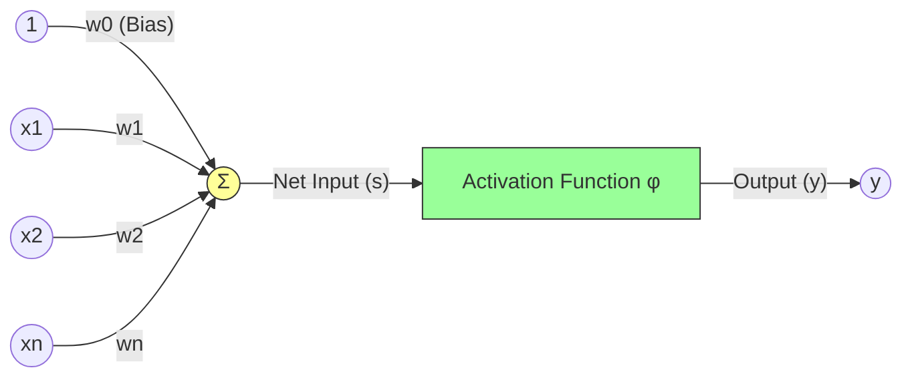

**The Net Input Calculation (Dot Product)**

The core computation performed by the neuron is the weighted sum of its inputs. This is often referred to as the transfer function or the net input. It represents the integration of signals in the cell body (soma).

Mathematically, the net input $s$ (or sometimes labelled as $u$ or $net$) is the dot product of the weight vector $w$ and the input vector $x$:

$$s = \sum_{i=0}^{n} w_i x_i$$

Using vector notation (where $w$ and $x$ are column vectors), this is written as:

$$s = w^T x$$

Note that this sum includes the bias term $w_0 x_0$ (where $x_0=1$).

**Computational Example**

Let's look at a practical example of calculating the output of a neuron.

**Question:**
A neuron has a transfer function which is a linear weighted sum of its inputs. The weights are $w = [0.1, -0.5, 0.4]$ and the threshold is zero. What is the output of this neuron when the inputs are:

1.  $x_1 = [0.1, -0.5, 0.4]^T$
2.  $x_2 = [0.1, 0.5, 0.4]^T$

**Step-by-Step Calculation:**

The output of the neuron is determined by the linear weighted sum $s = w \cdot x$.

**1. For input $x_1 = [0.1, -0.5, 0.4]^T$**

We calculate the dot product of the weight vector $w$ and the input vector $x_1$.

$$s_1 = w \cdot x_1 = (0.1 \times 0.1) + (-0.5 \times -0.5) + (0.4 \times 0.4)$$

Multiply the corresponding elements:

  * $0.1 \times 0.1 = 0.01$
  * $-0.5 \times -0.5 = 0.25$
  * $0.4 \times 0.4 = 0.16$

Sum the results:
$$s_1 = 0.01 + 0.25 + 0.16 = 0.42$$

**Result:** The net input is 0.42.

**2. For input $x_2 = [0.1, 0.5, 0.4]^T$**

We calculate the dot product of the weight vector $w$ and the input vector $x_2$.

$$s_2 = w \cdot x_2 = (0.1 \times 0.1) + (-0.5 \times 0.5) + (0.4 \times 0.4)$$

Multiply the corresponding elements:

  * $0.1 \times 0.1 = 0.01$
  * $-0.5 \times 0.5 = -0.25$
  * $0.4 \times 0.4 = 0.16$

Sum the results:
$$s_2 = 0.01 - 0.25 + 0.16 = -0.08$$

**Result:** The net input is -0.08.

## 1.3 - Activation and Transfer Functions

In the artificial neuron model, the processing of information is often conceptually split into two stages:

1.  **Transfer Function:** This calculates the net input, typically via the linear weighted sum (as defined in Section 1.2).
2.  **Activation Function:** This defines the output of the neuron based on the net input. It introduces non-linearity, allowing the network to learn complex patterns.

$$y_j = \phi(s_j) = \phi\left(\sum_{i=0}^{n} w_{ji}x_i\right)$$

where $s_j$ is the net input and $\phi$ is the activation function.

**Linear Functions**

The simplest activation function is the linear function (or identity function).

  * **Equation:** $g(s) = s$
  * **Description:** The output is simply the weighted sum of the inputs.
  * **Use Case:** Often used in the input layer (passing data through) or the output layer of networks predicting continuous values (regression). However, a network composed entirely of linear units, no matter how deep, can only compute linear functions.

**Threshold Functions**

Threshold functions are used to produce binary outputs, acting as classifiers. They "fire" only when the input exceeds a certain limit.

**Heaviside (Step) Function**

This function produces a binary output of 0 or 1.


**Equation:**

$$
g(s) = \begin{cases}
1 & \text{if } s \ge 0 \\
0 & \text{if } s < 0
\end{cases}
$$

(Note: The threshold can be shifted by the bias term).

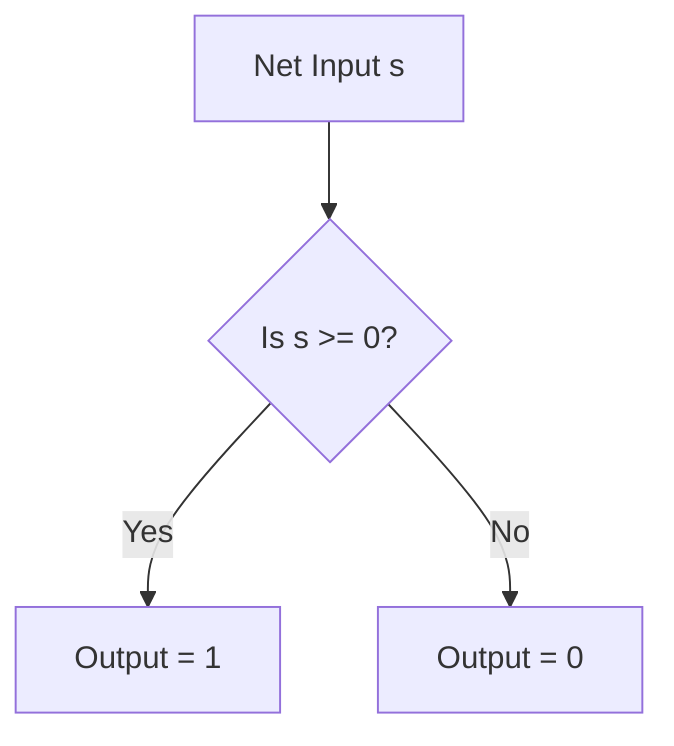

**Sign Function**

This function produces a binary output of -1 or 1.


**Equation:**

$$
g(s) = \begin{cases}
1 & \text{if } s > 0 \\
-1 & \text{if } s < 0
\end{cases}
$$

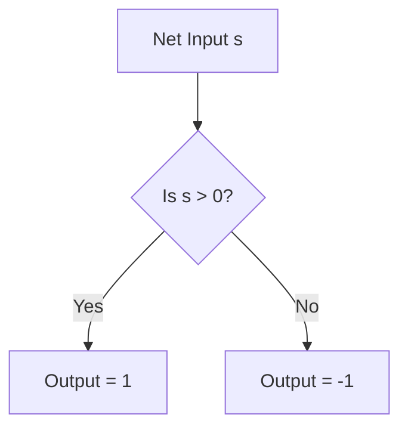

**Differentiable Non-Linear Functions**

For modern learning algorithms (like Backpropagation) that rely on gradient descent, the activation function must be differentiable (unlike the step function).

**Sigmoid (Logistic) Function**

A smooth, "S"-shaped curve that squashes the input into a range between 0 and 1. It mimics the firing saturation of biological neurons.

  * **Equation:** $g(s) = \frac{1}{1 + e^{-s}}$
  * **Output Range:** $(0, 1)$


**Hyperbolic Tangent (Tanh)**

Similar to the sigmoid but centred at zero.

  * **Equation:** $g(s) = \tanh(s) = \frac{e^s - e^{-s}}{e^s + e^{-s}}$
  * **Output Range:** $(-1, 1)$


**S-Shaped Differentiable Functions**

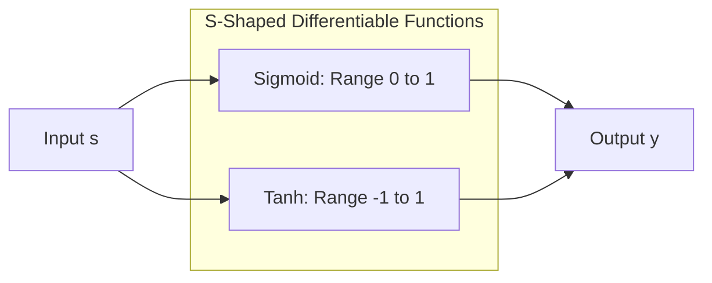

**ReLU (Rectified Linear Unit)**

Currently the most popular activation function for deep neural networks. It is linear for positive values and zero for negative values. It is computationally efficient and helps mitigate the "vanishing gradient" problem during training.

  * **Equation:** $g(s) = \max(0, s)$

<!-- end list -->

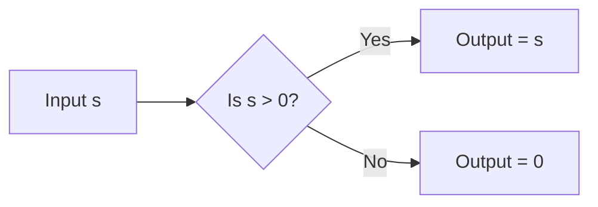

**Computational Example: Heaviside Function**

Let's revisit the previous example and apply the Heaviside step function as the activation function.

**Question:**
Using the net inputs calculated in the previous section for $x_1$ and $x_2$, determine the final output $y$ if the activation function is the Heaviside function $H(s)$.
Recall that $s_1 = 0.42$ and $s_2 = -0.08$.

**Step-by-Step Calculation:**

The Heaviside function outputs 1 if $s \ge 0$ and 0 otherwise.

**1. For input $x_1$:**
The net input was $s_1 = 0.42$.
Since $0.42 \ge 0$, the condition is met.
$$y_1 = H(0.42) = 1$$

**2. For input $x_2$:**
The net input was $s_2 = -0.08$.
Since $-0.08 < 0$, the condition is not met.
$$y_2 = H(-0.08) = 0$$

**Result:**
The neuron "fires" (outputs 1) for the first input vector and remains inactive (outputs 0) for the second.

# 2 - Linear Discriminant Functions and Decision Boundaries

## 2.1 - Defining the Discriminant Function

A discriminant function is a mathematical function used to classify patterns. It takes an input vector $x$ and produces an output that helps assign the input to a specific category. In pattern recognition, these classifiers are often called "Linear Machines" or "Linear Discriminant Functions".

**The Linear Equation**

The most common form of a discriminant function is a linear combination of the inputs components. We define the function $g(x)$ as:

$$g(x) = w^T x + w_0$$

Where:

  * $x$ is the input vector (the data point).
  * $w$ is the weight vector (defining the orientation of the boundary).
  * $w_0$ is the bias or threshold weight (defining the position of the boundary).

This equation is essentially the same as the "net input" calculation in a neuron.

**Classification Rule (Two-Category Case)**

For a problem with two classes (a dichotomizer), we use the following rule to classify an input $x$:

  * **Decide Class 1 ($C_1$)** if $g(x) > 0$
  * **Decide Class 2 ($C_2$)** if $g(x) < 0$
  * **Indeterminate (Decision Boundary)** if $g(x) = 0$

Thus, $g(x) = 0$ defines the decision surface (or decision boundary) that separates the two classes.

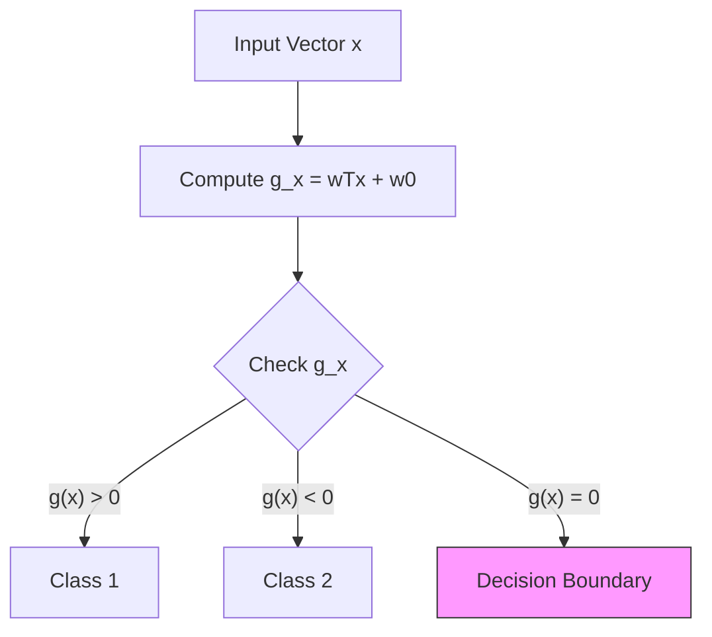

**Computational Example: Classifying a Point**

Let's determining the class of specific feature vectors using a defined linear discriminant function.

**Question:**
Consider a dichotomizer defined using the linear discriminant function $g(x) = w^T x + w_0$, where $w = \begin{pmatrix} 2 \\ 1 \end{pmatrix}$ and $w_0 = -5$.
Determine the class of the following feature vectors:
$x_1 = \begin{pmatrix} 1 \\ 1 \end{pmatrix}$, $x_2 = \begin{pmatrix} 2 \\ 2 \end{pmatrix}$, $x_3 = \begin{pmatrix} 3 \\ 3 \end{pmatrix}$.

**Step-by-Step Calculation:**

We calculate $g(x) = w \cdot x + w_0$ for each vector. We assign Class 1 if the result is positive ($>0$) and Class 2 if it is negative ($<0$).

**1. For $x_1 = (1, 1)^T$:**
$$g(x_1) = (2 \times 1) + (1 \times 1) - 5$$
$$g(x_1) = 2 + 1 - 5 = -2$$
Since $-2 < 0$, $x_1$ is assigned to **Class 2**.

**2. For $x_2 = (2, 2)^T$:**
$$g(x_2) = (2 \times 2) + (1 \times 2) - 5$$
$$g(x_2) = 4 + 2 - 5 = 1$$
Since $1 > 0$, $x_2$ is assigned to **Class 1**.

**3. For $x_3 = (3, 3)^T$:**
$$g(x_3) = (2 \times 3) + (1 \times 3) - 5$$
$$g(x_3) = 6 + 3 - 5 = 4$$
Since $4 > 0$, $x_3$ is assigned to **Class 1**.

## 2.2 - Geometry of Decision Boundaries (Hyperplanes)

A linear discriminant function divides the feature space into two regions. The boundary between these regions is called the **decision boundary** or **decision surface**. This is defined by the equation:

$$g(x) = 0$$

**The Hyperplane**

The geometric shape of this boundary depends on the dimensionality of the input data ($d$):

  * **1D Space ($d=1$):** The boundary is a **point**.
  * **2D Space ($d=2$):** The boundary is a **line**.
  * **3D Space ($d=3$):** The boundary is a **plane**.
  * **Higher Dimensions ($d>3$):** The boundary is called a **hyperplane**.

A hyperplane is a "flat" surface with dimensionality $d-1$ in a $d$-dimensional space.

**Geometric\_Interpretation**

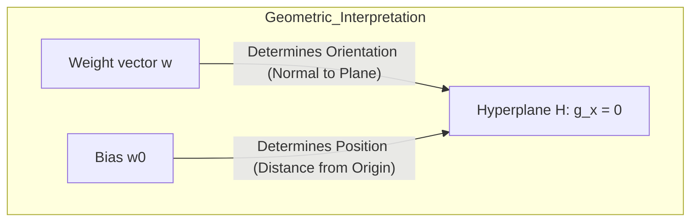

**Orientation and Position**

The weight vector $w$ and the bias $w_0$ determine the geometry of the hyperplane:

1.  **Orientation:** The weight vector $w$ is always **normal** (perpendicular) to the decision hyperplane. It points into the region where $g(x) > 0$ (Class 1).
2.  **Position:** The bias term $w_0$ determines the location of the hyperplane relative to the origin.
      * If $w_0 = 0$, the hyperplane passes directly through the origin.
      * If $w_0 \neq 0$, the hyperplane is shifted away from the origin.

<!-- end list -->

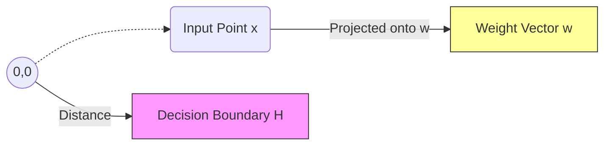

**Algebraic Distance**

We can calculate the distance ($r$) from any input point $x$ to the decision hyperplane. This is useful for understanding how "confident" a classification is (points further from the boundary are usually classified with higher confidence).

The distance is calculated as:

$$r = \frac{g(x)}{||w||}$$

Where $||w||$ is the magnitude (Euclidean length) of the weight vector.

  * If $r$ is positive, the point is on the positive side ($R_1$).
  * If $r$ is negative, the point is on the negative side ($R_2$).


**Computational Example: Plotting the Decision Boundary**

Let's visualize the decision boundary for the function we analyzed in Section 2.1.

**Question:**
For the discriminant function $g(x) = 2x_1 + x_2 - 5$, determine the equation of the decision boundary line and find its intercepts on the axes.

**Step-by-Step Calculation:**

1.  **Define the Boundary Equation:**
    The decision boundary occurs where $g(x) = 0$.
    $$2x_1 + x_2 - 5 = 0$$

2.  **Rearrange into Line Equation ($x_2 = mx_1 + c$):**
    $$x_2 = -2x_1 + 5$$
    This is a straight line with a slope of -2 and an intercept of 5.

3.  **Find the $x_2$ intercept:**
    Set $x_1 = 0$:
    $$x_2 = -2(0) + 5 = 5$$
    Intercept point: $(0, 5)$.

4.  **Find the $x_1$ intercept:**
    Set $x_2 = 0$:
    $$0 = -2x_1 + 5$$
    $$2x_1 = 5$$
    $$x_1 = 2.5$$
    Intercept point: $(2.5, 0)$.

**Result:**
The decision boundary is a line passing through $(0, 5)$ and $(2.5, 0)$. Any point on one side (like $(2,2)$) is Class 1, and any point on the other (like $(1,1)$) is Class 2.

## 2.3 - Augmented Vector Notation

To simplify mathematical operations and algorithms, we often combine the bias term $w_0$ with the weight vector $w$. This is called **augmented vector notation**.

**The Process**

We transform the original $d$-dimensional vectors into $(d+1)$-dimensional vectors:

1.  **Augment the Input Vector:** We add a component with the value of $1$ to the input vector $x$. This is typically added as the first element ($x_0$).
      * New vector $y = [1, x_1, x_2, ..., x_d]^T$.
2.  **Augment the Weight Vector:** We add the bias $w_0$ to the weight vector $w$. This corresponds to the new input component $x_0$.
      * New vector $a = [w_0, w_1, w_2, ..., w_d]^T$.

<!-- end list -->

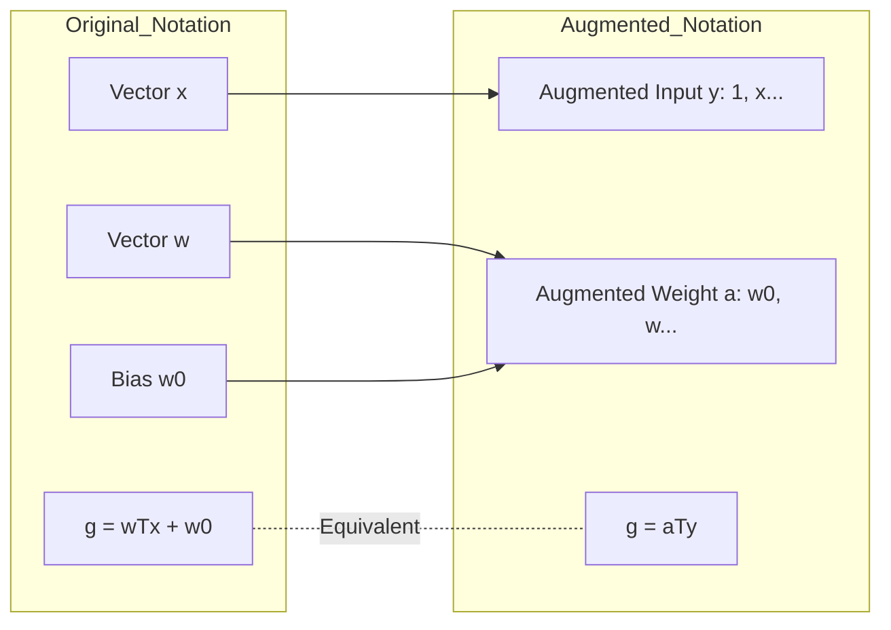

**The Simplified Equation**

Using these augmented vectors, the discriminant function becomes a simple dot product:

$$g(x) = a^T y$$

This is mathematically equivalent to the original equation $g(x) = w^T x + w_0$.

**Benefits**

  * **Simplification:** We no longer need to track the bias separately.
  * **Geometry:** In the augmented space (which has one higher dimension), the decision hyperplane always passes through the origin. This makes deriving learning algorithms simpler.

**Computational Example: Augmented Calculation**

Let's repeat our classification task using augmented vectors.

**Question:**
In augmented feature space, a dichotomizer is defined using the linear discriminant function $g(x) = a^T y$ where $a^T = (-5, 2, 1)$ and $y = \begin{pmatrix} 1 \\ x \end{pmatrix}$. Determine the class of the feature vectors $x_1 = (1, 1)^T$, $x_2 = (2, 2)^T$, and $x_3 = (3, 3)^T$.

**Step-by-Step Calculation:**

We calculate the dot product $a^T y$ for each vector. The augmented weight vector $a = (-5, 2, 1)^T$ corresponds to $w_0 = -5$ and $w = (2, 1)^T$.

**1. For $x_1 = (1, 1)^T$:**
Augmented input $y_1 = (1, 1, 1)^T$.
$$g(x_1) = a^T y_1 = (-5 \times 1) + (2 \times 1) + (1 \times 1)$$
$$g(x_1) = -5 + 2 + 1 = -2$$
Result: $-2 \le 0 \rightarrow$ **Class 2**.

**2. For $x_2 = (2, 2)^T$:**
Augmented input $y_2 = (1, 2, 2)^T$.
$$g(x_2) = a^T y_2 = (-5 \times 1) + (2 \times 2) + (1 \times 2)$$
$$g(x_2) = -5 + 4 + 2 = 1$$
Result: $1 > 0 \rightarrow$ **Class 1**.

**3. For $x_3 = (3, 3)^T$:**
Augmented input $y_3 = (1, 3, 3)^T$.
$$g(x_3) = a^T y_3 = (-5 \times 1) + (2 \times 3) + (1 \times 3)$$
$$g(x_3) = -5 + 6 + 3 = 4$$
Result: $4 > 0 \rightarrow$ **Class 1**.

## 2.4 - Linearly Separable vs. Non-Linearly Separable Data (The XOR Problem)

A **Linearly Separable** problem is one where a single straight line (or hyperplane) can separate the classes without any error.

Single-layer neural networks (Perceptrons) can only solve linearly separable problems.

**Logical Examples**

The standard logical operators **AND** and **OR** are linearly separable. We can plot their inputs (0 and 1) on a graph and draw a straight line to separate the "True" outcomes from the "False" outcomes.

[slides03\_neural\_networks.pdf: page 13: Plot showing linear separability of AND/OR vs XOR]

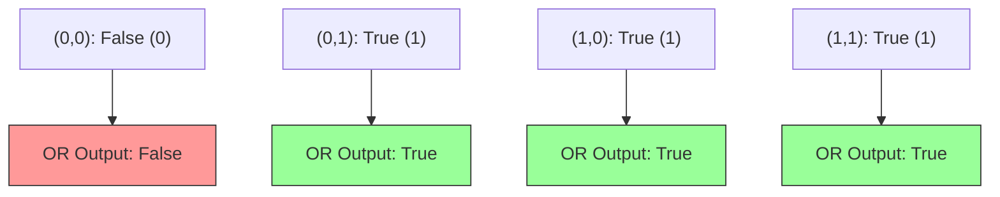

**The XOR Problem (Exclusive OR)**

The **XOR** function outputs 1 (True) only if the inputs are different. If the inputs are the same, it outputs 0 (False).

**XOR Truth Table**

| Input $x_1$ | Input $x_2$ | Output (Target) |
| :---------- | :---------- | :-------------- |
| 0           | 0           | 0               |
| 0           | 1           | 1               |
| 1           | 0           | 1               |
| 1           | 1           | 0               |

**Geometric Impossibility**

If we plot these four points on a 2D graph:

  * Points $(0,0)$ and $(1,1)$ belong to Class 0.
  * Points $(0,1)$ and $(1,0)$ belong to Class 1.

It is impossible to draw a single straight line that separates Class 0 from Class 1. The decision boundary for XOR is non-linear. Therefore, a single linear discriminant function (a standard Perceptron) cannot solve the XOR problem.

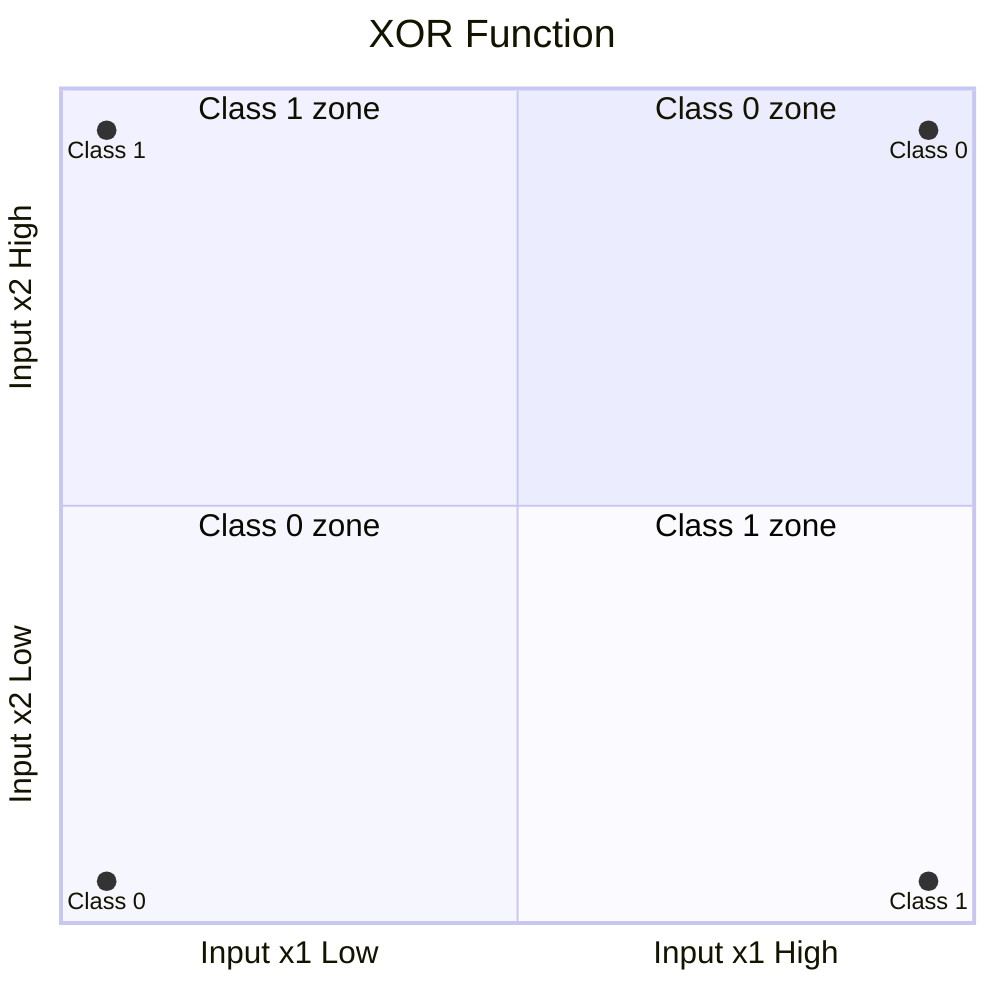

**Implications**

This limitation was famously highlighted by Minsky and Papert in 1969. It stalled neural network research for years. To solve non-linearly separable problems like XOR, we must use:

1.  **Non-linear Activation Functions:** (Like Sigmoid or ReLU).
2.  **Multi-Layer Networks:** Combining multiple neurons in layers (Multi-Layer Perceptrons) to create complex decision boundaries.


# 3 - The Perceptron Learning Algorithm

## 3.1 - The Error Correction Method (Intuition)

The Perceptron Learning Algorithm, often referred to as the Error Correction Method, is an iterative process used to train a single-layer neural network. We begin with a network containing random weights and present it with a series of training examples. For each example, we compare the network's actual output ($y$) with the desired target output ($t$).

**The Core Concept**

The intuition behind this method is straightforward: we only adjust the weights if the network makes a mistake. If the classification is correct, the weights remain untouched. If the classification is incorrect, we "nudge" the weights in a direction that reduces the error.

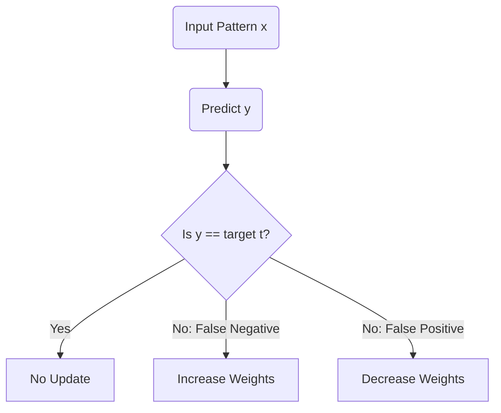

**The Update Logic**

We define the update rule based on the difference between the target and the actual output. Let $\alpha$ be the learning rate; this is a small positive number that controls the size of the step we take.

1.  **Correct Prediction ($t = y$):**
    The network classified the input correctly. No changes are made to the weights ($t - y = 0$).

2.  **Output too low ($t = 1$ and $y = 0$):**
    The network failed to fire when it should have (a false negative). To correct this, we need to increase the net input ($s$) so it crosses the threshold. We achieve this by **adding** the input vector, scaled by $\alpha$, to the weight vector. This increases the weights associated with positive inputs.

3.  **Output too high ($t = 0$ and $y = 1$):**
    The network fired when it should not have (a false positive). We need to decrease the net input. We achieve this by **subtracting** the input vector, scaled by $\alpha$, from the weight vector. This decreases the weights associated with positive inputs.

**Mathematical Formulation**

This logic is encapsulated in a single update equation applied to each weight $w_i$:

$$w_i \leftarrow w_i + \alpha (t - y) x_i$$

Where:

  * $w_i$ is the weight for input $x_i$.
  * $\alpha$ is the learning rate.
  * $t$ is the target value.
  * $y$ is the actual output produced by the transfer function $g(s)$.

## 3.2 - Perceptron Criterion Function

To train a classifier mathematically, we need a way to measure how "bad" a set of weights is. This measure is called a cost function (or loss function). Ideally, we want to minimize this cost.

**The Problem with Counting Errors**

The most obvious measure of error is simply counting the number of misclassified samples. However, this approach creates a problem for optimization.

If we plot the "number of errors" against the weights, the resulting surface is piecewise constant. This means the surface looks like a series of flat steps. If you are standing on a flat step, you don't know which direction is "down" because the gradient is zero almost everywhere; consequently, gradient descent algorithms cannot find a path to the minimum.

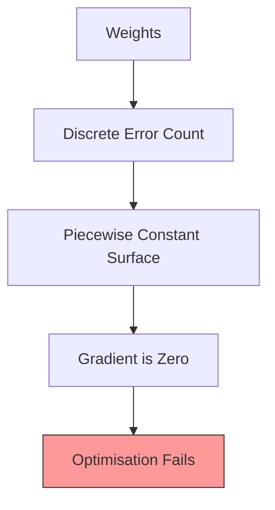

**The Perceptron Criterion**

To solve this, we use the **Perceptron Criterion Function**, denoted as $J_p(a)$. Instead of just counting errors, we measure *how wrong* the misclassified samples are.

We focus only on the samples that are misclassified. If a sample is correctly classified, it contributes zero to the cost. If it is misclassified, its contribution is proportional to its distance from the decision boundary.

**Mathematical Definition**

We assume **sample normalisation** is used. This means samples belonging to Class 2 ($\omega_2$) are multiplied by $-1$. Under this notation, we want $a^t y > 0$ for all samples to be correctly classified.

If a sample $y$ is misclassified, then $a^t y \le 0$. To define a positive cost for this error, we use the value $-a^t y$ (which will be positive).

The criterion function sums these values for all misclassified samples:

$$J_p(a) = \sum_{y \in \mathcal{Y}} (-a^t y)$$

Where:

  * $a$ is the weight vector.
  * $\mathcal{Y}$ is the set of samples misclassified by $a$.

Geometrically, this creates a cost surface that looks like a valley. It is continuous and allows us to compute a gradient to find the bottom (the solution).

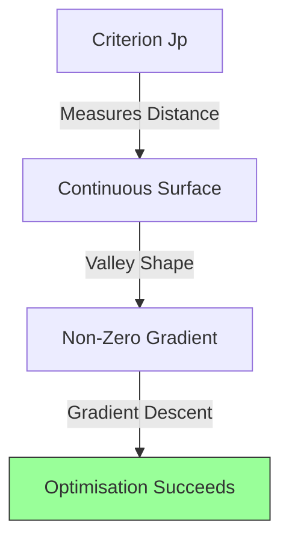

**The Gradient**

Because $J_p$ is linear with respect to the weights for the misclassified samples, the gradient is straightforward to compute:

$$\nabla J_p(a) = \sum_{y \in \mathcal{Y}} (-y)$$

This gradient vector points in the direction that increases the error. To reduce the error (gradient descent), we move in the opposite direction, which essentially adds the misclassified sample vectors to the weight vector.

## 3.3 - Batch Perceptron Learning

Batch learning is an approach where weight updates are performed only after all training samples in the dataset have been processed. This entire pass through the data is known as an **epoch**.

**The Algorithm**

1.  **Initialize** the weight vector $a$ (often to zero or random values) and set the learning rate $\eta$.
2.  **Compute the Gradient:** Process the entire dataset to identify the set $\mathcal{Y}$ of all misclassified samples.
3.  **Update Weights:** Adjust the weight vector by adding the scaled sum of all the misclassified samples at once.

**Update Rule:**

$$a \leftarrow a + \eta \sum_{y \in \mathcal{Y}} y$$

where $\mathcal{Y}$ represents the set of misclassified samples (normalized).

This method moves the weight vector in the direction of the steepest descent of the Perceptron Criterion Function. Ideally, it averages out the noise from individual samples, providing a more stable trajectory towards the solution. However, it only converges if the data is linearly separable.

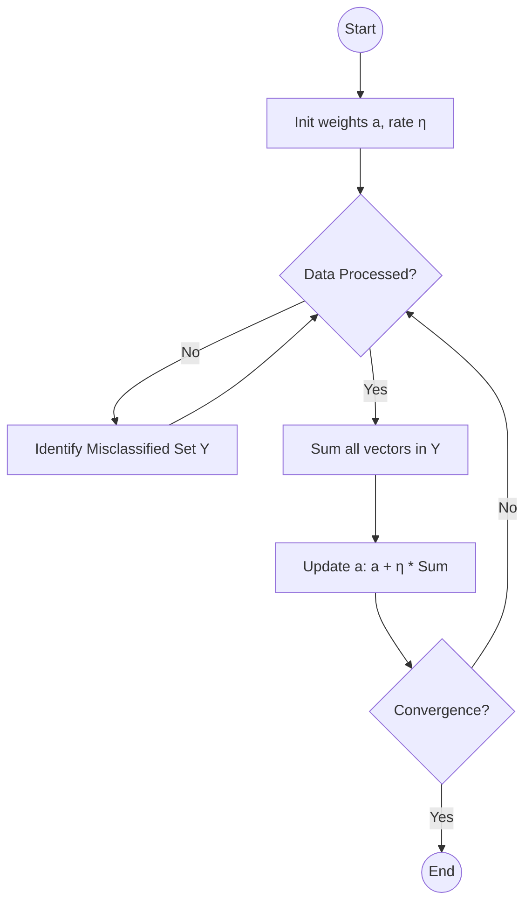

**Computational Example: Batch Perceptron**

Let's compute the first epoch of training using the Batch Perceptron algorithm.

**Question:**
Use the batch perceptron learning algorithm with augmented notation and sample normalisation to find parameters for the linear discriminant function.
**Data:**

  * Sample 1: $x=(1,5)^T$, Class 1
  * Sample 2: $x=(2,5)^T$, Class 1
  * Sample 3: $x=(4,1)^T$, Class 2
  * Sample 4: $x=(5,1)^T$, Class 2

**Parameters:**

  * Initial Weights: $a = (-25, 6, 3)^T$ (where $a$ includes the bias weight $w_0$).
  * Learning Rate: $\eta = 1$.

**Step-by-Step Calculation (Epoch 1):**

**1. Augmentation and Normalization:**
We convert the feature vectors into augmented vectors $y$ (adding 1 as the first element). Since we are using sample normalization, we negate the vectors belonging to Class 2. This allows us to use the single condition $a^T y > 0$ for correct classification.

  * **Sample 1:** Class 1. Augment: $(1, 1, 5)^T$. Keep: $y_1 = (1, 1, 5)^T$.
  * **Sample 2:** Class 1. Augment: $(1, 2, 5)^T$. Keep: $y_2 = (1, 2, 5)^T$.
  * **Sample 3:** Class 2. Augment: $(1, 4, 1)^T$. Negate: $y_3 = (-1, -4, -1)^T$.
  * **Sample 4:** Class 2. Augment: $(1, 5, 1)^T$. Negate: $y_4 = (-1, -5, -1)^T$.

**2. Check for Misclassification:**
We calculate the dot product $g(x) = a^T y$ for each sample using the initial weights $a = (-25, 6, 3)$. A result $\le 0$ indicates an error.

  * **Sample 1 ($y_1$):**
    $$a^T y_1 = (-25 \times 1) + (6 \times 1) + (3 \times 5) = -25 + 6 + 15 = -4$$
    Result is $\le 0$, so **Misclassified**.

  * **Sample 2 ($y_2$):**
    $$a^T y_2 = (-25 \times 1) + (6 \times 2) + (3 \times 5) = -25 + 12 + 15 = 2$$
    Result is $> 0$, so **Correct**.

  * **Sample 3 ($y_3$):**
    $$a^T y_3 = (-25 \times -1) + (6 \times -4) + (3 \times -1) = 25 - 24 - 3 = -2$$
    Result is $\le 0$, so **Misclassified**.

  * **Sample 4 ($y_4$):**
    $$a^T y_4 = (-25 \times -1) + (6 \times -5) + (3 \times -1) = 25 - 30 - 3 = -8$$
    Result is $\le 0$, so **Misclassified**.

**3. Calculate the Total Weight Change:**
Sum the vectors of all misclassified samples ($y_1, y_3, y_4$).

$$Sum = y_1 + y_3 + y_4$$
$$Sum = \begin{pmatrix} 1 \\ 1 \\ 5 \end{pmatrix} + \begin{pmatrix} -1 \\ -4 \\ -1 \end{pmatrix} + \begin{pmatrix} -1 \\ -5 \\ -1 \end{pmatrix}$$
$$Sum = \begin{pmatrix} 1 - 1 - 1 \\ 1 - 4 - 5 \\ 5 - 1 - 1 \end{pmatrix} = \begin{pmatrix} -1 \\ -8 \\ 3 \end{pmatrix}$$

**4. Update the Weights:**
$$a_{new} = a_{old} + \eta \times Sum$$
$$a_{new} = \begin{pmatrix} -25 \\ 6 \\ 3 \end{pmatrix} + 1 \times \begin{pmatrix} -1 \\ -8 \\ 3 \end{pmatrix}$$
$$a_{new} = \begin{pmatrix} -26 \\ -2 \\ 6 \end{pmatrix}$$

**Result:**
The new weight vector after one epoch is $a = (-26, -2, 6)^T$.

## 3.4 - Sequential (Online) Perceptron Learning

In contrast to batch learning, the **Sequential** (or **Online**) Perceptron Learning Algorithm updates the weight vector immediately after processing each individual sample.

**The Algorithm**

1.  **Initialize** the weight vector $a$ (often to random values) and select a learning rate $\eta$.
2.  **Iterate** through each sample $y_k$ in the dataset:
      * Calculate the output using the current weights.
      * If the sample is **misclassified**, immediately update the weights.
      * If the sample is **correctly classified**, do nothing.
3.  **Repeat** the process (cycling through the dataset) until all samples are classified correctly (convergence).

**Update Rule**

If we use the class labels $\omega_k$ (where $\omega_k = 1$ for Class 1 and $\omega_k = -1$ for Class 2), the update rule can be stated as:

$$a \leftarrow a + \eta \omega_k y_k$$

This rule essentially moves the weight vector **towards** a misclassified Class 1 exemplar and **away** from a misclassified Class 2 exemplar.

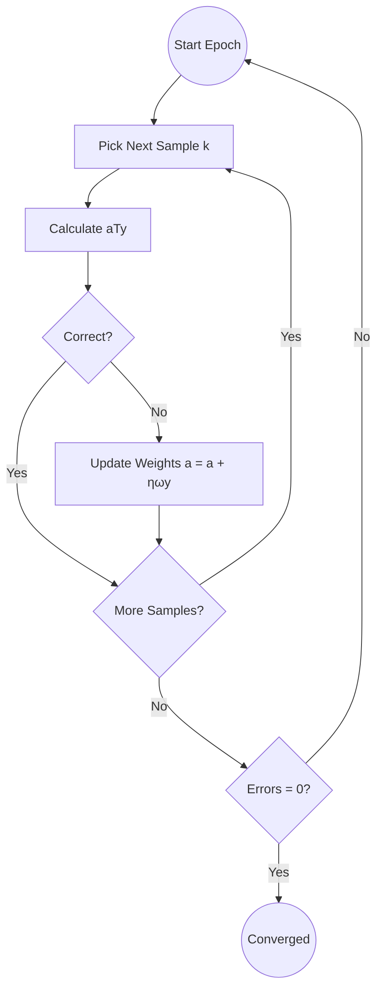

## 3.5 - Computational Examples of Perceptron Updates

**Example: Sequential (Online) Perceptron Learning**

**Problem Statement**
Apply the sequential perceptron learning algorithm to determine the parameters of a linear discriminant function.
**Data:**

  * Class 1 ($1$): $x_1=(0,2)^T, x_2=(1,2)^T, x_3=(2,1)^T$
  * Class 2 ($-1$): $x_4=(-3,1)^T, x_5=(-2,-1)^T, x_6=(-3,-2)^T$

**Parameters:**

  * Initial weights: $a = (1, 0, 0)^T$ (Augmented vector $[w_0, w_1, w_2]$).
  * Learning rate $\eta = 1$.

**Step-by-Step Calculation (Epoch 1):**

We check each sample. If misclassified, we update $a$ immediately using $a \leftarrow a + \eta \omega_k y_k$ (where $y_k$ is the augmented input vector).

**1. Sample 1:** $x = (0, 2)^T$, Class 1 ($\omega=1$).

  * **Augmented Input ($y$):** $[1, 0, 2]^T$.
  * **Calculate Output:**
    $$g(x) = a^T y = (1 \times 1) + (0 \times 0) + (0 \times 2) = 1$$
  * **Check:** Output is positive ($>0$) and Class is 1. **Correct.**
  * **Update:** No change.

**2. Sample 2:** $x = (1, 2)^T$, Class 1 ($\omega=1$).

  * **Augmented Input ($y$):** $[1, 1, 2]^T$.
  * **Calculate Output:**
    $$g(x) = (1 \times 1) + (0 \times 1) + (0 \times 2) = 1$$
  * **Check:** Output is positive. **Correct.**
  * **Update:** No change.

**3. Sample 3:** $x = (2, 1)^T$, Class 1 ($\omega=1$).

  * **Augmented Input ($y$):** $[1, 2, 1]^T$.
  * **Calculate Output:**
    $$g(x) = (1 \times 1) + (0 \times 2) + (0 \times 1) = 1$$
  * **Check:** Output is positive. **Correct.**
  * **Update:** No change.

**4. Sample 4:** $x = (-3, 1)^T$, Class 2 ($\omega=-1$).

  * **Augmented Input ($y$):** $[1, -3, 1]^T$.
  * **Calculate Output:**
    $$g(x) = (1 \times 1) + (0 \times -3) + (0 \times 1) = 1$$
  * **Check:** Output is positive ($>0$), but Class is -1 (requires negative). **Misclassified.**
  * **Update:** Move weights *away* from the input (subtract $y$).
    $$a_{new} = a - y$$
    $$a_{new} = [1, 0, 0]^T - [1, -3, 1]^T = [0, 3, -1]^T$$

**5. Sample 5:** $x = (-2, -1)^T$, Class 2 ($\omega=-1$).

  * **Note:** We use the *new* weights $a=[0, 3, -1]^T$.
  * **Augmented Input ($y$):** $[1, -2, -1]^T$.
  * **Calculate Output:**
    $$g(x) = (0 \times 1) + (3 \times -2) + (-1 \times -1) = 0 - 6 + 1 = -5$$
  * **Check:** Output is negative. **Correct.**
  * **Update:** No change.

**6. Sample 6:** $x = (-3, -2)^T$, Class 2 ($\omega=-1$).

  * **Augmented Input ($y$):** $[1, -3, -2]^T$.
  * **Calculate Output:**
    $$g(x) = (0 \times 1) + (3 \times -3) + (-1 \times -2) = 0 - 9 + 2 = -7$$
  * **Check:** Output is negative. **Correct.**
  * **Update:** No change.

**Result:**
At the end of the first epoch, the weight vector has evolved from $(1, 0, 0)^T$ to $(0, 3, -1)^T$. The algorithm would continue to loop through the data until a full epoch passes with no updates.


# 4 - Gradient Descent and the Delta Rule

## 4.1 - The Cost Function (Squared Error)

While the Perceptron Learning Algorithm is effective for linearly separable data, it fails to converge if the data is not linearly separable. In such cases, the error correction method may oscillate endlessly. To address this, we need a method that can find a best-fit approximation, even if a perfect separation is impossible. This leads us to the **Delta Rule**, which relies on a different definition of error.

**Defining the Error**

Instead of checking if the thresholded output is correct (binary error), we measure *how far* the network's internal activation is from the target. We consider an **unthresholded perceptron** (a linear unit).

We define a cost function (also called an objective or loss function), denoted as $E(w)$. The most common choice is the **Sum of Squared Errors (SSE)**.

$$E(w) = \frac{1}{2}\sum_{j=1}^{M}(t_{j}-s_{j})^{2}$$

**Components of the Function**

  * **$M$**: The total number of instances (examples) in the dataset.
  * **$t_j$**: The target output (desired value) for the $j$-th training example.
  * **$s_j$**: The actual linear output (weighted sum) produced by the network for the $j$-th example, where $s_j = w^T x_j$.

**Key Characteristics**

1.  **Linear Output ($s$ vs $g(s)$):** The error is calculated using the linear weighted sum $s$, not the thresholded output $g(s)$. This effectively treats the training process as a Linear Regression problem rather than a classification problem. We are trying to make the weighted sum match the target values.
2.  **Mathematical Convenience:** The fraction $\frac{1}{2}$ is included to simplify the mathematics. When we calculate the derivative of the squared error later (for gradient descent), the power of 2 cancels out with the $\frac{1}{2}$.
3.  **Goal:** The objective of training is to find the set of weights $w$ that minimizes this error function $E(w)$.

**Computational Example: Calculating the Squared Error**

To understand how the cost function works, let's calculate the error for a specific set of weights and data points.

**Question:**
Consider a single neuron with weights $w = [1, 1, 2]^T$ (Bias, $w_1, w_2$).
Calculate the squared error contribution for the following two samples:

  * **Sample 1:** Inputs $x_1=1, x_2=2$, Target $t=1$. (Augmented input $y=[1,1,2]^T$)
  * **Sample 2:** Inputs $x_1=3, x_2=1$, Target $t=0$. (Augmented input $y=[1,3,1]^T$)

**Step-by-Step Calculation:**

**1. Calculate Net Input ($s$) for Sample 1:**
$$s_1 = w^T y_1 = (1 \times 1) + (1 \times 1) + (2 \times 2)$$
$$s_1 = 1 + 1 + 4 = 6$$

**2. Calculate Squared Error for Sample 1:**
$$E_1 = \frac{1}{2} (t_1 - s_1)^2$$
$$E_1 = \frac{1}{2} (1 - 6)^2 = \frac{1}{2} (-5)^2$$
$$E_1 = \frac{1}{2} (25) = 12.5$$

**3. Calculate Net Input ($s$) for Sample 2:**
$$s_2 = w^T y_2 = (1 \times 1) + (1 \times 3) + (2 \times 1)$$
$$s_2 = 1 + 3 + 2 = 6$$

**4. Calculate Squared Error for Sample 2:**
$$E_2 = \frac{1}{2} (t_2 - s_2)^2$$
$$E_2 = \frac{1}{2} (0 - 6)^2 = \frac{1}{2} (36) = 18$$

**Result:**
The total error for these two samples is $E_{total} = 12.5 + 18 = 30.5$.

## 4.2 - The Concept of the Error Surface and Gradient Descent

To visualize the learning process, we can plot the cost function $E(w)$ against the possible values of the weights. This creates a geometric representation known as the **error surface**.

**The Geometry of Error**

Imagine a graph where the horizontal axes represent the values of the weights ($w_1, w_2$) and the vertical axis represents the error $E$.

For a simple linear unit using the squared error function, this surface forms a smooth, bowl-shaped structure called a **paraboloid** (or a parabolic valley). The lowest point in this bowl corresponds to the set of weights that produces the minimum possible error.

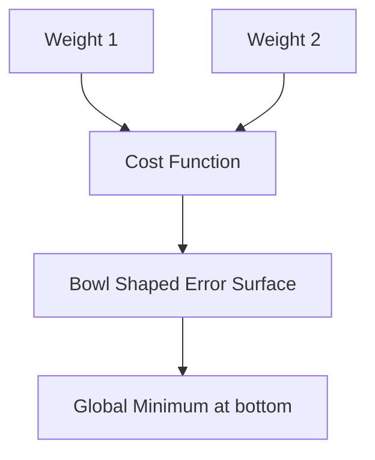

**Gradient Descent**

We use a method called **Gradient Descent** to find the bottom of this valley.

The **gradient** ($\nabla E$) is a vector that points in the direction of the steepest *increase* (uphill) of the error function at any specific point. To minimize the error, we want to move downhill. Therefore, we update the weights by moving in the direction of the **negative gradient**.

```mermaid
graph TD
    Start[Current Position on Error Surface] --> Grad[Calculate Gradient Vector]
    Grad -- Points Uphill --> Neg[Negate Gradient]
    Neg -- Points Downhill --> Step[Take step size η]
    Step --> Update[New Weight Position]
    Update --> Check[Is gradient zero?]
    Check -- No --> Start
    Check -- Yes --> Stop[Minimum Reached]
```

The update rule for gradient descent is generally defined as:

$$w_{new} = w_{old} - \eta \nabla E(w)$$

Where $\eta$ is the learning rate. It determines the size of the step we take down the hill.

[slides03\_neural\_networks.pdf: page 26: 3D plot of error surface showing gradient descent]

## 4.3 - Derivation of the Standard Delta Rule (LMS for Linear Units)

The Standard Delta Rule (also known as the Widrow-Hoff learning rule or the Least Mean Squares (LMS) rule) is a gradient descent method used to minimize the squared error between the target output and the actual linear output of a neuron.

**The Goal**

We aim to find the weight vector $w$ that minimizes the squared error $E(w)$ for a given training example. Unlike the perceptron rule, we consider the **linear output** (the weighted sum $s$) rather than the thresholded output.

The cost function for a single training sample is defined as:

$$E(w) = \frac{1}{2}(t - s)^2$$

Where:

  * $t$ is the target value.
  * $s$ is the net input (weighted sum), defined as $s = w^T x = \sum_{i=0}^{n} w_i x_i$.

**Calculating the Gradient**

To minimize the error, we need to move the weights in the direction opposite to the gradient of the error with respect to the weights. We compute the partial derivative of $E$ with respect to each weight $w_i$ using the **chain rule**:

$$\frac{\partial E}{\partial w_i} = \frac{\partial E}{\partial s} \cdot \frac{\partial s}{\partial w_i}$$

**Step 1: Derivative of Error w.r.t Net Input ($s$)**
Differentiating the error function $(t - s)^2$:

$$\frac{\partial E}{\partial s} = \frac{\partial}{\partial s} \left( \frac{1}{2}(t - s)^2 \right) = -(t - s)$$

**Step 2: Derivative of Net Input ($s$) w.r.t Weight ($w_i$)**
Differentiating the weighted sum $\sum w_k x_k$:

$$\frac{\partial s}{\partial w_i} = \frac{\partial}{\partial w_i} \left( \sum_{k=0}^{n} w_k x_k \right) = x_i$$

**Step 3: Combine**
Multiplying the two parts gives the gradient component for weight $w_i$:

$$\frac{\partial E}{\partial w_i} = -(t - s)x_i$$

**The Update Rule**

Gradient descent updates the weights by subtracting a portion ($\alpha$, the learning rate) of the gradient:

$$w_i \leftarrow w_i - \alpha \left( \frac{\partial E}{\partial w_i} \right)$$

Substituting our gradient:

$$w_i \leftarrow w_i - \alpha (-(t - s)x_i)$$

$$w_i \leftarrow w_i + \alpha (t - s) x_i$$

This rule adjusts the weights in proportion to the error $(t-s)$ and the input signal $x_i$.

**Computational Example: Delta Rule Update**

Let's apply this rule to a specific example. Note that in this context, the update is based on the linear sum $s$, even if the final classification would use a threshold.

**Question:**
Train a perceptron for one epoch using the delta rule.

  * **Initial Weights:** $w_0 = 1$ (bias), $w_1 = 1$, $w_2 = 2$.
  * **Learning Rate ($\alpha$):** 0.5.
  * **Training Example:** Inputs $x_1=1, x_2=2$, Target $t=1$. (Augmented vector $y=[1,1,2]^T$)

**Step-by-Step Calculation:**

1.  **Calculate the Net Input ($s$):**
    Compute the dot product of the weight vector and input vector.
    $$s = (w_0 \times x_0) + (w_1 \times x_1) + (w_2 \times x_2)$$
    $$s = (1 \times 1) + (1 \times 1) + (2 \times 2)$$
    $$s = 1 + 1 + 4 = 6$$

2.  **Calculate the Error:**
    The target is $t = 1$.
    $$Error = (t - s) = 1 - 6 = -5$$
    *(Note: The linear output 6 is much larger than the target 1, resulting in a large negative error).*

3.  **Update the Weights:**
    Apply the formula $w_i \leftarrow w_i + \alpha (t - s) x_i$.

      * **Bias Weight ($w_0$):**
        $$w_0 \leftarrow 1 + 0.5(-5)(1)$$
        $$w_0 \leftarrow 1 - 2.5 = -1.5$$

      * **Weight 1 ($w_1$):**
        $$w_1 \leftarrow 1 + 0.5(-5)(1)$$
        $$w_1 \leftarrow 1 - 2.5 = -1.5$$

      * **Weight 2 ($w_2$):**
        $$w_2 \leftarrow 2 + 0.5(-5)(2)$$
        $$w_2 \leftarrow 2 - 5 = -3$$

**Result:**
The new weight vector is $w = [-1.5, -1.5, -3]^T$.
Notice that even though a thresholded perceptron (checking if $s \ge 0$) would have correctly classified this sample (output 1), the Delta Rule heavily penalized the weights because the linear sum (6) was far from the target (1).

## 4.4 - The Generalised Delta Rule (For Non-Linear or Sigmoidal Units)

The standard Delta rule works for linear units, but neural networks derive their power from non-linearity. To train a neuron with a differentiable non-linear activation function (like the sigmoid), we must extend the Delta rule. This is known as the **Generalised Delta Rule**.

**The Chain Rule with Activation**

We use the same squared error cost function $E = \frac{1}{2}(t - g(s))^2$. However, the output $y$ is now the result of a non-linear activation function $g(s)$, so $y = g(s)$.

To find how to change the weights, we use the **chain rule** to derive the gradient $\frac{\partial E}{\partial w_i}$:

$$\frac{\partial E}{\partial w_i} = \frac{\partial E}{\partial g(s)} \cdot \frac{\partial g(s)}{\partial s} \cdot \frac{\partial s}{\partial w_i}$$

Let's break down the three components:

1.  **Error w.r.t Output:** The derivative of the squared error with respect to the output is $-(t - g(s))$.
2.  **Output w.r.t Net Input (The Derivative):** This depends on the specific function. For the **sigmoid function** $g(s) = \frac{1}{1+e^{-s}}$, the derivative is conveniently expressed in terms of the output itself: $\frac{\partial g(s)}{\partial s} = g(s)(1 - g(s))$.
3.  **Net Input w.r.t Weight:** The derivative of the weighted sum $s = \sum w_i x_i$ is simply the input $x_i$.

**The Generalised Update Rule**

By combining these parts, we get the gradient:

$$\frac{\partial E}{\partial w_i} = -(t - g(s)) g(s)(1 - g(s)) x_i$$

Since gradient descent updates weights by subtracting the gradient ($w \leftarrow w - \eta \nabla E$), the final update rule becomes:

$$w_i \leftarrow w_i + \alpha (t - g(s)) g(s)(1 - g(s)) x_i$$

```mermaid
graph LR
    subgraph Sigmoid_Function
    %% Wrap text in quotes so parens ( ) don't break the parser
    S["Sigmoid: 1 / (1+e^-s)"]
    D["Derivative: g(s)(1-g(s))"]
    end
    S --> D
    style D fill:#e1f5fe,stroke:#01579b
```

**Computational Example: Generalised Delta Rule Update**

Let's manually compute one training step for a perceptron with a sigmoid activation function.

**Question:**
Train a perceptron for one epoch using the generalised delta rule.

  * **Initial Weights:** $w_0=1$ (bias), $w_1=1$, $w_2=2$.
  * **Learning Rate ($\alpha$):** 0.5.
  * **Training Example:** Inputs $x_1=1, x_2=2$, Target $t=1$.
  * **Activation Function:** Sigmoid $g(s) = \frac{1}{1+e^{-s}}$.

**Step-by-Step Calculation:**

1.  **Calculate the Net Input ($s$):**
    $$s = (1 \times 1) + (1 \times 1) + (2 \times 2) = 6$$

2.  **Calculate the Actual Output ($g(s)$):**
    $$g(6) = \frac{1}{1 + e^{-6}} \approx 0.998$$

3.  **Calculate the Derivative Component:**
    For sigmoid, the derivative is $g(s)(1 - g(s))$.
    $$g'(s) \approx 0.998 \times (1 - 0.998) = 0.998 \times 0.002 \approx 0.002$$

4.  **Calculate the Error Component:**
    $$Error = (t - g(s)) = 1 - 0.998 = 0.002$$

5.  **Update the Weights:**
    Apply the formula: $w_{new} = w_{old} + \alpha \times Error \times Derivative \times x_{input}$.

    The scalar multiplier part is:
    $$\Delta = 0.5 \times (0.002) \times (0.002) \approx 0.000002$$

      * **Bias Weight ($w_0$):** $1 + (0.000002 \times 1) = 1.000002$
      * **Weight 1 ($w_1$):** $1 + (0.000002 \times 1) = 1.000002$
      * **Weight 2 ($w_2$):** $2 + (0.000002 \times 2) = 2.000004$

**Result:**
The updated weight vector is $[1.000002, 1.000002, 2.000004]^T$.
*Observation:* Even though the target was 1 and the output was slightly less (0.998), the weight change was extremely small. This is because the derivative of the sigmoid function near 1 is very close to zero, a phenomenon known as the **vanishing gradient**.

```mermaid
graph TD
    Saturated[Neuron Saturated Output near 0 or 1] --> Derivative[Derivative approx 0]
    Derivative --> SmallDelta[Weight Update approx 0]
    SmallDelta --> Vanish[Learning Stalls Vanishing Gradient]
    
    style Vanish fill:#f99,stroke:#333
```

## 4.5 - Batch Gradient Descent vs. Stochastic Gradient Descent (SGD)

When implementing gradient descent for the Delta Rule (or any neural network learning algorithm), a key design choice is *when* to update the weights. This distinction defines the two primary training approaches: Batch Learning and Stochastic (or Sequential) Learning.

**Batch Gradient Descent**

In Batch learning, the network processes the **entire** training dataset before making a single update to the weights. We calculate the error gradients for every sample in the dataset and sum them up to determine the direction of the update.

  * **Process:**
    1.  Initialize weights.
    2.  Loop through all samples, accumulating the weight changes ($\Delta w$) for each but *not* applying them yet.
    3.  After checking all samples, apply the total accumulated change to the weights.
    4.  Repeat.
  * **Update Rule:**
    $$w \leftarrow w + \eta \sum_{p=1}^{M} (t_p - y_p)x_p$$
    where $M$ is the total number of patterns.
  * **Characteristics:**
      * One **epoch** (one pass through the entire dataset) results in exactly **one** weight update.
      * The trajectory on the error surface moves directly downhill (steepest descent) based on the global error.
      * It is guaranteed to converge to a solution (for convex surfaces) but can be slow for large datasets.

<!-- end list -->

```mermaid
graph TD
    subgraph Batch Learning
    B1[Process All M Samples] --> B2[Accumulate All Gradients]
    B2 --> B3[Perform 1 Weight Update]
    end
```

**Stochastic Gradient Descent (SGD)**

In Stochastic (also called Sequential or Online) learning, the weights are updated immediately after processing **each individual** training sample.

  * **Process:**
    1.  Initialize weights.
    2.  Pick a sample $(x, t)$ (often at random).
    3.  Calculate error and update weights immediately.
    4.  Repeat for the next sample.
  * **Update Rule:**
    $$w \leftarrow w + \eta (t - y)x$$
    .
  * **Characteristics:**
      * One epoch results in **$M$** weight updates (where $M$ is the number of samples).
      * The trajectory is "noisy" because each sample pulls the weights in a slightly different direction.
      * It may not converge to a stable point but oscillate around the minimum; however, this noise can help the network escape local minima.

**Comparison of Updates**

| Feature               | Batch                         | Stochastic (Sequential)        |
| :-------------------- | :---------------------------- | :----------------------------- |
| **Updates per Epoch** | 1                             | $M$ (Number of samples)        |
| **Stability**         | Smooth, stable descent        | Noisy, oscillating descent     |
| **Convergence**       | Guaranteed (for small $\eta$) | May oscillate                  |
| **Computation**       | Sums errors over all data     | Calculates error for one datum |

**Computational Example: Procedural Difference**

To visualize the difference, consider a dataset with 3 samples ($x_1, x_2, x_3$) and their corresponding target errors ($e_1, e_2, e_3$).

**Scenario:** We want to perform one epoch of training.

  * **Using Batch Gradient Descent:**

    1.  Calculate change for $x_1$: $\Delta w_1 = \eta e_1 x_1$
    2.  Calculate change for $x_2$: $\Delta w_2 = \eta e_2 x_2$
    3.  Calculate change for $x_3$: $\Delta w_3 = \eta e_3 x_3$
    4.  **Update:** $w_{new} = w_{old} + (\Delta w_1 + \Delta w_2 + \Delta w_3)$

  * **Using Stochastic Gradient Descent:**

    1.  Calculate change for $x_1$: $\Delta w_1 = \eta e_1 x_1$
    2.  **Update:** $w_{temp1} = w_{old} + \Delta w_1$
    3.  Calculate change for $x_2$ (using $w_{temp1}$): $\Delta w_2 = \eta e_2 x_2$
    4.  **Update:** $w_{temp2} = w_{temp1} + \Delta w_2$
    5.  Calculate change for $x_3$ (using $w_{temp2}$): $\Delta w_3 = \eta e_3 x_3$
    6.  **Update:** $w_{new} = w_{temp2} + \Delta w_3$

In SGD, the weights used to calculate the error for $x_2$ and $x_3$ have already been modified by previous samples, whereas in Batch, all errors are calculated using the original $w_{old}$.

## 4.6 - Computational Examples of Delta Rule Updates

To visualize how learning progresses over time, we will perform a sequence of weight updates. We will look at two scenarios; the first uses the Standard Delta Rule for linear units, and the second uses the Generalised Delta Rule for sigmoidal units.

**Example 1: Standard Delta Rule (Linear Units)**

We continue from the calculation in Section 4.3. We are iterating through the dataset using Stochastic Gradient Descent.

**Current State (End of Sample 1):**

  * **Weights:** $w = [-1.5, -1.5, -3]^T$ (Bias, $w_1, w_2$).
  * **Learning Rate ($\alpha$):** 0.5.

**Training Example 2:**

  * **Input:** $x_1=3, x_2=1$. Target $t=0$.
  * **Augmented Input ($x$):** $[1, 3, 1]^T$.

**Step-by-Step Calculation:**

1.  **Calculate Net Input ($s$):**
    $$s = (-1.5 \times 1) + (-1.5 \times 3) + (-3 \times 1)$$
    $$s = -1.5 - 4.5 - 3$$
    $$s = -9$$

2.  **Calculate Error ($t - s$):**
    $$Error = 0 - (-9) = 9$$

3.  **Update Weights:**
    Formula: $w_{new} = w_{old} + \alpha (t - s) x$.
    $$w_{new} = [-1.5, -1.5, -3]^T + 0.5 \times 9 \times [1, 3, 1]^T$$
    $$w_{new} = [-1.5, -1.5, -3]^T + [4.5, 13.5, 4.5]^T$$
    $$w_{new} = [3, 12, 1.5]^T$$

**Example 2: Generalised Delta Rule (Sigmoid Units)**

We continue from the non-linear example in Section 4.4.

**Current State (End of Sample 1):**

  * **Weights:** $w = [1.000002, 1.000002, 2.000004]^T$.
  * **Learning Rate ($\alpha$):** 0.5.

**Training Example 2:**

  * **Input:** $x_1=3, x_2=1$. Target $t=0$.
  * **Augmented Input ($x$):** $[1, 3, 1]^T$.

**Step-by-Step Calculation:**

1.  **Calculate Net Input ($s$):**
    $$s \approx (1.0 \times 1) + (1.0 \times 3) + (2.0 \times 1) = 6.0$$

2.  **Calculate Actual Output ($g(s)$):**
    $$g(6) \approx 0.998$$

3.  **Calculate Gradient Components:**

      * **Error ($t - g(s)$):** $0 - 0.998 = -0.998$.
      * **Derivative:** $0.002$.

4.  **Update Weights:**
    $$w_{new} = w_{old} + 0.5 \times (-0.998) \times 0.002 \times [1, 3, 1]^T$$
    The update vector is approximately $[-0.001, -0.003, -0.001]^T$.
    **Result:** $w_{new} \approx [0.999, 0.997, 1.999]^T$.


# 5 - Minimum Squared Error (MSE) Procedures

## 5.1 - Solving Linear Equations vs. Linear Inequalities

Previous methods, like the Perceptron Learning Algorithm, focus solely on classification. Their goal is to find a decision boundary that correctly separates the classes. Mathematically, this involves solving a system of **linear inequalities**.

**Perceptron Approach (Inequalities)**

For a sample $y_k$ (normalized), the Perceptron algorithm seeks a weight vector $a$ such that:

$$a^T y_k > 0$$

It does not care *how far* the sample is from the boundary, only that it is on the correct side. As long as the output is positive, the algorithm considers the job done. Consequently, learning is driven only by misclassified exemplars. If the data is not linearly separable, the algorithm fails to converge because no such vector $a$ exists to satisfy all inequalities simultaneously.

**MSE Approach (Equations)**

Minimum Squared Error (MSE) procedures take a more rigorous approach. Instead of just looking for a positive output, they attempt to force the output to equal a specific target value (a margin). This transforms the problem into solving a system of **linear equations**.

For each sample $y_k$, we seek a weight vector $a$ such that:

$$a^T y_k = b_k$$

where $b_k$ is a specified positive constant (the margin).

**Key Differences**

1.  **Data Usage:** MSE learning depends on **all** exemplars, not just the misclassified ones. Every sample contributes to defining the position of the decision boundary.
2.  **Separability:** MSE procedures provide a result even if the data is not linearly separable. While the Perceptron loops endlessly on non-separable data, MSE finds a "best fit" solution that minimizes the total error between the actual output $a^T y$ and the desired margin $b$.
3.  **Nature of Solution:** The Perceptron finds *a* separating plane (any valid plane). MSE attempts to find *a specific* plane that places data points at a specific distance ($b$) from the boundary.

<!-- end list -->

```mermaid
graph LR
    subgraph Perceptron
    P[Find any a]
    P --> Rule1[aTy > 0]
    end
    
    subgraph MSE
    M[Find specific a]
    M --> Rule2[aTy = b]
    end
    
    style Rule2 fill:#e1f5fe,stroke:#01579b
```

**Computational Example: Formulating the Problem**

To concretely see the difference between the Perceptron and MSE approaches, let's take a raw dataset and formulate the mathematical systems for both.

**Question:**
Consider the following linearly separable dataset containing samples from two classes:

  * **Class 1:** $x_1=(0,2)^T$, $x_2=(1,2)^T$, $x_3=(2,1)^T$
  * **Class 2:** $x_4=(-3,1)^T$, $x_5=(-2,-1)^T$, $x_6=(-3,-2)^T$

Formulate the problem as:

1.  A system of linear inequalities (for Perceptron Learning).
2.  A system of linear equations (for MSE Learning) using a margin vector $b = [1, 1, 1, 1, 1, 1]^T$.

**Step-by-Step Formulation:**

**1. Augmentation and Normalization**
First, we must convert the raw feature vectors into normalized augmented vectors ($y$).

  * **Augment:** Add $1$ as the first element ($x_0$) to every vector.

  * **Normalize:** If a sample belongs to Class 2, multiply the entire vector by $-1$.

  * **Class 1 Samples (Keep sign):**

      * $x_1 \rightarrow y_1 = [1, 0, 2]^T$
      * $x_2 \rightarrow y_2 = [1, 1, 2]^T$
      * $x_3 \rightarrow y_3 = [1, 2, 1]^T$

  * **Class 2 Samples (Negate):**

      * $x_4 \rightarrow [1, -3, 1]^T \xrightarrow{\text{negate}} y_4 = [-1, 3, -1]^T$
      * $x_5 \rightarrow [1, -2, -1]^T \xrightarrow{\text{negate}} y_5 = [-1, 2, 1]^T$
      * $x_6 \rightarrow [1, -3, -2]^T \xrightarrow{\text{negate}} y_6 = [-1, 3, 2]^T$.

**2. System of Linear Inequalities (Perceptron)**
For the Perceptron, we simply require that the dot product of the weight vector $a = [w_0, w_1, w_2]^T$ and each sample $y$ is positive.

$$
\begin{cases}
a^T y_1 > 0 \implies 1w_0 + 0w_1 + 2w_2 > 0 \\
a^T y_2 > 0 \implies 1w_0 + 1w_1 + 2w_2 > 0 \\
a^T y_3 > 0 \implies 1w_0 + 2w_1 + 1w_2 > 0 \\
a^T y_4 > 0 \implies -1w_0 + 3w_1 - 1w_2 > 0 \\
a^T y_5 > 0 \implies -1w_0 + 2w_1 + 1w_2 > 0 \\
a^T y_6 > 0 \implies -1w_0 + 3w_1 + 2w_2 > 0
\end{cases}
$$

Any weight vector $a$ that satisfies *all* these inequalities is a valid solution.

**3. System of Linear Equations (MSE)**
For MSE, we arrange the vectors into a matrix $Y$ and demand that their product with $a$ equals the margin vector $b$.

We construct the matrix $Y$ where each row is one of our samples $y^T$:

$$
Y = \begin{pmatrix}
1 & 0 & 2 \\
1 & 1 & 2 \\
1 & 2 & 1 \\
-1 & 3 & -1 \\
-1 & 2 & 1 \\
-1 & 3 & 2
\end{pmatrix}
$$

We define the target margin vector $b$:

$$
b = \begin{pmatrix} 1 \\ 1 \\ 1 \\ 1 \\ 1 \\ 1 \end{pmatrix}
$$

The problem is now defined as finding the vector $a$ that satisfies the matrix equation:

$$Ya = b$$

**Result:**
The Perceptron searches for *any* $a$ that keeps the output positive; MSE searches for a *specific* $a$ that maps the inputs to the exact values in $b$.

## 5.2 - The Pseudo-Inverse Solution (Closed Form)

The Minimum Squared Error (MSE) approach formulates the training problem as a system of linear equations:

$$Ya = b$$

Where:

  * $Y$ is the matrix of augmented and normalized training samples (each row is a sample $y^T$).
  * $a$ is the weight vector we want to find.
  * $b$ is the margin vector (targets).

**The Problem of Inversion**

If $Y$ were a square matrix (number of samples equals number of weights) and non-singular, we could simply invert it to find $a = Y^{-1}b$. However, in pattern recognition, we typically have far more training samples than weights. This makes $Y$ a rectangular matrix, which has no direct inverse.

**The Solution: Moore-Penrose Pseudo-Inverse**

To solve this, we use the **pseudo-inverse** (denoted as $Y^\dagger$). This provides a "closed-form" solution, meaning we can calculate the weights directly using linear algebra without needing an iterative loop like gradient descent.

The solution is given by:

$$a = Y^\dagger b$$

The pseudo-inverse is defined as:

$$Y^\dagger = (Y^T Y)^{-1} Y^T$$

This method minimizes the sum of squared errors $||Ya - b||^2$.

**Computational Example: Calculating Weights via Pseudo-Inverse**

Let's apply this method to a dataset to find the decision boundary directly.

**Question:**
Consider the linearly separable data set below. Use the pseudo-inverse to calculate the parameters ($a$) of a linear discriminant function. Use an arbitrary margin vector $b = [1, 1, 1, 1, 1, 1]^T$.

| Feature Vector ($x^T$) | Class ($\omega$) |
| :--------------------- | :--------------- |
| $(0, 2)$               | 1                |
| $(1, 2)$               | 1                |
| $(2, 1)$               | 1                |
| $(-3, 1)$              | -1               |
| $(-2, -1)$             | -1               |
| $(-3, -2)$             | -1               |

**Step-by-Step Calculation**

**1. Construct the Matrix $Y$**

We convert the feature vectors into augmented, normalised vectors.

  * **Augment:** Add $1$ as the first element.
  * **Normalise:** Negate the vectors belonging to Class $-1$.

**Class 1:**
$(1, 0, 2), (1, 1, 2), (1, 2, 1)$

**Class -1 (Negated):**

  * $(1, -3, 1) \rightarrow (-1, 3, -1)$
  * $(1, -2, -1) \rightarrow (-1, 2, 1)$
  * $(1, -3, -2) \rightarrow (-1, 3, 2)$

This gives us the matrix $Y$:

$$
Y = \begin{pmatrix}
1 & 0 & 2 \\
1 & 1 & 2 \\
1 & 2 & 1 \\
-1 & 3 & -1 \\
-1 & 2 & 1 \\
-1 & 3 & 2
\end{pmatrix}
$$


**2. Calculate the Pseudo-Inverse ($Y^\dagger$)**

Using the formula $Y^\dagger = (Y^T Y)^{-1} Y^T$, we compute the pseudo-inverse. The resulting matrix is:

$$
Y^{\dagger} \approx \begin{pmatrix}
0.068 & 0.102 & 0.140 & -0.034 & 0.185 & -0.206 \\
0.165 & -0.233 & 0.075 & 0.043 & 0.199 & 0.118 \\
0.381 & -0.256 & -0.120 & 0.185 & -0.009 & 0.183
\end{pmatrix}
$$


**3. Solve for $a$**

Perform the matrix multiplication $a = Y^\dagger b$. Since $b$ is a vector of all ones, this is equivalent to summing the rows of $Y^\dagger$.

$$
a = \begin{pmatrix}
0.068 + 0.102 + 0.140 - 0.034 + 0.185 - 0.206 \\
0.165 - 0.233 + 0.075 + 0.043 + 0.199 + 0.118 \\
0.381 - 0.256 - 0.120 + 0.185 - 0.009 + 0.183
\end{pmatrix}
$$

$$
a = \begin{pmatrix}
0.2273 \\
0.3864 \\
0.1894
\end{pmatrix}
$$


**4. Verify the Solution**

We check if the resulting discriminant function correctly classifies the data. We compute $g(x) = a^T y$ for all samples.

  * **Sample 1:** $0.227(1) + 0.386(0) + 0.189(2) \approx 0.606$
  * **Sample 4:** $0.227(-1) + 0.386(3) + 0.189(-1) \approx 0.742$

Since $g(x) > 0$ for all samples, the solution separates the data correctly.

```mermaid
graph TD
    Data[Dataset Y] --> Algo[Pseudo-Inverse Algorithm]
    Algo --> Calc[Calculate Y_dagger]
    Calc --> Solve[a = Y_dagger * b]
    Solve --> Result[Optimal Weights a]
```

## 5.3 - The Widrow-Hoff (LMS) Algorithm

While the pseudo-inverse provides a direct mathematical solution, calculating the inverse of large matrices can be computationally expensive. An alternative approach is to find the solution iteratively using **Gradient Descent**. This specific application of gradient descent to minimize the squared error is called the **Widrow-Hoff** or **Least Mean Squares (LMS)** learning algorithm.

**The Cost Function**

We define a cost function $J_s(a)$ that measures the total squared error between our actual output vector ($Ya$) and our target margin vector ($b$).

$$J_s(a) = \frac{1}{2}||Ya - b||^2$$

The factor of $\frac{1}{2}$ is included for mathematical convenience to simplify the derivative.

**The Gradient and Update Rules**

To minimize this cost, we calculate the gradient $\nabla J_s(a)$ and move the weight vector $a$ in the opposite direction.

The gradient is given by:

$$\nabla J_s(a) = Y^t(Ya - b)$$

From this, we derive two update rules:

**1. Batch Update Rule:**
Updates weights using the error from the entire dataset at once.

$$a \leftarrow a - \eta Y^t(Ya - b)$$

**2. Sequential (Online) Update Rule:**
Updates weights after processing each individual sample $y_k$.

$$a \leftarrow a + \eta(b_k - a^t y_k)y_k$$

  * $b_k$ is the target margin for sample $k$.
  * $a^t y_k$ is the actual linear output for sample $k$.
  * $\eta$ is the learning rate.

<!-- end list -->

```mermaid
graph TD
    Start[New Sample y_k] --> Output[Calc Output: aTy_k]
    Output --> Error[Diff: b_k - Output]
    Error --> Update[Update a using Error * y_k]
    Update --> Start
```

**Difference from Perceptron Learning**

The key difference lies in the error term.

  * **Perceptron:** Updates only if $a^t y_k \le 0$ (misclassified).
  * **Widrow-Hoff:** Updates whenever $a^t y_k \neq b_k$. Even if a sample is correctly classified (e.g., output is 5), if it doesn't match the target margin (e.g., target is 1), the algorithm will adjust the weights to reduce the value from 5 down to 1.

**Computational Example: Sequential Widrow-Hoff**

Let's apply the sequential algorithm to a dataset.

**Question:**
For the data set below, apply 12 iterations of the sequential Widrow-Hoff learning algorithm.

  * **Initial Weights:** $a^T = (1, 0, 0)$.
  * **Margin Vector:** $b^T = (1, 1, 1, 1, 1, 1)$.
  * **Learning Rate:** $\eta = 0.1$.

**Data (Augmented and Normalized):**

| Sample ($y^T$) |
| :------------- |
| $(1, 0, 2)$    |
| $(1, 1, 2)$    |
| $(1, 2, 1)$    |
| $(-1, 3, -1)$  |
| $(-1, 2, 1)$   |
| $(-1, 3, 2)$   |

**Step-by-Step Calculation:**

**Iteration 1 (Sample 1):**

  * **Input:** $y_1 = [1, 0, 2]^T$, Target $b_1 = 1$.
  * **Current Output:** $a^T y_1 = (1)(1) + (0)(0) + (0)(2) = 1$.
  * **Update:**
    $$a \leftarrow [1, 0, 0] + 0.1(1 - 1)[1, 0, 2]$$
    $$a \leftarrow [1, 0, 0] + [0, 0, 0] = [1, 0, 0]$$
    *Result:* No change because the output exactly matched the target.

**Iteration 2 (Sample 2):**

  * **Input:** $y_2 = [1, 1, 2]^T$, Target $b_2 = 1$.
  * **Current Output:** $a^T y_2 = (1)(1) + (0)(1) + (0)(2) = 1$.
  * **Update:**
    $$a \leftarrow [1, 0, 0] + 0.1(1 - 1)[1, 1, 2] = [1, 0, 0]$$
    *Result:* No change.

**Iteration 3 (Sample 3):**

  * **Input:** $y_3 = [1, 2, 1]^T$, Target $b_3 = 1$.
  * **Current Output:** $a^T y_3 = 1$.
  * **Update:** No change.

**Iteration 4 (Sample 4):**

  * **Input:** $y_4 = [-1, 3, -1]^T$, Target $b_4 = 1$.
  * **Current Output:** $a^T y_4 = (1)(-1) + (0)(3) + (0)(-1) = -1$.
  * **Update:**
    $$a \leftarrow [1, 0, 0] + 0.1(1 - (-1))[-1, 3, -1]$$
    $$a \leftarrow [1, 0, 0] + 0.1(2)[-1, 3, -1]$$
    $$a \leftarrow [1, 0, 0] + [-0.2, 0.6, -0.2]$$
    *Result:* $a = [0.8, 0.6, -0.2]^T$.

**Iteration 5 (Sample 5):**

  * **Input:** $y_5 = [-1, 2, 1]^T$, Target $b_5 = 1$.
  * **Current Output:**
    $$a^T y_5 = (0.8)(-1) + (0.6)(2) + (-0.2)(1)$$
    $$a^T y_5 = -0.8 + 1.2 - 0.2 = 0.2$$
  * **Update:**
    $$a \leftarrow [0.8, 0.6, -0.2] + 0.1(1 - 0.2)[-1, 2, 1]$$
    $$a \leftarrow [0.8, 0.6, -0.2] + 0.08[-1, 2, 1]$$
    $$a \leftarrow [0.8, 0.6, -0.2] + [-0.08, 0.16, 0.08]$$
    *Result:* $a = [0.72, 0.76, -0.12]^T$.

<!-- end list -->

```mermaid
graph LR
    Iter1[Iter 1-3: No Change] --> Iter4[Iter 4: Large Update]
    Iter4 --> Iter5[Iter 5: Smaller Update]
    Iter5 --> Iter6[Converging...]
```


# 6 - Optimisation and Generalisation in Learning

## 6.1 - The Problem of Local Minima

Training a neural network involves navigating the error surface to find the set of weights that produces the lowest possible error. The complexity of this task depends heavily on the architecture of the network.

**Single-Layer Networks (Convex Surfaces)**

For single-layer networks (like the Perceptron or Adaline) using linear activation functions, the error surface is relatively simple. It forms a smooth, bowl-shaped structure known as a convex surface (or paraboloid).

  * **Global Minimum:** This surface has exactly one bottom point. This point represents the global minimum, where the error is at its absolute lowest value.
  * **Convergence:** Gradient descent is guaranteed to find this point (provided the learning rate is not too high).

<!-- end list -->

```mermaid
graph TD
    SingleLayer[Single Layer / Linear] --> Convex[Convex Error Surface]
    Convex --> Global[1 Global Minimum]
    Global --> Easy[Easy Convergence]
```

**Multi-Layer Networks (Non-Convex Surfaces)**

When we introduce hidden layers and non-linear activation functions, the error surface becomes highly complex. It looks less like a smooth bowl and more like a rugged landscape with many hills, valleys, and plateaus.

  * **Local Minima:** These are "valleys" in the error surface that are lower than the surrounding points but higher than the true bottom of the landscape.
  * **Global Minimum:** The single deepest valley in the entire landscape.

**Getting Stuck**

Gradient descent works by following the steepest slope downhill. If the algorithm enters a valley representing a local minimum, it will continue descending until it reaches the bottom of that specific valley. Once there, the gradient becomes zero (or very close to it). Since the algorithm relies on the gradient to drive updates, it stops.

```mermaid
graph TD
    Start[Start Descent] --> Gradient[Calculate Downward Slope]
    Gradient --> Move[Update Weights]
    Move --> Check{At bottom of valley?}
    Check -- No --> Gradient
    Check -- Yes --> Stuck[Gradient is Zero]
    Stuck --> Question{Is it the deepest valley?}
    Question -- Yes --> Global[Global Minimum - Success]
    Question -- No --> Local[Local Minimum - Stuck]
    
    style Local fill:#f99,stroke:#333
```

Consequently, backpropagation for multi-layer networks is only guaranteed to converge to *some* local minimum. It is not guaranteed to find the global minimum. The network might settle on a solution that is "good enough" but not optimal.

Despite this theoretical limitation, backpropagation remains highly effective in practice. Many local minima in high-dimensional spaces provide sufficiently low error rates for useful applications.

## 6.2 - Momentum

One common variation of the backpropagation algorithm is the introduction of a **momentum** term. This technique modifies the standard gradient descent update rule to help the network navigate the error surface more efficiently.

**The Concept**

Standard gradient descent relies solely on the current gradient to determine the direction and size of the step. Momentum introduces a memory of the previous step. We keep track of the weight updates from the previous iteration and let them influence the current update. This adds a property of inertia to the weight updates.

**Mathematical Formulation**

In the standard algorithm, the weight change $\Delta w_j$ is calculated based on the learning rate $\alpha$, the input $h_j$, and the error term $\Delta$:

$$\Delta w_{j} = \alpha h_{j} \Delta$$

With momentum, we define the weight change at iteration $n$ as a combination of the current gradient and the weight change from iteration $n-1$:

$$\Delta w_{j}(n) = \alpha h_{j} \Delta + \mu \Delta w_{j}(n-1)$$

Where:

  * $\alpha$: The learning rate.
  * $\mu$: The momentum parameter.
  * $\Delta w_{j}(n-1)$: The update applied in the previous step.

The final weight update is then applied:

$$w_{j} \leftarrow w_{j} + \Delta w_{j}(n)$$

**Visualizing the Effect**

Momentum dramatically changes the behavior of the descent on the error surface:

1.  **Small Learning Rate:** The descent is stable but can be very slow; this is shown as path **a** in the diagram below.
2.  **Large Learning Rate:** The algorithm takes large steps and may overshoot the valley floor; this leads to oscillations as shown in path **b**.
3.  **Large Learning Rate with Momentum:** The algorithm builds up speed in consistent directions but resists sudden changes. This dampens oscillations and allows the weights to potentially "roll over" small local minima rather than getting stuck; this is shown as path **c**.

<!-- end list -->

```mermaid
graph TD
    subgraph Descent_Behaviors
    A[Small Rate: Slow, Steady]
    B[Large Rate: Fast, Oscillating]
    C[Momentum: Fast, Dampened Oscillations]
    end
```


## 6.3 - Generalisation, Overfitting, and Underfitting

The ultimate goal of training a neural network is not just to memorize the training examples, but to perform accurately on new, unseen data. This capability is known as **generalization**. We measure this by looking at the generalisation accuracy on data sets outside of the training set.

**Underfitting**

Underfitting occurs when the model is too simple to capture the underlying structure or pattern of the data. For example, if the data forms a curve but the network can only learn linear boundaries, it will fail to classify many points correctly.

**Overfitting**

Overfitting happens when the network learns the training data too well. It captures not just the underlying patterns but also the noise and specific outliers in the training set.

  * **Consequence:** The network predicts the training data with very high accuracy but fails significantly when tested on new data.
  * **Visual Characteristic:** In classification, this results in overly complex, "wiggly" decision boundaries that loop around individual data points rather than smooth boundaries that separate classes.


```mermaid
graph TD
    Data[Complex Data Pattern]
    
    Data --> ModelSimple[Model too Simple]
    ModelSimple --> Under[Underfitting: High Bias]
    
    Data --> ModelComplex[Model too Complex]
    ModelComplex --> Over[Overfitting: High Variance]
    
    Data --> ModelJustRight[Model Balanced]
    ModelJustRight --> Ideal[Good Generalisation]
    
    style Ideal fill:#9f9,stroke:#333
    style Over fill:#f99,stroke:#333
    style Under fill:#f99,stroke:#333
```

**The Balance**

The challenge in network design is to find the "Ideal" balance shown in the figure above.

  * **Underfitting:** High error on training data; High error on test data.
  * **Overfitting:** Low error on training data; High error on test data.

Several factors influence this balance, including the complexity of the network (number of hidden nodes), the amount of training time, and the quality of the data.

```mermaid
graph LR
    k1[1-Nearest Neighbor] -- "Captures Every Noise Point" --> Overfit[Overfitting]
    k10[k-Nearest Neighbors] -- "Smoother Boundary" --> General[Better Generalisation]
```

## 6.4 - Regularisation Techniques (Validation Sets, Early Stopping)

To prevent overfitting and ensure the network generalises well to new data, we employ regularization techniques. These methods constrain the learning process to avoid complex, "wiggly" boundaries that model noise instead of the underlying pattern.

**Validation Sets**

A primary method for monitoring generalisation is the introduction of a **validation data set**. This dataset is separate from the standard training set and the final test set.

The process works as follows:

1.  Run the network on the **training data** and adjust the weights to reduce the error.
2.  Simultaneously, run the network on the **validation data** to measure performance.
3.  Keep the set of weights that produces the best performance on the validation data.
4.  At the end of training, return the weights that performed best on the validation set, not necessarily the ones that achieved the lowest error on the training set.

**Early Stopping**

Validation sets enable a technique called **early stopping**. As training progresses, the error on the training set typically decreases continuously. However, the error on the validation set will often decrease for a while and then begin to rise as the network starts to overfit.

```mermaid
graph LR
    Epochs[Training Epochs] --> TrainErr[Training Error]
    Epochs --> ValErr[Validation Error]
    
    TrainErr -- "Continues Dropping" --> Overfit
    ValErr -- "Drops then Rises" --> Inflection
    Inflection[Inflection Point] -- "STOP HERE" --> Optimal[Optimal Model]
    
    style Optimal fill:#9f9,stroke:#333
```

To implement early stopping, we evaluate the model on the validation data after each epoch. We stop the training process when the performance on the validation set has not improved for several consecutive epochs.

**Other Regularisation Methods**

In addition to early stopping, there are other ways to prevent overfitting:

  * **Limit Complexity:** Restrict the number of hidden nodes or connections in the network structure.
  * **Weight Decay:** Decrease each weight by a small factor during each iteration. This penalizes large weights and encourages simpler models.

## 6.5 - Introduction to Multi-Layer Networks and Backpropagation (Brief Overview)

Single-layer networks (perceptrons) have a significant limitation; they cannot solve problems that are not linearly separable, such as the XOR problem. To overcome this, we use multi-layer networks, often called Artificial Neural Networks. These networks consist of an input layer, an output layer, and one or more hidden layers of processing units.


```mermaid
graph LR
    subgraph Input_Layer
    I1((Input 1))
    I2((Input 2))
    end
    
    subgraph Hidden_Layer
    H1((Hidden 1))
    H2((Hidden 2))
    H3((Hidden 3))
    end
    
    subgraph Output_Layer
    O1((Output 1))
    O2((Output 2))
    end
    
    I1 --> H1
    I1 --> H2
    I1 --> H3
    I2 --> H1
    I2 --> H2
    I2 --> H3
    
    H1 --> O1
    H1 --> O2
    H2 --> O1
    H2 --> O2
    H3 --> O1
    H3 --> O2
```

**Architecture**

In a feedforward network, units are arranged in layers. Each unit receives input from the layer directly below it and sends output to the layer directly above it. The hidden units use non-linear activation functions (like the sigmoid function) to create a non-linear mapping between inputs and outputs. This allows the network to approximate complex functions and solve non-linear classification tasks.

**Backpropagation**

The standard method for training multi-layer networks is Backpropagation. This algorithm uses gradient descent to minimize the error. The key characteristic of backpropagation is the direction of weight updates:

1.  First, the weights between the hidden and output layers are adjusted.
2.  Next, the weights between the input and hidden layers are adjusted.

The magnitude of the adjustment is proportional to the error; large errors result in large adjustments, while small errors result in small adjustments.

```mermaid
graph RL
    Output[Output Layer Error] -- "Propagates Back" --> Hidden[Hidden Layer Error]
    Hidden -- "Propagates Back" --> Input[Input Layer Weights]
    
    style Output fill:#f99
    style Hidden fill:#fe9
    style Input fill:#9f9
```

**Computational Example: Deriving Backpropagation Updates**

We will derive the weight update rules for a specific neural network architecture using the Generalized Delta Rule.

**Question:**
Consider a neural network with:

  * Two inputs: $x_1, x_2$.
  * Two hidden units: $h_1, h_2$ (where $h$ represents the weighted sum before activation).
  * One output unit: $o$ (where $o$ represents the weighted sum before activation).
  * Sigmoid activation function: $g(s) = \frac{1}{1+e^{-s}}$.
  * Target value: $y$.
  * Learning rate: $\alpha$.

Derive the update rules for the weights connecting the hidden layer to the output ($w_{13}, w_{14}$) and the inputs to the first hidden unit ($w_{11}, w_{21}$).

```mermaid
graph LR
    x1((x1)) -- w11 --> h1((h1))
    x2((x2)) -- w21 --> h1
    
    x1 -- w12 --> h2((h2))
    x2 -- w22 --> h2
    
    h1 -- w13 --> o((o))
    h2 -- w14 --> o
    
    o --> out[Output g_o]
```

**Step-by-Step Derivation:**

**1. Calculate the Output Error Term ($\Delta$)**
The error is defined by the difference between the target $y$ and the actual activation $g(o)$. For the generalized delta rule using a sigmoid function, the error term $\Delta$ includes the derivative of the sigmoid, which is $g(o)(1 - g(o))$.

$$\Delta = (y - g(o)) g(o) (1 - g(o))$$

**2. Update Weights for the Output Layer**
The weights $w_{13}$ and $w_{14}$ connect the hidden units $h_1$ and $h_2$ to the output. The update rule adds the learning rate multiplied by the error term and the input coming from the hidden unit.

$$w_{13} \leftarrow w_{13} + \alpha \Delta g(h_1)$$
$$w_{14} \leftarrow w_{14} + \alpha \Delta g(h_2)$$

(Note: $g(h_1)$ is the activation of the first hidden unit).

**3. Update the Bias Weight for the Output**
If we define $w_o$ as the bias weight for the output unit (where the input is effectively 1), the update is:

$$w_o \leftarrow w_o + \alpha \Delta$$

**4. Calculate the Hidden Layer Error Term ($\Delta_{h1}$)**
To update the earlier layers, we must propagate the error backwards. The error term for hidden unit $h_1$ depends on the error at the output ($\Delta$) weighted by the connection strength ($w_{13}$), multiplied by the derivative of the activation function at $h_1$.

$$\Delta_{h1} = g(h_1)(1 - g(h_1)) w_{13} \Delta$$

**5. Update Weights for the Hidden Layer**
Now we update the weights connecting the inputs to the hidden unit $h_1$. These are $w_{11}$ (connected to $x_1$) and $w_{21}$ (connected to $x_2$).

$$w_{11} \leftarrow w_{11} + \alpha \Delta_{h1} x_1$$
$$w_{21} \leftarrow w_{21} + \alpha \Delta_{h1} x_2$$

This process is repeated for every training example in the dataset.