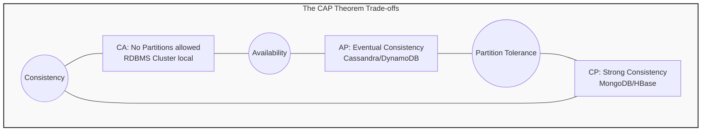
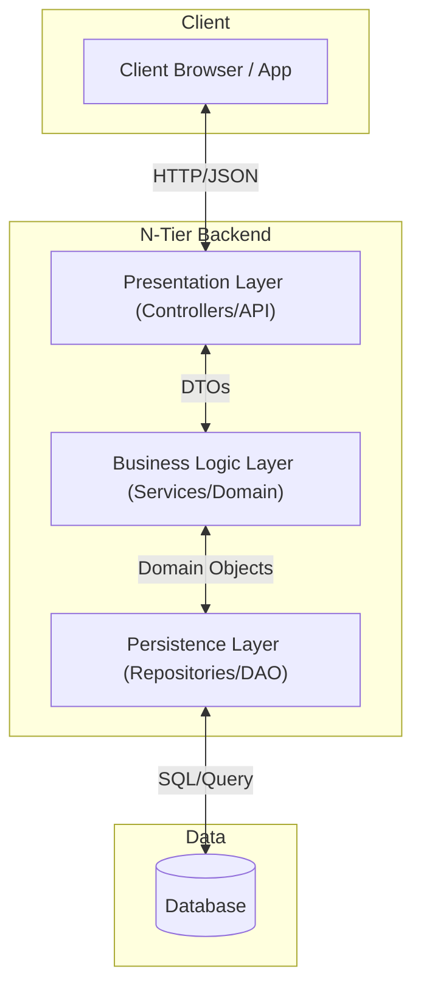
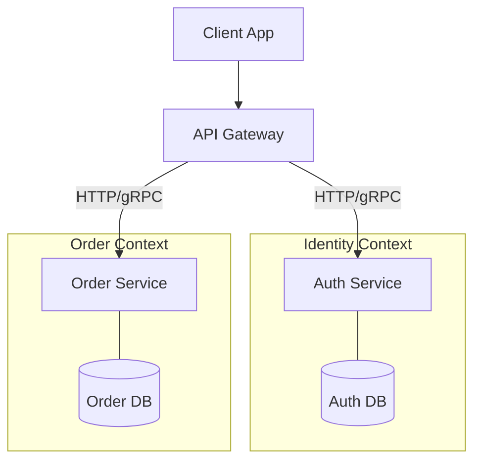
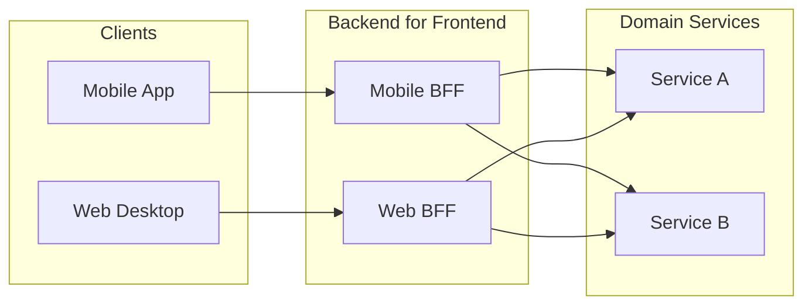
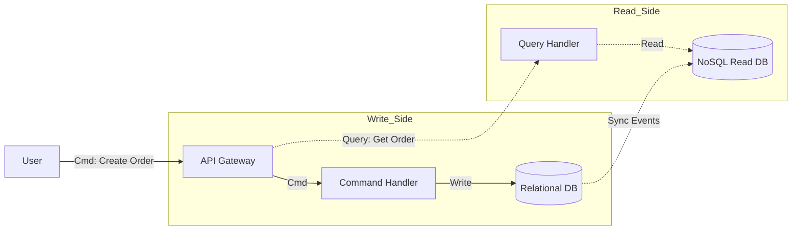
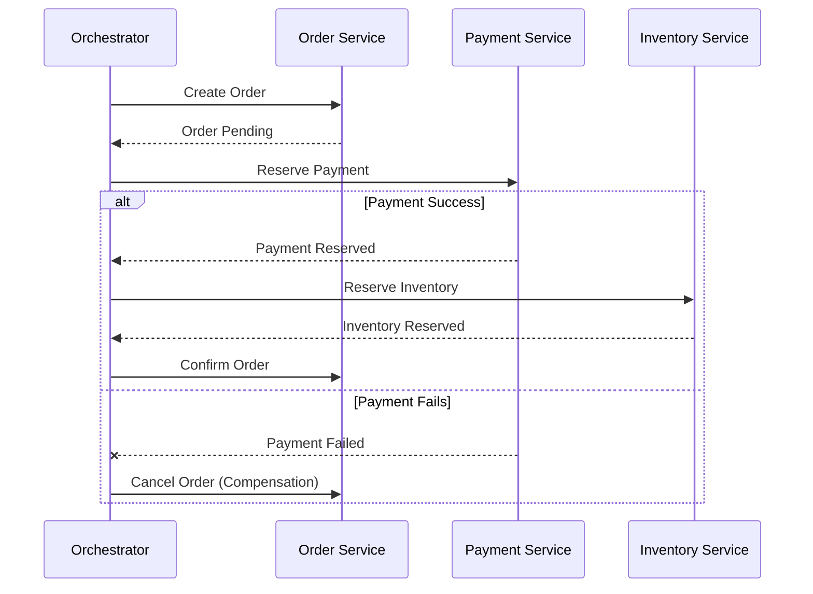

- [1 - Epistemology and Scope of Backend Systems](#1---epistemology-and-scope-of-backend-systems)
	- [1.1 - The Nature of the Backend](#11---the-nature-of-the-backend)
- [2 - Historical Genesis and Theoretical Foundations](#2---historical-genesis-and-theoretical-foundations)
	- [2.1 - The Principle of Separation of Concerns](#21---the-principle-of-separation-of-concerns)
		- [2.1.1 - Modular Decomposition](#211---modular-decomposition)
	- [2.2 - The Evolution of the Client-Server Model](#22---the-evolution-of-the-client-server-model)
		- [2.2.1 - From Mainframes to Distributed Intelligence](#221---from-mainframes-to-distributed-intelligence)
- [3 - Distributed Systems Theory](#3---distributed-systems-theory)
	- [3.1 - The CAP Theorem](#31---the-cap-theorem)
		- [3.1.1 - The "Two of Three" Fallacy](#311---the-two-of-three-fallacy)
	- [3.2 - The PACELC Theorem](#32---the-pacelc-theorem)
	- [3.3 - Time and Ordering in Distributed Systems](#33---time-and-ordering-in-distributed-systems)
		- [3.3.1 - Lamport Clocks](#331---lamport-clocks)
- [4 - Architectural Patterns and Paradigms](#4---architectural-patterns-and-paradigms)
	- [4.1 - Layered Architecture (N-Tier)](#41---layered-architecture-n-tier)
	- [4.2 - The Monolithic Architecture](#42---the-monolithic-architecture)
	- [4.3 - Service-Oriented Architecture (SOA)](#43---service-oriented-architecture-soa)
	- [4.4 - Microservices Architecture](#44---microservices-architecture)
	- [4.5 - Serverless and FaaS](#45---serverless-and-faas)
- [5 - Persistence and Storage Engineering](#5---persistence-and-storage-engineering)
	- [5.1 - Storage Data Structures: B-Trees vs. LSM Trees](#51---storage-data-structures-b-trees-vs-lsm-trees)
		- [5.1.1 - B-Trees (Read-Optimised)](#511---b-trees-read-optimised)
		- [5.1.2 - LSM Trees (Write-Optimised)](#512---lsm-trees-write-optimised)
	- [5.2 - Transaction Isolation Levels](#52---transaction-isolation-levels)
	- [5.3 - Managed vs. Custom Backends](#53---managed-vs-custom-backends)
		- [5.3.1 - Managed Backends (BaaS)](#531---managed-backends-baas)
		- [5.3.2 - Custom Backends](#532---custom-backends)
- [6 - Communication and Interoperability](#6---communication-and-interoperability)
	- [6.1 - Synchronous Protocols: REST vs. gRPC](#61---synchronous-protocols-rest-vs-grpc)
	- [6.2 - The Backend for Frontend (BFF) Pattern](#62---the-backend-for-frontend-bff-pattern)
	- [6.3 - Asynchronous Messaging: Queues vs. Logs](#63---asynchronous-messaging-queues-vs-logs)
- [7 - Advanced Consistency Patterns](#7---advanced-consistency-patterns)
	- [7.1 - CQRS (Command Query Responsibility Segregation)](#71---cqrs-command-query-responsibility-segregation)
	- [7.2 - Event Sourcing](#72---event-sourcing)
	- [7.3 - Sagas: Distributed Transactions](#73---sagas-distributed-transactions)
- [8 - Security Architecture](#8---security-architecture)
	- [8.1 - Zero Trust Architecture](#81---zero-trust-architecture)
	- [8.2 - Authentication and Authorisation](#82---authentication-and-authorisation)
- [9 - Infrastructure and Virtualisation](#9---infrastructure-and-virtualisation)
	- [9.1 - Evolution of Compute Abstractions](#91---evolution-of-compute-abstractions)
- [10 - Conclusion](#10---conclusion)
- [Reference](#reference)

# 1 - Epistemology and Scope of Backend Systems

The domain of backend software engineering represents the intersection of rigorous mathematical theory, distributed systems constraints, and practical architectural design. It is not merely the implementation of server-side logic but the holistic management of system state, data integrity, and communication protocols within a hostile environment defined by network latency and hardware fallibility. While the frontend concerns itself with human-computer interaction and the nuances of user perception, the backend operates within the strict boundaries of computer science theory (governed by the immutable laws of information theory, concurrency control, and distributed consensus).

This report provides an exhaustive analysis of the backend landscape. The analysis proceeds from the axiomatic foundations of software modularity to the complex realities of distributed consistency, culminating in modern paradigms such as serverless micro-virtualisation and identity-centric security architectures.

## 1.1 - The Nature of the Backend

Fundamentally, a backend system acts as the arbiter of truth in a digital application. It is responsible for the persistent storage of data, the enforcement of business invariants, and the secure dissemination of information to authorised clients. This role has evolved from simple data retrieval on mainframes to complex orchestration of distributed services spanning global geographies. The backend engineer must navigate the tension between two opposing forces: **consistency** (the guarantee that all users see the same data) and **availability** (the guarantee that the system remains responsive despite failures).

This dichotomy drives every major architectural decision. It influences the choice between monolithic and microservices architectures, the selection of relational versus non-relational databases, and the adoption of synchronous versus asynchronous communication patterns. To understand the backend is to understand the trade-offs inherent in these choices.

# 2 - Historical Genesis and Theoretical Foundations

The modern backend did not emerge in a vacuum. It is the product of decades of academic research and industrial trial and error. Understanding this lineage is essential for evaluating current technologies, as modern patterns are often rediscoveries or refinements of older principles adapted to new hardware constraints.

## 2.1 - The Principle of Separation of Concerns

The intellectual bedrock of software engineering is the principle of Separation of Concerns (SoC). This concept was formally introduced by Edsger W. Dijkstra in his seminal 1974 paper, "On the Role of Scientific Thought". Dijkstra argued that the complexity of software systems often exceeds the cognitive capacity of the human mind. To manage this, engineers must decompose a system into distinct parts, or "concerns," which can be studied, developed, and maintained in relative isolation.

Dijkstra's insight was that correctness and efficiency are separate concerns. He posited that one should first ensure a program is logically correct before attempting to optimise its performance. This philosophy underpins the modern layered architecture, where business logic is separated from data access optimisation.

### 2.1.1 - Modular Decomposition

Building on Dijkstra’s work, David Parnas published "On the Criteria To Be Used in Decomposing Systems into Modules" in 1972. Parnas challenged the prevailing notion that systems should be decomposed based on flowcharts or execution steps. Instead, he proposed "information hiding" as the primary criterion for modularity.

Parnas argued that a module should encapsulate a specific design decision or "secret," exposing only a stable interface to other modules. This prevents changes in one part of the system from rippling through to others (a concept known today as loose coupling). In modern backend terms, a microservice is effectively a Parnas module bounded by a network interface rather than a memory address space. The service hides its internal database schema and logic, exposing only an API. This direct lineage highlights that microservices are not a new invention but an application of 1970s modularity theory to distributed infrastructure.

## 2.2 - The Evolution of the Client-Server Model

The practical application of these theories led to the development of the client-server architecture. The term "server" appears in Request for Comments (RFC) documents as early as 1969 (RFC 5), originating in the ARPANET era. However, the formal distinction between "client" and "server" was solidified in the late 1970s, notably by researchers like Israel et al. (1978) at Xerox PARC.

### 2.2.1 - From Mainframes to Distributed Intelligence

In the 1970s, computing was dominated by the mainframe model. Terminals were "dumb" input/output devices with no processing power; all logic and state resided on the central mainframe. This offered perfect consistency but poor scalability and user experience.

The 1980s saw the rise of personal computers (PCs), leading to the two-tier client-server model. Here, the client (the PC) possessed processing power and handled the presentation logic, while the server managed the database. This shift reduced the load on the central server but introduced a new problem: business logic became tightly coupled with the user interface on the client. This made updates difficult, as every client device needed to be patched physically or manually.

To resolve this, the industry moved to the Three-Tier (or N-Tier) architecture in the 1990s. This introduced a middle tier (the application server) between the client and the database. This layer hosted the business logic, allowing it to be updated independently of the client interface and the database schema. This evolution demonstrates a persistent trend: the recursive application of Separation of Concerns to solve scalability and maintainability problems.

# 3 - Distributed Systems Theory

As backends scaled beyond single servers to clusters of machines, they entered the domain of distributed systems. Here, the assumptions of reliable hardware and instant communication break down. The backend engineer must grapple with the physics of networks and the logical limits of coordination.

## 3.1 - The CAP Theorem

The most cited theoretical constraint in distributed systems is the CAP Theorem. First conjectured by Eric Brewer at the PODC conference in 2000 and later proven by Seth Gilbert and Nancy Lynch in 2002, the theorem describes the trade-offs inherent in a distributed data store.

The theorem states that a distributed system can provide at most two of the following three properties simultaneously:

  * **Consistency (C):** Every read receives the most recent write or an error. This refers to linearizability, where the system behaves as if it were a single copy of the data.
  * **Availability (A):** Every request received by a non-failing node results in a non-error response, without the guarantee that it contains the most recent write.
  * **Partition Tolerance (P):** The system continues to operate despite an arbitrary number of messages being dropped or delayed by the network between nodes.

### 3.1.1 - The "Two of Three" Fallacy

It is a common misconception that architects can freely choose any two properties (CA, CP, or AP). In a distributed system over a wide-area network (WAN), partitions (P) are inevitable due to hardware failures or network congestion. Therefore, Partition Tolerance is not optional. A system cannot sacrifice P and still be considered distributed; if the network partitions and the system cannot tolerate it, the system fails entirely.

Thus, the real choice is between Consistency (CP) and Availability (AP) during a partition:

  * **CP Systems:** In the event of a partition, the system prefers consistency. Nodes that cannot communicate with the quorum will refuse writes to prevent data divergence. Examples include traditional RDBMS clusters and consensus stores like etcd or ZooKeeper.
  * **AP Systems:** In the event of a partition, the system prefers availability. All nodes accept writes, even if they cannot communicate. This leads to conflicting data states that must be reconciled later (Eventual Consistency). Examples include Cassandra and DynamoDB.

## 3.2 - The PACELC Theorem

The CAP theorem was criticised for being silent on system behaviour when there is no partition. Daniel Abadi proposed the PACELC theorem to address this gap.

> PACELC states: If there is a Partition (P), one must choose between Availability (A) and Consistency (C). Else (E), when the system is running normally, one must choose between Latency (L) and Consistency (C).

This addition is crucial for backend performance. Even in a healthy network, achieving strong consistency (C) requires synchronous replication to multiple nodes. This introduces latency (L) because the write cannot be acknowledged until the data is replicated. Alternatively, one can choose low latency (L) by acknowledging the write immediately and replicating asynchronously, but this risks data loss or inconsistency (C).

## 3.3 - Time and Ordering in Distributed Systems

In a single-machine backend, the operating system clock provides a total ordering of events. If Event A happens at 12:00:01 and Event B at 12:00:02, we know A happened before B. In a distributed system, physical clocks are unreliable due to clock drift (clocks running at different speeds) and lack of perfect synchronisation (NTP is not precise enough for millisecond-level causal ordering).

### 3.3.1 - Lamport Clocks

Leslie Lamport addressed this in his 1978 paper, "Time, Clocks, and the Ordering of Events in a Distributed System". Lamport proved that we cannot rely on physical time to determine the order of events across different machines. Instead, we must rely on "logical clocks" based on causality.

The "Happens-Before" relationship ($\rightarrow$) is defined as:

1.  If $A$ and $B$ are events in the same process and $A$ occurs before $B$, then $A \rightarrow B$.
2.  If $A$ is the sending of a message and $B$ is the receipt of that message, then $A \rightarrow B$.
3.  If $A \rightarrow B$ and $B \rightarrow C$, then $A \rightarrow C$ (transitivity).

If neither $A \rightarrow B$ nor $B \rightarrow A$, the events are concurrent. This theoretical foundation allows backend systems to detect conflicts. For example, if two users edit a document simultaneously (concurrent events), the system uses logical clocks (like Vector Clocks) to detect the collision rather than blindly overwriting one change based on an arbitrary physical timestamp.

# 4 - Architectural Patterns and Paradigms

The organisation of backend code and infrastructure determines the system's scalability, deployability, and maintainability. Several dominant paradigms have emerged, each optimising for different constraints.

## 4.1 - Layered Architecture (N-Tier)

The Layered Architecture is the most traditional pattern, directly implementing the separation of concerns. It organises the system into horizontal layers, where each layer has a specific role and only communicates with adjacent layers.

**Table 1: Standard Layers in N-Tier Architecture**

| Layer              | Primary Responsibility                                                 | Component Examples                       |
| :----------------- | :--------------------------------------------------------------------- | :--------------------------------------- |
| **Presentation**   | Handles HTTP requests, JSON serialisation, and basic input validation. | Controllers, API Gateways                |
| **Business Logic** | Implements core domain rules, calculations, and workflows.             | Service Classes, Domain Models           |
| **Persistence**    | Abstracts data access and object-relational mapping.                   | Repositories, DAOs (Data Access Objects) |
| **Database**       | Physical storage and retrieval of data.                                | PostgreSQL, MongoDB, Redis               |

**Deep Analysis:**
The strict isolation of layers ensures that changes in the database schema do not directly break the API contract exposed to the client. This is "Closed Layer" architecture, where a request must traverse layers in order. However, this can lead to the "Sinkhole Anti-Pattern," where intermediate layers (like the Service layer) perform no logic other than passing data from the Controller to the Repository. This adds latency and code complexity without adding value.

## 4.2 - The Monolithic Architecture

A monolithic backend bundles all functional modules (Authentication, Payments, Inventory, User Profile) into a single deployable artefact (e.g., a single JAR file or binary) running as a single process.

**Advantages:**

  * **Operational Simplicity:** There is only one application to deploy, monitor, and scale.
  * **Performance:** Communication between modules happens in-memory (function calls), which is orders of magnitude faster than network calls.
  * **Transactional Integrity:** It is easy to enforce ACID transactions across different domains (e.g., creating a user and a wallet simultaneously) because they share a single database connection.

**Disadvantages:**

  * **Coupling:** A bug in the inventory module can crash the entire application, including the payment processing.
  * **Scaling Granularity:** One cannot scale just the video processing module; the entire application must be replicated, wasting resources on lighter modules.
  * **Deployment Velocity:** As the code base grows, compile times and startup times increase, slowing down the CI/CD pipeline.

## 4.3 - Service-Oriented Architecture (SOA)

SOA emerged in the late 1990s as a precursor to microservices. It aimed to decompose monoliths into services that communicated via an Enterprise Service Bus (ESB).

**Theory:**
SOA emphasised reusability. Services were often large-grained and designed to be reused across the entire enterprise. The ESB acted as a smart pipe, handling routing, transformation, and business logic.

**Failure Mode:**
The ESB often became a bottleneck and a single point of failure. It concentrated too much logic (the "God Object" anti-pattern) in the middleware, leading to brittle systems that were hard to change. This failure paved the way for microservices, which advocate for "smart endpoints and dumb pipes".

## 4.4 - Microservices Architecture

Microservices decompose the application into small, independent services, each owned by a small team and responsible for a single "Bounded Context" (a concept from Domain-Driven Design).

**Deep Analysis:**
Unlike SOA, microservices avoid the ESB. They communicate via lightweight protocols like HTTP/REST or gRPC. Each service owns its own database, ensuring that no service can bypass another's API to access its data; strict enforcement of Parnas’s information hiding.

**Trade-offs:**

  * **Scalability:** Services can be scaled independently. A CPU-intensive video encoder service can run on high-CPU instances, while a memory-intensive cache service runs on high-RAM instances.
  * **Resilience:** Failures are isolated. If the recommendation engine fails, the core checkout process can still function.
  * **Complexity:** The complexity is not removed; it is shifted from the code structure to the infrastructure. The backend engineer must now manage service discovery, distributed tracing, circuit breakers, and network latency.

## 4.5 - Serverless and FaaS

Serverless computing (Function-as-a-Service or FaaS) abstracts the underlying infrastructure entirely. The developer deploys code (functions), and the cloud provider handles provisioning and scaling.

**Mechanism:**
Functions run in ephemeral environments. When a request arrives, the provider spins up a container or MicroVM, executes the code, and tears it down. This introduces the "Cold Start" problem.

**The Cold Start Problem:**
Mathematically, the total latency $L_{total}$ is defined as:

$$L_{total} = L_{cold} + L_{exec}$$

Where $L_{exec}$ is the function execution time, and $L_{cold}$ is the time to provision the runtime.

$L_{cold}$ includes:

  * Downloading the code package.
  * Starting the MicroVM (e.g., Firecracker).
  * Initialising the language runtime (e.g., JVM startup).
  * Running initialisation code.

Optimisation techniques include "Pre-warming" (keeping instances alive via pinging) and using languages with low startup overhead (Go/Rust vs. Java/Spring). The use of MicroVMs like AWS Firecracker has revolutionised this space by reducing VM startup times to milliseconds.

# 5 - Persistence and Storage Engineering

The backend is the custodian of data. The choice of storage engine dictates the system's read/write performance profile and data durability guarantees.

## 5.1 - Storage Data Structures: B-Trees vs. LSM Trees

At the deepest level, databases are defined by their underlying data structures. Two dominant structures exist: B-Trees and Log-Structured Merge (LSM) Trees.

### 5.1.1 - B-Trees (Read-Optimised)

The B-Tree (and its variant, the B+ Tree) is the default structure for relational databases like PostgreSQL and MySQL.

  * **Mechanism:** Data is stored in fixed-size pages (usually 4KB or 8KB) arranged in a tree structure. A lookup is $O(\log N)$.
  * **Write Amplification:** To modify a single byte, the system must read the entire 4KB page into memory, modify it, and write the full 4KB page back to disk. This is high write amplification.
  * **Advantage:** Fast reads. The tree is balanced, and range scans are efficient because leaf nodes are linked sequentially.

### 5.1.2 - LSM Trees (Write-Optimised)

LSM Trees are used by write-heavy NoSQL databases like Cassandra, RocksDB, and LevelDB.

  * **Mechanism:** Writes are appended to an in-memory buffer (MemTable). When full, this buffer is flushed to disk as an immutable Sorted String Table (SSTable). This is strictly sequential I/O, which is significantly faster than the random I/O of B-Trees.
  * **Read Penalty:** To read a key, the system must check the MemTable and potentially multiple SSTables on disk. This makes reads slower ($O(K \log N)$).
  * **Optimisation:** Bloom Filters are used to probabilistically determine if a key exists in an SSTable, avoiding unnecessary disk reads. Background "Compaction" processes merge SSTables to reclaim space and improve read speed.

## 5.2 - Transaction Isolation Levels

In a concurrent environment, multiple transactions may attempt to modify the same data. Isolation levels define the degree to which transactions are isolated from one another.

**Table 2: Isolation Levels and Anomalies**

| Isolation Level        | Dirty Read | Non-Repeatable Read | Phantom Read | Write Skew |
| :--------------------- | :--------- | :------------------ | :----------- | :--------- |
| **Read Uncommitted**   | Possible   | Possible            | Possible     | Possible   |
| **Read Committed**     | Prevented  | Possible            | Possible     | Possible   |
| **Repeatable Read**    | Prevented  | Prevented           | Possible     | Possible   |
| **Snapshot Isolation** | Prevented  | Prevented           | Prevented    | Possible   |
| **Serializable**       | Prevented  | Prevented           | Prevented    | Prevented  |

  * **Serializable:** The strict theoretical ideal. Transactions execute as if they were serial (one after another). It prevents all concurrency anomalies but typically requires aggressive locking (2-Phase Locking) or frequent aborts, severely limiting throughput.
  * **Snapshot Isolation (SI):** Implemented using Multi-Version Concurrency Control (MVCC). A transaction sees a snapshot of the database at the moment it started. Readers do not block writers, and writers do not block readers.

**The Write Skew Anomaly:** A subtle bug in SI. Suppose a hospital requires at least one doctor on call. Two doctors, Alice and Bob, are currently on call. Both try to leave simultaneously. Transaction A checks: "Is Bob on call? Yes. Alice leaves." Transaction B checks: "Is Alice on call? Yes. Bob leaves." Both transactions commit successfully under SI, leaving zero doctors on call. Serializable isolation would force one to abort.

## 5.3 - Managed vs. Custom Backends

Modern engineering often involves choosing between building a custom backend or using a Backend-as-a-Service (BaaS).

### 5.3.1 - Managed Backends (BaaS)

Services like Firebase and Supabase provide authentication, databases, and APIs out of the box.

  * **Firebase:** Uses a proprietary NoSQL store (Firestore). It excels at real-time synchronisation for mobile apps but suffers from vendor lock-in. Complex queries (aggregations, joins) are difficult or impossible without duplicating data.
  * **Supabase:** An open-source alternative built on standard PostgreSQL. It offers the ease of BaaS but exposes the full power of SQL. Because it is standard Postgres, users can migrate data out easily, mitigating vendor lock-in.

### 5.3.2 - Custom Backends

Building a backend from scratch (e.g., using Spring Boot, Django, or Node.js) offers total control.

  * **Necessity:** Required for complex business logic, legacy system integration, or specific performance tuning that generic BaaS cannot support.
  * **Cost:** Higher initial development time and ongoing maintenance (patching servers, managing database backups).

# 6 - Communication and Interoperability

Microservices must communicate over a network. The choice of protocol affects latency, bandwidth, and coupling.

## 6.1 - Synchronous Protocols: REST vs. gRPC

  * **REST (Representational State Transfer):** The de facto standard for public web APIs. It typically uses JSON over HTTP/1.1.
      * **Pros:** Stateless, cacheable, and human-readable. Excellent tooling support.
      * **Cons:** HTTP/1.1 suffers from Head-of-Line Blocking (one slow request blocks the connection). JSON is verbose and serialisation/deserialisation is CPU-intensive.
  * **gRPC (Google Remote Procedure Call):** A high-performance framework using HTTP/2 and Protocol Buffers (Protobuf).
      * **Mechanism:** HTTP/2 supports multiplexing (multiple streams over a single TCP connection) and header compression (HPACK). Protobuf is a binary format, resulting in significantly smaller payloads than JSON.
      * **Use Case:** Ideal for internal service-to-service communication where low latency and high throughput are critical.

## 6.2 - The Backend for Frontend (BFF) Pattern

As clients diversified (Mobile, Web, IoT), the "One Size Fits All" API became problematic. Mobile devices might need fewer fields than the web desktop view to save battery and bandwidth.

The BFF pattern proposes creating a specific backend service for each frontend client.

  * **Function:** The BFF calls downstream domain services and aggregates/formats the data specifically for its client. It acts as a translation layer.
  * **Comparison to GraphQL:** GraphQL allows the client to specify exactly what data it needs, solving the over-fetching problem. However, GraphQL pushes query complexity to the client and can be difficult to optimise on the server ($N+1$ query problem). BFF keeps the complexity on the server, allowing the backend team to optimise specific query paths for the client.

## 6.3 - Asynchronous Messaging: Queues vs. Logs

Asynchronous communication decouples services in time. If the Consumer is down, the Producer can still send messages.

  * **Message Queues (RabbitMQ):** Based on the AMQP protocol. Messages are pushed to consumers. Once a consumer acknowledges processing, the message is deleted from the queue.
      * **Pattern:** Smart broker, dumb consumer. The broker manages routing and delivery state.
      * **Use Case:** Task processing (e.g., "Resize this image") where tasks should be distributed among workers.
  * **Log-Based Brokers (Apache Kafka):** Based on the concept of a distributed commit log. Messages are appended to the end of a log and persisted on disk for a retention period (e.g., 7 days).
      * **Pattern:** Dumb broker, smart consumer. The broker just stores data. The consumer tracks its own position (offset) in the log.
      * **Use Case:** Event streaming, Data pipelines, Event Sourcing. Because consumers read sequentially, Kafka can achieve massive throughput (millions of messages/sec).

# 7 - Advanced Consistency Patterns

In distributed systems where ACID transactions across services are impossible (due to CAP), we employ eventual consistency patterns.

## 7.1 - CQRS (Command Query Responsibility Segregation)

CQRS splits the application into two distinct parts: the Command side (writes) and the Query side (reads).

**Theory:**
The data model optimised for writing (normalised, 3rd Normal Form) is often inefficient for reading (which often requires joins). CQRS allows using different models (and even different technologies)for each side.

  * **Write Side:** Uses a relational DB (PostgreSQL) to enforce integrity.
  * **Read Side:** Uses a NoSQL DB (Elasticsearch, Redis) containing denormalised data optimised for specific views.
  * **Synchronization:** Events published by the Write side are consumed by the Read side to update its views. This introduces a "consistency lag".

## 7.2 - Event Sourcing

Traditional databases store the current state of an entity. Event Sourcing stores the sequence of events that led to that state.

**Mechanism:**
To get the current balance of a bank account, the system reads all events (AccountOpened, Deposited, Withdrawn) and replays them.

  * **Auditability:** The log is an immutable audit trail. One can travel back in time to see the state at any point.
  * **Snapshots:** Replaying 10,000 events is slow. Systems periodically create a "Snapshot" of the state. The replay then starts from the latest snapshot plus subsequent events.
  * **Schema Evolution:** When the event structure changes (e.g., adding a currency field), the system uses "Upcasting." The Upcaster is a function that transforms the old event structure into the new one on-the-fly during replay, avoiding the need to migrate the immutable data on disk.

## 7.3 - Sagas: Distributed Transactions

To manage business processes spanning multiple microservices (e.g., "Order Service" -\> "Payment Service" -\> "Inventory Service"), we use Sagas.

**Concept:**
A Saga is a sequence of local transactions. If one step fails, the Saga executes "Compensating Transactions" to undo the changes made by previous steps.

  * **Choreography:** Decentralised. Service A publishes an event OrderCreated. Service B listens and reserves credit. If B fails, it publishes CreditFailed, and A listens to cancel the order. Simple but hard to visualise complex flows.
  * **Orchestration:** Centralised. A "Saga Orchestrator" service tells Service A to create order, then tells Service B to reserve credit. If B fails, the Orchestrator tells A to cancel. Provides a clear view of the process state but introduces a single point of failure.

# 8 - Security Architecture

Security in modern backends has shifted from "Perimeter Defence" to "Zero Trust."

## 8.1 - Zero Trust Architecture

The traditional security model resembled a castle: hard outer walls (Firewalls) and a soft interior. Once an attacker breached the perimeter, they had trusted access to internal services. Zero Trust (NIST SP 800-207) assumes that the network is always hostile.

**Tenets:**

  * **Never Trust, Always Verify:** Every request, even from inside the network, must be authenticated and authorised.
  * **Identity is the Perimeter:** Access controls are based on identity (User ID, Device Health), not network location (IP address).
  * **Least Privilege:** Users/Services are granted the minimum permissions necessary.

## 8.2 - Authentication and Authorisation

  * **OAuth 2.0:** The industry standard for delegation. The Authorisation Code Flow is preferred for backends. It ensures the Access Token is delivered directly to the backend server, never passing through the insecure browser.
  * **JWT (JSON Web Token):** A compact, URL-safe token format (RFC 7519).
      * **Structure:** Header (Algorithm), Payload (Claims like UserID, Expiry), Signature.
      * **Statelessness:** The backend can verify the token by checking the signature (using a secret key or public key) without querying the database for every request. This massively improves read scalability.
  * **Sender-Constrained Tokens:** To prevent token theft (replay attacks), advanced backends use Mutual TLS (mTLS). The Access Token is cryptographically bound to the client's mTLS certificate. If an attacker steals the token but does not possess the client's private certificate key, the token is useless.

# 9 - Infrastructure and Virtualisation

The backend software must execute on physical hardware. The abstraction of this hardware has evolved to maximise utilisation and isolation.

## 9.1 - Evolution of Compute Abstractions

  * **Bare Metal:** Applications run directly on the OS. High performance but poor isolation and utilisation.
  * **Virtual Machines (VMs):** A Hypervisor (e.g., Xen, KVM) virtualises the hardware. Each VM runs a full Guest OS. High isolation but slow startup (minutes) and high overhead (GBs of RAM).
  * **Containers (Docker):** Uses OS-level virtualisation (Linux cgroups and namespaces). Containers share the Host OS kernel. Fast startup (seconds) and low overhead, but weaker isolation (kernel exploits can escape the container).
  * **MicroVMs (Firecracker):** Developed by AWS for Lambda. Firecracker is a minimalist Virtual Machine Monitor (VMM) that uses KVM to create VMs that look and feel like containers.
      * **Performance:** Starts in \<125ms with \<5MB memory overhead.
      * **Security:** Provides the strong hardware virtualisation security of a VM with the speed of a container. This is the technology enabling secure, multi-tenant Serverless computing.

# 10 - Conclusion

The discipline of backend engineering is a continuous exercise in managing complexity and trade-offs. There is no "perfect" architecture. The Monolith offers simplicity but lacks scalability. Microservices offer agility but introduce distributed system complexity. SQL databases offer consistency at the cost of partition tolerance, while NoSQL offers availability at the cost of consistency.

The modern backend engineer must look beyond the syntax of programming languages and understand these fundamental theoretical constraints. Whether implementing a Saga to manage distributed consistency, choosing an LSM-tree database for a write-heavy workload, or adopting Zero Trust security to protect against internal threats, the successful architect is one who understands not just how to implement a pattern, but why it is necessary and what compromise it entails. As we move towards edge computing and increasingly granular serverless functions, these foundational principles—Separation of Concerns, CAP, and Consensus(remain the immutable compass guiding the design of robust, high-quality software systems).

# Reference

* **Dijkstra's Separation of Concerns:** [https://en.wikipedia.org/wiki/Separation\_of\_concerns](https://en.wikipedia.org/wiki/Separation_of_concerns)
* **Parnas Modules:** [https://www.researchgate.net/publication/200085877\_On\_the\_Criteria\_To\_Be\_Used\_in\_Decomposing\_Systems\_into\_Modules](https://www.researchgate.net/publication/200085877_On_the_Criteria_To_Be_Used_in_Decomposing_Systems_into_Modules)
* **CAP Theorem (Brewer):** [https://dspace.mit.edu/handle/1721.1/79112](https://dspace.mit.edu/handle/1721.1/79112)
* **Lamport Clocks:** [https://www.microsoft.com/en-us/research/publication/time-clocks-ordering-events-distributed-system/](https://www.microsoft.com/en-us/research/publication/time-clocks-ordering-events-distributed-system/)
* **Microservices Trade-offs:** [https://tradeoffs.dev/article/The\_Tradeoffs\_of\_Microservices\_vs\_Monolithic\_Architecture.html](https://tradeoffs.dev/article/The_Tradeoffs_of_Microservices_vs_Monolithic_Architecture.html)
* **Firecracker MicroVM:** [https://www.usenix.org/system/files/nsdi20-paper-agache.pdf](https://www.usenix.org/system/files/nsdi20-paper-agache.pdf)
* **JWT Standard (RFC 7519):** [https://datatracker.ietf.org/doc/html/rfc7519](https://datatracker.ietf.org/doc/html/rfc7519)
* **OAuth 2.0 Standard (RFC 6749):** [https://datatracker.ietf.org/doc/html/rfc6749](https://datatracker.ietf.org/doc/html/rfc6749)
* **Zero Trust Architecture (NIST):** [https://nvlpubs.nist.gov/nistpubs/specialpublications/NIST.SP.800-207.pdf](https://nvlpubs.nist.gov/nistpubs/specialpublications/NIST.SP.800-207.pdf)
* **BFF Pattern:** [https://samnewman.io/patterns/architectural/bff/](https://samnewman.io/patterns/architectural/bff/)
* **Event Sourcing Snapshots:** [https://docs.eventsourcingdb.io/fundamentals/snapshots/](https://docs.eventsourcingdb.io/fundamentals/snapshots/)
* **LSM vs B-Tree:** [https://tikv.org/deep-dive/key-value-engine/b-tree-vs-lsm/](https://tikv.org/deep-dive/key-value-engine/b-tree-vs-lsm/)
