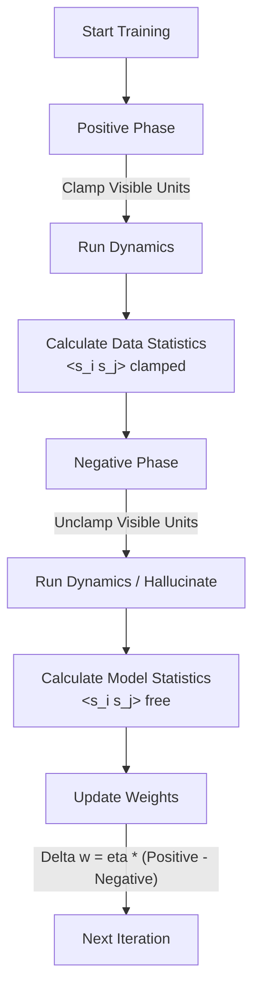
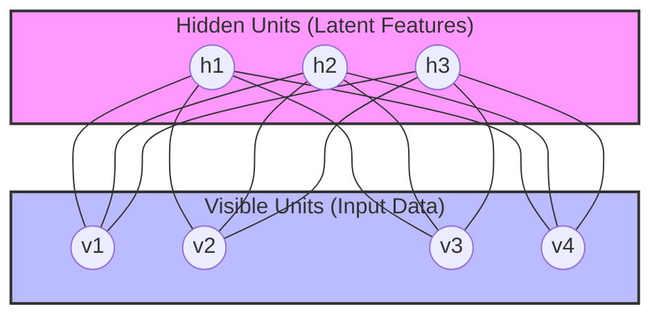
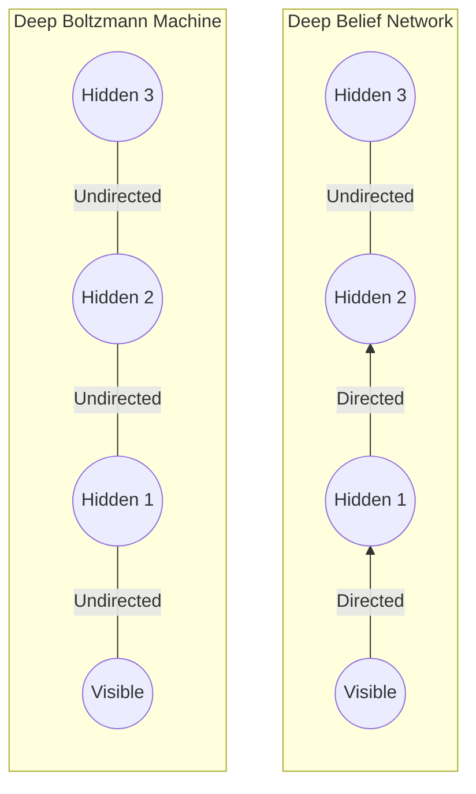

- [1 - Introduction: The Thermodynamic Roots of Computation](#1---introduction-the-thermodynamic-roots-of-computation)
- [2 - Foundations in Statistical Mechanics](#2---foundations-in-statistical-mechanics)
  - [2.1 - The Ising Model and Magnetic Dipoles](#21---the-ising-model-and-magnetic-dipoles)
  - [2.2 - The Hopfield Network Precursor](#22---the-hopfield-network-precursor)
  - [2.3 - The Boltzmann Transition: Introducing Stochasticity](#23---the-boltzmann-transition-introducing-stochasticity)
- [3 - Architecture of the General Boltzmann Machine](#3---architecture-of-the-general-boltzmann-machine)
  - [3.1 - Visible and Hidden Units: The Latent Variable Revolution](#31---visible-and-hidden-units-the-latent-variable-revolution)
  - [3.2 - The Energy Function](#32---the-energy-function)
  - [3.3 - Stochastic Dynamics and Equilibrium](#33---stochastic-dynamics-and-equilibrium)
- [4 - Mathematical Derivation of the Learning Algorithm](#4---mathematical-derivation-of-the-learning-algorithm)
  - [4.1 - Maximum Likelihood Estimation (MLE)](#41---maximum-likelihood-estimation-mle)
  - [4.2 - Deriving the Gradient](#42---deriving-the-gradient)
  - [4.3 - The Hebbian Learning Rule](#43---the-hebbian-learning-rule)
- [5 - The Intractability Problem and The Restricted Boltzmann Machine](#5---the-intractability-problem-and-the-restricted-boltzmann-machine)
  - [5.1 - Structural Constraint: The RBM](#51---structural-constraint-the-rbm)
  - [5.2 - Factorisation of Conditional Probabilities](#52---factorisation-of-conditional-probabilities)
- [6 - Training RBMs: Contrastive Divergence](#6---training-rbms-contrastive-divergence)
  - [6.1 - The CD-k Algorithm](#61---the-cd-k-algorithm)
  - [6.2 - Persistent Contrastive Divergence (PCD)](#62---persistent-contrastive-divergence-pcd)
- [7 - Deep Architectures and the Generative Era](#7---deep-architectures-and-the-generative-era)
  - [7.1 - Greedy Layer-wise Pre-training](#71---greedy-layer-wise-pre-training)
  - [7.2 - Deep Belief Networks vs. Deep Boltzmann Machines](#72---deep-belief-networks-vs-deep-boltzmann-machines)
- [8 - Modern Renaissance: Energy-Based Models and Transformers](#8---modern-renaissance-energy-based-models-and-transformers)
  - [8.1 - Modern Hopfield Networks: "Hopfield Networks is All You Need"](#81---modern-hopfield-networks-hopfield-networks-is-all-you-need)
  - [8.2 - Energy Transformers](#82---energy-transformers)
- [9 - Quantum Boltzmann Machines (QBMs)](#9---quantum-boltzmann-machines-qbms)
  - [9.1 - The Quantum Hamiltonian](#91---the-quantum-hamiltonian)
  - [9.2 - Tunnelling vs. Thermal Hopping: The Sampling Advantage](#92---tunnelling-vs-thermal-hopping-the-sampling-advantage)
  - [9.3 - Semi-Quantum RBMs (sqRBM)](#93---semi-quantum-rbms-sqrbm)
- [10 - Case Study: The "Bars and Stripes" Problem](#10---case-study-the-bars-and-stripes-problem)
- [11 - Conclusion](#11---conclusion)
- [References](#references)

# 1 - Introduction: The Thermodynamic Roots of Computation

The Boltzmann machine represents a seminal convergence of statistical mechanics and artificial intelligence, standing as one of the most theoretically elegant frameworks in the history of connectionism. Named in honour of Ludwig Boltzmann, the father of statistical thermodynamics, this architecture operationalises the physical principles governing thermal equilibrium to solve computational problems of learning and inference. Unlike the deterministic logic that characterises the perceptron or the feedforward neural network, the Boltzmann machine is fundamentally stochastic, treating learning not merely as error minimisation, but as the optimisation of an energy landscape.

The Boltzmann machine is far more than a historical antecedent to modern deep learning; it constitutes a rigorous probabilistic graphical model that introduced the critical concept of latent variables (or "hidden units") into neural computation. By partitioning the network into visible units that interface with the environment and hidden units that capture higher-order statistical dependencies, the Boltzmann machine provided the first mathematically sound method for training recurrent neural networks to model arbitrary probability distributions.

The trajectory of the Boltzmann machine mirrors the evolution of the field itself. Originating from the deterministic Hopfield networks and the Ising models of ferromagnetism, it evolved into the fully connected General Boltzmann Machine (GBM), which, while theoretically powerful, proved computationally intractable due to the complexity of the partition function. This necessitated the development of the Restricted Boltzmann Machine (RBM), a bipartite approximation that became the engine of the "Deep Learning Renaissance" in the mid-2000s through layer-wise pre-training.

In contemporary research, the principles of the Boltzmann machine have experienced a profound resurgence. The thermodynamic perspective has found new relevance in the study of Transformers, where self-attention mechanisms have been mathematically linked to the energy update rules of "Modern Hopfield Networks" or Dense Associative Memories. Furthermore, the advent of quantum computing has revitalised the architecture; Quantum Boltzmann Machines (QBMs) utilise non-commuting Hamiltonians and quantum tunnelling to sample from complex distributions, promising to overcome the sampling bottlenecks that constrained their classical predecessors.

This report offers an exhaustive technical analysis of the Boltzmann machine. We shall derive its learning algorithms from first principles, analyse the statistical mechanics that govern its dynamics, and trace its lineage from the spin glasses of the 1980s to the quantum processors and large language models of the present day.

-----

# 2 - Foundations in Statistical Mechanics

To comprehend the operation of a Boltzmann machine, one must first appreciate the physical substrates from which it was derived. The architecture is effectively a stochastic generalisation of the Hopfield network, which itself is isomorphic to the Ising model used to describe phase transitions in ferromagnetic materials.

## 2.1 - The Ising Model and Magnetic Dipoles

The intellectual lineage begins with the Ising model, a mathematical model of ferromagnetism in statistical mechanics. The model consists of discrete variables (spins) representing magnetic dipole moments of atomic spins that can be in one of two states ($+1$ or $-1$). The spins are arranged in a graph (typically a lattice), allowing each spin to interact with its neighbours. The energy of a configuration $\sigma$ is given by the Hamiltonian:

$$H(\sigma) = - \sum_{\langle i, j \rangle} J_{ij} \sigma_i \sigma_j - \mu \sum_j h_j \sigma_j$$

where $J_{ij}$ represents the interaction strength between spins $i$ and $j$, and $h_j$ represents an external magnetic field. The system tends towards a state of minimum energy, aligning spins with the external field and with each other (if $J_{ij} > 0$).

At a non-zero temperature $T$, the system does not simply settle into the single lowest energy state but fluctuates among states. The probability of finding the system in a specific configuration $\sigma$ is given by the Boltzmann distribution (also known as the Gibbs measure):

$$P(\sigma) = \frac{e^{-H(\sigma) / k_B T}}{Z}$$

Here, $k_B$ is the Boltzmann constant, and $Z$ is the partition function, a normalising constant defined as the sum of Boltzmann factors over all possible configurations. This probabilistic formulation is the cornerstone of the Boltzmann machine.

## 2.2 - The Hopfield Network Precursor

In 1982, John Hopfield bridged physics and computation by proposing a network of binary neurons with symmetric connections, demonstrating that such a system could serve as a content-addressable memory. In a Hopfield network, the state of a neuron $s_i$ is determined deterministically by the sign of the weighted sum of its inputs.

The energy function of a Hopfield network is defined as:

$$E = - \frac{1}{2} \sum_{i \neq j} w_{ij} s_i s_j - \sum_{i} \theta_i s_i$$

where $w_{ij}$ is the symmetric weight between units $i$ and $j$, $s_i \in \{-1, +1\}$ is the state of unit $i$, and $\theta_i$ is the threshold. The system evolves by iteratively updating units to lower this energy. Because the energy is bounded from below and the update rule is monotonic, the system is guaranteed to converge to a local minimum.

**Table 1: The Transition from Physics to Computation**

| Physical Concept (Ising Model)  | Computational Concept (Hopfield/Boltzmann) |
| :------------------------------ | :----------------------------------------- |
| Atom / Spin                     | Neuron / Unit                              |
| Magnetic Moment (+1/-1)         | Activation State (1/0 or +1/-1)            |
| Interaction Strength ($J_{ij}$) | Synaptic Weight ($w_{ij}$)                 |
| External Field ($h_i$)          | Bias / Threshold ($b_i$)                   |
| Thermal Fluctuation             | Stochastic Noise / Sampling                |
| Ground State                    | Global Solution / Memory                   |
| Annealing                       | Optimisation Strategy                      |

While revolutionary, the Hopfield network suffered from severe limitations. It was purely deterministic; once initialised, its trajectory was fixed, causing it to become trapped in spurious local minima (states that are low energy but do not correspond to any stored memory). Furthermore, it lacked the capacity to model complex probability distributions or to learn representations of data that were not explicitly presented as prototypes.

## 2.3 - The Boltzmann Transition: Introducing Stochasticity

The Boltzmann machine, introduced by Ackley, Hinton, and Sejnowski in 1985, addressed the limitations of the Hopfield network by introducing thermodynamic stochasticity. By replacing the deterministic threshold function with a probabilistic decision rule, the system gained the ability to escape local energy minima.

This process is analogous to simulated annealing, a technique derived from metallurgy where a material is heated (high stochasticity) and then slowly cooled to allow atoms to arrange themselves into a crystal lattice with minimal defects (global energy minimum). In the Boltzmann machine, the "temperature" parameter $T$ controls the level of noise. At high $T$, units switch states almost randomly, allowing the system to explore the state space broadly. As $T$ approaches zero, the system behaves like a deterministic Hopfield network, settling into the nearest energy minimum.

-----

# 3 - Architecture of the General Boltzmann Machine

The General Boltzmann Machine (GBM) is a fully connected network of symmetrically coupled stochastic units. Crucially, and distinct from the Hopfield network, the units are partitioned into two distinct functional groups: visible units ($V$) and hidden units ($H$).

## 3.1 - Visible and Hidden Units: The Latent Variable Revolution

The separation of units into visible and hidden sets allows the Boltzmann machine to learn latent representations of data, a feature absent in standard Hopfield networks.

  * **Visible Units ($V$):** These provide the interface with the environment. During training, input data (and potentially output labels) are "clamped" to these units, forcing them into specific states.
  * **Hidden Units ($H$):** These units have no direct connection to the external world. Their role is to capture higher-order correlations and statistical dependencies between the visible units that cannot be modelled by direct pairwise interactions.

This architecture enables the machine to model complex distributions. While a network without hidden units is limited to modelling only second-order correlations (pairwise relationships) between input variables, the addition of hidden units allows the network to approximate any discrete probability distribution to arbitrary precision, provided enough hidden units are available.

## 3.2 - The Energy Function

The energy of a state defined by visible vector $\mathbf{v}$ and hidden vector $\mathbf{h}$ is given by the scalar function:

$$ E(\mathbf{v}, \mathbf{h}) = - \sum_{i \in V, j \in H} w_{ij} v_i h_j - \frac{1}{2} \sum_{i, k \in V} L_{ik} v_i v_k - \frac{1}{2} \sum_{j, m \in H} J_{jm} h_j h_m - \sum_{i \in V} b_i v_i - \sum_{j \in H} c_j h_j $$

In this general form:

  * $w_{ij}$ represents weights between visible and hidden units.
  * $L_{ik}$ represents lateral connections between visible units.
  * $J_{jm}$ represents lateral connections between hidden units.
  * $b_i$ and $c_j$ are biases for visible and hidden units, respectively.

The negation in the formula ensures that high correlations between units with positive weights lower the energy of the system, making such states more probable according to the Boltzmann distribution.

## 3.3 - Stochastic Dynamics and Equilibrium

In a Boltzmann machine, neurons are binary stochastic units. The probability of a unit $s_i$ being "on" ($s_i=1$) is given by the logistic sigmoid function of its total input, scaled by a temperature parameter $T$. Let $\Delta E_i$ be the difference in energy between the state where unit $i$ is off ($s_i=0$) and on ($s_i=1$), given the states of all other units:

$$\Delta E_i = E(s_i=0) - E(s_i=1) = \sum_{j} w_{ij} s_j + b_i$$

The update rule is:

$$P(s_i=1 | \mathbf{s}_{-i}) = \frac{1}{1 + \exp(-\Delta E_i / T)}$$

This stochastic update rule ensures that, if units are updated sequentially (asynchronous dynamics), the network will eventually reach thermal equilibrium. At equilibrium, the probability of the network occupying a global state vector $\mathbf{s} = (\mathbf{v}, \mathbf{h})$ is governed by the Boltzmann distribution:

$$P(\mathbf{v}, \mathbf{h}) = \frac{e^{-E(\mathbf{v}, \mathbf{h})/T}}{Z}$$

where $Z$ is the partition function:

$$Z = \sum_{\mathbf{v}', \mathbf{h}'} e^{-E(\mathbf{v}', \mathbf{h}')/T}$$

It is this partition function $Z$, obtained by summing over all $2^{|V|+|H|}$ possible states, that serves as both the theoretical bedrock and the computational Achilles' heel of the Boltzmann machine.

-----

# 4 - Mathematical Derivation of the Learning Algorithm

The central objective of learning in a Boltzmann machine is to adjust the weights and biases such that the probability distribution defined by the machine, $P_{model}(\mathbf{v})$, matches the empirical distribution of the training data, $P_{data}(\mathbf{v})$. This is formally equivalent to maximising the log-likelihood of the training data.

## 4.1 - Maximum Likelihood Estimation (MLE)

Given a training set of vectors $\mathcal{D} = \{\mathbf{v}^{(1)}, \dots, \mathbf{v}^{(N)}\}$, we seek to maximise the average log-likelihood:

$$\mathcal{L} = \frac{1}{N} \sum_{\mathbf{v} \in \mathcal{D}} \log P_{model}(\mathbf{v})$$

The probability of a visible vector $\mathbf{v}$ is the marginal probability obtained by summing over all possible hidden states:

$$P_{model}(\mathbf{v}) = \frac{\sum_{\mathbf{h}} e^{-E(\mathbf{v}, \mathbf{h})}}{Z}$$

Substituting this into the log-likelihood expression:

$$ \mathcal{L} = \frac{1}{N} \sum_{\mathbf{v} \in \mathcal{D}} \left( \log \sum_{\mathbf{h}} e^{-E(\mathbf{v}, \mathbf{h})} - \log \sum_{\mathbf{v}', \mathbf{h}'} e^{-E(\mathbf{v}', \mathbf{h}')} \right) $$

The first term represents the unnormalised probability of the data, while the second term (involving $Z$) ensures normalisation.

## 4.2 - Deriving the Gradient

To find the optimal weights, we perform gradient ascent on the log-likelihood. We compute the partial derivative with respect to a specific weight $w_{ij}$. This derivation reveals the "two-phase" nature of Boltzmann learning.

**Step 1: Derivative of the Data Term**
$$ \frac{\partial}{\partial w_{ij}} \left( \log \sum_{\mathbf{h}} e^{-E(\mathbf{v}, \mathbf{h})} \right) = \frac{1}{\sum_{\mathbf{h}} e^{-E(\mathbf{v}, \mathbf{h})}} \sum_{\mathbf{h}} e^{-E(\mathbf{v}, \mathbf{h})} \frac{\partial (-E(\mathbf{v}, \mathbf{h}))}{\partial w_{ij}} $$

Since $-E(\mathbf{v}, \mathbf{h})$ includes the term $w_{ij} v_i h_j$, the derivative is $v_i h_j$.

$$ = \sum_{\mathbf{h}} \frac{e^{-E(\mathbf{v}, \mathbf{h})}}{\sum_{\mathbf{h}'} e^{-E(\mathbf{v}, \mathbf{h}')}} v_i h_j = \sum_{\mathbf{h}} P(\mathbf{h} | \mathbf{v}) v_i h_j = \langle v_i h_j \rangle_{data} $$

This term is the expected value of the product of the states of units $i$ and $j$ when the visible units are clamped to the data vector $\mathbf{v}$.

**Step 2: Derivative of the Partition Function (Model Term)**
$$ \frac{\partial}{\partial w_{ij}} \left( \log Z \right) = \frac{1}{Z} \frac{\partial Z}{\partial w_{ij}} = \frac{1}{Z} \sum_{\mathbf{v}', \mathbf{h}'} e^{-E(\mathbf{v}', \mathbf{h}')} v'_i h'j $$
$$ = \sum_{\mathbf{v}', \mathbf{h}'} P(\mathbf{v}', \mathbf{h}') v'_i h'j = \langle v_i h_j \rangle_{model} $$

This term is the expected value of the product of the states when the machine is running freely, sampling from its own equilibrium distribution.

**Step 3: The Combined Gradient**
Combining these terms yields the gradient for a single data point. Averaging over the dataset:

$$ \frac{\partial \mathcal{L}}{\partial w_{ij}} = \langle v_i h_j \rangle_{data} - \langle v_i h_j \rangle_{model} $$

## 4.3 - The Hebbian Learning Rule

The weight update rule is thus:

$$\Delta w_{ij} = \eta ( \langle s_i s_j \rangle_{clamped} - \langle s_i s_j \rangle_{free} )$$

where $\eta$ is the learning rate.
This rule is a form of differential Hebbian learning.

  * **Positive Phase (Wake Phase):** The network is "clamped" to the training data. The visible units are fixed, and the hidden units thermally settle. We measure the correlation $\langle s_i s_j \rangle_{clamped}$. This pushes weights to lower the energy of states compatible with the data.
  * **Negative Phase (Sleep Phase):** The network runs "free" (unclamped). The entire network settles into equilibrium based on its internal dynamics. We measure the correlation $\langle s_i s_j \rangle_{free}$. This term raises the energy of the states the model naturally prefers (its "dreams" or "hallucinations"), thereby decreasing their probability.

If the model correctly represents the data, the statistics of the free phase will match the clamped phase, the gradient becomes zero, and learning ceases.

-----

# 5 - The Intractability Problem and The Restricted Boltzmann Machine

While the learning rule derived above is analytically pristine, it is computationally catastrophic for the General Boltzmann Machine. The "Negative Phase" requires calculating $\langle s_i s_j \rangle_{model}$, which theoretically demands summing over all $2^{|V|+|H|}$ possible states to normalise the distribution (calculating $Z$). For a network of just 100 units, the state space is $2^{100} \approx 10^{30}$, rendering exact calculation impossible.

Historically, researchers attempted to approximate this using Markov Chain Monte Carlo (MCMC) methods like Gibbs sampling or simulated annealing. However, in a fully connected network, the time required for the Markov chain to "mix" (reach equilibrium) can be prohibitively long. This limitation effectively stalled the practical application of general Boltzmann machines for decades.

## 5.1 - Structural Constraint: The RBM

The breakthrough that propelled Boltzmann machines back into the spotlight was the introduction of structural restrictions. The Restricted Boltzmann Machine (RBM), initially proposed by Smolensky in 1986 under the name "Harmonium", imposes a bipartite graph structure.

In an RBM:

  * Connections exist only between visible and hidden units.
  * There are no connections between visible units ($L_{ik} = 0$).
  * There are no connections between hidden units ($J_{jm} = 0$).

<!-- end list -->

This restriction has profound statistical implications. It renders the hidden units conditionally independent given the visible units, and vice versa.

## 5.2 - Factorisation of Conditional Probabilities

Because of the independence structure, we can calculate the activation probabilities of the entire hidden layer in a single parallel step, without iterative settling. The probability of a hidden unit $h_j$ being active given a visible vector $\mathbf{v}$ is:

$$P(h_j = 1 | \mathbf{v}) = \sigma \left( c_j + \sum_{i} v_i w_{ij} \right)$$

Similarly, we can reconstruct the visible layer from the hidden layer:

$$P(v_i = 1 | \mathbf{h}) = \sigma \left( b_i + \sum_{j} h_j w_{ij} \right)$$

where $\sigma(x) = (1 + e^{-x})^{-1}$ is the logistic sigmoid function.

This factorisation removes the need for lengthy settling times during the positive phase and drastically simplifies inference. However, the negative phase (computing the model's free-running equilibrium) remains problematic because the marginal distribution of the visible units $P(\mathbf{v})$ is still complex.

-----

# 6 - Training RBMs: Contrastive Divergence

To train RBMs efficiently, Geoffrey Hinton (2002) introduced Contrastive Divergence (CD), an approximation algorithm that circumvents the need to reach perfect thermal equilibrium in the negative phase.

## 6.1 - The CD-k Algorithm

Standard maximum likelihood learning requires the negative phase statistics to be collected from the model's equilibrium distribution. Reaching this equilibrium requires running a Gibbs sampler for theoretically infinite steps ($k \to \infty$).

Hinton observed that for learning to occur, we do not strictly need the difference between the data statistics and the perfect equilibrium statistics. Instead, we can verify whether the model is drifting away from the data. If we initialise the Markov chain at the data vector $\mathbf{v}^{(0)}$ (rather than a random state), the chain is already close to the region of high probability we wish to model. We only need to see the direction in which the model's dynamics pull the data.

The CD-$k$ algorithm works as follows:

1.  **Initialisation:** Set visible units $\mathbf{v}^{(0)}$ to a training example.
2.  **Gibbs Step 1 (Hidden):** Sample hidden units $\mathbf{h}^{(0)}$ from $P(\mathbf{h}|\mathbf{v}^{(0)})$.
3.  **Gibbs Step 1 (Visible):** Sample visible "confabulation" $\mathbf{v}^{(1)}$ from $P(\mathbf{v}|\mathbf{h}^{(0)})$.
4.  **Gibbs Step 2 (Hidden):** Sample hidden units $\mathbf{h}^{(1)}$ from $P(\mathbf{h}|\mathbf{v}^{(1)})$.
5.  ... Repeat for $k$ steps (often just $k=1$ is sufficient).
6.  **Update:** Approximate the negative phase gradient using the samples after $k$ steps.

The weight update becomes:

$$ \Delta w_{ij} \approx \eta ( \langle v_i h_j \rangle_{data} - \langle v_i h_j \rangle_{reconstruction} ) $$
$$ \Delta w_{ij} \approx \eta ( v_i^{(0)} P(h_j=1|\mathbf{v}^{(0)}) - v_i^{(k)} P(h_j=1|\mathbf{v}^{(k)}) ) $$

This approximation introduces a bias (it effectively minimises the difference between the data distribution and the distribution after $k$ steps of Gibbs sampling, rather than the true equilibrium distribution). However, in practice, the bias is small enough that the learning converges to a region of parameter space very close to the maximum likelihood solution.

## 6.2 - Persistent Contrastive Divergence (PCD)

A refinement known as Persistent CD (PCD), proposed by Tieleman, maintains the state of the Markov chain between weight updates rather than resetting it to the training data each time. This allows the chain to explore the model's distribution more thoroughly ("pseudo-equilibrium") without the computational cost of a long burn-in period at every step. PCD typically results in better approximations of the log-likelihood gradient than CD-1, especially when the learning rate is small.

-----

# 7 - Deep Architectures and the Generative Era

The RBM served as the fundamental building block for the first wave of "Deep Learning" in the mid-2000s, specifically through Deep Belief Networks (DBNs) and Deep Boltzmann Machines (DBMs).

## 7.1 - Greedy Layer-wise Pre-training

Before 2006, training deep neural networks was notoriously difficult due to the vanishing gradient problem and poor initialisation. Hinton and Salakhutdinov demonstrated that RBMs could be stacked to pre-train deep networks.

The procedure is greedy and layer-wise:

1.  Train the first RBM on raw data $\mathbf{v}$ to learn low-level features.
2.  Freeze the weights of the first RBM and use the activation probabilities of its hidden units as the "data" to train a second RBM.
3.  Repeat for as many layers as desired.
4.  **Fine-tuning:** Unroll the stack into a deep autoencoder or a feedforward classifier and fine-tune the entire network using backpropagation.

This approach initialises the weights in a region of the parameter space that is favourable for optimisation, effectively solving the training difficulty of deep networks before the advent of modern techniques like Batch Normalisation and ReLU.

## 7.2 - Deep Belief Networks vs. Deep Boltzmann Machines

While often conflated, these two architectures differ in their connectivity:

  * **Deep Belief Networks (DBNs):** A hybrid graphical model. The top two layers form an undirected bipartite graph (an associative memory RBM), while the lower layers form a directed generative model (sigmoid belief network) pointing downwards. This architecture allows for efficient generation of data samples by sampling the top RBM and then propagating stochastically down the directed layers.
  * **Deep Boltzmann Machines (DBMs):** The network remains fully undirected throughout the hierarchy. This allows information to flow both bottom-up and top-down during inference. For example, in image recognition, knowing an object is a "car" (high-level) can send top-down signals to resolve a noisy patch of pixels as a "wheel" (low-level). However, training DBMs is significantly more difficult than DBNs due to the complex interaction between layers during the estimation of the partition function.

-----

# 8 - Modern Renaissance: Energy-Based Models and Transformers

Following the dominance of feedforward networks (CNNs, ResNets) in the 2010s, the principles of Boltzmann machines have recently resurged in high-impact theoretical research linking Energy-Based Models (EBMs) to Transformers.

## 8.1 - Modern Hopfield Networks: "Hopfield Networks is All You Need"

A landmark paper by Ramsauer et al. (2020) established a mathematical equivalence between the update rule of a continuous-state "Modern Hopfield Network" (or Dense Associative Memory) and the self-attention mechanism of the Transformer architecture.

In classical Hopfield nets, the energy function is quadratic ($x^2$), leading to a linear storage capacity. Modern Hopfield networks use a steeper, exponential energy function (e.g., Lagrangian functions involving $e^x$). The update rule that minimises this exponential energy function involves a softmax operation.

Ramsauer et al. showed that the update rule for a state $\xi$ in a modern Hopfield network is:

$$\xi^{new} = \text{softmax}(\beta \mathbf{X}^T \xi) \mathbf{X}$$

This is mathematically identical to the attention operation in Transformers:

$$\mathbf{Attn}(Q, K, V) = \text{softmax}\left(\frac{QK^T}{\sqrt{d_k}}\right)V$$

where the stored patterns $\mathbf{X}$ act as the Keys ($K$) and Values ($V$), and the state $\xi$ acts as the Query ($Q$).

This revelation suggests that Transformers can be interpreted as large associative memory machines that retrieve "memories" based on "cues" via energy minimisation. This energy-based perspective provides a unifying theory for why Transformers are so effective: they are performing a massive, parallelised energy descent step in a high-dimensional associative memory space.

## 8.2 - Energy Transformers

Building on this, the Energy Transformer (2023) architecture replaces the sequence of feedforward layers in a standard Transformer with a single recurrent block that explicitly minimises a global energy function.

$$E_{total} = E_{attn} + E_{ffn}$$

Instead of simply stacking layers, the Energy Transformer iterates the token representations to settle into a fixed point attractor. This design unifies the powerful representation capabilities of Transformers with the stability and theoretical guarantees of Boltzmann-like energy models. It addresses a key limitation of standard Transformers: they are not guaranteed to converge to a stable representation, whereas an Energy Transformer is mathematically bound to settle into an energy minimum.

-----

# 9 - Quantum Boltzmann Machines (QBMs)

Perhaps the most futuristic extension of the Boltzmann architecture lies in the domain of quantum computing. The physical nature of the Boltzmann machine makes it uniquely suited for implementation on quantum annealers (like D-Wave systems) and gate-based quantum computers.

## 9.1 - The Quantum Hamiltonian

In a classical BM, the Hamiltonian (Energy function) is diagonal in the standard basis; it consists only of commuting terms (products of $s_i s_j$). A Quantum Boltzmann Machine (QBM) introduces non-commuting terms, specifically a transverse field.

The Hamiltonian of a QBM typically takes the form:

$$H = - \sum_{i,j} w_{ij} \sigma_i^z \sigma_j^z - \sum_i \Gamma_i \sigma_i^x$$

where:

  * $\sigma^z$ are the Pauli-Z matrices (corresponding to the classical spins $+1/-1$).
  * $\sigma^x$ are the Pauli-X matrices (introducing quantum superposition).
  * $\Gamma_i$ is the strength of the transverse field.

The presence of the non-commuting transverse field term $\sigma^x$ induces quantum fluctuations. Unlike thermal fluctuations which flip spins based on thermal energy, the transverse field allows the system to exist in superpositions of states.

## 9.2 - Tunnelling vs. Thermal Hopping: The Sampling Advantage

The primary bottleneck of classical BMs is the calculation of the partition function $Z$ (or sampling from the negative phase). Classical MCMC methods (Gibbs sampling) often get stuck in deep energy valleys (modes) because they must "climb" over energy barriers to explore other modes. This is the problem of slow mixing.

Quantum systems can utilise quantum tunnelling to pass through energy barriers rather than climbing over them. This allows a Quantum Boltzmann Machine to sample from the target distribution significantly faster and more diversely than classical Gibbs sampling, particularly for distributions with many separated modes (rugged energy landscapes).

**Table 2: Classical vs. Quantum Boltzmann Sampling**

| Feature                | Classical BM (Simulated Annealing)  | Quantum BM (Quantum Annealing)      |
| :--------------------- | :---------------------------------- | :---------------------------------- |
| **Fluctuation Source** | Thermal Noise ($T$)                 | Quantum Transverse Field ($\Gamma$) |
| **Barrier Crossing**   | Thermal Hopping (Activation Energy) | Quantum Tunnelling (Barrier Width)  |
| **State Nature**       | Probabilistic Mixture               | Quantum Superposition               |
| **Advantage**          | Mature Algorithms (CD-k)            | Faster Mixing in Rugged Landscapes  |
| **Hardware**           | GPU / CPU                           | Quantum Annealer (e.g., D-Wave)     |

## 9.3 - Semi-Quantum RBMs (sqRBM)

Recent work has proposed Semi-Quantum Restricted Boltzmann Machines (sqRBMs) to bridge the gap between classical data and quantum hardware. In an sqRBM, the visible units (representing classical data) are treated classically, while the hidden layer consists of quantum spins (qubits) interacting via a transverse field.

This hybrid approach allows the model to capture quantum correlations in the latent space while interfacing with classical datasets. Theoretical analysis predicts that to learn a given probability distribution, a classical RBM might require three times as many hidden units as an sqRBM, suggesting a "quantum advantage" in expressivity and parameter efficiency.

-----

# 10 - Case Study: The "Bars and Stripes" Problem

To illustrate the practical application of these theories, we examine the "Bars and Stripes" dataset, the canonical "Hello World" for generative models.

**The Problem:** Consider a $4 \times 4$ grid of pixels. Valid patterns are either "bars" (entire rows are black/white) or "stripes" (entire columns are black/white). The total state space is $2^{16} = 65,536$ patterns, but the valid subset is extremely small (roughly $2^4 + 2^4 = 32$ patterns).

**Why it is Difficult:**
This problem requires learning non-local correlations. The state of pixel $(0,0)$ is correlated with $(0,3)$ if the pattern is a bar, but with $(3,0)$ if it is a stripe. A simple pairwise model often fails because it cannot simultaneously encode "row coherence" and "column coherence" without getting confused. It must learn a latent variable (the "concept" of vertical vs. horizontal) to act as a switch.

**RBM Performance:**
An RBM trained on this dataset typically allocates specific hidden units to detect complete rows or columns.

  * Hidden Unit A might have large positive weights to all pixels in Row 1.
  * Hidden Unit B might have large positive weights to all pixels in Column 2.

During generation, if the RBM chooses "vertical", the hidden units corresponding to columns become active, suppressing row-based units via the competition inherent in the energy landscape (mediated by the biases and the visible layer consistency).

**Quantum Annealing Results:**
Recent studies using D-Wave quantum annealers on this problem demonstrated that quantum sampling could generate valid Bars/Stripes patterns with lower Kullback-Leibler divergence than classical CD-1. The quantum annealer successfully tunnelled out of "mixed" states (spurious local minima containing partial bars and partial stripes) that trapped the classical Gibbs sampler.

-----

# 11 - Conclusion

The Boltzmann machine occupies a unique and revered space in the history of artificial intelligence. It was the first architecture to successfully operationalise the physics of many-body systems for computational learning, providing a rigorous mathematical framework for unsupervised feature discovery.

While the original fully connected Boltzmann machine was too computationally demanding for the hardware of its time, its derivatives (the Restricted Boltzmann Machine and the Deep Belief Network) laid the foundation for the deep learning revolution. Although direct use of RBMs has waned in favour of purely feedforward architectures for supervised tasks, the theoretical principles of energy minimisation remain vital.

Today, we are witnessing a second renaissance of these ideas. The mathematical equivalence between Dense Associative Memories (Modern Hopfield Nets) and Transformer attention mechanisms suggests that energy-based models are not merely a historic curiosity but a fundamental description of how powerful AI systems process information. Furthermore, as quantum computing hardware matures, the Quantum Boltzmann Machine promises to unlock new capabilities in generative modelling by leveraging quantum mechanics to solve the very intractability problems that once constrained its classical ancestor. The Boltzmann machine, therefore, is not a relic of the past, but a blueprint for the future of physics-inspired artificial intelligence.

# References

1. Ackley, D. H., Hinton, G. E., & Sejnowski, T. J. (1985). [*A learning algorithm for Boltzmann machines*](https://www.sciencedirect.com/science/article/pii/S0364021385800124). *Cognitive Science, 9*(1), 147–169. ([cs.toronto.edu][1])

2. Amin, M. H., Andriyash, E., Rolfe, J., Kulchytskyy, B., & Melko, R. (2016). [*Quantum Boltzmann machine*](https://arxiv.org/abs/1601.02036). *Physical Review X, 8*, 021050. ([arXiv][2])

3. Demidik, M., Heimendahl, A., Zimborás, Z., & Eisert, J. (2025). [*Expressive equivalence of classical and quantum restricted Boltzmann machines*](https://arxiv.org/html/2502.17562v1). *Communications Physics* (in press). ([Nature][3])

4. Dixit, V., Selvarajan, R., Alam, M. A., Humble, T. S., & Kais, S. (2020). [*Training and classification using a restricted Boltzmann machine on the D-Wave 2000Q*](https://arxiv.org/abs/2005.03247). *arXiv preprint arXiv:2005.03247*. ([arXiv][4])

5. Hinton, G. E. (2002). [*Training products of experts by minimizing contrastive divergence*](https://www.mitpressjournals.org/doi/10.1162/089976602760128018). *Neural Computation, 14*(8), 1771–1800. ([PubMed][5])

6. Hinton, G. E., Osindero, S., & Teh, Y. W. (2006). [*A fast learning algorithm for deep belief nets*](https://direct.mit.edu/neco/article/18/7/1527/7065). *Neural Computation, 18*(7), 1527–1554. ([ACM Digital Library][6])

7. Hinton, G. E., & Salakhutdinov, R. R. (2006). [*Reducing the dimensionality of data with neural networks*](https://www.science.org/doi/10.1126/science.1127647). *Science, 313*(5786), 504–507. ([PubMed][7])

8. Hopfield, J. J. (1982). [*Neural networks and physical systems with emergent collective computational abilities*](https://www.pnas.org/doi/10.1073/pnas.79.8.2554). *Proceedings of the National Academy of Sciences, 79*(8), 2554–2558. ([SCIRP][8])

9. Ising, E. (1925). [*Beitrag zur Theorie des Ferromagnetismus*](https://link.springer.com/article/10.1007/BF02980577). *Zeitschrift für Physik, 31*, 253–258. ([SpringerLink][9])

10. Kirkpatrick, S., Gelatt, C. D., & Vecchi, M. P. (1983). [*Optimization by simulated annealing*](https://www.science.org/doi/10.1126/science.220.4598.671). *Science, 220*(4598), 671–680. ([Science][10])

11. Krotov, D., & Hopfield, J. J. (2016). [*Dense associative memory for pattern recognition*](https://arxiv.org/abs/1606.01164). In *Advances in Neural Information Processing Systems 29 (NeurIPS 2016)*. ([arXiv][11])

12. Ramsauer, H., Schäfl, B., Lehner, J., Seidl, P., Widrich, M., Adler, T., … Hochreiter, S. (2020). [*Hopfield Networks is All You Need*](https://arxiv.org/abs/2008.02217). *arXiv preprint arXiv:2008.02217*. ([arXiv][12])

13. Salakhutdinov, R., & Hinton, G. E. (2009). [*Deep Boltzmann machines*](https://proceedings.mlr.press/v5/salakhutdinov09a.html). In *Proceedings of the 12th International Conference on Artificial Intelligence and Statistics (AISTATS)*, 448–455. ([Proceedings of Machine Learning Research][13])

14. Salakhutdinov, R., & Hinton, G. (2012). [*An efficient learning procedure for deep Boltzmann machines*](https://www.mitpressjournals.org/doi/10.1162/NECO_a_00311). *Neural Computation, 24*(8), 1967–2006. ([cs.cmu.edu][14])

15. Smolensky, P. (1986). [*Information processing in dynamical systems: Foundations of harmony theory*](https://stanford.edu/~jlmcc/papers/PDP/Volume%201/Chap6_PDP86.pdf). In D. E. Rumelhart & J. L. McClelland (Eds.), *Parallel Distributed Processing: Explorations in the Microstructure of Cognition, Vol. 1*. MIT Press. ([Stanford University][15])

16. Srivastava, N., & Salakhutdinov, R. (2014). [*Multimodal learning with deep Boltzmann machines*](https://jmlr.org/papers/v15/srivastava14b.html). *Journal of Machine Learning Research, 15*, 2949–2980. ([Journal of Machine Learning Research][16])

17. Tieleman, T. (2008). [*Training restricted Boltzmann machines using approximations to the likelihood gradient*](https://www.cs.toronto.edu/~tijmen/pcd/pcd.pdf). In *Proceedings of the 25th International Conference on Machine Learning (ICML 2008)*. ([cs.toronto.edu][17])

18. Widrich, M., Schäfl, B., Pavlović, M., et al. (2020). [*Modern Hopfield networks and attention for immune repertoire classification*](https://proceedings.neurips.cc/paper/2020/file/da4902cb0bc38210839714ebdcf0efc3-Paper.pdf). In *Advances in Neural Information Processing Systems 33 (NeurIPS 2020)*. ([NeurIPS Proceedings][18])

19. Hoover, B., Liang, Y., Pham, B., Panda, R., Strobelt, H., Chau, D. H., … Krotov, D. (2023). [*Energy Transformer*](https://arxiv.org/abs/2302.07253). In *Advances in Neural Information Processing Systems 36 (NeurIPS 2023)*. ([arXiv][19])

[1]: https://www.cs.toronto.edu/~fritz/absps/cogscibm.pdf?utm_source=chatgpt.com "A Learning Algorithm for Boltzmann Machines*"
[2]: https://arxiv.org/abs/1601.02036?utm_source=chatgpt.com "[1601.02036] Quantum Boltzmann Machine"
[3]: https://www.nature.com/articles/s42005-025-02353-1?utm_source=chatgpt.com "Expressive equivalence of classical and quantum restricted ..."
[4]: https://arxiv.org/abs/2005.03247?utm_source=chatgpt.com "Training and Classification using a Restricted Boltzmann Machine on the D-Wave 2000Q"
[5]: https://pubmed.ncbi.nlm.nih.gov/12180402/?utm_source=chatgpt.com "Training products of experts by minimizing contrastive ..."
[6]: https://dl.acm.org/doi/10.1162/neco.2006.18.7.1527?utm_source=chatgpt.com "A fast learning algorithm for deep belief nets"
[7]: https://pubmed.ncbi.nlm.nih.gov/16873662/?utm_source=chatgpt.com "Reducing the dimensionality of data with neural networks"
[8]: https://www.scirp.org/reference/referencespapers?referenceid=3954994&utm_source=chatgpt.com "Hopfield, J.J. (1982) Neural Networks and Physical Systems with ..."
[9]: https://link.springer.com/article/10.1007/BF02980577?utm_source=chatgpt.com "Beitrag zur Theorie des Ferromagnetismus | Zeitschrift für ..."
[10]: https://www.science.org/doi/10.1126/science.220.4598.671?utm_source=chatgpt.com "Optimization by Simulated Annealing"
[11]: https://arxiv.org/pdf/1606.01164?utm_source=chatgpt.com "Dense Associative Memory for Pattern Recognition"
[12]: https://arxiv.org/abs/2008.02217?utm_source=chatgpt.com "Hopfield Networks is All You Need"
[13]: https://proceedings.mlr.press/v5/salakhutdinov09a?utm_source=chatgpt.com "Deep Boltzmann Machines"
[14]: https://www.cs.cmu.edu/~rsalakhu/papers/neco_DBM.pdf?utm_source=chatgpt.com "An Efficient Learning Procedure for Deep Boltzmann ..."
[15]: https://stanford.edu/~jlmcc/papers/PDP/Volume%201/Chap6_PDP86.pdf?utm_source=chatgpt.com "Information Processing in Dynamical Systems"
[16]: https://jmlr.org/papers/volume15/srivastava14b/srivastava14b.pdf?utm_source=chatgpt.com "Multimodal Learning with Deep Boltzmann Machines"
[17]: https://www.cs.toronto.edu/~tijmen/pcd/pcd.pdf?utm_source=chatgpt.com "Training Restricted Boltzmann Machines using ..."
[18]: https://proceedings.neurips.cc/paper/2020/file/da4902cb0bc38210839714ebdcf0efc3-Paper.pdf?utm_source=chatgpt.com "Modern Hopfield Networks and Attention for Immune ..."
[19]: https://arxiv.org/abs/2302.07253?utm_source=chatgpt.com "Energy Transformer"
