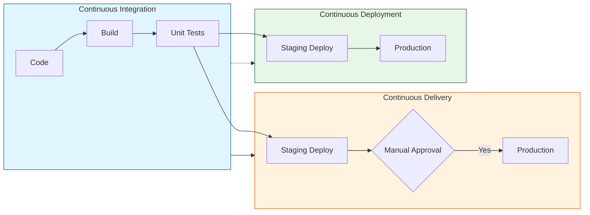
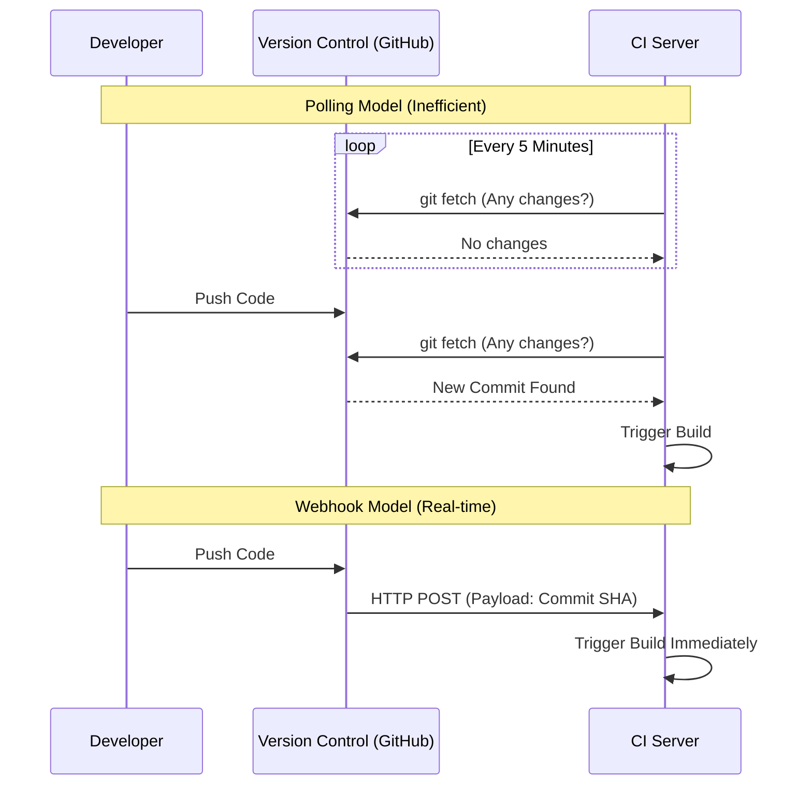
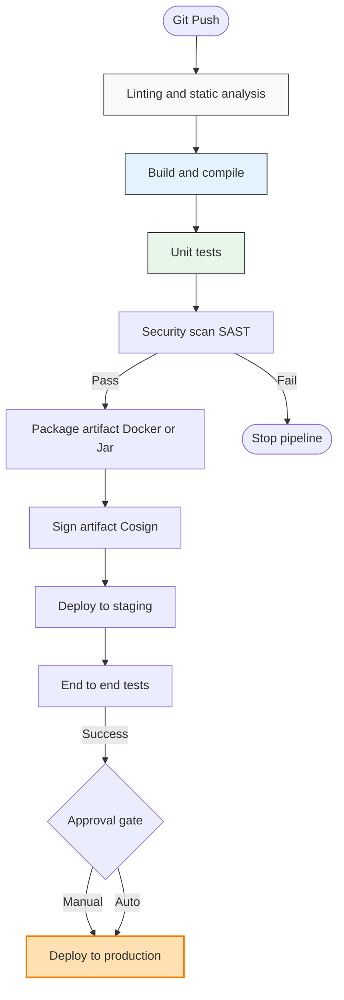
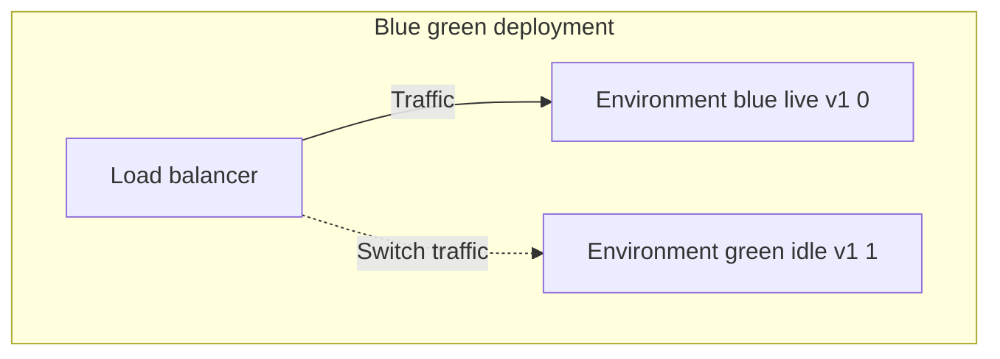
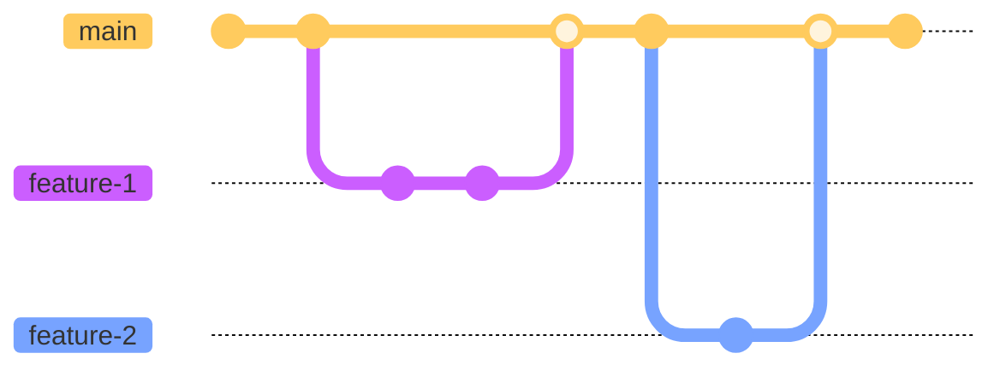

- [1 - Introduction: The Industrialisation of Software Delivery](#1---introduction-the-industrialisation-of-software-delivery)
	- [1.1 - Defining the Continuum: CI, Delivery, and Deployment](#11---defining-the-continuum-ci-delivery-and-deployment)
	- [1.2 - The Economic and Technical Imperative](#12---the-economic-and-technical-imperative)
- [2 - Historical Context: From Integration Hell to Extreme Programming](#2---historical-context-from-integration-hell-to-extreme-programming)
	- [2.1 - The Waterfall Era and the "Big Bang" Integration](#21---the-waterfall-era-and-the-big-bang-integration)
	- [2.2 - The Birth of Continuous Integration in Extreme Programming (XP)](#22---the-birth-of-continuous-integration-in-extreme-programming-xp)
	- [2.3 - The Agile Revolution and the Rise of DevOps](#23---the-agile-revolution-and-the-rise-of-devops)
- [3 - Core Theory and First Principles](#3---core-theory-and-first-principles)
	- [3.1 - Idempotency and Determinism](#31---idempotency-and-determinism)
	- [3.2 - Immutability and Artifact Management](#32---immutability-and-artifact-management)
	- [3.3 - The "Pipeline" Metaphor and Lean Theory](#33---the-pipeline-metaphor-and-lean-theory)
	- [3.4 - Shift-Left Testing](#34---shift-left-testing)
- [4 - Architectural Components of a CI/CD Ecosystem](#4---architectural-components-of-a-cicd-ecosystem)
	- [4.1 - Version Control Systems (VCS): The Source of Truth](#41---version-control-systems-vcs-the-source-of-truth)
	- [4.2 - Triggers: The Mechanics of Webhooks vs. Polling](#42---triggers-the-mechanics-of-webhooks-vs-polling)
	- [4.3 - The Execution Environment: Runners, Agents, and Nodes](#43---the-execution-environment-runners-agents-and-nodes)
	- [4.4 - Artifact Repositories](#44---artifact-repositories)
	- [4.5 - Orchestration Engines](#45---orchestration-engines)
- [5 - Detailed Pipeline Workflows](#5---detailed-pipeline-workflows)
	- [5.1 - The Standard Pipeline Stages](#51---the-standard-pipeline-stages)
	- [5.2 - Deployment Strategies](#52---deployment-strategies)
	- [5.3 - Branching Strategies and CI Implications](#53---branching-strategies-and-ci-implications)
- [6 - The Tooling Landscape: A Comparative Analysis](#6---the-tooling-landscape-a-comparative-analysis)
	- [6.1 - Standalone Servers: Jenkins and TeamCity](#61---standalone-servers-jenkins-and-teamcity)
	- [6.2 - Integrated SaaS Platforms: GitHub Actions and GitLab CI](#62---integrated-saas-platforms-github-actions-and-gitlab-ci)
	- [Table 1: Comparative Analysis of Major CI/CD Tools](#table-1-comparative-analysis-of-major-cicd-tools)
- [7 - Security and Supply Chain Integrity (DevSecOps)](#7---security-and-supply-chain-integrity-devsecops)
	- [7.1 - The SLSA Framework](#71---the-slsa-framework)
	- [7.2 - Software Bill of Materials (SBOM)](#72---software-bill-of-materials-sbom)
	- [7.3 - Artifact Signing with Cosign](#73---artifact-signing-with-cosign)
- [8 - Metrics and Performance: The DORA benchmarks](#8---metrics-and-performance-the-dora-benchmarks)
	- [8.1 - The Four Key Metrics](#81---the-four-key-metrics)
	- [8.2 - Insights from the 2024 State of DevOps Report](#82---insights-from-the-2024-state-of-devops-report)
- [9 - Emerging Trends: AI and Sustainability](#9---emerging-trends-ai-and-sustainability)
	- [9.1 - AI-Driven Failure Analysis (LogSage)](#91---ai-driven-failure-analysis-logsage)
	- [9.2 - Green CI/CD: Environmental Impact](#92---green-cicd-environmental-impact)
- [10 - Practical Guide for Implementation](#10---practical-guide-for-implementation)
	- [10.1 - Step 1: Local Automation First](#101---step-1-local-automation-first)
	- [10.2 - Step 2: The "Hello World" Workflow](#102---step-2-the-hello-world-workflow)
	- [10.3 - Step 3: Branch Protection and Gates](#103---step-3-branch-protection-and-gates)
	- [10.4 - Step 4: Secrets Management](#104---step-4-secrets-management)
	- [10.5 - Step 5: Dealing with Failure](#105---step-5-dealing-with-failure)
- [11 - Conclusion](#11---conclusion)
- [References](#references)


# 1 - Introduction: The Industrialisation of Software Delivery

The history of software engineering is, in many respects, a history of managing complexity. As systems have grown from singular, monolithic executables to distributed microservices spanning global cloud infrastructure, the cognitive load required to assemble, verify, and deploy these systems has exceeded human capacity. Continuous Integration (CI) and Continuous Delivery/Deployment (CD) represent the industrial response to this complexity. They are not merely tools or scripts; they constitute a fundamental shift in the philosophy of engineering, moving the discipline from a craft-based model of manual assembly to an industrial model of automated production lines.

This report provides an exhaustive analysis of the CI/CD paradigm. It explores the theoretical underpinnings that differentiate modern DevOps from traditional scientific management, dissects the architectural components that facilitate global-scale software supply chains, and examines the empirical data (ranging from DORA metrics to environmental impact studies) that validates its efficacy. We aim to provide a nuanced understanding of how pipelines function, how they fail, and how they secure the digital infrastructure of the modern world.

[Image of CI/CD pipeline stages]

## 1.1 - Defining the Continuum: CI, Delivery, and Deployment

While the acronym "CI/CD" is often used as a singular noun, it encompasses three distinct phases of the software lifecycle, each with unique objectives and feedback loops.

  * **Continuous Integration (CI)** is the practice of merging developer working copies to a shared mainline frequently (typically several times a day). The primary objective of CI is risk reduction. In the absence of CI, developers working in isolation for weeks create a "divergence" between their local state and the shared reality of the codebase. When they eventually attempt to merge, they encounter "integration hell," a state where conflict resolution takes longer than the original development time. CI solves this by forcing frequent reconciliation. As defined in seminal literature by Martin Fowler and the IEEE, CI acts as a mechanism for "fast feedback," validating through automated builds and tests that the software remains in a coherent state.
  * **Continuous Delivery (CDE)** extends the principles of CI into the release process. It ensures that the software is in a deployable state at all times. A Continuous Delivery pipeline automates the entire journey from commit to a staging environment, including the generation of production-ready artifacts. Crucially, the final deployment to production remains a manual business decision. This allows organisations to separate the technical capability to release from the business decision to release.
  * **Continuous Deployment (CD)** represents the apex of automation. In this model, any change that passes the automated quality gates is immediately and automatically deployed to production users. There is no human intervention. This requires an extremely high level of confidence in the automated testing suite, as the "safety net" of manual approval is removed. Elite performing organisations, as categorised by the DevOps Research and Assessment (DORA) team, utilise this model to achieve lead times of less than one hour.

<!-- end list -->



## 1.2 - The Economic and Technical Imperative

The adoption of CI/CD is driven by the inversion of the cost-of-change curve. In traditional Waterfall models, a defect introduced in the requirements or design phase but discovered during post-development integration costs exponentially more to fix than one discovered immediately. By shifting the discovery of integration errors to the moment of commit (a practice known as "Shift Left") CI/CD flattens this cost curve.

Furthermore, the reliability of modern distributed systems depends on the concept of immutability. Manual deployments often lead to "configuration drift," where production servers slowly diverge from their documented state due to ad-hoc changes. CI/CD pipelines enforce immutability by destroying and recreating infrastructure (Infrastructure as Code) or deploying immutable containers, ensuring that the environment is consistent and reproducible.


# 2 - Historical Context: From Integration Hell to Extreme Programming

To fully appreciate the architectural decisions in modern CI/CD, one must understand the friction points of the eras that preceded it. The evolution of software delivery is a movement away from prolonged, opaque phases towards rapid, transparent cycles.

## 2.1 - The Waterfall Era and the "Big Bang" Integration

Throughout the 1970s and 1980s, software development was largely governed by the Waterfall model. This linear approach treated software construction akin to civil engineering: requirements were gathered, architecture was designed, code was written, and finally, the system was integrated and tested.

In this era, integration was a distinct phase that occurred at the end of the project. Developers would work on separate modules for months. When the deadline approached, teams would attempt to link these modules together. This "Big Bang" integration frequently resulted in catastrophic failure. Interfaces would not match, assumptions made by one team would contradict those made by another, and the system would fail to compile or boot. The term "Integration Hell" described the weeks or months spent debugging these interaction effects, often leading to massive project delays and budget overruns.

To mitigate this, some teams introduced "Nightly Builds". This was a primitive automation step where a script would compile the entire codebase overnight. If the build failed, the team would arrive the next morning to a broken system. While this reduced the feedback loop to 24 hours, it lacked the granularity to identify which specific change caused the failure, often leading to "blame games" among developers.

## 2.2 - The Birth of Continuous Integration in Extreme Programming (XP)

The theoretical foundation of modern CI lies in the Extreme Programming (XP) methodology, which emerged in the late 1990s. XP was a reaction against the heavy-weight, bureaucratic processes of the time. Its progenitors, including Kent Beck and Ron Jeffries, proposed a radical idea: if a practice is beneficial, it should be taken to the extreme.

Beck argued that if integration is painful, the solution is not to delay it, but to do it so frequently that it ceases to be an event. XP introduced the "Ten-Minute Build," mandating that the entire system should be built and tested in under ten minutes. This constraint was transformative. It forced developers to write modular code, decouple dependencies, and invest in fast, automated unit tests.

Grady Booch had used the term "continuous integration" as early as 1994 in his work on object-oriented analysis, but it was the XP community that codified it as a daily practice. In 1996, the Chrysler Comprehensive Compensation (C3) project became the testing ground for these ideas. Beck, as the project leader, enforced strict discipline: developers could not go home if the build was broken. This cultural shift (prioritising the health of the mainline over the completion of new features) remains the hardest aspect of CI adoption today.

## 2.3 - The Agile Revolution and the Rise of DevOps

The publication of the Agile Manifesto in 2001 accelerated the adoption of CI. Agile emphasised "working software over comprehensive documentation" and "responding to change over following a plan." CI provided the technical mechanism to deliver working software frequently.

However, as development teams accelerated, they hit a new bottleneck: Operations. While developers could build software in minutes, deploying it to servers was still a manual, ticket-driven process managed by system administrators. This conflict gave rise to the DevOps movement in the late 2000s. DevOps extended the principles of CI (automation, collaboration, fast feedback) to the deployment and operations phases.

Tools like CruiseControl (the first open-source CI server, released by ThoughtWorks in 2001) paved the way for Hudson (later Jenkins), which democratised automation. The subsequent explosion of cloud computing and containerisation (Docker) in the 2010s finally provided the infrastructure agility to match the speed of software development, enabling the transition from Continuous Integration to Continuous Deployment.

-----

# 3 - Core Theory and First Principles

Modern CI/CD is built upon several theoretical concepts that ensure reliability and scalability. These principles distinguish a robust pipeline from a fragile set of shell scripts.

## 3.1 - Idempotency and Determinism

A critical property of any pipeline operation is idempotency. In mathematics and computer science, an idempotent operation is one that can be applied multiple times without changing the result beyond the initial application. In the context of CI/CD, this means that running a deployment script twice should not result in two database instances or a corrupted configuration; it should result in the system being in the desired state.

Closely related is determinism. A pipeline must be deterministic: given the same input (source code commit), it must produce the exact same output (binary artifact) every time. Flaky tests (tests that pass or fail intermittently without code changes) are the enemy of determinism. They erode trust in the pipeline, leading developers to ignore failure signals. Theoretical models of CI emphasise that a slow, deterministic pipeline is preferable to a fast, non-deterministic one, as the latter fails to provide valid feedback.

## 3.2 - Immutability and Artifact Management

Traditional software deployment often involved "patching" servers: logging into a running server and updating libraries or copying new files. This led to "snowflake servers" (unique, fragile systems whose state could not be reproduced).

Modern CI/CD relies on immutability. Once a build artifact (such as a Docker image or a JAR file) is generated in the build stage, it is never modified. The exact same binary that is tested in the QA environment is promoted to Staging and then to Production. Configuration is injected from the outside (via environment variables), but the binary itself is immutable. This guarantees that if the software worked in testing, it will work in production, eliminating the class of errors known as "it works on my machine".

## 3.3 - The "Pipeline" Metaphor and Lean Theory

The concept of the "pipeline" is derived from Lean Manufacturing and the Theory of Constraints. The software delivery process is visualised as a value stream. The goal is to maximise the flow of value (features) while minimising waste (waiting time, rework).

The pipeline acts as a series of quality gates. Each stage (Build, Unit Test, Integration Test, Security Scan) attempts to "reject" the artifact. Only artifacts that survive all gates are allowed into production. This "fail-fast" architecture ensures that resources are not wasted on defective code. If a unit test fails, the expensive integration tests are never triggered.

## 3.4 - Shift-Left Testing

The "Shift-Left" philosophy is a temporal concept. If one visualises the software lifecycle as a timeline from left (requirements) to right (production), traditional testing happened on the right. Shift-Left advocates moving validation activities as far to the left (early) as possible.

Theoretical frameworks identify varying degrees of Shift-Left:

  * **Traditional Shift-Left:** Developers write unit tests that run on every commit.
  * **Security Shift-Left (DevSecOps):** Static Application Security Testing (SAST) runs in the IDE or CI, identifying vulnerabilities before code leaves the developer's machine.
  * **Model-Based Shift-Left:** Using formal specifications to generate test cases before implementation begins.

Research indicates that fixing a bug during the design phase costs $1/100$th of fixing it in production. Shift-Left is the operationalisation of this economic reality.

-----

# 4 - Architectural Components of a CI/CD Ecosystem

A modern CI/CD platform is a distributed system comprising several distinct components. Understanding the architecture of these components is essential for designing scalable pipelines.

## 4.1 - Version Control Systems (VCS): The Source of Truth

The Version Control System (e.g., Git) is the foundation. It serves as the single source of truth for both the application code and the infrastructure definitions (Infrastructure as Code). The transition from centralised VCS (Subversion) to distributed VCS (Git) was pivotal for CI/CD. Git's lightweight branching allowed for more complex workflows, though it also introduced the risk of long-lived branches that defy the principles of CI.

## 4.2 - Triggers: The Mechanics of Webhooks vs. Polling

A fundamental architectural choice is how the CI system detects changes in the VCS.

**Polling** was the standard in early CI tools like CruiseControl. The CI server would query the VCS (e.g., `git fetch`) at a fixed interval (e.g., every 5 minutes) to check for changes.

  * **Mechanics:** The CI server acts as a client, repeatedly sending requests.
  * **Disadvantages:** This creates "polling lag" (a commit might sit for 4 minutes and 59 seconds before being detected). It also wastes resources on the VCS server, as most checks return "no change".
  * **Use Case:** Polling is largely obsolete but remains necessary in highly secure, air-gapped environments where the VCS cannot initiate connections to the CI server due to firewall rules.

**Webhooks** represent the modern, event-driven architecture. The VCS is configured to send an HTTP POST request to the CI server immediately upon an event (e.g., a push or a merge request).

  * **Mechanics:** When a developer pushes code, GitHub/GitLab generates a JSON payload containing the commit SHA, branch, author, and message. It sends this payload to a listening endpoint on the CI server.
  * **Advantages:** This enables real-time feedback. The pipeline starts milliseconds after the push. It is also more efficient, as network traffic only occurs when there is actual work to do.
  * **Security:** Webhooks typically include an HMAC signature in the header to verify that the payload actually originated from the VCS and not an attacker.

<!-- end list -->



## 4.3 - The Execution Environment: Runners, Agents, and Nodes

The component that executes the pipeline steps is variously called an Agent (Jenkins), a Runner (GitHub/GitLab), or a Node.

**Persistent vs. Ephemeral Architectures:**

  * **Persistent Agents (The "Pet" Model):** Traditional Jenkins setups often use long-lived servers as agents. These machines maintain state between builds (e.g., cached dependencies, temporary files). While this can speed up builds, it introduces the risk of "state pollution," where a file left over from Build A causes Build B to pass (or fail) incorrectly.
  * **Ephemeral Runners (The "Cattle" Model):** Modern platforms like GitHub Actions and GitLab CI favour ephemeral runners. For every job, a fresh Virtual Machine (VM) or Container is provisioned. The job runs, and the environment is immediately destroyed. This guarantees a clean slate, enforcing reliability. While it creates overhead (boot time), the predictability is valued higher than raw speed.

**Containerisation (Docker) in CI:**
Docker has revolutionised the execution environment. Instead of maintaining a VM with all possible languages installed (Java, Python, Node), pipelines now use Docker containers.

  * **Docker-in-Docker (DinD):** A common pattern where the CI runner itself is a container that spawns sibling containers to run tests. This allows a pipeline to spin up a Redis container and a Postgres container alongside the application container for integration testing, all defined in the pipeline YAML.

## 4.4 - Artifact Repositories

It is an architectural anti-pattern to store build binaries in the VCS. Git is designed for text, not large binaries. Instead, Artifact Repositories (e.g., JFrog Artifactory, Sonatype Nexus) are used.

  * **Role:** They act as a secure vault for the immutable artifacts generated by the CI process. They provide versioning, metadata (who built this?), and access control.
  * **Workflow:** The CI build pushes the Docker image or JAR to the repository. The CD deploy stage pulls that exact artifact from the repository. This separation ensures that the production environment downloads a verified, virus-scanned, and signed binary.

## 4.5 - Orchestration Engines

The "Brain" of the operation is the orchestration engine (Jenkins Master, GitHub Actions Hub). It manages the queue of jobs, handles secret injection (passing API keys securely to runners), and visualises the status for developers. In SaaS models (GitHub Actions), this control plane is managed by the provider, removing the operational burden of maintaining the CI server itself.

-----

# 5 - Detailed Pipeline Workflows

A pipeline is a scripted definition of the software delivery process. While every project is unique, a standard reference architecture for a pipeline follows a specific sequence of stages.

## 5.1 - The Standard Pipeline Stages

1.  **Checkout & Linting:**
    The pipeline begins by cloning the repository at the specific commit SHA. The first check is usually "Linting" (running static analysis tools to verify code syntax and style (e.g., ESLint, Pylint)). This is the fastest feedback loop; if a developer misses a semicolon, the pipeline fails in seconds, saving the cost of a full build.
2.  **Compilation & Build:**
    For compiled languages (Java, Go, C++), the source code is transformed into binary executables. This stage resolves dependencies (e.g., `npm install`, `maven restore`). A critical aspect here is caching; to speed up this stage, CI systems cache the dependency directories so they do not have to be downloaded from the internet on every run.
3.  **Unit Testing:**
    Automated tests that verify individual functions in isolation are executed. These tests mock external dependencies (databases, APIs). DORA metrics suggest that elite performers maintain comprehensive unit test suites that run in minutes.
4.  **Static Application Security Testing (SAST):**
    Security scanners analyse the source code for known vulnerability patterns (e.g., SQL injection risks, hardcoded credentials). This is a key component of DevSecOps, catching vulnerabilities before the artifact is even created.
5.  **Artifact Packaging & Signing:**
    If all tests pass, the application is packaged into its distributable format (e.g., building a Docker image). Crucially, this artifact is signed using cryptographic tools like Cosign. This digital signature serves as a "seal of quality," proving that the artifact was generated by a trusted CI pipeline and has not been tampered with.
6.  **Integration/Staging Deployment:**
    The artifact is deployed to a "Staging" environment that mirrors production. This allows for integration testing (verifying that the application interacts correctly with real databases and services).
7.  **End-to-End (E2E) Testing:**
    Tools like Selenium or Cypress run user simulation scripts against the staging environment. These tests verify the "happy path" of user journeys (e.g., "User can login and add item to cart").
8.  **Production Deployment:**
    The final stage is the promotion to production. In Continuous Delivery, this waits for a manual approval. In Continuous Deployment, it proceeds automatically.

<!-- end list -->



## 5.2 - Deployment Strategies

The mechanism of updating production is critical for minimising downtime.

  * **Blue-Green Deployment:** Two identical environments exist (Blue and Green). Blue is live. The new version is deployed to Green. Once verified, the router switches all traffic to Green. Blue becomes the standby. This allows for instant rollback.
  * **Canary Deployment:** The new version is deployed to a small subset of servers (e.g., 5% of traffic). Metrics are monitored. If error rates remain stable, the rollout gradually increases to 100%. If errors spike, the canary is killed automatically. This limits the "blast radius" of a bad deployment.

<!-- end list -->



## 5.3 - Branching Strategies and CI Implications

The pipeline logic is heavily influenced by the team's Git strategy.

  * **GitFlow:** This traditional model uses long-lived branches (develop, release, master).
      * **CI Challenge:** It complicates CI. Different pipelines are needed for different branches. Merging develop to master can be a traumatic event ("merge hell") because the branches diverge for long periods. It often delays feedback, violating the core tenet of CI.
  * **Trunk-Based Development:** All developers commit to a single main branch (or short-lived feature branches that merge within 24 hours).
      * **CI Alignment:** This is the gold standard for high-performing CI/CD. It forces frequent integration. The pipeline runs on every commit to main. If the build breaks, the team stops to fix it immediately. DORA research shows a strong correlation between Trunk-Based Development and elite performance metrics.

<!-- end list -->



*(Figure: Trunk-Based Development Model showing short-lived feature branches merging back to main)*

-----

# 6 - The Tooling Landscape: A Comparative Analysis

The market for CI/CD tools has bifurcated into two main categories: Standalone Automation Servers and Integrated SaaS Platforms.

## 6.1 - Standalone Servers: Jenkins and TeamCity

**Jenkins** is the most ubiquitous CI tool, an open-source automation server that has dominated the industry for a decade.

  * **Architecture:** Master-Agent model. It is self-hosted, meaning the engineering team is responsible for provisioning the servers, patching the OS, and managing scalability.
  * **Extensibility:** Jenkins is famous for its plugin ecosystem. With over 1,800 plugins, it can integrate with almost any legacy tool or platform.
  * **Configuration:** Historically configured via UI (ClickOps), modern Jenkins uses "Jenkinsfiles" (Groovy scripting) to define pipelines as code.
  * **Drawbacks:** The "Plugin Hell" phenomenon is real (updates to plugins often break dependencies). Maintenance of a Jenkins server can become a full-time job. Security is also a concern; as a self-hosted server, misconfiguration can expose the entire internal network.

**TeamCity** (by JetBrains) offers a commercial alternative. It provides a polished, out-of-the-box experience with superior support for .NET and IntelliJ integration, but lacks the vast open-source community of Jenkins.

## 6.2 - Integrated SaaS Platforms: GitHub Actions and GitLab CI

The modern trend is towards platforms that integrate CI/CD directly into the source code hosting service.

**GitHub Actions:**

  * **Architecture:** Fully integrated into GitHub. Workflows are defined in YAML files within the `.github/workflows` directory. It uses a cloud-based runner pool (Azure VMs) that auto-scales.
  * **Marketplace:** The defining feature is the Actions Marketplace. Developers can reuse logic (Actions) written by others (e.g., `uses: aws-actions/configure-aws-credentials`). This democratises complex automation.
  * **Security:** While convenient, using third-party Actions introduces supply chain risk. GitHub provides mechanisms to pin Actions to specific commit hashes to mitigate this.

**GitLab CI:**

  * **Architecture:** Known for its "single application" vision. It integrates SCM, CI, CD, Registry, and Monitoring in one UI. It uses a `.gitlab-ci.yml` file and offers "Auto DevOps," which attempts to automatically configure the pipeline based on the code language.
  * **Runners:** Strong support for Kubernetes-based runners, making it a favourite for cloud-native shops.

## Table 1: Comparative Analysis of Major CI/CD Tools

| Feature               | Jenkins                       | GitHub Actions              | GitLab CI               | TeamCity            |
| :-------------------- | :---------------------------- | :-------------------------- | :---------------------- | :------------------ |
| **Type**              | Standalone Server             | SaaS / Integrated           | Integrated (SaaS/Self)  | Standalone Server   |
| **Pipeline Language** | Groovy (Scripted/Declarative) | YAML                        | YAML                    | Kotlin / UI         |
| **Hosting Model**     | Self-Hosted (On-Prem/Cloud)   | Cloud (SaaS) or Self-Hosted | Cloud or Self-Hosted    | Self-Hosted / Cloud |
| **Scalability**       | Manual / Static Agents        | Managed Auto-scaling        | Managed Auto-scaling    | Manual / Agents     |
| **Maintenance**       | High (OS, Plugins, Security)  | Low (Provider Managed)      | Medium (if Self-Hosted) | Medium              |
| **Cost**              | Free (Open Source)            | Freemium / Per Minute       | Freemium / Tiered       | Licensed            |
| **Target User**       | Enterprise / Legacy / Complex | Modern / Open Source        | DevOps / Kubernetes     | Enterprise / .NET   |

-----

# 7 - Security and Supply Chain Integrity (DevSecOps)

The CI/CD pipeline has evolved from a simple build tool into critical infrastructure. Consequently, it has become a primary target for attackers. The "SolarWinds" attack demonstrated that compromising the build pipeline allows attackers to inject malicious code into trusted software updates, bypassing downstream defences. This has birthed the discipline of DevSecOps and Supply Chain Security.

## 7.1 - The SLSA Framework

To combat supply chain attacks, the industry has adopted the Supply-chain Levels for Software Artifacts (SLSA) framework (pronounced "salsa"). SLSA provides a checklist of standards to prevent tampering and ensure integrity. It defines four levels of maturity:

  * **Level 0:** No guarantees. Ad-hoc builds on developer laptops.
  * **Level 1 (Provenance):** The build process is scripted (e.g., a Makefile) and version controlled. Metadata (provenance) is generated showing who built it and when.
  * **Level 2 (Hosted Build Service):** The build runs on a dedicated platform (like GitHub Actions), not a laptop. The provenance is authenticated (signed) by the build service. This prevents a developer from building a malicious binary locally and claiming it came from the CI system.
  * **Level 3 (Hardened Builds):** The build platform is ephemeral and isolated. Each build runs in a fresh environment that is destroyed afterwards, preventing cross-build contamination.
  * **Level 4 (Hermetic):** The highest assurance. Builds are "hermetic," meaning they have no network access during the build (except to fetch pre-verified dependencies). Two-person review is required for all changes.

## 7.2 - Software Bill of Materials (SBOM)

An SBOM is a formal inventory of all ingredients (libraries, modules, snippets) that make up a software component.

  * **Necessity:** Modern software is 80-90% open-source components. When a vulnerability like Log4j is discovered, organisations need to know instantly which of their applications contain that library.
  * **Automation:** CI pipelines now include steps to generate SBOMs (using tools like Syft or Trivy) in standard formats like SPDX or CycloneDX. These SBOMs are stored alongside the artifacts.

## 7.3 - Artifact Signing with Cosign

To ensure that the container running in production is the exact one built and scanned by the CI pipeline, artifacts must be cryptographically signed.

  * **Cosign:** Part of the Sigstore project, Cosign simplifies signing. It supports "keyless" signing using OpenID Connect (OIDC). The CI system (e.g., GitHub Actions) authenticates with a certificate authority (Fulcio) to prove its identity (e.g., "I am the workflow run X of repo Y"). It receives a short-lived certificate to sign the image.
  * **Enforcement:** In the Kubernetes cluster, a policy engine (like OPA or Kyverno) checks the signature. If the image lacks a valid signature from the trusted CI pipeline, the cluster refuses to run it.

-----

# 8 - Metrics and Performance: The DORA benchmarks

Measuring the efficacy of CI/CD is critical for continuous improvement. The industry standard for this is the DORA Metrics, developed by the DevOps Research and Assessment team.

## 8.1 - The Four Key Metrics

DORA identifies four metrics that differentiate "Elite" performers from "Low" performers:

1.  **Deployment Frequency (Throughput):** How often is code successfully released to production?
      * **Elite:** On-demand (multiple deploys per day).
      * **Low:** Between once a month and once every 6 months.
2.  **Lead Time for Changes (Throughput):** How long does it take for a commit to go from code complete to running in production?
      * **Elite:** Less than one day.
3.  **Change Failure Rate (Stability):** What percentage of deployments cause a failure in production (requiring a hotfix or rollback)?
      * **Elite:** Approximately 5%.
      * **Low:** Up to 64%.
4.  **Failed Deployment Recovery Time (Stability):** How long does it take to restore service when a service incident occurs?
      * **Elite:** Less than one hour.

## 8.2 - Insights from the 2024 State of DevOps Report

The 2024 DORA report challenges the traditional assumption that there is a trade-off between speed and stability. The data shows that Elite performers excel at both.

  * **Throughput drives Stability:** By deploying smaller changes more frequently (High Frequency), the risk of each deployment is lower. If a failure occurs, it is easier to identify the cause because the delta is small. Conversely, "Big Bang" deployments (Low Frequency) inevitably lead to higher Change Failure Rates because they bundle months of complexity into a single risky event.
  * **Platform Engineering:** The 2024 report highlights that successful organisations treat their internal developer platform (the CI/CD system) as a product, focusing on user-centric design to reduce friction for developers.

-----

# 9 - Emerging Trends: AI and Sustainability

The frontier of CI/CD innovation lies in the integration of Artificial Intelligence and the focus on environmental sustainability.

## 9.1 - AI-Driven Failure Analysis (LogSage)

Diagnosing pipeline failures is labor-intensive. A developer might spend hours parsing thousands of lines of logs to find a missing semicolon.

  * **LogSage:** Recent research (2025) introduces frameworks like LogSage, which utilise Large Language Models (LLMs) for Root Cause Analysis (RCA).
  * **Mechanism:** LogSage employs a Retrieval-Augmented Generation (RAG) approach. It pre-processes the raw logs to filter noise, retrieves historical solutions from an internal knowledge base, and uses an LLM to generate a natural language explanation of the failure (e.g., "The build failed because of a version conflict in package-lock.json"). It can even invoke tools to attempt automated remediation.
  * **Impact:** This drastically reduces the Mean Time to Recovery (MTTR) for build failures, freeing up developer time.

## 9.2 - Green CI/CD: Environmental Impact

The energy consumption of CI/CD is becoming a concern. A 2025 study investigated the Carbon and Water Footprints (CWF) of GitHub Actions.

  * **Findings:** The GitHub Actions ecosystem alone is estimated to produce between 150 and 994 Metric Tonnes of $CO_2$ equivalent ($MTCO_2e$) annually.
  * **Efficiency:** Interestingly, the study found that SaaS runners (GitHub Actions) are often more energy-efficient (approx. 13 Joules/job) than self-hosted or less optimised runners (GitLab CI approx. 21 Joules/job) for comparable tasks, likely due to the massive scale and optimisation of the Azure data centres backing GitHub.
  * **Strategies:** "Green CI" practices include caching artifacts to avoid recompilation, optimizing container sizes, and scheduling non-urgent builds (like nightly regressions) during times when the regional energy grid is powered by renewables.

-----

# 10 - Practical Guide for Implementation

Implementing a pipeline requires a concrete, step-by-step approach based on the principles discussed.

## 10.1 - Step 1: Local Automation First

Do not attempt to write a YAML configuration until you can build and test your application with a single command on your local machine.

1.  Create a `build.sh` script (or `npm run build`) that compiles your code.
2.  Create a `test.sh` script (or `npm test`) that runs your unit tests.
      * **Principle:** If it doesn't work locally, it won't work in the cloud.

## 10.2 - Step 2: The "Hello World" Workflow

Start with a minimal configuration. If using GitHub Actions, create `.github/workflows/ci.yml`:

```yaml
name: CI
on: [push]  # Trigger on every push
jobs:
  build-and-test:
    runs-on: ubuntu-latest  # Ephemeral runner
    steps:
      - uses: actions/checkout@v4  # Clone code
      - name: Setup Node
        uses: actions/setup-node@v4
        with:
          node-version: '20'
      - name: Install Dependencies
        run: npm ci  # Clean install
      - name: Run Tests
        run: npm test
```

This simple file implements the core loop: Checkout -\> Environment Setup -\> Install -\> Test.

## 10.3 - Step 3: Branch Protection and Gates

1.  Go to your repository settings and enable "Branch Protection" for the main branch.
2.  Require status checks to pass before merging. Select your "CI" workflow.
      * This enforces the Quality Gate: no code can enter the mainline unless the pipeline succeeds. This prevents the "broken build" problem.

## 10.4 - Step 4: Secrets Management

Never commit API keys, passwords, or cloud credentials to your code.

1.  Use the repository's "Secrets" settings (e.g., `AWS_ACCESS_KEY`).
2.  Inject them into the pipeline environment variables: `env: AWS_KEY: ${{ secrets.AWS_KEY }}`.
      * This maintains security while allowing automation.

## 10.5 - Step 5: Dealing with Failure

When the pipeline fails (and it will), do not restart it blindly.

1.  Read the logs. The failure is usually at the bottom.
2.  If tests are "flaky" (pass sometimes, fail others), do not ignore them. A flaky test destroys trust. Either fix the test isolation or delete the test.
3.  Optimise speed. If the pipeline takes 20 minutes, developers will stop waiting for it. Use caching for dependencies to bring it down to 5 minutes.

-----

# 11 - Conclusion

Continuous Integration and Deployment have matured from the experimental practices of the Extreme Programming era to become the central nervous system of modern software engineering. They represent a sophisticated synthesis of cultural discipline and architectural innovation. By enforcing idempotency, immutability, and frequent integration, CI/CD pipelines enable organisations to manage the complexity of distributed systems, turning the release of software from a high-risk event into a mundane, reliable process.

The future of this domain lies in higher-order automation. The integration of SLSA frameworks will secure the global software supply chain against sophisticated threats. The application of AI will transform pipelines from static scripts into self-healing systems capable of diagnosing their own failures. And the push for sustainability will drive efficiency in how we consume computational resources. Mastery of these concepts is no longer an optional specialisation but a fundamental requirement for professional practice.

---

# References

1. Shahin, M., Babar, M. A., & Zhu, L. (2017). *Continuous Integration, Delivery and Deployment: A Systematic Review on Approaches, Tools, Challenges and Practices*. **IEEE Access, 5**, 3909–3943.
   [https://doi.org/10.1109/ACCESS.2017.2685629](https://doi.org/10.1109/ACCESS.2017.2685629) ([OUCI][1])

2. Saavedra, N., Mendes, A., & Ferreira, J. F. (2025). *Environmental Impact of CI/CD Pipelines*. arXiv:2510.26413.
   [https://arxiv.org/abs/2510.26413](https://arxiv.org/abs/2510.26413) ([arXiv][2])

3. Xu, W., Luo, J., Huang, T., Sui, K., Geng, J., Ma, Q., Akasaka, I., Shi, X., Tang, J., & Cai, P. (2025). *LogSage: An LLM-Based Framework for CI/CD Failure Detection and Remediation with Industrial Validation*. arXiv:2506.03691.
   [https://arxiv.org/abs/2506.03691](https://arxiv.org/abs/2506.03691) ([arXiv][3])

[1]: https://ouci.dntb.gov.ua/en/works/4yV2XZWl/?utm_source=chatgpt.com "Continuous Integration, Delivery and Deployment"
[2]: https://arxiv.org/abs/2510.26413?utm_source=chatgpt.com "Environmental Impact of CI/CD Pipelines"
[3]: https://arxiv.org/abs/2506.03691?utm_source=chatgpt.com "LogSage: An LLM-Based Framework for CI/CD Failure ..."
