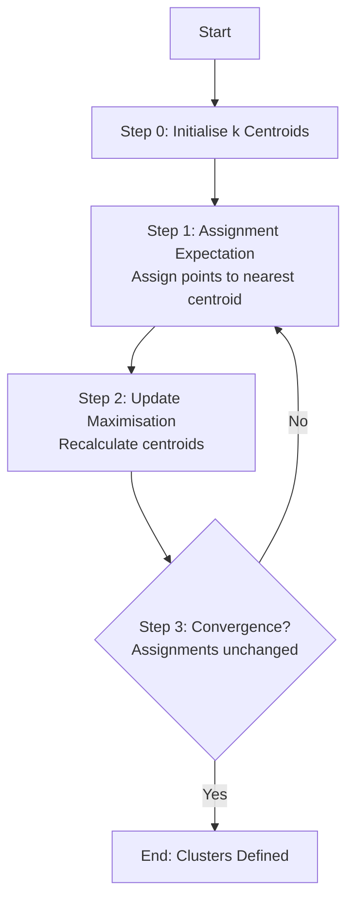
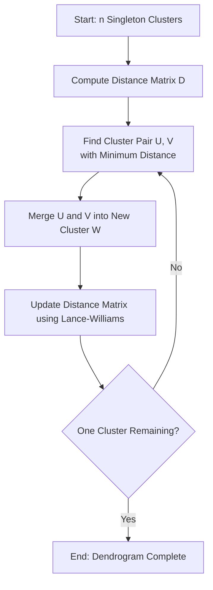
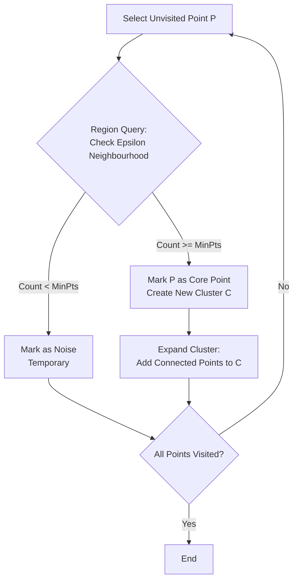
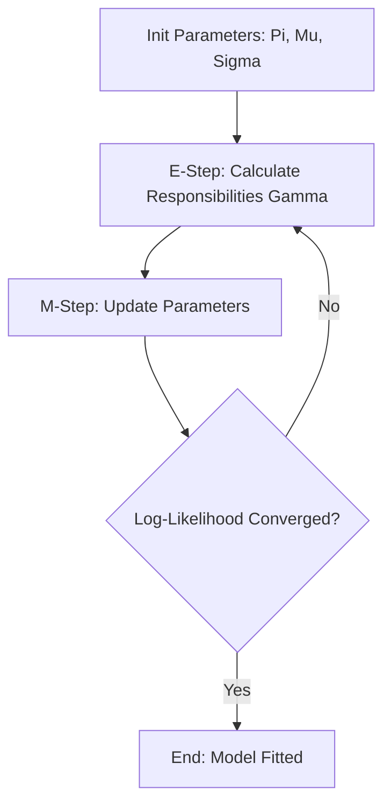

- [1 - Introduction to Unsupervised Learning and Clustering Theory](#1---introduction-to-unsupervised-learning-and-clustering-theory)
  - [1.1 - Historical Context and Evolution](#11---historical-context-and-evolution)
  - [1.2 - Mathematical Preliminaries: Vector Spaces and Dissimilarity](#12---mathematical-preliminaries-vector-spaces-and-dissimilarity)
- [2 - Partitional Clustering: K-Means Architecture](#2---partitional-clustering-k-means-architecture)
  - [2.1 - The Objective Function: Inertia Minimisation](#21---the-objective-function-inertia-minimisation)
  - [2.2 - Lloyd's Algorithm: High-Level Mechanics](#22---lloyds-algorithm-high-level-mechanics)
  - [2.3 - Initialisation Strategy: K-Means++](#23---initialisation-strategy-k-means)
  - [2.4 - Scalability: Mini-Batch K-Means](#24---scalability-mini-batch-k-means)
  - [2.5 - Advantages and Disadvantages](#25---advantages-and-disadvantages)
- [3 - Hierarchical Clustering: Agglomerative Architectures](#3---hierarchical-clustering-agglomerative-architectures)
  - [3.1 - Algorithmic Mechanics](#31---algorithmic-mechanics)
  - [3.2 - Linkage Criteria](#32---linkage-criteria)
  - [3.3 - Ward's Minimum Variance Method](#33---wards-minimum-variance-method)
  - [3.4 - The Lance-Williams Algorithm](#34---the-lance-williams-algorithm)
  - [3.5 - Advantages and Disadvantages](#35---advantages-and-disadvantages)
- [4 - Density-Based Clustering: DBSCAN Mechanics](#4---density-based-clustering-dbscan-mechanics)
  - [4.1 - Density, Core Points, and Neighbourhoods](#41---density-core-points-and-neighbourhoods)
  - [4.2 - Reachability and Connectivity](#42---reachability-and-connectivity)
  - [4.3 - The Algorithm](#43---the-algorithm)
  - [4.4 - Parameter Estimation and Complexity](#44---parameter-estimation-and-complexity)
  - [4.5 - Advantages and Disadvantages](#45---advantages-and-disadvantages)
- [5 - Probabilistic Clustering: Gaussian Mixture Models (GMM)](#5---probabilistic-clustering-gaussian-mixture-models-gmm)
  - [5.1 - The Generative Model](#51---the-generative-model)
  - [5.2 - The Expectation-Maximisation (EM) Algorithm](#52---the-expectation-maximisation-em-algorithm)
  - [5.3 - Convergence and Jensen's Inequality](#53---convergence-and-jensens-inequality)
  - [5.4 - Advantages and Disadvantages](#54---advantages-and-disadvantages)
- [6 - Evaluation Metrics](#6---evaluation-metrics)
  - [6.1 - Silhouette Coefficient](#61---silhouette-coefficient)
  - [6.2 - Davies-Bouldin Index (DBI)](#62---davies-bouldin-index-dbi)
  - [6.3 - Dunn Index](#63---dunn-index)
- [7 - Mathematical Step-by-Step Mock Calculations](#7---mathematical-step-by-step-mock-calculations)
  - [7.1 - K-Means: Manual Calculation (2 Iterations)](#71---k-means-manual-calculation-2-iterations)
  - [7.2 - Hierarchical Clustering: Lance-Williams Update](#72---hierarchical-clustering-lance-williams-update)
  - [7.3 - DBSCAN: Neighbourhood Check](#73---dbscan-neighbourhood-check)
- [8 - Seminal Literature Analysis](#8---seminal-literature-analysis)
- [References](#references)

# 1 - Introduction to Unsupervised Learning and Clustering Theory

In the domain of machine learning and artificial intelligence, the categorisation of data without predefined labels (unsupervised learning) remains one of the most mathematically complex and computationally significant challenges. Clustering, the process of grouping a set of objects in such a way that objects in the same group (called a cluster) are more similar to each other than to those in other groups, serves as the foundational pillar of unsupervised analysis. Unlike supervised learning, where the algorithm optimises a mapping function $y = f(x)$ based on ground-truth targets, clustering algorithms must infer the intrinsic structure of the data space $\mathcal{X}$ solely based on the geometric or probabilistic distribution of the input vectors.

The utility of clustering spans distinct domains, from image segmentation and anomaly detection to genomic sequence analysis and market segmentation. However, the definition of a "cluster" is not universal. Depending on the algorithmic approach, a cluster may be defined as a region of high data density, a collection of points with small pairwise distances, or a statistical distribution governing the generation of observed data. This report provides an exhaustive technical examination of the four dominant clustering paradigms: Partitional (K-Means), Hierarchical (Agglomerative), Density-Based (DBSCAN), and Probabilistic (Gaussian Mixture Models).

## 1.1 - Historical Context and Evolution

The mathematical formalisation of clustering has evolved in parallel with advancements in computing power. The early foundations were laid in the mid-20th century. The K-Means algorithm, arguably the most widely used clustering method, has a disjointed history. The core concept was proposed by Hugo Steinhaus in 1956, but the standard iterative algorithm used today was developed by Stuart Lloyd in 1957 at Bell Labs for pulse-code modulation (PCM) in signal processing. It was not until 1967 that James MacQueen coined the term "K-Means" in his seminal paper on multivariate observations, establishing the method as a statistical tool for data analysis.

Simultaneously, hierarchical approaches were being refined. In 1963, Joe H. Ward Jr. introduced a method for hierarchical grouping that optimised an objective function; specifically, the minimisation of within-group variance. This shifted clustering from simple linkage heuristics to a rigorous variance-minimisation problem.

As data complexity grew, the limitations of centroid-based and hierarchical models (primarily their inability to handle noise and arbitrary shapes) became apparent. This led to the development of density-based methods. In 1996, Martin Ester, Hans-Peter Kriegel, Jörg Sander, and Xiaowei Xu introduced DBSCAN (Density-Based Spatial Clustering of Applications with Noise), which redefined clusters as regions of high density separated by regions of low density, fundamentally altering the landscape of spatial data mining.

Parallel to these geometric approaches, probabilistic frameworks emerged. The Expectation-Maximisation (EM) algorithm, formalised by Dempster, Laird, and Rubin in 1977, provided the iterative optimisation framework necessary for fitting Gaussian Mixture Models (GMMs). This allowed for "soft clustering," where data points are assigned probabilities of membership rather than binary classifications.

## 1.2 - Mathematical Preliminaries: Vector Spaces and Dissimilarity

To rigorously define clustering, one must first define the space in which the data resides and the metric used to measure dissimilarity. Let $X = \{x_1, x_2, \dots, x_n\}$ be a dataset of $n$ observations, where each observation $x_i$ is a vector in a $d$-dimensional vector space, $x_i \in \mathbb{R}^d$.

The fundamental operation in clustering is the calculation of distance $d(x_i, x_j)$. The choice of distance metric dictates the shape of the clusters the algorithm can detect.

**Euclidean Distance ($L_2$ Norm):**
The most common metric corresponds to the straight-line distance between points. It implies that the space is isotropic and clusters are spherical.

$$d_{L_2}(x_i, x_j) = \|x_i - x_j\|_2 = \sqrt{\sum_{l=1}^{d} (x_{il} - x_{jl})^2}$$

Most centroid-based algorithms, including standard K-Means, rely on the squared Euclidean distance to minimise computational overhead (avoiding the square root operation) and to satisfy differentiability requirements.

**Manhattan Distance ($L_1$ Norm):**
This metric measures distance along axis-aligned paths. It is often preferred in high-dimensional spaces to mitigate the "curse of dimensionality," where the contrast between the nearest and farthest neighbours diminishes in Euclidean space.

$$d_{L_1}(x_i, x_j) = \|x_i - x_j\|_1 = \sum_{l=1}^{d} |x_{il} - x_{jl}|$$

**Mahalanobis Distance:**
This metric is crucial for understanding Gaussian Mixture Models. It accounts for the correlations between variables in the dataset. If $\Sigma$ is the covariance matrix of the data, the Mahalanobis distance between a point $x$ and a distribution mean $\mu$ is:

$$d_M(x, \mu) = \sqrt{(x - \mu)^T \Sigma^{-1} (x - \mu)}$$

When the covariance matrix is the identity matrix ($\Sigma = I$), the Mahalanobis distance reduces to the Euclidean distance. This metric allows for the detection of ellipsoidal clusters.

-----

# 2 - Partitional Clustering: K-Means Architecture

K-Means is a prototype-based, partitional clustering algorithm. It attempts to split the dataset $X$ into $k$ non-overlapping subsets (clusters) $S = \{S_1, S_2, \dots, S_k\}$ to minimise the within-cluster sum of squares (WCSS), also referred to as "inertia".

## 2.1 - The Objective Function: Inertia Minimisation

The mathematical goal of K-Means is to solve the following optimisation problem:

$$\min_{S} \sum_{i=1}^{k} \sum_{x \in S_i} \|x - \mu_i\|^2$$

Where $\mu_i$ is the centroid (mean) of the points in cluster $S_i$. The term $\|x - \mu_i\|^2$ represents the squared Euclidean distance. Minimising this function ensures that the clusters are as compact as possible. This optimisation problem is known to be NP-hard, meaning that finding the globally optimal partition is computationally infeasible for general $n$ and $k$. Therefore, the algorithm utilises a heuristic iterative refinement technique known as Lloyd's Algorithm.

## 2.2 - Lloyd's Algorithm: High-Level Mechanics

Lloyd's algorithm approximates the solution by alternating between two steps: the Assignment Step (Expectation) and the Update Step (Maximisation).

**Step 0: Initialisation**
The algorithm begins by selecting $k$ initial centroids, $\{\mu_1, \dots, \mu_k\}$. The method of selection is critical to performance (discussed in Section 2.3).

**Step 1: The Assignment Step (Expectation)**
Each data point $x_j$ is assigned to the cluster $S_i$ whose centroid $\mu_i$ is closest.

$$ S_i^{(t)} = \{ x_p : |x_p - \mu_i^{(t)}|^2 \le |x_p - \mu_l^{(t)}|^2 \quad \forall l, 1 \le l \le k \} $$

Geometrically, this partitions the data space into a Voronoi diagram, where each cell contains the points closest to a specific centroid.

**Step 2: The Update Step (Maximisation)**
The centroids are recomputed as the arithmetic mean of all points assigned to their respective clusters.

$$\mu_i^{(t+1)} = \frac{1}{|S_i^{(t)}|} \sum_{x_j \in S_i^{(t)}} x_j$$

This step guarantees a reduction (or maintenance) of the objective function WCSS, as the mean is the unique estimator that minimises the sum of squared errors.

**Step 3: Convergence**
The algorithm iterates until the assignments no longer change ($\mu_i^{(t+1)} = \mu_i^{(t)}$) or a predefined tolerance is met. Because the number of possible partitions is finite and the WCSS decreases monotonically, the algorithm is guaranteed to converge, though often to a local minimum rather than the global optimum.

## 2.3 - Initialisation Strategy: K-Means++

The standard Lloyd's algorithm is highly sensitive to the initial placement of centroids. If two centroids are initialised in the same dense cluster, the algorithm may get stuck in a suboptimal solution. To mitigate this, Arthur and Vassilvitskii (2007) proposed K-Means++, a probabilistic initialisation scheme.

**The K-Means++ Algorithm:**

1.  Choose the first centroid $\mu_1$ uniformly at random from the data points $X$.
2.  For each data point $x$, compute $D(x)$, the shortest distance between $x$ and any centroid that has already been chosen.
3.  Choose the next centroid $\mu_{next}$ from $X$ with probability proportional to $D(x)^2$.
    $$P(\mu_{next} = x) = \frac{D(x)^2}{\sum_{x' \in X} D(x')^2}$$
4.  Repeat steps 2 and 3 until $k$ centroids are chosen.
5.  Proceed with standard Lloyd's algorithm.

By weighting the selection probability by the squared distance, K-Means++ ensures that initial centroids are well-separated, which drastically improves the probability of converging to a global minimum and often accelerates convergence speed.

## 2.4 - Scalability: Mini-Batch K-Means

For extremely large datasets, calculating the distance between every point and every centroid in each iteration (which requires $O(n \cdot k \cdot d)$ operations) is computationally prohibitive. Mini-Batch K-Means addresses this by using small, random subsets of the data (batches) to update centroids.

In each iteration:

1.  Sample a batch $B$ of size $b$ from $X$.
2.  Assign points in $B$ to the nearest centroids.
3.  Update centroids using a convex combination of the old centroid and the batch mean, often controlled by a learning rate or a count of samples seen so far.

While Mini-Batch K-Means is essentially a stochastic gradient descent approach to clustering and is significantly faster, the resulting WCSS is typically slightly higher (worse) than the standard algorithm.

## 2.5 - Advantages and Disadvantages

**Advantages:**

  * **Computational Efficiency:** With a time complexity of $O(n \cdot k \cdot d \cdot i)$ (where $i$ is iterations), it is linear with respect to the number of samples, making it suitable for large datasets.
  * **Interpretability:** Centroids serve as prototypes for the clusters, providing an easy way to characterise the groups.

**Disadvantages:**

  * **Spherical Assumption:** Minimising WCSS implicitly assumes clusters are spherical and of roughly equal variance. It fails to detect elongated, irregular, or concentric clusters.
  * **Fixed $k$:** The user must specify the number of clusters in advance.
  * **Sensitivity to Outliers:** As the algorithm minimises squared deviations, outliers can pull centroids significantly away from the dense core of a cluster.

-----

# 3 - Hierarchical Clustering: Agglomerative Architectures

Hierarchical clustering constructs a multi-level hierarchy of clusters, represented as a tree structure called a dendrogram. Unlike K-Means, it does not require a pre-specified number of clusters and produces a deterministic result. The two primary approaches are Agglomerative (bottom-up) and Divisive (top-down). This section focuses on Agglomerative Hierarchical Clustering (AHC), the more common variant.

## 3.1 - Algorithmic Mechanics

Agglomerative clustering begins by treating every data point as a singleton cluster. The algorithm then iteratively merges the two "closest" clusters until only a single cluster containing all data points remains.

**The General Procedure:**

1.  **Initialise:** Compute the distance matrix $D$ between all pairs of $n$ singleton clusters.
2.  **Find Min:** Identify the pair of clusters $(U, V)$ with the minimum distance $d(U, V)$.
3.  **Merge:** Combine $U$ and $V$ into a new cluster $W = U \cup V$.
4.  **Update:** Calculate the distance from the new cluster $W$ to all other remaining clusters $Q$. Update the distance matrix.
5.  **Repeat:** Continue steps 2-4 until one cluster remains.

## 3.2 - Linkage Criteria

The definition of "distance between clusters" ($d(U, V)$) is the distinguishing factor between different hierarchical methods. This is known as the linkage criterion.

**Single Linkage (Nearest Neighbour):**
Defines distance as the minimum distance between any single point in cluster $U$ and any single point in cluster $V$.
$$d_{single}(U, V) = \min_{u \in U, v \in V} \|u - v\|$$
*Characteristics:* Capable of detecting non-elliptical shapes but suffers from the "chaining effect," where clusters are bridged by a line of noisy points.

**Complete Linkage (Farthest Neighbour):**
Defines distance as the maximum distance between points in the two clusters.
$$d_{complete}(U, V) = \max_{u \in U, v \in V} \|u - v\|$$
*Characteristics:* Produces compact, spherical clusters but is highly sensitive to outliers.

**Average Linkage (UPGMA):**
Calculates the average distance between all pairs of points in the two clusters.
$$d_{avg}(U, V) = \frac{1}{|U| \cdot |V|} \sum_{u \in U} \sum_{v \in V} \|u - v\|$$
*Characteristics:* Robust to noise and outliers; a compromise between single and complete linkage.

## 3.3 - Ward's Minimum Variance Method

Ward's method is unique in that it does not optimise a distance metric directly but rather an objective function, similar to K-Means. It seeks to merge the pair of clusters that leads to the minimum increase in the total within-cluster variance (or Error Sum of Squares, ESS).

The ESS for a cluster $C$ is:
$$\text{ESS}_C = \sum_{x \in C} \|x - \mu_C\|^2$$

The cost of merging clusters $A$ and $B$ is the increase in variance:
$$\Delta(A, B) = \text{ESS}_{A \cup B} - (\text{ESS}_A + \text{ESS}_B)$$

Using the Huygens theorem, this can be efficiently calculated as a weighted squared distance between centroids:
$$d_{Ward}(A, B) = \frac{|A| \cdot |B|}{|A| + |B|} \|\mu_A - \mu_B\|^2$$

Ward's method tends to produce compact, equal-sized clusters. It is crucial to note that Ward's method is strictly defined for squared Euclidean distances.

## 3.4 - The Lance-Williams Algorithm

A naive implementation of agglomerative clustering would require recalculating distances between all points at every step, leading to high computational costs. The Lance-Williams formula provides a unified recursive method to update the distance between a newly merged cluster $W$ (formed by $U$ and $V$) and any existing cluster $Q$, based solely on the known distances $d(U, Q)$, $d(V, Q)$, and $d(U, V)$.

**The General Formula:**
$$d(W, Q) = \alpha_U d(U, Q) + \alpha_V d(V, Q) + \beta d(U, V) + \gamma |d(U, Q) - d(V, Q)|$$

The coefficients ($\alpha, \beta, \gamma$) vary depending on the linkage method used.

| Method   | $\alpha_U$ | $\alpha_V$ | $\beta$ | $\gamma$ |
| :------- | :--------- | :--------- | :------ | :------- |
| Single   | $0.5$      | $0.5$      | $0$     | $-0.5$   |
| Complete | $0.5$      | $0.5$      | $0$     | $0.5$    |
| Average  | $\frac{    | U          | }{      | U        | +  | V | }$ | $\frac{ | V | }{ | U  | +       | V | }$ | $0$ | $0$ |
| Ward's   | $\frac{    | U          | +       | Q        | }{ | U | +  | V       | + | Q  | }$ | $\frac{ | V | +  | Q   | }{  | U | + | V | + | Q | }$ | $\frac{- | Q | }{ | U | + | V | + | Q | }$ | $0$ |

**Table 1:** Lance-Williams coefficients for standard hierarchical methods. Note: $|U|$ denotes the number of elements in cluster U.

## 3.5 - Advantages and Disadvantages

**Advantages:**

  * **Hierarchical Structure:** Provides a rich representation of data relationships at various scales.
  * **Determinism:** Given a linkage and metric, the result is reproducible (unlike K-Means with random init).
  * **No $k$:** The number of clusters does not need to be predefined; the dendrogram can be "cut" at any level.

**Disadvantages:**

  * **Complexity:** Standard implementations are $O(n^3)$. Optimised versions using heaps are $O(n^2)$, but this is still prohibitive for large datasets compared to K-Means' linear complexity.
  * **Greedy Irreversibility:** Once a step (merge) is taken, it cannot be undone, even if a different merge would lead to a better global solution later.

-----

# 4 - Density-Based Clustering: DBSCAN Mechanics

While K-Means and Ward's method rely on distances and centroids, DBSCAN (Density-Based Spatial Clustering of Applications with Noise) operates on the intuition that clusters are contiguous regions of high point density, separated by regions of low density. This allows it to discover clusters of arbitrary shape and effectively isolate noise.

## 4.1 - Density, Core Points, and Neighbourhoods

DBSCAN requires two hyperparameters:

  * **Epsilon ($\epsilon$):** The radius of the neighbourhood around a data point.
  * **MinPts:** The minimum number of data points required within an $\epsilon$-neighbourhood to form a dense region.

Based on these parameters, the algorithm categorises every point $p$ in the dataset into one of three types:

1.  **Core Point:** A point $p$ is a core point if its $\epsilon$-neighbourhood, $N_\epsilon(p)$, contains at least MinPts points (including $p$ itself).
    $$|N_\epsilon(p)| \ge \text{MinPts}$$
    $$N_\epsilon(p) = \{ q \in X \mid \text{dist}(p, q) \le \epsilon \}$$
2.  **Border Point:** A point $p$ is a border point if it is not a core point ($|N_\epsilon(p)| < \text{MinPts}$), but it belongs to the neighbourhood of a core point.
3.  **Noise Point (Outlier):** A point that is neither a core point nor a border point.

## 4.2 - Reachability and Connectivity

DBSCAN constructs clusters using the concept of density-reachability rather than simple adjacency. This is formally defined through a chain of relationships:

1.  **Directly Density-Reachable:** A point $q$ is directly reachable from $p$ if $p$ is a core point and $q \in N_\epsilon(p)$.
2.  **Density-Reachable:** A point $q$ is reachable from $p$ if there is a chain of points $p_1, p_2, \dots, p_n$ such that $p_1 = p$, $p_n = q$, and each $p_{i+1}$ is directly reachable from $p_i$. (Note: This property is asymmetric; a border point is reachable from a core point, but the reverse is not true).
3.  **Density-Connected:** Two points $p$ and $q$ are density-connected if there is a third point $o$ such that both $p$ and $q$ are density-reachable from $o$. This symmetric property defines the cluster: a cluster is the set of all points that are density-connected to a particular core point.

## 4.3 - The Algorithm

The procedural execution of DBSCAN is as follows:

1.  Select an unvisited point $p$.
2.  **Region Query:** Retrieve the $\epsilon$-neighbourhood of $p$.
3.  **Classify:**
      * If $|N_\epsilon(p)| < \text{MinPts}$, mark $p$ as Noise (temporarily; it might later be found as a border point).
      * If $|N_\epsilon(p)| \ge \text{MinPts}$, mark $p$ as a Core Point and initiate a new cluster $C$.
4.  **Expand Cluster:**
      * Add all points in $N_\epsilon(p)$ to $C$.
      * For each neighbour $q$ in $N_\epsilon(p)$, if $q$ is undefined or noise, add it to $C$.
      * If $q$ is also a Core Point, retrieve its neighbours and append them to the set of candidates for $C$ (breadth-first expansion).
5.  **Repeat:** Continue until all points are visited.

## 4.4 - Parameter Estimation and Complexity

Choosing $\epsilon$ and MinPts is critical. A common heuristic is the k-distance graph. For a given $k$ (usually set to MinPts), one plots the distance to the $k$-th nearest neighbour for all points, sorted in descending order. The "elbow" or "knee" of this graph indicates the optimal $\epsilon$ (the point where density drops sharply).

The complexity of DBSCAN depends on the spatial indexing used. Without indexing, the region query is $O(n)$, leading to an overall complexity of $O(n^2)$. With spatial indexing structures like R-trees\* or k-d trees, the region query can be reduced to $O(\log n)$, leading to an overall complexity of $O(n \log n)$.

## 4.5 - Advantages and Disadvantages

**Advantages:**

  * **Arbitrary Shapes:** Can identify clusters of complex geometries (e.g., spirals, concentric rings) that centroid methods fail to detect.
  * **Noise Handling:** Explicitly isolates outliers, making it robust to noisy data.
  * **No $k$:** Does not require specifying the number of clusters.

**Disadvantages:**

  * **Varying Densities:** If the dataset has clusters with significantly different densities, a single pair of ($\epsilon$, MinPts) will fail to cluster them simultaneously.
  * **Curse of Dimensionality:** In high-dimensional space, Euclidean distance becomes less discriminative, making density definitions difficult to sustain.

-----

# 5 - Probabilistic Clustering: Gaussian Mixture Models (GMM)

Gaussian Mixture Models (GMMs) represent a probabilistic approach to clustering. Unlike the "hard" assignment of K-Means, GMMs perform "soft" clustering, assigning each data point a probability of belonging to each cluster. This method assumes that the data is generated from a mixture of a finite number of Gaussian distributions with unknown parameters.

## 5.1 - The Generative Model

A GMM models the probability density function (PDF) of the observed data $x$ as a weighted sum of $K$ Gaussian component densities:

$$p(x) = \sum_{k=1}^{K} \pi_k \mathcal{N}(x \mid \mu_k, \Sigma_k)$$

Where:

  * $K$: The number of components (clusters).
  * $\pi_k$: The mixing coefficient (weight) of component $k$, subject to $0 \le \pi_k \le 1$ and $\sum_{k=1}^K \pi_k = 1$.
  * $\mathcal{N}(x \mid \mu_k, \Sigma_k)$: The multivariate Gaussian density function for component $k$:
    $$ \mathcal{N}(x \mid \mu, \Sigma) = \frac{1}{\sqrt{(2\pi)^d |\Sigma|}} \exp \left( -\frac{1}{2} (x - \mu)^T \Sigma^{-1} (x - \mu) \right) $$

The parameters of the model are the collection $\theta = \{ \pi_k, \mu_k, \Sigma_k \}_{k=1}^K$. The covariance matrix $\Sigma_k$ determines the geometric shape of the cluster: spherical (if $\Sigma = \sigma^2 I$), diagonal (axis-aligned ellipsoids), or full (arbitrary ellipsoids).

## 5.2 - The Expectation-Maximisation (EM) Algorithm

The objective is to find the parameters $\theta$ that maximise the likelihood of the data:

$$ \mathcal{L}(\theta) = \sum_{i=1}^{n} \ln \left( \sum_{k=1}^{K} \pi_k \mathcal{N}(x_i \mid \mu_k, \Sigma_k) \right) $$

Direct maximization of this log-likelihood is analytically intractable due to the summation inside the logarithm. To solve this, the Expectation-Maximisation (EM) algorithm is employed.

The EM algorithm introduces latent variables $Z$, where $Z_i = k$ indicates that data point $x_i$ was generated by component $k$. It iterates between two steps:

**1. The Expectation Step (E-Step):**
Calculate the posterior probability (responsibility) $\gamma_{ik}$ that component $k$ generated data point $x_i$, using the current parameter estimates.

$$ \gamma_{ik} = P(Z_i = k \mid x_i, \theta^{(t)}) = \frac{\pi_k^{(t)} \mathcal{N}(x_i \mid \mu_k^{(t)}, \Sigma_k^{(t)})}{\sum_{j=1}^{K} \pi_j^{(t)} \mathcal{N}(x_i \mid \mu_j^{(t)}, \Sigma_j^{(t)})} $$

This value $\gamma_{ik}$ represents the "soft assignment" of point $i$ to cluster $k$.

**2. The Maximisation Step (M-Step):**
Update the parameters to maximise the expected log-likelihood, weighted by the responsibilities computed in the E-step.

  * **New Means:** The weighted average of the data points.
    $$\mu_k^{(t+1)} = \frac{1}{N_k} \sum_{i=1}^{n} \gamma_{ik} x_i$$
    Where $N_k = \sum_{i=1}^{n} \gamma_{ik}$ is the effective number of points in cluster $k$.
  * **New Covariances:** The weighted covariance of the data points relative to the new means.
    $$ \Sigma_k^{(t+1)} = \frac{1}{N_k} \sum_{i=1}^{n} \gamma_{ik} (x_i - \mu_k^{(t+1)}) (x_i - \mu_k^{(t+1)})^T $$
  * **New Mixing Coefficients:** The proportion of total density assigned to cluster $k$.
    $$\pi_k^{(t+1)} = \frac{N_k}{n}$$

## 5.3 - Convergence and Jensen's Inequality

The EM algorithm is guaranteed to monotonically increase the likelihood function (or typically the Evidence Lower Bound, ELBO) at each iteration, converging to a local maximum. This is grounded in Jensen's Inequality, which states that for a concave function $f$ (like $\ln$), $f(E[X]) \ge E[f(X)]$.

$$ \ln \sum_Z q(Z) \frac{p(X, Z \mid \theta)}{q(Z)} \ge \sum_Z q(Z) \ln \frac{p(X, Z \mid \theta)}{q(Z)} $$

The EM algorithm effectively optimises this lower bound.

## 5.4 - Advantages and Disadvantages

**Advantages:**

  * **Soft Clustering:** Provides probabilistic assignments, reflecting uncertainty for boundary points.
  * **Flexibility:** With full covariance matrices, GMMs can model ellipsoidal clusters of varying sizes and orientations, unlike K-Means' spherical restriction.

**Disadvantages:**

  * **Initialisation Sensitivity:** Like K-Means, EM can get stuck in local optima and is sensitive to initialisation.
  * **Singularity:** If a cluster collapses to a single point, the variance approaches zero ($\Sigma \to 0$), causing the likelihood to diverge to infinity (singularity).

-----

# 6 - Evaluation Metrics

Evaluating clustering performance is challenging due to the absence of ground-truth labels. Internal validation indices are used to assess the quality of the structure found.

## 6.1 - Silhouette Coefficient

The Silhouette Coefficient measures how similar an object is to its own cluster (cohesion) compared to other clusters (separation). For a point $i$:

  * $a(i)$: The average distance between $i$ and all other points in the same cluster.
  * $b(i)$: The average distance between $i$ and all points in the nearest neighbouring cluster.

The silhouette value $s(i)$ is:

$$s(i) = \frac{b(i) - a(i)}{\max(a(i), b(i))}$$

  * **Range:** $-1$ to $1$.
  * **Interpretation:** Values near $+1$ indicate high cohesion and separation. Values near $0$ indicate overlapping clusters. Negative values indicate misclassification.

## 6.2 - Davies-Bouldin Index (DBI)

The DBI measures the average similarity between each cluster and its most similar one. "Similarity" is defined as the ratio of within-cluster dispersion to between-cluster separation.

$$ DB = \frac{1}{k} \sum_{i=1}^{k} \max_{j \ne i} \left( \frac{\sigma_i + \sigma_j}{d(c_i, c_j)} \right) $$

Where $\sigma_i$ is the average distance of points in cluster $i$ to centroid $c_i$, and $d(c_i, c_j)$ is the distance between centroids. Lower DBI values indicate better clustering.

## 6.3 - Dunn Index

The Dunn Index identifies sets of clusters that are compact and well-separated. It is defined as the ratio of the minimum inter-cluster distance to the maximum intra-cluster distance (diameter).

$$DI = \frac{\min_{1 \le i < j \le k} d(C_i, C_j)}{\max_{1 \le k \le K} \text{diam}(C_k)}$$

Higher Dunn Index values indicate better clustering. It is computationally expensive to calculate and sensitive to noise, as the diameter term depends on the farthest points in a cluster.

-----

# 7 - Mathematical Step-by-Step Mock Calculations

This section details the manual arithmetic for specific algorithm steps to illustrate their mechanics.

## 7.1 - K-Means: Manual Calculation (2 Iterations)

**Dataset (2D):**
$P_1: (1, 1)$
$P_2: (2, 1)$
$P_3: (4, 3)$
$P_4: (5, 4)$

**Initialisation:** $k=2$.
**Initial Centroids:** $C_1 = P_1 (1, 1)$, $C_2 = P_2 (2, 1)$.

**Iteration 1:**
*Step 1: Assignment (Compute Squared Euclidean Distances)*

  * For $P_1 (1, 1)$:
      * To $C_1 (1, 1)$: $(1-1)^2 + (1-1)^2 = 0$.
      * To $C_2 (2, 1)$: $(1-2)^2 + (1-1)^2 = 1$.
      * Assign to $C_1$.
  * For $P_2 (2, 1)$:
      * To $C_1$: $(2-1)^2 + (1-1)^2 = 1$.
      * To $C_2$: $0$.
      * Assign to $C_2$.
  * For $P_3 (4, 3)$:
      * To $C_1$: $(4-1)^2 + (3-1)^2 = 3^2 + 2^2 = 9 + 4 = 13$.
      * To $C_2$: $(4-2)^2 + (3-1)^2 = 2^2 + 2^2 = 4 + 4 = 8$.
      * Assign to $C_2$.
  * For $P_4 (5, 4)$:
      * To $C_1$: $(5-1)^2 + (4-1)^2 = 16 + 9 = 25$.
      * To $C_2$: $(5-2)^2 + (4-1)^2 = 9 + 9 = 18$.
      * Assign to $C_2$.

**Current Clusters:**
Cluster 1: $\{P_1\}$
Cluster 2: $\{P_2, P_3, P_4\}$

*Step 2: Update Centroids*

  * New $C_1$: Mean of $\{P_1\} \to (1, 1)$.
  * New $C_2$: Mean of $\{P_2, P_3, P_4\}$:
    $$x_{mean} = \frac{2 + 4 + 5}{3} = \frac{11}{3} \approx 3.67$$
    $$y_{mean} = \frac{1 + 3 + 4}{3} = \frac{8}{3} \approx 2.67$$
    New $C_2 \approx (3.67, 2.67)$.

**Iteration 2 (Check for Convergence):**
Re-calculate distance for $P_3$ (closest point to boundary) to check if assignment changes.

  * $P_3$ to $C_1 (1, 1)$: 13 (unchanged).
  * $P_3$ to New $C_2 (3.67, 2.67)$:
    $$(4 - 3.67)^2 + (3 - 2.67)^2 = (0.33)^2 + (0.33)^2 = 0.1089 + 0.1089 \approx 0.22$$
  * $P_3$ remains in Cluster 2. Assignments are stable.

## 7.2 - Hierarchical Clustering: Lance-Williams Update

**Distance Matrix (Single Linkage):**
Clusters: A, B, C.
$d(A, B) = 2$, $d(A, C) = 10$, $d(B, C) = 6$.

**Action:**
Merge closest pair: A and B ($d=2$). Create new cluster $Z = A \cup B$.

**Update Distances to C:**
Using Single Linkage Lance-Williams coefficients: $\alpha_A = 0.5, \alpha_B = 0.5, \beta = 0, \gamma = -0.5$.
Formula: $d(Z, C) = 0.5 d(A, C) + 0.5 d(B, C) - 0.5 |d(A, C) - d(B, C)|$.

**Calculation:**
$$d(Z, C) = 0.5(10) + 0.5(6) - 0.5|10 - 6|$$
$$d(Z, C) = 5 + 3 - 0.5(4)$$
$$d(Z, C) = 8 - 2 = 6$$

**Result:** The distance from the new cluster $\{A, B\}$ to $C$ is 6. (This matches the definition of single linkage: $\min(d(A, C), d(B, C)) = \min(10, 6) = 6$).

## 7.3 - DBSCAN: Neighbourhood Check

**Parameters:** $\epsilon = 1.5$, $\text{MinPts} = 3$.
**Point:** $P_{check} (2, 2)$.
**Dataset:** $P_1(1, 1)$, $P_2(2, 3)$, $P_3(3, 2)$, $P_4(5, 5)$.

**Step 1: Calculate Distances from $P_{check}$:**

  * To $P_1 (1, 1)$: $\sqrt{(2-1)^2 + (2-1)^2} = \sqrt{1+1} = \sqrt{2} \approx 1.41$. ($< 1.5$, Neighbour).
  * To $P_2 (2, 3)$: $\sqrt{(2-2)^2 + (2-3)^2} = \sqrt{0+1} = 1.0$. ($< 1.5$, Neighbour).
  * To $P_3 (3, 2)$: $\sqrt{(2-3)^2 + (2-2)^2} = \sqrt{1+0} = 1.0$. ($< 1.5$, Neighbour).
  * To $P_4 (5, 5)$: $\sqrt{(2-5)^2 + (2-5)^2} = \sqrt{9+9} = \sqrt{18} \approx 4.24$. ($> 1.5$, Not Neighbour).

**Step 2: Core Point Check:**
Neighbours: $\{P_{check}, P_1, P_2, P_3\}$ (Self-inclusion is standard).
Count = 4.
Condition: $4 \ge \text{MinPts} (3)$.
**Result:** $P_{check}$ is a Core Point.

-----

# 8 - Seminal Literature Analysis

This section reviews the foundational texts that established the algorithms discussed.

**MacQueen, J. B. (1967). Some Methods for Classification and Analysis of Multivariate Observations.**
This paper formally introduced the term "K-Means." MacQueen focused on the process of partitioning an $N$-dimensional population into $k$ sets on the basis of a sample. The paper provided the theoretical underpinning for the convergence of the means and established the method as a standard for breaking heterogeneous populations into homogeneous subgroups.

**Ward Jr, J. H. (1963). Hierarchical Grouping to Optimize an Objective Function.**
Ward's contribution was pivotal in moving hierarchical clustering from simple heuristic linkages (like nearest neighbour) to a statistical objective. By proposing the minimization of the error sum of squares (ESS) at each merge step, Ward connected clustering to Analysis of Variance (ANOVA) principles, creating a method that prefers compact, spherical clusters.

**Ester, M., Kriegel, H. P., Sander, J., & Xu, X. (1996). A Density-Based Algorithm for Discovering Clusters in Large Spatial Databases with Noise.**
This paper introduced DBSCAN. The authors addressed the limitations of partitioning methods (like K-Means) in handling non-spatial noise and arbitrary shapes. They formally defined the concepts of "core points" and "density-connectivity," offering a solution that required minimal domain knowledge (only two parameters) while significantly outperforming CLARANS in efficiency for spatial databases.

**Dempster, A. P., Laird, N. M., & Rubin, D. B. (1977). Maximum Likelihood from Incomplete Data via the EM Algorithm.**
While specific applications of EM existed previously, this paper generalised the method and provided a proof of convergence. It established the EM algorithm as the standard for Maximum Likelihood Estimation in incomplete data problems, which is the mathematical identity of the Gaussian Mixture Model optimisation problem (where the "incomplete data" is the missing cluster assignment $Z$).

**Davies, D. L., & Bouldin, D. W. (1979). A Cluster Separation Measure.**
This work introduced the Davies-Bouldin Index (DBI). The authors sought a validity measure that did not depend on the number of clusters or the method of partitioning. By defining dispersion and separation measures, they created an index that could be used to guide cluster-seeking algorithms and determine the optimal number of clusters.

**Rousseeuw, P. J. (1987). Silhouettes: A graphical aid to the interpretation and validation of cluster analysis.**
Rousseeuw introduced the Silhouette plot and coefficient to provide a visual and numerical representation of how well data points fit within their clusters. This metric remains one of the most robust internal validation methods, providing a standardised range $(-1, 1)$ that is easily interpretable across different algorithms.

# References

Steinhaus, H. (1956). *Sur la division des corps matériels en parties*. **Bulletin de l’Académie Polonaise des Sciences**, 4, 801–804. [PDF](https://www.laurent-duval.eu/Documents/Steinhaus_H_1956_j-bull-acad-polon-sci_division_cmp-k-means.pdf) ([laurent-duval.eu][1])

Mahalanobis, P. C. (1936). *On the generalised distance in statistics*. **Proceedings of the National Institute of Sciences of India** (reprinted in **Sankhya A**, 80(S1), 1–7). [Publisher page](https://doi.org/10.1007/s13171-019-00164-5) ([SpringerLink][2])

Lloyd, S. P. (1982). Least squares quantization in PCM. **IEEE Transactions on Information Theory**, 28(2), 129–136. [DOI link](https://doi.org/10.1109/TIT.1982.1056489) ([ACM Digital Library][3])

MacQueen, J. B. (1967). Some methods for classification and analysis of multivariate observations. In L. M. Le Cam & J. Neyman (Eds.), **Proceedings of the Fifth Berkeley Symposium on Mathematical Statistics and Probability, Volume 1** (pp. 281–297). [Project Euclid](https://projecteuclid.org/ebooks/berkeley-symposium-on-mathematical-statistics-and-probability/Proceedings-of-the-Fifth-Berkeley-Symposium-on-Mathematical-Statistics-and/chapter/Some-methods-for-classification-and-analysis-of-multivariate-observations/bsmsp/1200512992) ([projecteuclid.org][4])

Ward, J. H. (1963). Hierarchical grouping to optimize an objective function. **Journal of the American Statistical Association**, 58(301), 236–244. [DOI link](https://doi.org/10.1080/01621459.1963.10500845) ([Taylor & Francis Online][5])

Lance, G. N., & Williams, W. T. (1967). A general theory of classificatory sorting strategies: 1. Hierarchical systems. **The Computer Journal**, 9(4), 373–380. [Oxford Academic](https://academic.oup.com/comjnl/article-abstract/9/4/373/390278) ([OUP Academic][6])

Ester, M., Kriegel, H.-P., Sander, J., & Xu, X. (1996). A density-based algorithm for discovering clusters in large spatial databases with noise. In **Proceedings of the Second International Conference on Knowledge Discovery and Data Mining (KDD’96)** (pp. 226–231). [ACM Digital Library](https://dl.acm.org/doi/10.5555/3001460.3001507) ([ACM Digital Library][7])

Dempster, A. P., Laird, N. M., & Rubin, D. B. (1977). Maximum likelihood from incomplete data via the EM algorithm. **Journal of the Royal Statistical Society: Series B (Methodological)**, 39(1), 1–38. [DOI link](https://doi.org/10.1111/j.2517-6161.1977.tb01600.x) ([OUP Academic][8])

Arthur, D., & Vassilvitskii, S. (2007). k-means++: The advantages of careful seeding. In **Proceedings of the Eighteenth Annual ACM-SIAM Symposium on Discrete Algorithms (SODA)** (pp. 1027–1035). [PDF](https://theory.stanford.edu/~sergei/papers/kMeansPP-soda.pdf) ([theory.stanford.edu][9])

Sculley, D. (2010). Web-scale k-means clustering. In **Proceedings of the 19th International Conference on World Wide Web (WWW)** (pp. 1177–1178). [ACM Digital Library](https://dl.acm.org/doi/10.1145/1772690.1772862) ([ACM Digital Library][10])

Dunn, J. C. (1974). Well-separated clusters and optimal fuzzy partitions. **Journal of Cybernetics**, 4(1), 95–104. [Taylor & Francis](https://doi.org/10.1080/01969727408546059) ([Taylor & Francis Online][11])

Davies, D. L., & Bouldin, D. W. (1979). A cluster separation measure. **IEEE Transactions on Pattern Analysis and Machine Intelligence**, 1(2), 224–227. [DOI link](https://doi.org/10.1109/TPAMI.1979.4766909) ([ACM Digital Library][12])

Rousseeuw, P. J. (1987). Silhouettes: A graphical aid to the interpretation and validation of cluster analysis. **Journal of Computational and Applied Mathematics**, 20, 53–65. [ScienceDirect](https://doi.org/10.1016/0377-0427%2887%2990125-7) ([wis.kuleuven.be][13])

[1]: https://www.laurent-duval.eu/Documents/Steinhaus_H_1956_j-bull-acad-polon-sci_division_cmp-k-means.pdf?utm_source=chatgpt.com "Vol. IV, No. 12, 1956 MATH ´EMATIQUE Sur la division des ..."
[2]: https://link.springer.com/article/10.1007/s13171-019-00164-5?utm_source=chatgpt.com "Reprint of: Mahalanobis, P.C. (1936) \"On the Generalised ..."
[3]: https://dl.acm.org/doi/10.1109/TIT.1982.1056489?utm_source=chatgpt.com "Least squares quantization in PCM | IEEE Transactions on ..."
[4]: https://projecteuclid.org/ebooks/berkeley-symposium-on-mathematical-statistics-and-probability/Proceedings-of-the-Fifth-Berkeley-Symposium-on-Mathematical-Statistics-and/chapter/Some-methods-for-classification-and-analysis-of-multivariate-observations/bsmsp/1200512992?utm_source=chatgpt.com "Some methods for classification and analysis of ..."
[5]: https://www.tandfonline.com/doi/abs/10.1080/01621459.1963.10500845?utm_source=chatgpt.com "Hierarchical Grouping to Optimize an Objective Function"
[6]: https://academic.oup.com/comjnl/article-abstract/9/4/373/390278?utm_source=chatgpt.com "General Theory of Classificatory Sorting Strategies"
[7]: https://dl.acm.org/doi/10.5555/3001460.3001507?utm_source=chatgpt.com "A density-based algorithm for discovering clusters in large ..."
[8]: https://academic.oup.com/jrsssb/article/39/1/1/7027539?utm_source=chatgpt.com "Maximum Likelihood from Incomplete Data Via the EM Algorithm"
[9]: https://theory.stanford.edu/~sergei/papers/kMeansPP-soda.pdf?utm_source=chatgpt.com "k-means++: The Advantages of Careful Seeding"
[10]: https://dl.acm.org/doi/10.1145/1772690.1772862?utm_source=chatgpt.com "Web-scale k-means clustering | Proceedings of the 19th ..."
[11]: https://www.tandfonline.com/doi/abs/10.1080/01969727408546059?utm_source=chatgpt.com "Well-Separated Clusters and Optimal Fuzzy Partitions"
[12]: https://dl.acm.org/doi/10.1109/TPAMI.1979.4766909?utm_source=chatgpt.com "A Cluster Separation Measure | IEEE Transactions on ..."
[13]: https://wis.kuleuven.be/stat/robust/papers/publications-1987/rousseeuw-silhouettes-jcam-sciencedirectopenarchiv.pdf?utm_source=chatgpt.com "a graphical aid to the interpretation and validation of cluster ..."
