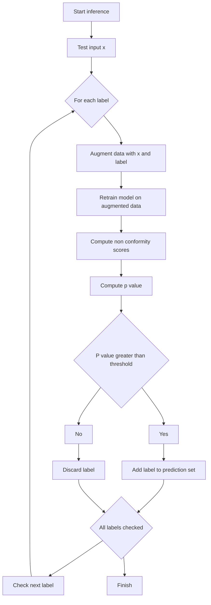
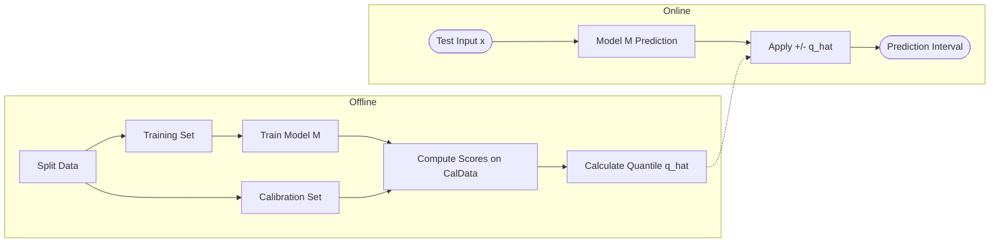
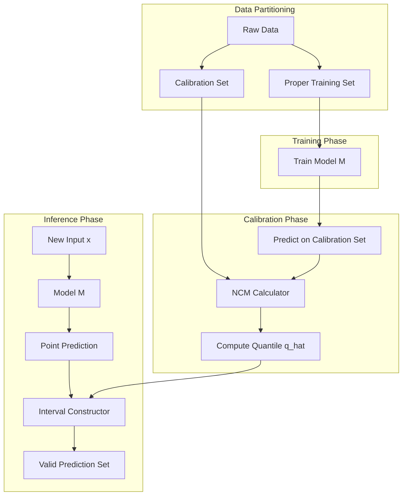

- [1 - Introduction: The Imperative of Uncertainty Quantification](#1---introduction-the-imperative-of-uncertainty-quantification)
- [2 - Mathematical Foundations and Prerequisites](#2---mathematical-foundations-and-prerequisites)
	- [2.1 - The Assumption of Exchangeability](#21---the-assumption-of-exchangeability)
	- [2.2 - Empirical Quantiles and Finite-Sample Correction](#22---empirical-quantiles-and-finite-sample-correction)
- [3 - Core Theory: The Generalised Conformal Framework](#3---core-theory-the-generalised-conformal-framework)
	- [3.1 - The Non-Conformity Measure (NCM)](#31---the-non-conformity-measure-ncm)
	- [3.2 - The Validity Theorem](#32---the-validity-theorem)
- [4 - Architectural Variants: Transductive vs. Inductive](#4---architectural-variants-transductive-vs-inductive)
	- [4.1 - Transductive (Full) Conformal Prediction (TCP)](#41---transductive-full-conformal-prediction-tcp)
	- [4.2 - Inductive (Split) Conformal Prediction (ICP)](#42---inductive-split-conformal-prediction-icp)
	- [4.3 - Table: Comparative Analysis of TCP and ICP](#43---table-comparative-analysis-of-tcp-and-icp)
- [5 - Inductive Conformal Prediction: Step-by-Step Implementation](#5---inductive-conformal-prediction-step-by-step-implementation)
	- [5.1 - Algorithm Specification (Regression)](#51---algorithm-specification-regression)
	- [5.2 - Mock Numerical Example](#52---mock-numerical-example)
- [6 - Classification Methodologies](#6---classification-methodologies)
	- [6.1 - Threshold Prediction Sets (TPS)](#61---threshold-prediction-sets-tps)
	- [6.2 - Adaptive Prediction Sets (APS)](#62---adaptive-prediction-sets-aps)
- [7 - Advanced Regression: Conformalised Quantile Regression (CQR)](#7---advanced-regression-conformalised-quantile-regression-cqr)
	- [7.1 - Quantile Regression and Pinball Loss](#71---quantile-regression-and-pinball-loss)
	- [7.2 - The CQR Algorithm](#72---the-cqr-algorithm)
- [8 - Addressing Data Efficiency: CV+ and Jackknife+](#8---addressing-data-efficiency-cv-and-jackknife)
- [9 - Beyond Exchangeability: Dealing with Distribution Shifts](#9---beyond-exchangeability-dealing-with-distribution-shifts)
	- [9.1 - Covariate Shift and Weighted Conformal Prediction](#91---covariate-shift-and-weighted-conformal-prediction)
	- [9.2 - Time Series: Adaptive Conformal Inference (ACI)](#92---time-series-adaptive-conformal-inference-aci)
- [10 - Implementation Architecture: The "Plug-in" Wrapper](#10---implementation-architecture-the-plug-in-wrapper)
	- [10.1 - System Diagram](#101---system-diagram)
- [11 - Advantages and Disadvantages](#11---advantages-and-disadvantages)
	- [11.1 - Advantages](#111---advantages)
	- [11.2 - Disadvantages](#112---disadvantages)
- [12 - Applications in Modern AI](#12---applications-in-modern-ai)
	- [12.1 - Natural Language Processing (NLP)](#121---natural-language-processing-nlp)
	- [12.2 - Computer Vision](#122---computer-vision)
	- [12.3 - Time Series Forecasting](#123---time-series-forecasting)
- [13 - Conclusion](#13---conclusion)
- [References](#references)

# 1 - Introduction: The Imperative of Uncertainty Quantification

The rapid proliferation of artificial intelligence (AI) and machine learning (ML) across critical sectors (ranging from autonomous transportation and precision medicine to algorithmic trading and judicial sentencing) has precipitated a fundamental crisis of trust. While modern deep neural networks and ensemble methods demonstrate unprecedented predictive accuracy on varied benchmarks, they characteristically suffer from a lack of reliable self-awareness. A deep learning classifier may predict a medical diagnosis with 99% softmax probability while being entirely incorrect, a phenomenon known as overconfidence or poor calibration. In high-stakes decision-making, a point prediction (a single scalar output minimising a loss function) is insufficient. Decision-makers require a rigorous quantification of uncertainty: a guarantee that the true outcome lies within a specific range with a high probability.

Conformal Prediction (CP), a theoretical framework pioneered by Vladimir Vovk (my professor), Alexander Gammerman, and Glenn Shafer in the late 1990s, addresses this limitation by shifting the paradigm from point prediction to set-valued prediction. Unlike Bayesian methods, which rely on priors that may be difficult to specify, or bootstrapping techniques that depend on asymptotic convergence, CP provides finite-sample, distribution-free statistical guarantees. If a Conformal Predictor is calibrated to a 95% confidence level, it is mathematically guaranteed to contain the true outcome 95% of the time, provided the data satisfies the assumption of exchangeability.

This report provides an exhaustive technical examination of Conformal Prediction. It elucidates the mathematical foundations, contrasts the architectural variants of transductive and inductive inference, and explores advanced methodologies such as Conformalised Quantile Regression (CQR) and Adaptive Conformal Inference (ACI) for non-exchangeable time series. The objective is to equip the reader with a nuanced, robust understanding of how to implement statistically valid uncertainty wrappers for arbitrary black-box models.

-----

# 2 - Mathematical Foundations and Prerequisites

The rigour of Conformal Prediction stems from its reliance on minimal assumptions regarding the data-generating process. To appreciate the mechanics of CP, one must first ground the discussion in the statistical properties of data sequences, specifically the concept of exchangeability and the properties of empirical quantile functions.

## 2.1 - The Assumption of Exchangeability

The fundamental theorem underlying all conformal validity is exchangeability. This is a weaker condition than the Independent and Identically Distributed (i.i.d.) assumption typically invoked in statistical learning theory, yet it is sufficient to establish the validity of conformal predictors.

**Definition:**
A sequence of random variables $Z_1, Z_2, \dots, Z_n$ is considered exchangeable if their joint probability distribution is invariant under any permutation of the indices. Formally, for any permutation $\pi$ of the indices $\{1, \dots, n\}$:

$$P(Z_1, Z_2, \dots, Z_n) = P(Z_{\pi(1)}, Z_{\pi(2)}, \dots, Z_{\pi(n)})$$

While i.i.d. data is always exchangeable, exchangeable data need not be independent. A classic example is sampling without replacement from a finite urn; the outcome of the second draw depends on the first, yet the sequence is exchangeable because the joint probability of drawing any specific sequence of items is independent of the order in which they are drawn. In the context of Conformal Prediction, we assume that the proper training data, the calibration data, and the test point are exchangeable. This symmetry implies that the test point is statistically indistinguishable from the training points up until the moment its label is revealed. Consequently, the "strangeness" or error score of the test point is equally likely to rank anywhere among the scores of the calibration points.

## 2.2 - Empirical Quantiles and Finite-Sample Correction

CP algorithms rely heavily on computing quantiles of the empirical distribution of non-conformity scores. Unlike asymptotic statistics, where $n \to \infty$, CP operates in the finite-sample regime.

Let $S = \{s_1, s_2, \dots, s_n\}$ be a set of calibration scores. The empirical Cumulative Distribution Function (CDF) is defined as:

$$\hat{F}_n(t) = \frac{1}{n} \sum_{i=1}^n \mathbb{I}(s_i \leq t)$$

where $\mathbb{I}(\cdot)$ is the indicator function.

To guarantee a coverage of at least $1-\alpha$ (e.g., 0.95), we cannot simply take the $(1-\alpha)$-th quantile of the observed scores. Due to the discrete nature of the finite sample, we must apply a finite-sample correction. The critical value $\hat{q}$ is typically chosen as the $\lceil (n+1)(1-\alpha) \rceil$-th smallest value in the calibration set. The term $(n+1)$ accounts for the inclusion of the test point itself in the exchangeable sequence. This precise calculation ensures that the probability of the test score exceeding the threshold is strictly bounded by $\alpha$.

-----

# 3 - Core Theory: The Generalised Conformal Framework

The central innovation of Conformal Prediction is the separation of the prediction algorithm from the uncertainty quantification mechanism. CP acts as a logical wrapper that can encompass any predictive model (be it a linear regression, a support vector machine, or a transformer-based large language model) transforming its raw outputs into valid prediction sets.

## 3.1 - The Non-Conformity Measure (NCM)

The engine of a Conformal Predictor is the Non-Conformity Measure (NCM), a real-valued function $A(D, z)$ that evaluates how "strange" or "atypical" a data point $z = (x, y)$ is relative to a dataset $D$.

  * **Low Score:** The example $z$ conforms well to the patterns in $D$.
  * **High Score:** The example $z$ is an outlier or poorly predicted by the model trained on $D$.

The choice of NCM determines the efficiency (size) of the prediction sets but not their validity (coverage). Validity is guaranteed by the framework; efficiency depends on the quality of the underlying model and the suitability of the NCM.

Common NCMs include:

  * **Regression:** The absolute residual error, $s_i = |y_i - \hat{f}(x_i)|$.
  * **Classification:** The negative probability of the true class, $s_i = 1 - \hat{P}(y_i | x_i)$.

## 3.2 - The Validity Theorem

The theoretical guarantee of CP can be stated as follows: For any exchangeable dataset $D$ and any significance level $\alpha \in (0, 1)$, the conformal predictor produces a prediction set $\mathcal{C}(X_{n+1})$ such that:

$$P(Y_{n+1} \in \mathcal{C}(X_{n+1})) \geq 1 - \alpha$$

This probability is marginal, meaning it is taken over the randomness of the calibration and test data. It is important to note that this is a conservative bound; for continuous scoring functions, the coverage is bounded tightly between $1-\alpha$ and $1-\alpha + \frac{1}{n+1}$, demonstrating that the method is not only valid but also efficient in the limit.

-----

# 4 - Architectural Variants: Transductive vs. Inductive

While the theoretical core remains consistent, the implementation of CP varies significantly depending on the computational constraints and the specific application. The two primary architectures are Transductive (or Full) Conformal Prediction (TCP) and Inductive (or Split) Conformal Prediction (ICP).

## 4.1 - Transductive (Full) Conformal Prediction (TCP)

TCP represents the "purest" form of the theory, offering the highest statistical efficiency (smallest prediction sets for a given coverage) at the cost of extreme computational expense.

**The Algorithm:**

1.  **Augmentation:** For a new test input $x_{n+1}$ and a tentative label $\tilde{y}$ from the label space $\mathcal{Y}$, create an augmented dataset $D \cup \{(x_{n+1}, \tilde{y})\}$.
2.  **Retraining:** Train the underlying model on this augmented dataset.
3.  **Scoring:** Compute non-conformity scores for all points in the augmented set.
4.  **Ranking:** Compare the score of the tentative point $(x_{n+1}, \tilde{y})$ to the scores of the original data points. Calculate a p-value representing the proportion of points with scores greater than or equal to the tentative point's score.
5.  **Set Construction:** Include $\tilde{y}$ in the prediction set if its p-value is greater than $\alpha$.
6.  **Iteration:** Repeat this process for every possible label $\tilde{y} \in \mathcal{Y}$.

<!-- end list -->

**Limitations:**
In a regression setting where $\mathcal{Y} = \mathbb{R}$, this would require infinite retrainings. Even in classification with $K$ classes, retraining complex models (like deep neural networks) $K$ times for every single test inference is computationally prohibitive. TCP is thus restricted to simple models (like Nearest Neighbours or Ridge Regression) where the "retraining" step can be performed via efficient algebraic updates.

## 4.2 - Inductive (Split) Conformal Prediction (ICP)

To render CP practical for modern machine learning, Inductive Conformal Prediction (ICP) was developed. ICP sacrifices a small amount of statistical efficiency (resulting in slightly wider intervals) for massive computational gains.

**The Algorithm:**

1.  **Data Splitting:** Divide the training data into a Proper Training Set ($D_{train}$) and a Calibration Set ($D_{cal}$).
2.  **Training:** Train the model $\hat{f}$ on $D_{train}$ once.
3.  **Calibration:**
      * Pass the calibration set through the trained model.
      * Compute non-conformity scores $s_i$ for each point in $D_{cal}$.
      * Compute the $(1-\alpha)$ quantile of these scores, denoted as $\hat{q}$.
4.  **Inference:** For a new test point $x_{n+1}$, compute the point prediction $\hat{f}(x_{n+1})$ and form the prediction set using the pre-computed threshold $\hat{q}$.

<!-- end list -->

**Advantages:**
ICP is model-agnostic and requires training the model only once. The calibration step is computationally negligible, involving only forward passes and sorting a list of scalars. This makes ICP the standard choice for deep learning applications.

## 4.3 - Table: Comparative Analysis of TCP and ICP

The following table summarises the operational differences between the two architectures.

| Feature                      | Transductive (TCP)                                     | Inductive (Split ICP)                       |
| :--------------------------- | :----------------------------------------------------- | :------------------------------------------ |
| **Training Frequency**       | Retrained for every test label hypothesis              | Trained once offline                        |
| **Data Utilisation**         | Uses 100% of data for training                         | Splits data (e.g., 80% Train, 20% Cal)      |
| **Computational Complexity** | High ($\mathcal{O}(K \cdot N_{train})$ per test point) | Low ($\mathcal{O}(1)$ per test point)       |
| **Statistical Efficiency**   | High (Narrower sets)                                   | Moderate (Sets slightly wider due to split) |
| **Suitability**              | Small datasets, simple models                          | Big data, Deep Learning, Black boxes        |

-----

# 5 - Inductive Conformal Prediction: Step-by-Step Implementation

To ensure a rigorous understanding of the mechanics, we present a detailed manual walkthrough of the Inductive Conformal Prediction algorithm for a regression task. This section serves to demystify the abstract theory into concrete arithmetic operations.

## 5.1 - Algorithm Specification (Regression)

**Inputs:**

  * Proper Training Set $D_{train}$.
  * Calibration Set $D_{cal} = \{(x_1, y_1), \dots, (x_n, y_n)\}$.
  * Test Input $x_{test}$.
  * Error Rate $\alpha$ (e.g., 0.1 for 90% coverage).
  * Base Regressor $\mu(\cdot)$.

**Procedure:**

1.  **Model Fitting:** Fit $\hat{\mu}$ on $D_{train}$.
2.  **Score Computation:** For each $i \in \{1, \dots, n\}$ in $D_{cal}$, calculate the absolute residual:
    $$s_i = |y_i - \hat{\mu}(x_i)|$$
3.  **Quantile Determination:**
      * Sort scores: $s_{(1)} \le s_{(2)} \le \dots \le s_{(n)}$.
      * Calculate index $k = \lceil (n+1)(1-\alpha) \rceil$.
      * Set threshold $\hat{q} = s_{(k)}$.
4.  **Prediction:**
    $$\mathcal{C}(x_{test}) = [\hat{\mu}(x_{test}) - \hat{q}, \quad \hat{\mu}(x_{test}) + \hat{q}]$$

## 5.2 - Mock Numerical Example

Let us execute this logic with a small, synthetic dataset.

**Scenario:** We have trained a model $\hat{\mu}$ on a training set. We have held out 5 data points for calibration ($n=5$). We desire a 90% confidence interval ($\alpha = 0.1$).

**Data (Calibration Set):**

| ID ($i$) | Input ($x_i$) | True Label ($y_i$) | Model Prediction ($\hat{\mu}(x_i)$) | Residual ($\lvert y_i - \hat{y}_i \rvert$) |
| :------- | :------------ | :----------------- | :---------------------------------- | :----------------------------------------- |
| 1        | 2.5           | 10.0               | 10.2                                | 0.2                                        |
| 2        | 3.0           | 12.0               | 11.5                                | 0.5                                        |
| 3        | 1.0           | 5.0                | 6.2                                 | 1.2                                        |
| 4        | 4.0           | 15.0               | 14.9                                | 0.1                                        |
| 5        | 5.0           | 20.0               | 18.0                                | 2.0                                        |

**Step 1: Calibration Scores**  
The scores (residuals) are $S_{\text{raw}} = \{0.2, 0.5, 1.2, 0.1, 2.0\}$.

**Step 2: Sorting**
Sort the scores in ascending order:
$$S_{sorted} = \{0.1, 0.2, 0.5, 1.2, 2.0\}$$

**Step 3: Calculating the Threshold**
We define the quantile level as $1-\alpha = 0.9$.
The index calculation using the finite-sample correction is:
$$ k = \lceil (n+1)(1-\alpha) \rceil = \lceil (5+1)(0.9) \rceil = \lceil 6 \times 0.9 \rceil = \lceil 5.4 \rceil = 6 $$

**Crucial Observation:** In this small sample size, the calculation asks for the 6th element. However, we only have 5 elements. The rigorous theory dictates that if $k > n$, we must set $\hat{q} = \infty$. This illustrates the sample complexity of CP; to guarantee 90% coverage, one needs at least enough calibration points such that $\lceil (n+1)(1-\alpha) \rceil \le n$. Specifically, $1/(n+1) < \alpha$. For $\alpha=0.1$, we need $n+1 > 10$, so $n \ge 10$ is required to get a finite bound.

**Revised Scenario:** Let us adjust $\alpha$ to 0.2 (80% coverage) for this small dataset.
$$k = \lceil (5+1)(0.8) \rceil = \lceil 4.8 \rceil = 5$$
The 5th smallest score in our sorted list is 2.0.
So, $\hat{q} = 2.0$.

**Step 4: Inference**
A new input $x_{new} = 3.5$ is presented.
The model predicts $\hat{\mu}(3.5) = 13.0$.
The Prediction Interval is:
$$[13.0 - 2.0, \quad 13.0 + 2.0] = [11.0, 15.0]$$
We can state with 80% confidence (marginal validity) that the true value lies within this range.

-----

# 6 - Classification Methodologies

Extending CP to classification requires adaptation, as "residuals" are not naturally defined for categorical labels. The output is a set of labels rather than an interval.

## 6.1 - Threshold Prediction Sets (TPS)

The simplest approach, often called the "Naive" method, uses the softmax probability of the true class as the conformity score.
$$s_i = 1 - \hat{P}(y_i | x_i)$$
We find a threshold $\hat{q}$ such that for $1-\alpha$ of the calibration examples, the true class probability is at least $1-\hat{q}$.
For a test point, we include all classes $k$ where $\hat{P}(k | x_{test}) \ge 1-\hat{q}$.

**Disadvantage:** This method is not adaptive. If the model is uniformly uncertain (e.g., flat softmax distribution $0.1, 0.1, \dots$), the threshold might exclude all classes (producing an empty set) or include all classes, depending on the calibration distribution. It does not account for the local difficulty of the specific image or text input.

## 6.2 - Adaptive Prediction Sets (APS)

To address the limitations of TPS, Adaptive Prediction Sets (APS) (Romano et al., 2020) utilise cumulative probability mass.

**The NCM:**
For a data point $(x_i, y_i)$, we sort the predicted probabilities for all classes in descending order. We then sum these probabilities starting from the highest until we reach the true class $y_i$.
$$s_i = \sum_{j=1}^{k} \hat{P}(\pi_j(x_i) | x_i) \quad \text{where } \pi_k(x_i) = y_i$$
This score represents "how much probability mass must be accumulated to capture the truth."

**Inference:**
We calibrate to find a quantile threshold $\hat{q}$ (e.g., 0.95). For a test point, we sort the classes and greedily include them in the prediction set until their cumulative sum reaches $\hat{q}$.
This ensures that for "easy" inputs (where probability is concentrated on one class), the set is small (size 1). For "hard" inputs (diffuse probability), the set expands to capture the uncertainty. This property is known as adaptivity.

-----

# 7 - Advanced Regression: Conformalised Quantile Regression (CQR)

While standard ICP guarantees validity, applying it with a simple absolute residual score ($|y - \hat{y}|$) results in intervals of constant width ($2\hat{q}$) across the entire input space. This is often suboptimal because real-world data is frequently heteroscedastic: the uncertainty varies depending on the input $x$. For instance, predicting the price of a luxury mansion involves higher absolute variance than predicting the price of a studio apartment. Standard ICP would produce an interval too wide for the apartment (inefficient) and potentially too narrow for the mansion (locally invalid, though globally valid).

Conformalised Quantile Regression (CQR), proposed by Romano, Patterson, and Candès (2019), combines the adaptivity of quantile regression with the rigorous guarantees of conformal prediction.

## 7.1 - Quantile Regression and Pinball Loss

Instead of predicting the conditional mean, we train a model to output two conditional quantiles: a lower bound $\hat{t}_{lo}(x)$ (e.g., 5th percentile) and an upper bound $\hat{t}_{hi}(x)$ (e.g., 95th percentile).
This is achieved by minimising the Pinball Loss (or Tilted Absolute Value Loss):
$$L_\tau(y, \hat{y}) = \max(\tau(y-\hat{y}), (\tau-1)(y-\hat{y}))$$
For a 90% interval, we train one output head with $\tau=0.05$ and another with $\tau=0.95$.

## 7.2 - The CQR Algorithm

Raw quantile regression estimates are asymptotically valid but typically fail to guarantee coverage in finite samples. CQR uses CP to "conformalise" these estimates.

**The NCM:**
The non-conformity score measures the signed distance of the true value $y_i$ from the predicted interval boundaries.
$$s_i = \max(\hat{t}_{lo}(x_i) - y_i, \quad y_i - \hat{t}_{hi}(x_i))$$

  * **Inside:** If $y_i$ is inside the interval, $s_i$ is negative (representing the margin of safety).
  * **Outside:** If $y_i$ is outside, $s_i$ is positive (representing the magnitude of the violation).

**Inference:**
We compute the quantile $\hat{q}$ of these scores on the calibration set. The final prediction interval is:
$$\mathcal{C}(x) = [\hat{t}_{lo}(x) - \hat{q}, \quad \hat{t}_{hi}(x) + \hat{q}]$$
If the base model is under-confident (intervals too wide), $\hat{q}$ will be negative, shrinking the intervals.
If the base model is over-confident (intervals too narrow), $\hat{q}$ will be positive, widening them.
This results in intervals that vary locally in width (inherited from the quantile regressor) but are globally calibrated to exactly $1-\alpha$ coverage.

-----

# 8 - Addressing Data Efficiency: CV+ and Jackknife+

A critique of standard ICP is data inefficiency: setting aside 20-30% of data for calibration reduces the data available for training the model. This is problematic for small datasets. Techniques like Jackknife+ and CV+ (Cross-Validation Plus) address this by using resampling strategies.

**Mechanism:**
Instead of a single split, we perform $K$-fold cross-validation. We train $K$ models, each leaving out a different fold. We compute residuals for each data point using the model that did not see it during training.
The prediction set is constructed by aggregating the residuals from all $K$ folds.
$$\mathcal{C}(x) =$$
While computationally more expensive (training $K$ models), this allows using all data for both training and calibration, improving the stability and tightness of the intervals without violating validity guarantees.

-----

# 9 - Beyond Exchangeability: Dealing with Distribution Shifts

The "Achilles' heel" of classical CP is the exchangeability assumption. In many real-world deployments, the test distribution differs from the training distribution. Two prominent cases are Covariate Shift and Time Series (Distribution Drift).

## 9.1 - Covariate Shift and Weighted Conformal Prediction

**Scenario:** The conditional distribution $P(Y|X)$ remains constant (the physics of the problem hasn't changed), but the marginal distribution $P(X)$ changes. For example, a medical model trained on younger patients is tested on an older demographic.

**Solution:** Weighted Conformal Prediction (Tibshirani et al., 2019) modifies the calibration step. If we can estimate the likelihood ratio $w(x) = dP_{test}(x) / dP_{train}(x)$, we can assign weights to the calibration points.
Instead of treating all calibration scores as having equal probability mass ($1/n$), we assign mass proportional to their weights $w(x_i)$.
$$p_i = \frac{w(x_i)}{\sum w(x_j) + w(x_{test})}$$
We then compute the weighted quantile of the scores. Points in the calibration set that are "similar" to the current test point (high $w(x)$) exert more influence on the threshold, effectively adapting the interval to the local density of the test distribution.

## 9.2 - Time Series: Adaptive Conformal Inference (ACI)

**Scenario:** In time series, data is not exchangeable due to temporal dependence and concept drift (distribution drift). $P(Y|X)$ changes over time. Standard CP often fails here, producing intervals that alternate between under-covering (during high volatility) and over-covering (during stability).

**Solution:** Adaptive Conformal Inference (ACI) (Gibbs & Candès, 2021) treats the coverage level $\alpha$ as a variable to be controlled, rather than a fixed parameter. It views the CP process through the lens of Control Theory.

**The ACI Algorithm:**
We maintain a time-varying parameter $\alpha_t$.
At each time step $t$:

1.  Construct the prediction set $\mathcal{C}_t$ using the current $\alpha_t$.
2.  Observe the true value $y_t$.
3.  Update $\alpha_{t+1}$ using a simple feedback rule (similar to the Integral term in a PID controller):
    $$\alpha_{t+1} = \alpha_t + \gamma (\alpha_{target} - \mathbb{I}(y_t \notin \mathcal{C}_t))$$

If we failed to cover ($\mathbb{I}=1$), the error was 1, which is likely $>\alpha_{target}$. The term becomes negative, so we decrease $\alpha_t$. A smaller $\alpha$ implies a higher confidence level ($1-\alpha$), resulting in a wider interval for the next step.
If we covered successfully ($\mathbb{I}=0$), we increase $\alpha_t$, slightly narrowing the interval to reduce conservativeness.
This mechanism ensures that the long-run coverage frequency converges to $1-\alpha_{target}$, even if the underlying distribution is shifting arbitrarily. This provides asymptotic validity for non-exchangeable data.

-----

# 10 - Implementation Architecture: The "Plug-in" Wrapper

It is crucial to visualise CP not as a new model class, but as a modular wrapper.

## 10.1 - System Diagram

The architecture follows a pipeline approach:

This modularity means CP can be "plugged in" to existing MLOps pipelines with minimal disruption. The base model training remains untouched; CP is strictly a post-processing calibration step.

-----

# 11 - Advantages and Disadvantages

## 11.1 - Advantages

  * **Distribution-Free Validity:** The strongest asset. Guarantees hold regardless of whether the error distribution is Gaussian, Poisson, bimodal, or skewed.
  * **Finite-Sample Guarantee:** Unlike the Central Limit Theorem or Bootstrap methods which converge as $n \to \infty$, CP guarantees are valid for $n=100$ or $n=50$ (subject to sample complexity limits).
  * **Model Agnostic:** Works with Linear Regression, Random Forests, LSTMs, and Transformers equally well.
  * **Transparency:** The resulting set explicitly communicates uncertainty. An empty set warns of broken data; a set containing all classes warns of a confused model.

## 11.2 - Disadvantages

  * **Marginal vs. Conditional Validity:** The primary guarantee is marginal ($P(Y \in C(X)) \ge 1-\alpha$). It averages over all calibration and test points. It does not guarantee conditional coverage ($P(Y \in C(X) | X=x) \ge 1-\alpha$). It is possible for the model to persistently under-cover "hard" groups (e.g., minorities or rare edge cases) while over-covering "easy" groups, averaging out to the correct level.
  * **Conservativeness:** To maintain guarantees, CP sets can become very large (or infinite) if the base model is poor or the data is extremely noisy.
  * **Assumption Sensitivity:** While robust to distribution shape, standard CP is sensitive to the exchangeability assumption. Violations (drift) require advanced modifications like ACI or Weighted CP.

-----

# 12 - Applications in Modern AI

## 12.1 - Natural Language Processing (NLP)

Large Language Models (LLMs) are notorious for "hallucinations." CP is being adapted to quantify uncertainty in generation. For example, rather than outputting a single token, a conformal LLM outputs a set of plausible tokens for the next position. This can be used for "Conformal Risk Control" in retrieval-augmented generation (RAG) to ensure that the retrieved answer contains the correct document with high probability.

## 12.2 - Computer Vision

In medical imaging (e.g., tumour segmentation), point predictions are dangerous. CP is used to generate segmentation masks with guaranteed coverage, ensuring that the true tumour boundary is contained within the predicted region. This is vital for surgical planning.

## 12.3 - Time Series Forecasting

In supply chain and energy grid management, CP (specifically ACI and EnbPI) is used to predict demand intervals. Unlike standard quantile regression, these intervals dynamically adjust to sudden shocks (e.g., a heatwave spiking energy use), preventing grid failures due to underestimation of load.

-----

# 13 - Conclusion

Conformal Prediction represents a critical maturation of Artificial Intelligence engineering. It transitions the field from a reliance on heuristic "best guesses" to a rigorous discipline of "guaranteed ranges." By mathematically decoupling the prediction task from the uncertainty quantification task, it allows practitioners to leverage the power of state-of-the-art black-box models without sacrificing statistical integrity.

Mastering CP offers a toolkit to build "safe" AI systems. Whether addressing the heteroscedasticity of housing markets via CQR, or taming the non-stationarity of financial time series via ACI, the conformal framework provides the architectural patterns necessary to deploy machine learning responsibly in an uncertain world.

-----

# References

1. Shafer, G., & Vovk, V. (2008). *[A Tutorial on Conformal Prediction](https://jmlr.org/papers/v9/shafer08a.html)*. **Journal of Machine Learning Research, 9**, 371–421. ([jmlr.org][1])

2. Angelopoulos, A. N., & Bates, S. (2021). *[A Gentle Introduction to Conformal Prediction and Distribution-Free Uncertainty Quantification](https://arxiv.org/abs/2107.07511)*. **arXiv:2107.07511**. ([arXiv][2])

3. Linusson, H., Johansson, U., Boström, H., & Löfström, T. (2014). *[Efficiency Comparison of Unstable Transductive and Inductive Conformal Classifiers](https://link.springer.com/chapter/10.1007/978-3-662-44722-2_28)*. In **Artificial Intelligence Applications and Innovations (AIAI 2014)**, IFIP AICT, 437, 261–270. ([SpringerLink][3])

4. Romano, Y., Patterson, E., & Candès, E. J. (2019). *[Conformalized Quantile Regression](https://arxiv.org/abs/1905.03222)*. In **Advances in Neural Information Processing Systems (NeurIPS 2019)**, 32. ([arXiv][4])

5. Tibshirani, R. J., Barber, R. F., Candès, E. J., & Ramdas, A. (2019). *[Conformal Prediction Under Covariate Shift](https://arxiv.org/abs/1904.06019)*. In **Advances in Neural Information Processing Systems (NeurIPS 2019)**, 32, 2526–2536. ([arXiv][5])

6. Gibbs, I., & Candès, E. (2021). *[Adaptive Conformal Inference Under Distribution Shift](https://arxiv.org/abs/2106.00170)*. In **Advances in Neural Information Processing Systems (NeurIPS 2021)**, 34, 1660–1672. ([NeurIPS Proceedings][6])

7. Campos, M. M., Farinhas, A., Zerva, C., Figueiredo, M. A. T., & Martins, A. F. T. (2024). *[Conformal Prediction for Natural Language Processing: A Survey](https://aclanthology.org/2024.tacl-1.82/)*. **Transactions of the Association for Computational Linguistics, 12**, 1497–1516. ([arXiv][7])

8. Stocker, M., Małgorzewicz, W., Fontana, M., & Ben Taieb, S. (2025). *[A Gentle Introduction to Conformal Time Series Forecasting](https://arxiv.org/abs/2511.13608)*. **arXiv:2511.13608**. ([arXiv][8])

[1]: https://jmlr.org/papers/v9/shafer08a.html?utm_source=chatgpt.com "A Tutorial on Conformal Prediction"
[2]: https://arxiv.org/abs/2107.07511?utm_source=chatgpt.com "A Gentle Introduction to Conformal Prediction and Distribution-Free Uncertainty Quantification"
[3]: https://link.springer.com/chapter/10.1007/978-3-662-44722-2_28?utm_source=chatgpt.com "Efficiency Comparison of Unstable Transductive and ..."
[4]: https://arxiv.org/abs/1905.03222?utm_source=chatgpt.com "Conformalized Quantile Regression"
[5]: https://arxiv.org/abs/1904.06019?utm_source=chatgpt.com "Conformal Prediction Under Covariate Shift"
[6]: https://proceedings.neurips.cc/paper/2021/hash/0d441de75945e5acbc865406fc9a2559-Abstract.html?utm_source=chatgpt.com "Adaptive Conformal Inference Under Distribution Shift"
[7]: https://arxiv.org/abs/2405.01976?utm_source=chatgpt.com "Conformal Prediction for Natural Language Processing: A Survey"
[8]: https://www.arxiv.org/abs/2511.13608?utm_source=chatgpt.com "A Gentle Introduction to Conformal Time Series Forecasting"
