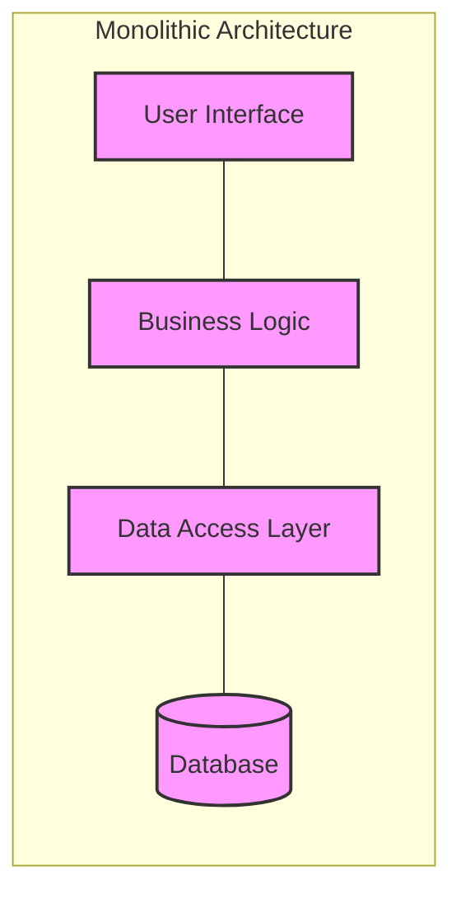
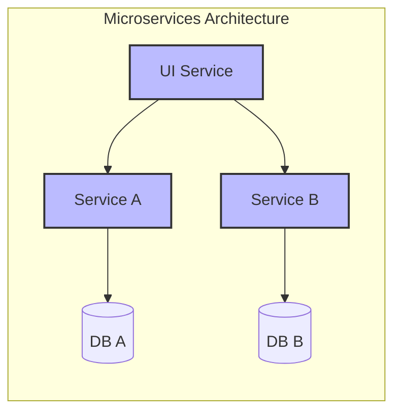
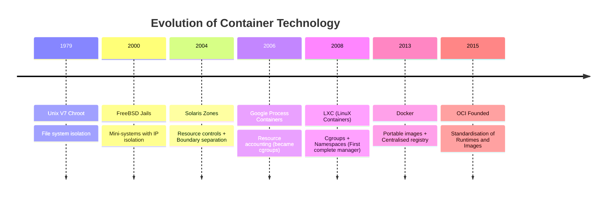
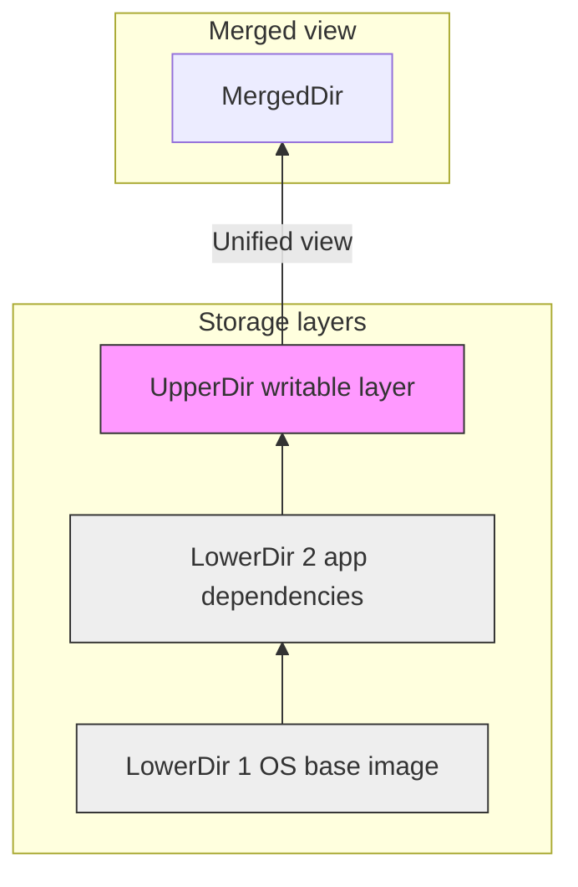
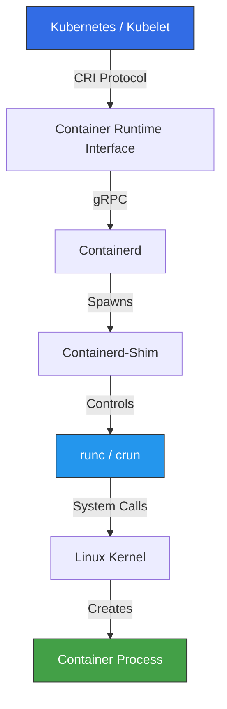
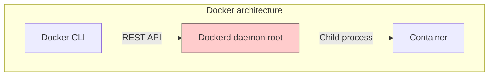
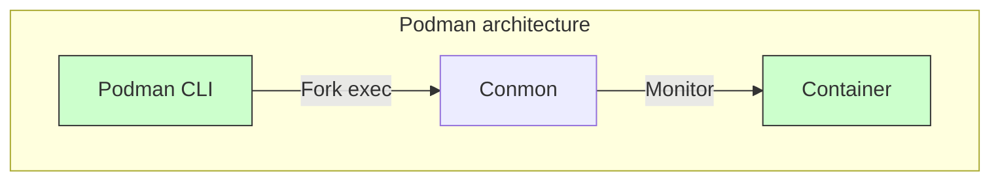
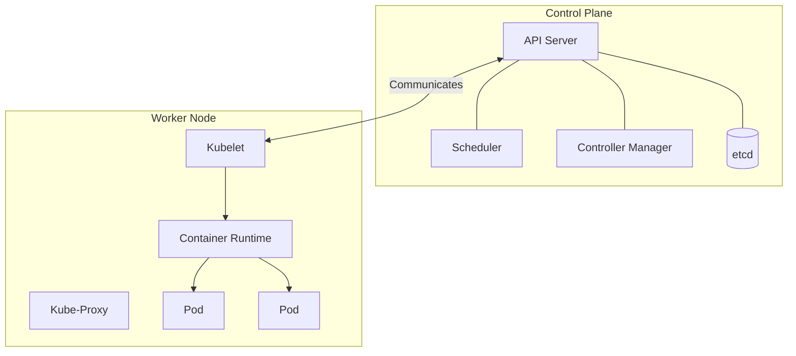
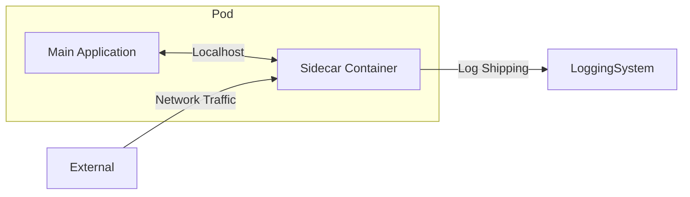

- [1 - Introduction](#1---introduction)
- [2 - Historical Context and Evolution](#2---historical-context-and-evolution)
	- [2.1 - The Birth: Chroot and Early Isolation (1979-2000)](#21---the-birth-chroot-and-early-isolation-1979-2000)
	- [2.2 - The Era of Jails and Zones (2000-2005)](#22---the-era-of-jails-and-zones-2000-2005)
	- [2.3 - The Convergence: Cgroups and LXC (2006-2008)](#23---the-convergence-cgroups-and-lxc-2006-2008)
	- [2.4 - The Docker Revolution (2013-Present)](#24---the-docker-revolution-2013-present)
- [3 - Core Theory and Kernel Mechanics](#3---core-theory-and-kernel-mechanics)
	- [3.1 - Linux Namespaces: The Layer of Isolation](#31---linux-namespaces-the-layer-of-isolation)
		- [3.1.1 - The PID Namespace](#311---the-pid-namespace)
		- [3.1.2 - The Network Namespace](#312---the-network-namespace)
		- [3.1.3 - The User Namespace](#313---the-user-namespace)
	- [3.2 - Control Groups (cgroups): Resource Governance](#32---control-groups-cgroups-resource-governance)
	- [3.3 - Union Filesystems: Storage Efficiency](#33---union-filesystems-storage-efficiency)
		- [3.3.1 - Architecture of OverlayFS](#331---architecture-of-overlayfs)
		- [3.3.2 - The Copy-on-Write (CoW) Mechanism](#332---the-copy-on-write-cow-mechanism)
- [4 - Container Runtimes and Standards](#4---container-runtimes-and-standards)
	- [4.1 - The OCI Specifications](#41---the-oci-specifications)
	- [4.2 - The Runtime Hierarchy](#42---the-runtime-hierarchy)
		- [4.2.1 - High-Level Runtimes (Container Managers)](#421---high-level-runtimes-container-managers)
		- [4.2.2 - Low-Level Runtimes (OCI Runtimes)](#422---low-level-runtimes-oci-runtimes)
		- [4.2.3 - The Shim Architecture](#423---the-shim-architecture)
- [5 - Architectural Paradigms: Docker vs Podman](#5---architectural-paradigms-docker-vs-podman)
	- [5.1 - Docker: The Monolithic Daemon](#51---docker-the-monolithic-daemon)
	- [5.2 - Podman: The Fork-Exec Model](#52---podman-the-fork-exec-model)
- [6 - Orchestration: Managing Complexity at Scale](#6---orchestration-managing-complexity-at-scale)
	- [6.1 - Kubernetes: The Industry Standard](#61---kubernetes-the-industry-standard)
	- [6.2 - Docker Swarm](#62---docker-swarm)
	- [6.3 - Interface Standards](#63---interface-standards)
- [7 - Performance Analysis: Virtual Machines vs Containers](#7---performance-analysis-virtual-machines-vs-containers)
	- [7.1 - Virtual Machines (Hypervisors)](#71---virtual-machines-hypervisors)
	- [7.2 - Containers](#72---containers)
- [8 - Security Landscape](#8---security-landscape)
	- [8.1 - Attack Vectors](#81---attack-vectors)
	- [8.2 - Hardening Strategies and NIST Guidelines](#82---hardening-strategies-and-nist-guidelines)
		- [8.2.1 - Rootless Containers](#821---rootless-containers)
		- [8.2.2 - Seccomp (Secure Computing Mode)](#822---seccomp-secure-computing-mode)
		- [8.2.3 - Mandatory Access Control (AppArmor/SELinux)](#823---mandatory-access-control-apparmorselinux)
		- [8.2.4 - Capabilities Dropping](#824---capabilities-dropping)
- [9 - Application Design and Lifecycle](#9---application-design-and-lifecycle)
	- [9.1 - The 12-Factor App Methodology](#91---the-12-factor-app-methodology)
	- [9.2 - Container Design Patterns](#92---container-design-patterns)
- [10 - Future Directions: WASM and Unikernels](#10---future-directions-wasm-and-unikernels)
- [References](#references)

# 1 - Introduction

The paradigm of software deployment has undergone a radical transformation over the last decade, shifting from monolithic applications deployed on static hardware or heavyweight virtual machines to distributed microservices encapsulated within lightweight containers. This report provides an exhaustive technical analysis of containerisation, defined as a method of operating system-level virtualisation that permits multiple isolated user-space instances to coexist on a single control host.

**Monolithic Architecture**

**Microservices Architecture**

This document dissects the theoretical foundations of the technology, tracing its lineage from the Unix chroot system call to contemporary implementations such as Docker, Podman, and Kubernetes. It provides a granular examination of the underlying Linux kernel primitives (specifically Namespaces, Control Groups, and Union Filesystems) that collectively enable the abstraction known as a "container". Furthermore, the analysis contrasts the monolithic, daemon-based architecture of Docker with the modular, daemonless model of Podman, evaluating their respective impacts on security, performance, and system integration.

The report also addresses the critical distinction between container runtimes and orchestration platforms, exploring how tools like Kubernetes leverage the Container Runtime Interface (CRI) to manage workloads at scale. Finally, it synthesises academic research and industry standards, including NIST Special Publication 800-190, to provide a definitive guide on container security, performance benchmarking, and architectural design patterns.

-----

# 2 - Historical Context and Evolution

To fully comprehend modern container technology, it is essential to analyse the incremental advancements in operating system theory that necessitated its development. The core theory driving this evolution is the desire to decouple application execution from underlying infrastructure dependencies, thereby solving the "matrix of hell" where applications behave inconsistently across different environments.

**Evolution of Container Technology**

## 2.1 - The Birth: Chroot and Early Isolation (1979-2000)

The conceptual ancestor of the container is the chroot (change root) system call, introduced in Unix Version 7 in 1979. The chroot operation modifies the apparent root directory for a running process and its children. Once trapped in this modified environment, a process cannot access files outside the designated directory tree. While this provided a rudimentary form of file system isolation, it did not isolate other critical system resources such as networking or process identifiers (PIDs). Consequently, "breaking out" of a chroot jail became a trivial task for privileged users, rendering it insufficient for secure multi-tenancy.

## 2.2 - The Era of Jails and Zones (2000-2005)

In 2000, FreeBSD introduced Jails, a significant advancement that extended chroot by partitioning the system into independent "mini-systems". A Jail provided not only file system isolation but also distinct IP addresses and system configurations, allowing hosting providers to securely isolate customers on shared hardware.

Parallel to this, Sun Microsystems released Solaris Containers (Zones) in 2004. This implementation combined system resource controls with boundary separation, leveraging the ZFS filesystem's snapshot capabilities to create lightweight, cloneable environments. In the Linux world, OpenVZ (2005) emerged as a popular operating system-level virtualisation technology. It utilised a patched Linux kernel to provide "Virtual Private Servers" (VPS), offering near-native performance. However, its reliance on a custom, non-standard kernel hindered its integration into the mainline Linux ecosystem.

## 2.3 - The Convergence: Cgroups and LXC (2006-2008)

The pivotal moment for modern Linux containers occurred in 2006 when Google engineers introduced Process Containers, designed to limit and account for the resource usage (CPU, memory, disk I/O) of process collections. This functionality was renamed Control Groups (cgroups) and merged into the Linux kernel 2.6.24 in 2007.

In 2008, LXC (LinuX Containers) combined these new cgroups with Linux Namespaces (which provide isolation) to create the first complete, upstream implementation of a Linux container manager that did not require kernel patches. LXC allowed users to run multiple isolated Linux systems (containers) on a single control host, effectively democratising OS-level virtualisation.

## 2.4 - The Docker Revolution (2013-Present)

While LXC provided the necessary technical capabilities, it lacked usability and a standardised distribution model. In 2013, Docker emerged (initially using LXC as its execution driver) and revolutionised the industry by introducing a complete ecosystem. Docker provided a portable image format, a centralised registry for distribution (Docker Hub), and a layered filesystem that enabled efficient storage. Docker eventually replaced LXC with its own library, libcontainer (now runc), to interact directly with kernel primitives. This shift standardised the container lifecycle and established the immutable infrastructure model that dominates cloud computing today.

-----

# 3 - Core Theory and Kernel Mechanics

At a high level, a container is frequently described as a lightweight virtual machine. However, from a technical perspective, this analogy is imprecise. A container is effectively a process (or group of processes) running on the host operating system that is subjected to a "controlled hallucination" regarding the system resources it can perceive and access. This isolation is achieved through three primary Linux kernel components: Namespaces, Control Groups (cgroups), and Union Filesystems.

## 3.1 - Linux Namespaces: The Layer of Isolation

Namespaces serve as the mechanism for "view" isolation. They wrap global system resources in an abstraction layer, making it appear to the processes within the namespace that they possess their own isolated instance of that global resource. The Linux kernel currently implements eight primary namespaces, seven of which are critical for container operation:

**Table 1: Linux Namespaces and Their Functions**

| Namespace  | System Call Flag  | Resource Isolated | Description                                                                      |
| :--------- | :---------------- | :---------------- | :------------------------------------------------------------------------------- |
| **PID**    | `CLONE_NEWPID`    | Process IDs       | Provides a separate PID number space. The first process inside is PID 1.         |
| **NET**    | `CLONE_NEWNET`    | Networking        | Isolates network devices, stacks, ports, and routing tables.                     |
| **MNT**    | `CLONE_NEWNS`     | Mount Points      | Isolates filesystem mount points, allowing distinct views of the file hierarchy. |
| **UTS**    | `CLONE_NEWUTS`    | Hostname          | Allows the container to have its own hostname and NIS domain name.               |
| **IPC**    | `CLONE_NEWIPC`    | IPC Resources     | Isolates System V IPC objects and POSIX message queues.                          |
| **USER**   | `CLONE_NEWUSER`   | User IDs          | Maps UIDs/GIDs inside the container to different IDs on the host.                |
| **CGROUP** | `CLONE_NEWCGROUP` | Cgroup Root       | Isolates the view of the cgroup hierarchy itself.                                |

### 3.1.1 - The PID Namespace

In a standard Linux system, processes form a single tree rooted at init (PID 1). In a PID namespace, the process created (e.g., the application entry point) is assigned PID 1 within that namespace. This is crucial because PID 1 has special responsibilities, such as reaping "zombie" processes (child processes that have terminated but whose exit status has not been collected).

If an application running as PID 1 inside a container crashes or exits, the namespace is destroyed, and the container stops. Crucially, this process maintains a duality: while it sees itself as PID 1, it possesses a different, standard PID in the host's root namespace. This allows the host administrator to monitor and manage the process using standard tools like kill or htop, while the container remains oblivious to the host environment.

### 3.1.2 - The Network Namespace

The Network namespace allows each container to possess a completely isolated network stack. This includes its own network interfaces (e.g., eth0), loopback device (lo), IP routing tables, and firewall rules (iptables). Communication between the container and the host (or the internet) is typically achieved using a virtual ethernet (veth) pair. One end of the pair resides inside the container (appearing as eth0), while the other end plugs into a bridge (e.g., docker0) on the host. This architecture enables complex networking topologies, such as those found in Kubernetes, without conflicts between applications attempting to bind to the same port.

### 3.1.3 - The User Namespace

User Namespaces act as a critical security feature by allowing a process to hold root privileges (UID 0) inside the container while simultaneously mapping to a non-privileged user (e.g., UID 1000) on the host. This mapping significantly mitigates the risk of privilege escalation attacks. Even if an attacker successfully breaks out of the container runtime, they find themselves with limited permissions on the host system, unable to modify system files or insert kernel modules.

## 3.2 - Control Groups (cgroups): Resource Governance

While namespaces strictly limit visibility (what a process can see), they do not inherently limit usage (what a process can consume). Without further controls, a process in a separate namespace could consume 100% of the host's CPU cycles or exhaust all available memory, triggering a system-wide crash. Control Groups (cgroups) solve this by enforcing limits and accounting.

Cgroups are organised in a hierarchical filesystem (typically mounted at `/sys/fs/cgroup`). They enable the container engine to enforce detailed policies:

  * **Memory Limits:** Administrators can restrict the maximum Random Access Memory (RAM) a container can use. If a container exceeds this limit, the Out of Memory (OOM) Killer will terminate a process within the cgroup to recover resources.
  * **CPU Quotas:** Cgroups can assign CPU shares (relative weights) or hard limits (e.g., 0.5 CPU cores) to prevent a single container from starving others (a phenomenon known as the "noisy neighbour" problem).
  * **I/O Throttling:** Read and write speeds to block devices can be capped to ensure equitable disk access.
  * **PID Limits:** The total number of processes within a cgroup can be restricted to prevent "fork bombs" from exhausting the host's process table.

**v1 vs v2:** The Linux community is currently transitioning from cgroup v1 to cgroup v2. Cgroup v2 offers a unified hierarchy (as opposed to v1's separate hierarchies for memory, CPU, etc.) and provides safer delegation of limits to unprivileged users, which is essential for rootless container technology.

## 3.3 - Union Filesystems: Storage Efficiency

Containers are designed to be ephemeral and fast to start. Achieving this with traditional copying of full operating system images would be inefficient in terms of both time and disk space. This challenge is addressed by Union Filesystems (UnionFS), with OverlayFS being the standard implementation in modern Linux kernels.

### 3.3.1 - Architecture of OverlayFS

OverlayFS functions by merging separate directory trees into a single, unified view. It relies on three primary components:

1.  **LowerDir:** This comprises the read-only layers of the container image. Multiple lower layers can be stacked (e.g., an OS base layer + an application dependency layer).
2.  **UpperDir:** This is a writable directory layer where the container stores its runtime changes.
3.  **MergedDir:** This is the unified view presented to the container process, combining contents from both the Upper and Lower directories.

### 3.3.2 - The Copy-on-Write (CoW) Mechanism

When a container starts, the UpperDir is initially empty. OverlayFS handles file operations via a Copy-on-Write strategy:

  * **Read:** If a process attempts to read a file, OverlayFS looks in the UpperDir. If the file is not found, it reads from the LowerDir. This operation incurs zero performance penalty.
  * **Write:** If a process attempts to modify a file located in the read-only LowerDir, OverlayFS triggers a `copy_up` operation. The file is copied from the LowerDir to the UpperDir, and the modification is applied to the copy.
  * **Delete:** If a file from the LowerDir is deleted, OverlayFS creates a "whiteout" file in the UpperDir. This special marker hides the file in the LowerDir from the MergedDir view without actually modifying the read-only image.

This mechanism ensures that the base image remains immutable and can be shared across hundreds of containers, resulting in massive storage savings and near-instantaneous startup times.

-----

# 4 - Container Runtimes and Standards

As the container ecosystem matured, reliance on a single vendor (Docker) became a concern. This necessitated standardisation, leading to the formation of the Open Container Initiative (OCI) in 2015.

## 4.1 - The OCI Specifications

The OCI defines three critical specifications that ensure interoperability:

1.  **Image Specification:** Defines the format of the container image, including the manifest, filesystem layers, and configuration. This standard ensures that an image built with Docker can be run by Podman or Kubernetes without modification.
2.  **Runtime Specification:** Defines how to run a "filesystem bundle." It dictates the configuration schema (JSON) and the lifecycle of the container (create, start, kill, delete).
3.  **Distribution Specification:** Standardises the API for distribution registries, facilitating the push/pull protocols used by clients to interact with image repositories.

## 4.2 - The Runtime Hierarchy

Modern container execution involves a hierarchy of tools, typically categorised into High-Level and Low-Level runtimes.

### 4.2.1 - High-Level Runtimes (Container Managers)

High-level runtimes manage the complete container lifecycle, including image transfer, storage management, and network interface configuration. They do not interact directly with the kernel to spawn the container process.

  * **containerd:** Originally a component of Docker, containerd is now a graduated CNCF project. It acts as a daemon that manages the container lifecycle and serves as the industry standard runtime for Kubernetes.
  * **CRI-O:** A lightweight alternative built specifically for Kubernetes. It implements the Kubernetes Container Runtime Interface (CRI) to pull images and launch low-level runtimes. Unlike containerd, CRI-O does not support features unused by Kubernetes, adhering to a minimalist design philosophy.

### 4.2.2 - Low-Level Runtimes (OCI Runtimes)

These binaries are responsible for the actual interaction with the OS kernel (configuring namespaces and applying cgroups) to spawn the container process.

  * **runc:** The reference implementation of the OCI runtime spec, written in Go. It is the default runtime for both Docker and Podman.
  * **crun:** A faster, lightweight alternative written in C, often used with Podman in high-performance environments.
  * **gVisor (runsc):** Developed by Google, gVisor creates a sandbox with a user-space kernel (Sentry) that intercepts system calls. This provides stronger isolation than standard containers at the cost of some performance, making it suitable for multi-tenant environments.
  * **Kata Containers:** This runtime launches lightweight virtual machines (microVMs) instead of standard containers. It offers the strong hardware isolation of a VM while maintaining the interface and workflow of a container.

### 4.2.3 - The Shim Architecture

In the containerd architecture, a shim process is spawned for every container. The shim sits between containerd and the low-level runtime (e.g., runc). Its primary purposes are:

  * **Decoupling:** It allows the runtime (runc) to exit after creating the container, meaning the container process runs daemonless.
  * **I/O Management:** It keeps the standard I/O streams (stdin/stdout/stderr) open.
  * **Exit Reporting:** It reports the exit status of the container to containerd even if containerd itself is restarted for upgrades, ensuring that running containers are not disrupted.

-----

# 5 - Architectural Paradigms: Docker vs Podman

While Docker and Podman share OCI compliance, their architectural approaches differ fundamentally, impacting security, performance, and workflow.

**Docker Architecture**

**Podman Architecture**

## 5.1 - Docker: The Monolithic Daemon

Docker operates on a client-server architecture. The Docker Command Line Interface (CLI) communicates via a REST API with the dockerd daemon, a persistent background process.

  * **Daemon-Centric:** The daemon is responsible for all container operations. By default, it runs with root privileges. This simplifies management but introduces a significant security risk; if the daemon is compromised, the attacker gains root access to the host.
  * **Process Tree:** All container processes are child processes of the daemon. In a standard configuration, if the daemon crashes, all running containers are terminated (though "live-restore" functionality can mitigate this).
  * **Pros:** A mature ecosystem, extensive tooling (e.g., Docker Desktop), and widespread adoption.
  * **Cons:** Single point of failure (the daemon), security vulnerabilities associated with the root-privileged daemon, and complexity in managing firewall rules.

## 5.2 - Podman: The Fork-Exec Model

Podman (Pod Manager), developed by Red Hat, implements a fork-exec architecture similar to traditional Linux processes.

  * **Daemonless:** There is no persistent background process. When a user executes `podman run`, the container process is started directly as a child of the user's process. If the Podman CLI exits, the container continues to run, monitored by a lightweight conmon process.
  * **Rootless by Design:** Podman focuses heavily on unprivileged execution. It leverages User Namespaces to map the user's UID on the host to root inside the container by default. This dramatically reduces the attack surface.
  * **Systemd Integration:** Podman is designed to interoperate seamlessly with systemd. Containers can be managed as standard system services, allowing for dependency management and automatic restarts on boot.
  * **Pods:** Unlike Docker, Podman natively supports the concept of "Pods" (groups of containers sharing namespaces), mirroring the Kubernetes model. This facilitates a smoother transition from local development to Kubernetes production.

**Table 2: detailed Architectural Comparison**

| Feature                | Docker                             | Podman                                                   |
| :--------------------- | :--------------------------------- | :------------------------------------------------------- |
| **Architecture**       | Client-Server (Daemon)             | Fork-Exec (Daemonless)                                   |
| **Privilege Model**    | Root (by default)                  | Rootless (by default)                                    |
| **Process Tree**       | Containers are children of dockerd | Containers are children of the User Process (via conmon) |
| **Orchestration**      | Docker Swarm (Built-in)            | Kubernetes (via YAML generation)                         |
| **Image Build**        | Built-in (docker build)            | External tool (Buildah is typically used)                |
| **System Integration** | Proprietary Daemon management      | Native systemd integration                               |

-----

# 6 - Orchestration: Managing Complexity at Scale

While tools like Docker and Podman are sufficient for managing containers on a single host, enterprise applications typically span multiple servers. This requirement is addressed by Orchestration.

## 6.1 - Kubernetes: The Industry Standard

Kubernetes (K8s) is the de facto standard for container orchestration. It automates deployment, scaling, and management of containerised applications.

  * **Role:** Kubernetes does not strictly run containers; it schedules them. It maintains the desired state of the system (e.g., "three replicas of the web server") and instructs the node-level runtime (via the CRI) to execute the containers.
  * **Architecture:** It comprises a Control Plane (API Server, Scheduler, Controller Manager) and Worker Nodes (Kubelet, Kube-Proxy, Container Runtime).
  * **Abstractions:** Kubernetes introduces higher-level abstractions such as Pods (the atomic unit of scheduling), Deployments (declarative updates), and Services (stable networking endpoints).

## 6.2 - Docker Swarm

Docker Swarm is Docker's native orchestration tool. It is integrated directly into the Docker Engine.

  * **Pros:** It is significantly simpler to set up than Kubernetes and uses the same Docker CLI commands.
  * **Cons:** It lacks the extensibility, vast ecosystem, and advanced features (e.g., autoscaling flexibility) of Kubernetes.

## 6.3 - Interface Standards

Kubernetes decoupling relies on three major interfaces:

  * **CRI (Container Runtime Interface):** Allows K8s to use different runtimes (containerd, CRI-O) interchangeably.
  * **CNI (Container Network Interface):** Standardises how network drivers (e.g., Calico, Flannel) connect Pods.
  * **CSI (Container Storage Interface):** Standardises how storage providers (e.g., AWS EBS, Ceph) attach volumes to Pods.

-----

# 7 - Performance Analysis: Virtual Machines vs Containers

Academic research and industry benchmarks consistently highlight the performance advantages of containers over virtual machines (VMs).

## 7.1 - Virtual Machines (Hypervisors)

VMs rely on a Hypervisor (Type 1 like ESXi or Type 2 like VirtualBox) to emulate physical hardware.

  * **Overhead:** High. Each VM requires a full guest operating system load, consuming gigabytes of RAM and significant CPU cycles for hardware instruction translation.
  * **Boot Time:** Slow. A VM must undergo a full boot sequence (BIOS/UEFI, Kernel load, Init system), often taking minutes.

## 7.2 - Containers

Containers reside in the user space of the Host OS, sharing the host kernel.

  * **Overhead:** Negligible. Containers incur minimal CPU overhead (typically \<1-2% compared to bare metal) as there is no instruction emulation. Memory usage is limited to the application processes and shared libraries.
  * **Boot Time:** Instant. Starting a container is effectively starting a process, taking milliseconds.
  * **Density:** Due to the low overhead, a single physical server can host hundreds of containers, whereas it might only support a dozen VMs.

**Table 3: Performance and Architecture Comparison**

| Feature               | Virtual Machines (VMs)                | Containers                 |
| :-------------------- | :------------------------------------ | :------------------------- |
| **Abstraction Level** | Hardware                              | Operating System           |
| **Kernel**            | Separate Guest Kernel                 | Shared Host Kernel         |
| **Isolation**         | High (Hardware-level)                 | Moderate (Namespace-level) |
| **Boot Time**         | Minutes                               | Milliseconds               |
| **Storage Footprint** | Gigabytes (Full OS)                   | Megabytes (App + Libs)     |
| **Performance**       | Near-Native (with paravirtualisation) | Native                     |
| **Portability**       | Lower (OS/Hypervisor dependency)      | High (OCI Standard)        |

-----

# 8 - Security Landscape

Security is the primary concern when adopting containerisation, given the shared kernel architecture.

## 8.1 - Attack Vectors

  * **Kernel Exploits:** Because all containers share the host kernel, a vulnerability in a system call (e.g., Dirty COW) can allow an attacker to "escape" the container and compromise the host.
  * **Container Breakouts:** Misconfigurations, such as mounting the host's sensitive directories (like `/proc` or `/sys`) as read-write, or running with the `--privileged` flag, bypass namespace isolation entirely.
  * **Supply Chain Attacks:** Using untrusted base images from public registries can introduce malware or outdated packages with known vulnerabilities into the infrastructure.

## 8.2 - Hardening Strategies and NIST Guidelines

NIST Special Publication 800-190 "Application Container Security Guide" outlines critical countermeasures:

### 8.2.1 - Rootless Containers

Running containers as a non-root user is the most effective defence. If a rootless container is compromised, the attacker possesses only the privileges of a standard user on the host, preventing system-wide damage.

### 8.2.2 - Seccomp (Secure Computing Mode)

Seccomp acts as a firewall for system calls. It allows administrators to define a whitelist of syscalls a container is permitted to make. Docker's default seccomp profile blocks approximately 44 out of 300+ syscalls (including dangerous ones like reboot, syslog, and mount) significantly reducing the attack surface.

### 8.2.3 - Mandatory Access Control (AppArmor/SELinux)

  * **AppArmor:** Uses profiles to restrict file access and capabilities. For instance, a profile might deny writing to `/etc/` or executing specific binaries. Docker applies a default docker-default profile to containers.
  * **SELinux:** Provides label-based security. It ensures that processes (subjects) can only access files (objects) if the security labels match. This prevents a compromised container process from accessing host files, even if standard file permissions (chmod) would otherwise allow it.

### 8.2.4 - Capabilities Dropping

The Linux kernel divides the privileges of the root user into distinct units called Capabilities. A standard container does not need full root power. Runtimes drop dangerous capabilities like `CAP_SYS_ADMIN` (which allows mounting filesystems) by default, retaining only those necessary for network binding and file ownership changes.

-----

# 9 - Application Design and Lifecycle

The adoption of containers necessitates a shift in application architecture, codified by the 12-Factor App methodology and specific distributed system design patterns.

## 9.1 - The 12-Factor App Methodology

Proposed by Heroku, this methodology outlines best practices for building cloud-native applications. Key factors relevant to containers include:

  * **Dependencies:** Must be explicitly declared (e.g., in a Dockerfile) and isolated. The application should never rely on system-wide packages.
  * **Config:** Configuration should be stored in the environment (Environment Variables), not hardcoded in the application. This allows the same container image to be deployed across Development, Staging, and Production environments simply by changing the runtime configuration.
  * **Disposability:** Processes should be disposable, with fast startup and graceful shutdown. Containers are ephemeral; they can be killed and replaced by the orchestrator at any time for scaling or updates.
  * **Dev/Prod Parity:** Containers ensure the execution environment is identical across all lifecycle stages, eliminating the "works on my machine" syndrome.

## 9.2 - Container Design Patterns

In a microservices architecture, specific patterns have emerged to handle common challenges.

  * **Sidecar Pattern:** A helper container runs alongside the main application container within the same Pod. It shares the network and storage namespaces. Common use cases include logging agents (shipping logs to a central server) or proxies (like Envoy in a Service Mesh) that handle traffic encryption.
  * **Ambassador Pattern:** This container acts as a proxy for connecting to the outside world. The main application connects to localhost, and the ambassador handles the complex routing to external services, abstracting the network topology from the application logic.
  * **Adapter Pattern:** This container standardises output. For example, it might transform logs from the main application into a uniform format expected by a monitoring system, ensuring consistency across a heterogeneous application portfolio.

-----

# 10 - Future Directions: WASM and Unikernels

The container landscape continues to evolve. WebAssembly (WASM) is emerging as a potential successor or companion to OCI containers. Originally designed for browsers, WASM offers a lightweight, secure sandbox that is platform-independent and starts in microseconds. This makes it potentially superior for serverless workloads where startup latency is critical. Additionally, Unikernels (which compile the OS kernel into the application binary) offer extreme performance and security by removing the general-purpose OS entirely. However, they currently lack the tooling maturity of the container ecosystem.

-----

# References

1. Bernstein, D. (2014). *Containers and Cloud: From LXC to Docker to Kubernetes*. IEEE Cloud Computing, 1(3), 81–84. [Link](https://doi.org/10.1109/MCC.2014.51) ([S-Logix][1])

2. Burns, B., Grant, B., Oppenheimer, D., Brewer, E., & Wilkes, J. (2016). *Borg, Omega, and Kubernetes*. Communications of the ACM, 59(5), 50–57. [Link](https://doi.org/10.1145/2890784) ([ACM Digital Library][2])

3. Reshetova, E., Karhunen, J., Nyman, T., & Asokan, N. (2014). *Security of OS-Level Virtualization Technologies*. In **NordSec 2014** (pp. 77–93). [Link](https://doi.org/10.1007/978-3-319-11599-3_5) ([ACM Digital Library][3])

4. Xavier, M. G., Neves, M. V., Rossi, F. D., Ferreto, T. C., Lange, T., & De Rose, C. A. F. (2013). *Performance Evaluation of Container-Based Virtualization for High Performance Computing Environments*. In **PDP 2013**. [Link](https://doi.org/10.1109/PDP.2013.41) ([PUCRS Faculdade de Informática][4])

5. Felter, W., Ferreira, A., Rajamony, R., & Rubio, J. (2015). *An Updated Performance Comparison of Virtual Machines and Linux Containers*. In **IEEE ISPASS 2015** (pp. 171–172). [Link](https://doi.org/10.1109/ISPASS.2015.7095802) ([ResearchGate][5])

6. Sharma, P., Chaufournier, L., Shenoy, P., & Tay, Y. C. (2016). *Containers and Virtual Machines at Scale: A Comparative Study*. In **Middleware 2016**. [Link](https://doi.org/10.1145/2988336.2988337) ([LASS][6])

7. Chae, M. S., Lee, H., & Lee, K. (2019). *A Performance Comparison of Linux Containers and Virtual Machines Using Docker and KVM*. Cluster Computing, 22(Suppl 1), 1765–1775. [Link](https://doi.org/10.1007/s10586-017-1511-2) ([ACM Digital Library][7])

8. Arango, C., Dernat, R., & Sanabria, J. (2017). *Performance Evaluation of Container-Based Virtualization for High Performance Computing Environments*. Revista UIS Ingenierías, 18(4), 31–42. (Also available as arXiv:1709.10140.) [Link](https://arxiv.org/abs/1709.10140) ([arXiv][8])

9. Lin, X., Lei, L., Wang, Y., Jing, J., Sun, K., & Zhou, Q. (2018). *A Measurement Study on Linux Container Security: Attacks and Countermeasures*. In **ACSAC 2018** (pp. 418–429). [Link](https://doi.org/10.1145/3274694.3274720) ([sunlab-gmu.github.io][9])

10. Shu, R., Gu, X., & Enck, W. (2017). *A Study of Security Vulnerabilities on Docker Hub*. In **CODASPY 2017** (pp. 269–280). [Link](https://doi.org/10.1145/3029806.3029832) ([ACM Digital Library][10])

11. Kaur, B., Atif, J., & Gunter, D. (2021). *An Analysis of Security Vulnerabilities in Container Images for Scientific Data Analysis*. GigaScience, 10(6), giab025. [Link](https://doi.org/10.1093/gigascience/giab025) ([OUP Academic][11])

12. Sultan, S., Ahmad, I., & Dimitriou, T. (2019). *Container Security: Issues, Challenges, and the Road Ahead*. IEEE Access, 7, 52976–52996. [Link](https://doi.org/10.1109/ACCESS.2019.2911732) ([SciSpace][12])

13. Jarkas, O., Ko, R., Dong, N., & Mahmud, M. R. (2025). *A Container Security Survey: Exploits, Attacks, and Defenses*. ACM Computing Surveys, 57(7). [Link](https://doi.org/10.1145/3715001) ([ACM Digital Library][13])

14. Madhavapeddy, A., Mortier, R., Rotsos, C., Scott, D., Singh, B., Gazagnaire, T., Smith, S., Hand, S., & Crowcroft, J. (2013). *Unikernels: Library Operating Systems for the Cloud*. In **ASPLOS 2013** (pp. 461–472). [Link](https://doi.org/10.1145/2499368.2451167) ([sites.cs.ucsb.edu][14])

15. Haas, A., Rossberg, A., Schuff, D. L., Titzer, B. L., Holman, M., Gohman, D., Wagner, L., Zakai, A., & Bastien, J. (2017). *Bringing the Web Up to Speed with WebAssembly*. ACM SIGPLAN Notices, 52(6), 185–200 (PLDI 2017). [Link](https://doi.org/10.1145/3140587.3062363) ([ACM Digital Library][15])

[1]: https://slogix.in/cloud-computing/containers-and-cloud-from-lxc-to-docker-to-kubernetes/?utm_source=chatgpt.com "Containers and Cloud: From LXC to Docker to Kubernetes"
[2]: https://dl.acm.org/doi/10.1145/2890784?utm_source=chatgpt.com "Borg, Omega, and Kubernetes | Communications of the ACM"
[3]: https://dl.acm.org/doi/10.1007/978-3-319-11599-3_5?utm_source=chatgpt.com "Security of OS-Level Virtualization Technologies"
[4]: https://www.inf.pucrs.br/ferreto/pubs/2013pdp_xavier.pdf?utm_source=chatgpt.com "Performance Evaluation of Container-based Virtualization ..."
[5]: https://www.researchgate.net/publication/295899644_An_updated_performance_comparison_of_virtual_machines_and_Linux_containers?utm_source=chatgpt.com "An updated performance comparison of virtual machines ..."
[6]: https://lass.cs.umass.edu/papers/pdf/middleware16-CVM.pdf?utm_source=chatgpt.com "Containers and Virtual Machines at Scale: A Comparative ..."
[7]: https://dl.acm.org/doi/10.1007/s10586-017-1511-2?utm_source=chatgpt.com "A performance comparison of linux containers and virtual ..."
[8]: https://arxiv.org/abs/1709.10140?utm_source=chatgpt.com "Performance Evaluation of Container-based Virtualization for High Performance Computing Environments"
[9]: https://sunlab-gmu.github.io/research/container_security.html?utm_source=chatgpt.com "Container Security - Sun Security Lab"
[10]: https://dl.acm.org/doi/10.1145/3029806.3029832?utm_source=chatgpt.com "A Study of Security Vulnerabilities on Docker Hub"
[11]: https://academic.oup.com/gigascience/article/10/6/giab025/6291571?utm_source=chatgpt.com "An analysis of security vulnerabilities in container images for ..."
[12]: https://scispace.com/pdf/container-security-issues-challenges-and-the-road-ahead-j1fmexapca.pdf?utm_source=chatgpt.com "Container Security: Issues, Challenges, and the Road Ahead"
[13]: https://dl.acm.org/doi/10.1145/3715001?utm_source=chatgpt.com "A Container Security Survey: Exploits, Attacks, and Defenses"
[14]: https://sites.cs.ucsb.edu/~rich/class/cs270/papers/unikernel.pdf?utm_source=chatgpt.com "Unikernels: library operating systems for the cloud"
[15]: https://dl.acm.org/doi/10.1145/3062341.3062363?utm_source=chatgpt.com "Bringing the web up to speed with WebAssembly"
