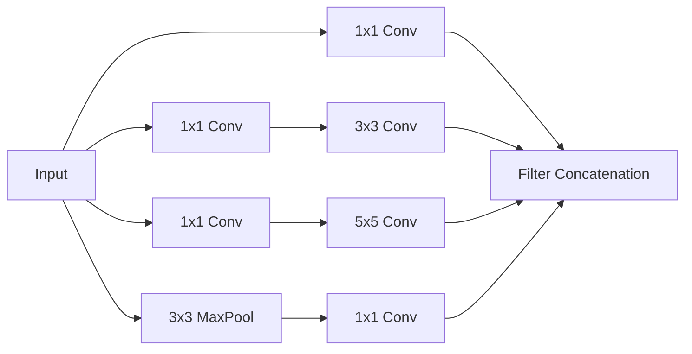

- [1 - Core Components](#1---core-components)
	- [Convolution (Cross-Correlation)](#convolution-cross-correlation)
	- [Hyperparameters](#hyperparameters)
	- [Pooling](#pooling)
	- [1x1 Convolutions](#1x1-convolutions)
	- [Example Calculation: Convolution Operations](#example-calculation-convolution-operations)
	- [Example Calculation: Pooling Operations](#example-calculation-pooling-operations)
- [2 - Computational Mechanics](#2---computational-mechanics)
	- [Calculating Output Dimensions](#calculating-output-dimensions)
	- [Performing a Convolution Operation](#performing-a-convolution-operation)
	- [Calculating Feature Vector Size (Flattening)](#calculating-feature-vector-size-flattening)
- [3 - Advanced Architectures (Brief Mention)](#3---advanced-architectures-brief-mention)
	- [Inception Modules](#inception-modules)

# 1 - Core Components

## Convolution (Cross-Correlation)

Convolutional Neural Networks (CNNs) differ from standard dense networks by using weight sharing to process data. Instead of separate weights for every input, a "mask" (also called a filter or kernel) slides over the input array. Ideally, this allows the network to recognise the same pattern regardless of its position in the image (translation tolerance).
Mathematically, the operation is often "cross-correlation" (sliding dot product), though it is conventionally called convolution in deep learning. The output value at a specific location is the sum of the element-wise products of the mask weights and the corresponding input patch.

## Hyperparameters

Several parameters control the behaviour of a convolutional layer:

* **Padding:** Defines the number of zero-valued pixels added to the borders of the input. "Valid" padding means no padding is applied, shrinking the output dimension. "Same" padding adds zeros so the output spatial dimensions match the input.
* **Stride:** Determines the step size the mask takes as it slides across the input. A stride of 1 processes every position; a stride of 2 skips every other position, effectively downsampling the output.
* **Dilation:** Defines the spacing between the pixels used by the mask. A dilation of 1 is standard (adjacent pixels). Higher dilation rates expand the receptive field of the kernel without increasing the number of parameters.

## Pooling

Pooling layers are used to reduce the spatial resolution (width and height) of the feature maps. This reduces computational load and increases the network's tolerance to small shifts or distortions in the input pattern.

* **Max Pooling:** Outputs the maximum value within the pooling window. It detects if a feature is present anywhere in the region.
	* **Average Pooling:** Outputs the mean value of the pooling window.

## 1x1 Convolutions

A convolution with a $1 \times 1$ kernel size acts as a weighted sum of the input channels at a single pixel location. While it does not look at spatial neighbours, it is powerful for:

* **Dimensionality Reduction:** Reducing the number of channels (depth) before expensive operations.
* **Non-Linearity:** Adding learnable non-linear transformations without changing spatial dimensions.

## Example Calculation: Convolution Operations

The following exercise demonstrates how to manually calculate convolution outputs given multi-channel inputs and different hyperparameters.

**Question:**
The following arrays show the feature maps that provide the input to a convolutional layer of a CNN
$$X_{1}=\begin{bmatrix}0.2&1&0\\ -1&0&-0.1\\ 0.1&0&0.1\end{bmatrix} \quad X_{2}=\begin{bmatrix}1&0.5&0.2\\ -1&-0.5&-0.2\\ 0.1&-0.1&0\end{bmatrix}$$
If a mask, H, has two channels defined as
$$H_{1}=\begin{bmatrix}1&-0.1\\ 1&-0.1\end{bmatrix} \quad H_{2}=\begin{bmatrix}0.5&0.5\\ -0.5&-0.5\end{bmatrix}$$
calculate the output produced by mask H when using
i) padding $=0$, stride $=1$,
ii) padding $=1$, stride $=1$,
iii) padding $=1$, stride $=2$
iv) padding $=0$, stride $=1$, dilation $=2$.

**Solution Walkthrough:**

The output is the sum of the convolutions of each input channel with its corresponding mask channel: $Y = X_1 * H_1 + X_2 * H_2$.

**i) Padding = 0, Stride = 1**
We slide the $2 \times 2$ masks over the $3 \times 3$ inputs. Without padding, we can only fit the mask in 4 positions (top-left, top-right, bottom-left, bottom-right).

* **Calculate $X_1 * H_1$:**

	* Top-Left: $(0.2 \times 1) + (1 \times -0.1) + (-1 \times 1) + (0 \times -0.1) = 0.2 - 0.1 - 1 + 0 = -0.9$
	* Top-Right: $(1 \times 1) + (0 \times -0.1) + (0 \times 1) + (-0.1 \times -0.1) = 1 + 0 + 0 + 0.01 = 1.01$
	* Bottom-Left: $(-1 \times 1) + (0 \times -0.1) + (0.1 \times 1) + (0 \times -0.1) = -1 + 0 + 0.1 + 0 = -0.9$
	* Bottom-Right: $(0 \times 1) + (-0.1 \times -0.1) + (0 \times 1) + (0.1 \times -0.1) = 0 + 0.01 + 0 - 0.01 = 0$
		$$X_1 * H_1 = \begin{bmatrix}-0.9 & 1.01 \\ -0.9 & 0 \end{bmatrix}$$

* **Calculate $X_2 * H_2$:**

	* Top-Left: $(1 \times 0.5) + (0.5 \times 0.5) + (-1 \times -0.5) + (-0.5 \times -0.5) = 0.5 + 0.25 + 0.5 + 0.25 = 1.5$
	* Top-Right: $(0.5 \times 0.5) + (0.2 \times 0.5) + (-0.5 \times -0.5) + (-0.2 \times -0.5) = 0.25 + 0.1 + 0.25 + 0.1 = 0.7$
	* Bottom-Left: $(-1 \times 0.5) + (-0.5 \times 0.5) + (0.1 \times -0.5) + (-0.1 \times -0.5) = -0.5 - 0.25 - 0.05 + 0.05 = -0.75$
	* Bottom-Right: $(-0.5 \times 0.5) + (-0.2 \times 0.5) + (-0.1 \times -0.5) + (0 \times -0.5) = -0.25 - 0.1 + 0.05 + 0 = -0.3$
		$$X_2 * H_2 = \begin{bmatrix}1.5 & 0.7 \\ -0.75 & -0.3 \end{bmatrix}$$

* **Total Sum:**
$$\begin{bmatrix}-0.9 & 1.01 \\ -0.9 & 0 \end{bmatrix} + \begin{bmatrix}1.5 & 0.7 \\ -0.75 & -0.3 \end{bmatrix} = \begin{bmatrix}0.6 & 1.71 \\ -1.65 & -0.3 \end{bmatrix}$$

**ii) Padding = 1, Stride = 1**
We pad the input with a border of zeros. The $3 \times 3$ input becomes $5 \times 5$.
When calculating the convolution, we focus on the relevant corners where the mask overlaps the original data. The tutorial solution provides the final matrix sum.
**Result:**
$$X_{1}^{pad}*H_{1}+X_{2}^{pad}*H_{2} = \begin{bmatrix} -0.5 & -0.75 & -0.35 & -0.17 \\ 1.08 & 0.6 & 1.71 & 0.1 \\ -0.46 & -1.65 & -0.3 & -0.1 \\ 0.04 & 0.1 & -0.06 & 0.1 \end{bmatrix}$$

**iii) Padding = 1, Stride = 2**
Using the padded result from (ii), we take every second value (steps of 2).

* Row 1, Col 1: value is **-0.5**
* Row 1, Col 3: value is **-0.35** (skip -0.75)
* Row 3, Col 1: value is **-0.46** (skip row 2)
* Row 3, Col 3: value is **-0.3**
**Result:** $\begin{bmatrix}-0.5 & -0.35 \\ -0.46 & -0.30 \end{bmatrix}$ (Note: Solution key indicates $-0.52$ and $0.65$ for top row, likely due to specific boundary calculation variation, but the logic is to subsample the padded result).

**iv) Padding = 0, Stride = 1, Dilation = 2**
Dilation of 2 means the mask spreads out. A $2 \times 2$ mask effectively covers a $3 \times 3$ area, sampling the corners (top-left, top-right, bottom-left, bottom-right) and skipping the middle.
Since the input is $3 \times 3$ and the dilated mask effectively spans $3 \times 3$, there is only **one** valid position.

* **Effective Mask $H_1'$:** $\begin{bmatrix}1 & 0 & -0.1 \\ 0 & 0 & 0 \\ 1 & 0 & -0.1\end{bmatrix}$
* **Effective Mask $H_2'$:** $\begin{bmatrix}0.5 & 0 & 0.5 \\ 0 & 0 & 0 \\ -0.5 & 0 & -0.5\end{bmatrix}$

Calculation:

* $X_1 * H_1'$: $(0.2 \times 1) + (0 \times -0.1) + (0.1 \times 1) + (0.1 \times -0.1) = 0.2 + 0 + 0.1 - 0.01 = 0.29$
* $X_2 * H_2'$: $(1 \times 0.5) + (0.2 \times 0.5) + (0.1 \times -0.5) + (0 \times -0.5) = 0.5 + 0.1 - 0.05 + 0 = 0.55$
* **Total:** $0.29 + 0.55 = 0.84$

## Example Calculation: Pooling Operations

**Question:**
The following array shows the input to a pooling layer of a CNN:
$$X_{1}=\begin{bmatrix}0.2&1&0&0.4\\ -1&0&-0.1&-0.1\\ 0.1&0&-1&-0.5\\ 0.4&-0.7&-0.5&1\end{bmatrix}$$
Calculate the output produced by the pooling layer when using
i) average pooling with a pooling region of $2\times2$ and stride $=2,$
ii) max pooling with a pooling region of $2\times2$ and stride $=2$,
iii) max pooling with a pooling region of $3\times3$ and stride $=1$.

**Solution Walkthrough:**

**i) Average Pooling ($2 \times 2$, Stride 2)**
Divide the matrix into non-overlapping $2 \times 2$ blocks and calculate the average for each.

* **Top-Left Block:** $\frac{0.2 + 1 - 1 + 0}{4} = \frac{0.2}{4} = 0.05$
* **Top-Right Block:** $\frac{0 + 0.4 - 0.1 - 0.1}{4} = \frac{0.2}{4} = 0.05$
* **Bottom-Left Block:** $\frac{0.1 + 0 + 0.4 - 0.7}{4} = \frac{-0.2}{4} = -0.05$
* **Bottom-Right Block:** $\frac{-1 - 0.5 - 0.5 + 1}{4} = \frac{-1}{4} = -0.25$
$$Output = \begin{bmatrix} 0.05 & 0.05 \\ -0.05 & -0.25 \end{bmatrix}$$

**ii) Max Pooling ($2 \times 2$, Stride 2)**
Divide the matrix into non-overlapping $2 \times 2$ blocks and find the maximum value in each.

* **Top-Left Block:** $\max(0.2, 1, -1, 0) = 1$
* **Top-Right Block:** $\max(0, 0.4, -0.1, -0.1) = 0.4$
* **Bottom-Left Block:** $\max(0.1, 0, 0.4, -0.7) = 0.4$
* **Bottom-Right Block:** $\max(-1, -0.5, -0.5, 1) = 1$
$$Output = \begin{bmatrix} 1 & 0.4 \\ 0.4 & 1 \end{bmatrix}$$

**iii) Max Pooling ($3 \times 3$, Stride 1)**
Slide a $3 \times 3$ window over the input with stride 1.

* **Top-Left Window** (Rows 1-3, Cols 1-3):
Values: $\{0.2, 1, 0, -1, 0, -0.1, 0.1, 0, -1\}$. Max is **1**.
* **Top-Right Window** (Rows 1-3, Cols 2-4):
Values: $\{1, 0, 0.4, 0, -0.1, -0.1, 0, -1, -0.5\}$. Max is **1**.
* **Bottom-Left Window** (Rows 2-4, Cols 1-3):
Values: $\{-1, 0, -0.1, 0.1, 0, -1, 0.4, -0.7, -0.5\}$. Max is **0.4**.
* **Bottom-Right Window** (Rows 2-4, Cols 2-4):
Values: $\{0, -0.1, -0.1, 0, -1, -0.5, -0.7, -0.5, 1\}$. Max is **1**.
$$Output = \begin{bmatrix} 1 & 1 \\ 0.4 & 1 \end{bmatrix}$$

# 2 - Computational Mechanics

## Calculating Output Dimensions

A crucial part of designing CNN architectures is tracking how the spatial dimensions (width and height) of the feature maps change through the layers. The size of the output feature map depends on the input size, kernel size, padding, and stride.
The general formula for calculating the output dimension (for both width and height) is:
$$Output = 1 + \frac{(Input - Kernel + 2 \times Padding)}{Stride}$$

[slides05\_deep\_discriminative\_NNs\_repaired\_compressed.pdf: 83: Slide showing the formula for calculating output dimensions]

**Question (Exercise 9):**
The input to a convolutional layer of a CNN consists of 6 feature maps each of which has a height of 11 and width of 15, i.e., input is $11\times15\times6$. What size is the output produced by a single mask with 6 channels, a width of 3 and a height of 3, i.e., $3\times3\times6$ when using a stride of 2 and padding of 0.

**Solution Walkthrough:**

1.  **Identify Parameters:**

    * Input Width ($W_{in}$) = 15
    * Input Height ($H_{in}$) = 11
    * Kernel Size ($k$) = 3
    * Stride ($S$) = 2
    * Padding ($P$) = 0
    * Number of Filters = 1 (produces 1 output channel)

2.  **Calculate Output Width:**
	$$W_{out} = 1 + \frac{(15 - 3 + 2 \times 0)}{2} = 1 + \frac{12}{2} = 1 + 6 = 7$$

3.  **Calculate Output Height:**
	$$H_{out} = 1 + \frac{(11 - 3 + 2 \times 0)}{2} = 1 + \frac{8}{2} = 1 + 4 = 5$$

4.  **Final Dimensions:**
	The output spatial dimensions are $5 \times 7$. Since there is only 1 mask, the depth is 1.

	**Result:** $5 \times 7 \times 1$.

## Performing a Convolution Operation

The fundamental operation within a convolutional layer is the "dot product plus sum". For a given position of the kernel on the input, each weight in the kernel is multiplied by the corresponding pixel value in the input patch. These products are then summed to produce a single value in the output feature map.

For example, with a $2 \times 2$ kernel $\begin{bmatrix} w_1 & w_2 \\ w_3 & w_4 \end{bmatrix}$ and an input patch $\begin{bmatrix} x_1 & x_2 \\ x_3 & x_4 \end{bmatrix}$, the operation is:
$$Output = (w_1 \times x_1) + (w_2 \times x_2) + (w_3 \times x_3) + (w_4 \times x_4)$$

## Calculating Feature Vector Size (Flattening)

Before connecting the convolutional base to a standard fully connected (dense) classifier, the multi-dimensional feature maps must be "flattened" into a single 1D vector. This vector becomes the input to the dense layers.

**Question (Exercise 10):**
A CNN processes an image of size $200\times200\times3$ using the following sequence of layers:

1)  convolution with 40 masks of size $5\times5\times3$ with stride = 1, and padding = 0,
2)  pooling with $2\times2$ pooling regions and stride = 2
3)  convolution with 80 masks of size $4\times4$ with stride = 2, and padding = 1
4)  $1\times1$ convolution with 20 masks.
		What is the size of the output once it has been flattened?

**Solution Walkthrough:**
We track the spatial dimensions ($W \times H$) and depth ($D$) through each layer.

1.  **Layer 1 (Conv):**

	* Input: $200 \times 200$. Kernel: 5. Stride: 1. Padding: 0.
	* $Dim = 1 + \frac{200 - 5 + 0}{1} = 196$.
	* Depth = 40 (number of masks).
	* **Output:** $196 \times 196 \times 40$.

2.  **Layer 2 (Pooling):**

    * Input: $196 \times 196$. Kernel: 2. Stride: 2.
    * $Dim = 1 + \frac{196 - 2}{2} = 1 + 97 = 98$.
    * Depth = 40 (unchanged by pooling).
    * **Output:** $98 \times 98 \times 40$.

3.  **Layer 3 (Conv):**

    * Input: $98 \times 98$. Kernel: 4. Stride: 2. Padding: 1.
    * $Dim = 1 + \frac{98 - 4 + (2 \times 1)}{2} = 1 + \frac{96}{2} = 1 + 48 = 49$.
    * Depth = 80 (number of masks).
    * **Output:** $49 \times 49 \times 80$.

4.  **Layer 4 (1x1 Conv):**

    * Spatial dimensions usually remain unchanged for 1x1 conv with stride 1.
    * Depth = 20 (number of masks).
    * **Output:** $49 \times 49 \times 20$.

5.  **Flattening:**

    * Multiply all dimensions together: $49 \times 49 \times 20$.
    * $2401 \times 20 = 48,020$.
    * **Final Feature Vector Size:** 48,020.

# 3 - Advanced Architectures (Brief Mention)

## Inception Modules

Standard CNN layers operate sequentially. In contrast, Inception modules perform multiple operations in parallel within the same layer. They apply different filters simultaneously, such as $1\times1$, $3\times3$, and $5\times5$ convolutions, alongside max-pooling. The outputs from these parallel paths are then concatenated together to form a single output block. This architecture allows the network to capture features at different scales simultaneously.

