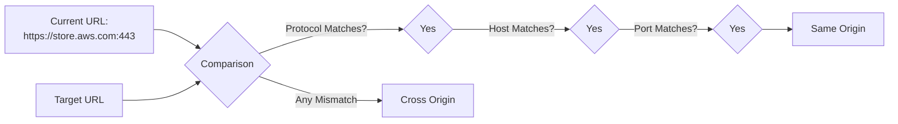
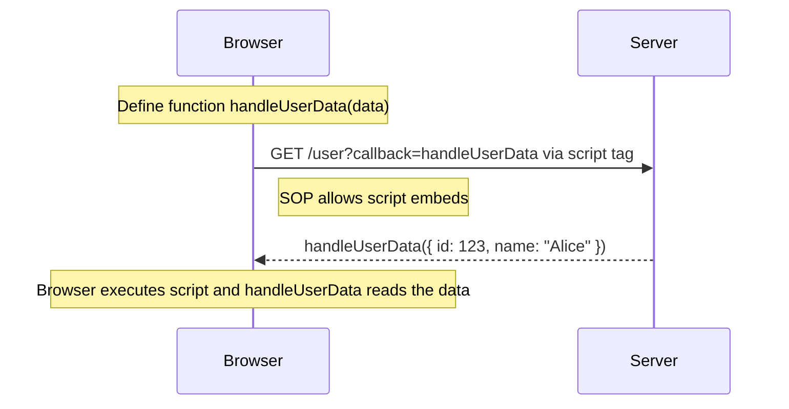
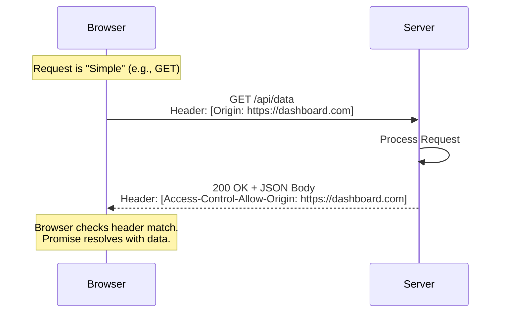
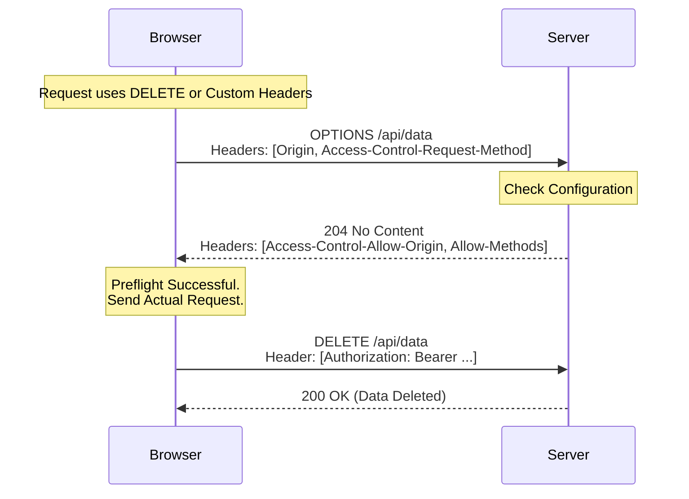
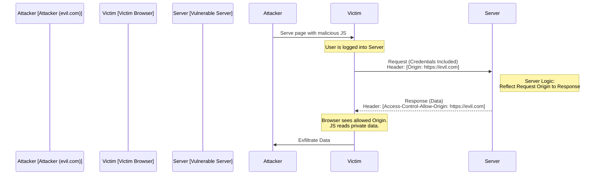
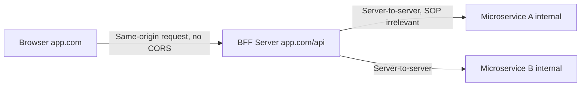

- [1 - Introduction: The Evolution of Web Security and Isolation](#1---introduction-the-evolution-of-web-security-and-isolation)
- [2 - The Foundation: The Same-Origin Policy (SOP)](#2---the-foundation-the-same-origin-policy-sop)
	- [2.1 - Defining the Origin](#21---defining-the-origin)
	- [2.2 - The Threat Model: Why SOP Exists](#22---the-threat-model-why-sop-exists)
	- [2.3 - The Nuance of "Embeds" vs. "Reads"](#23---the-nuance-of-embeds-vs-reads)
- [3 - The Pre-CORS Era: Historical Workarounds](#3---the-pre-cors-era-historical-workarounds)
	- [3.1 - JSONP (JSON with Padding)](#31---jsonp-json-with-padding)
	- [3.2 - Other Legacy Hacks](#32---other-legacy-hacks)
- [4 - The CORS Protocol: A Technical Deep Dive](#4---the-cors-protocol-a-technical-deep-dive)
	- [4.1 - The Mechanism of Negotiation](#41---the-mechanism-of-negotiation)
	- [4.2 - The Fetch Standard](#42---the-fetch-standard)
- [5 - The Anatomy of a Request: Simple vs. Preflight](#5---the-anatomy-of-a-request-simple-vs-preflight)
	- [5.1 - Simple Requests](#51---simple-requests)
	- [5.2 - Preflighted Requests](#52---preflighted-requests)
- [6 - The Header Ecosystem](#6---the-header-ecosystem)
	- [6.1 - Request Headers (Client to Server)](#61---request-headers-client-to-server)
	- [6.2 - Response Headers (Server to Client)](#62---response-headers-server-to-client)
- [7 - Authentication and Credential Management](#7---authentication-and-credential-management)
	- [7.1 - Enabling Credentials](#71---enabling-credentials)
	- [7.2 - The Wildcard Restriction](#72---the-wildcard-restriction)
	- [7.3 - Interaction with SameSite Cookies](#73---interaction-with-samesite-cookies)
- [8 - Advanced Security Analysis and Vulnerabilities](#8---advanced-security-analysis-and-vulnerabilities)
	- [8.1 - The "Reflected Origin" Exploit](#81---the-reflected-origin-exploit)
	- [8.2 - The "Null" Origin Risk](#82---the-null-origin-risk)
	- [8.3 - Cache Poisoning](#83---cache-poisoning)
- [9 - Private Network Access (PNA)](#9---private-network-access-pna)
- [10 - Architectural Patterns](#10---architectural-patterns)
	- [10.1 - Single Page Applications (SPAs)](#101---single-page-applications-spas)
	- [10.2 - The Backend for Frontend (BFF) Pattern](#102---the-backend-for-frontend-bff-pattern)
	- [10.3 - API Gateways](#103---api-gateways)
- [11 - Server-Side Implementation Strategies](#11---server-side-implementation-strategies)
	- [11.1 - Spring Boot (Java)](#111---spring-boot-java)
	- [11.2 - Express.js (Node.js)](#112---expressjs-nodejs)
- [12 - Comparison: CORS vs. Alternatives](#12---comparison-cors-vs-alternatives)
- [13 - Conclusion](#13---conclusion)
- [References](#references)


# 1 - Introduction: The Evolution of Web Security and Isolation

The architecture of the World Wide Web has undergone a fundamental transformation since its inception. In the early days of the Internet, the web was primarily a collection of static documents. A user would navigate to a website, and the browser would render a self-contained page consisting of HyperText Markup Language (HTML), perhaps accompanied by a few images. In this static paradigm, the security model was relatively straightforward: the browser acted as a simple document viewer, and there was little need for complex interaction between different domains.

However, the emergence of "Web 2.0" and the subsequent rise of rich internet applications shifted this paradigm entirely. The web evolved from a library of linked documents into a distributed application platform. Modern web applications (ranging from social media feeds and banking dashboards to collaborative document editors) rely heavily on the ability to fetch data dynamically from various sources. A single web page today might load analytics from one provider, authentication services from another, and core application data from a third-party Application Programming Interface (API).

This interconnectedness introduced a profound security challenge. If a script running on one website could freely access data on another, the web’s security model would collapse. A malicious blog could, in the background, read a user’s emails from a webmail provider or initiate bank transfers without the user’s consent. To prevent this, browser vendors implemented the **Same-Origin Policy (SOP)**, a strict security measure that isolates websites from one another.

While the SOP provided necessary security, it created a significant barrier to legitimate interoperability. Developers needed a standard, secure mechanism to relax these restrictions selectively. This necessity gave birth to **Cross-Origin Resource Sharing (CORS)**. CORS is not merely a feature; it is the fundamental protocol that governs how the modern web connects. It defines a rigorous negotiation between the browser and the server, allowing them to agree on whether a specific cross-origin interaction is safe.

CORS often manifests as a frustrating error message in the developer console: *"Access to fetch at '...' from origin '...' has been blocked by CORS policy."* However, viewing CORS solely as an error to be bypassed is a dangerous misconception. It is a critical security control. Understanding CORS requires study into the mechanics of the Hypertext Transfer Protocol (HTTP), the behaviour of User Agents (browsers), and the delicate balance between usability and security.

This report provides an exhaustive analysis of CORS. We will explore its theoretical foundations in the SOP, the historical "hacks" like JSONP that preceded it, the precise mechanics of the protocol (including the preflight mechanism), and the security implications of misconfiguration. Furthermore, we will examine how CORS integrates with modern architectural patterns such as Single Page Applications (SPAs) and how it is implemented across major backend frameworks.


# 2 - The Foundation: The Same-Origin Policy (SOP)

To fully appreciate the mechanism of CORS, one must first understand the restriction it is designed to relax: the Same-Origin Policy. The SOP is widely regarded as the cornerstone of web application security. It acts as a digital perimeter fence, dictating how a document or script loaded from one "origin" can interact with a resource from another.

## 2.1 - Defining the Origin

In the context of web security, the concept of an "origin" is precise and non-negotiable. An origin is defined by a tuple of three distinct elements: the **protocol** (scheme), the **host** (domain), and the **port**. For two Uniform Resource Locators (URLs) to be considered "same-origin," all three of these elements must match exactly.



Consider a user visiting a secure dashboard at `https://store.aws.com/dir/page.html`. The origin of this page is defined as `https://store.aws.com:443` (assuming the default port for HTTPS). The browser uses this definition to decide whether this page can access other resources.

| Target URL                             | Outcome          | Reason for Classification                                                                                                                                   |
| :------------------------------------- | :--------------- | :---------------------------------------------------------------------------------------------------------------------------------------------------------- |
| `https://store.aws.com/dir2/new.html`  | **Same Origin**  | Protocol (https), Host (store.aws.com), and Port (443) are identical. Only the path differs, which is irrelevant to origin.                                 |
| `http://store.aws.com/dir/page.html`   | **Cross-Origin** | Different Protocol. The shift from https to http implies a different level of trust and security.                                                           |
| `https://store.aws.com:8080/page.html` | **Cross-Origin** | Different Port. Port 8080 is distinct from the default 443, implying a different service or server process.                                                 |
| `https://news.aws.com/dir/page.html`   | **Cross-Origin** | Different Host. Subdomains (news vs store) are treated as distinct origins to ensure isolation between different applications under the same parent domain. |

This strict comparison ensures that completely unrelated applications (or even different applications within the same organisation) cannot interfere with each other's execution environments.

## 2.2 - The Threat Model: Why SOP Exists

The primary objective of the SOP is to maintain the confidentiality and integrity of data. The web is built on the concept of "ambient authority" in the form of cookies. When a user logs into a website (e.g., bank.com), the browser stores a session cookie. For every subsequent request to bank.com, the browser automatically attaches this cookie, effectively saying, "This request is from the logged-in user".

Without the SOP, a malicious scenario could unfold as follows:

1.  A user logs into `bank.com` and leaves the tab open.
2.  The user visits `malicious-site.com` in a new tab.
3.  The malicious site contains a JavaScript script that executes `fetch('https://bank.com/api/transactions')`.
4.  The browser, following standard HTTP behaviour, sends this request to `bank.com` and includes the user's session cookie.
5.  `bank.com` verifies the cookie, assumes the request is legitimate, and returns the list of transactions.
6.  Without SOP, the malicious script could read this response and send the user's financial data to the attacker's server.

The SOP mitigates this specific risk by preventing the malicious script from reading the response. The request might still reach the server (a nuance we will discuss later), but the browser blocks the script from accessing the data returned. This isolation is critical for preventing data leakage and serves as a fundamental layer of defence against Cross-Site Request Forgery (CSRF), although SOP is primarily a read-access control, while CSRF tokens handle write-access control.

## 2.3 - The Nuance of "Embeds" vs. "Reads"

A common source of confusion for junior engineers is the apparent inconsistency in how the SOP applies to different types of resources. The policy is not a blanket ban on all cross-origin interaction; rather, it is highly specific to scripts and data access.

The web has always been inherently cross-origin regarding media. A webpage on `example.com` has always been allowed to embed an image from `google.com` using the `` tag. Similarly, it can embed stylesheets via `<link>` and scripts via `<script>`. These are classified as **Cross-Origin Embeds**.

  * **Allowed (Embeds):** ``, `<video>`, `<audio>`, `<link rel="stylesheet">`, `<script src="...">`, `<iframe>`. The browser renders these resources, but it treats them as "opaque." The JavaScript running on the page cannot read the pixel data of the image (unless CORS is enabled) or the source code of the external script.
  * **Allowed (Writes):** Standard HTML forms (`<form action="...">`) can submit data (POST) to any origin. This is a legacy feature of the web. The SOP does not stop the data from being sent; it stops the response from being read.
  * **Disallowed (Reads):** `XMLHttpRequest` and the `Fetch API` are generally blocked from reading data from a cross-origin response unless the server explicitly permits it.

This distinction creates a "write-only" permission model for the legacy web, which CORS seeks to expand into a controlled "read-write" model.


# 3 - The Pre-CORS Era: Historical Workarounds

Before CORS was standardised and widely adopted, developers faced significant challenges in building interactive applications that spanned multiple domains. To bypass the rigid constraints of the SOP, the development community invented several clever, albeit insecure, workarounds. Understanding these historical techniques provides vital context for the design decisions behind CORS.

## 3.1 - JSONP (JSON with Padding)

The most dominant technique in the "Web 2.0" era was JSONP (JSON with Padding). Proposed around 2005, JSONP exploited the loophole in the SOP that allowed `<script>` tags to be loaded from any origin. Since a browser allows a page to execute a script from `api.example.com`, developers realised they could transmit data by treating it as executable code.



In a standard API interaction, a server returns raw data, such as a JSON object:

```json
{
  "user_id": 123,
  "name": "Alice"
}
```

If a script tried to fetch this via AJAX across origins, the SOP would block it.

JSONP worked by asking the server to "pad" this JSON data within a function call. The client would define a function in the global scope and pass its name to the server via a query parameter (conventionally `callback`):

```html
<script>
  function handleUserData(data) {
    console.log("User Name: " + data.name);
  }
</script>
<script src="http://api.example.com/user?callback=handleUserData"></script>
```

The server would dynamically generate a response that was valid JavaScript:

```javascript
handleUserData({
  "user_id": 123,
  "name": "Alice"
});
```

When the browser loaded this "script," it would immediately execute the function `handleUserData`, passing the JSON object as an argument. This effectively allowed the client to "read" the cross-origin data.

**The Security Flaws of JSONP:**
While effective, JSONP was fraught with security risks.

  * **Remote Code Execution:** By design, JSONP allows an external server to inject arbitrary JavaScript into the client's page. If the external API were compromised, the attacker could inject malicious code (e.g., a keylogger) instead of the expected data function.
  * **Lack of Error Handling:** Using `<script>` tags meant that handling errors (like a 404 or 500 server error) was extremely difficult compared to the rich status codes available in `XMLHttpRequest`.
  * **Verb Limitation:** JSONP is inherently limited to HTTP GET requests. It cannot support POST, PUT, or DELETE, making it unsuitable for RESTful APIs.

These limitations made it clear that a native, secure browser mechanism was required—leading to the development of CORS.

## 3.2 - Other Legacy Hacks

  * **Document.domain:** This property allowed two pages from different subdomains (e.g., `a.example.com` and `b.example.com`) to communicate if they both set `document.domain` to their common parent (`example.com`). This was a coarse-grained relaxation of SOP and has been deprecated in modern specifications due to its security implications.
  * **Flash's crossdomain.xml:** Adobe Flash and Microsoft Silverlight implemented their own cross-origin policy files (`crossdomain.xml` and `clientaccesspolicy.xml`). These files, placed at the root of a server, defined which domains could access resources via the plugin. While similar in spirit to CORS, they relied on proprietary plugins that have since been phased out of the web ecosystem.


# 4 - The CORS Protocol: A Technical Deep Dive

Cross-Origin Resource Sharing (CORS) is the W3C (now WHATWG) standard that superseded these hacks. It is a protocol that enables a browser and server to "negotiate" access rights. Instead of the all-or-nothing approach of the SOP, CORS allows a server to explicitly list the origins that are permitted to access its resources.

## 4.1 - The Mechanism of Negotiation

CORS operates entirely through HTTP Headers. It does not change the content of the request body or the response data; rather, it adds metadata to the HTTP exchange that the browser uses to enforce security policies.

It is crucial to emphasize that the User Agent (Browser) is the enforcer of CORS. The server acts as the policy authority, but the browser acts as the police officer.

1.  The browser identifies a request as cross-origin.
2.  The browser adds specific headers (e.g., `Origin`) to the request.
3.  The server inspects these headers and adds its own policy headers (e.g., `Access-Control-Allow-Origin`) to the response.
4.  The browser receives the response and checks if the server's headers permit the request. If not, the browser discards the data and raises an error.

This means that tools like `curl` or Postman, which are not browsers, generally ignore CORS. They will receive the data regardless of the headers because they do not implement the SOP security model. Some engineers often mistakenly believe CORS protects the server from direct API access; it does not. It only prevents browser-based scripts from accessing the API.

## 4.2 - The Fetch Standard

The specification for CORS is now maintained as part of the WHATWG Fetch Living Standard. This unifies the architecture for fetching resources across various APIs, including `fetch()`, `XMLHttpRequest`, ``, and scripts. It ensures consistency in how redirects and CORS protocols are handled across the web platform.


# 5 - The Anatomy of a Request: Simple vs. Preflight

The CORS specification distinguishes between two categories of requests based on their potential to disturb legacy servers: **Simple Requests** and **Preflighted Requests**. This distinction is a direct result of the need for backward compatibility with the pre-CORS web.

## 5.1 - Simple Requests

A "Simple Request" is one that could have been generated by a standard HTML form in the days before CORS. Since servers were already accustomed to receiving GET and POST requests from forms on other domains (remember, SOP allowed writes), browsers essentially say, "It is safe to send this request immediately, but we will hide the response unless the server opts in."

For a request to be classified as Simple, it must meet all of the following strict criteria:

  * **HTTP Method:** Must be one of GET, HEAD, or POST.
  * **Headers:** Can only contain headers from the CORS-safelisted request header set:
      * Accept
      * Accept-Language
      * Content-Language
      * Content-Type (with restrictions)
      * Range (under specific conditions).
  * **Content-Type:** If the Content-Type header is set, its value is restricted to three legacy MIME types:
      * `application/x-www-form-urlencoded`
      * `multipart/form-data`
      * `text/plain`

**The "Simple" Flow:**



1.  **Browser:** Constructs the request and adds the `Origin` header (e.g., `Origin: https://dashboard.com`).
2.  **Network:** The request is sent to the server.
3.  **Server:** Processes the request (e.g., updates a database record) and sends a response. The response includes `Access-Control-Allow-Origin: https://dashboard.com`.
4.  **Browser:** Inspects the response. If the `Access-Control-Allow-Origin` matches the request's origin (or is `*`), the JavaScript promise resolves with the data. If the header is missing or mismatching, the browser triggers a CORS error and hides the response body.

**Key Insight:** Even if a Simple Request fails the CORS check, the server has already processed it. If the request was a POST that initiates a bank transfer, the transfer might have happened, even though the frontend reports an error. This highlights why CORS is not a replacement for CSRF protection.

## 5.2 - Preflighted Requests

As web applications became more complex, developers needed to use RESTful methods like PUT and DELETE, and send JSON data (`application/json`). Legacy servers often did not expect to receive a DELETE request from a cross-origin source and might not be hardened against it. To protect these servers, CORS introduced the Preflight mechanism.

A request is "Preflighted" if it uses a method other than GET/HEAD/POST, uses custom headers (like `Authorization` or `X-API-Key`), or uses a non-legacy Content-Type like `application/json`.

**The Preflight Flow:**



Before sending the actual request, the browser automatically sends a probe request to determine if the server understands CORS and accepts the proposed action.

1.  **Browser (Preflight):** Sends an `OPTIONS` request to the target URL.
      * `Origin`: The requesting origin.
      * `Access-Control-Request-Method`: The method the browser wants to use (e.g., DELETE).
      * `Access-Control-Request-Headers`: Comma-separated list of custom headers the browser wants to send (e.g., content-type, authorization).
2.  **Server:** Receives the OPTIONS request. It checks its configuration. If the origin and requested methods/headers are permitted, it responds with a 200 or 204 status.
      * `Access-Control-Allow-Origin: https://dashboard.com`
      * `Access-Control-Allow-Methods: GET, POST, DELETE, OPTIONS`
      * `Access-Control-Allow-Headers: Content-Type, Authorization`
      * `Access-Control-Max-Age: 86400` (Tells the browser to cache this answer for 24 hours).
3.  **Browser:** Validates the Preflight response. If successful, it proceeds to send the Actual Request (the DELETE request).
4.  **Server:** Processes the DELETE request and responds.
5.  **Browser:** Checks the Actual Request's response headers (specifically `Access-Control-Allow-Origin`) again before passing data to JavaScript.

**Impact on Performance:**
Preflight requests double the network traffic for API calls (one OPTIONS + one Actual). This adds latency, especially on mobile networks. The `Access-Control-Max-Age` header is critical for performance tuning, as it allows the browser to skip the preflight for subsequent requests to the same endpoint. However, browsers cap this value to prevent stale security policies; Firefox limits it to 24 hours, while Chrome and other Chromium-based browsers cap it at a much shorter 2 hours (formerly 10 minutes).


# 6 - The Header Ecosystem

To implement CORS correctly, one must master the specific headers involved. Each header serves a distinct purpose in the negotiation.

## 6.1 - Request Headers (Client to Server)

These are set automatically by the browser. Developers cannot modify them programmatically, which is a security feature to prevent spoofing.

| Header                           | Purpose                                                                                                  |
| :------------------------------- | :------------------------------------------------------------------------------------------------------- |
| `Origin`                         | Indicates the scheme, domain, and port of the site initiating the request. Present on all CORS requests. |
| `Access-Control-Request-Method`  | Sent only on Preflight (OPTIONS). Tells the server which HTTP method will be used in the actual request. |
| `Access-Control-Request-Headers` | Sent only on Preflight (OPTIONS). Lists the custom headers the client intends to send.                   |

## 6.2 - Response Headers (Server to Client)

These must be configured on the server.

| Header                             | Purpose                                                                                                                                                                                                                                                            |
| :--------------------------------- | :----------------------------------------------------------------------------------------------------------------------------------------------------------------------------------------------------------------------------------------------------------------- |
| `Access-Control-Allow-Origin`      | The most critical header. Specifies allowed origins. Can be a specific URI (`https://example.com`) or a wildcard (`*`). Note: Wildcards cannot be used if credentials are included.                                                                                |
| `Access-Control-Allow-Methods`     | A comma-separated list of allowed HTTP methods (e.g., GET, POST, PUT). Used in response to Preflights.                                                                                                                                                             |
| `Access-Control-Allow-Headers`     | A comma-separated list of allowed request headers. Used in response to Preflights to approve custom headers requested by the client.                                                                                                                               |
| `Access-Control-Allow-Credentials` | A boolean (`true`) indicating whether the browser is allowed to expose the response to frontend JavaScript when the request was made with credentials (cookies/auth headers).                                                                                      |
| `Access-Control-Expose-Headers`    | Whitelists headers that JavaScript can read from the response. By default, JS can only read "simple" response headers (Content-Type, Cache-Control). If the server sends a custom header like `X-Transaction-ID`, it must be listed here for the client to see it. |
| `Access-Control-Max-Age`           | Defines how long (in seconds) the browser can cache the Preflight response, reducing network overhead.                                                                                                                                                             |


# 7 - Authentication and Credential Management

Handling authentication in cross-origin scenarios is one of the most complex and error-prone aspects of CORS. By default, browsers do not send credentials (cookies, HTTP Basic Auth, or TLS client certificates) with cross-origin requests. This is a privacy default to prevent tracking.

## 7.1 - Enabling Credentials

To include credentials in a request, the frontend developer must explicitly opt-in:

  * **Fetch API:** `fetch(url, { credentials: 'include' })`
  * **XMLHttpRequest:** `xhr.withCredentials = true;`

When this flag is set, the browser includes the cookies associated with the target domain. However, simply sending the cookies is not enough. The server must explicitly agree to accept them by sending the header:

`Access-Control-Allow-Credentials: true`

If this header is missing or set to `false` in the response, the browser will reject the request, even if the server processed it successfully and returned a 200 OK status.

## 7.2 - The Wildcard Restriction

There is a fundamental security constraint defined in the CORS specification: The server cannot use the wildcard `*` for `Access-Control-Allow-Origin` if `Access-Control-Allow-Credentials` is set to `true`.

If a server responds with:

```http
Access-Control-Allow-Origin: *
Access-Control-Allow-Credentials: true
```

The browser will treat this as a configuration error and block the request. This design decision forces developers to be explicit. If an API needs to support credentials from multiple origins, the server logic must dynamically inspect the incoming `Origin` header and echo it back in the `Access-Control-Allow-Origin` header (provided it is in a trusted allowlist).

## 7.3 - Interaction with SameSite Cookies

The security landscape is further complicated by the SameSite cookie attribute, which operates alongside CORS. While CORS controls whether the client can read the response, SameSite controls whether the cookie is sent in the first place.

  * **SameSite=Lax (Default):** Cookies are not sent on cross-site sub-requests (like images or frames) or cross-site POSTs, but are sent when a user navigates to the origin (e.g., following a link).
  * **SameSite=Strict:** Cookies are only sent for first-party requests.
  * **SameSite=None:** Cookies are sent in all contexts, including cross-origin AJAX requests.

For a cross-origin API call (e.g., from `app.com` to `api.com`) to succeed with authentication, the session cookie on `api.com` typically needs to be configured with `SameSite=None; Secure`. The `Secure` attribute is mandatory when using `None`, requiring the connection to be HTTPS. This highlights how modern web security is a layered defence; CORS handles the resource access, while SameSite handles the credential transmission.


# 8 - Advanced Security Analysis and Vulnerabilities

While CORS is a mechanism for relaxing security, misconfiguring it is a prevalent source of vulnerabilities. The Open Web Application Security Project (OWASP) identifies Security Misconfiguration as a top risk, and CORS errors are a frequent contributor.

## 8.1 - The "Reflected Origin" Exploit

Because the wildcard `*` cannot be used with credentials, developers often implement a "lazy" solution: they write server-side code that reads the `Origin` header from the request and simply copies it into the `Access-Control-Allow-Origin` response header.



**Vulnerable Logic (Conceptual):**

```java
// DO NOT DO THIS
response.setHeader("Access-Control-Allow-Origin", request.getHeader("Origin"));
response.setHeader("Access-Control-Allow-Credentials", "true");
```

**The Attack:**
An attacker hosting `evil.com` can create a webpage with a script that makes a credentialed request to the victim's API. When the victim (who is logged in) visits `evil.com`, the browser sends the request with `Origin: https://evil.com`. The naive server reflects this back: `Access-Control-Allow-Origin: https://evil.com`. The browser sees a match and allows the attacker's script to read the victim's private data.

**Mitigation:** Servers must strictly validate the incoming Origin against a predefined allowlist of trusted domains (e.g., strict string matching or regex) before echoing it back.

## 8.2 - The "Null" Origin Risk

The origin `null` is a special value used by browsers for privacy-sensitive contexts, such as local files (`file://`) or, critically, sandboxed iframes (`<iframe sandbox>`). Some developers, seeing `null` in their logs during local development, add it to their CORS allowlist.

However, any attacker can use a sandboxed iframe to generate a request with the origin `null`. If a server trusts `null`, it effectively bypasses the origin check for any attacker who wraps their attack code in a sandbox. The value `null` should essentially never be whitelisted in production.

## 8.3 - Cache Poisoning

CORS interacts dangerously with caching layers (CDNs or browser caches). If a server dynamically reflects the Origin header (as in 8.1) but fails to tell the cache that the response varies by origin, a Cache Poisoning attack can occur.

- **Attack:** An attacker sends a request with `Origin: malicious.com`.
- **Cache:** The server (or an intermediate proxy) responds with `Access-Control-Allow-Origin: malicious.com` and caches this response for all users.
- **Victim:** A legitimate user visits the site. Their browser requests the same resource.
- **Poison:** The cache serves the stored response: `Access-Control-Allow-Origin: malicious.com`.
- **Denial of Service:** The legitimate user's browser sees a mismatch (expecting `legit-site.com` but seeing `malicious.com`) and blocks the data. The application breaks for all real users.

**Mitigation:** Servers must always include the `Vary: Origin` HTTP header in their responses. This instructs caches (CDNs and browsers) to store separate copies of the response for each distinct Origin value.


# 9 - Private Network Access (PNA)

A recent and evolving extension to the CORS model is Private Network Access (PNA), formerly known as CORS-RFC1918. This addresses a specific class of attacks where a malicious website on the public internet attempts to attack devices on the user's local network (e.g., routers, printers, IoT devices).

Traditionally, a script on `internet-attacker.com` could send a POST request to `192.168.0.1/admin/change-dns`. If the router had weak CSRF protection (or relied on simple authentication), the attack would succeed.

**The PNA Mechanism:**
Browsers like Chrome are introducing a mandatory Preflight for requests from "public" IP addresses to "private" IP addresses.

1.  **Preflight:** The browser sends an OPTIONS request with a new header: `Access-Control-Request-Private-Network: true`.
2.  **Device Response:** The local device must explicitly opt-in to receiving commands from the public web by responding with: `Access-Control-Allow-Private-Network: true`.

If this handshake fails, the browser blocks the connection. This is a significant shift that impacts developers of local server software and IoT devices, requiring them to update their CORS logic to handle these new headers. It represents the future of CORS: not just protecting servers from browsers, but protecting local networks from the web.


# 10 - Architectural Patterns

As modern web development moves away from monolithic architectures, CORS becomes a central infrastructure concern.

## 10.1 - Single Page Applications (SPAs)

In a traditional setup, the frontend (HTML/JS) and backend (API) were served from the same domain. CORS was irrelevant. In the SPA era, the frontend might be hosted on a CDN (e.g., `app.example.com` or an S3 bucket) while the API resides on a different infrastructure (e.g., `api.example.com`). This makes every API call a cross-origin request.

## 10.2 - The Backend for Frontend (BFF) Pattern

To simplify the complexity of CORS and token management, many teams adopt the Backend for Frontend (BFF) pattern. In this model, a lightweight server (Node.js, Go) is deployed on the same origin as the frontend code.



1.  **Browser:** `app.com` -\> Requests -\> `app.com/api` (BFF). This is Same-Origin. No CORS required.
2.  **BFF:** `app.com/api` -\> Proxies -\> `microservice-a.internal`.

Since the SOP applies only to the browser, server-to-server communication between the BFF and the microservices does not require CORS. The BFF handles the authentication tokens and aggregates data, effectively hiding the CORS complexity from the browser.

## 10.3 - API Gateways

In microservice architectures, an API Gateway (like AWS API Gateway, Kong, or NGINX) is often the centralised point for CORS handling. Instead of configuring CORS in every single microservice (Java, Python, Node), the Gateway intercepts the Preflight OPTIONS requests and responds with the standard policy. This centralises security controls and reduces the risk of one service accidentally exposing data via a misconfigured wildcard.


# 11 - Server-Side Implementation Strategies

For Junior Engineers, the most practical challenge is implementing CORS correctly in their backend code. Below are strategies for three major frameworks.

## 11.1 - Spring Boot (Java)

Spring Boot offers powerful, annotation-based support for CORS.

**Method Level:**
For quick prototypes, developers can annotate specific controllers:

```java
@CrossOrigin(origins = "http://localhost:3000")
@GetMapping("/greeting")
public Greeting greeting() {
    ...
}
```

This is granular but can lead to scattered policies.

**Global Configuration (Recommended):**
It is best practice to define a global policy using a `WebMvcConfigurer` bean. This ensures consistency across the application.

```java
@Bean
public WebMvcConfigurer corsConfigurer() {
    return new WebMvcConfigurer() {
        @Override
        public void addCorsMappings(CorsRegistry registry) {
            registry.addMapping("/api/**")
                   .allowedOrigins("https://production-app.com", "http://localhost:3000")
                   .allowedMethods("GET", "POST", "PUT", "DELETE", "OPTIONS")
                   .allowCredentials(true)
                   .maxAge(3600);
        }
    };
}
```

This configuration handles Preflight responses automatically and applies the rules to all endpoints under `/api/**`.

## 11.2 - Express.js (Node.js)

The standard for Node.js is the `cors` middleware package. It is highly flexible and widely used.

**Installation:** `npm install cors`

**Basic Usage:**

```javascript
const cors = require('cors');
const app = express();
app.use(cors()); // Enables wildcard CORS for all routes (Caution in production!)
```

**Production Configuration:**
For production, use a configuration object to restrict origins.

```javascript
const whitelist = ['https://example.com', 'https://admin.example.com'];
const corsOptions = {
  origin: function (origin, callback) {
    if (whitelist.indexOf(origin) !== -1 || !origin) {
      // !origin allows server-to-server requests (no origin header)
      callback(null, true)
    } else {
      callback(new Error('Not allowed by CORS'))
    }
  },
  credentials: true,
  optionsSuccessStatus: 200 // Legacy browser support
}

app.use(cors(corsOptions));
```

This dynamic origin checking prevents the "Reflected Origin" vulnerability by strictly verifying against the whitelist.


# 12 - Comparison: CORS vs. Alternatives

To solidify understanding, we can compare CORS with other strategies for cross-origin data access.

| Feature            | CORS                                                                         | JSONP                                                                                                | Reverse Proxy / Gateway                                                   |
| :----------------- | :--------------------------------------------------------------------------- | :--------------------------------------------------------------------------------------------------- | :------------------------------------------------------------------------ |
| **Mechanism**      | Standard HTTP Headers negotiated by the browser.                             | `<script>` tag injection and callback execution.                                                     | Server-side request forwarding (invisible to browser).                    |
| **Security**       | High. Granular, server-controlled allowlists. Supports auth tokens securely. | Low. Vulnerable to XSS/RCE. Trust is absolute; if the API is compromised, the client is compromised. | High. Hides backend topology. Solves CORS by making requests Same-Origin. |
| **HTTP Methods**   | Supports All (GET, POST, PUT, DELETE, PATCH).                                | Supports GET only. No RESTful capabilities.                                                          | Supports All.                                                             |
| **Error Handling** | Standard HTTP status codes (4xx, 5xx) accessible to JS.                      | Difficult. Script load errors are hard to catch reliably.                                            | Standard HTTP status codes.                                               |
| **Complexity**     | Moderate. Requires configuring headers and handling Preflights.              | Low. Just a script tag. (Though parsing the response is messy).                                      | Moderate. Requires configuring infrastructure (Nginx, HAProxy).           |
| **Use Case**       | The modern standard for public and private APIs.                             | Legacy systems. Largely obsolete.                                                                    | Microservices, local development, and BFF architectures.                  |


# 13 - Conclusion

Cross-Origin Resource Sharing is not merely a configuration hurdle to be overcome; it is a vital component of the web's security infrastructure. It represents the evolution of the web from a collection of isolated documents to a connected ecosystem of applications. By replacing insecure workarounds like JSONP with a robust, header-based negotiation protocol, CORS allows browsers and servers to collaborate on security decisions.

For Junior Software Engineers, mastering CORS involves understanding that the browser is a trusted intermediary protecting the user. It requires recognising the distinction between simple and preflighted requests, and the specific roles of headers like `Access-Control-Allow-Origin` and `Access-Control-Allow-Credentials`. Crucially, it demands vigilance against common misconfigurations (such as origin reflection and cache poisoning) that can negate the protocol's protections.

As the web continues to evolve with stricter privacy controls and new specifications like Private Network Access, the importance of correctly implemented CORS policies will only grow. By adhering to the principle of least privilege (explicitly defining allowed origins, methods, and headers) developers can build applications that are both functional and secure, ensuring the integrity of the interconnected web.

# References

1. Chen, J., Jiang, J., Duan, H., Wan, T., Chen, S., Paxson, V., & Yang, M. (2018). *We Still Don’t Have Secure Cross-Domain Requests: An Empirical Study of CORS*. 27th USENIX Security Symposium (USENIX Security ’18). [PDF](https://www.usenix.org/system/files/conference/usenixsecurity18/sec18-chen.pdf) 

2. Golinelli, M., Arshad, E., Kashchuk, D., & Crispo, B. (2023). *Mind the CORS*. 2023 IEEE International Conference on Trust, Privacy and Security in Intelligent Systems and Applications (TPS-ISA). [DOI](https://doi.org/10.1109/TPS-ISA58951.2023.00035) ([iris.unitn.it][1])

3. Arai, K., Norikoshi, K., & Oda, M. (2024). *Method Resource Sharing in On-Premises Environment Based on Cross-Origin Resource Sharing and its Application for Safety-First Constructions*. International Journal of Advanced Computer Science and Applications, 15(5). [PDF](https://thesai.org/Downloads/Volume15No5/Paper_67-Method_Resource_Sharing_in_On_Premises_Environment.pdf) ([thesai.org][2])

4. Kakitaeva, M., & Gaso, M. S. (2025). *Cross-Origin Resource Sharing (CORS) Policy Enforcement in Spring Boot: Security Implications and Best Practices*. Preprints.org. [DOI](https://doi.org/10.20944/preprints202505.1312.v1) 

5. Cohen, A. (2025). *Browser Security Posture Analysis: A Client-Side Security Assessment Framework*. arXiv:2505.08050 [cs.CR]. [arXiv page](https://arxiv.org/abs/2505.08050) ([arXiv][3])

6. Meiser, G., Laperdrix, P., & Stock, B. (2021). *Careful Who You Trust: Studying the Pitfalls of Cross-Origin Communication*. ACM Asia Conference on Computer and Communications Security (ASIA CCS ’21). [DOI](https://doi.org/10.1145/3433210.3437510) ([swag.cispa.saarland][4])

7. Stock, B., Lekies, S., Müller, T., Steffens, M., & Johns, M. (2017). *Uncovering the History of Client-Side Web (In)Security*. 26th USENIX Security Symposium (USENIX Security ’17). [PDF](https://www.usenix.org/system/files/conference/usenixsecurity17/sec17-stock.pdf) ([USENIX][5])

8. Lekies, S., Engels, D., & Mitkov, M. (2021). *JSONPS: Secure an Inherently Insecure Practice with This One Weird Trick!*. In Proceedings of the 30th USENIX Security Symposium (Work-in-progress / workshop paper). [PDF](https://secweb.work/papers/lekies2021jsonps.pdf) ([secweb.work][6])

9. Huang, L.-S., Weinberg, Z., Evans, C., & Jackson, C. (2010). *Protecting Browsers from Cross-Origin CSS Attacks*. Proceedings of the 17th ACM Conference on Computer and Communications Security (CCS ’10), pp. 619–629. [PDF](https://www.linshunghuang.com/papers/css.pdf) ([ACM Digital Library][7])

10. Arshad, E. (2022). *Analysis of OAuth and CORS Vulnerabilities in the Wild*. Doctoral thesis, Università degli Studi di Trento. [Repository entry](https://hdl.handle.net/11572/361123) ([tesidottorato.depositolegale.it][8])

[1]: https://iris.unitn.it/retrieve/handle/11572/399025/726435/Mind-the-CORS.pdf?utm_source=chatgpt.com "Mind the CORS"
[2]: https://thesai.org/Downloads/Volume15No5/Paper_67-Method_Resource_Sharing_in_On_Premises_Environment.pdf "Method Resource Sharing in On-Premises Environment Based on Cross-Origin Resource Sharing and its Application for Safety-First Constructions"
[3]: https://arxiv.org/abs/2505.08050v1/ "[2505.08050v1] Browser Security Posture Analysis: A Client-Side Security Assessment Framework"
[4]: https://swag.cispa.saarland/papers/meiser2021cwyt.pdf?utm_source=chatgpt.com "Careful Who You Trust:Studying the Pitfalls of Cross-Origin ..."
[5]: https://www.usenix.org/system/files/conference/usenixsecurity17/sec17-stock.pdf?utm_source=chatgpt.com "Uncovering the History of Client-Side Web (In)Security"
[6]: https://secweb.work/papers/lekies2021jsonps.pdf?utm_source=chatgpt.com "JSONPS: Secure an inherently insecure practice with this ..."
[7]: https://dl.acm.org/doi/10.1145/1866307.1866376?utm_source=chatgpt.com "Protecting browsers from cross-origin CSS attacks"
[8]: https://tesidottorato.depositolegale.it/handle/20.500.14242/94448?utm_source=chatgpt.com "Analysis of Oauth and CORS vulnerabilities in the wild"
