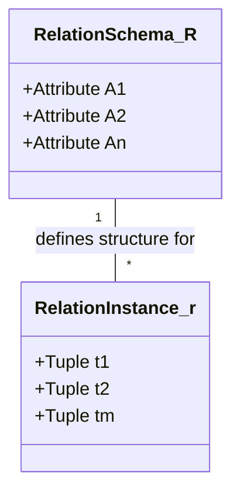
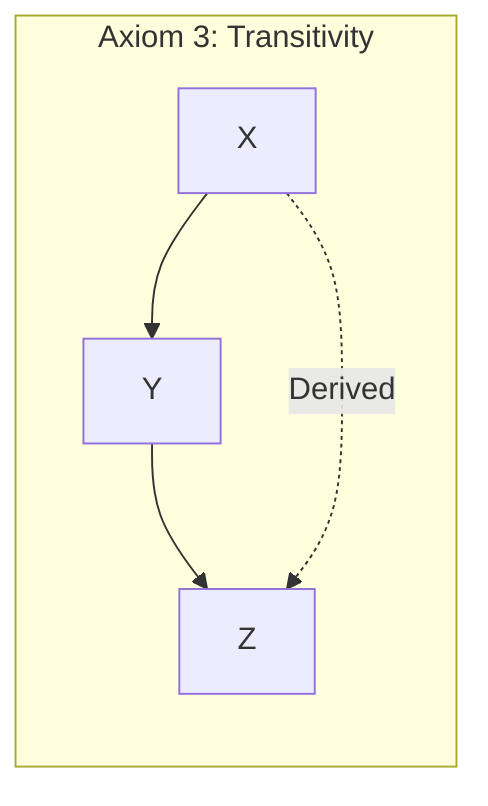
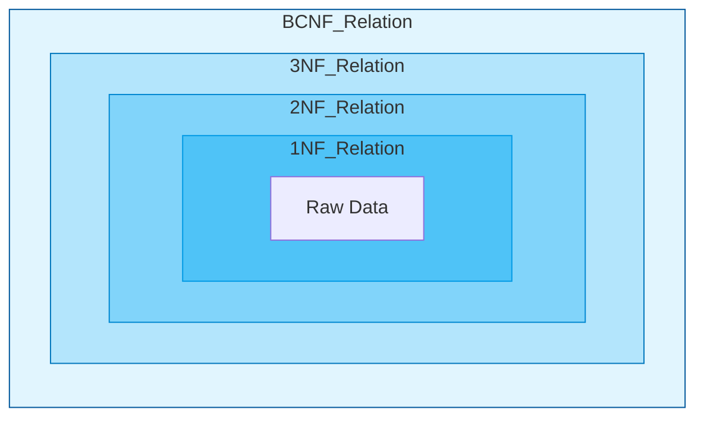
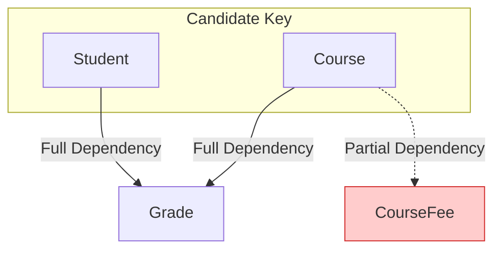
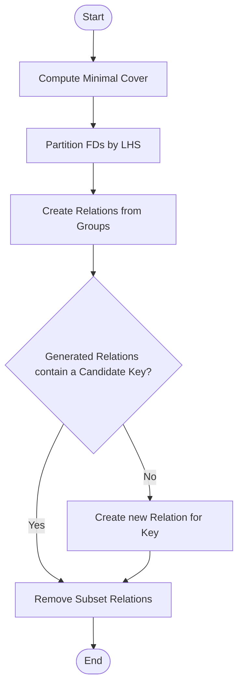
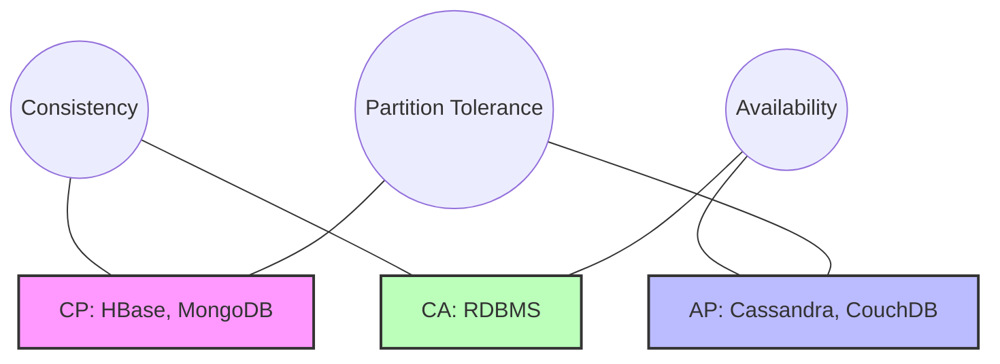

- [1 - Introduction and Historical Context](#1---introduction-and-historical-context)
- [2 - Mathematical Preliminaries: Set Theory and Relations](#2---mathematical-preliminaries-set-theory-and-relations)
  - [2.1 - Sets, Domains, and Cartesian Products](#21---sets-domains-and-cartesian-products)
  - [2.2 - The Relation and its Schema](#22---the-relation-and-its-schema)
- [3 - The Core Theory: Functional Dependencies](#3---the-core-theory-functional-dependencies)
  - [3.1 - Formal Definition](#31---formal-definition)
  - [3.2 - Trivial vs. Non-Trivial Dependencies](#32---trivial-vs-non-trivial-dependencies)
  - [3.3 - Armstrong's Axioms](#33---armstrongs-axioms)
  - [3.4 - The Closure of Functional Dependencies ($F^+$)](#34---the-closure-of-functional-dependencies-f)
- [4 - Algorithms for Structural Analysis](#4---algorithms-for-structural-analysis)
  - [4.1 - Attribute Closure Algorithm ($X^+$)](#41---attribute-closure-algorithm-x)
  - [4.2 - Candidate Keys and Prime Attributes](#42---candidate-keys-and-prime-attributes)
- [5 - The Hierarchy of Normal Forms](#5---the-hierarchy-of-normal-forms)
  - [5.1 - First Normal Form (1NF): Atomicity](#51---first-normal-form-1nf-atomicity)
  - [5.2 - Second Normal Form (2NF): Full Functional Dependency](#52---second-normal-form-2nf-full-functional-dependency)
  - [5.3 - Third Normal Form (3NF): Transitive Dependency](#53---third-normal-form-3nf-transitive-dependency)
  - [5.4 - Boyce-Codd Normal Form (BCNF)](#54---boyce-codd-normal-form-bcnf)
- [6 - Decomposition Algorithms](#6---decomposition-algorithms)
  - [6.1 - The Chase Algorithm (Lossless Join Test)](#61---the-chase-algorithm-lossless-join-test)
  - [6.2 - 3NF Synthesis (Bernstein's Algorithm)](#62---3nf-synthesis-bernsteins-algorithm)
  - [6.3 - BCNF Decomposition Algorithm](#63---bcnf-decomposition-algorithm)
- [7 - Comparative Analysis: Alternative Models](#7---comparative-analysis-alternative-models)
  - [7.1 - Pre-Relational: Hierarchical and Network Models](#71---pre-relational-hierarchical-and-network-models)
  - [7.2 - Post-Relational: NoSQL and Columnar Stores](#72---post-relational-nosql-and-columnar-stores)
- [8 - Conclusion](#8---conclusion)
- [References](#references)

# 1 - Introduction and Historical Context

The management of data within large-scale computational systems stands as one of the foundational challenges of computer science. Before the advent of the relational model in 1970, data management was dominated by the hierarchical and network models. These early paradigms, while functional, suffered from severe rigidity; they required the physical structure of the data (how it was stored on disk) to be intimately known by the application programmer. This coupling meant that a minor change in the storage format necessitated a complete rewrite of the application software, a problem known as the lack of data independence.

In his seminal 1970 paper, "A Relational Model of Data for Large Shared Data Banks," Edgar F. Codd proposed a radical shift. He argued that users should interact with data via a logical model based on mathematical relations, decoupling the user's view from the internal machine representation. This proposal was not merely an engineering improvement but a shift towards a rigorous mathematical foundation rooted in set theory and first-order predicate logic.

The process of normalisation emerged from this theoretical framework as a systematic method to evaluate and restructure logical schemas. Its primary objective is to minimise data redundancy (the unnecessary duplication of information) and to eliminate update anomalies, which threaten the integrity of the database during transactional operations. While redundancy might appear benign, in a shared data bank it leads to inconsistency; if a fact is stored in two places, the system must ensure both are updated simultaneously, a complex task in concurrent environments.

This report provides an exhaustive analysis of normalisation theory up to the Boyce-Codd Normal Form (BCNF). We will traverse the discrete mathematics of relations, the axiomatic systems of functional dependencies, and the algorithms used to decompose relations without information loss. Furthermore, we will critically assess these 1970s theories against the realities of 2024, including distributed NewSQL architectures and columnar storage engines, where the trade-offs of normalisation are re-evaluated.

# 2 - Mathematical Preliminaries: Set Theory and Relations

To manipulate data with the precision Codd envisioned, one must abandon the intuitive notion of a "table" and embrace the formal definition of a relation. The relational model is built upon discrete mathematics, specifically set theory.

## 2.1 - Sets, Domains, and Cartesian Products

The fundamental unit of data is the atomic value. A domain $D$ is a set of such values, characterised by a specific data type and format. For example, the domain of semester codes might be $D_{sem} = \{ \text{Fall2024}, \text{Spring2025}, \dots \}$.

Consider a collection of $n$ domains $D_1, D_2, \dots, D_n$. The Cartesian product of these domains, denoted $D_1 \times D_2 \times \dots \times D_n$, is the set of all possible ordered $n$-tuples $(d_1, d_2, \dots, d_n)$ such that $d_1 \in D_1, d_2 \in D_2, \dots, d_n \in D_n$.

In standard set theory, the Cartesian product is binary and associative, producing pairs of pairs. However, the relational model defines the product as creating flattened tuples. An $n$-tuple combined with an $m$-tuple results in an $(n+m)$-tuple, not a nested pair.

**Equation 2.1: Cardinality of Cartesian Product**
$$|D_1 \times D_2 \times \dots \times D_n| = |D_1| \cdot |D_2| \cdot \dots \cdot |D_n|$$

This magnitude explains why we cannot simply store the Cartesian product; it represents every possible combination of data, valid or invalid. We need a subset of this product: the relation.

## 2.2 - The Relation and its Schema

A relation $r$ is a finite subset of the Cartesian product of its domains.
$$r \subseteq D_1 \times D_2 \times \dots \times D_n$$

We distinguish between the Relation Schema $R$, which is the intentional definition (the metadata), and the Relation Instance $r(R)$, which is the extensional data (the set of tuples at time $t$).

  * **Degree:** The number of domains (attributes) $n$ in $R$.
  * **Cardinality:** The number of tuples in the instance $r$.

A tuple $t$ is an element of $r$. Formally, $t = (v_1, v_2, \dots, v_n)$. Because identifying values by position is error-prone, we assign attributes $A_1, A_2, \dots, A_n$ to the domains. Thus, $R$ is denoted as $R(A_1, A_2, \dots, A_n)$.

It is crucial to note that $r$ is a set, not a list. Consequently, there is no inherent ordering of tuples. Two relations are identical if they contain the same tuples, regardless of presentation order. This abstraction allows the database management system (DBMS) to optimise physical storage (e.g., heaps, B-Trees) without affecting the logical validity of queries.

# 3 - The Core Theory: Functional Dependencies

The engine of normalisation is the Functional Dependency (FD). FDs allow us to constrain the legal instances of a relation based on real-world semantics. They are the mathematical translation of business rules.

## 3.1 - Formal Definition

Let $R$ be a relation schema, and let $\alpha \subseteq R$ and $\beta \subseteq R$ be subsets of attributes. A functional dependency $\alpha \rightarrow \beta$ holds on $R$ if and only if for any legal relation instance $r(R)$, the following condition is satisfied for all pairs of tuples $t_1, t_2 \in r$:

**Equation 3.1: The Functional Dependency Condition**
$$\text{If } t_1[\alpha] = t_2[\alpha], \text{ then } t_1[\beta] = t_2[\beta]$$

Here, $t[\alpha]$ denotes the projection of tuple $t$ onto the attributes in $\alpha$. The dependency states that the value of $\alpha$ uniquely determines the value of $\beta$. This is not a probabilistic relationship; it is absolute.

## 3.2 - Trivial vs. Non-Trivial Dependencies

  * **Trivial FD:** An FD $\alpha \rightarrow \beta$ is trivial if $\beta \subseteq \alpha$. For example, knowing a student's ID and Name allows one to determine their ID. This provides no semantic constraint but is mathematically valid.
  * **Non-Trivial FD:** An FD is non-trivial if $\beta \not\subseteq \alpha$. This implies a constraint on the data. A "bad" non-trivial FD is often the target of normalisation.

## 3.3 - Armstrong's Axioms

To reason about dependencies (to determine if a specific design is valid or if a set of attributes forms a key) we require a system of inference. In 1974, William W. Armstrong proved that a specific set of three axioms is both sound (generates only correct FDs) and complete (generates all correct FDs).

Let $X, Y, Z$ be sets of attributes within $R$.

**Axiom 1: Reflexivity**
If $Y \subseteq X$, then $X \rightarrow Y$.
(This generates all trivial dependencies.)

**Axiom 2: Augmentation**
If $X \rightarrow Y$, then $XZ \rightarrow YZ$.
(Adding the same attributes to both sides does not break the dependency. Often simplified to $XZ \rightarrow Y$.)

**Axiom 3: Transitivity**
If $X \rightarrow Y$ and $Y \rightarrow Z$, then $X \rightarrow Z$.
(This allows chains of dependency, which are often the source of update anomalies.)

**Derived Inference Rules**
From these three axioms, we can derive secondary rules that simplify manual calculation.

**Rule 4: Union (Additivity)**
If $X \rightarrow Y$ and $X \rightarrow Z$, then $X \rightarrow YZ$.
*Proof:*
$X \rightarrow Y$ (Given)
$X \rightarrow Z$ (Given)
$X \rightarrow XY$ (Augmentation of 1 with $X$)
$XY \rightarrow YZ$ (Augmentation of 2 with $Y$)
$X \rightarrow YZ$ (Transitivity of 3 and 4). $\blacksquare$

**Rule 5: Decomposition (Projectivity)**
If $X \rightarrow YZ$, then $X \rightarrow Y$ and $X \rightarrow Z$.
*Proof:*
$X \rightarrow YZ$ (Given)
$YZ \rightarrow Y$ (Reflexivity, since $Y \subseteq YZ$)
$X \rightarrow Y$ (Transitivity of 1 and 2). $\blacksquare$

**Rule 6: Pseudo-transitivity**
If $X \rightarrow Y$ and $YZ \rightarrow W$, then $XZ \rightarrow W$.
*Proof:*
$X \rightarrow Y$ (Given)
$XZ \rightarrow YZ$ (Augmentation of 1 with $Z$)
$YZ \rightarrow W$ (Given)
$XZ \rightarrow W$ (Transitivity of 2 and 3). $\blacksquare$

## 3.4 - The Closure of Functional Dependencies ($F^+$)

The set of all FDs that can be inferred from a given set $F$ is called the closure of $F$, denoted as $F^+$. Calculating $F^+$ is theoretically interesting but computationally expensive (exponential in the number of attributes). In practice, we rarely need the full set $F^+$; we usually need to know if a specific dependency holds or if a specific set of attributes is a key. For this, we use the Attribute Closure algorithm.

# 4 - Algorithms for Structural Analysis

Before we can normalise a relation, we must identify its Candidate Keys. This requires calculating the closure of attribute sets.

## 4.1 - Attribute Closure Algorithm ($X^+$)

Given a set of attributes $X$ and a set of dependencies $F$, the closure $X^+$ is the set of all attributes $A$ such that $X \rightarrow A$ is in $F^+$.

**Algorithm 4.1: Compute Attribute Closure**

  * **Initialise:** $Result \leftarrow X$
  * **Repeat** until $Result$ stops changing:
      * For each FD $Y \rightarrow Z$ in $F$:
          * If $Y \subseteq Result$, then $Result \leftarrow Result \cup Z$.
  * **Return** $Result$.

**Example Calculation:**
Let $R = \{A, B, C, D, E, G\}$ and $F = \{ AB \rightarrow C, C \rightarrow B, AB \rightarrow E, E \rightarrow G \}$.
We wish to test if $\{A, B\}$ is a superkey. We compute $\{A, B\}^+$.

  * **Iteration 0:** $Result = \{A, B\}$
  * **Iteration 1:**
      * Check $AB \rightarrow C$: $AB \subseteq \{A, B\}$. Add $C$. $Result = \{A, B, C\}$.
      * Check $C \rightarrow B$: $C \subseteq \{A, B, C\}$. $B$ is already in set. No change.
      * Check $AB \rightarrow E$: $AB \subseteq \{A, B, C\}$. Add $E$. $Result = \{A, B, C, E\}$.
      * Check $E \rightarrow G$: $E \subseteq \{A, B, C, E\}$. Add $G$. $Result = \{A, B, C, E, G\}$.
  * **Iteration 2:** Re-checking FDs yields no new attributes.
  * **Final Result:** $\{A, B\}^+ = \{A, B, C, D, E, G\}$ (Wait, $D$ is missing).

**Correction:** Looking at $R$, attribute $D$ is not on the RHS of any FD. Thus, $D$ cannot be determined by any other attribute. It must be part of the key. Let's recalculate for $\{A, B, D\}$.
$\{A, B, D\}^+ = \{A, B, C, E, G, D\}$.
Since the closure contains all attributes in $R$, $\{A, B, D\}$ is a Superkey.

## 4.2 - Candidate Keys and Prime Attributes

  * **Superkey:** Any set $K$ where $K^+ = R$.
  * **Candidate Key:** A minimal Superkey. A set $K$ is a candidate key if $K$ is a superkey and no proper subset $S \subset K$ is a superkey.
  * **Prime Attribute:** An attribute that belongs to any candidate key.
  * **Non-Prime Attribute:** An attribute that is not part of any candidate key.

Identifying candidate keys is the first step in checking Normal Forms 2NF, 3NF, and BCNF.

# 5 - The Hierarchy of Normal Forms

Normal forms are defined as a nested hierarchy: $1NF \subset 2NF \subset 3NF \subset BCNF$. A relation in BCNF strictly satisfies the requirements of all lower forms. The process of normalisation involves decomposing a relation that violates a normal form into smaller relations that satisfy it.

## 5.1 - First Normal Form (1NF): Atomicity

**Definition:** A relation is in 1NF if and only if every attribute domain contains only atomic (indivisible) values. There are no repeating groups, arrays, or nested relations.

**Mathematical Rationale:**
The relational algebra operators (Selection $\sigma$, Projection $\pi$) rely on the predicate logic assumption that $t[A]$ returns a single value. If $t[A]$ returned a set, the complexity of the query language would increase exponentially, requiring logic to traverse nested structures.

**Step-by-Step Example:**
Consider an unnormalised relation Student\_Subjects:
$$( \text{ID: } 101, \text{ Name: } \text{Alan}, \text{ Subjects: } \{ \text{Maths, Physics} \} )$$
This violates 1NF because "Subjects" is a set, not an atom. To normalise, we flatten the relation by taking the Cartesian product of the atomic attributes with the repeating group.

**Normalised to 1NF:**
$(101, \text{Alan}, \text{Maths})$
$(101, \text{Alan}, \text{Physics})$

**Consequence:** We have introduced redundancy. The name "Alan" is repeated. This redundancy is addressed in subsequent forms.

## 5.2 - Second Normal Form (2NF): Full Functional Dependency

**Definition:** A relation is in 2NF if it is in 1NF and every non-prime attribute is fully functionally dependent on the candidate key.

**Violation (Partial Dependency):**
A partial dependency occurs when a non-prime attribute is determined by only a part of a composite candidate key.
Formally: $X \subset K$ and $X \rightarrow A$ (where $A$ is non-prime).

**Step-by-Step Mock Calculation:**
Let $R = \{ \text{Student}, \text{Course}, \text{Grade}, \text{CourseFee} \}$.

  * **FDs:**
      * $\{ \text{Student}, \text{Course} \} \rightarrow \text{Grade}$
      * $\text{Course} \rightarrow \text{CourseFee}$
  * **Candidate Key:** $\{ \text{Student}, \text{Course} \}$.

**Analysis:**

  * **Grade:** Depends on the whole key. (Full dependency).
  * **CourseFee:** Depends on $\text{Course}$. Since $\text{Course} \subset \{ \text{Student}, \text{Course} \}$, this is a Partial Dependency.

**Decomposition:**
We split the relation to isolate the partial dependency.

  * $R_1(\text{Course}, \text{CourseFee})$
  * $R_2(\text{Student}, \text{Course}, \text{Grade})$

**Result:** The redundancy of storing the fee for every student in the course is eliminated.

## 5.3 - Third Normal Form (3NF): Transitive Dependency

**Definition:** A relation is in 3NF if it is in 2NF and no non-prime attribute is transitively dependent on the candidate key.

**Formal Definition:** A relation $R$ is in 3NF if for every non-trivial FD $\alpha \rightarrow \beta$ in $F^+$, at least one of the following holds:

1.  $\alpha$ is a superkey of $R$.
2.  $\beta$ is a prime attribute (part of some candidate key).

**Violation (Transitive Dependency):**
Occurs when $Key \rightarrow X \rightarrow Y$, where $Y$ is non-prime.

**Step-by-Step Mock Calculation:**
Let $R = \{ \text{EmpID}, \text{Name}, \text{ZipCode}, \text{City} \}$.

  * **FDs:**
      * $\text{EmpID} \rightarrow \{ \text{Name}, \text{ZipCode} \}$
      * $\text{ZipCode} \rightarrow \text{City}$
  * **Candidate Key:** $\text{EmpID}$.

**Analysis:**

  * FD1 is valid (LHS is superkey).
  * FD2: $\text{ZipCode} \rightarrow \text{City}$.
      * Is $\text{ZipCode}$ a superkey? No.
      * Is $\text{City}$ prime? No.
  * **Violation:** This is a transitive dependency ($\text{EmpID} \rightarrow \text{ZipCode} \rightarrow \text{City}$).

**Decomposition:**

  * $R_1(\text{ZipCode}, \text{City})$
  * $R_2(\text{EmpID}, \text{Name}, \text{ZipCode})$

**Advantage:** If all employees move out of a specific ZipCode, we do not lose the knowledge that the ZipCode belongs to that City (Deletion Anomaly solved).

## 5.4 - Boyce-Codd Normal Form (BCNF)

BCNF was introduced by Codd and Raymond F. Boyce to address anomalies that 3NF allows. 3NF is permissible if the dependent attribute is prime. BCNF removes this allowance.

**Definition:** A relation $R$ is in BCNF if for every non-trivial FD $\alpha \rightarrow \beta$ in $F^+$, $\alpha$ is a superkey.

**The Key Difference:** BCNF does not care if $\beta$ is prime or non-prime. If the LHS is not a superkey, the dependency is invalid (unless trivial). BCNF handles anomalies in relations with multiple overlapping candidate keys.

**Step-by-Step Analysis of the Classic "Student-Instructor" Anomaly:**
Consider $R(\text{Student}, \text{Course}, \text{Instructor})$.

**Semantic Rules:**

  * A student can take many courses.
  * An instructor teaches only one course.
  * A student typically has one instructor per course.

**FDs:**

1.  $\{ \text{Student}, \text{Course} \} \rightarrow \text{Instructor}$
2.  $\text{Instructor} \rightarrow \text{Course}$

**Candidate Keys:**

  * Key 1: $\{ \text{Student}, \text{Course} \}$
  * Key 2: $\{ \text{Student}, \text{Instructor} \}$ (derived from FD2: if we know Student and Instructor, we know Course).

**Attributes Status:**

  * **Prime:** Student, Course, Instructor. (All attributes are prime).
  * **Non-Prime:** None.

**3NF Test:**

  * FD1: LHS is superkey. Pass.
  * FD2 ($\text{Instructor} \rightarrow \text{Course}$):
      * LHS ($\text{Instructor}$) is NOT a superkey (cannot identify Student).
      * RHS ($\text{Course}$) IS prime.
  * **Result:** Passes 3NF.

**BCNF Test:**

  * FD2 ($\text{Instructor} \rightarrow \text{Course}$):
      * LHS ($\text{Instructor}$) is NOT a superkey.
  * **Result:** Violates BCNF.

**The Anomaly:**
Because of this violation, we cannot record the fact that "Dr. Smith teaches Maths" unless there is at least one student enrolled (Insertion Anomaly). If the last student drops the course, we delete Dr. Smith's association with Maths (Deletion Anomaly).

**BCNF Decomposition:**
We decompose based on the violating FD: $\text{Instructor} \rightarrow \text{Course}$.

  * $R_1 = (\text{Instructor}, \text{Course})$
  * $R_2 = (\text{Student}, \text{Instructor})$

This schema is in BCNF and is free of the anomalies.

# 6 - Decomposition Algorithms

Decomposition is not arbitrary. Randomly splitting attributes can result in Lossy Joins (where $R_1 \bowtie R_2 \supset R$, creating "phantom" tuples) or Loss of Dependencies (where constraints can no longer be checked within a single relation).

## 6.1 - The Chase Algorithm (Lossless Join Test)

A decomposition $D = \{R_1, R_2, \dots, R_k\}$ is lossless if the natural join of all $R_i$ returns exactly the original relation $R$. The Chase Algorithm is a general test for this.

**Theorem (Binary Decomposition):** A decomposition into two relations $R_1$ and $R_2$ is lossless if and only if:
$$(R_1 \cap R_2) \rightarrow R_1 \quad \text{OR} \quad (R_1 \cap R_2) \rightarrow R_2$$

Essentially, the intersection (common attributes) must be a superkey for at least one of the decomposed relations.

## 6.2 - 3NF Synthesis (Bernstein's Algorithm)

Rather than decomposing a large relation, we can synthesise a 3NF schema directly from the functional dependencies. This algorithm, proposed by Philip Bernstein (1976), guarantees a Lossless Join and Dependency Preservation.

**Algorithm 6.2: 3NF Synthesis**

1.  **Minimal Cover:** Compute the minimal cover $F_{min}$ of the functional dependencies. (Remove redundant attributes and redundant dependencies).
2.  **Cluster:** Partition $F_{min}$ into groups where the LHS is identical. For each group, create a relation schema comprising the attributes in the FD.
3.  **Key Check:** If none of the generated relations contains a candidate key of the original relation $R$, create a new relation $R_{key}$ consisting of attributes forming a candidate key.
4.  **Refine:** Remove any relation that is a subset of another.

**Example Application:**
$R(A, B, C, D, E)$, $F = \{ A \rightarrow B, A \rightarrow C, C \rightarrow E \}$.

  * **Minimal Cover:** FDs are already minimal.
  * **Groups:**
      * $G_1 (LHS=A): \{ A \rightarrow B, A \rightarrow C \} \Rightarrow R_1(A, B, C)$.
      * $G_2 (LHS=C): \{ C \rightarrow E \} \Rightarrow R_2(C, E)$.
  * **Key Check:**
      * Compute Key of $R$: $A \rightarrow B, C$ and $C \rightarrow E$. $A$ determines $A, B, C, E$. We need $D$.
      * Candidate Key: $\{A, D\}$.
      * Neither $R_1$ nor $R_2$ contains $\{A, D\}$.
      * Create $R_3(A, D)$.
  * **Final Schema:** $\{ R_1(A, B, C), R_2(C, E), R_3(A, D) \}$.

## 6.3 - BCNF Decomposition Algorithm

This algorithm guarantees BCNF and Lossless Join, but not Dependency Preservation. It is recursive.

**Algorithm 6.3: BCNF Decomposition**

1.  Set $Result = \{R\}$.
2.  While any relation $R_i \in Result$ is not in BCNF:
      * Identify a non-trivial FD $\alpha \rightarrow \beta$ holding on $R_i$ where $\alpha$ is not a superkey.
      * Decompose $R_i$ into:
          * $R_{i1} = \alpha \cup \beta$
          * $R_{i2} = R_i - (\beta - \alpha)$
      * Update $Result = (Result - \{R_i\}) \cup \{R_{i1}, R_{i2}\}$.
3.  Return $Result$.

**Comparison:**
Table 6.1 compares the outcomes of the two major algorithmic approaches.

**Table 6.1: Synthesis vs Decomposition**

| Feature                    | 3NF Synthesis      | BCNF Decomposition         |
| :------------------------- | :----------------- | :------------------------- |
| **Input**                  | FDs and Attributes | Universal Relation and FDs |
| **Resulting Normal Form**  | 3NF                | BCNF                       |
| **Lossless Join?**         | Yes                | Yes                        |
| **Dependency Preserving?** | Always Yes         | Not Guaranteed             |
| **Complexity**             | Polynomial         | Exponential in worst case  |

# 7 - Comparative Analysis: Alternative Models

To fully appreciate the relational model's contribution, one must contrast it with its predecessors and successors.

## 7.1 - Pre-Relational: Hierarchical and Network Models

In the 1960s, the Hierarchical Model (e.g., IBM IMS) organised data into tree structures. A record (segment) had exactly one parent.

  * **Navigation:** Accessing data required traversing pointers from the root. To find an Order, the program had to "walk" from Customer to Order.
  * **The Problem:** This was efficient for known queries (e.g., "Get orders for Customer X") but catastrophic for symmetric queries (e.g., "Get the customer for Order Y"). Achieving the latter required scanning all trees or maintaining expensive auxiliary indices.

The Relational Model solved this via associative addressing. We request data by value (e.g., WHERE OrderID = Y), and the DBMS determines the most efficient path (index scan, table scan) to retrieve it. Normalisation ensures that these associative links (Foreign Keys) are unambiguous.

## 7.2 - Post-Relational: NoSQL and Columnar Stores

The rise of "Big Data" in the 2000s challenged the supremacy of BCNF.

**Columnar Stores (e.g., Snowflake, BigQuery):**

  * These systems physically store data by column rather than row.
  * **Impact on Normalisation:** In a row store, we normalise to avoid storing the string "London" 1,000,000 times (saving space). In a columnar store, "London" is stored once in a dictionary and referenced by integer tokens, or compressed via Run-Length Encoding (RLE).
  * **Denormalisation:** Because compression is so efficient, the space penalty of redundancy is negligible. Consequently, designers often prefer denormalised wide tables (Star Schemas) to avoid the CPU cost of joining tables. Here, performance trumps the anomaly protection of BCNF.

**NoSQL and CAP Theorem:**
The CAP Theorem states a distributed system can only provide two of Consistency, Availability, and Partition Tolerance.

  * **Document Stores (e.g., MongoDB):** Often use schemas that violate 1NF by nesting related data (e.g., embedding Orders inside the Customer document).
  * **Trade-off:** This provides high Partition Tolerance (all data for a customer is on one node, no distributed joins needed) but sacrifices Atomicity (updating a product name requires updating thousands of Customer documents). This is a calculated regression to pre-relational hierarchies to achieve horizontal scale.

**NewSQL (e.g., CockroachDB, Spanner):**
These systems offer a synthesis: the scalability of NoSQL with the ACID guarantees of Relational.

  * **Keys:** Unlike traditional BCNF schemas which might use sequential integers as keys, NewSQL systems often require UUIDs or hashed keys to prevent "hotspotting" (writing all new records to a single range-partition). The logical normalisation remains BCNF, but the physical implementation is distributed.

# 8 - Conclusion

Relational database normalisation is a discipline rooted in mathematical rigour. Starting from the basic axioms of set theory, it builds a framework of Functional Dependencies to prove properties about data integrity.

* 1NF ensures structural simplicity (relations, not graphs).
* 2NF and 3NF eliminate redundancy caused by partial and transitive dependencies.
* BCNF provides a robust defence against anomalies arising from overlapping keys.

While the modern landscape of distributed systems and columnar analytics often necessitates denormalisation, this deviation is only safe when performed by an architect who understands the rules they are breaking. A "schema-less" approach is often just a schema with hidden, unmanaged dependencies. Thus, the theory established by Codd, Armstrong, and Bernstein remains the indispensable bedrock of data engineering.

# References

* Codd, E. F. (1970). *A Relational Model of Data for Large Shared Data Banks*. Communications of the ACM, 13(6), 377–387. [https://doi.org/10.1145/362384.362685](https://doi.org/10.1145/362384.362685) ([SCIRP][1])

* Codd, E. F. (1971). *Further Normalization of the Data Base Relational Model*. IBM Research Report RJ909. Reprinted in R. Rustin (Ed.), *Data Base Systems* (Courant Computer Science Symposia Series, Vol. 6). [PDF](https://forum.thethirdmanifesto.com/wp-content/uploads/asgarosforum/987737/00-efc-further-normalization.pdf) ([TTM Forum][2])

* Armstrong, W. W. (1974). *Dependency Structures of Data Base Relationships*. In *Proceedings of IFIP Congress 1974* (pp. 580–583). North-Holland. [Link via Semantic Scholar](https://www.semanticscholar.org/paper/Dependency-Structures-of-Data-Base-Relationships-Armstrong/0d21a989f1ae615553fc79c4eea199852452b80f) ([Semantic Scholar][3])

* Bernstein, P. A. (1976). *Synthesizing Third Normal Form Relations from Functional Dependencies*. ACM Transactions on Database Systems, 1(4), 277–298. [https://doi.org/10.1145/320493.320489](https://doi.org/10.1145/320493.320489) ([ACM Digital Library][4])

* Helfgott LeDoux, C., & Parker, D. S., Jr. (1982). *Reflections on Boyce-Codd Normal Form*. In *Proceedings of the Eighth International Conference on Very Large Data Bases (VLDB)* (pp. 131–141). [PDF](https://www.vldb.org/conf/1982/P131.PDF) ([VLDB][5])

* Abadi, D. J., Madden, S. R., & Hachem, N. (2008). *Column-Stores vs. Row-Stores: How Different Are They Really?* In *Proceedings of the ACM SIGMOD International Conference on Management of Data* (pp. 967–980). [https://doi.org/10.1145/1376616.1376712](https://doi.org/10.1145/1376616.1376712) ([ACM Digital Library][6])

* Brewer, E. A. (2000). *Towards Robust Distributed Systems*. Keynote address, 19th Annual ACM Symposium on Principles of Distributed Computing (PODC). [https://doi.org/10.1145/343477.343502](https://doi.org/10.1145/343477.343502) ([ResearchGate][7])

* Gilbert, S., & Lynch, N. (2002). *Brewer’s Conjecture and the Feasibility of Consistent, Available, Partition-Tolerant Web Services*. ACM SIGACT News, 33(2), 51–59. [https://doi.org/10.1145/564585.564601](https://doi.org/10.1145/564585.564601) ([ACM Digital Library][8])

[1]: https://www.scirp.org/reference/referencespapers?referenceid=1951876&utm_source=chatgpt.com "Codd, E.F. (1970) A Relational Model of Data for Large ..."
[2]: https://forum.thethirdmanifesto.com/wp-content/uploads/asgarosforum/987737/00-efc-further-normalization.pdf?utm_source=chatgpt.com "Further Normalization of the Data Base Relational Model"
[3]: https://www.semanticscholar.org/paper/Dependency-Structures-of-Data-Base-Relationships-Armstrong/0d21a989f1ae615553fc79c4eea199852452b80f?utm_source=chatgpt.com "Dependency Structures of Data Base Relationships"
[4]: https://dl.acm.org/doi/10.1145/320493.320489?utm_source=chatgpt.com "Synthesizing third normal form relations from functional ..."
[5]: https://www.vldb.org/conf/1982/P131.PDF?utm_source=chatgpt.com "Reflections on Boyce-Codd Normal Form"
[6]: https://dl.acm.org/doi/10.1145/1376616.1376712?utm_source=chatgpt.com "Column-stores vs. row-stores: how different are they really?"
[7]: https://www.researchgate.net/publication/221343719_Towards_robust_distributed_systems?utm_source=chatgpt.com "(PDF) Towards robust distributed systems"
[8]: https://dl.acm.org/doi/10.1145/564585.564601?utm_source=chatgpt.com "Brewer's conjecture and the feasibility of consistent, ..."
