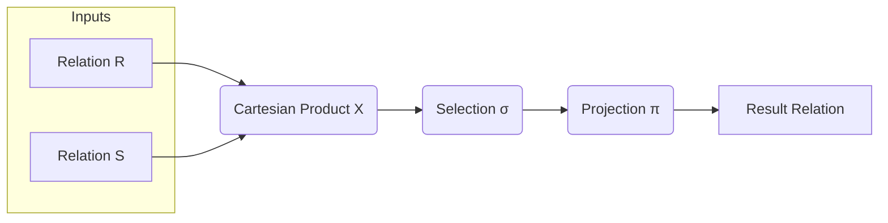
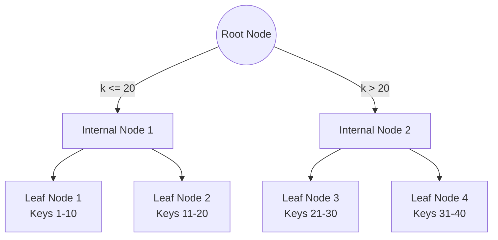
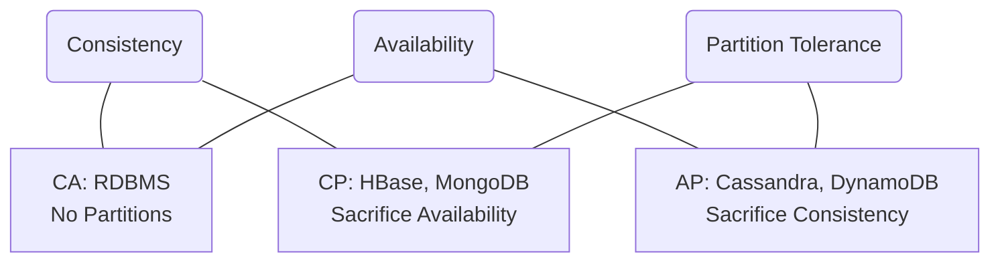
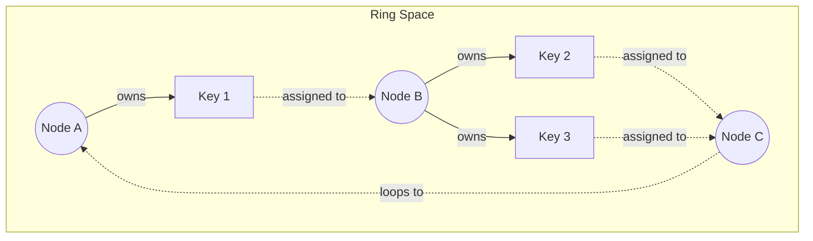
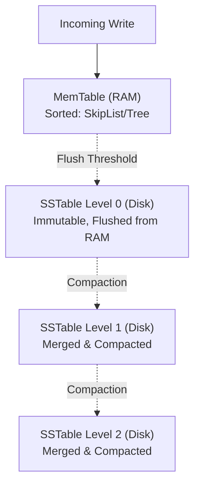
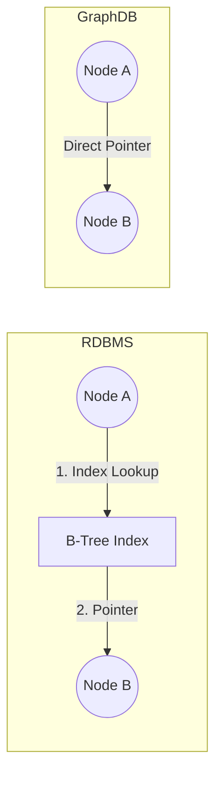
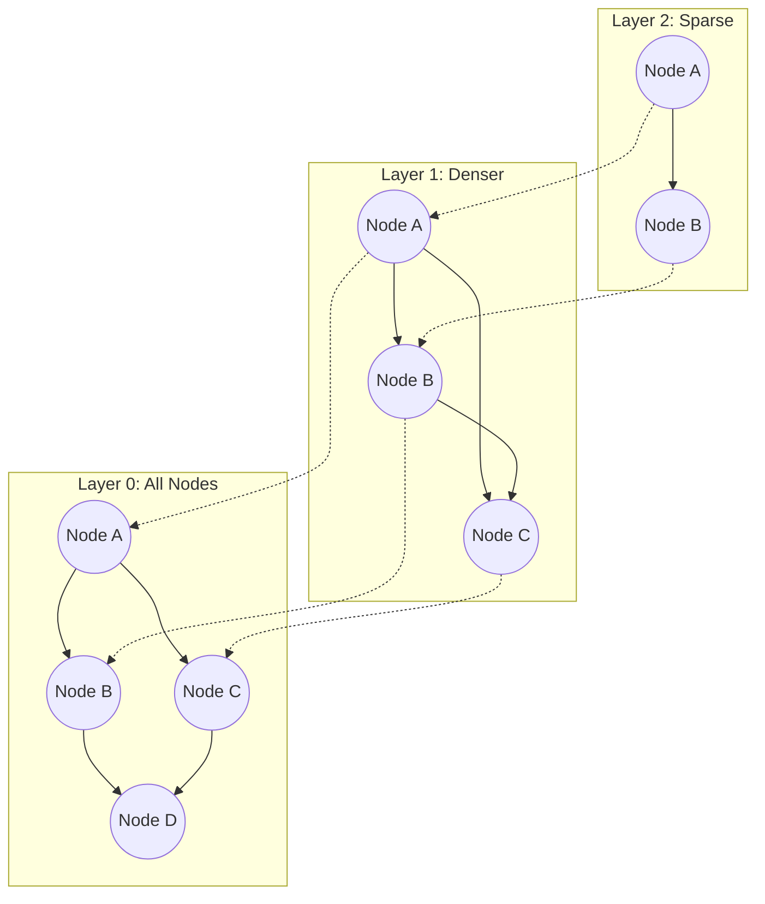

- [1 - Executive Summary](#1---executive-summary)
- [2 - Introduction: The Theoretical Evolution of Data Models](#2---introduction-the-theoretical-evolution-of-data-models)
- [3 - The Relational Database Paradigm (RDBMS)](#3---the-relational-database-paradigm-rdbms)
  - [3.1 - Mathematical Foundations: Set Theory and Relations](#31---mathematical-foundations-set-theory-and-relations)
  - [3.2 - Relational Algebra](#32---relational-algebra)
    - [3.2.1 - Primitive Operators](#321---primitive-operators)
    - [3.2.2 - Derived Operators: The Join](#322---derived-operators-the-join)
  - [3.3 - Tuple Relational Calculus (TRC)](#33---tuple-relational-calculus-trc)
    - [3.3.1 - Syntax and Quantifiers](#331---syntax-and-quantifiers)
    - [3.3.2 - Codd's Theorem and Safety](#332---codds-theorem-and-safety)
  - [3.4 - Relational Indexing: The B-Tree](#34---relational-indexing-the-b-tree)
    - [3.4.1 - Complexity Analysis](#341---complexity-analysis)
- [4 - Distributed Systems Theory and Consistency](#4---distributed-systems-theory-and-consistency)
  - [4.1 - The CAP Theorem](#41---the-cap-theorem)
    - [4.1.1 - The Proof of Impossibility](#411---the-proof-of-impossibility)
  - [4.2 - The PACELC Theorem](#42---the-pacelc-theorem)
  - [4.3 - Consistent Hashing](#43---consistent-hashing)
    - [4.3.1 - Virtual Nodes and Variance](#431---virtual-nodes-and-variance)
- [5 - The NoSQL Paradigm: Key-Value, Column-Family, and Document](#5---the-nosql-paradigm-key-value-column-family-and-document)
  - [5.1 - The Document Model (JSON/BSON)](#51---the-document-model-jsonbson)
  - [5.2 - Log-Structured Merge (LSM) Trees](#52---log-structured-merge-lsm-trees)
    - [5.2.1 - High-Level Mechanism](#521---high-level-mechanism)
    - [5.2.2 - Mathematical Performance Analysis](#522---mathematical-performance-analysis)
  - [5.3 - Probabilistic Data Structures: Bloom Filters](#53---probabilistic-data-structures-bloom-filters)
    - [5.3.1 - Probability Derivation](#531---probability-derivation)
    - [5.3.2 - Optimisation](#532---optimisation)
- [6 - The Graph Database Paradigm](#6---the-graph-database-paradigm)
  - [6.1 - Graph Theory Fundamentals](#61---graph-theory-fundamentals)
  - [6.2 - Complexity of Representation: Matrix vs. List](#62---complexity-of-representation-matrix-vs-list)
  - [6.3 - Index-Free Adjacency](#63---index-free-adjacency)
  - [6.4 - The Subgraph Isomorphism Problem](#64---the-subgraph-isomorphism-problem)
- [7 - The Vector Database Paradigm](#7---the-vector-database-paradigm)
  - [7.1 - High-Dimensional Geometry](#71---high-dimensional-geometry)
  - [7.2 - Similarity Metrics](#72---similarity-metrics)
  - [7.3 - Hierarchical Navigable Small World (HNSW)](#73---hierarchical-navigable-small-world-hnsw)
    - [7.3.1 - Small World Theory](#731---small-world-theory)
    - [7.3.2 - The Algorithm](#732---the-algorithm)
  - [7.4 - Product Quantisation (PQ)](#74---product-quantisation-pq)
    - [7.4.1 - Mechanism](#741---mechanism)
    - [7.4.2 - Asymmetric Distance Computation (ADC)](#742---asymmetric-distance-computation-adc)
- [8 - Theoretical Comparison and Synthesis](#8---theoretical-comparison-and-synthesis)
  - [8.1 - Comparative Complexity Analysis](#81---comparative-complexity-analysis)
  - [8.2 - Selection Heuristics based on Theory](#82---selection-heuristics-based-on-theory)
- [9 - Conclusion](#9---conclusion)
- [References](#references)

# 1 - Executive Summary

The architecture of data management systems is not merely a matter of engineering preference. It is a direct application of specific mathematical theories to the problems of storage, retrieval, and consistency. For decades, the industry relied upon the Relational Model. This model is grounded in set theory and predicate logic. It prioritises data independence and rigorous consistency. However, the advent of web-scale distributed systems and high-dimensional machine learning workloads revealed the theoretical limits of this paradigm.

This report provides an exhaustive analysis of the mathematical underpinnings of the four primary database paradigms: Relational, NoSQL (encompassing Key-Value, Column-Family, and Document), Graph, and Vector. We examine the Relational Model through the lens of Tuple Relational Calculus and algebraic normalisation. We analyse NoSQL systems via Distributed Systems Theory, specifically the CAP and PACELC theorems, and the asymptotic performance of Log-Structured Merge (LSM) trees versus B-Trees. We explore Graph databases using Graph Theory, contrasting the computational complexity of index-free adjacency against relational joins. Finally, we investigate Vector databases through high-dimensional geometry and the probability theory underlying Hierarchical Navigable Small World (HNSW) graphs.

This blog is written for a technical audience. It assumes a strong background in mathematics. It aims to provide the theoretical basis necessary to select the appropriate data substrate for complex computational problems.

# 2 - Introduction: The Theoretical Evolution of Data Models

The history of database technology is a history of mathematical abstraction. Early data systems in the 1960s, such as the Hierarchical and Network models, lacked a formal theoretical foundation. They relied on navigational pointers. This meant the logical view of the data was tightly coupled to its physical layout on magnetic tapes or disks. This coupling created a significant maintenance burden. If the physical structure changed, every application accessing that data required modification.

The pivotal moment occurred in 1970. Edgar F. Codd, a mathematician at IBM, published "A Relational Model of Data for Large Shared Data Banks". Codd proposed a radical shift. He argued that data should be represented in its "natural structure only". He utilised set theory to define data as tuples grouped into relations. This severed the link between the logical representation and the machine representation. It allowed users to query data using declarative logic rather than navigational procedures.

This dominance lasted for thirty years. However, the rise of the internet introduced new variables. The volume of data grew exponentially. The velocity of data ingestion exceeded the write capabilities of single machines. The variety of data expanded beyond structured tables. These pressures exposed the limitations of the Relational Model, particularly its adherence to ACID (Atomicity, Consistency, Isolation, Durability) properties in a distributed context. Theoretical constraints, codified in the CAP Theorem, necessitated new paradigms. These new systems, collectively termed NoSQL, traded strict consistency for availability and partition tolerance.

Most recently, the field of Artificial Intelligence has driven the emergence of Vector databases. These systems do not rely on exact matches. They rely on semantic similarity in high-dimensional vector spaces. This requires a shift from deterministic algebra to probabilistic geometry.

# 3 - The Relational Database Paradigm (RDBMS)

The Relational Database Management System (RDBMS) remains the cornerstone of transactional data processing. Its endurance is attributable to its solid mathematical foundation.

## 3.1 - Mathematical Foundations: Set Theory and Relations

The central concept in the Relational Model is the Relation. In set-theoretic terms, a relation is a subset of the Cartesian product of a list of domains.

Let $D_1, D_2, \dots, D_n$ be domains. A domain is a set of atomic values. A relation $R$ is defined as:

$$R \subseteq D_1 \times D_2 \times \dots \times D_n$$

Each element of $R$ is an $n$-tuple $t = (d_1, d_2, \dots, d_n)$ where $d_i \in D_i$.

This definition implies several properties:

  * **Unordered Set:** A relation is a set, not a list. The order of tuples is undefined and irrelevant to the logical model.
  * **Uniqueness:** As a set, a relation cannot contain duplicate tuples.
  * **Atomicity:** Values in the domains are atomic. They are not sets or relations themselves (First Normal Form).

## 3.2 - Relational Algebra

Relational Algebra provides the theoretical procedural method for manipulating relations. It is a closed algebraic system. The operators take one or more relations as input and produce a relation as output. This closure property allows for the composition of complex queries.

### 3.2.1 - Primitive Operators

There are six primitive operators from which all other relational operations can be derived.

**Selection ($\sigma$):**
The selection operator acts as a horizontal filter. It returns a subset of tuples that satisfy a specific logical predicate $P$.

$$\sigma_P(R) = \{ t \in R \mid P(t) \text{ is true} \}$$

The predicate $P$ is a formula in propositional logic. It involves attributes of the tuple, constants, and logical connectives ($\land, \lor, \neg$). The cardinality of the output, denoted $|\sigma_P(R)|$, satisfies $0 \leq |\sigma_P(R)| \leq |R|$.

**Projection ($\pi$):**
The projection operator acts as a vertical filter. It returns a relation containing only a specified subset of attributes $X$.

$$\pi_X(R) = \{ t[X] \mid t \in R \}$$

Crucially, because the result must be a valid relation (a set), duplicate tuples resulting from the removal of distinguishing attributes must be eliminated. This distinguishes relational projection from SQL SELECT, which returns a multiset (bag) unless DISTINCT is specified.

**Cartesian Product ($\times$):**
This binary operator combines two relations $R$ and $S$. It pairs every tuple in $R$ with every tuple in $S$.

$$R \times S = \{ (r, s) \mid r \in R, s \in S \}$$

If $R$ has degree $n$ and cardinality $N$, and $S$ has degree $m$ and cardinality $M$, the result has degree $n+m$ and cardinality $N \cdot M$. This exponential growth in size is the reason Cartesian products are computationally expensive and typically restricted by selection predicates.

**Union ($\cup$):**
The union of two relations $R$ and $S$ includes all tuples that are in $R$, in $S$, or in both.

$$R \cup S = \{ t \mid t \in R \lor t \in S \}$$

For this operation to be valid, $R$ and $S$ must be union-compatible. They must have the same number of attributes, and the domains of corresponding attributes must be compatible.

**Set Difference ($-$):**
The difference contains tuples that are in $R$ but not in $S$.

$$R - S = \{ t \mid t \in R \land t \notin S \}$$

This requires union compatibility.

**Rename ($\rho$):**
This unary operator allows the renaming of relation names or attribute names. It is essential for self-joins and for ensuring result schemas are well-defined.

$$\rho_{S(A_1, \dots, A_n)}(R)$$

Here, the relation $R$ is returned with the name $S$ and attributes renamed to $A_1, \dots, A_n$.

### 3.2.2 - Derived Operators: The Join

The Join ($\bowtie$) is the most significant operator for data retrieval. It allows the reconstruction of information distributed across multiple normalised relations.

The Natural Join is formally derived from the primitive operators:

$$R \bowtie S = \pi_{\text{Schema}(R) \cup \text{Schema}(S)} (\sigma_{R.A = S.A} (R \times S))$$

It represents a Cartesian product followed by a selection on common attributes and a projection to remove duplicate columns.

Other variations include:

  * **Theta Join ($\bowtie_\theta$):** A Cartesian product followed by a selection predicate $\theta$.
  * **Left Outer Join ($R \ \beth \ S$):** Preserves all tuples from $R$, matching them with tuples from $S$ where possible, and padding with nulls where no match exists.

## 3.3 - Tuple Relational Calculus (TRC)

While Relational Algebra is procedural (describing how to retrieve data), Tuple Relational Calculus is declarative (describing what data to retrieve). It is based on first-order predicate logic.

A query in TRC takes the form:

$$\{ t \mid P(t) \}$$

Here, $t$ is a tuple variable. $P(t)$ is a logical formula that evaluates to true for the tuples to be retrieved.

### 3.3.1 - Syntax and Quantifiers

Formulas in TRC are constructed from atoms. Atoms can be:

  * $t \in R$ (Tuple $t$ belongs to relation $R$).
  * $t.A \ \text{op} \ c$ (Attribute $A$ of tuple $t$ relates to constant $c$).
  * $t.A \ \text{op} \ u.B$ (Attribute comparison between two tuple variables).

These atoms are combined using logical connectives ($\land, \lor, \neg$) and quantifiers:

**Existential Quantifier ($\exists$):**
$\exists t \in R (Q(t))$
This asserts that there exists at least one tuple in $R$ for which the formula $Q(t)$ is true.

**Universal Quantifier ($\forall$):**
$\forall t \in R (Q(t))$
This asserts that for all tuples in $R$, the formula $Q(t)$ is true.
In practice, $\forall$ is often rewritten using $\neg \exists \neg$ due to the difficulty of implementing universal quantification directly.

### 3.3.2 - Codd's Theorem and Safety

E.F. Codd proved that Relational Algebra and Relational Calculus are equivalent in expressive power. Any query that can be expressed in the safe Relational Calculus can also be expressed in Relational Algebra.

Safety is a critical concept. A calculus formula such as $\{ t \mid \neg(t \in R) \}$ describes an infinite set of tuples not in the database. To be computationally feasible, TRC expressions must be domain-independent. The results must be drawn from the finite domain of values present in the database or the query constants.

## 3.4 - Relational Indexing: The B-Tree

The Relational Model separates the logical view from the physical storage. However, performance dictates the need for efficient physical structures. The B-Tree (and its variant, the B+ Tree) is the ubiquitous index structure for RDBMS.

### 3.4.1 - Complexity Analysis

The B-Tree is a self-balancing tree data structure. It maintains sorted data and allows searches, sequential access, insertions, and deletions in logarithmic time.

Let $N$ be the number of keys. Let $m$ be the order of the tree (maximum children per node).

  * Search Complexity: $O(\log_m N)$.
  * Insertion Complexity: $O(\log_m N)$.
  * Delete Complexity: $O(\log_m N)$.

The base of the logarithm, $m$, is typically large (e.g., 100-1000). This corresponds to the size of a disk block relative to the key size. This high branching factor results in a very shallow tree. For a table with billions of rows, the tree depth rarely exceeds 3 or 4 levels.
This ensures that retrieving any specific record requires only a small, constant number of disk I/O operations.

However, the B-Tree has a theoretical disadvantage in write-heavy workloads.

**Random I/O Penalty:** Updating a B-Tree often necessitates "in-place" updates. When a record is inserted, the corresponding leaf node must be located and updated. If this node is not in the memory cache, it triggers a random disk I/O. As the dataset grows beyond RAM, the write throughput becomes bound by the Input/Output Operations Per Second (IOPS) of the storage medium. This limitation is a primary driver for the adoption of LSM-based NoSQL systems.

# 4 - Distributed Systems Theory and Consistency

The transition from monolithic RDBMS to distributed NoSQL systems is governed by fundamental theorems in distributed computing.

## 4.1 - The CAP Theorem

Proposed by Eric Brewer and formally proven by Seth Gilbert and Nancy Lynch, the CAP theorem establishes a theoretical limit for distributed data stores. It states that a distributed system can provide at most two of the following three guarantees:

  * **Consistency (C):** This refers to atomic consistency or linearizability. Every read receives the most recent write or an error. In a consistent system, there is a total ordering of operations that is consistent with the real-time ordering.
  * **Availability (A):** Every request received by a non-failing node in the system must result in a response. The response does not guarantee that the data is the most recent, but the system must not timeout or error due to inability to reach a consensus.
  * **Partition Tolerance (P):** The system continues to operate despite an arbitrary number of messages being dropped or delayed by the network between nodes.

### 4.1.1 - The Proof of Impossibility

Gilbert and Lynch's proof uses a contradiction argument.

1.  Consider a system with two nodes, $G_1$ and $G_2$, connected by a network.
2.  Assume the system guarantees Availability and Consistency.
3.  A network partition occurs. The link between $G_1$ and $G_2$ is severed ($P$ exists).
4.  A client writes a new value $v_1$ to object $x$ on node $G_1$.
5.  Because of the partition, $G_1$ cannot propagate this write to $G_2$.
6.  Another client reads object $x$ from node $G_2$.
7.  If the system is Available, $G_2$ must return a value.
8.  Since $G_2$ is unaware of $v_1$, it returns the old value $v_0$.
9.  This violates Consistency (the read did not return the most recent write).
10. Therefore, in the presence of a Partition, one must choose between Consistency and Availability.

## 4.2 - The PACELC Theorem

The CAP theorem is often criticised for being too binary. It only applies when a partition occurs. In the normal mode of operation (when the network is healthy), systems still face trade-offs. Daniel Abadi introduced the PACELC formulation to address this.

**The Formulation:**

  * If Partitioned (P): Choose between Availability and Consistency (A vs C).
  * Else (E) (No Partition): Choose between Latency and Consistency (L vs C).

This explains the design of systems like Amazon DynamoDB or Cassandra. Even when the network is stable, these systems may choose to replicate data asynchronously. This reduces Latency (the write returns immediately after the local commit). However, it sacrifices Consistency (a subsequent read from a different replica might be stale).

Conversely, systems like Google Spanner or traditional clustered RDBMS choose Consistency. They use synchronous replication (e.g., Two-Phase Commit or Paxos). This ensures strong consistency but incurs a Latency penalty due to the network round-trips required for consensus.

## 4.3 - Consistent Hashing

In distributed Key-Value stores, data must be partitioned across multiple nodes. The standard modular hashing approach ($hash(key) \pmod N$) is theoretically flawed for dynamic systems. If the number of nodes $N$ changes (due to failure or scaling), the result of the modulo operation changes for nearly all keys. This forces a massive rebalancing of data.

Consistent Hashing addresses this. It maps both nodes and keys to the same identifier space, typically a ring (e.g., integers modulo $2^{160}$).

  * A key is assigned to the first node encountered moving clockwise on the ring.
  * When a node is added, it only takes ownership of the segment of the ring immediately preceding it. Only the keys in that segment move. The theoretical movement of keys is $K/N$, where $K$ is total keys and $N$ is number of nodes.

### 4.3.1 - Virtual Nodes and Variance

A naive implementation of consistent hashing assigns one position per node. This leads to non-uniform load distribution due to the variance in the gaps between random points on a circle.

To mitigate this, systems employ Virtual Nodes (vnodes). Each physical node is assigned multiple positions ($V$) on the ring.
This application of the Law of Large Numbers reduces the variance of the key distribution.

The standard deviation of the load, $\sigma$, is proportional to the inverse square root of the number of virtual nodes:

$$\sigma \propto \frac{1}{\sqrt{V}}$$

Increasing $V$ from 1 to 100 reduces the standard deviation of the load balance to approximately 10%.

# 5 - The NoSQL Paradigm: Key-Value, Column-Family, and Document

NoSQL systems arose to address the scalability limits of RDBMS described by the CAP theorem. While they vary in data model (Key-Value, Document, Column-Family), many share the same underlying mathematical structures for storage.

## 5.1 - The Document Model (JSON/BSON)

The Document paradigm (e.g., MongoDB, Couchbase) represents data as semi-structured documents, typically JSON or BSON.

Mathematically, a document is a Tree. It is a recursive data structure where values can be scalars, lists, or nested documents (sub-trees).

This addresses the "Impedance Mismatch" problem of RDBMS. In an object-oriented application, an object is often a graph or tree. Mapping this to flat relational tables requires decomposition (shredding).
The Document model stores the object in its natural aggregate form.

$D = \{ (k_1, v_1), (k_2, v_2), \dots \}$ where $v_i$ can be $D'$.

This implies that locality is preserved. All data for a single entity is stored contiguously on disk, allowing retrieval in a single read operation ($O(1)$) rather than requiring joins ($O(N)$ or $O(\log N)$).

## 5.2 - Log-Structured Merge (LSM) Trees

While B-Trees optimise for reads, LSM Trees optimise for writes. They are the standard storage engine for write-heavy NoSQL systems like Bigtable, Cassandra, and RocksDB.

### 5.2.1 - High-Level Mechanism

The LSM Tree converts random writes into sequential writes.

1.  **MemTable:** Incoming writes are stored in an in-memory sorted structure (often a Skip List or Red-Black Tree).
2.  **SSTable:** When the MemTable reaches a size threshold, it is flushed to disk as an immutable Sorted String Table (SSTable). This is a sequential write operation, which is orders of magnitude faster than random writes on both HDD and SSD.
3.  **Compaction:** As SSTables accumulate, a background process merges them to discard deleted values and reduce the number of files.

### 5.2.2 - Mathematical Performance Analysis

We compare LSM Trees to B-Trees using the metrics of Write Amplification ($W_{amp}$) and Read Amplification ($R_{amp}$).

**B-Tree Amplification:**
In a B-Tree, modifying a logical record requires rewriting the entire physical page (block).
Let $B$ be the block size and $R$ be the record size.

$$W_{amp} = \frac{B}{R}$$

If $B=16\text{KB}$ and $R=100\text{Bytes}$, the amplification is 160. Every byte of data requires 160 bytes of disk I/O.

**LSM Tree Amplification:**
In a Levelled LSM tree, data flows through $L$ levels. At each level, data is merged and rewritten.
Let $k$ be the growth factor (ratio of size between Level $i$ and $i+1$).
The write amplification is proportional to the number of levels times the merge factor:

$$W_{amp} = \Theta(k \cdot L) = \Theta\left(k \cdot \log_k \frac{N}{B}\right)$$

While this can be high, the I/O is sequential. The sequential bandwidth of a drive is often $10\times$ to $100\times$ higher than its random write throughput. Thus, despite the amplification, the latency of the write is significantly lower.

**Read Amplification:**
LSM Trees suffer on reads. A key might exist in the MemTable or any of the SSTables on disk. In the worst case, the system must check all files.

$$R_{amp} = \Theta(L + \text{MemTable})$$

To make this viable, LSM engines rely heavily on Bloom Filters.

## 5.3 - Probabilistic Data Structures: Bloom Filters

A Bloom Filter is a space-efficient probabilistic data structure used to test whether an element is a member of a set. It allows for false positives but no false negatives.

### 5.3.1 - Probability Derivation

Let $m$ be the size of the bit array.
Let $k$ be the number of hash functions.
Let $n$ be the number of elements inserted.

When an element is inserted, $k$ bits are set to 1.
The probability that a specific bit is NOT set by a single hash function is $1 - \frac{1}{m}$.
After inserting $n$ elements, the probability that a specific bit remains 0 is:

$$P(\text{bit is 0}) = \left(1 - \frac{1}{m}\right)^{kn} \approx e^{-kn/m}$$

Conversely, the probability that a bit is 1 is:

$$P(\text{bit is 1}) = 1 - e^{-kn/m}$$

A False Positive occurs when we check a non-existent element, and all $k$ corresponding bits happen to be set to 1.

$$P(\text{False Positive}) = \left( 1 - e^{-kn/m} \right)^k$$

### 5.3.2 - Optimisation

We can derive the optimal number of hash functions $k$ for a given memory size $m$ and item count $n$.
Taking the derivative of the probability function with respect to $k$ and setting it to zero yields:

$$k = \frac{m}{n} \ln 2 \approx 0.7 \frac{m}{n}$$

This result is crucial for database architects. It implies that to minimise false positives, the number of hash functions should be proportional to the bits-per-element ratio.
With 10 bits per element ($m/n = 10$), the optimal $k$ is 7. The resulting false positive rate is roughly $0.5^7 \approx 0.008$ (less than 1%).

This mathematical property allows LSM trees to skip 99% of unnecessary disk reads, rendering the architecture performant.

# 6 - The Graph Database Paradigm

Graph databases are specialised for data where the relationships (edges) are as important as the data itself (vertices).

## 6.1 - Graph Theory Fundamentals

A graph $G$ is an ordered pair $(V, E)$.

  * $V$ is a set of vertices (nodes).
  * $E$ is a set of edges (relationships), which are pairs of vertices.

**Hypergraphs vs. Property Graphs:**
Mathematical graph theory often deals with Hypergraphs, where an edge can connect any number of vertices ($E \subseteq \mathcal{P}(V) \setminus \emptyset$).
However, most commercial databases (like Neo4j) implement the Property Graph model. This is a directed multigraph where both vertices and edges can contain internal structure (properties).
While Hypergraphs are more expressive (a single edge can represent a "meeting" of 5 people), Property Graphs are pragmatic. A hyperedge is typically modelled as an intermediate node connected to the 5 participants.

## 6.2 - Complexity of Representation: Matrix vs. List

The choice of data structure defines the asymptotic complexity of graph operations.

**Adjacency Matrix:**
Represented as a $|V| \times |V|$ matrix $A$.
$A_{ij} = 1$ if there is an edge from $i$ to $j$, else $0$.

  * Space Complexity: $O(V^2)$.
  * Edge Existence Query: $O(1)$.
  * Finding Neighbours: $O(V)$.
    This is inefficient for sparse graphs (like social networks), where $E \ll V^2$.

**Adjacency List:**
An array of size $|V|$, where each entry points to a list of neighbours.

  * Space Complexity: $O(V + E)$.
  * Edge Existence Query: $O(\text{degree}(u))$.
  * Finding Neighbours: $O(\text{degree}(u))$.
    This is the standard implementation for graph databases.

## 6.3 - Index-Free Adjacency

The defining performance characteristic of native graph databases is Index-Free Adjacency.

In a Relational Database, traversing a relationship implies a Join. This typically uses a B-Tree index lookup.

  * RDBMS Join Cost: $O(\log N)$ per hop.
  * For a path of length $k$, the cost is $O(k \cdot \log N)$. As the database size $N$ grows, the query slows down.

In a native Graph Database, each node contains direct physical pointers (memory addresses or disk offsets) to its adjacent relationships. Traversing a relationship is a pointer dereference.

  * Graph Traversal Cost: $O(1)$ per hop.
  * For a path of length $k$, the cost is $O(k)$.

This cost is independent of the total size of the database $N$. This property makes graph databases exponentially faster than RDBMS for deep hierarchical queries or pathfinding operations.

## 6.4 - The Subgraph Isomorphism Problem

Querying a graph often involves finding a pattern (a subgraph) within the larger graph.

Given a data graph $G$ and a query graph $H$, the problem is to determine if $G$ contains a subgraph that is isomorphic to $H$.
Formally, is there an injection $\phi: V(H) \to V(G)$ such that $(u, v) \in E(H) \implies (\phi(u), \phi(v)) \in E(G)$?

This is the Subgraph Isomorphism problem. It is known to be NP-Complete.
Database query engines use constraint satisfaction heuristics and specific structural properties (assuming $H$ is small) to solve this in reasonable time for practical workloads.

# 7 - The Vector Database Paradigm

The rise of machine learning has created a need to store and retrieve high-dimensional vectors (embeddings). These vectors represent the semantic meaning of text, images, or audio.

## 7.1 - High-Dimensional Geometry

Data is represented as vectors $\mathbf{v} \in \mathbb{R}^D$, where $D$ is the dimensionality (typically 128 to 4096).
Retrieval is defined not by exact matches, but by Nearest Neighbour (NN) search. We seek the vector that minimises a distance metric.

**The Curse of Dimensionality:**
In low dimensions, spatial indexing trees (like k-d trees or R-trees) are effective. They prune the search space efficiently.
However, as $D$ increases, the volume of the space grows exponentially. The distance between any two random points tends to become uniform.
Mathematically, for high $D$, the ratio of the distance to the nearest neighbour to the distance to the farthest neighbour approaches 1.
This causes traditional partitioning structures to degrade to $O(N)$ (linear scan), which is unacceptable for large datasets.

## 7.2 - Similarity Metrics

**Euclidean Distance ($L_2$ Norm):**

$$d(\mathbf{a}, \mathbf{b}) = \|\mathbf{a} - \mathbf{b}\|_2 = \sqrt{\sum_{i=1}^D (a_i - b_i)^2}$$

**Cosine Similarity:**
This measures the angle between vectors, ignoring magnitude. It is often preferred for text embeddings (e.g., normalised TF-IDF or BERT vectors).

$$\text{sim}(\mathbf{a}, \mathbf{b}) = \cos(\theta) = \frac{\mathbf{a} \cdot \mathbf{b}}{\|\mathbf{a}\| \|\mathbf{b}\|}$$

**Relationship:** If vectors are normalised (unit length, $\|\mathbf{v}\|=1$), Euclidean distance and Cosine similarity are directly related:

$$\|\mathbf{a} - \mathbf{b}\|^2 = \|\mathbf{a}\|^2 + \|\mathbf{b}\|^2 - 2(\mathbf{a} \cdot \mathbf{b}) = 2 - 2\cos(\theta)$$

Ranking by Euclidean distance is thus equivalent to ranking by Cosine similarity for normalised vectors.

## 7.3 - Hierarchical Navigable Small World (HNSW)

To solve the Nearest Neighbour problem efficiently, Vector Databases use Approximate Nearest Neighbour (ANN) algorithms. HNSW is the current state-of-the-art graph-based index.

### 7.3.1 - Small World Theory

HNSW relies on the Small World Phenomenon (Six Degrees of Separation). A small-world graph is defined by having a path length $L$ between any two nodes that grows logarithmically with the number of nodes ($L \propto \log N$), while maintaining a high clustering coefficient.

### 7.3.2 - The Algorithm

HNSW constructs a multi-layer graph, conceptually similar to a Skip List.

  * **Layer 0:** Contains all data points. It is a proximity graph (nodes link to nearest neighbours).
  * **Layer $i$:** Contains a subset of the nodes from Layer $i-1$.

**Layer Assignment Probability:**
When a node is inserted, its maximum layer $l$ is determined probabilistically.

$$l = \lfloor -\ln(\text{uniform}(0,1)) \cdot m_L \rfloor$$

This ensures an exponential decay in the number of nodes at higher layers. The probability of a node appearing in layer $l$ decreases as $p^{-l}$.

**Search Procedure:**

1.  Start at the top layer (sparsest).
2.  Greedily traverse to the neighbour closest to the query vector.
3.  When a local minimum is reached in the current layer, descend to the next layer.
4.  Refine the search in the denser graph.

This hierarchical approach allows the algorithm to zoom in on the target neighbourhood in $O(\log N)$ steps.

## 7.4 - Product Quantisation (PQ)

HNSW is fast but memory-hungry because it stores the full graph structure. Product Quantisation is a compression technique used to reduce the memory footprint of the vectors.

### 7.4.1 - Mechanism

1.  **Decomposition:** The high-dimensional vector space $\mathbb{R}^D$ is split into $M$ subspaces of dimension $D/M$.
2.  **Clustering:** A k-means clustering algorithm is run on each subspace to find $K$ centroids (typically $K=256$ so each centroid ID fits in 1 byte).
3.  **Encoding:** Each vector is replaced by a tuple of $M$ centroid IDs.

### 7.4.2 - Asymmetric Distance Computation (ADC)

Searching compressed vectors usually requires decoding them, which is slow. ADC avoids this.
To calculate the distance between a raw query vector $\mathbf{x}$ and a quantised database vector $\mathbf{y}$:

$$d(\mathbf{x}, \mathbf{y})^2 \approx \sum_{j=1}^M d(\mathbf{x}_j, q_j(\mathbf{y}_j))^2$$

Here, $\mathbf{x}_j$ is the $j$-th sub-vector of the query. $q_j(\mathbf{y}_j)$ is the centroid of the $j$-th sub-vector of the stored vector.
Crucially, the distances between the query sub-vectors and all $K$ centroids can be pre-computed into a Lookup Table.
The distance calculation for each candidate becomes a summation of $M$ table lookups. This reduces the complexity from floating-point arithmetic to simple integer addition.

# 8 - Theoretical Comparison and Synthesis

The choice of a database paradigm is a choice between competing mathematical constraints.

## 8.1 - Comparative Complexity Analysis

The following table synthesises the theoretical complexities of the primary operations in each paradigm.

| Feature                       | Relational (B-Tree)         | NoSQL (LSM Tree)              | Graph (Index-Free)         | Vector (HNSW)                 |
| :---------------------------- | :-------------------------- | :---------------------------- | :------------------------- | :---------------------------- |
| **Search Complexity**         | $O(\log_m N)$               | $O(\log N)$ (Bloom optimised) | $O(1)$ per hop (Pointer)   | $O(\log N)$ (Approximate)     |
| **Write Complexity**          | $O(\log_m N)$ (Random I/O)  | $O(1)$ (Amortised Sequential) | $O(1) + \text{Index Cost}$ | $O(\log N)$ (Graph update)    |
| **Deep Traversal ($k$ hops)** | $O(k \cdot \log N)$ (Joins) | N/A (Client-side logic)       | $O(k)$ (Linear to depth)   | N/A                           |
| **Space Complexity**          | $O(N)$                      | $O(N)$ (Compressed)           | $O(V + E)$                 | $O(N \cdot D) + \text{Graph}$ |
| **Consistency Model**         | Strong (ACID)               | Tunable (CAP/PACELC)          | Strong (ACID)              | Eventual / Best Effort        |

## 8.2 - Selection Heuristics based on Theory

  * **Relational:** Use when the data structure is static and known (Relations), and the application demands strict algebraic consistency. The B-Tree is optimal for read-heavy, range-based queries on structured data.
  * **NoSQL (LSM):** Use when the write velocity exceeds the random I/O limits of the storage hardware. The mathematical advantage of sequential writes ($W_{amp}$) outweighs the cost of read amplification ($R_{amp}$), provided Bloom filters are utilised.
  * **Graph:** Use when the complexity of the data lies in its topology (Edges) rather than its entities (Vertices). The $O(1)$ adjacency property is mathematically superior to the $O(\log N)$ join for pathfinding algorithms.
  * **Vector:** Use when the query predicate is semantic similarity. The probabilistic nature of HNSW is the only viable theoretical solution to the curse of dimensionality in large-scale embedding spaces.

# 9 - Conclusion

Database paradigms are not interchangeable tools. They are specialised implementations of distinct branches of mathematics: Set Theory, Distributed Systems Theory, Graph Theory, and High-Dimensional Geometry. Understanding these theoretical foundations—from the closed algebra of relations to the probability distribution of skip-list layers—enables the architect to predict system behaviour under load and scale. It moves the design process from empirical guesswork to rigorous engineering.

# References

1. Codd, E. F. (1970). [A Relational Model of Data for Large Shared Data Banks](https://www.seas.upenn.edu/~zives/03f/cis550/codd.pdf). *Communications of the ACM, 13*(6), 377–387.

2. Gilbert, S., & Lynch, N. (2002). [Brewer’s Conjecture and the Feasibility of Consistent, Available, Partition-Tolerant Web Services](https://www.cs.princeton.edu/courses/archive/spr22/cos418/papers/cap.pdf). *ACM SIGACT News, 33*(2), 51–59.

3. Weintraub, G. (2014). [Dynamo and BigTable — Review and Comparison](https://ieeexplore.ieee.org/document/7005771). *2014 IEEE 28th Convention of Electrical and Electronics Engineers in Israel (IEEEI)*, 1–5. [https://doi.org/10.1109/EEEI.2014.7005771](https://doi.org/10.1109/EEEI.2014.7005771)

4. Malkov, Y. A., & Yashunin, D. A. (2020). [Efficient and Robust Approximate Nearest Neighbor Search Using Hierarchical Navigable Small World Graphs](https://arxiv.org/abs/1603.09320). *IEEE Transactions on Pattern Analysis and Machine Intelligence, 42*(4), 824–836. [https://doi.org/10.1109/TPAMI.2018.2889473](https://doi.org/10.1109/TPAMI.2018.2889473)

5. Jégou, H., Douze, M., & Schmid, C. (2011). [Product Quantization for Nearest Neighbor Search](https://ieeexplore.ieee.org/document/5432202). *IEEE Transactions on Pattern Analysis and Machine Intelligence, 33*(1), 117–128. [https://doi.org/10.1109/TPAMI.2010.57](https://doi.org/10.1109/TPAMI.2010.57)*
