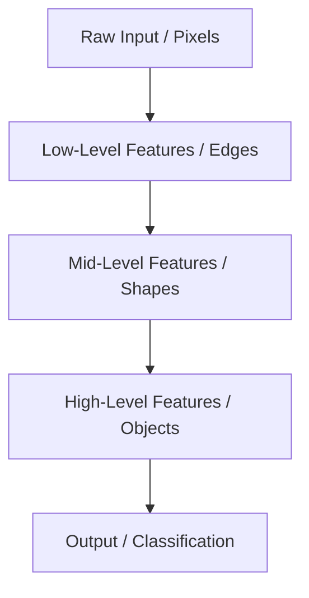
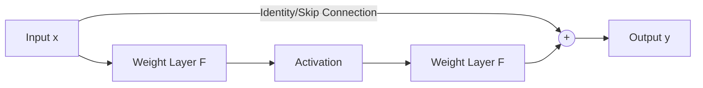

- [1 - Motivation and Definitions](#1---motivation-and-definitions)
  - [1.1 - The Need for Deep Architectures](#11---the-need-for-deep-architectures)
    - [Universal Function Approximation](#universal-function-approximation)
    - [Hierarchical Representation](#hierarchical-representation)
    - [Parameter Efficiency](#parameter-efficiency)
- [2 - Stability Challenges in Training](#2---stability-challenges-in-training)
  - [2.1 - The Vanishing Gradient Problem](#21---the-vanishing-gradient-problem)
    - [Mechanism](#mechanism)
    - [Consequence](#consequence)
    - [Visualisation](#visualisation)
    - [Example Calculation: The Generalised Delta Rule](#example-calculation-the-generalised-delta-rule)
  - [2.2 - The Exploding Gradient Problem](#22---the-exploding-gradient-problem)
    - [Mechanism](#mechanism-1)
    - [Consequence](#consequence-1)
    - [Instability](#instability)
    - [Example Calculation: Instability in Gradient Descent](#example-calculation-instability-in-gradient-descent)
- [3 - Architectural \& Algorithmic Solutions](#3---architectural--algorithmic-solutions)
  - [3.1 - Advanced Activation Functions](#31---advanced-activation-functions)
    - [Rectified Linear Unit (ReLU)](#rectified-linear-unit-relu)
    - [Leaky ReLU (LReLU)](#leaky-relu-lrelu)
    - [Parametric ReLU (PReLU)](#parametric-relu-prelu)
    - [Softplus](#softplus)
    - [Example Calculation: Computing Activation Outputs](#example-calculation-computing-activation-outputs)
  - [3.2 - Weight Initialisation Strategies](#32---weight-initialisation-strategies)
    - [The Goal](#the-goal)
    - [Xavier (Glorot) Initialisation](#xavier-glorot-initialisation)
    - [He (Kaiming) Initialisation](#he-kaiming-initialisation)
  - [3.3 - Batch Normalisation](#33---batch-normalisation)
    - [Covariate Shift](#covariate-shift)
    - [The Algorithm](#the-algorithm)
    - [Computational Example: Batch Normalisation](#computational-example-batch-normalisation)
  - [3.4 - Skip Connections (Residual Learning)](#34---skip-connections-residual-learning)
    - [Concept](#concept)
    - [Function](#function)
- [4 - Optimisation and Training Dynamics](#4---optimisation-and-training-dynamics)
  - [4.1 - Limitations of Standard Gradient Descent](#41---limitations-of-standard-gradient-descent)
    - [Error Surface Topology](#error-surface-topology)
    - [Oscillation](#oscillation)
  - [4.2 - Adaptive Optimisation Algorithms](#42---adaptive-optimisation-algorithms)
    - [Momentum](#momentum)
    - [Adaptive Learning Rates](#adaptive-learning-rates)
- [5 - Generalisation and Regularisation](#5---generalisation-and-regularisation)
  - [5.1 - Explicit Regularisation Techniques](#51---explicit-regularisation-techniques)
    - [Dropout](#dropout)
    - [Weight Decay](#weight-decay)
    - [Early Stopping](#early-stopping)
  - [5.2 - Data-Driven Regularisation](#52---data-driven-regularisation)
    - [Data Augmentation](#data-augmentation)
    - [Transfer Learning](#transfer-learning)
    - [Example Scenario: Choosing Augmentation Strategies](#example-scenario-choosing-augmentation-strategies)
  - [5.3 - Adversarial Robustness](#53---adversarial-robustness)
    - [Adversarial Examples](#adversarial-examples)
    - [Implication](#implication)

# 1 - Motivation and Definitions

## 1.1 - The Need for Deep Architectures

### Universal Function Approximation

A shallow network is typically defined as a neural network with three or fewer layers; in contrast, a deep network contains more than three layers. A neural network with a single hidden layer is theoretically capable of approximating any continuous non-linear function. This concept is known as the Universal Function Approximation property.

However, there is a practical limitation. To approximate complex functions arbitrarily well, a shallow network must be extremely "wide"; it requires a vast number of neurons in that single hidden layer. This results in a massive increase in the number of parameters. Such wide networks tend to memorise the training data rather than learning the underlying rules; consequently, they often fail to generalise to new, unseen data.

[Image of neural network width vs depth]

### Hierarchical Representation

Deep neural networks are designed to model the hierarchical structure found in natural data. Deep learning allows the computer to learn complicated concepts by building them out of simpler ones. The network learns feature hierarchies where features at higher levels are composed of low-level features.

[slides05\_deep\_discriminative\_NNs\_repaired\_compressed.pdf: 2: Visual examples of hierarchical features in image recognition, moving from raw pixels to animal faces]

This abstraction process mimics various cognitive tasks:

  * **Image Recognition:** Pixels $\rightarrow$ Edges $\rightarrow$ Contours $\rightarrow$ Parts $\rightarrow$ Objects.
  * **Text Recognition:** Characters $\rightarrow$ Words $\rightarrow$ Clauses $\rightarrow$ Sentences $\rightarrow$ Stories.
  * **Speech Recognition:** Sounds $\rightarrow$ Phones $\rightarrow$ Phonemes $\rightarrow$ Words.

We can visualise this flow of abstraction using the following diagram:

### Parameter Efficiency

Deep networks achieve parameter efficiency by stacking layers. They can perform complex mappings with significantly fewer parameters than a wide network would require to achieve the same level of performance.

This efficiency occurs because deep networks capture the natural hierarchy of the task. They avoid the redundancy found in wide networks. Furthermore, deep architectures are necessary for processing sequential data. Recurrent Neural Networks (RNNs) process temporal information; when trained, they are "unfolded" over time. This unfolding process results in a structure equivalent to a very deep network with one layer for each time step.

# 2 - Stability Challenges in Training

## 2.1 - The Vanishing Gradient Problem

### Mechanism

In deep networks, the gradient is calculated using the chain rule, which involves multiplying the derivatives of the activation functions from the output layer back to the input layer. If we consider a simple network where each neuron passes its input through an activation function $\varphi$ and a weight $w$, the gradient for an early layer weight involves a product of terms like $\varphi'(net) \cdot w$.
If the activation function is a sigmoid or tanh, its derivative $\varphi'$ is often less than 1. If weights are also initialised to be small ($<1$), this product decays exponentially as it propagates backward through the layers (e.g., $0.5 \times 0.5 \times 0.5 \dots$).

### Consequence

The result of this decay is that the gradients for weights in the earlier layers become vanishingly small. Consequently, these early layers learn extremely slowly or stop learning altogether. The earlier layers, which are responsible for extracting low-level features, remain stuck at their random initialisation values. The network effectively behaves like a shallow network, as only the later layers are being trained effectively.

### Visualisation

This issue is closely tied to the properties of saturation in activation functions. For the sigmoid function, the derivative is $\sigma(x)(1-\sigma(x))$, which has a maximum value of 0.25 (at $x=0$). For any input far from zero, the derivative is close to 0. This "saturation" ensures that the gradient signal is attenuated at every layer.

### Example Calculation: The Generalised Delta Rule

The following exercise demonstrates how the gradient (and thus the weight update) depends on the derivative of the activation function. Even in a single layer, if the neuron saturates, the update becomes tiny.

**Question:**
Consider the following set of training data:

| $x_2$ | $x_1$ | desired output |
| :---- | :---- | :------------- |
| 1     | 2     | 1              |
| 3     | 1     | 0              |
| 1     | 1     | 1              |
| 0     | 2     | 0              |

Train the perceptron for one epoch using the generalised delta rule and stochastic gradient descent. Your perceptron should have initial weights $w_1 = 1$ and $w_2 = 2$ bias 1. For this you will need to use the sigmoid transfer function:
$g(s) = \frac{1}{1 + e^{-s}}$
Set the learning rate to 0.5. (Note: Only the first example calculation is shown below to demonstrate the mechanism).

**Solution Walkthrough:**

1.  **Identify Parameters**

      * Initial weights: $w_0 = 1$ (bias), $w_1 = 1$, $w_2 = 2$.
      * Learning rate: $\alpha = 0.5$.
      * First training example: $x_0 = 1$ (bias input), $x_1 = 1$, $x_2 = 2$. Target $t = 1$.
      * Update Rule (Generalised Delta Rule): $w_i \leftarrow w_i + \alpha (t - g(s)) g'(s) x_i$ where $g'(s) = g(s)(1 - g(s))$.

2.  **Calculate Weighted Sum ($s$)**
    Compute the linear combination of inputs and weights:
    $$s = \sum w_i x_i = (w_0 \cdot x_0) + (w_1 \cdot x_1) + (w_2 \cdot x_2)$$
    $$s = (1 \cdot 1) + (1 \cdot 1) + (2 \cdot 2) = 1 + 1 + 4 = 6$$

3.  **Calculate Activation ($g(s)$)**
    Apply the sigmoid function:
    $$g(6) = \frac{1}{1 + e^{-6}} \approx 0.998$$

4.  **Calculate the Gradient Term**
    The term responsible for the "vanishing" effect is the derivative $g'(s) = g(s)(1 - g(s))$.
    $$g'(6) = 0.998 \times (1 - 0.998) = 0.998 \times 0.002 \approx 0.002$$
    Notice how small this value is\! Because the neuron is "saturated" (output is close to 1), the derivative is tiny.

5.  **Update Weights**
    Calculate the update for the bias weight $w_0$:
    $$w_0 \leftarrow w_0 + \alpha (t - g(s)) g'(s) x_0$$
    Given Target $t=1$:
    $$w_0 \leftarrow 1 + 0.5 \times (1 - 0.998) \times 0.002 \times 1$$
    $$w_0 \leftarrow 1 + 0.5 \times (0.002) \times 0.002$$
    $$w_0 \leftarrow 1 + 0.000002$$
    $$w_0 = 1.000002$$

    **Observation:** Despite the error being small ($1 - 0.998 = 0.002$), the weight update is infinitesimal ($2 \times 10^{-6}$). In a deep network, multiplying this small derivative ($0.002$) by other small derivatives from deeper layers would result in a gradient effectively equal to zero. This demonstrates the vanishing gradient mechanism.

## 2.2 - The Exploding Gradient Problem

### Mechanism

In deep networks, if weights are initialised to be large ($w > 1$) and the derivatives of the activation function are also greater than 1, the product of these terms in the chain rule grows exponentially as it propagates backwards. This is the inverse of the vanishing gradient problem. The error signal accumulates and amplifies at each step.

### Consequence

The gradients in the early layers become excessively large. When these massive gradients are applied during the weight update step, they cause the weights to change drastically and randomly. This can destroy any useful features the network has already learned. The network becomes unstable, and the weights may grow so large that they cause numerical overflow (NaN values).

### Instability

The most immediate symptom of exploding gradients is instability in the training process. The cost function does not decrease smoothly; instead, it oscillates wildly or diverges completely. The large steps taken in the weight space mean the optimiser overshoots the minima, bouncing back and forth across the error surface.

### Example Calculation: Instability in Gradient Descent

The following exercise demonstrates how large error signals (similar to those caused by exploding gradients) can cause weights to oscillate and grow uncontrollably, leading to instability.

**Question:**
Train the perceptron for one epoch using the delta rule and stochastic gradient descent.
The perceptron should have initial weights $w_1=1$ and $w_2=2$ and bias 1 (so $w_0=1$).
Use a learning rate of 0.5.
The set of training data is:

| $x_2$ | $x_1$ | desired output |
| :---- | :---- | :------------- |
| 1     | 2     | 1              |
| 3     | 1     | 0              |
| 1     | 1     | 1              |
| 0     | 2     | 0              |

(Note: For the calculation, we treat the first column as $x_1$ and the second as $x_2$ to align with the standard provided solution).

**Solution Walkthrough:**

The update rule for the Delta rule is:
$w_i \leftarrow w_i + \alpha (t - s) x_i$
where $s$ is the weighted sum $s = \sum w_i x_i$. Note that unlike the error-correction rule, we compare the target $t$ directly with the weighted sum $s$, not the thresholded output. This can lead to large updates if $s$ is far from $t$.

**1. First Example**
Input: $x_0=1, x_1=1, x_2=2$. Target $t=1$.
Calculate weighted sum $s$:
$$s = (1 \times 1) + (1 \times 1) + (2 \times 2) = 1 + 1 + 4 = 6$$
Update weights:
$$w_0 \leftarrow 1 + 0.5(1 - 6) \times 1 = 1 + (-2.5) = -1.5$$
$$w_1 \leftarrow 1 + 0.5(1 - 6) \times 1 = 1 + (-2.5) = -1.5$$
$$w_2 \leftarrow 2 + 0.5(1 - 6) \times 2 = 2 + (-5) = -3$$
*Current weights:* $w_0 = -1.5, w_1 = -1.5, w_2 = -3$

**2. Second Example**
Input: $x_0=1, x_1=3, x_2=1$. Target $t=0$.
Calculate weighted sum $s$:
$$s = (-1.5 \times 1) + (-1.5 \times 3) + (-3 \times 1) = -1.5 - 4.5 - 3 = -9$$
Update weights:
$$w_0 \leftarrow -1.5 + 0.5(0 - (-9)) \times 1 = -1.5 + 4.5 = 3$$
$$w_1 \leftarrow -1.5 + 0.5(0 - (-9)) \times 3 = -1.5 + 13.5 = 12$$
$$w_2 \leftarrow -3 + 0.5(0 - (-9)) \times 1 = -3 + 4.5 = 1.5$$
*Current weights:* $w_0 = 3, w_1 = 12, w_2 = 1.5$
*Observation:* Notice the massive swing in $w_1$ from -1.5 to 12. This instability is characteristic of large gradients.

**3. Third Example**
Input: $x_0=1, x_1=1, x_2=1$. Target $t=1$.
Calculate weighted sum $s$:
$$s = (3 \times 1) + (12 \times 1) + (1.5 \times 1) = 3 + 12 + 1.5 = 16.5$$
Update weights:
$$w_0 \leftarrow 3 + 0.5(1 - 16.5) \times 1 = 3 - 7.75 = -4.75$$
$$w_1 \leftarrow 12 + 0.5(1 - 16.5) \times 1 = 12 - 7.75 = 4.25$$
$$w_2 \leftarrow 1.5 + 0.5(1 - 16.5) \times 1 = 1.5 - 7.75 = -6.25$$
*Current weights:* $w_0 = -4.75, w_1 = 4.25, w_2 = -6.25$

**4. Fourth Example**
Input: $x_0=1, x_1=2, x_2=0$. Target $t=0$.
Calculate weighted sum $s$:
$$s = (-4.75 \times 1) + (4.25 \times 2) + (-6.25 \times 0) = -4.75 + 8.5 = 3.75$$
Update weights:
$$w_0 \leftarrow -4.75 + 0.5(0 - 3.75) \times 1 = -4.75 - 1.875 = -6.625$$
$$w_1 \leftarrow 4.25 + 0.5(0 - 3.75) \times 2 = 4.25 - 3.75 = 0.5$$
$$w_2 \leftarrow -6.25 + 0.5(0 - 3.75) \times 0 = -6.25$$
*Final weights:* $w_0 = -6.625, w_1 = 0.5, w_2 = -6.25$

**Conclusion:** The weights oscillated wildly (e.g., $w_1$: $1 \rightarrow -1.5 \rightarrow 12 \rightarrow 4.25 \rightarrow 0.5$) because the error term $(t-s)$ was large. In deep networks, exploding gradients cause similar behaviour but on a much larger scale, preventing convergence.

# 3 - Architectural & Algorithmic Solutions

## 3.1 - Advanced Activation Functions

### Rectified Linear Unit (ReLU)

The ReLU function is defined as $\varphi(x) = \max(0, x)$. It outputs the input directly if it is positive, and outputs zero otherwise. This simple function solves the vanishing gradient problem effectively. For positive inputs, the derivative is always 1. This means gradients do not decay as they propagate back through layers, unlike the sigmoid function where derivatives are always less than 0.25.

### Leaky ReLU (LReLU)

A potential issue with standard ReLU is the "dying ReLU" problem. If a neuron enters a state where its input is always negative, its output and gradient will be zero. The weights will never update, and the neuron effectively dies.
Leaky ReLU fixes this by allowing a small, non-zero gradient when the input is negative.
The function is defined as:
$$\varphi(x) = \begin{cases} x & \text{if } x \ge 0 \\ \alpha x & \text{if } x < 0 \end{cases}$$
Here, $\alpha$ is a small constant (e.g., 0.01 or 0.1) that is fixed for all neurons.

### Parametric ReLU (PReLU)

PReLU extends Leaky ReLU by making the slope of the negative part a learnable parameter rather than a fixed constant.
$$\varphi(x) = \begin{cases} x & \text{if } x \ge 0 \\ a_j x & \text{if } x < 0 \end{cases}$$
The parameter $a_j$ is learnt via backpropagation along with the network weights. This allows the network to adapt the activation shape to the data.

### Softplus

Softplus is a smooth approximation of the ReLU function. It is defined as $\varphi(x) = \ln(1 + e^x)$. While ReLU has a sharp corner at zero, Softplus is differentiable everywhere.

### Example Calculation: Computing Activation Outputs

The following exercise walks through applying these different functions to a feature map (a matrix of neuron outputs).

**Question:**
The following array shows the output produced by a mask in a convolutional layer of a convolutional neural network (CNN)
$$net_{j} = \begin{bmatrix} 1 & 0.5 & 0.2 \\ -1 & -0.5 & -0.2 \\ 0.1 & -0.1 & 0 \end{bmatrix}$$
Calculate the values produced by the application of the following activation functions
i) ReLU,
ii) LReLU when $a=0.1$,
iii) tanh,
iv) heaviside function with threshold 0.1 for each neuron (define $H(0)=0.5$).

**Solution Walkthrough:**

We apply each function element-wise to the matrix $net_j$.

**i) ReLU**
Formula: $\max(0, x)$.

  * **Positive elements** ($1, 0.5, 0.2, 0.1$) remain unchanged.
  * **Negative elements** ($-1, -0.5, -0.2, -0.1$) become $0$.
  * **Zero** remains $0$.

$$\text{ReLU output} = \begin{bmatrix} 1 & 0.5 & 0.2 \\ 0 & 0 & 0 \\ 0.1 & 0 & 0 \end{bmatrix}$$

**ii) LReLU (with $a=0.1$)**
Formula: $x$ if $x \ge 0$, else $0.1x$.

  * **Positive elements** remain unchanged (same as ReLU).
  * **Negative elements** are multiplied by 0.1.
      * $-1 \rightarrow -0.1$
      * $-0.5 \rightarrow -0.05$
      * $-0.2 \rightarrow -0.02$
      * $-0.1 \rightarrow -0.01$

$$\text{LReLU output} = \begin{bmatrix} 1 & 0.5 & 0.2 \\ -0.1 & -0.05 & -0.02 \\ 0.1 & -0.01 & 0 \end{bmatrix}$$

**iii) Tanh**
Formula: $\tanh(x) = \frac{e^x - e^{-x}}{e^x + e^{-x}}$. This squashes values between -1 and 1.

  * $\tanh(1) \approx 0.7616$
  * $\tanh(0.5) \approx 0.4621$
  * $\tanh(-1) = -\tanh(1) \approx -0.7616$
  * $\tanh(0) = 0$

$$\text{Tanh output} \approx \begin{bmatrix} 0.7616 & 0.4621 & 0.1974 \\ -0.7616 & -0.4621 & -0.1974 \\ 0.0997 & -0.0997 & 0 \end{bmatrix}$$

**iv) Heaviside Function**
The question specifies a threshold of 0.1.
Condition: If input $\ge 0.1$, output 1. If input $< 0.1$, output 0.
(Technically we evaluate $H(x - \text{threshold})$. Since $H(0)=0.5$, if $x=0.1$, output is 0.5).

* **Values \> 0.1:**
    * $1, 0.5, 0.2$ become **1**.
* **Values \< 0.1:**
    * $-1, -0.5, -0.2, 0, -0.1$ become **0**.
* **Values = 0.1:**
    * The element $0.1$ satisfies the threshold exactly. $H(0.1 - 0.1) = H(0) = 0.5$.

$$\text{Heaviside output} = \begin{bmatrix} 1 & 1 & 1 \\ 0 & 0 & 0 \\ 0.5 & 0 & 0 \end{bmatrix}$$

## 3.2 - Weight Initialisation Strategies

### The Goal

The primary objective of weight initialisation is to maintain a stable signal variance as data propagates through the network layers. This helps prevent the vanishing or exploding gradient problems during training.

### Xavier (Glorot) Initialisation

This method is optimised for layers using **Sigmoid** or **Tanh** activation functions.

  * **Normal Distribution:** Weights are sampled from $N(0, \sigma)$, where the standard deviation is $\sqrt{\frac{2}{m+n}}$ ($m$ inputs, $n$ outputs).
  * **Uniform Distribution:** Weights are sampled from the range $(-\sqrt{\frac{6}{m+n}}, \sqrt{\frac{6}{m+n}})$.

### He (Kaiming) Initialisation

This strategy is specifically designed for networks using **ReLU**, **LReLU**, or **PReLU** activation functions.

  * **Normal Distribution:** Weights are sampled from $N(0, \sigma)$, where the standard deviation is $\sqrt{\frac{2}{m}}$.
  * **Uniform Distribution:** Weights are sampled from the range $(-\sqrt{\frac{6}{m}}, \sqrt{\frac{6}{m}})$.

## 3.3 - Batch Normalisation

### Covariate Shift

Training a neural network changes the weights of the earlier layers. This inevitably alters the statistical distribution of the inputs received by the subsequent layers. The later layers must constantly adapt to these shifting input distributions, a phenomenon known as "Internal Covariate Shift". This continuous adaptation slows down the training process significantly.
[slides05\_deep\_discriminative\_NNs\_repaired\_compressed.pdf: 16: Illustration showing how weight updates change the distribution of outputs for the next layer]

### The Algorithm

Batch Normalisation (BN) addresses this problem by explicitly re-centring and re-scaling layer inputs. For a specific neuron, the algorithm normalises its output $x$ across a mini-batch to have a mean of 0 and a variance of 1. It then applies a learnable scale ($\gamma$) and shift ($\beta$) to allow the network to restore the representation power if necessary.
The formula is:
$$BN(x) = \beta + \gamma \frac{x - E(x)}{\sqrt{Var(x) + \epsilon}}$$
Here, $E(x)$ is the mean of the batch, $Var(x)$ is the variance of the batch, and $\epsilon$ is a small constant added for numerical stability to prevent division by zero.
[slides05\_deep\_discriminative\_NNs\_repaired\_compressed.pdf: 17: Diagrams showing distribution of neuron activations before and after normalization]

### Computational Example: Batch Normalisation

**Question:**
The following arrays show the output produced by a convolutional layer to all 4 samples in a batch:
$$X_{1}=\begin{bmatrix}1&0.5&0.2\\ -1&-0.5&-0.2\\ 0.1&-0.1&0\end{bmatrix} \quad X_{2}=\begin{bmatrix}1&-1&0.1\\ 0.5&-0.5&-0.1\\ 0.2&-0.2&0\end{bmatrix}$$
$$X_{3}=\begin{bmatrix}0.5&-0.5&-0.1\\ 0&-0.4&0\\ 0.5&0.5&0.2\end{bmatrix} \quad X_{4}=\begin{bmatrix}0.2&1&-0.2\\ -1&-0.6&-0.1\\ 0.1&0&0.1\end{bmatrix}$$

Calculate the corresponding outputs produced after the application of batch normalisation, assuming the following parameter values $\beta=0$, $\gamma=1$, and $\epsilon=0.1$ which are the same for all neurons.

**Solution Walkthrough:**

Batch normalisation is applied independently to each neuron position across the entire batch. We will demonstrate the calculation for the **top-left neuron** (position 1,1).

**Step 1: Collect values for the neuron across the batch**
Extract the value at position (1,1) from each sample matrix ($X_1$ to $X_4$):

  * $x^{(1)} = 1$ (from $X_1$)
  * $x^{(2)} = 1$ (from $X_2$)
  * $x^{(3)} = 0.5$ (from $X_3$)
  * $x^{(4)} = 0.2$ (from $X_4$)

**Step 2: Calculate the Batch Mean ($E(x)$)**
Sum the values and divide by the batch size ($N=4$).
$$E(x) = \frac{1 + 1 + 0.5 + 0.2}{4} = \frac{2.7}{4} = 0.675$$

**Step 3: Calculate the Batch Variance ($Var(x)$)**
Calculate the average of the squared differences from the mean.
$$Var(x) = \frac{1}{4} \sum (x^{(i)} - 0.675)^2$$

  * $(1 - 0.675)^2 = 0.325^2 \approx 0.1056$
  * $(1 - 0.675)^2 = 0.325^2 \approx 0.1056$
  * $(0.5 - 0.675)^2 = (-0.175)^2 \approx 0.0306$
  * $(0.2 - 0.675)^2 = (-0.475)^2 \approx 0.2256$

Summing these gives $\approx 0.4674$.
$$Var(x) = \frac{0.4674}{4} \approx 0.1169$$

**Step 4: Apply the Normalisation Formula**
Use the formula $BN(x) = \beta + \gamma \frac{x - E(x)}{\sqrt{Var(x) + \epsilon}}$.
We are given $\beta = 0, \gamma = 1, \epsilon = 0.1$:
$$BN(x) = \frac{x - 0.675}{\sqrt{0.1169 + 0.1}} = \frac{x - 0.675}{\sqrt{0.2169}} \approx \frac{x - 0.675}{0.4657}$$

Now, calculate the normalised output for each sample at this position:

  * **Samples 1 & 2 ($x=1$):**
    $$BN(1) = \frac{1 - 0.675}{0.4657} = \frac{0.325}{0.4657} \approx 0.6979$$
  * **Sample 3 ($x=0.5$):**
    $$BN(0.5) = \frac{0.5 - 0.675}{0.4657} = \frac{-0.175}{0.4657} \approx -0.3758$$
  * **Sample 4 ($x=0.2$):**
    $$BN(0.2) = \frac{0.2 - 0.675}{0.4657} = \frac{-0.475}{0.4657} \approx -1.0200$$

These values represent the new top-left elements for the four output matrices. The same process is repeated for every other position in the grid.

**Final Result (for $X_1$):**
Using similar calculations for all other positions, the batch-normalised matrix for the first sample is:
$$BN(X_{1}) \approx \begin{bmatrix}0.6979&0.5872&0.5657\\ -0.8652&0&-0.3086\\ -0.3509&-0.3612&-0.2294\end{bmatrix}$$

## 3.4 - Skip Connections (Residual Learning)

### Concept

Skip connections are connections that bypass one or more layers of the network. They allow gradients to flow through the network unchanged, effectively creating a "highway" for gradients. This lets the gradient bypass parts of the network where it might otherwise vanish. This mechanism stabilises learning and helps training in very deep networks.

### Function

This structure is often referred to as a residual module. Instead of learning a direct mapping, the layers learn a residual function $F(x)$. The final output is the sum of this residual and the original input: $y = F(x) + x$. Effectively, the network becomes shallower during the early phases of training, which simplifies the optimisation process.

# 4 - Optimisation and Training Dynamics

## 4.1 - Limitations of Standard Gradient Descent

### Error Surface Topology

Standard backpropagation performs gradient descent to minimise a cost function $J(w)$. However, the "surface" of this error function is complex and presents several obstacles.

  * **Plateaus:** These are flat regions where the gradient is very close to zero ($\frac{\partial J}{\partial w} \approx 0$). The algorithm makes extremely slow progress here because the weight updates are proportional to the gradient.
  * **Saddle Points:** These are points where the gradient is zero. However, the point is a minimum in one direction but a maximum in another. The algorithm can get stuck here as if it were a solution.
  * **Local Minima:** The algorithm may descend into a valley that is not the lowest possible point (global minimum). Because the gradient is zero at the bottom of this local valley, the algorithm stops updating and fails to find the best solution.

[slides05\_deep\_discriminative\_NNs\_repaired\_compressed.pdf: 15: Illustration of gradient descent struggling with plateaus, saddle points, and local minima]

### Oscillation

This issue often stems from using a fixed learning rate that is too large.

  * In steep regions of the error surface, the gradient is large.
  * If the step size is proportional to this gradient, the algorithm takes a massive step.
  * This causes the update to overshoot the minimum and land on the opposite side of the valley.
  * The algorithm effectively bounces back and forth (oscillates) rather than converging smoothly to the bottom.

## 4.2 - Adaptive Optimisation Algorithms

### Momentum

Standard gradient descent can struggle with local minima and plateaus. Momentum addresses this by keeping track of the weight updates from the previous iteration. It adds a moving average of the previous gradient to the current gradient.

  * **Mechanism:** The update rule becomes $\Delta w_{j}(n)=\alpha h_{j}\Delta+\mu\Delta_{w_{j}}(n-1)$, where $\mu$ is the momentum term.
  * **Benefit:** This accumulates a "velocity" vector. It increases the step size when weight changes are consistently in the same direction, helping the algorithm move quickly across plateaus. Crucially, it helps the optimisation process "roll over" small local minima rather than getting stuck. It also dampens the oscillations caused by steep gradients.

### Adaptive Learning Rates

Selecting a single fixed learning rate is difficult; a rate that is too low leads to slow convergence, while a rate that is too high causes oscillation and failure to find the optimum. Adaptive algorithms vary the learning rate for individual parameters during training.

  * **AdaGrad & RMSprop:** These algorithms automatically adjust the learning rate based on historical gradients. They effectively increase the rate if the cost is decreasing smoothly and decrease it if the cost is increasing or oscillating.
  * **Adam (Adaptive Moment Estimation):** This is a popular algorithm that combines the benefits of both approaches. It uses adaptive learning rates (like RMSprop) and momentum.

# 5 - Generalisation and Regularisation

## 5.1 - Explicit Regularisation Techniques

### Dropout

Dropout is a highly effective method for regularisation. During the training phase, the algorithm randomly selects a fraction of neurons at each iteration and sets their activation to zero. This process forces random "sub-networks" to learn how to classify samples correctly. Consequently, the network cannot rely on individual neurons to recognise specific features; this forces redundancy and improves generalisation. During the usage or testing phase, all neurons behave normally.

### Weight Decay

Weight decay prevents overfitting by penalising the model complexity. This method involves decreasing each weight by a small factor during every training iteration. This keeps the weights small and prevents them from growing too large to fit noise in the training data.

### Early Stopping

This technique uses a validation data set in addition to the training and test sets. The network trains on the training data; however, the algorithm monitors the error on the validation data after each epoch. Training stops when the performance on the validation model has not improved for a set number of epochs. The system returns the set of weights that achieved the best performance on the validation set rather than the final weights from the training set.

## 5.2 - Data-Driven Regularisation

### Data Augmentation

Deep neural networks require large volumes of data to learn effectively and avoid overfitting. Data augmentation is a technique used to artificially expand the training dataset by creating new samples from existing ones. This is achieved by applying "class-preserving" transformations—changes that alter the appearance of the image without changing its underlying label. Common transformations include rescaling, horizontal flips, random rotations, and cropping.

### Transfer Learning

Transfer learning is a strategy used when the target dataset is small or when computational resources are limited. Instead of training a network from scratch with random weights, a model pre-trained on a very large dataset (such as ImageNet) is used as a starting point. The pre-trained weights act as robust feature extractors, allowing the network to be fine-tuned for a new, specific task with fewer training epochs.

### Example Scenario: Choosing Augmentation Strategies

The following exercise evaluates the appropriateness of different augmentation techniques for specific datasets (Handwritten digits vs. Clothing items).

**Question:**
The following images show exemplars from two datasets.

Figure 1: MNIST (left) and FashionMNIST (right).

Each dataset is to be expanded using data augmentation. Which of the following transformations are appropriate:
i) rescaling
ii) horizontal flip
iii) rotation
iv) cropping.

**Solution Walkthrough:**

To determine if a transformation is appropriate, we must check if it is "class-preserving". Does the transformation change the label of the image?

**i) Rescaling**

  * **MNIST (Digits):** Making a digit larger or smaller does not change its identity (a small '7' is still a '7'). **Yes.**
  * **FashionMNIST (Clothing):** A resized image of a shoe remains a shoe. **Yes.**

**ii) Horizontal Flip**

  * **MNIST (Digits):** Digits are not horizontally symmetric. Flipping a '5' creates a non-existent character; flipping a '2' creates a backwards '2'. This destroys the class information. **No.**
  * **FashionMNIST (Clothing):** Clothing items often have horizontal symmetry, or at least remain recognisable. A left-facing shoe flipped becomes a right-facing shoe; it is still a shoe. **Yes.**

**iii) Rotation**

  * **MNIST (Digits):** Large rotations can be dangerous (e.g., rotating a '6' 180 degrees creates a '9'). However, small random rotations are acceptable to simulate handwriting variance. **Small rotations are OK.**
  * **FashionMNIST (Clothing):** If the goal is to recognise clothing in any orientation (e.g., laundry), rotation is valid. **Yes.**

**iv) Cropping**

  * **MNIST (Digits):** Removing border pixels is standard. As long as the core shape of the digit remains, the class is preserved. **Yes.**
  * **FashionMNIST (Clothing):** Cropping is a standard technique to force the network to focus on specific features rather than the whole outline. **Yes.**

**Summary Table:**

| Transformation          | MNIST                       | FashionMNIST                                                      |
| :---------------------- | :-------------------------- | :---------------------------------------------------------------- |
| **i) Rescaling**        | Yes                         | Yes                                                               |
| **ii) Horizontal Flip** | No                          | Yes                                                               |
| **iii) Rotation**       | Small rotations would be ok | Yes (if we want the classifier to recognise up-side-down clothes) |
| **iv) Cropping**        | Yes                         | Yes (assuming objects remain recognisable after crop)             |

## 5.3 - Adversarial Robustness

### Adversarial Examples

Deep neural networks can produce excellent results on test data but still fail to generalise in specific ways. An adversarial example is an input that has been manipulated—often by adding small, imperceptible changes to the pixel values—so that it is wrongly classified with high confidence. For example, adding a specific pattern of noise to an image of a Giant Panda can cause the network to classify it as a Goldfish or Gibbon, even though the image looks unchanged to a human eye.

### Implication

These examples show that deep networks learn to recognise objects differently from human vision. They may rely on textures or specific pixel configurations rather than the shape or concept of the object. This poses significant security risks in real-world applications. For instance, modifying a physical Stop sign with stickers can trick an autonomous driving system into classifying it as a speed limit sign.

