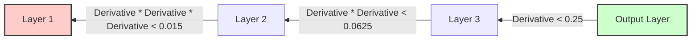
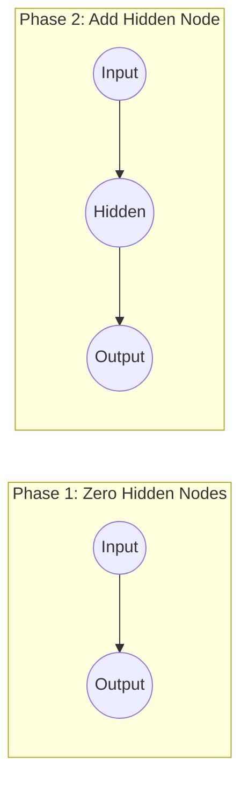

- [1 - The Challenge of Depth in Neural Networks](#1---the-challenge-of-depth-in-neural-networks)
  - [1.1 - Defining Deep Neural Networks](#11---defining-deep-neural-networks)
  - [1.2 - The Vanishing Gradient Problem](#12---the-vanishing-gradient-problem)
    - [1.2.1 - Mechanics of Backward Propagation in Deep Layers](#121---mechanics-of-backward-propagation-in-deep-layers)
    - [1.2.2 - Mathematical Analysis of the Sigmoid Derivative](#122---mathematical-analysis-of-the-sigmoid-derivative)
    - [1.2.3 - Impact of Chain Rule Multiplication on Weight Updates](#123---impact-of-chain-rule-multiplication-on-weight-updates)
  - [1.3 - The Rectified Linear Unit (ReLU) Solution](#13---the-rectified-linear-unit-relu-solution)
    - [1.3.1 - Definition and Properties of ReLU](#131---definition-and-properties-of-relu)
    - [1.3.2 - Mitigating Vanishing Gradients](#132---mitigating-vanishing-gradients)
    - [1.3.3 - Illustrative Computation: ReLU vs. Sigmoid Gradient Flow](#133---illustrative-computation-relu-vs-sigmoid-gradient-flow)
- [2 - Advanced Activation and Selection Mechanisms](#2---advanced-activation-and-selection-mechanisms)
  - [2.1 - Competitive Learning Principles](#21---competitive-learning-principles)
  - [2.2 - Winner-Takes-All (WTA) and k-WTA Activations](#22---winner-takes-all-wta-and-k-wta-activations)
  - [2.3 - Softmax Activation Function](#23---softmax-activation-function)
    - [2.3.1 - Probabilistic Interpretation of Outputs](#231---probabilistic-interpretation-of-outputs)
    - [2.3.2 - Calculation of Softmax Activations](#232---calculation-of-softmax-activations)
- [3 - Negative Feedback and Iterative Activation](#3---negative-feedback-and-iterative-activation)
  - [3.1 - Architecture of Negative Feedback Networks](#31---architecture-of-negative-feedback-networks)
  - [3.2 - Iterative Updates for Input Reconstruction](#32---iterative-updates-for-input-reconstruction)
  - [3.3 - Regulatory Feedback (Divisive Input Modulation)](#33---regulatory-feedback-divisive-input-modulation)
  - [3.4 - Computational Examples of Feedback Iterations](#34---computational-examples-of-feedback-iterations)
- [4 - Autoencoders and Representation Learning](#4---autoencoders-and-representation-learning)
  - [4.1 - Architecture and the Information Bottleneck](#41---architecture-and-the-information-bottleneck)
  - [4.2 - Encoding and Decoding Weight Symmetry](#42---encoding-and-decoding-weight-symmetry)
  - [4.3 - Training via Reconstruction Error Minimization](#43---training-via-reconstruction-error-minimization)
  - [4.4 - De-noising Autoencoders](#44---de-noising-autoencoders)
  - [4.5 - Deep Belief Networks and Stacked Autoencoders](#45---deep-belief-networks-and-stacked-autoencoders)
- [5 - Practical Implementation and Design Strategies](#5---practical-implementation-and-design-strategies)
  - [5.1 - Data Pre-processing](#51---data-pre-processing)
    - [5.1.1 - Input and Output Encoding](#511---input-and-output-encoding)
    - [5.1.2 - Rescaling and Normalization Techniques](#512---rescaling-and-normalization-techniques)
  - [5.2 - Network Initialization and Structure](#52---network-initialization-and-structure)
    - [5.2.1 - Weight Initialization Strategies](#521---weight-initialization-strategies)
    - [5.2.2 - Dynamic Modification of Network Structure](#522---dynamic-modification-of-network-structure)
  - [5.3 - Advanced Regularization Techniques](#53---advanced-regularization-techniques)
    - [5.3.1 - Weight Decay](#531---weight-decay)
    - [5.3.2 - Limiting Hidden Nodes and Connections](#532---limiting-hidden-nodes-and-connections)
    - [5.3.3 - Training with Noise (De-noising)](#533---training-with-noise-de-noising)
- [6 - Current Issues and Environmental Considerations](#6---current-issues-and-environmental-considerations)
  - [6.1 - Computational Costs (CPUs/GPUs and Heat)](#61---computational-costs-cpusgpus-and-heat)
  - [6.2 - Data Requirements and Explainability](#62---data-requirements-and-explainability)
  - [6.3 - The Problem of Overfitting in Deep Architectures](#63---the-problem-of-overfitting-in-deep-architectures)

# 1 - The Challenge of Depth in Neural Networks

## 1.1 - Defining Deep Neural Networks

Deep learning is synonymous with deep neural networks; these are simply neural networks comprised of many layers. While standard networks typically rely on backpropagation to update weights by finding gradients, increasing the depth of the network introduces specific mathematical complications.

## 1.2 - The Vanishing Gradient Problem

A primary issue in deep learning is that gradients can vanish or explode as they propagate backward through the network. This phenomenon significantly hinders the training process in networks with many layers.

### 1.2.1 - Mechanics of Backward Propagation in Deep Layers

This issue stems from the fundamental mechanics of backpropagation. To calculate the derivatives for the initial layers (the layers closest to the input), we must multiply the derivatives of each subsequent layer. The calculation moves backward from the final output layer to the initial layer. Consequently, as the number of layers increases, the number of products required to update the weights also increases.

### 1.2.2 - Mathematical Analysis of the Sigmoid Derivative

To understand why multiplying derivatives causes values to vanish, we must analyze the activation function used in the network. Consider the sigmoid transfer function, which is commonly used in these architectures.

The sigmoid function is defined as:
$$g(s)=\frac{1}{1+e^{-s}}$$

Its derivative is calculated as:
$$\frac{\partial g(s)}{\partial s} = g(s)(1-g(s))$$

The maximum value of this derivative is only 0.25. This maximum occurs when $g(s)$ is 0.5 (when the input $s$ is 0); for any other input value, the derivative is even smaller.

**Example Computation: The Sigmoid Derivative**

The following example from your tutorial illustrates how the sigmoid derivative affects weight updates.

**Scenario:**
We have a perceptron using the sigmoid transfer function.

  * Learning rate ($\alpha$): 0.5
  * Initial weights: $w_{0}=1, w_{1}=1, w_{2}=2$
  * Input ($x$): $x_{0}=1$ (bias), $x_{1}=1, x_{2}=2$
  * Target ($t$): 1

**Step 1: Calculate the weighted sum ($s$)**
We calculate the sum of inputs multiplied by their weights.
$$s = \sum w_{i}x_{i}$$
$$s = (1 \times 1) + (1 \times 1) + (2 \times 2)$$
$$s = 6$$

**Step 2: Calculate the transfer function output ($g(s)$)**
We pass $s$ through the sigmoid function.
$$g(6) = \frac{1}{1+e^{-6}} \approx 0.998$$

**Step 3: Calculate the weight update**
The update rule using the generalized delta rule (which includes the derivative) is:
$$w_{i} \leftarrow w_{i} + \alpha(t-g(s))g(s)(1-g(s))x_{i}$$

Substituting our values:
$$w_{0} \leftarrow 1 + 0.5 \times (1 - 0.998) \times 0.998 \times (1 - 0.998) \times 1$$
$$w_{0} \leftarrow 1 + 0.5 \times (0.002) \times 0.998 \times (0.002) \times 1$$
$$w_{0} \approx 1.000002$$

**Observation:**
Even though there is a small error ($t=1$ vs $g(s)=0.998$), the derivative term $g(s)(1-g(s))$ is extremely small (approx $0.002$). This results in a negligible weight change.

### 1.2.3 - Impact of Chain Rule Multiplication on Weight Updates

In a deep network, this effect is compounded. Because the derivative values are small (always less than 0.25 for sigmoid), multiplying many of them together via the chain rule results in a tiny number. If the gradients become very small, the updates to the weights become negligible. This effectively stops the initial layers of the network from learning features from the input data.

The following diagram visualizes how the gradient diminishes as it passes through layers:

Note: The values in the diagram assume the maximum possible derivative of the sigmoid function (0.25). In practice, values are usually much smaller.

## 1.3 - The Rectified Linear Unit (ReLU) Solution

### 1.3.1 - Definition and Properties of ReLU

To address the issues found in deep networks, a specific transfer function called the Rectifier transfer function is often used. The unit employing this function is known as a Rectified Linear Unit, or ReLU.

The mathematical definition of this function is simple:
$$ReLU(x) = max(0, x)$$

This function outputs the input directly if it is positive; otherwise, it outputs zero. Despite its linear appearance for positive values, it is a non-linear function.

### 1.3.2 - Mitigating Vanishing Gradients

The primary advantage of using ReLU in deep neural networks is that it helps prevent the vanishing gradient problem.

As discussed in the previous section, the derivative of the sigmoid function is always less than or equal to 0.25. When these small derivatives are multiplied through many layers via the chain rule, the gradient effectively disappears.
In contrast, the derivative of the ReLU function is 1 for all positive inputs. When gradients are propagated back through active ReLU units (where $x > 0$), they are multiplied by 1. This preserves the magnitude of the gradient, allowing weights in the initial layers of deep networks to be updated effectively.

### 1.3.3 - Illustrative Computation: ReLU vs. Sigmoid Gradient Flow

To visualize the impact, we can apply the same variables from the previous Sigmoid example to a ReLU unit.

**Scenario:**

  * Weighted sum ($s$): 6 (Same as the previous example)
  * Target ($t$): 1 (Note: ReLU outputs are not bounded to [0,1], so targets would typically be scaled differently, but we keep this for direct comparison of the derivative term).

**Step 1: Calculate the activation output**
$$g(s) = max(0, 6) = 6$$

**Step 2: Calculate the derivative**
For the ReLU function $g(s)$, the derivative $g'(s)$ is:

  * $1$ if $s > 0$
  * $0$ if $s \le 0$

Since our input $s = 6$ (which is $> 0$):
$$g'(6) = 1$$

**Step 3: Compare the Gradient Signal (Chain Rule Component)**
The weight update relies on the "error signal" term, which includes the derivative of the activation function.

  * Sigmoid Derivative term: $\approx 0.002$ (Vanished)
  * ReLU Derivative term: $1.0$ (Preserved)

**Conclusion:**
In a deep network with multiple layers, if we chain these derivatives together:

  * Sigmoid layer: $Error \times 0.25 \times 0.25 \times \dots$ (rapidly approaches zero).
  * ReLU layer: $Error \times 1 \times 1 \times \dots$ (error signal remains strong).

This computation demonstrates how ReLU units allow the error signal to travel back through the network without diminishing, enabling effective learning in deep architectures.

# 2 - Advanced Activation and Selection Mechanisms

## 2.1 - Competitive Learning Principles

In competitive learning networks, output units compete for the right to respond to the input. This competition implies that the activity of some neurons is suppressed by other neurons.

There are two primary ways to implement this competition:

  * **Inhibitory Lateral Weights:** Connections between output neurons inhibit each other; this often requires determining outputs iteratively.
  * **Selection Process:** A direct mechanism selects the "winning" neuron(s); this approach is generally simpler and more stable.

## 2.2 - Winner-Takes-All (WTA) and k-WTA Activations

The selection process can be implemented using specific activation functions that enforce competition.

  * **Winner-Takes-All (WTA):** The neuron with the largest response is the winner and remains active; all other neurons have their response set to zero. This is useful for clustering tasks.
  * **k-Winners-Take-All (kWTA):** A generalization where the $k$ neurons with the largest responses remain active, while the rest are set to zero.

**Example Computation: Selection Processes**
The following example demonstrates how raw neuron outputs are transformed by these selection mechanisms.

**Scenario:**
We have a layer of 3 neurons. Based on the current input and weights, they produce the following pre-selection response values:

  * Neuron A: $0.34$
  * Neuron B: $0.73$
  * Neuron C: $-0.61$

**Case 1: Winner-Takes-All (WTA)**
We identify the maximum value and suppress the others.
Identify Max: $max(0.34, 0.73, -0.61) = 0.73$ (Neuron B).

Apply Selection:

  * Neuron A ($0.34 < 0.73$): Output becomes $0$.
  * Neuron B ($0.73 = 0.73$): Output remains $0.73$.
  * Neuron C ($-0.61 < 0.73$): Output becomes $0$.

Final Output: $[0, 0.73, 0]$

**Case 2: k-Winners-Take-All (with k=2)**
We identify the top 2 values and suppress the rest.

Rank Values:

1.  Neuron B ($0.73$)
2.  Neuron A ($0.34$)
3.  Neuron C ($-0.61$)

Apply Selection:

  * Neuron B (Rank 1): Output remains $0.73$.
  * Neuron A (Rank 2): Output remains $0.34$.
  * Neuron C (Rank 3): Output becomes $0$.

Final Output: $[0.34, 0.73, 0]$

## 2.3 - Softmax Activation Function

### 2.3.1 - Probabilistic Interpretation of Outputs

Softmax is an alternative selection process used in competitive networks. Unlike Winner-Takes-All, which selects a single winner, Softmax assigns an activation value to every neuron. A defining characteristic of this function is that the outputs of all neurons in the layer sum to exactly 1. This property allows the output vector to be interpreted as a probability distribution. Consequently, Softmax is widely used as the activation function for the final layer in classification networks to predict class probabilities.

### 2.3.2 - Calculation of Softmax Activations

The activation for each neuron is calculated by taking the exponential of its value and normalizing it against the sum of exponentials for all neurons in the layer. A hyperparameter, $\beta$, can be used to scale the inputs before the exponential function is applied.

The formula for the activation $y_j$ is:
$$y_{j} \leftarrow \frac{e^{\beta y_{j}}}{\sum_{k}e^{\beta y_{k}}}$$

**Example Computation: Softmax Activation**
This example demonstrates how to convert raw neuron outputs into Softmax probabilities using the values provided in the lecture slides.

**Scenario:**
We have a layer of 3 neurons with the following pre-activation values ($y$). We assume $\beta = 1$ for this calculation.

  * Neuron 1: $0.34$
  * Neuron 2: $0.73$
  * Neuron 3: $-0.61$

**Step 1: Calculate the exponential for each neuron (Numerator)**
We calculate $e^{y}$ for each input value.

  * Neuron 1: $e^{0.34} \approx 1.4049$
  * Neuron 2: $e^{0.73} \approx 2.0751$
  * Neuron 3: $e^{-0.61} \approx 0.5434$

**Step 2: Calculate the sum of exponentials (Denominator)**
We sum the values calculated in Step 1 to find the normalization factor.
$$Sum = 1.4049 + 2.0751 + 0.5434 = 4.0234$$

**Step 3: Normalize to find final activations**
Divide the individual exponential value of each neuron by the total sum.

  * Output 1: $1.4049 / 4.0234 \approx 0.35$
  * Output 2: $2.0751 / 4.0234 \approx 0.52$
  * Output 3: $0.5434 / 4.0234 \approx 0.14$

**Result:**
The final output vector is $[0.35, 0.52, 0.14]$. These values sum to roughly 1 (allowing for rounding errors), providing a probabilistic view of which neuron is most active.

# 3 - Negative Feedback and Iterative Activation

## 3.1 - Architecture of Negative Feedback Networks

Negative feedback networks utilize a specific form of competition where output neurons compete to receive inputs rather than competing to produce an output. This is achieved through inhibitory feedback connections that link output neurons back to the input neurons. In this architecture, the outputs must be determined iteratively rather than in a single pass.

## 3.2 - Iterative Updates for Input Reconstruction

The activation process in these networks aims to find output values ($y$) that accurately reconstruct the input ($x$). The system defines an error signal ($e$), which represents the difference between the actual input and the current reconstruction.

The iterative update process typically follows these steps:

1.  **Initialize:** Set outputs $y$ to zero.
2.  **Update Error ($e$):** Calculate the difference between the input and the weighted sum of outputs (the reconstruction).
    $$e = x - W^{T}y$$
3.  **Update Output ($y$):** Adjust the outputs based on the error, scaled by a learning rate $\alpha$ and the forward weights.
    $$y \leftarrow y + \alpha W e$$

This cycle repeats for a set number of iterations.

## 3.3 - Regulatory Feedback (Divisive Input Modulation)

The standard additive update rules can sometimes lead to instability or oscillatory responses if the parameter $\alpha$ is too large. A more stable method for calculating activations is known as Regulatory Feedback or Divisive Input Modulation.

This method uses element-wise division and multiplication instead of subtraction and addition. The update rules are:

**Calculate Error Ratio:**
$$e = x \oslash [W^{T}y]_{\epsilon_{2}}$$
(Note: $\oslash$ denotes element-wise division)

**Update Output:**
$$y \leftarrow [y]_{\epsilon_{1}} \odot \bar{W} e$$
(Note: $\odot$ denotes element-wise multiplication)

In these equations:

  * $\bar{W}$ represents the weight matrix $W$ with each row normalized to sum to one.
  * The function $[v]_{\epsilon} = \max(\epsilon, v)$ ensures values do not fall below a small threshold $\epsilon$ to prevent division by zero or zero outputs.

## 3.4 - Computational Examples of Feedback Iterations

To understand the dynamics of these networks, we will walk through two examples: one using the standard additive update rule and one using the regulatory feedback method.

**Example 1: Standard Negative Feedback**

**Problem Setup:**
Consider a negative feedback network with three inputs and two output neurons.

  * Weights ($W$): $\begin{pmatrix} 1 & 1 & 0 \\ 1 & 1 & 1 \end{pmatrix}$
  * Input ($x$): $(1, 1, 0)^T$
  * Learning Rate ($\alpha$): 0.25
  * Initialization: Output activations ($y$) are initialized to zero.

**Update Equations:**

  * Error Calculation: $e = x - W^T y$
  * Output Update: $y \leftarrow y + \alpha W e$

**Step-by-Step Calculation:**

**Iteration 1:**
Calculate Reconstruction ($W^T y$):
With initial $y = (0, 0)^T$, the reconstruction is $(0, 0, 0)^T$.

Calculate Error ($e$):
$$e = \begin{pmatrix} 1 \\ 1 \\ 0 \end{pmatrix} - \begin{pmatrix} 0 \\ 0 \\ 0 \end{pmatrix} = \begin{pmatrix} 1 \\ 1 \\ 0 \end{pmatrix}$$

Calculate Forward Drive ($W e$):
$$W e = \begin{pmatrix} 1 & 1 & 0 \\ 1 & 1 & 1 \end{pmatrix} \begin{pmatrix} 1 \\ 1 \\ 0 \end{pmatrix} = \begin{pmatrix} 2 \\ 2 \end{pmatrix}$$

Update Output ($y$):
$$y \leftarrow \begin{pmatrix} 0 \\ 0 \end{pmatrix} + 0.25 \begin{pmatrix} 2 \\ 2 \end{pmatrix} = \begin{pmatrix} 0.5 \\ 0.5 \end{pmatrix}$$

**Iteration 2:**
Calculate Reconstruction ($W^T y$):
$$W^T y = \begin{pmatrix} 1 & 1 \\ 1 & 1 \\ 0 & 1 \end{pmatrix} \begin{pmatrix} 0.5 \\ 0.5 \end{pmatrix} = \begin{pmatrix} 1 \\ 1 \\ 0.5 \end{pmatrix}$$

Calculate Error ($e$):
$$e = \begin{pmatrix} 1 \\ 1 \\ 0 \end{pmatrix} - \begin{pmatrix} 1 \\ 1 \\ 0.5 \end{pmatrix} = \begin{pmatrix} 0 \\ 0 \\ -0.5 \end{pmatrix}$$

Calculate Forward Drive ($W e$):
$$W e = \begin{pmatrix} 1 & 1 & 0 \\ 1 & 1 & 1 \end{pmatrix} \begin{pmatrix} 0 \\ 0 \\ -0.5 \end{pmatrix} = \begin{pmatrix} 0 \\ -0.5 \end{pmatrix}$$

Update Output ($y$):
$$y \leftarrow \begin{pmatrix} 0.5 \\ 0.5 \end{pmatrix} + 0.25 \begin{pmatrix} 0 \\ -0.5 \end{pmatrix} = \begin{pmatrix} 0.5 \\ 0.375 \end{pmatrix}$$

**Final Results (5 Iterations):**
The following table shows the convergence over 5 iterations. Notice how the second neuron's output is suppressed while the first increases, illustrating competition.

| iteration | eT                             | (We)T               | yT                 | (WTy)T                      |
| :-------- | :----------------------------- | :------------------ | :----------------- | :-------------------------- |
| 1         | (1, 1, 0)                      | (2, 2)              | (0.5, 0.5)         | (1, 1, 0.5)                 |
| 2         | (0, 0, -0.5)                   | (0, -0.5)           | (0.5, 0.375)       | (0.875, 0.875, 0.375)       |
| 3         | (0.125, 0.125, -0.375)         | (0.25, -0.125)      | (0.5625, 0.34375)  | (0.90625, 0.90625, 0.34375) |
| 4         | (0.09375, 0.09375, -0.34375)   | (0.1875, -0.15625)  | (0.60938, 0.30469) | (0.91406, 0.91406, 0.30469) |
| 5         | (0.085938, 0.085938, -0.30469) | (0.17188, -0.13281) | (0.65234, 0.27148) | (0.92383, 0.92383, 0.27148) |

**Example 2: Regulatory Feedback (Divisive Input Modulation)**

**Problem Setup:**
Using the same inputs and weights ($x$, $W$) as above, we apply the regulatory feedback rules.

  * Parameters: $\epsilon_1 = \epsilon_2 = 0.01$.
  * Normalized Weights ($\bar{W}$): Each row of $W$ is normalized to sum to one.
    Row 1 sum: $1+1+0=2$. Row 2 sum: $1+1+1=3$.
    $$\bar{W} = \begin{pmatrix} 0.5 & 0.5 & 0 \\ 0.333 & 0.333 & 0.333 \end{pmatrix}$$

**Update Equations:**

  * Error Ratio: $e = x \oslash [W^T y]_{\epsilon_2}$
  * Output Update: $y \leftarrow [y]_{\epsilon_1} \odot \bar{W} e$
    (Note: $[v]_\epsilon = \max(\epsilon, v)$)

**Step-by-Step Calculation (Iteration 1):**

Calculate Reconstruction ($W^T y$):
Initial $y=(0,0)^T$. $W^T y = (0, 0, 0)^T$.
Apply threshold: $[W^T y]_{\epsilon_2} = (0.01, 0.01, 0.01)^T$.

Calculate Error Ratio ($e$):
$$e = \begin{pmatrix} 1 \\ 1 \\ 0 \end{pmatrix} \oslash \begin{pmatrix} 0.01 \\ 0.01 \\ 0.01 \end{pmatrix} = \begin{pmatrix} 100 \\ 100 \\ 0 \end{pmatrix}$$

Calculate Weighted Error ($\bar{W} e$):
$$\bar{W} e = \begin{pmatrix} 0.5 & 0.5 & 0 \\ 0.333 & 0.333 & 0.333 \end{pmatrix} \begin{pmatrix} 100 \\ 100 \\ 0 \end{pmatrix} = \begin{pmatrix} 100 \\ 66.67 \end{pmatrix}$$

Update Output ($y$):
Apply threshold to current $y$: $[y]_{\epsilon_1} = (0.01, 0.01)^T$.
$$y \leftarrow \begin{pmatrix} 0.01 \\ 0.01 \end{pmatrix} \odot \begin{pmatrix} 100 \\ 66.67 \end{pmatrix} = \begin{pmatrix} 1 \\ 0.667 \end{pmatrix}$$

**Final Results (5 Iterations):**
The table below shows the progression using regulatory feedback.

| iteration | eT                  | (We)T             | yT                 | (WTy)T                      |
| :-------- | :------------------ | :---------------- | :----------------- | :-------------------------- |
| 1         | (100, 100, 0)       | (100, 66.66667)   | (1, 0.66667)       | (1.6667, 1.6667, 0.66667)   |
| 2         | (0.6, 0.6, 0)       | (0.6, 0.4)        | (0.6, 0.26667)     | (0.86667, 0.86667, 0.26667) |
| 3         | (1.1538, 1.1538, 0) | (1.1538, 0.76923) | (0.69231, 0.20513) | (0.89744, 0.89744, 0.20513) |
| 4         | (1.1143, 1.1143, 0) | (1.1143, 0.74286) | (0.77143, 0.15238) | (0.92381, 0.92381, 0.15238) |
| 5         | (1.0825, 1.0825, 0) | (1.0825, 0.72165) | (0.83505, 0.10997) | (0.94502, 0.94502, 0.10997) |

Like the standard method, the vector $W^T y$ converges towards a reconstruction of the input. This multiplicative method avoids negative values and can be more stable than additive updates.

# 4 - Autoencoders and Representation Learning

## 4.1 - Architecture and the Information Bottleneck

An autoencoder is a specific type of neural network designed to reproduce its input at the output layer. The architecture typically consists of three layers: an input layer ($x$), a hidden layer ($y$), and a reconstruction layer ($r$). The primary goal is for the reconstruction $r$ to match the input $x$ as closely as possible.

To prevent the network from simply copying the data without learning anything useful, the architecture imposes an "information bottleneck". This bottleneck restricts the flow of information through the hidden layer, forcing the network to learn a compressed and efficient representation of the data. This restriction is achieved in two main ways:

  * **Limiting Hidden Nodes:** The number of units in the hidden layer is kept small relative to the input.
  * **Sparsity Constraints:** The network limits the number of hidden nodes that can be active simultaneously.

## 4.2 - Encoding and Decoding Weight Symmetry

The operation of an autoencoder is divided into two phases: encoding and decoding. The encoding phase maps the input $x$ to the hidden representation $y$, while the decoding phase maps $y$ to the reconstruction $r$.

A common constraint applied to these networks is weight symmetry. The weights used for decoding are often set to be the transpose of the encoding weights. If the encoding weight matrix is $W$, the decoding weight matrix is defined as $W^T$.

The mathematical process is as follows:

**Encoding:** The input is transformed using weights $W$ and a function $f$:
$$y = f(Wx)$$

**Decoding:** The representation is transformed back using the transposed weights $W^T$:
$$r = f(W^T y)$$

**Full Reconstruction:** Combining these steps gives the full equation:
$$r = f(W^T f(Wx))$$

## 4.3 - Training via Reconstruction Error Minimization

The goal of training an autoencoder is to minimize the reconstruction error. This error represents the difference between the original input $x$ and the reconstructed output $r$. Various metrics can measure this error; a common choice is the Euclidean distance:
$$e=||x-r||_{2}$$
The network weights are adjusted to minimize this error. This process typically uses the Backpropagation algorithm, which calculates the gradients needed to update the weights.

## 4.4 - De-noising Autoencoders

Standard autoencoders can sometimes overfit the training data. This means they might simply memorize the inputs without learning robust features. To prevent this, we use de-noising autoencoders.

In this approach, noise is added to the inputs before they are fed into the network. The encoding step uses this corrupted input. However, the decoding step calculates the error by comparing the output against the original, uncorrupted input. This forces the network to learn how to remove the noise and recover the underlying structure of the data.

**Example:**

De-noising Autoencoder Structure**
The following exercise from your tutorial illustrates the structure and training logic of a de-noising autoencoder.

The figure below shows an autoencoder neural network.

Draw a diagram of a de-noising autoencoder and briefly explain how a de-noising autoencoder is trained.

**Answer:**
To transform a standard autoencoder into a de-noising one, we introduce a corruption step.

**1. Diagram**
The input $x$ is first corrupted to create $\tilde{x}$. This corrupted version is fed into the encoding layer. The output (hidden representation) is then decoded to produce the reconstruction. Finally, the error $e$ is calculated between the reconstruction and the original $x$.

**2. Training Explanation**
The network is trained so that the output, $r$, reconstructs the input, $x$. However, before encoding is performed the input is corrupted with noise. This mitigates overfitting.

## 4.5 - Deep Belief Networks and Stacked Autoencoders

Stacked autoencoders serve as the foundation for certain deep learning architectures. When multiple autoencoders are stacked on top of each other, they create a deep network capable of learning complex features.

A specific and notable type of this architecture is the Deep Belief Network (DBN). A DBN is constructed by stacking Restricted Boltzmann Machines (RBMs), which are a specific variation of autoencoders. In this structure, the hidden layer of one autoencoder becomes the input for the next. This layering allows the network to learn progressively more abstract representations of the data.

These deep architectures effectively utilize multilayer neural networks to achieve state-of-the-art performance on many pattern recognition tasks.

# 5 - Practical Implementation and Design Strategies

## 5.1 - Data Pre-processing

### 5.1.1 - Input and Output Encoding

When implementing a neural network, one must carefully consider how to represent data.

  * **Input Encoding:** High-dimensional discrete or real-valued inputs must be formatted for the network.
  * **Output Encoding:** For classification tasks, the output layer typically uses a "1-hot" encoding scheme. This means the output vector has one element for each class; the correct class is set to 1, and all others are set to 0.

**Example: 1-Hot Encoding**
If we are classifying an image into three categories (Cat, Dog, Bird), we encode the labels as vectors.

| Class | Label Index | 1-Hot Vector |
| :---- | :---------- | :----------- |
| Cat   | 0           | [1, 0, 0]    |
| Dog   | 1           | [0, 1, 0]    |
| Bird  | 2           | [0, 0, 1]    |

### 5.1.2 - Rescaling and Normalization Techniques

Neural networks generally perform better when the input data is on a consistent scale. It is standard practice to rescale inputs and outputs to fall within a specific range, typically 0 to 1 or -1 to 1. This helps prevent weights from becoming too large or too small during training.

**Example Computation: Min-Max Normalization**
This process rescales a feature value $x$ to a new value $x'$ within the range $[0, 1]$.

Formula:
$$x' = \frac{x - x_{min}}{x_{max} - x_{min}}$$

**Scenario:**
We have a dataset of pixel values ranging from 0 to 255. We want to normalize a pixel value of 128.

  * $x = 128$
  * $x_{min} = 0$
  * $x_{max} = 255$

**Step 1: Calculate the numerator**
$$128 - 0 = 128$$

**Step 2: Calculate the denominator (range)**
$$255 - 0 = 255$$

**Step 3: Divide**
$$x' = 128 / 255 \approx 0.502$$

The normalized input value passed to the network is approximately 0.502.

## 5.2 - Network Initialization and Structure

### 5.2.1 - Weight Initialization Strategies

When initializing a neural network, you cannot simply set all weights to zero. Instead, it is critical to initialize weights to very small random values. This randomness breaks the symmetry between neurons, ensuring that they do not learn the exact same features during training.

**Example Computation: Random Weight Initialization**
This example demonstrates generating initial weights for a connection between an input node and a hidden node.

**Scenario:**
We want to initialize a weight $w$ within a small range, typically $[-0.05, 0.05]$.

**Step 1: Generate a random number**
We generate a random number $r$ between 0 and 1.
Let $r = 0.73$.

**Step 2: Scale to the target range**
The total range width is $0.05 - (-0.05) = 0.1$.
We scale $r$ by this width:
$$0.73 \times 0.1 = 0.073$$

**Step 3: Shift to center the range**
We shift the result by the minimum value ($-0.05$).
$$w = 0.073 + (-0.05) = 0.023$$

**Result:**
The initial weight is set to 0.023, a small distinct value.

### 5.2.2 - Dynamic Modification of Network Structure

While we often consider networks with a fixed graph structure, this is not a strict requirement. The structure of the network can change dynamically over time.

A practical approach involves growing the network:

  * **Start Minimal:** Begin the process with a network containing 0 hidden nodes.
  * **Grow Gradually:** As the network trains, gradually add nodes to the hidden layer.

This strategy allows the complexity of the model to match the difficulty of the problem.

## 5.3 - Advanced Regularization Techniques

To prevent overfitting, where the network learns the training data too well at the expense of generalizability, several regularization techniques are employed.

### 5.3.1 - Weight Decay

Weight decay is a method where each weight is decreased by a small factor during each iteration of the training process. This penalizes large weights and encourages the network to find simpler solutions, which often generalize better.

**Example Computation: Weight Decay Update**
This example demonstrates how a weight is updated with a decay factor.

**Scenario:**

  * Current weight ($w$): $0.5$
  * Decay factor ($\lambda$): $0.01$
  * Standard update from gradient ($\Delta w$): $0.02$

**Step 1: Apply decay to the weight**
$$w_{decayed} = w - (\lambda \times w)$$
$$w_{decayed} = 0.5 - (0.01 \times 0.5) = 0.5 - 0.005 = 0.495$$

**Step 2: Apply the standard update**
$$w_{new} = w_{decayed} + \Delta w$$
$$w_{new} = 0.495 + 0.02 = 0.515$$

The weight is slightly smaller than it would have been without decay ($0.52$), preventing it from growing unchecked.

### 5.3.2 - Limiting Hidden Nodes and Connections

Another effective strategy to prevent overfitting is to restrict the capacity of the network. This can be done by limiting the number of hidden nodes or the number of connections between them. By forcing the network to work with fewer resources, it is compelled to learn the most salient features of the data rather than memorizing noise.

### 5.3.3 - Training with Noise (De-noising)

Training with noise involves deliberately corrupting the input data before feeding it into the network. The network is then trained to reconstruct the original, uncorrupted input. This forces the model to capture the robust, underlying structure of the distribution rather than specific details of the individual inputs.
This technique is central to de-noising autoencoders, where the encoding is performed on the corrupted input, but the decoding error is calculated against the original input.

# 6 - Current Issues and Environmental Considerations

## 6.1 - Computational Costs (CPUs/GPUs and Heat)

Training deep neural networks is computationally intensive, often requiring large numbers of CPUs and GPUs. The training process can take tens to hundreds of thousands of epochs to converge. This extensive processing consumes significant amounts of power and generates substantial heat. These factors contribute to a large carbon footprint, making such models less ideal in the context of the climate emergency. For instance, models like GPT-3 have been trained on parameters numbering in the billions (175 billion), illustrating the scale of resources required.

## 6.2 - Data Requirements and Explainability

Deep learning models have massive data requirements to learn effectively. Beyond data volume, a critical challenge is "explainability". As networks become deeper and more complex, understanding exactly how they arrive at a specific decision becomes increasingly difficult, often rendering them as "black boxes".

## 6.3 - The Problem of Overfitting in Deep Architectures

Overfitting remains a significant problem in deep neural networks. Because these models have such high capacity, they can easily memorize training data rather than generalizing patterns. Potential solutions being explored to address these issues include Generative Adversarial Networks (GANs) and the combination of neural networks with symbolic methods.
