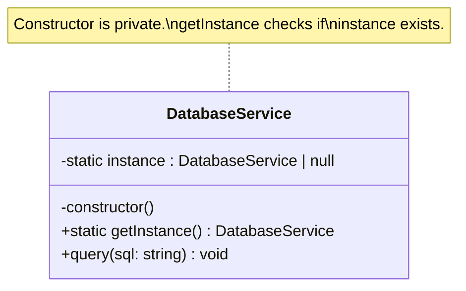
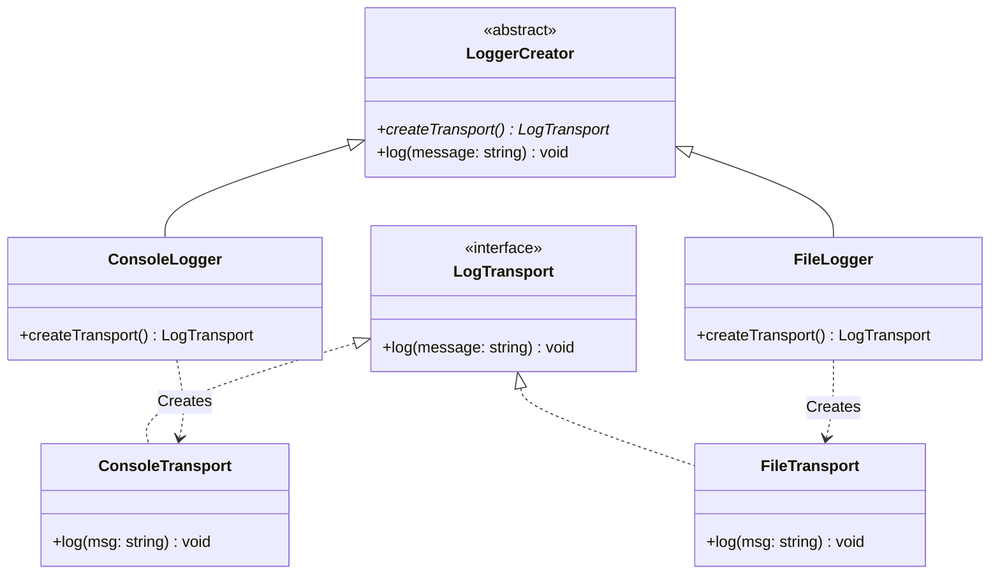
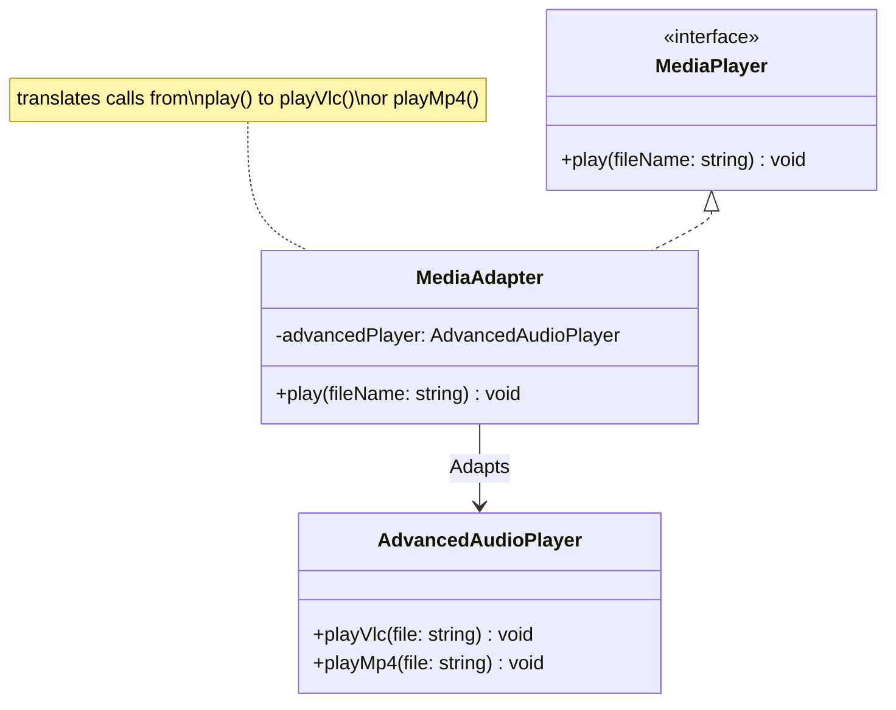
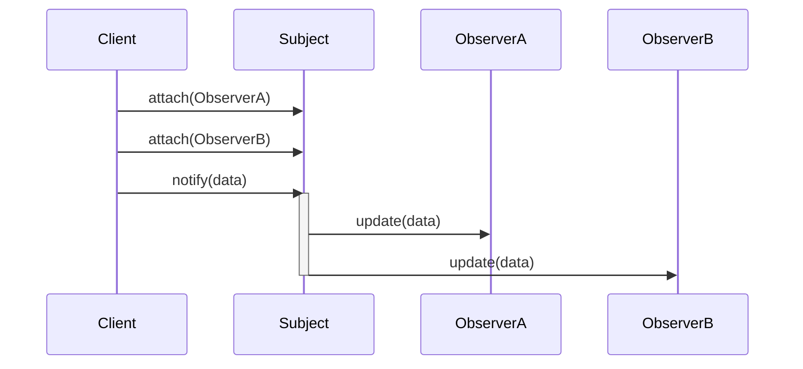

- [1 - Introduction and Historical Genesis](#1---introduction-and-historical-genesis)
  - [1.1 - The Alexandrian Lineage](#11---the-alexandrian-lineage)
  - [1.2 - The Group of Four and Standardisation](#12---the-group-of-four-and-standardisation)
  - [1.3 - The Evolution of Pattern Theory](#13---the-evolution-of-pattern-theory)
- [2 - Theoretical Foundations and Design Principles](#2---theoretical-foundations-and-design-principles)
  - [2.1 - The SOLID Principles](#21---the-solid-principles)
    - [2.1.1 - Single Responsibility Principle (SRP)](#211---single-responsibility-principle-srp)
    - [2.1.2 - Open/Closed Principle (OCP)](#212---openclosed-principle-ocp)
    - [2.1.3 - Liskov Substitution Principle (LSP)](#213---liskov-substitution-principle-lsp)
    - [2.1.4 - Interface Segregation Principle (ISP)](#214---interface-segregation-principle-isp)
    - [2.1.5 - Dependency Inversion Principle (DIP)](#215---dependency-inversion-principle-dip)
  - [2.2 - Coupling and Cohesion](#22---coupling-and-cohesion)
  - [2.3 - The Taxonomy of Patterns](#23---the-taxonomy-of-patterns)
- [3 - Creational Patterns: Mechanics and Memory](#3---creational-patterns-mechanics-and-memory)
  - [3.1 - The Singleton Pattern](#31---the-singleton-pattern)
    - [3.1.1 - Architectural Intent](#311---architectural-intent)
    - [3.1.2 - TypeScript Implementation](#312---typescript-implementation)
    - [3.1.3 - The "Anti-Pattern" Debate](#313---the-anti-pattern-debate)
  - [3.2 - The Factory Method Pattern](#32---the-factory-method-pattern)
    - [3.2.1 - Architectural Intent](#321---architectural-intent)
    - [3.2.2 - TypeScript Implementation](#322---typescript-implementation)
    - [3.2.3 - V8 Performance Implications](#323---v8-performance-implications)
- [4 - Structural Patterns: Composition and Compatibility](#4---structural-patterns-composition-and-compatibility)
  - [4.1 - The Adapter Pattern](#41---the-adapter-pattern)
    - [4.1.1 - Architectural Mechanics](#411---architectural-mechanics)
    - [4.1.2 - TypeScript Implementation](#412---typescript-implementation)
  - [4.2 - The Decorator Pattern](#42---the-decorator-pattern)
    - [4.2.1 - Architectural Mechanics](#421---architectural-mechanics)
    - [4.2.2 - Functional and Metadata Decorators](#422---functional-and-metadata-decorators)
    - [4.2.3 - Performance Costs](#423---performance-costs)
- [5 - Behavioural Patterns: Communication and State](#5---behavioural-patterns-communication-and-state)
  - [5.1 - The Observer Pattern](#51---the-observer-pattern)
    - [5.1.1 - Architectural Mechanics](#511---architectural-mechanics)
    - [5.1.2 - TypeScript Implementation](#512---typescript-implementation)
    - [5.1.3 - Modern Context: React Hooks](#513---modern-context-react-hooks)
    - [5.1.4 - Memory Leaks](#514---memory-leaks)
  - [5.2 - The Strategy Pattern](#52---the-strategy-pattern)
    - [5.2.1 - Architectural Mechanics](#521---architectural-mechanics)
    - [5.2.2 - TypeScript Implementation](#522---typescript-implementation)
    - [5.2.3 - Functional Equivalent](#523---functional-equivalent)
- [6 - The Runtime Reality: V8 and Performance](#6---the-runtime-reality-v8-and-performance)
  - [6.1 - Hidden Classes and Object Shapes](#61---hidden-classes-and-object-shapes)
  - [6.2 - Garbage Collection and Object Lifecycles](#62---garbage-collection-and-object-lifecycles)
- [7 - Paradigms in Conflict: OOP vs. Functional Programming](#7---paradigms-in-conflict-oop-vs-functional-programming)
  - [7.1 - The "Missing Feature" Hypothesis](#71---the-missing-feature-hypothesis)
  - [7.2 - Translation of Patterns](#72---translation-of-patterns)
  - [7.3 - Immutability vs. State](#73---immutability-vs-state)
- [8 - Modern Framework Architectures](#8---modern-framework-architectures)
  - [8.1 - NestJS: The Pattern Container](#81---nestjs-the-pattern-container)
  - [8.2 - React: The Declarative Shift](#82---react-the-declarative-shift)
- [9 - Academic Impact and Empirical Evidence](#9---academic-impact-and-empirical-evidence)
  - [9.1 - Impact on Quality Metrics](#91---impact-on-quality-metrics)
  - [9.2 - The Trade-off](#92---the-trade-off)
- [10 - Conclusion](#10---conclusion)
- [References](#references)


# 1 - Introduction and Historical Genesis

The engineering of software is fundamentally a battle against complexity. As systems scale from simple scripts to distributed enterprise architectures, the cognitive load required to maintain them grows exponentially. Design patterns offer a strategic response to this chaos. They serve not merely as code snippets, but as a shared architectural vocabulary. This report provides an exhaustive analysis of these patterns. It traces their lineage from physical architecture to modern software, examines their mechanics in TypeScript.

## 1.1 - The Alexandrian Lineage

The intellectual roots of software design patterns lie outside computer science. They originate in the work of Christopher Alexander, an architect and urban planner. In his seminal 1977 text, *A Pattern Language: Towns, Buildings, Construction*, Alexander proposed a radical theory of design. He argued that a "quality without a name" (a sense of wholeness and aliveness) could be achieved in built environments through the application of rigorous, recurring patterns.

Alexander defined a pattern as a solution to a problem that occurs repeatedly in a context. He observed that inhabitants (rather than distant architects) were best suited to design their environments using these patterns. His work catalogued 253 patterns, ranging from the macro-scale of "Agricultural Valleys" to the micro-scale of "Light on Two Sides of Every Room".

The transition to software occurred in 1987. Kent Beck and Ward Cunningham, working with Smalltalk, presented the first software patterns at the OOPSLA conference. They recognised that Alexander’s structuralism applied perfectly to object-oriented programming. Just as a room requires windows for light, a software object requires distinct interfaces for communication. The "quality without a name" translated to software "liveness" and maintainability.

## 1.2 - The Group of Four and Standardisation

The formalisation of this discipline arrived in 1994. Erich Gamma, Richard Helm, Ralph Johnson, and John Vlissides published *Design Patterns: Elements of Reusable Object-Oriented Software*. This group, colloquially known as the "Group of Four" (GoF), catalogued 23 fundamental patterns.

Their work shifted the focus of software engineering. It moved attention from algorithms and data structures to the interactions between objects. The GoF did not invent these patterns; they discovered them. They observed solutions that developers used intuitively and gave them names. This created a standard lexicon. A developer could now describe a complex interaction as a "Strategy" or an "Observer," instantly conveying intent and structure.

The book categorised patterns into three distinct domains:

  * **Creational Patterns:** These concern the process of object creation. They abstract the instantiation logic, decoupling the system from how its objects are created.
  * **Structural Patterns:** These deal with object composition. They define ways to compose objects to obtain new functionality.
  * **Behavioural Patterns:** These focus on communication. They define how objects interact and distribute responsibility.

## 1.3 - The Evolution of Pattern Theory

The landscape has shifted since 1994. The original GoF patterns were heavily influenced by C++ and Smalltalk. Modern languages like TypeScript offer features (such as first-class functions and distinct module systems) that alter how these patterns are implemented.

Furthermore, the rise of functional programming (FP) has challenged the object-oriented orthodoxy. Critics like Peter Norvig have argued that many design patterns are simply workarounds for missing language features. Despite this, the core principles remain relevant. Modern frameworks like NestJS and React incorporate these patterns directly into their architecture, proving their enduring utility.


# 2 - Theoretical Foundations and Design Principles

Design patterns do not exist in isolation. They are practical manifestations of deeper theoretical principles. The most significant of these are the SOLID principles. These guidelines ensure that the application of a pattern results in robust code rather than over-engineered complexity.

## 2.1 - The SOLID Principles

Robert C. Martin introduced the SOLID principles to combat "software rot". Each letter represents a directive that patterns often help to enforce.

### 2.1.1 - Single Responsibility Principle (SRP)

The SRP states that a class should have only one reason to change. It enforces cohesion. A class that handles both business logic and database persistence violates this principle. Patterns like the Strategy pattern facilitate SRP. They allow algorithms to be extracted into separate classes, leaving the context class responsible only for delegation.

### 2.1.2 - Open/Closed Principle (OCP)

Software entities should be open for extension but closed for modification. This is the holy grail of maintainability. It implies that new functionality can be added without altering existing source code. The Decorator and Observer patterns are the primary mechanisms for achieving OCP. They allow behaviour to be augmented or monitored externally without touching the original object's internal structure.

### 2.1.3 - Liskov Substitution Principle (LSP)

This principle dictates that objects of a superclass shall be replaceable with objects of its subclasses without breaking the application. It is critical for patterns like Abstract Factory. If a client expects a Button interface, any concrete implementation (e.g., WindowsButton, MacButton) must behave consistently.

### 2.1.4 - Interface Segregation Principle (ISP)

Clients should not be forced to depend on interfaces they do not use. This warns against "fat" interfaces. The Adapter pattern often serves to remedy violations of ISP. It allows a client to interact with a specific subset of a larger, incompatible interface.

### 2.1.5 - Dependency Inversion Principle (DIP)

High-level modules should not depend on low-level modules. Both should depend on abstractions. This is the theoretical basis for Dependency Injection and the Factory pattern. It decouples the decision of what to create from when to create it.

## 2.2 - Coupling and Cohesion

Beyond SOLID, patterns regulate the tension between coupling and cohesion.

  * **Coupling** refers to the degree of interdependence between software modules. High coupling is detrimental. It means a change in one module ripples through others. Patterns like Observer and Mediator reduce coupling by standardising communication channels.
  * **Cohesion** refers to the degree to which the elements inside a module belong together. High cohesion is desirable. Patterns like State or Command group related behaviours, ensuring that a class is focused on a specific task.

## 2.3 - The Taxonomy of Patterns

The following table summarises the classification of standard patterns, providing a roadmap for the subsequent analysis.

| Category        | Intent                            | Patterns                                                                                                                         |
| :-------------- | :-------------------------------- | :------------------------------------------------------------------------------------------------------------------------------- |
| **Creational**  | Abstraction of instantiation.     | Singleton, Factory Method, Abstract Factory, Builder, Prototype.                                                                 |
| **Structural**  | Composition of interfaces.        | Adapter, Bridge, Composite, Decorator, Facade, Flyweight, Proxy.                                                                 |
| **Behavioural** | Communication and responsibility. | Chain of Responsibility, Command, Interpreter, Iterator, Mediator, Memento, Observer, State, Strategy, Template Method, Visitor. |


# 3 - Creational Patterns: Mechanics and Memory

Creational patterns abstract the instantiation process. In strictly typed languages like TypeScript, they are crucial for managing dependencies and ensuring that the system is not tightly bound to concrete classes.

## 3.1 - The Singleton Pattern

The Singleton is arguably the most well-known and most controversial pattern. It ensures a class has only one instance and provides a global point of access to it.



### 3.1.1 - Architectural Intent

The primary motivation for a Singleton is the control of a shared resource. Database connection pools, file system managers, and logging services are typical candidates. In these scenarios, multiple instances could lead to data corruption or resource exhaustion. The Singleton enforces a strict one-to-one relationship between the class and its runtime instance.

### 3.1.2 - TypeScript Implementation

The implementation relies on language access modifiers. The constructor is marked private to prevent usage of the `new` keyword. A static method controls access to the instance.

```typescript
/**
 * Singleton Pattern in TypeScript.
 * This implementation creates the instance lazily.
 */
class DatabaseService {
    // Holds the single instance.
    private static instance: DatabaseService | null = null;

    // Private constructor prevents external instantiation.
    private constructor() {
        console.log('Initialising Database Service connection...');
    }

    // Global access point.
    public static getInstance(): DatabaseService {
        if (!DatabaseService.instance) {
            DatabaseService.instance = new DatabaseService();
        }
        return DatabaseService.instance;
    }

    public query(sql: string): void {
        console.log(`Executing query: ${sql}`);
    }
}

// Usage
const db1 = DatabaseService.getInstance();
const db2 = DatabaseService.getInstance();

// Validation
// console.log(db1 === db2); // true
```

### 3.1.3 - The "Anti-Pattern" Debate

Academic and industrial consensus has shifted against the Singleton in recent years, often labelling it an "anti-pattern".

  * **Global State:** Singletons introduce global state into an application. This obscures dependencies. A function using a Singleton does not declare it in its signature, making the dependency hidden.
  * **Testing Difficulty:** Global state persists between unit tests. A test that modifies a Singleton can inadvertently cause a subsequent test to fail. This violates the principle of test isolation.
  * **Tight Coupling:** Code that directly calls `DatabaseService.getInstance()` is tightly coupled to that specific class. It cannot be easily swapped for a mock implementation.

In modern frameworks like NestJS, this pattern is replaced by Dependency Injection (DI) containers. The container manages the lifecycle, creating a single instance (singleton scope) but injecting it into constructors. This achieves the benefit of a single instance without the drawbacks of global coupling.

## 3.2 - The Factory Method Pattern

The Factory Method defines an interface for creating an object but lets subclasses alter the type of objects that will be created.



### 3.2.1 - Architectural Intent

This pattern is essential when a system needs to be independent of how its objects are created. It adheres strictly to the Dependency Inversion Principle. The client code interacts with an abstract Creator and an abstract Product, never knowing the concrete classes involved.

### 3.2.2 - TypeScript Implementation

The pattern utilises abstract classes to define the contract.

```typescript
// Product Interface
interface LogTransport {
    log(message: string): void;
}

// Concrete Products
class ConsoleTransport implements LogTransport {
    log(msg: string): void { console.log(`[Console]: ${msg}`); }
}

class FileTransport implements LogTransport {
    log(msg: string): void { console.log(`[File]: Writing ${msg} to disk.`); }
}

// Creator
abstract class LoggerCreator {
    // The Factory Method
    abstract createTransport(): LogTransport;

    // Core logic uses the abstract product
    public log(message: string): void {
        const transport = this.createTransport();
        transport.log(message);
    }
}

// Concrete Creators
class ConsoleLogger extends LoggerCreator {
    createTransport(): LogTransport { return new ConsoleTransport(); }
}

class FileLogger extends LoggerCreator {
    createTransport(): LogTransport { return new FileTransport(); }
}

// Usage
function clientCode(creator: LoggerCreator) {
    creator.log('System Start');
}

clientCode(new ConsoleLogger());
```

### 3.2.3 - V8 Performance Implications

When implementing Factories in JavaScript/TypeScript, one must consider the V8 engine's "Hidden Classes" (or Shapes). V8 optimises object access by assuming objects created by the same constructor have the same structure.

If a Factory creates objects that are structurally identical (same properties in the same order), V8 assigns them the same hidden class. This allows for extremely fast property access using inline caching. However, if the Factory produces objects with different property orders or optional fields, it forces V8 into a generic, slower lookup mode (dictionary mode). Therefore, consistent object initialisation within Factories is critical for high performance.


# 4 - Structural Patterns: Composition and Compatibility

Structural patterns explain how to assemble objects and classes into larger structures. They ease the design by identifying a simple way to realize relationships between entities.

## 4.1 - The Adapter Pattern

The Adapter pattern acts as a bridge between two incompatible interfaces. It allows classes to work together that otherwise could not due to incompatible interfaces.



### 4.1.1 - Architectural Mechanics

The pattern involves a Target interface (what the client expects), an Adaptee (the existing incompatible class), and the Adapter (the wrapper). The Adapter translates calls from the Target interface into specific calls to the Adaptee. This is particularly useful when integrating legacy systems or third-party libraries where the source code cannot be modified.

### 4.1.2 - TypeScript Implementation

TypeScript interfaces make this pattern explicit and type-safe.

```typescript
// Target Interface
interface MediaPlayer {
    play(fileName: string): void;
}

// Adaptee (Third-party library)
class AdvancedAudioPlayer {
    playVlc(file: string): void { console.log(`Playing vlc: ${file}`); }
    playMp4(file: string): void { console.log(`Playing mp4: ${file}`); }
}

// Adapter
class MediaAdapter implements MediaPlayer {
    private advancedPlayer: AdvancedAudioPlayer;

    constructor(player: AdvancedAudioPlayer) {
        this.advancedPlayer = player;
    }

    play(fileName: string): void {
        if (fileName.endsWith('.vlc')) {
            this.advancedPlayer.playVlc(fileName);
        } else if (fileName.endsWith('.mp4')) {
            this.advancedPlayer.playMp4(fileName);
        }
    }
}
```

## 4.2 - The Decorator Pattern

The Decorator pattern allows behaviour to be added to an individual object, dynamically, without affecting the behaviour of other objects from the same class.

### 4.2.1 - Architectural Mechanics

Traditionally, this is achieved by wrapping the object. The Decorator implements the same interface as the wrapped object and delegates calls to it, adding its own behaviour before or after the delegation. This is a flexible alternative to subclassing for extending functionality.

### 4.2.2 - Functional and Metadata Decorators

In TypeScript, "Decorators" also refer to a specific language feature (experimental) used for meta-programming, similar to Java Annotations. These allow developers to annotate classes and methods, often used in frameworks like NestJS to define metadata.

```typescript
// TypeScript Language Decorator (Meta-programming)
function LogExecution(target: any, propertyKey: string, descriptor: PropertyDescriptor) {
    const originalMethod = descriptor.value;

    descriptor.value = function (...args: any) {
        console.log(`Executing ${propertyKey} with args: ${JSON.stringify(args)}`);
        return originalMethod.apply(this, args);
    };

    return descriptor;
}

class Calculator {
    @LogExecution
    add(a: number, b: number): number {
        return a + b;
    }
}
```

This serves a similar purpose—extending behaviour—but operates at the class definition level rather than the instance level.

### 4.2.3 - Performance Costs

The structural wrapping of objects (in the classic pattern) can incur performance penalties in V8. Wrapping an object changes its identity. If a function is optimised to expect a specific hidden class, passing a decorated object (which effectively has a different structure or prototype chain) can trigger de-optimisation. Frequent wrapping and unwrapping can also increase pressure on the garbage collector.


# 5 - Behavioural Patterns: Communication and State

Behavioural patterns are concerned with algorithms and the assignment of responsibilities between objects. They describe not just patterns of objects or classes but also the patterns of communication between them.

## 5.1 - The Observer Pattern

The Observer pattern defines a one-to-many dependency so that when one object changes state, all its dependents are notified.



### 5.1.1 - Architectural Mechanics

The architecture comprises a Subject (Publisher) and Observers (Subscribers). The Subject maintains a registry of Observers. When its state changes, it iterates through the registry and calls an update method on each Observer.

This pattern is the backbone of event-driven architecture and Model-View-Controller (MVC) frameworks. It allows the UI (Observer) to decouple from the business logic (Subject).

### 5.1.2 - TypeScript Implementation

```typescript
interface Observer {
    update(data: any): void;
}

class Subject {
    private observers: Observer[] = [];

    public attach(observer: Observer): void {
        const isExist = this.observers.includes(observer);
        if (!isExist) this.observers.push(observer);
    }

    public detach(observer: Observer): void {
        const index = this.observers.indexOf(observer);
        if (index > -1) this.observers.splice(index, 1);
    }

    public notify(data: any): void {
        for (const observer of this.observers) {
            observer.update(data);
        }
    }
}
```

### 5.1.3 - Modern Context: React Hooks

In modern React development, the Observer pattern is omnipresent but often abstracted. The `useEffect` hook effectively acts as an Observer. It "subscribes" to changes in a dependency array. When a variable in that array changes (the Subject), the effect (the Observer) runs.

**Comparison: Class vs. Hooks**

| Feature          | Classic Observer            | React useEffect                      |
| :--------------- | :-------------------------- | :----------------------------------- |
| **Subscription** | Explicit `attach()` call.   | Dependency Array `[dep1, dep2]`.     |
| **Notification** | Imperative `notify()` call. | Automatic Re-render trigger.         |
| **Cleanup**      | Explicit `detach()` call.   | Return cleanup function from effect. |

### 5.1.4 - Memory Leaks

A critical failure mode in the Observer pattern is the "Lapsed Listener Problem." If an Observer fails to detach from the Subject, it remains in memory even if it is no longer needed. In V8, this prevents the Garbage Collector (GC) from reclaiming the Observer's memory. Since the Subject holds a strong reference to the Observer, the Observer is considered "reachable" and survives in the heap, leading to progressive memory leaks.

## 5.2 - The Strategy Pattern

The Strategy pattern enables selecting an algorithm at runtime. It defines a family of algorithms, encapsulates each one, and makes them interchangeable.

### 5.2.1 - Architectural Mechanics

The Context class delegates a specific task to a Strategy object. The Context is unaware of the concrete implementation; it interacts only via an interface. This eliminates complex conditional statements (large switch or if-else blocks) inside the Context class.

### 5.2.2 - TypeScript Implementation

```typescript
interface SortingStrategy {
    sort(data: string[]): string[];
}

class AscendingSort implements SortingStrategy {
    sort(data: string[]): string[] { return data.sort(); }
}

class DescendingSort implements SortingStrategy {
    sort(data: string[]): string[] { return data.sort().reverse(); }
}

class Sorter {
    constructor(private strategy: SortingStrategy) {}

    setStrategy(strategy: SortingStrategy) { this.strategy = strategy; }

    execute(data: string[]) { return this.strategy.sort(data); }
}
```

### 5.2.3 - Functional Equivalent

In TypeScript, Strategies can often be replaced by passing functions directly. This is a "Higher-Order Function" approach.

```typescript
type SortStrategy = (data: string[]) => string[];

const ascending: SortStrategy = (data) => data.sort();
const descending: SortStrategy = (data) => data.sort().reverse();

function sortData(data: string[], strategy: SortStrategy) {
    return strategy(data);
}
```

This functional approach reduces the boilerplate of creating class hierarchies, adhering to the principle of minimalism while retaining the architectural benefit of decoupling.


# 6 - The Runtime Reality: V8 and Performance

The theoretical purity of design patterns must be reconciled with the reality of the JavaScript runtime. The V8 engine, which powers Node.js and Chrome, employs sophisticated optimisations that interact with these patterns in complex ways.

## 6.1 - Hidden Classes and Object Shapes

JavaScript is a dynamic language; properties can be added to objects at any time. However, to execute code efficiently, V8 uses "Hidden Classes" (or Shapes). When an object is created, V8 assigns it a hidden class. If a property is added, V8 transitions the object to a new hidden class.

**Pattern Impact:**

  * **Consistent Factories:** If a Factory pattern initialises objects inconsistently (e.g., adding properties in different orders), it generates multiple hidden classes. This prevents V8 from using "Inline Caching," a technique that speeds up property access.
  * **Decorators:** The Decorator pattern often involves adding properties or methods to an object dynamically. This dynamic mutation forces V8 to abandon the optimised hidden class track and potentially revert to "dictionary mode" (hash map lookup), which is significantly slower than offset-based access.

## 6.2 - Garbage Collection and Object Lifecycles

V8 uses a generational garbage collector (Orinoco). New objects are allocated in the "Young Generation" (Nursery). If they survive a garbage collection cycle, they are promoted to the "Old Generation."

**Pattern Impact:**

  * **Singleton:** Singletons live in the Old Generation for the lifetime of the application. While this is expected, any data they accumulate (e.g., caches, logs) also stays in the Old Generation. Unbounded growth in a Singleton's state is a primary cause of memory leaks in Node.js applications.
  * **Command Pattern:** Creating a new Command object for every action can put pressure on the Young Generation allocator. While allocation is cheap, high-frequency creation (e.g., inside a game loop) can trigger frequent "Scavenge" GC cycles, causing micro-stuttering.


# 7 - Paradigms in Conflict: OOP vs. Functional Programming

The modern software landscape is defined by the convergence of Object-Oriented Programming (OOP) and Functional Programming (FP). TypeScript sits at this intersection, allowing developers to choose their paradigm. This choice profoundly affects how design patterns are implemented.

## 7.1 - The "Missing Feature" Hypothesis

A significant critique of OOP design patterns is that they are workarounds for missing language features. Peter Norvig, in his analysis of dynamic languages, argued that many GoF patterns become invisible or trivial in languages with first-class functions.

For example, the Command pattern encapsulates an action as an object. In a functional language, a function (or closure) is an encapsulated action. Therefore, the explicit "Command" class structure is redundant.

## 7.2 - Translation of Patterns

The following table illustrates how classical GoF patterns translate into functional concepts in TypeScript.

| OOP Pattern   | FP Equivalent          | Description                                                                                                     |
| :------------ | :--------------------- | :-------------------------------------------------------------------------------------------------------------- |
| **Strategy**  | Higher-Order Functions | Passing a function as an argument replaces the Strategy interface.                                              |
| **Decorator** | Function Composition   | Wrapping a function $f(x)$ with $g(x)$ to create $g(f(x))$ achieves the same result.                            |
| **Observer**  | Reactive Streams       | Libraries like RxJS use streams of events, eliminating the need for mutable Subject state.                      |
| **Visitor**   | Pattern Matching       | Discriminated unions and switch statements (or pattern matching libraries) replace the Visitor double-dispatch. |
| **Factory**   | Pure Functions         | A function returning an object literal is a simpler form of a Factory class.                                    |

## 7.3 - Immutability vs. State

OOP patterns often rely on encapsulated mutable state (e.g., the State pattern changes the internal state of an object). FP promotes immutability. In an FP architecture, the "State pattern" is often replaced by a state machine function (reducer) that accepts the current state and an action, returning a new state. This avoids the side effects and concurrency issues associated with mutable state patterns.


# 8 - Modern Framework Architectures

Frameworks enforce patterns by convention, embedding them into the skeleton of the application.

## 8.1 - NestJS: The Pattern Container

NestJS is essentially a framework built on top of the GoF patterns.

  * **Dependency Injection:** The core of NestJS is its IoC container. It forces the use of the Dependency Injection pattern, effectively eliminating the need for manual Factory or Singleton implementation.
  * **Decorators:** It relies heavily on the Decorator pattern (via TypeScript decorators) to define metadata for routing, validation, and serialisation. This moves configuration out of the business logic, adhering to the Single Responsibility Principle.
  * **Strategy:** NestJS uses the Strategy pattern explicitly for authentication (e.g., passport-local, passport-jwt). Developers implement a strategy class, and the framework swaps them at runtime based on configuration.

## 8.2 - React: The Declarative Shift

React has shifted the frontend paradigm from imperative (OOP) to declarative (Functional).

  * **HOCs (Higher-Order Components):** In older React, the Decorator pattern was implemented as HOCs (functions taking a component and returning a wrapped component).
  * **Hooks:** The introduction of Hooks replaced many class-based patterns. The Template Method pattern (lifecycle methods like `componentDidMount`) was replaced by `useEffect`. This flattened the component hierarchy, removing the "wrapper hell" caused by excessive use of Decorator/HOC patterns.


# 9 - Academic Impact and Empirical Evidence

The utility of design patterns is not just a matter of opinion; it is a subject of empirical research. Systematic literature reviews provide data on their actual impact on software quality.

## 9.1 - Impact on Quality Metrics

Research indicates a complex relationship between patterns and quality.

  * **Maintainability:** A study by Wedyan and Abufakher (2020) found that while patterns generally improve documentation and maintainability, they can negatively impact "understandability" for novice developers due to the increased abstraction.
  * **Defect Density:** Research by Schuler and Zimmermann (2008) suggests that heavily patterned code often has higher defect density initially due to complexity, but lower long-term maintenance costs.
  * **Pattern Grime:** Over time, pattern implementations often degrade. "Pattern Grime" refers to the accumulation of code that violates the strict definition of the pattern, leading to modularity decay.

## 9.2 - The Trade-off

The academic consensus suggests a trade-off: Patterns increase architectural suitability and reusability but at the cost of initial complexity and learning curve. They are recommended for large-scale systems where long-term evolution is expected, but may be counter-productive (over-engineering) for small, short-lived projects.


# 10 - Conclusion

Design patterns are the bridges between the abstract and the concrete. They translate the high-level desire for "modular" or "maintainable" systems into specific, reproducible code structures. From their origins in Christopher Alexander’s architectural theory to their codification by the Group of Four, patterns have provided a shared language that has unified the software engineering discipline.

However, this report demonstrates that patterns are not static dogmas. Their implementation is fluid, shaped by the programming language (TypeScript vs. C++) and the runtime environment (V8). The shift towards functional programming has transformed many verbose OOP patterns into elegant functional compositions, while modern frameworks like NestJS and React have absorbed these patterns into their very infrastructure.

Ultimately, the successful application of design patterns requires a nuanced understanding of these trade-offs. It requires the wisdom to balance the theoretical purity of the SOLID principles against the practical performance constraints of the runtime engine. As software architecture continues to evolve, the specific patterns may change, but the underlying objective—the pursuit of the "quality without a name"—remains the enduring goal of the discipline.


# References

Beck, K., & Cunningham, W. (1987). [Using pattern languages for object-oriented programs](http://c2.com/doc/oopsla87.html). *OOPSLA ’87 Workshop on Specification and Design for Object-Oriented Programming*. ([c2.com][1])

Martin, R. C. (2000). [Design principles and design patterns](https://staff.cs.utu.fi/~jounsmed/doos_06/material/DesignPrinciplesAndPatterns.pdf). Technical report, Object Mentor. ([staff.cs.utu.fi][2])

Wedyan, F., & Abufakher, S. (2020). [Impact of design patterns on software quality: a systematic literature review](https://digital-library.theiet.org/content/journals/10.1049/iet-sen.2018.5446). *IET Software, 14*(1), 1–17. [https://doi.org/10.1049/iet-sen.2018.5446](https://doi.org/10.1049/iet-sen.2018.5446) ([IET Research Journals][3])

Norvig, P. (1998). [Design patterns in dynamic languages](https://www.norvig.com/design-patterns/design-patterns.pdf). Tutorial paper, Object World Conference. ([norvig.com][4])

Selakovic, M., & Pradel, M. (2016). [Performance issues and optimizations in JavaScript: An empirical study](https://dl.acm.org/doi/10.1145/2884781.2884829). In *Proceedings of the 38th International Conference on Software Engineering (ICSE ’16)* (pp. 61–72). ACM. [https://doi.org/10.1145/2884781.2884829](https://doi.org/10.1145/2884781.2884829) ([software-lab.org][5])

Schuler, D., & Zimmermann, T. (2008). [Mining usage expertise from version archives](https://www.researchgate.net/publication/221355251_Mining_usage_expertise_from_version_archives). In *Proceedings of the 5th International Working Conference on Mining Software Repositories (MSR ’08)* (pp. 121–124). IEEE. ([ResearchGate][6])

[1]: https://c2.com/doc/oopsla87.html?utm_source=chatgpt.com "Using Pattern Languages for Object-Oriented Programs"
[2]: https://staff.cs.utu.fi/~jounsmed/doos_06/material/DesignPrinciplesAndPatterns.pdf?utm_source=chatgpt.com "Design Principles and Design Patterns"
[3]: https://ietresearch.onlinelibrary.wiley.com/doi/10.1049/iet-sen.2018.5446?utm_source=chatgpt.com "Impact of design patterns on software quality: a systematic ..."
[4]: https://www.norvig.com/design-patterns/design-patterns.pdf?utm_source=chatgpt.com "Design Patterns in Dynamic Programming"
[5]: https://software-lab.org/publications/icse2016-perf.pdf?utm_source=chatgpt.com "Performance Issues and Optimizations in JavaScript"
[6]: https://www.researchgate.net/publication/284812530_What_Recommendation_Systems_for_Software_Engineering_Recommend_A_Systematic_Literature_Review?utm_source=chatgpt.com "What Recommendation Systems for Software Engineering ..."
