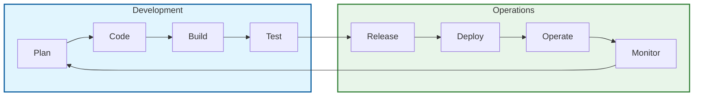
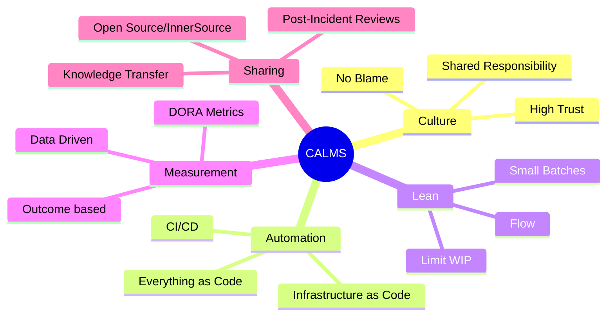
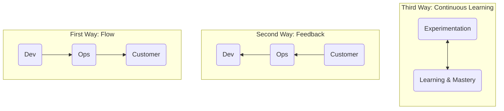
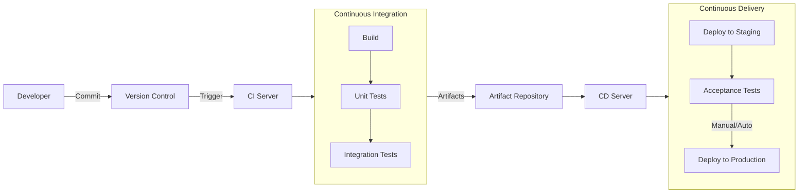
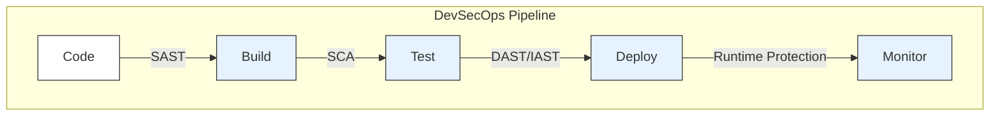
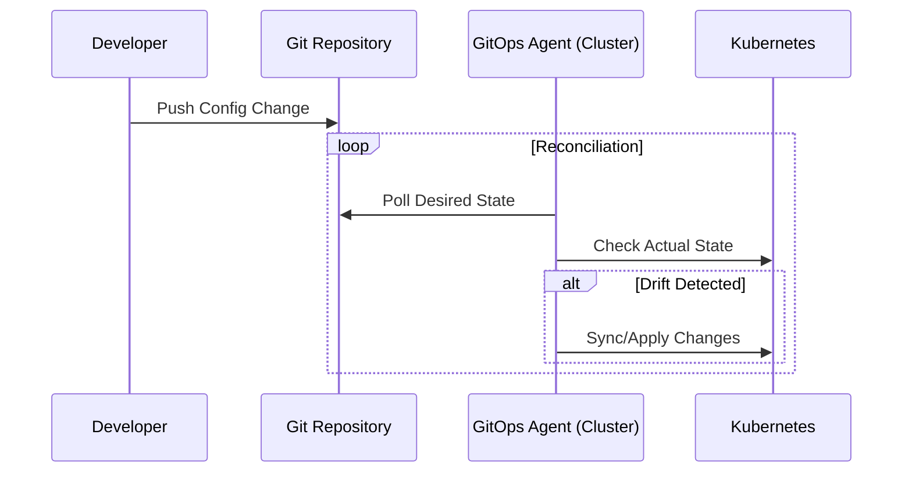
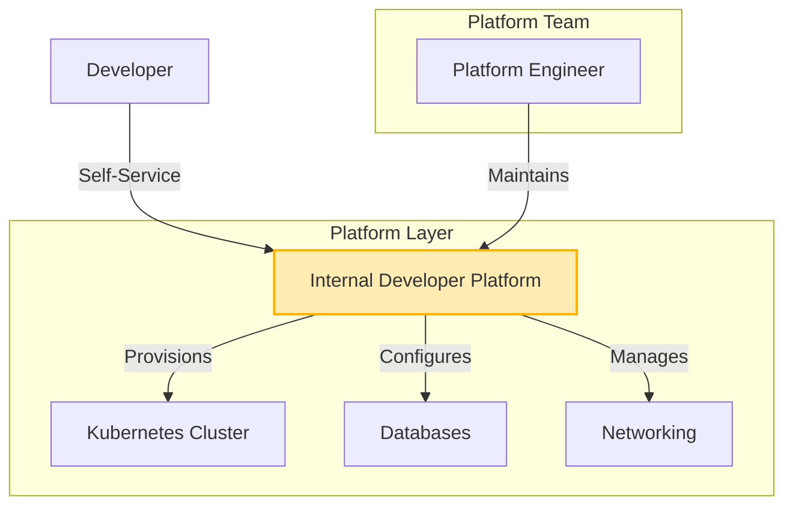

- [1 - Introduction and Theoretical Underpinnings](#1---introduction-and-theoretical-underpinnings)
  - [1.1 - The Historical Context: From Waterfall to the Wall of Confusion](#11---the-historical-context-from-waterfall-to-the-wall-of-confusion)
  - [1.2 - Defining DevOps: A Multidisciplinary Perspective](#12---defining-devops-a-multidisciplinary-perspective)
  - [1.3 - The CAMS and CALMS Frameworks](#13---the-cams-and-calms-frameworks)
    - [1.3.1 - Culture](#131---culture)
    - [1.3.2 - Automation](#132---automation)
    - [1.3.3 - Lean](#133---lean)
    - [1.3.4 - Measurement](#134---measurement)
    - [1.3.5 - Sharing](#135---sharing)
  - [1.4 - The Three Ways](#14---the-three-ways)
- [2 - Mathematical and Process Theory in DevOps](#2---mathematical-and-process-theory-in-devops)
  - [2.1 - Little's Law and Work In Progress (WIP)](#21---littles-law-and-work-in-progress-wip)
  - [2.2 - Queuing Theory and Resource Utilization](#22---queuing-theory-and-resource-utilization)
  - [2.3 - The Theory of Constraints](#23---the-theory-of-constraints)
- [3 - Architectural Frameworks and Components](#3---architectural-frameworks-and-components)
  - [3.1 - The CI/CD Pipeline Architecture](#31---the-cicd-pipeline-architecture)
  - [3.2 - The Role of Artifact Repositories](#32---the-role-of-artifact-repositories)
  - [3.3 - Infrastructure as Code (IaC)](#33---infrastructure-as-code-iac)
  - [3.4 - Immutable Infrastructure and Containerization](#34---immutable-infrastructure-and-containerization)
- [4 - Advanced Operational Models and Extensions](#4---advanced-operational-models-and-extensions)
  - [4.1 - DevSecOps: Shifting Security Left](#41---devsecops-shifting-security-left)
  - [4.2 - GitOps: The Operational Paradigm Shift](#42---gitops-the-operational-paradigm-shift)
  - [4.3 - Site Reliability Engineering (SRE)](#43---site-reliability-engineering-sre)
- [5 - The Cognitive Turn: Platform Engineering](#5---the-cognitive-turn-platform-engineering)
- [6 - Sociological Critique and Challenges](#6---sociological-critique-and-challenges)
  - [6.1 - Digital Taylorism and Surveillance](#61---digital-taylorism-and-surveillance)
  - [6.2 - Implementation Failure and Barriers](#62---implementation-failure-and-barriers)
- [7 - Metrics and Measurement: The DORA Framework](#7---metrics-and-measurement-the-dora-framework)
- [8 - Conclusion](#8---conclusion)
- [References](#references)

# 1 - Introduction and Theoretical Underpinnings

The contemporary software engineering landscape has undergone a radical transformation over the past two decades, shifting from monolithic, disparate processes to integrated, continuous delivery models. At the heart of this evolution lies **DevOps**, a methodological and cultural framework designed to bridge the historical chasm between software development (Dev) and information technology operations (Ops). The term, a portmanteau of its constituent disciplines, represents more than a mere set of tools; it denotes a fundamental restructuring of how value is delivered in technology organisations. This report provides an exhaustive examination of the DevOps ecosystem, analysing its theoretical foundations, architectural components, emerging operational models, and sociological implications.

## 1.1 - The Historical Context: From Waterfall to the Wall of Confusion

To comprehend the necessity of DevOps, one must first analyse the limitations of preceding methodologies. For decades, the dominant paradigm in software engineering was the **Waterfall model**, a linear, sequential approach originating from manufacturing and construction industries. In the Waterfall model, software development proceeded through distinct, non-overlapping phases: **Requirements Analysis, Design, Implementation, Verification, and Maintenance**.

```mermaid
gantt
    title Waterfall Methodology
    dateFormat  X
    axisFormat %s
    
    section Phases
    Requirements Analysis   :done,    des1, 0, 10
    Design                  :active,  des2, 10, 20
    Implementation          :         des3, 20, 30
    Verification            :         des4, 30, 40
    Maintenance             :         des5, 40, 50
```

While this model offered predictability and clear milestones, it was inherently rigid. Requirements were often "frozen" early in the process, making it difficult to adapt to changing market conditions or customer feedback. Furthermore, the sequential nature of Waterfall often led to the "big bang" release, where months or years of development culminated in a single, high-risk deployment event. If defects were discovered during the Verification phase (often the first time the disparate components were integrated) remediation was costly and time-consuming, frequently requiring significant rework.

The advent of **Agile software development** in the early 2000s addressed many of these issues within the development domain. Agile methodologies, such as Scrum and Extreme Programming (XP), introduced iterative development, shorter feedback loops, and a focus on customer collaboration. However, early Agile adoption often resulted in a "Water-Scrum-Fall" scenario. While developers worked in sprints and produced potential shippable increments rapidly, the downstream operations teams (responsible for deployment, infrastructure, and stability) remained stuck in traditional, siloed processes.

This misalignment created the **"Wall of Confusion,"** a metaphorical and often physical barrier separating Development and Operations. The two groups operated with conflicting incentives: developers were measured by their ability to deliver new features and change (velocity), while operations personnel were measured by system stability and uptime (reliability). Consequently, developers would "throw code over the wall" to operations, who viewed every change as a potential threat to stability. This systemic conflict resulted in frequent deployment failures, elongated lead times, and a lack of shared ownership regarding the final product. DevOps emerged as the synthesis required to resolve this dialectic, drawing heavily from the principles of Lean manufacturing, Agile software development, and systems thinking.

## 1.2 - Defining DevOps: A Multidisciplinary Perspective

Academic and industrial definitions of DevOps vary, yet they converge on core themes. It is broadly defined as a set of practices that combines software development and IT operations to shorten the systems development life cycle while delivering features, fixes, and updates frequently in close alignment with business objectives. It is a collaborative, multidisciplinary effort to automate continuous delivery while guaranteeing correctness and reliability.

The Institute of Electrical and Electronics Engineers (IEEE) and the Association for Computing Machinery (ACM) highlight that DevOps is not merely a job title or a toolset but a cultural shift. It moves software delivery from a project-centric model (temporary teams, defined end dates) to a product-centric model (long-lived teams, continuous evolution). This shift necessitates a move away from functional silos toward cross-functional teams where developers, testers, and operations engineers work together throughout the entire lifecycle (from design to production support).

## 1.3 - The CAMS and CALMS Frameworks

The most widely accepted conceptual framework for assessing DevOps maturity is the **CAMS** model, originally coined by Damon Edwards and John Willis in 2010. This was later expanded by Jez Humble to **CALMS**, adding "Lean" to the acronym. These five pillars (Culture, Automation, Lean, Measurement, and Sharing) serve as the lens through which organisations can evaluate their alignment with DevOps principles.

### 1.3.1 - Culture

Culture is widely regarded as the most critical and challenging aspect of DevOps adoption. It necessitates a shift from command-and-control hierarchies to high-trust, collaborative environments. A DevOps culture embraces change, seeks constant feedback, and promotes shared accountability (often described as "**you build it, you run it**"). This cultural pillar addresses the "blame game" often seen in siloed organisations by fostering psychological safety, where failures are viewed as learning opportunities rather than punishable offences. Westrum’s typology of organisational culture (Generative, Bureaucratic, and Pathological) is frequently cited in DevOps literature, with high-performing DevOps teams exhibiting Generative traits such as high cooperation and shared risk.

### 1.3.2 - Automation

Automation is the mechanism that enables the required speed and consistency of DevOps. It involves the "everything-as-code" mindset, applying to infrastructure, configuration, and compliance. By automating repetitive, manual tasks (toil), organisations reduce variance, eliminate human error, and free up engineering capacity for high-value work. Automation is not the goal itself but the enabler of the fast feedback loops required by the methodology. It includes the automation of the build, test, and deployment processes (CI/CD), as well as infrastructure provisioning (IaC).

### 1.3.3 - Lean

Added by Jez Humble, the Lean pillar draws from the Toyota Production System and Lean Software Development. It emphasises the elimination of waste (*muda*), the amplification of learning, and the concept of "flow". In a DevOps context, Lean principles manifest as limiting **Work In Progress (WIP)**, reducing batch sizes, and visualising work to identify bottlenecks. Small batch sizes are crucial because they reduce the risk associated with each deployment; smaller changes are easier to understand, debug, and roll back if necessary. This principles directly counters the "big batch" mentality of Waterfall development.

### 1.3.4 - Measurement

The empirical nature of DevOps distinguishes it from purely philosophical management theories. Measurement involves quantifying processes to drive improvement. Unlike traditional metrics that might focus on "lines of code" or "hours worked," DevOps focuses on outcome-based metrics. The key metrics, often referred to as the **DORA (DevOps Research and Assessment)** metrics, include Lead Time for Changes, Deployment Frequency, Time to Restore Service, and Change Failure Rate. Measurement ensures that improvements are data-driven rather than based on intuition.

### 1.3.5 - Sharing

Sharing refers to the breaking down of silos and the democratisation of knowledge. This includes sharing tools, code, environments, and (crucially) lessons learned from failures (post-incident reviews). It encourages a "community of practice" within the organisation, preventing the hoarding of information which characterises low-performing technology organisations. Sharing also extends to the "open source" ethos within the enterprise (InnerSource), allowing different teams to contribute to shared libraries and platforms.

## 1.4 - The Three Ways

Formalised by Gene Kim in *The Phoenix Project* and *The DevOps Handbook*, the "Three Ways" provide the underlying principles from which all DevOps patterns are derived. These principles offer a structured approach to implementing the philosophy of DevOps.

  * **The First Way (Systems Thinking)** emphasises the performance of the entire system, from business requirements to customer delivery, rather than a specific silo of work or department. It cautions against local optimisation (such as a development team optimizing for code output) if it causes global degradation, such as overwhelming the QA or Ops teams. The goal is to increase the flow of work from left (Dev) to right (Ops) by removing bottlenecks and ensuring that known defects are never passed downstream.
  * **The Second Way (Amplify Feedback Loops)** focuses on creating shortened, amplified feedback loops from right (Operations/Customer) to left (Development). This ensures that developers understand the operational impact of their code immediately. Techniques include automated testing, monitoring in production, and rotating developers into on-call positions. Faster feedback loops prevent "drift" between the design and the actual user requirement or operational reality.
  * **The Third Way (Continuous Experimentation and Learning)** fosters a culture of experimentation, risk-taking, and learning from failure. It posits that mastery requires repetition and practice. High-performing organisations reserve time for the improvement of daily work, recognizing that if they are too busy to improve, their technical debt will eventually overwhelm them. This way also encourages the injection of faults into the system (Chaos Engineering) to test resilience.

# 2 - Mathematical and Process Theory in DevOps

The efficiency of a DevOps pipeline is not merely a matter of tooling or culture but is governed by fundamental laws of flow and queuing theory. Understanding these mathematical models helps explain why practices like limiting WIP and small batch sizes are effective.

## 2.1 - Little's Law and Work In Progress (WIP)

Little's Law is a theorem from queuing theory that is essential for understanding flow in software delivery. It is expressed as:

$$L = \lambda W$$

Where:

  * $L$ is the average number of items in the system (**Work In Progress** or **WIP**).
  * $\lambda$ (lambda) is the average arrival rate of items (**Throughput**).
  * $W$ is the average time an item spends in the system (**Lead Time** or **Cycle Time**).

In a DevOps context, the primary objective is often to reduce Lead Time ($W$) (the time from code commit to production deployment) to deliver value faster. Little's Law dictates that to reduce Lead Time, an organisation must either increase Throughput ($\lambda$) or reduce WIP ($L$). While increasing throughput (e.g., adding more developers) is often difficult and expensive, reducing WIP is a highly effective lever. If a team works on too many features simultaneously (high WIP), the average Lead Time for any single feature increases proportionately. By limiting WIP (a core tenet of Kanban and Lean) teams can mathematically guarantee shorter Lead Times.

## 2.2 - Queuing Theory and Resource Utilization

Queuing Theory further elaborates on system behaviour under load, particularly the relationship between resource utilisation and wait times. Kingman's formula approximates the wait time in a queue ($E$) for a single server as:

$$E \approx \left( \frac{\rho}{1-\rho} \right) \left( \frac{c_a^2 + c_s^2}{2} \right) \tau$$

Where $\rho$ is utilization, $c_a$ and $c_s$ are coefficients of variation for arrival and service times, and $\tau$ is the mean service time.

The critical insight for DevOps is the term $\frac{\rho}{1-\rho}$. As utilisation ($\rho$) approaches 100% (or 1), the wait time approaches infinity. This challenges the traditional management view that "resources" (developers or servers) should be 100% utilised to be efficient. In reality, a fully utilised system has no buffer to handle variability, causing queues to explode and flow to halt.

DevOps practices mitigate this by:

  * **Slack Time:** Encouraging teams not to plan to 100% capacity, leaving room for unplanned work and variability.
  * **Reducing Variability:** Automation reduces the variance in service time ($c_s$), which directly reduces wait times.
  * **Small Batch Sizes:** Reducing the size of work items reduces the mean service time ($\tau$), further improving flow.

## 2.3 - The Theory of Constraints

DevOps also draws from the **Theory of Constraints (TOC)**, popularized by Eliyahu Goldratt. TOC posits that every system has at least one constraint (bottleneck) that limits its total output. Improvements made anywhere other than the bottleneck are an illusion. In a software delivery pipeline, the bottleneck might be manual testing, security reviews, or infrastructure provisioning. The "First Way" of DevOps encourages identifying this constraint and elevating it, often through automation. For example, if manual testing is the bottleneck, automating the test suite (Continuous Testing) is the only way to increase global throughput; hiring more developers would only pile up more code in front of the testing bottleneck (increasing WIP and Lead Time).

# 3 - Architectural Frameworks and Components

The architectural realisation of DevOps principles is achieved through the **DevOps Lifecycle**, a continuous loop comprising distinct phases: Plan, Code, Build, Test, Release, Deploy, Operate, and Monitor. The technological backbone enabling this lifecycle is the CI/CD Pipeline, supported by Infrastructure as Code (IaC) and Artifact Repositories.

## 3.1 - The CI/CD Pipeline Architecture

The Continuous Integration/Continuous Delivery (CI/CD) pipeline is the automated manifestation of the "First Way" (Systems Thinking), ensuring a consistent flow of code from development to production.

**Continuous Integration (CI)** focuses on the early stages: Code, Build, and Test. Developers merge their changes to a shared repository (Main/Trunk) frequently, ideally multiple times per day. Each merge triggers an automated build and a suite of tests.

  * **Source Phase:** The process begins with version control (e.g., Git). Branches are used to isolate work, but long-lived branches are discouraged to prevent "merge hell".
  * **Build Phase:** The CI server (e.g., Jenkins, GitHub Actions) compiles the code and resolves dependencies. This phase transforms source code into binary artifacts.
  * **Test Phase:** A hierarchy of automated tests is executed. Unit tests run first (fast, granular), followed by integration tests. The goal is "fail fast" (detecting defects immediately when they are cheapest to fix).

**Continuous Delivery (CD)** extends CI by ensuring the software is always in a deployable state. It automatically deploys the build to staging environments (e.g., QA, UAT) for further verification.

  * **Staging:** This environment mimics production as closely as possible to verify performance and integration.
  * **Deployment:** In Continuous Delivery, the deployment to production requires a manual approval gate. In Continuous Deployment, this step is automated; if the tests pass, the code goes live.

## 3.2 - The Role of Artifact Repositories

A critical but often overlooked component of the DevOps architecture is the **Artifact Repository** (or Binary Repository Manager). While SCM manages source code, artifact repositories manage the outcome of the build process (the binaries, packages (npm, Maven, NuGet), and container images (Docker)).

The Artifact Repository serves as the "single source of truth" for binaries, ensuring consistency across environments. It prevents the "works on my machine" syndrome by ensuring that the exact same binary tested in staging is the one deployed to production.

  * **Proxying Remote Repositories:** Modern builds depend heavily on public libraries (e.g., from npm or Maven Central). An artifact repository acts as a proxy, caching these dependencies locally. This insulates the organisation from external outages (e.g., "left-pad" incident) and improves build speeds by reducing network latency.
  * **Types of Repositories:**
      * **Local:** For storing internal builds.
      * **Remote:** For proxying public registries.
      * **Virtual:** A unified view aggregating local and remote repositories, simplifying the developer configuration.
  * **Major Solutions:** Leading tools include JFrog Artifactory, which offers universal support for over 30 package types and integrates deeply with CI/CD for metadata tracking, and Sonatype Nexus, known for its strong governance and open-source roots.

## 3.3 - Infrastructure as Code (IaC)

Infrastructure as Code (IaC) is the practice of managing and provisioning computing infrastructure through machine-readable definition files rather than physical hardware configuration or interactive configuration tools. IaC is essential for the "Automation" pillar of CAMS, allowing infrastructure to be versioned, tested, and reproducible.

There are two primary approaches to IaC:

  * **Declarative (Functional):** Focuses on the "what." The user defines the desired state (e.g., "I need three web servers and a load balancer"), and the tool calculates the necessary steps to achieve it. This approach is generally preferred for its idempotency (applying the same configuration multiple times results in the same state without side effects). Examples include Terraform and Kubernetes manifests.
  * **Imperative (Procedural):** Focuses on the "how." The user defines the sequence of commands to execute (e.g., "Create server, then install Apache, then start service"). While offering granular control, it can be error-prone and harder to manage at scale as the script must account for the current state of the system. Examples include Bash scripts and some configurations of Ansible.

## 3.4 - Immutable Infrastructure and Containerization

Closely linked to IaC is the concept of **Immutable Infrastructure**. In this model, servers are never modified after deployment. If an update or patch is required, the existing server or container is destroyed and replaced with a new version built from a common image.

This approach eliminates **Configuration Drift**, where servers slowly diverge from their intended state due to manual patches or ad-hoc changes. Immutable infrastructure ensures consistency between development, testing, and production, and simplifies rollback (by reverting to the previous image).

**Containerization** is a key enabler of this pattern. Containers (e.g., Docker) bundle the application code with all its dependencies (libraries, runtime) into a lightweight, portable unit. Unlike Virtual Machines (VMs), which virtualize the hardware, containers virtualize the Operating System, making them faster to spin up and more resource-efficient.

**Orchestration:** Because containers are ephemeral and numerous, manual management is impossible. **Kubernetes** has become the de facto standard for container orchestration, automating deployment, scaling, and management of containerized applications. It provides self-healing capabilities, restarting failed containers automatically, which aligns with the reliability goals of DevOps.

# 4 - Advanced Operational Models and Extensions

As DevOps has matured, it has evolved into specialised sub-disciplines to address specific challenges in security, reliability, and cognitive load. These extensions (DevSecOps, SRE, GitOps, and Platform Engineering) represent the frontier of modern software delivery.

## 4.1 - DevSecOps: Shifting Security Left

Traditional security models operated as a "gatekeeper" at the end of the SDLC, often delaying releases or forcing last-minute rework. **DevSecOps** integrates security practices into the DevOps pipeline, shifting security "left" to the earliest stages of development. The philosophy is that security is a shared responsibility, integrated into the daily work of developers rather than audited at the end.

**The DevSecOps Architecture:**
To implement DevSecOps without slowing down velocity, automated security controls are embedded in the CI/CD pipeline:

  * **SAST (Static Application Security Testing):** Analyzes source code for vulnerabilities (e.g., SQL injection, buffer overflows) during the coding or build phase. Since it looks at code at rest, it can provide immediate feedback to developers.
  * **SCA (Software Composition Analysis):** Scans the open-source libraries and dependencies used in the project against databases of known vulnerabilities (CVEs). This is critical as modern applications are often 80-90% open-source code.
  * **DAST (Dynamic Application Security Testing):** Tests the running application from the outside, simulating an attack (black-box testing). This occurs during the Test/Staging phase.
  * **IAST (Interactive Application Security Testing):** Combines SAST and DAST by monitoring the application from within during execution, providing real-time analysis.
  * **Secret Management:** Ensuring that credentials (API keys, passwords) are not hardcoded in the repository but injected securely at runtime using tools like HashiCorp Vault.

The IEEE and other academic bodies emphasize that DevSecOps is essential for mitigating risks in modern, distributed architectures, particularly "Supply Chain Attacks" where the pipeline itself is targeted.

## 4.2 - GitOps: The Operational Paradigm Shift

**GitOps** is a modern operational framework that applies DevOps best practices (version control, collaboration, compliance, and CI/CD) to infrastructure automation. In GitOps, the Git repository is the single source of truth for the entire system state, including infrastructure and application configurations.

The core distinction between GitOps and traditional CIOps lies in the deployment trigger and direction:

  * **CIOps (Push-based):** In traditional CI/CD, the build server (e.g., Jenkins) executes scripts to push changes to the production cluster. This requires the CI server to possess high-level administrative credentials for the production environment, creating a significant security risk (the "god mode" CI server).
  * **GitOps (Pull-based):** An agent running inside the cluster (e.g., ArgoCD, Flux) continuously monitors the Git repository. When it detects a change in the desired state (Git), it pulls the configuration and applies it to the cluster.

**Advantages of GitOps:**

  * **Enhanced Security:** The cluster does not need to accept external connections; it only needs outbound access to the Git repo. Credentials remain inside the cluster.
  * **Drift Detection & Reconciliation:** The GitOps agent constantly compares the live state of the cluster with the desired state in Git. If manual changes are made to the cluster (drift), the agent detects them and automatically reverts them, ensuring the system remains consistent.
  * **Audit Trail:** Since every change must be a commit to Git, the version history serves as an immutable audit log of who changed what and when.

## 4.3 - Site Reliability Engineering (SRE)

Originating at Google, **Site Reliability Engineering (SRE)** is a specific implementation of DevOps principles focused on creating scalable and highly reliable software systems. While DevOps is often described as the philosophy or culture, SRE is the prescriptive set of practices and engineering roles used to achieve it.

**Core SRE Concepts:**

  * **SLO (Service Level Objective):** A precise numerical target for system availability (e.g., 99.9% success rate on HTTP requests).
  * **SLI (Service Level Indicator):** The specific metric used to measure performance against the SLO (e.g., error rate, latency).
  * **Error Budget:** The allowable threshold of unreliability ($100\% - SLO$). For a 99.9% target, the error budget is 0.1%. This budget bridges the gap between Dev and Ops: if the budget remains, developers can push new features and take risks. If the budget is exhausted, deployments are frozen ("Code Yellow") to focus solely on stability and reliability work.
  * **Toil Reduction:** SREs distinguish between "Engineering work" (long-term value) and "Toil" (manual, repetitive, devoid of enduring value). SRE teams typically mandate a cap on toil (often 50%), requiring the rest of the time be spent on automating away that toil.

**SRE vs. DevOps:**
While they share goals, SRE is more operations-centric and relies on software engineering skills to solve operational problems. DevOps is a broader cultural movement across the entire SDLC. SRE provides the "math" and strict framework (Error Budgets) to make the DevOps philosophy of "shared ownership" actionable.

# 5 - The Cognitive Turn: Platform Engineering

As DevOps adoption has scaled, a significant challenge has emerged: the overwhelming cognitive load placed on developers. The "you build it, you run it" model, while empowering, often forces application developers to become experts in a vast array of complex technologies (Kubernetes, Terraform, Helm, IAM policies, and networking) distracting them from their core task of writing business logic.

**Cognitive Load Theory**, originally from educational psychology, identifies three types of load:

1.  **Intrinsic:** The inherent difficulty of the task (e.g., complex business logic).
2.  **Extraneous:** Unnecessary load generated by the environment (e.g., struggling with a complex deployment script).
3.  **Germane:** The effort required to learn and process information.

In many DevOps environments, the extraneous load has become unmanageable, leading to burnout and reduced velocity.

**Platform Engineering** has emerged as the solution to this "cognitive crisis." It involves building an **Internal Developer Platform (IDP)** that acts as a product for the development teams.

  * **The Platform as a Product:** The Platform Team treats developers as their customers. They build a curated set of tools, workflows, and "Golden Paths" (or Paved Roads) that allow developers to self-service their infrastructure needs without needing to understand the underlying complexity.
  * **Golden Paths:** These are opinionated, supported templates for common tasks (e.g., "Spin up a microservice with a database"). Developers can choose to stay on the path (low cognitive load, fully supported) or go off-road (full autonomy, but full responsibility).
  * **Internal Developer Portal:** The interface for the IDP, often built using frameworks like Backstage (Spotify) or Port, provides a unified catalogue of services, documentation, and management actions.

**Platform Engineering vs. SRE vs. DevOps:**

  * **DevOps:** The culture and philosophy.
  * **SRE:** Focuses on production reliability and incident response.
  * **Platform Engineering:** Focuses on developer experience (DevEx) and productivity "pre-production" (scaffolding, provisioning, CI/CD).

# 6 - Sociological Critique and Challenges

While DevOps offers significant advantages, it is not without critical challenges and sociological implications. Academic literature and industry reports highlight that the transition to DevOps is fraught with difficulty and can have unintended consequences on the workforce.

## 6.1 - Digital Taylorism and Surveillance

A growing body of academic critique views the metric-heavy nature of DevOps (continuous monitoring, DORA metrics, commit tracking) as a modern form of **Digital Taylorism**. Frederick Taylor's Scientific Management sought to optimize manual labour by decomposing tasks and measuring them precisely. Critics argue that DevOps applies this same logic to knowledge work (coding), reducing complex creative processes to data points.

The integration of "Continuous Monitoring" tools raises ethical concerns about the "panoptic" gaze of management. Observability tools designed to track system health can easily be repurposed to surveil employee activity. This "quantified self" at work can lead to a loss of autonomy, increased stress, and a culture of performative busyness rather than genuine productivity. The risk is that the "human" element of CAMS is subordinated to "Measurement," creating a data-driven sweatshop where developers are managed by algorithm rather than empathy.

## 6.2 - Implementation Failure and Barriers

Despite its popularity, empirical studies suggest a high failure rate for DevOps initiatives. Gartner has predicted that 90% of DevOps initiatives could fail to meet expectations due to leadership and cultural issues.

  * **Cultural Inertia:** The "immune system" of large, bureaucratic organisations often rejects the collaborative, high-trust model of DevOps. Middle management may resist the loss of control, and siloed teams may resist the transparency required.
  * **Lack of Leadership:** Without strong executive sponsorship, DevOps efforts often remain grassroots experiments that fail to scale.
  * **Tool Sprawl vs. Process Change:** A common anti-pattern is adopting the tools of DevOps (Jenkins, Docker) without changing the process or culture. This leads to "Automated Silos" where the same dysfunction exists, just faster.
  * **The "DevOps Team" Silo:** Ironically, many organisations attempt to implement DevOps by creating a separate "DevOps Team." This creates a new silo between Dev and Ops, exacerbating the very problem DevOps was meant to solve.

# 7 - Metrics and Measurement: The DORA Framework

To navigate these challenges and validate success, effective measurement is crucial. The industry has coalesced around the research conducted by the **DevOps Research and Assessment (DORA)** group, now part of Google. Their rigorous statistical analysis has identified four key metrics that predict organisational performance.

**Table 3: The Four Key DORA Metrics**

| Metric Type           | Metric Name             | Definition                                                     | Goal                        |
| :-------------------- | :---------------------- | :------------------------------------------------------------- | :-------------------------- |
| Throughput (Velocity) | Deployment Frequency    | How often an organisation successfully releases to production. | Increase (Elite: On-demand) |
| Throughput (Velocity) | Lead Time for Changes   | The amount of time it takes a commit to get into production.   | Decrease (Elite: \< 1 hour) |
| Stability (Quality)   | Change Failure Rate     | The percentage of deployments causing a failure in production. | Decrease (Elite: 0-15%)     |
| Stability (Quality)   | Time to Restore Service | How long it takes to recover from a failure in production.     | Decrease (Elite: \< 1 hour) |

A key finding of the DORA research is that high performers do not trade off speed for stability; they achieve both simultaneously. This refutes the traditional bimodal IT theory that suggested speed inevitably compromises quality. Furthermore, recent DORA reports emphasize the importance of Documentation, Cloud Flexibility, and Psychological Safety as predictors of organisational performance.

# 8 - Conclusion

DevOps represents a paradigm shift that is now foundational to modern software engineering. By synthesising technical practices like CI/CD and IaC with cultural values of trust, sharing, and continuous learning, it addresses the chronic inefficiencies of the "Wall of Confusion."

The architecture of DevOps has matured from simple automation scripts to complex ecosystems involving Containerization, Orchestration, and Immutable Infrastructure. As the domain evolves, new models like DevSecOps, SRE, and Platform Engineering are refining the approach, addressing security integration, reliability at scale, and the cognitive load of developers respectively.

However, the journey is not purely technical. The sociological risks of Digital Taylorism and the persistent challenge of cultural inertia serve as reminders that DevOps is ultimately a human-centric endeavour. Success requires a holistic view that balances the mathematical rigour of flow efficiency with the psychological safety required for innovation. As organisations look to the future, the integration of AI into these pipelines and the rise of Platform Engineering suggest that the abstraction of complexity will be the next frontier in the quest for software delivery excellence.

# References

1. **Royce, W. W. (1970)**. *Managing the development of large software systems*. Proceedings of IEEE WESCON. [Link](https://www.praxisframework.org/files/royce1970.pdf). ([praxisframework.org][1])

2. **Westrum, R. (2004)**. *A typology of organisational cultures*. *Quality and Safety in Health Care*, 13(suppl 2), ii22–ii27. [Link](https://qualitysafety.bmj.com/content/13/suppl_2/ii22).

3. **Little, J. D. C. (1961)**. *A proof for the queuing formula: L = λW*. *Operations Research*, 9(3), 383–387. [Link](https://pubsonline.informs.org/doi/10.1287/opre.9.3.383). ([INFORMS Pubs Online][2])

4. **Kingman, J. F. C. (1961)**. *The single server queue in heavy traffic*. *Mathematical Proceedings of the Cambridge Philosophical Society*, 57(4), 902–904. [Link](https://doi.org/10.1017/S0305004100036094). ([SCIRP][3])

5. **Şimşit, Z. T., Günay, N. S., & Vayvay, Ö. (2014)**. *Theory of Constraints: A literature review*. *Procedia – Social and Behavioral Sciences*, 150, 930–936. [Link](https://www.sciencedirect.com/science/article/pii/S1877042814051532). ([ScienceDirect][4])

6. **Sweller, J. (1988)**. *Cognitive load during problem solving: Effects on learning*. *Cognitive Science*, 12(2), 257–285. [Link](https://www.sciencedirect.com/science/article/pii/0364021388900237). ([ScienceDirect][5])

7. **Forsgren, N., & Humble, J. (2016)**. *The role of continuous delivery in IT and organizational performance*. Proceedings of the Western Decision Sciences Institute (WDSI). [Link](https://ssrn.com/abstract=2681909). ([papers.ssrn.com][6])

8. **Azad, N., & Hyrynsalmi, S. (2023)**. *DevOps critical success factors — A systematic literature review*. *Information and Software Technology*, 157, 107150. [Link](https://doi.org/10.1016/j.infsof.2023.107150). ([ScienceDirect][7])

9. **Rütz, M. (2019)**. *DevOps: A systematic literature review*. FH Wedel Technical Report. [PDF](https://www.fh-wedel.de/fileadmin/Mitarbeiter/Records/Ruetz_2019_-_DEVOPS_A_SYSTEMATIC_LITERATURE_REVIEW.pdf). ([fh-wedel.de][8])

10. **Sánchez-Gordón, M., Colomo-Palacios, R., & Amescua-Seco, A. (2018)**. *Characterizing DevOps culture: A multivocal literature review*. In *EASE 2018: Proceedings of the 22nd International Conference on Evaluation and Assessment in Software Engineering*. [Link](https://dl.acm.org/doi/10.1145/3210459.3210461). ([SpringerLink][9])

11. **Riungu-Kalliosaari, L., Mäkinen, S., Jarvi, A., Männistö, T., & Mikkonen, T. (2016)**. *DevOps adoption benefits and challenges in practice: A case study*. In *Product-Focused Software Process Improvement (PROFES 2016)*, pp. 590–597. [Link](https://link.springer.com/chapter/10.1007/978-3-319-49094-6_44). ([Helda][10])

12. **Amaro, R., Pereira, R., & Mira da Silva, M. (2024)**. *DevOps metrics and KPIs: A multivocal literature review*. *ACM Computing Surveys*, 56(9). [Link](https://doi.org/10.1145/3652508). ([researchportal.ulisboa.pt][11])

13. **Kumar, A., Nadeem, M., & Shameem, M. (2025)**. *A systematic literature review for investigating DevOps metrics to implement in software development organisations*. *Journal of Software: Evolution and Process*. [Link](https://onlinelibrary.wiley.com/doi/10.1002/smr.2733). ([Wiley Online Library][12])

14. **Soares, E., Sizilio, G., Santos, J., Alencar da Costa, D., & Kulesza, U. (2022)**. *The effects of continuous integration on software development: A systematic literature review*. *Empirical Software Engineering*, 27, 78. [Link](https://link.springer.com/article/10.1007/s10664-021-10114-1). ([SpringerLink][13])

15. **Saleh, H. A., et al. (2025)**. *A systematic literature review on CI/CD for secure cloud computing*. In *Proceedings of the 2025 International Conference on Cloud Computing and Security*. [PDF](https://arxiv.org/abs/2403.02619). ([arXiv][14])

16. **Myrbakken, H., & Colomo-Palacios, R. (2017)**. *DevSecOps: A multivocal literature review*. In *Software Process Improvement and Capability Determination (SPICE 2017)*, CCIS 770, pp. 17–29. [Link](https://link.springer.com/chapter/10.1007/978-3-319-67383-7_2). ([SpringerLink][15])

17. **Rajapakse, R. N., Zahedi, M., Babar, M. A., & Shen, H. (2022)**. *Challenges and solutions when adopting DevSecOps: A systematic review*. *Information and Software Technology*, 144, 106700. [Link](https://www.sciencedirect.com/science/article/pii/S0950584921001543). ([ScienceDirect][16])

18. **Mohammed, K. I., Shanmugam, B., & El-Den, J. (2025)**. *Evolution of DevSecOps and its influence on application security: A systematic literature review*. *Technologies*, 13(12), 548. [Link](https://doi.org/10.3390/technologies13120548). ([MDPI][17])

19. **Shrestha, R., & Ali, A. A. N. (2024)**. *Configuration management in Kubernetes environments: A GitOps approach*. In *2024 IEEE/ACM 17th International Conference on Utility and Cloud Computing (UCC)*, pp. 497–502. [Link](https://doi.org/10.1109/UCC63386.2024.00077). ([IEEE Computer Society][18])

20. **Anon. (2025)**. *Harnessing GitOps for declarative infrastructure management in cloud-native systems*. *International Journal of Multidisciplinary Computer Engineering Research*, 7(6), 84–91. [PDF](https://www.ijmcer.com/wp-content/uploads/2025/11/IJMCER_J07608491.pdf). ([IJMCER][19])

21. **Venkatesh, R. (2024)**. *The evolution of Site Reliability Engineering: A comprehensive analysis of career transitions and organisational impact*. *International Journal for Multidisciplinary Research*, 6(6). [PDF](https://www.ijfmr.com/papers/2024/6/31350.pdf). ([IJFMR][20])

22. **Rusum, G. P., & Pappula, K. K. (2024)**. *Platform engineering: Empowering developers with internal developer platforms (IDPs)*. *International Journal of AI, BigData, Computational and Management Studies*, 5(1), 89–101. [Link](https://doi.org/10.63282/3050-9416.IJAIBDCMS-V5I1P110). ([ijaibdcms.org][21])

23. **Olgaç, A. V., Zileli, E., Karadaş, G., Ulus, C., & Akay, M. F. (2025)**. *Development of internal developer platform for software development lifecycle optimisation*. *Edelweiss Applied Science and Technology*, 9(6), 2815–2826. [Link](https://doi.org/10.55214/25768484.v9i6.8494). ([learning-gate.com][22])

24. **Nyckel, E.-M. (2020)**. *“Digital Taylorism”? Data practices and governance in the enterprise software Salesforce*. Weizenbaum Institute Working Paper. [PDF](https://www.ssoar.info/ssoar/handle/document/67519). ([SSOAR][23])

25. **Noponen, T., Heiskanen, T., & Laari-Salmela, S. (2023)**. *Taylorism on steroids or enabling autonomy? A systematic review of algorithmic management*. *International Journal of Management Reviews*, 25(4), 447–470. [Link](https://doi.org/10.1111/ijmr.12380). ([PMC][24])

26. **Gautié, J., et al. (2020)**. *Neo-Taylorism in the digital age: Workplace transformations in French and German retail warehouses*. *New Technology, Work and Employment*, 35(2), 146–166. [Link](https://doi.org/10.1111/ntwe.12171). ([Érudit][25])

27. **Lund, J., & Wright, C. (2001)**. *State regulation and the new Taylorism: The case of Australian grocery warehousing*. *Journal of Industrial Relations*, 43(4), 444–461. [Link](https://doi.org/10.1111/1472-9296.00065). ([papers.ssrn.com][26])

28. **Gould, O. N. (2024)**. *Today’s critiques of Taylorism are inadequate for understanding contemporary workplace surveillance*. In *Proceedings of the CHI Conference on Human Factors in Computing Systems*. [Link](https://doi.org/10.1145/3613904.3642250). ([ACM Digital Library][27])

29. **Jones, C., & Sutherland, I. (2016)**. *Management challenges for DevOps adoption within UK local government authorities*. In *Proceedings of ICEGOV 2016*, pp. 189–196. [Link](https://dl.acm.org/doi/10.1145/2910019.2910037). ([ACM Digital Library][28])

30. **Offerman, S., Liang, P., & Tuzcu, A. (2022)**. *A study of adoption and effects of DevOps practices in industry*. *Journal of Systems and Software*, 190, 111327. [Preprint link](https://arxiv.org/abs/2211.09390). ([arXiv][29])

31. **Krey, M., Schmid, K., & Kunz, M. (2022)**. *DevOps adoption: Challenges and barriers*. In *HICSS 2022: Proceedings of the 55th Hawaii International Conference on System Sciences*. [Link](https://hdl.handle.net/10125/79753). ([scholarspace.manoa.hawaii.edu][30])

[1]: https://www.praxisframework.org/files/royce1970.pdf?utm_source=chatgpt.com "Managing the Development of Large Software Systems"
[2]: https://pubsonline.informs.org/doi/10.1287/opre.9.3.383?utm_source=chatgpt.com "A Proof for the Queuing Formula: L = λW | Operations Research"
[3]: https://www.scirp.org/reference/referencespapers?referenceid=1336023&utm_source=chatgpt.com "Kingman, J.F.C. (1961) The Single Server Queue in Heavy ..."
[4]: https://www.sciencedirect.com/science/article/pii/S1877042814051532?utm_source=chatgpt.com "Theory of Constraints: A Literature Review"
[5]: https://www.sciencedirect.com/science/article/abs/pii/0364021388900237?utm_source=chatgpt.com "Cognitive load during problem solving: Effects on learning"
[6]: https://papers.ssrn.com/sol3/papers.cfm?abstract_id=2681909&utm_source=chatgpt.com "The Role of Continuous Delivery in IT and Organizational ..."
[7]: https://www.sciencedirect.com/science/article/pii/S0950584923000046?utm_source=chatgpt.com "DevOps critical success factors — A systematic literature ..."
[8]: https://www.fh-wedel.de/fileadmin/Mitarbeiter/Records/Ruetz_2019_-_DEVOPS_A_SYSTEMATIC_LITERATURE_REVIEW.pdf?utm_source=chatgpt.com "DEVOPS: A SYSTEMATIC LITERATURE REVIEW - FH Wedel"
[9]: https://link.springer.com/chapter/10.1007/978-3-030-00623-5_1?utm_source=chatgpt.com "Characterizing DevOps Culture: A Systematic Literature ..."
[10]: https://helda.helsinki.fi/server/api/core/bitstreams/c276a7f4-794b-4c01-b896-0d2a377969aa/content?utm_source=chatgpt.com "DevOps Adoption Benefits and Challenges in Practice - Helda"
[11]: https://researchportal.ulisboa.pt/en/publications/devops-metrics-and-kpis-a-multivocal-literature-review/?utm_source=chatgpt.com "DevOps Metrics and KPIs: A Multivocal Literature Review"
[12]: https://onlinelibrary.wiley.com/doi/abs/10.1002/smr.2733?utm_source=chatgpt.com "A Systematic Literature Review for Investigating DevOps ..."
[13]: https://link.springer.com/article/10.1007/s10664-021-10114-1?utm_source=chatgpt.com "The effects of continuous integration on software ..."
[14]: https://arxiv.org/abs/2506.08055?utm_source=chatgpt.com "A Systematic Literature Review on Continuous Integration ..."
[15]: https://link.springer.com/chapter/10.1007/978-3-319-67383-7_2?utm_source=chatgpt.com "DevSecOps: A Multivocal Literature Review"
[16]: https://www.sciencedirect.com/science/article/pii/S0950584921001543?utm_source=chatgpt.com "Challenges and solutions when adopting DevSecOps"
[17]: https://www.mdpi.com/2227-7080/13/12/548?utm_source=chatgpt.com "Evolution of DevSecOps and Its Influence on Application ..."
[18]: https://www.computer.org/csdl/proceedings-article/ucc/2024/672000a497/269fjIJCzFC?utm_source=chatgpt.com "Configuration Management in Kubernetes Environments"
[19]: https://www.ijmcer.com/wp-content/uploads/2025/11/IJMCER_J07608491.pdf?utm_source=chatgpt.com "Harnessing Git Ops for Declarative Infrastructure ..."
[20]: https://www.ijfmr.com/papers/2024/6/31350.pdf?utm_source=chatgpt.com "The Evolution of Site Reliability Engineering"
[21]: https://ijaibdcms.org/index.php/ijaibdcms/article/view/249?utm_source=chatgpt.com "Platform Engineering: Empowering Developers with Internal ..."
[22]: https://learning-gate.com/index.php/2576-8484/article/view/8494?utm_source=chatgpt.com "Development of internal developer platform for software ..."
[23]: https://www.ssoar.info/ssoar/handle/collection/20800/discover?filter=Weizenbaum+Series&filter_relational_operator=equals&filtertype=series&utm_source=chatgpt.com "Results for Discipline: Technology Assessment"
[24]: https://pmc.ncbi.nlm.nih.gov/articles/PMC10074337/?utm_source=chatgpt.com "Taylorism on steroids or enabling autonomy? A systematic ..."
[25]: https://www.erudit.org/en/journals/ri/2020-v75-n4-ri05774/1074564ar/?utm_source=chatgpt.com "Neo-Taylorism in the Digital Age: Workplace Trans…"
[26]: https://papers.ssrn.com/sol3/papers.cfm?abstract_id=1669394&utm_source=chatgpt.com "State Regulation and the New Taylorism: The Case of ..."
[27]: https://dl.acm.org/doi/fullHtml/10.1145/3613904.3642206?utm_source=chatgpt.com "Today's Critiques of Taylorism are Inadequate for ..."
[28]: https://dl.acm.org/doi/10.1145/2945408.2945410?utm_source=chatgpt.com "Management challenges for DevOps adoption within UK ..."
[29]: https://arxiv.org/abs/2211.09390?utm_source=chatgpt.com "A Study of Adoption and Effects of DevOps Practices"
[30]: https://scholarspace.manoa.hawaii.edu/items/a27d5a9b-4b32-4c17-b871-e7e817ee9c34?utm_source=chatgpt.com "DevOps Adoption: Challenges & Barriers"
