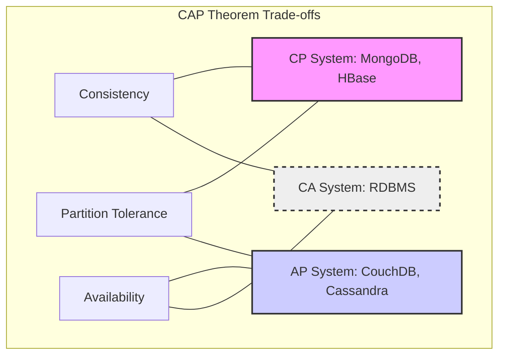
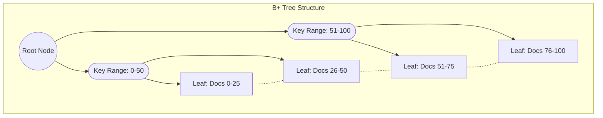
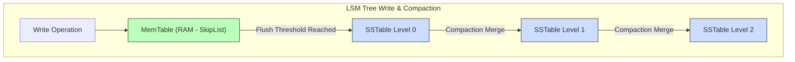
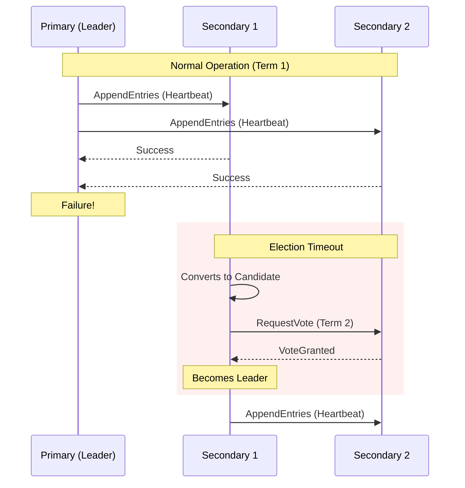
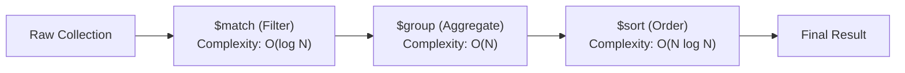

- [1 - Introduction: The Relational Limit and the Document Paradigm](#1---introduction-the-relational-limit-and-the-document-paradigm)
- [2 - Distributed Systems Theory: CAP, PACELC, and Consistency Models](#2---distributed-systems-theory-cap-pacelc-and-consistency-models)
	- [2.1 - The CAP Theorem](#21---the-cap-theorem)
	- [2.2 - The PACELC Theorem](#22---the-pacelc-theorem)
	- [2.3 - BASE Architecture](#23---base-architecture)
- [3 - Logical Data Representation: Set Theory and Algebra](#3---logical-data-representation-set-theory-and-algebra)
	- [3.1 - Semi-Structured Data and Polymorphism](#31---semi-structured-data-and-polymorphism)
	- [3.2 - Algebras for JSON (JAL)](#32---algebras-for-json-jal)
	- [3.3 - BSON: Binary Serialisation and Performance](#33---bson-binary-serialisation-and-performance)
- [4 - Storage Engine Architecture: B-Trees vs. LSM Trees](#4---storage-engine-architecture-b-trees-vs-lsm-trees)
	- [4.1 - B-Tree and B+ Tree Architecture](#41---b-tree-and-b-tree-architecture)
	- [4.2 - Log-Structured Merge (LSM) Trees](#42---log-structured-merge-lsm-trees)
	- [4.3 - Comparative Trade-off Analysis](#43---comparative-trade-off-analysis)
- [5 - Distributed Consensus Protocols: Mathematical Safety and Replication](#5---distributed-consensus-protocols-mathematical-safety-and-replication)
	- [5.1 - Paxos and Google Spanner](#51---paxos-and-google-spanner)
	- [5.2 - Raft and MongoDB](#52---raft-and-mongodb)
- [6 - Partitioning and Sharding: Probability Theory in Data Distribution](#6---partitioning-and-sharding-probability-theory-in-data-distribution)
	- [6.1 - Consistent Hashing](#61---consistent-hashing)
	- [6.2 - Shard Key Selection: Cardinality and Monotonicity](#62---shard-key-selection-cardinality-and-monotonicity)
- [7 - Concurrency Control and Causality: Vector Clocks](#7---concurrency-control-and-causality-vector-clocks)
	- [7.1 - Vector Clocks and Partial Ordering](#71---vector-clocks-and-partial-ordering)
- [8 - Query Processing and Optimisation](#8---query-processing-and-optimisation)
	- [8.1 - Complexity of Aggregation Pipelines](#81---complexity-of-aggregation-pipelines)
	- [8.2 - Geospatial Indexing Mathematics](#82---geospatial-indexing-mathematics)
- [9 - Comparative Architecture Analysis](#9---comparative-architecture-analysis)
	- [9.1 - Case Study: CouchDB Revision Trees](#91---case-study-couchdb-revision-trees)
	- [9.2 - Case Study: MongoDB Checkpointing](#92---case-study-mongodb-checkpointing)
- [10 - Conclusion](#10---conclusion)
- [Appendix: Mathematical Examples and Computations](#appendix-mathematical-examples-and-computations)
	- [A.1 - Write Amplification in LSM Trees](#a1---write-amplification-in-lsm-trees)
	- [A.2 - Spanner Commit Wait](#a2---spanner-commit-wait)
- [References](#references)

# 1 - Introduction: The Relational Limit and the Document Paradigm

The evolution of data management systems has been inextricably linked to the changing nature of the computational workloads they support. For nearly four decades, the Relational Database Management System (RDBMS), grounded in E. F. Codd’s tuple calculus and set theory, served as the bedrock of enterprise software. The relational model provides robust guarantees regarding data integrity through normalisation and the strict enforcement of ACID (Atomicity, Consistency, Isolation, Durability) properties. However, the emergence of web-scale applications in the early 21st century exposed inherent limitations in this monolithic architecture. The exponential increase in data volume, the velocity of ingestion, and the heterogeneity of data structures (often categorised as the "Three Vs" of Big Data) necessitated a departure from rigid schemas and vertical scaling.

Document-oriented databases emerged as a primary category within the NoSQL (Not Only SQL) ecosystem to address these challenges. Unlike the relational model, which decomposes entities into rows across multiple normalised tables to minimise redundancy, document databases store semi-structured data in self-describing formats such as JSON (JavaScript Object Notation) or BSON (Binary JSON). This approach aligns the logical data model with the object-oriented structures used in application code, a synergy often described as overcoming the "impedance mismatch". More importantly, the document model facilitates horizontal scalability (sharding) and flexible schema evolution, properties that are mathematically and operationally difficult to achieve in distributed relational systems.

This report provides a comprehensive technical analysis of document databases, targeting an audience with a strong foundation in mathematics and software engineering. We examine the theoretical underpinnings of distributed state, including the CAP and PACELC theorems; the internal algorithms of storage engines like B-Trees and Log-Structured Merge (LSM) trees; and the probabilistic models governing distributed consensus and sharding. By synthesising academic research and technical documentation, we aim to provide a nuanced understanding of when and how to implement these systems in complex architectures.

# 2 - Distributed Systems Theory: CAP, PACELC, and Consistency Models

To design or select a document database, one must first master the theoretical constraints governing distributed systems. These constraints dictate the inevitable trade-offs between consistency, availability, and latency in a partitioned network.

## 2.1 - The CAP Theorem

Formulated by Eric Brewer, the CAP theorem posits that a distributed data store can simultaneously provide only two of the following three guarantees:

  * **Consistency (C):** In this context, consistency refers to linearizability. It guarantees that every read receives the most recent write or an error. Mathematically, this implies a total ordering of operations such that the system behaves as a single logical copy of the data.
  * **Availability (A):** Every request receives a non-error response, without the guarantee that it contains the most recent write.
  * **Partition Tolerance (P):** The system continues to operate despite an arbitrary number of messages being dropped or delayed by the network between nodes.

<!-- end list -->

In the domain of distributed document databases, Partition Tolerance is not an optional feature but a necessity of the physical reality of networks. Hardware failures, router updates, and cable cuts ensure that partitions will occur. Consequently, the architect must choose between a CP system or an AP system.

  * A **CP (Consistency and Partition Tolerance)** system, such as MongoDB (in its default configuration) or HBase, prioritises data correctness. In the event of a network partition, the system essentially shuts down the minority partition or blocks writes to ensure that no divergent histories are created. If the primary node cannot communicate with a majority of replicas, it steps down, sacrificing availability to preserve consistency.
  * An **AP (Availability and Partition Tolerance)** system, such as CouchDB or Cassandra, prioritises system uptime. During a partition, all nodes remain available to accept writes, even if they cannot immediately replicate those writes to other nodes. This leads to a scenario known as "split-brain," where different nodes hold conflicting versions of the data. These systems rely on eventual consistency models and conflict resolution mechanisms (such as vector clocks) to merge these divergent histories once the partition heals.

## 2.2 - The PACELC Theorem

While the CAP theorem describes system behaviour during a failure (partition), it does not address the system's operational characteristics during normal functioning. The PACELC theorem refines this by stating: If there is a Partition (P), one must choose between Availability (A) and Consistency (C); **Else (E)**, when the system is running normally, one must choose between Latency (L) and Consistency (C).

This extension is critical for high-performance applications. Even in the absence of failures, a system that guarantees strong consistency (C) must incur the latency (L) cost of synchronous replication. The commit protocol must wait for acknowledgment from a quorum of replicas before confirming a write to the client. Conversely, a system that prioritises low latency (L) may choose asynchronous replication, thereby weakening consistency (C) even when the network is healthy. Document databases like MongoDB offer configurable distinct settings (Write Concerns) that allow the developer to navigate this trade-off per operation, moving the cursor between L and C based on the criticality of the data.

## 2.3 - BASE Architecture

In contrast to the strict ACID model of RDBMS, many distributed document stores adopt the BASE consistency model:

  * **Basically Available:** The system guarantees availability, potentially by returning stale data or a partial response.
  * **Soft State:** The state of the system may change over time, even without input, due to background convergence processes.
  * **Eventual Consistency:** If no new updates are made to a given data item, eventually all accesses to that item will return the last updated value.

However, modern document databases have increasingly blurred the lines between ACID and BASE. For instance, MongoDB (since version 4.0) supports multi-document ACID transactions, providing strong consistency guarantees within a sharded cluster, effectively offering ACID semantics on top of a distributed architecture. Google’s Spanner goes further, utilising atomic clocks to provide "external consistency," which is stronger than standard serializability, effectively behaving as a CP system with such high availability that it appears to the user as CA.

# 3 - Logical Data Representation: Set Theory and Algebra

The defining characteristic of a document database is its data model. While relational databases rely on the rigid structure of tuples within relations, document stores utilise semi-structured data models. This flexibility is not merely a convenience but a mathematical shift from set-theoretic relations to tree-based or graph-based structures.

## 3.1 - Semi-Structured Data and Polymorphism

In a relational model, a table $R$ is defined as a subset of the Cartesian product of domains $D_1, D_2, \dots, D_n$. Every tuple $t \in R$ must adhere strictly to this schema. Semi-structured data, typically represented in JSON or XML, removes this constraint. A collection $C$ in a document database can be viewed as a set of trees where the structure of each element $d \in C$ is independent of the others. This property allows for polymorphism, where entities of the same class (e.g., "Users") may possess distinct sets of attributes.

The structural advantage of this model is the ability to denormalise data. In an RDBMS, a "one-to-many" relationship (e.g., a Blog Post and its Comments) typically requires two tables and a foreign key constraint. Retrieving the full entity requires a JOIN operation, which has a time complexity of $O(N \cdot M)$ or $O(N \log M)$ depending on indexing. In a document store, the "Comments" can be embedded as an array within the "Blog Post" document. This allows the complete entity to be retrieved in a single read operation, $O(1)$ relative to the number of related entities, significantly reducing read latency for hierarchical data.

## 3.2 - Algebras for JSON (JAL)

Recent academic work has proposed formal algebras for JSON to enable the kind of query optimisation found in relational systems. A JSON Algebra (JAL) defines operations on the domain of JSON values $J$, which is defined recursively as the union of atomic types (strings, numbers, booleans, null) and complex types (objects, arrays) constructed from values in $J$.

Key operators in JAL include:

  * **Projection ($\pi$):** Trimming the tree structure to retain only specified sub-trees (fields).
  * **Selection ($\sigma$):** Filtering the set of trees based on predicates applied to nodes within the trees.
  * **Unnesting ($\mu$):** Transforming a document containing an array of $n$ elements into $n$ distinct documents. This operator is crucial for aggregation pipelines, as it transforms the cardinality of the dataset.

Mathematically, the unnest operator flattens the hierarchical structure. Let $d$ be a document with an array field $A = [v_1, v_2, \dots, v_n]$. The unnest operation maps $d$ to a set of documents $\{d_1, d_2, \dots, d_n\}$ where each $d_i$ is a copy of $d$ with $A$ replaced by $v_i$. This transformation is essential for performing set-based operations (like grouping and counting) on embedded arrays.

## 3.3 - BSON: Binary Serialisation and Performance

While JSON is the logical format for many document stores, it is inefficient for storage and traversal due to its text-based nature. MongoDB addresses this using BSON (Binary JSON), a binary-encoded serialisation format that extends the type system of JSON.

BSON introduces two critical mathematical optimisations:

1.  **Length Prefixing:** Each document and embedded object is prefixed with its total length in bytes. In standard JSON parsing, accessing the $n$-th field requires scanning and parsing all preceding $n-1$ fields to identify delimiters, an operation with complexity proportional to the byte length of the preceding fields. BSON allows the parser to traverse the document structure by jumping over fields. If a query requests a field located after a large embedded document, the parser reads the length prefix of the embedded document and advances the memory pointer by that amount, achieving $O(1)$ traversal for skipped fields.
2.  **Type Markers:** BSON stores the data type of each field (1 byte) explicitly. This allows for rigorous type safety and efficient comparison operations during query execution, which is computationally expensive in purely text-based formats where types must be inferred.

Benchmark analyses indicate that while BSON documents may incur a slight storage overhead compared to minified JSON (due to field name repetition and headers), the serialisation and deserialisation speeds are significantly faster. This is particularly advantageous for write-heavy workloads where the CPU cost of parsing JSON can become a bottleneck.

# 4 - Storage Engine Architecture: B-Trees vs. LSM Trees

The performance profile of a database (specifically the trade-off between write throughput, read latency, and space amplification) is determined by its storage engine. The two dominant data structures employed in document databases are B-Trees (specifically B+ Trees) and Log-Structured Merge (LSM) Trees.

## 4.1 - B-Tree and B+ Tree Architecture

The B-Tree is a generalisation of a binary search tree in which a node can have more than two children. It is the default storage engine for MongoDB (via the WiredTiger engine) and acts as the industry standard for read-optimised workloads.

**Mathematical Structure:**
A B-Tree of order $m$ is defined by the following properties:

  * Every node has at most $m$ children.
  * Every non-leaf node (except the root) has at least $\lceil m/2 \rceil$ children.
  * All leaves appear at the same level.

The height $h$ of a B-Tree containing $N$ keys is bounded by:
$$h \le \log_{\lceil m/2 \rceil} \left( \frac{N+1}{2} \right)$$

This logarithmic height is the key to its performance on disk storage. By selecting a large branching factor $m$ (often $>100$), the tree remains extremely shallow. For example, with a page size of 4KB and an average key size of 32 bytes, a B-Tree can index billions of documents with a height of only 3 or 4. This implies that any document can be retrieved with at most 3 or 4 disk I/O operations (and typically fewer due to caching of upper levels).

**WiredTiger Implementation:**
WiredTiger employs a B+ Tree, a variant where internal nodes store only keys (for routing) and all values (document data) are stored in the leaf nodes. This maximises the branching factor of internal nodes. A unique feature of WiredTiger is its use of Hazard Pointers and lock-free skip lists for concurrency.

**Copy-on-Write and MVCC:** WiredTiger does not overwrite pages in place on disk. Instead, it maintains an in-memory representation that differs from the on-disk format. Modifications are written to "update buffers" (implemented as skip lists) linked to the page. When a read occurs, the engine merges the on-disk page image with the in-memory update buffer. This Multi-Version Concurrency Control (MVCC) allows readers to access a consistent snapshot of the data without blocking writers, and vice versa.

## 4.2 - Log-Structured Merge (LSM) Trees

LSM Trees, used by systems like Cassandra, RocksDB, and supported by WiredTiger, are designed to optimise write throughput. They are particularly effective for write-intensive workloads where the random I/O of B-Tree updates becomes a bottleneck.

**LSM Tree Write & Compaction**

**Algorithmic Operation:**
An LSM tree decomposes the data into a hierarchy of components:

  * **MemTable:** An in-memory mutable structure (often a skip list). All writes are initially directed here.
  * **SSTables (Sorted String Tables):** Immutable on-disk files. When the MemTable reaches a size threshold, it is flushed to disk as a new SSTable (Level 0).
  * **Compaction:** As SSTables accumulate, background threads merge overlapping tables from Level $L$ to Level $L+1$ to reclaim space and maintain sorted order.

**Write Amplification Analysis:**
Write Amplification (WA) is the ratio of bytes written to storage versus bytes written by the user.
For a B-Tree, updating a 100-byte document within a 4KB page requires writing the entire 4KB page, resulting in a WA of 40.
For an LSM tree, writes are sequential (append-only), which is highly efficient for SSDs. However, the compaction process introduces WA because data is read and rewritten multiple times as it migrates through the levels.

The theoretical write amplification for a Leveled LSM tree is approximately:
$$WA_{LSM} \approx \Theta \left( k \cdot \log_k \frac{N}{B} \right)$$
Where $k$ is the size ratio between levels (typically 10) and $B$ is the block size. While LSM trees may have higher theoretical total WA due to compaction, the sequential nature of the I/O allows them to sustain significantly higher write throughput than B-Trees, which are limited by disk seek times (IOPS).

## 4.3 - Comparative Trade-off Analysis

The choice between B-Tree and LSM architectures is a fundamental decision in database implementation.

| Feature                  | B-Tree / B+ Tree (WiredTiger Default) | LSM Tree (RocksDB / Cassandra)                        |
| :----------------------- | :------------------------------------ | :---------------------------------------------------- |
| **Primary Optimisation** | Read-Heavy Workloads                  | Write-Heavy Workloads                                 |
| **Write I/O Pattern**    | Random (Update-in-place)              | Sequential (Append-only)                              |
| **Read Complexity**      | $O(\log_m N)$ - Deterministic         | $O(L \cdot \log N)$ - Variable (Bloom filters needed) |
| **Space Efficiency**     | Lower (Page fragmentation)            | Higher (Block compression on SSTables)                |
| **Concurrency**          | Page/Row locking or MVCC              | Lock-free MemTable, immutable SSTables                |

The heuristic is: use B-Trees for general-purpose workloads where read latency is paramount and the working set fits in memory. Use LSM trees for high-ingestion logging, time-series data, or when the dataset significantly exceeds RAM and write throughput is the bottleneck.

# 5 - Distributed Consensus Protocols: Mathematical Safety and Replication

In a distributed document database, ensuring that all replicas agree on the state of the data is the problem of consensus. The mathematical guarantees of these protocols prevent data corruption and split-brain scenarios.

## 5.1 - Paxos and Google Spanner

Google Cloud Spanner, which underpins Firestore, utilises the Paxos algorithm to manage replication. Paxos is a family of protocols that solve consensus in a network of unreliable processors. The basic algorithm involves three roles (Proposer, Acceptor, Learner) and guarantees safety: non-triviality (only proposed values are chosen), integrity (only one value is chosen), and validity.

**The Innovation of TrueTime:**
Standard distributed algorithms operate under the assumption of asynchronous clocks, where no assumptions can be made about the relative speed of processes or clock drift. Spanner simplifies this by relying on TrueTime, an API that exposes clock uncertainty. TrueTime returns a time interval $TT.now() = [earliest, latest]$ such that the absolute time $t_{abs}$ is guaranteed to be within the interval with high probability.

Spanner uses this to enforce External Consistency (linearizability). If a transaction $T_1$ commits before transaction $T_2$ starts, then $T_1$'s timestamp must be less than $T_2$'s timestamp. Spanner enforces this by making the commit protocol wait. A transaction attempting to commit at timestamp $t$ must wait until $TT.now().earliest > t$. The wait time is $2\epsilon$ (where $\epsilon$ is the clock uncertainty), ensuring that the timestamp lies in the past for all observers. This mathematical bound allows Spanner to support consistent snapshots across the entire global database without locks.

## 5.2 - Raft and MongoDB

MongoDB utilises a consensus protocol based on Raft for its replica sets (since version 3.2). Raft is designed to be understandable and decomposes the consensus problem into three sub-problems: leader election, log replication, and safety.

**Leader Election:**
Time is divided into arbitrary length terms. If a follower does not receive a heartbeat from the leader within a randomised timeout window (typically 150–300ms), it promotes itself to a candidate and requests votes. This randomisation is crucial as it mathematically minimises the probability of a "split vote" where no candidate receives a majority, preventing infinite election loops.

**Log Replication and Safety:**
Raft guarantees the State Machine Safety Property: if a server has applied a log entry at a given index to its state machine, no other server will ever apply a different log entry for the same index. This is proven via the Leader Completeness Property, which states that if a log entry is committed in a given term, then that entry will be present in the logs of the leaders for all higher-numbered terms.

MongoDB extends vanilla Raft with a "pull-based" replication mechanism. Unlike Raft, where the leader pushes log entries to followers, MongoDB secondaries pull oplog entries from the primary (or other secondaries). This allows for "chaining," where a secondary replicates from another secondary, reducing the network load on the primary node.

# 6 - Partitioning and Sharding: Probability Theory in Data Distribution

When a dataset exceeds the storage or throughput capacity of a single node, the database must partition (shard) the data. The distribution algorithm selected has profound implications for system performance.

## 6.1 - Consistent Hashing

Traditional modulo hashing ($H(k) \pmod n$) is brittle in distributed systems. If a node is added or removed, $n$ changes, causing nearly all keys to be remapped to different nodes. This results in massive data movement. Consistent Hashing solves this by mapping both data keys and nodes onto a unit circle (ring) or a line $[0, 1)$.

**Algorithm:**

1.  Hash each node identifier (e.g., IP address) to an integer on the ring.
2.  Hash each document key $K$ to an integer on the ring.
3.  Assign the document to the first node encountered when traversing the ring clockwise from the key's hash.

When a node is added, it only takes the keys from its successor on the ring, minimising data movement to $K/n$ keys on average.

**Virtual Nodes and Load Variance:**
A major challenge with basic consistent hashing is non-uniform data distribution. With a small number of physical nodes, the random placement on the ring leads to a high variance in the arc length assigned to each node. To mitigate this, each physical node is mapped to multiple virtual nodes (replicas) on the ring.
Statistical analysis demonstrates that the standard deviation of the load, $\sigma$, is inversely proportional to the square root of the number of virtual nodes, $V$:
$$\sigma \propto \frac{1}{\sqrt{V}}$$
Experimental data suggests that with $V=200$ virtual nodes per physical server, the standard deviation of the load drops to approximately 5-10% of the mean, ensuring a balanced cluster without manual intervention.

## 6.2 - Shard Key Selection: Cardinality and Monotonicity

Selecting the correct shard key is a mathematical optimisation problem involving two variables: cardinality and monotonicity.

  * **Cardinality:** The number of unique values in the shard key. If the cardinality is low (e.g., a "Status" field with 3 values), the system can create at most 3 chunks. This imposes a hard limit on horizontal scalability. Ideally, the cardinality should effectively be infinite (e.g., UUIDs).
  * **Monotonicity:** If the shard key increases monotonically (e.g., ObjectId or timestamp), all new inserts will have a hash value greater than the previous max. This directs all write traffic to the single chunk at the "end" of the key space, creating a write hotspot on one shard while others sit idle.

**Optimal Strategy:** To achieve uniform write distribution, the shard key must be hashed. MongoDB offers Hashed Sharding, which computes $Hash(Key)$ to determine placement. This transforms a monotonically increasing input sequence into a uniform random distribution across the ring, effectively balancing the write load at the cost of range query efficiency.

# 7 - Concurrency Control and Causality: Vector Clocks

In AP systems (like older versions of CouchDB, Riak, or Dynamo-style databases), the system allows concurrent writes to the same document on different nodes during a partition. The system must then detect causality to understand which version is the descendant of the other or if a conflict exists.

## 7.1 - Vector Clocks and Partial Ordering

Simple timestamps are insufficient for ordering events in distributed systems due to clock skew. Instead, Vector Clocks are used. A vector clock $V$ for a system with $N$ nodes is an array of $N$ integers.

**The Algorithm:**

1.  Each process $P_i$ maintains a vector $V_i$.
2.  Initially, all elements are zero.
3.  Before executing a local event, $P_i$ increments $V_i[i]$.
4.  When sending a message, $P_i$ includes its vector $V_i$.
5.  When receiving a message with vector $W$, $P_i$ updates its clock:
    $$\forall k: V_i[k] = \max(V_i[k], W[k])$$
    Then, it increments $V_i[i]$.

**Causality and Concurrency:**
We define a partial ordering relation "happened-before" ($\to$). Event $A$ with vector $V_A$ happened before event $B$ with vector $V_B$ ($A \to B$) if and only if:
$$(\forall i, V_A[i] \le V_B[i]) \land (\exists j, V_A[j] < V_B[j])$$
If neither $A \to B$ nor $B \to A$, the events are concurrent. This mathematical definition allows the database to identify conflicts precisely. If two updates are concurrent, the database cannot automatically merge them without risking data loss. Instead, it presents both versions (siblings) to the application for semantic resolution.

**Pruning and State Explosion:**
One disadvantage of vector clocks is that the vector size grows linearly with the number of clients or nodes ($N$). In dynamic systems where clients (actors) are transient, this can lead to state explosion. To mitigate this, Pruning Algorithms are employed. Systems may prune entries based on a timestamp threshold or a maximum vector size, removing the oldest entries. While this trades some accuracy in conflict detection for storage efficiency, it is a necessary compromise in large-scale distributed systems.

# 8 - Query Processing and Optimisation

Document databases provide powerful aggregation frameworks that act as data processing pipelines. Understanding the complexity of these operations is crucial for performance tuning.

## 8.1 - Complexity of Aggregation Pipelines

The MongoDB Aggregation Framework acts as a functional pipeline where documents pass through stages.
$$Result = f_n(f_{n-1}(\dots f_1(Collection)\dots))$$

Common stages and their complexities include:

  * **`match`:** Filters documents. With an index, the complexity is $O(\log N)$ (index seek). Without an index, it is $O(N)$ (full collection scan). This stage should always appear first to reduce the working set.

  * **`group`:** Aggregates documents based on a key. This requires a hash table to maintain group states. The time complexity is $O(N)$ to scan the input, and space complexity is $O(G)$ where $G$ is the number of unique groups. If $G$ is large, the operation may spill to disk, severely degrading performance.

  * **`sort`:** Sorts the stream. Time complexity is $O(N \log N)$ using merge sort. MongoDB strictly limits the memory usage of blocking stages like $sort$ (typically 100MB). Exceeding this triggers a disk-based sort. Optimisation involves using a B-Tree index that matches the sort key, allowing the engine to return documents in pre-sorted order, reducing the operation to $O(N)$ retrieval.

## 8.2 - Geospatial Indexing Mathematics

For location-based queries, document databases employ specialised spatial indexes.

  * **Geohashing:** This technique interleaves the bits of the latitude and longitude coordinates to produce a single integer (or string) hash. This maps 2D space onto a 1D line (Z-order curve). The property of the Z-curve is that points close in 2D space are likely to be close in 1D space. A query for "points within radius $R$" is transformed into a set of range queries on the integer hashes.
  * **Quadtrees:** Alternatively, the 2D space is recursively divided into four quadrants. This forms a tree structure where each node represents a spatial region. Searching for points in a polygon involves traversing the tree to find leaf nodes that intersect the polygon. The complexity of searching a balanced Quadtree is $O(\log N)$.

# 9 - Comparative Architecture Analysis

To synthesise the theoretical concepts, we compare three leading document database architectures.

| Feature                 | MongoDB                                      | Google Cloud Spanner (Firestore)  | CouchDB                         |
| :---------------------- | :------------------------------------------- | :-------------------------------- | :------------------------------ |
| **Data Model**          | BSON (Binary JSON)                           | JSON-like (Map/Array) with Schema | JSON                            |
| **Storage Engine**      | WiredTiger (B+ Tree / LSM)                   | Spanner (Paxos + Colossus)        | Append-only B-Tree              |
| **Consensus Protocol**  | Raft-based (Primary-Secondary)               | Paxos (TrueTime)                  | Multi-Master Replication        |
| **Consistency Model**   | Strong (on Primary), Eventual (on Secondary) | Strong (External Consistency)     | Eventual (AP System)            |
| **Concurrency Control** | Pessimistic Locking / MVCC                   | Pessimistic Locking (2PL)         | Optimistic (Revision Trees)     |
| **Sharding Strategy**   | Range or Hashed Sharding                     | Automatic Splits (Load-based)     | Replication + Sharding          |
| **Conflict Resolution** | Last-Write-Wins (mostly)                     | Transactional (Abort on conflict) | Revision Vectors / Manual Merge |

## 9.1 - Case Study: CouchDB Revision Trees

CouchDB uses an MVCC model based on revision trees. Every document has a `_rev` field (e.g., 1-967a...). When a document is updated, a new revision is created as a child of the current one. If two nodes update the same revision 1-x concurrently, they produce 2-y and 2-z. During replication, CouchDB detects this divergence. It keeps both revisions as "conflicting" leaves in the tree. The application must explicitly fetch the conflicts and resolve them by creating a new revision 3-m that is a child of both 2-y and 2-z, effectively merging the branches. This is a direct application of the logical clock theory discussed in Section 7.

## 9.2 - Case Study: MongoDB Checkpointing

WiredTiger’s durability mechanism relies on consistent checkpoints.

1.  **Preparation:** The system acquires a global checkpoint lock and prevents the eviction of dirty pages.
2.  **Reconciliation:** The engine walks the B-Tree. Dirty pages in the cache are written to disk. WiredTiger supports block compression (Snappy, Zlib), significantly reducing I/O.
3.  **Root Update:** The address of the new root page is written to the metadata file.

Crucially, WiredTiger uses a Write Ahead Log (WAL). Modifications are written to the journal file before being applied to the in-memory cache. In the event of a crash, the database recovers by restoring the last checkpoint and replaying the journal entries. This ensures the Durability (D) property of ACID.

# 10 - Conclusion

The transition from relational to document-oriented databases represents a fundamental shift in the mathematical modelling of data. By abandoning the strict set-theoretic constraints of the relational model, document databases gain the ability to model complex, hierarchical data structures naturally and scale horizontally across distributed clusters.

For the architect and the engineer, the effective use of these systems requires a deep understanding of the underlying theory. The CAP and PACELC theorems define the boundaries of what is possible in a distributed network. B-Tree and LSM Tree algorithms dictate the performance characteristics of storage engines. Consistent Hashing and Consensus Protocols like Raft and Paxos ensure that data remains balanced and consistent in the face of partial system failures.

While document databases solve the scalability challenges of the Big Data era, they shift certain responsibilities (such as referential integrity and conflict resolution) from the database engine to the application layer. Thus, the decision to adopt a document database should be driven by a rigorous analysis of the workload's read/write patterns, consistency requirements, and the shape of the data itself.

# Appendix: Mathematical Examples and Computations

## A.1 - Write Amplification in LSM Trees

**Problem:** Calculate the Write Amplification (WA) for a Leveled LSM tree.
**Parameters:**

  * Size ratio between levels $k = 10$.
  * Total dataset size $N = 1 \text{ TB}$.
  * Block size $B = 2 \text{ MB}$.
  * Level 0 size $L_0 = 256 \text{ MB}$.

**Computation:**

1.  **Number of Levels:**
    The capacity of Level $i$ is roughly $L_i = L_0 \cdot k^i$.
    We need to find $L_{max}$ such that $\sum L_i \ge N$.
    For $N = 10^{12}$ bytes and $L_0 \approx 2.5 \times 10^8$ bytes:
    $$10^{12} \approx 2.5 \times 10^8 \cdot 10^L$$
    $$4000 \approx 10^L \implies L \approx 3.6$$
    So, the tree will have roughly 4 levels (0 to 3).

2.  **Amplification:**
    In a Leveled LSM, a data item is merged and rewritten roughly $k$ times for each level it descends.
    $$WA \approx k \cdot L \approx 10 \cdot 4 = 40$$

**Result:** For every 1 byte of data written by the application, the disk writes approximately 40 bytes due to compaction. This high WA is acceptable because the writes are sequential, utilising the full bandwidth of the drive.

## A.2 - Spanner Commit Wait

**Problem:** Determine the required wait time for a transaction in Spanner given a clock uncertainty.
**Parameters:**

  * Clock uncertainty $\epsilon = 4\text{ms}$.
  * Current time $TT.now() = $.

**Computation:**
Spanner assigns a timestamp $t_{commit} = TT.now().latest = 1008$.
To guarantee external consistency, the system must wait until it is certain that $t_{commit}$ has passed. This occurs when $TT.now().earliest > t_{commit}$.
The earliest time is $t_{real} - \epsilon$. The commit timestamp was set at $t_{real} + \epsilon$.
The difference is $2\epsilon$.
$$\text{Wait Time} = 2 \cdot 4\text{ms} = 8\text{ms}$$

**Result:** The transaction must hold its locks for at least 8ms. This intrinsic latency is the cost of Strong Consistency in a globally distributed system.

# References

1. **Gilbert, S., and Lynch, N.** 2002. “Brewer’s Conjecture and the Feasibility of Consistent, Available, Partition-Tolerant Web Services.” *ACM SIGACT News* 33(2): 51–59. [Link](https://www.cs.princeton.edu/courses/archive/spr22/cos418/papers/cap.pdf). ([cs.princeton.edu][1])

2. **Abadi, D. J.** 2012. “Consistency Tradeoffs in Modern Distributed Database System Design: CAP is Only Part of the Story.” *IEEE Computer* 45(2): 37–42. [Link](https://www.cs.umd.edu/~abadi/papers/abadi-pacelc.pdf). ([ResearchGate][2])

3. **Vogels, W.** 2009. “Eventually Consistent.” *Communications of the ACM* 52(1): 40–44. [Link](https://doi.org/10.1145/1435417.1435432). ([CMU 15-799][3])

4. **Haerder, T., and Reuter, A.** 1983. “Principles of Transaction-Oriented Database Recovery.” *ACM Computing Surveys* 15(4): 287–317. [Link](https://research.ibm.com/publications/principles-of-transaction-oriented-database-recovery). ([IBM Research][4])

5. **Burckhardt, S.** 2014. “Principles of Eventual Consistency.” *Foundations and Trends in Programming Languages* 1(1–2): 1–150. [Link](https://www.nowpublishers.com/article/DownloadEBook/PGL-011). ([nowpublishers.com][5])

6. **Bocchi, L., Ciancia, V., Mezzina, C. A., Tuosto, E., and Yoshida, N.** 2014. “On the Behaviour of General-Purpose Applications on Cloud Storage.” In *Formal Techniques for Distributed Objects, Components, and Systems*, 1–15. [PDF](https://kar.kent.ac.uk/43738/1/BM13.pdf). ([Kent Academic Repository][6])

7. **Lamport, L.** 1978. “Time, Clocks, and the Ordering of Events in a Distributed System.” *Communications of the ACM* 21(7): 558–565. [PDF](https://lamport.azurewebsites.net/pubs/time-clocks.pdf). ([lamport.azurewebsites.net][7])

8. **Fidge, C. J.** 1988. “Timestamps in Message-Passing Systems that Preserve the Partial Ordering.” In *Proceedings of the 11th Australian Computer Science Conference*, 56–66. [PDF](https://classpages.cselabs.umn.edu/Spring-2018/csci8980/Papers/Foundations/fidge.pdf). ([classpages.cselabs.umn.edu][8])

9. **Mattern, F.** 1989. “Virtual Time and Global States of Distributed Systems.” In *Proceedings of the International Workshop on Parallel and Distributed Algorithms*, 215–226. North-Holland. [PDF](https://homes.cs.washington.edu/~arvind/cs425/doc/mattern89virtual.pdf). ([homes.cs.washington.edu][9])

10. **Lamport, L.** 1998. “The Part-Time Parliament.” *ACM Transactions on Computer Systems* 16(2): 133–169. [Link](https://doi.org/10.1145/279227.279229).

11. **Lamport, L.** 2001. “Paxos Made Simple.” *ACM SIGACT News* 32(4): 51–58. [PDF](https://lamport.azurewebsites.net/pubs/paxos-simple.pdf).

12. **Ongaro, D., and Ousterhout, J.** 2014. “In Search of an Understandable Consensus Algorithm (Raft).” In *USENIX Annual Technical Conference (USENIX ATC 14)*. [Link](https://www.usenix.org/conference/atc14/technical-sessions/presentation/ongaro). ([ACM Digital Library][10])

13. **Corbett, J. C., et al.** 2012. “Spanner: Google’s Globally-Distributed Database.” In *10th USENIX Symposium on Operating Systems Design and Implementation (OSDI 12)*, 261–264. [Link](https://www.usenix.org/conference/osdi12/technical-sessions/presentation/corbett). ([USENIX][11])

14. **Tyulenev, I., and Schwerin, A.** 2019. “Implementation of Cluster-wide Logical Clock and Causal Consistency in MongoDB.” In *Proceedings of the 2019 International Conference on Management of Data (SIGMOD ’19)*. [ACM DOI link](https://doi.org/10.1145/3299869.3314049). ([ACM Digital Library][12])

15. **Schultz, W., and Demirbas, M.** 2025. “Design and Modular Verification of Distributed Transactions in MongoDB.” *Proceedings of the VLDB Endowment* 18(12): 5045–5058. [PDF](https://www.vldb.org/pvldb/vol18/p5045-schultz.pdf). ([vldb.org][13])

16. **Bayer, R., and McCreight, E. M.** 1972. “Organization and Maintenance of Large Ordered Indexes.” *Acta Informatica* 1(3): 173–189. [DOI link](https://doi.org/10.1007/BF00288683). ([SciSpace][14])

17. **O’Neil, P., Cheng, E., Gawlick, D., and O’Neil, E.** 1996. “The Log-Structured Merge-Tree (LSM-Tree).” *Acta Informatica* 33(4): 351–385. [DOI link](https://doi.org/10.1007/s002360050048). ([ACM Digital Library][15])

18. **Finkel, R. A., and Bentley, J. L.** 1974. “Quad Trees: A Data Structure for Retrieval on Composite Keys.” *Acta Informatica* 4(1): 1–9. [DOI link](https://doi.org/10.1007/BF00288933). ([SpringerLink][16])

19. **Li, Y., Kim, D., and Shin, B.-S.** 2016. “Geohashed Spatial Index Method for a Location-Aware WBAN Data Monitoring System Based on NoSQL.” *Journal of Information Processing Systems* 12(2): 263–274. [DOI link](https://doi.org/10.3745/JIPS.04.0025). ([jips-k.org][17])

20. **Ong, K., and Papakonstantinou, Y.** 2014. “The SQL++ Query Language: Configurable, Unifying and Semi-Structured.” Technical report, University of California, San Diego. [Semantic Scholar entry](https://www.semanticscholar.org/paper/The-SQL%2B%2B-Query-Language%3A-Configurable%2C-Unifying-Ong-Papakonstantinou/e74cce25cc70e53bd17129488b945f616addc35c). ([Semantic Scholar][18])

21. **Llano-Ríos, J., et al.** 2025. “A JSON Document Algebra for Query Optimization.” *Information Systems* (in press). DOI: 10.1016/j.is.2025.102537. [DOI link](https://doi.org/10.1016/j.is.2025.102537). ([ACM Digital Library][19])

22. **Karger, D., Lehman, E., Leighton, T., Panigrahy, R., Levine, M., and Lewin, D.** 1997. “Consistent Hashing and Random Trees: Distributed Caching Protocols for Relieving Hot Spots on the World Wide Web.” In *Proceedings of the 29th ACM Symposium on Theory of Computing (STOC ’97)*, 654–663. [ACM DOI link](https://dl.acm.org/doi/10.1145/258533.258660). ([cs.princeton.edu][20])

23. **DeCandia, G., et al.** 2007. “Dynamo: Amazon’s Highly Available Key-Value Store.” In *Proceedings of the 21st ACM Symposium on Operating Systems Principles (SOSP ’07)*, 205–220. [ACM DOI link](https://dl.acm.org/doi/10.1145/1323293.1294281). ([ACM Digital Library][21])

[1]: https://www.cs.princeton.edu/courses/archive/spr22/cos418/papers/cap.pdf?utm_source=chatgpt.com "Brewer's Conjecture and the Feasibility of Consistent, ..."
[2]: https://www.researchgate.net/publication/220476540_Consistency_Tradeoffs_in_Modern_Distributed_Database_System_Design_CAP_is_Only_Part_of_the_Story?utm_source=chatgpt.com "Consistency Tradeoffs in Modern Distributed Database ..."
[3]: https://15799.courses.cs.cmu.edu/fall2013/static/papers/p40-vogels.pdf?utm_source=chatgpt.com "Eventually consistent"
[4]: https://research.ibm.com/publications/principles-of-transaction-oriented-database-recovery?utm_source=chatgpt.com "Principles of transaction-oriented database recovery"
[5]: https://www.nowpublishers.com/article/DownloadEBook/PGL-011?utm_source=chatgpt.com "Principles of Eventual Consistency"
[6]: https://kar.kent.ac.uk/43738/1/BM13.pdf?utm_source=chatgpt.com "On the behaviour of general-purpose applications on cloud ..."
[7]: https://lamport.azurewebsites.net/pubs/time-clocks.pdf?utm_source=chatgpt.com "Time, Clocks, and the Ordering of Events in a Distributed System"
[8]: https://classpages.cselabs.umn.edu/Spring-2018/csci8980/Papers/Foundations/fidge.pdf?utm_source=chatgpt.com "Timestamps in the Message Passing System that Preserve ..."
[9]: https://homes.cs.washington.edu/~arvind/cs425/doc/mattern89virtual.pdf?utm_source=chatgpt.com "Virtual time and global states of distributed systems"
[10]: https://dl.acm.org/doi/10.5555/2643634.2643666?utm_source=chatgpt.com "In search of an understandable consensus algorithm"
[11]: https://www.usenix.org/conference/osdi12/technical-sessions/presentation/corbett?utm_source=chatgpt.com "Spanner: Google's Globally-Distributed Database"
[12]: https://dl.acm.org/doi/10.1145/3299869.3314049?utm_source=chatgpt.com "Implementation of Cluster-wide Logical Clock and Causal ..."
[13]: https://www.vldb.org/pvldb/vol18/p5045-schultz.pdf?utm_source=chatgpt.com "Design and Modular Verification of Distributed ..."
[14]: https://scispace.com/papers/organization-and-maintenance-of-large-ordered-indexes-13kgdfc9e1?utm_source=chatgpt.com "Organization and maintenance of large ordered indexes"
[15]: https://dl.acm.org/doi/10.1007/s002360050048?utm_source=chatgpt.com "The log-structured merge-tree (LSM-tree) | Acta Informatica"
[16]: https://link.springer.com/article/10.1007/BF00288933?utm_source=chatgpt.com "Quad trees a data structure for retrieval on composite keys"
[17]: https://jips-k.org/journals/jips/digital-library/publication?number=2&volume=12&utm_source=chatgpt.com "JIPS"
[18]: https://www.semanticscholar.org/paper/The-SQL%2B%2B-Query-Language%3A-Configurable%2C-Unifying-Ong-Papakonstantinou/e74cce25cc70e53bd17129488b945f616addc35c?utm_source=chatgpt.com "[PDF] The SQL++ Query Language: Configurable, Unifying ..."
[19]: https://dl.acm.org/doi/10.1016/j.is.2025.102537?utm_source=chatgpt.com "A JSON document algebra for query optimization"
[20]: https://www.cs.princeton.edu/courses/archive/fall09/cos518/papers/chash.pdf?utm_source=chatgpt.com "Consistent Hashing and Random Trees: Distributed ..."
[21]: https://dl.acm.org/doi/10.1145/1323293.1294281?utm_source=chatgpt.com "Dynamo: amazon's highly available key-value store"
