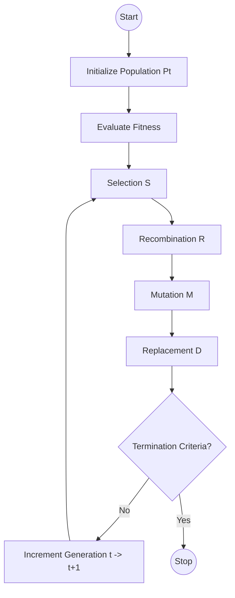
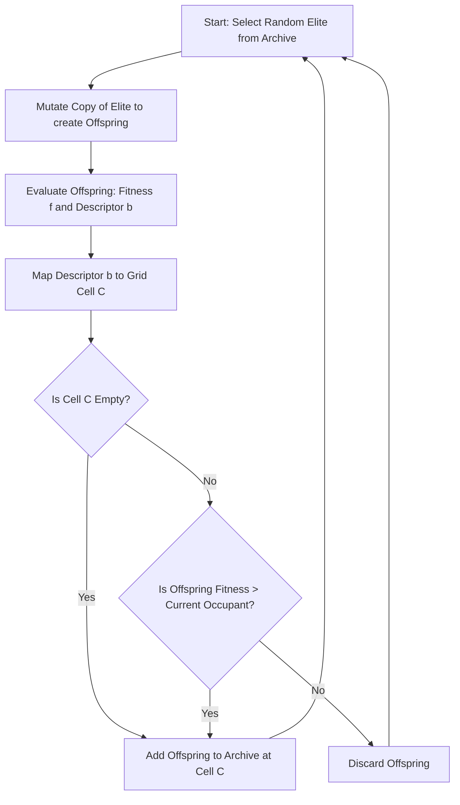

- [1 - Introduction to Stochastic Optimisation](#1---introduction-to-stochastic-optimisation)
- [2 - Historical Paradigms and Taxonomy](#2---historical-paradigms-and-taxonomy)
	- [2.1 - Genetic Algorithms (GA)](#21---genetic-algorithms-ga)
	- [2.2 - Evolution Strategies (ES)](#22---evolution-strategies-es)
	- [2.3 - Evolutionary Programming (EP)](#23---evolutionary-programming-ep)
- [3 - The Mathematical Framework of the Canonical Evolutionary Cycle](#3---the-mathematical-framework-of-the-canonical-evolutionary-cycle)
	- [3.1 - The Algorithmic Cycle](#31---the-algorithmic-cycle)
	- [3.2 - Representation: Genotype vs. Phenotype](#32---representation-genotype-vs-phenotype)
- [4 - Genetic Algorithms: Discrete Optimisation and Schema Theory](#4---genetic-algorithms-discrete-optimisation-and-schema-theory)
	- [4.1 - Operators and Mechanics](#41---operators-and-mechanics)
		- [4.1.1 - Selection Mechanics](#411---selection-mechanics)
		- [4.1.2 - Recombination (Crossover)](#412---recombination-crossover)
	- [4.2 - Mathematical Theory: The Schema Theorem](#42---mathematical-theory-the-schema-theorem)
	- [4.3 - Manual Calculation Example: Maximising $f(x) = x^2$](#43---manual-calculation-example-maximising-fx--x2)
- [5 - Theoretical Runtime Analysis and Complexity](#5---theoretical-runtime-analysis-and-complexity)
	- [5.1 - The (1+1)-EA on OneMax](#51---the-11-ea-on-onemax)
	- [5.2 - Drift Analysis](#52---drift-analysis)
- [6 - Evolution Strategies (ES) and Continuous Optimisation](#6---evolution-strategies-es-and-continuous-optimisation)
	- [6.1 - Mutation and Step Size](#61---mutation-and-step-size)
	- [6.2 - Rechenberg's 1/5th Success Rule](#62---rechenbergs-15th-success-rule)
- [7 - Covariance Matrix Adaptation Evolution Strategy (CMA-ES)](#7---covariance-matrix-adaptation-evolution-strategy-cma-es)
	- [7.1 - Mathematical Geometry of CMA-ES](#71---mathematical-geometry-of-cma-es)
	- [7.2 - The Update Equations](#72---the-update-equations)
- [8 - Differential Evolution (DE)](#8---differential-evolution-de)
	- [8.1 - Vector Difference Mutation](#81---vector-difference-mutation)
	- [8.2 - Variants and Crossover](#82---variants-and-crossover)
- [9 - Neuroevolution: Evolving Structures (NEAT)](#9---neuroevolution-evolving-structures-neat)
	- [9.1 - The Competing Conventions Problem](#91---the-competing-conventions-problem)
	- [9.2 - NEAT (NeuroEvolution of Augmenting Topologies)](#92---neat-neuroevolution-of-augmenting-topologies)
- [10 - Quality Diversity and MAP-Elites](#10---quality-diversity-and-map-elites)
	- [10.1 - The MAP-Elites Algorithm](#101---the-map-elites-algorithm)
- [11 - Comparative Analysis: EAs vs. Classical Methods](#11---comparative-analysis-eas-vs-classical-methods)
	- [11.1 - EAs vs. Gradient Descent (GD)](#111---eas-vs-gradient-descent-gd)
	- [11.2 - EAs vs. Simulated Annealing (SA)](#112---eas-vs-simulated-annealing-sa)
- [12 - Conclusion](#12---conclusion)
- [References](#references)

# 1 - Introduction to Stochastic Optimisation

In the domain of computational intelligence and operations research, the fundamental challenge is the identification of an optimal decision vector $\mathbf{x}^*$ within a defined search space $\Omega$, such that a specific objective function $f: \Omega \rightarrow \mathbb{R}$ is minimised or maximised. Formally, we seek:

$$ \mathbf{x}^* = \underset{\mathbf{x} \in \Omega}{\mathrm{argmin}} \ f(\mathbf{x}) $$

Classical optimisation methods, such as Newton-Raphson or Gradient Descent, rely heavily on the structural properties of $f$. They typically require the function to be differentiable (existence of $\nabla f$), continuous, and ideally convex to guarantee convergence to a global optimum. However, the landscape of real-world problems (ranging from neural network architecture search to aerodynamic design) often defies these requirements. These landscapes are frequently characterised by non-convexity (possessing multiple local optima), discontinuity, high-dimensionality, and the presence of stochastic noise.

Evolutionary Algorithms (EAs) emerged as a robust, gradient-free alternative designed to navigate such pathological landscapes. Grounded in the Darwinian principles of natural selection, EAs abstract the biological processes of reproduction, mutation, recombination, and selection into computational operators. Unlike single-point search methods that traverse a landscape trajectory (like Simulated Annealing), EAs maintain a population of candidate solutions. This population-based approach affords inherent parallelism and a global perspective, allowing the algorithm to explore multiple regions of the search space simultaneously and escape local basins of attraction that would trap deterministic gradient methods.

This report provides an exhaustive technical analysis of Evolutionary Algorithms. It moves beyond high-level analogies to explore the rigorous mathematical underpinnings, from the Holland Schema Theorem and Markov Chain convergence proofs to the complex linear algebra governing Covariance Matrix Adaptation (CMA-ES).

-----

# 2 - Historical Paradigms and Taxonomy

While the field is now unified under the umbrella of Evolutionary Computation (EC), it originated from three distinct independent research streams in the mid-20th century. Understanding these origins clarifies the architectural differences in modern implementations.

## 2.1 - Genetic Algorithms (GA)

Developed by John Holland at the University of Michigan in the 1960s and 1970s, Genetic Algorithms were originally conceived not just as function optimisers but as adaptive systems for studying the mechanisms of natural systems. Holland’s seminal work, *Adaptation in Natural and Artificial Systems* (1975), introduced the theoretical framework of schemata. The primary innovation of the GA was the use of a discrete, genotypic representation (typically binary strings) that was distinct from the phenotype (the actual solution values). This allowed for the application of genetic operators like crossover (recombination) to manipulate the structure of the solution at a fundamental level.

## 2.2 - Evolution Strategies (ES)

Simultaneously, in Germany, Ingo Rechenberg and Hans-Paul Schwefel were grappling with hydrodynamic optimisation problems, such as minimising the drag of an airfoil. They developed Evolution Strategies (ES) to optimise continuous real-valued parameters. Unlike GAs, which emphasised recombination, early ES focused heavily on mutation and selection. Rechenberg formulated the first theoretical convergence rates for EAs, deriving the "1/5th Success Rule" for step-size adaptation, a concept that remains central to continuous optimisation today.

## 2.3 - Evolutionary Programming (EP)

The third stream, Evolutionary Programming, was pioneered by Lawrence Fogel in the United States. Fogel viewed intelligence as the ability to predict the environment and respond essentially. His work focused on evolving finite state machines (FSMs) to predict time-series data. EP emphasised the behavioural linkage between parent and offspring (phenotypic evolution) rather than the genetic mechanism of recombination. Consequently, traditional EP relies exclusively on mutation operators, arguing that crossover is an artefact of sexual reproduction that does not necessarily map to logical problem-solving structures.

-----

# 3 - The Mathematical Framework of the Canonical Evolutionary Cycle

Despite their divergent origins, all EAs share a common macroscopic architecture. We can formalise the evolutionary process as a stochastic difference equation acting on a probability distribution over the search space.

## 3.1 - The Algorithmic Cycle

The canonical EA cycle operates on a population $P_t$ at generation $t$. The transition to $P_{t+1}$ involves four stochastic operators:

  * **Selection ($\mathcal{S}$):** A probabilistic operator that chooses individuals for reproduction based on fitness.
  * **Recombination ($\mathcal{R}$):** A mixing operator combining information from multiple parents.
  * **Mutation ($\mathcal{M}$):** A perturbation operator introducing random variations.
  * **Replacement ($\mathcal{D}$):** A deterministic or stochastic survival step to maintain population size.

The process can be summarised as:

$$ P_{t+1} = \mathcal{D}(\mathcal{M}(\mathcal{R}(\mathcal{S}(P_t)))) $$

## 3.2 - Representation: Genotype vs. Phenotype

A critical mathematical distinction in EAs, particularly GAs, is the mapping between the search space and the representation space.

  * **Genotype Space ($G$):** The encoded representation manipulated by operators (e.g., $\mathbf{g} \in \{0,1\}^L$).
  * **Phenotype Space ($P$):** The actual decision variable space (e.g., $\mathbf{x} \in \mathbb{R}^n$).
  * **Decoding Function ($\phi$):** The mapping $\phi: G \rightarrow P$.
  * **Fitness Function ($F$):** The composition $F = f \circ \phi$, where $f$ is the objective function.

In Evolution Strategies, the mapping is often the identity ($\phi(\mathbf{x}) = \mathbf{x}$), as operators work directly on real vectors. In Genetic Algorithms, $\phi$ is often a binary-to-integer or binary-to-real encoding.

-----

# 4 - Genetic Algorithms: Discrete Optimisation and Schema Theory

Genetic Algorithms represent the most studied class of EAs, particularly suited for combinatorial problems where the solution landscape is discrete.

## 4.1 - Operators and Mechanics

### 4.1.1 - Selection Mechanics

Selection applies evolutionary pressure, directing the search toward high-fitness regions.

**Roulette Wheel Selection (Fitness Proportionate):** The probability $p_i$ of selecting individual $i$ is proportional to its fitness $f_i$ relative to the population sum.

$$ p_i = \frac{f_i}{\sum_{j=1}^{N} f_j} $$

While intuitive, this method suffers from scaling issues. If a "super-individual" appears early, $p_i \to 1$, leading to premature convergence (loss of diversity). Conversely, late in the run when variance is low, $p_i \approx 1/N$ for all $i$, leading to random drift.

**Tournament Selection:** $k$ individuals are sampled uniformly at random, and the one with the highest fitness is selected. The parameter $k$ (tournament size) explicitly tunes selection pressure. Large $k$ approximates deterministic selection (exploitation); $k=1$ is random search (exploration). Tournament selection is invariant to translation and scaling of the fitness function, making it robust for diverse problem types.

### 4.1.2 - Recombination (Crossover)

Crossover is the primary exploration operator in GAs, predicated on the idea that combining two partial solutions may yield a better complete solution.

**One-Point Crossover:** Given two strings of length $L$, a cut point $k \sim \mathcal{U}(1, L-1)$ is chosen.

  * **Parent 1:** $x_{1,1} \dots x_{1,k} \ | \ x_{1,k+1} \dots x_{1,L}$
  * **Parent 2:** $x_{2,1} \dots x_{2,k} \ | \ x_{2,k+1} \dots x_{2,L}$
  * **Offspring:** $x_{1,1} \dots x_{1,k} \ | \ x_{2,k+1} \dots x_{2,L}$

**Uniform Crossover:** Each bit $j$ in the offspring is copied from Parent 1 or Parent 2 with probability $0.5$. This treats genes as independent but can disrupt linked groups of genes.

## 4.2 - Mathematical Theory: The Schema Theorem

The fundamental question "Why do GAs work?" is addressed by Holland's Schema Theorem. It formalises the notion that GAs search by sampling "schemata" (similarity templates representing hyperplanes in the search space).

**Definitions:**

  * **Schema ($H$):** A string over the alphabet $\{0, 1, *\}$, where $*$ is a wildcard. A schema $H$ represents the set of all binary strings that match $H$ at the non-wildcard positions.
      * Example: $H = 1*01$; matches $1001$ and $1101$.
  * **Order ($o(H)$):** The number of fixed positions (0 or 1) in the schema. For $H=1*01$, $o(H)=3$.
  * **Defining Length ($\delta(H)$):** The distance between the outermost fixed positions.
      * For $H=1*01$, fixed indices are 1, 3, 4. $\delta(H) = 4 - 1 = 3$.

**The Derivation:**
We track the expected number of instances of schema $H$, denoted $m(H, t)$, in the population at generation $t$.

**Effect of Selection:** Under fitness proportionate selection, individuals matching $H$ are selected based on the average fitness of the schema $\bar{f}(H)$ relative to the population mean $\bar{f}$.
$$ E[m_{sel}(H, t)] = m(H, t) \frac{\bar{f}(H)}{\bar{f}} $$
This indicates that schemata with above-average fitness grow exponentially in representation.

**Effect of Crossover:** Single-point crossover disrupts a schema if the cut point falls between the fixed positions. The probability of the cut point falling within the defining length $\delta(H)$ is $\delta(H) / (L-1)$. Even if cut, the schema might survive if the other parent also matches the schema (though the lower bound assumes the worst case).
$$ P(\text{survival under crossover}) \geq 1 - p_c \frac{\delta(H)}{L-1} $$

**Effect of Mutation:** A schema survives only if none of its fixed positions $o(H)$ are mutated. With bit-flip probability $p_m$:
$$ P(\text{survival under mutation}) = (1 - p_m)^{o(H)} \approx 1 - o(H)p_m $$
(approximated for small $p_m$).

**The Fundamental Theorem:**
Combining these effects yields the lower bound on schema propagation:

$$ E[m(H, t+1)] \geq m(H, t) \frac{\bar{f}(H)}{\bar{f}} \left[ 1 - p_c \frac{\delta(H)}{L-1} - o(H)p_m \right] $$

**The Building Block Hypothesis:**
The theorem implies that short, low-order, above-average fitness schemata (termed "Building Blocks") are sampled at exponentially increasing rates. The hypothesis suggests that GAs solve problems by hierarchically combining these small building blocks into larger, highly fit schemata.

**Critique:** The theorem is a lower bound. It does not account for the creation of new schema instances via crossover, nor does it guarantee convergence in the case of deceptive fitness landscapes where low-order building blocks lead away from the global optimum.

## 4.3 - Manual Calculation Example: Maximising $f(x) = x^2$

To visualise the discrete dynamics, we perform a granular trace of a simple GA iteration.

**Problem Setup:**

  * **Objective:** Maximise $f(x) = x^2$ for integers $x \\in $.
  * **Encoding:** 5-bit binary strings (Genotype length $L=5$).
  * **Population Size:** $N=4$.
  * **Operators:** Roulette Selection, One-Point Crossover ($p_c = 1.0$), Bit Mutation ($p_m \approx 0$).

**Generation $t=0$ (Initialization):**
We randomly generate 4 individuals.

  * **Ind A:** 01101 $\rightarrow$ Decodes to $13$. Fitness $13^2 = 169$.
  * **Ind B:** 11000 $\rightarrow$ Decodes to $24$. Fitness $24^2 = 576$.
  * **Ind C:** 01000 $\rightarrow$ Decodes to $8$. Fitness $8^2 = 64$.
  * **Ind D:** 10011 $\rightarrow$ Decodes to $19$. Fitness $19^2 = 361$.

**Population Statistics:**
Total Fitness $\Sigma F = 169 + 576 + 64 + 361 = 1170$.
Average Fitness $\bar{f} = 292.5$.
Max Fitness = 576 (Ind B).

**Step 1: Selection (Roulette Wheel):**
We calculate selection probabilities $P_i = f_i / \Sigma F$.

  * $P(A) = 169/1170 \approx 0.14$
  * $P(B) = 576/1170 \approx 0.49$
  * $P(C) = 64/1170 \approx 0.05$
  * $P(D) = 361/1170 \approx 0.31$

We spin the wheel 4 times. Due to high probability, assume we select:

1.  Ind B (11000)
2.  Ind B (11000) (selected twice due to high fitness)
3.  Ind D (10011)
4.  Ind A (01101)
    Ind C (the weakest) is eliminated.

**Step 2: Crossover (Pairing):**
We pair the selected parents: Pair 1 (B, B) and Pair 2 (D, A).

  * **Pair 1:** 11000 $\times$ 11000.
    Since parents are identical, any crossover point yields clones.
      * **Offspring 1:** 11000 (24)
      * **Offspring 2:** 11000 (24)
  * **Pair 2:** 10011 (19) $\times$ 01101 (13).
    Let random cut point $k=2$ (after the 2nd bit).
      * Parent D: 10 | 011
      * Parent A: 01 | 101
      * **Offspring 3:** Takes head of D, tail of A: 10 + 101 = 10101. Decodes to 21. Fitness $441$.
      * **Offspring 4:** Takes head of A, tail of D: 01 + 011 = 01011. Decodes to 11. Fitness $121$.

**Generation $t=1$ (Result):**

  * **New Population:** $\{24, 24, 21, 11\}$.
  * **New Fitnesses:** $\{576, 576, 441, 121\}$.
  * **New Total:** $1714$.
  * **New Average:** $428.5$.

**Analysis:** The average fitness jumped from $292.5$ to $428.5$. The algorithm exploited the best solution (24) by cloning it and explored new areas (21) by recombining parts of (19) and (13). Notice that Offspring 3 (21) is better than both its parents (19 and 13), demonstrating the constructive power of recombination.

-----

# 5 - Theoretical Runtime Analysis and Complexity

Moving beyond the Schema Theorem, modern theoretical analysis focuses on First Hitting Time: the expected number of function evaluations $E$ required to find the global optimum.

## 5.1 - The (1+1)-EA on OneMax

The OneMax problem is the canonical "fruit fly" of discrete EA theory. The goal is to maximise the number of 1s in a binary string of length $n$:
$$ f(\mathbf{x}) = \sum_{i=1}^n x_i $$

**Algorithm (1+1)-EA:**

1.  Maintain one solution $\mathbf{x}$.
2.  Create offspring $\mathbf{y}$ by flipping each bit of $\mathbf{x}$ with probability $p=1/n$.
3.  If $f(\mathbf{y}) \geq f(\mathbf{x})$, replace $\mathbf{x}$ with $\mathbf{y}$.

**Complexity Derivation:**
This process can be modelled using the Coupon Collector's Problem.
Let $i$ be the current number of zeros in the string. To improve fitness, we must flip at least one of the $i$ zeros to a one. The probability of flipping exactly one zero and no ones (a successful 1-bit mutation) is:

$$ P(\text{success}|i) \geq \binom{i}{1} \frac{1}{n} \left(1 - \frac{1}{n}\right)^{n-1} \approx \frac{i}{n} \cdot \frac{1}{e} $$

The expected waiting time (number of mutations) to improve from fitness $n-i$ to $n-i+1$ is the inverse of this probability:
$$ E \approx \frac{en}{i} $$

The total expected time to go from an arbitrary string (roughly $n/2$ zeros) to the optimum (0 zeros) is the sum over all $i$:
$$ E = \sum_{i=1}^{n} E \approx \sum_{i=1}^{n} \frac{en}{i} = en \sum_{i=1}^{n} \frac{1}{i} $$

Since the harmonic series $\sum \frac{1}{i} \approx \ln n$, the total complexity is:
$$ E \in \Theta(n \log n) $$
This result proves that a simple EA is efficient (polynomial time) on unimodal functions like OneMax.

## 5.2 - Drift Analysis

For more complex problems, researchers use Drift Analysis. If $X_t$ is the distance to the optimum, the "drift" is $\Delta_t = E[X_t - X_{t+1} | X_t]$.

  * **Additive Drift Theorem:** If the drift is bounded below by a constant $\delta > 0$, then the expected time is at most $X_0 / \delta$.
  * **Variable Drift:** If drift depends on the distance, more complex bounds are derived.

Recent work has established tight bounds for the (1+1)-EA on linear functions and investigated the impact of noise on these bounds, showing that even slight noise can degrade performance from polynomial to exponential time if not handled correctly.

-----

# 6 - Evolution Strategies (ES) and Continuous Optimisation

When $\Omega = \mathbb{R}^n$, discrete encodings introduce "Hamming Cliffs" (where close phenotypic values have distant genotypic representations). Evolution Strategies (ES) operate directly on real-valued vectors.

## 6.1 - Mutation and Step Size

The core operator in ES is Gaussian mutation:
$$ \mathbf{x}_{child} = \mathbf{x}_{parent} + \sigma \cdot \mathcal{N}(\mathbf{0}, \mathbf{I}) $$
Here, $\mathcal{N}(\mathbf{0}, \mathbf{I})$ is a random vector from the standard multivariate normal distribution, and $\sigma$ is the step size (mutation strength).

The performance of ES is entirely dependent on $\sigma$:

  * $\sigma$ too large: The algorithm behaves like random search; offspring land far from the parent, likely in low-fitness regions.
  * $\sigma$ too small: Convergence is extremely slow; the algorithm "creeps" toward the optimum.

## 6.2 - Rechenberg's 1/5th Success Rule

Ingo Rechenberg derived the optimal adaptation of $\sigma$ by analysing two model functions: the Sphere model ($f(\mathbf{x}) = \|\mathbf{x}\|^2$) and the Corridor model. He found that the optimal rate of convergence occurs when the ratio of successful mutations (mutations that improve fitness) to total mutations is approximately 0.2 (or 1/5).

**The Adaptive Heuristic:**
Let $p_s$ be the measured success rate over the last $k$ generations.

$$ \sigma_{t+1} = \begin{cases} \sigma_t / c & \text{if } p_s < 1/5 \\ \sigma_t \cdot c & \text{if } p_s > 1/5 \\ \sigma_t & \text{if } p_s = 1/5 \end{cases} $$

where $c$ is a constant (e.g., $0.817$). This rudimentary self-adaptation allows the ES to dynamically adjust its search radius, expanding in flat regions and contracting near the optimum.

-----

# 7 - Covariance Matrix Adaptation Evolution Strategy (CMA-ES)

The 1/5th rule works well for isotropic (spherical) landscapes. However, real-world continuous problems are often ill-conditioned: the function curves steeply in some directions and is flat in others (valley-like structures). An isotropic mutation distribution ($\sigma \mathbf{I}$) is inefficient here, as it must be very small to avoid jumping out of the narrow valley, halting progress along the long axis.

CMA-ES solves this by learning the full covariance matrix $\mathbf{C}$ of the mutation distribution, effectively learning the "shape" of the search landscape. It is widely considered the state-of-the-art for continuous black-box optimisation.

## 7.1 - Mathematical Geometry of CMA-ES

CMA-ES samples offspring from a multivariate normal distribution:
$$ \mathbf{x} \sim \mathbf{m} + \sigma \mathcal{N}(\mathbf{0}, \mathbf{C}) $$
The covariance matrix $\mathbf{C}$ defines the shape of the mutation ellipsoid. Through eigen-decomposition, $\mathbf{C} = \mathbf{B}\mathbf{D}^2\mathbf{B}^T$, the matrix adapts to the principal components of the local landscape (similar to the inverse Hessian $\mathbf{H}^{-1}$ in Newton's method).

  * $\mathbf{m}$ (Mean): The current best estimate of the optimum.
  * $\sigma$ (Step-size): The overall scale of the search.
  * $\mathbf{C}$ (Covariance): Determines the correlation between variables and the scaling of individual coordinate axes.

## 7.2 - The Update Equations

The algorithm proceeds in a cycle of sampling, ranking, and updating. The updates are performed using weighted selection, where $\mu$ best individuals are used.

**1. Updating the Mean ($\mathbf{m}$)**
The new mean is a weighted average of the $\mu$ best offspring:
$$ \mathbf{m}^{(g+1)} = \sum_{i=1}^{\mu} w_i \mathbf{x}_{i:\lambda}^{(g+1)} $$
where $\mathbf{x}_{i:\lambda}$ is the $i$-th best individual and weights $w_i$ sum to 1.

**2. The Evolution Path ($p_c$)**
To facilitate the adaptation of $\mathbf{C}$, CMA-ES tracks the "trajectory" of the mean over generations. This is the Evolution Path, which acts like momentum.
$$ \mathbf{p}_c^{(g+1)} = (1-c_c)\mathbf{p}_c^{(g)} + \sqrt{c_c(2-c_c)\mu_{eff}} \frac{\mathbf{m}^{(g+1)} - \mathbf{m}^{(g)}}{\sigma^{(g)}} $$
This vector accumulates the directions in which the mean has moved. If the mean moves consistently in one direction, $\mathbf{p}_c$ grows large in that direction.

**3. Updating the Covariance Matrix ($\mathbf{C}$)**
The covariance matrix update combines two mechanisms:

  * **Rank-1 Update:** Uses the evolution path $\mathbf{p}_c \mathbf{p}_c^T$. This pushes the distribution to elongate along the direction of successful steps.
  * **Rank-$\mu$ Update:** Uses the covariance of the successful offspring steps. This captures the immediate local variance.

$$ \mathbf{C}^{(g+1)} = (1 - c_1 - c_\mu)\mathbf{C}^{(g)} + \underbrace{c_1 \mathbf{p}_c^{(g+1)}(\mathbf{p}_c^{(g+1)})^T}_{\text{Rank-1}} + \underbrace{c_\mu \sum_{i=1}^{\mu} w_i \mathbf{y}_{i:\lambda} (\mathbf{y}_{i:\lambda})^T}_{\text{Rank-}\mu} $$
where $\mathbf{y}_{i:\lambda} = \frac{\mathbf{x}_{i:\lambda} - \mathbf{m}^{(g)}}{\sigma^{(g)}}$.

**4. Step-Size Control (Cumulative Path Length)**
To adapt the global step size $\sigma$, CMA-ES uses a conjugate evolution path $\mathbf{p}_\sigma$ (unscaled by the axis lengths $\mathbf{D}$).
$$ \mathbf{p}_\sigma^{(g+1)} = (1-c_\sigma)\mathbf{p}_\sigma^{(g)} + \sqrt{c_\sigma(2-c_\sigma)\mu_{eff}} \mathbf{C}^{(g)^{-\frac{1}{2}}} \frac{\mathbf{m}^{(g+1)} - \mathbf{m}^{(g)}}{\sigma^{(g)}} $$
The length of this path $\|\mathbf{p}_\sigma\|$ is compared to the expected length of a random walk $\mathbb{E}\|\mathcal{N}(\mathbf{0}, \mathbf{I})\|$.

  * If $\|\mathbf{p}_\sigma\| > \text{Expected}$: The steps are correlated (moving straight). Increase $\sigma$.
  * If $\|\mathbf{p}_\sigma\| < \text{Expected}$: The steps are anti-correlated (cancelling out/zig-zagging). Decrease $\sigma$.

This rigorous mathematical structure allows CMA-ES to act as a second-order optimiser without ever explicitly computing gradients or Hessians.

-----

# 8 - Differential Evolution (DE)

While CMA-ES explicitly models the search distribution, Differential Evolution (DE) implicitly adapts the search topology using vector arithmetic on the population itself. It is celebrated for its simplicity and efficacy in global optimisation.

## 8.1 - Vector Difference Mutation

The distinguishing feature of DE is that it generates mutations not by sampling a pre-defined distribution (like Gaussian), but by calculating the difference between existing population members.

For a target vector $\mathbf{x}_i$, a mutant vector $\mathbf{v}_i$ is generated. The classic strategy DE/rand/1 is defined as:
$$ \mathbf{v}_i = \mathbf{x}_{r1} + F \cdot (\mathbf{x}_{r2} - \mathbf{x}_{r3}) $$
where $r1, r2, r3$ are random indices distinct from $i$, and $F \\in $ is a scaling factor.

**Mathematical Insight:**
The difference vector $(\mathbf{x}_{r2} - \mathbf{x}_{r3})$ automatically scales the mutation.

  * **Early search:** Population is spread out (Differences are large; Large global exploration).
  * **Late search:** Population converges (Differences are small; Fine-grained local exploitation).
    This property allows DE to self-adapt its step size naturally without complex update rules.

## 8.2 - Variants and Crossover

After mutation, a trial vector $\mathbf{u}_i$ is created via Binomial Crossover between $\mathbf{x}_i$ and $\mathbf{v}_i$.

$$ u_{j,i} = \begin{cases} v_{j,i} & \text{if } rand_j < CR \text{ or } j = j_{rand} \\ x_{j,i} & \text{otherwise} \end{cases} $$

**DE/best/1/bin Variant:**
$$ \mathbf{v}_i = \mathbf{x}_{best} + F \cdot (\mathbf{x}_{r1} - \mathbf{x}_{r2}) $$
This strategy centres the search around the best-so-far solution. It converges faster than DE/rand/1 but has a higher risk of stagnation in local optima due to loss of diversity.

-----

# 9 - Neuroevolution: Evolving Structures (NEAT)

Standard EAs optimise fixed-length parameter vectors. Neuroevolution applies EAs to Artificial Neural Networks (ANNs), aiming to optimise weights and, crucially, the topology (structure) of the network.

## 9.1 - The Competing Conventions Problem

A major mathematical hurdle in evolving networks is the Competing Conventions Problem (or Permutation Symmetry).
Consider two networks that compute the same function but have their hidden nodes permuted.

  * Network A: Hidden Node 1 = "Feature X", Hidden Node 2 = "Feature Y".
  * Network B: Hidden Node 1 = "Feature Y", Hidden Node 2 = "Feature X".
    If we naively cross over these networks (e.g., taking Node 1 from A and Node 2 from B), the offspring might get "Feature X" twice or "Feature Y" twice, resulting in a dysfunctional network. This makes topological crossover destructive.

## 9.2 - NEAT (NeuroEvolution of Augmenting Topologies)

Kenneth Stanley's NEAT algorithm solves this using Historical Markings (Innovation Numbers).

  * **Innovation Numbers:** Every time a structural mutation adds a new connection gene, it is assigned a global innovation number.
  * **Gene Alignment:** During crossover, genes from two parents are aligned by their innovation numbers.
  * **Matching Genes:** Inherited randomly from either parent.
  * **Disjoint/Excess Genes:** Inherited from the fitter parent.

This alignment ensures that homologous structures are matched, preserving functionality.

**Speciation via Compatibility Distance:**
To allow new, innovative structures time to optimise their weights before competing with established networks, NEAT separates the population into species. The distance $\delta$ between two genomes is calculated as:

$$ \delta = \frac{c_1 E}{N} + \frac{c_2 D}{N} + c_3 \bar{W} $$

  * $E$: Number of Excess genes (genes outside the range of the other parent).
  * $D$: Number of Disjoint genes (genes within the range but missing).
  * $\bar{W}$: Average weight difference of matching genes.
  * $N$: Number of genes in the larger genome (normaliser).

If $\delta$ is below a threshold $\delta_t$, the networks belong to the same species.

-----

# 10 - Quality Diversity and MAP-Elites

Traditional optimisation seeks a single global optimum $\mathbf{x}^*$. However, in many AI tasks (e.g., Robotics), we desire a diverse repertoire of high-performing behaviours. Quality Diversity (QD) algorithms represent a paradigm shift from "Optimisation" to "Illumination".

## 10.1 - The MAP-Elites Algorithm

MAP-Elites (Multi-dimensional Archive of Phenotypic Elites) produces a map of solutions.

  * **Behaviour Space:** Define $k$ dimensions of phenotypic interest (e.g., for a hexapod robot: Height $\times$ Speed).
  * **Discretisation:** The space is tessellated into a grid of cells.
  * **Archive:** Each cell stores the single best individual found so far that maps to that cell's behavioural descriptor.

**The Algorithm Loop:**

1.  Select a parent randomly from the populated cells in the archive.
2.  Mutate the parent to create offspring $\mathbf{x}'$.
3.  Evaluate $\mathbf{x}'$ to get fitness $f(\mathbf{x}')$ and descriptor $\mathbf{b}(\mathbf{x}')$.
4.  Map $\mathbf{b}(\mathbf{x}')$ to a cell index $C$.
5.  **Update Rule:** If cell $C$ is empty, or if $f(\mathbf{x}') > f(\text{current occupant of } C)$:
    $$ \text{Archive}[C] \leftarrow \mathbf{x}' $$

This simple mechanism illuminates the search space, revealing the performance limits across the entire spectrum of behaviours. It has been successfully used for damage recovery in robots, where the agent can switch to a different "walking gait" from the map if a leg is broken.

-----

# 11 - Comparative Analysis: EAs vs. Classical Methods

It is vital to understand when to use EAs versus classical counterparts.

## 11.1 - EAs vs. Gradient Descent (GD)

**Convergence Rate:**

  * **GD:** On strongly convex smooth functions, Gradient Descent converges linearly (geometric progression), or super-linearly if using Newton's method. Error $\epsilon$ decreases as $O(\log(1/\epsilon))$ or better.
  * **EAs:** Typically exhibit sub-linear or linear convergence, but with a much worse constant factor. For a convex problem, GD is orders of magnitude faster.

**Non-Convexity:**

  * **GD:** Gets stuck in local optima. Requires restarts or stochastic noise (SGD) to escape. In high dimensions, GD struggles with saddle points where $\nabla f \approx 0$ but the point is not an extremum.
  * **EAs:** Being population-based, they naturally span large areas. Recombination allows "tunneling" through barriers. They are indifferent to saddle points as they do not rely on gradients.

## 11.2 - EAs vs. Simulated Annealing (SA)

**Mechanism:** SA mimics the cooling of metals. It is a single-solution trajectory method that accepts worse solutions with probability $P = \exp(-\Delta E / T)$ to escape optima.

**Comparison:**

  * SA is generally faster than EAs for simpler combinatorial problems due to lower overhead (evaluating 1 solution vs. $N$).
  * EAs (specifically GAs) excel when the problem has "building block" structure. The crossover operator in EAs provides a mixing capability that SA lacks. Theoretical studies suggest EAs can solve certain classes of problems (like "Royal Road" functions) in polynomial time where SA takes exponential time.

-----

# 12 - Conclusion

Evolutionary Algorithms constitute a versatile and mathematically rich paradigm for optimisation. While they may appear heuristic on the surface, their behaviour is governed by rigorous probabilistic dynamics (from the flow of schemata in GAs to the eigen-decomposition of covariance matrices in CMA-ES).

**Implementation:** For discrete problems, a simple GA with Tournament Selection is the standard starting point. For continuous parameters, CMA-ES is the gold standard, offering quasi-Newton performance without gradients. For neural topologies, NEAT provides a principled way to evolve structure.

**Perspective:** EAs are not a "magic bullet" superior to gradient methods everywhere. They are a "heavy artillery" tool for landscapes that are rugged, noisy, discontinuous, or fundamentally "black-box."

Understanding the mathematical update rules (like the Rank-1 update in CMA-ES or the speciation formula in NEAT) empowers the practitioner not just to use these libraries, but to adapt and diagnose them effectively in complex AI applications.

**Table 1: Summary of Key Algorithms and Mathematical characteristics**

| Algorithm              | Domain      | Representation | Core Operator         | Key Math Concept                       |
| :--------------------- | :---------- | :------------- | :-------------------- | :------------------------------------- |
| Simple GA              | Discrete    | Binary Strings | Crossover             | Schema Theorem & Markov Chains         |
| Evolution Strategy     | Continuous  | Real Vectors   | Gaussian Mutation     | 1/5th Success Rule                     |
| CMA-ES                 | Continuous  | Real Vectors   | Covariance Adaptation | Eigen-decomposition & Natural Gradient |
| Differential Evolution | Continuous  | Real Vectors   | Vector Difference     | Self-adaptive Difference Vectors       |
| NEAT                   | Neural Nets | Graphs         | Historical Markings   | Compatibility Distance (Speciation)    |
| MAP-Elites             | Behavioural | Arbitrary      | Map/Grid Update       | Illumination / Quality Diversity       |

---

# References

1. Holland, J. H. (1973). *Genetic Algorithms and the Optimal Allocation of Trials*. **SIAM Journal on Computing, 2**(2), 88–105. [https://doi.org/10.1137/0202009](https://doi.org/10.1137/0202009) ([epubs.siam.org][1])

2. Bridges, C. L., & Goldberg, D. E. (1987). *An Analysis of Reproduction and Crossover in a Binary-Coded Genetic Algorithm*. In **Proceedings of the Second International Conference on Genetic Algorithms and Their Applications (ICGA’87)**, pp. 9–13. [https://dl.acm.org/doi/10.5555/42512.42514](https://dl.acm.org/doi/10.5555/42512.42514) ([ACM Digital Library][2])

3. Mitchell, M., Forrest, S., & Holland, J. H. (1992). *The Royal Road for Genetic Algorithms: Fitness Landscapes and GA Performance*. In **Proceedings of the First European Conference on Artificial Life (ECAL’92)**, pp. 245–254. [http://melaniemitchell.me/Papers/ecal92.pdf](http://melaniemitchell.me/Papers/ecal92.pdf) ([melaniemitchell.me][3])

4. Rudolph, G. (1994). *Convergence Analysis of Canonical Genetic Algorithms*. **IEEE Transactions on Neural Networks, 5**(1), 96–101. [https://ls11-www.cs.tu-dortmund.de/people/rudolph/publications/papers/TNN5.1.pdf](https://ls11-www.cs.tu-dortmund.de/people/rudolph/publications/papers/TNN5.1.pdf) ([ls11-www.cs.tu-dortmund.de][4])

5. Rudolph, G. (1996). *Convergence of Evolutionary Algorithms in General Search Spaces*. In **Proceedings of the IEEE International Conference on Evolutionary Computation (ICEC’96)**, pp. 50–54. [https://www.semanticscholar.org/paper/Convergence-of-evolutionary-algorithms-in-general-Rudolph/cd51b0ce9571cddbb23f09c630ea008a6f5fc09b](https://www.semanticscholar.org/paper/Convergence-of-evolutionary-algorithms-in-general-Rudolph/cd51b0ce9571cddbb23f09c630ea008a6f5fc09b) ([Semantic Scholar][5])

6. Rudolph, G. (1998). *Finite Markov Chain Results in Evolutionary Computation: A Tour d’Horizon*. **Fundamenta Informaticae, 35**(1–4), 67–89. [https://doi.org/10.3233/FI-1998-35123406](https://doi.org/10.3233/FI-1998-35123406) ([SpringerLink][6])

7. Droste, S., Jansen, T., & Wegener, I. (2002). *On the Analysis of the (1+1) Evolutionary Algorithm*. **Theoretical Computer Science, 276**(1–2), 51–81. [https://doi.org/10.1016/S0304-3975(01)00182-7](https://doi.org/10.1016/S0304-3975%2801%2900182-7) ([ScienceDirect][7])

8. He, J., & Yao, X. (2001). *Drift Analysis and Average Time Complexity of Evolutionary Algorithms*. **Artificial Intelligence, 127**(1), 57–85. [https://doi.org/10.1016/S0004-3702(01)00058-3](https://doi.org/10.1016/S0004-3702%2801%2900058-3) ([ScienceDirect][8])

9. He, J., & Yao, X. (2002). *From an Individual to a Population: An Analysis of the First Hitting Time of Population-Based Evolutionary Algorithms*. **IEEE Transactions on Evolutionary Computation, 6**(5), 495–511. [https://doi.org/10.1109/TEVC.2002.804323](https://doi.org/10.1109/TEVC.2002.804323) ([ResearchGate][9])

10. Lengler, J. (2018). *Drift Analysis and Evolutionary Algorithms Revisited*. **Combinatorics, Probability and Computing, 27**(4), 643–666. [https://doi.org/10.1017/S0963548318000118](https://doi.org/10.1017/S0963548318000118) ([Cambridge University Press & Assessment][10])

11. Rudolph, G., & Agapie, A. (2000). *Convergence Properties of Some Multi-Objective Evolutionary Algorithms*. In **Proceedings of the 2000 Congress on Evolutionary Computation (CEC 2000)**, Vol. 2, pp. 1010–1016. [https://doi.org/10.1109/CEC.2000.870756](https://doi.org/10.1109/CEC.2000.870756) ([ResearchGate][11])

12. Hansen, N., & Ostermeier, A. (2001). *Completely Derandomized Self-Adaptation in Evolution Strategies*. **Evolutionary Computation, 9**(2), 159–195. [https://doi.org/10.1162/106365601750190398](https://doi.org/10.1162/106365601750190398) ([Cmap Tools][12])

13. Glasmachers, T. (2020). *Global Convergence of the (1+1) Evolution Strategy*. **Evolutionary Computation, 28**(1), 27–52. Preprint: [https://arxiv.org/abs/1706.02887](https://arxiv.org/abs/1706.02887) ([arXiv][13])

14. Agapie, A. (2023). *Evolution Strategies under the 1/5 Success Rule*. **Mathematics, 11**(1), 201. [https://doi.org/10.3390/math11010201](https://doi.org/10.3390/math11010201) ([MDPI][14])

15. Storn, R., & Price, K. (1997). *Differential Evolution – A Simple and Efficient Heuristic for Global Optimization over Continuous Spaces*. **Journal of Global Optimization, 11**, 341–359. [https://doi.org/10.1023/A:1008202821328](https://doi.org/10.1023/A:1008202821328) ([SpringerLink][15])

16. Stanley, K. O., & Miikkulainen, R. (2002). *Evolving Neural Networks through Augmenting Topologies*. **Evolutionary Computation, 10**(2), 99–127. [https://doi.org/10.1162/106365602320169811](https://doi.org/10.1162/106365602320169811) ([nn.cs.utexas.edu][16])

17. Mouret, J.-B., & Clune, J. (2015). *Illuminating Search Spaces by Mapping Elites*. **CoRR**, arXiv:1504.04909. [https://arxiv.org/abs/1504.04909](https://arxiv.org/abs/1504.04909) ([arXiv][17])

18. Goldberg, D. E., & Richardson, J. (1987). *Genetic Algorithms with Sharing for Multimodal Function Optimization*. In **Proceedings of the Second International Conference on Genetic Algorithms and Their Applications (ICGA’87)**, pp. 41–49. [https://dl.acm.org/doi/10.5555/42512.42519](https://dl.acm.org/doi/10.5555/42512.42519) ([ACM Digital Library][18])

[1]: https://epubs.siam.org/doi/10.1137/0202009?utm_source=chatgpt.com "Genetic Algorithms and the Optimal Allocation of Trials"
[2]: https://dl.acm.org/doi/10.5555/42512.42514?utm_source=chatgpt.com "An analysis of reproduction and crossover in a binary- ..."
[3]: https://melaniemitchell.me/PapersContent/ecal92.pdf?utm_source=chatgpt.com "The Royal Road for Genetic Algorithms: Fitness Landscapes ..."
[4]: https://ls11-www.cs.tu-dortmund.de/people/rudolph/publications/papers/TNN5.1.pdf?utm_source=chatgpt.com "Convergence Analysis of Canonical Genetic Algorithms"
[5]: https://www.semanticscholar.org/paper/Convergence-of-evolutionary-algorithms-in-general-Rudolph/cd51b0ce9571cddbb23f09c630ea008a6f5fc09b?utm_source=chatgpt.com "Convergence of evolutionary algorithms in general search ..."
[6]: https://link.springer.com/chapter/10.1007/978-1-4615-1539-5_1?utm_source=chatgpt.com "An Introduction to Evolutionary Algorithms"
[7]: https://www.sciencedirect.com/science/article/pii/S0304397501001827/pdf?md5=5fac4d22eb6bbf0e3e1f4a00434e670e&pid=1-s2.0-S0304397501001827-main.pdf&utm_source=chatgpt.com "On the analysis of the (1 + 1) evolutionary algorithm"
[8]: https://www.sciencedirect.com/science/article/pii/S0004370201000583?utm_source=chatgpt.com "Drift analysis and average time complexity of evolutionary ..."
[9]: https://www.researchgate.net/publication/220132997_A_study_of_drift_analysis_for_estimating_computation_time_of_evolutionary_algorithms?utm_source=chatgpt.com "A study of drift analysis for estimating computation time ..."
[10]: https://www.cambridge.org/core/journals/combinatorics-probability-and-computing/article/drift-analysis-and-evolutionary-algorithms-revisited/264EEBAC1C92951B2E7B5BE1B4A1D6DE?utm_source=chatgpt.com "Drift Analysis and Evolutionary Algorithms Revisited"
[11]: https://www.researchgate.net/publication/3865293_Convergence_Properties_of_Some_Multi-Objective_Evolutionary_Algorithms?utm_source=chatgpt.com "(PDF) Convergence Properties of Some Multi-Objective ..."
[12]: https://www.cmap.polytechnique.fr/~nikolaus.hansen/cmaartic.pdf?utm_source=chatgpt.com "Completely Derandomized Self-Adaptation in Evolution ..."
[13]: https://arxiv.org/pdf/1706.02887?utm_source=chatgpt.com "Global Convergence of the (1+1) Evolution Strategy"
[14]: https://www.mdpi.com/2227-7390/11/1/201?utm_source=chatgpt.com "Evolution Strategies under the 1/5 Success Rule"
[15]: https://link.springer.com/article/10.1023/A%3A1008202821328?utm_source=chatgpt.com "Differential Evolution - Journal of Global Optimization"
[16]: https://nn.cs.utexas.edu/?stanley%3Aec02=&utm_source=chatgpt.com "Evolving Neural Networks Through Augmenting Topologies"
[17]: https://arxiv.org/abs/1504.04909?utm_source=chatgpt.com "Illuminating search spaces by mapping elites"
[18]: https://dl.acm.org/doi/10.5555/42512.42519?utm_source=chatgpt.com "Genetic algorithms with sharing for multimodal function ..."
