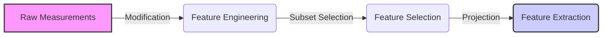
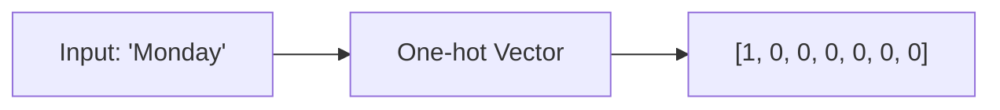

- [1 - Foundations of Data Representation](#1---foundations-of-data-representation)
	- [1.1 - Terminology and Definitions](#11---terminology-and-definitions)
	- [1.2 - Feature Engineering \& Selection](#12---feature-engineering--selection)
- [2 - Principal Component Analysis (PCA)](#2---principal-component-analysis-pca)
	- [2.1 - Theoretical Basis](#21---theoretical-basis)
	- [2.2 - The Karhunen-Loève Transform (KLT)](#22---the-karhunen-loève-transform-klt)
	- [2.3 - Neural Network Implementations](#23---neural-network-implementations)
	- [2.4 - The Whitening Transform](#24---the-whitening-transform)
- [3 - Linear Discriminant Analysis (LDA)](#3---linear-discriminant-analysis-lda)
	- [3.2 - Fisher’s Linear Discriminant](#32---fishers-linear-discriminant)
- [4 - Independent Component Analysis (ICA)](#4---independent-component-analysis-ica)
	- [4.1 - Concepts](#41---concepts)
	- [4.2 - Implementation](#42---implementation)
- [5 - Random Projections \& Extreme Learning Machines](#5---random-projections--extreme-learning-machines)
	- [5.1 - Random Projections](#51---random-projections)
	- [5.2 - Extreme Learning Machines (ELM)](#52---extreme-learning-machines-elm)
- [6 - Sparse Coding](#6---sparse-coding)
	- [6.1 - Dictionary-Based Methods](#61---dictionary-based-methods)
	- [6.2 - Optimisation \& Competition](#62---optimisation--competition)
	- [Step-by-Step Computational Examples](#step-by-step-computational-examples)
		- [Step 1: Evaluate Alternative A ($y\_A$)](#step-1-evaluate-alternative-a-y_a)
		- [Step 2: Evaluate Alternative B ($y\_B$)](#step-2-evaluate-alternative-b-y_b)
		- [Step 3: Evaluate Alternative C ($y\_C$)](#step-3-evaluate-alternative-c-y_c)

# 1 - Foundations of Data Representation

## 1.1 - Terminology and Definitions

To effectively classify data, we must prepare the raw input measurements. We process raw data into "features" that are easier for algorithms to understand. This process generally falls into three categories: engineering, selection, and extraction.

**Feature Engineering vs Selection vs Extraction**

**Feature Engineering** involves modifying measured values to make them suitable for classification. This is often necessary when raw data is not in a numerical format. For example, we might translate a categorical date string like "Friday" into a numerical vector.

**Feature Selection** is the process of choosing a subset of measured or possible features. We aim to select the most discriminative subset of data. This reduces the risk of overfitting; it also decreases the computational complexity and training time of the classifier.

**Feature Extraction** involves projecting the chosen feature vectors into a new feature space. The goal is to find a new representation (a function of the raw data) where the classes are easier to separate.

**Dimensionality Reduction vs Dimensionality Increase**

These processes affect the size of the data vector, known as its dimensionality.

  * **Dimensionality Reduction:** This occurs when the resulting feature vector is shorter than the original input. **Feature selection** results in dimensionality reduction by discarding uninformative or redundant measurements. **Feature extraction** also usually results in dimensionality reduction; we project high-dimensional data into a lower-dimensional subspace.
  * **Dimensionality Increase:** **Feature engineering** can sometimes increase dimensionality. For instance, using "one-hot encoding" to turn a single "Day of Week" variable into a vector of length 7 (e.g. Monday becomes $[1, 0, 0, 0, 0, 0, 0]$).

The following diagram illustrates the data flow and dimensionality changes:

**Deep Learning as Hierarchical Feature Extraction**

Deep learning connects these concepts through neural networks. A deep learning model consists of a neural network with many layers (typically more than three). This architecture performs multiple stages of non-linear feature extraction prior to classification.

In a deep network, the output of one layer becomes the input for the next. The initial layers extract simple features; subsequent layers combine these to extract increasingly complex, abstract features. This is a hierarchy of feature extraction.

> Diagram showing a deep architecture with multiple layers performing hierarchical feature extraction

## 1.2 - Feature Engineering & Selection

**Engineering: Modification and One-hot encoding**

Feature engineering involves modifying raw measurements to make them useful and appropriate for classification. Raw data often comes in formats that algorithms cannot directly process, such as dates or text strings.

One common modification is translating specific formats into categorical or numerical values. For example, a full date (e.g. "09/08/2019") might not be predictive on its own. However, converting it to a "Day of Week" feature (e.g. "Friday") could be very useful for predicting weekly sales trends.

We also need to handle categorical data. Simply assigning numbers (e.g. Monday=1, Tuesday=2) can mislead the classifier into thinking there is an order or magnitude difference between days. Instead, we often use **one-hot encoding**. This converts a single categorical variable into a binary vector.

For a "Day of Week" variable, we would map "Monday" to a vector of length 7:

This technique increases the dimensionality of the data but prevents the algorithm from inferring false relationships between categories.

**Selection: Discriminative features, redundancy, and correlation**

Feature selection aims to choose the best subset of features from the available measurements. We look for features that are **discriminative** and not **redundant**.

  * **Discriminative Features:** A good feature takes different values for different classes. If a feature has the same value or distribution for Class A and Class B, it does not help separate them. We prefer features where the probability distributions for each class have minimal overlap.

[slides07\_features.pdf: Page 6: Histograms showing the difference between discriminative (separated) and non-discriminative (overlapping) distributions]

  * **Redundancy and Correlation:** A feature is redundant if it is highly correlated with another feature we have already selected. For example, if we have a measurement for "Radius" and another for "Diameter", the second provides no new information because they are perfectly correlated.

We remove redundant features for two main reasons:

1.  **Efficiency:** It wastes storage and computational power to process duplicate information.
2.  **Stability:** Highly correlated features can cause numerical instability in some algorithms, such as causing covariance matrices to become singular (non-invertible).

-----

# 2 - Principal Component Analysis (PCA)

## 2.1 - Theoretical Basis

Principal Component Analysis (PCA) is a widely used method for linear feature extraction. It transforms the original data into a new coordinate system to reveal the underlying structure.

**Goal: Maximising variance and orthogonality**

The primary goal of PCA is to identify the directions in the data that contain the most "information". In this context, we define information as statistical variance.

  * **Maximising Variance:** We search for a direction (a vector) in the feature space along which the data varies the most. If we project the data onto this line, the points should be as spread out as possible. High variance indicates that the feature distinguishes well between data points.
  * **Orthogonality:** After finding the direction with the highest variance (the first Principal Component), we search for the next best direction. A key constraint is that each new direction must be perpendicular (orthogonal) to all previous ones. This ensures that the new features are uncorrelated and that each component provides unique information.

> Diagram illustrating principal component axes maximising variance relative to the data spread

**The Subspace concept ($M \leq N$)**

If the original data has $N$ features, it exists in an $N$-dimensional space. PCA allows us to re-represent this data in a lower-dimensional "subspace" of size $M$, where $M \leq N$.

We do this by keeping only the top $M$ principal components that capture the majority of the variance. The remaining $N - M$ components, which correspond to directions with little variance (often noise), are discarded. This projection reduces the dimensionality of the data while preserving its most important structural characteristics.

## 2.2 - The Karhunen-Loève Transform (KLT)

**Algorithm: Mean subtraction, Covariance matrix calculation ($C$)**

The Karhunen-Loève Transform (KLT) is the standard algorithm used to perform Principal Component Analysis. It calculates the principal components analytically using linear algebra.

The algorithm proceeds in the following steps:

1.  **Mean Subtraction:** Calculate the mean vector $\mu$ of the dataset and subtract it from every data vector $x$. This centres the data at the origin.
2.  **Covariance Matrix Calculation:** Compute the covariance matrix $C$ for the centred data. This matrix captures how variables vary together. The formula is:
    $$C = \frac{1}{N} \sum_{i=1}^{N} (x_i - \mu)(x_i - \mu)^T$$
3.  **Eigen-decomposition:** Calculate the eigenvectors and eigenvalues of the covariance matrix $C$.

***Computational Focus: Eigenvalues ($E$), Eigenvectors ($V$), and Projection***

The computational core of KLT revolves around the eigen-decomposition of $C$.

  * **Eigenvectors ($V$):** These vectors define the directions of the new axes (principal components). They are orthogonal to each other.
  * **Eigenvalues ($E$):** Each eigenvector has a corresponding eigenvalue ($\lambda$). The magnitude of the eigenvalue represents the variance of the data along that specific direction. Larger eigenvalues indicate more important features.
  * **Projection:** To reduce dimensionality, we sort the eigenvectors by their eigenvalues in descending order. We select the top $M$ eigenvectors to form a projection matrix $W$. The original data is projected into the new subspace using:
    $$y = W^T (x - \mu)$$

**Calculating Variance Explained (Eigenvalue ratios)**

To decide how many dimensions ($M$) to keep, we look at the "Variance Explained". This is the proportion of the total information (variance) that is retained after projection. It is calculated as the sum of the selected eigenvalues divided by the sum of all eigenvalues:

$$\text{Proportion of Variance} = \frac{\sum_{i=1}^{M} \lambda_i}{\sum_{j=1}^{N} \lambda_j}$$

**Example Solution Walkthrough**

**Exercise 4.** Use the KLT method to project the following 3-dimensional data set onto the first 2 principal components:
$x_{1}=(1,2,1)^{T}$, $x_{2}=(2,3,1)^{T}$, $x_{3}=(3,5,1)^{T}$, $x_{4}=(2,2,1)^{T}$.
*Hint: The MATLAB command eig can be used to find the eigenvectors and eigenvalues.*

**Exercise 5.** What is the proportion of variance explained by the first 2 principal components in the previous exercise?

**Step 1: Mean Subtraction**
First, we calculate the mean vector $\mu$ of the four data points.
$$\mu = \frac{1}{4} [ (1,2,1)^T + (2,3,1)^T + (3,5,1)^T + (2,2,1)^T ]$$
$$\mu = \frac{1}{4} (8, 12, 4)^T = (2, 3, 1)^T$$

Now, subtract $\mu$ from each $x_i$ to get the centred data $x'_i$:

  * $x'_1 = (1-2, 2-3, 1-1)^T = (-1, -1, 0)^T$
  * $x'_2 = (2-2, 3-3, 1-1)^T = (0, 0, 0)^T$
  * $x'_3 = (3-2, 5-3, 1-1)^T = (1, 2, 0)^T$
  * $x'_4 = (2-2, 2-3, 1-1)^T = (0, -1, 0)^T$

**Step 2: Covariance Matrix Calculation**
We compute the covariance matrix $C = \frac{1}{N} \sum x'_i (x'_i)^T$.
$$C = \frac{1}{4} \left[ \begin{pmatrix} -1 \\ -1 \\ 0 \end{pmatrix}(-1, -1, 0) + \begin{pmatrix} 0 \\ 0 \\ 0 \end{pmatrix}(0, 0, 0) + \begin{pmatrix} 1 \\ 2 \\ 0 \end{pmatrix}(1, 2, 0) + \begin{pmatrix} 0 \\ -1 \\ 0 \end{pmatrix}(0, -1, 0) \right]$$

Calculating the outer products:

  * $x'_1(x'_1)^T = \begin{pmatrix} 1 & 1 & 0 \\ 1 & 1 & 0 \\ 0 & 0 & 0 \end{pmatrix}$
  * $x'_2(x'_2)^T = \begin{pmatrix} 0 & 0 & 0 \\ 0 & 0 & 0 \\ 0 & 0 & 0 \end{pmatrix}$
  * $x'_3(x'_3)^T = \begin{pmatrix} 1 & 2 & 0 \\ 2 & 4 & 0 \\ 0 & 0 & 0 \end{pmatrix}$
  * $x'_4(x'_4)^T = \begin{pmatrix} 0 & 0 & 0 \\ 0 & 1 & 0 \\ 0 & 0 & 0 \end{pmatrix}$

Summing these matrices and dividing by 4:
$$C = \frac{1}{4} \begin{pmatrix} 2 & 3 & 0 \\ 3 & 6 & 0 \\ 0 & 0 & 0 \end{pmatrix} = \begin{pmatrix} 0.5 & 0.75 & 0 \\ 0.75 & 1.5 & 0 \\ 0 & 0 & 0 \end{pmatrix}$$

**Step 3: Eigenvalues and Eigenvectors**
We find the eigenvalues ($\lambda$) and eigenvectors ($v$) of $C$. The characteristic equation is $|C - \lambda I| = 0$.
The eigenvalues (rounded) are:
$$\lambda_1 \approx 1.90, \quad \lambda_2 \approx 0.10, \quad \lambda_3 = 0$$

The corresponding normalised eigenvectors are:

  * $v_1 \approx (0.47, 0.88, 0)^T$
  * $v_2 \approx (-0.88, 0.47, 0)^T$
  * $v_3 = (0, 0, 1)^T$

**Step 4: Projection (Exercise 4)**
We want to project onto the first 2 principal components. We form the projection matrix $W$ using $v_1$ and $v_2$:
$$W = [v_1, v_2] = \begin{pmatrix} 0.47 & -0.88 \\ 0.88 & 0.47 \\ 0 & 0 \end{pmatrix}$$

The projection is $y_i = W^T x'_i$:
$$y_1 = \begin{pmatrix} 0.47 & 0.88 & 0 \\ -0.88 & 0.47 & 0 \end{pmatrix} \begin{pmatrix} -1 \\ -1 \\ 0 \end{pmatrix} = \begin{pmatrix} -1.35 \\ 0.41 \end{pmatrix}$$
$$y_2 = W^T (0,0,0)^T = \begin{pmatrix} 0 \\ 0 \end{pmatrix}$$
$$y_3 = \begin{pmatrix} 0.47 & 0.88 & 0 \\ -0.88 & 0.47 & 0 \end{pmatrix} \begin{pmatrix} 1 \\ 2 \\ 0 \end{pmatrix} = \begin{pmatrix} 2.23 \\ 0.06 \end{pmatrix}$$
$$y_4 = \begin{pmatrix} 0.47 & 0.88 & 0 \\ -0.88 & 0.47 & 0 \end{pmatrix} \begin{pmatrix} 0 \\ -1 \\ 0 \end{pmatrix} = \begin{pmatrix} -0.88 \\ -0.47 \end{pmatrix}$$

**Step 5: Variance Explained (Exercise 5)**
We calculate the proportion of variance explained:
$$\text{Proportion} = \frac{\lambda_1 + \lambda_2}{\lambda_1 + \lambda_2 + \lambda_3}$$
$$\text{Proportion} = \frac{1.90 + 0.10}{1.90 + 0.10 + 0} = \frac{2.0}{2.0} = 1.0$$

**Answer:** The first 2 principal components explain **100%** of the variance. This is expected because the 3rd dimension ($z$) was constant (variance = 0), so all data variation lies in a 2D plane.

## 2.3 - Neural Network Implementations

We can implement Principal Component Analysis (PCA) using simple neural network architectures. This approach is biologically inspired and allows for online learning (updating weights as data arrives) rather than calculating a massive covariance matrix in one go.

  * **Linear units and Hebbian Learning ($w$ growth issues)**

    The simplest implementation uses a single linear neuron. The output $y$ is the weighted sum of the inputs $x$ (i.e. $y = w^T x$).

    **Hebbian Learning** follows the principle that "neurons that fire together, wire together." The weight update rule is:
    $$\Delta w = \eta y x$$
    where $\eta$ is the learning rate.

    **The Problem:** This rule is unstable. If $x$ and $y$ are correlated (positive), $w$ increases. A larger $w$ leads to a larger output $y$, which in turn leads to a larger $\Delta w$. This positive feedback loop causes the weights to grow infinitely (explode) without bound.

    [slides07\_features.pdf: Page 12: Hebbian Learning basics and the weight growth issue]

  * **Oja’s Learning Rule**

    Oja's rule solves the stability problem of Hebbian learning by adding a "decay" or normalisation term. It forces the weight vector to approach unit length ($||w|| = 1$).

    The update rule is:
    $$\Delta w = \eta y (x - y w)$$

    This rule converges to the first principal component (the direction of maximum variance).

      * **Online vs Batch updates**
          * **Online:** Weights are updated after seeing each individual data point. This is faster for large datasets and can track changing data.
          * **Batch:** We calculate the weight changes for *all* data points, sum them up, and then update the weights once per "epoch". This provides a more stable estimate of the gradient.

    

    ***Computational Focus: Iterative weight updates over epochs***

    **Question:**
    We have a 2-dimensional dataset (Ex 6) consisting of the following points:
    $\begin{pmatrix} 0 \\ 1 \end{pmatrix}, \begin{pmatrix} 3 \\ 5 \end{pmatrix}, \begin{pmatrix} 5 \\ 4 \end{pmatrix}, \begin{pmatrix} 5 \\ 6 \end{pmatrix}, \begin{pmatrix} 8 \\ 7 \end{pmatrix}, \begin{pmatrix} 9 \\ 7 \end{pmatrix}$.

    Apply two epochs of a **batch** version of Oja's learning rule to this data. Use a learning rate $\eta = 0.01$ and an initial weight vector of $w = (-1, 0)^T$.

    **Solution Walkthrough:**

    **Step 1: Centre the Data**
    Oja's rule operates on zero-mean data. We first calculate the mean of the dataset and subtract it from each point.
    Mean of $x$: $(0+3+5+5+8+9)/6 = 30/6 = 5$.
    Mean of $y$: $(1+5+4+6+7+7)/6 = 30/6 = 5$.
    Mean vector $\mu = (5, 5)^T$.

    Centred Data points ($x_i - \mu$):
    $x'_1 = (-5, -4)^T$
    $x'_2 = (-2, 0)^T$
    $x'_3 = (0, -1)^T$
    $x'_4 = (0, 1)^T$
    $x'_5 = (3, 2)^T$
    $x'_6 = (4, 2)^T$

    **Step 2: Epoch 1 Calculation**
    Current Weights $w = (-1, 0)^T$.
    For batch updates, we calculate $\Delta w_i = \eta y_i (x'_i - y_i w)$ for all points and sum them.
    Recall $y_i = w^T x'_i$.

    | Data Point $x'$ | Output $y = w^T x'$               | Feedback $y w$       | Error $x' - y w$                        | Update $\Delta w = 0.01 \cdot y \cdot \text{Error}$ |
    | :-------------- | :-------------------------------- | :------------------- | :-------------------------------------- | :-------------------------------------------------- |
    | $(-5, -4)$      | $(-1)(-5) + (0)(-4) = \mathbf{5}$ | $5(-1, 0) = (-5, 0)$ | $(-5, -4) - (-5, 0) = \mathbf{(0, -4)}$ | $0.05(0, -4) = \mathbf{(0, -0.2)}$                  |
    | $(-2, 0)$       | $(-1)(-2) + 0 = \mathbf{2}$       | $2(-1, 0) = (-2, 0)$ | $(-2, 0) - (-2, 0) = \mathbf{(0, 0)}$   | $0.02(0, 0) = \mathbf{(0, 0)}$                      |
    | $(0, -1)$       | $\mathbf{0}$                      | $\mathbf{(0, 0)}$    | $(0, -1)$                               | $\mathbf{(0, 0)}$                                   |
    | $(0, 1)$        | $\mathbf{0}$                      | $\mathbf{(0, 0)}$    | $(0, 1)$                                | $\mathbf{(0, 0)}$                                   |
    | $(3, 2)$        | $(-1)(3) = \mathbf{-3}$           | $-3(-1, 0) = (3, 0)$ | $(3, 2) - (3, 0) = \mathbf{(0, 2)}$     | $-0.03(0, 2) = \mathbf{(0, -0.06)}$                 |
    | $(4, 2)$        | $(-1)(4) = \mathbf{-4}$           | $-4(-1, 0) = (4, 0)$ | $(4, 2) - (4, 0) = \mathbf{(0, 2)}$     | $-0.04(0, 2) = \mathbf{(0, -0.08)}$                 |

    **Total Weight Change:** Summing the last column:
    $\Delta w_{total} = (0, -0.2) + (0, 0) + ... + (0, -0.06) + (0, -0.08) = (0, -0.34)$

    **New Weights (End of Epoch 1):**
    $w_{new} = w_{old} + \Delta w_{total} = (-1, 0) + (0, -0.34) = \mathbf{(-1, -0.34)}$

    **Step 3: Epoch 2 Calculation**
    Current Weights $w = (-1, -0.34)^T$.
    We repeat the process.

      * **Point 1 (-5, -4):**
        $y = (-1)(-5) + (-0.34)(-4) = 5 + 1.36 = 6.36$
        $yw = 6.36(-1, -0.34) \approx (-6.36, -2.16)$
        $x' - yw = (-5, -4) - (-6.36, -2.16) = (1.36, -1.84)$
        $\Delta w = 0.01(6.36)(1.36, -1.84) \approx \mathbf{(0.087, -0.117)}$

      * **Point 2 (-2, 0):**
        $y = (-1)(-2) + 0 = 2$
        $yw = (-2, -0.68)$
        $x' - yw = (-2, 0) - (-2, -0.68) = (0, 0.68)$
        $\Delta w = 0.01(2)(0, 0.68) \approx \mathbf{(0, 0.014)}$

      * **Point 3 (0, -1):**
        $y = (-0.34)(-1) = 0.34$
        $yw = (-0.34, -0.1156)$
        $x' - yw = (0, -1) - (-0.34, -0.1156) = (0.34, -0.88)$
        $\Delta w = 0.01(0.34)(0.34, -0.88) \approx \mathbf{(0.001, -0.003)}$

      * **Point 4 (0, 1):**
        $y = -0.34$
        Same magnitude as Point 3 but opposite signs, results in similar $\Delta w$ structure: $\approx \mathbf{(0.001, -0.003)}$

      * **Point 5 (3, 2):**
        $y = (-1)(3) + (-0.34)(2) = -3 - 0.68 = -3.68$
        $yw = (-3.68)(-1, -0.34) \approx (3.68, 1.25)$
        $x' - yw = (3, 2) - (3.68, 1.25) = (-0.68, 0.75)$
        $\Delta w = 0.01(-3.68)(-0.68, 0.75) \approx \mathbf{(0.025, -0.028)}$

      * **Point 6 (4, 2):**
        $y = (-1)(4) + (-0.34)(2) = -4.68$
        $yw = (4.68, 1.59)$
        $x' - yw = (4, 2) - (4.68, 1.59) = (-0.68, 0.41)$
        $\Delta w = 0.01(-4.68)(-0.68, 0.41) \approx \mathbf{(0.032, -0.019)}$

    **Total Weight Change (Epoch 2):** Summing these updates gives roughly $(0.146, -0.156)$.

    **Final Weights (End of Epoch 2):**
    $w_{new} = (-1, -0.34) + (0.146, -0.156) = \mathbf{(-0.854, -0.496)}$

  * **Sanger’s Rule (Generalised Hebbian Algorithm)**

    Oja's rule finds the first principal component. Sanger's rule generalises this to find the first $M$ principal components using a network with multiple output neurons. It prevents all neurons from converging to the same first component by subtracting the information already learned by previous neurons from the input of subsequent ones. This forces the weights to be orthogonal.

  * **Autoencoders for PCA (Linear units)**

    An autoencoder is a neural network trained to copy its input to its output. It has a "hidden" layer that describes a code used to represent the input.

      * **Encoder:** Compresses input $x$ into a lower-dimensional code.
      * **Decoder:** Reconstructs the input from the code.

    If the autoencoder uses **linear activation functions** and minimises the Mean Squared Error ($L_2$ loss), the hidden layer learns to span the same subspace as the Principal Component Analysis. The weights converge to a solution equivalent to the PCA subspace.

    

## 2.4 - The Whitening Transform

  * **Identity covariance matrix and variance normalisation**

The Whitening Transform is a feature extraction technique often used as a pre-processing step for other algorithms, such as Independent Component Analysis (ICA).

While Principal Component Analysis (PCA) rotates the data to make the features uncorrelated (resulting in a diagonal covariance matrix), it does not alter the scale of the data along those new axes. The variance along the first principal component is typically much larger than the variance along the last.

**Goal:**
Whitening aims to transform the data so that the covariance matrix becomes the **Identity Matrix ($I$)**. This means:

1.  **Uncorrelated:** The off-diagonal elements are zero (like PCA).
2.  **Unit Variance:** The diagonal elements are all equal to 1. Each feature dimension has the same variance.

**Process:**
The transformation involves two conceptual steps:

1.  **Rotation:** Align the data with the principal axes (decorrelation).
2.  **Normalisation:** Scale each dimension by dividing by the square root of its eigenvalue ($\sqrt{\lambda}$). This standardises the variance across all dimensions.

Unlike PCA, the Whitening Transform typically performs **no dimensionality reduction** ($M = N$); it retains all dimensions but reshapes the distribution into a sphere (in 3D) or circle (in 2D).

-----

# 3 - Linear Discriminant Analysis (LDA)

  * **3.1 - Supervised Feature Extraction**

Unlike PCA, which is **unsupervised** (ignores class labels and focuses purely on variance), Linear Discriminant Analysis (LDA) is a **supervised** technique. It uses the class labels of the training data to find a projection that is maximally discriminative.

  * **Goal: Maximising class separability (Inter-class vs Intra-class)**
    The objective of LDA is to project the data onto a lower-dimensional space (e.g. a line) such that:

    1.  **Inter-class scatter ($s_b$) is maximised:** The means (centroids) of different classes are pushed as far apart as possible.
    2.  **Intra-class scatter ($s_w$) is minimised:** The data points within each class are clustered as tightly as possible around their own mean.

    This trade-off is often formulated using **Fisher's Criterion**, which maximises the ratio:
    $$J(w) = \frac{s_b}{s_w}$$

  * **Visual comparison: PCA vs LDA**

  * **PCA:** Finds the direction of maximum variance. If the data from two classes is spread out in the same direction, PCA might project them onto a line where they completely overlap (merging the classes).

  * **LDA:** Finds the direction that separates the classes. Even if this direction has less overall variance, it preserves the distinction between categories.

**Question (Exercise 8):**

The graph on the right shows a 2-dimensional data set in which exemplars come from two classes. Exemplars from the two classes are plotted using triangular and square markers, respectively. Draw the approximate direction of:
i) the first principal component of this data,
ii) the axis onto which the data will be projected using Linear Discriminant Analysis (LDA).

**Solution:**

  * **i) First Principal Component (PCA):** This corresponds to the direction of maximum variance for the *entire* dataset, ignoring class labels. Looking at the combined spread of all points (triangles and squares), the data stretches diagonally from bottom-left to top-right. The PCA axis would be a line running through this main diagonal.
  * **ii) LDA Axis:** This corresponds to the direction that best separates the two classes. Since one class is generally "above-left" and the other is "below-right", the projection that separates them must run perpendicular to the boundary between them. In this specific case, projecting onto a line running from top-left to bottom-right (orthogonal to the PCA axis) would maximise the distance between the two class means while keeping the classes distinct.

-----

**Question (Exercise 10):**
For the data shown below use Fisher’s LDA method to determine which of the following projection vectors is more effective at performing LDA: i) $w^T = (-1, 5)$, ii) $w^T = (2, -3)$.

| feature vector $x^T$ | (1, 2) | (2, 1) | (3, 3) | (6, 5) | (7, 8) |
| :------------------- | :----- | :----- | :----- | :----- | :----- |
| **class**            | 1      | 1      | 1      | 2      | 2      |

**Step-by-Step Solution Walkthrough:**

To determine effectiveness, we check which projection vector better separates the two classes. We calculate the projected values $y = w^T x$ for each point and then analyse the separation (using Fisher's concept: large distance between means, small variance within classes).

**Data Points:**
**Class 1:** $x_1=(1,2), x_2=(2,1), x_3=(3,3)$
**Class 2:** $x_4=(6,5), x_5=(7,8)$

**Case i) Weights $w = (-1, 5)^T$**
Project the points using $y = -1(x_1) + 5(x_2)$.

  * **Class 1 Projections:**

      * $y_1 = -1(1) + 5(2) = 9$
      * $y_2 = -1(2) + 5(1) = 3$
      * $y_3 = -1(3) + 5(3) = 12$
      * **Class 1 Mean ($m_1$):** $(9+3+12)/3 = 8$
      * **Class 1 Scatter ($s_1^2$):** $\sum(y - m)^2 = (9-8)^2 + (3-8)^2 + (12-8)^2 = 1 + 25 + 16 = 42$

  * **Class 2 Projections:**

      * $y_4 = -1(6) + 5(5) = 19$
      * $y_5 = -1(7) + 5(8) = 33$
      * **Class 2 Mean ($m_2$):** $(19+33)/2 = 26$
      * **Class 2 Scatter ($s_2^2$):** $(19-26)^2 + (33-26)^2 = 49 + 49 = 98$

  * **Evaluate Separation:**

      * Distance between means: $|26 - 8| = 18$ (Large)
      * Overlap Check: Class 1 range is $[3, 12]$. Class 2 range is $[19, 33]$. The intervals do not overlap.
      * Fisher Score (roughly): $(18)^2 / (42+98) \approx 2.31$

**Case ii) Weights $w = (2, -3)^T$**
Project the points using $y = 2(x_1) - 3(x_2)$.

  * **Class 1 Projections:**

      * $y_1 = 2(1) - 3(2) = -4$
      * $y_2 = 2(2) - 3(1) = 1$
      * $y_3 = 2(3) - 3(3) = -3$
      * **Class 1 Mean ($m_1$):** $(-4+1-3)/3 = -2$
      * **Class 1 Scatter ($s_1^2$):** $(-4+2)^2 + (1+2)^2 + (-3+2)^2 = 4 + 9 + 1 = 14$

  * **Class 2 Projections:**

      * $y_4 = 2(6) - 3(5) = -3$
      * $y_5 = 2(7) - 3(8) = -10$
      * **Class 2 Mean ($m_2$):** $(-3-10)/2 = -6.5$
      * **Class 2 Scatter ($s_2^2$):** $(-3+6.5)^2 + (-10+6.5)^2 = 12.25 + 12.25 = 24.5$

  * **Evaluate Separation:**

      * Distance between means: $|-6.5 - (-2)| = 4.5$ (Small)
      * Overlap Check: Class 1 range is $[-4, 1]$. Class 2 range is $[-10, -3]$. The value $-3$ appears in both classes (Point 3 and Point 4). There is overlap.
      * Fisher Score (roughly): $(4.5)^2 / (14+24.5) \approx 0.52$

**Conclusion:**
The vector **i) $w^T = (-1, 5)$** is more effective. It produces a larger distance between class means and results in zero overlap between the projected classes, whereas vector ii results in overlapping classes and closer means.

## 3.2 - Fisher’s Linear Discriminant

**Between-Class Scatter ($S_b$): Distance between class means**

To distinguish between classes, their centres (means) should be as far apart as possible. In the projected space (1D), the "Between-Class Scatter" $S_b$ measures this separation. It is defined as the squared distance between the projected means of the two classes.

If $m_1$ and $m_2$ are the means of Class 1 and Class 2 in the projected space, then:
$$S_b = (m_1 - m_2)^2$$
We want to **maximise** this value.

**Within-Class Scatter ($S_w$): Variance within classes**

Separation of means is not enough; the classes must also be compact. If the data points are spread out widely around their means, the classes might still overlap. The "Within-Class Scatter" $S_w$ measures this spread. It is the sum of the variances of each class in the projected space.

If $s_1^2$ and $s_2^2$ are the variances (scatter) of the projected points for Class 1 and Class 2 respectively, then:
$$S_w = s_1^2 + s_2^2$$
where $s_i^2 = \sum_{y \in Class_i} (y - m_i)^2$.
We want to **minimise** this value to keep classes tight.

***Computational Focus: Calculating Fisher’s Criterion $J(w) = S_b / S_w$***

Fisher's Linear Discriminant combines these two goals into a single objective function called Fisher's Criterion, $J(w)$. The optimal projection vector $w$ is the one that maximises this ratio:

$$J(w) = \frac{S_b}{S_w} = \frac{\text{Separation between classes}}{\text{Spread within classes}}$$

A high $J(w)$ indicates a projection where classes are well-separated and distinct.

-----

**Example Solution Walkthrough**

**Exercise 10.** For the data shown below use Fisher’s LDA method to determine which of the following projection vectors is more effective at performing LDA: i) $w^T = (-1, 5)$, ii) $w^T = (2, -3)$.

| feature vector $x^T$ | (1, 2) | (2, 1) | (3, 3) | (6, 5) | (7, 8) |
| :------------------- | :----- | :----- | :----- | :----- | :----- |
| **class**            | 1      | 1      | 1      | 2      | 2      |

**Step 1: Understand the Goal**
We need to calculate Fisher's Criterion $J(w) = S_b / S_w$ for both projection vectors. The vector with the higher $J(w)$ is more effective.

**Step 2: Analysis of Vector i) $w = (-1, 5)^T$**

1.  **Project the Data ($y = w^T x$):**

      * Class 1 ($x_1, x_2, x_3$):
        $y_1 = -1(1) + 5(2) = 9$
        $y_2 = -1(2) + 5(1) = 3$
        $y_3 = -1(3) + 5(3) = 12$
      * Class 2 ($x_4, x_5$):
        $y_4 = -1(6) + 5(5) = 19$
        $y_5 = -1(7) + 5(8) = 33$

2.  **Calculate Projected Means ($m$):**

      * $m_1 = \frac{9 + 3 + 12}{3} = \frac{24}{3} = 8$
      * $m_2 = \frac{19 + 33}{2} = \frac{52}{2} = 26$

3.  **Calculate Between-Class Scatter ($S_b$):**
    $$S_b = (m_1 - m_2)^2 = (8 - 26)^2 = (-18)^2 = 324$$

4.  **Calculate Within-Class Scatter ($S_w$):**

      * Scatter for Class 1 ($s_1^2$):
        $(9 - 8)^2 + (3 - 8)^2 + (12 - 8)^2 = 1^2 + (-5)^2 + 4^2 = 1 + 25 + 16 = 42$
      * Scatter for Class 2 ($s_2^2$):
        $(19 - 26)^2 + (33 - 26)^2 = (-7)^2 + 7^2 = 49 + 49 = 98$
      * Total $S_w = 42 + 98 = 140$

5.  **Calculate Fisher's Criterion ($J$):**
    $$J(w_i) = \frac{324}{140} \approx 2.31$$

**Step 3: Analysis of Vector ii) $w = (2, -3)^T$**

1.  **Project the Data ($y = w^T x$):**

      * Class 1:
        $y_1 = 2(1) - 3(2) = -4$
        $y_2 = 2(2) - 3(1) = 1$
        $y_3 = 2(3) - 3(3) = -3$
      * Class 2:
        $y_4 = 2(6) - 3(5) = -3$
        $y_5 = 2(7) - 3(8) = -10$

2.  **Calculate Projected Means ($m$):**

      * $m_1 = \frac{-4 + 1 - 3}{3} = \frac{-6}{3} = -2$
      * $m_2 = \frac{-3 - 10}{2} = \frac{-13}{2} = -6.5$

3.  **Calculate Between-Class Scatter ($S_b$):**
    $$S_b = (-2 - (-6.5))^2 = (4.5)^2 = 20.25$$

4.  **Calculate Within-Class Scatter ($S_w$):**

      * Scatter for Class 1 ($s_1^2$):
        $(-4 - (-2))^2 + (1 - (-2))^2 + (-3 - (-2))^2 = (-2)^2 + 3^2 + (-1)^2 = 4 + 9 + 1 = 14$
      * Scatter for Class 2 ($s_2^2$):
        $(-3 - (-6.5))^2 + (-10 - (-6.5))^2 = (3.5)^2 + (-3.5)^2 = 12.25 + 12.25 = 24.5$
      * Total $S_w = 14 + 24.5 = 38.5$

5.  **Calculate Fisher's Criterion ($J$):**
    $$J(w_{ii}) = \frac{20.25}{38.5} \approx 0.53$$

**Conclusion:**
Comparing the scores, $2.31 > 0.53$.
The projection vector **i) $w^T = (-1, 5)$** is more effective at performing LDA. It creates a much larger ratio of separation to compactness.

# 4 - Independent Component Analysis (ICA)

## 4.1 - Concepts

Independent Component Analysis (ICA) is a feature extraction method that seeks to separate a multivariate signal into additive subcomponents. While PCA focuses on decorrelation (second-order statistics), ICA focuses on statistical independence (higher-order statistics).

**Uncorrelatedness vs Statistical Independence**

  * **Uncorrelatedness:** Two variables $y_i$ and $y_j$ are uncorrelated if their covariance is zero. This means there is no linear relationship between them. In mathematical terms:
    $$\langle y_i y_j \rangle = \langle y_i \rangle \langle y_j \rangle$$
    PCA achieves this. However, variables can be uncorrelated but still dependent (connected by a non-linear relationship).

  * **Statistical Independence:** This is a much stronger condition. Two variables are statistically independent if knowing the value of one gives you absolutely no information about the value of the other. This implies that their joint probability distribution is the product of their marginal distributions:
    $$P(y_i, y_j) = P(y_i)P(y_j)$$
    Crucially, independence implies uncorrelatedness, but it also implies that any non-linear functions $g_1$ and $g_2$ of the variables are uncorrelated:
    $$\langle g_1(y_i)g_2(y_j) \rangle = \langle g_1(y_i) \rangle \langle g_2(y_j) \rangle$$
    ICA aims to find components that satisfy this stronger condition.

**Gaussian vs Non-Gaussian distributions**

The distribution of the data largely determines whether ICA is useful compared to PCA.

  * **Gaussian Data:** For data that follows a Gaussian (Normal) distribution, uncorrelatedness is mathematically equivalent to statistical independence. Therefore, for Gaussian data, PCA and ICA produce the exact same result. ICA provides no additional benefit.
  * **Non-Gaussian Data:** For non-Gaussian distributions (which most real-world signals like speech or natural images are), uncorrelatedness does **not** imply independence. PCA might find orthogonal axes that maximise variance, but these axes often mix the underlying independent sources together. ICA searches for the directions that maximise non-Gaussianity, allowing it to recover the true independent sources.

A classic visualisation involves a square-shaped data distribution (uniform, non-Gaussian). PCA would align the axes along the diagonals (longest variation), whereas ICA would correctly identify the horizontal and vertical edges of the square as the independent axes.

## 4.2 - Implementation

  * **Neural approaches (Non-linear functions)**

Independent Component Analysis (ICA) can be implemented using neural networks, similar to how we implement PCA, but with a crucial modification to handle the requirement for higher-order statistics (independence rather than just decorrelation).

**The Non-Linear Extension**
Recall that Oja's rule for PCA uses a linear neuron where the output $y$ is a linear function of the input ($y = w^T x$). This linear approach can only decorrelate data (up to 2nd-order statistics). To find independent components, we must introduce a **non-linear function**, denoted as $g(\cdot)$.

Common choices for $g$ include the sigmoid function or the hyperbolic tangent ($\tanh$). This non-linearity allows the network to pick up on the non-Gaussian structure of the data, which is essential for ICA.

**The Learning Rule**
We can adapt Oja's subspace rule for ICA. The update rule for the weight matrix $W$ becomes:
$$\Delta W = \eta g(y) (x - W^T g(y))^T$$
where:

  * $\eta$ is the learning rate.
  * $x$ is the input vector.
  * $y$ is the output vector ($y = W x$).
  * $g(y)$ is the non-linear transformation of the output.

**Pre-processing Requirements**
For this neural implementation to work effectively, the input data $x$ must undergo specific pre-processing:

1.  **Zero-mean:** The data must be centred.
2.  **Whitened:** The data must be transformed so that its components are uncorrelated and have unit variance (Identity covariance matrix). This simplifies the problem, allowing the neural network to focus solely on rotating the data to find the independent axes.

# 5 - Random Projections & Extreme Learning Machines

## 5.1 - Random Projections

Most feature extraction methods we have discussed so far (PCA, LDA, ICA) focus on **dimensionality reduction**: projecting data into a lower-dimensional subspace ($M < N$) to summarise information or remove noise.

**Projecting to higher dimensions for separability**

Random Projections take the opposite approach. They often project data into a space with **higher dimensionality** ($M > N$).
The intuition is based on the idea that pattern classification problems that are not linearly separable in the original low-dimensional space often become linearly separable when projected into a high-dimensional space.

Instead of learning specific weights to perform this projection (which can be computationally expensive), we use a **random matrix**.
The projection is defined as:
$$y = g(Vx)$$
where:

  * $x$ is the input vector.
  * $V$ is a fixed matrix with random values.
  * $g$ is a non-linear activation function (like a sigmoid or tanh).

**Related architectures: Echo State Networks, Liquid State Machines**

This concept of using a fixed, random "reservoir" of neurons to project input into a high-dimensional state space is the foundation of several architectures, collectively known as **Reservoir Computing**.

  * **Echo State Networks (ESN):** Typically used for temporal/time-series data. They rely on a sparsely connected recurrent neural network with fixed random weights. Only the output weights are trained.
  * **Liquid State Machines (LSM):** Similar to ESNs but use spiking neural networks (models that mimic the discrete action potentials of biological neurons).

## 5.2 - Extreme Learning Machines (ELM)

* **Architecture: Fixed random hidden weights, analytical output weights**

An Extreme Learning Machine (ELM) is a feedforward neural network that simplifies the training process by not iteratively tuning the weights of the hidden layer. It is structurally similar to a Multi-Layer Perceptron (MLP) or a Radial Basis Function (RBF) network but operates differently:

1.  **Fixed Random Hidden Weights:** The weights connecting the input layer to the hidden layer ($V$) are assigned randomly and are **never updated**. They are fixed at initialization.
2.  **Analytical Output Weights:** The only parameters that are learned are the weights connecting the hidden layer to the output layer ($w$). Because the hidden weights are fixed, the problem of finding the best output weights becomes a linear system of equations, which can be solved analytically using a closed-form solution (typically minimising the least-squares error).

This approach is extremely fast compared to iterative backpropagation because it avoids the slow process of gradient descent through multiple layers.

* ***Computational Focus: Augmented vector notation and calculating neuron response***

In ELM computations, we often use **augmented vector notation** to handle bias terms efficiently. A bias input of $1$ is added as the first element of the input vector.

If we have an input vector $\mathbf{x}$, the augmented input is $\mathbf{x}' = [1, x_1, x_2, \dots]^T$. The hidden layer output is calculated as:
$$y = g(V \mathbf{x}')$$
where $g$ is a non-linear activation function (e.g. sigmoid or threshold). The final output $z$ is then a linear combination of the hidden outputs (also augmented with a bias term):
$$z = w^T \mathbf{y}'$$

-----

**Example Solution Walkthrough**

**Exercise 11.** An Extreme Learning Machine consists of a hidden layer with six neurons, and an output layer with one neuron. The weights to the hidden neurons have been assigned the following random values:

$$V = \begin{pmatrix} -0.62 & 0.44 & -0.91 \\ -0.81 & -0.09 & 0.02 \\ 0.74 & -0.91 & -0.60 \\ -0.82 & -0.92 & 0.71 \\ -0.26 & 0.68 & 0.15 \\ 0.80 & -0.94 & -0.83 \end{pmatrix}$$

The weights to the output neuron are: $w^T = (0, 0, 0, -1, 0, 0, 2)$.

All weights are defined using **augmented vector notation** (bias is the first element). Hidden neurons are **linear threshold units** (Heaviside step function: 1 if $\ge 0$, else 0), while the output neuron is linear. Calculate the response of the output neuron to each of the following input vectors:
$\begin{pmatrix} 0 \\ 0 \end{pmatrix}, \begin{pmatrix} 1 \\ 0 \end{pmatrix}, \begin{pmatrix} 0 \\ 1 \end{pmatrix}, \begin{pmatrix} 1 \\ 1 \end{pmatrix}$.

**Step 1: Understand the Geometry**

* **Input Layer:** We have 2 inputs. In augmented notation, the input vector becomes $\mathbf{x}_{aug} = [1, x_1, x_2]^T$. The first column of $V$ corresponds to the bias weights, the second to $x_1$, and the third to $x_2$.

* **Hidden Layer:** There are 6 neurons. The activation is $y_i = 1$ if $\mathbf{v}_i \cdot \mathbf{x}_{aug} \ge 0$, else $0$.

* **Output Layer:** The weight vector $w$ has 7 elements. This implies the hidden output vector is also augmented: $\mathbf{y}_{aug} = [1, y_1, y_2, y_3, y_4, y_5, y_6]^T$.

	* $w_0 = 0$ (Bias for output)
	* $w_1 = 0, w_2 = 0$
	* $w_3 = -1$ (Weight for Neuron 3)
	* $w_4 = 0, w_5 = 0$
	* $w_6 = 2$ (Weight for Neuron 6)

The output equation simplifies to:
$$z = w \cdot \mathbf{y}_{aug} = 0(1) + 0(y_1) + 0(y_2) - 1(y_3) + 0(y_4) + 0(y_5) + 2(y_6)$$
$$z = 2y_6 - y_3$$

We only need to calculate the outputs for **Neuron 3** and **Neuron 6**.

**Step 2: Extract Weights for Relevant Neurons**

* **Neuron 3 Weights ($V_3$):** $[0.74, -0.91, -0.60]$
Condition for $y_3=1$: $0.74(1) - 0.91(x_1) - 0.60(x_2) \ge 0$
* **Neuron 6 Weights ($V_6$):** $[0.80, -0.94, -0.83]$
Condition for $y_6=1$: $0.80(1) - 0.94(x_1) - 0.83(x_2) \ge 0$

**Step 3: Calculate Response for Each Input**

**1. Input $\mathbf{x} = (0, 0)^T$**

* **Neuron 3:** $0.74 - 0 - 0 = 0.74 \ge 0 \implies \mathbf{y_3 = 1}$
* **Neuron 6:** $0.80 - 0 - 0 = 0.80 \ge 0 \implies \mathbf{y_6 = 1}$
* **Output ($z$):** $2(1) - 1 = \mathbf{1}$

**2. Input $\mathbf{x} = (1, 0)^T$**

* **Neuron 3:** $0.74 - 0.91(1) - 0 = -0.17 < 0 \implies \mathbf{y_3 = 0}$
* **Neuron 6:** $0.80 - 0.94(1) - 0 = -0.14 < 0 \implies \mathbf{y_6 = 0}$
* **Output ($z$):** $2(0) - 0 = \mathbf{0}$

**3. Input $\mathbf{x} = (0, 1)^T$**

* **Neuron 3:** $0.74 - 0 - 0.60(1) = 0.14 \ge 0 \implies \mathbf{y_3 = 1}$
* **Neuron 6:** $0.80 - 0 - 0.83(1) = -0.03 < 0 \implies \mathbf{y_6 = 0}$
* **Output ($z$):** $2(0) - 1 = \mathbf{-1}$

**4. Input $\mathbf{x} = (1, 1)^T$**

* **Neuron 3:** $0.74 - 0.91 - 0.60 = -0.77 < 0 \implies \mathbf{y_3 = 0}$
* **Neuron 6:** $0.80 - 0.94 - 0.83 = -0.97 < 0 \implies \mathbf{y_6 = 0}$
* **Output ($z$):** $2(0) - 0 = \mathbf{0}$

**Summary of Outputs:**

* $(0,0) \to 1$
* $(1,0) \to 0$
* $(0,1) \to -1$
* $(1,1) \to 0$

# 6 - Sparse Coding

## 6.1 - Dictionary-Based Methods

Sparse coding is a method of modelling data where each input signal is approximated as a combination of a small number of elementary components.

**The "Dictionary" matrix ($V$) and sparse coefficients ($y$)**

In this framework, we define a "dictionary" matrix $V$.

  * **The Dictionary ($V$):** The columns of this matrix are called "atoms", "basis vectors", or "codebook entries". They represent the fundamental building blocks of the data.
  * **The Sparse Coefficients ($y$):** This vector contains the weights or coefficients used to reconstruct the input. "Sparse" means that for any given input, most of the elements in $y$ are zero.

The reconstruction of an input vector $x$ is given by the linear combination:
$$x \approx V^T y$$

The goal is to find the code $y$ that minimises the reconstruction error while remaining sparse (having few non-zero elements).

**Related methods: Vector Quantization (VQ), NMF**

Different feature extraction methods can be viewed as constraints on this dictionary model:

* **Vector Quantization (VQ):** This is the most extreme form of sparsity. The coefficient vector $y$ is constrained to have exactly **one** non-zero element (usually equal to 1). The input $x$ is approximated by the single "nearest neighbour" atom in the dictionary.
* **Non-negative Matrix Factorization (NMF):** This imposes a constraint that all elements in the input $x$, dictionary $V$, and coefficients $y$ must be non-negative ($ \ge 0$). This often leads to "parts-based" representations (e.g. learning eyes, noses, and mouths for face data) because the method can only add features together, never subtract them.

-----

**Example Solution Walkthrough**

**Exercise 12.** Given a dictionary,
$$V^T = \begin{pmatrix} 0.4 & 0.55 & 0.5 & -0.1 & -0.5 & 0.9 & 0.5 & 0.45 \\ -0.6 & -0.45 & -0.5 & 0.9 & -0.5 & 0.1 & 0.5 & 0.55 \end{pmatrix}$$
what is the best sparse code for the signal, $x = \begin{pmatrix} -0.95 \\ -0.05 \end{pmatrix}$, out of the following two alternatives:
i) $y_1^T = (1, 0, 0, 0, 1, 0, 0, 0)$
ii) $y_2^T = (0, 0, 1, 0, 0, 0, -1, 0)$
Assume that sparsity is measured as the count of elements that are non-zero.

**Step 1: Determine the Criterion**
Both codes $y_1$ and $y_2$ have exactly 2 non-zero elements. Since their sparsity is equal, the "best" code is the one that minimises the reconstruction error:
$$\text{Error} = ||x - V^T y||_2$$

**Step 2: Calculate Error for Alternative (i)**
Vector $y_1$ selects the 1st and 5th columns of $V^T$.
Reconstruction:
$$V^T y_1 = (\text{Col}_1) + (\text{Col}_5)$$
$$V^T y_1 = \begin{pmatrix} -1.1 \\ -0.1 \end{pmatrix}$$
*(Note: Values derived from summing the corresponding columns of the provided dictionary).*

Difference vector ($x - V^T y_1$):
$$d_1 = \begin{pmatrix} -0.95 \\ -0.05 \end{pmatrix} - \begin{pmatrix} -1.1 \\ -0.1 \end{pmatrix} = \begin{pmatrix} 0.15 \\ 0.05 \end{pmatrix}$$

Euclidean Norm (Error):
$$||d_1||_2 = \sqrt{0.15^2 + 0.05^2} = \sqrt{0.0225 + 0.0025} = \sqrt{0.025} \approx \mathbf{0.158}$$

**Step 3: Calculate Error for Alternative (ii)**
Vector $y_2$ selects the 3rd and 7th columns of $V^T$ (with a weight of -1 for the 7th).
Reconstruction:
$$V^T y_2 = (\text{Col}_3) - (\text{Col}_7)$$
$$V^T y_2 = \begin{pmatrix} -1 \\ 0 \end{pmatrix}$$

Difference vector ($x - V^T y_2$):
$$d_2 = \begin{pmatrix} -0.95 \\ -0.05 \end{pmatrix} - \begin{pmatrix} -1 \\ 0 \end{pmatrix} = \begin{pmatrix} 0.05 \\ -0.05 \end{pmatrix}$$

Euclidean Norm (Error):
$$||d_2||_2 = \sqrt{0.05^2 + (-0.05)^2} = \sqrt{0.0025 + 0.0025} = \sqrt{0.005} \approx \mathbf{0.071}$$

**Conclusion:**
Since $0.071 < 0.158$, solution **(ii)** provides the lower reconstruction error and is the better sparse code.

-----

**Exercise 13.** Repeat the previous exercise when the two alternatives are:
i) $y_1^T = (1, 0, 0, 0, 1, 0, 0, 0)$
ii) $y_2^T = (0, 0, 0, -1, 0, 0, 0, 0)$

**Step 1: Calculate Error for Alternative (i)**
This is the same as in Exercise 12.
Error $\approx \mathbf{0.158}$.

**Step 2: Calculate Error for Alternative (ii)**
This code selects only the 4th column of $V^T$ with a weight of -1.
Reconstruction:
$$V^T y_2 = -1 \times (\text{Col}_4) = \begin{pmatrix} -0.9 \\ 0.1 \end{pmatrix}$$

Difference vector:
$$d_2 = \begin{pmatrix} -0.95 \\ -0.05 \end{pmatrix} - \begin{pmatrix} -0.9 \\ 0.1 \end{pmatrix} = \begin{pmatrix} -0.05 \\ -0.15 \end{pmatrix}$$

Euclidean Norm:
$$||d_2||_2 = \sqrt{(-0.05)^2 + (-0.15)^2} = \sqrt{0.0025 + 0.0225} = \sqrt{0.025} \approx \mathbf{0.158}$$

**Conclusion:**
Both alternatives produce the same reconstruction error ($0.158$). In this case, we choose the code with the **higher sparsity** (fewer non-zero elements).

  * $y_1$ has 2 non-zero elements.
  * $y_2$ has 1 non-zero element.

Therefore, solution **(ii)** is the better sparse code.

## 6.2 - Optimisation & Competition

* **Neural approach: Lateral inhibition/Negative feedback**

  In a neural network implementation of sparse coding, the goal is to have neurons "compete" to represent the input.

    * **Lateral Inhibition:** Neurons in the sparse layer are connected to each other with inhibitory weights (negative connections). When one neuron activates strongly in response to an input, it suppresses its neighbours.
    * **Negative Feedback:** Alternatively, a feedback loop subtracts the reconstruction ($V^T y$) from the input ($x$). The neurons essentially process the "residual" or error.
    * **Result:** Only the neurons that best match the input pattern (or the remaining error) stay active. The population becomes "sparse" because most neurons are inhibited to zero.

  

* **Objective function approach: Reconstruction Error ($L_2$) + Sparsity Penalty ($L_0$)**

  Mathematically, sparse coding is often formulated as an optimisation problem. We want to find the code vector $y$ that minimises a cost function containing two competing terms:

  $$\min_y \left( ||x - V^T y||^2_2 + \lambda ||y||_0 \right)$$

  1.  **Reconstruction Error ($L_2$ norm):** $||x - V^T y||^2_2$. This measures how accurately the code reconstructs the original input. Lower is better.
  2.  **Sparsity Penalty ($L_0$ norm):** $||y||_0$. This counts the number of non-zero elements in $y$. Lower means sparser.
  3.  **Trade-off Parameter ($\lambda$):** A positive constant that balances the two goals. A high $\lambda$ forces the solution to be very sparse (but less accurate), while a low $\lambda$ allows more active neurons for better accuracy.

  

  * ***Computational Focus: Selecting the "best" code based on error and sparsity count***

    When given a fixed dictionary and a set of candidate codes (alternative $y$ vectors), we select the "best" code by manually evaluating the trade-off:

    1.  **Check Sparsity:** Count the non-zero elements ($L_0$). If one code is significantly sparser, it is preferred, provided the error is acceptable.
    2.  **Check Error:** Calculate the reconstruction error ($L_2$). If sparsities are equal, the code with the lower error is the best.
    3.  **Tie-breaking:** If errors are roughly equal, prefer the code with fewer non-zero elements (higher sparsity).

-----

## Step-by-Step Computational Examples

Below are solutions to relevant exercises that demonstrate how to select the best sparse code by calculating reconstruction errors and counting non-zero elements.

**Exercise 12 & 13.** Given a dictionary:
$$V^T = \begin{pmatrix} -0.6 & -0.45 & -0.5 & 0.9 & -0.5 & 0.1 & 0.5 & 0.55 \\ 0.4 & 0.55 & 0.5 & -0.1 & -0.5 & 0.9 & 0.5 & 0.45 \end{pmatrix}$$

What is the best sparse code for the signal $x = \begin{pmatrix} -0.95 \\ -0.05 \end{pmatrix}$ out of the following alternatives?

  * **Alternative A:** $y_A^T = (1, 0, 0, 0, 1, 0, 0, 0)$
  * **Alternative B:** $y_B^T = (0, 0, 1, 0, 0, 0, -1, 0)$
  * **Alternative C:** $y_C^T = (0, 0, 0, -1, 0, 0, 0, 0)$

*(Note: Alternatives A and B correspond to Exercise 12, and Alternative C is introduced in Exercise 13 for comparison).*

### Step 1: Evaluate Alternative A ($y_A$)

  * **Sparsity ($L_0$):** There are **2** non-zero elements (at indices 1 and 5).
  * **Reconstruction ($V^T y_A$):** This vector sums Column 1 and Column 5 of the dictionary.
      * Col 1: $\begin{pmatrix} -0.6 \\ 0.4 \end{pmatrix}$
      * Col 5: $\begin{pmatrix} -0.5 \\ -0.5 \end{pmatrix}$
      * Sum: $\begin{pmatrix} -0.6 - 0.5 \\ 0.4 - 0.5 \end{pmatrix} = \begin{pmatrix} -1.1 \\ -0.1 \end{pmatrix}$
  * **Error Vector ($x - V^T y_A$):**
    $$\begin{pmatrix} -0.95 \\ -0.05 \end{pmatrix} - \begin{pmatrix} -1.1 \\ -0.1 \end{pmatrix} = \begin{pmatrix} 0.15 \\ 0.05 \end{pmatrix}$$
  * **Error Norm ($L_2$):**
    $$||\text{error}|| = \sqrt{0.15^2 + 0.05^2} = \sqrt{0.0225 + 0.0025} = \sqrt{0.025} \approx \mathbf{0.158}$$

### Step 2: Evaluate Alternative B ($y_B$)

  * **Sparsity ($L_0$):** There are **2** non-zero elements (at indices 3 and 7).
  * **Reconstruction ($V^T y_B$):** This takes Column 3 minus Column 7.
      * Col 3: $\begin{pmatrix} -0.5 \\ 0.5 \end{pmatrix}$
      * Col 7: $\begin{pmatrix} 0.5 \\ 0.5 \end{pmatrix}$
      * Result: $\begin{pmatrix} -0.5 - 0.5 \\ 0.5 - 0.5 \end{pmatrix} = \begin{pmatrix} -1.0 \\ 0.0 \end{pmatrix}$
  * **Error Vector ($x - V^T y_B$):**
    $$\begin{pmatrix} -0.95 \\ -0.05 \end{pmatrix} - \begin{pmatrix} -1.0 \\ 0.0 \end{pmatrix} = \begin{pmatrix} 0.05 \\ -0.05 \end{pmatrix}$$
  * **Error Norm ($L_2$):**
    $$||\text{error}|| = \sqrt{0.05^2 + (-0.05)^2} = \sqrt{0.0025 + 0.0025} = \sqrt{0.005} \approx \mathbf{0.071}$$

**Comparison (A vs B):** Both have the same sparsity (2). Since $0.071 < 0.158$, **Alternative B is better.**

### Step 3: Evaluate Alternative C ($y_C$)

  * **Sparsity ($L_0$):** There is only **1** non-zero element (at index 4).
  * **Reconstruction ($V^T y_C$):** This takes -1 times Column 4.
      * Col 4: $\begin{pmatrix} 0.9 \\ -0.1 \end{pmatrix}$
      * Result: $-1 \times \begin{pmatrix} 0.9 \\ -0.1 \end{pmatrix} = \begin{pmatrix} -0.9 \\ 0.1 \end{pmatrix}$
  * **Error Vector ($x - V^T y_C$):**
    $$\begin{pmatrix} -0.95 \\ -0.05 \end{pmatrix} - \begin{pmatrix} -0.9 \\ 0.1 \end{pmatrix} = \begin{pmatrix} -0.05 \\ -0.15 \end{pmatrix}$$
  * **Error Norm ($L_2$):**
    $$||\text{error}|| = \sqrt{(-0.05)^2 + (-0.15)^2} = \sqrt{0.0025 + 0.0225} = \sqrt{0.025} \approx \mathbf{0.158}$$

**Final Comparison (A vs C):**

  * Alternative A: Error = 0.158, Sparsity = 2.
  * Alternative C: Error = 0.158, Sparsity = 1.
  * **Conclusion:** Since the errors are identical, we choose the sparser option. **Alternative C is the best code.**