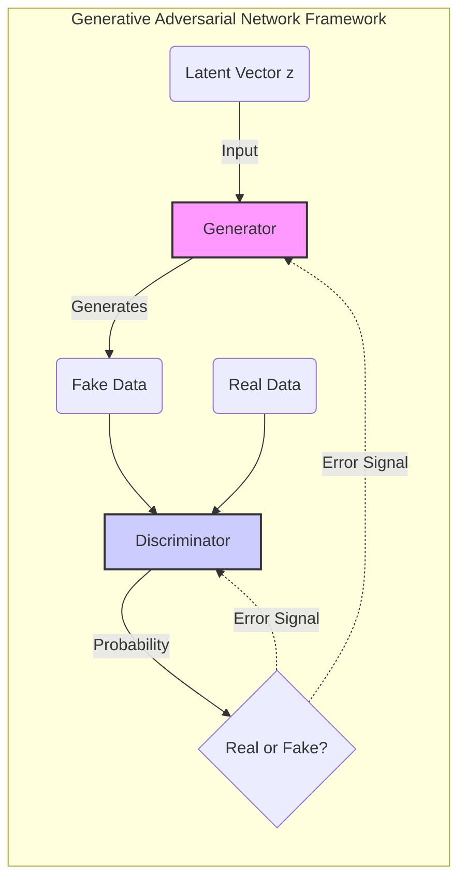
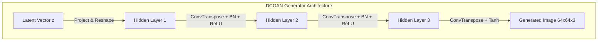
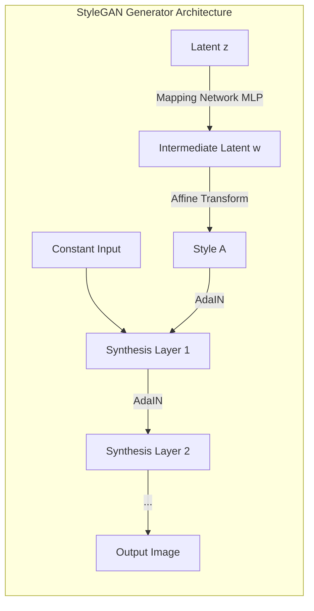
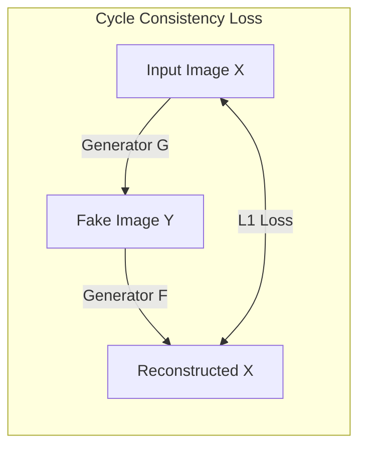

- [1 - Introduction to Generative Modelling and Adversarial Learning](#1---introduction-to-generative-modelling-and-adversarial-learning)
- [2 - Mathematical Foundations of the Adversarial Framework](#2---mathematical-foundations-of-the-adversarial-framework)
	- [2.1 - The Minimax Objective Function](#21---the-minimax-objective-function)
	- [2.2 - Theoretical Analysis of the Optimal Discriminator](#22---theoretical-analysis-of-the-optimal-discriminator)
	- [2.3 - The Jensen-Shannon Divergence Link](#23---the-jensen-shannon-divergence-link)
	- [2.4 - The Vanishing Gradient Problem](#24---the-vanishing-gradient-problem)
- [3 - Deep Convolutional GANs (DCGAN) and Architectural Stability](#3---deep-convolutional-gans-dcgan-and-architectural-stability)
	- [3.1 - Key Architectural Guidelines](#31---key-architectural-guidelines)
	- [3.2 - Vector Arithmetic in Latent Space](#32---vector-arithmetic-in-latent-space)
- [4 - The Wasserstein GAN (WGAN): A Geometrical Solution](#4---the-wasserstein-gan-wgan-a-geometrical-solution)
	- [4.1 - Limitations of JS and KL Divergences](#41---limitations-of-js-and-kl-divergences)
	- [4.2 - The Earth Mover's (Wasserstein) Distance](#42---the-earth-movers-wasserstein-distance)
	- [4.3 - Kantorovich-Rubinstein Duality](#43---kantorovich-rubinstein-duality)
	- [4.4 - Enforcing Lipschitz Continuity: WGAN-GP](#44---enforcing-lipschitz-continuity-wgan-gp)
- [5 - StyleGAN: Disentanglement and Control](#5---stylegan-disentanglement-and-control)
	- [5.1 - The Mapping Network and $W$ Space](#51---the-mapping-network-and-w-space)
	- [5.2 - Adaptive Instance Normalisation (AdaIN)](#52---adaptive-instance-normalisation-adain)
	- [5.3 - StyleGAN2 Improvements](#53---stylegan2-improvements)
	- [5.4 - Path Length Regularisation](#54---path-length-regularisation)
	- [5.5 - Mixing Regularisation and Truncation](#55---mixing-regularisation-and-truncation)
- [6 - Unpaired Translation: CycleGAN](#6---unpaired-translation-cyclegan)
- [7 - Comparative Analysis: GANs vs. VAEs vs. Diffusion](#7---comparative-analysis-gans-vs-vaes-vs-diffusion)
	- [7.1 - Divergence Minimisation Characteristics](#71---divergence-minimisation-characteristics)
- [8 - Detailed Numerical Examples](#8---detailed-numerical-examples)
	- [8.1 - 1D GAN Training Step](#81---1d-gan-training-step)
	- [8.2 - Backpropagation Calculation (Manual)](#82---backpropagation-calculation-manual)
- [9 - Challenges and Future Outlook](#9---challenges-and-future-outlook)
- [10 - Conclusion](#10---conclusion)
- [References](#references)

# 1 - Introduction to Generative Modelling and Adversarial Learning

The field of machine learning has traditionally been bifurcated into discriminative and generative modelling. Discriminative models, such as Support Vector Machines or standard Convolutional Neural Networks (CNNs), approximate a conditional probability distribution $P(Y|X)$, mapping high-dimensional inputs $X$ to label spaces $Y$. In contrast, generative models undertake the more arduous task of learning the underlying joint probability distribution $P(X, Y)$ or simply $P(X)$ in unsupervised settings. The objective is to capture the statistical laws governing the data generation process, enabling the synthesis of novel samples that are indistinguishable from the true data distribution $p_{data}$.

Generative Adversarial Networks (GANs), introduced by Goodfellow et al. in 2014, represent a seminal advancement in this domain. Unlike explicit density estimation methods (e.g., PixelRNN) that define a tractable density function and maximise likelihood, or Variational Autoencoders (VAEs) that optimise a lower bound on the log-likelihood, GANs employ an implicit density estimation strategy. They do not explicitly define a probability density function $p_{model}(x)$; rather, they learn to sample from it through a stochastic mechanism involving a game-theoretic contest between two neural networks.

**Generative Adversarial Network Framework**

This report provides a comprehensive analysis of the GAN framework. It dissects the mathematical foundations of the adversarial minimax game, traces the evolution from Jensen-Shannon divergence to Wasserstein geometry, and details the architectural innovations of the StyleGAN and CycleGAN families. Furthermore, it offers a rigorous comparative analysis against VAEs and Diffusion Probabilistic Models, grounded in information theory and optimisation dynamics.

-----

# 2 - Mathematical Foundations of the Adversarial Framework

To understand the mechanics of GANs, one must first establish the probabilistic environment in which they operate. The framework is best understood as a zero-sum game played in the space of probability distributions.

## 2.1 - The Minimax Objective Function

The GAN architecture consists of two differentiable functions (neural networks):

  * **The Generator ($G$):** A mapping $G(z; \theta_g): \mathcal{Z} \rightarrow \mathcal{X}$, where $\mathcal{Z}$ is a latent space (typically a hypersphere or hypercube with a simple prior $p_z$, such as a Gaussian $\mathcal{N}(0, I)$) and $\mathcal{X}$ is the data space. The generator's goal is to learn a mapping such that the induced distribution $p_g$ converges to the data distribution $p_{data}$.
  * **The Discriminator ($D$):** A mapping $D(x; \theta_d): \mathcal{X} \rightarrow [0, 1]$, which outputs the probability that a sample $x$ is from the real data $p_{data}$ rather than the generator $p_g$.

The training process is formulated as a minimax game with the following value function $V(G, D)$:

$$\min_{G} \max_{D} V(D, G) = \mathbb{E}_{x \sim p_{data}(x)} + \mathbb{E}_{z \sim p_{z}(z)}$$

In this equation:
The discriminator $D$ attempts to maximise the likelihood of correctly classifying real data as real ($D(x) \to 1$) and generated data as fake ($D(G(z)) \to 0$).
The generator $G$ attempts to minimise the second term $\log(1 - D(G(z)))$, which is equivalent to maximising the likelihood of the discriminator being fooled.

## 2.2 - Theoretical Analysis of the Optimal Discriminator

A pivotal contribution of the original GAN theory is the proof that for any fixed generator $G$, there exists a unique optimal discriminator $D^*$. Understanding this derivation is crucial for linking GANs to divergence minimisation.

We express the value function $V(G, D)$ as an integral over the data space $\mathcal{X}$. We can change the variable of integration for the second term from $z$ to $x$ using the induced density $p_g(x)$:

$$V(G, D) = \int_{\mathcal{X}} \left( p_{data}(x) \log(D(x)) + p_{g}(x) \log(1 - D(x)) \right) dx$$

To maximise $V$ with respect to $D$, we can optimise the integrand point-wise for every $x \in \mathcal{X}$. Let $y = D(x)$, $a = p_{data}(x)$, and $b = p_{g}(x)$. The function to maximise is $f(y) = a \log y + b \log(1 - y)$. Taking the derivative with respect to $y$:

$$\frac{df(y)}{dy} = \frac{a}{y} - \frac{b}{1 - y}$$

Setting the derivative to zero to find the critical point:

$$\frac{a}{y} = \frac{b}{1 - y} \implies a(1 - y) = by \implies a = (a + b)y \implies y = \frac{a}{a + b}$$

Thus, the optimal discriminator is the ratio of the true data density to the mixture density:

$$D^*_G(x) = \frac{p_{data}(x)}{p_{data}(x) + p_{g}(x)}$$

This result indicates that the optimal discriminator estimates the conditional probability $P(Y=real | x)$. If $p_{data}(x) \gg p_g(x)$, $D^*(x) \approx 1$; if $p_g(x) \gg p_{data}(x)$, $D^*(x) \approx 0$; and at the point of Nash Equilibrium where $p_{data}(x) = p_g(x)$, $D^*(x) = 0.5$, representing maximum uncertainty (a "random guess" state).

## 2.3 - The Jensen-Shannon Divergence Link

By substituting the optimal discriminator $D^*_G$ back into the value function, we uncover the true objective of the generator. The minimax game effectively minimises a specific statistical divergence.

$$V(G, D^*G) = \mathbb{E}_{x \sim p_{data}} \left[ \log \frac{p_{data}(x)}{p_{data}(x) + p_{g}(x)} \right] + \mathbb{E}_{x \sim p_{g}} \left[ \log \frac{p_{g}(x)}{p_{data}(x) + p_{g}(x)} \right]$$

We can rewrite the denominators as $2 \cdot \frac{p_{data}(x) + p_{g}(x)}{2}$ and expand the logarithms:

$$V(G, D^*G) = \mathbb{E}_{p_{data}} \left[ \log \frac{p_{data}}{ \frac{p_{data} + p_{g}}{2} } - \log 2 \right] + \mathbb{E}_{p_{g}} \left[ \log \frac{p_{g}}{ \frac{p_{data} + p_{g}}{2} } - \log 2 \right]$$

$$V(G, D^*G) = -\log 4 + D_{KL}\left(p_{data} \middle| \frac{p_{data} + p_{g}}{2}\right) + D_{KL}\left(p_{g} \middle| \frac{p_{data} + p_{g}}{2}\right)$$

Recognising the definition of the Jensen-Shannon (JS) Divergence, $D_{JS}(P \| Q) = \frac{1}{2} D_{KL}(P \| M) + \frac{1}{2} D_{KL}(Q \| M)$ where $M = \frac{P+Q}{2}$, we obtain:

$$C(G) = -\log 4 + 2 \cdot D_{JS}(p_{data} \| p_{g})$$

This derivation proves that training the generator in a GAN is mathematically equivalent to minimising the Jensen-Shannon divergence between the data distribution and the generated distribution. Since $D_{JS} \ge 0$ and $D_{JS} = 0 \iff p_{data} = p_g$, the global minimum of the objective function is $-\log 4$, achieved precisely when the generator recovers the true data distribution.

## 2.4 - The Vanishing Gradient Problem

While the JS divergence interpretation is theoretically sound, it presents significant practical challenges. The standard minimax loss can lead to vanishing gradients. If the discriminator is too accurate (i.e., $D(x) \to 1$ for real data and $D(G(z)) \to 0$ for fake data), the term $\log(1 - D(G(z)))$ saturates.

Consider the gradient of the generator's loss $L_G = \mathbb{E}_z$:

$$
\nabla_{\theta_g} L_G = \mathbb{E}_z \left[ \cdot \right]
$$

When $D$ is perfect ($D \approx 1$ for real, $D \approx 0$ for fake), the gradient magnitude depends on the discriminator's slope. In high-dimensional spaces, the data manifold and the generated manifold are likely disjoint. In this scenario, a perfect discriminator can separate the manifolds completely, resulting in flat regions in the loss landscape where $\nabla_x D(x) \approx 0$. This halts learning, a phenomenon known as the vanishing gradient problem.

To mitigate this, the original paper suggested a "non-saturating" heuristic: instead of minimising $\log(1 - D(G(z)))$, the generator maximises $\log(D(G(z)))$. While this provides stronger gradients early in training, it no longer minimises the JS divergence and can lead to unstable updates.

-----

# 3 - Deep Convolutional GANs (DCGAN) and Architectural Stability

The transition from theoretical MLPs to practical image synthesis required specific architectural constraints. Radford et al. (2015) formalised these in the Deep Convolutional GAN (DCGAN) architecture, which became the bedrock for modern GAN design.

## 3.1 - Key Architectural Guidelines

The DCGAN paper empirically identified a family of architectures that resulted in stable training:

  * **Replacement of Pooling Layers:** Standard CNNs use max-pooling for downsampling. DCGANs replace this with strided convolutions in the discriminator (allowing the network to learn its own downsampling) and fractional-strided convolutions (often termed transposed convolutions or deconvolution) in the generator for upsampling.
  * **Batch Normalisation (BatchNorm):** BatchNorm standardises the input to a layer to have zero mean and unit variance. This is critical in GANs for preventing mode collapse (where the generator outputs a single mode) and ensuring gradients flow effectively. It is applied to all layers except the generator output and discriminator input.
  * **Activation Functions:**
      * **Generator:** Uses ReLU (Rectified Linear Unit) for all internal layers to prevent saturation, and Tanh for the final layer to map pixel values to the range $[-1, 1]$.
      * **Discriminator:** Uses LeakyReLU (e.g., slope 0.2). Standard ReLU effectively kills the gradient for negative inputs ($x < 0$). Since the discriminator often receives "bad" generated data, LeakyReLU ensures a non-zero gradient can still flow backwards, preventing "dying ReLU" problems.
  * **No Fully Connected Layers:** DCGANs eliminate dense layers on top of convolutional features, utilising global average pooling or direct flattening. This reduces parameter count and memory footprint.

<!-- end list -->

## 3.2 - Vector Arithmetic in Latent Space

A remarkable emergent property of DCGANs is the structure of the learned latent space $\mathcal{Z}$. The mapping from $z$ to $x$ is not arbitrary; it preserves semantic relationships. Simple arithmetic operations on latent vectors correspond to meaningful semantic transformations in the image space.

For example, performing the vector operation:

$$z_{vector} = z_{\text{man with glasses}} - z_{\text{man without glasses}} + z_{\text{woman without glasses}}$$

Feeding the resulting $z_{vector}$ into the generator ($x = G(z_{vector})$) produces an image of a woman with glasses. This suggests that the generator learns a disentangled representation of semantic attributes (gender, eyewear) in an unsupervised manner.

-----

# 4 - The Wasserstein GAN (WGAN): A Geometrical Solution

Despite DCGAN's success, training remained unstable. The core issue, as identified by Arjovsky et al. (2017), was the metric used to measure the distance between distributions. The JS divergence fails to provide a meaningful gradient when distributions are disjoint.

## 4.1 - Limitations of JS and KL Divergences

Let $P_r$ be the real distribution and $P_g$ be the generated distribution. In high-dimensional spaces (like images), these distributions are supported on low-dimensional manifolds. If these manifolds do not perfectly overlap (which they almost never do during early training), the intersection of their supports has measure zero.

  * **KL Divergence:** $D_{KL}(P_r \| P_g)$ is infinite if there is any point where $P_g(x) = 0$ but $P_r(x) > 0$.
  * **JS Divergence:** If supports are disjoint, $D_{JS}(P_r \| P_g) = \log 2$ (a constant). The gradient of a constant is zero. Thus, the generator receives no information on how to move its distribution towards $P_r$.

## 4.2 - The Earth Mover's (Wasserstein) Distance

To solve this, WGAN proposes the Wasserstein-1 distance (also known as Earth Mover's Distance, EMD). Intuitively, if probability distributions are viewed as piles of earth, the Wasserstein distance is the minimum cost (mass $\times$ distance) to transport the pile $P_g$ to the configuration $P_r$.

Mathematically:

$$W(P_r, P_g) = \inf_{\gamma \in \Pi(P_r, P_g)} \mathbb{E}_{(x, y) \sim \gamma} [\| x - y \|]$$

Here, $\Pi(P_r, P_g)$ is the set of all joint distributions (transport plans) $\gamma(x, y)$ whose marginals are $P_r$ and $P_g$. Unlike JS divergence, the Wasserstein distance is continuous and differentiable almost everywhere, providing meaningful gradients even when supports are disjoint.

## 4.3 - Kantorovich-Rubinstein Duality

Computing the infimum over all joint distributions is intractable. However, the Kantorovich-Rubinstein duality allows us to reformulate this as a maximisation problem over 1-Lipschitz functions:

$$W(P_r, P_g) = \sup_{\|f\|_L \le 1} \mathbb{E}_{x \sim P_r}[f(x)] - \mathbb{E}_{x \sim P_g}[f(x)]$$

A function $f$ is 1-Lipschitz if $|f(x_1) - f(x_2)| \le \|x_1 - x_2\|$ for all $x_1, x_2$. This constraint limits how fast the function can change; its slope cannot exceed 1.

In WGAN, the discriminator (now called the critic) learns to approximate the function $f$ that maximises this difference. The objective function becomes:

$$\min_G \max_{D \in \mathcal{D}_L} \mathbb{E}_{x \sim P_r} - \mathbb{E}_{z \sim p_z}$$

The critic tries to assign high scores to real data and low scores to fake data, but crucially, the scores are not probabilities (they are unbounded scalars), and the Lipschitz constraint ensures the gradient behaves well.

## 4.4 - Enforcing Lipschitz Continuity: WGAN-GP

The original WGAN enforced the Lipschitz constraint via Weight Clipping: clamping the weights of the critic to a range $[-c, c]$. This is a crude method that often leads to vanishing or exploding gradients or forces the critic to learn overly simple functions.

Gulrajani et al. (2017) introduced WGAN with Gradient Penalty (WGAN-GP). They observed that the optimal critic $f^*$ has gradients with norm 1 almost everywhere. Instead of clipping weights, they enforce the constraint by penalising the gradient norm directly in the loss function:

$$
L = \underbrace{\mathbb{E}_{\tilde{x} \sim P_g} - \mathbb{E}_{x \sim P_r}}_{\text{Wasserstein Estimate}}
  + \underbrace{\lambda \mathbb{E}_{\hat{x} \sim P_{\hat{x}}} \left[ \cdot \right]}_{\text{Gradient Penalty}}
$$

The penalty is calculated at random interpolation points $\hat{x}$ between real and fake samples ($\hat{x} = \epsilon x + (1-\epsilon)\tilde{x}$). This "soft" constraint ($\lambda \approx 10$) allows the critic to learn more complex surfaces while maintaining the necessary mathematical properties for stable training.

-----

# 5 - StyleGAN: Disentanglement and Control

While WGAN solved stability, StyleGAN (Karras et al., 2019) revolutionised the quality and controllability of GANs. It addresses the issue of entanglement, where a single latent variable in $z$ controls multiple semantic features (e.g., hair length and gender simultaneously) due to the generator forcing the input distribution (Gaussian) to match the data distribution.

## 5.1 - The Mapping Network and $W$ Space

StyleGAN introduces a Mapping Network ($f$), an 8-layer MLP, that transforms the input latent code $z \in \mathcal{Z}$ into an intermediate latent code $w \in \mathcal{W}$.

$$w = f(z)$$

The generator then uses $w$ to control the synthesis. Because $f$ is non-linear, the space $\mathcal{W}$ can be "unwrapped" to match the density of the real data features, reducing entanglement. For instance, if "long hair" and "masculinity" are negatively correlated in the training data, the mapping network can warp the spherical $\mathcal{Z}$ space into a shape in $\mathcal{W}$ that respects this correlation, allowing independent control.

## 5.2 - Adaptive Instance Normalisation (AdaIN)

Instead of feeding $z$ into the input layer, StyleGAN starts with a learned constant tensor. The style $w$ is injected at each convolution layer via Adaptive Instance Normalisation (AdaIN).

$$\text{AdaIN}(x_i, y) = y_{s, i} \frac{x_i - \mu(x_i)}{\sigma(x_i)} + y_{b, i}$$

Here, $x_i$ is a feature map. It is normalised to zero mean and unit variance. Then, it is scaled by $y_s$ and biased by $y_b$, which are learned affine transformations of $w$. This mechanism allows the style vector to control "global" statistics (texture, shape) at that specific scale.

**StyleGAN Generator Architecture**

## 5.3 - StyleGAN2 Improvements

StyleGAN1 generated artifacts (droplets) because AdaIN destroyed information in feature magnitudes. StyleGAN2 replaced AdaIN with Weight Demodulation. Instead of normalising the features, it modulates the convolution weights $w_{ijk}$ directly:
**Modulation:** $w'_{ijk} = s_i \cdot w_{ijk}$ (Scale weights by style).
**Demodulation:** $w''_{ijk} = w'_{ijk} / \sqrt{\sum_{i,k} {w'_{ijk}}^2 + \epsilon}$ (Normalise weights to preserve unit variance).
This removed droplet artifacts and improved fidelity.

## 5.4 - Path Length Regularisation

To ensure a smooth, invertible mapping from latent to image space, StyleGAN2 employs Path Length Regularisation. It penalises the generator if a fixed-size step in $\mathcal{W}$ results in a variable-size change in the image.

$$\mathcal{L}_{pl} = \mathbb{E}_{w, y \sim \mathcal{N}(0, I)} (\| J_w^T y \|_2 - a)^2$$

where $J_w$ is the Jacobian of the generator. This forces the latent space to be perceptually uniform, improving interpolation quality.

## 5.5 - Mixing Regularisation and Truncation

**Mixing Regularisation:** During training, two latent codes $z_1, z_2$ are generated. The generator switches from $w_1$ to $w_2$ at a random layer. This forces the network to assume that styles at different scales (coarse, medium, fine) are independent.
**Truncation Trick:** To trade diversity for quality, $w$ is truncated towards the mean latent vector $\bar{w}$: $w' = \bar{w} + \psi(w - \bar{w})$. Lower $\psi$ reduces variety but avoids the "weird" samples found in the tails of the distribution.

-----

# 6 - Unpaired Translation: CycleGAN

CycleGAN enables image-to-image translation (e.g., Horse $\leftrightarrow$ Zebra) without paired examples. It relies on the assumption of Cycle Consistency: translating an image to the target domain and back should yield the original image ($F(G(x)) \approx x$).

The objective combines adversarial loss with cycle consistency loss:

$$\mathcal{L}_{total} = \mathcal{L}_{GAN}(G, D_Y) + \mathcal{L}_{GAN}(F, D_X) + \lambda \mathcal{L}_{cyc}(G, F)$$

where $\mathcal{L}_{cyc} = \mathbb{E}_x[\|F(G(x)) - x\|_1] + \mathbb{E}_y[\|G(F(y)) - y\|_1]$. This constraint prevents mode collapse (mapping all inputs to one output) by forcing the mapping to be a bijection.

**Cycle Consistency Loss**

-----

# 7 - Comparative Analysis: GANs vs. VAEs vs. Diffusion

## 7.1 - Divergence Minimisation Characteristics

The fundamental difference between these models lies in the divergence they minimise:

**VAEs (Forward KL - Mass Covering):** VAEs maximise the Evidence Lower Bound (ELBO), which implicitly minimises the Forward KL Divergence $D_{KL}(P_{data} \| P_{model})$.

  * **Behaviour:** The Forward KL is "zero-avoiding". If $P_{data}(x) > 0$, the model $P_{model}(x)$ must also be $>0$ to avoid infinite cost. Consequently, the model "stretches" to cover all modes of the data. In ambiguous regions between modes, it assigns non-zero probability, leading to blurriness in generated images.
  * **Equation:** $\mathcal{L}_{ELBO} = \mathbb{E}_{q}[\log p(x|z)] - D_{KL}(q(z|x) \| p(z))$.

**GANs (Reverse KL/JS - Mode Seeking):** GANs (approximating JS or Reverse KL) minimise $D_{KL}(P_{model} \| P_{data})$.

  * **Behaviour:** The Reverse KL is "zero-forcing". If $P_{data}(x) = 0$, the model $P_{model}(x)$ must be $0$ to avoid infinite cost. The model is penalised heavily for generating samples in low-density regions. Thus, GANs tend to converge to a single mode (or subset of modes), producing sharp, realistic images but potentially ignoring parts of the data distribution (Mode Collapse).

**Diffusion Models:** These models minimise a reweighted variational lower bound (VLB) related to Forward KL but decompose the problem into small iterative denoising steps. This allows them to achieve both the mode coverage of VAEs and the high fidelity of GANs, avoiding mode collapse while generating sharp samples, albeit at the cost of slow iterative inference.

| Feature        | GAN                             | VAE                                      | Diffusion Model                      |
| :------------- | :------------------------------ | :--------------------------------------- | :----------------------------------- |
| **Objective**  | Minimax (Adversarial)           | Maximise ELBO                            | Denoising Score Matching             |
| **Divergence** | JS / Wasserstein (Mode Seeking) | Forward KL (Mass Covering)               | Forward KL (Sequence)                |
| **Pros**       | Sharpest images, Fast sampling  | Stable training, Good density estimation | High diversity, Stable, High quality |
| **Cons**       | Unstable (Mode collapse)        | Blurry samples                           | Slow sampling (Iterative)            |

-----

# 8 - Detailed Numerical Examples

## 8.1 - 1D GAN Training Step

**Scenario:**
Real Data: $x = 4$.
Generator: $G(z) = w_g \cdot z$. Initial $w_g = 2$.
Discriminator: $D(x) = w_d \cdot x$ (Linear for simplicity). Initial $w_d = 0.5$.
Input Noise: $z = 1$.

**Step 1: Forward Pass**
Fake Data: $x_{fake} = G(1) = 2 \cdot 1 = 2$.
Discriminator Output (Real): $D(x_{real}) = 0.5 \cdot 4 = 2.0$.
Discriminator Output (Fake): $D(x_{fake}) = 0.5 \cdot 2 = 1.0$.

**Step 2: Discriminator Update (Maximise separation)**
Objective: Maximise $D(x_{real}) - D(x_{fake})$ (WGAN style).
Current value: $2.0 - 1.0 = 1.0$.
Gradient $\nabla_{w_d}$:
$\frac{\partial}{\partial w_d} (w_d x_{real}) = 4$.
$\frac{\partial}{\partial w_d} (w_d x_{fake}) = 2$.
Total grad = $4 - 2 = 2$.
Update (Learning Rate $\eta = 0.1$): $w_d^{new} = 0.5 + 0.1(2) = 0.7$.

**Step 3: Generator Update (Fool Discriminator)**
Objective: Maximise $D(x_{fake})$ (or minimise $-D(x_{fake})$).
Loss $L_G = -D(G(z)) = -w_d \cdot (w_g \cdot z)$.
Using updated $w_d = 0.7$: $L_G = -0.7 \cdot (w_g \cdot 1) = -0.7 w_g$.
Gradient $\nabla_{w_g} L_G = -0.7$.
Update (minimise loss): $w_g^{new} = w_g - \eta \nabla L_G = 2 - 0.1(-0.7) = 2.07$.

**Result:** The generator weight increased ($2 \to 2.07$), pushing the output $x_{fake}$ ($2 \to 2.07$) closer to the real data mean ($4$). The discriminator weight increased to better distinguish larger values.

## 8.2 - Backpropagation Calculation (Manual)

Let $L = (D(G(z)) - 1)^2$ (Least Squares GAN Generator Loss).
$z = 2$.
$G(z) = w_g z$. ($w_g=3$).
$D(x) = \sigma(w_d x)$. ($w_d=1$, $\sigma$ is sigmoid).

**Forward:**
$x_{fake} = 3 \times 2 = 6$.
$D_{out} = \sigma(1 \times 6) = \frac{1}{1+e^{-6}} \approx 0.9975$.
Loss $L = (0.9975 - 1)^2 \approx 6.25 \times 10^{-6}$.

**Backward (Gradient for $w_g$):**
Chain rule: $\frac{\partial L}{\partial w_g} = \frac{\partial L}{\partial D} \cdot \frac{\partial D}{\partial x_{fake}} \cdot \frac{\partial x_{fake}}{\partial w_g}$.
$\frac{\partial L}{\partial D} = 2(D - 1) = 2(0.9975 - 1) = -0.005$.
$\frac{\partial D}{\partial x_{fake}} = \sigma'(x) \cdot w_d = D(1-D) \cdot 1 = 0.9975(1-0.9975) \approx 0.0025$.
$\frac{\partial x_{fake}}{\partial w_g} = z = 2$.

**Total Gradient:**
$$\frac{\partial L}{\partial w_g} = (-0.005) \cdot (0.0025) \cdot (2) = -0.000025$$
The negative gradient indicates we should increase $w_g$ to reduce loss (which effectively increases $D$ towards 1).

-----

# 9 - Challenges and Future Outlook

While GANs have achieved photorealistic synthesis, challenges remain. Mode Collapse persists as a fundamental issue, where the generator covers only a subset of the data support. Evaluation is difficult; metrics like Fréchet Inception Distance (FID) and Perceptual Path Length (PPL) are standard but imperfect proxies for human perception.
Future directions involve Hybrid Models (combining the stability of Diffusion with the speed of GANs), Inversion techniques (mapping real images back to $\mathcal{W}$ space for editing), and Equivariant GANs (StyleGAN3) that strictly respect signal processing laws to prevent aliasing.

# 10 - Conclusion

Generative Adversarial Networks represent a sophisticated intersection of deep learning, game theory, and optimisation. From the foundational proofs of the Nash Equilibrium to the geometric rigour of the Wasserstein distance and the disentanglement capabilities of StyleGAN, the field has matured into a robust framework for generative AI. Understanding GANs requires traversing the landscape from simple probability divergences to complex functional analysis on manifolds. As research progresses, the principles derived from adversarial learning (specifically the utility of learned loss functions (discriminators)) will likely remain central to the quest for artificial general intelligence.

# References

1. Goodfellow, I. J., Pouget-Abadie, J., Mirza, M., et al. (2014). *Generative Adversarial Networks*. arXiv:1406.2661. [Link](https://arxiv.org/abs/1406.2661) ([arXiv][1])

2. Radford, A., Metz, L., & Chintala, S. (2016). *Unsupervised Representation Learning with Deep Convolutional Generative Adversarial Networks*. ICLR. [Link](https://arxiv.org/abs/1511.06434) ([arXiv][2])

3. Arjovsky, M., Chintala, S., & Bottou, L. (2017). *Wasserstein Generative Adversarial Networks*. ICML. [Link](https://arxiv.org/abs/1701.07875) ([arXiv][3])

4. Gulrajani, I., Ahmed, F., Arjovsky, M., Dumoulin, V., & Courville, A. (2017). *Improved Training of Wasserstein GANs*. NeurIPS. [Link](https://arxiv.org/abs/1704.00028) ([arXiv][4])

5. Kingma, D. P., & Welling, M. (2014). *Auto-Encoding Variational Bayes*. ICLR. [Link](https://arxiv.org/abs/1312.6114) ([arXiv][5])

6. van den Oord, A., Kalchbrenner, N., & Kavukcuoglu, K. (2016). *Pixel Recurrent Neural Networks*. ICML. [Link](https://arxiv.org/abs/1601.06759) ([arXiv][6])

7. Karras, T., Laine, S., & Aila, T. (2019). *A Style-Based Generator Architecture for Generative Adversarial Networks*. CVPR. [Link](https://arxiv.org/abs/1812.04948) ([arXiv][7])

8. Karras, T., Laine, S., Aittala, M., et al. (2020). *Analyzing and Improving the Image Quality of StyleGAN*. CVPR. [Link](https://arxiv.org/abs/1912.04958) ([arXiv][8])

9. Karras, T., Aittala, M., Laine, S., et al. (2021). *Alias-Free Generative Adversarial Networks (StyleGAN3)*. NeurIPS. [Link](https://arxiv.org/abs/2106.12423) ([arXiv][9])

10. Zhu, J.-Y., Park, T., Isola, P., & Efros, A. A. (2017). *Unpaired Image-to-Image Translation Using Cycle-Consistent Adversarial Networks*. ICCV. [Link](https://arxiv.org/abs/1703.10593) ([arXiv][10])

11. Ho, J., Jain, A., & Abbeel, P. (2020). *Denoising Diffusion Probabilistic Models*. NeurIPS. [Link](https://arxiv.org/abs/2006.11239) ([arXiv][11])

12. Heusel, M., Ramsauer, H., Unterthiner, T., Nessler, B., & Hochreiter, S. (2017). *GANs Trained by a Two Time-Scale Update Rule Converge to a Local Nash Equilibrium*. NeurIPS. [Link](https://arxiv.org/abs/1706.08500) ([arXiv][12])

[1]: https://arxiv.org/abs/1406.2661?utm_source=chatgpt.com "[1406.2661] Generative Adversarial Networks"
[2]: https://arxiv.org/abs/1511.06434?utm_source=chatgpt.com "Unsupervised Representation Learning with Deep Convolutional Generative Adversarial Networks"
[3]: https://arxiv.org/abs/1701.07875?utm_source=chatgpt.com "Wasserstein GAN"
[4]: https://arxiv.org/abs/1704.00028?utm_source=chatgpt.com "Improved Training of Wasserstein GANs"
[5]: https://arxiv.org/abs/1312.6114?utm_source=chatgpt.com "Auto-Encoding Variational Bayes"
[6]: https://arxiv.org/abs/1601.06759?utm_source=chatgpt.com "Pixel Recurrent Neural Networks"
[7]: https://arxiv.org/abs/1812.04948?utm_source=chatgpt.com "A Style-Based Generator Architecture for Generative Adversarial Networks"
[8]: https://arxiv.org/abs/1912.04958?utm_source=chatgpt.com "Analyzing and Improving the Image Quality of StyleGAN"
[9]: https://arxiv.org/abs/2106.12423?utm_source=chatgpt.com "[2106.12423] Alias-Free Generative Adversarial Networks"
[10]: https://arxiv.org/abs/1703.10593?utm_source=chatgpt.com "Unpaired Image-to-Image Translation using Cycle-Consistent Adversarial Networks"
[11]: https://arxiv.org/abs/2006.11239?utm_source=chatgpt.com "Denoising Diffusion Probabilistic Models"
[12]: https://arxiv.org/abs/1706.08500?utm_source=chatgpt.com "GANs Trained by a Two Time-Scale Update Rule Converge to a Local Nash Equilibrium"
