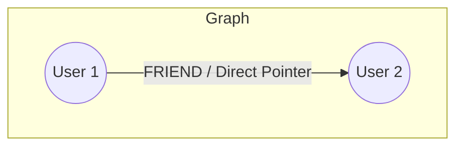
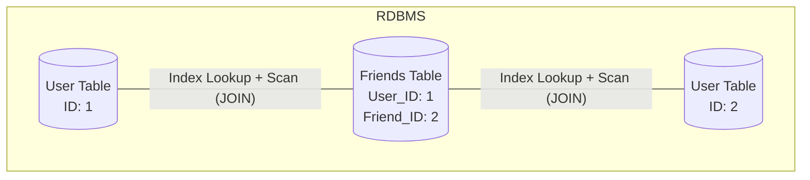
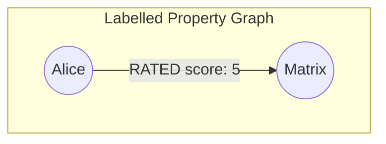
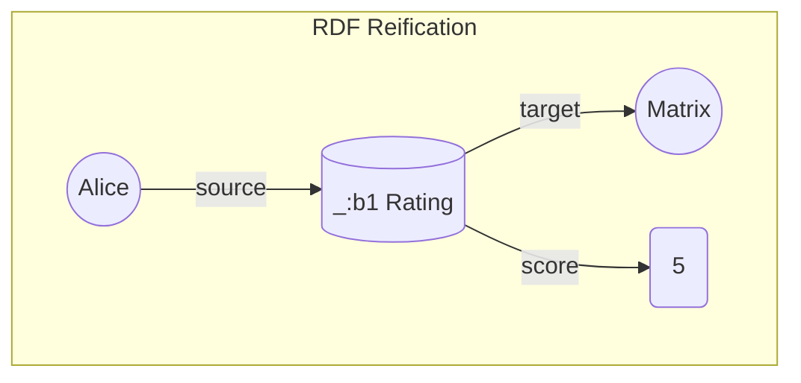
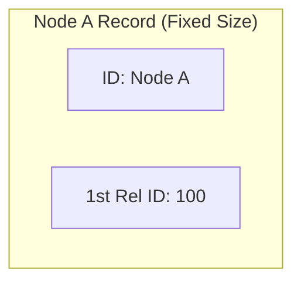
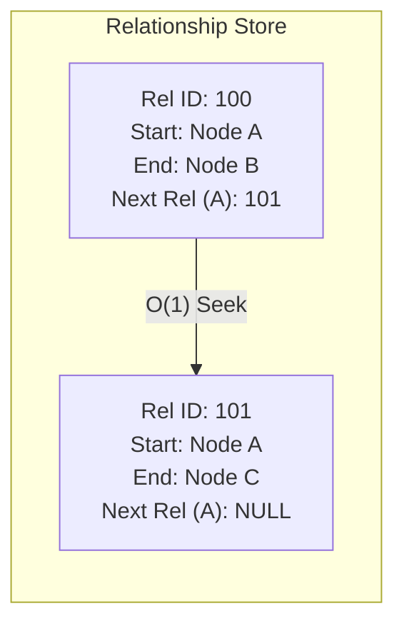
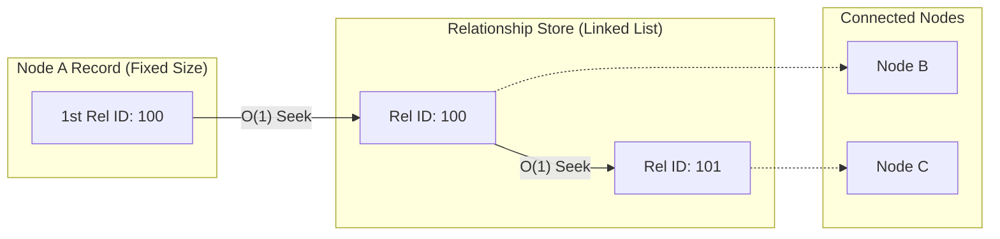
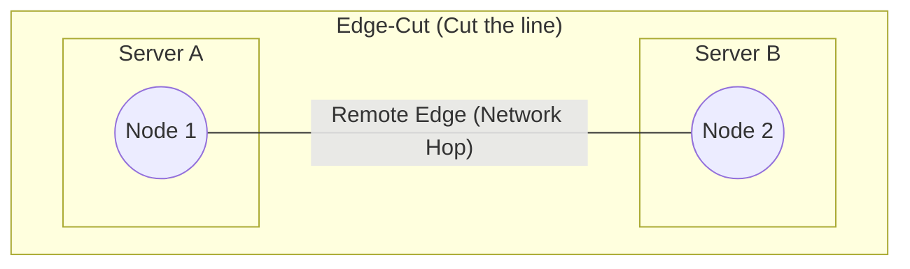
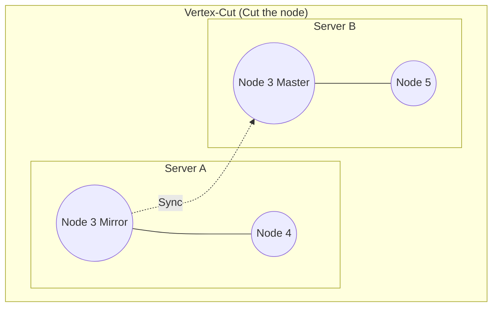

- [1 - Introduction: The Paradigm Shift in Data Management](#1---introduction-the-paradigm-shift-in-data-management)
- [2 - Mathematical Foundations](#2---mathematical-foundations)
	- [2.1 - Graph Theory Fundamentals](#21---graph-theory-fundamentals)
		- [2.1.1 - Vertex and Edge Definitions](#211---vertex-and-edge-definitions)
		- [2.1.2 - Algebraic Connectivity and Matrices](#212---algebraic-connectivity-and-matrices)
		- [2.1.3 - Hypergraphs](#213---hypergraphs)
	- [2.2 - Algebraic Path Analysis](#22---algebraic-path-analysis)
- [3 - Data Models: Labelled Property Graph vs. RDF](#3---data-models-labelled-property-graph-vs-rdf)
	- [3.1 - The Labelled Property Graph (LPG)](#31---the-labelled-property-graph-lpg)
	- [3.2 - Resource Description Framework (RDF)](#32---resource-description-framework-rdf)
	- [3.3 - Comparative Summary](#33---comparative-summary)
- [4 - Internal Storage Architecture](#4---internal-storage-architecture)
	- [4.1 - Native Graph Storage: Index-Free Adjacency](#41---native-graph-storage-index-free-adjacency)
		- [4.1.1 - Neo4j Storage Layout](#411---neo4j-storage-layout)
	- [4.2 - Non-Native and Multi-Model Architectures](#42---non-native-and-multi-model-architectures)
		- [4.2.1 - JanusGraph (Wide-Column Store Backend)](#421---janusgraph-wide-column-store-backend)
		- [4.2.2 - Amazon Neptune (Quad Store)](#422---amazon-neptune-quad-store)
		- [4.2.3 - ArangoDB (RocksDB Backend)](#423---arangodb-rocksdb-backend)
- [5 - Query Languages and Semantics](#5---query-languages-and-semantics)
	- [5.1 - Cypher and the Declarative Pattern](#51---cypher-and-the-declarative-pattern)
	- [5.2 - SPARQL and Algebra](#52---sparql-and-algebra)
	- [5.3 - GQL: The ISO Standard (ISO/IEC 39075)](#53---gql-the-iso-standard-isoiec-39075)
	- [5.4 - Graph Algebra and MATLANG](#54---graph-algebra-and-matlang)
- [6 - Distributed Graph Systems and Scalability](#6---distributed-graph-systems-and-scalability)
	- [6.1 - The Graph Partitioning Problem](#61---the-graph-partitioning-problem)
	- [6.2 - CAP Theorem and Consistency Models](#62---cap-theorem-and-consistency-models)
- [7 - Algorithmic Processing and Analytics](#7---algorithmic-processing-and-analytics)
	- [7.1 - Traversal Complexity: Big O Analysis](#71---traversal-complexity-big-o-analysis)
	- [7.2 - Parallel Graph Algorithms (Pregel/BSP)](#72---parallel-graph-algorithms-pregelbsp)
	- [7.3 - External Memory Algorithms](#73---external-memory-algorithms)
- [8 - Emerging Trends: Graph RAG and AI Integration](#8---emerging-trends-graph-rag-and-ai-integration)
	- [8.1 - Retrieval Augmented Generation (Graph RAG)](#81---retrieval-augmented-generation-graph-rag)
	- [8.2 - Graph Neural Networks (GNNs)](#82---graph-neural-networks-gnns)
- [9 - Conclusion](#9---conclusion)
- [References](#references)

# 1 - Introduction: The Paradigm Shift in Data Management

The landscape of data management has undergone a fundamental transformation driven by the increasing interconnectivity of modern datasets. For decades, the Relational Database Management System (RDBMS), founded on E.F. Codd’s relational algebra, served as the bedrock of software engineering. This model organises data into tuples (rows) grouped into relations (tables), prioritising the efficient storage of discrete entities. However, as applications evolved from simple record-keeping to complex network analysis (such as social graphs, fraud detection rings, and supply chain dependencies) the limitations of the relational model became apparent.

This limitation is technically referred to as the "impedance mismatch". In object-oriented software development, data is often modelled as a graph of objects referencing one another. When persisting this data to an RDBMS, the rich web of references must be dismantled and flattened into tabular structures, only to be painstakingly reassembled during retrieval via Object-Relational Mapping (ORM) tools. More critically, the computational cost of reassembling these relationships grows exponentially with the depth of the inquiry. In a relational system, traversing a relationship requires a JOIN operation, which typically involves an index lookup ($O(\log N)$) followed by a scan. As queries require deeper traversals (e.g., friends of friends of friends), the number of joins increases, leading to a performance bottleneck known colloquially as the "join bomb".

Graph databases emerged to resolve this fundamental inefficiency. Unlike relational systems that model relationships as metadata (foreign keys) requiring computation to resolve, graph databases treat relationships as first-class data entities. They employ a storage architecture based on "index-free adjacency", where connected nodes physically point to one another in memory or on disk. This architectural decision decouples the cost of traversing a relationship from the total size of the dataset, theoretically allowing for $O(1)$ traversal complexity per hop.

**Graph Model (Index-Free Adjacency)**

**Relational Model (Computed Relationships)**

This report provides an exhaustive technical analysis of graph databases. It explores the rigorous mathematical foundations of graph theory that underpin these systems, details the internal storage mechanisms that enable their performance, formalises the algebra of graph query languages, and examines the distributed systems challenges inherent in scaling graph data.

# 2 - Mathematical Foundations

The operational mechanics of graph databases are deeply rooted in discrete mathematics and linear algebra. A robust understanding of these mathematical structures is essential to optimise data modelling and query performance.

## 2.1 - Graph Theory Fundamentals

At its core, a graph $G$ is an abstract data structure defined as an ordered pair $G = (V, E)$, where $V$ is a set of vertices (or nodes) and $E$ is a set of edges (or relationships).

### 2.1.1 - Vertex and Edge Definitions

The set $V$ represents the entities in the domain. The set $E$ comprises pairs of elements from $V$. The nature of these pairs defines the type of graph:

  * **Undirected Graphs:** The edges are unordered pairs $\{u, v\}$, where $u, v \in V$. This implies that the relationship is symmetric; if $u$ is connected to $v$, then $v$ is inherently connected to $u$.
  * **Directed Graphs (Digraphs):** The edges are ordered pairs $(u, v)$. Here, $u$ is the tail (source) and $v$ is the head (target). This directionality is fundamental to Property Graph databases, allowing for semantic precision (e.g., (User)--\>(Product) is semantically distinct from (Product)--\>(User)).

### 2.1.2 - Algebraic Connectivity and Matrices

While the visual representation of a graph consists of dots and lines, its computational representation relies on matrices. The Adjacency Matrix $A$ of a graph $G$ with $n$ vertices is a square $n \times n$ matrix.

$$
A_{ij} = \begin{cases}
1 & \text{if } (v_i, v_j) \in E,\\
0 & \text{otherwise}.
\end{cases}
$$

For a weighted graph, where edges carry a value (weight) $w$, the entry $A_{ij}$ contains the weight $w_{ij}$ instead of a binary 1.

Spectral Graph Theory analyses the eigenvalues and eigenvectors of the adjacency matrix (or the related Laplacian matrix $L = D - A$, where $D$ is the degree matrix). These spectral properties reveal critical information about the graph's structure:

  * The **Eigenvalues** of $A$ provide bounds on graph properties such as the chromatic number and the maximum cut.
  * The **Eigenvector** corresponding to the largest eigenvalue is central to ranking algorithms like PageRank, which interprets the eigenvector entries as a measure of vertex centrality.

### 2.1.3 - Hypergraphs

In certain complex domains, such as biological pathways or collaborative networks, a standard dyadic (two-node) edge is insufficient. A Hypergraph $H = (X, E)$ generalises the concept, where $E$ is a family of non-empty subsets of $V$, called hyperedges. A single hyperedge can connect any number of vertices simultaneously.

The Incidence Matrix $M$ is used to represent hypergraphs. It is a rectangular matrix of size $|V| \times |E|$, where:

$$
M_{ij} = \begin{cases}
1 & \text{if } v_i \in e_j,\\
0 & \text{otherwise}.
\end{cases}
$$

While native hypergraph databases exist, many commercial systems simulate hypergraphs using bipartite graphs, where hyperedges are reified as intermediate nodes connected to all participants.

## 2.2 - Algebraic Path Analysis

Graph traversal (the primary operation in graph databases) can be modelled algebraically using matrix operations. If $A$ is the adjacency matrix of a graph, then the power matrix $A^k$ contains information about paths of length $k$. Specifically, the entry $(A^k)_{ij}$ equals the number of distinct walks of length $k$ from vertex $i$ to vertex $j$.

For example, to determine if two nodes are connected by a path of length 2 (e.g., a "friend of a friend"), one can compute $A^2$.

$$(A^2)_{ij} = \sum_{k=1}^{n} A_{ik} \cdot A_{kj}$$

This algebraic formulation allows graph databases, particularly those with Massively Parallel Processing (MPP) architectures like TigerGraph, to utilise vectorised instructions and GPU acceleration to perform deep-link analytics across billions of nodes.

# 3 - Data Models: Labelled Property Graph vs. RDF

Two dominant data models govern the implementation of graph databases: the Labelled Property Graph (LPG) and the Resource Description Framework (RDF). While both model network data, they differ significantly in their atomic structures, intended use cases, and semantic rigour.

## 3.1 - The Labelled Property Graph (LPG)

The LPG model is the de facto standard for industrial graph applications (e.g., Neo4j, Amazon Neptune's LPG mode). It prioritises storage efficiency and traversal speed.

**Key Components:**

  * **Nodes (Vertices):** Entities that contain an identity, a set of labels (types), and a set of properties.
  * **Relationships (Edges):** Directed connections between two nodes. Crucially, in an LPG, relationships inherently possess an identity, a type, and their own set of properties.
  * **Properties:** Key-value pairs (e.g., name: "Alice", since: 2020) attached to both nodes and relationships.

**Mathematical Definition:**
An LPG is a tuple $G = (V, E, L, K, W, \lambda, \tau, \pi)$, where:

  * $V$ is a set of vertices.
  * $E$ is a set of directed edges.
  * $L$ is a set of labels.
  * $K$ is a set of property keys.
  * $W$ is a set of property values.
  * $\lambda: V \rightarrow \mathcal{P}(L)$ assigns labels to vertices.
  * $\tau: E \rightarrow \Sigma$ assigns types to edges.
  * $\pi: (V \cup E) \times K \rightarrow W$ assigns values to properties.

The ability to store properties directly on edges allows for compact modelling. For instance, a (User)--\>(Movie) relationship encapsulates the rating event within the edge itself, avoiding the need for an intermediate "Rating" node.

## 3.2 - Resource Description Framework (RDF)

RDF is a standard maintained by the W3C, originally designed for the Semantic Web and data interchange.

**Key Components:**

  * **Triple:** The atomic unit of data is the triple (Subject, Predicate, Object).
  * **Subject:** A URI or blank node.
  * **Predicate:** A URI representing the relationship type.
  * **Object:** A URI or a literal value (string, integer).
  * **Graph:** A collection of triples.

**Structural Differences and Reification:**
Unlike LPGs, standard RDF does not support properties on edges. To model the score: 5 property on a RATED relationship, RDF requires reification, where the relationship is converted into a node.

  * Original: Alice -\> Rated -\> Matrix
  * Reified:
      * \_:b1 type Rating
      * \_:b1 source Alice
      * \_:b1 target Matrix
      * \_:b1 score 5

This increases the graph density and requires more complex queries to traverse what is conceptually a single link.

**Labelled Property Graph**

**RDF Reification**

**Semantic Rigour:**
RDF excels in interoperability and inference. Through ontologies (OWL, RDFS), RDF stores support logical reasoning. For example, if an ontology defines Manager as a subclass of Employee, a query for Employee will automatically retrieve all Manager nodes, a capability not natively present in most LPG systems without explicit rule coding.

## 3.3 - Comparative Summary

| Feature             | Labelled Property Graph (LPG)      | RDF (Triple Store)                |
| :------------------ | :--------------------------------- | :-------------------------------- |
| **Atomic Unit**     | Node / Relationship                | Triple (Subject-Predicate-Object) |
| **Edge Attributes** | Native (Properties on edges)       | Reification required              |
| **Schema**          | Flexible / Schema-optional         | Ontological (RDFS, OWL, SHACL)    |
| **Traversal Speed** | Optimised (Index-free adjacency)   | Index-based (Scan intensive)      |
| **Standardisation** | GQL (ISO/IEC 39075), Cypher        | SPARQL (W3C Standard)             |
| **Primary Use**     | Analytics, Applications, Real-time | Knowledge Exchange, Inference     |

# 4 - Internal Storage Architecture

The performance characteristics of a graph database are determined by how the mathematical graph structure is mapped to physical storage. This mapping defines the efficiency of read/write operations and differentiates "native" graph databases from multi-model adaptations.

## 4.1 - Native Graph Storage: Index-Free Adjacency

The defining architectural feature of native graph databases (e.g., Neo4j) is index-free adjacency. In this model, every node record physically contains the memory addresses (pointers) of its incident relationships. Consequently, traversing from a node to its neighbour involves a direct pointer dereference—a constant-time operation $O(1)$ (rather than an index lookup).

### 4.1.1 - Neo4j Storage Layout

Neo4j implements this using fixed-size records, which allows the database engine to calculate the physical byte offset of any record from its ID using simple arithmetic.

**The Node Store (neostore.nodestore.db):**

  * Each node record occupies a fixed number of bytes (e.g., 15 bytes in modern versions).
  * Byte 0: In-use flag.
  * Bytes 1-4: ID of the first relationship (pointer to Relationship Store).
  * Bytes 5-8: ID of the first property (pointer to Property Store).
  * Bytes 9-12: ID of the label (pointer to Label Store).

**The Relationship Store (neostore.relationshipstore.db):**

  * Each relationship record is also fixed-size (e.g., 34 bytes). It implements a doubly linked list structure for the edges incident to a node.
  * Bytes 0-3: ID of the Start Node.
  * Bytes 4-7: ID of the End Node.
  * Bytes 8-11: ID of the relationship type.
  * Bytes 12-15: ID of the Previous relationship for the Start Node.
  * Bytes 16-19: ID of the Next relationship for the Start Node.
  * Bytes 20-23: ID of the Previous relationship for the End Node.
  * Bytes 24-27: ID of the Next relationship for the End Node.

**Traversal Mechanism:**
To traverse from Node A to its neighbours:

1.  The engine reads Node A's record to find the First Relationship ID.
2.  It calculates the offset: Offset = Relationship\_ID \* Record\_Size.
3.  It seeks directly to that offset in the Relationship Store.
4.  It reads the relationship record to identify the other connected node.
5.  It reads the Next Relationship ID for Node A from the current relationship record and repeats the process until the chain ends.

This "pointer chasing" mechanism avoids the $O(\log N)$ cost of B-Tree index lookups found in relational JOIN operations, making traversal performance independent of the total database size.

**Node A Record (Fixed Size)**

**Relationship Store (Linked List)**

**Node A Record (Fixed Size)**

## 4.2 - Non-Native and Multi-Model Architectures

Non-native graph databases build a graph abstraction layer on top of a general-purpose storage backend, such as a Columnar Store, Document Store, or Key-Value Store.

### 4.2.1 - JanusGraph (Wide-Column Store Backend)

JanusGraph is a distributed graph database that supports various backends, most notably Apache Cassandra or HBase.

  * **Data Model Mapping:** JanusGraph stores the graph as an adjacency list. Each vertex is a row in the underlying table (e.g., Cassandra). The row key is the Vertex ID.
  * **Edge Storage:** Edges and properties are stored as columns (cells) within that vertex's row.
  * **Partitioning:** This architecture allows for massive horizontal scalability (sharding). However, it suffers from the "Supernode" problem. If a vertex has millions of edges, the row becomes immense, potentially requiring multiple disk seeks or causing partition hotspots.
  * **Traversal:** Traversals involve scanning the columns of a row. While efficient, it lacks the strict physical locality of native pointers and relies on the backend's internal indices and caching mechanisms.

### 4.2.2 - Amazon Neptune (Quad Store)

Amazon Neptune uses a custom storage engine optimised for Quads. A quad is a tuple $(S, P, O, G)$ representing Subject, Predicate, Object, and Graph.

  * **Indexing Strategy:** Neptune maintains multiple B-Tree indices covering different permutations of the quad terms, typically SPOG, POGS, and GPSO.
      * **SPOG Index:** Optimises queries where Subject and Predicate are known (e.g., "Find all friends of Alice").
      * **POGS Index:** Optimises queries where Object and Predicate are known (e.g., "Find all people who live in London").
  * **Performance Profile:** Traversals are essentially index lookups. While B-Trees are fast, they are not index-free. Neptune compensates for this with massive parallelism and read-replicas, making it highly suitable for high-concurrency cloud environments.

### 4.2.3 - ArangoDB (RocksDB Backend)

ArangoDB is a multi-model database (Graph, Document, Key-Value) that uses RocksDB as its storage engine.

  * **LSM Trees:** RocksDB uses Log-Structured Merge-trees. Data is first written to an in-memory MemTable and then flushed to immutable SSTables on disk.
  * **Graph Storage:** Vertices and edges are stored as JSON documents. Edges contain \_from and \_to attributes acting as pointers.
  * **Pros/Cons:** The LSM tree architecture is highly optimised for write throughput, making ArangoDB excellent for write-heavy workloads. However, reads (traversals) may involve checking multiple SSTables and merging results, which can be slower than the direct file offsets used by Neo4j.

# 5 - Query Languages and Semantics

The interface between the user and the mathematical graph structure is the query language. Just as SQL standardised relational data access, the graph database community is converging on standards that formalise graph pattern matching.

## 5.1 - Cypher and the Declarative Pattern

Cypher, originally developed for Neo4j, is a declarative language that uses ASCII-art to visually represent graph patterns.

  * **Syntax:** (n:Person)--\>(m:Person) intuitively describes a path.
  * **Declarative Nature:** The user specifies what to find (the pattern), not how to find it. The database query planner determines the optimal traversal strategy (e.g., which node to start with, which index to use).

**Formal Semantics:**
Cypher's semantics have been formalised in academic literature to ensure correctness. The core operation is Pattern Matching.
Let $G$ be a graph and $\pi$ be a pattern. The semantics define a relation $(p, G, u) \models \pi$, meaning path $p$ in graph $G$ satisfies pattern $\pi$ under variable assignment $u$.
The evaluation of a Cypher query is defined as a function mapping an input table (of previous bindings) to an output table.

$$]_G (T) $$

This function finds all paths matching $\pi$ for each row in table $T$ and extends the rows with new bindings.

## 5.2 - SPARQL and Algebra

SPARQL is the standard query language for RDF. It is based on graph pattern matching over triples.

  * **Algebra:** SPARQL queries are translated into an algebra of operators: BGP (Basic Graph Pattern), Join, Filter, Union, LeftJoin (OPTIONAL).
  * **Complexity:** The evaluation of SPARQL patterns is generally polynomial, but adding features like OPTIONAL can make complexity PSPACE-complete.
  * **Interoperability:** Tools exist to translate SPARQL to Cypher, allowing RDF data to be queried by property graph engines, although impedance mismatches in semantics (e.g., bag vs. set semantics) pose challenges.

## 5.3 - GQL: The ISO Standard (ISO/IEC 39075)

In April 2024, the ISO published GQL (Graph Query Language), the first new database language standard since SQL in 1987. GQL unifies the best features of Cypher, Oracle's PGQL, and SQL's rigorous typing.

  * **Key Features:**
      * **Composable Graph Operations:** GQL queries can return a graph, not just a table. This allows for query composition (the output of one query becomes the input of another).
      * **Path Patterns:** It introduces a powerful regular expression syntax for paths (e.g., (a)-+-\>(b) for transitive closure).
      * **Catalog Integration:** It standardises how graphs, schemas, and types are defined and stored in the database catalog.

## 5.4 - Graph Algebra and MATLANG

For high-performance analytics, graph operations are often mapped to linear algebra. MATLANG is a formal matrix language designed for this purpose.

  * **Matrix-Vector Multiplication:** Used for Breadth-First Search (BFS) traversal.
  * **Matrix-Matrix Multiplication:** Used for finding paths of specific lengths (as discussed in Section 2.2).
  * **Expressiveness:** MATLANG can express all graph queries definable in first-order logic with three variables, bridging the gap between database theory and linear algebra implementations on hardware accelerators like GPUs.

# 6 - Distributed Graph Systems and Scalability

Scaling graph databases introduces unique challenges not present in relational sharding. The connectedness of the data means that any partition (shard) boundary cuts through relationships, complicating traversals.

## 6.1 - The Graph Partitioning Problem

To distribute a graph across multiple servers, one must decide how to split it. This is mathematically the Graph Partitioning Problem, which is NP-hard.

**Edge-Cut Partitioning**

**Vertex-Cut Partitioning**

**Edge-Cut Partitioning:**
Vertices are assigned to specific machines. Edges connecting vertices on different machines become "remote edges" or network hops.

  * **Challenge:** Traversing a remote edge incurs network latency (milliseconds) versus memory access (nanoseconds). A traversal crossing many partitions performs poorly.
  * **Usage:** Used in systems like Neo4j's Fabric or Causal Clustering.

**Vertex-Cut Partitioning:**
Edges are assigned to machines to balance the load. Vertices that connect these edges are replicated (cut) across the machines.

  * **Advantage:** This effectively handles Power-Law Graphs (scale-free networks) where a few "Supernodes" (e.g., a Twitter celebrity) have millions of connections. In an edge-cut, the machine holding the celebrity node would be overwhelmed. In vertex-cut, the celebrity's edges are distributed across the cluster.
  * **Usage:** Systems like TigerGraph and academic systems like PowerGraph utilise this to achieve massive parallel throughput.

## 6.2 - CAP Theorem and Consistency Models

Distributed graph databases must adhere to the CAP Theorem, which states that a system can only guarantee two of three properties: Consistency, Availability, and Partition Tolerance.

**CP (Consistency-Prioritised):**

  * **Example:** Neo4j Causal Clustering.
  * **Mechanism:** Uses the Raft consensus algorithm. Writes are committed only when a quorum of nodes acknowledges them.
  * **Trade-off:** If a network partition occurs, the minority partition effectively stops accepting writes to preserve data consistency (ACID). This ensures that graph traversals never encounter "dangling pointers" or broken relationships.

**AP (Availability-Prioritised):**

  * **Example:** Cassandra-backed JanusGraph, Amazon Neptune (Multi-AZ).
  * **Mechanism:** Allows writes to any available node. Data is replicated asynchronously (Eventual Consistency).
  * **Trade-off:** A read operation might return stale data. In a graph context, this could mean seeing a reference to a node that hasn't been created yet on the replica, leading to potential application-level errors.

# 7 - Algorithmic Processing and Analytics

While storage engines optimise for simple retrieval, graph analytics involves global computations over the entire graph structure.

## 7.1 - Traversal Complexity: Big O Analysis

The efficiency of graph algorithms is heavily dependent on the underlying data structure.

**Table 1: Complexity Comparison of Graph Representations**

| Algorithm / Operation | Adjacency Matrix          | Adjacency List (Native Graph) |
| :-------------------- | :------------------------ | :---------------------------- |
| Check Edge $(u, v)$   | $O(1)$                    | $O(\text{deg}(u))$            |
| Iterate Neighbours    | $O(V)$                    | $O(\text{deg}(u))$            |
| Add Vertex            | $O(V^2)$ (Rebuild matrix) | $O(1)$                        |
| BFS Traversal         | $O(V^2)$                  | $O(V + E)$                    |
| Space Complexity      | $O(V^2)$                  | $O(V + E)$                    |

In a sparse graph (where $E \ll V^2$), the Adjacency Matrix is wasteful of space and slow for iteration. Since most real-world graphs (social, biological, web) are sparse, the Adjacency List (implemented via index-free adjacency) is the superior architectural choice.

## 7.2 - Parallel Graph Algorithms (Pregel/BSP)

For global analytics like PageRank or Community Detection, the traversal model (one walker stepping node-to-node) is inefficient. Instead, systems use the Bulk Synchronous Parallel (BSP) model, popularised by Google's Pregel.

**Mechanism:**

  * **Supersteps:** Computation proceeds in synchronised iterations.
  * **Vertex-Centric:** Each vertex acts as an independent processor.
  * **Input:** Messages from neighbours sent in Superstep $S-1$.
  * **Process:** Update internal state (e.g., current PageRank score).
  * **Output:** Send messages to neighbours for Superstep $S+1$.
  * **Global Barrier:** All vertices must complete Superstep $S$ before $S+1$ begins.

This model allows systems like TigerGraph and Neo4j Graph Data Science to parallelise computations across thousands of cores.

## 7.3 - External Memory Algorithms

When the graph exceeds available RAM, algorithms must manage disk I/O efficiently. Standard BFS causes random disk access, leading to poor performance. External Memory (EM) Graph Algorithms optimise this by structuring traversals to maximise sequential I/O.

**Buffered Repository Trees (BRT):** A data structure used to batch updates and reads, reducing the I/O complexity of BFS from $O(V)$ random seeks to $O(\text{sort}(V+E))$, where $\text{sort}(N)$ is the I/O cost of sorting $N$ items.

# 8 - Emerging Trends: Graph RAG and AI Integration

The frontier of graph database research lies in the integration with Artificial Intelligence, specifically Large Language Models (LLMs).

## 8.1 - Retrieval Augmented Generation (Graph RAG)

Standard RAG systems retrieve documents based on vector similarity. However, they struggle with "multi-hop" reasoning (connecting disparate facts that are not semantically similar but are structurally related). Graph RAG addresses this.

**Mechanism:**

  * **Graph Construction:** An LLM processes unstructured text to extract entities and relationships, building a Knowledge Graph (KG).
  * **Query Processing:** When a user asks a question, the system identifies key entities.
  * **Subgraph Retrieval:** Instead of vector search, the system traverses the KG to find the "contextual subgraph" (the network of related entities, e.g., finding the supplier of a part used in a product that failed).
  * **Generation:** This structured subgraph is linearised (converted to text) and fed into the LLM as a prompt context.

**Mathematical Advantage:**
Graph RAG introduces structural grounding. The LLM's response is constrained by the explicit paths found in the graph, significantly reducing hallucinations compared to vector-only methods.

## 8.2 - Graph Neural Networks (GNNs)

GNNs are deep learning models designed to operate directly on graph structures. They generate node embeddings (vector representations that capture not just the node's properties, but its topological position in the network).

Graph databases are evolving to store these embeddings natively, allowing for hybrid queries that combine symbolic graph traversal (e.g., "Find friends") with neural vector search (e.g., "Find semantically similar users"). This convergence leads to "Vector-Graph" databases capable of complex semantic reasoning.

# 9 - Conclusion

Graph databases represent a critical evolution in data management technology, addressing the fundamental limitations of relational algebra when applied to highly connected data. Through the mathematical rigour of graph theory and the architectural innovation of index-free adjacency, these systems provide a scalable, performant solution for modelling complex networks.

The choice between LPG and RDF depends on the need for performance versus interoperability. Understanding the trade-offs between native storage (Neo4j) and wide-column layering (JanusGraph) is essential for system stability. Furthermore, the convergence of Graph Theory, Linear Algebra, and AI through Graph RAG and GNNs opens new horizons for extracting insight from complexity. As the ISO GQL standard matures and hardware acceleration improves, the graph database is poised to move from a niche technology to a central pillar of the modern data stack.

# References

1. Codd, E. F. (1970). *A Relational Model of Data for Large Shared Data Banks.* Communications of the ACM, 13(6), 377–387. [PDF](https://www.seas.upenn.edu/~zives/03f/cis550/codd.pdf) ([Penn Engineering][1])

2. Fiedler, M. (1973). *Algebraic Connectivity of Graphs.* Czechoslovak Mathematical Journal, 23(2), 298–305. [PDF](https://dml.cz/bitstream/handle/10338.dmlcz/101168/CzechMathJ_23-1973-2_11.pdf) ([dml.cz][2])

3. Page, L., Brin, S., Motwani, R., & Winograd, T. (1999). *The PageRank Citation Ranking: Bringing Order to the Web.* Technical Report, Stanford University. [PDF](https://www.cis.upenn.edu/~mkearns/teaching/NetworkedLife/pagerank.pdf) ([ilpubs.stanford.edu][3])

4. Angles, R., & Gutiérrez, C. (2008). *Survey of Graph Database Models.* ACM Computing Surveys, 40(1), Article 1. [PDF](https://users.dcc.uchile.cl/~cgutierr/papers/surveyGDB.pdf) ([users.dcc.uchile.cl][4])

5. Angles, R., Arenas, M., Barceló, P., Hogan, A., Reutter, J., & Vrgoč, D. (2017). *Foundations of Modern Query Languages for Graph Databases.* ACM Computing Surveys, 50(5), Article 68. [PDF](https://marceloarenas.cl/publications/csur17.pdf) ([marceloarenas.cl][5])

6. Pérez, J., Arenas, M., & Gutiérrez, C. (2006). *Semantics and Complexity of SPARQL.* In *Proceedings of the 5th International Semantic Web Conference (ISWC 2006)*, LNCS 4273, 30–43. [PDF](https://www.dcc.uchile.cl/~cgutierr/papers/sparql.pdf) ([arXiv][6])

7. Francis, N., Green, A., Guagliardo, P., Libkin, L., Lindaaker, T., Marsault, V., Plantikow, S., Rydberg, M., Selmer, P., & Taylor, A. (2018). *Formal Semantics of the Language Cypher.* arXiv preprint. [PDF](https://arxiv.org/pdf/1802.09984) ([arXiv][7])

8. Malewicz, G., Austern, M. H., Bik, A. J. C., Dehnert, J. C., Horn, I., Leiser, N., & Czajkowski, G. (2010). *Pregel: A System for Large-Scale Graph Processing.* In *Proceedings of the ACM SIGMOD International Conference on Management of Data*, 135–146. [Publisher page with PDF link](https://research.google/pubs/pregel-a-system-for-large-scale-graph-processing/) ([Google Research][8])

9. Gonzalez, J. E., Low, Y., Gu, H., Bickson, D., & Guestrin, C. (2012). *PowerGraph: Distributed Graph-Parallel Computation on Natural Graphs.* In *Proceedings of the 10th USENIX Symposium on Operating Systems Design and Implementation (OSDI 2012)*. [PDF](https://www.usenix.org/system/files/conference/osdi12/osdi12-final-167.pdf) ([ACM Digital Library][9])

10. Chiang, Y. J., Goodrich, M. T., Grove, E. F., Tamassia, R., Vengroff, D. E., & Vitter, J. S. (1995). *External-Memory Graph Algorithms.* In *Proceedings of the 6th Annual ACM-SIAM Symposium on Discrete Algorithms (SODA)*, 139–149. [PDF](https://www.ittc.ku.edu/~jsv/Papers/CGG95.external_graph.pdf) ([ittc.ku.edu][10])

11. Buchsbaum, A. L., Goldwasser, M. H., Venkatasubramanian, S., & Westbrook, J. R. (2000). *On External Memory Graph Traversal.* In *Proceedings of the 11th ACM-SIAM Symposium on Discrete Algorithms (SODA)*. [PDF](https://cs.slu.edu/~goldwasser/publications/SODA2000.pdf) ([cs.slu.edu][11])

12. Gilbert, S., & Lynch, N. (2002). *Brewer’s Conjecture and the Feasibility of Consistent, Available, Partition-Tolerant Web Services.* ACM SIGACT News, 33(2), 51–59. [PDF](https://www.cs.princeton.edu/courses/archive/spr22/cos418/papers/cap.pdf) ([CS Princeton][12])

13. Ongaro, D., & Ousterhout, J. (2014). *In Search of an Understandable Consensus Algorithm (Raft).* In *USENIX Annual Technical Conference (USENIX ATC 2014)*, 305–319. [PDF](https://raft.github.io/raft.pdf) ([raft.github.io][13])

14. Sun, R., & Chen, J. (2023). *Design of Highly Scalable Graph Database Systems without Exponential Performance Degradation.* In *Proceedings of the 5th Workshop on Big Data Management in the Cloud (BiDEDE ’23).* [Publisher page](https://dl.acm.org/doi/10.1145/3579142.3594293) ([ACM Digital Library][14])

15. Lewis, P., Perez, E., Piktus, A., Petroni, F., Karpukhin, V., Goyal, N., Küttler, H., Lewis, M., Yih, W.-t., Rocktäschel, T., Riedel, S., & Kiela, D. (2020). *Retrieval-Augmented Generation for Knowledge-Intensive NLP Tasks.* In *Advances in Neural Information Processing Systems 33 (NeurIPS 2020).* [PDF](https://proceedings.neurips.cc/paper/2020/file/6b493230205f780e1bc26945df7481e5-Paper.pdf) ([NeurIPS Proceedings][15])

16. Peng, B., Zhu, Y., Liu, Y., Bo, X., Shi, H., Hong, C., Zhang, Y., & Tang, S. (2024). *Graph Retrieval-Augmented Generation: A Survey.* ACM Transactions on Information Systems, 42(5), Article 111. [PDF](https://arxiv.org/pdf/2408.08921) ([arXiv][16])

17. Wu, Z., Pan, S., Chen, F., Long, G., Zhang, C., & Yu, P. S. (2019). *A Comprehensive Survey on Graph Neural Networks.* IEEE Transactions on Neural Networks and Learning Systems, 32(1), 4–24. [PDF](https://arxiv.org/pdf/1901.00596) ([arXiv][17])

18. Zhou, J., Cui, G., Hu, S., Zhang, Z., Yang, C., Liu, Z., Wang, L., Li, C., & Sun, M. (2018). *Graph Neural Networks: A Review of Methods and Applications.* arXiv preprint. [PDF](https://arxiv.org/pdf/1812.08434v1.pdf) ([arXiv][18])

[1]: https://www.seas.upenn.edu/~zives/03f/cis550/codd.pdf?utm_source=chatgpt.com "A Relational Model of Data for Large Shared Data Banks"
[2]: https://dml.cz/bitstream/handle/10338.dmlcz/101168/CzechMathJ_23-1973-2_11.pdf?utm_source=chatgpt.com "Algebraic connectivity of graphs"
[3]: https://ilpubs.stanford.edu/422/?utm_source=chatgpt.com "The PageRank Citation Ranking: Bringing Order to the Web."
[4]: https://users.dcc.uchile.cl/~cgutierr/papers/surveyGDB.pdf?utm_source=chatgpt.com "1 Survey of Graph Database Models - DCC UChile"
[5]: https://marceloarenas.cl/publications/csur17.pdf?utm_source=chatgpt.com "68 Foundations of Modern Query Languages for Graph ..."
[6]: https://arxiv.org/abs/cs/0605124?utm_source=chatgpt.com "Semantics and Complexity of SPARQL"
[7]: https://arxiv.org/pdf/1802.09984?utm_source=chatgpt.com "Formal Semantics of the Language Cypher"
[8]: https://research.google/pubs/pregel-a-system-for-large-scale-graph-processing/ "Pregel: a system for large-scale graph processing"
[9]: https://dl.acm.org/doi/10.5555/2387880.2387883?utm_source=chatgpt.com "PowerGraph: distributed graph-parallel computation on ..."
[10]: https://www.ittc.ku.edu/~jsv/Papers/CGG95.external_graph.pdf?utm_source=chatgpt.com "Chapter 1 External-Memory Graph Algorithms"
[11]: https://cs.slu.edu/~goldwasser/publications/SODA2000.pdf?utm_source=chatgpt.com "On External Memory Graph Traversal"
[12]: https://www.cs.princeton.edu/courses/archive/spr22/cos418/papers/cap.pdf?utm_source=chatgpt.com "Brewer's Conjecture and the Feasibility of Consistent, ..."
[13]: https://raft.github.io/raft.pdf?utm_source=chatgpt.com "In Search of an Understandable Consensus Algorithm"
[14]: https://dl.acm.org/doi/10.1145/3579142.3594293?utm_source=chatgpt.com "Design of Highly Scalable Graph Database Systems ..."
[15]: https://proceedings.neurips.cc/paper/2020/file/6b493230205f780e1bc26945df7481e5-Paper.pdf?utm_source=chatgpt.com "Retrieval-Augmented Generation for Knowledge-Intensive ..."
[16]: https://arxiv.org/pdf/2408.08921?utm_source=chatgpt.com "Graph Retrieval-Augmented Generation: A Survey"
[17]: https://arxiv.org/pdf/1901.00596?utm_source=chatgpt.com "A Comprehensive Survey on Graph Neural Networks"
[18]: https://arxiv.org/abs/1812.08434?utm_source=chatgpt.com "Graph Neural Networks: A Review of Methods and Applications"
