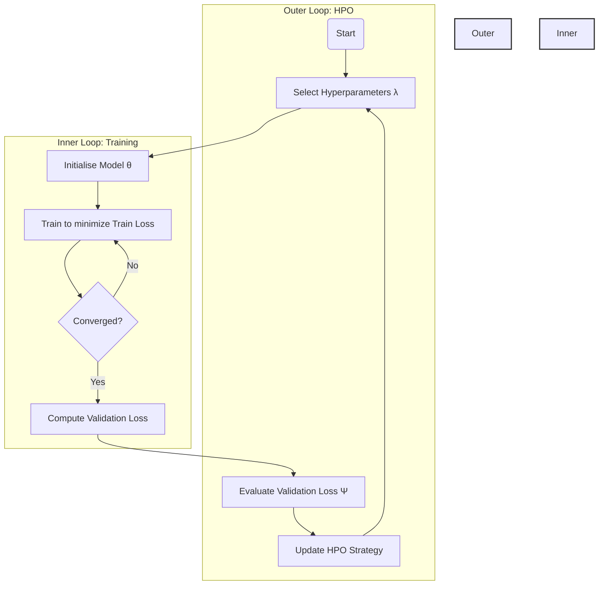
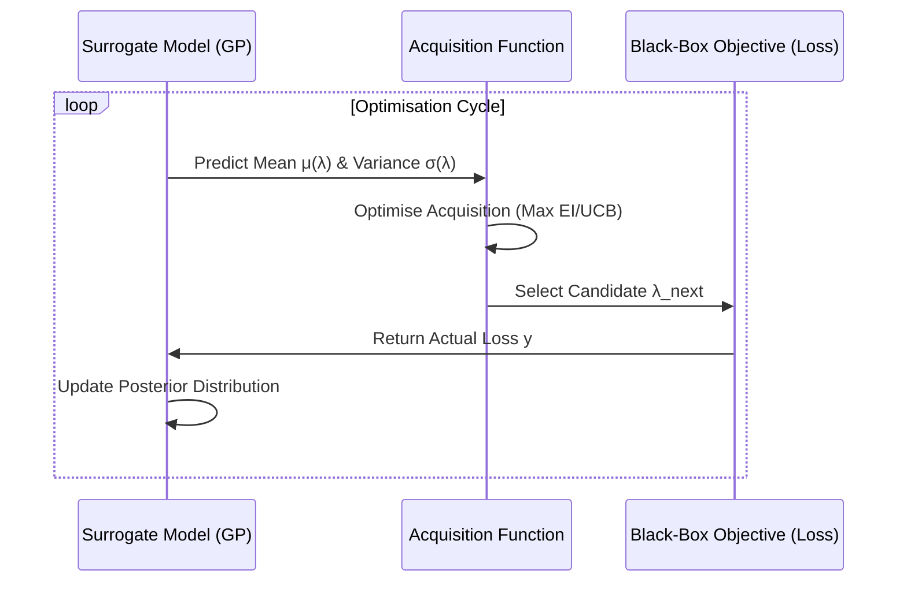
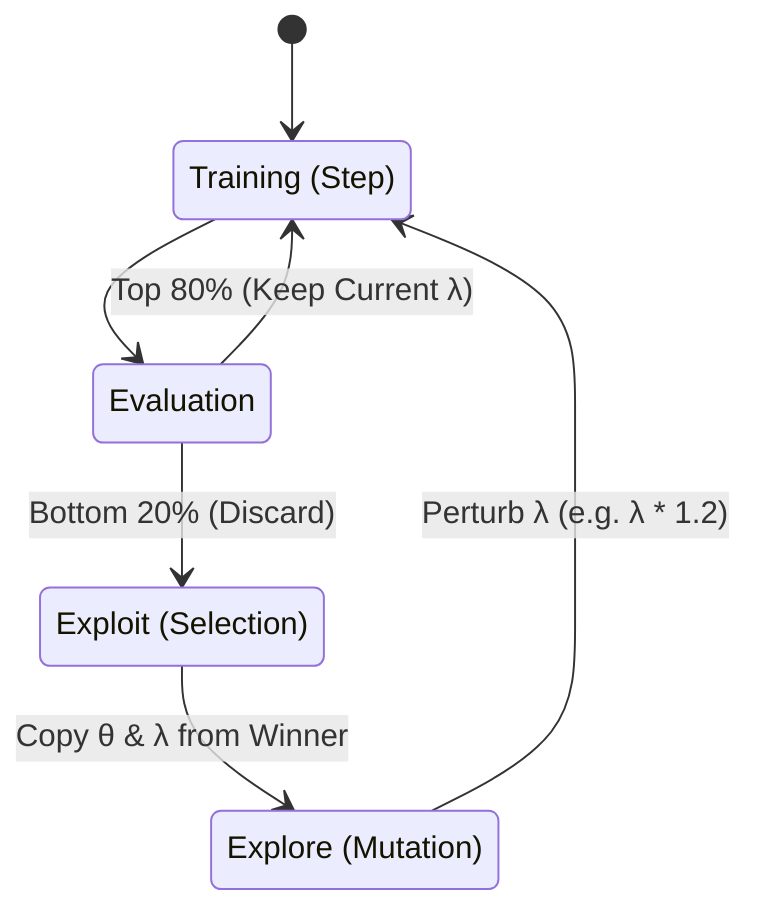

- [1 - Introduction: The Meta-Learning Problem](#1---introduction-the-meta-learning-problem)
  - [1.1 - Mathematical Problem Formulation](#11---mathematical-problem-formulation)
  - [1.2 - The Black-Box Constraint and Search Space](#12---the-black-box-constraint-and-search-space)
- [2 - Fundamental Search Strategies: Determinism vs. Stochastics](#2---fundamental-search-strategies-determinism-vs-stochastics)
  - [2.1 - Grid Search: The Curse of Dimensionality](#21---grid-search-the-curse-of-dimensionality)
  - [2.2 - Random Search and Effective Dimensionality](#22---random-search-and-effective-dimensionality)
    - [2.2.1 - The Concept of Low Effective Dimensionality](#221---the-concept-of-low-effective-dimensionality)
    - [2.2.2 - Asymptotic Probability of Success](#222---asymptotic-probability-of-success)
- [3 - Bayesian Optimisation: A Model-Based Approach](#3---bayesian-optimisation-a-model-based-approach)
  - [3.1 - The Surrogate Model: Gaussian Processes](#31---the-surrogate-model-gaussian-processes)
    - [3.1.1 - Kernel Selection](#311---kernel-selection)
  - [3.2 - The Posterior Update](#32---the-posterior-update)
    - [3.2.1 - Computational Example: Single Update](#321---computational-example-single-update)
  - [3.3 - Acquisition Functions](#33---acquisition-functions)
    - [3.3.1 - Expected Improvement (EI)](#331---expected-improvement-ei)
    - [3.3.2 - Upper Confidence Bound (UCB)](#332---upper-confidence-bound-ucb)
  - [3.4 - Limitations of Gaussian Processes](#34---limitations-of-gaussian-processes)
- [4 - Multi-Fidelity Optimisation: Hyperband](#4---multi-fidelity-optimisation-hyperband)
  - [4.1 - The Successive Halving Algorithm (SHA)](#41---the-successive-halving-algorithm-sha)
  - [4.2 - Hyperband: Hedging the Budget](#42---hyperband-hedging-the-budget)
    - [4.2.1 - Detailed Calculation Example](#421---detailed-calculation-example)
- [5 - Population Based Training (PBT): Dynamic Adaptation](#5---population-based-training-pbt-dynamic-adaptation)
  - [5.1 - The PBT Algorithm](#51---the-pbt-algorithm)
  - [5.2 - Theoretical Implications](#52---theoretical-implications)
- [6 - Gradient-Based Hyperparameter Optimisation](#6---gradient-based-hyperparameter-optimisation)
  - [6.1 - Implicit Differentiation](#61---implicit-differentiation)
  - [6.2 - Computational Challenges and Approximations](#62---computational-challenges-and-approximations)
- [7 - Comparison of Methods and Conclusion](#7---comparison-of-methods-and-conclusion)
  - [7.1 - Conclusion](#71---conclusion)
- [References](#references)

# 1 - Introduction: The Meta-Learning Problem

In the contemporary landscape of artificial intelligence, particularly within the subfields of **machine learning (ML)** and **deep learning (DL)**, the efficacy of a model is not solely determined by the optimisation of its internal parameters (weights and biases) but is fundamentally constrained by a higher-order configuration space known as **hyperparameters**. While internal parameters, denoted as $\theta$, are learned directly from training data via algorithms such as **Stochastic Gradient Descent (SGD)**, hyperparameters, denoted as $\lambda$, must be specified prior to the commencement of the learning process. This requirement effectively creates a bi-level optimisation problem, often referred to as **meta-learning** or the problem of **hyper-parameter optimisation (HPO)**.

The optimisation of hyperparameters is a critical endeavour because these values dictate the structural and functional capacity of the model. They control the topology of the neural network (e.g., number of layers, width of kernels), the dynamics of the optimisation process (e.g., learning rate, momentum, batch size), and the complexity controls that prevent overfitting (e.g., $L_1$/$L_2$ regularisation coefficients, dropout rates). A sub-optimal selection of $\lambda$ can render a theoretically sound architecture incapable of convergence, while an optimal configuration can allow a modest architecture to achieve state-of-the-art performance.

This report provides a comprehensive, mathematically rigorous analysis of HPO. It explores the theoretical underpinnings of the problem, the nature of the objective functions involved, and the advanced algorithms developed to traverse these high-dimensional, non-convex, and often expensive search spaces. The analysis moves beyond superficial descriptions to dissect the mathematical mechanisms of **Bayesian Optimisation**, **Multi-Fidelity approximations**, and **Gradient-based strategies**, providing the reader with the theoretical depth required to implement these systems from first principles.

## 1.1 - Mathematical Problem Formulation

To address HPO rigorously, one must define the learning problem formally. Let $\mathcal{X}$ denote the input space and $\mathcal{Y}$ the output space. We assume the existence of a data distribution $\mathcal{D}$ over $\mathcal{X} \times \mathcal{Y}$. A learning algorithm $\mathcal{A}$ maps a dataset $D_{train} \sim \mathcal{D}$ and a hyperparameter configuration $\lambda \in \Lambda$ to a function $f_{\theta}: \mathcal{X} \rightarrow \mathcal{Y}$.

The **inner optimisation loop** (the standard training process) finds the optimal model parameters $\theta^*$ for a fixed $\lambda$ by minimising a training loss $\mathcal{L}_{train}$:

$$ \theta^*(\lambda) = \underset{\theta \in \Theta}{\text{argmin}} \ \mathcal{L}_{train}(\theta, \lambda; D_{train}) $$

The **outer optimisation loop** (the HPO problem) seeks to find the hyperparameter configuration $\lambda^*$ that minimises a validation loss $\mathcal{L}_{val}$, which serves as a proxy for the generalisation error:

$$ \lambda^* = \underset{\lambda \in \Lambda}{\text{argmin}} \ \Psi(\lambda) $$

Here, the response function $\Psi(\lambda)$ is defined as the validation error of the model trained with $\lambda$:

$$ \Psi(\lambda) = \mathbb{E}_{(x, y) \sim D_{val}} \left[ \mathcal{L}_{val}(f_{\theta^*(\lambda)}(x), y) \right] $$

This formulation highlights the principal mathematical challenge of HPO: $\Psi(\lambda)$ is a non-convex, usually non-differentiable "black-box" function. We do not possess an analytical form of $\Psi(\lambda)$; we can only evaluate it pointwise. Furthermore, each evaluation is computationally expensive, requiring the complete execution of the inner optimisation loop (training the model).

*Figure 1: Visualisation of a non-convex function (Rastrigin function). HPO landscapes often exhibit similar local minima, making simple gradient descent impossible without smoothing.*

## 1.2 - The Black-Box Constraint and Search Space

The domain $\Lambda$ is typically a complex, structured space containing variables of mixed types. Understanding the topology of $\Lambda$ is essential for selecting an appropriate optimisation strategy.

  * **Continuous Parameters:** Variables such as the learning rate $\eta$, regularisation coefficients ($C$, $\lambda_{reg}$), or momentum coefficients exist on a continuous spectrum. These are often treated in logarithmic space (e.g., searching $10^{-5}$ to $10^{-1}$) because their influence on model dynamics is multiplicative rather than additive.
  * **Discrete and Integer Parameters:** Structural decisions often involve integers, such as the number of neurons in a hidden layer, the number of estimators in a Random Forest, or the stride of a convolutional filter. These parameters impose a lattice structure on the search space.
  * **Categorical Parameters:** Qualitative choices, such as the type of activation function (ReLU vs. Tanh) or the choice of optimiser (Adam vs. RMSProp), are unordered categorical variables. Distance metrics in this subspace are difficult to define, complicating gradient-based or distance-based optimisation approaches.
  * **Conditional Hyperparameters:** The search space is often hierarchical. For instance, the hyperparameter $\beta_2$ (decay rate of second-order momentum) is only relevant if the categorical hyperparameter "Optimiser" is set to "Adam". If the optimiser is "SGD", $\beta_2$ is inactive. This conditional structure creates a tree-like dependency in $\Lambda$, which naive algorithms like Grid Search struggle to handle efficiently.

-----

# 2 - Fundamental Search Strategies: Determinism vs. Stochastics

Before analysing advanced model-based methods, it is necessary to establish the theoretical properties of model-free baselines: **Grid Search** and **Random Search**. While conceptually simple, the mathematical analysis of these methods reveals deep insights into the geometry of high-dimensional optimisation.

## 2.1 - Grid Search: The Curse of Dimensionality

Grid Search is an exhaustive search algorithm that discretises the search space $\Lambda$. For each hyperparameter $j \in \{1, \dots, k\}$, a finite set of values $L_j$ is specified. The algorithm evaluates the objective function $\Psi(\lambda)$ at every point in the Cartesian product $\Lambda_{grid} = L_1 \times L_2 \times \dots \times L_k$.

If the user selects $m$ distinct values for each of the $k$ hyperparameters, the computational complexity is defined as:

$$ N_{evals} = m^k $$

This exponential growth is known as the **curse of dimensionality**. For a modern deep learning architecture with potentially 20 hyperparameters, a grid search with merely 3 values per parameter would require $3^{20} \approx 3.48 \times 10^9$ evaluations. Assuming one hour per training run, this is computationally infeasible. Grid Search is, therefore, only viable for low-dimensional spaces ($k \leq 4$).

## 2.2 - Random Search and Effective Dimensionality

Random Search replaces the fixed lattice of Grid Search with a stochastic sampling process. For each hyperparameter, a prior distribution (e.g., Uniform, Log-Uniform) is defined, and configurations are sampled independently and identically distributed (i.i.d.) from the joint distribution.

Bergstra and Bengio (2012) provided a seminal mathematical justification for the efficiency of Random Search over Grid Search, centred on the concept of **Effective Dimensionality**.

### 2.2.1 - The Concept of Low Effective Dimensionality

The core hypothesis is that for any specific dataset $D$, the function $\Psi(\lambda)$ is sensitive to changes in only a small subset of the dimensions of $\Lambda$. In a $k$-dimensional space, perhaps only $d < k$ parameters significantly affect the validation loss.

Consider a 2-dimensional search space with parameters $\lambda_1$ (important) and $\lambda_2$ (unimportant).

  * **Grid Search:** If we use a $3 \times 3$ grid, we perform 9 evaluations. However, because we project onto fixed values, we only test 3 distinct values of the important parameter $\lambda_1$. The remaining 6 evaluations differ only in the unimportant parameter $\lambda_2$, providing little additional information regarding the minimum of $\Psi$.
  * **Random Search:** With 9 random samples, it is statistically probable that we test 9 distinct values of the important parameter $\lambda_1$. This results in a much finer exploration of the relevant subspace.

### 2.2.2 - Asymptotic Probability of Success

We can quantify the efficiency of Random Search using elementary probability theory. Let $V$ be the total volume of the search space $\Lambda$, and let $v \subset \Lambda$ be the target region containing optimal configurations (e.g., the set of configurations that yield a validation error within 5% of the global minimum).

Let the volume ratio be $p = \frac{vol(v)}{vol(\Lambda)}$. This represents the probability that a single random sample lands in the optimal region. If we perform $n$ independent trials, the probability of finding at least one optimal configuration is:

$$ P(\text{success}) = 1 - (1 - p)^n $$

To achieve a desired confidence level $C$ (e.g., 95% probability of success), we can solve for the required number of trials $n$:

$$
\begin{align*}
1 - (1 - p)^n &\geq C \\
(1 - p)^n &\leq 1 - C \\
n \ln(1 - p) &\leq \ln(1 - C) \\
n &\geq \frac{\ln(1 - C)}{\ln(1 - p)}
\end{align*}
$$

**Example Calculation:**
Suppose we wish to find a configuration in the top 5% of the search space ($p = 0.05$) with 95% confidence ($C = 0.95$).

$$ n \geq \frac{\ln(0.05)}{\ln(0.95)} \approx \frac{-2.996}{-0.051} \approx 58.7 $$

This result is profound: roughly 60 trials are sufficient to identify a near-optimal model with high probability, independent of the dimensionality $k$ of the search space, provided the effective dimensionality remains manageable. This starkly contrasts with Grid Search, where the number of trials depends exponentially on $k$.

-----

# 3 - Bayesian Optimisation: A Model-Based Approach

While Random Search is statistically robust, it is inefficient in the sense that it does not learn from history. It treats the 60th trial with the same blindness as the first. **Bayesian Optimisation (BO)** addresses this by treating the finding of $\lambda^*$ as an optimisation problem in itself. It constructs a probabilistic surrogate model of the objective function $\Psi(\lambda)$ based on observed evaluations and uses this model to intelligently select the next point to evaluate.

BO operates effectively under the following constraints:

1.  The objective function is expensive to evaluate.
2.  We lack derivatives (black-box).
3.  We want to minimise the total number of evaluations.

## 3.1 - The Surrogate Model: Gaussian Processes

The standard surrogate in BO is the **Gaussian Process (GP)**. A GP is a stochastic process (a collection of random variables indexed by time or space) such that every finite collection of those random variables has a multivariate normal distribution.

Mathematically, a GP is fully specified by a mean function $m(\lambda)$ and a covariance function (kernel) $k(\lambda, \lambda')$:

$$ f(\lambda) \sim \mathcal{GP}(m(\lambda), k(\lambda, \lambda')) $$

We typically assume a prior mean of zero, $m(\lambda) = 0$, after normalising the observed target values. The kernel function $k(\lambda, \lambda')$ encodes our assumptions about the function's smoothness and similarity. If $\lambda$ and $\lambda'$ are close in the search space, the kernel should return a high covariance, implying that $f(\lambda)$ and $f(\lambda')$ are likely to be similar.

### 3.1.1 - Kernel Selection

The choice of kernel is the primary mechanism for injecting prior knowledge into the optimisation.

**Squared Exponential (RBF) Kernel:**
$$ k_{SE}(\lambda, \lambda') = \sigma_f^2 \exp\left( - \frac{||\lambda - \lambda'||^2}{2l^2} \right) $$
Here, $l$ is the length-scale parameter, which controls the "wiggliness" of the function. A large $l$ implies the function changes slowly (high correlation over distances). $\sigma_f^2$ is the signal variance. This kernel implies the objective function is infinitely differentiable, which may be too smooth for some HPO landscapes.

**Matérn Kernel:**
The Matérn class of kernels is often preferred in ML because it allows for rougher functions (less smoothness). The Matérn 5/2 kernel is a standard choice:
$$ k_{M52}(d) = \sigma_f^2 \left( 1 + \sqrt{5}\frac{d}{l} + \frac{5d^2}{3l^2} \right) \exp\left( - \sqrt{5}\frac{d}{l} \right) $$
where $d = ||\lambda - \lambda'||$. This allows for modelling non-smooth changes in performance as hyperparameters vary.

## 3.2 - The Posterior Update

Suppose we have performed $t$ evaluations, yielding a dataset $\mathcal{D}_t = \{(\lambda_i, y_i)\}_{i=1}^t$. We assume the observed values $y_i$ are noisy observations of the true objective $f(\lambda)$:

$$ y_i = f(\lambda_i) + \epsilon, \quad \epsilon \sim \mathcal{N}(0, \sigma_n^2) $$

We wish to predict the distribution of the function value $f_*$ at a new candidate hyperparameter $\lambda_*$. By the definition of a GP, the joint distribution of the observed data $y$ and the unknown $f_*$ is multivariate Gaussian:

$$ \begin{bmatrix} y \\ f_* \end{bmatrix} \sim \mathcal{N} \left( 0, \begin{bmatrix} K + \sigma_n^2 I & k_* \\ k_*^T & k(\lambda_*, \lambda_*) \end{bmatrix} \right) $$

where:

  * $K$ is the $t \times t$ covariance matrix with entries $K_{ij} = k(\lambda_i, \lambda_j)$.
  * $k_*$ is the vector of covariances between the observed points and the candidate, $[k(\lambda_1, \lambda_*), \dots, k(\lambda_t, \lambda_*)]^T$.
  * $k(\lambda_*, \lambda_*)$ is the prior variance at the candidate point.

Using the rules for conditioning Gaussian distributions, the posterior distribution $P(f_* | \mathcal{D}_t, \lambda_*)$ is a Gaussian $\mathcal{N}(\mu_t(\lambda_*), \sigma_t^2(\lambda_*))$ with:

**Posterior Mean (Prediction):**
$$ \mu_t(\lambda_*) = k_*^T (K + \sigma_n^2 I)^{-1} y $$

**Posterior Variance (Uncertainty):**
$$ \sigma_t^2(\lambda_*) = k(\lambda_*, \lambda_*) - k_*^T (K + \sigma_n^2 I)^{-1} k_* $$

These equations allow the algorithm to predict not just the likely performance of a new hyperparameter configuration, but also the uncertainty of that prediction.

*Figure 2: A Gaussian Process Regression showing the mean function (blue line), observed data points (red crosses), and the confidence intervals (shaded blue).*

### 3.2.1 - Computational Example: Single Update

To ground these equations, let us perform a manual calculation for a noiseless scenario ($\sigma_n = 0$) with a Squared Exponential kernel ($l=1, \sigma_f=1$).

**State:**

  * Observed: $\lambda_1 = 1.0$, $y_1 = 0.5$.
  * Candidate: $\lambda_* = 2.0$.

**Compute Kernel Matrix $K$:**
$$ K_{11} = \exp(-0.5(1.0 - 1.0)^2) = \exp(0) = 1.0 $$
Inverse: $K^{-1} = 1.0$.

**Compute Covariance Vector $k_*$:**
$$ k_* = k(1.0, 2.0) = \exp(-0.5(1.0 - 2.0)^2) = \exp(-0.5) \approx 0.6065 $$

**Compute Posterior Mean:**
$$ \mu(\lambda_*) = k_*^T K^{-1} y = 0.6065 \times 1.0 \times 0.5 = 0.3032 $$
The model predicts the value at $\lambda=2$ will be closer to the observed value (0.5) than the prior (0), effectively "pulling" the prediction up.

**Compute Posterior Variance:**
$$ \sigma^2(\lambda_*) = k(2.0, 2.0) - k_*^T K^{-1} k_* $$
$$ = 1.0 - (0.6065 \times 1.0 \times 0.6065) = 1.0 - 0.3678 = 0.6322 $$
The variance decreases from the prior of 1.0 to 0.6322, reflecting the information gained from the nearby observation.

## 3.3 - Acquisition Functions

Having a posterior distribution is insufficient; we need a decision rule to select the next point $\lambda_{t+1}$. This is the role of the **Acquisition Function**, denoted $\alpha(\lambda)$. The function $\alpha(\lambda)$ is inexpensive to evaluate and optimise. We select $\lambda_{t+1} = \text{argmax}_{\lambda} \alpha(\lambda)$.

The acquisition function must balance **Exploitation** (sampling where the mean $\mu_t$ is low, assuming minimisation) and **Exploration** (sampling where the variance $\sigma_t^2$ is high).

### 3.3.1 - Expected Improvement (EI)

EI is the most widely used criterion. It calculates the expected magnitude of the improvement over the current best observed value $f_{best} = \min(y)$.

Define the improvement $I(\lambda) = \max(f_{best} - f(\lambda), 0)$. Since $f(\lambda)$ is a random variable given by the posterior GP, $I(\lambda)$ is also random. We compute the expectation:

$$ \alpha_{EI}(\lambda) = \mathbb{E}[I(\lambda)] = \int_{-\infty}^{f_{best}} (f_{best} - f) \mathcal{N}(f; \mu_t(\lambda), \sigma_t^2(\lambda)) df $$

Using integration by parts, we derive the closed-form analytical expression:

$$ \alpha_{EI}(\lambda) = (f_{best} - \mu_t(\lambda) - \xi)\Phi(Z) + \sigma_t(\lambda)\phi(Z) $$

where $Z = \frac{f_{best} - \mu_t(\lambda) - \xi}{\sigma_t(\lambda)}$.

  * $\Phi(\cdot)$ is the standard normal CDF.
  * $\phi(\cdot)$ is the standard normal PDF.
  * $\xi$ is a small jitter parameter used to encourage exploration.

The first term $(f_{best} - \mu_t(\lambda))$ drives exploitation, while the second term $\sigma_t(\lambda)$ drives exploration. When uncertainty is zero ($\sigma_t \to 0$), EI becomes zero, preventing the algorithm from re-sampling known points.

### 3.3.2 - Upper Confidence Bound (UCB)

UCB (or Lower Confidence Bound for minimisation) constructs a pessimistic bound on the function's value. It is derived from regret bounds in bandit theory.

$$ \alpha_{LCB}(\lambda) = \mu_t(\lambda) - \kappa \sigma_t(\lambda) $$

Here, $\kappa$ is a tunable parameter (often set to 2.0 or scheduled to increase over time). We seek to minimise this LCB. A point with high uncertainty (large $\sigma_t$) will have a very low LCB score (since we subtract $\kappa \sigma_t$), making it attractive for selection.

## 3.4 - Limitations of Gaussian Processes

While theoretically elegant, standard GP-based BO suffers from scaling issues:

  * **Cubic Complexity:** Inverting the matrix $(K + \sigma_n^2 I)$ requires $\mathcal{O}(t^3)$ operations, where $t$ is the number of observations. As $t$ exceeds 1000, the overhead of the HPO algorithm itself becomes significant.
  * **Continuous Space:** GPs are naturally defined on continuous spaces. Handling categorical variables requires specific kernels (e.g., Hamming distance kernels) or encoding schemes, which can be suboptimal.

For these reasons, alternative surrogate models like **Tree-structured Parzen Estimators (TPE)** or **Random Forests (SMAC)** are often used for higher-dimensional or mixed-type problems. TPE, for instance, models the likelihoods $p(\lambda | y < y^*)$ and $p(\lambda | y \geq y^*)$ rather than the posterior $p(y|\lambda)$ directly, avoiding the cubic cost.

-----

# 4 - Multi-Fidelity Optimisation: Hyperband

Bayesian Optimisation assumes that every evaluation of the objective function has the same cost. In deep learning, however, we can approximate the performance of a configuration by training for fewer epochs or on a subset of the data. This gives rise to **Multi-Fidelity** methods, which discard poor configurations early to allocate resources to promising ones.

## 4.1 - The Successive Halving Algorithm (SHA)

The precursor to Hyperband is Successive Halving. The problem is framed as identifying the best configuration from a set of $n$ candidates given a total resource budget $B$.

**Algorithm:**

1.  Initialise $n$ configurations uniformly at random.
2.  Allocate a small budget $r$ to each.
3.  Evaluate all $n$ configurations with budget $r$.
4.  Rank them by validation loss.
5.  Discard the bottom fraction (e.g., half).
6.  Double the budget $r$ for the survivors.
7.  Repeat until one configuration remains.

**Mathematical Assumption:**
SHA assumes **rank stability**: if configuration $\lambda_A$ is better than $\lambda_B$ at full convergence, it is likely better (or at least comparable) at partial training. While usually true, this can fail for configurations that converge slowly but to a lower final loss (e.g., small learning rates).

## 4.2 - Hyperband: Hedging the Budget

Hyperband addresses the " $n$ vs. $B/n$ " trade-off inherent in Successive Halving. Should we try many configurations with little training (broad search) or few configurations with extensive training (deep search)? Hyperband does both by running multiple "brackets" of Successive Halving.

**Parameters:**

  * $R$: Maximum resource per configuration (e.g., 81 epochs).
  * $\eta$: The downsampling factor (typically 3).

**Algorithm Structure:**
Hyperband iterates through a loop of brackets, indexed by $s$, ranging from $s_{max} = \lfloor \log_\eta(R) \rfloor$ down to 0.
For each bracket $s$, we calculate:

  * Initial configurations ($n_i$): $n = \lceil \frac{B}{R} \frac{\eta^s}{s+1} \rceil$
  * Initial resource ($r_i$): $r = R \eta^{-s}$
    Each bracket then performs Successive Halving.

<!-- end list -->

### 4.2.1 - Detailed Calculation Example

Let $R=81$ (max epochs) and $\eta=3$.
$s_{max} = \log_3(81) = 4$.

**Bracket $s=4$ (Explorative):**
Initial resource $r = 81 \cdot 3^{-4} = 1$ epoch.
Number of configs $n$ is maximised.
We train a large number of models for 1 epoch. The top $1/3$ proceed to 3 epochs, then 9, 27, 81. This bracket aggressively filters based on very early performance.

**Bracket $s=0$ (Exploitative):**
Initial resource $r = 81 \cdot 3^{-0} = 81$ epochs.
Number of configs $n$ is minimised.
We train a few models for the full 81 epochs immediately. This is equivalent to Random Search.

**Comparison Table:**

| Bracket (s) | Initial n | Initial r (epochs) | Rounds of Halving | Philosophy         |
| :---------- | :-------- | :----------------- | :---------------- | :----------------- |
| 4           | 81        | 1                  | 4                 | Max Exploration    |
| 3           | 27        | 3                  | 3                 | High Exploration   |
| 2           | 9         | 9                  | 2                 | Balanced           |
| 1           | 3         | 27                 | 1                 | High Exploitation  |
| 0           | 1         | 81                 | 0                 | Pure Random Search |

This "hedging" strategy ensures that if the rank correlation is weak (requiring full training to see the best models), Bracket 0 will find them. If rank correlation is strong, Bracket 4 will find the best model much faster by filtering out the junk early. This robustness makes Hyperband a standard in modern deep learning frameworks.

-----

# 5 - Population Based Training (PBT): Dynamic Adaptation

Both Bayesian Optimisation and Hyperband view a hyperparameter configuration $\lambda$ as a static constant set before training begins. However, the optimal hyperparameters often change during training. For instance, it is standard practice to decay the learning rate over time.

**Population Based Training (PBT)** bridges HPO and evolutionary algorithms to adapt $\lambda$ dynamically. It is particularly effective in Reinforcement Learning (RL).

## 5.1 - The PBT Algorithm

PBT maintains a population of $P$ agents (models), each with its own weights $\theta_p$ and hyperparameters $\lambda_p$.

**The Evolutionary Cycle:**

1.  **Step:** All $P$ models train in parallel for a fixed interval (e.g., 1000 steps).
2.  **Eval:** Each model is evaluated on a validation set.
3.  **Exploit (Selection):** Models in the bottom quantile (e.g., bottom 20%) are discarded. They are replaced by copies of models from the top quantile.
    $$ \theta_{loser} \leftarrow \theta_{winner} $$
    $$ \lambda_{loser} \leftarrow \lambda_{winner} $$
4.  **Explore (Mutation):** The hyperparameters of the copied models are perturbed to explore the vicinity of the successful configuration.
    $$ \lambda_{new} \sim \text{Perturb}(\lambda_{old}) $$
    Common perturbations include multiplying by factors of 0.8 or 1.2.

## 5.2 - Theoretical Implications

PBT enables **Hyperparameter Schedules**. By mutating $\lambda$ at every step, the population naturally discovers trajectories through the hyperparameter space. For example, if a high learning rate is good early but bad late, the population will evolve from high to low learning rates automatically, without the user explicitly coding a decay scheduler.

Crucially, PBT incurs no extra wall-clock time compared to training $P$ models independently (Random Search). However, because the computational resources are constantly refocused on the best-performing lineages, the final result is often significantly superior.

-----

# 6 - Gradient-Based Hyperparameter Optimisation

For continuous hyperparameters, one might ask: can we differentiate the validation loss with respect to the hyperparameters and use Gradient Descent? This leads to **Gradient-based HPO**, often formulated via **Implicit Differentiation**.

## 6.1 - Implicit Differentiation

Recall the goal: compute the hypergradient $\nabla_\lambda \mathcal{L}_{val}(\theta^*(\lambda), \lambda)$.

Using the Chain Rule:
$$ \frac{d \mathcal{L}_{val}}{d \lambda} = \frac{\partial \mathcal{L}_{val}}{\partial \lambda} + \left( \frac{\partial \mathcal{L}_{val}}{\partial \theta} \right)^T \frac{d \theta^*}{d \lambda} $$

The first term is the direct gradient (often zero if $\lambda$ only affects training, not validation loss directly). The second term contains the Jacobian $\frac{d \theta^*}{d \lambda}$, which captures how the optimal weights shift as $\lambda$ changes.

To find $\frac{d \theta^*}{d \lambda}$, we exploit the optimality condition of the inner loop. At $\theta^*$, the gradient of the training loss is zero:
$$ \nabla_\theta \mathcal{L}_{train}(\theta^*, \lambda) = 0 $$

Differentiating this equation with respect to $\lambda$ using the total derivative:
$$ \frac{d}{d \lambda} (\nabla_\theta \mathcal{L}_{train}) = \frac{\partial (\nabla_\theta \mathcal{L}_{train})}{\partial \lambda} + \frac{\partial (\nabla_\theta \mathcal{L}_{train})}{\partial \theta} \frac{d \theta^*}{d \lambda} = 0 $$

This expands to:
$$ \nabla^2_{\theta \lambda} \mathcal{L}_{train} + \nabla^2_{\theta \theta} \mathcal{L}_{train} \frac{d \theta^*}{d \lambda} = 0 $$
where $\nabla^2_{\theta \theta} \mathcal{L}_{train}$ is the Hessian matrix $H$ of the training loss. Assuming $H$ is invertible, we solve for the Jacobian:
$$ \frac{d \theta^*}{d \lambda} = - H^{-1} \nabla^2_{\theta \lambda} \mathcal{L}_{train} $$

Substituting this back into the hypergradient equation gives the **Implicit Function Theorem (IFT) Formula**:
$$ \frac{d \mathcal{L}_{val}}{d \lambda} = \frac{\partial \mathcal{L}_{val}}{\partial \lambda} - \nabla_\theta \mathcal{L}_{val} \cdot H^{-1} \cdot \nabla^2_{\theta \lambda} \mathcal{L}_{train} $$

## 6.2 - Computational Challenges and Approximations

The term $H^{-1}$ is the inverse of a Hessian matrix with millions of rows and columns (for deep networks). Explicit computation is impossible.

Researchers use approximations to compute the vector-Hessian product $v^T H^{-1}$:

  * **Neumann Series:** $H^{-1} \approx \sum_{i=0}^k (I - H)^i$. This allows computing the product using only Hessian-vector products (HvP), which are efficiently supported by automatic differentiation libraries (Autograd, JAX).
  * **Conjugate Gradient:** Iteratively solving the linear system $Hx = v$ for $x$.

These methods allow for tuning millions of hyperparameters (e.g., a separate regularisation weight for every parameter in the network) in a single training run, a feat impossible with Bayesian Optimisation.

-----

# 7 - Comparison of Methods and Conclusion

To guide implementation, we summarise the comparative advantages of the discussed frameworks.

| Feature            | Random Search           | Bayesian Opt (GP)       | Hyperband             | PBT                 | Gradient-Based           |
| :----------------- | :---------------------- | :---------------------- | :-------------------- | :------------------ | :----------------------- |
| **Math Basis**     | Probability Theory      | Gaussian Processes      | Bandit Theory         | Evolutionary Algo   | Implicit Differentiation |
| **Search Space**   | Any                     | Continuous (mostly)     | Any                   | Any                 | Continuous only          |
| **Parallelism**    | Embarrassingly Parallel | Sequential              | Parallel Batches      | Parallel Population | Sequential               |
| **Efficiency**     | Low (Blind)             | High (Sample Efficient) | High (Early Stopping) | High (Dynamic)      | Very High (Local)        |
| **Implementation** | Trivial                 | Moderate (Libraries)    | Moderate              | Moderate            | Difficult                |
| **Scalability**    | High (Effective Dim)    | Low ($<20$ dims)        | High                  | High                | Very High (Millions)     |

## 7.1 - Conclusion

The field of Hyperparameter Optimisation has evolved from simple trial-and-error heuristics to a rigorous discipline intersecting statistics, optimisation, and control theory.

  * **For the practitioner:** Random Search remains a formidable baseline due to its theoretical guarantees regarding effective dimensionality. However, for resource-constrained deep learning, Hyperband provides a mathematically sound method to gain orders-of-magnitude speedups by hedging evaluation budgets.
  * **For the theorist:** Bayesian Optimisation offers a principled framework for decision making under uncertainty, though it struggles with the high dimensionality of modern neural networks.
  * **For complex dynamics:** Population Based Training represents a paradigm shift, treating hyperparameters as dynamic control variables rather than static constants.
  * **For the future:** Gradient-based methods promise to unify learning and meta-learning into a single differentiable stack, potentially removing the "loop" distinction entirely.

Understanding these underlying theories (from the Cholesky decompositions in GPs to the geometric series in Hyperband) equips the machine learning engineer with the tools to navigate the complex loss landscapes of modern AI, transforming the "black art" of tuning into a precise science.

# References

1. **Bergstra, J., & Bengio, Y. (2012).** Random Search for Hyper-Parameter Optimization. *Journal of Machine Learning Research, 13*, 281–305. [https://www.jmlr.org/papers/v13/bergstra12a.html](https://www.jmlr.org/papers/v13/bergstra12a.html) ([jmlr.org][1])

2. **Hazan, E., Klivans, A., & Yuan, Y. (2017).** Hyperparameter Optimization: A Spectral Approach. *arXiv preprint arXiv:1706.00764*. [https://arxiv.org/abs/1706.00764](https://arxiv.org/abs/1706.00764) ([arXiv][2])

3. **Jaderberg, M., Dalibard, V., Osindero, S., Czarnecki, W. M., Donahue, J., Razavi, A., Vinyals, O., Green, T., Dunning, I., Simonyan, K., Fernando, C., & Kavukcuoglu, K. (2017).** Population Based Training of Neural Networks. *arXiv preprint arXiv:1711.09846*. [https://arxiv.org/abs/1711.09846](https://arxiv.org/abs/1711.09846) ([arXiv][3])

4. **Li, L., Jamieson, K., DeSalvo, G., Rostamizadeh, A., & Talwalkar, A. (2018).** Hyperband: A Novel Bandit-Based Approach to Hyperparameter Optimization. *Journal of Machine Learning Research, 18*(185), 1–52. [https://www.jmlr.org/papers/volume18/16-558/16-558.pdf](https://www.jmlr.org/papers/volume18/16-558/16-558.pdf) ([arXiv][4])

5. **Lorraine, J., Vicol, P., & Duvenaud, D. (2020).** Optimizing Millions of Hyperparameters by Implicit Differentiation. *Proceedings of the Twenty Third International Conference on Artificial Intelligence and Statistics (AISTATS 2020), PMLR 108*, 1540–1552. [https://proceedings.mlr.press/v108/lorraine20a.html](https://proceedings.mlr.press/v108/lorraine20a.html) ([Proceedings of Machine Learning Research][5])

6. **Snoek, J., Larochelle, H., & Adams, R. P. (2012).** Practical Bayesian Optimization of Machine Learning Algorithms. *Advances in Neural Information Processing Systems, 25*, 2951–2959. [https://proceedings.neurips.cc/paper/2012/file/05311655a15b75fab86956663e1819cd-Paper.pdf](https://proceedings.neurips.cc/paper/2012/file/05311655a15b75fab86956663e1819cd-Paper.pdf) ([arXiv][6])

[1]: https://jmlr.org/papers/v13/bergstra12a.html?utm_source=chatgpt.com "Random Search for Hyper-Parameter Optimization"
[2]: https://arxiv.org/abs/1706.00764?utm_source=chatgpt.com "Hyperparameter Optimization: A Spectral Approach"
[3]: https://arxiv.org/abs/1711.09846?utm_source=chatgpt.com "Population Based Training of Neural Networks"
[4]: https://arxiv.org/abs/1603.06560?utm_source=chatgpt.com "Hyperband: A Novel Bandit-Based Approach to Hyperparameter Optimization"
[5]: https://proceedings.mlr.press/v108/lorraine20a.html?utm_source=chatgpt.com "Optimizing Millions of Hyperparameters by Implicit Differentiation"
[6]: https://arxiv.org/abs/1206.2944?utm_source=chatgpt.com "Practical Bayesian Optimization of Machine Learning Algorithms"
