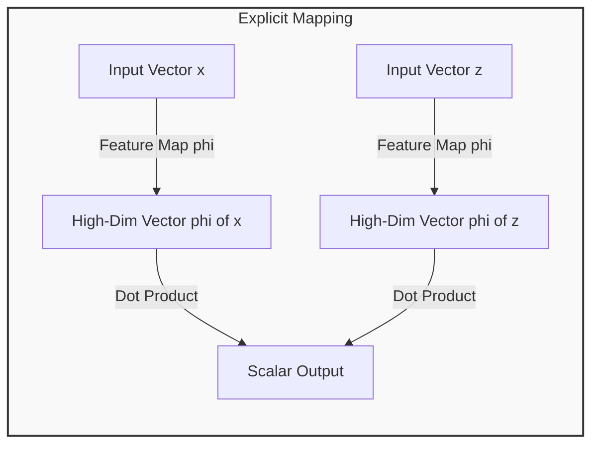
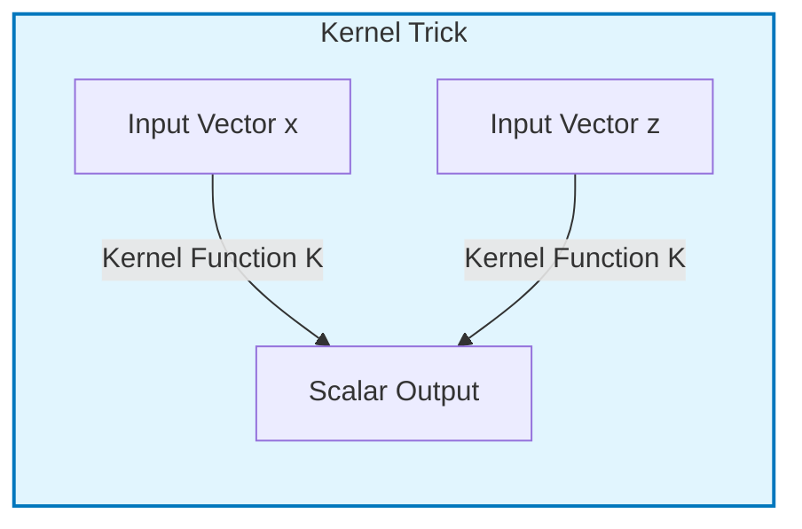
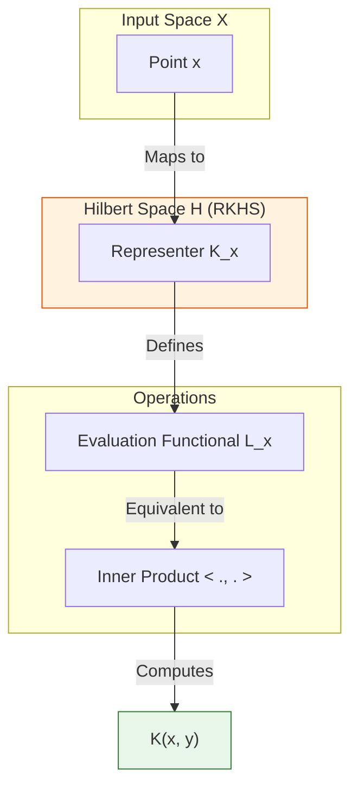
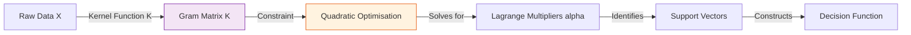
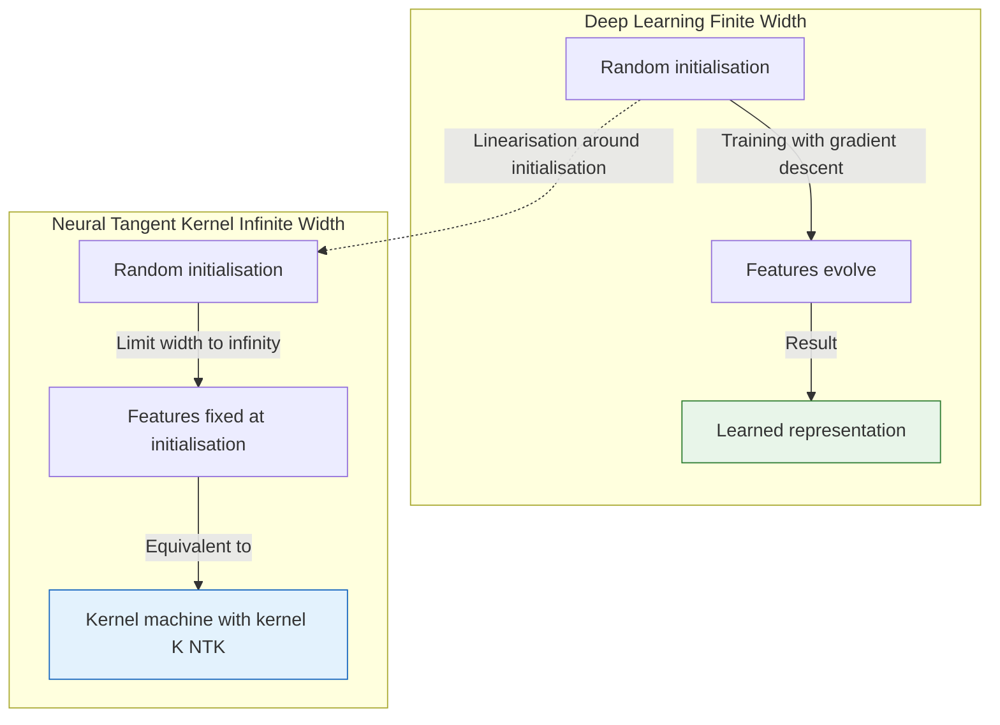

- [1 - Introduction: The Dimensionality Paradox](#1---introduction-the-dimensionality-paradox)
- [2 - Historical Genesis and Theoretical Origins](#2---historical-genesis-and-theoretical-origins)
	- [2.1 - The Soviet School: Potential Functions](#21---the-soviet-school-potential-functions)
	- [2.2 - The Generalised Portrait and Vapnik-Chervonenkis Theory](#22---the-generalised-portrait-and-vapnik-chervonenkis-theory)
- [3 - Mathematical Foundations](#3---mathematical-foundations)
	- [3.1 - Vector Spaces and Inner Products](#31---vector-spaces-and-inner-products)
	- [3.2 - Hilbert Spaces](#32---hilbert-spaces)
	- [3.3 - Separability and Convergence](#33---separability-and-convergence)
- [4 - Core Theory: Reproducing Kernel Hilbert Spaces (RKHS)](#4---core-theory-reproducing-kernel-hilbert-spaces-rkhs)
	- [4.1 - The Evaluation Functional](#41---the-evaluation-functional)
	- [4.2 - The Riesz Representation Theorem](#42---the-riesz-representation-theorem)
	- [4.3 - The Reproducing Property](#43---the-reproducing-property)
	- [4.4 - Mercer's Theorem](#44---mercers-theorem)
- [5 - The Kernel Trick: Mechanism and Implementation](#5---the-kernel-trick-mechanism-and-implementation)
	- [5.1 - The Dual Formulation](#51---the-dual-formulation)
	- [5.2 - The Gram Matrix](#52---the-gram-matrix)
- [6 - Taxonomy of Kernels: Derivations and Engineering](#6---taxonomy-of-kernels-derivations-and-engineering)
	- [6.1 - The Linear Kernel](#61---the-linear-kernel)
	- [6.2 - The Polynomial Kernel](#62---the-polynomial-kernel)
	- [6.3 - The Radial Basis Function (RBF) Kernel](#63---the-radial-basis-function-rbf-kernel)
	- [6.4 - Other Kernels](#64---other-kernels)
- [7 - A Computational Walkthrough: The XOR Example](#7---a-computational-walkthrough-the-xor-example)
- [8 - Modern Kernel Implementations and Approximations](#8---modern-kernel-implementations-and-approximations)
	- [8.1 - The Nyström Method](#81---the-nyström-method)
	- [8.2 - Random Fourier Features (RFF)](#82---random-fourier-features-rff)
- [9 - Kernels in the Age of Deep Learning](#9---kernels-in-the-age-of-deep-learning)
	- [9.1 - Representation Learning vs. Fixed Features](#91---representation-learning-vs-fixed-features)
	- [9.2 - The Neural Tangent Kernel (NTK)](#92---the-neural-tangent-kernel-ntk)
- [10 - Advantages and Disadvantages Summary](#10---advantages-and-disadvantages-summary)
	- [10.1 - Advantages](#101---advantages)
	- [10.2 - Disadvantages](#102---disadvantages)
- [11 - Conclusion](#11---conclusion)
- [References](#references)

# 1 - Introduction: The Dimensionality Paradox

The pursuit of artificial intelligence has long been grappled with a fundamental geometric paradox: the curse of dimensionality versus the necessity of high-dimensional representation. In the foundational era of machine learning, linear models such as the **Perceptron** offered computational elegance and rigorous theoretical guarantees. However, they were fundamentally limited by their inability to model complex, non-linear relationships (a limitation famously crystallised by Minsky and Papert’s critique of the Perceptron’s inability to solve the XOR problem).

To overcome this, researchers understood that data inseparable in a low-dimensional input space could often be separated if mapped into a sufficiently high-dimensional feature space. Yet, this solution introduced a computational intractability: explicitly transforming data vectors into these high-dimensional spaces incurred exponential costs in storage and processing power.

The resolution to this paradox is the "**kernel trick**" (a mathematical method that allows algorithms to operate in high-dimensional, even infinite-dimensional, feature spaces without ever explicitly computing the coordinates of the data in that space). By replacing the explicit inner product of transformed vectors with a kernel function computed in the original input space, the kernel trick decouples the complexity of the learning task from the dimensionality of the hypothesis space.

**Explicit Mapping (Computationally Expensive)**

**Kernel Trick (Computationally Efficient)**

This report provides an exhaustive analysis of the kernel trick. It traces its origins from Soviet cybernetics to modern statistical learning theory, dissects the functional analysis of Reproducing Kernel Hilbert Spaces (RKHS), and examines its role in the contemporary landscape dominated by Deep Learning.

-----

# 2 - Historical Genesis and Theoretical Origins

The narrative of the kernel trick is often simplified to the 1990s and the rise of Support Vector Machines (SVMs). However, the intellectual lineage stretches back to the height of the Cold War and the distinct school of Soviet cybernetics.

## 2.1 - The Soviet School: Potential Functions

In the early 1960s, the Institute of Control Sciences in Moscow was a hub for research into learning systems. It was here that Mark Aizerman, Emmanuel Braverman, and Lev Rozonoer developed the "**Method of Potential Functions**". Their seminal 1964 paper, "Theoretical Foundations of the Potential Function Method in Pattern Recognition Learning", laid the groundwork for what would become kernel methods.

Aizerman’s team proposed that a pattern recognition machine could learn a decision function $f(x)$ by accumulating "potential fields" generated by training examples. Analogous to electrostatics, where a charge creates a field in space, a data point $x_i$ contributes to the decision boundary via a potential function $K(x, x_i)$. They realised that this potential function could be interpreted as a similarity measure, effectively computing an inner product in a "linearisation space" (now known as a feature space).

Crucially, they demonstrated that if the potential function was symmetric and positive semi-definite, the algorithm would converge. This was the first explicit articulation of the kernel trick: the ability to perform linear operations in a transformed space using a function defined solely in the input space.

## 2.2 - The Generalised Portrait and Vapnik-Chervonenkis Theory

Parallel to Aizerman’s work, Vladimir Vapnik and Alexey Chervonenkis were developing the theory of the "**Generalised Portrait**" (a precursor to the optimal margin classifier). Their work in the 1960s and 70s culminated in the **Vapnik-Chervonenkis (VC) theory**, a statistical framework for quantifying the capacity of learning algorithms and bounding their generalisation error.

For decades, these ideas remained largely theoretical or confined to linear cases. It was not until 1992, at AT\&T Bell Laboratories, that the pieces were assembled into the modern kernel machine. In their landmark paper "A Training Algorithm for Optimal Margin Classifiers", Bernhard Boser, Isabelle Guyon, and Vladimir Vapnik applied the kernel trick to the maximal margin hyperplane algorithm.

By replacing the standard dot product in the hyperplane optimisation problem with a non-linear kernel function, they created the non-linear SVM. This innovation allowed the rigorous, convex optimisation framework of the Generalised Portrait to be applied to non-linear problems, sparking a revolution in machine learning that would last until the resurgence of neural networks in the 2010s.

-----

# 3 - Mathematical Foundations

To rigorously understand the mechanism of the kernel trick, one must descend into the domain of functional analysis. The kernel trick is not merely an algebraic substitution; it relies on the specific topological and geometric properties of Hilbert spaces.

## 3.1 - Vector Spaces and Inner Products

The kernel trick operates on the concept of similarity as geometry. To formalise this, we require an **Inner Product Space**.

An inner product space is a vector space $V$ over a field $\mathbb{R}$ equipped with a function $\langle \cdot, \cdot \rangle: V \times V \rightarrow \mathbb{R}$ satisfying three axioms for all $x, y, z \in V$ and $\alpha \in \mathbb{R}$:

  * **Symmetry:** $\langle x, y \rangle = \langle y, x \rangle$.
  * **Linearity:** $\langle \alpha x + y, z \rangle = \alpha \langle x, z \rangle + \langle y, z \rangle$.
  * **Positive Definiteness:** $\langle x, x \rangle \geq 0$, and $\langle x, x \rangle = 0 \iff x = 0$.

The inner product is the engine of geometry. It allows us to define:

  * **Norm (Length):** $\|x\| = \sqrt{\langle x, x \rangle}$
  * **Distance:** $d(x, y) = \|x - y\|$
  * **Angle:** $\cos \theta = \frac{\langle x, y \rangle}{\|x\| \|y\|}$

In the context of machine learning, the inner product $\langle x, y \rangle$ is a natural measure of similarity. If two vectors point in the same direction (high similarity), their inner product is large. If they are orthogonal (uncorrelated), it is zero.

## 3.2 - Hilbert Spaces

A **Hilbert Space** $\mathcal{H}$ is an inner product space that is complete.

Completeness is a property regarding limits. A space is complete if every "Cauchy sequence" (a sequence of vectors where the elements get arbitrarily close to each other) converges to a limit that exists within the space.

Formally, a sequence $\{f_n\}$ is Cauchy if $\lim_{n,m \to \infty} \|f_n - f_m\| = 0$. The space is complete if for every such sequence, there exists an $f \in \mathcal{H}$ such that $\lim_{n \to \infty} \|f_n - f\| = 0$.

For kernel methods, the Hilbert space $\mathcal{H}$ serves as the feature space. Even though this space may be infinite-dimensional (e.g., a space of functions), the property of completeness ensures that the geometric operations we perform (like projecting data onto a hyperplane) are mathematically valid and stable.

## 3.3 - Separability and Convergence

We typically assume the Hilbert space is separable, meaning it contains a countable dense subset. This allows us to express elements of the space using a countable basis (like a Fourier series). This is crucial for Mercer's Theorem, as it guarantees that the kernel can be decomposed into a countable sum of eigenfunctions.

-----

# 4 - Core Theory: Reproducing Kernel Hilbert Spaces (RKHS)

The theoretical cornerstone of the kernel trick is the Reproducing Kernel Hilbert Space (RKHS). It is a specialised Hilbert space of functions where the concept of "evaluating a function at a point" is well-behaved.

## 4.1 - The Evaluation Functional

Consider a Hilbert space $\mathcal{H}$ of functions mapping $\mathcal{X} \to \mathbb{R}$. For a fixed input $x \in \mathcal{X}$, the **evaluation functional** $L_x$ is the linear map that evaluates a function $f$ at that point:

$$L_x(f) = f(x)$$

In standard Hilbert spaces like $L^2$ (square-integrable functions), this functional is not continuous. Two functions can differ at a single point $x$ but have distance zero in the $L^2$ norm (since the integral over a single point is zero). Thus, convergence in norm does not imply point-wise convergence.

An RKHS is defined as a Hilbert space of functions where the evaluation functional $L_x$ is continuous (bounded) for all $x \in \mathcal{X}$. This ensures that if two functions are close in the Hilbert space sense, they are also close in their specific values at every point $x$.

## 4.2 - The Riesz Representation Theorem

The continuity of the evaluation functional allows us to invoke the **Riesz Representation Theorem**. This theorem states that for every continuous linear functional $L$ on a Hilbert space $\mathcal{H}$, there exists a unique vector $g \in \mathcal{H}$ such that for all $f \in \mathcal{H}$:

$$L(f) = \langle f, g \rangle_\mathcal{H}$$

Applying this to our evaluation functional $L_x$, there must exist a unique function $K_x \in \mathcal{H}$ (the "representer" of evaluation at $x$) such that:

$$f(x) = L_x(f) = \langle f, K_x \rangle_\mathcal{H}$$

This function $K_x(\cdot)$ is the kernel centred at $x$.

## 4.3 - The Reproducing Property

We define the bivariate kernel function $K(x, y)$ as the evaluation of the representer $K_x$ at point $y$:

$$K(x, y) \triangleq K_x(y)$$

Using the Riesz representation again (substituting $f = K_x$), we derive the **Reproducing Property**:

$$K(x, y) = \langle K_x, K_y \rangle_\mathcal{H}$$

This equation is the mathematical heart of the kernel trick. It establishes that the kernel function $K(x, y)$, which we compute in the input space using simple algebra, is exactly equivalent to an inner product in the high-dimensional Hilbert space $\mathcal{H}$.

## 4.4 - Mercer's Theorem

How do we know if a given function $K(x, y)$ corresponds to an inner product in some Hilbert space? We rely on **Mercer's Theorem**, formulated by James Mercer in 1909.

**Mercer's Condition:** A symmetric, continuous function $K: \mathcal{X} \times \mathcal{X} \to \mathbb{R}$ is a valid kernel if and only if it is **Positive Semi-Definite (PSD)**.

Mathematical definition of PSD for kernels:
For any finite set of points $\{x_1, \dots, x_n\}$ and any real coefficients $\{c_1, \dots, c_n\}$:

$$\sum_{i=1}^n \sum_{j=1}^n c_i c_j K(x_i, x_j) \geq 0$$

Equivalently, for any square-integrable function $g(x)$:

$$\int_\mathcal{X} \int_\mathcal{X} K(x, y) g(x) g(y) \, dx \, dy \geq 0$$

**Spectral Decomposition:**
If $K$ satisfies Mercer's condition, it can be expanded into a series of eigenvalues $\lambda_i \geq 0$ and eigenfunctions $\psi_i(x)$ such that:

$$K(x, y) = \sum_{i=1}^\infty \lambda_i \psi_i(x) \psi_i(y)$$

This allows us to explicitly define the feature map $\phi(x)$ into the Hilbert space $l^2$:

$$\phi(x) = \left[ \sqrt{\lambda_1}\psi_1(x), \sqrt{\lambda_2}\psi_2(x), \dots \right]^T$$

Thus, the inner product recovers the kernel:

$$\langle \phi(x), \phi(y) \rangle = \sum_{i=1}^\infty \sqrt{\lambda_i}\psi_i(x) \sqrt{\lambda_i}\psi_i(y) = K(x, y)$$

This theorem guarantees that as long as our similarity function is PSD, we are implicitly operating in a well-defined feature space, even if we never construct it.

-----

# 5 - The Kernel Trick: Mechanism and Implementation

The practical power of the kernel trick lies in its ability to transform linear algorithms into non-linear ones by simply replacing dot products with kernel evaluations.

## 5.1 - The Dual Formulation

Consider the classic Support Vector Machine (SVM) problem. The goal is to find a hyperplane $w$ that separates classes with maximum margin. The **Primal** optimisation problem is:

$$\min_{w, b} \frac{1}{2} \|w\|^2 + C \sum \xi_i$$

$$\text{s.t. } y_i(w^T x_i + b) \geq 1 - \xi_i$$

The variable $w$ lies in the feature space. If the feature space is infinite-dimensional, we cannot solve this directly. However, using Lagrange multipliers $\alpha_i$, we can switch to the **Dual** formulation. The objective function to maximise becomes:

$$ L(\alpha) = \sum_{i=1}^N \alpha_i - \frac{1}{2} \sum_{i=1}^N \sum_{j=1}^N \alpha_i \alpha_j y_i y_j (x_i^T x_j) $$

Notice that the data vectors $x$ appear only as inner products $(x_i^T x_j)$.
If we map the data to a feature space via $\phi$, the inner product becomes $\langle \phi(x_i), \phi(x_j) \rangle$. By the Reproducing Property, we can substitute the kernel function:

$$\langle \phi(x_i), \phi(x_j) \rangle \rightarrow K(x_i, x_j)$$

The optimisation problem becomes:

$$ L(\alpha) = \sum_{i=1}^N \alpha_i - \frac{1}{2} \sum_{i=1}^N \sum_{j=1}^N \alpha_i \alpha_j y_i y_j K(x_i, x_j) $$

The dimensionality of the feature space has vanished from the equation. The complexity now depends on $N$ (the number of samples), not $d$ (the number of dimensions).

## 5.2 - The Gram Matrix

The central data structure for any kernel machine is the **Gram Matrix** (or Kernel Matrix), denoted $\mathbf{K}$. It is an $N \times N$ matrix containing all pairwise similarities:

$$\mathbf{K}_{ij} = K(x_i, x_j)$$

Properties of $\mathbf{K}$:

  * **Symmetry:** $\mathbf{K}_{ij} = \mathbf{K}_{ji}$ because the kernel is symmetric.
  * **Positive Semi-Definiteness:** All eigenvalues of $\mathbf{K}$ are non-negative. This ensures the optimisation problem is convex, guaranteeing a unique global maximum.
  * **Information Bottleneck:** The matrix $\mathbf{K}$ contains all the information the algorithm can access about the data. The raw features are irrelevant once $\mathbf{K}$ is computed.

<!-- end list -->

-----

# 6 - Taxonomy of Kernels: Derivations and Engineering

We now examine standard kernels, explicitly deriving their feature maps to illustrate the "trick".

## 6.1 - The Linear Kernel

$$K(x, z) = x^T z$$
This is the trivial case. The feature map is the identity function $\phi(x) = x$. The feature space is the original input space. It is useful for high-dimensional sparse data (e.g., text classification) where data is often already linearly separable.

## 6.2 - The Polynomial Kernel

The polynomial kernel models interactions between features.
$$K(x, z) = (x^T z + c)^d$$

  * $d$: Degree of the polynomial.
  * $c$: A bias term (usually $c \geq 0$) that controls the trade-off between higher-order and lower-order terms.

**Explicit Derivation (Degree 2):**
Let $x = (x_1, x_2)$ and $z = (z_1, z_2)$ in $\mathbb{R}^2$. Let $d=2, c=0$.

$$\begin{aligned}
K(x, z) &= (x\_1 z\_1 + x\_2 z\_2)^2 \\
&= x\_1^2 z\_1^2 + x\_2^2 z\_2^2 + 2 x\_1 z\_1 x\_2 z\_2 \\
&= (x\_1^2)(z\_1^2) + (x\_2^2)(z\_2^2) + (\sqrt{2}x\_1 x\_2)(\sqrt{2}z\_1 z\_2)
\end{aligned}

$$
This is clearly the dot product of two vectors in $\mathbb{R}^3$:
$$ \phi(x) = (x_1^2, x_2^2, \sqrt{2}x_1 x_2) $$
The kernel trick maps $\mathbb{R}^2 \to \mathbb{R}^3$.

**Explicit Derivation (Degree 2 with bias):**
Let $c=1$.
$$\begin{aligned}
K(x, z) &= (x^T z + 1)^2 = (x_1 z_1 + x_2 z_2 + 1)^2 \\
&= x_1^2 z_1^2 + x_2^2 z_2^2 + 1 + 2x_1 z_1 x_2 z_2 + 2x_1 z_1 + 2x_2 z_2
\end{aligned}$$
The feature map $\phi(x)$ now includes 0th, 1st, and 2nd order terms:
$$ \phi(x) = (x_1^2, x_2^2, 1, \sqrt{2}x_1 x_2, \sqrt{2}x_1, \sqrt{2}x_2) $$
This maps $\mathbb{R}^2 \to \mathbb{R}^6$. As $d$ grows, the feature dimension grows combinatorially, yet the kernel computation remains a simple scalar power operation.

## 6.3 - The Radial Basis Function (RBF) Kernel
Also known as the Gaussian kernel, this is the most widely used kernel due to its universal approximation properties.
$$K(x, z) = \exp(-\gamma \|x - z\|^2)$$
$\gamma$: The bandwidth parameter. $\gamma = \frac{1}{2\sigma^2}$. It controls the "width" of the similarity. Large $\gamma$ means the kernel falls off quickly (overfitting risk); small $\gamma$ means a broader influence (underfitting risk).

**Infinite Dimensions Derivation:**
We use the property $\exp(a+b) = \exp(a)\exp(b)$ and the Taylor expansion $e^u = \sum_{k=0}^\infty \frac{u^k}{k!}$.
$$\|x - z\|^2 = \|x\|^2 + \|z\|^2 - 2x^T z$$
$$K(x, z) = e^{-\gamma \|x\|^2} e^{-\gamma \|z\|^2} e^{2\gamma x^T z}$$
The term $e^{2\gamma x^T z}$ can be expanded:
$$e^{2\gamma x^T z} = \sum_{k=0}^\infty \frac{(2\gamma)^k}{k!} (x^T z)^k$$
Since $(x^T z)^k$ corresponds to a polynomial kernel of degree $k$, the RBF kernel is effectively a weighted sum of polynomial kernels of all degrees from 0 to infinity.
Consequently, the feature map $\phi(x)$ for the RBF kernel lives in an infinite-dimensional Hilbert space. The kernel trick allows us to compute distances in this infinite space using a simple exponential function.

## 6.4 - Other Kernels
*   **Sigmoid (Tanh):** $K(x, z) = \tanh(\alpha x^T z + c)$. Derived from neural networks (multi-layer perceptron). Warning: This kernel is not PSD for all parameters, meaning it doesn't strictly define an RKHS, but it is often used successfully in practice.
*   **Laplacian:** $K(x, z) = \exp(-\frac{\|x-z\|}{\sigma})$. Similar to RBF but uses L1 distance in the exponent. It has heavier tails and is less smooth, often used in image processing.
*   **Cosine Similarity:** $K(x, z) = \frac{x^T z}{\|x\|\|z\|}$. Used in text mining.

| Kernel Type | Formula                   | Hyperparameters | Feature Space Dim            | Use Case                      |
| :---------- | :------------------------ | :-------------- | :--------------------------- | :---------------------------- |
| Linear      | $x^T z$                   | None            | $d$ (Input dim)              | Text, High-dim sparse data    |
| Polynomial  | $(\gamma x^T z + c)^d$    | $\gamma, c, d$  | $\binom{d+n}{d} \approx n^d$ | Images, explicit interactions |
| RBF         | $e^{-\gamma \|x - z\|^2}$ | $\gamma$        | Infinite                     | General purpose, non-linear   |
| Sigmoid     | $\tanh(\gamma x^T z + c)$ | $\gamma, c$     | N/A (Not strictly RKHS)      | Neural Net proxy              |

---

# 7 - A Computational Walkthrough: The XOR Example

To make the abstract concrete, let us solve a simplified XOR-like problem using a quadratic kernel.

**Data:**
*   Class A (Positive): $x_1 = (1, 1)$, $x_2 = (-1, -1)$
*   Class B (Negative): $x_3 = (1, -1)$, $x_4 = (-1, 1)$

**Objective:** Compute the similarity between $x_1$ (Class A) and $x_3$ (Class B).
**Kernel:** Polynomial degree 2, homogeneous ($c=0$). $K(x, z) = (x^T z)^2$.

**Implicit Calculation (Kernel Trick):**
Compute dot product in input space $\mathbb{R}^2$:
$$x_1^T x_3 = (1)(1) + (1)(-1) = 1 - 1 = 0$$
Apply Kernel:
$$K(x_1, x_3) = (0)^2 = 0$$
The points are orthogonal in feature space.

**Explicit Calculation (Feature Map):**
Feature map $\phi(x) = (x_1^2, x_2^2, \sqrt{2}x_1 x_2)$.
Map $x_1 = (1, 1)$:
$$\phi(x_1) = (1^2, 1^2, \sqrt{2}(1)(1)) = (1, 1, \sqrt{2})$$
Map $x_3 = (1, -1)$:
$$\phi(x_3) = (1^2, (-1)^2, \sqrt{2}(1)(-1)) = (1, 1, -\sqrt{2})$$
Compute dot product in $\mathbb{R}^3$:
$$\langle \phi(x_1), \phi(x_3) \rangle = (1)(1) + (1)(1) + (\sqrt{2})(-\sqrt{2})$$
$$= 1 + 1 - 2 = 0$$

**Comparison:**
*   Implicit Cost: 2 multiplications, 1 addition, 1 square.
*   Explicit Cost: Mapping (6 mults), Dot Product (3 mults, 2 adds).
The result is identical. In this toy example, the savings are small. However, if we used a degree $d=10$ polynomial, the explicit space would have dimension $\approx 2^{10}/10!$ (combinatorial explosion), while the implicit calculation remains exactly the same cost: one dot product and one power operation.

---

# 8 - Modern Kernel Implementations and Approximations

While the kernel trick elegantly handles infinite dimensions theoretically, practical implementations (like standard SVM solvers) scale poorly with dataset size. The training complexity is typically between $O(N^2)$ and $O(N^3)$ due to the need to compute and store the Gram matrix. For $N=1,000,000$, the matrix requires Terabytes of RAM.
To address this, modern approaches use Kernel Approximation.

## 8.1 - The Nyström Method
The Nyström method, adapted from integral equation theory by Williams and Seeger (2001), is a low-rank approximation technique. It assumes the Gram matrix has a low effective rank (many eigenvalues are near zero).

**Mechanism:**
1.  Select a small subset of $m$ landmark points from the $N$ training samples ($m \ll N$).
2.  Compute the small kernel matrix $\mathbf{K}_{mm}$ on these landmarks and the rectangular matrix $\mathbf{K}_{nm}$ between all samples and landmarks.
3.  Approximate the full matrix as:
$$\mathbf{\tilde{K}} \approx \mathbf{K}_{nm} \mathbf{K}_{mm}^{-1} \mathbf{K}_{nm}^T$$

This allows the solver to operate with complexity $O(m^2 N)$, making kernel methods feasible for large datasets. It effectively constructs an explicit feature map of dimension $m$ based on the eigenfunctions of the kernel estimate.

## 8.2 - Random Fourier Features (RFF)
Proposed by Rahimi and Recht (2007), RFF is a dominant technique in modern large-scale learning. It relies on Bochner's Theorem from harmonic analysis.

**Bochner's Theorem:** A continuous, shift-invariant kernel $K(x - y)$ is positive definite if and only if it is the Fourier transform of a non-negative measure (probability distribution) $p(\omega)$.
$$K(x - y) = \int p(\omega) e^{j\omega^T (x - y)} d\omega$$

**Mechanism:**
1.  Instead of using the kernel trick implicitly, RFF constructs an explicit randomised feature map $z(x)$ such that $z(x)^T z(y) \approx K(x, y)$.
2.  Draw random weights $\omega_i$ from the distribution $p(\omega)$ (e.g., Gaussian for RBF kernel).
3.  Draw random biases $b_i$ uniformly from $[0, 2\pi]$.
4.  Construct the feature map:

$$
z(x) = \sqrt{\frac{2}{D}} 
$$

5.  Use a linear solver (Linear SVM, Ridge Regression) on $z(x)$.

**Impact:** This converts the non-linear kernel problem back into a linear problem. The training time becomes linear $O(N)$, bridging the gap between kernel accuracy and linear scalability. It is widely used in online learning and large-scale systems.

---

# 9 - Kernels in the Age of Deep Learning

With the ascendancy of Deep Learning (DL) in the 2010s, kernel methods were largely displaced from the state-of-the-art in perceptual tasks (vision, speech). Understanding why (and how they are reconnecting) is crucial for a complete view of AI theory.

## 9.1 - Representation Learning vs. Fixed Features
The primary disadvantage of standard kernel methods is that the kernel $K$ is fixed. The feature map $\phi(x)$ is determined a priori by the user's choice of kernel (e.g., "I choose RBF"). The algorithm learns the optimal weights in that pre-defined space, but it cannot alter the space itself to better suit the data.

Deep Learning, by contrast, performs **Representation Learning**. A neural network learns the feature map $\phi(x)$ itself (the hidden layers). The layers evolve during training to extract features (edges, textures, shapes) that are specifically useful for the task. This adaptability allows DL to outperform kernels on complex, high-dimensional data like images, where a generic Gaussian similarity metric is insufficient.

## 9.2 - The Neural Tangent Kernel (NTK)
In a remarkable theoretical twist, recent work has shown that Deep Learning and Kernel Methods are mathematically equivalent in a specific limit. This is the theory of the **Neural Tangent Kernel (NTK)**, introduced by Jacot et al. (2018).

**The Infinite Width Limit:**
Consider a neural network with random initialisation. As the width of the hidden layers approaches infinity ($m \to \infty$), the network behaves like a Gaussian Process at initialisation.
Crucially, if trained by Gradient Descent with a very small learning rate, the weights of the network move only infinitesimally from their initial values. The network can be effectively linearised around its initialisation.

The training dynamics of this infinite-width network are governed by a fixed kernel, the NTK:
$$\Theta(x, x') = \sum_{p} \nabla_{\theta} f(x) \cdot \nabla_{\theta} f(x')$$
where $\theta$ are the network parameters.

**Implication:** An ultra-wide neural network is actually a kernel machine. It does not perform feature learning in this regime (the "lazy training" regime); it simply fits the data using the fixed feature space defined by the random initialisation geometry.
This discovery has allowed researchers to prove convergence and generalisation bounds for neural networks using kernel theory. However, it also highlights the difference: practical, finite-width networks outperform the NTK because they do move far from initialisation, engaging in true feature learning.

---

# 10 - Advantages and Disadvantages Summary

## 10.1 - Advantages
*   **Convexity:** Standard kernel machines (SVMs) solve convex optimisation problems. There are no local minima; the solution is global and unique.
*   **Mathematical Rigour:** Rooted in VC theory and Functional Analysis, their behaviour is theoretically well-bounded and understood.
*   **Small Data Efficiency:** On small-to-medium datasets ($N < 50,000$), Kernel SVMs often outperform deep networks and require less tuning.
*   **Modularity:** The kernel (similarity measure) can be swapped independently of the learning algorithm.

## 10.2 - Disadvantages
*   **Scalability:** The $O(N^2)$ memory and time complexity makes naive implementations intractable for datasets with millions of samples.
*   **Inference Latency:** Prediction requires computing similarity with all Support Vectors. If the model is not sparse (many SVs), real-time prediction is slow ($O(N_{SV} \times d)$).
*   **Fixed Representation:** Inability to learn the feature map from data limits performance on raw perceptual data compared to Deep Learning.

---

# 11 - Conclusion

The kernel trick remains one of the most elegant concepts in the history of machine learning. By exploiting the deep connection between algebra (inner products) and geometry (Hilbert spaces), it solved the dimensionality paradox, allowing linear algorithms to conquer non-linear problems.

While the "Kernel Era" of the 2000s has ceded the spotlight to Deep Learning, the theory is far from obsolete. Kernel approximation techniques like Random Fourier Features power modern large-scale systems, and the Neural Tangent Kernel has become the primary lens through which we attempt to understand the theoretical mysteries of Deep Learning. The kernel trick is not merely a historical artefact, but a fundamental tool for reasoning about high-dimensional spaces, similarity, and the nature of learning itself.

# References

1. Aizerman, M. A., Braverman, E. M., & Rozonoer, L. I. (1964). *[Theoretical foundations of the potential function method in pattern recognition learning](https://cs.uwaterloo.ca/~y328yu/classics/kernel.pdf)*. *Automation and Remote Control, 25*, 821–837. ([Cheriton School of Computer Science][1])

2. Boser, B. E., Guyon, I. M., & Vapnik, V. N. (1992). *[A training algorithm for optimal margin classifiers](https://dl.acm.org/doi/10.1145/130385.130401)*. In *Proceedings of the 5th Annual Workshop on Computational Learning Theory (COLT’92)*, 144–152. ([ACM Digital Library][2])

3. Rahimi, A., & Recht, B. (2007). *[Random features for large-scale kernel machines](https://papers.nips.cc/paper/3182-random-features-for-large-scale-kernel-machines)*. In *Advances in Neural Information Processing Systems 20 (NeurIPS 2007)*, 1177–1184. ([papers.nips.cc][3])

4. Williams, C. K. I., & Seeger, M. (2001). *[Using the Nyström method to speed up kernel machines](https://papers.nips.cc/paper/1866-using-the-nystrom-method-to-speed-up-kernel-machines)*. In *Advances in Neural Information Processing Systems 13 (NeurIPS 2000)*, 682–688. ([papers.nips.cc][4])

5. Jacot, A., Gabriel, F., & Hongler, C. (2018). *[Neural Tangent Kernel: Convergence and generalization in neural networks](https://papers.nips.cc/paper/8076-neural-tangent-kernel-convergence-and-generalization-in-neural-networks)*. In *Advances in Neural Information Processing Systems 31 (NeurIPS 2018)*. ([papers.nips.cc][5])

6. Mercer, J. (1909). *[Functions of positive and negative type, and their connection with the theory of integral equations](https://royalsocietypublishing.org/doi/10.1098/rspa.1909.0075)*. *Philosophical Transactions of the Royal Society of London. Series A, Containing Papers of a Mathematical or Physical Character, 209*(441–458), 415–446. ([royalsocietypublishing.org][6])

[1]: https://cs.uwaterloo.ca/~y328yu/classics/kernel.pdf?utm_source=chatgpt.com "Theoretical foundations of the potential function method in ..."
[2]: https://dl.acm.org/doi/10.1145/130385.130401?utm_source=chatgpt.com "A training algorithm for optimal margin classifiers"
[3]: https://papers.nips.cc/paper/3182-random-features-for-large-scale-kernel-machines?utm_source=chatgpt.com "Random Features for Large-Scale Kernel Machines"
[4]: https://papers.nips.cc/paper/1866-using-the-nystrom-method-to-speed-up-kernel-machines?utm_source=chatgpt.com "Using the Nyström Method to Speed Up Kernel Machines"
[5]: https://papers.nips.cc/paper/8076-neural-tangent-kernel-convergence-and-generalization-in-neural-networks?utm_source=chatgpt.com "Neural Tangent Kernel: Convergence and Generalization ..."
[6]: https://royalsocietypublishing.org/doi/10.1098/rspa.1909.0075?utm_source=chatgpt.com "Functions of positive and negative type, and their connection ..."
