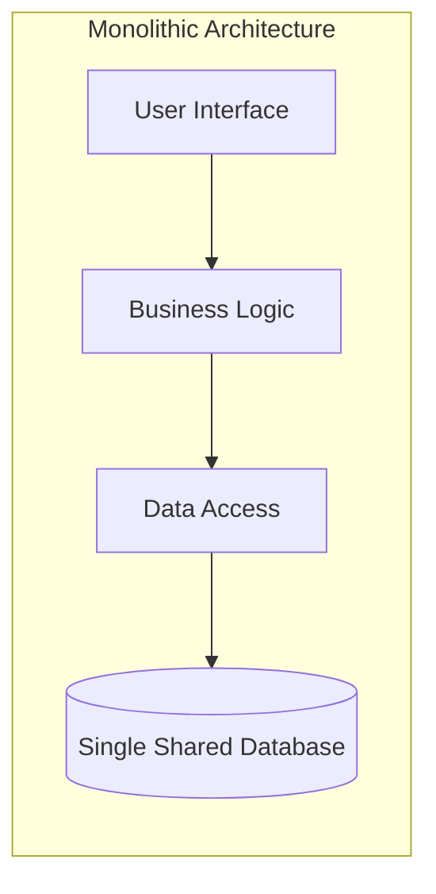
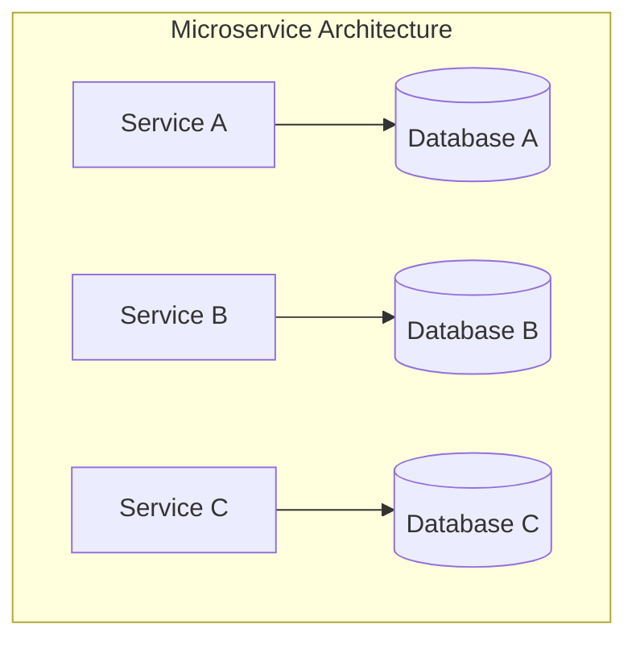
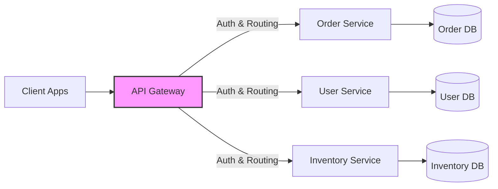
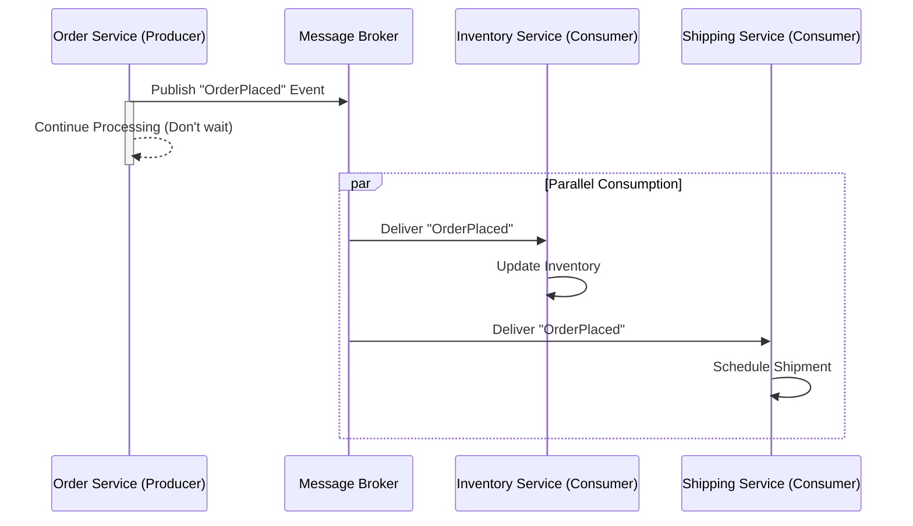
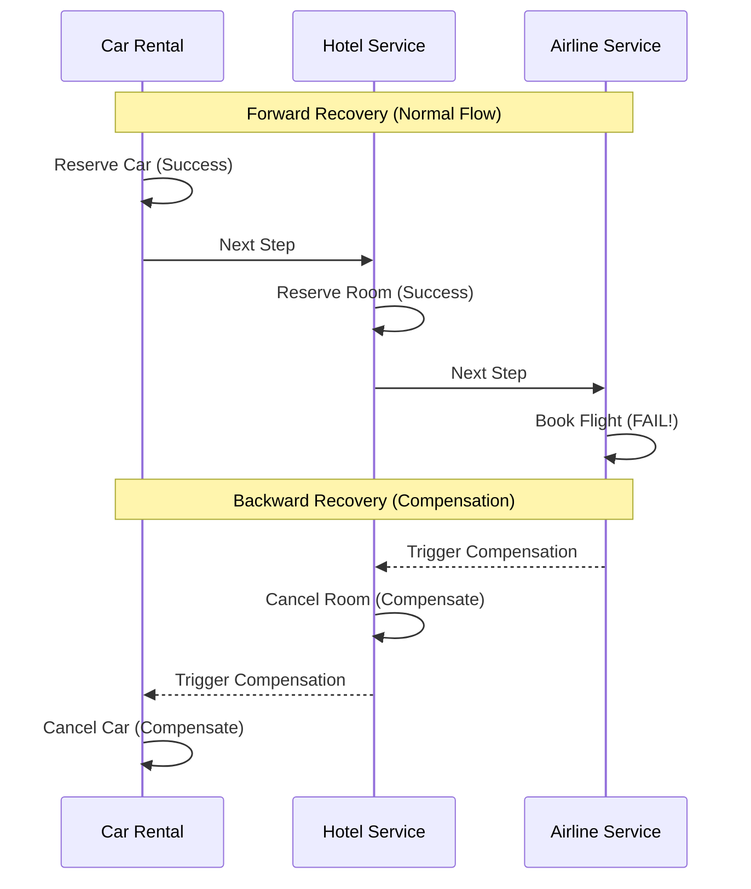
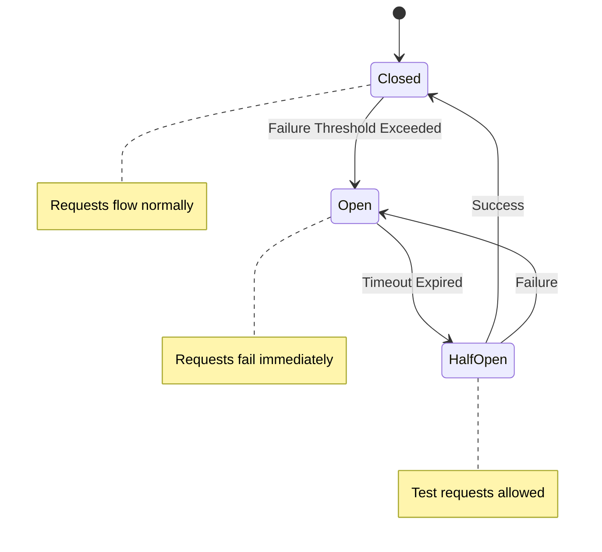

- [1 - Introduction and Architectural Paradigm Shift](#1---introduction-and-architectural-paradigm-shift)
- [2 - Theoretical Foundations and Architectural Evolution](#2---theoretical-foundations-and-architectural-evolution)
	- [2.1 - The Monolithic Predecessor: Utility and Limitations](#21---the-monolithic-predecessor-utility-and-limitations)
	- [2.2 - Service-Oriented Architecture (SOA) vs. Microservices](#22---service-oriented-architecture-soa-vs-microservices)
	- [2.3 - The Core Principle: Shared-Nothing Architecture](#23---the-core-principle-shared-nothing-architecture)
	- [2.4 - Domain-Driven Design (DDD) and Bounded Contexts](#24---domain-driven-design-ddd-and-bounded-contexts)
- [3 - Core Architectural Components](#3---core-architectural-components)
	- [3.1 - API Gateways and the Backend for Frontend (BFF) Pattern](#31---api-gateways-and-the-backend-for-frontend-bff-pattern)
	- [3.2 - Service Discovery](#32---service-discovery)
	- [3.3 - The Service Mesh](#33---the-service-mesh)
	- [3.4 - Containerisation and Orchestration](#34---containerisation-and-orchestration)
- [4 - Communication Protocols and Patterns](#4---communication-protocols-and-patterns)
	- [4.1 - Synchronous Communication](#41---synchronous-communication)
	- [4.2 - Asynchronous Communication](#42---asynchronous-communication)
	- [4.3 - Protocol Performance Comparison](#43---protocol-performance-comparison)
- [5 - Distributed Data Management](#5---distributed-data-management)
	- [5.1 - The CAP Theorem](#51---the-cap-theorem)
	- [5.2 - The Saga Pattern](#52---the-saga-pattern)
	- [5.3 - CQRS (Command Query Responsibility Segregation)](#53---cqrs-command-query-responsibility-segregation)
- [6 - Resiliency and Reliability Patterns](#6---resiliency-and-reliability-patterns)
	- [6.1 - Circuit Breaker Pattern](#61---circuit-breaker-pattern)
	- [6.2 - Bulkhead Pattern](#62---bulkhead-pattern)
	- [6.3 - Retries with Exponential Backoff](#63---retries-with-exponential-backoff)
- [7 - Observability: The Three Pillars](#7---observability-the-three-pillars)
	- [7.1 - Distributed Tracing](#71---distributed-tracing)
	- [7.2 - Metrics and Logs](#72---metrics-and-logs)
- [8 - Development and Deployment Strategies](#8---development-and-deployment-strategies)
	- [8.1 - Deployment Strategies](#81---deployment-strategies)
	- [8.2 - Testing Strategies](#82---testing-strategies)
- [9 - Critical Analysis: The "Microservice Premium" and Reality Check](#9---critical-analysis-the-microservice-premium-and-reality-check)
	- [9.1 - Advantages](#91---advantages)
	- [9.2 - Disadvantages](#92---disadvantages)
	- [9.3 - The "Monolith First" Strategy](#93---the-monolith-first-strategy)
	- [9.4 - The "Return to Monolith" Trend](#94---the-return-to-monolith-trend)
- [10 - Conclusion and Recommendations](#10---conclusion-and-recommendations)
- [References](#references)

# 1 - Introduction and Architectural Paradigm Shift

The contemporary landscape of software engineering has witnessed a profound transformation in how large-scale applications are conceptualised, designed, and deployed. At the forefront of this evolution is the **Microservice Architecture**, a design style that structures an application as a collection of loosely coupled, independently deployable services. This architectural paradigm emerged as a direct response to the limitations inherent in traditional monolithic designs, particularly when applied to complex, cloud-native environments requiring rapid iteration and high scalability.

The transition from monolithic to microservice architecture is not merely a technical reorganisation; it represents a fundamental shift in organisational structure, development processes, and operational philosophy. The core premise involves decomposing a single, unified application into a suite of small services, each running in its own process and communicating with lightweight mechanisms, typically an HTTP resource API or asynchronous messaging. These services are built around business capabilities and are independently deployable by fully automated deployment machinery. Ideally, there is a bare minimum of centralised management of these services, which may be written in different programming languages and use different data storage technologies.

However, this architectural style is not a panacea. It introduces a significant "Microservice Premium" (the cost of complexity involved in managing distributed systems, eventual consistency, and operational overhead). While proponents highlight agility and scalability, detractors and recent industry case studies caution against premature adoption, citing the immense complexity of debugging, monitoring, and managing data consistency across distributed nodes. This report provides an exhaustive technical analysis of the microservice architecture, exploring its theoretical underpinnings, component technologies, operational patterns, and the critical trade-offs that engineering teams must navigate.

-----

# 2 - Theoretical Foundations and Architectural Evolution

To comprehend the strategic value and technical intricacies of microservices, it is essential to contextualise them within the broader history of software architecture, specifically examining the trajectory from Monoliths to Service-Oriented Architecture (SOA), and finally to Microservices.

## 2.1 - The Monolithic Predecessor: Utility and Limitations

A **Monolithic Application** is built as a single unit. In a standard client-server model, the server-side application is a single logical executable that handles HTTP requests, executes domain logic, retrieves and updates data from a database, and populates views to be sent to the browser. All logic for handling a request runs in a single process, allowing the use of basic language features to divide the application into classes, functions, and namespaces.

**Monolithic Architecture**

**Microservice Architecture**

**Advantages of the Monolith**
Contrary to the prevailing narrative that demonises monoliths, this architecture possesses distinct advantages, particularly in the early stages of a product's lifecycle:

  * **Simplicity of Development:** Integrated development environments (IDEs) and build tools are optimised for single applications. Refactoring code, navigating dependencies, and running the application locally are straightforward tasks.
  * **Simplified Testing:** End-to-end testing is easier because the application is a single unit. There is no need to mock external services or manage complex environmental states.
  * **Performance:** In-process calls (function calls within memory) are orders of magnitude faster than remote procedure calls (RPCs) over a network. There is no serialisation or network latency overhead.
  * **Transactional Integrity:** Monoliths typically use a single relational database, allowing for ACID (Atomicity, Consistency, Isolation, Durability) transactions. This guarantees data consistency without the complex patterns required in distributed systems.

**The Scaling Ceiling**
However, as a monolith grows, it encounters a "scaling ceiling." The codebase becomes large and unwieldy, making it difficult for developers to understand the system entirely. A small change in one module may require the entire application to be recompiled and redeployed, slowing down the release cycle. Scaling is typically restricted to the $y$-axis (vertical scaling) or $x$-axis (cloning the entire application behind a load balancer). If one module is memory-intensive and another is CPU-intensive, the entire application must be scaled based on the highest resource requirement, leading to inefficient resource utilisation.

## 2.2 - Service-Oriented Architecture (SOA) vs. Microservices

Microservices are frequently misidentified as a rebranding of Service-Oriented Architecture (SOA), a dominant paradigm in the 2000s. While both advocate for decomposing systems into services, their philosophies diverge significantly regarding scope, coupling, and communication.

**The Enterprise Service Bus (ESB) vs. Dumb Pipes**
SOA implementations typically rely on an Enterprise Service Bus (ESB) to manage communication. The ESB is a "smart pipe" that contains complex logic for message routing, transformation, and business rules orchestration. This centralisation creates a bottleneck and a single point of failure. It encourages "Share-as-much-as-possible", where services are tightly coupled to the ESB's schema and logic.

In contrast, microservices advocate for **"Smart Endpoints and Dumb Pipes"**. The logic resides entirely within the services themselves. The communication infrastructure (the pipe) simply transports messages without understanding the business domain. Common protocols include HTTP/REST and lightweight messaging queues like RabbitMQ or ZeroMQ. This decoupling allows services to evolve independently without coordinating changes with a central integration team.

## 2.3 - The Core Principle: Shared-Nothing Architecture

A foundational theoretical underpinning of microservices is the **Shared-Nothing Architecture (SN)**. In an SN system, each node (service) is independent and self-sufficient, sharing no memory or disk storage with other nodes. This intent is to eliminate contention among nodes, which is the primary limiter of scalability in shared-memory or shared-disk systems.

In microservices, this principle manifests as the **Database-per-Service** pattern. Unlike a monolith where a single database is shared across all modules, microservices mandate that each service manages its own database schema.

  * **Independence:** A team working on the Order Service can change their schema without coordinating with the Customer Service team.
  * **Fault Isolation:** If the database for the Inventory Service becomes corrupted or overloaded, the Order Service remains operational (provided it has a fallback mechanism).
  * **Polyglot Persistence:** Different services can use different data storage technologies. Ideally, a service requiring complex relationships might use a Graph DB, while a catalogue service might use a Document Store.

## 2.4 - Domain-Driven Design (DDD) and Bounded Contexts

The most critical design challenge in microservices is determining the service boundaries. Domain-Driven Design (DDD), popularised by Eric Evans, provides the theoretical framework for this decomposition. The central concept is the **Bounded Context**.

A Bounded Context defines the semantic boundaries within which a particular domain model is valid. In a monolithic system, a User entity might become a "God Object," containing data relevant to billing, shipping, authentication, and preferences. In a microservice architecture, using Bounded Contexts splits this entity:

  * The **Billing Context** might have a Customer model that contains credit card details and billing addresses.
  * The **Shipping Context** might have a Recipient model that contains shipping addresses and delivery preferences.
  * The **Identity Context** might have a User model that contains credentials and roles.

These models are distinct and independent, interacting only through well-defined APIs. This prevents the "anemic domain model" anti-pattern and ensures that services are loosely coupled. The mapping between these contexts is handled via Context Mapping, which defines the integration patterns (e.g., Shared Kernel, Customer/Supplier, Anti-Corruption Layer).

-----

# 3 - Core Architectural Components

Implementing microservices requires a robust suite of infrastructure components to handle the inherent complexity of distributed systems. These components form the "plumbing" that replaces the function calls of a monolith.

## 3.1 - API Gateways and the Backend for Frontend (BFF) Pattern

In a distributed system, exposing dozens of internal microservices directly to a client (web or mobile) creates tight coupling and significant security risks. The client would need to make multiple round-trip requests to fetch data to render a single page, leading to high latency.

An **API Gateway** acts as a single entry point for all clients. It sits between the client and the internal microservices, handling cross-cutting concerns:

  * **Request Routing:** Directing `/api/orders` to the Order Service and `/api/users` to the User Service.
  * **Protocol Translation:** Converting external HTTP/REST requests to internal gRPC or AMQP messages.
  * **Security:** Handling Authentication (validating JWTs), SSL Termination, and Authorisation.
  * **Rate Limiting:** Protecting services from denial-of-service attacks by throttling requests.

<!-- end list -->

A refinement of this pattern is the **Backend for Frontend (BFF)**. Instead of a single general-purpose gateway, a separate API Gateway is created for each specific client type (e.g., one BFF for the iOS app, one for the Android app, one for the Web Desktop). This allows the API to be tailored to the specific needs of the client interface, optimising payload sizes and reducing chattiness. For instance, a mobile BFF might aggregate data from three services into a single response to save battery and bandwidth, while the web BFF might expose more granular endpoints.

## 3.2 - Service Discovery

In a dynamic cloud environment, service instances are ephemeral. They are created and destroyed by auto-scalers based on load, meaning their IP addresses are constantly changing. Hardcoding IP addresses is impossible. **Service Discovery** is the mechanism by which services locate each other.

**Client-Side Discovery**
The client is responsible for determining the network locations of available service instances. The client queries a Service Registry (e.g., Netflix Eureka, HashiCorp Consul) to get a list of available instances for a service and then uses a load-balancing algorithm (like Round-Robin) to select one.

  * **Pros:** The client can make intelligent load-balancing decisions.
  * **Cons:** Couples the client to the Service Registry; requires discovery logic in every client language/framework.

**Server-Side Discovery**
The client makes a request to a central Load Balancer (e.g., AWS ELB, NGINX). The Load Balancer queries the Service Registry and routes the request to an available instance.

  * **Pros:** Simple for the client; discovery logic is centralised.
  * **Cons:** The Load Balancer is a new piece of infrastructure to manage and a potential bottleneck.

## 3.3 - The Service Mesh

As the number of services grows, managing inter-service communication (mTLS, retries, observability) in the application code becomes burdensome. A **Service Mesh** (e.g., Istio, Linkerd) is a dedicated infrastructure layer that handles this communication.

The Service Mesh typically uses a **Sidecar Pattern**, where a lightweight proxy (like Envoy) is deployed alongside each service instance in the same Pod. The application code talks to the local sidecar, which then manages the network communication to the destination sidecar.

  * **Traffic Management:** Canary deployments, traffic splitting, and circuit breaking are handled by the mesh configuration, not code.
  * **Security:** The mesh automatically upgrades connections to mutual TLS (mTLS), ensuring zero-trust security between services.
  * **Observability:** The sidecar captures metrics (latency, error rates) and distributed traces without code instrumentation.

**Comparison of Mesh Options:**

  * **Istio:** The most feature-rich and widely used mesh. It offers complex traffic management and robust security policies but is notorious for its complexity and high resource consumption (CPU/Memory overhead for sidecars).
  * **Linkerd:** A lighter, simpler alternative built in Rust. It focuses on simplicity and performance, consuming significantly fewer resources than Istio, though with fewer advanced features.

## 3.4 - Containerisation and Orchestration

Microservices are inherently linked with containerisation technologies like Docker. Containers package a service and its dependencies (libraries, runtime) into a single lightweight unit, ensuring consistency across development, testing, and production environments. Unlike Virtual Machines (VMs) which duplicate the Operating System, containers share the host kernel, making them much more efficient.

**Kubernetes (K8s)** has emerged as the de facto standard for orchestrating these containers. It automates deployment, scaling, and management of containerised applications.

  * **Pods:** The smallest deployable unit in K8s, usually containing a single service container (and potentially a sidecar).
  * **Deployments:** Define the desired state (e.g., "Run 3 replicas of the Order Service"). K8s ensures this state is maintained, restarting failed containers automatically (Self-Healing).
  * **Services:** Provide stable networking and load balancing for a set of Pods.

-----

# 4 - Communication Protocols and Patterns

The mechanism by which services exchange data determines the performance, coupling, and reliability of the system.

## 4.1 - Synchronous Communication

In synchronous communication, the client sends a request and waits for a response. This creates a temporal coupling between services.

  * **REST (Representational State Transfer):** The most common protocol, typically using JSON over HTTP/1.1. It is easy to implement, human-readable, and widely supported. However, it can be verbose and less performant due to the text-based nature of JSON and the connection overhead of HTTP/1.1 (though keep-alive helps).
  * **gRPC:** Developed by Google, this uses Protocol Buffers (binary serialisation) and runs over HTTP/2. It supports multiplexing (multiple requests over a single connection) and bi-directional streaming. gRPC is significantly faster and more efficient than REST, making it ideal for internal service-to-service communication. It enforces strong typing via `.proto` contracts, which reduces integration errors but increases coupling compared to loose JSON schemas.
  * **GraphQL:** Allows clients to request exactly the data they need, preventing over-fetching. While powerful for public APIs or BFFs, it adds complexity to the backend (resolvers) and can shift performance bottlenecks to the database (the $N+1$ query problem) if not managed correctly.

## 4.2 - Asynchronous Communication

To decouple services, asynchronous messaging is often preferred. The producer sends a message and continues processing, not waiting for a response.

  * **Message Brokers (RabbitMQ, ActiveMQ):** Used for standard queuing scenarios where messages are processed and then deleted. They support complex routing patterns.
  * **Event Streaming (Apache Kafka):** Used for high-throughput event logs. Messages are stored for a retention period and can be replayed. This enables patterns like Event Sourcing.

In this model, a service publishes an event (e.g., `OrderPlaced`) without knowing who will consume it. Other services (Inventory, Shipping) subscribe to this event. This "Smart Endpoints, Dumb Pipes" approach ensures that the failure of a consumer does not block the producer.

## 4.3 - Protocol Performance Comparison

The following table summarises the key differences between the primary communication protocols used in microservices:

| Feature              | REST                            | gRPC                        | GraphQL                          |
| :------------------- | :------------------------------ | :-------------------------- | :------------------------------- |
| **Transport**        | HTTP/1.1 (mostly)               | HTTP/2                      | HTTP/1.1 or HTTP/2               |
| **Data Format**      | JSON (Text)                     | Protobuf (Binary)           | JSON                             |
| **Coupling**         | Low (Flexible Schema)           | High (Shared Contract)      | Moderate (Schema-based)          |
| **Performance**      | Moderate                        | High (Low Latency, Binary)  | Variable (Query dependent)       |
| **Primary Use Case** | Public APIs, Simple Integration | Internal Microservices, IoT | Frontend-to-Backend, Aggregation |

-----

# 5 - Distributed Data Management

Data management is arguably the most challenging aspect of microservices due to the distributed nature of the system. In a monolith, ACID transactions ensure data integrity. In microservices, data is split across multiple databases, making global ACID transactions impossible without severe performance penalties.

## 5.1 - The CAP Theorem

The **CAP Theorem** (Consistency, Availability, Partition Tolerance), proposed by Eric Brewer, states that a distributed system can only provide two of the three simultaneously.

  * **Consistency (C):** Every read receives the most recent write or an error.
  * **Availability (A):** Every request receives a (non-error) response, without the guarantee that it contains the most recent write.
  * **Partition Tolerance (P):** The system continues to operate despite an arbitrary number of messages being dropped or delayed by the network between nodes.

Since network partitions (P) are inevitable in a distributed system, architects must choose between Consistency (CP) and Availability (AP).

  * **CP Systems:** (e.g., MongoDB, HBase) Refuse requests if they cannot guarantee consistency during a partition.
  * **AP Systems:** (e.g., Cassandra, DynamoDB) Return the most recent version of the data they have, even if it might be stale (Eventual Consistency).

Microservices generally favour Availability (AP), relying on Eventual Consistency to ensure the system remains responsive even when parts of it are unreachable.

## 5.2 - The Saga Pattern

Because distributed transactions (2PC) are blocking and not scalable, the **Saga Pattern** is used to manage long-running business processes that span multiple services. A Saga is a sequence of local transactions. Each local transaction updates the database and publishes an event to trigger the next local transaction.

If a local transaction fails, the Saga executes **Compensating Transactions** to undo the changes made by the preceding steps. For example, in a travel booking saga:

1.  **Car Rental Service:** Reserve Car (Success).
2.  **Hotel Service:** Reserve Room (Success).
3.  **Airline Service:** Book Flight (Fail - No seats).

Compensation Triggered:

1.  **Hotel Service:** Cancel Room.
2.  **Car Rental Service:** Cancel Car.

<!-- end list -->

**Implementation Approaches:**

  * **Choreography:** Services exchange events without a central controller. Service A emits an event, Service B listens and acts. Good for simple workflows but can become hard to track ("Spaghetti interactions").
  * **Orchestration:** A central Orchestrator Service (e.g., using AWS Step Functions or a dedicated Saga Orchestrator) tells participants what to do. Better for complex workflows with many steps, providing a clear view of the process state.

## 5.3 - CQRS (Command Query Responsibility Segregation)

In complex domains, the model used to update data (Command) may differ significantly from the model used to read data (Query). CQRS separates these operations into distinct models.

  * **Command Side:** Handles Create, Update, Delete. It validates business logic and modifies the state. It is optimiSed for write throughput.
  * **Query Side:** Handles Read. It uses a separate data store (Read Model), often a denormalised view optimised for fast retrieval (e.g., an Elasticsearch index or a specialised Redis cache).

CQRS is often paired with **Event Sourcing**, where the state of the system is stored not as the current value, but as a sequence of events (e.g., `AccountCreated`, `MoneyDeposited`, `MoneyWithdrawn`). The current state is derived by replaying these events.

-----

# 6 - Resiliency and Reliability Patterns

Distributed systems introduce more points of failure. The network is unreliable, latency is unpredictable, and services will fail. Resilience engineering is about designing systems that can withstand these failures without crashing entirely.

## 6.1 - Circuit Breaker Pattern

When a service calls a remote service that is failing or slow, the caller may exhaust its resources (e.g., threads, connections) waiting for a response. This can lead to **Cascading Failures**, where one failing service brings down the entire system.

The Circuit Breaker pattern wraps a protected function call in a monitor object.

  * **Closed State:** Requests flow normally. The circuit counts failures.
  * **Open State:** If the failure rate exceeds a threshold (e.g., 50% errors), the circuit "trips" (opens). Further calls fail immediately without attempting to reach the remote service. This gives the failing service time to recover and prevents resource exhaustion.
  * **Half-Open State:** After a timeout, the circuit allows a limited number of test requests to pass. If they succeed, the circuit resets to Closed. If they fail, it returns to Open.

<!-- end list -->

## 6.2 - Bulkhead Pattern

Inspired by ship design, the **Bulkhead Pattern** isolates elements of an application into pools so that if one fails, the others continue to function. For example, using separate thread pools for different downstream services ensures that a slow response from the Inventory Service does not consume all threads, leaving the User Service responsive.

## 6.3 - Retries with Exponential Backoff

Transient failures (like a momentary network blip) can often be resolved by simply retrying the request. However, immediate retries can overwhelm a struggling service ("Retry Storm"). **Exponential Backoff** increases the wait time between retries (e.g., 1s, 2s, 4s, 8s) to reduce load. Jitter (randomising the wait time) is added to prevent all clients from retrying simultaneously.

-----

# 7 - Observability: The Three Pillars

Debugging a request that spans ten different services is exponentially harder than debugging a monolithic stack trace. Observability is the property of a system that allows you to understand its internal state based on its external outputs (logs, metrics, and traces).

## 7.1 - Distributed Tracing

**Distributed Tracing** is the most critical tool for microservices. It tracks a single request as it flows through the distributed system.

  * **Trace ID:** A unique identifier assigned to the request at the entry point (API Gateway).
  * **Span:** A unit of work (e.g., a database query, an HTTP call).
  * **Context Propagation:** The Trace ID is passed in HTTP headers (e.g., `traceparent`) to all downstream services.

Tools like Jaeger or Zipkin visualise the trace as a timeline (Gantt chart), highlighting exactly which service caused a delay or error. This allows engineers to pinpoint bottlenecks in seconds rather than days.

## 7.2 - Metrics and Logs

  * **Metrics (The "What"):** Aggregated numerical data tracked over time (e.g., Requests Per Second, P99 Latency, Error Rate). Stored in time-series databases like Prometheus. They are used for alerting and trend analysis.
  * **Logs (The "Why"):** Detailed textual records of discrete events. In microservices, logs from all containers must be aggregated into a central system (e.g., ELK Stack - Elasticsearch, Logstash, Kibana) to be searchable. Structured Logging (JSON format) and Correlation IDs (Trace IDs) are essential to link logs from different services to the same user request.

-----

# 8 - Development and Deployment Strategies

Microservices enable independent deployment, allowing for zero-downtime release strategies and faster innovation cycles.

## 8.1 - Deployment Strategies

  * **Blue/Green Deployment:** Two identical production environments (Blue and Green) are maintained. The "Blue" version is currently live. The new "Green" version is deployed and tested in the idle environment. Once verified, the load balancer switches all traffic from Blue to Green instantly. This allows for immediate rollback if issues arise, but requires double the infrastructure resources.
  * **Canary Release:** The new version is deployed to a small subset of instances (the "Canary"). A small percentage of traffic (e.g., 5%) is routed to the new version. The system is monitored for errors (higher error rates, latency spikes). If stable, the traffic percentage is gradually increased to 100%. This limits the "blast radius" of a faulty release to a small fraction of users.

## 8.2 - Testing Strategies

Testing microservices requires a shift from reliance on End-to-End (E2E) tests to more isolated testing methods.

  * **Unit Tests:** Test internal logic of a service.
  * **Component Tests:** Test a service in isolation with its dependencies (DB, other services) mocked.
  * **Consumer-Driven Contract Testing:** E2E tests in microservices are notoriously slow, brittle, and expensive to maintain. Contract Testing (e.g., using Pact) solves this by verifying that the provider service adheres to the API contract expected by the consumer service. This allows services to be tested in isolation while ensuring they remain compatible, replacing the need for large-scale integration environments.

-----

# 9 - Critical Analysis: The "Microservice Premium" and Reality Check

While microservices offer distinct advantages in scalability and velocity, they are not a universal solution. The industry has recently seen a recalibration of enthusiasm, with significant pushback against "Microservice Envy" and a renewed appreciation for modular monoliths.

## 9.1 - Advantages

  * **Independent Deployability:** A team can deploy a fix to the Shipping Service without coordinating with the Billing team or redeploying the whole system.
  * **Technological Freedom:** Services can be written in the language best suited for the task (e.g., Python for AI, Go for high concurrency, Node.js for I/O).
  * **Fault Isolation:** A memory leak in the Image Processing Service crashes only that container, not the entire application.
  * **Organisational Scalability:** Microservices align with Conway’s Law, allowing organisations to scale by assigning small, autonomous teams to own entire business capabilities.

## 9.2 - Disadvantages

  * **Operational Complexity:** The "Microservice Premium" includes the cost of managing containers, orchestrators, service meshes, and distributed logs.
  * **Network Latency:** Replacing in-process function calls with network calls introduces latency and serialisation overhead.
  * **Data Consistency:** Maintaining consistency across distributed databases is difficult. ACID transactions are replaced by complex eventual consistency patterns.
  * **Debugging Difficulty:** Tracing a bug that hops across five services requires advanced observability tools and skills.

## 9.3 - The "Monolith First" Strategy

Martin Fowler and other experts strongly advocate for a "Monolith First" strategy. Most successful microservice architectures (e.g., Netflix, Amazon) started as monoliths that grew too big and were split. Starting with microservices (Greenfield) is often disastrous because the domain boundaries are not yet clearly understood. Refactoring boundaries across independent services is much harder and more expensive than refactoring code modules within a monolith.

## 9.4 - The "Return to Monolith" Trend

Recently, several high-profile engineering teams have reverted to monolithic architectures (or "Macroservices") after facing the scaling limits of microservices.

  * **Amazon Prime Video:** In a widely discussed case study, Amazon Prime Video replaced a distributed microservices/serverless architecture with a monolithic service for their audio/video monitoring tool. The distributed approach hit scaling bottlenecks due to orchestration overhead and data transfer costs. Moving to a monolith reduced infrastructure costs by 90% and simplified operations.
  * **Segment:** Reverted to a monolith to solve performance issues caused by "head-of-line blocking" in their message queues, which was exacerbated by their complex microservice topology.
  * **Uber:** Adopted a "Domain-Oriented Microservice Architecture" (DOMA), effectively grouping microservices into larger "Macroservices" or domains to reduce the complexity of managing thousands of tiny services.

These cases highlight that for high-throughput, data-intensive workloads, the network overhead of microservices can become a prohibitive bottleneck.

-----

# 10 - Conclusion and Recommendations

The Microservice Architecture is a powerful architectural style designed to solve specific problems related to organisational scaling, independent deployment, and fault tolerance. It is not, however, a default choice for every application. It introduces significant complexity that can paralyze a small team or a startup.

For a team evaluating this architecture, the following recommendations are derived from the analysis:

  * **Start with a Modular Monolith:** For new projects, build a well-structured monolith first. Use Bounded Contexts to keep modules distinct within the same codebase. This allows you to understand the domain boundaries before paying the distributed system tax.
  * **Assess Organisational Maturity:** Do not adopt microservices unless the organisation has maturity in CI/CD automation, infrastructure-as-code, and observability. Without these, microservices are unmanageable.
  * **Prioritise Observability:** If you do adopt microservices, implement distributed tracing (OpenTelemetry) and centralised logging from day one. You cannot debug what you cannot see.
  * **Embrace Eventual Consistency:** Do not try to force ACID transactions across services. Learn to design for eventual consistency using Sagas and asynchronous messaging.
  * **Evaluate the Trade-offs:** Be skeptical of hype. Recognise that microservices solve people and scale problems, but often create technical problems. As demonstrated by Amazon Prime Video, a monolith can be the more performant and cost-effective solution for specific workloads.

In summary, microservices are a tool, not a goal. Success lies not in blindly adopting the pattern, but in understanding the trade-offs and applying the architecture only where the benefits of decoupling outweigh the costs of complexity.

---

# References

1. Alshuqayran, N., Ali, N., & Evans, R. (2016). *A Systematic Mapping Study in Microservice Architecture*. 2016 IEEE 9th International Conference on Service-Oriented Computing and Applications (SOCA). [Link](https://bura.brunel.ac.uk/handle/2438/14968) ([Brighton Research][1])

2. Di Francesco, P., Lago, P., & Malavolta, I. (2019). *Architecting with Microservices: A Systematic Mapping Study*. Journal of Systems and Software, 150, 77–97. [https://doi.org/10.1016/j.jss.2019.01.001](https://doi.org/10.1016/j.jss.2019.01.001) ([ScienceDirect][2])

3. Waseem, M., Liang, P., & Shahin, M. (2020). *A Systematic Mapping Study on Microservices Architecture in DevOps*. Journal of Systems and Software, 170, 110798. [https://doi.org/10.1016/j.jss.2020.110798](https://doi.org/10.1016/j.jss.2020.110798) ([ScienceDirect][3])

4. Taibi, D., Lenarduzzi, V., & Pahl, C. (2018). *Architectural Patterns for Microservices: A Systematic Mapping Study*. Proceedings of the 8th International Conference on Cloud Computing and Services Science (CLOSER), 221–232. [https://doi.org/10.5220/0006798302210232](https://doi.org/10.5220/0006798302210232) ([ResearchGate][4])

5. Garriga, M. (2018). *Towards a Taxonomy of Microservices Architectures*. In A. Cerone & M. Roveri (Eds.), Software Engineering and Formal Methods (SEFM 2017), LNCS 10729, 203–218. Springer. [https://doi.org/10.1007/978-3-319-74781-1_15](https://doi.org/10.1007/978-3-319-74781-1_15) ([SpringerLink][5])

6. Larrucea, X., Santamaria, I., Colomo-Palacios, R., & Ebert, C. (2018). *Microservices*. IEEE Software, 35(3), 96–100. [https://doi.org/10.1109/MS.2018.2141030](https://doi.org/10.1109/MS.2018.2141030) ([scienceportal.tecnalia.com][6])

7. Auer, F., Lenarduzzi, V., Felderer, M., & Taibi, D. (2021). *From Monolithic Systems to Microservices: An Assessment Framework*. Information and Software Technology, 137, 106600. [https://doi.org/10.1016/j.infsof.2021.106600](https://doi.org/10.1016/j.infsof.2021.106600) ([ScienceDirect][7])

8. Tapia, F., Mora, M., Orozco, A. L. S., & Rodríguez, A. (2020). *From Monolithic Systems to Microservices: A Comparative Study of Performance*. Applied Sciences, 10(17), 5797. [https://doi.org/10.3390/app10175797](https://doi.org/10.3390/app10175797) ([MDPI][8])

9. Amaral, M. et al. (2015). *Performance Evaluation of Microservices Architectures Using Containers*. 2015 IEEE 14th International Symposium on Network Computing and Applications (NCA), 27–34. [https://doi.org/10.1109/NCA.2015.24](https://doi.org/10.1109/NCA.2015.24) ([arXiv][9])

10. Di Francesco, P., Malavolta, I., & Lago, P. (2018). *Migrating Towards Microservice Architectures: An Industrial Survey*. 2018 IEEE International Conference on Software Architecture (ICSA), 29–290. [https://doi.org/10.1109/ICSA.2018.00012](https://doi.org/10.1109/ICSA.2018.00012) ([ResearchGate][10])

11. Gilbert, S., & Lynch, N. (2002). *Brewer’s Conjecture and the Feasibility of Consistent, Available, Partition-Tolerant Web Services*. ACM SIGACT News, 33(2), 51–59. [https://doi.org/10.1145/564585.564601](https://doi.org/10.1145/564585.564601) ([ACM Digital Library][11])

12. Garcia-Molina, H., & Salem, K. (1987). *Sagas*. Proceedings of the ACM SIGMOD International Conference on Management of Data, 249–259. [https://doi.org/10.1145/38713.38742](https://doi.org/10.1145/38713.38742) ([ACM Digital Library][12])

13. Štefanko, M. (2019). *The Saga Pattern in a Reactive Microservices Environment*. Proceedings of the 14th International Conference on Software Technologies (ICSOFT). [PDF link](https://www.scitepress.org/Papers/2019/79187/79187.pdf) ([SciTePress][13])

14. Overeem, M., Spoor, M., Jansen, S., & Brinkkemper, S. (2021). *An Empirical Characterization of Event Sourced Systems and Their Schema Evolution — Lessons from Industry*. Journal of Systems and Software, 176, 110941. [https://doi.org/10.1016/j.jss.2021.110941](https://doi.org/10.1016/j.jss.2021.110941) ([ScienceDirect][14])

15. Sangabriel-Alarcón, J., Ocharán-Hernández, J. O., Limón, X., & Cortés-Verdín, M. K. (2024). *Domain-Driven Design in Microservices-Based Systems Development: A Systematic Literature Review and Thematic Analysis*. Programming and Computer Software, 50(8), 742–770. [https://doi.org/10.1134/S0361768824700749](https://doi.org/10.1134/S0361768824700749) ([SpringerLink][15])

16. Mendonça, N. C., Aderaldo, C. M., Cámara, J., & Garlan, D. (2020). *Model-Based Analysis of Microservice Resiliency Patterns*. 2020 IEEE International Conference on Software Architecture (ICSA), 217–227. [https://doi.org/10.1109/ICSA47634.2020.00019](https://doi.org/10.1109/ICSA47634.2020.00019) ([ResearchGate][16])

17. Miraj, M., Zakir, M., & others. (2022). *Model-Based Resilience Pattern Analysis for Microservice Architecture*. Journal of Theoretical and Applied Information Technology, 100(9), 2792–2807. [PDF link](https://www.jatit.org/volumes/Vol100No9/30Vol100No9.pdf) ([jatit.org][17])

18. Li, B., Peng, X., Xiang, Q., Wang, H., Xie, T., Sun, J., & Liu, X. (2022). *Enjoy Your Observability: An Industrial Survey of Microservice Tracing and Analysis*. Empirical Software Engineering, 27(1), 25. [https://doi.org/10.1007/s10664-021-10063-9](https://doi.org/10.1007/s10664-021-10063-9) ([SpringerLink][18])

19. Thrivikraman, V., Dixit, V. R., Ram, N. S., Gowda, V. K., Vasudevan, S. K., & Kalambur, S. (2022). *MiSeRTrace: Kernel-Level Request Tracing for Microservice Visibility*. Companion of the 2022 ACM/SPEC International Conference on Performance Engineering (ICPE ’22), 77–80. [https://doi.org/10.1145/3491204.3527462](https://doi.org/10.1145/3491204.3527462) ([arXiv][19])

20. Sedghpour, M. R. S., Klein, C., & Tordsson, J. (2022). *An Empirical Study of Service Mesh Traffic Management Policies for Microservices*. Proceedings of the 2022 ACM/SPEC International Conference on Performance Engineering (ICPE ’22), 17–27. [https://doi.org/10.1145/3489525.3511686](https://doi.org/10.1145/3489525.3511686) ([ACM Digital Library][20])

21. Elkhatib, Y., & Povedano Poyato, J. (2023). *An Evaluation of Service Mesh Frameworks for Edge Systems*. Proceedings of the 6th International Workshop on Edge Systems, Analytics and Networking (EdgeSys ’23). [https://doi.org/10.1145/3578354.3592867](https://doi.org/10.1145/3578354.3592867) ([ACM Digital Library][21])

22. Waseem, M., Albattah, A., Hasan, M. K., & others. (2021). *Design, Monitoring, and Testing of Microservices Systems: The Practitioners’ Perspective*. Journal of Systems and Software, 182, 111061. [https://doi.org/10.1016/j.jss.2021.111061](https://doi.org/10.1016/j.jss.2021.111061) ([journals-sol.sbc.org.br][22])

23. Saman, B. (2017). *Monitoring and Analysis of Microservices Performance*. Journal of Computer Science and Control Systems, 10(1), 19–24. (Open access via various repositories.) ([ResearchGate][23])

[1]: https://research.brighton.ac.uk/en/publications/a-systematic-mapping-study-in-microservice-architecture/?utm_source=chatgpt.com "A Systematic Mapping Study in Microservice Architecture"
[2]: https://www.sciencedirect.com/science/article/pii/S0164121219300019?utm_source=chatgpt.com "Architecting with microservices: A systematic mapping study"
[3]: https://www.sciencedirect.com/science/article/abs/pii/S0164121220302053?utm_source=chatgpt.com "A Systematic Mapping Study on Microservices Architecture ..."
[4]: https://www.researchgate.net/publication/323960272_Architectural_Patterns_for_Microservices_A_Systematic_Mapping_Study?utm_source=chatgpt.com "Architectural Patterns for Microservices: A Systematic ..."
[5]: https://link.springer.com/chapter/10.1007/978-3-319-74781-1_15?utm_source=chatgpt.com "Towards a Taxonomy of Microservices Architectures"
[6]: https://scienceportal.tecnalia.com/en/publications/microservices/?utm_source=chatgpt.com "Microservices - PURE – TECNALIA CRIS"
[7]: https://www.sciencedirect.com/science/article/pii/S0950584921000793?utm_source=chatgpt.com "From monolithic systems to Microservices: An assessment ..."
[8]: https://www.mdpi.com/2076-3417/10/17/5797?utm_source=chatgpt.com "From Monolithic Systems to Microservices: A Comparative ..."
[9]: https://arxiv.org/pdf/1511.02043?utm_source=chatgpt.com "Performance Evaluation of Microservices Architectures ..."
[10]: https://www.researchgate.net/publication/326566575_Migrating_Towards_Microservice_Architectures_An_Industrial_Survey?utm_source=chatgpt.com "Migrating Towards Microservice Architectures: An Industrial ..."
[11]: https://dl.acm.org/doi/10.1145/564585.564601?utm_source=chatgpt.com "Brewer's conjecture and the feasibility of consistent, ..."
[12]: https://dl.acm.org/doi/10.1145/38713.38742?utm_source=chatgpt.com "Sagas | Proceedings of the 1987 ACM SIGMOD ..."
[13]: https://www.scitepress.org/Papers/2019/79187/79187.pdf?utm_source=chatgpt.com "The Saga Pattern in a Reactive Microservices Environment"
[14]: https://www.sciencedirect.com/science/article/pii/S0164121221000674?utm_source=chatgpt.com "An empirical characterization of event sourced systems ..."
[15]: https://link.springer.com/article/10.1134/S0361768824700749?utm_source=chatgpt.com "Domain-Driven Design in Microservices-Based Systems ..."
[16]: https://www.researchgate.net/publication/339488033_Model-Based_Analysis_of_Microservice_Resiliency_Patterns?utm_source=chatgpt.com "Model-Based Analysis of Microservice Resiliency Patterns"
[17]: https://www.jatit.org/volumes/Vol100No9/30Vol100No9.pdf?utm_source=chatgpt.com "MODEL-BASED RESILIENCE PATTERN ANALYSIS FOR ..."
[18]: https://link.springer.com/article/10.1007/s10664-021-10063-9?utm_source=chatgpt.com "an industrial survey of microservice tracing and analysis"
[19]: https://arxiv.org/abs/2203.14076?utm_source=chatgpt.com "MiSeRTrace: Kernel-level Request Tracing for Microservice Visibility"
[20]: https://dl.acm.org/doi/10.1145/3489525.3511686?utm_source=chatgpt.com "An Empirical Study of Service Mesh Traffic Management ..."
[21]: https://dl.acm.org/doi/10.1145/3578354.3592867?utm_source=chatgpt.com "An Evaluation of Service Mesh Frameworks for Edge ..."
[22]: https://journals-sol.sbc.org.br/index.php/jisa/article/view/4000?utm_source=chatgpt.com "Dependable Microservices in the Kubernetes era - Journals"
[23]: https://www.researchgate.net/publication/317690568_Monitoring_and_Analysis_of_Microservices_Performance?utm_source=chatgpt.com "(PDF) Monitoring and Analysis of Microservices Performance"
