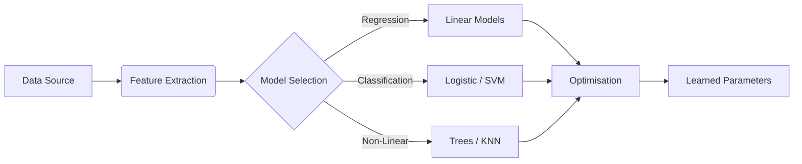
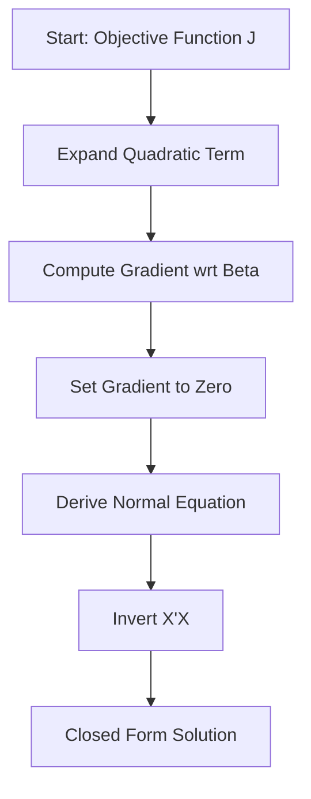
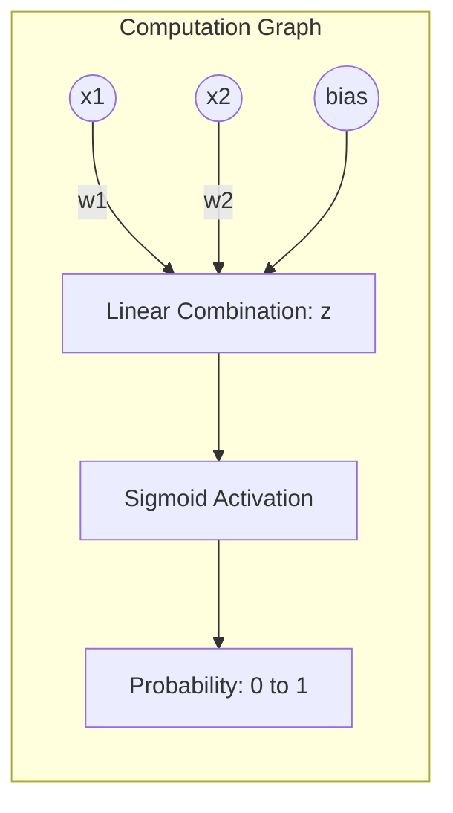
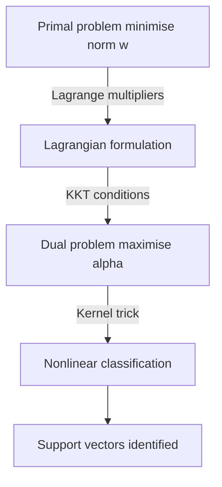
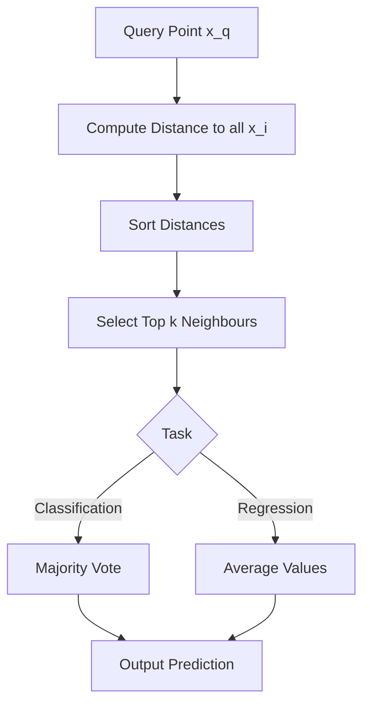
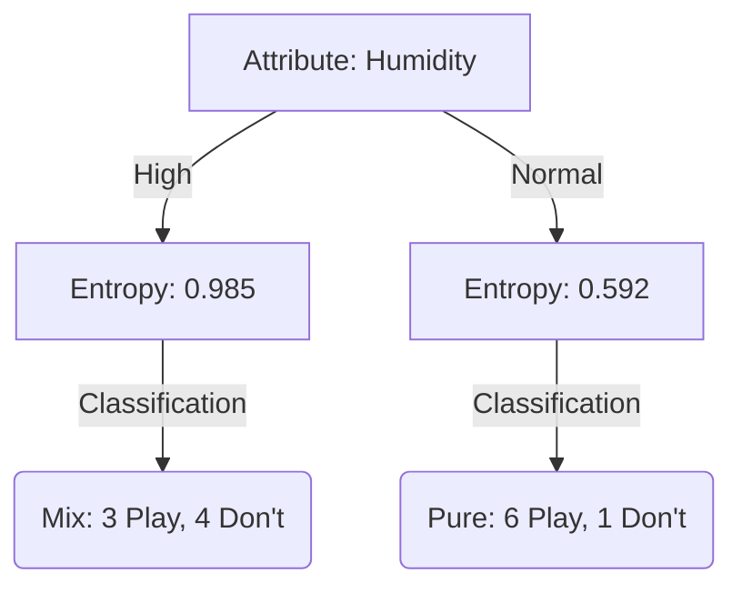
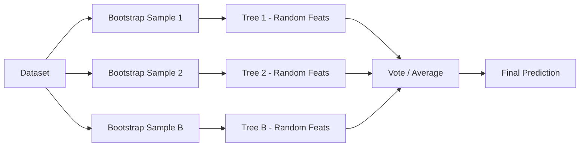

- [1 - Introduction](#1---introduction)
- [2 - Mathematical Preliminaries and Notation](#2---mathematical-preliminaries-and-notation)
	- [2.1 - Geometric Fundamentals](#21---geometric-fundamentals)
	- [2.2 - Optimisation Theory](#22---optimisation-theory)
	- [2.3 - Statistical Learning Theory](#23---statistical-learning-theory)
- [3 - Linear Regression: The Analytic Baseline](#3---linear-regression-the-analytic-baseline)
	- [3.1 - The Model and Ordinary Least Squares (OLS)](#31---the-model-and-ordinary-least-squares-ols)
	- [3.2 - Mathematical Derivation of the OLS Estimator](#32---mathematical-derivation-of-the-ols-estimator)
	- [3.3 - Example Calculation](#33---example-calculation)
- [4 - Logistic Regression: Probabilistic Classification](#4---logistic-regression-probabilistic-classification)
	- [4.1 - The Sigmoid and Log-Odds](#41---the-sigmoid-and-log-odds)
	- [4.2 - Maximum Likelihood Estimation (MLE)](#42---maximum-likelihood-estimation-mle)
	- [4.3 - Gradient Ascent Derivation](#43---gradient-ascent-derivation)
	- [4.4 - Example: Single Step of Gradient Ascent](#44---example-single-step-of-gradient-ascent)
- [5 - Support Vector Machines (SVM): Geometric Optimisation](#5---support-vector-machines-svm-geometric-optimisation)
	- [5.1 - The Primal Optimisation Problem](#51---the-primal-optimisation-problem)
	- [5.2 - Derivation of the Dual Formulation](#52---derivation-of-the-dual-formulation)
	- [5.3 - The Kernel Trick and KKT Conditions](#53---the-kernel-trick-and-kkt-conditions)
	- [5.4 - Manual Hard Margin Calculation (3 Points)](#54---manual-hard-margin-calculation-3-points)
	- [5.5 - Soft Margin and Subgradient Descent](#55---soft-margin-and-subgradient-descent)
- [6 - Non-Parametric Methods: K-Nearest Neighbours (KNN)](#6---non-parametric-methods-k-nearest-neighbours-knn)
	- [6.1 - Algorithm and Distance Metrics](#61---algorithm-and-distance-metrics)
	- [6.2 - Theoretical Convergence: Cover and Hart](#62---theoretical-convergence-cover-and-hart)
	- [6.3 - The Curse of Dimensionality: A Mathematical View](#63---the-curse-of-dimensionality-a-mathematical-view)
- [7 - Decision Trees and Random Forests](#7---decision-trees-and-random-forests)
	- [7.1 - Decision Trees: Information Theory and Splitting](#71---decision-trees-information-theory-and-splitting)
	- [7.2 - Manual Calculation: Entropy Split](#72---manual-calculation-entropy-split)
	- [7.3 - Random Forest: Variance Reduction Derivation](#73---random-forest-variance-reduction-derivation)
- [8 - Computational Complexity Comparison](#8---computational-complexity-comparison)
- [9 - Conclusion](#9---conclusion)

# 1 - Introduction

The discipline of machine learning (ML) is fundamentally rooted in the approximation of unknown functions from finite data. It operates at the intersection of statistical learning theory, mathematical optimisation, and computational geometry. Moving beyond the abstraction of high-level libraries requires a rigorous understanding of the underlying mathematical machinery that governs how these algorithms learn, generalise, and ultimately fail.

This report provides an exhaustive analysis of core supervised learning algorithms: Linear and Logistic Regression, Support Vector Machines (SVM), K-Nearest Neighbours (KNN), Decision Trees, and Random Forests. Unlike introductory texts, this analysis assumes a strong command of linear algebra, calculus, and probability theory. We will deconstruct these algorithms to their primal mathematical forms, deriving their update rules from first principles, analysing their asymptotic properties, and examining the geometric structures they induce in high-dimensional feature spaces.

The objective is to provide the theoretical depth required to implement these algorithms manually, diagnosing their behaviour through the lens of the bias-variance tradeoff, convex optimisation, and statistical consistency.

-----

# 2 - Mathematical Preliminaries and Notation

Before dissecting specific algorithms, we must establish the mathematical framework within which these models operate. We denote the input space as $\mathcal{X} \subseteq \mathbb{R}^d$ and the output space as $\mathcal{Y}$. A dataset $\mathcal{D}$ consists of $n$ independent and identically distributed (i.i.d.) pairs $\{(x_i, y_i)\}_{i=1}^n$, drawn from an unknown joint probability distribution $P(X, Y)$.

## 2.1 - Geometric Fundamentals

In supervised classification, particularly for linear models and SVMs, the concept of the hyperplane is central. A hyperplane in $\mathbb{R}^d$ is an affine subspace of dimension $d-1$, defined by a normal vector $w \in \mathbb{R}^d$ and a bias term $b \in \mathbb{R}$:

$$ \mathcal{H} = \{x \in \mathbb{R}^d : w^\top x + b = 0\} $$

The geometric distance from an arbitrary point $x_0$ to the hyperplane $\mathcal{H}$ is derived by projecting the vector $x_0$ onto the normal vector $w$. This distance $r$ is given by:

$$ r = \frac{|w^\top x_0 + b|}{\|w\|_2} $$

This derivation is critical for Support Vector Machines, where the objective is to maximise this specific margin.

## 2.2 - Optimisation Theory

Learning is frequently cast as an optimisation problem where we seek parameters $\theta$ that minimise a cost function $J(\theta)$.

**Convexity:** A function $f$ is convex if for all $x, y \in \text{dom}(f)$ and $\lambda \in [0, 1]$, $f(\lambda x + (1-\lambda)y) \le \lambda f(x) + (1-\lambda)f(y)$. Convex problems guarantee that any local minimum is a global minimum, a property utilised by SVMs (quadratic programming) and Logistic Regression.

**Lagrangian Duality:** For constrained optimisation problems of the form $\min f(x)$ subject to $g_i(x) \le 0$ and $h_j(x) = 0$, we define the Lagrangian:

$$ \mathcal{L}(x, \alpha, \beta) = f(x) + \sum_i \alpha_i g_i(x) + \sum_j \beta_j h_j(x) $$

The Karush-Kuhn-Tucker (KKT) conditions provide necessary and sufficient conditions for optimality, which we will employ to derive the dual form of the SVM.

## 2.3 - Statistical Learning Theory

**Maximum Likelihood Estimation (MLE):** This is the dominant framework for probabilistic models. If data is generated by a distribution parameterised by $\theta$, MLE seeks:

$$ \hat{\theta}_{\text{MLE}} = \underset{\theta}{\arg\max} \prod_{i=1}^n P(y_i | x_i; \theta) $$

taking the logarithm transforms the product into a sum, simplifying the derivation of gradients.

**Bias-Variance Decomposition:** The expected mean squared error of a regression function $\hat{f}(x)$ can be decomposed as:

$$ \mathbb{E}[(y - \hat{f}(x))^2] = (\mathbb{E}[\hat{f}(x)] - f(x))^2 + \mathbb{E}[(\hat{f}(x) - \mathbb{E}[\hat{f}(x)])^2] + \sigma^2 $$

$$ \text{Total Error} = \text{Bias}^2 + \text{Variance} + \text{Irreducible Error} $$

This decomposition explains the behaviour of ensemble methods like Random Forests, which explicitly target the variance term.

-----

# 3 - Linear Regression: The Analytic Baseline

Linear regression serves as the foundational model for supervised learning. It assumes the target variable $y$ is a linear combination of the input features $x$, plus random error. While simple, its closed-form solution provides deep insights into the geometry of orthogonal projections.

## 3.1 - The Model and Ordinary Least Squares (OLS)

We posit the model:

$$ y = \beta_0 + \beta_1 x_1 + \dots + \beta_d x_d + \epsilon = x^\top \beta + \epsilon $$

where $\epsilon \sim \mathcal{N}(0, \sigma^2)$ is Gaussian noise. In matrix notation, for a dataset of $n$ samples, let $Y \in \mathbb{R}^n$ be the target vector and $X \in \mathbb{R}^{n \times (d+1)}$ be the design matrix (including a column of ones for the intercept). The model is $Y = X\beta + \epsilon$.

The Ordinary Least Squares (OLS) estimator seeks to minimise the Residual Sum of Squares (RSS), which corresponds to the squared Euclidean norm of the error vector:

$$ J(\beta) = \|Y - X\beta\|_2^2 = (Y - X\beta)^\top (Y - X\beta) $$

## 3.2 - Mathematical Derivation of the OLS Estimator

To find the optimal $\beta$, we perform multivariate calculus on the objective function $J(\beta)$. We expand the quadratic term:

$$ J(\beta) = (Y^\top - \beta^\top X^\top)(Y - X\beta) $$
$$ J(\beta) = Y^\top Y - Y^\top X \beta - \beta^\top X^\top Y + \beta^\top X^\top X \beta $$

Noting that $Y^\top X \beta$ is a scalar (dimensions: $1 \times n \cdot n \times d \cdot d \times 1 = 1 \times 1$), it is equal to its transpose $\beta^\top X^\top Y$. Thus:

$$ J(\beta) = Y^\top Y - 2\beta^\top X^\top Y + \beta^\top X^\top X \beta $$

We take the gradient with respect to the vector $\beta$, utilising the matrix calculus identities $\nabla_\beta (b^\top \beta) = b$ and $\nabla_\beta (\beta^\top A \beta) = (A + A^\top)\beta$. Since $X^\top X$ is symmetric:

$$ \nabla_\beta J(\beta) = -2X^\top Y + 2X^\top X \beta $$

Setting the gradient to zero to find the stationary point:

$$ -2X^\top Y + 2X^\top X \beta = 0 $$
$$ X^\top X \beta = X^\top Y $$

This equation is known as the Normal Equation. Assuming the columns of $X$ are linearly independent, the matrix $X^\top X$ is invertible (positive definite), yielding the unique closed-form solution:

$$ \hat{\beta} = (X^\top X)^{-1} X^\top Y $$

**Geometric Interpretation:** The vector $X\hat{\beta}$ is the orthogonal projection of the target vector $Y$ onto the column space of $X$. The residual vector $e = Y - X\hat{\beta}$ is orthogonal to every column of $X$.

## 3.3 - Example Calculation

Consider a trivial dataset with $n=3$ points and $d=1$: $(1, 1), (2, 2), (3, 2)$.

**Construct Matrices:**
$$ X = \begin{bmatrix} 1 & 1 \\ 1 & 2 \\ 1 & 3 \end{bmatrix}, \quad Y = \begin{bmatrix} 1 \\ 2 \\ 2 \end{bmatrix} $$

**Compute $X^\top X$:**
$$ X^\top X = \begin{bmatrix} 1 & 1 & 1 \\ 1 & 2 & 3 \end{bmatrix} \begin{bmatrix} 1 & 1 \\ 1 & 2 \\ 1 & 3 \end{bmatrix} = \begin{bmatrix} 3 & 6 \\ 6 & 14 \end{bmatrix} $$

**Compute $X^\top Y$:**
$$ X^\top Y = \begin{bmatrix} 1 & 1 & 1 \\ 1 & 2 & 3 \end{bmatrix} \begin{bmatrix} 1 \\ 2 \\ 2 \end{bmatrix} = \begin{bmatrix} 5 \\ 11 \end{bmatrix} $$

**Invert $X^\top X$:**
$$ \det(X^\top X) = 3(14) - 6(6) = 42 - 36 = 6 $$
$$ (X^\top X)^{-1} = \frac{1}{6} \begin{bmatrix} 14 & -6 \\ -6 & 3 \end{bmatrix} $$

**Solve for $\beta$:**
$$ \hat{\beta} = \frac{1}{6} \begin{bmatrix} 14 & -6 \\ -6 & 3 \end{bmatrix} \begin{bmatrix} 5 \\ 11 \end{bmatrix} = \frac{1}{6} \begin{bmatrix} 70 - 66 \\ -30 + 33 \end{bmatrix} = \frac{1}{6} \begin{bmatrix} 4 \\ 3 \end{bmatrix} = \begin{bmatrix} 2/3 \\ 1/2 \end{bmatrix} $$

The fitted line is $y = 0.667 + 0.5x$.

-----

# 4 - Logistic Regression: Probabilistic Classification

Logistic regression generalises linear models to binary classification. Instead of predicting the value of $y$ directly, it models the probability that a sample belongs to a specific class.

## 4.1 - The Sigmoid and Log-Odds

We wish to model the conditional probability $P(Y=1 | X=x)$. Using a linear model directly ($x^\top \beta$) is problematic as it is unbounded. We map the linear output to the interval $(0, 1)$ using the logistic (sigmoid) function $\sigma(z) = \frac{1}{1 + e^{-z}}$.

$$ h_\theta(x) = \sigma(\theta^\top x) = \frac{1}{1 + e^{-\theta^\top x}} $$

This implies that the log-odds (logit) is linear:

$$ \ln \left( \frac{P(Y=1|x)}{1 - P(Y=1|x)} \right) = \theta^\top x $$

## 4.2 - Maximum Likelihood Estimation (MLE)

Logistic regression does not have a closed-form solution like OLS. Parameters are estimated by maximising the likelihood. Assuming samples are Bernoulli distributed:

$$ P(y | x; \theta) = h_\theta(x)^y (1 - h_\theta(x))^{1-y} $$

The likelihood function $L(\theta)$ for $n$ observations is:

$$ L(\theta) = \prod_{i=1}^n h_\theta(x^{(i)})^{y^{(i)}} (1 - h_\theta(x^{(i)}))^{1-y^{(i)}} $$

We maximise the log-likelihood $l(\theta)$:

$$ l(\theta) = \sum_{i=1}^n \left[ y^{(i)} \ln(h_\theta(x^{(i)})) + (1-y^{(i)}) \ln(1 - h_\theta(x^{(i)})) \right] $$

This function is concave, guaranteeing a unique global maximum.

## 4.3 - Gradient Ascent Derivation

To optimise $\theta$, we compute the partial derivative of $l(\theta)$ with respect to the $j$-th parameter $\theta_j$.

First, observe the derivative of the sigmoid function:

$$ \sigma'(z) = \frac{e^{-z}}{(1+e^{-z})^2} = \frac{1}{1+e^{-z}} \left( 1 - \frac{1}{1+e^{-z}} \right) = \sigma(z)(1 - \sigma(z)) $$

Using the Chain Rule on the log-likelihood term for a single example:

$$ \frac{\partial l}{\partial \theta_j} = \left( \frac{y}{h} - \frac{1-y}{1-h} \right) \frac{\partial h}{\partial \theta_j} $$
$$ = \left( \frac{y(1-h) - (1-y)h}{h(1-h)} \right) \sigma(\theta^\top x)(1-\sigma(\theta^\top x)) x_j $$
$$ = \left( \frac{y - h}{h(1-h)} \right) h(1-h) x_j $$
$$ = (y - h_\theta(x)) x_j $$

Summing over all samples gives the gradient:

$$ \nabla_\theta l(\theta) = \sum_{i=1}^n (y^{(i)} - h_\theta(x^{(i)})) x^{(i)} $$

The update rule for Gradient Ascent (maximising likelihood) is therefore:

$$ \theta_{t+1} = \theta_t + \eta \sum_{i=1}^n (y^{(i)} - h_{\theta_t}(x^{(i)})) x^{(i)} $$

where $\eta$ is the learning rate. This derivation reveals that the update vector is simply the input vector scaled by the prediction error, remarkably similar to the update rule for linear regression using Mean Squared Error, despite the difference in loss functions.

## 4.4 - Example: Single Step of Gradient Ascent

Consider one data point $x = [1, 2]^\top$ (with bias $x_0=1$, so input vector is $[1, 1, 2]^\top$) and label $y=1$.
Initial weights $\theta = [0, 0, 0]^\top$. Learning rate $\eta = 0.1$.

**Calculate Score:** $z = \theta^\top x = 0(1) + 0(1) + 0(2) = 0$.
**Calculate Prediction:** $h_\theta(x) = \sigma(0) = 0.5$.
**Calculate Error:** $y - h = 1 - 0.5 = 0.5$.
**Compute Gradient:** $\nabla = 0.5 \times [1, 1, 2]^\top = [0.5, 0.5, 1.0]^\top$.
**Update Weights:**

$$ \theta_{\text{new}} = \begin{bmatrix} 0 \\ 0 \\ 0 \end{bmatrix} + 0.1 \begin{bmatrix} 0.5 \\ 0.5 \\ 1.0 \end{bmatrix} = \begin{bmatrix} 0.05 \\ 0.05 \\ 0.10 \end{bmatrix} $$

This step moves the weights in a direction that increases the probability of the positive class.

-----

# 5 - Support Vector Machines (SVM): Geometric Optimisation

The Support Vector Machine is a robust classification algorithm rooted in statistical learning theory. It explicitly maximises the margin between classes, effectively minimising the bound on the generalisation error rather than just the training error.

## 5.1 - The Primal Optimisation Problem

We assume a linearly separable dataset. We seek a hyperplane defined by $(w, b)$ such that:

$$ y_i (w^\top x_i + b) \ge 1 \quad \forall i=1, \dots, n $$

The geometric margin (distance between the two separating hyperplanes for the $+1$ and $-1$ classes) is $\frac{2}{\|w\|_2}$. Maximising this margin is equivalent to minimising $\|w\|_2$, or conveniently $\frac{1}{2}\|w\|^2$.

The Primal Problem is a convex Quadratic Programming (QP) problem:

$$ \min_{w, b} \frac{1}{2} \|w\|^2 $$
$$ \text{subject to } y_i (w^\top x_i + b) \ge 1, \quad \forall i $$

## 5.2 - Derivation of the Dual Formulation

To handle non-linear constraints via kernels, we convert the primal problem to its dual form using Lagrange multipliers.

**Form the Lagrangian:** Introduce multipliers $\alpha_i \ge 0$ for each inequality constraint.

$$ \mathcal{L}(w, b, \alpha) = \frac{1}{2} \|w\|^2 - \sum_{i=1}^n \alpha_i [y_i (w^\top x_i + b) - 1] $$

**Minimise w.r.t Primal Variables:** We set the gradients of $\mathcal{L}$ with respect to $w$ and $b$ to zero.

$$ \nabla_w \mathcal{L} = w - \sum_{i=1}^n \alpha_i y_i x_i = 0 \implies w = \sum_{i=1}^n \alpha_i y_i x_i $$

$$ \nabla_b \mathcal{L} = -\sum_{i=1}^n \alpha_i y_i = 0 \implies \sum_{i=1}^n \alpha_i y_i = 0 $$

This result is profound: the optimal weight vector $w$ is a linear combination of the training data vectors.

**Substitute Back:** We substitute these expressions into the Lagrangian to eliminate the primal variables.

$$ \mathcal{L}(\alpha) = \frac{1}{2} \left( \sum_i \alpha_i y_i x_i \right)^\top \left( \sum_j \alpha_j y_j x_j \right) - \sum_i \alpha_i y_i \left( \sum_j \alpha_j y_j x_j \right)^\top x_i - \sum_i \alpha_i y_i b + \sum_i \alpha_i $$

Using $\sum \alpha_i y_i = 0$, the term involving $b$ vanishes. The quadratic terms simplify:

$$ \mathcal{L}(\alpha) = \sum_{i=1}^n \alpha_i - \frac{1}{2} \sum_{i=1}^n \sum_{j=1}^n \alpha_i \alpha_j y_i y_j (x_i^\top x_j) $$

This is the Dual Problem, which we maximise with respect to $\alpha$ subject to $\alpha_i \ge 0$ and $\sum \alpha_i y_i = 0$.

## 5.3 - The Kernel Trick and KKT Conditions

The dual formulation depends on the data only through the dot product $\langle x_i, x_j \rangle$. If we map data to a high-dimensional space $\phi(x)$, we only need to compute $K(x_i, x_j) = \langle \phi(x_i), \phi(x_j) \rangle$. This allows SVMs to learn non-linear boundaries without explicitly computing the transformation $\phi$.

According to the KKT Complementarity Condition:

$$ \alpha_i [y_i (w^\top x_i + b) - 1] = 0 $$

This implies that for any data point, either $\alpha_i = 0$ (it is not a support vector and does not influence the boundary), or $y_i (w^\top x_i + b) = 1$ (it lies exactly on the margin). These points with $\alpha_i > 0$ are the Support Vectors.

## 5.4 - Manual Hard Margin Calculation (3 Points)

Consider a 2D dataset:
Positive Class ($y=+1$): $x_1=(1,1), x_2=(2,2)$
Negative Class ($y=-1$): $x_3=(2,0)$

We assume the support vectors are the closest points: $x_1$ and $x_3$. (Note: $x_2$ is "behind" $x_1$ relative to $x_3$).
The support vectors must satisfy the margin equality:

1.  $w^\top x_1 + b = 1 \implies w_1(1) + w_2(1) + b = 1$
2.  $w^\top x_3 + b = -1 \implies w_1(2) + w_2(0) + b = -1$

Subtracting (2) from (1):
$(w_1 + w_2 + b) - (2w_1 + b) = 1 - (-1)$
$-w_1 + w_2 = 2 \implies w_2 = w_1 + 2$

To maximise margin, $w$ must be parallel to the vector connecting the support points $x_1$ and $x_3$.
Vector difference: $x_1 - x_3 = (1-2, 1-0) = (-1, 1)$.
So $w$ should be proportional to $(-1, 1)$. Let $w = (k, -k)$.

Substituting $w_1 = k, w_2 = -k$ into $-w_1 + w_2 = 2$:
$-k + (-k) = 2 \implies -2k = 2 \implies k = -1$.
So $w = (-1, 1)$. This matches our earlier finding ($w_1=-1, w_2=1$).

Solve for bias $b$ using eq (2):
$2(-1) + 0(1) + b = -1 \implies -2 + b = -1 \implies b = 1$.

**Result:** Hyperplane is $-x_{(1)} + x_{(2)} + 1 = 0$.

**Margin Width:** $\frac{2}{\|w\|} = \frac{2}{\sqrt{(-1)^2 + 1^2}} = \frac{2}{\sqrt{2}} = \sqrt{2} \approx 1.414$.

**Verification:** $x_1$: $-1+1+1=1$ (Correct). $x_3$: $-2+0+1=-1$ (Correct). $x_2$: $-2+2+1=1$ (Correct, lies on margin boundary).

## 5.5 - Soft Margin and Subgradient Descent

For non-separable data, we define the Hinge Loss:

$$ J(w, b) = \lambda \|w\|^2 + \frac{1}{n} \sum_{i=1}^n \max(0, 1 - y_i(w^\top x_i + b)) $$

This function is convex but non-differentiable at $1 - y_i(w^\top x_i + b) = 0$. We use subgradient descent. The subgradient of the max term for a point $i$ is:

$$ \partial_w \max(0, 1 - y_i f(x_i)) = \begin{cases} -y_i x_i & \text{if } y_i(w^\top x_i + b) < 1 \\ 0 & \text{otherwise} \end{cases} $$

Update rule for $w$ at step $t$:
If constraint satisfied: $w_{t+1} = w_t - \eta (2\lambda w_t)$
If constraint violated: $w_{t+1} = w_t - \eta (2\lambda w_t - y_i x_i)$

This allows the SVM to tolerate misclassifications while striving for a large margin.

-----

# 6 - Non-Parametric Methods: K-Nearest Neighbours (KNN)

KNN is an instance-based learning algorithm that eschews explicit model training for stored data representation. It relies on the local smoothness of the target function.

## 6.1 - Algorithm and Distance Metrics

Given a query point $x_q$, KNN retrieves the set $\mathcal{N}_k(x_q)$ of the $k$ closest training points. The prediction is $\hat{y} = \text{mode}(\{y_i : x_i \in \mathcal{N}_k(x_q)\})$ for classification or the mean for regression.

Distance is typically measured via the Minkowski Metric:

$$ D(x, z) = \left( \sum_{j=1}^d |x_j - z_j|^p \right)^{1/p} $$

where $p=1$ is Manhattan (L1), $p=2$ is Euclidean (L2), and $p \to \infty$ is Chebyshev ($L_\infty$).

## 6.2 - Theoretical Convergence: Cover and Hart

A rigorous justification for KNN comes from Cover and Hart (1967). Let $R^*$ be the Bayes Risk (the lowest possible error rate achievable by any classifier knowing the true distribution). Let $R_{NN}$ be the asymptotic error rate of the 1-Nearest Neighbour classifier as $n \to \infty$. They proved:

$$ R^* \le R_{NN} \le 2R^* (1 - R^*) $$

This is a powerful result: essentially, with infinite data, a simple nearest neighbour classifier is at worst only twice as bad as the theoretically optimal classifier. As $k$ increases (such that $k \to \infty$ and $k/n \to 0$), the error rate $R_{kNN}$ converges to $R^*$, making KNN a universally consistent classifier.

## 6.3 - The Curse of Dimensionality: A Mathematical View

KNN performance degrades catastrophically in high dimensions ($d$). Consider a unit hypercube $[0, 1]^d$. The volume of a hypercube of edge length $l$ is $l^d$. To capture a fraction $r$ of the data volume (say, to find neighbours), we need an edge length $l = r^{1/d}$.

If $d=100$ and we want just $1\%$ of the data ($r=0.01$), the required edge length is $0.01^{1/100} \approx 0.955$.
This means to find nearest neighbours, we must look across nearly the entire range of the input space. The concept of "locality" vanishes, and all points become roughly equidistant from the query point. Specifically, the ratio of the distance to the nearest and farthest neighbour approaches 1 as $d \to \infty$:

$$ \lim_{d \to \infty} \frac{D_{\max} - D_{\min}}{D_{\min}} \to 0 $$

This necessitates dimensionality reduction techniques like PCA before applying KNN in high-dimensional spaces.

-----

# 7 - Decision Trees and Random Forests

Decision trees recursively partition the feature space into hyper-rectangles. While highly interpretable, individual trees suffer from high variance. Random Forests resolve this by constructing an ensemble of decorrelated trees.

## 7.1 - Decision Trees: Information Theory and Splitting

Trees are built greedily. At each node, we select the split that maximises Information Gain.
Entropy $H(S)$ measures the impurity of a set $S$. For binary classification with positive probability $p_+$:

$$ H(S) = -p_+ \log_2(p_+) - p_- \log_2(p_-) $$

Information Gain (IG) from splitting $S$ on attribute $A$ into subsets $S_v$:

$$ IG(S, A) = H(S) - \sum_{v} \frac{|S_v|}{|S|} H(S_v) $$

Alternatively, the Gini Impurity is used (CART algorithm), which is computationally cheaper as it avoids logarithms:

$$ \text{Gini}(S) = 1 - \sum_{i=1}^C p_i^2 $$

## 7.2 - Manual Calculation: Entropy Split

Dataset of 14 days (9 Play, 5 Don't Play).
Parent Entropy: $H(S) = -\frac{9}{14}\log_2\frac{9}{14} - \frac{5}{14}\log_2\frac{5}{14} \approx 0.940$.

Attribute "Humidity" splits into:
**High (7 days):** 3 Play, 4 Don't. $H(\text{High}) = -\frac{3}{7}\log \frac{3}{7} - \frac{4}{7}\log \frac{4}{7} \approx 0.985$.
**Normal (7 days):** 6 Play, 1 Don't. $H(\text{Normal}) = -\frac{6}{7}\log \frac{6}{7} - \frac{1}{7}\log \frac{1}{7} \approx 0.592$.

Weighted Average Entropy:

$$ \frac{7}{14}(0.985) + \frac{7}{14}(0.592) = 0.7885 $$

Information Gain = $0.940 - 0.7885 = 0.1515$. This value is compared against other attributes to choose the best split.

## 7.3 - Random Forest: Variance Reduction Derivation

A Random Forest aggregates $B$ trees $\{T_b\}$. The prediction is $\hat{f}_{rf}(x) = \frac{1}{B} \sum_{b=1}^B T_b(x)$.
The variance of the average of $B$ identically distributed random variables with variance $\sigma^2$ and pairwise correlation $\rho$ is:

$$ \text{Var}(\hat{f}_{rf}) = \rho \sigma^2 + \frac{1-\rho}{B} \sigma^2 $$

As $B \to \infty$, the second term vanishes, and the variance converges to $\rho \sigma^2$.

**Crucial Insight:** Bagging alone reduces variance by averaging, but trees in bagging are highly correlated (they all split on the same strong predictors). Random Forests introduce Feature Randomness (selecting a random subset of $m$ features at each split). This aggressively reduces the correlation $\rho$ among trees. Even if individual tree variance $\sigma^2$ increases slightly (due to ignoring good features), the reduction in $\rho$ drastically lowers the ensemble variance.

-----

# 8 - Computational Complexity Comparison

Understanding the resource costs is vital for deployment. We denote $n$ samples, $d$ dimensions, $B$ trees.

| Algorithm           | Training Time                 | Prediction Time           | Space Complexity          | Notes                                                                                      |
| :------------------ | :---------------------------- | :------------------------ | :------------------------ | :----------------------------------------------------------------------------------------- |
| Linear Regression   | $O(nd^2 + d^3)$               | $O(d)$                    | $O(d^2)$                  | Matrix inversion dominates training. Very fast inference.                                  |
| Logistic Regression | $O(nd \cdot \text{iter})$     | $O(d)$                    | $O(d)$                    | Gradient descent is linear in $n, d$.                                                      |
| SVM (Kernel)        | $O(n^2) \sim O(n^3)$          | $O(n_{\text{sv}} d)$      | $O(n^2)$                  | Quadratic in samples; poor for large datasets. Prediction cost depends on support vectors. |
| KNN (Brute)         | $O(1)$                        | $O(nd)$                   | $O(nd)$                   | "Lazy"; expensive prediction.                                                              |
| KNN (KD-Tree)       | $O(nd \log n)$                | $O(d \log n)$             | $O(nd)$                   | Fast prediction for low $d$; degrades to brute force if $d$ is large.                      |
| Random Forest       | $O(B \cdot n \log n \cdot d)$ | $O(B \cdot \text{depth})$ | $O(B \cdot \text{nodes})$ | Parallelisable. Fast prediction.                                                           |

# 9 - Conclusion

Mastery of these algorithms requires navigating the trade-offs formalised in this report. Linear models offer minimal variance and high interpretability but suffer from high bias in complex regimes. SVMs provide a mathematically elegant mechanism to trade bias for variance via margins and kernels, effectively finding optimal separators in infinite-dimensional spaces. KNN provides asymptotic consistency guarantees but succumbs to the curse of dimensionality. Random Forests utilise the statistical power of decorrelation to reduce variance without explicit regularisation parameters.

By understanding the derivation of the Normal Equation, the KKT conditions of the SVM dual, and the entropy calculations of decision trees, the transition is made from a user of black-box tools to an architect of robust learning systems.