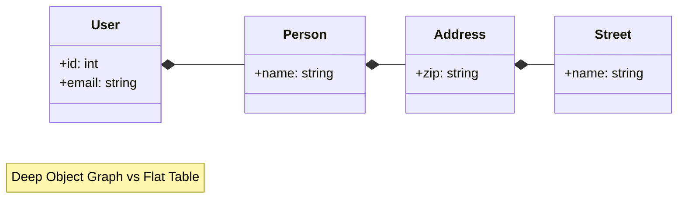
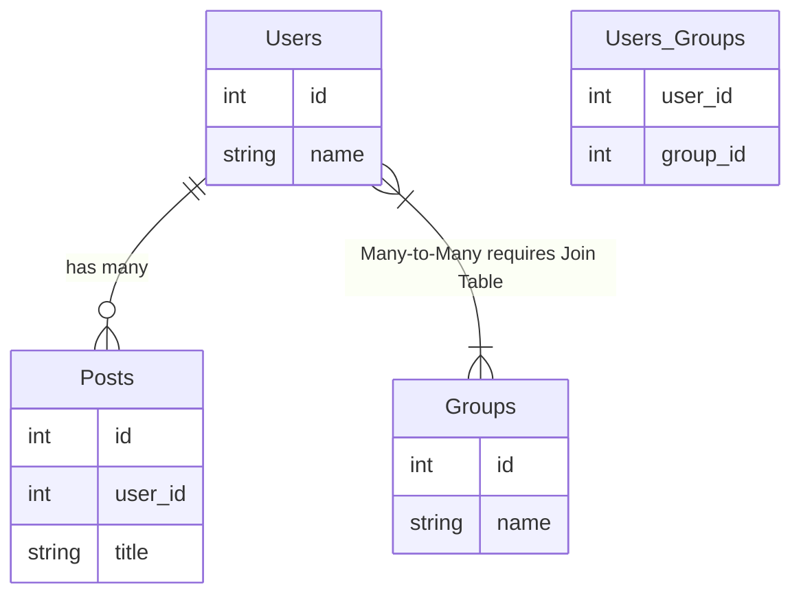
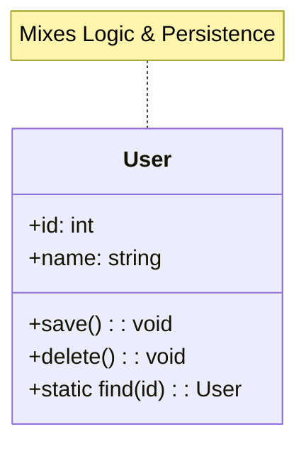
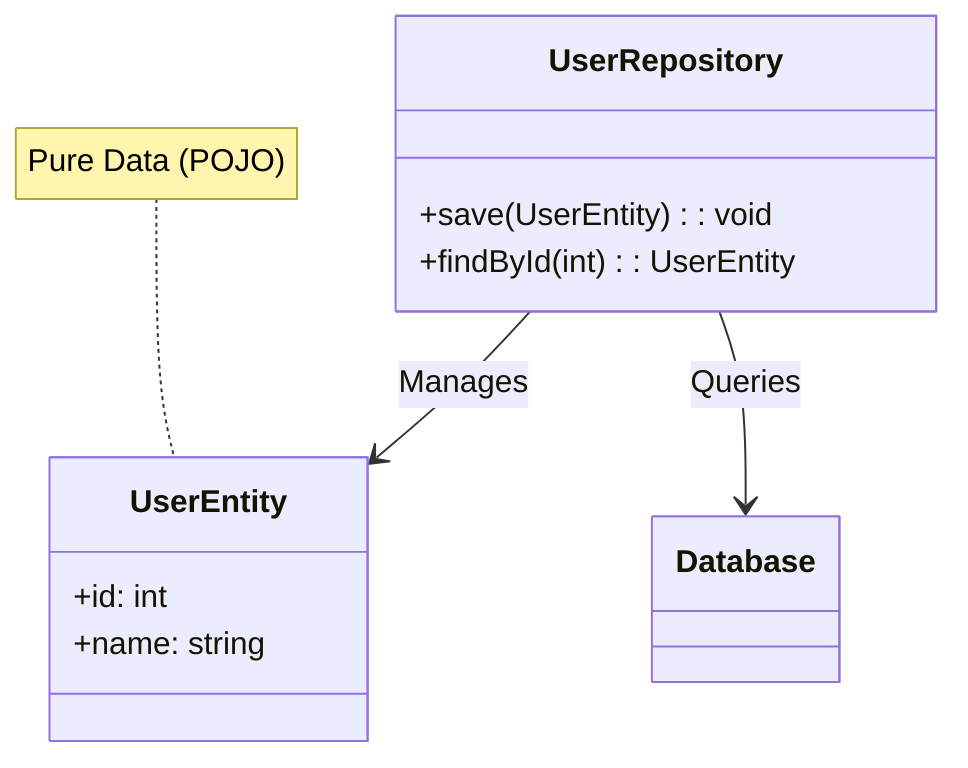
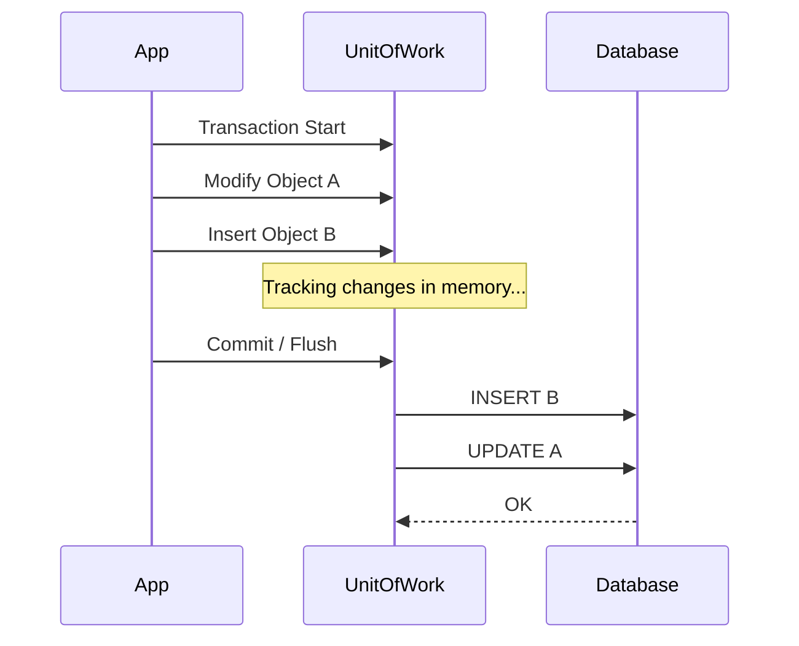

- [1 - Executive Overview and Theoretical Context](#1---executive-overview-and-theoretical-context)
- [2 - Core Theory: The Object-Relational Impedance Mismatch](#2---core-theory-the-object-relational-impedance-mismatch)
  - [2.1 - The Mismatch of Granularity](#21---the-mismatch-of-granularity)
  - [2.2 - The Mismatch of Subtypes (Inheritance)](#22---the-mismatch-of-subtypes-inheritance)
  - [2.3 - The Mismatch of Identity](#23---the-mismatch-of-identity)
  - [2.4 - The Mismatch of Associations](#24---the-mismatch-of-associations)
- [3 - History of Object Relational Mapping](#3---history-of-object-relational-mapping)
  - [3.1 - The Origins: Smalltalk and the Rise of OOP (1980s-1990s)](#31---the-origins-smalltalk-and-the-rise-of-oop-1980s-1990s)
  - [3.2 - The Java Enterprise Era: Complexity and Reaction (1998-2004)](#32---the-java-enterprise-era-complexity-and-reaction-1998-2004)
  - [3.3 - The Rails Effect: Simplicity via Active Record (2004-2010)](#33---the-rails-effect-simplicity-via-active-record-2004-2010)
  - [3.4 - The Modern Era: Node.js, TypeScript, and Fragmentation (2010-Present)](#34---the-modern-era-nodejs-typescript-and-fragmentation-2010-present)
- [4 - Architectural Patterns in Depth](#4---architectural-patterns-in-depth)
  - [4.1 - The Active Record Pattern](#41---the-active-record-pattern)
  - [4.2 - The Data Mapper Pattern](#42---the-data-mapper-pattern)
  - [4.3 - Comparative Analysis of Patterns](#43---comparative-analysis-of-patterns)
- [5 - Key Components of ORM Architecture](#5---key-components-of-orm-architecture)
  - [5.1 - The Unit of Work](#51---the-unit-of-work)
  - [5.2 - The Identity Map](#52---the-identity-map)
  - [5.3 - Dirty Checking Mechanisms](#53---dirty-checking-mechanisms)
  - [5.4 - Lazy Loading vs Eager Loading](#54---lazy-loading-vs-eager-loading)
- [6 - Performance Anomalies and Optimisation](#6---performance-anomalies-and-optimisation)
  - [6.1 - The $N+1$ Select Problem](#61---the-n1-select-problem)
  - [6.2 - Cartesian Product Explosion](#62---cartesian-product-explosion)
- [7 - Modern Implementations Case Studies](#7---modern-implementations-case-studies)
  - [7.1 - Drizzle ORM (TypeScript)](#71---drizzle-orm-typescript)
  - [7.2 - Prisma (TypeScript/Node.js)](#72---prisma-typescriptnodejs)
  - [7.3 - TypeORM (TypeScript)](#73---typeorm-typescript)
  - [7.4 - SQLAlchemy (Python)](#74---sqlalchemy-python)
  - [7.5 - Spring Data JPA (Java)](#75---spring-data-jpa-java)
- [8 - Comparative Code Analysis](#8---comparative-code-analysis)
  - [8.1 - Scenario: Fetching Relations](#81---scenario-fetching-relations)
  - [8.2 - Scenario: Transactional Insertion](#82---scenario-transactional-insertion)
- [9 - Pros, Cons, and Alternatives](#9---pros-cons-and-alternatives)
  - [9.1 - The Arguments for ORM](#91---the-arguments-for-orm)
  - [9.2 - The Arguments Against ORM](#92---the-arguments-against-orm)
  - [9.3 - Alternatives](#93---alternatives)
- [10 - Conclusion](#10---conclusion)
- [References](#references)


# 1 - Executive Overview and Theoretical Context

Object Relational Mapping (ORM) constitutes one of the most critical, yet frequently debated, architectural layers in modern software engineering. It serves as the automated translation mechanism between the two dominant but fundamentally incompatible paradigms of data representation: the object-oriented model used in application logic and the relational model used in database management systems.

For the software architect, the ORM is not merely a utility for data retrieval; it is a complex infrastructure component responsible for managing transaction boundaries, ensuring data consistency via units of work, and providing a necessary abstraction over raw SQL. The primary utility of an ORM lies in its ability to liberate developers from the imperative details of data access, allowing them to manipulate data as intuitive graphs of objects rather than disconnected tabular rows. However, this abstraction is leaky. The underlying mechanics of the database—locks, indexes, and join algorithms—often bleed through, manifesting as performance bottlenecks such as the $N+1$ select problem or Cartesian product explosions.

The landscape of ORM technology has undergone a radical transformation over the last three decades. It has evolved from the heavyweight, XML-configured frameworks of the Java Enterprise era to the agile, convention-over-configuration patterns of Ruby on Rails, and finally to the modern, type-safe, and "headless" solutions dominating the TypeScript ecosystem today. This evolution reflects a broader industry shift towards developer experience (DX), type safety, and cloud-native performance.

This report provides a rigorous analysis of the ORM landscape. It examines the theoretical underpinnings of the Object-Relational Impedance Mismatch, details the evolution of architectural patterns like Active Record and Data Mapper, and scrutinises the internal mechanics of modern tools including Drizzle, Prisma, TypeORM, SQLAlchemy, and Spring Data JPA.


# 2 - Core Theory: The Object-Relational Impedance Mismatch

The foundational problem that all ORMs attempt to solve is formally known as the **Object-Relational Impedance Mismatch**. This term, borrowed from electrical engineering, describes the inherent inefficiency and complexity arising when two systems with different operating characteristics are connected. In the context of software, it refers to the conceptual and technical difficulties encountered when a Relational Database Management System (RDBMS) is served by an object-oriented programming language.

The mismatch is not a single problem but a collection of four distinct sub-problems: Granularity, Subtype (Inheritance), Identity, and Association.

## 2.1 - The Mismatch of Granularity

Granularity refers to the relative size and mapping of model elements between the two paradigms. In an object-oriented model, classes are often fine-grained and composed of other classes to represent a domain concept comprehensively.

Consider a **User** entity in a domain model. A well-designed object model might decompose this user into a **Person** class, which contains an **Address** class, which in turn contains **Street**, **City**, and **Postcode** classes. This creates a deep graph of small, interconnected objects.



In the relational model, however, this data is often flattened. The Address information might simply exist as columns (street, city, zip) within the users table to avoid unnecessary joins. Alternatively, it might be normalised into a separate addresses table.

**The Friction:**
The ORM must handle this discrepancy. If the object model is more granular than the database, the ORM must flatten the object graph into a single row during insertion and expand that row back into a graph during retrieval (embedding). If the database is more normalised than the object model, the ORM must perform joins to construct a single logical object. This mismatch leads to a situation where the number of classes in the application does not equal the number of tables in the database.

## 2.2 - The Mismatch of Subtypes (Inheritance)

Inheritance is a central pillar of Object-Oriented Programming (OOP). It allows for polymorphism, where a Manager and an Engineer can both be treated as an Employee. The object model supports an "is-a" relationship natively.

Standard SQL (SQL-92), however, does not support inheritance. Tables do not extend other tables. A relational database is composed of flat sets of tuples. There is no native concept of a super-table or a sub-table in standard relational algebra.

**The Friction:**
To map an inheritance hierarchy to a relational schema, the ORM must employ one of three strategies, each with significant trade-offs regarding data integrity and query performance:

| Inheritance Strategy     | Description                                                                                            | Performance Implication                     | Normalisation                                                                        |
| :----------------------- | :----------------------------------------------------------------------------------------------------- | :------------------------------------------ | :----------------------------------------------------------------------------------- |
| **Single Table**         | All classes in the hierarchy map to one table. A discriminator column (e.g., type) distinguishes them. | Very Fast (No joins).                       | Poor. Columns for subclass A are NULL for subclass B. Violates NOT NULL constraints. |
| **Class Table (Joined)** | The superclass has a table; each subclass has a table. Data is spread across them.                     | Slow (Requires JOINs).                      | Excellent. Fully normalised.                                                         |
| **Concrete Table**       | Each subclass has its own table containing all fields (inherited and specific).                        | Medium (Polymorphic queries require UNION). | Moderate. Data duplication of schema definitions.                                    |

The ORM must manage these strategies transparently, but the developer pays the cost in performance (complex joins) or data integrity (null columns).

## 2.3 - The Mismatch of Identity

The concept of "sameness" differs radically between the two paradigms.

* **Object Identity:** In languages like Java or Python, identity is tied to the memory address. Two objects are identical (`==`) if they occupy the same location in the heap. They are equal (`.equals()`) if their values are equivalent. Objects can exist without a unique identifier property; their existence in memory is their identity.
* **Database Identity:** In a relational database, identity is defined by the Primary Key. A row is unique because its primary key value is unique. Two rows with different primary keys are distinct, even if all their data attributes are identical.

**The Friction:**
If a system loads the same database row (e.g., User ID 1) into two different in-memory objects, the application now has two conflicting representations of the same reality. Modifying one will not update the other. This leads to the "Phantom Read" or "Lost Update" phenomena. ORMs mitigate this using an Identity Map, ensuring that within a single transaction, a database row corresponds to exactly one object instance.

## 2.4 - The Mismatch of Associations

The manner in which relationships are navigated represents perhaps the most profound structural difference.

* **Object Associations:** Object references are inherently directional pointers. A User object holds a reference to a list of Post objects (`user.posts`). This allows the developer to navigate from parent to child. However, unless the Post object explicitly holds a reference to User (`post.user`), the relationship cannot be traversed in reverse.
* **Relational Associations:** Relational associations are formed via Foreign Keys and are inherently bidirectional. If the posts table has a `user_id` column, a SQL query can easily join from users to posts or from posts to users. The relationship exists in the schema, not in the direction of the pointer.

**The Friction:**
The mismatch is most acute in Many-to-Many relationships. In OOP, this is represented by mutual collections (Object A has a list of B; Object B has a list of A). In the database, this requires a third "Join Table" or "Association Table" to resolve the relationship. This Join Table has no corresponding domain object in the application, creating a structural gap that the ORM must bridge transparently.




# 3 - History of Object Relational Mapping

The history of ORM is often described by industry analysts as "The Vietnam of Computer Science". This analogy, coined by Ted Neward, suggests a problem space that initially appears manageable but becomes a quagmire of complexity and diminishing returns as requirements scale.

## 3.1 - The Origins: Smalltalk and the Rise of OOP (1980s-1990s)

The need for ORM arose alongside the adoption of Object-Oriented Programming. As languages like Smalltalk gained traction for business applications, developers faced the challenge of persisting complex object graphs into the dominant storage technology: the relational database.

* **TopLink (1994):** Originally developed for Smalltalk, TopLink was among the first commercial O/R mapping tools. It introduced many foundational patterns, such as the Unit of Work and Indirection (Lazy Loading). It was later ported to Java in 1996.
* **The Object Database Dream:** For a brief period, the industry hoped that Object-Oriented Databases (OODBMS) would replace RDBMS, eliminating the mismatch entirely. This did not happen due to the entrenched position of SQL in enterprise reporting and data integrity.

## 3.2 - The Java Enterprise Era: Complexity and Reaction (1998-2004)

As Java became the language of the enterprise, Sun Microsystems attempted to standardise persistence.

  * **Enterprise JavaBeans (EJB) Entity Beans:** EJB 1.0 and 2.0 introduced Entity Beans. These were heavyweight components that required an application server container. They forced developers to write complex deployment descriptors (XML) and implement rigid interfaces. The performance was poor, and the development cycle was slow.
  * **The Hibernate Revolution (2001):** Frustrated by EJB, Gavin King created Hibernate. It was an open-source library that worked with "Plain Old Java Objects" (POJOs). It did not require a container and used a lightweight reflection-based approach. Hibernate rapidly became the de facto standard, proving that transparent persistence was possible.

## 3.3 - The Rails Effect: Simplicity via Active Record (2004-2010)

In 2004, David Heinemeier Hansson released Ruby on Rails. Central to its philosophy was the **Active Record** pattern. Rails prioritised "Convention over Configuration." It assumed that table names matched class names and foreign keys followed standard naming patterns.

This eliminated the massive XML configuration files common in Java. It democratised web development, allowing rapid prototyping. The success of Rails influenced a generation of frameworks, including Django (Python), Grails (Groovy), and eventually Eloquent (PHP).

## 3.4 - The Modern Era: Node.js, TypeScript, and Fragmentation (2010-Present)

The rise of Node.js brought asynchronous I/O to the backend, challenging existing ORM paradigms designed for blocking, synchronous environments.

  * **Sequelize & TypeORM:** Early Node.js ORMs like Sequelize adapted the Active Record pattern. TypeORM brought strict typing and decorators, mimicking the Hibernate/JPA experience for TypeScript developers.
  * **Prisma (2019):** Prisma disrupted the market by introducing a "Schema-First" approach. Developers define the data model in a custom Domain Specific Language (DSL), and the tool generates a fully type-safe client. This solved the issue of keeping TypeScript types in sync with the database schema.
  * **The "Headless" Movement (2022-Present):** Tools like Drizzle emerged as a reaction to the bloat of traditional ORMs. They market themselves as "SQL-like" or "Headless," providing a thin, type-safe wrapper over SQL without the heavy runtime state management of Hibernate or the binary overhead of Prisma.


# 4 - Architectural Patterns in Depth

Martin Fowler, in his seminal work *Patterns of Enterprise Application Architecture*, categorised the logic of data access into two primary patterns: Active Record and Data Mapper. Understanding the distinction is vital for selecting the right tool.

## 4.1 - The Active Record Pattern

In the Active Record pattern, the object that holds the data also encapsulates the logic to access the database. The class is essentially a wrapper around a database row.



**Characteristics:**

  * **One-to-One Mapping:** The class typically corresponds exactly to a database table.
  * **Mixed Responsibility:** The domain object contains both business logic (e.g., `calculateTotal()`) and persistence logic (e.g., `save()`, `delete()`).
  * **Static Access:** Database queries are often performed via static methods on the class (e.g., `User.find(id)`).

**Advantages:**

  * **Simplicity:** It is incredibly fast to write and easy to understand for simple CRUD applications.
  * **Cohesion:** All logic related to a User—data and persistence—sits in one file.

**Disadvantages:**

  * **Coupling:** It tightly couples the domain logic to the database schema. A change in the database often forces a change in the domain object.
  * **Testing Difficulty:** It is hard to unit test the domain logic without mocking the database, as the `save()` method is baked into the object.
  * **SRP Violation:** It violates the Single Responsibility Principle.

**Examples:** Ruby on Rails, Django ORM, TypeORM (Active Record mode).

## 4.2 - The Data Mapper Pattern

The Data Mapper pattern separates the in-memory objects (Domain Model) from the database. A third layer (the Mapper or Repository) is responsible for transferring data between the two.



**Characteristics:**

  * **Ignorance:** The domain objects (Entities) have no knowledge of the database. They do not inherit from a base class and do not contain methods like `save()`.
  * **External Persistence:** Persistence is handled by a Repository or EntityManager (e.g., `repository.save(user)`).
  * **Flexibility:** The database schema and the object model can evolve independently.

**Advantages:**

  * **Testability:** Domain objects are plain objects (POJOs) and can be tested in isolation.
  * **Architectural Purity:** It adheres to strict layering and the Single Responsibility Principle.
  * **Complex Domains:** It handles complex business rules better, as the domain model is not constrained by the table structure.

**Disadvantages:**

  * **Boilerplate:** It requires defining Entities, Repositories, and mapping configurations, increasing the initial setup time.
  * **Complexity:** It has a steeper learning curve.

**Examples:** Hibernate, SQLAlchemy, Doctrine, TypeORM (Data Mapper mode), MikroORM.

## 4.3 - Comparative Analysis of Patterns

| Feature                  | Active Record                                | Data Mapper                                           |
| :----------------------- | :------------------------------------------- | :---------------------------------------------------- |
| **Primary Goal**         | Simplicity and rapid development.            | Decoupling and architectural purity.                  |
| **Persistence Handling** | Object saves itself (`user.save()`).         | Repository saves object (`repo.save(user)`).          |
| **Domain Object Type**   | Wraps a DB row; often extends a base class.  | Plain object (POJO); no base class required.          |
| **Testing**              | Harder (requires DB or complex mocking).     | Easier (pure unit tests possible).                    |
| **Best Use Case**        | CRUD apps, Prototypes, Small/Medium systems. | Enterprise systems, Complex Domains, Long-lived apps. |


# 5 - Key Components of ORM Architecture

Modern ORMs are not just query generators; they are complex state management engines. Several key components work in unison to manage the lifecycle of objects.

## 5.1 - The Unit of Work

The Unit of Work is a behavioural pattern that maintains a list of objects affected by a business transaction and coordinates the writing out of changes. Instead of executing an UPDATE SQL statement every time a property is modified, the ORM tracks changes in memory.



**Mechanism:**

1.  **Transaction Start:** The application opens a session or transaction.
2.  **Accumulation:** As the application modifies objects, the Unit of Work tracks these changes. No SQL is sent to the database yet.
3.  **Flush/Commit:** When the transaction is committed, the Unit of Work calculates the net changes. It optimises the order of SQL statements to satisfy referential integrity (e.g., inserting parents before children).

**Benefits:**

  * **Atomicity:** All changes are committed effectively at once.
  * **Performance:** It allows for "Write-Behind" optimisation. Multiple updates to the same object result in a single UPDATE statement. It also enables JDBC batching.

## 5.2 - The Identity Map

The Identity Map is a caching pattern that ensures that each database row is represented by exactly one object instance within the current Unit of Work (Session).

**Function:**
The Identity Map acts as a cache indexed by the database Primary Key. When the application requests User with ID 1, the ORM checks the map:

  * **Hit:** If the object is already in the map, the existing instance is returned.
  * **Miss:** If not, the ORM queries the database, creates the object, stores it in the map, and returns it.

**Critical Importance:**
Without an Identity Map, loading the same ID twice would produce two different objects. If the application modified both, the database would suffer from the "Lost Update" problem (the last write wins). The Identity Map ensures reference equality (`a == b`) matches database identity.

## 5.3 - Dirty Checking Mechanisms

To function, the Unit of Work must know which objects have been modified. This process is called "Dirty Checking." There are two primary approaches:

1.  **Snapshotting (Hibernate/JPA):** When an object is loaded, the ORM keeps a hidden copy (snapshot) of the original data. At flush time, it performs a field-by-field comparison of the current object against the snapshot.
      * **Pros:** Works with plain objects.
      * **Cons:** Memory overhead (doubles memory usage for loaded entities) and CPU cost at flush time.
2.  **Proxy/Observable (Entity Framework, MikroORM):** The ORM wraps the object in a proxy or uses standard setters. When a value is changed (`user.setName("New")`), the proxy intercepts the call and flags the object as dirty immediately.
      * **Pros:** efficient flush (no comparison needed).
      * **Cons:** Can interfere with debugging and serialization due to proxy artifacts.

## 5.4 - Lazy Loading vs Eager Loading

**Lazy Loading:**

  * Related data is fetched only when accessed.
  * **Code:** `print(user.posts)` -\> Triggers `SELECT * FROM posts...`.
  * **Mechanism:** The ORM places a "Ghost" or "Proxy" object in the posts field. Accessing it initializes the database call.
  * **Risk:** Can lead to the $N+1$ problem if used inside a loop.

**Eager Loading:**

  * Related data is fetched immediately alongside the parent.
  * **Code:** `User.find(id, fetch=['posts'])`.
  * **Mechanism:** The ORM uses a SQL JOIN to pull all data in one query, or executes a second optimised query immediately.


# 6 - Performance Anomalies and Optimisation

While ORMs provide development speed, they introduce specific performance anti-patterns that technical teams must vigilantly monitor.

## 6.1 - The $N+1$ Select Problem

The $N+1$ problem is the most ubiquitous performance issue in ORM usage. It occurs when the application traverses a relationship that was loaded lazily.

**The Scenario:**
An application needs to display a list of 100 authors and the title of their latest book.

1.  **Query 1:** `SELECT * FROM authors` (Returns $N=100$ rows).
2.  **The Loop:** The code iterates through the authors and calls `author.getBook()`.
3.  **Query N:** The ORM detects the book is not loaded and issues `SELECT * FROM books WHERE author_id = ?`. This happens 100 times.

**Result:**
The database receives 101 queries ($1 + N$) instead of 1. This creates massive network latency ("chattiness").

**Solutions:**

  * **Join Fetching:** Instruct the ORM to use a SQL JOIN (`SELECT... FROM authors JOIN books...`).
  * **Batch Fetching:** The ORM collects the IDs of the authors and issues one secondary query: `SELECT * FROM books WHERE author_id IN (1, 2,... 100)`.
  * **Entity Graphs:** A JPA feature that allows defining a "template" of what associations to load for a specific query, overriding global lazy loading settings.

## 6.2 - Cartesian Product Explosion

The inverse of the $N+1$ problem is the Cartesian Product problem. This occurs when Eager Loading is overused.

If an application eagerly fetches a User, their Posts, and the Comments on those posts using JOINs, the result set size explodes.

  * 1 User has 10 Posts.
  * Each Post has 10 Comments.
  * **Result:** $1 \times 10 \times 10 = 100$ rows returned from the database for a single user.

The ORM must deduplicate this data in memory to reconstruct the object graph. This consumes significant application memory and bandwidth.


# 7 - Modern Implementations Case Studies

The following section examines the current leaders in the ORM space, highlighting their architectural differences.

## 7.1 - Drizzle ORM (TypeScript)

Drizzle represents the "Headless" or "Thin" ORM movement. It positions itself as a reaction to the complexity of Hibernate-style state management.

  * **Philosophy:** "If you know SQL, you know Drizzle". It aims for zero runtime overhead.
  * **Architecture:** It does not use code generation. The schema is defined in TypeScript files (`schema.ts`), allowing strict type inference.
  * **Querying Modes:**
      * **SQL-like:** Mirrors SQL syntax (`db.select().from(users)...`).
      * **Relational:** A higher-level API (`db.query.users.findMany(...)`).
  * **Innovation:** Drizzle solves the $N+1$ problem by using Lateral Joins (on supported databases) or optimised subqueries to fetch nested relations in a single round trip, without the memory overhead of a heavy Unit of Work.

## 7.2 - Prisma (TypeScript/Node.js)

Prisma focuses heavily on Developer Experience (DX) through a Schema-First approach.

  * **Architecture:** Developers define the model in `schema.prisma`. A CLI generator creates a client tailored to that schema.
  * **Engine Evolution:**
      * **Legacy:** Relied on a compiled Rust binary ("Query Engine") that ran as a sidecar process. This caused issues with "Cold Starts" in serverless environments.
      * **Modern (v7+):** Shifted to a TypeScript-based query compiler (Wasm), removing the need for the heavy binary in production. This improves compatibility with edge environments like Cloudflare Workers.
  * **Type Safety:** Prisma provides perhaps the strongest type guarantees in the ecosystem. The generated client types adapt based on the query (e.g., if you select only id and name, the return type only has id and name).

## 7.3 - TypeORM (TypeScript)

TypeORM is the spiritual successor to Hibernate for the Node.js ecosystem, heavily used in NestJS applications.

  * **Pattern:** Supports both Active Record and Data Mapper.
  * **Decorators:** Uses Java-style decorators (`@Entity`, `@Column`, `@ManyToOne`) to define schemas.
  * **Challenges:** While mature, it suffers from maintenance issues and unpredictable behaviour in complex relation handling. However, its integration with Dependency Injection frameworks keeps it popular in enterprise settings.

## 7.4 - SQLAlchemy (Python)

SQLAlchemy is arguably the most flexible ORM in existence, offering a "layered" architecture.

  * **Core:** A schema-centric SQL Expression Language. It allows building SQL queries using Python constructs without mapping to objects.
  * **ORM:** A distinct layer built on top of Core that implements the Data Mapper pattern.
  * **Loading Strategies:** It provides explicit control over how relations are loaded. Developers can choose per-query whether to use `joinedload` (SQL JOIN) or `selectinload` (Separate SELECT), allowing fine-tuning for $N+1$ vs Cartesian Product trade-offs.

## 7.5 - Spring Data JPA (Java)

Spring Data JPA is an abstraction over an abstraction. It sits on top of the Java Persistence API (JPA), which is usually implemented by Hibernate.

  * **Repository Magic:** Developers define an interface (e.g., `interface UserRepository extends JpaRepository<User, Long>`). Spring generates the implementation code at runtime using proxy factories.
  * **Query Derivation:** Methods named `findByEmailAndIsActive(String email, boolean active)` are automatically translated into JPQL queries.
  * **Pros/Cons:** It offers immense productivity but can hide performance pitfalls deep within the stack. Debugging a performance issue often requires peeling back layers: Spring Data → JPA → Hibernate → JDBC → SQL.


# 8 - Comparative Code Analysis

To illustrate the syntactic and paradigmatic differences, we compare the implementation of two common tasks across raw SQL and modern ORMs.

## 8.1 - Scenario: Fetching Relations

**Requirement:** Fetch all Users and their associated Posts.

**Raw SQL:**

```sql
SELECT u.id, u.name, p.id as post_id, p.title
FROM users u
LEFT JOIN posts p ON u.id = p.user_id;
```

**Critique:** This returns a flat result set (Cartesian product). If a user has 10 posts, the user's data is repeated 10 times. The developer must write a "reducer" function to group posts under users manually.

**Drizzle (Relational API):**

```typescript
const users = await db.query.users.findMany({
  with: {
    posts: true,
  },
});
```

**Analysis:** Drizzle handles the grouping automatically. Under the hood, it may use a lateral join or a subquery to fetch the JSON structure directly from the database (on Postgres), reducing data transfer overhead.

**Prisma:**

```typescript
const users = await prisma.user.findMany({
  include: {
    posts: true,
  },
});
```

**Analysis:** Prisma's syntax is nearly identical to Drizzle's relational mode. It guarantees that the returned TypeScript objects match the structure defined in the `include` block.

**TypeORM:**

```typescript
const users = await userRepository.find({
  relations: {
    posts: true,
  },
});
```

**Analysis:** TypeORM typically executes a LEFT JOIN and maps the results. While simple, it lacks the type-inference depth of Prisma or Drizzle (e.g., ensuring posts is present in the type definition only when requested).

## 8.2 - Scenario: Transactional Insertion

**Requirement:** Create a User and a Post in a single atomic transaction.

**Raw SQL:**

```sql
BEGIN;
INSERT INTO users (name) VALUES ('Alice') RETURNING id;
-- Capture ID from previous result (e.g., 1)
INSERT INTO posts (user_id, title) VALUES (1, 'Hello World');
COMMIT;
```

**Spring Data JPA (Java):**

```java
@Transactional
public void createUserAndPost() {
    User user = new User("Alice");
    userRepository.save(user); // Persistence Context tracks this
    
    Post post = new Post("Hello World");
    post.setUser(user);
    postRepository.save(post);
} // Transaction commits here. Unit of Work flushes changes.
```

**Analysis:** The annotation `@Transactional` creates a boundary. The Unit of Work ensures that the User is inserted first, its ID is retrieved, and then the Post is inserted with the correct Foreign Key.

**Drizzle (TypeScript):**

```typescript
await db.transaction(async (tx) => {
  const [user] = await tx.insert(users).values({ name: 'Alice' }).returning();
  await tx.insert(posts).values({ userId: user.id, title: 'Hello World' });
});
```

**Analysis:** Drizzle exposes the transaction explicitly. The `tx` object carries the transactional context. This is more verbose but explicitly shows the flow of operations.


# 9 - Pros, Cons, and Alternatives

## 9.1 - The Arguments for ORM

  * **Productivity:** For standard applications, ORMs reduce the code volume by 70-80%.1
  * **Refactoring Safety:** Renaming a column in an Entity class (with modern IDEs) is safer than hunting for string literals in SQL queries.
  * **Security:** ORMs use Parameterised Queries by default, providing robust protection against SQL Injection attacks.
  * **Database Agnosticism:** While rarely utilised, ORMs allow applications to swap dialect (e.g., MySQL to PostgreSQL) without rewriting queries.

## 9.2 - The Arguments Against ORM

  * **Performance Opacity:** The "Black Box" nature often hides inefficient queries. A simple LINQ or JPQL statement might generate a 5-table join or a subquery scan that kills performance.
  * **The Learning Cliff:** Learning the idiosyncrasies of Hibernate or Entity Framework (cache levels, flush modes, proxy behaviour) can take as long as learning SQL itself.
  * **Lowest Common Denominator:** To support multiple databases, ORMs often avoid using powerful, vendor-specific features (e.g., Postgres specific JSONB operators or Window Functions), forcing developers to drop to raw SQL anyway.

## 9.3 - Alternatives

  * **Query Builders (Knex, Kysely):** These tools occupy the middle ground. They provide a programmatic way to construct SQL (preventing syntax errors) but do not attempt to manage object state or relations. They are "closer to the metal."
      * **Use Case:** When you need full control over the SQL but want to avoid string concatenation.
  * **Micro-ORMs (Dapper):** Popular in the.NET world, these tools map query results to objects but do not generate SQL or track changes. They are extremely fast but require writing SQL manually.


# 10 - Conclusion

Object Relational Mapping remains a cornerstone of enterprise application architecture, despite the inherent theoretical friction of the Impedance Mismatch. The industry has moved past the "ORM vs. No ORM" debate towards a more nuanced "Gradient of Abstraction."

We are currently witnessing a convergence of philosophies. Traditional heavyweight ORMs (Hibernate, TypeORM) are adopting better type safety and lighter configurations. Meanwhile, modern "Headless" ORMs (Drizzle) are adding relational capabilities that mimic the convenience of their predecessors without the runtime cost.

For the modern architect, the decision relies on the specific constraints of the project. For complex, long-lived enterprise domains with rich business logic, the Data Mapper pattern (JPA/Hibernate) remains valid. For rapid application development in the TypeScript ecosystem, Prisma offers the best Developer Experience. For high-performance, serverless applications where bundle size and cold-start times are critical, Drizzle has established a new standard.

Ultimately, the ORM is a tool for managing complexity. Used correctly, it is a force multiplier. Used without understanding the underlying relational theory, it is a generator of technical debt.


# References

1. Ireland, C., Bowers, D., Newton, M., & Waugh, K. (2009). [A classification of object–relational impedance mismatch](https://doi.org/10.1109/DBKDA.2009.11). *First International Conference on Advances in Databases, Knowledge, and Data Applications (DBKDA 2009).* ([Open University][1])

2. Colley, D., Stanier, C., & Asaduzzaman, M. (2018). [The impact of object–relational mapping frameworks on relational query performance](https://doi.org/10.1109/iCCECOME.2018.8659222). *2018 International Conference on Computing, Electronics & Communications Engineering (iCCECE 2018).* ([ResearchGate][2])

3. Hasan, M. R., Hasan, M. R., & Bagheri, H. (2025). [Unlocking optimal ORM database designs: Accelerated tradeoff analysis with transformers](https://doi.org/10.1145/3729344). *Proceedings of the ACM on Software Engineering (FSE 2025),* 2(FSE), 1639–1662. ([ACM Digital Library][3])

4. Cvetković, S., & Janković, D. (2010). [A comparative study of the features and performance of ORM tools in a .NET environment](https://doi.org/10.1007/978-3-642-16092-9_14). *Objects and Databases (ICOODB 2010), Lecture Notes in Computer Science, 6348,* 147–158. ([SpringerLink][4])

[1]: https://oro.open.ac.uk/18644/?utm_source=chatgpt.com "A classification of object-relational impedance mismatch."
[2]: https://www.researchgate.net/publication/328488840_The_Impact_of_Object-Relational_Mapping_Frameworks_on_Relational_Query_Performance?utm_source=chatgpt.com "The Impact of Object-Relational Mapping Frameworks on ..."
[3]: https://dl.acm.org/doi/10.1145/3729344?utm_source=chatgpt.com "Unlocking Optimal ORM Database Designs: Accelerated ..."
[4]: https://link.springer.com/chapter/10.1007/978-3-642-16092-9_14?utm_source=chatgpt.com "A Comparative Study of the Features and Performance ..."
