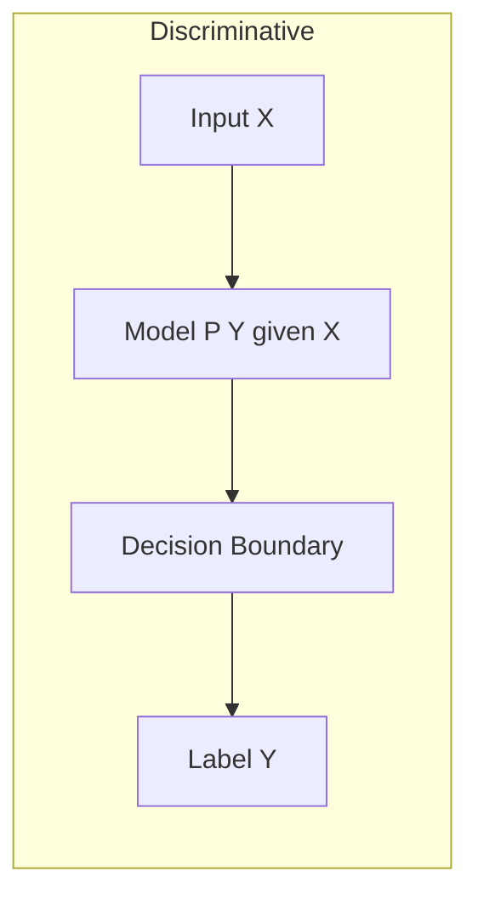
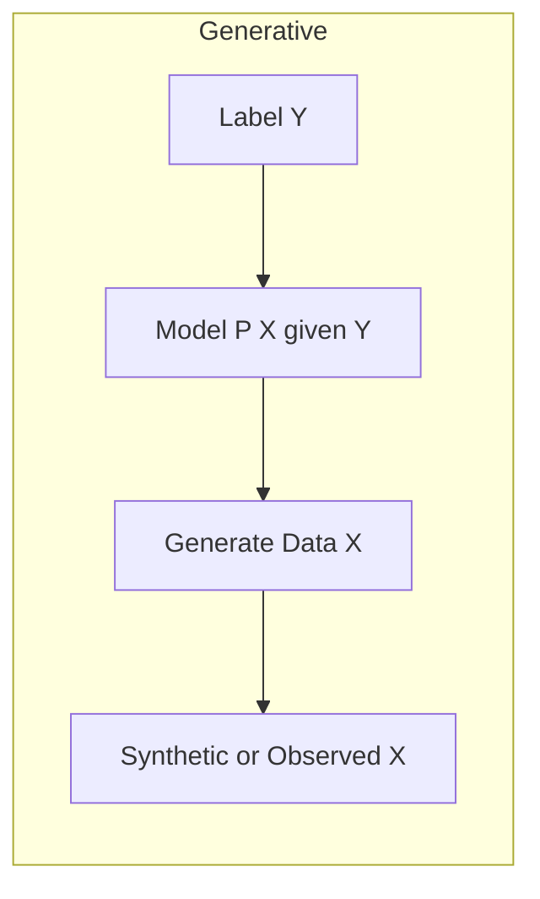
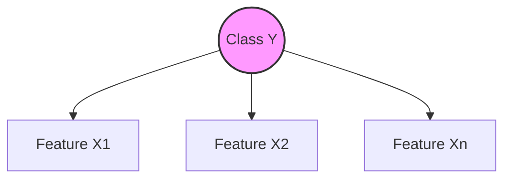
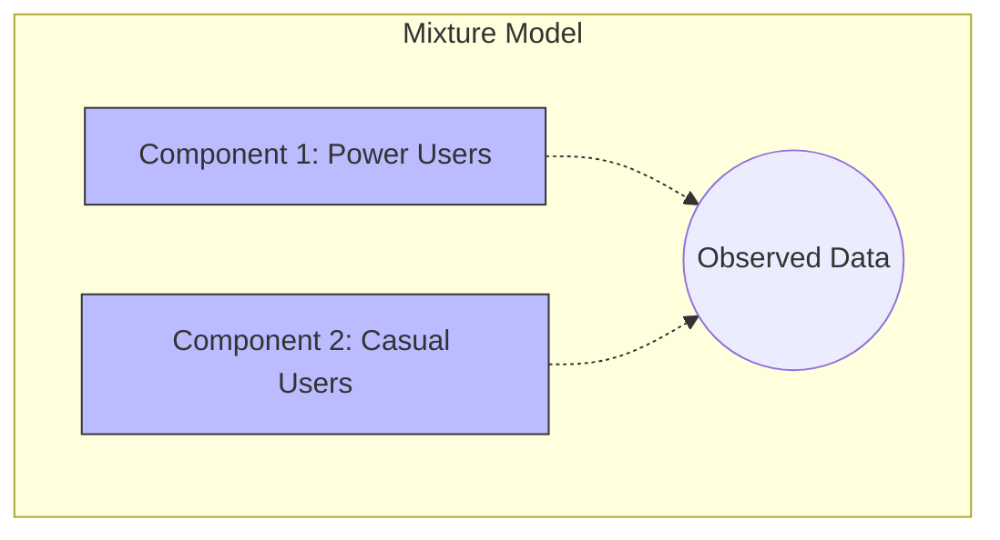
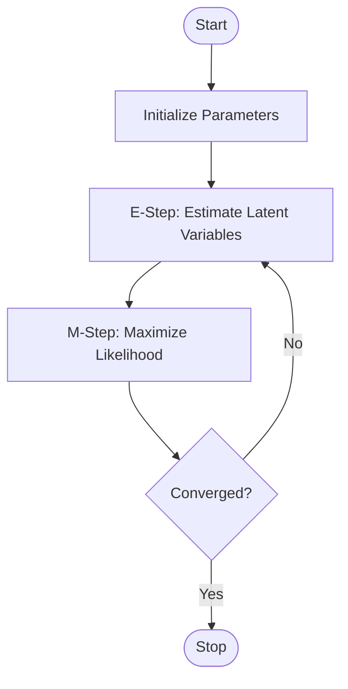
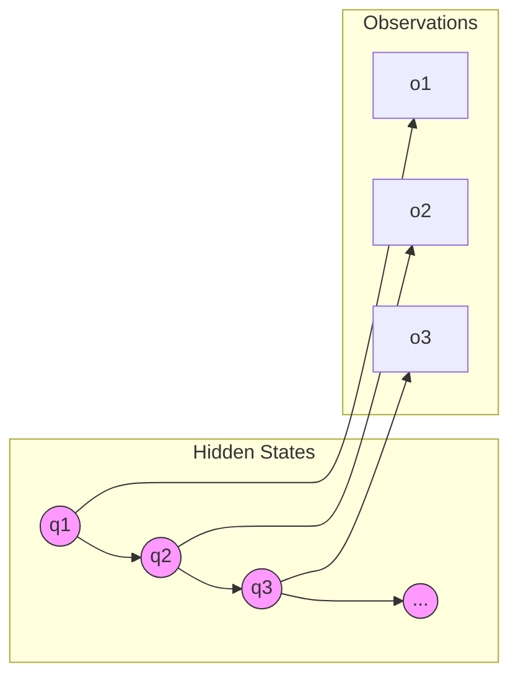
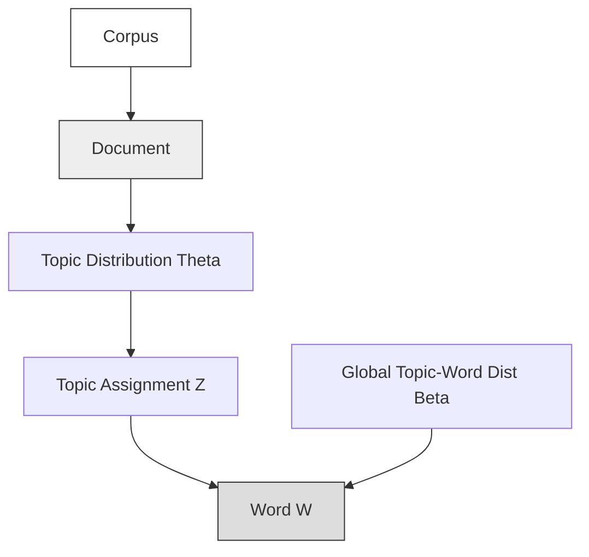

- [1 - Introduction: The Probabilistic Paradigm in Machine Intelligence](#1---introduction-the-probabilistic-paradigm-in-machine-intelligence)
  - [1.1 - Mathematical Foundations and Notation](#11---mathematical-foundations-and-notation)
- [2 - The Naive Bayes Classifier](#2---the-naive-bayes-classifier)
  - [2.1 - Core Theory: The Independence Assumption](#21---core-theory-the-independence-assumption)
  - [2.2 - Architectures and Distribution Types](#22---architectures-and-distribution-types)
    - [2.2.1 - Gaussian Naive Bayes (Continuous Features)](#221---gaussian-naive-bayes-continuous-features)
    - [2.2.2 - Multinomial Naive Bayes (Discrete Counts)](#222---multinomial-naive-bayes-discrete-counts)
    - [2.2.3 - Bernoulli Naive Bayes (Binary Features)](#223---bernoulli-naive-bayes-binary-features)
  - [2.3 - Comprehensive Manual Calculation: Gaussian Naive Bayes](#23---comprehensive-manual-calculation-gaussian-naive-bayes)
  - [2.4 - Advantages and Limitations](#24---advantages-and-limitations)
- [3 - Gaussian Mixture Models (GMM)](#3---gaussian-mixture-models-gmm)
  - [3.1 - Historical Context: Pearson's Crabs](#31---historical-context-pearsons-crabs)
  - [3.2 - Mathematical Formulation](#32---mathematical-formulation)
  - [3.3 - GMM vs. K-Means](#33---gmm-vs-k-means)
- [4 - The Expectation-Maximisation (EM) Algorithm](#4---the-expectation-maximisation-em-algorithm)
  - [4.1 - Theoretical Derivation: Jensen's Inequality and Lower Bounds](#41---theoretical-derivation-jensens-inequality-and-lower-bounds)
  - [4.2 - Monotonicity and Convergence](#42---monotonicity-and-convergence)
- [5 - Applying EM to Gaussian Mixture Models](#5---applying-em-to-gaussian-mixture-models)
  - [5.1 - The Algorithm Steps](#51---the-algorithm-steps)
  - [5.2 - Detailed Manual Calculation Example (1D GMM)](#52---detailed-manual-calculation-example-1d-gmm)
- [6 - Hidden Markov Models (HMM)](#6---hidden-markov-models-hmm)
  - [6.1 - The Markov Property](#61---the-markov-property)
  - [6.2 - Architecture and Parameters](#62---architecture-and-parameters)
  - [6.3 - The Three Canonical Problems](#63---the-three-canonical-problems)
  - [6.4 - GMM-HMM Hybrids](#64---gmm-hmm-hybrids)
- [7 - Latent Dirichlet Allocation (LDA)](#7---latent-dirichlet-allocation-lda)
  - [7.1 - Mixed Membership vs. Simple Clustering](#71---mixed-membership-vs-simple-clustering)
  - [7.2 - The Generative Process](#72---the-generative-process)
  - [7.3 - Inference](#73---inference)
- [8 - Model Selection and Complexity](#8---model-selection-and-complexity)
- [9 - Conclusion](#9---conclusion)

# 1 - Introduction: The Probabilistic Paradigm in Machine Intelligence

The history of artificial intelligence (AI) can be broadly categorised into two distinct eras: the age of deterministic logic and the age of probabilistic reasoning. Early AI systems, often referred to as "Good Old-Fashioned AI" (GOFAI), relied on symbolic processing and hard-coded boolean logic. These systems operated in closed worlds where rules were absolute, and uncertainty was an aberration to be eliminated. However, as AI began to interface with the physical world (through computer vision, natural language processing, and robotic control) it became evident that uncertainty is not an error term, but a fundamental property of nature. Sensors are noisy, data is incomplete, and linguistic ambiguity is pervasive.

To operate effectively in open-world environments, modern AI systems have adopted a probabilistic paradigm. This approach views learning as a process of statistical inference, where the goal is not to find a single "true" answer, but to model the underlying probability distributions that generate observed data. By quantifying uncertainty, these models allow agents to make robust decisions even when information is partial or corrupted.

Within this probabilistic framework, a critical distinction exists between discriminative and generative models. Discriminative models, such as Logistic Regression or Support Vector Machines (SVMs), focus solely on the decision boundary. They model the conditional probability $P(Y|X)$, determining the likelihood of a label $Y$ given an input $X$, without concerning themselves with how $X$ was created. While often achieving high classification accuracy, they act as "black boxes" regarding the data's origins.

In contrast, generative models (the subject of this report) attempt to model the data generation process itself. They learn the joint probability distribution $P(X, Y)$, which can be factored via Bayes' rule into $P(X|Y)P(Y)$. This implies that a generative model learns what the data "looks like" for each class. A generative model for digit recognition, for instance, does not just learn to distinguish a '4' from a '9'; it learns the statistical distribution of pixels that constitute a '4'. This capability allows generative models to detect outliers, handle missing data naturally, and, as the name implies, generate new synthetic samples that resemble the training data.

**Discriminative**

**Generative**

This report provides a comprehensive, expert-level analysis of the foundational probabilistic generative models: the Naive Bayes Classifier, Gaussian Mixture Models (GMM), Hidden Markov Models (HMM), and Latent Dirichlet Allocation (LDA). It explores the mathematical theory underpinning these architectures, specifically focusing on the Expectation-Maximisation (EM) algorithm, providing rigorous derivations and manual implementation examples to facilitate deep technical understanding.

## 1.1 - Mathematical Foundations and Notation

Before dissecting specific models, it is essential to establish the mathematical framework. We operate within the domain of probability theory, where observed data $D$ is treated as a realisation of random variables governed by unknown parameters $\theta$.

**Bayesian Inference**

The cornerstone of generative modelling is Bayes' Theorem, which provides a mechanism for updating belief in a hypothesis $h$ (or parameters $\theta$) given evidence $D$:

$$P(h|D) = \frac{P(D|h)P(h)}{P(D)}$$

  * **Posterior $P(h|D)$:** The probability of the hypothesis after observing the data.
  * **Likelihood $P(D|h)$:** The probability of observing the data if the hypothesis were true.
  * **Prior $P(h)$:** The initial probability of the hypothesis before observing data.
  * **Evidence $P(D)$:** The total probability of the data under all possible hypotheses ($P(D) = \sum_{h'} P(D|h')P(h')$).

**Maximum Likelihood Estimation (MLE) vs. Maximum A Posteriori (MAP)**

In learning probabilistic models, our objective is typically to find the parameters $\theta$ that best explain the data.

  * **MLE:** Selects $\theta$ that maximises the likelihood function $L(\theta) = P(D|\theta)$. This assumes a uniform prior over all parameters.
  * **MAP:** Selects $\theta$ that maximises the posterior $P(\theta|D) \propto P(D|\theta)P(\theta)$. This incorporates prior knowledge, effectively acting as a regulariser to prevent overfitting (e.g., assuming weights are small).

**Independence and Conditional Independence**

Two random variables $A$ and $B$ are independent ($A \perp B$) if $P(A, B) = P(A)P(B)$. They are conditionally independent given $C$ ($A \perp B | C$) if $P(A, B | C) = P(A|C)P(B|C)$. These independence assertions are crucial for simplifying complex joint distributions in high-dimensional spaces, forming the basis of the Naive Bayes algorithm.

-----

# 2 - The Naive Bayes Classifier

The Naive Bayes classifier represents one of the simplest yet most effective applications of generative modelling. It addresses the "curse of dimensionality" in estimating joint distributions by making a strong (hence "naive") independence assumption.

## 2.1 - Core Theory: The Independence Assumption

Consider a classification problem with a class variable $y$ and a feature vector $\mathbf{x} = (x_1, x_2,..., x_n)$. We wish to find the class $y$ that maximises $P(y|\mathbf{x})$. Using Bayes' theorem:

$$P(y|\mathbf{x}) = \frac{P(\mathbf{x}|y)P(y)}{P(\mathbf{x})}$$

The denominator $P(\mathbf{x})$ is constant for all classes, so we can ignore it for optimisation. The term $P(y)$ is the class prior, easily estimated from frequency counts. The challenge lies in estimating the likelihood $P(\mathbf{x}|y) = P(x_1, x_2,..., x_n | y)$. To estimate this fully, we would need to observe every combination of features enough times to calculate a frequency, requiring a dataset that grows exponentially with $n$.

The Naive Bayes classifier circumvents this by assuming that features are conditionally independent given the class. Mathematically:

$$P(x_1,..., x_n | y) \approx \prod_{i=1}^{n} P(x_i | y)$$

This factorisation reduces the complexity of the model from $O(C \cdot V^n)$ to $O(C \cdot V \cdot n)$, where $C$ is the number of classes and $V$ is the domain size of features. While the assumption that features are uncorrelated (e.g., that 'pixels' in an image are independent) is rarely true, Naive Bayes often performs remarkably well. Research by Domingos and Pazzani suggests this is because classification only requires the correct class to have the highest probability, not for the probability estimate itself to be accurate. Even if dependencies distort the probability values, they often do not shift the decision boundary enough to alter the ranking of classes.

## 2.2 - Architectures and Distribution Types

The functional form of $P(x_i | y)$ depends on the data type of the features.

### 2.2.1 - Gaussian Naive Bayes (Continuous Features)

For real-valued data (e.g., sensor readings, physical dimensions), we assume the likelihood of each feature $x_i$ given class $c$ follows a Gaussian distribution characterised by a mean $\mu_{ic}$ and variance $\sigma^2_{ic}$:

$$ P(x_i | y=c) = \frac{1}{\sqrt{2\pi\sigma_{ic}^2}} \exp\left( -\frac{(x_i - \mu_{ic})^2}{2\sigma_{ic}^2} \right) $$

**Training:** The model simply computes the sample mean and sample variance for each feature within each class subset of the training data.

### 2.2.2 - Multinomial Naive Bayes (Discrete Counts)

Common in text classification, features $x_i$ represent the count of term $i$ in the document. The distribution is parameterised by vectors $\theta_c = (\theta_{c1},..., \theta_{cn})$, where $\theta_{ci}$ is the probability of term $i$ appearing in class $c$:

$$P(\mathbf{x} | y=c) \propto \prod_{i=1}^{n} \theta_{ci}^{x_i}$$

**Training:** $\theta_{ci}$ is estimated via MLE using term frequencies, often with Laplace smoothing (adding 1 to counts) to avoid zero probabilities for unseen words.

### 2.2.3 - Bernoulli Naive Bayes (Binary Features)

Used when features are binary indicators (present/absent).

$$P(\mathbf{x} | y=c) = \prod_{i=1}^{n} p_{ci}^{x_i} (1 - p_{ci})^{(1-x_i)}$$

where $p_{ci}$ is the probability of feature $i$ being 1 in class $c$.

## 2.3 - Comprehensive Manual Calculation: Gaussian Naive Bayes

To demonstrate the mechanics, we perform a classification manually.

**Problem:** Classify a new fruit based on Weight (grams) and Sphericity (0-1).
**Classes:** Apple ($A$), Banana ($B$).

**Training Data:**

| ID   | Weight ($x_1$) | Sphericity ($x_2$) | Class ($y$) |
| :--- | :------------- | :----------------- | :---------- |
| 1    | 150            | 0.9                | Apple       |
| 2    | 160            | 0.8                | Apple       |
| 3    | 140            | 0.85               | Apple       |
| 4    | 120            | 0.4                | Banana      |
| 5    | 130            | 0.5                | Banana      |

**New Observation:** $X_{new} = \{ \text{Weight}=145, \text{Sphericity}=0.7 \}$

**Step 1: Training (Parameter Estimation)**

**Class Apple ($N=3$):**

  * Prior $P(A)$: $3/5 = 0.6$
  * Weight Mean $\mu_{W,A}$: $(150+160+140)/3 = 150$
  * Weight Variance $\sigma^2_{W,A}$: $\frac{(150-150)^2 + (160-150)^2 + (140-150)^2}{3-1} = \frac{0+100+100}{2} = 100$
  * Sphericity Mean $\mu_{S,A}$: $(0.9+0.8+0.85)/3 = 0.85$
  * Sphericity Variance $\sigma^2_{S,A}$: $\frac{(0.05)^2 + (-0.05)^2 + (0)^2}{2} = \frac{0.0025+0.0025}{2} = 0.0025$

**Class Banana ($N=2$):**

  * Prior $P(B)$: $2/5 = 0.4$
  * Weight Mean $\mu_{W,B}$: $(120+130)/2 = 125$
  * Weight Variance $\sigma^2_{W,B}$: $\frac{(120-125)^2 + (130-125)^2}{1} = \frac{25+25}{1} = 50$
  * Sphericity Mean $\mu_{S,B}$: $(0.4+0.5)/2 = 0.45$
  * Sphericity Variance $\sigma^2_{S,B}$: $\frac{(0.4-0.45)^2 + (0.5-0.45)^2}{1} = 0.005$

**Step 2: Inference (Likelihood Calculation)**

Use Gaussian PDF: $f(x) = \frac{1}{\sqrt{2\pi\sigma^2}} e^{-\frac{(x-\mu)^2}{2\sigma^2}}$

**For Apple:**
Likelihood of Weight 145:
$$ P(145|A) = \frac{1}{\sqrt{200\pi}} e^{-\frac{(145-150)^2}{200}} \approx \frac{1}{25.066} e^{-0.125} \approx 0.0399 \times 0.8825 = 0.0352 $$

Likelihood of Sphericity 0.7:
$$ P(0.7|A) = \frac{1}{\sqrt{0.005\pi}} e^{-\frac{(0.7-0.85)^2}{0.005}} \approx \frac{1}{0.125} e^{-4.5} \approx 8.0 \times 0.0111 = 0.0888 $$

Total Posterior Score (Unnormalised):
$$ P(A|X) \propto P(A) \times P(145|A) \times P(0.7|A) = 0.6 \times 0.0352 \times 0.0888 \approx 0.00187 $$

**For Banana:**
Likelihood of Weight 145:
$$ P(145|B) = \frac{1}{\sqrt{100\pi}} e^{-\frac{(145-125)^2}{100}} \approx \frac{1}{17.72} e^{-4} \approx 0.056 \times 0.0183 = 0.0010 $$

Likelihood of Sphericity 0.7:
$$ P(0.7|B) = \frac{1}{\sqrt{0.01\pi}} e^{-\frac{(0.7-0.45)^2}{0.01}} \approx \frac{1}{0.177} e^{-6.25} \approx 5.64 \times 0.0019 = 0.0107 $$

Total Posterior Score (Unnormalised):
$$ P(B|X) \propto P(B) \times P(145|B) \times P(0.7|B) = 0.4 \times 0.0010 \times 0.0107 \approx 4.28 \times 10^{-6} $$

**Conclusion:**
Comparing the scores: Apple ($1.87 \times 10^{-3}$) $\gg$ Banana ($4.28 \times 10^{-6}$). The model classifies the fruit as an Apple.

## 2.4 - Advantages and Limitations

**Advantages:**

  * **Computational Efficiency:** Training is $O(N \cdot D)$ (linear scan), inference is constant time. It is orders of magnitude faster than iterative methods like SVMs or Neural Networks.
  * **High-Dimensional Performance:** Works exceptionally well on text (10,000+ features) where complex models might overfit due to the "curse of dimensionality".
  * **Interpretability:** Feature importance is transparent (e.g., looking at $\theta_{ci}$ tells you exactly which words predict which class).

**Limitations:**

  * **Independence Assumption:** Fails to capture feature interactions (e.g., "XOR" problems).
  * **Zero-Frequency Problem:** If a feature value doesn't appear in training, likelihood is zero, nullifying all other evidence. This requires Laplace Smoothing (adding $\alpha$ to counts).

-----

# 3 - Gaussian Mixture Models (GMM)

While Naive Bayes assumes a single distribution (unimodal) generates the data for each class, real-world data often exhibits multimodal structures. A "single" class like "Users" might actually be composed of distinct subgroups (power users, casual users) with different behaviours. A single Gaussian mean would land in the empty space between these groups, failing to represent either.

Gaussian Mixture Models (GMMs) address this by modelling the overall distribution as a weighted sum of $K$ distinct Gaussian components. GMMs are primarily used for unsupervised learning (clustering) and density estimation.

## 3.1 - Historical Context: Pearson's Crabs

The concept of mixture models dates back to 1894, when biometrics pioneer Karl Pearson analysed measurements of the forehead breadth of crabs from the Bay of Naples. The distribution was skewed, non-Gaussian. Pearson hypothesised that the population was actually a mixture of two distinct subspecies. He developed the "Method of Moments" to solve for the parameters of the two Gaussians, a calculation that required solving a ninth-degree polynomial by hand (a feat of calculation for the time). Today, we use the EM algorithm, which is numerically stable and scalable, but Pearson's work established the fundamental concept of latent subgroups.

## 3.2 - Mathematical Formulation

A GMM is defined as a probability density function $p(\mathbf{x})$:

$$ p(\mathbf{x}) = \sum_{k=1}^{K} \pi_k \mathcal{N}(\mathbf{x} | \boldsymbol{\mu}_k, \boldsymbol{\Sigma}_k) $$

Where:

  * $K$: Number of mixture components (clusters).
  * $\pi_k$: Mixing coefficient (weight) for component $k$, satisfying $\sum \pi_k = 1$ and $0 \le \pi_k \le 1$. This represents the prior probability that a data point belongs to cluster $k$.
  * $\mathcal{N}(\mathbf{x} | \boldsymbol{\mu}_k, \boldsymbol{\Sigma}_k)$: Multivariate Gaussian density with mean vector $\boldsymbol{\mu}_k$ and covariance matrix $\boldsymbol{\Sigma}_k$.

**Latent Variables:**
We introduce a latent variable $\mathbf{z}$ for each data point $\mathbf{x}$. $\mathbf{z}$ is a "1-of-K" binary vector where $z_k=1$ if the point belongs to cluster $k$. The marginal likelihood is obtained by summing over all possible states of $\mathbf{z}$: $p(\mathbf{x}) = \sum_{\mathbf{z}} p(\mathbf{x}|\mathbf{z})p(\mathbf{z})$.

## 3.3 - GMM vs. K-Means

GMM is often viewed as a generalisation of K-Means clustering.

  * **Soft Assignment:** K-Means assigns a point rigidly to one cluster. GMM calculates the probability of membership (responsibility), allowing for uncertainty at boundaries.
  * **Cluster Shape:** K-Means assumes spherical clusters (isotropic variance). GMMs, via the covariance matrix $\boldsymbol{\Sigma}_k$, can model elliptical clusters of different sizes and orientations. If we restrict $\boldsymbol{\Sigma}_k = \epsilon I$ and take $\epsilon \to 0$, GMM reduces to K-Means.

-----

# 4 - The Expectation-Maximisation (EM) Algorithm

Training a GMM requires estimating the parameters $\theta = \{ \pi_k, \boldsymbol{\mu}_k, \boldsymbol{\Sigma}_k \}$ that maximise the likelihood of the data. The log-likelihood function is:

$$ \ln p(\mathbf{X}|\theta) = \sum_{n=1}^{N} \ln \left( \sum_{k=1}^{K} \pi_k \mathcal{N}(\mathbf{x}_n | \boldsymbol{\mu}_k, \boldsymbol{\Sigma}_k) \right) $$

**The Problem:** The summation inside the logarithm prevents a closed-form analytical solution (setting derivatives to zero fails because parameters are coupled). We do not know which points belong to which Gaussian (missing data $\mathbf{z}$), so we cannot compute the means directly.

**The Solution:** The Expectation-Maximisation (EM) algorithm, formalised by Dempster, Laird, and Rubin (1977), is an iterative optimisation technique designed for latent variable models.

## 4.1 - Theoretical Derivation: Jensen's Inequality and Lower Bounds

The EM algorithm maximises a lower bound on the log-likelihood rather than the likelihood itself.
Let $q(\mathbf{z})$ be any distribution over the latent variables. We can rewrite the log-likelihood:

$$ \ln p(\mathbf{X}|\theta) = \ln \sum_{\mathbf{z}} q(\mathbf{z}) \frac{p(\mathbf{X}, \mathbf{z}|\theta)}{q(\mathbf{z})} $$

Since the logarithm function is concave, we can apply Jensen's Inequality, which states that $f(E[x]) \ge E[f(x)]$ for concave functions. Here, the expectation is with respect to $q(\mathbf{z})$.

$$ \ln \sum_{\mathbf{z}} q(\mathbf{z}) \frac{p(\mathbf{X}, \mathbf{z}|\theta)}{q(\mathbf{z})} \ge \sum_{\mathbf{z}} q(\mathbf{z}) \ln \frac{p(\mathbf{X}, \mathbf{z}|\theta)}{q(\mathbf{z})} $$

Let the Right Hand Side be $\mathcal{L}(q, \theta)$, the Evidence Lower Bound (ELBO).

$$ \mathcal{L}(q, \theta) = \sum_{\mathbf{z}} q(\mathbf{z}) \ln p(\mathbf{X}, \mathbf{z}|\theta) - \sum_{\mathbf{z}} q(\mathbf{z}) \ln q(\mathbf{z}) $$

The term $\sum q \ln p$ is the expected complete data log-likelihood (Q-function), and the second term is the entropy of $q$.
The EM algorithm proceeds by coordinate ascent on $\mathcal{L}(q, \theta)$:

  * **E-Step (Expectation):** Maximise $\mathcal{L}$ with respect to $q(\mathbf{z})$ holding $\theta$ fixed. It can be proven that the optimal $q(\mathbf{z})$ is the posterior distribution $p(\mathbf{z}|\mathbf{X}, \theta_{old})$. At this point, the lower bound touches the true likelihood curve.
  * **M-Step (Maximisation):** Maximise $\mathcal{L}$ with respect to $\theta$ holding $q(\mathbf{z})$ fixed. This updates parameters to move "uphill" on the bound.

## 4.2 - Monotonicity and Convergence

A key property of EM is monotonicity: the likelihood is guaranteed to increase (or remain constant) at every iteration.

$$\ln p(\mathbf{X}|\theta_{new}) \ge \ln p(\mathbf{X}|\theta_{old})$$

Because the likelihood is bounded (probabilities $\le 1$), the sequence must converge to a value (typically a local maximum). This makes EM numerically stable, though sensitive to initialisation.

-----

# 5 - Applying EM to Gaussian Mixture Models

We now derive the specific update equations for GMMs.

## 5.1 - The Algorithm Steps

**Initialisation:** Choose random starting values for $\boldsymbol{\mu}_k, \boldsymbol{\Sigma}_k, \pi_k$.

**E-Step (Calculate Responsibilities):**
Compute $\gamma(z_{nk})$, the posterior probability that point $n$ was generated by cluster $k$ (the "responsibility" cluster $k$ takes for point $n$).

$$ \gamma(z_{nk}) = \frac{\pi_k \mathcal{N}(\mathbf{x}_n | \boldsymbol{\mu}_k, \boldsymbol{\Sigma}k)}{\sum{j=1}^{K} \pi_j \mathcal{N}(\mathbf{x}_n | \boldsymbol{\mu}_j, \boldsymbol{\Sigma}_j)} $$

**M-Step (Update Parameters):**
Recalculate parameters using the responsibilities as weights. Effectively, we compute weighted statistics where every point contributes to every cluster proportional to its responsibility.

Effective number of points in cluster $k$:
$$N_k = \sum_{n=1}^{N} \gamma(z_{nk})$$

New Mean:
$$\boldsymbol{\mu}_k^{new} = \frac{1}{N_k} \sum_{n=1}^{N} \gamma(z_{nk}) \mathbf{x}_n$$

New Covariance:
$$ \boldsymbol{\Sigma}k^{new} = \frac{1}{N_k} \sum{n=1}^{N} \gamma(z_{nk}) (\mathbf{x}_n - \boldsymbol{\mu}_k^{new})(\mathbf{x}_n - \boldsymbol{\mu}_k^{new})^T $$

New Mixing Coefficient:
$$\pi_k^{new} = \frac{N_k}{N}$$

## 5.2 - Detailed Manual Calculation Example (1D GMM)

To illustrate the soft clustering effect, we perform one full iteration on a small dataset.

**Data:** $\mathbf{X} = \{ 1.0, 2.0, 5.0, 7.0 \}$.
**Model:** 1D GMM with $K=2$ components.

**Initialisation:**

  * Component A: $\mu_A = 1.0, \sigma_A^2 = 1.0, \pi_A = 0.5$
  * Component B: $\mu_B = 6.0, \sigma_B^2 = 1.0, \pi_B = 0.5$
    (Note: $\sigma^2=1$ implies standard deviation $\sigma=1$. Gaussian PDF: $f(x) \approx 0.3989 e^{-0.5(x-\mu)^2}$).

**Step 1: E-Step (Responsibilities)**

**Point $x_1 = 1.0$:**

  * Likelihood A: $e^{-0.5(1-1)^2} = e^0 = 1.0$. Unnormalised prob $= 0.5 \times 1.0 = 0.5$.
  * Likelihood B: $e^{-0.5(1-6)^2} = e^{-12.5} \approx 0.000004$. Unnormalised prob $\approx 0$.
  * $\gamma_{1A} \approx 1.0, \gamma_{1B} \approx 0.0$

**Point $x_2 = 2.0$:**

  * Likelihood A: $e^{-0.5(2-1)^2} = e^{-0.5} \approx 0.606$. Unnormalised $\approx 0.303$.
  * Likelihood B: $e^{-0.5(2-6)^2} = e^{-8} \approx 0.0003$. Unnormalised $\approx 0.00015$.
  * $\gamma_{2A} = \frac{0.303}{0.303+0.00015} \approx 0.9995$
  * $\gamma_{2B} \approx 0.0005$

**Point $x_3 = 5.0$:**

  * Likelihood A: $e^{-0.5(5-1)^2} = e^{-8} \approx 0.0003$.
  * Likelihood B: $e^{-0.5(5-6)^2} = e^{-0.5} \approx 0.606$.
  * $\gamma_{3A} = \frac{0.00015}{0.00015+0.303} \approx 0.0005$
  * $\gamma_{3B} \approx 0.9995$

**Point $x_4 = 7.0$:**

  * Likelihood A: $e^{-18} \approx 0$.
  * Likelihood B: $e^{-0.5(7-6)^2} = e^{-0.5} \approx 0.606$.
  * $\gamma_{4A} \approx 0.0$
  * $\gamma_{4B} \approx 1.0$

**Step 2: M-Step (Parameter Updates)**

**Effective Counts ($N_k$):**

  * $N_A = 1.0 + 0.9995 + 0.0005 + 0 \approx 2.0$
  * $N_B = 0.0 + 0.0005 + 0.9995 + 1.0 \approx 2.0$

**Update Means ($\mu_k^{new}$):**

  * $\mu_A^{new} = \frac{1(1.0) + 0.9995(2.0) + 0.0005(5.0) + 0(7.0)}{2.0} \approx \frac{1.0 + 1.999 + 0.0025}{2.0} \approx 1.50$
  * $\mu_B^{new} = \frac{0(1.0) + 0.0005(2.0) + 0.9995(5.0) + 1(7.0)}{2.0} \approx \frac{0.001 + 4.9975 + 7.0}{2.0} \approx 6.00$

**Update Variances ($\sigma_k^{2,new}$):**
Using new means (1.5 and 6.0):

  * $\sigma_A^{2,new} = \frac{1(1-1.5)^2 + 0.9995(2-1.5)^2 +...}{2.0} \approx \frac{0.25 + 0.25}{2} = 0.25$
  * $\sigma_B^{2,new} \approx \frac{(5-6)^2 + (7-6)^2}{2} = 1.0$

**Result:**
The mean of Cluster A moved from $1.0 \to 1.5$ (the centre of $\{1,2\}$). The variance of A shrank because the points $\{1,2\}$ are very close together compared to the initial variance of 1.0. This demonstrates how EM iteratively refines parameters to fit the data density.

-----

# 6 - Hidden Markov Models (HMM)

While GMMs model static snapshots of data, many AI applications (speech recognition, stock prediction, protein folding) involve sequential data where the order matters. A Hidden Markov Model (HMM) extends the mixture model concept to time-series data.

In an HMM, the "cluster assignment" (latent variable) at time $t$ is not independent of $t-1$. Instead, the system transitions between states according to a probability structure.

## 6.1 - The Markov Property

An HMM is a doubly stochastic process:
**Hidden Process:** A Markov chain of unobserved states $q_1, q_2,..., q_T$. The First-Order Markov Assumption states that the future depends only on the present, not the past:
$$P(q_{t+1} | q_t, q_{t-1},...) = P(q_{t+1} | q_t)$$
**Observable Process:** At each time step $t$, the state $q_t$ emits an observation $o_t$ according to an emission probability $P(o_t | q_t)$.

## 6.2 - Architecture and Parameters

An HMM is defined by $\lambda = (A, B, \pi)$:

  * **Transition Matrix ($A$):** $A_{ij} = P(q_{t+1}=j | q_t=i)$. Probability of moving from state $i$ to $j$.
  * **Emission Matrix ($B$):** $B_j(o_t) = P(o_t | q_t=j)$. If observations are discrete, this is a table. If continuous (like audio), this is a PDF, often a GMM (GMM-HMM).
  * **Initial Distribution ($\pi$):** $\pi_i = P(q_1=i)$.

## 6.3 - The Three Canonical Problems

To effectively use HMMs, three specific computational problems must be solved.

1.  **Evaluation (The Forward Algorithm)**
    Given a model $\lambda$ and a sequence $O = o_1...o_T$, what is the likelihood $P(O|\lambda)$?
    A naive summation over all possible state paths ($N^T$) is computationally infeasible. The Forward Algorithm uses dynamic programming to solve this in $O(N^2 T)$ time. It computes a forward variable $\alpha_t(i)$, the probability of seeing observations up to time $t$ and ending in state $i$.

2.  **Decoding (The Viterbi Algorithm)**
    Given $O$ and $\lambda$, what is the most likely sequence of hidden states $Q^* = \arg\max_Q P(Q|O, \lambda)$?
    The Viterbi Algorithm is similar to the Forward algorithm but replaces summation with maximisation. It keeps track of the "best path so far" to reach each state at time $t$. This allows us to "uncover" the hidden structure, such as converting a noisy acoustic signal into a sequence of phonemes.

3.  **Learning (The Baum-Welch Algorithm)**
    Given $O$, how do we estimate parameters $\lambda$?
    This is exactly the EM algorithm applied to HMMs.

      * **E-Step:** Compute $\xi_t(i,j)$, the probability of being in state $i$ at time $t$ and state $j$ at $t+1$, given the observations and current parameters. This uses both Forward ($\alpha$) and Backward ($\beta$) variables.
      * **M-Step:** Update $A_{ij}$ by summing expected transitions from $i$ to $j$ and normalising.

## 6.4 - GMM-HMM Hybrids

In state-of-the-art speech recognition (pre-Deep Learning), HMMs and GMMs are combined. The HMM models the temporal structure of speech (e.g., the sequence of phonemes in a word). However, the emission probability $P(\text{audio}| \text{phoneme state})$ is complex. A single Gaussian cannot capture the acoustic variance of a phoneme spoken by different people. Therefore, the emission $B_j(o_t)$ is modelled as a Gaussian Mixture Model. This GMM-HMM architecture leverages the GMM's ability to fit arbitrary static distributions and the HMM's ability to model time dynamics.

-----

# 7 - Latent Dirichlet Allocation (LDA)

While GMMs cluster continuous vectors, Latent Dirichlet Allocation (LDA), introduced by Blei, Ng, and Jordan (2003), is a generative probabilistic model designed for discrete data, specifically text corpora. It is a Topic Model that discovers abstract themes in documents.

## 7.1 - Mixed Membership vs. Simple Clustering

In a GMM or Naive Bayes classifier, a data point belongs to one cluster. A document is either "Sports" or "Finance". However, real documents are often mixtures: an article about the economics of the Olympics involves both "Sports" and "Finance".
LDA allows mixed membership: every document is modelled as a probability distribution over topics, and every topic is a distribution over words.

## 7.2 - The Generative Process

LDA assumes the following imaginary process generates each document $d$:

1.  Choose a document length $N \sim \text{Poisson}(\xi)$.
2.  Choose a distribution of topics $\theta_d \sim \text{Dirichlet}(\alpha)$. For example, $\theta_d = \{ \text{Sports}: 0.7, \text{Finance}: 0.3 \}$.
3.  For each of the $N$ words in the document:
    a.  Choose a topic $z_n \sim \text{Multinomial}(\theta_d)$. (e.g., pick "Sports").
    b.  Choose a word $w_n$ from that topic's distribution $\beta_{z_n}$. (e.g., pick "medal" from the Sports topic).

The Dirichlet Distribution is chosen as the prior because it is the conjugate prior to the Multinomial distribution. This mathematical property simplifies the posterior inference steps essential for learning.

## 7.3 - Inference

The goal of LDA is to reverse this generative process: given the documents (observed words), infer the topic distributions $\theta$ and topic-word assignments $z$. Exact inference is intractable due to the coupling of parameters. Standard implementations use approximation algorithms:

  * **Variational Inference:** Deterministic approximation used in the original paper.
  * **Gibbs Sampling:** A Markov Chain Monte Carlo (MCMC) method that iteratively samples topic assignments for each word given the assignments of all other words. It is often preferred for its simplicity and ease of implementation.

-----

# 8 - Model Selection and Complexity

A pervasive challenge in probabilistic modelling is overfitting. Since GMMs and HMMs are trained to maximise likelihood, increasing the model complexity (e.g., adding more clusters $K$) will always increase the likelihood, even if the new clusters are just fitting noise.
To select the optimal model size, we employ information criteria that penalise complexity:

**Bayesian Information Criterion (BIC):**
$$\text{BIC} = k \ln(N) - 2 \ln(\hat{L})$$
where $k$ is the number of parameters and $N$ is the sample size. BIC penalises complexity heavily and generally selects simpler models.

**Akaike Information Criterion (AIC):**
$$\text{AIC} = 2k - 2 \ln(\hat{L})$$
AIC applies a lighter penalty and is asymptotically equivalent to cross-validation.

In modern Bayesian non-parametrics, models like the Dirichlet Process GMM (Infinite GMM) avoid this selection problem entirely by allowing the number of components to grow with the data automatically, assuming a potentially infinite number of clusters but only using a finite subset for finite data.

-----

# 9 - Conclusion

Probabilistic generative models represent a sophisticated intersection of statistical theory and algorithmic efficiency. From the "naive" but powerful assumptions of Naive Bayes to the complex latent structures of GMMs, HMMs, and LDA, these models share a unifying philosophy: that intelligence arises from the ability to model the uncertain processes that generate our world.

Mastering these models provides more than just a set of tools; it provides a rigorous framework for reasoning about uncertainty. The ability to derive the EM algorithm, to understand the implications of conjugate priors, and to implement these algorithms from first principles is what defines a true architect of artificial intelligence. As AI continues to evolve towards unsupervised and semi-supervised learning, the principles of generative modelling (discovering hidden structure from unlabelled data) will only become more central to the field.
