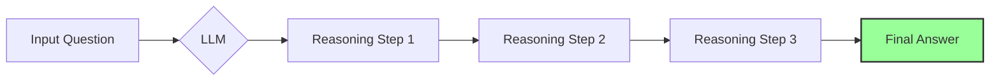
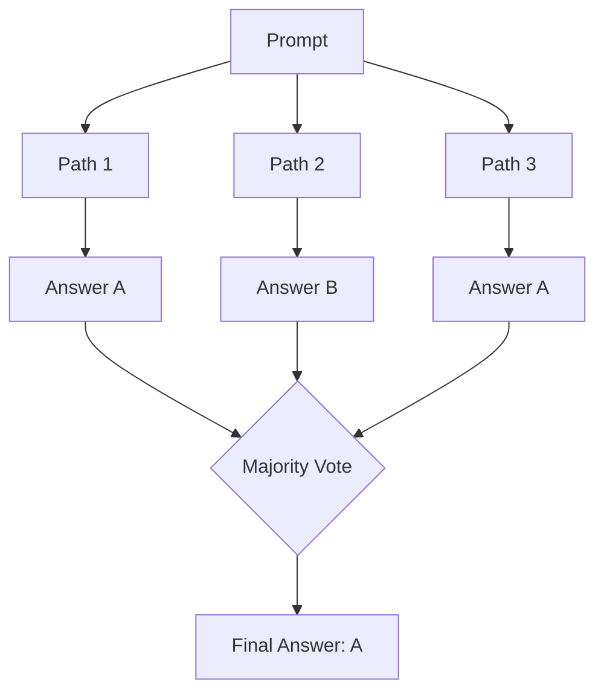
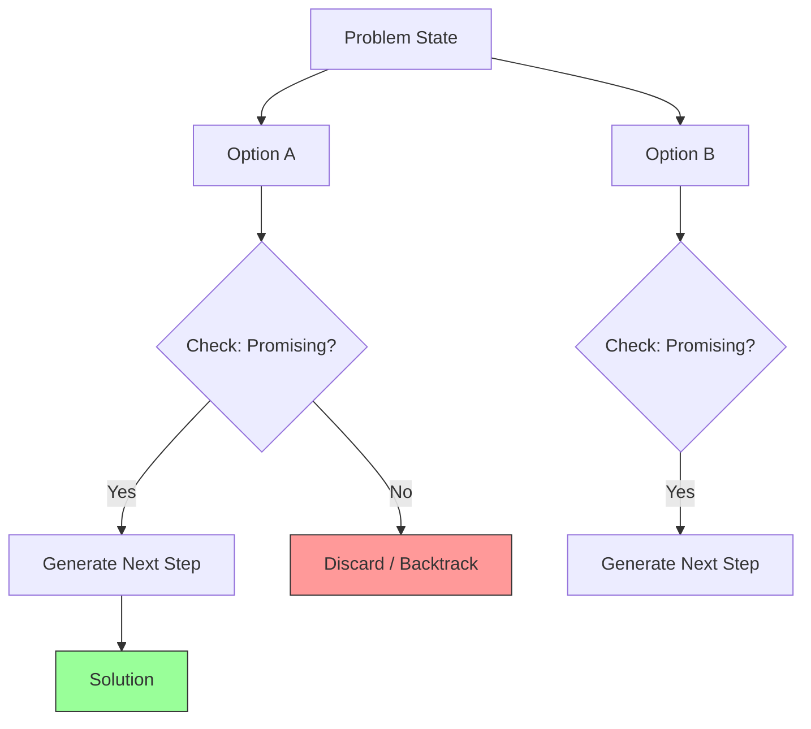
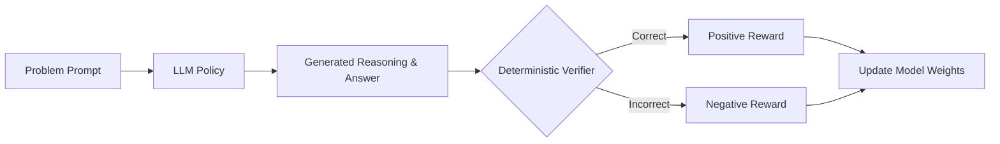
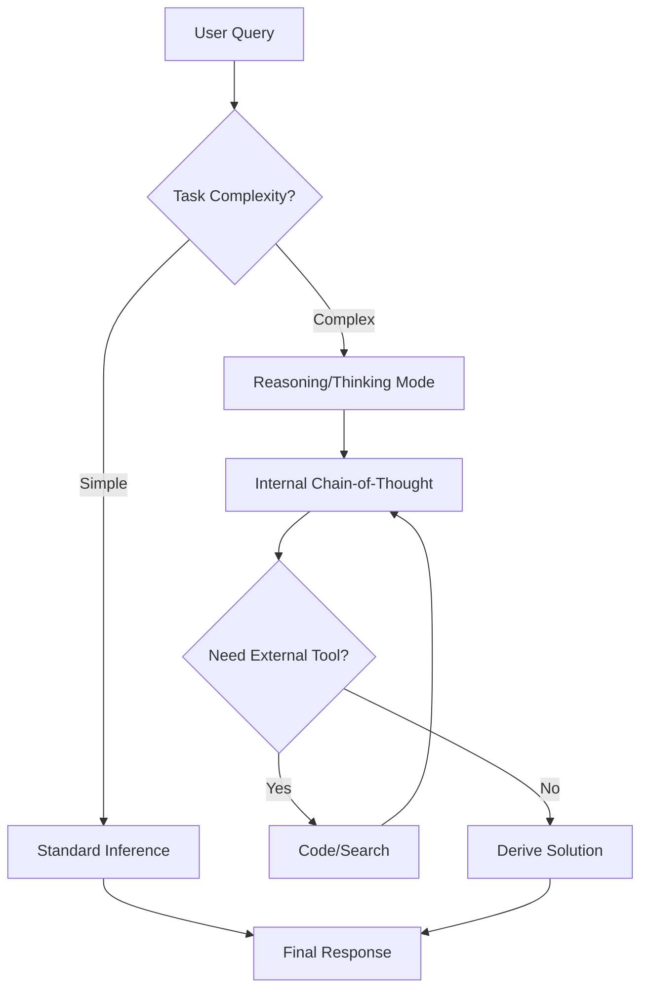

- [1 - Introduction: The Imperative for Reasoning in LLMs](#1---introduction-the-imperative-for-reasoning-in-llms)
	- [1.1 - Beyond Next-Token Prediction: The Limitations of Standard LLMs](#11---beyond-next-token-prediction-the-limitations-of-standard-llms)
	- [1.2 - Defining "Reasoning" in the Context of LLMs](#12---defining-reasoning-in-the-context-of-llms)
	- [1.3 - The Emergence of Chain-of-Thought as a Foundational Shift](#13---the-emergence-of-chain-of-thought-as-a-foundational-shift)
- [2 - Overview of Modern Reasoning Models and Architectures](#2---overview-of-modern-reasoning-models-and-architectures)
- [3 - Foundational Techniques for Eliciting Reasoning](#3---foundational-techniques-for-eliciting-reasoning)
	- [3.1 - Chain-of-Thought (CoT): Decomposing Complexity](#31---chain-of-thought-cot-decomposing-complexity)
	- [3.2 - Self-Consistency: Enhancing Robustness through Consensus](#32---self-consistency-enhancing-robustness-through-consensus)
- [4 - Advanced Reasoning Frameworks and Strategies](#4---advanced-reasoning-frameworks-and-strategies)
	- [4.1 - Tree of Thoughts (ToT): Non-Linear Problem Exploration](#41---tree-of-thoughts-tot-non-linear-problem-exploration)
	- [4.2 - Mitigating Latency and Cost: Efficiency-Focused Methods](#42---mitigating-latency-and-cost-efficiency-focused-methods)
	- [Table 1: A Comparative Overview of Core Reasoning Techniques](#table-1-a-comparative-overview-of-core-reasoning-techniques)
- [5 - The Modern Reasoning Model: Training Paradigms and Architectures](#5---the-modern-reasoning-model-training-paradigms-and-architectures)
	- [5.1 - The Shift to Reinforcement Learning (RL)](#51---the-shift-to-reinforcement-learning-rl)
	- [5.2 - Case Studies in RL-Trained Models](#52---case-studies-in-rl-trained-models)
	- [5.3 - Architectures for Inference-Time Reasoning](#53---architectures-for-inference-time-reasoning)
- [6 - Comparative Performance Analysis](#6---comparative-performance-analysis)
	- [6.1 - Performance on Core Reasoning Benchmarks](#61---performance-on-core-reasoning-benchmarks)
	- [Table 2: Performance of State-of-the-Art Reasoning Models on Key Benchmarks](#table-2-performance-of-state-of-the-art-reasoning-models-on-key-benchmarks)
	- [6.2 - Multilingual Reasoning Capabilities](#62---multilingual-reasoning-capabilities)
	- [6.3 - Reasoning vs. Non-Reasoning Models: A Qualitative Comparison](#63---reasoning-vs-non-reasoning-models-a-qualitative-comparison)
- [7 - Critical Evaluation: Advantages, Disadvantages, and Future Directions](#7---critical-evaluation-advantages-disadvantages-and-future-directions)
	- [7.1 - The Cost-Capability Trade-Off](#71---the-cost-capability-trade-off)
	- [7.2 - The Specialisation vs. Generalisation Dilemma](#72---the-specialisation-vs-generalisation-dilemma)
- [8 - Future Outlook](#8---future-outlook)
- [9 - Conclusion](#9---conclusion)
- [10 - References](#10---references)

# 1 - Introduction: The Imperative for Reasoning in LLMs

## 1.1 - Beyond Next-Token Prediction: The Limitations of Standard LLMs

**Standard Large Language Models (LLMs)**, architecturally rooted in the Transformer model, are fundamentally trained on the objective of next-token prediction. This process, which involves predicting the next word in a sequence based on the preceding context from vast datasets, enables these models to achieve remarkable fluency, generate coherent text, and recall a wide array of factual information. However, this core competency, while powerful for language-centric tasks, proves insufficient for problems that demand multi-step, logical deduction. When confronted with tasks in domains such as arithmetic, commonsense reasoning, and symbolic manipulation, a model that simply predicts the most statistically probable next word often fails to construct a valid solution path.

This limitation is empirically demonstrated by the phenomenon of "flat scaling curves" for reasoning tasks. While increasing a model's parameter count generally improves performance on many language tasks, for complex reasoning, simply making the model larger does not yield significant gains without a fundamental shift in methodology. This indicates that the capability for complex reasoning is not an automatic byproduct of scale in standard architectures; it must be explicitly elicited or engineered.

## 1.2 - Defining "Reasoning" in the Context of LLMs

For the purposes of this report, **"reasoning"** in the context of LLMs is defined as the model's ability to decompose a complex problem into a coherent series of intermediate steps that logically lead to a final, correct conclusion. This process is typically externalised as a sequence of natural language text, which serves to mimic the structured, deliberate problem-solving processes observed in humans. This externalisation is not merely an explanation of the answer but is integral to the process of deriving the answer itself, allowing the model to allocate additional computation to the problem by generating a longer, more detailed sequence of thought.

## 1.3 - The Emergence of Chain-of-Thought as a Foundational Shift

The field of LLM reasoning underwent a significant transformation with the introduction of **Chain-of-Thought (CoT)** prompting. This technique was the first to reliably "unlock" the latent reasoning abilities of sufficiently large models. Researchers discovered that by providing a model with a few examples (or "exemplars") of problems being solved in a step-by-step manner, the model could be prompted to generate its own reasoning paths for new, unseen problems. This simple method led to dramatic performance improvements on a range of tasks that were previously considered intractable for LLMs, marking a pivotal moment in the development of more capable AI systems. The success of CoT demonstrated that reasoning was an emergent property of scale that could be elicited with the right approach, setting the stage for more advanced research into how these capabilities could be further enhanced and controlled.

**Standard Prompting**

**Chain-of-Thought Prompting**

# 2 - Overview of Modern Reasoning Models and Architectures

The landscape of LLM reasoning has evolved rapidly beyond the initial paradigm of CoT prompting. A new class of specialised "reasoning models" has emerged, developed by leading research labs. This includes open-source models such as **DeepSeek R1**, **Mistral's Magistral**, and **Alibaba's Qwen** series, as well as proprietary, state-of-the-art systems like **Google's Gemini 2.5 Pro** and **Anthropic's Claude 4.5**.

These modern systems represent a fundamental shift from merely eliciting reasoning through prompts to explicitly training for it as a core capability. Many of these models are fine-tuned using advanced techniques like **Reinforcement Learning (RL)**, where the model is directly rewarded for generating correct and coherent reasoning paths. Furthermore, some feature dedicated architectural modes for "thinking" or "extended reasoning", which allow them to dynamically allocate more computational resources at inference time to tackle complex problems. This evolution signifies a move from treating reasoning as an emergent behaviour of generalist models to engineering it as a primary, optimised function of specialist systems, creating a bifurcation in the field between models optimised for speed and cost and those optimised for accuracy and deliberation.

# 3 - Foundational Techniques for Eliciting Reasoning

## 3.1 - Chain-of-Thought (CoT): Decomposing Complexity

The theoretical foundation of Chain-of-Thought prompting is rooted in the observation of human cognitive processes, where individuals often break down complex problems into a series of smaller, more manageable steps to arrive at a solution. When applied to LLMs, CoT prompting encourages the model to externalise this process, generating a sequence of intermediate reasoning steps in natural language before providing the final answer. This approach reframes the inference task for the model. Instead of making a single, high-difficulty cognitive leap from a problem directly to its solution, the model is guided to perform a series of simpler, incremental predictions. Each step in the chain is a more straightforward next-token prediction task based on the context of the problem and the preceding steps, a process for which the model is well-optimised through its pre-training. In essence, CoT works by decomposing one hard inference problem into a sequence of easier ones, thereby allowing the model to effectively allocate more computation to the task by generating more tokens.

Two primary strategies are used to implement CoT:

  * **Few-shot CoT:** This is the most common and robust method. The model is provided with a few examples, or exemplars, within the prompt. Each exemplar consists of a question, a detailed step-by-step reasoning chain that solves it, and the final answer. The model then uses these examples as a template to generate its own reasoning for a new question.
  * **Zero-shot CoT:** This simpler technique does not require hand-crafted examples. Instead, a simple directive such as "Think step by step" is appended to the user's question. For sufficiently capable models, this instruction is often enough to trigger the generation of a reasoning chain, albeit sometimes less reliably than the few-shot approach.

A critical finding is that CoT reasoning is an emergent property of model scale. Experiments have consistently shown that the performance benefits of CoT only manifest in models with a sufficient number of parameters, typically around 100 billion or more. When applied to smaller models, the technique is not only ineffective but can actually degrade performance, as these models may produce fluent-sounding but logically flawed or incoherent reasoning chains.

## 3.2 - Self-Consistency: Enhancing Robustness through Consensus

While CoT significantly improves reasoning, its reliance on a single, greedily decoded output path makes it brittle. An auto-regressive model generates tokens sequentially, and a single error early in the reasoning chain (a miscalculation or a logical flaw) can propagate and corrupt the entire subsequent generation, leading to an incorrect final answer. Self-consistency is a decoding strategy designed to mitigate this fundamental failure mode.

Instead of generating a single answer, self-consistency leverages a sampling-based approach. By setting a non-zero temperature during decoding, it prompts the model to generate multiple, diverse reasoning paths for the same problem. The core intuition is that while a complex problem may have many different valid ways to be solved, they should all converge to the same unique, correct answer. After generating a set of diverse reasoning paths and their corresponding answers, the final answer is determined by a majority vote.

This method acts as an ensemble at the decoding stage. It reduces the probability that a single, random error in one generation path will dictate the final outcome. The majority vote implicitly assumes that the model is more likely to generate correct paths than any single specific incorrect path. Even if many of the generated paths are flawed, they are likely to be flawed in different ways, leading to a variety of incorrect answers. The correct paths, however, should all produce the same correct answer, making it the most frequent and thus the most likely to be chosen. This approach has been shown to yield substantial performance improvements over standard CoT on various benchmarks, including a **+17.9%** gain on GSM8K and a **+11.0%** gain on SVAMP.

The effectiveness of self-consistency comes with an inherent trade-off. It sacrifices the speed and efficiency of a single generation for the robustness and error-correction properties of an ensemble. The increased computational cost is a necessary feature of this technique, not an incidental one. Furthermore, theoretical analysis reveals that while self-consistency reduces model error by exploring multiple solution pathways, it can be subject to high estimation error, requiring a large number of samples to ensure the correct answer emerges as the most frequent one, which further exacerbates the computational burden.

# 4 - Advanced Reasoning Frameworks and Strategies

The progression of reasoning techniques in LLMs reflects a growing sophistication, moving from simple linear methods to more complex, structured approaches that better emulate human problem-solving. This evolution mirrors the history of classical AI search algorithms, advancing from simple traversals to more robust, heuristic-guided exploration.

## 4.1 - Tree of Thoughts (ToT): Non-Linear Problem Exploration

The Chain-of-Thought method explores a single, linear path of reasoning. This is analogous to a greedy, depth-first search with no mechanism for backtracking. While effective for problems that are largely sequential and decomposable, this linear approach is brittle when faced with tasks that require planning, exploration, or recovery from early mistakes.

**Tree of Thoughts (ToT)** introduces a more powerful paradigm by conceptualising problem-solving as a search through a tree of possibilities. This aligns more closely with human cognition, where individuals often consider multiple lines of reasoning, evaluate their potential, and abandon unpromising paths to explore alternatives. The ToT framework explicitly integrates the machinery of classical AI search with the generative capabilities of LLMs, creating a hybrid system that is more robust for complex problem-solving.

The core components of the ToT framework include:

  * **A prompter agent** that uses the LLM to generate multiple potential next steps, or "thoughts", from the current state in the problem-solving process.
  * **A checker module** that evaluates the generated thoughts. This module acts as a heuristic function, assessing the validity of a step (e.g., in a Sudoku puzzle) or its perceived promise in leading towards a solution.
  * **A ToT controller** that manages the search process. It employs a search algorithm, such as breadth-first search (BFS) or depth-first search (DFS), to navigate the tree of thoughts, deciding which branches to explore further.

The most crucial feature of ToT is its ability to backtrack. If a reasoning path is deemed invalid by the checker or fails to make progress, the controller can discard that branch and return to a previous node in the tree to explore an alternative path. This capacity for systematic exploration and error correction allows ToT to solve complex planning and puzzle-like tasks, such as the Game of 24, that are often intractable for linear CoT methods.

## 4.2 - Mitigating Latency and Cost: Efficiency-Focused Methods

The initial wave of reasoning techniques, including CoT, Self-Consistency, and ToT, focused primarily on maximising accuracy, often at the cost of significant computational overhead. While successful in research settings, the high latency and token consumption of these methods present major barriers to their practical application in real-world, production environments. This has spurred a second wave of innovation focused on optimising the efficiency of the reasoning process.

Two notable efficiency-focused methods are:

  * **Chain of Draft (CoD):** This technique directly addresses the verbosity and high token cost of standard CoT. It is inspired by the human tendency to jot down only essential intermediate results or "drafts" when solving a problem, rather than writing out a full prose explanation at each step. CoD prompts the model to generate minimalistic yet informative reasoning outputs that capture the key steps and intermediate values. Experiments show that this approach can significantly reduce latency and cost, often without any loss in accuracy, by challenging the assumption that more verbose reasoning is always better.
  * **Confidence-Informed Self-Consistency (CISC):** This method targets the high computational cost of the self-consistency technique, which requires generating a large number of sample paths to be effective. CISC introduces an additional step where, after generating each reasoning path, the model is prompted to evaluate its confidence in the correctness of that path. The final answer is then determined through a weighted majority vote, where paths with higher confidence scores are given more weight. This allows the system to converge on the correct answer with significantly fewer samples. On average, CISC can achieve accuracy comparable to standard self-consistency while reducing the required number of reasoning paths by over 40%.

These optimisation techniques are critical for making advanced reasoning capabilities practical and scalable. They suggest a future where reasoning systems may employ a portfolio of strategies, dynamically selecting between high-accuracy, high-cost methods for difficult problems and high-efficiency, low-cost methods for simpler ones.

## Table 1: A Comparative Overview of Core Reasoning Techniques

| Technique                  | Core Mechanism                                                                               | Key Advantage                                                       | Key Disadvantage                                                           |
| :------------------------- | :------------------------------------------------------------------------------------------- | :------------------------------------------------------------------ | :------------------------------------------------------------------------- |
| **Chain-of-Thought (CoT)** | Generates a single, linear sequence of intermediate reasoning steps before the final answer. | Improves accuracy on complex tasks; provides some interpretability. | Prone to compounding errors; can be verbose and computationally expensive. |
| **Self-Consistency**       | Samples multiple diverse reasoning paths and selects the final answer via a majority vote.   | Significantly improves robustness and accuracy over standard CoT.   | High computational cost and latency due to generating many samples.        |
| **Tree of Thoughts (ToT)** | Explores a tree of possible reasoning steps, with evaluation and backtracking capabilities.  | Can solve complex planning problems intractable for linear methods. | Very high computational overhead due to search complexity.                 |

# 5 - The Modern Reasoning Model: Training Paradigms and Architectures

The latest generation of reasoning models has moved beyond relying solely on prompting techniques applied to general-purpose LLMs. Instead, these models are now explicitly trained and architected for complex reasoning. This section explores the key training paradigms and architectural innovations that define the state-of-the-art.

## 5.1 - The Shift to Reinforcement Learning (RL)

While **Supervised Fine-Tuning (SFT)** on datasets of CoT examples can improve a model's reasoning abilities, this approach has limitations. SFT is constrained by the static nature and quality of the dataset, and creating large-scale, high-quality human-annotated reasoning datasets is prohibitively expensive and time-consuming. **Reinforcement Learning (RL)** offers a more dynamic and scalable paradigm. In an RL framework, the model learns through exploration and trial-and-error, receiving feedback on its generated reasoning paths and adjusting its internal policy to maximise a reward signal.

A key innovation that has made RL particularly effective for reasoning tasks is **Reinforcement Learning from Verifiable Rewards (RLVR)**. Traditional RL for LLMs often uses **Reinforcement Learning from Human Feedback (RLHF)**, which requires training a separate reward model to predict human preferences (a process that can be noisy, biased, and computationally intensive). RLVR bypasses this by using a reward signal from a deterministic, objective verifier. For mathematical reasoning, the verifier simply checks if the model's final answer is correct. For coding tasks, the verifier can be a set of unit tests that the generated code must pass. This provides a clear, scalable, and ground-truth-aligned reward signal, allowing the model to autonomously explore the problem space and discover novel, correct reasoning paths that may not exist in any SFT dataset. This direct connection to ground truth represents a significant step towards more autonomous learning systems.

[Image of Reinforcement Learning from Verifiable Rewards pipeline]

To implement this training, models like DeepSeek and Magistral have adopted efficient policy optimisation algorithms. **Group Relative Policy Optimisation (GRPO)** is a notable example. It streamlines the RL process by eliminating the need for a separate critic or value model, which is typically required in actor-critic methods to estimate the value of states. Instead, GRPO samples multiple responses from the model for a given prompt and calculates the advantage for each response based on its reward relative to the average reward of the group. This simplification significantly reduces the computational overhead and memory requirements of the training process.

## 5.2 - Case Studies in RL-Trained Models

The effectiveness of these RL-based training paradigms is best illustrated through the development of recent open-source reasoning models.

  * **DeepSeek R1:** The DeepSeek R1 family provides a clear demonstration of the power of RL for incentivising reasoning.
    The initial model, DeepSeek-R1-Zero, was trained using a pure RLVR approach directly from the base model, with no initial SFT on reasoning data. This experiment proved that sophisticated reasoning behaviours, such as self-verification (revisiting and checking intermediate steps) and reflection (critiquing and refining its own process), could emerge autonomously through RL. During its training, the model's performance on the AIME 2024 benchmark increased from a baseline of 15.6% pass@1 to an impressive 71.0%.
    The flagship DeepSeek-R1 model builds upon this foundation with a more refined, multi-stage training pipeline. It begins with a "cold start", where the base model is first fine-tuned on a small set of high-quality, human-friendly CoT examples to improve readability and stabilise the initial RL process. This is followed by large-scale RL focused on reasoning tasks, and then further stages of SFT and RL for general alignment and safety.

  * **Mistral Magistral:** This model family was developed with the explicit goal of creating a reasoning model from the ground up using Mistral's own scalable RL pipeline, avoiding distillation from other proprietary models.
    Magistral Medium was trained using pure RL on top of the existing Mistral Medium 3 model. This process alone resulted in a 50% increase in its pass@1 score on the AIME 2024 benchmark.
    A core design principle for Magistral was to ensure high-fidelity multilingual reasoning. To achieve this, the RL training data included math and coding problems translated into several languages (including French, Spanish, German, and Chinese). A language consistency reward was added to the objective function, incentivising the model to generate its reasoning chain and final answer in the same language as the user's prompt.

## 5.3 - Architectures for Inference-Time Reasoning

Alongside innovations in training, a parallel trend has emerged in designing model architectures that can dynamically allocate computational resources at inference time. This reconceptualises the model from a static function that performs a fixed forward pass to a dynamic solver that can expend more effort on more difficult problems.

  * **Gemini 2.5 Pro:** This model from Google features a natively integrated internal "thinking process". When faced with a complex query, the model can perform tens of thousands of additional inference-time forward passes to explore the problem space more thoroughly before generating a response. This process is adaptive; the model assesses the complexity of a task and calibrates the amount of thinking accordingly. Developers are also given control over this capability through a "thinking budget", which allows them to balance the trade-off between performance and cost/latency for their specific application.

  * **Claude 4:** Anthropic's Claude 4 is explicitly designed as a hybrid model with two distinct operational modes: a standard mode for fast, near-instant responses and an "extended thinking mode" for deep reasoning. When in extended thinking mode, the model can utilise a significantly larger internal processing capacity (up to 64,000 tokens) to work through complex problems. Crucially, this mode also allows the model to alternate between internal deliberation and the use of external tools, such as a web search or a code interpreter, creating a powerful, iterative problem-solving loop.

<!-- end list -->

These architectural advancements represent a significant step forward. They allow for a more intelligent and efficient allocation of computational resources, enabling state-of-the-art performance on challenging problems where the extra compute is justified, while remaining fast and cost-effective for simpler queries where it is not. This marks a shift towards models that possess not just knowledge, but also a policy for how to effectively apply that knowledge.

# 6 - Comparative Performance Analysis

Evaluating the capabilities of modern reasoning models requires a multi-faceted approach, encompassing standardised benchmarks for core reasoning skills, assessments of multilingual proficiency, and a qualitative comparison of their operational characteristics.

## 6.1 - Performance on Core Reasoning Benchmarks

A suite of standardised benchmarks has been established to quantitatively measure and compare the reasoning abilities of LLMs. Key benchmarks in this domain include:

  * **GSM8K (Grade School Math 8K):** A dataset of high-quality, linguistically diverse math word problems designed for grade-school level, which typically require 2 to 8 steps of arithmetic reasoning to solve.
  * **MATH:** A more challenging dataset of competition mathematics problems, covering topics from pre-algebra to calculus, designed to test advanced mathematical problem-solving skills.
  * **AIME (American Invitational Mathematics Examination):** A high-school Olympiad-level mathematics competition used as a benchmark for advanced, multi-step reasoning capabilities.
  * **BBH (Big-Bench Hard):** A challenging subset of tasks from the BIG-Bench suite specifically selected to push the limits of current LLMs on complex reasoning problems.

The performance of leading models on these benchmarks reveals a highly competitive landscape, where the top proprietary and open-source models achieve comparable, state-of-the-art results.

## Table 2: Performance of State-of-the-Art Reasoning Models on Key Benchmarks

| Model                     | AIME 2024 (pass@1)         | MATH (pass@1) | GSM8K | BBH   |
| :------------------------ | :------------------------- | :------------ | :---- | :---- |
| **DeepSeek R1**           | 79.8%                      | 97.3%         | -     | -     |
| **Magistral Medium**      | 73.6% (90.0% maj@64)       | 94.3%         | -     | -     |
| **Magistral Small**       | 70.7% (83.3% maj@64)       | 95.9%         | -     | -     |
| **Gemini 2.5 Pro**        | 88.0% (AIME 2025)          | -             | -     | -     |
| **Claude 4 Opus**         | 75.5% (90.0% high-compute) | -             | -     | -     |
| **Qwen2-72B (Base)**      | -                          | 51.1%         | 89.5% | 82.4% |
| **GPT-4 (for reference)** | -                          | -             | 92.0% | -     |

> *Note: Dashes (-) indicate data not prominently featured in the provided technical reports for that specific benchmark. Scores may reflect different model versions or evaluation settings (e.g., AIME 2024 vs. 2025) as specified. maj@64 refers to accuracy with majority voting over 64 samples.*

The data in Table 2 highlights a crucial aspect of modern reasoning evaluation: a model's performance is not a single, static number. The inclusion of metrics like **maj@64** for Magistral and **"high-compute"** for Claude 4 demonstrates that peak reasoning capability is often a function of both the model's intrinsic parameters and the amount of computational effort applied at inference time. Techniques like self-consistency or extended thinking modes allow users to move along a performance curve, trading additional latency and cost for higher accuracy. This underscores that the "capability" of a model is best understood as a performance range rather than a single point score.

## 6.2 - Multilingual Reasoning Capabilities

As LLMs become more globally deployed, their ability to reason effectively across multiple languages is a critical area of evaluation. Several leading models have been explicitly trained to address this challenge. The **Qwen2** series, for example, was pre-trained on a diverse corpus spanning approximately 30 languages. **Mistral's Magistral** model incorporated translated math and coding problems into its RL training data and used a language consistency reward to ensure it could reason natively in languages like French, Spanish, and German.

Despite these dedicated efforts, empirical results show that a performance gap often persists between high-resource languages like English and others. The technical report for Magistral Medium, for instance, notes that its performance on translated versions of the AIME 2024 benchmark drops by 4.3% to 9.9% compared to its English performance. Similarly, the DeepSeek R1 report states that the model is primarily optimised for English and Chinese and may exhibit **"language mixing"** when prompted in other languages. This persistent gap suggests that reasoning in current LLMs is not a purely abstract, language-agnostic skill. Instead, it appears to be deeply entangled with the specific linguistic patterns and knowledge distributions present in the pre-training data. The model may learn to associate certain phrasings or structures in English with specific logical or mathematical operations, and this learned association does not always transfer perfectly to other languages, even with dedicated multilingual fine-tuning.

## 6.3 - Reasoning vs. Non-Reasoning Models: A Qualitative Comparison

The emergence of specialised reasoning models has created a distinction between them and more general-purpose, "non-thinking" models. This distinction can be understood across several qualitative dimensions:

  * **Output Characteristics:** Reasoning models are designed to produce verbose, step-by-step outputs that expose their thought process. This makes their conclusions more interpretable and verifiable but also results in higher latency and token costs. In contrast, non-reasoning models are optimised for speed and conciseness, providing direct answers without an explicit rationale, which can make them feel more like a "black box".
  * **Task Suitability:** The two types of models are suited for different tasks. Reasoning models excel at complex, ambiguous, or multi-step problems that require deep analysis, logical deduction, and planning. This includes domains like advanced mathematics, strategic planning, and complex code generation. Non-reasoning models are generally a better choice for tasks where speed and cost are the primary considerations and the task itself is straightforward, such as text summarization, content classification, or simple question-answering.
  * **Reliability and Accuracy:** For high-stakes applications where correctness is non-negotiable, reasoning models are typically more reliable. The explicit generation of a thought process acts as a form of self-regulation, reducing the likelihood of unforced errors and allowing for human verification of the model's logic.

# 7 - Critical Evaluation: Advantages, Disadvantages, and Future Directions

While modern reasoning models represent a significant leap forward in AI capabilities, their adoption involves a series of critical trade-offs and unresolved challenges. A comprehensive evaluation must consider not only their enhanced performance but also their costs, limitations, and the broader implications for AI development.

## 7.1 - The Cost-Capability Trade-Off

The primary advantage of reasoning models is a dramatic improvement in accuracy and reliability on complex tasks that are beyond the reach of standard LLMs. A secondary but crucial benefit is the enhanced interpretability offered by the explicit generation of a reasoning chain. This "thinking" process provides a window into the model's methodology, allowing users to verify its logic, identify potential errors, and build greater trust in its conclusions.

However, these benefits come at a significant cost. The most immediate disadvantage is the increased computational overhead and latency. Generating long, verbose reasoning chains consumes a substantial number of tokens, which directly translates to higher API costs and slower response times. One analysis found that invoking reasoning capabilities can increase the number of tokens generated at inference by as much as 300%. This makes these models less suitable for real-time or high-throughput applications. Furthermore, the output can be excessively verbose, including details and conversational filler that are irrelevant to the core logic of the solution.

It is also important to approach the "interpretability" of CoT with a degree of scepticism. The reasoning path and the final answer are generated together as a single, coherent text sequence. There is no inherent guarantee that the generated text reflects the actual causal process by which the model arrived at the answer. It is plausible that in some cases, the model intuits an answer through its internal, non-verbalised processes and then generates a post-hoc rationalisation that appears logical. If the reasoning is merely a justification rather than the derivation, its value for debugging and true transparency is diminished, as it may mask the real source of an error.

## 7.2 - The Specialisation vs. Generalisation Dilemma

A more subtle but profound trade-off has emerged between specialisation in reasoning and general-purpose utility. Early assumptions in LLM development often followed a "more is more" logic, where improving a model along one capability axis was expected to yield broad benefits. However, recent research indicates that this is not always the case. Systematic evaluations have revealed that training models extensively for deliberative reasoning can lead to a significant degradation in their foundational capabilities, including general helpfulness (e.g., following nuanced conversational instructions) and harmlessness. The internal "thoughts" generated by a reasoning model can be measurably more likely to contain unsafe or biased content than its final, user-facing response.

This finding suggests that "intelligence" in AI is not a monolithic quality but rather a collection of potentially competing capabilities. Optimising the model's parameters for one complex cognitive skill may come at the expense of others. This dilemma is the primary motivation for the development of adaptive reasoning architectures. Models like Gemini 2.5 Pro and Claude 4, with their hybrid modes, are a direct response to this challenge. By allowing the model to dynamically switch between a fast, generalist mode and a slow, specialist reasoning mode, they can offer the best of both worlds. Modes like "Zero-Thinking" or "Summary-Thinking" can be employed to bypass or streamline the reasoning process for tasks where it is unnecessary or even detrimental, preserving the model's general utility while making its powerful reasoning capabilities available on demand.

# 8 - Future Outlook

The field of LLM reasoning is advancing rapidly, with several key trends shaping its future trajectory.

  * **Integration with External Tools:** The next frontier lies in the seamless integration of internal reasoning with the ability to use external tools. A model that can reason about when it needs more information and then autonomously use a web search API, or verify a calculation using a code interpreter, is far more powerful than one limited to its internal knowledge. Claude 4's extended thinking mode, which allows the model to alternate between internal deliberation and tool use, is a prime example of this direction.
  * **The Pursuit of Verifiable and Causally-Grounded Reasoning:** While current models are becoming adept at generating text that mimics the structure of logical reasoning, a key challenge is ensuring that this reasoning is factually correct, logically sound, and grounded in a causal understanding of the world. The use of automated verifiers in RLVR is a significant step towards ensuring correctness. However, the ultimate goal is to move beyond sophisticated pattern matching to develop models that possess a deeper, more robust understanding of the concepts they are manipulating.

# 9 - Conclusion

The journey of Large Language Models from simple next-token predictors to sophisticated reasoning engines marks a pivotal chapter in the history of artificial intelligence. The initial breakthrough of Chain-of-Thought prompting revealed that the vast neural networks of LLMs contained latent capabilities for complex problem-solving, which could be elicited through careful guidance. This discovery catalysed a paradigm shift, moving the field from simply prompting for reasoning to explicitly training for it as a core function.

The current state-of-the-art is defined by a new class of specialised reasoning models, such as DeepSeek R1, Mistral Magistral, Gemini 2.5 Pro, and Claude 4. These systems are no longer just generalists responding to clever prompts; they are purpose-built for deliberation. Their development is driven by advanced training methodologies like Reinforcement Learning from Verifiable Rewards (RLVR), which allows for more autonomous and scalable learning, and they feature innovative architectures that permit the dynamic allocation of computational resources at inference time. This has led to remarkable performance on challenging benchmarks in mathematics, coding, and logic, often reaching or exceeding human expert levels.

However, this progress has been accompanied by a set of fundamental trade-offs. The enhanced accuracy and interpretability of these models come at the cost of significantly increased computational expense and latency. More profoundly, the intense specialisation required for high-level reasoning can degrade a model's foundational capabilities in general conversation and safety, revealing that intelligence in AI is not a monolithic quality. The emergence of hybrid models with adaptive "thinking modes" is a direct and necessary response to this specialisation-generalisation dilemma.

Looking forward, the field is moving towards creating more integrated and verifiable systems. The future of AI reasoning lies in models that can seamlessly combine their internal deliberation with the use of external tools, grounding their thought processes in real-world data and verifiable computation. While the progress to date has been extraordinary, achieving robust, efficient, and truly grounded reasoning remains a frontier challenge, promising to drive the next wave of innovation in artificial intelligence.

# 10 - References

  * An, Y., Yang, B., Zhang, B., Hui, B., Zheng, B., Yu, B., Li, C., Liu, D., Huang, F., Wei, H., et al. (2024). Dual Chunk Attention.
  * Bai, J., Bai, S., Chu, Y., Cui, Z., Dang, K., Deng, X., Dong, Y., Fan, T., Ge, W., Han, X., et al. (2023a). Qwen technical report.
  * Bavarian, M., et al. (2022). Efficient training of language models to fill in the middle.
  * Brown, T., Mann, B., Ryder, N., Subbiah, M., Kaplan, J. D., Dhariwal, P.,... & Amodei, D. (2020). Language models are few-shot learners.
  * Chen, M., Tworek, J., Jun, H., Yuan, Q., Pinto, H. P. d. O., Kaplan, J.,... & Zaremba, W. (2021). Evaluating large language models trained on code.
  * Guo, Q., et al. (2025). DeepSeek-R1: Incentivising Reasoning Capability in LLMs via Reinforcement Learning.
  * Hendrycks, D., Burns, C., Kadavath, S., Arora, A., Basart, S., Jones, E.,... & Steinhardt, J. (2021). Measuring mathematical problem solving with the MATH dataset.
  * Long, J. (2023). Large Language Model Guided Tree-of-Thought. arXiv:2305.08291.
  * Mistral-AI, Rastogi, A., et al. (2025). Magistral. arXiv:2506.10910.
  * OpenAI. (2023). GPT-4 Technical Report. arXiv:2303.08774.
  * OpenAI. (2024). OpenAI o1.
  * Qwen Team. (2024a). Qwen1.5 technical report.
  * Snell, C., et al. (2024). Learning to reason with process supervision.
  * Taubenfeld, A., Sheffer, T., Ofek, E., Feder, A., Goldstein, A., Gekhman, Z., & Yona, G. (2025). Confidence Improves Self-Consistency in LLMs. arXiv:2502.06233.
  * Vaswani, A., Shazeer, N., Parmar, N., Uszkoreit, J., Jones, L., Gomez, A. N.,... & Polosukhin, I. (2017). Attention is all you need.
  * Wang, X., Wei, J., Schuurmans, D., Le, Q., Chi, E., Narang, S.,... & Zhou, D. (2022). Self-consistency improves chain of thought reasoning in language models.
  * Wang, X., & Zhou, D. (2024). Chain-of-Thought Reasoning Without Prompting. arXiv:2402.10200.
  * Wei, J., Wang, X., Schuurmans, D., Bosma, M., Chi, E., Le, Q., & Zhou, D. (2022). Chain-of-thought prompting elicits reasoning in large language models.
  * Yao, S., Zhao, H., Yu, D., Du, N., Shafran, I., Narasimhan, K., & Cao, Y. (2023). Tree of Thoughts: Deliberate Problem Solving with Large Language Models.
  * Zhou, Z., et al. (2025). Bridging Internal Probability and Self-Consistency for Effective and Efficient LLM Reasoning. arXiv:2502.00511.