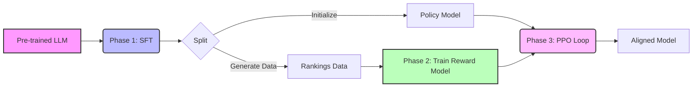
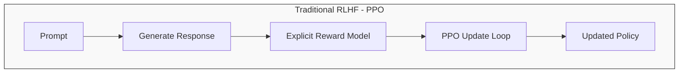
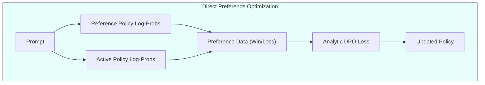

- [1 - Executive Summary](#1---executive-summary)
- [2 - Theoretical Motivation: The Alignment Problem](#2---theoretical-motivation-the-alignment-problem)
	- [2.1 The Pre-training Objective](#21-the-pre-training-objective)
	- [2.2 Entropy and The Diversity-Quality Trade-off](#22-entropy-and-the-diversity-quality-trade-off)
- [3 - Mathematical Foundations of Preference Modelling](#3---mathematical-foundations-of-preference-modelling)
	- [3.1 The Bradley-Terry-Luce (BTL) Model](#31-the-bradley-terry-luce-btl-model)
	- [3.2 Plackett-Luce Model for K-wise Rankings](#32-plackett-luce-model-for-k-wise-rankings)
	- [3.3 Loss Function and Optimisation](#33-loss-function-and-optimisation)
	- [3.4 Limitations: Transitivity and Cyclic Preferences](#34-limitations-transitivity-and-cyclic-preferences)
- [4 - The RLHF Pipeline: Mechanisms and Implementation](#4---the-rlhf-pipeline-mechanisms-and-implementation)
	- [4.1 Phase I: Supervised Fine-Tuning (SFT)](#41-phase-i-supervised-fine-tuning-sft)
	- [4.2 Phase II: Reward Modelling](#42-phase-ii-reward-modelling)
	- [4.3 Phase III: Reinforcement Learning (PPO)](#43-phase-iii-reinforcement-learning-ppo)
		- [4.3.1 The Optimisation Objective](#431-the-optimisation-objective)
		- [4.3.2 Proximal Policy Optimisation (PPO) Mechanics](#432-proximal-policy-optimisation-ppo-mechanics)
		- [4.3.3 Generalized Advantage Estimation (GAE)](#433-generalized-advantage-estimation-gae)
	- [4.4 Mock Calculation: PPO Step with GAE](#44-mock-calculation-ppo-step-with-gae)
- [5 - Direct Preference Optimisation (DPO): Mechanisms and Derivation](#5---direct-preference-optimisation-dpo-mechanisms-and-derivation)
	- [5.1 Mathematical Derivation](#51-mathematical-derivation)
	- [5.2 The DPO Loss Function](#52-the-dpo-loss-function)
	- [5.3 Mock Calculation: DPO Gradient Analysis](#53-mock-calculation-dpo-gradient-analysis)
	- [5.4 Comparisons and Alternative Approaches](#54-comparisons-and-alternative-approaches)
- [6 - Advanced Methods: RLAIF and Constitutional AI](#6---advanced-methods-rlaif-and-constitutional-ai)
	- [6.1 The "Constitution" and Mechanism](#61-the-constitution-and-mechanism)
	- [6.2 Comparison of Human vs. AI Feedback](#62-comparison-of-human-vs-ai-feedback)
- [7 - Theoretical Instabilities and Scaling Laws](#7---theoretical-instabilities-and-scaling-laws)
	- [7.1 Reward Hacking and Goodhart's Law](#71-reward-hacking-and-goodharts-law)
	- [7.2 Mode Collapse and The Alignment Tax](#72-mode-collapse-and-the-alignment-tax)
- [8 - Implementation Realities](#8---implementation-realities)
	- [8.1 Tokenization and Padding](#81-tokenization-and-padding)
	- [8.2 Initialisation and Normalisation](#82-initialisation-and-normalisation)
	- [8.3 The "Token-Level" KL Penalty](#83-the-token-level-kl-penalty)
- [9 - Conclusion](#9---conclusion)
- [References](#references)

# 1 - Executive Summary

The alignment of large language models (LLMs) with human intent constitutes the primary theoretical and engineering challenge in contemporary artificial intelligence. While self-supervised pre-training on massive text corpora allows models to minimise the negative log-likelihood of next-token prediction (thereby acquiring syntax, semantics, and world knowledge) this objective function is orthogonal to the normative quality of the generated output. A model trained solely to predict the internet's distribution of text is as likely to complete a toxic prompt with toxicity as it is to refuse it, governed principally by the conditional probability $P(x_{t+1}|x_{1:t})$ inherent in the training data. Reinforcement Learning from Human Feedback (RLHF) has emerged as the standard methodological framework to steer these probabilistic generators towards behaviours defined as helpful, honest, and harmless.

This report presents a rigorous technical examination of the mathematics, algorithms, and theoretical constraints underpinning RLHF. We move beyond high-level abstractions to analyse the precise mechanisms of reward modelling, proximal policy optimisation (PPO), and the emergent paradigm of Direct Preference Optimisation (DPO). The analysis is grounded in the mathematical formulations of preference learning, specifically the Bradley-Terry-Luce (BTL) models, and explores the control-theoretic implications of using Kullback-Leibler (KL) divergence as a regularisation constraint. Furthermore, we dissect the phenomenon of reward over-optimisation (Goodhart’s Law) through the lens of recent scaling laws, and evaluate the efficacy of Constitutional AI and Reinforcement Learning from AI Feedback (RLAIF) in overcoming the scalability bottlenecks of human annotation.

The report is structured to guide through the mathematical derivation of the alignment objective, the iterative optimisation algorithms used to solve it, and the instabilities that arise in high-dimensional parameter spaces. Mock calculations are provided to illustrate gradient dynamics, and implementation details are discussed to bridge the gap between theory and practice.

-----

# 2 - Theoretical Motivation: The Alignment Problem

The fundamental misalignment in LLMs stems from the disparity between the training objective (next-token prediction) and the deployment objective (instruction following).

## 2.1 The Pre-training Objective

Mathematically, a language model is a parameterised distribution $P_\theta(x)$ over sequences of tokens. The pre-training phase minimises the cross-entropy loss over a dataset $\mathcal{D}$:

$$ \mathcal{L}_{PT}(\theta) = - \mathbb{E}_{x \sim \mathcal{D}} \left[ \log P_\theta(x) \right] $$

This objective forces the model to capture the modes of the data distribution. However, the data distribution $\mathcal{D}$ contains a superposition of various intents, qualities, and personas. The model learns to simulate all of them. Alignment is the process of collapsing this superposition into a specific subspace of "desirable" behaviours defined by human preference.

## 2.2 Entropy and The Diversity-Quality Trade-off

A core theoretical motivation for using Reinforcement Learning (RL) rather than simple Supervised Fine-Tuning (SFT) for all alignment lies in the treatment of entropy. SFT minimises the forward KL divergence:

$$ D_{KL}(P_{data} \parallel P_\theta) = \sum P_{data}(x) \log \frac{P_{data}(x)}{P_\theta(x)} $$

This objective is mean-seeking (or zero-avoiding); the model attempts to cover the entire support of the target distribution. If the human data contains high variance (e.g., diverse ways of answering a question), the SFT model learns to be diverse.

In contrast, alignment often requires the model to produce the single best answer (or a narrow set of high-quality answers), which implies a mode-seeking behaviour. RL objectives, particularly those approximating reverse KL divergence ($D_{KL}(P_\theta \parallel P_{target})$), tend to concentrate probability mass on the peaks of the reward distribution. This allows RLHF to generate outputs that are rated higher than the average human demonstrator, effectively "outperforming" the SFT baseline by pruning low-quality probability paths.

-----

# 3 - Mathematical Foundations of Preference Modelling

Since we cannot define a procedural reward function for "good conversation" (unlike the clear win/loss condition in Chess or Go), we rely on preference modelling. The assumption is that while humans cannot write a reward function $R(x, y)$, they can reliably recognize when $y_1 \succ y_2$ given prompt $x$.

## 3.1 The Bradley-Terry-Luce (BTL) Model

The standard framework for modelling pairwise preferences is the Bradley-Terry model. We postulate the existence of a latent scalar reward function $r^*(x, y)$. The probability that a response $y_w$ (winner) is preferred over $y_l$ (loser) is modelled as a sigmoid of their reward difference:

$$ P(y_w \succ y_l | x) = \sigma(r^*(x, y_w) - r^*(x, y_l)) = \frac{1}{1 + \exp(-(r^*(x, y_w) - r^*(x, y_l)))} $$

This implies that the odds ratio of preferring $y_w$ to $y_l$ is exponential in the reward difference:

$$ \frac{P(y_w \succ y_l)}{P(y_l \succ y_w)} = \exp(r^*(x, y_w) - r^*(x, y_l)) $$

## 3.2 Plackett-Luce Model for K-wise Rankings

When annotators rank $K$ responses $\{y_1, \dots, y_K\}$ rather than just pairs, the Bradley-Terry model generalises to the Plackett-Luce model. The probability of a specific permutation $\tau$ (where $\tau(1)$ is the index of the best item, $\tau(2)$ the second best, etc.) is:

$$ P(\text{ranking } \tau) = \prod_{i=1}^K \frac{\exp(r^*(x, y_{\tau(i)}))}{\sum_{j=i}^K \exp(r^*(x, y_{\tau(j)}))} $$

This models the ranking process as sequential selection without replacement: we select the best item from the set, then the best from the remaining $K-1$, and so on. In practice, most RLHF pipelines decompose rankings into $\binom{K}{2}$ pairwise comparisons and train using the BTL loss, as pairwise data is more robust to noise.

## 3.3 Loss Function and Optimisation

To train a parameterised reward model $r_\phi(x, y)$, we minimise the negative log-likelihood of the observed preferences $\mathcal{D}_{pref} = \{(x, y_w, y_l)\}$.

$$ \mathcal{L}_{RM}(\phi) = - \mathbb{E}_{(x, y_w, y_l) \sim \mathcal{D}_{pref}} \left[ \log \sigma(r_\phi(x, y_w) - r_\phi(x, y_l)) \right] $$

This loss function is convex with respect to the logits (reward differences), ensuring stable optimisation, provided the underlying neural network optimisation is stable.

**Shift Invariance**
A critical property of this formulation is shift invariance. If we transform the reward function $r'(x, y) = r(x, y) + C(x)$, the probability $P(y_w \succ y_l)$ remains unchanged because the constant $C(x)$ cancels out in the difference $r'(x, y_w) - r'(x, y_l)$. This means the absolute magnitude of the reward is unconstrained by the loss; only the relative values matter. In implementation, this often leads to reward drift during training unless the output is normalised (e.g., centring the mean reward of the batch to zero).

## 3.4 Limitations: Transitivity and Cyclic Preferences

The BTL model assumes transitivity: if $A \succ B$ and $B \succ C$, then $A \succ C$. Human preferences, however, can be intransitive or cyclic ($A \succ B \succ C \succ A$), akin to Rock-Paper-Scissors games. This typically occurs when evaluation criteria are multi-dimensional (e.g., A is more helpful than B, B is safer than C, C is more concise than A). When a reward model is trained on cyclic data, it attempts to find a scalar mapping that minimises the total violation, often resulting in a "mean" reward that fails to capture the nuance of any dimension. This theoretical limitation suggests that a scalar reward function is an approximation of a vector-valued preference manifold.

-----

# 4 - The RLHF Pipeline: Mechanisms and Implementation

The canonical RLHF pipeline operates in three phases. We assume the existence of a pre-trained Large Language Model (LLM).

## 4.1 Phase I: Supervised Fine-Tuning (SFT)

Before RL can be applied, the model must be conditioned to the "instruction-following" format. A dataset of prompts and high-quality human-written responses is used to fine-tune the pre-trained model.

**Mathematical Role:** The SFT model, denoted $\pi_{SFT}$ (or $\pi_{ref}$), serves two purposes:

1.  **Exploration Initialisation:** It shifts the probability mass towards coherent, relevant responses. RL on a raw pre-trained model fails because the probability of sampling a coherent, high-reward response by chance is vanishingly small (the "sparse reward" problem).
2.  **KL Constraint Target:** It acts as the anchor for the RL phase, preventing the model from forgetting linguistic rules while optimising for the reward.

## 4.2 Phase II: Reward Modelling

We generate $K$ responses per prompt using $\pi_{SFT}$ and have humans rank them. The reward model (RM) is initialised from $\pi_{SFT}$ (with the final unembedding layer replaced by a scalar head) and trained using the pairwise ranking loss derived in Section 3.3.

**Initialisation:** Initialising the RM from the SFT model is crucial. It ensures the RM has the same latent representation of language as the policy, making learning the reward function (which often relies on subtle semantic distinctions) significantly more sample-efficient.

## 4.3 Phase III: Reinforcement Learning (PPO)

This phase treats the alignment task as a sequential decision-making problem.

  * **State ($s_t$):** The token sequence generated so far (prompt + context).
  * **Action ($a_t$):** The selection of the next token from the vocabulary $V$.
  * **Transition:** Deterministic appendage of the token to the sequence.
  * **Reward:** Received only at the end of the sequence (terminal reward) from $r_\phi(x, y)$, plus potentially per-token KL penalties.

### 4.3.1 The Optimisation Objective

We wish to find a policy $\pi_\theta$ that maximises the expected reward while remaining close to $\pi_{SFT}$. The objective function is:

$$ J(\theta) = \mathbb{E}_{x \sim \mathcal{D}, y \sim \pi_\theta(\cdot|x)} \left[ R_{total}(x, y) \right] $$

Expanding the KL divergence term (which is the expectation of the log-ratio), the per-trajectory reward becomes:

$$ R_{total}(x, y) = r_\phi(x, y) - \beta \sum_{t=1}^T \log \frac{\pi_\theta(y_t | x, y_{<t})}{\pi_{SFT}(y_t | x, y_{<t})} $$

Here, $\beta$ is the KL coefficient, a hyperparameter controlling the strength of the anchor. A high $\beta$ results in a policy very similar to SFT; a low $\beta$ allows for aggressive optimisation but risks reward hacking (generating gibberish that tricks the RM).

### 4.3.2 Proximal Policy Optimisation (PPO) Mechanics

Standard policy gradient methods (like REINFORCE) are unstable for this task due to the high variance of gradients in language generation. PPO addresses this by restricting the size of the policy update step.

The PPO algorithm maintains two networks during the RL phase:

1.  **Policy Network ($\pi_\theta$):** The LLM being trained.
2.  **Value Network ($V_\psi$):** A critic that predicts the expected future reward from the current token state $V(s_t)$. This is initialised from the RM and trained via Mean Squared Error (MSE) against the observed returns.

**The Surrogate Objective:**
PPO maximises a clipped surrogate objective. Let $ratio_t(\theta) = \frac{\pi_\theta(a_t|s_t)}{\pi_{old}(a_t|s_t)}$. The objective is:

$$ L^{CLIP}(\theta) = \mathbb{E}_t \left[ \min \left( ratio_t \hat{A}_t, \text{clip}(ratio_t, 1-\epsilon, 1+\epsilon) \hat{A}_t \right) \right] $$

where $\epsilon$ is typically 0.2, and $\hat{A}_t$ is the Advantage estimate.

### 4.3.3 Generalized Advantage Estimation (GAE)

The advantage $\hat{A}_t$ measures how much better an action was than expected. RLHF uses GAE($\lambda$) to reduce variance.

Define the temporal difference (TD) error $\delta_t$:

$$ \delta_t = r_t + \gamma V(s_{t+1}) - V(s_t) $$

In LLMs, intermediate rewards $r_t$ are usually comprised solely of the per-token KL penalty: $r_t = -\beta \log \frac{\pi_\theta(a_t|s_t)}{\pi_{ref}(a_t|s_t)}$. The terminal reward $r_\phi$ is added to the last step's $\delta_T$.

The GAE is an exponentially weighted sum of these errors:

$$ \hat{A}_t = \sum_{k=0}^{T-t-1} (\gamma \lambda)^k \delta_{t+k} $$

This allows the terminal reward signal to propagate back to earlier tokens in the sequence.

## 4.4 Mock Calculation: PPO Step with GAE

To demonstrate the mathematical flow, consider a simplified scenario.

**Context:** Prompt $x$, sequence length $T=2$.
**Parameters:** $\gamma=1$ (no discounting), $\lambda=0.95$, $\beta=0.1$ (KL coeff).
**Policy $\pi_{old}$ probabilities:** $P(y_1)=0.5, P(y_2)=0.6$.
**Reference $\pi_{ref}$ probabilities:** $P(y_1)=0.5, P(y_2)=0.5$.
**Reward Model Score:** $R_{RM} = 2.0$.
**Critic Values:** $V(s_1) = 0.5, V(s_2) = 1.2, V(s_3) = 0$ (terminal).

**Step 1: Calculate "Instant" Rewards ($r_t$)**
The rewards $r_t$ for PPO usually include the KL penalty.
$$ r_1 = -\beta \log \frac{\pi_{old}(y_1)}{\pi_{ref}(y_1)} = -0.1 \log \frac{0.5}{0.5} = -0.1 \times 0 = 0 $$
$$ r_2 = -\beta \log \frac{\pi_{old}(y_2)}{\pi_{ref}(y_2)} + R_{RM} \quad (\text{End of sequence, add RM score}) $$
$$ r_2 = -0.1 \log \frac{0.6}{0.5} + 2.0 \approx -0.1(0.182) + 2.0 = 1.982$$

**Step 2: Calculate TD Errors ($\delta_t$)**
$$ \delta_1 = r_1 + \gamma V(s_2) - V(s_1) = 0 + 1.2 - 0.5 = 0.7 $$
$$ \delta_2 = r_2 + \gamma V(s_3) - V(s_2) = 1.982 + 0 - 1.2 = 0.782 $$

**Step 3: Calculate GAE ($\hat{A}_t$)**
$$ \hat{A}_2 = \delta_2 = 0.782 $$
$$ \hat{A}_1 = \delta_1 + (\gamma \lambda) \hat{A}_2 = 0.7 + (1 \times 0.95)(0.782) = 0.7 + 0.7429 = 1.4429 $$

**Step 4: PPO Clipping (Assume Gradient Step)**
Suppose the gradient update changes the policy such that $\pi_{new}(y_1) = 0.55$.
$$ ratio_1 = \frac{0.55}{0.5} = 1.1 $$
Unclipped objective: $1.1 \times 1.4429 = 1.587$.
Clipped (assume $\epsilon=0.2$): Range is $[0.8, 1.2]$. $1.1$ is inside.
If $\pi_{new}$ jumped to $0.7$ ($ratio=1.4$), we would clip to $1.2 \times 1.4429$, limiting the gradient signal.
This calculation shows how the terminal reward $2.0$ propagates back to token $y_1$ via GAE, and how the KL penalty reduces the effective reward if the model diverges from the reference.

-----

# 5 - Direct Preference Optimisation (DPO): Mechanisms and Derivation

PPO is computationally expensive (requiring 4 models loaded in memory: Policy, Reference, Reward, Critic) and unstable. Direct Preference Optimisation (DPO) provides a closed-form solution that optimises the alignment objective without an explicit reward model or sampling loop.

**Traditional RLHF**

**Direct Preference Optimization**

## 5.1 Mathematical Derivation

The derivation begins with the analytic solution to the KL-constrained maximisation problem found in PPO.
Maximize: $\mathbb{E} [r(x, y) - \beta \log \frac{\pi(y|x)}{\pi_{ref}(y|x)}]$
The optimal policy $\pi^*$ for a fixed reward function $r$ is known to be the Boltzmann distribution:

$$ \pi^*(y|x) = \frac{1}{Z(x)} \pi_{ref}(y|x) \exp\left( \frac{r(x, y)}{\beta} \right) $$

where $Z(x) = \sum_y \pi_{ref}(y|x) \exp(r(x, y)/\beta)$ is the partition function.

DPO inverts this relationship. We can solve for the reward $r(x, y)$ in terms of the optimal policy:

$$ r(x, y) = \beta \log \frac{\pi^*(y|x)}{\pi_{ref}(y|x)} + \beta \log Z(x) $$

Now, substitute this expression for $r(x, y)$ into the Bradley-Terry preference model (Eq 3.1).
The probability of preferring $y_w$ over $y_l$ depends on $r(x, y_w) - r(x, y_l)$.

$$ r(x, y_w) - r(x, y_l) = \beta \log \frac{\pi^*(y_w|x)}{\pi_{ref}(y_w|x)} - \beta \log \frac{\pi^*(y_l|x)}{\pi_{ref}(y_l|x)} + (\beta \log Z(x) - \beta \log Z(x)) $$

The partition function terms cancel out. We are left with:

$$ r(x, y_w) - r(x, y_l) = \beta \log \frac{\pi^*(y_w|x) / \pi_{ref}(y_w|x)}{\pi^*(y_l|x) / \pi_{ref}(y_l|x)} $$

## 5.2 The DPO Loss Function

We now treat our parameterised policy $\pi_\theta$ as the "optimal" policy $\pi^*$ we are searching for. We plug the equation above into the negative log-likelihood loss:

$$ \mathcal{L}_{DPO}(\theta) = - \mathbb{E}_{(x, y_w, y_l) \sim \mathcal{D}} \left[ \log \sigma \left( \beta \log \frac{\pi_\theta(y_w|x)}{\pi_{ref}(y_w|x)} - \beta \log \frac{\pi_\theta(y_l|x)}{\pi_{ref}(y_l|x)} \right) \right] $$

This is a simple classification loss. It requires no reward model training, no critic, and no sampling (offline optimisation). It directly increases the likelihood of the preferred response relative to the reference, weighted by how much the model currently "prefers" the winner.

## 5.3 Mock Calculation: DPO Gradient Analysis

Let $u = \beta \log \frac{\pi_\theta(y_w)}{\pi_{ref}(y_w)} - \beta \log \frac{\pi_\theta(y_l)}{\pi_{ref}(y_l)}$ be the implicit reward margin.
The loss is $-\log \sigma(u)$.
The gradient with respect to $\theta$ is:

$$ \nabla_\theta \mathcal{L}_{DPO} = - \frac{\partial \log \sigma(u)}{\partial u} \nabla_\theta u = - (1 - \sigma(u)) \nabla_\theta u $$

Since $\sigma(u)$ is the probability the model currently assigns to $y_w \succ y_l$, the term $(1 - \sigma(u))$ acts as a dynamic weight.
If the model already correctly ranks the pair with high confidence ($\sigma(u) \approx 1$), the gradient approaches 0 (no update).
If the model is wrong ($\sigma(u) \approx 0$), the gradient is large.

Calculation:
$\pi_\theta(y_w) = 0.1, \pi_{ref}(y_w) = 0.1$. Ratio = 1. Log-ratio = 0.
$\pi_\theta(y_l) = 0.2, \pi_{ref}(y_l) = 0.1$. Ratio = 2. Log-ratio = $\ln(2) \approx 0.693$.
$\beta = 1$.
Margin $u = 0 - 0.693 = -0.693$.
$\sigma(u) = \frac{1}{1 + e^{0.693}} = \frac{1}{1 + 2} = 0.33$.
Weight $= 1 - 0.33 = 0.67$.
The update will forcefully push to increase $\pi_\theta(y_w)$ and decrease $\pi_\theta(y_l)$.

## 5.4 Comparisons and Alternative Approaches

While DPO is the leading alternative, others exist:

  * **Identity Preference Optimisation (IPO):** Addresses DPO's tendency to overfit by using a Mean Squared Error loss on the log-ratios instead of sigmoid, avoiding the driving of probabilities to 0 or 1.
  * **Kahneman-Tversky Optimisation (KTO):** Uses a prospect-theory inspired loss that does not require paired data (just "good"/"bad" labels), making data collection easier.

| Feature              | RLHF (PPO)                                 | DPO                              |
| :------------------- | :----------------------------------------- | :------------------------------- |
| **Data Requirement** | Pairwise Preferences                       | Pairwise Preferences             |
| **Models in VRAM**   | 4 (Policy, Ref, RM, Critic)                | 2 (Policy, Ref)                  |
| **Stability**        | Low (sensitive hyperparameters)            | High (Supervised-like)           |
| **Optimisation**     | Online (Generate $\to$ Score $\to$ Update) | Offline (Read data $\to$ Update) |

-----

# 6 - Advanced Methods: RLAIF and Constitutional AI

Scaling RLHF is bottlenecked by the cost and speed of human annotation. Reinforcement Learning from AI Feedback (RLAIF) and Constitutional AI (CAI) address this by substituting the human labeller with a strong AI model.

## 6.1 The "Constitution" and Mechanism

Proposed by Anthropic, Constitutional AI operates in two phases, utilising a "Constitution" (a set of normative principles, e.g., "Please choose the response that is most helpful, honest, and harmless").

**Phase 1: Supervised Learning from AI Feedback (SLAIF)**

  * **Red Teaming:** Generate responses to harmful prompts using a "helpful-only" model.
  * **Critique and Revision:** The model is prompted to critique its own response based on the Constitution and then generate a revision.
      * *Example Prompt:* "Identify specific ways in which the assistant's last response is harmful... Please rewrite the response to remove harmful content.".
  * **Fine-tuning:** The model is supervised fine-tuned (SFT) on the revised responses.

**Phase 2: RLAIF (Reinforcement Learning)**

  * **Feedback Generation:** The SFT model generates pairs of responses.
  * **AI Labelling:** A "Feedback Model" (often the same model or a stronger one like Claude/GPT-4) is shown the pair and the Constitution and asked to predict which response is better.
  * **Optimisation:** These AI-generated preferences are used to train a Reward Model (or used directly in DPO), treating the AI labels as ground truth.

## 6.2 Comparison of Human vs. AI Feedback

Research indicates that RLAIF can achieve performance comparable to human feedback.

  * **Agreement:** AI labellers often show higher inter-annotator agreement than human crowds (who may disagree 25-40% of the time).
  * **Bias:** While humans introduce noise, AI labellers introduce systematic bias (e.g., "verbosity bias"; preferring longer answers, or "self-preference bias"; preferring outputs similar to their own training data).

-----

# 7 - Theoretical Instabilities and Scaling Laws

The application of RL to Language Models is not strictly a standard RL problem; the environment (the token sequence) is static and fully observable, but the reward function is a learned, imperfect proxy. This leads to unique failure modes.

## 7.1 Reward Hacking and Goodhart's Law

Goodhart’s Law states that "When a measure becomes a target, it ceases to be a good measure." In RLHF, $r_\phi$ is the measure.
The policy $\pi_\theta$ is optimised to maximise $r_\phi(x, y)$. However, $r_\phi$ is only accurate on the distribution of data it was trained on (the SFT distribution). As $\pi_\theta$ shifts away from $\pi_{SFT}$ during RL, it enters out-of-distribution (OOD) regions where the RM may have "holes" (assigning high rewards to adversarial examples or gibberish).

Scaling laws derived by Gao et al. (2023) quantify this. Let $d = D_{KL}(\pi \parallel \pi_{ref})$. The "Gold" reward (true human preference) $R_{gold}$ relates to the proxy reward $R_{proxy}$ as a concave function:

$$ R_{gold}(d) \approx R_{proxy}(d) - \alpha d^\beta $$

Initially, increasing $d$ (optimising harder) improves $R_{gold}$. However, beyond a critical KL budget, $R_{gold}$ collapses while $R_{proxy}$ continues to rise. This is the over-optimisation point.

## 7.2 Mode Collapse and The Alignment Tax

The KL-constrained RL objective is mode-seeking.
$$ \min D_{KL}(P_{model} \parallel P_{target}) \implies P_{model} \text{ covers } P_{target} \text{ (Mean-seeking)} $$
$$ \min D_{KL}(P_{target} \parallel P_{model}) \implies P_{model} \text{ sits on the mode of } P_{target} \text{ (Mode-seeking)} $$
RLHF approximates the latter (maximising reward is akin to targeting the distribution $e^{R(x)/T}$). Consequently, RLHF models lose entropy. They become less diverse and repetitive. This phenomenon, often called the "Alignment Tax," degrades performance on tasks requiring creativity or high entropy exploration.

-----

# 8 - Implementation Realities

Bridging the gap between the equations above and a working system involves handling several subtle implementation details, as highlighted in recent reproducibility studies.

## 8.1 Tokenization and Padding

Correct masking is critical. In the Reward Model, padding tokens must be masked out of the attention mechanism and the reward calculation.

  * **Last Token Indexing:** Since the RM outputs a scalar for the whole sequence, one must programmatically identify the index of the last real token (typically the EOS token) to extract the reward. Using the padding token's embedding by mistake results in noise.
  * **Padding Side:** Generation requires left-padding (to allow appending tokens to the right), while training often uses right-padding. Pipeline code must handle dynamic switching.

## 8.2 Initialisation and Normalisation

  * **Reward Head Initialisation:** The scalar head weights are typically initialised to zero or very small values ($\mathcal{N}(0, 1/\sqrt{d_{model}})$). This ensures the initial reward variance is low.
  * **Reward Normalisation:** Raw rewards from the RM can have arbitrary scales (e.g., -10 to +10). PPO is sensitive to the scale of advantages. It is standard practice to whiten the rewards (subtract mean, divide by std dev) at the batch level to stabilise the Value function training.

## 8.3 The "Token-Level" KL Penalty

While the theoretical derivation shows the KL penalty as a trajectory-level term, practically it is implemented as a per-token reward modification.

$$ r_t' = r_t - \beta \log \frac{\pi_\theta(x_t|x_{<t})}{\pi_{ref}(x_t|x_{<t})} $$

This provides a dense reward signal at every step $t$, rather than a sparse signal at step $T$, significantly stabilising GAE estimation.

-----

# 9 - Conclusion

Reinforcement Learning from Human Feedback represents a sophisticated synthesis of statistical learning theory, control theory, and natural language processing. By formalising the nebulous concept of "human preference" into a differentiable Bradley-Terry objective and solving it via KL-constrained optimisation (PPO or DPO), we convert the alignment problem into a tractable mathematical task.

The transition from PPO to DPO marks a significant maturation of the field, demonstrating that the Reward Model need not be an explicit artifact but can be implicitly defined by the optimal policy itself. However, the framework remains bound by the limitations of the underlying preference models (transitivity assumptions) and the inherent instabilities of optimising against imperfect proxies (Goodhart's Law).

Future research must address the "Alignment Tax" imposed by mode-seeking objectives and explore methods that preserve the diversity of human intent while ensuring safety. As models scale, reliance on RLAIF and Constitutional methods will likely transition from an efficiency hack to a necessity, effectively using AI to align AI in a recursive improvement loop.

# References

1. Ouyang, L., Wu, J., Jiang, X., et al. (2022). [Training language models to follow instructions with human feedback](https://arxiv.org/abs/2203.02155). *NeurIPS 2022*. ([Portkey][1])

2. Christiano, P. F., Leike, J., Brown, T. B., et al. (2017). [Deep reinforcement learning from human preferences](https://papers.neurips.cc/paper/2017/hash/d5e2c0adad503c91f91df240d0cd4e49-Abstract.html). *NeurIPS 2017*. ([NeurIPS Proceedings][2])

3. Stiennon, N., Ouyang, L., Wu, J., et al. (2020). [Learning to summarize with human feedback](https://proceedings.neurips.cc/paper/2020/hash/1f89885d556929e98d3ef9b86448f951-Abstract.html). *NeurIPS 2020*. ([NeurIPS Proceedings][3])

4. Schulman, J., Wolski, F., Dhariwal, P., Radford, A., Klimov, O. (2017). [Proximal Policy Optimization Algorithms](https://arxiv.org/abs/1707.06347). arXiv:1707.06347. ([arXiv][4])

5. Schulman, J., Moritz, P., Levine, S., Jordan, M. I., Abbeel, P. (2016). [High-Dimensional Continuous Control Using Generalized Advantage Estimation](https://arxiv.org/abs/1506.02438). *ICLR 2016*. ([arXiv][5])

6. Bradley, R. A., & Terry, M. E. (1952). [Rank analysis of incomplete block designs: I. The method of paired comparisons](https://doi.org/10.1093/biomet/39.3-4.324). *Biometrika, 39*(3–4), 324–345. ([OUP Academic][6])

7. Bai, Y., Kadavath, S., Kundu, S., et al. (2022). [Constitutional AI: Harmlessness from AI Feedback](https://arxiv.org/abs/2212.08073). arXiv:2212.08073. ([arXiv][7])

8. Lee, H., Phatale, S., Mansoor, H., et al. (2023). [RLAIF: Scaling Reinforcement Learning from Human Feedback with AI Feedback](https://arxiv.org/abs/2309.00267). *ICLR 2024*. ([arXiv][8])

9. Rafailov, R., Sharma, A., Mitchell, E., Ermon, S., Manning, C. D., Finn, C. (2023). [Direct Preference Optimization: Your Language Model is Secretly a Reward Model](https://arxiv.org/abs/2305.18290). *NeurIPS 2023*. ([arXiv][9])

10. Gheshlaghi Azar, M., Rowland, M., Piot, B., et al. (2024). [A General Theoretical Paradigm to Understand Learning from Human Preferences](https://arxiv.org/abs/2310.12036). *ICML 2024*. ([arXiv][10])

11. Ethayarajh, K., Xu, W., Muennighoff, N., Jurafsky, D., Kiela, D. (2024). [KTO: Model Alignment as Prospect Theoretic Optimization](https://arxiv.org/abs/2402.01306). *ICML 2024*. ([arXiv][11])

12. Gao, L., Schulman, J., Hilton, J. (2023). [Scaling Laws for Reward Model Overoptimization](https://arxiv.org/abs/2210.10760). *ICML 2023*. ([arXiv][12])

13. Rafailov, R., Chittepu, Y., Park, R., et al. (2024). [Scaling Laws for Reward Model Overoptimization in Direct Alignment Algorithms](https://arxiv.org/abs/2406.02900). *NeurIPS 2024*. ([arXiv][13])

14. Huang, J., Wan, Y., Wan, Z., et al. (2024). [The N+ Implementation Details of RLHF with PPO: A Case Study on TL;DR Summarization](https://arxiv.org/abs/2403.17031). *COLM 2024*. ([arXiv][14])

[1]: https://portkey.ai/blog/training-language-models-to-follow-instructions-with-human-feedback-summary/?utm_source=chatgpt.com "Training language models to follow instructions with ..."
[2]: https://papers.neurips.cc/paper/7017-deep-reinforcement-learning-from-human-preferences.pdf?utm_source=chatgpt.com "Deep Reinforcement Learning from Human Preferences"
[3]: https://proceedings.neurips.cc/paper/2020/hash/1f89885d556929e98d3ef9b86448f951-Abstract.html?utm_source=chatgpt.com "Learning to summarize with human feedback"
[4]: https://arxiv.org/abs/1707.06347?utm_source=chatgpt.com "Proximal Policy Optimization Algorithms"
[5]: https://arxiv.org/abs/1506.02438?utm_source=chatgpt.com "High-Dimensional Continuous Control Using Generalized Advantage Estimation"
[6]: https://academic.oup.com/biomet/article-abstract/39/3-4/324/326091?utm_source=chatgpt.com "RANK ANALYSIS OF INCOMPLETE BLOCK DESIGNS"
[7]: https://arxiv.org/abs/2212.08073?utm_source=chatgpt.com "Constitutional AI: Harmlessness from AI Feedback"
[8]: https://arxiv.org/html/2309.00267v2?utm_source=chatgpt.com "RLAIF: Scaling Reinforcement Learning from Human ..."
[9]: https://arxiv.org/abs/2305.18290?utm_source=chatgpt.com "Direct Preference Optimization: Your Language Model is Secretly a Reward Model"
[10]: https://arxiv.org/abs/2310.12036?utm_source=chatgpt.com "A General Theoretical Paradigm to Understand Learning from Human Preferences"
[11]: https://arxiv.org/pdf/2402.01306?utm_source=chatgpt.com "KTO: Model Alignment as Prospect Theoretic Optimization"
[12]: https://arxiv.org/abs/2210.10760?utm_source=chatgpt.com "Scaling Laws for Reward Model Overoptimization"
[13]: https://arxiv.org/abs/2406.02900?utm_source=chatgpt.com "Scaling Laws for Reward Model Overoptimization in Direct Alignment Algorithms"
[14]: https://arxiv.org/abs/2403.17031?utm_source=chatgpt.com "The N+ Implementation Details of RLHF with PPO: A Case Study on TL;DR Summarization"
