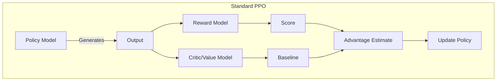
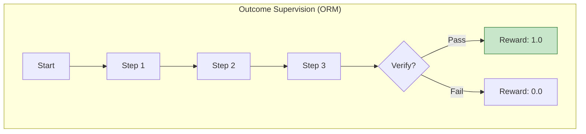
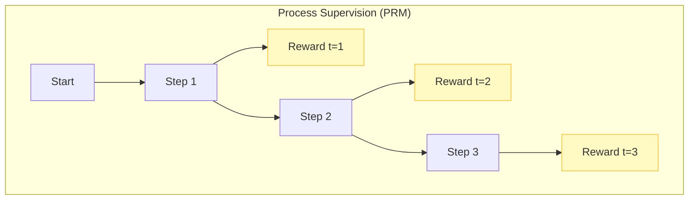
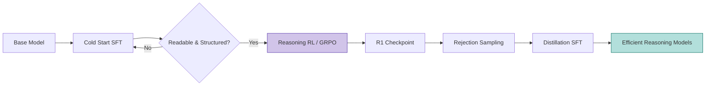

- [1 - Executive Summary](#1---executive-summary)
- [2 - Foundations of Alignment and The Necessity of Verification](#2---foundations-of-alignment-and-the-necessity-of-verification)
	- [2.1 - The Limitations of Imitation Learning and RLHF](#21---the-limitations-of-imitation-learning-and-rlhf)
	- [2.2 - The Shift to Verifiable Rewards](#22---the-shift-to-verifiable-rewards)
- [3 - Mathematical Preliminaries](#3---mathematical-preliminaries)
	- [3.1 - The Language Generation MDP](#31---the-language-generation-mdp)
	- [3.2 - The Policy Gradient Theorem](#32---the-policy-gradient-theorem)
- [4 - Algorithmic Innovations: Group Relative Policy Optimisation (GRPO)](#4---algorithmic-innovations-group-relative-policy-optimisation-grpo)
	- [4.1 - Theory: The Group-Based Baseline](#41---theory-the-group-based-baseline)
	- [4.2 - The GRPO Objective Function](#42---the-grpo-objective-function)
	- [4.3 - Computational Efficiency Comparison](#43---computational-efficiency-comparison)
	- [4.4 - Mathematical Example: The GRPO Update](#44---mathematical-example-the-grpo-update)
- [5 - Process Supervision vs. Outcome Supervision](#5---process-supervision-vs-outcome-supervision)
	- [5.1 - Outcome Supervision (ORM)](#51---outcome-supervision-orm)
	- [5.2 - Process Supervision (PRM)](#52---process-supervision-prm)
	- [5.3 - The "Let's Verify Step by Step" Findings](#53---the-lets-verify-step-by-step-findings)
	- [5.4 - Automated Process Supervision](#54---automated-process-supervision)
- [6 - Deep Dive: Modern Implementations](#6---deep-dive-modern-implementations)
	- [6.1 - DeepSeek-R1: The "Pure RL" Experiment](#61---deepseek-r1-the-pure-rl-experiment)
	- [6.2 - OpenAI o1: Deliberative Alignment](#62---openai-o1-deliberative-alignment)
	- [6.3 - AlphaCode 2 and Code Reasoning](#63---alphacode-2-and-code-reasoning)
- [7 - Theoretical Constraints and The "Sampler vs. Reasoner" Debate](#7---theoretical-constraints-and-the-sampler-vs-reasoner-debate)
	- [7.1 - The Tsinghua Hypothesis](#71---the-tsinghua-hypothesis)
	- [7.2 - The Counter-Argument: Efficiency is Capability](#72---the-counter-argument-efficiency-is-capability)
- [8 - Advanced Techniques and Frontiers](#8---advanced-techniques-and-frontiers)
	- [8.1 - Token Hidden Reward (THR)](#81---token-hidden-reward-thr)
	- [8.2 - Difficulty-Adaptive Rollout Sampling (DARS)](#82---difficulty-adaptive-rollout-sampling-dars)
	- [8.3 - Curriculum RL (RLAAR)](#83---curriculum-rl-rlaar)
	- [8.4 - Formal Verification (Lean/Coq)](#84---formal-verification-leancoq)
- [9 - Implementation and Practical Considerations](#9---implementation-and-practical-considerations)
	- [9.1 - Infrastructure Requirements](#91---infrastructure-requirements)
	- [9.2 - Reward Hacking Mitigation](#92---reward-hacking-mitigation)
	- [9.3 - Comparison of Algorithms](#93---comparison-of-algorithms)
- [10 - Conclusion](#10---conclusion)
- [References](#references)

# 1 - Executive Summary

The paradigm of **Reinforcement Learning with Verifiable Rewards (RLVR)** has emerged as the definitive methodology for advancing the reasoning capabilities of Large Language Models (LLMs). While **Reinforcement Learning from Human Feedback (RLHF)** proved instrumental in aligning models for general instruction following and safety, it has encountered a fundamental ceiling in domains requiring rigorous logic (such as mathematics, coding, and scientific reasoning). Human annotators are inherently poor scalers of verification; they are prone to fatigue, struggle with subtle logical fallacies in long-chain reasoning, and are costly to employ at the scale required for frontier model training.

RLVR fundamentally shifts the alignment target from subjective preference to objective correctness. By integrating deterministic verification environments (such as code compilers, symbolic math solvers, or formal theorem provers) into the training loop, researchers can generate infinite synthetic training signals without human intervention. This report provides an exhaustive technical examination of RLVR, with a specific focus on the **Group Relative Policy Optimisation (GRPO)** algorithm, which has enabled the training of reasoning models like DeepSeek-R1 by eliminating the computational overhead of the Value Function critic.

We analyse the dichotomy between **Outcome Supervision (ORM)** and **Process Supervision (PRM)**, demonstrating why dense, step-by-step verification incurs a "negative alignment tax", improving both model safety and performance. Furthermore, we critically evaluate the theoretical debate regarding whether RLVR induces novel reasoning capabilities or merely acts as an efficient sampler of pre-existing latent knowledge. This document is structured for a technical audience, assuming fluency in probability theory and neural network architectures, and aims to provide the theoretical scaffolding necessary to implement RLVR systems.

-----

# 2 - Foundations of Alignment and The Necessity of Verification

To understand the mechanics of RLVR, one must first situate it within the broader trajectory of LLM post-training. The progression from **Supervised Fine-Tuning (SFT)** to **RLHF**, and now to **RLVR**, represents a movement from imitation to optimisation, and finally to self-correction.

## 2.1 - The Limitations of Imitation Learning and RLHF

Standard SFT is effectively Behavioural Cloning. The model maximises the likelihood of the next token given a dataset of high-quality human demonstrations:

$$ \mathcal{L}_{SFT}(\theta) = - \sum_{(x, y) \in \mathcal{D}} \log \pi_\theta(y | x) $$

While effective for transferring style and format, SFT is bounded by the quality of the demonstrator. The model cannot exceed the reasoning capability of the data it imitates.

RLHF introduced the concept of optimisation against a reward function. A Reward Model (RM), $\mathcal{R}_\phi(x, y)$, is trained on human preference pairs ($y_w \succ y_l$) to predict a scalar score. The policy $\pi_\theta$ is then optimised using **Proximal Policy Optimisation (PPO)** to maximise this score.

However, the RM acts as a proxy for ground truth. In reasoning tasks, this proxy is noisy. A human evaluator may rate a confident, well-structured, but mathematically incorrect answer higher than a correct but poorly formatted one. This misalignment leads to "**sycophancy**" (where the model optimises for the appearance of correctness rather than correctness itself). Furthermore, training the RM requires massive human annotation, which is unscalable for complex domains like Olympiad-level mathematics or kernel-level programming.

## 2.2 - The Shift to Verifiable Rewards

RLVR replaces the learned, probabilistic $\mathcal{R}_\phi$ with a deterministic, programmatic function $\mathcal{V}(y, y^*)$.

$$ \mathcal{V}(y, y^*) \in \{0, 1\} $$

In this paradigm, the environment provides the ground truth.

* **In Mathematics:** The output is parsed, and the final answer is compared against a gold-standard solution using symbolic equality checks.
* **In Coding:** The output is compiled and run against a suite of unit tests.
* **In Formal Logic:** The output is a proof script (e.g., in Lean or Coq) validated by a theorem prover.

This shift has profound implications. It allows for self-play and iterative improvement. Since the reward signal is automated, the model can generate millions of trajectories, receive feedback on all of them, and update its policy to favour the reasoning paths that lead to verifiable success. This effectively allows the model to "discover" logic through trial and error, a phenomenon observed in the emergent reasoning behaviours of DeepSeek-R1-Zero.

-----

# 3 - Mathematical Preliminaries

Before dissecting the specific algorithms of RLVR, we must establish the underlying mathematical framework of policy optimisation in the context of language modelling.

## 3.1 - The Language Generation MDP

We model the generation of a reasoning chain as a Markov Decision Process (MDP):

* **State Space ($\mathcal{S}$):** The set of all possible token sequences. $s_t = (x, y_{<t})$ represents the prompt $x$ and the generated tokens up to time $t$.
* **Action Space ($\mathcal{A}$):** The vocabulary $\mathcal{V}$ of the tokeniser. An action $a_t$ corresponds to selecting a token $y_t \in \mathcal{V}$.
* **Policy ($\pi_\theta$):** The LLM, parameterised by weights $\theta$, defining the probability distribution $\pi_\theta(a_t | s_t)$.
* **Transition ($\mathcal{T}$):** Deterministic. The next state $s_{t+1}$ is simply the concatenation $[s_t, a_t]$.
* **Reward ($\mathcal{R}$):** In pure RLVR, the reward is often sparse and terminal. $r_t = 0$ for all $t < T$, and $r_T = \mathcal{V}(y, y^*)$ at the end of the sequence.

## 3.2 - The Policy Gradient Theorem

The objective is to maximise the expected return $J(\theta)$:

$$ J(\theta) = \mathbb{E}_{\tau \sim \pi_\theta} $$

where $\tau$ is a trajectory (sequence of tokens). The gradient of this objective is:

$$ \nabla_\theta J(\theta) = \mathbb{E}_{\tau \sim \pi_\theta} \left[ \cdot \right] $$

Here, $A_t$ is the Advantage Function, $A(s_t, a_t) = Q(s_t, a_t) - V(s_t)$.
$Q(s_t, a_t)$ is the value of taking action $a_t$ in state $s_t$.
$V(s_t)$ is the value of the state $s_t$ (the expected future reward).

The Advantage function is critical because it reduces the variance of the gradient estimate. It tells us how much better a specific token choice was compared to the average token choice at that step.

-----

# 4 - Algorithmic Innovations: Group Relative Policy Optimisation (GRPO)

The implementation of standard PPO for LLMs is computationally exorbitant. PPO requires four models to be loaded into memory: the Policy (Actor), the Reference Model (for KL divergence), the Reward Model, and the Critic (Value Function). For a 70B parameter model, this memory footprint is often prohibitive, requiring massive clusters just to store the weights and optimiser states.

**Group Relative Policy Optimisation (GRPO)**, introduced in the DeepSeekMath paper and popularised by DeepSeek-R1, is an architectural innovation designed specifically to eliminate the Critic model and the Reward Model (when using programmatic verification), thereby enabling the scaling of RLVR.

**Standard PPO**

**GRPO Architecture**

## 4.1 - Theory: The Group-Based Baseline

GRPO posits that we do not need a learned neural network to estimate the baseline $V(s_t)$. Instead, we can estimate the baseline empirically by sampling a group of outputs for the same prompt.

For a given prompt $q$, we sample a group of $G$ outputs $\{o_1, o_2, \dots, o_G\}$ from the old policy $\pi_{\theta_{old}}$. We then calculate the rewards $\{r_1, r_2, \dots, r_G\}$ for each output.

The baseline for this specific prompt is simply the average reward of the group. The advantage of the $i$-th output is its standardised score within the group:

$$ \hat{A}_i = \frac{r_i - \text{mean}(\mathbf{r})}{\text{std}(\mathbf{r}) + \epsilon} $$

where:

$$ \text{mean}(\mathbf{r}) = \frac{1}{G} \sum_{j=1}^G r_j, \quad \text{std}(\mathbf{r}) = \sqrt{\frac{1}{G} \sum_{j=1}^G (r_j - \mu)^2} $$

This effectively uses the model's own distribution as the baseline. If a prompt is extremely difficult, all sampled outputs might receive low rewards (e.g., 0.1, 0.2, 0.0). However, the output with 0.2 is relatively superior. The z-score normalisation ensures it receives a positive advantage, identifying it as a learning signal even in a low-reward regime.

## 4.2 - The GRPO Objective Function

The GRPO loss function mirrors PPO's clipped objective but substitutes the group-based advantage. It also handles the KL divergence differently. Instead of adding a per-token KL penalty to the reward (as is common in PPO), GRPO often includes the KL term directly in the loss function as a regulariser.

$$ \mathcal{J}_{GRPO}(\theta) = \mathbb{E}_{q \sim P(Q),\, \{o_i\}_{i=1}^G \sim \pi_{\theta_{old}}} \left[ \cdot \right] $$

**Component Analysis:**

  * $\rho_{i,t}$ (Probability Ratio): $\frac{\pi_\theta(o_{i,t} | q, o_{i,<t})}{\pi_{\theta_{old}}(o_{i,t} | q, o_{i,<t})}$. This term measures how much the updated policy diverges from the sampling policy.
  * **Clipping:** The clip function restricts $\rho_{i,t}$ to the range $[1-\epsilon, 1+\epsilon]$ (typically $\epsilon=0.2$). This prevents "destructive updates" where the policy changes too drastically based on a single batch, ensuring training stability (the Trust Region).
  * **KL Divergence ($\mathbb{D}_{KL}$):** This term ensures the model stays close to the reference model (usually the SFT checkpoint). This is crucial to prevent reward hacking (where the model outputs gibberish that satisfies the verifier) and catastrophic forgetting of linguistic capabilities.
  * **Token Averaging:** The loss is averaged over all tokens $t$ in the sequence length $|o_i|$.

## 4.3 - Computational Efficiency Comparison

The following table illustrates the resource reduction achieved by GRPO compared to standard PPO for a model of size $M$.

| Component            | Standard PPO                   | GRPO                  | Reduction Mechanism             |
| :------------------- | :----------------------------- | :-------------------- | :------------------------------ |
| **Active Policy**    | Trainable ($M$)                | Trainable ($M$)       | N/A                             |
| **Reference Model**  | Inference ($M$)                | Inference ($M$)       | N/A (Can be offloaded)          |
| **Reward Model**     | Inference ($M$)                | Removed               | Replaced by Verifiable Function |
| **Critic (Value)**   | Trainable ($M$)                | Removed               | Replaced by Group Mean          |
| **Optimiser States** | $2 \times M$ (Policy + Critic) | $1 \times M$ (Policy) | No Critic Parameters            |

**Implication:** GRPO essentially halves the memory requirement for trainable parameters and removes the inference overhead of the Reward Model, freeing up VRAM to increase the context window; a critical requirement for training reasoning models that generate long Chains of Thought.

## 4.4 - Mathematical Example: The GRPO Update

To visualise the mechanics, consider a simplified coding task.

**Prompt:** "Write a Python function to square a number."
**Group Size ($G$):** 4.
**Verifier:** Runs `assert f(2) == 4`.

**Sampled Trajectories:**

  * $o_1$: `def f(x): return x + 2` (Fails, $r=0$).
  * $o_2$: `def f(x): return x * 2` (Fails, $r=0$).
  * $o_3$: `def f(x): return x ** 2` (Passes, $r=1$).
  * $o_4$: `def f(x): return x * x` (Passes, $r=1$).

**Step 1: Calculate Group Statistics**
$$ \mu = \frac{0 + 0 + 1 + 1}{4} = 0.5 $$
$$ \sigma = \sqrt{\frac{(0-0.5)^2 + \dots + (1-0.5)^2}{4}} = 0.5 $$

**Step 2: Calculate Advantages ($\hat{A}_i$)**

  * $o_1, o_2$: $\frac{0 - 0.5}{0.5} = -1.0$
  * $o_3, o_4$: $\frac{1 - 0.5}{0.5} = +1.0$

**Step 3: Gradient Application**
The model receives a negative gradient for tokens in $o_1$ and $o_2$ (suppressing linear addition/multiplication logic) and a positive gradient for $o_3$ and $o_4$ (reinforcing exponentiation logic). Note that if all models had failed ($r=0,0,0,0$), the standard deviation would be 0, leading to undefined advantages. In practice, a small $\epsilon$ is added, or the batch is skipped. This highlights the **Cold Start** problem: if the model cannot generate any correct answer, GRPO provides no gradient.

-----

# 5 - Process Supervision vs. Outcome Supervision

A central architectural decision in RLVR is the granularity of the verification signal.

**Outcome Supervision (ORM)**

**Process Supervision (PRM)**

## 5.1 - Outcome Supervision (ORM)

Outcome supervision rewards the model only at the end of the generation.
**Pros:** Easy to implement using existing compilers or math engines.
**Cons:** The Credit Assignment Problem. If a model generates a 100-step proof and makes a single sign error in step 99, an ORM assigns a reward of 0 to the entire chain. The optimisation algorithm struggles to disentangle the 98 correct steps from the single fatal error. This leads to inefficient training and "sparse reward" issues.

## 5.2 - Process Supervision (PRM)

Process supervision provides a reward signal at each step of the reasoning chain.

$$ J(\theta) = \sum_{t} \mathbb{E} [r_t] $$

**Pros:** Dense feedback. The model learns exactly where it went wrong.
**Cons:** Requires step-level labels. For manual labelling, this is prohibitively expensive.

## 5.3 - The "Let's Verify Step by Step" Findings

OpenAI's seminal research on Process Reward Models (PRMs) demonstrated that PRMs significantly outperform ORMs on the MATH dataset. Specifically, they found that PRMs allow for more effective **Best-of-N search**. By scoring intermediate steps, the PRM can prune bad branches of the reasoning tree early, rather than waiting for the final answer.

Crucially, they observed a **Negative Alignment Tax**. Typically, aligning a model incurs a performance penalty. However, enforcing step-by-step verifiable reasoning actually improved the model's performance on hard math problems relative to an unaligned model. This suggests that for reasoning, alignment and capability are convergent goals.

## 5.4 - Automated Process Supervision

Since human labelling is unscalable, modern RLVR systems utilise **Automated Process Supervision**.
**Technique:** Monte Carlo Tree Search (MCTS) Rollouts.

To verify an intermediate step $s_t$:

1.  Freeze the state at $s_t$.
2.  Sample $K$ different continuations (rollouts) from $s_t$ to the end.
3.  Calculate the success rate of these rollouts.
4.  Assign the value $V(s_t) \approx \frac{\text{Successes}}{K}$.

This allows the system to auto-label the "correctness" of intermediate steps based on their probability of leading to a correct solution, converting a sparse outcome reward into a dense process signal.

-----

# 6 - Deep Dive: Modern Implementations

The theory of RLVR has been actualised in several frontier models. We examine the specific implementation details of **DeepSeek-R1** and **OpenAI o1**.

## 6.1 - DeepSeek-R1: The "Pure RL" Experiment

DeepSeek-R1 represents the first successful attempt to train a reasoning model primarily through open-source RLVR techniques. Its development pipeline reveals critical insights into the stability of RL training.

**Phase 1: The Cold Start Problem & R1-Zero**
The researchers initially attempted to apply RL (GRPO) directly to the base model (DeepSeek-V3-Base) without any supervised fine-tuning. This model, **DeepSeek-R1-Zero**, successfully learned to solve math problems and naturally evolved a "self-verification" behaviour—it would generate a solution, double-check it, and correct itself if wrong.

  * **The Failure Mode:** While capable, R1-Zero suffered from severe instability. It exhibited "language mixing" (switching between languages mid-sentence) and poor readability. The RL optimisation found that these messy outputs were not penalised, so it exploited them.
  * **The Solution:** A "Cold Start" phase. They curated a small dataset (thousands of samples) of high-quality, readable Chain-of-Thought (CoT) examples. Fine-tuning on this data before RL initialized the policy in a region of the parameter space that favoured readable, structured reasoning.

**Phase 2: Reasoning-Oriented RL (GRPO)**
Following the cold start, the model underwent massive-scale GRPO training.
**Reward Function:**
$$ R_{total} = \alpha \cdot R_{accuracy} + \beta \cdot R_{format} $$

  * $R_{accuracy}$: 1 if the final answer matches ground truth, 0 otherwise.
  * $R_{format}$: A shaped reward to enforce the structure `<think>... </think> <answer>... </answer>`.

This stage drove the primary gains in reasoning capability, pushing performance on the AIME benchmark from \~50% to over 70%.

**Phase 3: Rejection Sampling and Distillation**
To scale these capabilities to smaller models, DeepSeek employed Rejection Sampling.

1.  Run the large R1 model on 800,000 prompts.
2.  Filter the outputs to find those that are both correct and readable.
3.  Use this synthetic dataset to SFT smaller models (e.g., Llama-70B, Qwen-32B).

**Result:** The distilled models achieved state-of-the-art performance for their size classes, proving that the "reasoning patterns" discovered by RL can be transferred via standard supervision.

## 6.2 - OpenAI o1: Deliberative Alignment

OpenAI's o1 model utilises a similar RL-based reasoning chain, but with a focus on safety via **Deliberative Alignment**.
Unlike DeepSeek, o1's CoT is hidden. The model generates "reasoning tokens" that are processed by the transformer but masked from the user.

**Mechanism:** During the CoT, the model can explicitly reference its safety policies. For example, if asked to generate a dangerous chemical recipe, the hidden CoT might read:
*"User is asking for a prohibited substance. Policy 3.2 forbids this. I should provide a refusal that is helpful but safe."*
This allows the model to "think" about safety rules in context, rather than relying on a blind refusal reflex. This has led to SOTA performance on jailbreak resistance.

## 6.3 - AlphaCode 2 and Code Reasoning

For coding agents like AlphaCode 2, RLVR is implemented via **Execution-Based Verification**.

**The Clustering Strategy:**

1.  Generate $10^6$ samples for a problem.
2.  Filter out those that fail basic compilation or example tests ($\approx 95\%$ removal).
3.  Cluster the remaining 50,000 candidates based on their output behaviour on hidden inputs.
4.  Select one candidate from each cluster to submit.

This effectively uses verification to navigate the search space, prioritising diversity of logic over mere probability.

-----

# 7 - Theoretical Constraints and The "Sampler vs. Reasoner" Debate

A contentious debate in the field concerns the nature of the improvements driven by RLVR. Does the model learn new reasoning skills, or does it merely become a better sampler of existing skills?

## 7.1 - The Tsinghua Hypothesis

A recent study by Tsinghua University researchers analysed RLVR using the **Pass@k** metric.

  * **Pass@1:** Probability that the first answer is correct.
  * **Pass@k:** Probability that at least one correct answer exists in $k$ samples.

**The Finding:** RLVR dramatically improves Pass@1 (e.g., from 20% to 60%). However, it often shows no improvement or even degradation in Pass@k (for large $k$, e.g., $k=100$).
**The Implication:** The base model already contained the correct reasoning path in its latent space; it was just low probability (in the tail of the distribution). RLVR sharpens the distribution, shifting probability mass from incorrect paths to the correct path. It does not, however, expand the "capability boundary"; it does not teach the model to solve problems that the base model could never solve, even with infinite sampling.

## 7.2 - The Counter-Argument: Efficiency is Capability

Proponents of RLVR argue that in practical terms, efficiency is capability. A model that requires 10,000 samples to find a correct answer is useless. By compressing the search space, RLVR makes the reasoning accessible. Furthermore, DeepSeek's results show that for very hard benchmarks (AIME), the RLVR model does exceed the base model's Pass@k in specific regimes, suggesting that the self-correction mechanism (backtracking) allows it to navigate complex solution trees that simple sampling cannot traverse.

-----

# 8 - Advanced Techniques and Frontiers

The field is rapidly evolving beyond basic binary rewards.

## 8.1 - Token Hidden Reward (THR)

Recent research has proposed analysing the **Token Hidden Reward**. This metric quantifies the contribution of each individual token to the final success of the generation. By identifying tokens with high THR, researchers can identify the specific "pivotal steps" in a reasoning chain (the "Aha\!" moments). Optimising specifically for these tokens can accelerate convergence.

## 8.2 - Difficulty-Adaptive Rollout Sampling (DARS)

Standard RLVR samples uniformly from the prompt dataset. However, the model quickly masters easy problems (leading to zero gradient) while failing hard problems (leading to zero gradient). **DARS** dynamically adjusts the sampling budget. It allocates more rollouts to problems where the model's current pass rate is intermediate (e.g., 20-50%), as these are the "Zone of Proximal Development" where the model stands to learn the most.

## 8.3 - Curriculum RL (RLAAR)

**Reinforcement Learning with Verifiable Accuracy and Abstention Rewards (RLAAR)** introduces a curriculum. The model is trained not just to answer, but to abstain when it is unsure.
**Reward:** $+1$ for correct answer, $0$ for incorrect, $+0.5$ for "I don't know."
This incentivises the model to be calibrated. It prevents "hallucinated reasoning" where the model guesses wildly to fish for rewards. As the model improves, the abstention reward is lowered, forcing it to tackle harder problems.

## 8.4 - Formal Verification (Lean/Coq)

The ultimate frontier is **Autoformalisation**. Instead of outputting Python or text, the model outputs code in a formal language like Lean. The Lean compiler provides a 100% rigorous verification. If the proof compiles, it is correct.
**The Challenge:** Data scarcity. There are few Lean proofs available for training.
**The Hybrid Approach:** Models are trained to translate informal math into Lean, verify it, and then use the successful Lean proofs as training data (**Self-Correction loop**). This bridges the gap between the abundance of natural language math and the rigour of formal systems.

-----

# 9 - Implementation and Practical Considerations

For practitioners aiming to implement RLVR, several practical considerations are paramount.

## 9.1 - Infrastructure Requirements

  * **Inference Engine:** High-throughput generation is the bottleneck. Integrating libraries like vLLM or SGLang directly into the training loop is necessary to generate the thousands of samples required for GRPO.
  * **Sandboxing:** The verification environment must be isolated. Executing generated code poses significant security risks. Use Docker containers or gVisor for the code execution environment.
  * **VRAM Management:** GRPO allows training on consumer hardware (e.g., A100s/H100s) by offloading the Reference Model to CPU or using parameter-efficient fine-tuning (LoRA) on the policy.

## 9.2 - Reward Hacking Mitigation

Models are adept at gaming verifiers.

  * **Example:** If a coding verifier checks standard input/output, the model might hardcode `if input == test_case_1: print(output_1)`.
  * **Mitigation:** Use **Held-Out Test Cases**. The verifier should verify against test cases that are hidden from the model during the generation phase.
  * **Format Strictness:** Enforce strict XML-like tagging (`<think>`, `<code_block>`) to prevent the model from outputting conversational filler that confuses the parser.

## 9.3 - Comparison of Algorithms

| Algorithm              | Critic Required? | Memory Usage    | Stability             | Best Use Case         |
| :--------------------- | :--------------- | :-------------- | :-------------------- | :-------------------- |
| **PPO**                | Yes              | High (4 models) | High (Trust Region)   | General RLHF, Chat    |
| **GRPO**               | No               | Low (2 models)  | High (Group Baseline) | Reasoning (Math/Code) |
| **Rejection Sampling** | No               | Lowest          | High (Offline)        | Distillation, SFT     |
| **Reinforce++**        | No               | Low             | Low (High Variance)   | Experimental          |

-----

# 10 - Conclusion

Reinforcement Learning with Verifiable Rewards marks the transition of Large Language Models from probabilistic pattern matchers to verifiable reasoning engines. By grounding the model's objective function in the hard reality of deterministic verification (rather than the soft proxy of human preference) we enable a new mode of learning: self-correction and discovery.

The architectural innovation of Group Relative Policy Optimisation (GRPO) has democratised this capability, removing the need for massive value function models and enabling efficient training on long-context reasoning chains. While theoretical debates persist regarding the nature of the intelligence emerging from these systems (whether it is true generalisation or efficient search) the empirical results are undeniable. Models like DeepSeek-R1 and OpenAI o1 have redefined the state-of-the-art in mathematics and coding.

For the technical researcher, the path forward lies in the design of better verifiers (formal methods), better exploration strategies (DARS, THR), and the integration of process supervision to provide dense, meaningful signals to the learning agent. As we refine these feedback loops, we move closer to AI systems that can not only generate plausible text but can verify, correct, and guarantee the truth of their own reasoning.

# References

* DeepSeek-AI. (2025).
  [**DeepSeek-R1: Incentivizing Reasoning Capability in LLMs via Reinforcement Learning**](https://arxiv.org/abs/2501.12948). arXiv:2501.12948.

* Shao, Z., Zhang, Z., Liu, Y., *et al.* (2024).
  [**DeepSeekMath: Pushing the Limits of Mathematical Reasoning in Open Language Models**](https://arxiv.org/abs/2402.03300). arXiv:2402.03300.

* Mroueh, Y. (2025).
  [**Reinforcement Learning with Verifiable Rewards: GRPO’s Effective Loss, Dynamics, and Success Amplification**](https://arxiv.org/abs/2503.06639). arXiv:2503.06639.

* Lightman, H., Radhakrishnan, A., Christiano, P., *et al.* (2023).
  [**Let’s Verify Step by Step**](https://arxiv.org/abs/2305.20050). arXiv:2305.20050.

* AlphaCode Team, Google DeepMind. (2023).
  [**AlphaCode 2 Technical Report**](https://storage.googleapis.com/deepmind-media/AlphaCode2/AlphaCode2_Tech_Report.pdf). Technical report.

* Gloeckle, F., Gu, A., Synnaeve, G., & Hayat, A. (2025).
  [**Reinforcement Learning for Hierarchical Proof Generation in Lean 4**](https://openreview.net/pdf?id=XzH1yRfhVW). NeurIPS 2025 MATH-AI Workshop / ICLR 2026 submission.

* Zhang, J., Wang, Q., Ji, X., *et al.* (2025).
  [**Leanabell-Prover: Posttraining Scaling in Formal Reasoning**](https://arxiv.org/abs/2504.06122). arXiv:2504.06122.

* Chen, L., Gu, J., Huang, L., *et al.* (2025).
  [**Seed-Prover: Deep and Broad Reasoning for Automated Theorem Proving**](https://arxiv.org/abs/2507.23726). arXiv:2507.23726.

* Yue, Y., Li, X., Zhang, Y., *et al.* (2025).
  [**Does Reinforcement Learning Really Incentivize Reasoning Capacity in LLMs Beyond the Base Model?**](https://arxiv.org/abs/2504.13837). arXiv:2504.13837.

* Wen, X., Liu, Z., Zheng, S., *et al.* (2025).
  [**Reinforcement Learning with Verifiable Rewards Implicitly Incentivizes Correct Reasoning in Base LLMs**](https://arxiv.org/abs/2506.14245). arXiv:2506.14245.

* Deng, W., Li, Y., Zhang, H., *et al.* (2025).
  [**Token Hidden Reward: Steering Exploration–Exploitation in Group Relative Deep Reinforcement Learning**](https://arxiv.org/abs/2510.03669). arXiv:2510.03669.

* Yang, F., Zhou, J., Liu, Q., *et al.* (2025).
  [**Depth–Breadth Synergy in RLVR: Unlocking LLM Reasoning Gains with Adaptive Exploration**](https://arxiv.org/abs/2508.13755). arXiv:2508.13755.

* Liu, X., Liang, T., He, Z., *et al.* (2025).
  [**Trust, But Verify: A Self-Verification Approach to Reinforcement Learning with Verifiable Rewards**](https://arxiv.org/abs/2505.13445). arXiv:2505.13445.

* Su, Y., Yu, D., Song, L., *et al.* (2025).
  [**Crossing the Reward Bridge: Expanding RL with Verifiable Rewards Across Diverse Domains**](https://arxiv.org/abs/2503.23829). arXiv:2503.23829.
