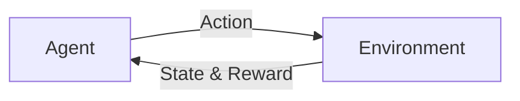
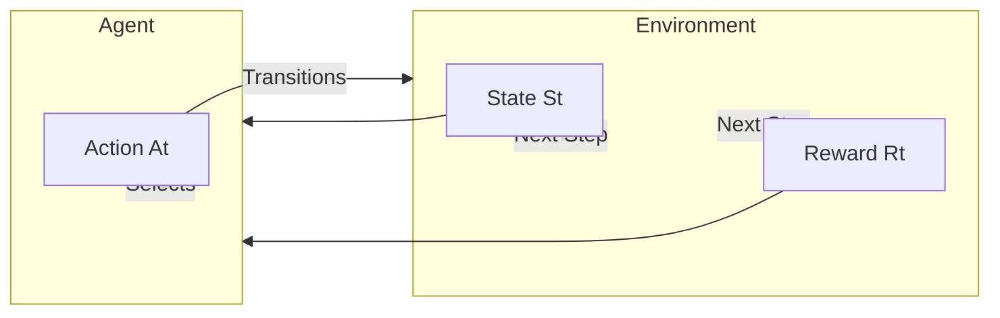
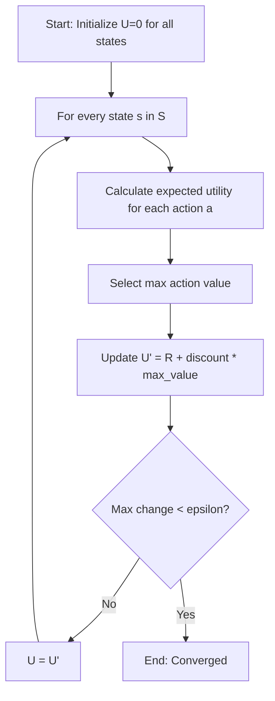

- [1 - Foundations of Reinforcement Learning](#1---foundations-of-reinforcement-learning)
	- [1.1 - Core Concepts](#11---core-concepts)
	- [1.2 - Key Characteristics](#12---key-characteristics)
- [2 - The N-Armed Bandit Problem](#2---the-n-armed-bandit-problem)
	- [2.1 - Problem Definition](#21---problem-definition)
	- [2.2 - Action-Value Methods](#22---action-value-methods)
	- [Example Problem](#example-problem)
	- [Step-by-Step Solution](#step-by-step-solution)
	- [2.3 - Action Selection Strategies](#23---action-selection-strategies)
	- [Example Problem](#example-problem-1)
	- [Step-by-Step Solution](#step-by-step-solution-1)
- [2.4 - Computational Examples](#24---computational-examples)
	- [Calculating Action-Value Updates (Derivation)](#calculating-action-value-updates-derivation)
	- [Calculating Selection Probabilities](#calculating-selection-probabilities)
- [3 - Markov Decision Processes (MDPs)](#3---markov-decision-processes-mdps)
	- [3.1 - Formal Definition](#31---formal-definition)
	- [Visualizing the Interaction](#visualizing-the-interaction)
	- [Example Problem: Defining an MDP](#example-problem-defining-an-mdp)
	- [Solution](#solution)
- [3.2 - Policies and Utility](#32---policies-and-utility)
	- [Example Problem: Writing the Bellman Equation](#example-problem-writing-the-bellman-equation)
	- [Solution](#solution-1)
- [3.3 - Planning with Value Iteration](#33---planning-with-value-iteration)
	- [The Value Iteration Algorithm](#the-value-iteration-algorithm)
	- [Discount Factor ($\\gamma$)](#discount-factor-gamma)
	- [Convergence Properties](#convergence-properties)
	- [Algorithm Flowchart](#algorithm-flowchart)
	- [Example Problem: Performing Value Iteration](#example-problem-performing-value-iteration)
	- [Solution](#solution-2)
- [3.4 - Computational Examples](#34---computational-examples)
	- [Performing Manual Value Iteration Updates](#performing-manual-value-iteration-updates)
- [4 - Passive Reinforcement Learning (Prediction)](#4---passive-reinforcement-learning-prediction)
	- [4.1 - Definition](#41---definition)
	- [4.2 - Direct Utility Estimation (DUE)](#42---direct-utility-estimation-due)
	- [Example Problem: Direct Utility Estimation](#example-problem-direct-utility-estimation)
	- [Step-by-Step Solution](#step-by-step-solution-2)
- [4.3 - Adaptive Dynamic Programming (ADP)](#43---adaptive-dynamic-programming-adp)
	- [Learning the Model](#learning-the-model)
	- [Example Problem: Learning Probabilities](#example-problem-learning-probabilities)
- [4.4 - Temporal Difference (TD) Learning](#44---temporal-difference-td-learning)
	- [Model-Free Learning](#model-free-learning)
	- [Comparison with ADP](#comparison-with-adp)
	- [Example Problem: TD Update](#example-problem-td-update)
- [4.5 - Computational Examples](#45---computational-examples)
	- [Estimating Transition Probabilities and Direct Utility Estimation](#estimating-transition-probabilities-and-direct-utility-estimation)
	- [Step-by-Step Solution](#step-by-step-solution-3)
- [5 - Active Reinforcement Learning (Control)](#5---active-reinforcement-learning-control)
	- [5.1 - The Control Problem](#51---the-control-problem)
	- [5.2 - Exploration Strategies](#52---exploration-strategies)
- [5.3 - Q-Learning (Off-Policy)](#53---q-learning-off-policy)
- [5.4 - SARSA (On-Policy)](#54---sarsa-on-policy)
	- [Step-by-Step Solution: Q-Learning Update](#step-by-step-solution-q-learning-update)
- [5.5 - Computational Examples](#55---computational-examples)
	- [Example Problem: Q-Learning vs SARSA](#example-problem-q-learning-vs-sarsa)
- [6 - Generalisation and Scaling](#6---generalisation-and-scaling)
	- [6.1 - The State Space Problem](#61---the-state-space-problem)
	- [6.2 - Function Approximation](#62---function-approximation)
	- [6.3 - Applications](#63---applications)

## 1 - Foundations of Reinforcement Learning

### 1.1 - Core Concepts

Reinforcement Learning (RL) is a computational approach to learning whereby an agent learns how to behave in an environment by performing actions and seeing the results. The goal is to learn a mapping from situations (states) to actions so that the agent maximises a numerical reward signal.

This differs from other machine learning paradigms:

  * **Supervised learning** learns from a training set of labelled examples provided by a knowledgeable external supervisor; it is instructive.
  * **Unsupervised learning** finds hidden structure in unlabelled data.
  * **Reinforcement learning** learns through interaction and trial and error; it deals with evaluative feedback.

**The Agent-Environment Loop**
The standard RL model involves an interaction between an active decision-making agent and its environment.

1.  At each time step, the **Agent** occupies a **State** ($s$).
2.  The Agent executes an **Action** ($a$).
3.  The **Environment** responds to this action.
4.  The Agent transitions to a new state and receives a numerical **Reward** ($r$).

Below is a representation of this interaction loop.

**Evaluative vs Instructive Feedback**
A key distinction in RL is the type of feedback received.

  * **Instructive feedback** tells the learner the best action to take, independent of the action actually taken (typical in supervised learning).
  * **Evaluative feedback** indicates how good the action taken was, but does not say if it was the best possible action.

Reinforcement learning relies on evaluative feedback. The agent must deduce the best strategy based on the "scores" (rewards) it receives over time.

**The Reward Hypothesis**
The central premise of RL is the Reward Hypothesis. It suggests that all goals can be described by the maximisation of expected cumulative reward. For example, in chess, the reward is received only at the end of the game (win/loss); in table tennis, each point scored acts as a reward.

### 1.2 - Key Characteristics

Reinforcement learning is defined by several specific challenges that distinguish it from other learning methods.

**Trial and Error Search**
The learner is not told which actions to take. Instead, the agent must discover which actions yield the most reward by trying them. This discovery process is crucial because the environment is often uncertain or unknown.

**Delayed Rewards**
Rewards are not always immediate. An action taken now might not produce a reward until many time steps later. The agent must learn to sacrifice short-term gains to achieve greater long-term rewards. For example, a chess player might sacrifice a piece (negative immediate reward) to checkmate the opponent ten moves later (large positive future reward).

**Exploration vs Exploitation**
This is a fundamental trade-off in RL. The agent must balance two competing objectives:

  * **Exploitation:** The agent uses its current knowledge to select actions that are known to yield high rewards; this maximises immediate returns.
  * **Exploration:** The agent tries actions it has not selected before (or selects rarely) to discover if they yield higher rewards; this gathers more information about the environment.

The dilemma is that the agent cannot do both simultaneously. Exclusive exploitation prevents the agent from finding optimal strategies if its current knowledge is incomplete. Exclusive exploration results in poor performance because the agent never utilizes what it has learned. Effective RL requires a strategy to balance these two behaviours.

-----

## 2 - The N-Armed Bandit Problem

### 2.1 - Problem Definition

The n-armed bandit problem is a classic example used to demonstrate the fundamentals of reinforcement learning. Imagine you are faced with a set of $n$ slot machines (also known as "one-armed bandits"). Your goal is to maximise the total reward you receive over a series of time steps.

In this scenario:

  * You must choose repeatedly from one of $n$ actions (playing a specific machine).
  * Each choice is called a **play**.
  * After each play $a_t$, you receive a numerical reward $r_t$.
  * The reward probabilities for each machine are stationary but **unknown** to you.

The objective is to discover which machine provides the highest expected reward and then play that machine to maximise your long-term return.

**Action-Value Estimates**
To decide which machine to play, we need to estimate the value of each action. The true value of an action $a$, denoted as $Q^*(a)$, is the expected reward given that action is selected:
$$Q^*(a) = E[r_t | a_t = a]$$

Since we do not know the true values, we maintain an estimated value $Q_t(a)$ for each action $a$ at time step $t$. The agent's task is to make these estimates as accurate as possible through trial and error.

### 2.2 - Action-Value Methods

We need a practical way to estimate $Q^*(a)$. A natural approach is to use the average of the rewards actually received.

**Sample-Average Method**
This method estimates the value of an action by averaging the rewards received every time that action was chosen.
$$Q_t(a) = \frac{\text{sum of rewards when } a \text{ taken prior to } t}{\text{number of times } a \text{ taken prior to } t}$$
If an action has been chosen $k_a$ times and yielded rewards $r_1, r_2, ..., r_{k_a}$, the estimate is:
$$Q_t(a) = \frac{r_1 + r_2 + ... + r_{k_a}}{k_a}$$
As $k_a \rightarrow \infty$, the estimate $Q_t(a)$ converges to the true value $Q^*(a)$.

**Incremental Implementation**
Storing every single reward to calculate an average is memory intensive. We can compute the average incrementally using a simple update rule. This allows us to update our estimate with just the new reward and the current estimate.

The general update rule is:
$$NewEstimate \leftarrow OldEstimate + StepSize \times (Target - OldEstimate)$$

Mathematically, if $Q_k$ is the average of the first $k$ rewards, and $r_{k+1}$ is the new reward, the new estimate $Q_{k+1}$ is:
$$Q_{k+1} = Q_k + \frac{1}{k+1}(r_{k+1} - Q_k)$$

Here, the step size is $\frac{1}{k+1}$, which decreases as we collect more data, ensuring the estimate stabilizes.

### Example Problem

An agent has a series of choices between taking action $a_1$ and action $a_2$. Its choices, and the resulting payoffs, are as follows:

| Time       | 1     | 2     | 3     | 4     | 5     | 6     | 7     | 8     |
| :--------- | :---- | :---- | :---- | :---- | :---- | :---- | :---- | :---- |
| **Action** | $a_1$ | $a_2$ | $a_2$ | $a_1$ | $a_2$ | $a_2$ | $a_2$ | $a_1$ |
| **Payoff** | 9     | 2     | 7     | 3     | 8     | 4     | 5     | -     |

*Note: The payoff for time 8 is not provided, so we will calculate estimates up to time 7.*

**Task:** What is the action-value estimate for each of $a_1$ and $a_2$ at each point in time?

### Step-by-Step Solution

We will use the incremental update formula: $Q_{k+1}(a) = Q_k(a) + \frac{1}{k+1}(r - Q_k(a))$, where $k$ is the number of times action $a$ has been chosen **before** the current step.

**Time 1:**

  * **Action:** $a_1$
  * **Reward:** 9
  * Since this is the first time $a_1$ is chosen ($k=0$), the estimate is just the reward.
  * **$Q(a_1) = 9$**
  * $a_2$ has not been played, so we assume **$Q(a_2) = 0$**.

**Time 2:**

  * **Action:** $a_2$
  * **Reward:** 2
  * First time $a_2$ is chosen ($k=0$).
  * **$Q(a_2) = 2$**
  * $a_1$ was not chosen, so its value remains unchanged. **$Q(a_1) = 9$**.

**Time 3:**

  * **Action:** $a_2$
  * **Reward:** 7
  * $a_2$ has been chosen once before ($k=1$). Current estimate $Q(a_2) = 2$.
  * Update $a_2$:
    $$Q_{new}(a_2) = 2 + \frac{1}{1+1}(7 - 2)$$
    $$Q_{new}(a_2) = 2 + 0.5(5) = 2 + 2.5 = 4.5$$
  * **$Q(a_2) = 4.5$**
  * **$Q(a_1) = 9$**

**Time 4:**

  * **Action:** $a_1$
  * **Reward:** 3
  * $a_1$ has been chosen once before ($k=1$). Current estimate $Q(a_1) = 9$.
  * Update $a_1$:
    $$Q_{new}(a_1) = 9 + \frac{1}{2}(3 - 9)$$
    $$Q_{new}(a_1) = 9 + 0.5(-6) = 9 - 3 = 6$$
  * **$Q(a_1) = 6$**
  * **$Q(a_2) = 4.5$**

**Time 5:**

  * **Action:** $a_2$
  * **Reward:** 8
  * $a_2$ has been chosen twice before ($k=2$). Current estimate $Q(a_2) = 4.5$.
  * Update $a_2$:
    $$Q_{new}(a_2) = 4.5 + \frac{1}{3}(8 - 4.5)$$
    $$Q_{new}(a_2) = 4.5 + \frac{1}{3}(3.5) \approx 4.5 + 1.17 = 5.67$$
  * **$Q(a_2) \approx 5.67$**
  * **$Q(a_1) = 6$**

**Time 6:**

  * **Action:** $a_2$
  * **Reward:** 4
  * $a_2$ has been chosen 3 times before ($k=3$). Current estimate $Q(a_2) \approx 5.67$ (using exact fraction $17/3$).
  * Update $a_2$:
    $$Q_{new}(a_2) = 5.67 + \frac{1}{4}(4 - 5.67)$$
    $$Q_{new}(a_2) = 5.67 + 0.25(-1.67) = 5.67 - 0.42 = 5.25$$
  * **$Q(a_2) = 5.25$**
  * **$Q(a_1) = 6$**

**Time 7:**

  * **Action:** $a_2$
  * **Reward:** 5
  * $a_2$ has been chosen 4 times before ($k=4$). Current estimate $Q(a_2) = 5.25$.
  * Update $a_2$:
    $$Q_{new}(a_2) = 5.25 + \frac{1}{5}(5 - 5.25)$$
    $$Q_{new}(a_2) = 5.25 + 0.2(-0.25) = 5.25 - 0.05 = 5.2$$
  * **$Q(a_2) = 5.2$**
  * **$Q(a_1) = 6$**

**Summary of Estimates:**

| Time | Action Taken | Reward | Estimate $Q(a_1)$ | Estimate $Q(a_2)$ |
| :--- | :----------- | :----- | :---------------- | :---------------- |
| 1    | $a_1$        | 9      | **9.0**           | 0.0               |
| 2    | $a_2$        | 2      | 9.0               | **2.0**           |
| 3    | $a_2$        | 7      | 9.0               | **4.5**           |
| 4    | $a_1$        | 3      | **6.0**           | 4.5               |
| 5    | $a_2$        | 8      | 6.0               | **5.67**          |
| 6    | $a_2$        | 4      | 6.0               | **5.25**          |
| 7    | $a_2$        | 5      | 6.0               | **5.20**          |

### 2.3 - Action Selection Strategies

A crucial aspect of Reinforcement Learning is how the agent chooses an action $a$ given its current action-value estimates $Q_t(a)$.

  * **Greedy Selection**
    The simplest strategy is to always select the action with the highest estimated value.
    $$a^* = \underset{a}{\text{argmax}} \ Q_t(a)$$
    This method maximises immediate reward (exploitation) but never explores to see if other actions might be better. It risks getting stuck on a suboptimal action if the initial estimates are poor.

  * **$\epsilon$-greedy Selection**
    This method balances exploration and exploitation. Most of the time, the agent behaves greedily. However, with a small probability $\epsilon$, the agent selects a random action from the set of all actions (with equal probability).

      * Probability $1-\epsilon$: Select the greedy action.
      * Probability $\epsilon$: Select a random action.

    This ensures that every action is sampled infinitely often over the long run, guaranteeing that $Q_t(a)$ converges to the true value $Q^*(a)$.

  * **Softmax Selection**
    $\epsilon$-greedy exploration treats all non-greedy actions equally, regardless of how bad they are. Softmax selection varies the selection probability based on the estimated value. The better the estimate, the higher the probability of selection.

    It uses the Gibbs (or Boltzmann) distribution:
    $$P(a) = \frac{e^{Q_t(a)/\tau}}{\sum_{b=1}^{n} e^{Q_t(b)/\tau}}$$

    The parameter $\tau$ is the **temperature**:

      * **High $\tau$:** Actions are nearly equiprobable (random).
      * **Low $\tau$:** The probability of the greedy action approaches 1.

### Example Problem

Consider an agent that is choosing between 3 actions, $a_{1}$, $a_{2}$ and $a_{3}$, with the following average rewards: $Q(a_{1})=5$, $Q(a_{2})=7$ and $Q(a_{3})=4$.

(a) If the agent uses $\epsilon$-greedy action selection, and $\epsilon=0.1$, what is the probability that each action will be selected?

(b) If the agent uses softmax action selection, using the Gibbs distribution with $\tau=0.1$, what is the probability that each action will be selected?

### Step-by-Step Solution

**Part (a): $\epsilon$-greedy Selection**

1.  **Identify the Greedy Action:**
    The action with the highest value is $a_2$ (Value = 7).

2.  **Determine Probabilities:**

      * The total probability of exploring (choosing randomly) is $\epsilon = 0.1$.
      * The total probability of exploiting (choosing the best action) is $1 - \epsilon = 0.9$.

    When exploring, the agent chooses uniformly from all $n=3$ actions. The probability of picking any specific action during exploration is $\frac{\epsilon}{n} = \frac{0.1}{3} \approx 0.033$.

      * **For the greedy action ($a_2$):**
        It gets the exploitation probability plus its share of the exploration probability.
        $$P(a_2) = (1 - \epsilon) + \frac{\epsilon}{n} = 0.9 + 0.033 = 0.933$$
      * **For non-greedy actions ($a_1, a_3$):**
        They only get their share of the exploration probability.
        $$P(a_1) = \frac{\epsilon}{n} = 0.033$$
        $$P(a_3) = \frac{\epsilon}{n} = 0.033$$

**Answer:**
$P(a_1) \approx 0.033$, $P(a_2) \approx 0.933$, $P(a_3) \approx 0.033$.

-----

**Part (b): Softmax Selection**

1.  **Calculate Exponentials:**
    We use the formula $e^{Q(a)/\tau}$ with $\tau=0.1$. This effectively multiplies the Q-values by 10 before exponentiating.

      * For $a_1$: $e^{5/0.1} = e^{50}$
      * For $a_2$: $e^{7/0.1} = e^{70}$
      * For $a_3$: $e^{4/0.1} = e^{40}$

2.  **Calculate the Denominator (Sum):**
    $$Sum = e^{50} + e^{70} + e^{40}$$
    Since $e^{70}$ is exponentially larger than $e^{50}$ and $e^{40}$, it dominates the sum entirely.
    $$e^{70} \approx 2.5 \times 10^{30}$$
    $$e^{50} \approx 5.1 \times 10^{21}$$
    $$e^{40} \approx 2.3 \times 10^{17}$$

3.  **Calculate Probabilities:**
    $$P(a) = \frac{e^{Q(a)/\tau}}{Sum}$$

      * **For $a_2$:**
        $$P(a_2) = \frac{e^{70}}{e^{70} + e^{50} + e^{40}} \approx \frac{e^{70}}{e^{70}} \approx 1.0$$
      * **For $a_1$:**
        $$P(a_1) = \frac{e^{50}}{e^{70}} = e^{-20} \approx 2 \times 10^{-9} \approx 0$$
      * **For $a_3$:**
        $$P(a_3) = \frac{e^{40}}{e^{70}} = e^{-30} \approx 0$$

**Answer:**
$P(a_2) \approx 1.0$, while $P(a_1)$ and $P(a_3)$ are effectively $0$. The low temperature ($\tau=0.1$) makes the selection extremely greedy.

## 2.4 - Computational Examples

### Calculating Action-Value Updates (Derivation)

The incremental update rule is a computationally efficient way to calculate the average of a sequence of rewards. Instead of storing all past rewards and summing them every time, we can derive a formula that updates the current average using only the new reward.

**Derivation of the Incremental Formula:**
Let $Q_n$ be the average of the first $n$ rewards, $r_1, r_2, \dots, r_n$.
$$Q_n = \frac{r_1 + r_2 + \dots + r_n}{n}$$

When we receive the next reward $r_{n+1}$, the new average $Q_{n+1}$ is:
$$Q_{n+1} = \frac{r_1 + r_2 + \dots + r_n + r_{n+1}}{n+1}$$

We can rewrite the sum of the first $n$ rewards in terms of the old average $Q_n$:
$$\sum_{i=1}^{n} r_i = n \cdot Q_n$$

Substitute this into the equation for $Q_{n+1}$:
$$Q_{n+1} = \frac{n \cdot Q_n + r_{n+1}}{n+1}$$

Now, we rearrange the terms to isolate $Q_n$:
$$Q_{n+1} = \frac{n \cdot Q_n}{n+1} + \frac{r_{n+1}}{n+1}$$
$$Q_{n+1} = \frac{(n+1-1) \cdot Q_n}{n+1} + \frac{r_{n+1}}{n+1}$$
$$Q_{n+1} = \frac{(n+1) \cdot Q_n - Q_n}{n+1} + \frac{r_{n+1}}{n+1}$$
$$Q_{n+1} = Q_n - \frac{Q_n}{n+1} + \frac{r_{n+1}}{n+1}$$

Grouping the terms with $\frac{1}{n+1}$:
$$Q_{n+1} = Q_n + \frac{1}{n+1} (r_{n+1} - Q_n)$$

This matches the general form:
$$NewEstimate \leftarrow OldEstimate + StepSize \times (Target - OldEstimate)$$

Where the **Target** is the $n+1$-th reward, and the **Error** is $(r_{n+1} - Q_n)$.

### Calculating Selection Probabilities

When implementing Softmax selection, the computation involves exponentials which can grow very large.

**Steps for Softmax Calculation:**

1.  **Calculate Exponentials:** For each action $a$, calculate $e^{Q(a)/\tau}$. The temperature $\tau$ scales the values. A lower $\tau$ increases the gap between high and low values (making the selection more greedy), while a higher $\tau$ smooths the differences (making selection more uniform).
2.  **Calculate the Partition Function (Denominator):** Sum the exponential values of all possible actions.
    $$\text{Sum} = \sum_{b=1}^{n} e^{Q(b)/\tau}$$
3.  **Normalize:** Divide the exponential of the specific action by the sum to get the probability.
    $$P(a) = \frac{e^{Q(a)/\tau}}{\text{Sum}}$$
    The sum of probabilities for all actions must equal 1.

## 3 - Markov Decision Processes (MDPs)

### 3.1 - Formal Definition

To solve Reinforcement Learning problems mathematically, we formalise the environment as a **Markov Decision Process (MDP)**. An MDP is defined by a tuple $(S, A, P, R, \gamma)$.

  * **State Space ($S$):**
    The set of all possible situations (states) the agent can be in.

      * *Discrete:* Finite number of states (e.g. positions on a chess board).
      * *Continuous:* Infinite states (e.g. the exact speed and position of a car).

  * **Action Space ($A$):**
    The set of all valid moves or decisions available to the agent.

      * Can be state-dependent (not all actions are available in every state).

  * **Transition Model ($P(s'|s,a)$):**
    Defines the **dynamics** of the environment. It is the probability that taking action $a$ in state $s$ will lead to state $s'$.
    $$P(s'|s,a) = \mathbb{P}[S_{t+1}=s' | S_t=s, A_t=a]$$

      * *Deterministic:* One action leads to exactly one state ($P=1$).
      * *Stochastic:* The outcome is random (e.g. the robot slips and moves sideways with 10% probability).

  * **Reward Function ($R(s)$ or $R(s,a,s')$):**
    The immediate signal received from the environment. It defines the goal.
    $$R_t = \mathbb{E}[R_{t+1} | S_t=s, A_t=a]$$

  * **The Markov Property:**
    The environment is "memoryless." The future depends **only** on the current state and action, not on the history of events that led to the current state.
    $$P(S_{t+1} | S_t, A_t, S_{t-1}, A_{t-1}, \dots) = P(S_{t+1} | S_t, A_t)$$
    *If the state captures all relevant information (e.g. position, velocity), the history is irrelevant.*

### Visualizing the Interaction

The agent and environment interact in a continuous loop. The agent observes the state, acts, and the environment responds with a new state and reward.

-----

### Example Problem: Defining an MDP

**Question:**
Consider a robot navigating a **Grid World** environment to understand how an MDP is structured.

1.  **Environment:** A $3 \times 4$ grid.
2.  **Obstacle:** The cell at $(2, 2)$ is a wall and cannot be entered.
3.  **Terminals:** Two terminal states exist at $(4, 3)$ (Goal, reward +1) and $(4, 2)$ (Pit, reward -1).
4.  **Movement:** The agent can move Up, Down, Left, or Right.
5.  **Noise:** The environment is **stochastic**. When the agent tries to move in a direction (e.g. North), it moves:
      * North with probability $0.8$.
      * Left (West) with probability $0.1$.
      * Right (East) with probability $0.1$.
      * If the agent bumps into a wall, it stays in the same square.
6.  **Living Penalty:** $R(s) = -0.04$ for all non-terminal states.

Define the State Space ($S$), Action Space ($A$), Transition Model for a specific action, and the Reward Function.

### Solution

**1. State Space ($S$):**
The states correspond to the grid coordinates $(x, y)$.
$$S = \{ (1,1), (1,2), (1,3), (2,1), (2,3), (3,1), (3,2), (3,3), (4,1), (4,2), (4,3) \}$$
*Note: $(2,2)$ is excluded as it is a wall.*

**2. Action Space ($A$):**
The set of discrete actions available in each state.
$$A = \{ \text{Up}, \text{Down}, \text{Left}, \text{Right} \}$$

**3. Transition Model ($P(s'|s,a)$):**
Let's calculate the transition probabilities for the specific case: **State $(3,1)$**, **Action: Up**.

  * **Intended Move:** Up to $(3,2)$. Probability = $0.8$.
  * **Noise Left:** Left to $(2,1)$. Probability = $0.1$.
  * **Noise Right:** Right to $(4,1)$. Probability = $0.1$.

$$P((3,2) | (3,1), \text{Up}) = 0.8$$
$$P((2,1) | (3,1), \text{Up}) = 0.1$$
$$P((4,1) | (3,1), \text{Up}) = 0.1$$
For any other state $s'$, $P(s' | (3,1), \text{Up}) = 0$.

**4. Reward Function ($R(s)$):**
The reward depends on the state the agent enters (or currently inhabits).

  * **Goal State:** $R((4,3)) = +1$
  * **Pit State:** $R((4,2)) = -1$
  * **All other states:** $R(s) = -0.04$
  * The small negative reward encourages the agent to find the goal quickly (minimising steps).

## 3.2 - Policies and Utility

**Definition of a Policy ($\pi$)**
A policy, denoted by $\pi$, is a complete mapping from states to actions. It tells the agent exactly what to do in any given situation.

  * $\pi(s)$ is the action recommended by the policy in state $s$.
  * If the agent follows policy $\pi$, it always executes action $a = \pi(s)$ whenever it enters state $s$.

**Expected Utility**
The utility of a state, $U(s)$, represents the long-term desirability of being in that state. It is defined as the expected sum of discounted rewards the agent will receive from that state onwards.
$$U(s) = E[\sum_{t=0}^{\infty} \gamma^t R_{t+k} | S_k = s]$$
where:

  * $R_{t+k}$ is the reward received at step $t$ after start.
  * $\gamma$ (gamma) is the discount factor ($0 \leq \gamma \leq 1$), which determines how much future rewards are valued compared to immediate rewards.

**The Bellman Equation**
The utility of a state is directly related to the utility of its neighbours. The Bellman equation formalises this relationship. It states that the utility of a state equals the immediate reward for that state plus the discounted utility of the next state, assuming the agent chooses the optimal action.

$$U(s) = R(s) + \gamma \max_{a \in A(s)} \sum_{s'} P(s'|s,a) U(s')$$

This equation is recursive: the utility of a state depends on the utilities of future states.

**Optimal Policies ($\pi^*$)**
An optimal policy $\pi^*$ is one that yields the highest expected utility for every state. Once we know the true utilities $U(s)$, we can extract the optimal policy by simply choosing the action that maximises the expected future utility:

$$\pi^*(s) = \underset{a \in A(s)}{\text{argmax}} \sum_{s'} P(s'|s,a) U(s')$$

This is called the **Maximum Expected Utility (MEU)** principle. The agent looks one step ahead and picks the action that leads to the best weighted average of future states.

-----

### Example Problem: Writing the Bellman Equation

**Question:**
Consider a robot in a Grid World environment (as described in Section 3.1). The agent is in state $(1,1)$. The available actions are $Up$, $Down$, $Left$, and $Right$. The transition model includes noise: intended moves succeed with probability 0.8, while slipping left or right relative to the direction of motion happens with probability 0.1 each.

Write down the specific Bellman equation for state $(1, 1)$.

### Solution

The general Bellman equation is:
$$U(s) = R(s) + \gamma \max_{a} \sum_{s'} P(s'|s,a)U(s')$$

We need to instantiate this for $s = (1,1)$. The immediate reward is $R((1,1))$. The agent must choose the maximum value among the four possible actions: $\{Up, Down, Left, Right\}$.

**Step 1: Identify the components**

  * **State $s$:** $(1,1)$
  * **Actions $a$:** $Up, Down, Left, Right$
  * **Term:** $\sum_{s'} P(s'|(1,1),a)U(s')$ represents the expected future utility for taking action $a$.

**Step 2: Expand the equation for each action**
We calculate the expected utility for each action by summing over all possible resulting states $s'$ weighted by their probability $P(s'|(1,1), a)$.

  * **Action Up:**

      * Intended: $(1,2)$ (prob 0.8)
      * Left of Up: $(1,1)$ (prob 0.1) (Hit wall to the left)
      * Right of Up: $(2,1)$ (prob 0.1)
        $$\text{Expected}(Up) = 0.8 U(1,2) + 0.1 U(2,1) + 0.1 U(1,1)$$

  * **Action Right:**

      * Intended: $(2,1)$ (prob 0.8)
      * Left of Right: $(1,2)$ (prob 0.1)
      * Right of Right: $(1,1)$ (prob 0.1) (Hit wall below)
        $$\text{Expected}(Right) = 0.8 U(2,1) + 0.1 U(1,2) + 0.1 U(1,1)$$

  * **Action Down:**

      * Intended: $(1,1)$ (prob 0.8) (Hit wall below)
      * Left of Down: $(2,1)$ (prob 0.1)
      * Right of Down: $(1,1)$ (prob 0.1) (Hit wall to the left)
        $$\text{Expected}(Down) = 0.8 U(1,1) + 0.1 U(2,1) + 0.1 U(1,1)$$

  * **Action Left:**

      * Intended: $(1,1)$ (prob 0.8) (Hit wall to the left)
      * Left of Left: $(1,1)$ (prob 0.1) (Hit wall below)
      * Right of Left: $(1,2)$ (prob 0.1)
        $$\text{Expected}(Left) = 0.8 U(1,1) + 0.1 U(1,2) + 0.1 U(1,1)$$

**Step 3: Combine into the final equation**
The Bellman equation for $U(1,1)$ is the immediate reward plus the discount factor $\gamma$ multiplied by the maximum of these four options.

$$
U((1,1)) = R((1,1)) + \gamma \max \begin{cases}
0.8 U(1,2) + 0.1 U(2,1) + 0.1 U(1,1) & (\text{Up}) \\
0.8 U(2,1) + 0.1 U(1,2) + 0.1 U(1,1) & (\text{Right}) \\
0.8 U(1,1) + 0.1 U(2,1) + 0.1 U(1,1) & (\text{Down}) \\
0.8 U(1,1) + 0.1 U(1,2) + 0.1 U(1,1) & (\text{Left})
\end{cases}$$

## 3.3 - Planning with Value Iteration

### The Value Iteration Algorithm

Value Iteration is an algorithm used to calculate the optimal utility function $U^*(s)$ for all states. It works by iteratively improving the estimated utility of every state until the values stabilise (converge).

Instead of solving the system of simultaneous linear equations (which can be slow for large spaces), we use an iterative update rule.

**The Algorithm Steps:**

1.  **Initialize:** Start with arbitrary utility values for all states, usually zero ($U_0(s) = 0$).
2.  **Update:** In each iteration $k+1$, update the utility of every state using the values from the previous iteration $k$.
3.  **Bellman Update Rule:**
    $$U_{k+1}(s) \leftarrow R(s) + \gamma \max_{a \in A(s)} \sum_{s'} P(s'|s,a) U_k(s')$$
4.  **Repeat:** Continue looping through all states until the change in utility values between iterations is very small (below a small threshold $\epsilon$).

### Discount Factor ($\gamma$)

The discount factor $\gamma$ is a number between 0 and 1 that determines the importance of future rewards.

  * **$\gamma$ close to 0:** The agent is "myopic" (near-sighted). It only cares about immediate rewards.
  * **$\gamma$ close to 1:** The agent is "far-sighted." It values long-term rewards almost as much as immediate ones.
  * **Mathematical necessity:** Discounting ensures that the sum of rewards is finite, which guarantees the algorithm will converge.

### Convergence Properties

Value Iteration is guaranteed to converge to the unique optimal values $U^*(s)$.

  * **Contraction:** The update rule is a "contraction mapping." This means that with every step, the estimated utility values get closer to the true solution.
  * The error reduces by a factor of at least $\gamma$ in each iteration.

### Algorithm Flowchart

-----

### Example Problem: Performing Value Iteration

**Question:**
Consider the Grid World again with the following parameters:

  * **Noise:** 0.8 probability of success, 0.1 left, 0.1 right.
  * **Discount factor ($\gamma$):** 0.9.
  * **Living Reward ($R(s)$):** -0.04 for non-terminal states.
  * **Terminal States:** $U(4,3) = +1$, $U(4,2) = -1$ (fixed values, they do not update).

Assume we have initialized all non-terminal states to 0 ($U_0(s) = 0$).
We want to calculate the utility $U_1$ for state **$(3,3)$** after **one iteration** ($k=1$).

**Relevant Neighbours for $(3,3)$:**

  * **Right:** $(4,3)$ (Goal, $U=+1$)
  * **Left:** $(2,3)$ (Open, $U_0=0$)
  * **Down:** $(3,2)$ (Open, $U_0=0$)
  * **Up:** Wall (Bounces back to $3,3$, $U_0=0$)

Calculate $U_1(3,3)$ by applying the Bellman Update.

### Solution

To find $U_1(3,3)$, we apply the Bellman update rule:
$$U_{1}(s) = R(s) + \gamma \max_{a} \sum_{s'} P(s'|s,a) U_0(s')$$

**1. Setup**

  * $R(3,3) = -0.04$
  * $\gamma = 0.9$
  * $U_0(s') = 0$ for all non-terminals.
  * $U_0(4,3) = +1$ (Goal).
  * $U_0(4,2) = -1$ (Pit).

**2. Evaluate Actions**
We calculate the summation term $\sum P(s'|s,a) U_0(s')$ for each action (Up, Down, Left, Right).

  * **Right (Towards Goal):**

      * Intended $\rightarrow (4,3)$ (Goal): $0.8 \times 1.0 = 0.8$
      * Slip Left (relative to move) $\rightarrow$ Up (Wall, $(3,3)$): $0.1 \times 0.0 = 0$
      * Slip Right (relative to move) $\rightarrow$ Down $(3,2)$: $0.1 \times 0.0 = 0$
      * **Sum(Right) = 0.8**

  * **Up (Towards Wall):**

      * Intended $\rightarrow$ Wall $(3,3)$: $0.8 \times 0.0 = 0$
      * Slip Left $\rightarrow$ Left $(2,3)$: $0.1 \times 0.0 = 0$
      * Slip Right $\rightarrow$ Right $(4,3)$ (Goal): $0.1 \times 1.0 = 0.1$
      * **Sum(Up) = 0.1**

  * **Left:**

      * Intended $\rightarrow (2,3)$: $0.8 \times 0.0 = 0$
      * Slip Left $\rightarrow$ Down $(3,2)$: $0.1 \times 0.0 = 0$
      * Slip Right $\rightarrow$ Up (Wall, $(3,3)$): $0.1 \times 0.0 = 0$
      * **Sum(Left) = 0.0**

  * **Down:**

      * Intended $\rightarrow (3,2)$: $0.8 \times 0.0 = 0$
      * Slip Left $\rightarrow$ Right $(4,3)$ (Goal): $0.1 \times 1.0 = 0.1$
      * Slip Right $\rightarrow$ Left $(2,3)$: $0.1 \times 0.0 = 0$
      * **Sum(Down) = 0.1**

**3. Maximisation**
Compare the sums:

  * Right: $0.8$
  * Up: $0.1$
  * Left: $0.0$
  * Down: $0.1$

The maximum value is **0.8** (Action: Right).

**4. Final Calculation**
$$U_1(3,3) = -0.04 + 0.9(0.8)$$
$$U_1(3,3) = -0.04 + 0.72$$
$$U_1(3,3) = 0.68$$

After one iteration, the utility of state $(3,3)$ updates from 0 to **0.68**.

## 3.4 - Computational Examples

### Performing Manual Value Iteration Updates

Value iteration involves repeatedly updating the utility of a state $U(s)$ by looking at the maximum expected utility of its neighbours. This calculation is also used to extract the optimal policy $\pi^*(s)$ once the values have converged; the optimal action is simply the one that maximises the expected future utility.

**Example Problem**

**Question:** Consider an agent which has established, using value iteration, the utility values shown in the figure below. What policy should this agent adopt? (Assume the standard environment: $R(s)=-0.04$, $\gamma=1.0$, and transition noise 0.8/0.1/0.1).

*Imagine a grid where U(3,1)=0.611, U(3,2)=0.660, U(2,1)=0.655, U(4,1)=0.388.*

**Solution:**

To determine the policy, we must calculate the **expected utility (Q-value)** for each possible action—Up, Down, Left, Right—and select the action with the highest value.

Let's perform this calculation for **State (3,1)**.

  * **Current State:** $(3,1)$ with $U(3,1) \approx 0.611$.
  * **Neighbours:**
      * North: $(3,2)$ with $U=0.660$.
      * South: Wall (bounces back to $(3,1)$).
      * West: $(2,1)$ with $U=0.655$.
      * East: $(4,1)$ with $U=0.388$.

We calculate $\sum P(s'|s,a)U(s')$ for each action:

1.  **Action: Up (North)**

      * Intended (North): $0.8 \times U(3,2) = 0.8 \times 0.660 = 0.528$
      * Slip Left (West): $0.1 \times U(2,1) = 0.1 \times 0.655 = 0.0655$
      * Slip Right (East): $0.1 \times U(4,1) = 0.1 \times 0.388 = 0.0388$
      * **Total Expected Utility:** $0.528 + 0.0655 + 0.0388 = \mathbf{0.6323}$

2.  **Action: Left (West)**

      * Intended (West): $0.8 \times U(2,1) = 0.8 \times 0.655 = 0.524$
      * Slip Left (South/Wall): $0.1 \times U(3,1) = 0.1 \times 0.611 = 0.0611$
      * Slip Right (North): $0.1 \times U(3,2) = 0.1 \times 0.660 = 0.066$
      * **Total Expected Utility:** $0.524 + 0.0611 + 0.066 = \mathbf{0.6511}$

3.  **Action: Right (East)**

      * Intended (East): $0.8 \times U(4,1) = 0.8 \times 0.388 = 0.3104$
      * Slip Left (North): $0.1 \times U(3,2) = 0.1 \times 0.660 = 0.066$
      * Slip Right (South/Wall): $0.1 \times U(3,1) = 0.1 \times 0.611 = 0.0611$
      * **Total Expected Utility:** $0.3104 + 0.066 + 0.0611 = \mathbf{0.4375}$

4.  **Action: Down (South)**

      * Intended (South/Wall): $0.8 \times U(3,1) = 0.8 \times 0.611 = 0.4888$
      * Slip Left (East): $0.1 \times U(4,1) = 0.1 \times 0.388 = 0.0388$
      * Slip Right (West): $0.1 \times U(2,1) = 0.1 \times 0.655 = 0.0655$
      * **Total Expected Utility:** $0.4888 + 0.0388 + 0.0655 = \mathbf{0.5931}$

**Conclusion for State (3,1):**

  * The maximum expected utility is **0.6511** (Action: Left).
  * **Policy:** The agent should move **Left**.

## 4 - Passive Reinforcement Learning (Prediction)

### 4.1 - Definition

In **Passive Reinforcement Learning**, the agent's policy $\pi$ is fixed. The agent does not choose actions; it simply follows the instructions given by $\pi$ and observes the results.

The goal is to learn the **utility function** $U^{\pi}(s)$ associated with that specific policy. This is similar to policy evaluation. The agent executes a series of trials (or "episodes") using policy $\pi$.

  * **Input:** A policy $\pi$.
  * **Observations:** Sequences of state transitions and rewards (e.g. $(s_1, r_1), (s_2, r_2), \dots, (s_{terminal}, r_{terminal})$).
  * **Output:** The estimated utility $U^{\pi}(s)$ for each state.

### 4.2 - Direct Utility Estimation (DUE)

**Method Overview**
Direct Utility Estimation is the simplest method for passive learning. It treats the estimation of each state's utility as a separate supervised learning problem.

The utility of a state is defined as the expected total discounted reward from that state onwards (the "reward-to-go"). In DUE, the agent simply calculates the observed reward-to-go for every time a state is visited and averages these values over many trials.

$$U^{\pi}(s) \approx \text{Average of sample total rewards starting from } s$$

**Limitations**
While simple, DUE ignores a crucial piece of information: the relationship between states.

  * **State Independence:** DUE calculates $U(s)$ independently of $U(s')$, even if $s$ leads directly to $s'$.
  * **Violation of Bellman Constraints:** Because the estimates are independent, they may not obey the Bellman equation (where the utility of a state should be the immediate reward plus the utility of the next state). This makes the learning slower (requires more samples) compared to methods that exploit these dependencies.

### Example Problem: Direct Utility Estimation

**Question:**
For the Grid World environment (Standard setup: Reward -0.04 per step, +1/-1 at terminals), the agent follows a specific policy. We observe two specific runs (episodes) of the agent moving through the environment.

**Run 1:**
$(1,1)_{-0.04} \rightarrow (1,2)_{-0.04} \rightarrow (1,3)_{-0.04} \rightarrow (1,3)_{-0.04} \rightarrow (2,3)_{-0.04} \rightarrow (3,3)_{-0.04} \rightarrow (4,3)_{+1}$

**Run 2:**
$(1,1)_{-0.04} \rightarrow (1,2)_{-0.04} \rightarrow (1,3)_{-0.04} \rightarrow (2,3)_{-0.04} \rightarrow (3,3)_{-0.04} \rightarrow (3,2)_{-0.04} \rightarrow (3,3)_{-0.04} \rightarrow (4,3)_{+1}$

*(Note: The subscript indicates the reward received upon entering/being in the state. $(4,3)$ is the goal.)*

**Task:** Use Direct Utility Estimation to estimate the utility of each state based on the data from **Run 1**.

### Step-by-Step Solution

To perform Direct Utility Estimation, we calculate the "observed utility" (cumulative reward from that point to the end) for every visit to every state.

**1. Analyse Run 1**
Path: $(1,1) \to (1,2) \to (1,3) \to (1,3) \to (2,3) \to (3,3) \to (4,3)$

We work backwards from the end of the episode to calculate the reward-to-go for each step.

  * **Step 6: State (4,3)**

      * Reward received: $+1$
      * Remaining future reward: $0$ (Terminal)
      * **Observed Utility:** $1.0$

  * **Step 5: State (3,3)**

      * Reward received: $-0.04$
      * Future reward (from Step 6): $1.0$
      * **Observed Utility:** $-0.04 + 1.0 = 0.96$

  * **Step 4: State (2,3)**

      * Reward received: $-0.04$
      * Future reward (from Step 5): $0.96$
      * **Observed Utility:** $-0.04 + 0.96 = 0.92$

  * **Step 3: State (1,3)** *(Second visit)*

      * Reward received: $-0.04$
      * Future reward (from Step 4): $0.92$
      * **Observed Utility:** $-0.04 + 0.92 = 0.88$

  * **Step 2: State (1,3)** *(First visit)*

      * Reward received: $-0.04$
      * Future reward (from Step 3): $0.88$
      * **Observed Utility:** $-0.04 + 0.88 = 0.84$

  * **Step 1: State (1,2)**

      * Reward received: $-0.04$
      * Future reward (from Step 2): $0.84$
      * **Observed Utility:** $-0.04 + 0.84 = 0.80$

  * **Step 0: State (1,1)**

      * Reward received: $-0.04$
      * Future reward (from Step 1): $0.80$
      * **Observed Utility:** $-0.04 + 0.80 = 0.76$

**2. Calculate Averages (The Estimate)**
We average the observed utilities for each state. Most states were visited once, but $(1,3)$ was visited twice.

  * **$U(1,1)$**: Sample $\{0.76\}$. **Estimate: 0.76**
  * **$U(1,2)$**: Sample $\{0.80\}$. **Estimate: 0.80**
  * **$U(1,3)$**: Samples $\{0.84, 0.88\}$. Average: $\frac{0.84 + 0.88}{2} =$ **0.86**
  * **$U(2,3)$**: Sample $\{0.92\}$. **Estimate: 0.92**
  * **$U(3,3)$**: Sample $\{0.96\}$. **Estimate: 0.96**
  * **$U(4,3)$**: Sample $\{1.0\}$. **Estimate: 1.0**

## 4.3 - Adaptive Dynamic Programming (ADP)

### Learning the Model

Adaptive Dynamic Programming (ADP) is a model-based approach to passive reinforcement learning. Unlike Direct Utility Estimation, which treats states independently, ADP exploits the structure of the Markov Decision Process. It works by:

1.  **Learning the Model:** The agent estimates the transition probabilities $P(s'|s,a)$ and reward function $R(s)$ from its observations.
2.  **Solving the MDP:** Once the model is estimated, the agent calculates the utility values $U(s)$ by solving the Bellman equations (usually using Value Iteration).

**Estimating Probabilities ($P$)**
The agent keeps track of how many times it took action $a$ in state $s$ ($N(s,a)$) and how many times that resulted in state $s'$ ($N(s,a,s')$). The probability is estimated as the relative frequency:

$$P(s'|s,a) \approx \frac{N(s,a,s')}{N(s,a)}$$

### Example Problem: Learning Probabilities

**Question:**
Consider an agent performing a run in the Grid World.
**Run 1:**
$(1,1)_{-0.04} \xrightarrow{Up} (1,2)_{-0.04} \xrightarrow{Up} (1,3)_{-0.04} \xrightarrow{Right} (1,3)_{-0.04} \xrightarrow{Right} (2,3)_{-0.04} \xrightarrow{Right} (3,3)_{-0.04} \xrightarrow{Right} (4,3)_{+1}$

Calculate the sample estimate of $P(s'|s, \pi(s))$ for the state $(1,3)$ and action **Right** based on this run.

**Solution:**

1.  **Identify Opportunities:**
    We look for every instance where the agent was in state $(1,3)$ and took the action **Right**.

      * **Instance 1:** Agent leaves $(1,3)$ via Right $\rightarrow$ lands in $(1,3)$ (likely bumped into a wall or slipped).
      * **Instance 2:** Agent leaves $(1,3)$ via Right $\rightarrow$ lands in $(2,3)$.

2.  **Count Frequencies:**

      * Total times action **Right** was taken in $(1,3)$: $N((1,3), \text{Right}) = 2$.
      * Result $(1,3)$: $N((1,3), \text{Right}, (1,3)) = 1$.
      * Result $(2,3)$: $N((1,3), \text{Right}, (2,3)) = 1$.

3.  **Calculate Probabilities:**
    $$P((1,3) | (1,3), \text{Right}) = \frac{1}{2} = 0.5$$
    $$P((2,3) | (1,3), \text{Right}) = \frac{1}{2} = 0.5$$

    For all other states $s'$, the probability is 0.

-----

## 4.4 - Temporal Difference (TD) Learning

### Model-Free Learning

Temporal Difference (TD) learning is a **model-free** method. Unlike ADP, it does not try to learn the transition probabilities $P$ or rewards $R$. Instead, it updates the utility estimates directly based on the difference between what was expected and what actually happened.

**The TD Update Rule**
When the agent transitions from state $s$ to $s'$, receiving reward $R(s)$, it updates $U(s)$ as follows:

$$U^{\pi}(s) \leftarrow U^{\pi}(s) + \alpha \left( \underbrace{R(s) + \gamma U^{\pi}(s')}_{\text{Observed Utility}} - \underbrace{U^{\pi}(s)}_{\text{Current Estimate}} \right)$$

  * **$\alpha$ (Alpha):** The **learning rate** ($0 < \alpha \leq 1$). It determines how much new information overrides old information.
      * High $\alpha$: Fast learning, high volatility.
      * Low $\alpha$: Slow convergence, stable values.
  * **The Term $(R + \gamma U(s') - U(s))$:** This is the **TD Error**. It represents the surprise or discrepancy between the current estimate and the newly observed sample.

### Comparison with ADP

| Feature             | Adaptive Dynamic Programming (ADP)              | Temporal Difference (TD)         |
| :------------------ | :---------------------------------------------- | :------------------------------- |
| **Model**           | Model-based (Learns P and R)                    | Model-free (No P or R)           |
| **Computation**     | Heavy (Solves linear equations/Value Iteration) | Light (Simple arithmetic update) |
| **Data Efficiency** | High (Uses data fully)                          | Lower (Requires more samples)    |
| **Convergence**     | Fast (in terms of episodes)                     | Slower (in terms of episodes)    |

### Example Problem: TD Update

**Question:**
Using the same **Run 1** from the previous section, perform a Temporal Difference update for the state $(2,3)$ upon the transition to $(3,3)$.

  * **Transition:** $(2,3) \xrightarrow{Right} (3,3)$
  * **Parameters:** Learning rate $\alpha = 0.1$, Discount factor $\gamma = 1.0$.
  * **Initial Values:** Assume that our current estimates are $U(2,3) = 0$ and $U(3,3) = 0$.

**Solution:**

1.  **Identify the Terms:**

      * Current State $s$: $(2,3)$
      * Next State $s'$: $(3,3)$
      * Reward $R(s)$: $-0.04$ (Reward for being in/leaving 2,3)
      * Current Estimate $U(s)$: $0$
      * Next State Estimate $U(s')$: $0$

2.  **Apply the TD Formula:**
    $$U^{\pi}(s) \leftarrow U^{\pi}(s) + \alpha(R(s) + \gamma U^{\pi}(s') - U^{\pi}(s))$$

3.  **Substitute Values:**
    $$U(2,3) \leftarrow 0 + 0.1 \times (-0.04 + 1.0 \times 0 - 0)$$
    $$U(2,3) \leftarrow 0 + 0.1 \times (-0.04)$$
    $$U(2,3) \leftarrow -0.004$$

    The utility of $(2,3)$ decreases slightly, reflecting the negative living reward.

## 4.5 - Computational Examples

### Estimating Transition Probabilities and Direct Utility Estimation

This example demonstrates how to estimate the model (transition probabilities) and utilities (using DUE) from observed episodes. This corresponds to the initial steps of model-based (ADP) and passive learning.

**Problem Statement**
We observe an agent moving through a $4 \times 3$ grid world (Standard Reward $R(s)=-0.04$, Terminals at $(4,3)$ with $+1$ and $(4,2)$ with $-1$). The agent follows a fixed policy $\pi$.

**Run 1:**
$$(1,1) \xrightarrow{Up} (1,2) \xrightarrow{Up} (1,3) \xrightarrow{Right} (1,3) \xrightarrow{Right} (2,3) \xrightarrow{Right} (3,3) \xrightarrow{Right} (4,3)_{+1}$$

**Run 2:**
$$(1,1) \xrightarrow{Up} (1,2) \xrightarrow{Up} (1,3) \xrightarrow{Right} (2,3) \xrightarrow{Right} (3,3) \xrightarrow{Right} (3,3) \xrightarrow{Right} (4,3)_{+1}$$

*Note: In Run 1, the move from (1,3) failed once (staying in 1,3) before succeeding. In Run 2, the move from (3,3) failed once (staying in 3,3) before succeeding.*

**Tasks:**

1.  **Direct Utility Estimation (DUE):** Estimate $U(s)$ based on Run 1.
2.  **Model Learning:** Estimate the transition probability $P(s' | s, \text{Right})$ for state $(1,3)$ after both runs.

### Step-by-Step Solution

**1. Direct Utility Estimation (Run 1)**
We calculate the "reward-to-go" for each state visit. The total reward at the end of the path is $+1$. We subtract the living penalty (-0.04) for each step backwards.

  * **Path:** $(1,1) \to (1,2) \to (1,3) \to (1,3) \to (2,3) \to (3,3) \to (4,3)$
  * **Step 6: (4,3)** Reward: $+1$. Utility: **1.0**
  * **Step 5: (3,3)** Reward: $-0.04$. Future: $1.0$. Utility: $1.0 - 0.04 = \mathbf{0.96}$
  * **Step 4: (2,3)** Reward: $-0.04$. Future: $0.96$. Utility: $0.96 - 0.04 = \mathbf{0.92}$
  * **Step 3: (1,3) (2nd visit)** Reward: $-0.04$. Future: $0.92$. Utility: $0.92 - 0.04 = \mathbf{0.88}$
  * **Step 2: (1,3) (1st visit)** Reward: $-0.04$. Future: $0.88$. Utility: $0.88 - 0.04 = \mathbf{0.84}$
  * **Step 1: (1,2)** Reward: $-0.04$. Future: $0.84$. Utility: $0.84 - 0.04 = \mathbf{0.80}$
  * **Step 0: (1,1)** Reward: $-0.04$. Future: $0.80$. Utility: $0.80 - 0.04 = \mathbf{0.76}$

**Average Estimate for (1,3):**
State (1,3) was visited twice with returns 0.84 and 0.88.
$$U(1,3) = \frac{0.84 + 0.88}{2} = 0.86$$

**2. Estimating Transition Probabilities (After Run 1 & 2)**
We want to estimate $P(s' | (1,3), \text{Right})$. We look at every time the agent was in $(1,3)$ and attempted to move **Right**.

  * **From Run 1:**
      * Attempt 1: $(1,3) \xrightarrow{Right} (1,3)$ (Fail/Slip).
      * Attempt 2: $(1,3) \xrightarrow{Right} (2,3)$ (Success).
  * **From Run 2:**
      * Attempt 1: $(1,3) \xrightarrow{Right} (2,3)$ (Success).

**Total Attempts ($N$):** 3
**Outcomes:**

  * Result $(1,3)$: 1 time.
  * Result $(2,3)$: 2 times.

**Probabilities:**
$$P((1,3) | (1,3), \text{Right}) \approx \frac{1}{3} \approx 0.33$$
$$P((2,3) | (1,3), \text{Right}) \approx \frac{2}{3} \approx 0.67$$

## 5 - Active Reinforcement Learning (Control)

### 5.1 - The Control Problem

**Learning Utilities While Optimising Policy**
In Passive Reinforcement Learning, the agent simply evaluates how good a fixed policy is. In **Active Reinforcement Learning**, the agent must decide what to do. The goal is to maximise the reward, which means the agent must simultaneously:

1.  **Learn the model:** Figure out the transition probabilities $P$ and reward function $R$ (or directly learn utilities).
2.  **Optimise the policy:** Use the learned information to change its behaviour ($\pi$) to collect more reward.

This creates a cycle: The agent acts, learns from the results, updates its policy, and acts again.

**The Greedy Agent Failure Mode**
A purely "greedy" agent always selects the action that looks best according to its *current* model.
$$\pi(s) = \text{argmax}_a \text{ EstimatedUtility}(s, a)$$

This approach often fails because the agent's initial model is incomplete or wrong.

  * **The Problem:** If the agent finds a "good enough" path (e.g. a small positive reward), it will keep taking it and settling for a suboptimal result.
  * **The Trap:** It will never try other actions that might lead to a much larger reward because it has not explored them yet (or had one bad experience with them due to noise).
  * **Example:** In a grid world, if going 'Up' once resulted in a penalty (due to stochastic slipping), a greedy agent might never try 'Up' again, even if 'Up' is actually the best move 90% of the time.

### 5.2 - Exploration Strategies

To avoid the greedy trap, the agent must balance **Exploitation** (using what it knows) with **Exploration** (trying new things).

**Optimistic Utilities**
One simple strategy is **Optimistic Initialisation**. We initialize the utility of all unvisited states to a very high value.

  * The agent is "curious" because it believes unknown states are excellent.
  * It will visit new states to "collect" this imaginary high reward.
  * As it visits them, the utility values update to reality (usually lower), and the agent naturally moves on to explore other high-value (unvisited) states.

**Exploration Functions ($f(u, n)$)**
A more sophisticated approach is to use an **Exploration Function** inside the value iteration update. We modify the standard Bellman update to favour actions that haven't been tried often.

$$U^+(s) \leftarrow R(s) + \gamma \max_{a} f( \sum P(s'|s,a)U^+(s'), N(s,a) )$$

Here, $U^+$ is the "optimistic" utility.
The function $f(u, n)$ determines the value based on the estimated utility $u$ and the number of times the action has been tried $n$.

**The Role of Frequency Counts ($N_e$)**
The function usually takes the form:
$$f(u, n) = \begin{cases} R^+ & \text{if } n < N_e \\ u & \text{otherwise} \end{cases}$$

  * **$R^+$:** The best possible reward (optimistic estimate).
  * **$N_e$:** A fixed parameter representing the **frequency count** needed to establish confidence.
  * **Logic:** If we haven't tried an action $N_e$ times, we assume it leads to the best possible outcome ($R^+$). Once we have tried it enough ($n \ge N_e$), we trust the actual learned utility ($u$).

This guarantees that the agent explores every state-action pair at least $N_e$ times before settling on a policy.

## 5.3 - Q-Learning (Off-Policy)

**Learning Q(s,a) Values**
Q-Learning is a **model-free** method. The agent does not need to learn the transition model $T(s, a, s')$ or the reward function $R(s)$. Instead, it learns $Q$-values, also known as action-utility values.

  * $Q(s, a)$ represents the expected utility of taking action $a$ in state $s$ and acting optimally thereafter.
  * The utility of a state is simply the value of the best action from that state: $U(s) = \max_{a} Q(s, a)$.

**The Q-Learning Update Rule**
When the agent takes action $a$ in state $s$, receives reward $R$, and lands in state $s'$, it updates the Q-value for the previous state-action pair using the **sample** (observed outcome).

$$Q(s, a) \leftarrow (1-\alpha)Q(s, a) + \alpha \left( R(s, a, s') + \gamma \max_{a'} Q(s', a') \right)$$

This can also be written as:
$$Q(s, a) \leftarrow Q(s, a) + \alpha \left[ \left( R + \gamma \max_{a'} Q(s', a') \right) - Q(s, a) \right]$$

  * **$\alpha$ (alpha):** Learning rate (how much we trust the new sample).
  * **$\gamma$ (gamma):** Discount factor.
  * **$\max_{a'} Q(s', a')$:** The estimate of the optimal future value from the next state $s'$.

**Independence from the Transition Model & Off-Policy Nature**
Q-learning is **Off-Policy**. This means it learns the value of the *optimal* policy (the greedy policy) even if the agent is acting randomly (exploring).

  * The update uses $\max_{a'} Q(s', a')$. It assumes that in the next step, we will take the *best* possible action, regardless of what the agent actually plans to do next.

## 5.4 - SARSA (On-Policy)

**State-Action-Reward-State-Action**
SARSA is very similar to Q-Learning but with one critical difference in how it views the future. The name comes from the tuple of events used in the update: $(s, a, r, s', a')$.

**The SARSA Update Rule**
SARSA waits until the agent actually selects the *next* action $a'$ before updating.

$$Q(s, a) \leftarrow Q(s, a) + \alpha \left[ \left( R + \gamma Q(s', a') \right) - Q(s, a) \right]$$

  * Instead of looking for the max possible value ($\max_{a'}$), SARSA uses the Q-value of the action $a'$ that the agent **actually chose** to take.

**Differences in Convergence and Pathing**
SARSA is **On-Policy**. It learns the value of the policy being followed (including exploration steps).

  * **Q-Learning path:** Prefers the optimal path, even if it is dangerous. In a "Cliff Walking" scenario, Q-learning walks right along the edge of the cliff because that is the shortest path, assuming the agent will never accidentally slip (optimal play).
  * **SARSA path:** Prefers a safer path. If the agent is using an exploration strategy (like $\epsilon$-greedy) where it might randomly move in a wrong direction, SARSA learns that the cliff edge is bad because there is a chance of falling off. It will stay further away from the cliff.

-----

### Step-by-Step Solution: Q-Learning Update

**Question:**
Consider the following grid world with states S (Start), A, and G (Goal). The agent can move Left or Right.

  * **Transitions:** Deterministic.
  * **Rewards:**
      * Moving into G gives +10 and terminates.
      * Moving into A gives +2.
      * Any other move gives 0.
  * **Parameters:**
      * Discount factor $\gamma = 0.9$
      * Learning rate $\alpha = 0.5$
  * **Initial Q-values:** All initialized to 0.

**Scenario:**
The agent observes the following episode (trace):
$$S \xrightarrow{Right} A \xrightarrow{Right} G$$

1.  Perform the Q-learning update for the first step ($S \to A$).
2.  Perform the Q-learning update for the second step ($A \to G$).

**Solution:**

**Step 1: Update for transition $S \xrightarrow{Right} A$**

  * **Current State ($s$):** $S$
  * **Action ($a$):** Right
  * **Reward ($R$):** The agent moves into A. The problem states "Moving into A gives +2". So, $R = 2$.
  * **Next State ($s'$):** $A$
  * **Current Estimate $Q(S, \text{Right})$:** 0 (Initially 0)
  * **Future Estimate $\max_{a'} Q(s', a')$:** We are now in state A. We check the Q-values for actions leaving A. Since all initial values are 0, $\max Q(A, a') = 0$.

**Apply Formula:**
$$Q(s, a) \leftarrow (1-\alpha)Q(s, a) + \alpha [ R + \gamma \max_{a'} Q(s', a') ]$$
$$Q(S, \text{Right}) \leftarrow (1-0.5)(0) + 0.5 [ 2 + 0.9(0) ]$$
$$Q(S, \text{Right}) \leftarrow 0 + 0.5 [ 2 ]$$
$$Q(S, \text{Right}) = \mathbf{1.0}$$

**Step 2: Update for transition $A \xrightarrow{Right} G$**

  * **Current State ($s$):** $A$
  * **Action ($a$):** Right
  * **Reward ($R$):** The agent moves into G. Reward is +10. So, $R = 10$.
  * **Next State ($s'$):** $G$ (Terminal)
  * **Current Estimate $Q(A, \text{Right})$:** 0
  * **Future Estimate $\max_{a'} Q(s', a')$:** Since $G$ is a terminal state, there are no future actions or rewards. The future value is 0.

**Apply Formula:**
$$Q(A, \text{Right}) \leftarrow (1-0.5)(0) + 0.5 [ 10 + 0.9(0) ]$$
$$Q(A, \text{Right}) \leftarrow 0 + 0.5 [ 10 ]$$
$$Q(A, \text{Right}) = \mathbf{5.0}$$

**Summary of Updated Q-table:**

  * $Q(S, \text{Right}) = 1.0$
  * $Q(A, \text{Right}) = 5.0$
  * All other Q-values remain 0.

## 5.5 - Computational Examples

**Deriving Q-values from Traces**
A trace is a history of an agent's experience: a sequence of state-action-reward tuples. To manually update Q-values, we step through this sequence chronologically.

  * For each step $(s, a, r, s')$, we locate the entry $Q(s, a)$ in our table.
  * We look ahead to state $s'$ to find the estimate of future value.
  * We calculate the "temporal difference" (the error between what we expected and what we experienced) and adjust the Q-value.

**Step-by-Step Application of Q-learning and SARSA**
The key difference lies in the "look-ahead" part of the equation:

1.  **Q-Learning (Off-Policy):** We assume the agent will make the *best* possible move next, regardless of what it actually did in the trace. We use $\max_{a'} Q(s', a')$.
2.  **SARSA (On-Policy):** We look at what action the agent *actually* took next in the trace ($a'$). We use the specific value $Q(s', a')$.

This distinction means Q-learning is optimistic (assumes optimal play), while SARSA is realistic (accounts for the agent's actual, potentially random, behaviour).

### Example Problem: Q-Learning vs SARSA

**Question:**
Consider a simple environment with three states: **Start**, **A**, and **End** (Terminal).

  * **Transitions:**
      * From **Start**, action **Right** leads to **A**. Reward = 0.
      * From **A**, action **Safe** leads to **End**. Reward = +10.
      * From **A**, action **Risk** leads to **End**. Reward = -10.
  * **Current Q-Values (Estimate):**
      * $Q(\text{Start}, \text{Right}) = 5$
      * $Q(\text{A}, \text{Safe}) = 10$
      * $Q(\text{A}, \text{Risk}) = -5$
  * **Parameters:** Learning rate $\alpha = 0.5$, Discount factor $\gamma = 0.9$.

**The Trace:**
The agent is in state **Start**.

1.  Agent takes action **Right**.
2.  Agent arrives in **A** (Reward = 0).
3.  Agent takes action **Risk** (due to exploration).
4.  Agent arrives in **End** and terminates.

**Task:**
Calculate the updated value for $Q(\text{Start}, \text{Right})$ using:

1.  The **Q-Learning** update rule.
2.  The **SARSA** update rule.

**1. Q-Learning Update**

Q-Learning assumes optimal future behaviour. It updates using the *best* action available in the next state, ignoring the bad 'Risk' move the agent actually made.

  * **State ($s$):** Start
  * **Action ($a$):** Right
  * **Reward ($r$):** 0
  * **Next State ($s'$):** A

**Step 1: Determine the maximum future value ($\max Q$)**
We look at all actions available in state **A**: 'Safe' and 'Risk'.

  * $Q(\text{A}, \text{Safe}) = 10$
  * $Q(\text{A}, \text{Risk}) = -5$
  * The maximum is **10**.

**Step 2: Apply the formula**
$$Q(s, a) \leftarrow (1-\alpha)Q(s, a) + \alpha [ r + \gamma \max_{a'} Q(s', a') ]$$
$$Q(\text{Start}, \text{Right}) \leftarrow (1 - 0.5)(5) + 0.5 [ 0 + 0.9(10) ]$$
$$Q(\text{Start}, \text{Right}) \leftarrow 2.5 + 0.5 [ 9 ]$$
$$Q(\text{Start}, \text{Right}) \leftarrow 2.5 + 4.5$$
$$Q(\text{Start}, \text{Right}) = \mathbf{7.0}$$

*Result: The value increased because Q-learning anticipates taking the 'Safe' action next time.*

**2. SARSA Update**

SARSA learns from the policy being followed. It updates using the action the agent *actually* took ('Risk').

  * **State ($s$):** Start
  * **Action ($a$):** Right
  * **Reward ($r$):** 0
  * **Next State ($s'$):** A
  * **Next Action ($a'$):** Risk (from the trace)

**Step 1: Determine the actual future value ($Q(s', a')$)**
We look at the value of the action taken.

  * $Q(\text{A}, \text{Risk}) = -5$

**Step 2: Apply the formula**
$$Q(s, a) \leftarrow (1-\alpha)Q(s, a) + \alpha [ r + \gamma Q(s', a') ]$$
$$Q(\text{Start}, \text{Right}) \leftarrow (1 - 0.5)(5) + 0.5 [ 0 + 0.9(-5) ]$$
$$Q(\text{Start}, \text{Right}) \leftarrow 2.5 + 0.5 [ -4.5 ]$$
$$Q(\text{Start}, \text{Right}) \leftarrow 2.5 - 2.25$$
$$Q(\text{Start}, \text{Right}) = \mathbf{0.25}$$

*Result: The value decreased drastically. SARSA "saw" that moving Right led to a risky mistake, so it penalized the previous action.*

## 6 - Generalisation and Scaling

### 6.1 - The State Space Problem

So far, we have assumed that utilities and Q-values are stored in a lookup table. This means we have a specific number for every single state $s$ or state-action pair $(s,a)$.

**Limitations of Lookup Tables**

  * **Memory:** For real-world problems, the state space is often huge. A $10 \times 10$ grid is easy, but a game like Chess has approx $10^{40}$ states. Backgammon has $10^{20}$. We cannot store a table this size.
  * **Time (The Curse of Dimensionality):** Even if we could store it, visiting every state enough times to learn its value accurately would take forever.
  * **Lack of Generalisation:** In a lookup table, learning about one state tells us nothing about similar states. If we learn that a specific board configuration is bad, we should be able to infer that a nearly identical configuration (perhaps with one pawn moved slightly) is also bad. Lookup tables treat them as completely separate.

### 6.2 - Function Approximation

To solve the scaling problem, we use **Function Approximation**. Instead of storing values for every state, we approximate the utility function $U(s)$ (or $Q(s,a)$) using a smaller set of parameters $\theta$.

**Linear Combinations of Features**
We represent a state by a set of **features** $f_1(s), f_2(s), \dots, f_n(s)$.

  * A feature is a characteristic of the state (e.g. in Chess: "number of white pawns", "is the king under attack").
  * We define the utility as a **weighted linear combination** of these features:
    $$\hat{U}_\theta(s) = \theta_1 f_1(s) + \theta_2 f_2(s) + \dots + \theta_n f_n(s)$$
  * Here, $\theta_i$ are the **weights** (parameters) we need to learn.
  * This compresses the problem from billions of states to just a handful of weights.

**Gradient Descent for Parameter Updates**
We learn the weights $\theta$ by trying to minimise the error between our current estimate $\hat{U}_\theta(s)$ and the "true" utility (or the target value from a TD/Q-learning update).

We use **Gradient Descent**. The standard update rule is:
$$\theta_i \leftarrow \theta_i + \alpha \times \text{[Error]} \times \frac{\partial \hat{U}_\theta(s)}{\partial \theta_i}$$

For a linear function, the derivative with respect to a weight is just the feature value ($\frac{\partial \hat{U}}{\partial \theta_i} = f_i(s)$).
So the update becomes:
$$\theta_i \leftarrow \theta_i + \alpha \left[ U(s) - \hat{U}_\theta(s) \right] f_i(s)$$

  * If the estimate $\hat{U}$ is too high, we reduce the weights corresponding to the active features.
  * If the estimate is too low, we increase them.
  * **Generalisation:** Because we update the weights, this change immediately affects the utility estimate for *all* other states that share these features.

### 6.3 - Applications

Reinforcement learning with function approximation has led to significant successes in AI.

**TD-Gammon**

  * **System:** An RL programme created by Gerry Tesauro to play Backgammon.
  * **Method:** It used a neural network as a function approximator to estimate expected win probability.
  * **Training:** It learned by playing against itself (self-play) for over a million games.
  * **Result:** It achieved a level of play comparable to the top human players in the world. It famously discovered new opening strategies that were counter-intuitive to humans but proved to be statistically superior.

This demonstrated that RL could scale to complex spaces where exact tables are impossible.