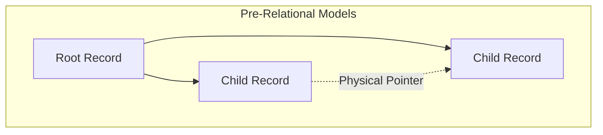
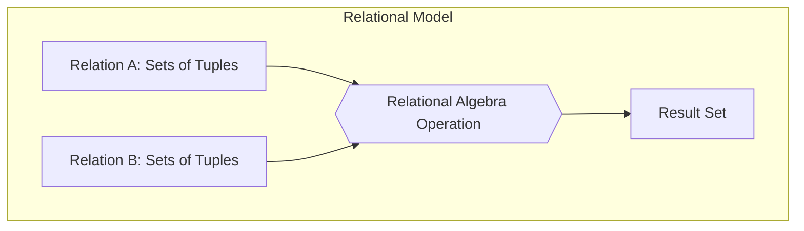
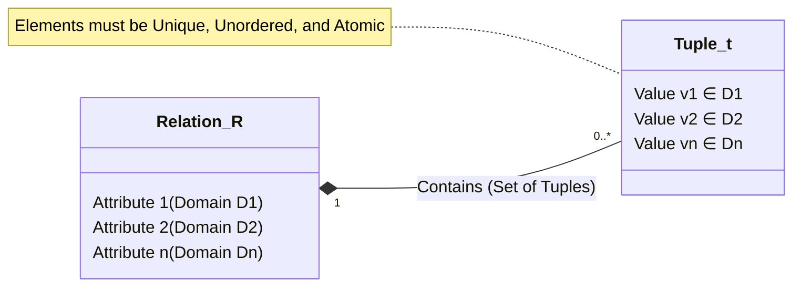
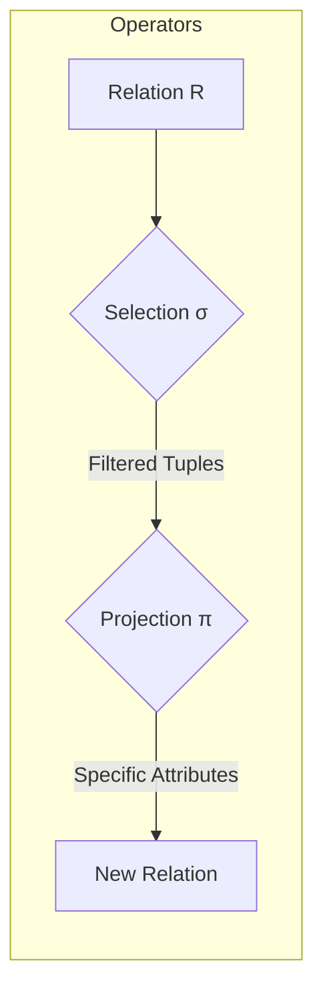
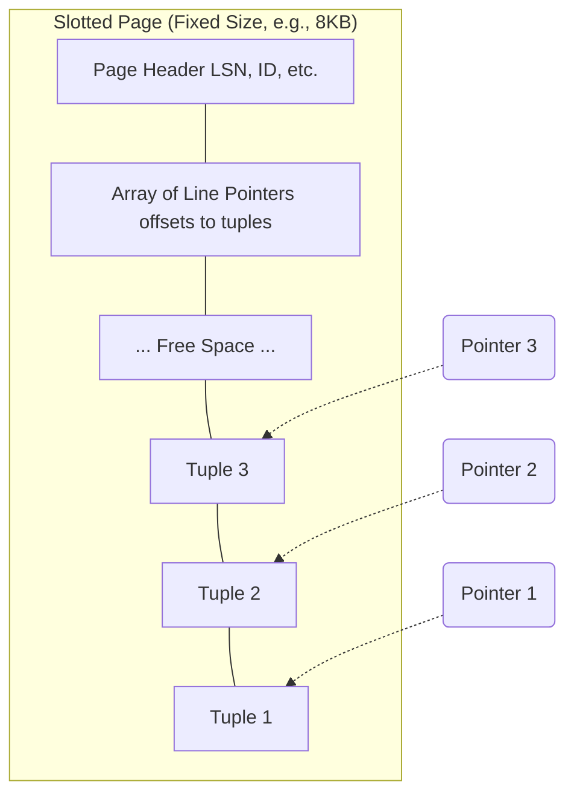
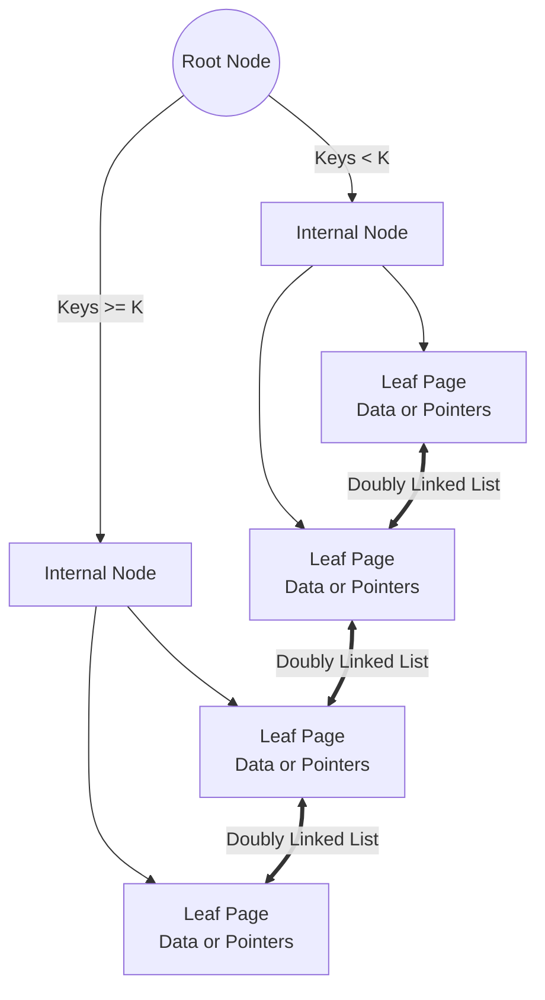
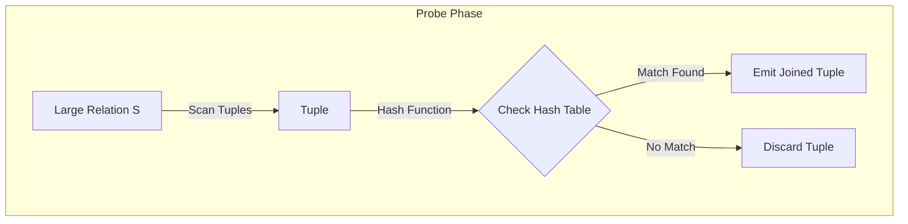
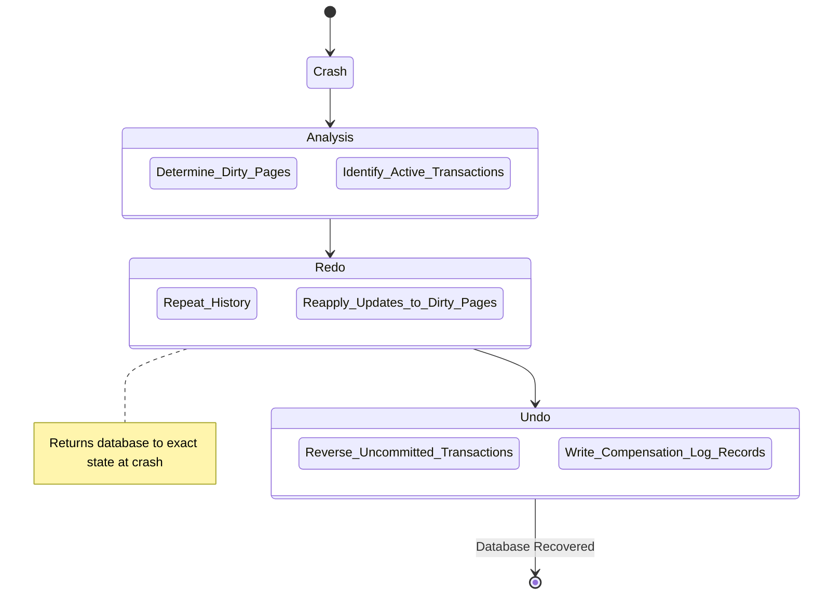

- [1 - Introduction to the Relational Paradigm](#1---introduction-to-the-relational-paradigm)
	- [1.1 - The Definition of Data Independence](#11---the-definition-of-data-independence)
- [2 - Mathematical Foundations: Set Theory and Logic](#2---mathematical-foundations-set-theory-and-logic)
	- [2.1 - The Structure of Relations](#21---the-structure-of-relations)
	- [2.2 - First-Order Predicate Logic](#22---first-order-predicate-logic)
- [3 - Relational Algebra: The Procedural Language](#3---relational-algebra-the-procedural-language)
	- [3.1 - Fundamental Operators](#31---fundamental-operators)
		- [3.1.1 - Selection ($\\sigma$)](#311---selection-sigma)
		- [3.1.2 - Projection ($\\pi$)](#312---projection-pi)
		- [3.1.3 - Rename ($\\rho$)](#313---rename-rho)
		- [3.1.4 - Cartesian Product ($\\times$)](#314---cartesian-product-times)
		- [3.1.5 - Set Union ($\\cup$)](#315---set-union-cup)
		- [3.1.6 - Set Difference ($-$)](#316---set-difference--)
	- [3.2 - Derived Operators](#32---derived-operators)
		- [3.2.1 - The Join ($\\bowtie$)](#321---the-join-bowtie)
		- [3.2.2 - Intersection ($\\cap$)](#322---intersection-cap)
		- [3.2.3 - Division ($\\div$)](#323---division-div)
	- [3.3 - Algebraic Equivalence and Optimisation](#33---algebraic-equivalence-and-optimisation)
- [4 - Relational Calculus: The Declarative Standard](#4---relational-calculus-the-declarative-standard)
	- [4.1 - Tuple Relational Calculus (TRC)](#41---tuple-relational-calculus-trc)
	- [4.2 - Domain Relational Calculus (DRC)](#42---domain-relational-calculus-drc)
	- [4.3 - Safety and Domain Independence](#43---safety-and-domain-independence)
- [5 - Storage Architecture and Buffer Management](#5---storage-architecture-and-buffer-management)
	- [5.1 - The Hierarchy of Data Organisation](#51---the-hierarchy-of-data-organisation)
	- [5.2 - Page Layout: The Slotted Page](#52---page-layout-the-slotted-page)
	- [5.3 - Buffer Management](#53---buffer-management)
	- [5.4 - Heap Files and MVCC Storage](#54---heap-files-and-mvcc-storage)
- [6 - Access Methods and Indexing Structures](#6---access-methods-and-indexing-structures)
	- [6.1 - B+ Trees](#61---b-trees)
	- [6.2 - B-Tree vs B+ Tree](#62---b-tree-vs-b-tree)
	- [6.3 - Hash Indexes](#63---hash-indexes)
- [7 - Query Execution and Join Algorithms](#7---query-execution-and-join-algorithms)
	- [7.1 - Nested Loop Join (NLJ)](#71---nested-loop-join-nlj)
	- [7.2 - Sort-Merge Join (SMJ)](#72---sort-merge-join-smj)
	- [7.3 - Hash Join (HJ)](#73---hash-join-hj)
	- [Table 1: Comparison of Join Algorithms (Approximate Costs)](#table-1-comparison-of-join-algorithms-approximate-costs)
- [8 - Query Optimisation and Cost Estimation](#8---query-optimisation-and-cost-estimation)
	- [8.1 - The System R (Selinger) Optimiser](#81---the-system-r-selinger-optimiser)
	- [8.2 - Cost Estimation Formulas](#82---cost-estimation-formulas)
	- [8.3 - Statistics and Selectivity](#83---statistics-and-selectivity)
- [9 - Transaction Management and Concurrency Control](#9---transaction-management-and-concurrency-control)
	- [9.1 - Serializability and Two-Phase Locking (2PL)](#91---serializability-and-two-phase-locking-2pl)
	- [9.2 - Multi-Version Concurrency Control (MVCC)](#92---multi-version-concurrency-control-mvcc)
- [10 - Durability and Recovery Architectures](#10---durability-and-recovery-architectures)
	- [10.1 - Write-Ahead Logging (WAL)](#101---write-ahead-logging-wal)
	- [10.2 - The ARIES Recovery Algorithm](#102---the-aries-recovery-algorithm)
- [11 - Evolution: NoSQL and NewSQL](#11---evolution-nosql-and-newsql)
	- [11.1 - The CAP Theorem and NoSQL](#111---the-cap-theorem-and-nosql)
	- [11.2 - NewSQL](#112---newsql)
- [12 - Conclusion](#12---conclusion)
- [References](#references)

# 1 - Introduction to the Relational Paradigm

The management of data stands as one of the central pillars of computer science (alongside computation and communication); it dictates how information is persisted, retrieved, and maintained with integrity over time. The Relational Model, introduced by Edgar F. Codd in his seminal 1970 paper "A Relational Model of Data for Large Shared Data Banks", represents a fundamental shift in the theoretical underpinning of data management systems. Prior to this innovation, the landscape was dominated by the Hierarchical and Network models (such as IBM's IMS and the CODASYL standard), which were characterised by a rigid coupling between the logical structure of data and its physical representation.

**Pre-Relational Models (Rigid & Navigational)**

**Relational Model (Declarative & Independent)**

In those pre-relational systems, data was organised in graph-like or tree-like structures where records were connected via physical pointers. Accessing data required the application programmer to navigate these pointers explicitly; a process often described as "navigating the database". This created a severe maintenance burden known as the lack of data independence. If the physical organisation of the data changed (for instance, if an index was added or a data path altered to improve performance), the application code that relied on the specific traversal path would fail and require rewriting. Codd's proposal was radical in its simplicity: he suggested that data should be modelled not as a graph of linked records but as mathematical relations (sets), and that access to this data should be declarative rather than imperative.

This report provides a comprehensive technical analysis of the sequel (SQL) database systems that emerged from this theory. We will explore the rigorous mathematical foundations of set theory and first-order predicate logic that govern the model; the internal architectures of storage, indexing, and buffer management that allow these systems to perform at scale; and the complex algorithms for query optimisation, concurrency control, and failure recovery that ensure the ACID (Atomicity, Consistency, Isolation, Durability) properties.

## 1.1 - The Definition of Data Independence

The primary motivation behind the relational model was to achieve data independence, which Codd identified as the ability of applications to remain invariant to changes in storage structure and access strategy.

There are two distinct levels of independence:

  * **Physical Data Independence:** The immunity of the conceptual schema (the logical definitions of tables) to changes in the internal physical schema (how data is stored on disk, page layouts, or indexes).
  * **Logical Data Independence:** The immunity of external schemas (views tailored for specific users) to changes in the conceptual schema.

By decoupling the "what" (the data required) from the "how" (the access path), relational databases allow the system to optimise execution dynamically; a capability that was impossible in the pointer-chasing world of the Network model.

# 2 - Mathematical Foundations: Set Theory and Logic

The relational model is not merely a software specification; it is a direct application of mathematical set theory to the problem of information storage. Understanding these foundations is prerequisite to understanding how SQL engines function correctly.

## 2.1 - The Structure of Relations

Formally, a relation $R$ is defined as a subset of the Cartesian product of a list of domains $D_1, D_2,..., D_n$. A domain is a set of atomic values (such as the set of integers $\mathbb{Z}$ or the set of all valid character strings). The relation is denoted as:

$$R \subseteq D_1 \times D_2 \times... \times D_n$$

An element $t \in R$ is called a tuple (conceptually a row), and each domain corresponds to an attribute (conceptually a column).

**Fundamental Properties of Relations:**
Because a relation is defined as a mathematical set (specifically, a set of tuples), it adheres to strict set-theoretic properties:

  * **Uniqueness:** A set cannot contain duplicate elements. Therefore, in a strict relational model, no two tuples in a relation can be identical. (It is noted that practical SQL implementations often relax this to allow multisets or bags for performance reasons, requiring the DISTINCT keyword to enforce set behaviour).
  * **Unordered:** Sets are unordered collections. There is no intrinsic ordering to the tuples in a relation; any perceived order is an artifact of the physical storage or retrieval method unless an ordering is explicitly imposed by a query operation.
  * **Atomicity:** The values within a tuple must be atomic; they cannot be sets or relations themselves. This requirement is formalized as the First Normal Form (1NF).

## 2.2 - First-Order Predicate Logic

The query capabilities of the relational model are grounded in First-Order Logic (FOL), also known as predicate calculus. A database instance can be viewed as a set of facts (ground atoms) that are true within the modelled universe. A query is a logical formula, and the result of the query is the set of variable assignments that make the formula true.

In this context:

  * **Predicate Symbols** map to Relation Names (e.g., $Student(x, y)$).
  * **Terms** map to constants (data values) or variables.
  * **Quantifiers** ($\exists$, $\forall$) allow the expression of complex conditions across the dataset.

Codd defined two formal languages to manipulate these relations: **Relational Algebra** (a procedural language describing operations) and **Relational Calculus** (a declarative language describing results). A fundamental theorem of database theory, Codd's Theorem, states that these two languages are effectively equivalent in expressive power; a property known as Relational Completeness.

# 3 - Relational Algebra: The Procedural Language

Relational Algebra provides a collection of operators that take one or more relations as input and produce a new relation as output. This property of closure is critical; it allows operations to be nested and composed to form complex query trees.

**Relational Algebra Operators**

## 3.1 - Fundamental Operators

There are six primitive operators from which all other relational operations can be derived.

### 3.1.1 - Selection ($\sigma$)

The selection operator acts as a horizontal filter. It returns a subset of tuples from the input relation $R$ that satisfy a specific boolean predicate $P$.

$$\sigma_P(R) = \{ t \mid t \in R \land P(t) \text{ is true} \}$$

The predicate $P$ consists of clauses involving attributes, constants, and comparison operators (such as $=, \neq, <, \leq, >, \geq$), combined with logical connectives ($\land, \lor, \neg$).

Example: To find tuples in relation $R$ where attribute $A$ exceeds 100:
$$\sigma_{A > 100}(R)$$

### 3.1.2 - Projection ($\pi$)

The projection operator acts as a vertical filter. It returns a relation containing only the specified attributes $\{A_1,..., A_k\}$ from the input relation, discarding all other attributes.

$$\pi_{A_1,..., A_k}(R) = \{ t[A_1,..., A_k] \mid t \in R \}$$

Crucially, because the output must be a valid set, any duplicate tuples resulting from the removal of distinguishing attributes are eliminated.

### 3.1.3 - Rename ($\rho$)

The rename operator allows the assignment of a name to an intermediate relation or the renaming of its attributes. This is necessary for resolving ambiguity; for instance, when joining a table to itself (self-join).

$$\rho_{S(B_1,..., B_n)}(R)$$

### 3.1.4 - Cartesian Product ($\times$)

The Cartesian product combines information from two relations, $R$ and $S$. It produces a relation containing every possible combination of tuples from $R$ and $S$.

$$R \times S = \{ (r, s) \mid r \in R, s \in S \}$$

If $R$ has $n$ tuples and $S$ has $m$ tuples, the result contains $n \times m$ tuples. This operator is computationally expensive and is rarely used in isolation in production systems; however, it serves as the theoretical basis for the Join operation.

### 3.1.5 - Set Union ($\cup$)

The union of two relations $R$ and $S$ returns all tuples that exist in either $R$ or $S$ (or both).

$$R \cup S = \{ t \mid t \in R \lor t \in S \}$$

For this operation to be valid, $R$ and $S$ must be union-compatible; meaning they must have the same number of attributes and the domains of corresponding attributes must be compatible.

### 3.1.6 - Set Difference ($-$)

The set difference $R - S$ returns tuples that are present in $R$ but not in $S$.

$$R - S = \{ t \mid t \in R \land t \notin S \}$$

## 3.2 - Derived Operators

From these primitives, we derive the operators most commonly used in SQL queries.

### 3.2.1 - The Join ($\bowtie$)

The join operator is the mechanism for correlating data across relations. It is conceptually equivalent to a Cartesian Product followed by a Selection.

**Theta Join ($\bowtie_\theta$):**
A general join where tuples from $R$ and $S$ are combined if they satisfy a predicate $\theta$.
$$R \bowtie_\theta S = \sigma_\theta(R \times S)$$

**Natural Join ($\bowtie$):**
A special case of the equi-join where the join condition is equality on all attributes with the same name in both relations. The result projects out the duplicate columns.

### 3.2.2 - Intersection ($\cap$)

Intersection returns tuples found in both relations. It is derived via Set Difference:
$$R \cap S = R - (R - S)$$

### 3.2.3 - Division ($\div$)

Division is useful for queries involving universal quantification (e.g., "Find students who have taken all required courses"). If $R$ has attributes $(A, B)$ and $S$ has attribute $(B)$, then $R \div S$ produces a relation with attribute $(A)$ containing all values $a$ such that for every tuple $b$ in $S$, the pair $(a, b)$ exists in $R$.

## 3.3 - Algebraic Equivalence and Optimisation

One of the most powerful aspects of Relational Algebra is the existence of equivalence rules that allow an expression to be transformed into a more efficient form without changing the result. These rules form the basis of the Query Optimiser.

**Selection Pushing:**
Applying a selection as early as possible reduces the size of intermediate results.
$$\sigma_P(R \bowtie S) \equiv \sigma_P(R) \bowtie S$$
(Assuming predicate $P$ only involves attributes from $R$).

**Commutativity of Joins:**
The order of joining tables does not affect the result set (though it heavily impacts performance).
$$R \bowtie S \equiv S \bowtie R$$

**Associativity of Joins:**
$$(R \bowtie S) \bowtie T \equiv R \bowtie (S \bowtie T)$$
This property allows the optimiser to explore different join orders (such as linear trees vs bushy trees) to minimise cost.

# 4 - Relational Calculus: The Declarative Standard

While Relational Algebra is procedural (specifying the sequence of operations), Relational Calculus is declarative (specifying the properties of the desired result). It is based directly on first-order predicate logic.

## 4.1 - Tuple Relational Calculus (TRC)

In TRC, variables range over tuples. A query is of the form:
$$\{ t \mid P(t) \}$$
where $t$ is a tuple variable and $P(t)$ is a logic formula.

For example, to find the names of students with a GPA greater than 3.5:
$$\{ t.name \mid Student(t) \land t.gpa > 3.5 \}$$
Here, $Student(t)$ is a predicate that is true if tuple $t$ belongs to the Student relation.

Complex queries involve quantifiers. To find students who are enrolled in 'CS101':
$$\{ t.name \mid Student(t) \land \exists e (Enrolled(e) \land e.student_id = t.id \land e.course = 'CS101') \}$$

## 4.2 - Domain Relational Calculus (DRC)

In DRC, variables range over the domain of attributes rather than entire tuples. A query takes the form:
$$\{ <x_1, x_2,..., x_n> \mid P(x_1, x_2,..., x_n) \}$$

The same query (students in 'CS101') in DRC would be:
$$\{ <n> \mid \exists i, g (Student(i, n, g) \land \exists c (Enrolled(i, c) \land c = 'CS101')) \}$$
where $Student(i, n, g)$ implies a tuple in Student with id $i$, name $n$, and gpa $g$.

## 4.3 - Safety and Domain Independence

A potential issue with pure predicate calculus is that a query like $\{ t \mid \neg Student(t) \}$ could theoretically return an infinite set of all possible tuples not in the table. To prevent this, relational languages are restricted to "safe" expressions; meaning the result must be finite and constructed only from values present in the database or the query constants.

# 5 - Storage Architecture and Buffer Management

We now transition from the mathematical theory to the engineering reality of a Relational Database Management System (RDBMS). A primary design constraint is that databases are typically much larger than the available main memory (RAM). Thus, the system is designed as a disk-oriented architecture; data resides on non-volatile storage (HDD or SSD) and is moved to volatile memory for processing.

## 5.1 - The Hierarchy of Data Organisation

The fundamental unit of storage and I/O in a database is the Page (sometimes called a Block), typically 4KB to 16KB in size. The operating system and the storage hardware often have their own page sizes; the database page size is usually a multiple of these to ensure atomicity of writes.

  * **Tuples (Rows):** The logical unit of data.
  * **Pages:** Fixed-size containers for tuples.
  * **Files/Segments:** Collections of pages representing a Table or Index.

## 5.2 - Page Layout: The Slotted Page

The internal organisation of a page must allow for variable-length records (due to VARCHAR types) and efficient deletion. The standard solution is the Slotted Page structure.

A Slotted Page contains:

  * **Header:** Stores metadata such as the page ID, checksum, transaction log sequence number (LSN), and the amount of free space.
  * **Line Pointers (ItemIds):** An array growing from the beginning of the page (after the header). Each pointer stores the offset and length of a tuple.
  * **Tuples:** The actual data records grow from the end of the page backwards.
  * **Free Space:** The "hole" between the line pointers and the tuples.

This design provides a level of indirection. External references to a tuple (often called a Record ID or RID) point to the slot index, not the byte offset. This allows the database to compact the page (move tuples to fill gaps left by deletes) without breaking external pointers, as only the internal offset in the slot array needs updating.

## 5.3 - Buffer Management

The Buffer Pool is the memory cache for pages. The execution engine cannot operate on data directly on the disk; it requests a page from the Buffer Manager.

  * **Fix/Pin:** The manager ensures the page is in RAM. If not, it evicts an existing page (writing it to disk if it is "dirty") and reads the requested page. The page is "pinned" to prevent eviction during use.
  * **Unpin:** The engine releases the page.

**Replacement Policies:**
Selecting which page to evict is critical for performance (Temporal Control).

  * **LRU (Least Recently Used):** Evicts the page unused for the longest time. While simple, it is vulnerable to "sequential flooding" (a large table scan washes out the entire cache).
  * **Clock Sweep:** An approximation of LRU. Frames are organised in a circle. Each has a reference bit. The "clock hand" sweeps; if the bit is 1, it sets it to 0 and advances. If 0, it evicts. This avoids the overhead of maintaining a sorted LRU list.
  * **LRU-K:** A more advanced algorithm that tracks the history of the last $K$ references to distinguish between frequently accessed pages and those accessed only once during a scan.

## 5.4 - Heap Files and MVCC Storage

In systems like PostgreSQL, tables are stored as Heap Files, which are unordered collections of pages. To support Multi-Version Concurrency Control (MVCC), updates do not overwrite data in place. Instead, a new version of the tuple is inserted, and the old version is marked as obsolete.

This can lead to table bloat. PostgreSQL employs a HOT (Heap-Only Tuple) optimisation. If the new version fits on the same page as the old one, the system avoids updating the indexes. Instead, the old tuple's line pointer is updated to point to a redirection, creating a chain within the page.

# 6 - Access Methods and Indexing Structures

To retrieve data efficiently without scanning the entire heap (a Sequential Scan), databases employ indexes. The choice of index structure involves a trade-off between read speed, write speed (maintenance cost), and storage space.

## 6.1 - B+ Trees

The B+ Tree is the ubiquitous indexing structure in relational databases, optimised for block-based storage. It differs from a standard binary search tree in that it is an $m$-ary tree (where $m$, the order, is typically large, e.g., 100 or 200).

**Key Characteristics:**

  * **High Fan-out:** The large number of children per node results in a very wide, shallow tree. A tree with millions of records may only be 3 or 4 levels deep, minimising the number of disk I/Os required to reach a leaf.
  * **Data at Leaves:** Internal nodes contain only routing keys. All actual data (or pointers to heap tuples) resides in the leaf nodes. This maximizes the number of keys in internal nodes, further reducing height.
  * **Sequential Linkage:** Leaf nodes are linked in a doubly-linked list. This enables efficient Range Queries (e.g., WHERE age BETWEEN 20 AND 30). Once the starting leaf is found, the system simply traverses the linked list rather than navigating the tree structure.

**Complexity:**
For a tree of order $m$ and $N$ records:

  * Search: $O(\log_m N)$
  * Insert/Delete: $O(\log_m N)$ (amortized)

Because $m$ is large, $\log_m N$ is very small. For example, $\log_{100} 1,000,000 = 3$.

## 6.2 - B-Tree vs B+ Tree

In a standard B-Tree, data pointers can exist in internal nodes. While this might allow a search to terminate early (at the root or an internal node), it reduces the fan-out because the data takes up space that could be used for keys. The B+ Tree is generally preferred for databases because the consistent depth ($O(\log_m N)$) provides predictable performance, and the leaf-chaining is superior for the range scans common in SQL.

## 6.3 - Hash Indexes

Hash indexes use a hashing function to map keys to buckets.

  * Search: $O(1)$ (average case).
  * Limitations: They strictly support equality comparisons ($=$). They cannot support range queries ($<, >$) because the hash function randomises the order of keys. They are useful for primary key lookups but less versatile than B+ Trees.

# 7 - Query Execution and Join Algorithms

The Query Executor processes the plan generated by the optimiser. The most computationally intensive operations are typically Joins. Understanding the algorithmic complexity of joins is essential for both database tuning and understanding the optimiser's choices.

Let $R$ be the outer relation with $M$ pages and $m$ tuples.
Let $S$ be the inner relation with $N$ pages and $n$ tuples.
Let $B$ be the number of available buffer pages.

## 7.1 - Nested Loop Join (NLJ)

**Naive NLJ:**
For every tuple in $R$, scan the entire table $S$.
$$Cost = M + (m \times N)$$
This is the worst-case scenario. If $R$ and $S$ are large, the cost is astronomical ($O(n \times m)$ tuple comparisons).

**Block Nested Loop Join (BNLJ):**
This algorithm optimises I/O by reading a "block" of $R$ (of size $B-2$ pages) into memory. Then it scans $S$ once for the entire block.
$$Cost = M + \left( \lceil \frac{M}{B-2} \rceil \times N \right)$$
By loading $R$ in chunks, we drastically reduce the number of times we must read $S$ from the disk.

**Index Nested Loop Join (INLJ):**
If $S$ has an index on the join column, we do not need to scan $S$. For each tuple in $R$, we perform an index lookup.
$$Cost = M + (m \times C_{index})$$
Where $C_{index}$ is the cost of traversing the B+ Tree (typically 2-4 I/Os). This is highly efficient when $R$ is small or the join is very selective.

## 7.2 - Sort-Merge Join (SMJ)

This algorithm first sorts both relations on the join attribute, then merges them in a single linear pass.

  * **Sort Phase:** Sort $R$ and $S$ (using external merge sort if they exceed memory).
  * **Merge Phase:** Iterate through both sorted streams, matching tuples.

$$Cost = Cost_{sort}(R) + Cost_{sort}(S) + (M + N)$$

This is often the preferred algorithm if the input relations are already sorted (e.g., from a B+ Tree scan) or if the output requires sorting (e.g., an ORDER BY clause).

## 7.3 - Hash Join (HJ)

The Hash Join partitions the tuples of both relations based on a hash of the join key.

**Build Phase**

**Probe Phase**

  * **Build Phase:** Scan the smaller relation ($R$) and build a hash table in memory.
  * **Probe Phase:** Scan the larger relation ($S$); for each tuple, hash the join key and check the hash table for matches.
  * **Grace Hash Join:** If the hash table does not fit in memory, the algorithm partitions both $R$ and $S$ into partitions on disk, then joins the partitions independently.

$$Cost \approx 3(M + N)$$
(assuming partitioning is required: Read+Write partitions, then Read partitions to join).

Hash Join is typically the fastest algorithm for large, unsorted, equi-joins.

## Table 1: Comparison of Join Algorithms (Approximate Costs)

| Algorithm               | Ideal Scenario                 | Complexity Profile                   |
| :---------------------- | :----------------------------- | :----------------------------------- |
| **Nested Loop (Naive)** | Tiny tables                    | High CPU, High I/O ($O(M \cdot N)$)  |
| **Block Nested Loop**   | Small outer table, no index    | Reduced I/O ($O(M \cdot N_{scans})$) |
| **Index Nested Loop**   | Large inner table with Index   | Low I/O ($O(M \cdot \log N)$)        |
| **Sort-Merge**          | Inputs already sorted          | Linear Scan ($O(M+N)$)               |
| **Hash Join**           | Large, unsorted, equality join | Linear ($O(M+N)$)                    |

# 8 - Query Optimisation and Cost Estimation

The Query Optimiser is the brain of the RDBMS. Its task is to translate the user's declarative SQL into an efficient execution plan (a tree of the algorithms described above). The difference between a good plan and a bad plan can be orders of magnitude (milliseconds vs hours).

## 8.1 - The System R (Selinger) Optimiser

The foundational approach to cost-based optimisation was established by the IBM System R project in 1979 (Selinger et al.). The algorithm uses Dynamic Programming to construct the plan bottom-up.

**Search Space Pruning:**
A query with $N$ tables has $N!$ possible join orders. To make the search feasible, System R introduced heuristics:

  * **Left-Deep Trees:** The optimiser primarily considers plans where the right-hand operand of a join is always a base table (not an intermediate result). This enables pipelining.
  * **Interesting Orders:** The optimiser tracks if an intermediate result is sorted. A more expensive Sort-Merge join might be chosen over a Hash join if the sorted output avoids a subsequent Sort operation for an ORDER BY clause.

## 8.2 - Cost Estimation Formulas

The optimiser assigns a "cost" (a dimensionless unit representing time/resources) to each candidate plan. The cost is a weighted sum of I/O and CPU:

$$Cost = (N_{page\_reads} \times W_{io}) + (N_{tuples\_processed} \times W_{cpu})$$

Typically, $W_{io} \gg W_{cpu}$ (reading from disk is much slower than processing in RAM).

## 8.3 - Statistics and Selectivity

To estimate $N_{tuples}$, the system relies on statistics stored in the system catalog:

  * $N_{tuples}(R)$: Cardinality of relation $R$.
  * $V(A, R)$: Number of distinct values for attribute $A$.
  * $Min(A), Max(A)$: Range of values.

**Selectivity ($S$):** The probability that a tuple satisfies a predicate.

  * Equality ($A = val$): Assuming uniform distribution, $S = \frac{1}{V(A, R)}$.
  * Range ($val_1 < A < val_2$): $S = \frac{val_2 - val_1}{Max(A) - Min(A)}$ (for numeric ranges).

**Histograms:**
The assumption of uniform distribution is often incorrect (data is usually skewed). Modern systems use Histograms (Equi-width or Equi-depth) to model the data distribution more accurately. An Equi-depth histogram divides the data into buckets such that each bucket has the same number of tuples, providing high resolution for dense data regions.

# 9 - Transaction Management and Concurrency Control

In a multi-user environment, ensuring data integrity is paramount. This is governed by the transaction concept, encapsulated by the ACID properties:

  * **Atomicity:** All operations in a transaction complete, or none do (All-or-Nothing).
  * **Consistency:** The transaction transforms the database from one valid state to another (satisfying constraints).
  * **Isolation:** Concurrent transactions execute as if they were running serially.
  * **Durability:** Committed changes persist despite system failures.

## 9.1 - Serializability and Two-Phase Locking (2PL)

Serializability is the gold standard for Isolation. It ensures that the outcome of concurrent transactions is equivalent to some serial execution of them. The classic mechanism to enforce this is Two-Phase Locking (2PL).

  * **Growing Phase:** The transaction acquires locks (Shared 'S' for reads, Exclusive 'X' for writes). It cannot release any lock.
  * **Shrinking Phase:** Once the transaction releases a lock, it enters the shrinking phase and cannot acquire new locks.

**Strict 2PL:** To avoid cascading aborts (where one failure forces other transactions to rollback), Strict 2PL holds all Exclusive locks until the transaction commits.

**Deadlocks:** 2PL can lead to deadlocks (Transaction A holds Resource X and waits for Y; Transaction B holds Y and waits for X). The system must employ Deadlock Detection (Wait-for graphs) or Prevention (Wait-Die or Wound-Wait schemes) to resolve this.

## 9.2 - Multi-Version Concurrency Control (MVCC)

2PL suffers from a major performance bottleneck: "Readers block Writers, and Writers block Readers." To overcome this, most modern systems (PostgreSQL, Oracle, MySQL InnoDB) use MVCC.

**MVCC Snapshot Isolation Example**

```mermaid
gantt
    title MVCC Snapshot Isolation Example
    dateFormat s
    axisFormat %S
    
    section Transaction A (Writer)
    Start       :crit, 0, 1
    Update Row 1 (Create Ver 2) :active, 1, 4
    Commit      :crit, 5, 1
    
    section Transaction B (Reader)
    Start (Snapshot Taken) :crit, 2, 1
    Read Row 1 (Sees Ver 1) :done, 3, 2
    Commit :crit, 6, 1
```

**Theory of Operation:**

  * Updates do not overwrite the data in place. Instead, they create a new version of the tuple.
  * Each version is tagged with the Transaction ID that created it (xmin) and the one that deleted/updated it (xmax).
  * **Snapshot Isolation:** When a transaction starts, it takes a logical "snapshot." It only sees tuple versions that were committed before it started.

**Advantages:**

  * Reads are non-blocking; they read the consistent version from the past while writers work on a new version.
  * Read-only transactions are extremely fast.

**Disadvantages:**

  * **Write Skew:** A specific anomaly in Snapshot Isolation where two transactions read overlapping data but update disjoint sets, violating constraints (requires Serializable Snapshot Isolation (SSI) to fix).
  * **Garbage Collection:** The system accumulates "dead tuples." A background process (like PostgreSQL's VACUUM) is required to clean up old versions, which consumes resources.

# 10 - Durability and Recovery Architectures

Atomicity and Durability are achieved through logging. The standard methodology is Write-Ahead Logging (WAL) combined with the ARIES algorithm.

## 10.1 - Write-Ahead Logging (WAL)

The fundamental rule of WAL is:

> **"Log records describing a change must be written to stable storage (disk) before the modified data page is written to disk"**.

This protocol ensures that if the system crashes (RAM is lost), the log on the disk contains a history of all changes, allowing the database to be reconstructed.

## 10.2 - The ARIES Recovery Algorithm

ARIES (Algorithm for Recovery and Isolation Exploiting Semantics) is the industry standard for recovery. It relies on Log Sequence Numbers (LSN), which are monotonically increasing identifiers for log records. Every data page stores the pageLSN of the last operation that modified it.

Upon restart after a crash, ARIES proceeds in three phases:

  * **Analysis Phase:** The system scans the log forward from the last Checkpoint. It identifies the "Dirty Page Table" (pages modified in RAM but not disk) and the "Transaction Table" (transactions active at the time of crash).
  * **Redo Phase (Repeating History):** The system scans the log forward from the earliest dirty page LSN. It re-applies all updates (including those of transactions that will eventually be aborted). This brings the database to the exact state it was in at the moment of the crash. The pageLSN is checked to ensure updates are not applied twice (idempotence).
  * **Undo Phase:** The system scans the log backward. It identifies "Loser Transactions" (those that were active but not committed). It reverses their changes using the information in the log records. To handle repeated crashes during recovery, it writes Compensation Log Records (CLRs) for every undo action.

# 11 - Evolution: NoSQL and NewSQL

While the relational model is dominant, the requirement for massive web-scale distributed systems led to alternatives.

## 11.1 - The CAP Theorem and NoSQL

The CAP Theorem (Brewer) states that a distributed system can only provide two of the three: Consistency, Availability, and Partition Tolerance.

NoSQL databases (e.g., Cassandra, MongoDB) typically sacrifice Strong Consistency (ACID) for High Availability and Partition Tolerance (BASE properties: Basically Available, Soft state, Eventual consistency). They often abandon joins and strict schemas to achieve horizontal sharding.

## 11.2 - NewSQL

NewSQL represents the modern convergence. These systems (e.g., Google Spanner, CockroachDB) aim to provide the horizontal scalability of NoSQL while retaining the ACID guarantees of the relational model. They achieve this through advanced consensus algorithms (like Paxos or Raft) and precise time synchronisation (Atomic Clocks), proving that the Relational Model is not obsolete but rather adaptable to distributed architectures.

# 12 - Conclusion

The Relational Database Management System is a triumph of theoretical computer science applied to engineering. From Codd's initial insight of applying set theory to data independence, to the rigorous logic of Relational Algebra, and down to the byte-level mechanics of B+ Trees, Slotted Pages, and ARIES recovery, the stack is designed for robustness and correctness.

Understanding these internals is not academic trivia; it is the key to mastering performance. Knowledge of the Buffer Pool explains why a random-access workload thrashes disk I/O; understanding the Selinger Optimiser explains why a missing statistic leads to a disastrous Nested Loop Join; and grasping MVCC elucidates why readers do not block writers. As data volumes grow and NewSQL architectures emerge, the fundamental principles of the Relational Model—declarative querying, logical independence, and transactional integrity—remain as relevant as ever.

# References

1. Codd, E. F. (1970). *A Relational Model of Data for Large Shared Data Banks.* Communications of the ACM, 13(6), 377–387. [Link](https://dl.acm.org/doi/10.1145/362384.362685) ([ACM Digital Library][1])

2. Codd, E. F. (1972). *Relational Completeness of Data Base Sublanguages.* In R. Rustin (Ed.), *Data Base Systems, Courant Computer Science Symposium 6*, pp. 65–98. Prentice-Hall / IBM Research Report RJ987. [Link (PDF)](https://www.inf.unibz.it/~franconi/teaching/2006/kbdb/Codd72a.pdf) ([inf.unibz.it][2])

3. Selinger, P. G., Astrahan, M. M., Chamberlin, D. D., Lorie, R. A., & Price, T. G. (1979). *Access Path Selection in a Relational Database Management System.* Proceedings of ACM SIGMOD. [Link](https://dl.acm.org/doi/10.1145/582095.582099) • [PDF](https://courses.cs.duke.edu/spring03/cps216/papers/selinger-etal-1979.pdf) ([ACM Digital Library][3])

4. Bayer, R., & McCreight, E. (1972). *Organization and Maintenance of Large Ordered Indexes.* Acta Informatica, 1(3), 173–189. [Link](https://link.springer.com/article/10.1007/BF00288683) ([SpringerLink][4])

5. O’Neil, E. J., O’Neil, P. E., & Weikum, G. (1993). *The LRU-K Page Replacement Algorithm for Database Disk Buffering.* Proceedings of ACM SIGMOD, 22(2), 297–306. [Link](https://dl.acm.org/doi/10.1145/170035.170081) ([CMU School of Computer Science][5])

6. Graefe, G. (1993). *Query Evaluation Techniques for Large Databases.* ACM Computing Surveys, 25(2), 73–170. [Link](https://dl.acm.org/doi/10.1145/152610.152611) ([ACM Digital Library][6])

7. Poosala, V., Haas, P. J., Ioannidis, Y. E., & Shekita, E. J. (1996). *Improved Histograms for Selectivity Estimation of Range Predicates.* Proceedings of ACM SIGMOD, pp. 294–305. [Link](https://dl.acm.org/doi/10.1145/233269.233342) ([cs-people.bu.edu][7])

8. Gray, J. N., Lorie, R. A., Putzolu, G. R., & Traiger, I. L. (1975). *Granularity of Locks and Degrees of Consistency in a Shared Data Base.* IBM Research Report / later reprinted in *Readings in Database Systems*. [ACM entry](https://dl.acm.org/doi/10.5555/190956.190979) • [PDF](https://infolab.usc.edu/csci599/Fall2008/papers/a-2.pdf) ([ACM Digital Library][8])

9. Bernstein, P. A., & Goodman, N. (1981). *Concurrency Control in Distributed Database Systems.* ACM Computing Surveys, 13(2), 185–221. [Link](https://dl.acm.org/doi/10.1145/356842.356846) ([people.eecs.berkeley.edu][9])

10. Bernstein, P. A., Hadzilacos, V., & Goodman, N. (1983). *Multiversion Concurrency Control—Theory and Algorithms.* ACM Transactions on Database Systems, 8(4), 465–483. [PDF](https://www.cs.cmu.edu/~15712/papers/bernstein83.pdf) ([CMU School of Computer Science][10])

11. Berenson, H., Bernstein, P. A., Gray, J., Melton, J., O’Neil, E., & O’Neil, P. (1995). *A Critique of ANSI SQL Isolation Levels.* Proceedings of ACM SIGMOD, pp. 1–10. [ACM entry](https://dl.acm.org/doi/10.1145/223784.223785) • [PDF](https://www.microsoft.com/en-us/research/wp-content/uploads/2016/02/tr-95-51.pdf) ([Microsoft][11])

12. Ports, D. R. K., & Grittner, K. (2012). *Serializable Snapshot Isolation in PostgreSQL.* Proceedings of the VLDB Endowment, 5(12), 1850–1861. [ACM entry](https://dl.acm.org/doi/10.14778/2367502.2367523) • [PDF](https://arxiv.org/abs/1208.4179) ([arXiv][12])

13. Mohan, C., Haderle, D., Lindsay, B., Pirahesh, H., & Schwarz, P. (1992). *ARIES: A Transaction Recovery Method Supporting Fine-Granularity Locking and Partial Rollbacks Using Write-Ahead Logging.* ACM Transactions on Database Systems, 17(1), 94–162. [ACM entry](https://dl.acm.org/doi/10.1145/128765.128770) • [PDF](https://web.stanford.edu/class/cs345d-01/rl/aries.pdf) ([Stanford University][13])

14. Gilbert, S., & Lynch, N. (2002). *Brewer’s Conjecture and the Feasibility of Consistent, Available, Partition-Tolerant Web Services.* ACM SIGACT News, 33(2), 51–59. [ACM entry](https://dl.acm.org/doi/10.1145/564585.564601) • [PDF](https://www.cs.princeton.edu/courses/archive/spr22/cos418/papers/cap.pdf) ([ACM Digital Library][14])

15. DeCandia, G., Hastorun, D., Jampani, M., et al. (2007). *Dynamo: Amazon’s Highly Available Key-value Store.* Proceedings of SOSP, pp. 205–220. [ACM entry](https://dl.acm.org/doi/10.1145/1323293.1294281) • [PDF](https://www.allthingsdistributed.com/files/amazon-dynamo-sosp2007.pdf) ([All Things Distributed][15])

16. Chang, F., Dean, J., Ghemawat, S., et al. (2006). *Bigtable: A Distributed Storage System for Structured Data.* Proceedings of OSDI, pp. 205–218. [USENIX page](https://www.usenix.org/conference/osdi-06/bigtable-distributed-storage-system-structured-data) • [PDF](https://research.google.com/archive/bigtable-osdi06.pdf) ([research.google.com][16])

17. Lakshman, A., & Malik, P. (2010). *Cassandra: A Decentralized Structured Storage System.* ACM SIGOPS Operating Systems Review, 44(2), 35–40. [ACM entry](https://dl.acm.org/doi/10.1145/1773912.1773922) • [PDF](https://www.cs.cornell.edu/projects/ladis2009/papers/lakshman-ladis2009.pdf) ([Cornell Computer Science][17])

18. Corbett, J. C., Dean, J., Epstein, M., et al. (2012). *Spanner: Google’s Globally-Distributed Database.* Proceedings of OSDI, pp. 251–264. [USENIX page](https://www.usenix.org/conference/osdi12/technical-sessions/presentation/corbett) • [PDF](https://www.usenix.org/system/files/conference/osdi12/osdi12-final-16.pdf) ([USENIX][18])

19. Taft, R., Sharif, I., Matei, A., et al. (2020). *CockroachDB: The Resilient Geo-Distributed SQL Database.* Proceedings of ACM SIGMOD, pp. 651–668. [ACM entry](https://dl.acm.org/doi/10.1145/3318464.3386134) ([ACM Digital Library][19])

[1]: https://dl.acm.org/doi/10.1145/362384.362685?utm_source=chatgpt.com "A relational model of data for large shared data banks"
[2]: https://www.inf.unibz.it/~franconi/teaching/2006/kbdb/Codd72a.pdf?utm_source=chatgpt.com "Relational Completeness of Data Base Sublanguages"
[3]: https://dl.acm.org/doi/10.1145/582095.582099?utm_source=chatgpt.com "Access path selection in a relational database ..."
[4]: https://link.springer.com/article/10.1007/BF00288683?utm_source=chatgpt.com "Organization and maintenance of large ordered indexes"
[5]: https://www.cs.cmu.edu/~natassa/courses/15-721/papers/p297-o_neil.pdf?utm_source=chatgpt.com "The LRU-K Page Replacement Algorithm For Database ..."
[6]: https://dl.acm.org/doi/10.1145/152610.152611?utm_source=chatgpt.com "Query evaluation techniques for large databases"
[7]: https://cs-people.bu.edu/mathan/reading-groups/papers-classics/histograms.pdf?utm_source=chatgpt.com "Improved Histograms for Selectivity Estimation of Range ..."
[8]: https://dl.acm.org/doi/10.5555/190956.190979?utm_source=chatgpt.com "Granularity of locks and degrees of consistency in a shared ..."
[9]: https://people.eecs.berkeley.edu/~brewer/cs262/concurrency-distributed-databases.pdf?utm_source=chatgpt.com "Concurrency Control in Distributed Database Systems"
[10]: https://www.cs.cmu.edu/~./15712/papers/bernstein83.pdf?utm_source=chatgpt.com "Multiversion Concurrency Control-Theory and Algorithms"
[11]: https://www.microsoft.com/en-us/research/wp-content/uploads/2016/02/tr-95-51.pdf?utm_source=chatgpt.com "A Critique of ANSI SQL Isolation Levels"
[12]: https://arxiv.org/abs/1208.4179?utm_source=chatgpt.com "Serializable Snapshot Isolation in PostgreSQL"
[13]: https://web.stanford.edu/class/cs345d-01/rl/aries.pdf?utm_source=chatgpt.com "ARIES: A Transaction Recovery Method Supporting Fine- ..."
[14]: https://dl.acm.org/doi/10.1145/564585.564601?utm_source=chatgpt.com "Brewer's conjecture and the feasibility of consistent, ..."
[15]: https://www.allthingsdistributed.com/files/amazon-dynamo-sosp2007.pdf?utm_source=chatgpt.com "Dynamo: Amazon's Highly Available Key-value Store"
[16]: https://research.google.com/archive/bigtable-osdi06.pdf?utm_source=chatgpt.com "Bigtable: A Distributed Storage System for Structured Data"
[17]: https://www.cs.cornell.edu/projects/ladis2009/papers/lakshman-ladis2009.pdf?utm_source=chatgpt.com "Cassandra - A Decentralized Structured Storage System"
[18]: https://www.usenix.org/system/files/conference/osdi12/osdi12-final-16.pdf?utm_source=chatgpt.com "Spanner: Google's Globally-Distributed Database"
[19]: https://dl.acm.org/doi/10.1145/3318464.3386134?utm_source=chatgpt.com "CockroachDB: The Resilient Geo-Distributed SQL Database"
