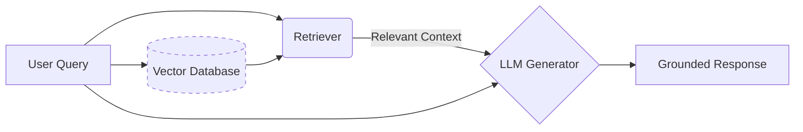
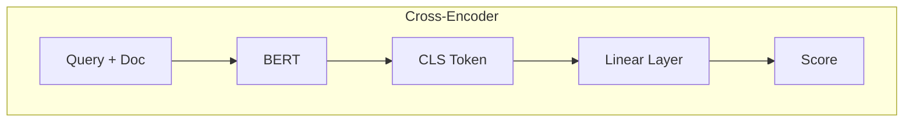
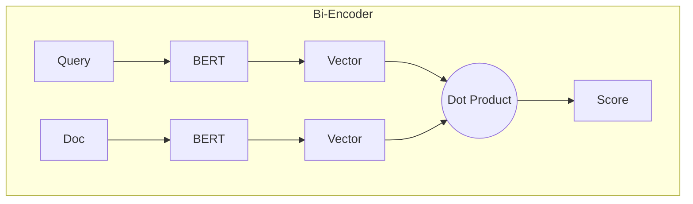
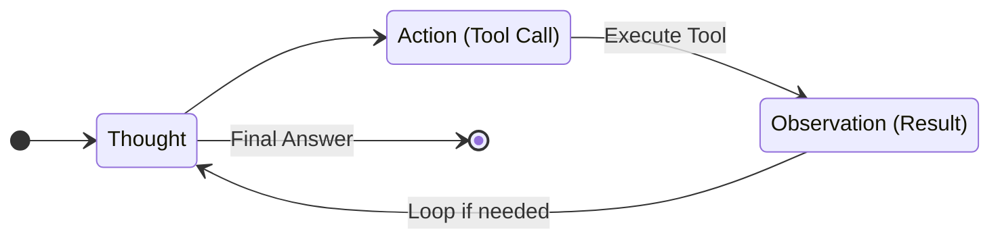
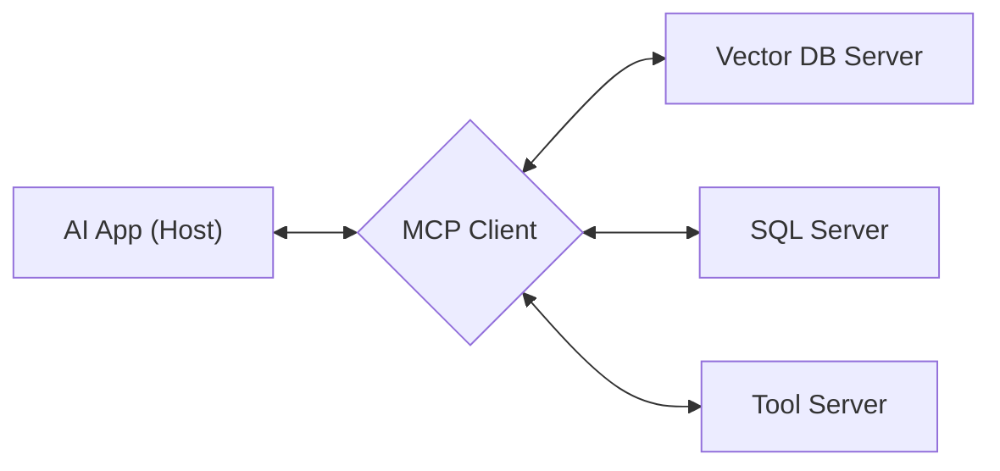

- [1 - Introduction: The Parametric Memory Bottleneck and the Rise of Non-Parametric Intelligence](#1---introduction-the-parametric-memory-bottleneck-and-the-rise-of-non-parametric-intelligence)
- [2 - Theoretical Framework and Mathematical Formulation](#2---theoretical-framework-and-mathematical-formulation)
  - [2.1 - The Generative Probability Model](#21---the-generative-probability-model)
  - [2.2 - Dense Passage Retrieval (DPR) and Bi-Encoder Mathematics](#22---dense-passage-retrieval-dpr-and-bi-encoder-mathematics)
    - [2.2.1 - Training Objective: Contrastive Loss with In-Batch Negatives](#221---training-objective-contrastive-loss-with-in-batch-negatives)
  - [2.3 - Cross-Encoder Theory and Re-ranking](#23---cross-encoder-theory-and-re-ranking)
  - [2.4 - Probability Density and RAG](#24---probability-density-and-rag)
- [3 - The Retrieval Subsystem: Vector Databases and Indexing Mechanics](#3---the-retrieval-subsystem-vector-databases-and-indexing-mechanics)
  - [3.1 - The Curse of Dimensionality and Approximate Nearest Neighbors](#31---the-curse-of-dimensionality-and-approximate-nearest-neighbors)
  - [3.2 - Hierarchical Navigable Small World (HNSW)](#32---hierarchical-navigable-small-world-hnsw)
    - [3.2.1 - Graph Structure and Traversal](#321---graph-structure-and-traversal)
    - [3.2.2 - Algorithmic Parameters and Complexity](#322---algorithmic-parameters-and-complexity)
  - [3.3 - Semantic Chunking Algorithms](#33---semantic-chunking-algorithms)
  - [3.4 - The Embedding Model Mismatch Risk](#34---the-embedding-model-mismatch-risk)
- [4 - Architectural Paradigms: From Naive to Modular RAG](#4---architectural-paradigms-from-naive-to-modular-rag)
  - [4.1 - Naive RAG](#41---naive-rag)
  - [4.2 - Advanced RAG](#42---advanced-rag)
    - [4.2.1 - Pre-Retrieval: Query Transformation](#421---pre-retrieval-query-transformation)
    - [4.2.2 - Post-Retrieval: Fusion and Re-ranking](#422---post-retrieval-fusion-and-re-ranking)
  - [4.3 - Modular RAG](#43---modular-rag)
- [5 - Agentic Workflows and Self-Correcting RAG](#5---agentic-workflows-and-self-correcting-rag)
  - [5.1 - The ReAct Agent Paradigm](#51---the-react-agent-paradigm)
  - [5.2 - Self-RAG: Learning to Critique](#52---self-rag-learning-to-critique)
  - [5.3 - Corrective RAG (CRAG)](#53---corrective-rag-crag)
- [6 - Structured Knowledge: The GraphRAG Revolution](#6---structured-knowledge-the-graphrag-revolution)
  - [6.1 - Graph Construction and Community Detection](#61---graph-construction-and-community-detection)
  - [6.2 - Query Processing: Global vs. Local Search](#62---query-processing-global-vs-local-search)
  - [6.3 - Comparison: Vector RAG vs. GraphRAG](#63---comparison-vector-rag-vs-graphrag)
- [7 - System Interoperability: The Model Context Protocol (MCP)](#7---system-interoperability-the-model-context-protocol-mcp)
  - [7.1 - Architecture and Relationship to RAG](#71---architecture-and-relationship-to-rag)
  - [7.2 - Advantages of MCP Standardisation](#72---advantages-of-mcp-standardisation)
- [8 - Strategic Trade-offs: RAG vs. Fine-Tuning vs. Long Context](#8---strategic-trade-offs-rag-vs-fine-tuning-vs-long-context)
  - [8.1 - Fine-Tuning](#81---fine-tuning)
  - [8.2 - Long Context Windows](#82---long-context-windows)
  - [8.3 - The Hybrid Future](#83---the-hybrid-future)
- [9 - Conclusion](#9---conclusion)
  - [References](#references)


# 1 - Introduction: The Parametric Memory Bottleneck and the Rise of Non-Parametric Intelligence

The trajectory of Natural Language Processing (NLP) over the past decade has been characterised by the aggressive scaling of model parameters This is a trend exemplified by the evolution from early Recurrent Neural Networks (RNNs) to the Transformer architecture that underpins contemporary Large Language Models (LLMs). Models such as GPT-5, Claude 4.5, and Gemini 3 and others have demonstrated remarkable proficiency in linguistic reasoning, code synthesis, and creative generation. However, despite their impressive capabilities, these models remain constrained by a fundamental architectural limitation: the reliance on parametric memory.

Parametric memory refers to the knowledge stored within the synaptic weights (parameters) of the neural network, acquired during the computationally intensive pre-training phase. This form of memory is static, immutable without retraining, and inherently opaque. It leads to two primary failure modes in deployment:

* **Knowledge Obsolescence:** The model's world knowledge is frozen at the moment the pre-training corpus is finalised. For instance, a model trained in 2021 cannot natively reason about geopolitical events or scientific breakthroughs occurring in 2023.
* **Hallucination:** When parametric memory is insufficient or imperfectly recalled, the probabilistic nature of the autoregressive decoder forces the model to fill gaps with statistically plausible but factually incorrect tokens, a phenomenon driven by the model's objective to minimise perplexity rather than ensure factual accuracy.

Retrieval Augmented Generation (RAG) represents a paradigm shift designed to transcend these limitations by decoupling the reasoning engine (the LLM) from the knowledge base. Rather than forcing the model to memorise the entire corpus within its weights, RAG introduces a non-parametric memory component (typically a dense vector index) that the model can query dynamically at inference time. This hybrid architecture enables the generative model to access vast, up-to-date, and proprietary datasets without the prohibitive cost of continuous pre-training.



> High-level architectural decoupling in RAG systems.

This report provides an exhaustive technical analysis of RAG systems. It explores the core theoretical underpinnings, mathematical formulations of retrieval and ranking, advanced architectural patterns (including Modular RAG and GraphRAG), and the emerging integration with Agentic AI workflows and the Model Context Protocol (MCP).


# 2 - Theoretical Framework and Mathematical Formulation

To understand RAG fundamentally, one must analyse how it alters the probabilistic framework of text generation. A standard autoregressive language model functions by estimating the probability distribution of a target token sequence $y$ conditioned solely on an input sequence $x$.

## 2.1 - The Generative Probability Model

In a standard parametric Transformer, the probability of generating a sequence $y$ is the product of the conditional probabilities of each token $y_t$, given the input $x$ and the preceding tokens $y_{1:t-1}$:

$$P(y|x; \theta) = \prod_{t=1}^{T} P(y_t | y_{1:t-1}, x; \theta)$$

Here, $\theta$ represents the fixed parameters of the model. The knowledge required to predict $y_t$ must be encoded within $\theta$.

RAG redefines this process by treating the retrieval of relevant information as a latent variable $z$. The generation of the output $y$ is thus formulated as a marginalisation over the set of retrieved documents $z$ from a corpus $\mathcal{D}$. This implies that the model essentially "integrates out" the retrieved context to form its prediction. The joint probability is expressed as:

$$P(y|x) = \sum_{z \in \text{TopK}(x)} P(y|x, z) P(z|x)$$

This equation highlights the two distinct components of the RAG architecture:

  * **The Retriever Model ($P(z|x)$):** This component calculates the probability of a document $z$ being relevant to the query $x$. In modern implementations, this is typically a dense retriever that outputs a similarity score.
  * **The Generator Model ($P(y|x, z)$):** This component (the LLM) generates the output text conditioned on both the original query $x$ and the retrieved document $z$.

This formulation is significant because it explicitly introduces uncertainty from the retrieval step into the generation process. If the retrieval probability mass $P(z|x)$ is distributed over irrelevant documents, the generator's condition $P(y|x,z)$ becomes noisy, leading to poor output. Conversely, if $P(z|x)$ is highly peaked around the ground-truth document, the generator acts as a reading comprehension model.

## 2.2 - Dense Passage Retrieval (DPR) and Bi-Encoder Mathematics

While early retrieval systems utilised sparse lexical methods like BM25 (which relies on term frequency-inverse document frequency), state-of-the-art RAG implementations predominantly utilise Dense Passage Retrieval (DPR). DPR maps both queries and documents into a shared, continuous, high-dimensional vector space (embedding space) where semantic similarity corresponds to geometric proximity.

The standard architecture for DPR is the Bi-Encoder. This architecture employs two independent BERT-based neural networks (or similar Transformer encoders):

  * **Question Encoder ($E_Q$):** Maps the input query $q$ to a real-valued vector $v_q \in \mathbb{R}^d$.
  * **Passage Encoder ($E_P$):** Maps a text passage $p$ to a vector $v_p \in \mathbb{R}^d$.

The similarity score between a query and a passage is typically defined as the dot product of their respective vector representations, usually derived from the token output of the Transformer:

$$\text{sim}(q, p) = E_Q(q)^\top E_P(p)$$

Using the dot product (or cosine similarity if vectors are normalised) is computationally advantageous because it allows for highly optimised Maximum Inner Product Search (MIPS) using matrix multiplication.

### 2.2.1 - Training Objective: Contrastive Loss with In-Batch Negatives

The efficacy of the Bi-Encoder depends on the quality of the embedding space. The encoders must be trained such that relevant pairs are pulled together while irrelevant pairs are pushed apart. The standard training objective is the negative log-likelihood of the positive passage, utilising a technique known as in-batch negatives.

Consider a training mini-batch of size $B$, containing $B$ query-passage pairs $\{(q_i, p_i^+)\}_{i=1}^B$. For a given query $q_i$, the corresponding passage $p_i^+$ is the positive sample. Crucially, the other $B-1$ passages in the same batch $\{p_j^+\}_{j \neq i}$ are treated as negative samples. This efficient reuse of batch computation avoids the need to explicitly mine negative samples from the entire corpus for every step.

The loss function for a single query $q_i$ is derived as:

$$L(q_i, p_i^+) = -\log \frac{e^{\text{sim}(q_i, p_i^+) }}{e^{\text{sim}(q_i, p_i^+)} + \sum_{j=1, j \neq i}^{B} e^{\text{sim}(q_i, p_j^+)}}$$

This equation represents a softmax classification loss where the model attempts to classify the correct passage $p_i^+$ from the set of $B$ passages in the batch. By minimising this loss, the model learns to maximise the inner product $\text{sim}(q_i, p_i^+)$ relative to the inner products of unrelated pairs.

## 2.3 - Cross-Encoder Theory and Re-ranking

While Bi-Encoders are highly efficient for the initial retrieval step (allowing pre-computation of document embeddings), they suffer from a "representation bottleneck." Because the query and document are encoded independently, the mechanism cannot capture deep, token-level interactions or non-linear dependencies between specific query terms and document terms.

To address this, high-performance RAG pipelines often employ a Cross-Encoder for a re-ranking stage. A Cross-Encoder processes the query and document simultaneously within a single Transformer pass.

The input to the Cross-Encoder is the concatenation of the query and the candidate document:

$$\text{Input} = \text{} \oplus q \oplus \text{} \oplus d \oplus \text{}$$

This sequence allows the Transformer's self-attention mechanism to attend to every query token in the context of every document token (full $N^2$ attention). The output of the token is then passed through a linear layer and a sigmoid activation function to produce a relevance score.

$$s(q, d) = \sigma(W \cdot \text{Transformer}(\text{concat}(q, d)))$$

**Cross-Encoder (Re-Ranking)**


**Bi-Encoder (Retrieval)**


> Architectural difference between Bi-Encoders ($O(1)$ inference) and Cross-Encoders $(O(N^{2	})$ attention).

**Comparison of Computational Complexity:**

  * **Bi-Encoder:** $O(1)$ similarity computation at inference (dot product), after $O(N)$ offline indexing. Suitable for retrieving from millions of documents.
  * **Cross-Encoder:** $O(L^2)$ complexity per pair (where $L$ is sequence length) due to the Transformer attention mechanism. Suitable only for re-ranking a small set (e.g., top 50) of candidates.10

## 2.4 - Probability Density and RAG

Research into the mathematical formulation of RAG reveals that LLMs and RAG operate in complementary probabilistic spaces. The LLM encodes $P(\text{language patterns} | \text{training data})$, which is excellent for structural reasoning and syntax. RAG provides $P(\text{facts} | \text{query}, \text{knowledge base})$, which grounds the generation in specific data.

Furthermore, analyses of the "First Token Probability" in RAG systems indicate that the confidence distribution of the first generated token can serve as a reliable proxy for retrieval quality. When relevant documents are retrieved, the probability mass for the correct next token (the answer) becomes significantly more peaked (lower entropy) compared to generation without retrieval or with irrelevant context.


# 3 - The Retrieval Subsystem: Vector Databases and Indexing Mechanics

The retrieval component of RAG relies on the ability to perform similarity searches across massive datasets with low latency. This requirement has given rise to specialised Vector Databases (e.g., Pinecone, Milvus, Weaviate) that implement advanced indexing algorithms.

## 3.1 - The Curse of Dimensionality and Approximate Nearest Neighbors

Searching for the exact nearest neighbour in high-dimensional space (e.g., 768 dimensions for BERT, 1536 for OpenAI's ada-002) is computationally expensive. Brute-force search scales linearly with the dataset size $N$, which is unacceptable for latency-sensitive applications. Therefore, RAG systems utilise Approximate Nearest Neighbour (ANN) algorithms that trade a small amount of accuracy for logarithmic time complexity.

## 3.2 - Hierarchical Navigable Small World (HNSW)

The industry standard for vector indexing in RAG is the Hierarchical Navigable Small World (HNSW) algorithm. HNSW is a graph-based index that combines the properties of Small World Networks with Probabilistic Skip Lists.

### 3.2.1 - Graph Structure and Traversal

A Small World Network is a graph where most nodes are not neighbours, but the neighbours of any given node are likely to be neighbours of each other, and most nodes can be reached from every other node by a small number of hops. HNSW extends this by creating a multi-layered hierarchy:

  * **Layer 0 (Bottom Layer):** Contains all data points (vectors) with high connectivity (short-range links). This layer represents the high-resolution proximity graph.
  * **Upper Layers:** Contain a subset of data points with long-range links. These layers act as "expressways" or a coarse navigation mesh.

The search process begins at the highest layer. The algorithm performs a greedy search, moving to the neighbour closest to the query vector. When it reaches a local minimum (a node closer to the query than all its neighbours) in the current layer, it descends to the next layer below, using the current node as the entry point.

### 3.2.2 - Algorithmic Parameters and Complexity

The search complexity of HNSW is $O(\log N)$, a massive improvement over linear scanning. Two key parameters control the trade-off between recall (accuracy) and latency:

  * **efConstruction:** Defines the size of the dynamic candidate list during index construction. A higher value leads to a higher quality graph (better connectivity) but increases indexing time.
  * **efSearch:** Defines the size of the candidate queue during the search phase. A higher value examines more neighbours, increasing recall at the cost of higher query latency.

## 3.3 - Semantic Chunking Algorithms

Before data can be indexed, it must be segmented into chunks. While naive approaches use fixed character or token counts (e.g., 512 tokens with 10% overlap), this often breaks semantic context (e.g., splitting a sentence or a function definition in half).

Semantic Chunking is a sophisticated method that respects the semantic boundaries of the text. It involves calculating the cosine similarity between the embeddings of consecutive sentences.

Let $e_i$ and $e_{i+1}$ be the vector embeddings of sentence $i$ and sentence $i+1$. We define a breakpoint (a chunk boundary) if the similarity drops below a dynamic threshold $\tau$:

$$\text{Break if } \text{sim}(e_i, e_{i+1}) < \tau$$

If the similarity is high, the sentences are semantically related and should stay in the same chunk. If the similarity drops, it indicates a topic shift. This method ensures that chunks represent coherent semantic units, which significantly improves the precision of the retriever.

## 3.4 - The Embedding Model Mismatch Risk

A critical engineering detail in RAG systems is the consistency of the embedding model. Using one model (e.g., all-MiniLM-L6-v2) to index documents and a different model (e.g., openai-text-embedding-3) to encode user queries results in Geometric Incoherence. The vectors produced by different models reside in different latent spaces; thus, their dot product yields mathematically meaningless results. The embedding model essentially defines the "physics" of the vector space, and strict consistency is mandatory for retrieval functionality.


# 4 - Architectural Paradigms: From Naive to Modular RAG

The implementation of RAG has evolved from simple linear pipelines to complex, adaptive systems. The literature classifies these architectures into three distinct levels: Naive, Advanced, and Modular.4

## 4.1 - Naive RAG

The "Naive" or "Baseline" RAG implementation follows a strictly linear "Retrieve-then-Read" workflow:

1.  **Index:** The corpus is chunked and stored in a vector database.
2.  **Retrieve:** The user query is vectorised, and a top-$k$ similarity search is performed.
3.  **Generate:** The retrieved chunks are concatenated directly into the system prompt of the LLM along with the user query.

**Failure Modes:** Naive RAG is susceptible to several issues:

  * **Precision/Recall Trade-off:** Dense retrieval may return irrelevant chunks that share high semantic similarity but lack the specific answer.
  * **"Lost in the Middle":** LLMs exhibit a U-shaped attention curve, where they effectively utilise information at the start and end of the context window but often overlook information buried in the middle. Concatenating too many chunks can degrade performance.

## 4.2 - Advanced RAG

Advanced RAG introduces sophisticated processing steps before and after the retrieval mechanism to mitigate the limitations of the Naive approach.

### 4.2.1 - Pre-Retrieval: Query Transformation

User queries are often short, ambiguous, or poorly formulated for semantic search. Pre-retrieval strategies use the LLM to rewrite the query to optimise retrieval.

  * **Query Expansion:** The LLM generates multiple variations of the query or decomposes a complex query into simpler sub-questions.
  * **HyDE (Hypothetical Document Embeddings):** The LLM generates a hypothetical answer to the query. This hallucinated answer is then vectorised and used for retrieval. The theoretical insight here is that the hypothetical answer shares much closer vector similarity to the actual answer documents than the raw question does.

### 4.2.2 - Post-Retrieval: Fusion and Re-ranking

Once documents are retrieved, they must be refined.

  * **Re-ranking:** As discussed in Section 2.3, a Cross-Encoder is used to re-score the top-$k$ results from the Bi-Encoder, filtering out false positives.
  * **RAG Fusion & Reciprocal Rank Fusion (RRF):** When combining results from multiple retrievers (e.g., a keyword-based BM25 retriever and a semantic vector retriever), their raw scores are often on different scales and cannot be summed directly. RRF provides a rank-based formula for fusion.

The RRF score for a document $d \in D$ is calculated as:

$$\text{RRF}(d) = \sum_{r \in R} \frac{1}{k + \text{rank}_r(d)}$$

Where:

  * $R$ is the set of rankers (e.g., Dense + Sparse).
  * $\text{rank}_r(d)$ is the rank position of document $d$ in the list produced by ranker $r$.
  * $k$ is a smoothing constant (typically 60) that prevents high-ranking documents in a single list from dominating documents that are consistently ranked moderately high across all lists.

## 4.3 - Modular RAG

Modular RAG abandons the rigid pipeline structure in favour of a dynamic system composed of independent modules (Retriever, Generator, Router, Rewriter) and operators. This allows for adaptive execution patterns:

  * **Conditional Routing:** A classifier determines if the query requires retrieval at all (e.g., "Hi, how are you?" needs no retrieval) or which specific knowledge base to query (e.g., SQL DB vs. Vector DB).
  * **Iterative Retrieval:** The generator may produce a partial answer and request further information, triggering a second retrieval step based on the initial context.
  * **Branching:** Parallel retrieval from diverse sources followed by aggregation.


# 5 - Agentic Workflows and Self-Correcting RAG

The integration of RAG with Agentic AI represents the frontier of current research. In these systems, RAG is not just a passive lookup step but a tool used by an autonomous agent to verify, critique, and correct its own reasoning.

## 5.1 - The ReAct Agent Paradigm

The ReAct (Reason + Act) framework is the foundational pattern for agentic RAG. Instead of a single inference pass, the model operates in a continuous loop: Thought $\rightarrow$ Action $\rightarrow$ Observation.



> The ReAct Loop allows the model to "think" before fetching data.

  * **Thought:** The agent reasons about the current state and the user query (e.g., "The user is asking about Q3 sales; I need to query the sales database, not the HR policy documents.").
  * **Action:** The agent constructs a tool call. In modern implementations, this is often structured as a JSON payload to ensure deterministic execution.

<!-- end list -->

```json
{
  "tool": "vector_search",
  "parameters": {
    "query": "Q3 2023 sales performance summary",
    "filter": {"department": "sales"}
  }
}
```

  * **Observation:** The external tool executes the action and returns the data (the retrieved chunks).
  * **Repeat:** The agent ingests the observation and decides whether to generate the final answer or perform another action (e.g., "The retrieved data is incomplete; I need to search for the Q3 appendix.").

## 5.2 - Self-RAG: Learning to Critique

Self-Reflective RAG (Self-RAG) is a framework developed by Asai et al. 34 that fine-tunes the LLM to generate special "reflection tokens" alongside the text. These tokens allow the model to critique its own retrieval and generation quality during inference.

The framework introduces four types of reflection tokens:

  * **Retrieve:** Decides if retrieval is necessary for the current segment.
  * **IsRel:** Evaluates if the retrieved passage is relevant to the query.
  * **IsSup:** Checks if the generated response is fully supported by the retrieved evidence (hallucination check).
  * **IsUse:** Evaluates if the response is useful to the user.

**Training and Inference:** The Critic Model is trained using distillation from a stronger model (like Claude Opus 4.5 distilling into Haiku 4.5). During inference, the model employs a segment-level beam search. It generates multiple candidate segments and scores them based on a linear weighted sum of the reflection token probabilities. This effectively imposes a "soft constraint" that forces the model to prefer trajectories that are factually grounded and supported by evidence.

## 5.3 - Corrective RAG (CRAG)

Corrective RAG (CRAG) specifically addresses the issue of poor retrieval quality ("garbage in, garbage out"). It introduces a lightweight Retrieval Evaluator that assesses the overall quality of the retrieved documents for a query.

Based on the confidence score of the evaluator, the system triggers one of three discrete actions:

  * **Correct:** If the confidence is high, the system proceeds with standard RAG generation.
  * **Incorrect:** If the confidence is low (the documents are irrelevant), the system discards the retrieved results and may trigger a fallback mechanism, such as a web search or generating a refusal.
  * **Ambiguous:** If the confidence is mixed, the system combines the vector search results with a web search to broaden the context and resolve the ambiguity.

CRAG also employs a "decompose-then-recompose" algorithm to refine the retrieved documents, filtering out irrelevant sections within valid documents to maximise the signal-to-noise ratio for the generator.


# 6 - Structured Knowledge: The GraphRAG Revolution

Traditional RAG relies heavily on vector similarity search. While effective for finding local context (chunks that explicitly mention query keywords), vector search struggles with "Global Questions"—queries that require aggregating information across the entire corpus to identify themes, trends, or complex relationships.38

For example, asking "What are the evolving relationships between the major factions in this history book?" requires a holistic understanding that no single text chunk contains. Microsoft's GraphRAG addresses this by combining the unstructured retrieval of LLMs with the structured reasoning of Knowledge Graphs.

## 6.1 - Graph Construction and Community Detection

GraphRAG involves a multi-stage indexing process:

1.  **Entity & Relationship Extraction:** An LLM processes the raw text chunks to identify entities (nodes) and their relationships (edges), outputting a structured list of tuples (e.g., (Entity A, "supports", Entity B)).
2.  **Community Detection:** The system applies the Leiden algorithm (a hierarchical clustering algorithm superior to Louvain for graph connectivity) to the knowledge graph. This partitions the graph into communities of closely related entities.
3.  **Summarization:** The system generates natural language summaries for each community at varying levels of the hierarchy (e.g., root-level summaries vs. leaf-level summaries).

## 6.2 - Query Processing: Global vs. Local Search

GraphRAG introduces two distinct query modes:

  * **Global Search:** To answer high-level questions, the system does not retrieve raw text chunks. Instead, it iterates over the Community Summaries. This allows the system to perform a "map-reduce" style operation: generating partial answers from each relevant community summary and then aggregating them into a final holistic response. This enables the model to answer questions about the "whole" dataset.
  * **Local Search and DRIFT:** For queries about specific entities, GraphRAG utilises DRIFT (Dynamic Reasoning and Inference with Flexible Traversal). DRIFT combines:
      * **Vector Search:** To find the initial entry points (entities) in the graph.
      * **Graph Traversal:** The system traverses the edges of the graph to find related entities that may not be semantically similar in vector space (e.g., second-order connections) but are crucial for the answer. This creates a "long context" derived from relationships rather than just keyword proximity.

## 6.3 - Comparison: Vector RAG vs. GraphRAG

| Feature                  | Standard Vector RAG                 | GraphRAG                                            |
| :----------------------- | :---------------------------------- | :-------------------------------------------------- |
| **Data Structure**       | Flat list of embeddings             | Hierarchical Knowledge Graph                        |
| **Retrieval Mechanism**  | Cosine Similarity (Vector Space)    | Graph Traversal + Community Summaries               |
| **Ideal Query Type**     | "Who", "What", "When" (Fact lookup) | "How", "Why", "Summarise themes" (Global reasoning) |
| **Context Completeness** | Limited by top\_k chunks            | Synthesised from community clusters                 |
| **Computational Cost**   | Low (Indexing is fast)              | High (Requires extensive LLM calls for extraction)  |


# 7 - System Interoperability: The Model Context Protocol (MCP)

As RAG systems transition from experimental prototypes to production-grade enterprise infrastructure, standardisation becomes a critical challenge. The Model Context Protocol (MCP) has emerged as an open standard for connecting AI models to external data and tools.

## 7.1 - Architecture and Relationship to RAG

MCP defines a standardised "Client-Host-Server" architecture:

  * **MCP Host:** The AI application (e.g., Claude Desktop, IDE, Chat Interface).
  * **MCP Client:** The connector within the Host that speaks the protocol.
  * **MCP Server:** The provider of context or capabilities.



> MCP Topology allowing standardized connections to RAG Knowledge Servers.

Crucially, RAG acts as an MCP Server in this topology. Instead of hard-coding vector database connections into every AI application, an organisation can build a centralised "Knowledge RAG Server" that exposes an MCP interface. Any MCP-compliant client can then query this server to retrieve context or perform actions.

## 7.2 - Advantages of MCP Standardisation

  * **Interoperability:** Solves the "M $\times$ N" problem of connecting M models to N data sources. One standard protocol connects them all.
  * **Security:** MCP supports sandboxing and clear permission boundaries, ensuring that the LLM (the Host) accesses data only through defined interfaces rather than direct database access.
  * **Agentic Capabilities:** MCP is inherently designed for agentic workflows, supporting not just data retrieval ("Resources") but also executable actions ("Tools") and template libraries ("Prompts").


# 8 - Strategic Trade-offs: RAG vs. Fine-Tuning vs. Long Context

A persistent debate in AI engineering centers on the optimal strategy for injecting knowledge: RAG, Fine-tuning, or Long Context Windows. Each approach entails specific trade-offs regarding cost, latency, and performance.

## 8.1 - Fine-Tuning

Fine-tuning involves updating the weights of the pre-trained model on a domain-specific dataset.

  * **Strengths:** Excellent for adapting the model's form, style, and tone. It can teach the model a new "language" (e.g., medical nomenclature or coding style).
  * **Weaknesses:** Poor for injecting factual knowledge. Models are prone to "catastrophic forgetting" (losing previously learnt capabilities) and hallucinations. The knowledge is static and requires expensive retraining to update.
  * **Verdict:** Fine-tune for behaviour/form; use RAG for facts/content.

## 8.2 - Long Context Windows

Modern models (e.g., Gemini 3 Pro) boast context windows exceeding 1 million tokens, theoretically allowing users to upload entire books into the prompt.

  * **Strengths:** Simplifies architecture by removing the retrieval pipeline. Allows the model to reason holistically over the entire document.
  * **Weaknesses:**
      * **Economic Inefficiency:** The cost of processing 1M tokens for every query is prohibitive compared to retrieving a few relevant chunks.
      * **Latency:** Processing massive contexts introduces significant latency (tens of seconds).
      * **"Lost in the Middle":** Despite the capacity, retrieval accuracy within the context window degrades as length increases.

## 8.3 - The Hybrid Future

The consensus in the technical community points toward Long-Context RAG. Instead of retrieving small 512-token chunks, systems retrieve larger documents (e.g., 10k tokens) and feed them into a long-context model. This balances the precision of retrieval with the reasoning depth of long-context attention, optimising both cost and performance.


# 9 - Conclusion

Retrieval Augmented Generation has matured from a simple prompt engineering hack into a sophisticated architectural discipline essential for the deployment of reliable, fact-grounded Generative AI. The theoretical foundation relies on the marginalisation of latent retrieval variables, while the implementation depends on high-performance vector calculus and graph theory.

The evolution from Naive RAG to Modular and GraphRAG reflects a growing need for systems that do not just retrieve data but structure and reason about it. As we move forward, the integration of RAG with Agentic workflows (ReAct, CRAG) and standardised protocols (MCP) heralds a future of autonomous, interoperable knowledge systems. In this landscape, RAG provides the crucial bridge between the static, parametric memory of the neural network and the dynamic, ever-changing nature of human knowledge.

## References

1. Vaswani, A., Shazeer, N., Parmar, N., Uszkoreit, J., Jones, L., Gomez, A. N., Kaiser, Ł., & Polosukhin, I. (2017). [Attention Is All You Need](https://arxiv.org/abs/1706.03762). *Advances in Neural Information Processing Systems (NeurIPS 2017).* ([arXiv][1])

2. Devlin, J., Chang, M.-W., Lee, K., & Toutanova, K. (2019). [BERT: Pre-training of Deep Bidirectional Transformers for Language Understanding](https://arxiv.org/abs/1810.04805). *NAACL-HLT 2019.* ([arXiv][2])

3. Lewis, P., Perez, E., Piktus, A., Petroni, F., Karpukhin, V., Goyal, N., … Kiela, D. (2020). [Retrieval-Augmented Generation for Knowledge-Intensive NLP Tasks](https://arxiv.org/abs/2005.11401). *NeurIPS 2020.* ([arXiv][3])

4. Karpukhin, V., Oğuz, B., Min, S., Lewis, P., Wu, L., Edunov, S., Chen, D., & Yih, W.-t. (2020). [Dense Passage Retrieval for Open-Domain Question Answering](https://arxiv.org/abs/2004.04906). *EMNLP 2020.* ([arXiv][4])

5. Gao, L., Ma, X., Lin, J., & Callan, J. (2023). [Precise Zero-Shot Dense Retrieval without Relevance Labels](https://arxiv.org/abs/2212.10496). *ACL 2023.* (Introduces HyDE: Hypothetical Document Embeddings.) ([arXiv][5])

6. Robertson, S., & Zaragoza, H. (2009). [The Probabilistic Relevance Framework: BM25 and Beyond](https://doi.org/10.1561/1500000019). *Foundations and Trends in Information Retrieval, 3(4), 333–389.* ([ResearchGate][6])

7. Malkov, Y. A., & Yashunin, D. A. (2020). [Efficient and Robust Approximate Nearest Neighbor Search Using Hierarchical Navigable Small World Graphs](https://arxiv.org/abs/1603.09320). *IEEE Transactions on Pattern Analysis and Machine Intelligence, 42(4), 824–836.* ([arXiv][7])

8. Cormack, G. V., Clarke, C. L. A., & Büttcher, S. (2009). [Reciprocal Rank Fusion outperforms Condorcet and individual Rank Learning methods](https://cormack.uwaterloo.ca/cormacksigir09-rrf.pdf). *SIGIR 2009.* ([ACM Digital Library][8])

9. Nogueira, R., & Cho, K. (2019). [Passage Re-ranking with BERT](https://arxiv.org/abs/1901.04085). *arXiv preprint arXiv:1901.04085.* ([arXiv][9])

10. Yao, S., Zhao, J., Yu, D., Du, N., Shafran, I., Narasimhan, K., & Cao, Y. (2023). [ReAct: Synergizing Reasoning and Acting in Language Models](https://arxiv.org/abs/2210.03629). *ICLR 2023.* ([arXiv][10])

11. Asai, A., Wu, Z., Wang, Y., Sil, A., & Hajishirzi, H. (2024). [Self-RAG: Learning to Retrieve, Generate, and Critique through Self-Reflection](https://arxiv.org/abs/2310.11511). *ICLR 2024 (Oral).* ([arXiv][11])

12. Yan, S.-Q., Gu, J.-C., Zhu, Y., & Ling, Z.-H. (2024). [Corrective Retrieval Augmented Generation](https://arxiv.org/abs/2401.15884). *CoRR, arXiv:2401.15884.* ([arXiv][12])

13. Traag, V. A., Waltman, L., & van Eck, N. J. (2019). [From Louvain to Leiden: guaranteeing well-connected communities](https://www.nature.com/articles/s41598-019-41695-z). *Scientific Reports, 9, 5233.* ([Nature][13])

14. Han, H., Wang, Y., Shomer, H., Guo, K., Ding, J., Lei, Y., … Tang, J. (2025). [Retrieval-Augmented Generation with Graphs (GraphRAG)](https://arxiv.org/abs/2501.00309). *arXiv preprint arXiv:2501.00309.* ([arXiv][14])

15. Liu, N. F., Lin, K., Hewitt, J., Paranjape, A., Bevilacqua, M., Petroni, F., & Liang, P. (2024). [Lost in the Middle: How Language Models Use Long Contexts](https://aclanthology.org/2024.tacl-1.9/). *Transactions of the Association for Computational Linguistics, 12, 157–173.* ([arXiv][15])

[1]: https://arxiv.org/abs/1706.03762?utm_source=chatgpt.com "[1706.03762] Attention Is All You Need"
[2]: https://arxiv.org/abs/1810.04805?utm_source=chatgpt.com "BERT: Pre-training of Deep Bidirectional Transformers for Language Understanding"
[3]: https://arxiv.org/abs/2005.11401?utm_source=chatgpt.com "Retrieval-Augmented Generation for Knowledge-Intensive ..."
[4]: https://arxiv.org/abs/2004.04906?utm_source=chatgpt.com "[2004.04906] Dense Passage Retrieval for Open-Domain ..."
[5]: https://arxiv.org/abs/2212.10496?utm_source=chatgpt.com "Precise Zero-Shot Dense Retrieval without Relevance Labels"
[6]: https://www.researchgate.net/publication/220613776_The_Probabilistic_Relevance_Framework_BM25_and_Beyond?utm_source=chatgpt.com "The Probabilistic Relevance Framework: BM25 and Beyond"
[7]: https://arxiv.org/abs/1603.09320?utm_source=chatgpt.com "Efficient and robust approximate nearest neighbor search using Hierarchical Navigable Small World graphs"
[8]: https://dl.acm.org/doi/10.1145/1571941.1572114?utm_source=chatgpt.com "Reciprocal rank fusion outperforms condorcet and ..."
[9]: https://arxiv.org/abs/1901.04085?utm_source=chatgpt.com "Passage Re-ranking with BERT"
[10]: https://arxiv.org/abs/2210.03629?utm_source=chatgpt.com "ReAct: Synergizing Reasoning and Acting in Language Models"
[11]: https://arxiv.org/abs/2310.11511?utm_source=chatgpt.com "Self-RAG: Learning to Retrieve, Generate, and Critique through Self-Reflection"
[12]: https://arxiv.org/abs/2401.15884?utm_source=chatgpt.com "[2401.15884] Corrective Retrieval Augmented Generation"
[13]: https://www.nature.com/articles/s41598-019-41695-z?utm_source=chatgpt.com "From Louvain to Leiden: guaranteeing well-connected ..."
[14]: https://arxiv.org/abs/2501.00309?utm_source=chatgpt.com "Retrieval-Augmented Generation with Graphs (GraphRAG)"
[15]: https://arxiv.org/abs/2307.03172?utm_source=chatgpt.com "Lost in the Middle: How Language Models Use Long Contexts"
