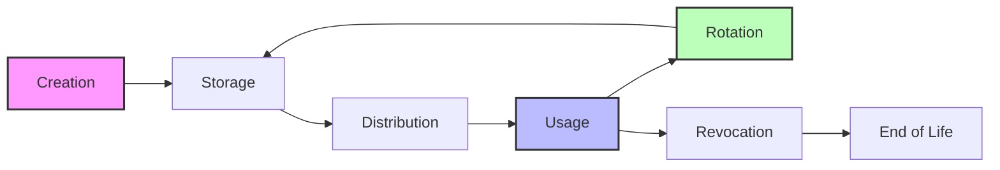
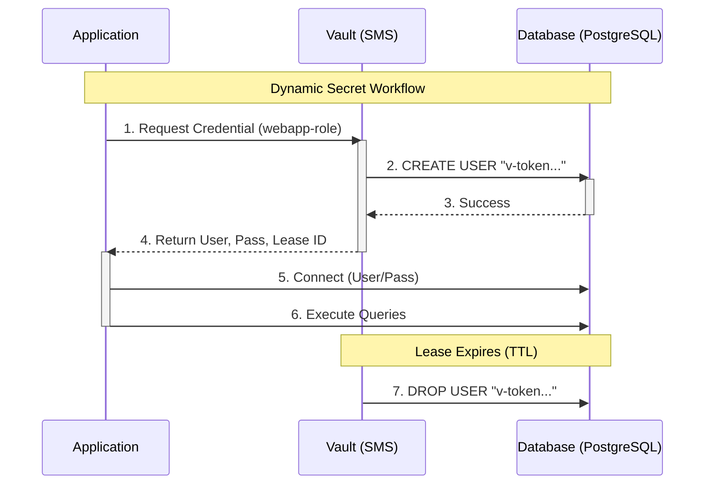
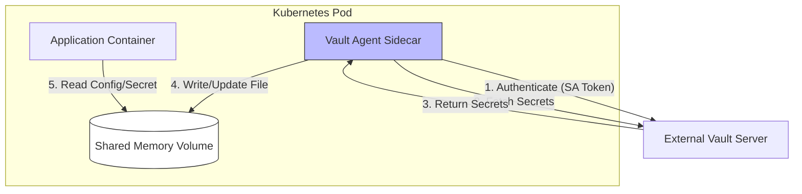

- [1 - Introduction: The Imperative of Secret Management](#1---introduction-the-imperative-of-secret-management)
- [2 - Theoretical Foundations and Core Definitions](#2---theoretical-foundations-and-core-definitions)
	- [2.1 - Taxonomy of Secrets](#21---taxonomy-of-secrets)
	- [2.2 - The Secret Lifecycle](#22---the-secret-lifecycle)
	- [2.3 - The "Secret Zero" Paradox](#23---the-secret-zero-paradox)
- [3 - Historical Evolution: From Files to Frameworks](#3---historical-evolution-from-files-to-frameworks)
	- [3.1 - The Era of Hardcoding and Configuration Files](#31---the-era-of-hardcoding-and-configuration-files)
	- [3.2 - The Rise of Environment Variables and CI/CD](#32---the-rise-of-environment-variables-and-cicd)
	- [3.3 - The Cloud-Native Explosion and Secret Sprawl](#33---the-cloud-native-explosion-and-secret-sprawl)
- [4 - Architecture of Modern Secret Management Systems](#4---architecture-of-modern-secret-management-systems)
	- [4.1 - The Barrier Architecture and Seal Mechanism](#41---the-barrier-architecture-and-seal-mechanism)
	- [4.2 - Envelope Encryption](#42---envelope-encryption)
	- [4.3 - Pluggable Secrets Engines](#43---pluggable-secrets-engines)
	- [4.4 - Access Control Policies](#44---access-control-policies)
- [5 - Dynamic Secrets: The Paradigm Shift](#5---dynamic-secrets-the-paradigm-shift)
	- [5.1 - The Mechanic of Dynamism](#51---the-mechanic-of-dynamism)
	- [5.2 - Advantages of Dynamic Secrets](#52---advantages-of-dynamic-secrets)
	- [5.3 - Operational Challenges: Lease Explosion](#53---operational-challenges-lease-explosion)
- [6 - Secret Management in Kubernetes Environments](#6---secret-management-in-kubernetes-environments)
	- [6.1 - Native Kubernetes Secrets vs. External Stores](#61---native-kubernetes-secrets-vs-external-stores)
	- [6.2 - The Sidecar Injection Pattern (Vault Agent)](#62---the-sidecar-injection-pattern-vault-agent)
	- [6.3 - The Secrets Store CSI Driver Pattern](#63---the-secrets-store-csi-driver-pattern)
	- [6.4 - The External Secrets Operator (ESO)](#64---the-external-secrets-operator-eso)
- [7 - The GitOps Dilemma: Encryption at Rest](#7---the-gitops-dilemma-encryption-at-rest)
	- [7.1 - Sealed Secrets](#71---sealed-secrets)
	- [7.2 - Mozilla SOPS (Secrets OPerationS)](#72---mozilla-sops-secrets-operations)
- [8 - Operational Governance, Compliance, and Auditing](#8---operational-governance-compliance-and-auditing)
	- [8.1 - Comprehensive Audit Logging](#81---comprehensive-audit-logging)
	- [8.2 - Operational Resilience and High Availability](#82---operational-resilience-and-high-availability)
	- [8.3 - Lease Quotas and Denial of Service](#83---lease-quotas-and-denial-of-service)
- [9 - Identity-Based Security and Zero Trust](#9---identity-based-security-and-zero-trust)
	- [9.1 - SPIFFE and SPIRE: The End of Secrets?](#91---spiffe-and-spire-the-end-of-secrets)
	- [9.2 - The Future: Non-Human Identity (NHI) Management](#92---the-future-non-human-identity-nhi-management)
- [10 - Conclusion and Strategic Roadmap](#10---conclusion-and-strategic-roadmap)
- [References](#references)

# 1 - Introduction: The Imperative of Secret Management

In the intricate fabric of modern software engineering, the integrity of a system is defined not merely by the robustness of its code but by the security of the credentials that grant access to its data. These credentials (collectively termed "secrets") form the bedrock of authentication and authorisation in digital ecosystems. A secret, in the context of information security, is defined by the National Institute of Standards and Technology (NIST) as a private piece of information that acts as a key to unlock protected resources or sensitive information. This encompasses a broad spectrum of digital artefacts, including passwords, Application Programming Interface (API) keys, encryption keys, Secure Shell (SSH) keys, tokens, and certificates. Unlike human identities (which are relatively static and tied to biological entities), machine identities and their associated secrets are ephemeral, high-volume, and widely distributed, creating a complex management challenge that traditional security paradigms fail to address.

The necessity for rigorous secret management arises from the fundamental shift in infrastructure architecture. The transition from monolithic, on-premises applications to distributed, cloud-native microservices has dissolved the traditional network perimeter. In this "Zero Trust" era, identity is the new perimeter, and secrets are the proofs of that identity. Consequently, the mismanagement of secrets (often manifested as "Secret Sprawl") has become a primary vector for cyberattacks. The IBM Cost of a Data Breach Report highlights that compromised credentials are frequently the root cause of significant breaches, necessitating a shift from ad-hoc secret handling to centralised, automated governance. This report provides an exhaustive analysis of the theoretical underpinnings, architectural mechanisms, and operational realities of secret management systems.

# 2 - Theoretical Foundations and Core Definitions

To engineer a robust secret management solution, one must first establish a precise theoretical framework that defines the nature of secrets, their lifecycle, and the cryptographic principles that protect them.

## 2.1 - Taxonomy of Secrets

Secrets are distinct from identifiers. While a username (identifier) is public, the password (secret) is private. In software engineering, secrets are categorised based on their nature and lifecycle:

  * **Static Secrets:** These are long-lived credentials that do not change automatically. Examples include hardcoded database passwords or API tokens generated once via a developer portal. They pose significant risk because, once compromised, they remain valid until manually rotated, offering attackers an indefinite window of opportunity.
  * **Dynamic Secrets:** These are ephemeral credentials generated on-demand. A secret management system (SMS) creates these secrets at the moment of request and automatically revokes them after a set "Time-To-Live" (TTL). This reduces the "blast radius" of a compromise, as the credential becomes useless after expiry.
  * **Cryptographic Keys:** These are secrets used to protect other data. They include symmetric keys (e.g. AES-256) used for data encryption and asymmetric private keys (e.g. RSA, ECDSA) used for digital signatures and identity verification.

The distinction between human and non-human identities is crucial. Non-human identities (service accounts, containers, bots) require secrets to function autonomously. These entities cannot respond to multi-factor authentication (MFA) challenges in the traditional sense, making the security of their stored secrets paramount.

## 2.2 - The Secret Lifecycle

Theoretical models of secret management typically decompose the existence of a credential into distinct lifecycle stages. A failure in any single stage compromises the integrity of the entire system.

**Table 1: The Six Stages of the Secret Lifecycle**

| Lifecycle Stage  | Definition                                                                                                   | Theoretical Implications                                                                                                                                                                           |
| :--------------- | :----------------------------------------------------------------------------------------------------------- | :------------------------------------------------------------------------------------------------------------------------------------------------------------------------------------------------- |
| **Creation**     | The generation of the secret value using a cryptographically secure pseudo-random number generator (CSPRNG). | Entropy is critical. Predictable secrets (e.g. based on timestamps) are vulnerabilities. Ideally, the application never sees the root credential, only the derived child credential.               |
| **Storage**      | The persistence of the secret when not in use.                                                               | Must employ encryption-at-rest. The security of the storage is recursively dependent on the security of the encryption keys (the "Envelope Encryption" pattern).                                   |
| **Distribution** | The transit of the secret from storage to the consumer (application or user).                                | Requires mutual authentication (mTLS) and secure channels. This stage introduces the "Secret Zero" paradox: how does the consumer prove their identity to receive the secret?                      |
| **Usage**        | The active utilisation of the secret for authentication or decryption.                                       | Secrets should reside in protected memory (RAM), never swapped to disk, and should be cleared immediately after use. "Secretless" patterns aim to remove this stage from the application entirely. |
| **Rotation**     | The replacement of an existing secret with a new cryptographic value.                                        | Regular rotation limits the validity window of stolen credentials. It is the primary defence against cryptanalysis and stagnant key compromise.                                                    |
| **Revocation**   | The active invalidation of a secret before its scheduled expiry.                                             | Necessary during incident response. Requires the SMS to have administrative access to the target system (e.g. the database) to delete the user or invalidate the token.                            |

## 2.3 - The "Secret Zero" Paradox

A central theoretical challenge in secret management is the "Secret Zero" or "Bootstrap Credential" problem. To retrieve a secret from a secure vault, an application must authenticate itself. To authenticate, it requires a credential. This initial credential is "Secret Zero".

If Secret Zero is hardcoded, the vault's security is bypassed. If Secret Zero is stored in another vault, it creates an infinite regression. The theoretical solution involves establishing a "Root of Trust" outside the secret management system itself. In modern architectures, this role is often assumed by a "Trusted Orchestrator" (such as Kubernetes) or a Cloud Provider's Identity and Access Management (IAM) system, which can cryptographically attest to the identity of a workload based on its environmental attributes (e.g. PID, cgroups, digital signatures) rather than a shared secret. This moves the security boundary from "something you know" to "what you are".

# 3 - Historical Evolution: From Files to Frameworks

The methodology for handling secrets has undergone a radical transformation, driven by the evolving complexity of software deployment models. Understanding this history clarifies why modern systems like HashiCorp Vault and SPIFFE were created.

## 3.1 - The Era of Hardcoding and Configuration Files

In the early epochs of software development, characterised by monolithic applications running on static, long-lived servers ("pets"), secrets were frequently hardcoded directly into the source code or stored in plaintext configuration files.

This approach, while operationally simple, suffers from catastrophic security flaws known as CWE-798 (Use of Hard-coded Credentials).

  * **Insecurity:** Secrets committed to version control systems (like Git) become permanently embedded in the repository history. Even if removed from the HEAD commit, the secret remains accessible in the .git folder unless the entire history is rewritten.
  * **Operational Rigidity:** Changing a password requires recompiling and redeploying the application. This friction discourages rotation, leading to credentials that remain valid for years, increasing the likelihood of brute-force attacks or leakage.
  * **Lack of Audit:** It is impossible to track who accessed the secret when it is distributed as part of the codebase.

## 3.2 - The Rise of Environment Variables and CI/CD

With the advent of the Twelve-Factor App methodology, secrets migrated to environment variables. This decoupled configuration from code, allowing the same build artefact to be deployed across different environments (Dev, QA, Prod) with different credentials.

However, environment variables present their own risks. They are often visible in process listings (ps aux on Linux) and can be inadvertently leaked in debugging logs or crash dumps. Furthermore, in Continuous Integration/Continuous Deployment (CI/CD) pipelines, secrets stored as variables are often accessible to anyone with commit access, lacking fine-grained access control.

## 3.3 - The Cloud-Native Explosion and Secret Sprawl

The shift to microservices and containerisation (Kubernetes) introduced "Secret Sprawl". A single application might be decomposed into fifty microservices, each requiring unique database credentials, API keys, and TLS certificates. The volume of secrets exploded, rendering manual management impossible.

The dynamic nature of cloud infrastructure (where servers are spun up and down automatically) meant that static IP-based allow-listing was no longer viable. This necessitated the creation of centralised, API-driven Secret Management Systems (SMS) capable of automating the lifecycle of secrets at scale. Systems like HashiCorp Vault emerged to provide a "single source of truth," moving secrets out of the application environment and into a fortified, centralised repository.

# 4 - Architecture of Modern Secret Management Systems

Modern secret management systems are complex distributed applications designed to ensure high availability, strong consistency, and robust security. While there are various solutions (AWS Secrets Manager, Azure Key Vault, CyberArk Conjur), HashiCorp Vault is frequently cited as the reference architecture for platform-agnostic secret management.

## 4.1 - The Barrier Architecture and Seal Mechanism

At the core of a secure SMS is the concept of a cryptographic barrier. HashiCorp Vault, for instance, encrypts all data before writing it to the storage backend. The storage backend (which could be S3, Consul, or Etcd) is considered untrusted.

The system operates in two states: Sealed and Unsealed.

  * **Sealed State:** When the server starts, it is sealed. It has access to the encrypted data but lacks the key to decrypt it. The "Master Key" (or Root Key) is encrypted and stored alongside the data, protected by the "Unseal Key".
  * **Shamir's Secret Sharing:** To prevent a single point of compromise, the Unseal Key is often split using Shamir's Secret Sharing algorithm. This mathematical scheme divides the key into $N$ shares (e.g. 5), requiring a threshold $T$ (e.g. 3) to reconstruct the key. This enforces a "multi-person control" rule, where multiple operators must be present to unseal the vault.
  * **Auto-Unseal:** In automated cloud environments, manual unsealing is impractical. "Auto-Unseal" delegates the trust to a Cloud KMS (like AWS KMS). The Vault server authenticates to the Cloud KMS to decrypt its master key, allowing it to boot automatically while maintaining a root of trust in the hardware-backed KMS.

## 4.2 - Envelope Encryption

To manage the encryption of vast amounts of secret data efficiently, SMSs utilise Envelope Encryption. This hierarchical key management strategy involves wrapping keys with other keys.

  * **Data Encryption Key (DEK):** A unique symmetric key (e.g. AES-256-GCM) is generated to encrypt a specific piece of data or a data chunk. DEKs are stored alongside the ciphertext.
  * **Key Encryption Key (KEK):** The DEK is encrypted (wrapped) by a KEK. The KEK is stored within the secure boundary of the SMS or KMS.
  * **Root Key (Master Key):** The KEKs are protected by a Root Key, often backed by a Hardware Security Module (HSM).

**Advantages:**

  * **Performance:** Encryption operations using local DEKs are fast and do not require round-trips to the HSM for every read/write.
  * **Key Rotation:** When a key is rotated, only the KEK needs to be re-encrypted (re-wrapped). The massive volume of data encrypted by the DEKs remains untouched, making rotation computationally efficient.

## 4.3 - Pluggable Secrets Engines

Modern architectures decouple the secret storage from the secret generation logic via plugins or "engines".

  * **Key-Value (KV) Engine:** Stores arbitrary static secrets (API keys, config files) in a versioned map.
  * **Database Engine:** Generates dynamic SQL credentials. It connects to a database (e.g. PostgreSQL) and creates a temporary user with a specific role for each request.
  * **PKI Engine:** Acts as an internal Certificate Authority (CA), dynamically issuing X.509 certificates and keys for mTLS.
  * **Transit Engine:** Performs "Encryption as a Service," offloading cryptographic operations from applications. The application sends plaintext to the SMS, and the SMS returns ciphertext, ensuring keys never leave the vault.

## 4.4 - Access Control Policies

Authorisation within these systems is typically handled via granular, path-based policies. For example, HashiCorp Vault uses HCL (HashiCorp Configuration Language) to define Access Control Lists (ACLs). A policy might grant read access to secret/data/app/config but deny access to sys/auth, effectively implementing the Principle of Least Privilege.

# 5 - Dynamic Secrets: The Paradigm Shift

The transition from static to dynamic secrets represents the most significant advancement in secret management theory and practice.

## 5.1 - The Mechanic of Dynamism

Dynamic secrets are generated on-the-fly at the moment of access. When an application requests access to a database, the SMS does not return a pre-existing password from a table. Instead, it executes a command on the database to create a new user with a random password and restricted permissions.

**Workflow:**

  * **Request:** Application authenticates to Vault and requests credentials for the webapp-role.
  * **Generation:** Vault connects to PostgreSQL and runs CREATE USER "v-token-webapp-..." WITH PASSWORD "...".
  * **Response:** Vault returns the username and password to the application, along with a lease\_id and lease\_duration (e.g. 1 hour).
  * **Usage:** Application connects to the database.
  * **Revocation:** Upon lease expiry (or active revocation), Vault runs DROP USER..., invalidating the credential.

## 5.2 - Advantages of Dynamic Secrets

  * **Ephemeral Nature:** Since the secret exists only as long as it is needed, the window of opportunity for an attacker is drastically reduced. A leaked dynamic secret is useless once its lease expires.
  * **Attribution:** Each instance of an application gets a unique username. This allows database audit logs to pinpoint exactly which pod or process executed a specific query, which is impossible with shared static accounts.
  * **Simplified Rotation:** There is no need to coordinate "rotation windows" where applications are restarted. Secrets rotate automatically as leases expire and are renewed.

## 5.3 - Operational Challenges: Lease Explosion

While powerful, dynamic secrets introduce state. The SMS must track every active lease. If a misconfigured application requests a new credential every second in a tight loop, it can create millions of leases, overwhelming the SMS storage backend. This phenomenon, known as "Lease Explosion," creates a Denial-of-Service (DoS) condition. Operational governance requires setting "Lease Count Quotas" to prevent a single application from destabilising the cluster.

# 6 - Secret Management in Kubernetes Environments

Kubernetes has become the de facto operating system for the cloud, and integrating secret management into its ephemeral, containerised architecture presents unique challenges and competing patterns.

## 6.1 - Native Kubernetes Secrets vs. External Stores

Kubernetes provides a native Secret resource. However, by default, these secrets are stored in the cluster's etcd database encoded merely in Base64 (not encrypted). While encryption-at-rest can be enabled for etcd, native secrets are static. They do not rotate automatically and are often scoped only to the cluster, making it difficult to share secrets across a multi-cluster enterprise environment.

To address this, organisations integrate external SMSs (like Vault or Azure Key Vault) into Kubernetes using one of three primary patterns: the Sidecar, the CSI Driver, or the Operator.

## 6.2 - The Sidecar Injection Pattern (Vault Agent)

This pattern, popularised by the Vault Agent Injector, leverages a Kubernetes Mutating Admission Webhook. When a pod is created, the webhook injects a "sidecar" container running the Vault Agent alongside the application container.

**Mechanism:**

  * The Vault Agent authenticates with Vault using the Pod's Service Account token (solving Secret Zero).
  * It retrieves the requested secrets and writes them to a shared memory volume (e.g. /vault/secrets).
  * The application reads the secrets from this file.

**Advantages:**

  * **Automatic Rotation:** The Agent is a long-running process. If the secret changes in Vault, the Agent updates the file in the shared volume immediately. The application can watch the file for changes to reload without a restart.
  * **Templating:** The Agent can format the secret data into specific configuration file structures (e.g. creating a database.properties file from raw key-values) using annotations.

**Disadvantages:**

  * **Resource Overhead:** Every pod requires a sidecar container, which consumes CPU and memory. In a cluster with thousands of pods, this overhead is significant.
  * **Lifecycle Coupling:** The application must wait for the sidecar to initialise before it can start, which can introduce race conditions if not managed via agent-init-first annotations.

## 6.3 - The Secrets Store CSI Driver Pattern

The Container Storage Interface (CSI) allows secrets to be mounted as volumes, treating secrets as a storage resource. The Secrets Store CSI Driver allows mounting secrets from Azure, AWS, or Vault directly into the pod.

**Mechanism:**

  * A SecretProviderClass Custom Resource Definition (CRD) maps the external secret to the volume mount.
  * The Kubelet calls the CSI driver, which retrieves the secret and mounts it as a file.

**Advantages:**

  * **Standardisation:** It uses native Kubernetes storage primitives, making it cleaner for storage administrators.
  * **Sync to Kubernetes Secret:** It can synchronise the external secret into a native Kubernetes Secret, allowing it to be used as an environment variable (supporting legacy apps).

**Disadvantages:**

  * **Rotation Complexity:** Native volumes do not update automatically. Enabling rotation requires enabling an alpha feature (--enable-secret-rotation) and polling, which introduces latency. Furthermore, environment variables derived from synced secrets do not update unless the pod is restarted. Tools like Reloader are often required to force restarts when secrets change.
  * **Filesystem dependency:** It requires mounting volumes, which may be restricted in some hardened environments.

**Table 2: Comparative Analysis of Kubernetes Secret Integration Patterns**

| Feature                   | Vault Agent Injector (Sidecar)       | Secrets Store CSI Driver               | External Secrets Operator |
| :------------------------ | :----------------------------------- | :------------------------------------- | :------------------------ |
| **Integration Mechanism** | Mutating Webhook / Sidecar Container | CSI Volume Mount                       | Controller / CRD          |
| **Secret Updates**        | Real-time (Agent pushes updates)     | Polling (Interval based)               | Polling (Interval based)  |
| **Resource Usage**        | High (1 Sidecar per Pod)             | Low (DaemonSet per Node)               | Low (Central Controller)  |
| **Secret Projection**     | Files in Shared Volume               | Files in Volume (or synced K8s Secret) | Native Kubernetes Secret  |
| **Templating**            | Powerful (Consul Template)           | Limited                                | Limited                   |
| **Complexity**            | Moderate                             | High (CRDs + Drivers)                  | Low (for developers)      |

## 6.4 - The External Secrets Operator (ESO)

The External Secrets Operator (ESO) decouples the application from the secret fetching logic entirely. It runs as a controller that polls the external SMS (e.g. AWS Secrets Manager) and creates/updates native Kubernetes Secrets.

This approach is favoured for its simplicity and developer experience (developers just use standard K8s secrets). However, it reintroduces the risk of storing secrets in etcd, potentially compromising the security benefits of the external vault if etcd is not properly secured.

# 7 - The GitOps Dilemma: Encryption at Rest

GitOps, the practice of managing infrastructure and applications via Git repositories, clashes with secret management. "Everything in Git" implies secrets in Git, which is a major anti-pattern. Two primary tools address this: Sealed Secrets and Mozilla SOPS.

## 7.1 - Sealed Secrets

Sealed Secrets relies on asymmetric cryptography. A controller running in the cluster holds a private key. Developers use a public key to encrypt their secrets into a SealedSecret CRD, which can be safely committed to Git. The controller decrypts it into a regular Secret inside the cluster.

  * **Pros:** Simple, native to Kubernetes, no external dependencies.
  * **Cons:** It is a "one-way" street. Once encrypted, the secret cannot be viewed or edited easily. Disaster recovery is difficult if the cluster's private key is lost.

## 7.2 - Mozilla SOPS (Secrets OPerationS)

SOPS is an editor that supports multiple encryption formats (YAML, JSON, ENV). Crucially, it integrates with Cloud KMS (AWS KMS, Azure Key Vault) and PGP. It encrypts the values of the files but leaves the keys readable, allowing for diffs and structure visibility.

  * **Pros:** Supports "two-way" encryption. Authorised users (with access to the KMS key) can decrypt and edit the file. It supports key rotation by re-encrypting with a new KMS key.
  * **Cons:** Requires an external KMS setup and client-side tooling configuration.

Comparatively, SOPS is preferred for complex, multi-cloud environments where team collaboration on secrets is necessary, while Sealed Secrets is preferred for simpler, single-cluster GitOps workflows where developer interaction with secrets is minimal.

# 8 - Operational Governance, Compliance, and Auditing

The deployment of an SMS is not a "set and forget" operation. It requires rigorous governance to satisfy compliance frameworks (like NIST SP 800-53) and ensure operational resilience.

## 8.1 - Comprehensive Audit Logging

Audit logs are the primary mechanism for forensic analysis and non-repudiation. A robust SMS logs every interaction: authentication attempts, secret reads, and policy changes.

  * **Structure:** Logs should be structured (JSON) for ingestion by SIEM tools. Key fields include timestamp, actor (identity), operation (create/read/delete), path, and request\_id.
  * **Input Hashing:** To prevent the logs themselves from becoming a leak vector, sensitive input parameters (like the new password in a change request) must be hashed (HMAC) rather than logged in plaintext.
  * **NIST Compliance:** Audit logging supports NIST controls like AU-2 (Audit Events) and AU-3 (Content of Audit Records).

## 8.2 - Operational Resilience and High Availability

Enterprise secret management requires High Availability (HA) to prevent the SMS from becoming a single point of failure.

  * **Performance Replication:** Enterprise clusters often deploy "Performance Standby" nodes. These nodes handle read-only traffic (like applications fetching secrets), scaling the throughput of the system horizontally across regions.
  * **Disaster Recovery (DR):** A distinct replication mode designed for business continuity, ensuring that a secondary cluster can be promoted to primary if the main data centre fails.
  * **Irrevocable Leases:** A specific operational failure mode occurs when Vault cannot communicate with a backend (e.g. a database is down) to revoke a credential. These "irrevocable leases" can accumulate, clogging the expiration manager. Modern systems implement retry logic with exponential backoff and eventual "give up" thresholds to maintain system stability.

## 8.3 - Lease Quotas and Denial of Service

The dynamic nature of secrets introduces the risk of "Lease Explosion." If a bug causes an application to request a new credential in an infinite loop, it can exhaust the SMS's storage or memory. Administrators must configure Lease Count Quotas at the namespace or mount level to cap the number of active leases, preventing one rogue application from taking down the entire secret infrastructure.

# 9 - Identity-Based Security and Zero Trust

The evolution of secret management is converging towards Zero Trust Architecture (ZTA), where the focus shifts from protecting secrets to validating identities.

## 9.1 - SPIFFE and SPIRE: The End of Secrets?

The Secure Production Identity Framework For Everyone (SPIFFE) and its runtime environment (SPIRE) aim to solve the "Secret Zero" problem by eliminating shared secrets entirely for service-to-service communication.

  * **Concept:** Instead of an application presenting a password to a database, it presents a cryptographically signed document (the SVID, SPIFFE Verifiable Identity Document), typically an X.509 certificate.
  * **Attestation:** SPIRE works by "attesting" the workload. A SPIRE Agent running on the node interrogates the kernel to verify the process's attributes (User ID, Group ID, Cgroups, Container Image Hash). If the attributes match a registered policy, the Agent issues an SVID to the workload.
  * **No Secret Zero:** The workload does not need a password to get its SVID; it just needs to exist and match the policy. The trust is rooted in the platform/kernel.
  * **mTLS:** Services use these SVIDs to establish mutual TLS connections. The "secret" (the private key of the certificate) is ephemeral, rotated automatically and frequently (e.g. every hour), and never leaves the process memory.

## 9.2 - The Future: Non-Human Identity (NHI) Management

As AI agents and autonomous workloads proliferate, "Non-Human Identity" (NHI) management is emerging as a critical discipline. Unlike static service accounts, AI agents require Just-In-Time (JIT) access, scoped to a specific task and context.

Future architectures will likely blend SMS and Identity Providers. Agents will authenticate via verifiable identity (like SPIFFE), and the SMS will act as a "token broker," exchanging the identity for a short-lived, context-bound credential for the target resource. This moves the industry closer to a "Secretless" ideal, where developers never handle credentials, and applications never persist them.

# 10 - Conclusion and Strategic Roadmap

The management of secrets has matured from a configuration detail to a sophisticated pillar of enterprise security architecture. The risks of secret sprawl (breaches, lateral movement, and compliance failures) are too great to ignore.

**Strategic Recommendations for Engineering Leaders:**

  * **Centralise immediately:** Migrate all secrets from code and scattered config files to a dedicated SMS (Vault, AWS Secrets Manager, etc.).
  * **Enforce Dynamism:** Prioritise dynamic secrets over static ones. If a secret can be dynamic (like database credentials), it must be dynamic.
  * **Automate Rotation:** For unavoidable static secrets, implement automated rotation using tools like Vault or External Secrets Operator. Manual rotation is a security fallacy.
  * **Embrace Identity:** Move towards identity-based authentication (Kubernetes Auth, IAM Roles, SPIFFE) to solve the Secret Zero problem.
  * **Audit Continuously:** Treat secret access logs as high-fidelity security signals. An anomaly in secret access is often the first indicator of compromise.

By adhering to these principles, organisations can construct a secret management posture that is not only secure and compliant but also an enabler of velocity in the cloud-native era. The future of security is not in hiding secrets better, but in making them so ephemeral that they are worthless to steal.

# References

* Shamir, A. (1979). “[How to Share a Secret](https://dl.acm.org/doi/10.1145/359168.359176).” *Communications of the ACM*, 22(11), 612–613. ([ACM Digital Library][1])

* Meli, M., Preuveneers, D., & Joosen, W. (2019). “[How Bad Can It Git? Characterizing Secret Leakage in Public GitHub Repositories](https://dev.ndss-symposium.org/wp-content/uploads/2019/02/ndss2019_04B-3_Meli_paper.pdf).” *NDSS Symposium 2019*. 

* Rahman, M. M., Chakraborty, S., Iqbal, A., & Williams, L. (2022). “[Why Secret Detection Tools Are Not Enough: It’s Not Just About False Positives](https://pmc.ncbi.nlm.nih.gov/articles/PMC8928718/).” *Empirical Software Engineering*, 27(3). ([PMC][2])

* Basak, S. K., Cox, J., Reaves, B., & Williams, L. (2023). “[A Comparative Study of Software Secrets Reporting by Secret Detection Tools](https://arxiv.org/pdf/2307.00714).” arXiv:2307.00714. 

* Lykousas, N., & Patsakis, C. (2023). “[Tales from the Git: Automating the Detection of Secrets on Code and Assessing Developers’ Passwords Choices](https://doi.org/10.1109/EuroSPW59978.2023.00013).” *2023 IEEE European Symposium on Security and Privacy Workshops (EuroS&PW)*. ([ResearchGate][3])

* Blomqvist, M. (2021). “[Secrets Management in a Multi-Cloud Kubernetes Environment](https://www.utupub.fi/bitstream/handle/10024/151776/Secrets_Management_in_a_Multi_Cloud_Kubernetes_Environment_pdf-a.pdf).” MSc thesis, University of Turku. 

* Uddström, A. (2023). “[Systematic Evaluation of Secret Management in Kubernetes](https://www.diva-portal.org/smash/record.jsf?pid=diva2%3A1735076).” MSc thesis, Umeå University. ([Diva Portal][4])

* Martseniiuk, Y., Partyka, A., Harasymchuk, O., & Shevchenko, S. (2024). “[Universal Centralized Secret Data Management for Automated Public Cloud Provisioning](https://ceur-ws.org/Vol-3826/paper7.pdf).” *Cybersecurity Providing in Information and Telecommunication Systems 2024 (CPITS-IS)*, CEUR-WS Vol. 3826. 

* Somasundaram, P. (2024). “[Unified Secret Management Across Cloud Platforms: A Strategy for Secure Credential Storage and Access](https://doi.org/10.17605/OSF.IO/G96Z2).” *International Journal of Computer Engineering and Technology (IJCET)*, 15(2), 5–12. ([ResearchGate][5])

* Byrisetty, A., & Girhotra, J. (2025). “[Securing Cloud-Native Applications (CNAs): A Case Study of Practices in a Large IT Company](https://www.diva-portal.org/smash/get/diva2%3A1980200/FULLTEXT01.pdf).” MSc thesis, Blekinge Institute of Technology. 

* Rostamipoor, M., Sadeghi, A., & Polychronakis, M. (2025). “[KubeKeeper: Protecting Kubernetes Secrets Against Excessive Permissions](https://www3.cs.stonybrook.edu/~mikepo/papers/kubekeeper.eurosp25.pdf).” *IEEE European Symposium on Security and Privacy (EuroS&P), 2025*. 

* Gunathilake, K., & Ekanayake, I. (2024). “[K8s Pro Sentinel: Extend Secret Security in Kubernetes Cluster](https://arxiv.org/pdf/2411.16639).” arXiv:2411.16639. 

* Pelster, L., Kritzinger, L., & Wüchner, P. (2023). “[Security Hardening and Compliance Assessment of Kubernetes Control Plane and Workloads](https://www.mdpi.com/2624-800X/5/2/30).” *Digital*, 5(2), 30. ([MDPI][6])

* Rahaman, M. S., Tisha, S. N., Song, E., & Černý, T. (2023). “[Access Control Design Practice and Solutions in Cloud-Native Architecture: A Systematic Mapping Study](https://doi.org/10.3390/s23073413).” *Sensors*, 23(7), 3413. ([MDPI][7])

* Ward, R., & Beyer, B. (2014). “[BeyondCorp: A New Approach to Enterprise Security](https://www.usenix.org/publications/login/dec14/ward).” *;login: The USENIX Magazine*, 39(6), 6–11. ([Google Research][8])

* Osborn, B., McWilliams, J., Beyer, B., & Saltonstall, M. (2016). “[BeyondCorp: Design to Deployment at Google](https://research.google/pubs/beyondcorp-design-to-deployment-at-google/).” *;login: The USENIX Magazine*, 41(1), 28–34. ([USENIX][9])

* Nair, S., & Nair, A. (2025). “[Zero Trust Architecture in Cloud-Native Environments: Implementation Strategies and Best Practices](https://www.ijcttjournal.org/archives/ijctt-v73i4p114).” *International Journal of Computer Trends and Technology (IJCTT)*, 73(4), 566–574. ([Seventh Sense Research Group®][10])

* Dommari, S. (2023). “[Implementing Zero Trust Architecture in Cloud-Native Environments](https://papers.ssrn.com/sol3/papers.cfm?abstract_id=5259339).” SSRN preprint. ([SSRN][11])

* Cochak, H., Neto, M., Miers, C., Marques, M., & Simplicio Jr., M. (2024). “[Enhancing SPIFFE/SPIRE Environment with a Nested Security Token Model](https://www.scitepress.org/Papers/2024/126344/126344.pdf).” *Proceedings of the 14th International Conference on Cloud Computing and Services Science (CLOSER 2024)*, 184–191. 

* (Author redacted for anonymity in preprint). (2025). “[Establishing Workload Identity for Zero Trust CI/CD: From Secrets to SPIFFE-Based Authentication](https://arxiv.org/abs/2504.14760).” arXiv:2504.14760. ([arXiv][12])

* Guduru, S. (2021). “[Zero Trust Automation: SPIFFE/SPIRE for Identity Federation and OpenZiti in Microsegmented Networks](https://zenodo.org/records/15387226).” *European Journal of Advances in Engineering and Technology*, 8(10), 122–126. ([Zenodo][13])

[1]: https://dl.acm.org/doi/10.1145/359168.359176?utm_source=chatgpt.com "How to share a secret | Communications of the ACM"
[2]: https://pmc.ncbi.nlm.nih.gov/articles/PMC8928718/ "Why secret detection tools are not enough: It’s not just about false positives - An industrial case study - PMC"
[3]: https://www.researchgate.net/publication/372799687_Tales_from_the_Git_Automating_the_detection_of_secrets_on_code_and_assessing_developers%27_passwords_choices "(PDF) Tales from the Git: Automating the detection of secrets on code and assessing developers’ passwords choices"
[4]: https://www.diva-portal.org/smash/record.jsf?pid=diva2%3A1735076 "Systematic Evaluation Of Secret Management In Kubernetes"
[5]: https://www.researchgate.net/publication/379435761_Unified_Secret_Management_Across_Cloud_Platforms_a_Strategy_for_Secure_Credential_Storage_and_Access "(PDF) Unified Secret Management Across Cloud Platforms: a Strategy for Secure Credential Storage and Access"
[6]: https://www.mdpi.com/2624-800X/5/2/30 "Security Hardening and Compliance Assessment of Kubernetes Control Plane and Workloads"
[7]: https://www.mdpi.com/1424-8220/23/7/3413?utm_source=chatgpt.com "Access Control Design Practice and Solutions in Cloud ..."
[8]: https://research.google/pubs/beyondcorp-a-new-approach-to-enterprise-security/?utm_source=chatgpt.com "BeyondCorp: A New Approach to Enterprise Security"
[9]: https://www.usenix.org/publications/login/spring2016/osborn?utm_source=chatgpt.com "BeyondCorp: Design to Deployment at Google"
[10]: https://www.ijcttjournal.org/2025/Volume-73%20Issue-4/IJCTT-V73I4P114.pdf?utm_source=chatgpt.com "Zero Trust Architecture in Cloud-Native Environments"
[11]: https://papers.ssrn.com/sol3/papers.cfm?abstract_id=5259339&utm_source=chatgpt.com "Implementing Zero Trust Architecture in Cloud-Native ..."
[12]: https://arxiv.org/html/2504.14760v1 "Establishing Workload Identity for Zero Trust CI/CD: From Secrets to SPIFFE-Based Authentication"
[13]: https://zenodo.org/records/15387226 "Zero Trust Automation: SPIFFE/SPIRE for Identity Federation and OpenZiti in Microsegmented Networks"
