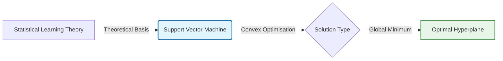
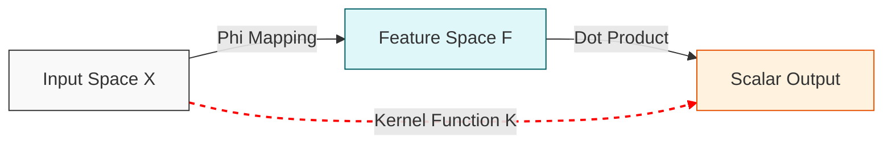
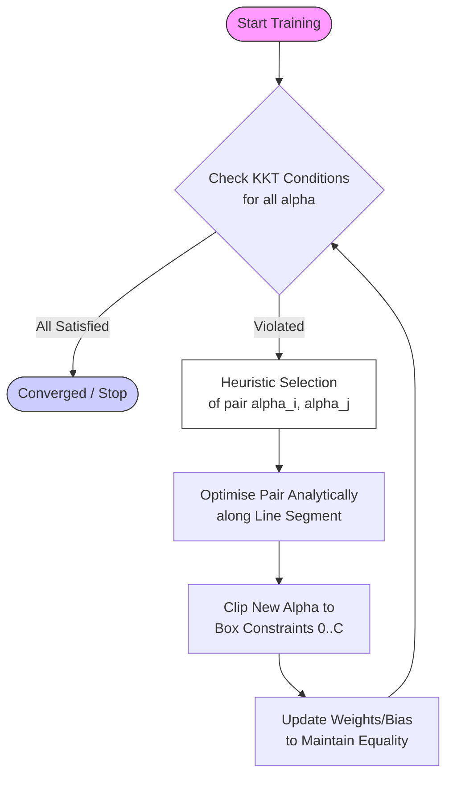
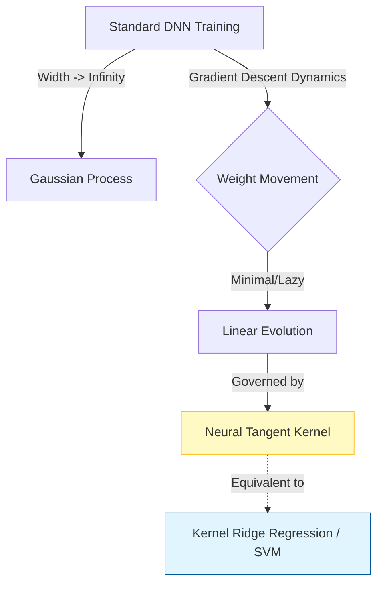

- [1 - Introduction](#1---introduction)
	- [1.1 - The Fundamental Problem of Learning](#11---the-fundamental-problem-of-learning)
	- [1.2 - Scope and Structure](#12---scope-and-structure)
- [2 - Mathematical Preliminaries](#2---mathematical-preliminaries)
	- [2.1 - Hyperplanes and Geometry](#21---hyperplanes-and-geometry)
	- [2.2 - Convex Optimisation](#22---convex-optimisation)
	- [2.3 - Lagrange Multipliers and Duality](#23---lagrange-multipliers-and-duality)
- [3 - Statistical Learning Theory: The Why](#3---statistical-learning-theory-the-why)
	- [3.1 - Empirical vs. Expected Risk](#31---empirical-vs-expected-risk)
	- [3.2 - VC Dimension and Generalisation Bounds](#32---vc-dimension-and-generalisation-bounds)
- [4 - The Linear Support Vector Machine](#4---the-linear-support-vector-machine)
	- [4.1 - The Primal Formulation](#41---the-primal-formulation)
	- [4.2 - Deriving the Dual Formulation](#42---deriving-the-dual-formulation)
	- [4.3 - A Mechanical Analogy](#43---a-mechanical-analogy)
- [5 - Soft Margin Classification](#5---soft-margin-classification)
	- [5.1 - Slack Variables](#51---slack-variables)
	- [5.2 - The C-SVM Formulation](#52---the-c-svm-formulation)
	- [5.3 - The Dual Soft Margin](#53---the-dual-soft-margin)
	- [5.4 - $\\nu$-SVM Formulation](#54---nu-svm-formulation)
- [6 - The Kernel Trick: Conquering Non-Linearity](#6---the-kernel-trick-conquering-non-linearity)
	- [6.1 - Feature Mapping](#61---feature-mapping)
	- [6.2 - Mercer's Theorem](#62---mercers-theorem)
	- [6.3 - Common Kernels](#63---common-kernels)
- [7 - Optimisation Algorithms: Solving the Dual](#7---optimisation-algorithms-solving-the-dual)
	- [7.1 - Sequential Minimal Optimisation (SMO)](#71---sequential-minimal-optimisation-smo)
	- [7.2 - The KKT Conditions for SVM](#72---the-kkt-conditions-for-svm)
- [8 - Concrete Examples and Manual Calculations](#8---concrete-examples-and-manual-calculations)
	- [8.1 - 1D Hard Margin Example](#81---1d-hard-margin-example)
	- [8.2 - The XOR Problem (Non-Linear)](#82---the-xor-problem-non-linear)
- [9 - Modern Connections: Neural Tangent Kernel (NTK)](#9---modern-connections-neural-tangent-kernel-ntk)
	- [9.1 - The Infinite Width Limit](#91---the-infinite-width-limit)
	- [9.2 - Deep Networks as Kernel Machines](#92---deep-networks-as-kernel-machines)
- [10 - Practical Implementations and Comparison](#10---practical-implementations-and-comparison)
	- [10.1 - Software Ecosystem: LibSVM vs. LibLinear](#101---software-ecosystem-libsvm-vs-liblinear)
	- [10.2 - GPU Acceleration: ThunderSVM \& cuML](#102---gpu-acceleration-thundersvm--cuml)
- [11 - Conclusion](#11---conclusion)
- [References](#references)

# 1 - Introduction

The evolution of artificial intelligence has been marked by distinct epochs, each defined by a dominant theoretical paradigm. Before the current renaissance of deep neural networks, the field was dominated by a mathematically elegant and theoretically robust framework known as the **Support Vector Machine (SVM)**. Far from being merely a historical artefact, the SVM remains a cornerstone of machine learning, offering unparalleled performance on small-to-medium datasets and serving as a bridge to understanding the fundamental limits of learning from data. Unlike the heuristic origins of early neural networks, SVMs were born from the rigorous soil of **Statistical Learning Theory (SLT)**, specifically derived to solve the problem of generalisation in the face of limited information.

This report provides an exhaustive technical analysis of Support Vector Machines. We will traverse the landscape from the foundational definitions of hyperplanes and margins to the complex dual-space optimisations that allow for infinite-dimensional feature mapping. We will dissect the algorithmic machinery of **Sequential Minimal Optimisation (SMO)** that makes training feasible, and we will conclude by linking these classical methods to modern deep learning through the revolutionary theory of the **Neural Tangent Kernel (NTK)**.

## 1.1 - The Fundamental Problem of Learning

At its core, supervised learning is an ill-posed inverse problem. We are given a finite set of observations (training data) and asked to infer a general function that maps inputs to outputs for unseen data. The central challenge is not merely to fit the training data; a lookup table can achieve zero error on the training set. The challenge is **generalisation**: predicting the behaviour of the system on data not yet observed.

Vladimir Vapnik and Alexey Chervonenkis, working in the Soviet Union in the 1960s and later in the United States, formalised this problem. They argued that traditional methods, which focused on minimising the error on the training set (**Empirical Risk Minimisation** or **ERM**), were insufficient. If the class of functions (the model) is too complex, ERM leads to overfitting (the "botanist with a photographic memory" who cannot recognise a new tree because it differs slightly from the specific trees seen before). Conversely, if the model is too simple, it fails to capture the underlying physics of the data (underfitting).

The solution they proposed was **Structural Risk Minimisation (SRM)**. SRM suggests that learning involves a trade-off between the quality of the fit on the training data and the complexity (capacity) of the function used to model it. The Support Vector Machine is the algorithmic realisation of this principle. By maximising the "margin" (the distance between the decision boundary and the nearest data points) the SVM explicitly controls the capacity of the classifier, thereby minimising the upper bound on the generalisation error.

## 1.2 - Scope and Structure

This document is structured to build understanding from first principles:

  * **Mathematical Preliminaries:** We establish the necessary linear algebra and optimisation theory.
  * **Statistical Learning Theory:** We explore the VC Dimension and the theoretical bounds on risk.
  * **The Linear SVM:** We derive the Hard Margin formulation in Primal and Dual forms.
  * **Soft Margin Classification:** We extend the theory to non-separable data using slack variables.
  * **The Kernel Trick:** We unlock non-linear classification via Mercer's Theorem.
  * **Optimisation Algorithms:** We detail the Sequential Minimal Optimisation (SMO) algorithm.
  * **Numerical Examples:** We provide step-by-step manual calculations for concrete understanding.
  * **Deep Learning Connections:** We discuss the Neural Tangent Kernel and the infinite-width limit.
  * **Modern Implementation:** We review current software (LibSVM, ThunderSVM) and hardware acceleration.

-----

# 2 - Mathematical Preliminaries

To rigorously understand SVMs, one must be comfortable with the geometry of vector spaces and the principles of constrained optimisation. This section serves as a refresher on the specific tools we will employ.

## 2.1 - Hyperplanes and Geometry

In an $n$-dimensional Euclidean space $\mathbb{R}^n$, a hyperplane is an affine subspace of dimension $n-1$. It divides the space into two half-spaces.

A hyperplane is defined by a normal vector $\mathbf{w} \in \mathbb{R}^n$ and a bias term $b \in \mathbb{R}$. The set of points $\mathbf{x}$ on the hyperplane satisfies:

$$ \mathbf{w} \cdot \mathbf{x} + b = 0 $$

Here, the dot product is the standard inner product: $\mathbf{w} \cdot \mathbf{x} = \sum_{i=1}^n w_i x_i$.

The vector $\mathbf{w}$ is orthogonal to the hyperplane. To see this, take two points $\mathbf{x}_1$ and $\mathbf{x}_2$ on the plane. Then $\mathbf{w} \cdot \mathbf{x}_1 + b = 0$ and $\mathbf{w} \cdot \mathbf{x}_2 + b = 0$. Subtracting the two equations gives $\mathbf{w} \cdot (\mathbf{x}_1 - \mathbf{x}_2) = 0$. Since $(\mathbf{x}_1 - \mathbf{x}_2)$ is a vector lying within the hyperplane, $\mathbf{w}$ must be perpendicular to it.

**Distance to the Hyperplane:**
The signed distance of an arbitrary point $\mathbf{x}_0$ to the hyperplane is given by the projection of the vector from the hyperplane to the point onto the normalised normal vector $\frac{\mathbf{w}}{||\mathbf{w}||}$.

$$ d = \frac{\mathbf{w} \cdot \mathbf{x}_0 + b}{||\mathbf{w}||} $$

For a binary classifier with labels $y_i \in \{-1, +1\}$, we require the sign of the distance to match the label. Thus, the condition for correct classification is $y_i (\mathbf{w} \cdot \mathbf{x}_i + b) > 0$.

## 2.2 - Convex Optimisation

The training of an SVM is fundamentally a convex optimisation problem.
A function $f: \mathcal{X} \rightarrow \mathbb{R}$ is convex if for any two points $x_1, x_2 \in \mathcal{X}$ and any $t \in [0, 1]$:

$$ f(t x_1 + (1-t)x_2) \leq t f(x_1) + (1-t) f(x_2) $$

Visually, the line segment connecting any two points on the graph of the function lies above or on the graph.

**Key Property:** For a convex objective function defined on a convex set, any local minimum is also a global minimum. This property is crucial for SVMs, as it guarantees that the solution we find is unique and optimal, avoiding the pitfalls of local minima that plague neural network training.

## 2.3 - Lagrange Multipliers and Duality

We frequently need to minimise a function $f(\mathbf{w})$ subject to constraints $g_i(\mathbf{w}) \leq 0$. The method of Lagrange multipliers converts this constrained problem into an unconstrained one.

We define the Lagrangian $\mathcal{L}$:

$$ \mathcal{L}(\mathbf{w}, \alpha) = f(\mathbf{w}) + \sum_i \alpha_i g_i(\mathbf{w}) $$

where $\alpha_i \geq 0$ are the Lagrange multipliers (or dual variables).

**Primal vs. Dual:**
The original (Primal) problem is:
$$ p^* = \min_{\mathbf{w}} \max_{\alpha \geq 0} \mathcal{L}(\mathbf{w}, \alpha) $$

The Dual problem swaps the order of min and max:
$$ d^* = \max_{\alpha \geq 0} \min_{\mathbf{w}} \mathcal{L}(\mathbf{w}, \alpha) $$

For convex problems (like SVMs) where Slater's condition holds (strictly feasible point exists), we have **Strong Duality**, meaning $p^* = d^*$. This allows us to solve the Dual problem instead of the Primal, which is often easier and enables the Kernel Trick.

-----

# 3 - Statistical Learning Theory: The Why

Before deriving the SVM equations, we must understand the theoretical imperative for maximising the margin.

## 3.1 - Empirical vs. Expected Risk

Let us assume data is drawn from some unknown probability distribution $P(\mathbf{x}, y)$.

**Expected Risk ($R(\alpha)$):** The actual error rate on the entire infinite distribution (the test error). Ideally, we want to minimise this.
$$ R(\alpha) = \int \frac{1}{2} |y - f(\mathbf{x}, \alpha)| \, dP(\mathbf{x}, y) $$

**Empirical Risk ($R_{emp}(\alpha)$):** The error rate on the finite training set of size $l$. We can measure this directly.
$$ R_{emp}(\alpha) = \frac{1}{2l} \sum_{i=1}^l |y_i - f(\mathbf{x}_i, \alpha)| $$

The law of large numbers suggests $R_{emp}$ converges to $R$ as $l \to \infty$. However, for finite samples, simply minimising $R_{emp}$ (ERM) is insufficient because it does not account for the model's capacity to memorise noise.

## 3.2 - VC Dimension and Generalisation Bounds

The Vapnik-Chervonenkis (VC) dimension, denoted $h$, is a scalar value that quantifies the capacity of a learning machine. It is defined as the maximum number of points that can be shattered by the function class.

**Shattering:** A set of points is shattered if the function class can implement all $2^N$ possible binary labellings of those points.

**VC Dimension of Hyperplanes:** In $\mathbb{R}^n$, the set of separating hyperplanes has a VC dimension of $n+1$. For example, in 2D (a plane), a line can shatter 3 points (except if collinear), but no set of 4 points can be shattered (the XOR problem is the counterexample).

Vapnik derived the following probabilistic bound on the Expected Risk:
With probability $1 - \eta$,

$$ R(\alpha) \leq R_{emp}(\alpha) + \sqrt{\frac{h (\log(2l/h) + 1) - \log(\eta/4)}{l}} $$

This inequality is the cornerstone of Structural Risk Minimisation.

  * **First Term ($R_{emp}$):** Describes how well the model fits the training data.
  * **Second Term (VC Confidence):** Describes the penalty for model complexity. It grows as the VC dimension $h$ increases.

**The Insight:** To minimise the true error $R(\alpha)$, we must minimise the sum of the training error and the complexity term.

Vapnik proved that for the class of hyperplanes, the VC dimension $h$ is bounded by:

$$ h \leq \min \left( \left[ \frac{R^2}{\Delta^2} \right], n \right) + 1 $$

where $R$ is the radius of the smallest sphere enclosing the data, and $\Delta$ is the margin.

Crucially, this shows that maximising the margin ($\Delta$) minimises the VC dimension ($h$). Therefore, the SVM's geometric objective of finding the "widest street" is directly justified by SLT as the optimal strategy for generalisation.

-----

# 4 - The Linear Support Vector Machine

We now derive the mathematical architecture of the SVM, starting with the simplest case: binary classification of data that is linearly separable.

## 4.1 - The Primal Formulation

Given a training set $\{(x_1, y_1),..., (x_n, y_n)\}$ with $y_i \in \{-1, 1\}$, we seek a hyperplane $(\mathbf{w}, b)$ such that:
$$ \mathbf{w} \cdot \mathbf{x}_i + b \geq 1 \quad \text{if } y_i = 1 $$
$$ \mathbf{w} \cdot \mathbf{x}_i + b \leq -1 \quad \text{if } y_i = -1 $$

These can be combined into a single constraint:
$$ y_i (\mathbf{w} \cdot \mathbf{x}_i + b) \geq 1, \quad \forall i $$

The margin is the distance between the two canonical hyperplanes $\mathbf{w} \cdot \mathbf{x} + b = 1$ and $\mathbf{w} \cdot \mathbf{x} + b = -1$.
The distance between a point on the positive plane ($\mathbf{x}_+$) and the negative plane ($\mathbf{x}_-$) is the projection of $(\mathbf{x}_+ - \mathbf{x}_-)$ onto the unit normal vector $\frac{\mathbf{w}}{||\mathbf{w}||}$.

$$ \text{Margin} = \frac{\mathbf{w}}{||\mathbf{w}||} \cdot (\mathbf{x}_+ - \mathbf{x}_-) = \frac{\mathbf{w} \cdot \mathbf{x}_+ - \mathbf{w} \cdot \mathbf{x}_-}{||\mathbf{w}||} $$

Since $\mathbf{w} \cdot \mathbf{x}_+ = 1 - b$ and $\mathbf{w} \cdot \mathbf{x}_- = -1 - b$:

$$ \text{Margin} = \frac{(1 - b) - (-1 - b)}{||\mathbf{w}||} = \frac{2}{||\mathbf{w}||} $$

To maximise the margin $\frac{2}{||\mathbf{w}||}$, we must minimise $||\mathbf{w}||$. For mathematical convenience (to make the objective function convex and differentiable), we minimise $\frac{1}{2}||\mathbf{w}||^2$.

**The Primal Optimisation Problem:**
$$ \min_{\mathbf{w}, b} \Phi(\mathbf{w}) = \frac{1}{2} ||\mathbf{w}||^2 $$

Subject to:
$$ y_i (\mathbf{w} \cdot \mathbf{x}_i + b) \geq 1, \quad i = 1, \dots, n $$

## 4.2 - Deriving the Dual Formulation

The Primal problem is a Quadratic Programming (QP) problem. However, solving it directly scales poorly with dimensionality, and it does not easily allow for kernels. We transition to the Dual using Lagrange multipliers.

Construct the Lagrangian $\mathcal{L}(\mathbf{w}, b, \alpha)$:
$$ \mathcal{L}(\mathbf{w}, b, \alpha) = \frac{1}{2}||\mathbf{w}||^2 - \sum_{i=1}^n \alpha_i [y_i(\mathbf{w} \cdot \mathbf{x}_i + b) - 1] $$
where $\alpha_i \geq 0$ are the Lagrange multipliers. We want to find the saddle point: min w.r.t $\mathbf{w}, b$ and max w.r.t $\alpha$.

**Step 1:** Minimise w.r.t $\mathbf{w}$ and $b$.
Take the gradients and set to zero:
$$ \nabla_{\mathbf{w}} \mathcal{L} = \mathbf{w} - \sum_{i=1}^n \alpha_i y_i \mathbf{x}_i = 0 \implies \mathbf{w} = \sum_{i=1}^n \alpha_i y_i \mathbf{x}_i $$
$$ \frac{\partial \mathcal{L}}{\partial b} = - \sum_{i=1}^n \alpha_i y_i = 0 \implies \sum_{i=1}^n \alpha_i y_i = 0 $$

**Insight:** The optimal weight vector $\mathbf{w}$ is a linear combination of the training data vectors. Only those vectors with non-zero $\alpha_i$ contribute. These are the **Support Vectors**.

**Step 2:** Substitute back into $\mathcal{L}$.
Substitute $\mathbf{w} = \sum_{i,j} \alpha_i y_i \mathbf{x}_i$:
$$ \mathcal{L} = \frac{1}{2} \left(\sum_i \alpha_i y_i \mathbf{x}_i\right) \cdot \left(\sum_j \alpha_j y_j \mathbf{x}_j\right) - \sum_i \alpha_i y_i \left(\sum_j \alpha_j y_j \mathbf{x}_j\right) \cdot \mathbf{x}_i - \sum_i \alpha_i y_i b + \sum_i \alpha_i $$

Simplifying terms:
The term $\sum \alpha_i y_i b = b \sum \alpha_i y_i$. Since $\sum \alpha_i y_i = 0$ (from the derivative w.r.t $b$), this term vanishes.

$$ \mathcal{L} = \frac{1}{2} \sum_{i,j} \alpha_i \alpha_j y_i y_j (\mathbf{x}_i \cdot \mathbf{x}_j) - \sum_{i,j} \alpha_i \alpha_j y_i y_j (\mathbf{x}_i \cdot \mathbf{x}_j) + \sum_i \alpha_i $$
$$ \mathcal{L} = \sum_{i=1}^n \alpha_i - \frac{1}{2} \sum_{i=1}^n \sum_{j=1}^n \alpha_i \alpha_j y_i y_j (\mathbf{x}_i \cdot \mathbf{x}_j) $$

**The Dual Optimisation Problem:**
$$ \max_{\alpha} W(\alpha) = \sum_{i=1}^n \alpha_i - \frac{1}{2} \sum_{i=1}^n \sum_{j=1}^n \alpha_i \alpha_j y_i y_j (\mathbf{x}_i \cdot \mathbf{x}_j) $$

**Subject to:**
$$ \alpha_i \geq 0, \quad \forall i $$
$$ \sum_{i=1}^n \alpha_i y_i = 0 $$

This formulation depends only on the dot products between data points $(\mathbf{x}_i \cdot \mathbf{x}_j)$. This observation is the key to the Kernel Trick.

## 4.3 - A Mechanical Analogy

Christopher Burges provides a compelling physical analogy for the SVM solution.
Imagine the hyperplane as a rigid sheet that can move and rotate. Each support vector $\mathbf{x}_i$ exerts a force on this sheet.

  * The direction of the force is determined by the label $y_i$.
  * The magnitude of the force is proportional to the Lagrange multiplier $\alpha_i$.
  * The equilibrium condition $\sum \alpha_i y_i = 0$ corresponds to translational equilibrium (forces sum to zero).
  * The condition $\mathbf{w} = \sum \alpha_i y_i \mathbf{x}_i$ relates to the torque. The normal vector $\mathbf{w}$ aligns with the net torque exerted by the data points on the origin, stabilising the sheet against rotation.

This analogy highlights why only the support vectors matter: they are the only points "touching" the sheet and exerting pressure. All other points are strictly behind the margin, exerting no force ($\alpha_i = 0$).

-----

# 5 - Soft Margin Classification

In real-world scenarios, data is rarely perfectly linearly separable due to noise or overlapping distributions. Enforcing a hard margin would result in no solution (the feasible set is empty). To address this, Cortes and Vapnik (1995) introduced the Soft Margin SVM.

## 5.1 - Slack Variables

We relax the strict inequality constraints by introducing slack variables $\xi_i \geq 0$.
The constraints become:
$$ y_i (\mathbf{w} \cdot \mathbf{x}_i + b) \geq 1 - \xi_i $$

  * If $\xi_i = 0$, the point is correctly classified and outside (or on) the margin.
  * If $0 < \xi_i \leq 1$, the point is correctly classified but violates the margin (lies inside the street).
  * If $\xi_i > 1$, the point is misclassified.

## 5.2 - The C-SVM Formulation

We modify the objective function to minimise both the norm of $\mathbf{w}$ (maximising margin) and the sum of the slack variables (minimising error).
$$ \min_{\mathbf{w}, b, \xi} \frac{1}{2} ||\mathbf{w}||^2 + C \sum_{i=1}^n \xi_i $$
Here, $C$ is a user-defined hyperparameter known as the regularisation parameter or penalty parameter.

**The Role of $C$:**

  * **$C \to \infty$:** The penalty for any slack ($\xi_i > 0$) becomes infinite. The algorithm is forced to classify all training points correctly, effectively reverting to a Hard Margin (if separable) or overfitting wildly. This leads to **Low Bias / High Variance**.
  * **Small $C$:** The penalty for errors is low. The algorithm is willing to sacrifice classification accuracy on training data to obtain a wider margin. This leads to a simpler model with **Higher Bias / Lower Variance** (better generalisation on noisy data).

## 5.3 - The Dual Soft Margin

The derivation of the dual for the Soft Margin case is almost identical to the Hard Margin, but the constraints on $\alpha_i$ change.
The term $C \sum \xi_i$ in the primal leads to an upper bound on the Lagrange multipliers in the dual:

**Maximise:**
$$ W(\alpha) = \sum_{i=1}^n \alpha_i - \frac{1}{2} \sum_{i,j} \alpha_i \alpha_j y_i y_j (\mathbf{x}_i \cdot \mathbf{x}_j) $$

**Subject to:**
$$ 0 \leq \alpha_i \leq C, \quad \forall i $$
$$ \sum_{i=1}^n \alpha_i y_i = 0 $$

This is often called the **Box Constraint**. It limits the influence of any single data point. Even if a point is a massive outlier, its "force" $\alpha_i$ cannot exceed $C$, preventing the decision boundary from being dragged too far by outliers.

## 5.4 - $\nu$-SVM Formulation

An alternative formulation, known as $\nu$-SVM (Nu-SVM), was proposed by Schölkopf et al. Instead of $C$, it uses a parameter $\nu \in (0, 1]$.
$$ \min_{\mathbf{w}, b, \xi, \rho} \frac{1}{2}||\mathbf{w}||^2 - \nu \rho + \frac{1}{n} \sum_{i=1}^n \xi_i $$
Here, $\nu$ has a more intuitive interpretation: it is a lower bound on the fraction of support vectors and an upper bound on the fraction of margin errors. While mathematically equivalent to C-SVM, $\nu$-SVM is often easier to tune because $\nu$ is bounded between 0 and 1, whereas $C$ can range from $10^{-5}$ to $10^5$.

-----

# 6 - The Kernel Trick: Conquering Non-Linearity

The linear machinery derived so far seems limited. The XOR problem, for instance, cannot be solved by a line. The SVM's solution to this is the Kernel Trick, which allows linear algorithms to learn non-linear functions.

## 6.1 - Feature Mapping

The core idea is to map the input data from the input space $\mathcal{X}$ (low dimension) into a feature space $\mathcal{F}$ (high or infinite dimension) using a mapping function $\Phi: \mathcal{X} \to \mathcal{F}$.
If the mapping is chosen cleverly, data that is non-separable in $\mathcal{X}$ becomes linearly separable in $\mathcal{F}$.

**Example:** Mapping 1D data $x$ to 2D space $\Phi(x) = (x, x^2)$.
Data points: $x = -1$ (Class -), $x = 0$ (Class +), $x = 1$ (Class -).
In 1D, no single threshold separates them.
In 2D feature space: $(-1, 1)$, $(0, 0)$, $(1, 1)$. A line $x_2 = 0.5$ perfectly separates the classes (Class + is below, Class - is above).

## 6.2 - Mercer's Theorem

Recall that the Dual formulation depends only on dot products $\mathbf{x}_i \cdot \mathbf{x}_j$. In the feature space, this becomes $\Phi(\mathbf{x}_i) \cdot \Phi(\mathbf{x}_j)$.
Calculating $\Phi(\mathbf{x})$ explicitly can be computationally expensive or impossible (if $\mathcal{F}$ is infinite).
Mercer's Theorem states that if a function $K(\mathbf{x}_i, \mathbf{x}_j)$ satisfies certain conditions (it must be a symmetric, positive semi-definite function), then there exists a mapping $\Phi$ such that:
$$ K(\mathbf{x}_i, \mathbf{x}_j) = \Phi(\mathbf{x}_i) \cdot \Phi(\mathbf{x}_j) $$
This is the **Kernel Trick**: We replace the dot product in the Dual SVM with the kernel function $K$. We never explicitly compute $\Phi(\mathbf{x})$. We implicitly operate in the high-dimensional space $\mathcal{F}$ while performing calculations in the low-dimensional space $\mathcal{X}$.

## 6.3 - Common Kernels

Different kernels induce different feature spaces and decision boundaries.

| Kernel Name        | Formula $K(x,x')$                                | Characteristics                                                                                  |
| :----------------- | :----------------------------------------------- | :----------------------------------------------------------------------------------------------- |
| **Linear**         | $\mathbf{x} \cdot \mathbf{x}'$                   | Standard dot product. Used for high-dimensional text data where linear separation is sufficient. |
| **Polynomial**     | $(\gamma \mathbf{x} \cdot \mathbf{x}' + r)^d$    | Maps to space of monomials up to degree $d$. Useful for image processing and OCR.                |
| **RBF (Gaussian)** | $\exp(-\gamma                                    |                                                                                                  | \mathbf{x} - \mathbf{x}' |  | ^2)$ | Maps to infinite-dimensional Hilbert space. Powerful general-purpose kernel. |
| **Sigmoid**        | $\tanh(\gamma \mathbf{x} \cdot \mathbf{x}' + r)$ | Acts like a Neural Network (Multi-Layer Perceptron). Not always positive semi-definite.          |

**Deep Dive: The RBF Kernel Parameter $\gamma$**
The Radial Basis Function (RBF) kernel is defined by $\gamma = \frac{1}{2\sigma^2}$.

  * **Large $\gamma$:** The Gaussian is narrow. The influence of a support vector is strictly local. The decision boundary becomes highly jagged and complex, wrapping tightly around data points. Risk: Overfitting.
  * **Small $\gamma$:** The Gaussian is wide. The influence of support vectors extends far. The decision boundary is smooth and nearly linear. Risk: Underfitting.

-----

# 7 - Optimisation Algorithms: Solving the Dual

We have defined the objective function (Dual) and the constraints. How do we actually find the optimal $\alpha$ values? This is a quadratic programming (QP) problem.
For $N$ data points, the kernel matrix (Gram matrix) has size $N \times N$.
For $N = 50,000$, the matrix requires approx 20GB of RAM (assuming float32).
Standard QP solvers generally scale as $O(N^3)$.
This makes standard QP solvers infeasible for large datasets.

## 7.1 - Sequential Minimal Optimisation (SMO)

Invented by John Platt in 1998 at Microsoft Research, SMO is the standard algorithm used in libraries like LibSVM. It breaks the large QP problem into the smallest possible sub-problems.

**The Decomposition Logic:**
We must satisfy the constraint $\sum \alpha_i y_i = 0$.
If we try to update just one multiplier $\alpha_1$, we cannot change it without violating the equality constraint (unless the change is zero).
Therefore, the minimal set of variables we can update is two. We pick $\alpha_1$ and $\alpha_2$ and fix all other $\alpha_k$ (for $k \neq 1, 2$).

**The Algorithm Steps:**

  * **Heuristic Selection:** Choose two multipliers to optimise, $\alpha_i$ and $\alpha_j$.
  * **First Heuristic (Outer Loop):** Iterate over the dataset. Select an $\alpha_i$ that violates the KKT conditions (see below). Prioritise non-bound examples ($0 < \alpha_i < C$).
  * **Second Heuristic (Inner Loop):** Given $\alpha_i$, select $\alpha_j$ to maximise the step size of the update (often approximated by $|E_i - E_j|$, where $E$ is the prediction error).
  * **Analytical Solution:** With all other variables fixed, the constraints on $\alpha_i$ and $\alpha_j$ reduce to a line segment. The objective function becomes a simple quadratic equation along this line. We can solve for the optimal new $\alpha_j^{new}$ analytically (finding the peak of the parabola).
  * **Clipping:** The new value must respect the box constraint $0 \leq \alpha \leq C$. If the analytical maximum lies outside the box, we clip the value to the nearest boundary ($L$ or $H$).
    $$ \alpha_j^{clipped} = \min(H, \max(L, \alpha_j^{new})) $$
  * **Update:** Update $\alpha_i$ based on the change in $\alpha_j$ to maintain the equality constraint.
  * **Repeat:** Continue until convergence (KKT conditions satisfied for all points).

SMO avoids matrix storage entirely, scaling somewhere between $O(N)$ and $O(N^{2.3})$ depending on the data, making SVMs practical for hundreds of thousands of samples.

## 7.2 - The KKT Conditions for SVM

The Karush-Kuhn-Tucker (KKT) conditions are necessary and sufficient for optimality in this convex problem. SMO checks these to check if training is finished.
For the Soft Margin SVM, the conditions imply:

  * $\alpha_i = 0 \implies y_i (\mathbf{w} \cdot \mathbf{x}_i + b) \geq 1$ (Correctly classified, not a support vector).
  * $0 < \alpha_i < C \implies y_i (\mathbf{w} \cdot \mathbf{x}_i + b) = 1$ (Free Support Vector, lies exactly on the margin).
  * $\alpha_i = C \implies y_i (\mathbf{w} \cdot \mathbf{x}_i + b) \leq 1$ (Bound Support Vector, violates margin/misclassified).

-----

# 8 - Concrete Examples and Manual Calculations

To bridge the gap between theory and practice, we perform manual walkthroughs of SVM calculations.

## 8.1 - 1D Hard Margin Example

**Scenario:** A 1D dataset (points on a line).
$x_1 = 1$, Label $y_1 = +1$
$x_2 = 2$, Label $y_2 = -1$
Wait, these are swapped. Let's define:
$x_1 = 0$, $y_1 = -1$ (Negative Class)
$x_2 = 4$, $y_2 = +1$ (Positive Class)
**Objective:** Find the separating hyperplane (a point $x$) and margin.

By inspection, the decision boundary should be halfway: $x = 2$.
Let's use the SVM equations. Support vectors are $x_1$ and $x_2$.
Constraint equations for SVs: $y_i(w x_i + b) = 1$.
$y_1(w(0) + b) = 1 \implies -1(0 + b) = 1 \implies -b = 1 \implies b = -1$.
$y_2(w(4) + b) = 1 \implies 1(4w + b) = 1$.
Substitute $b = -1$: $4w - 1 = 1 \implies 4w = 2 \implies w = 0.5$.

**Verification:**
Decision function: $f(x) = \text{sign}(0.5x - 1)$.
Boundary: $0.5x - 1 = 0 \implies x = 2$. Correct.
Margin width: $\frac{2}{||w||} = \frac{2}{0.5} = 4$.
Distance from boundary $x=2$ to $x_1=0$ is 2. Distance to $x_2=4$ is 2. Total width 4. Correct.

## 8.2 - The XOR Problem (Non-Linear)

The XOR problem is the classic example of non-linear separability.
**Data:**
$\mathbf{x}_1 = (1, 1), y_1 = -1$
$\mathbf{x}_2 = (-1, -1), y_2 = -1$
$\mathbf{x}_3 = (1, -1), y_3 = +1$
$\mathbf{x}_4 = (-1, 1), y_4 = +1$

**Attempt 1: Linear SVM.**
We solve $\sum \alpha_i y_i = 0$ for symmetry. $\alpha_1 = \alpha_2 = \alpha_3 = \alpha_4 = \alpha$.
Weight vector $\mathbf{w} = \sum \alpha_i y_i \mathbf{x}_i$.
$$ \mathbf{w} = \alpha(-1)(1,1) + \alpha(-1)(-1,-1) + \alpha(1)(1,-1) + \alpha(1)(-1,1) $$
$$ \mathbf{w} = \alpha [ (-1,-1) + (1,1) + (1,-1) + (-1,1) ] = \alpha [ (0,0) ] = \mathbf{0} $$
A zero weight vector cannot separate the data. A linear SVM fails.

**Attempt 2: Polynomial Kernel (Degree 2).**
Kernel $K(\mathbf{x}, \mathbf{z}) = (1 + \mathbf{x} \cdot \mathbf{z})^2$.
Equivalent mapping $\Phi(\mathbf{x}) \approx (1, x_1^2, x_2^2, \sqrt{2}x_1, \sqrt{2}x_2, \sqrt{2}x_1 x_2)$.
Let's simplify and use manual feature mapping: $\Phi(x_1, x_2) = (x_1, x_2, x_1 x_2)$.
$\mathbf{x}_1 (1, 1) \to (1, 1, 1)$. Class -1.
$\mathbf{x}_2 (-1, -1) \to (-1, -1, 1)$. Class -1.
$\mathbf{x}_3 (1, -1) \to (1, -1, -1)$. Class +1.
$\mathbf{x}_4 (-1, 1) \to (-1, 1, -1)$. Class +1.

Notice the 3rd dimension ($z_3 = x_1 x_2$):
Class -1 points have $z_3 = 1$.
Class +1 points have $z_3 = -1$.
These are linearly separable by the plane $z_3 = 0$.
The SVM finds the hyperplane $0 \cdot z_1 + 0 \cdot z_2 - 1 \cdot z_3 = 0$.
Back in original space, the decision boundary is $- (x_1 x_2) = 0$, or $x_1 x_2 = 0$. This corresponds to the x and y axes.
Regions where $x_1, x_2$ have same signs ($x_1 x_2 > 0$) are classified Negative.
Regions where $x_1, x_2$ have different signs ($x_1 x_2 < 0$) are classified Positive.
This perfectly solves XOR.

-----

# 9 - Modern Connections: Neural Tangent Kernel (NTK)

While SVMs were the dominant paradigm of the 1990s and 2000s, deep learning now rules. However, a surprising theoretical breakthrough in 2018 by Jacot et al. revealed that SVMs and Deep Neural Networks (DNNs) are cousins.

## 9.1 - The Infinite Width Limit

Consider a neural network with random initialisation. As the width of the layers goes to infinity, the Central Limit Theorem implies that the pre-activations of the neurons become Gaussian distributed.
Jacot proved that if you train such an infinite-width network using Gradient Descent with an infinitesimally small learning rate, the network weights barely move from their initial values (the "Lazy Training" regime).
However, the network function evolves linearly. This evolution is governed by a kernel called the Neural Tangent Kernel (NTK).

## 9.2 - Deep Networks as Kernel Machines

Mathematically, the dynamics of the network output $f_t(x)$ follow:
$$ \frac{d f_t(x)}{dt} = - \sum_{x_{train}} \Theta(x, x_{train}) (f_t(x_{train}) - y_{train}) $$
Here, $\Theta(x, x')$ is the NTK. This equation is identical to the gradient descent dynamics of a Kernel Regression or Kernel SVM problem using $\Theta$ as the kernel.
**Implication:** An infinitely wide Deep Neural Network is mathematically equivalent to a Kernel Machine (specifically a Kernel Ridge Regression or SVM depending on loss).
This provides a powerful theoretical framework to explain why massive over-parameterised networks do not overfit: they are approximating a kernel method, which (as we saw in Section 3) has strong capacity control mechanisms (regularisation).

-----

# 10 - Practical Implementations and Comparison

## 10.1 - Software Ecosystem: LibSVM vs. LibLinear

The standard implementation of SVMs for decades has been LibSVM (Chang & Lin).

  * **LibSVM:** Solves the Dual problem using SMO. Supports Kernels. Complexity is roughly $O(N^2)$. Recommended for standard datasets ($N < 100,000$).
  * **LibLinear:** Also by Chang & Lin. Solves the Primal problem using Coordinate Descent. Supports only Linear Kernels. Complexity is $O(N)$. Capable of training on millions of text documents (sparse data) in seconds.

**Key Takeaway:** If you need kernels (RBF), use LibSVM (or sklearn.svm.SVC). If you have massive sparse data (text/web), use LibLinear (or sklearn.svm.LinearSVC).

## 10.2 - GPU Acceleration: ThunderSVM & cuML

Standard SMO is sequential (CPU bound). However, recent libraries like ThunderSVM and NVIDIA cuML have successfully parallelised SVM training.
They achieve this by exploiting the fact that while the SMO update is sequential, the computation of the kernel matrix rows (needed to select the next $\alpha_i$) is highly parallelisable.
**Performance:** ThunderSVM can be 10x-100x faster than LibSVM, training on MNIST (60k samples) in seconds rather than minutes.

# 11 - Conclusion

The Support Vector Machine stands as a testament to the power of theoretical rigour in machine learning. By starting from the fundamental bounds of Statistical Learning Theory, Vapnik and colleagues derived an algorithm that balances empirical accuracy with model complexity in a way that is geometrically intuitive (the margin) and computationally tractable (convex optimisation).
While the raw perceptual power of deep learning has eclipsed SVMs for tasks like image recognition, the SVM remains indispensable. Its global optimality, resistance to overfitting on small data, and rigorous mathematical foundation make it a critical tool in the data scientist's arsenal. Moreover, through the lens of the Neural Tangent Kernel, the theory of SVMs is currently illuminating the black box of deep learning, proving that the study of margins, kernels, and duality is as relevant today as it was thirty years ago.
Understanding the SVM is not merely about learning an algorithm; it is about understanding the fundamental physics of learning itself.

# References

1. Vapnik, V. (1991). [Principles of Risk Minimization for Learning Theory](https://papers.nips.cc/paper/1991/file/ff4d5fbbafdf976cfdc032e3bde78de5-Paper.pdf). In *Advances in Neural Information Processing Systems 4 (NIPS 1991)*. ([papers.nips.cc][1])

2. Vapnik, V. N., & Chervonenkis, A. Y. (1971). [On the Uniform Convergence of Relative Frequencies of Events to Their Probabilities](https://epubs.siam.org/doi/10.1137/1116025). *Theory of Probability and Its Applications*, 16(2), 264–280. ([epubs.siam.org][2])

3. Guyon, I., Vapnik, V., Boser, B., Bottou, L., & Solla, S. A. (1992). [Structural Risk Minimization for Character Recognition](https://proceedings.neurips.cc/paper/1991/file/10a7cdd970fe135cf4f7bb55c0e3b59f-Paper.pdf). In *Advances in Neural Information Processing Systems 4 (NIPS 1991)*. ([proceedings.neurips.cc][3])

4. Boser, B. E., Guyon, I. M., & Vapnik, V. N. (1992). [A Training Algorithm for Optimal Margin Classifiers](https://dl.acm.org/doi/10.1145/130385.130401). In *Proceedings of the Fifth Annual ACM Workshop on Computational Learning Theory* (COLT), 144–152. ([web.engr.oregonstate.edu][4])

5. Cortes, C., & Vapnik, V. (1995). [Support-Vector Networks](https://link.springer.com/article/10.1007/BF00994018). *Machine Learning*, 20(3), 273–297. ([SpringerLink][5])

6. Vapnik, V. N. (1999). [An Overview of Statistical Learning Theory](https://www.mit.edu/~6.454/www_spring_2001/emin/slt.pdf). *IEEE Transactions on Neural Networks*, 10(5), 988–999. ([Massachusetts Institute of Technology][6])

7. Aizerman, M. A., Braverman, E. M., & Rozonoer, L. I. (1964). *Theoretical Foundations of the Potential Function Method in Pattern Recognition*. *Automation and Remote Control*, 25, 821–837. (Citation entry: [summary page](https://modeldb.science/citations/110704)). ([ModelDB][7])

8. Mercer, J. (1909). [Functions of Positive and Negative Type, and Their Connection with the Theory of Integral Equations](https://royalsocietypublishing.org/doi/10.1098/rsta.1909.0016). *Philosophical Transactions of the Royal Society A*, 209, 415–446. ([Royal Society Publishing][8])

9. Burges, C. J. C. (1998). [A Tutorial on Support Vector Machines for Pattern Recognition](https://link.springer.com/article/10.1023/A:1009715923555). *Data Mining and Knowledge Discovery*, 2(2), 121–167. ([di.ens.fr][9])

10. Schölkopf, B., Smola, A. J., Williamson, R. C., & Bartlett, P. L. (2000). [New Support Vector Algorithms](https://www.mitpressjournals.org/doi/10.1162/089976600300015565). *Neural Computation*, 12(5), 1207–1245. ([PubMed][10])

11. Platt, J. C. (1998). [Sequential Minimal Optimization: A Fast Algorithm for Training Support Vector Machines](https://www.microsoft.com/en-us/research/publication/sequential-minimal-optimization-a-fast-algorithm-for-training-support-vector-machines/). In B. Schölkopf, C. J. C. Burges & A. J. Smola (Eds.), *Advances in Kernel Methods: Support Vector Learning*. MIT Press. ([Microsoft][11])

12. Keerthi, S. S., Shevade, S. K., Bhattacharyya, C., & Murthy, K. R. K. (2001). [Improvements to Platt’s SMO Algorithm for SVM Classifier Design](https://direct.mit.edu/neco/article/13/3/637/6485/Improvements-to-Platt-s-SMO-Algorithm-for-SVM). *Neural Computation*, 13(3), 637–649. ([ResearchGate][12])

13. Osuna, E., Freund, R., & Girosi, F. (1997). [An Improved Training Algorithm for Support Vector Machines](https://www.researchgate.net/publication/2808303_An_Improved_Training_Algorithm_for_Support_Vector_Machines). In *Neural Networks for Signal Processing VII*, 276–285. ([ResearchGate][13])

14. Chang, C.-C., & Lin, C.-J. (2001). [Training ν-Support Vector Classifiers: Theory and Algorithms](https://direct.mit.edu/neco/article/13/9/2119/6558/Training-nu-Support-Vector-Classifiers-Theory-and). *Neural Computation*, 13(9), 2119–2147. ([MIT Press Direct][14])

15. Chang, C.-C., & Lin, C.-J. (2011). [LIBSVM: A Library for Support Vector Machines](https://dl.acm.org/doi/10.1145/1961189.1961199). *ACM Transactions on Intelligent Systems and Technology*, 2(3), 27:1–27:27. ([ACM Digital Library][15])

16. Fan, R.-E., Chang, K.-W., Hsieh, C.-J., Wang, X.-R., & Lin, C.-J. (2008). [LIBLINEAR: A Library for Large Linear Classification](https://www.jmlr.org/papers/v9/fan08a.html). *Journal of Machine Learning Research*, 9, 1871–1874. ([ACM Digital Library][16])

17. Wen, Z., Shi, J., Li, Q., He, B., & Chen, J. (2018). [ThunderSVM: A Fast SVM Library on GPUs and CPUs](https://www.jmlr.org/papers/v19/17-740/17-740.pdf). *Journal of Machine Learning Research*, 19(1), 1–5. ([Journal of Machine Learning Research][17])

18. Jacot, A., Gabriel, F., & Hongler, C. (2018). [Neural Tangent Kernel: Convergence and Generalization in Neural Networks](https://arxiv.org/abs/1806.07572). In *Advances in Neural Information Processing Systems 31 (NeurIPS 2018)*. ([papers.nips.cc][18])

19. Lee, J., Xiao, L., Schoenholz, S. S., Bahri, Y., Novak, R., Sohl-Dickstein, J., & Pennington, J. (2019). [Wide Neural Networks of Any Depth Evolve as Linear Models Under Gradient Descent](https://arxiv.org/abs/1902.06720). In *Advances in Neural Information Processing Systems 32 (NeurIPS 2019)*. ([arXiv][19])

20. Arora, S., Du, S. S., Hu, W., Li, Z., Salakhutdinov, R., & Wang, R. (2019). [On Exact Computation with an Infinitely Wide Neural Net](https://arxiv.org/abs/1904.11955). In *Advances in Neural Information Processing Systems 32 (NeurIPS 2019)*. ([arXiv][20])

[1]: https://papers.nips.cc/paper/1991/file/ff4d5fbbafdf976cfdc032e3bde78de5-Paper.pdf?utm_source=chatgpt.com "Principles of Risk Minimization for Learning Theory"
[2]: https://epubs.siam.org/doi/10.1137/1116025?utm_source=chatgpt.com "On the Uniform Convergence of Relative Frequencies of ..."
[3]: https://proceedings.neurips.cc/paper/1991/file/10a7cdd970fe135cf4f7bb55c0e3b59f-Paper.pdf?utm_source=chatgpt.com "Structural Risk Minimization for Character Recognition"
[4]: https://web.engr.oregonstate.edu/~huanlian/teaching/ML/2023fall/extra/boser-1992.pdf?utm_source=chatgpt.com "A Training Algorithm for Optimal Margin Classi ers"
[5]: https://link.springer.com/article/10.1007/BF00994018?utm_source=chatgpt.com "Support-vector networks | Machine Learning"
[6]: https://www.mit.edu/~6.454/www_spring_2001/emin/slt.pdf?utm_source=chatgpt.com "An overview of statistical learning theory"
[7]: https://modeldb.science/citations/110704?utm_source=chatgpt.com "Aizerman MA, Braverman EM, Rozonoer LI. (1964)."
[8]: https://royalsocietypublishing.org/doi/10.1098/rspa.1909.0075?utm_source=chatgpt.com "Functions of positive and negative type, and their connection ..."
[9]: https://www.di.ens.fr/~mallat/papiers/svmtutorial.pdf?utm_source=chatgpt.com "A Tutorial on Support Vector Machines for Pattern ..."
[10]: https://pubmed.ncbi.nlm.nih.gov/10905814/?utm_source=chatgpt.com "New Support Vector Algorithms"
[11]: https://www.microsoft.com/en-us/research/publication/sequential-minimal-optimization-a-fast-algorithm-for-training-support-vector-machines/?utm_source=chatgpt.com "Sequential Minimal Optimization: A Fast Algorithm for ..."
[12]: https://www.researchgate.net/publication/2446719_Improvements_to_Platt%27s_SMO_Algorithm_for_SVM_Classifier_Design?utm_source=chatgpt.com "Improvements to Platt's SMO Algorithm for SVM Classifier ..."
[13]: https://www.researchgate.net/publication/2808303_An_Improved_Training_Algorithm_for_Support_Vector_Machines?utm_source=chatgpt.com "An Improved Training Algorithm for Support Vector Machines"
[14]: https://direct.mit.edu/neco/article/13/9/2119/6558/Training-v-Support-Vector-Classifiers-Theory-and?utm_source=chatgpt.com "Training v-Support Vector Classifiers: Theory and Algorithms"
[15]: https://dl.acm.org/doi/10.1145/1961189.1961199?utm_source=chatgpt.com "LIBSVM: A library for support vector machines"
[16]: https://dl.acm.org/doi/10.5555/1390681.1442794?utm_source=chatgpt.com "LIBLINEAR: A Library for Large Linear Classification"
[17]: https://www.jmlr.org/papers/v19/17-740.html?utm_source=chatgpt.com "ThunderSVM: A Fast SVM Library on GPUs and CPUs"
[18]: https://papers.nips.cc/paper/8076-neural-tangent-kernel-convergence-and-generalization-in-neural-networks?utm_source=chatgpt.com "Neural Tangent Kernel: Convergence and Generalization ..."
[19]: https://arxiv.org/abs/1902.06720?utm_source=chatgpt.com "Wide Neural Networks of Any Depth Evolve as Linear Models Under Gradient Descent"
[20]: https://arxiv.org/abs/1904.11955?utm_source=chatgpt.com "On Exact Computation with an Infinitely Wide Neural Net"
