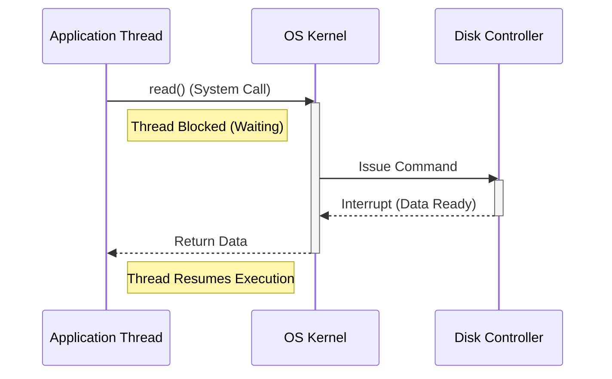
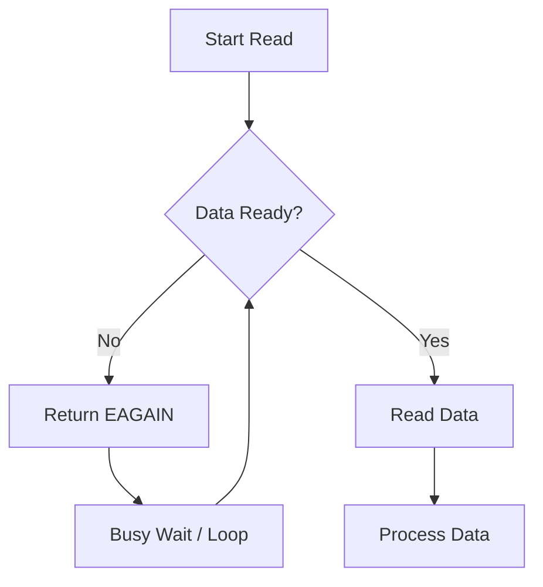
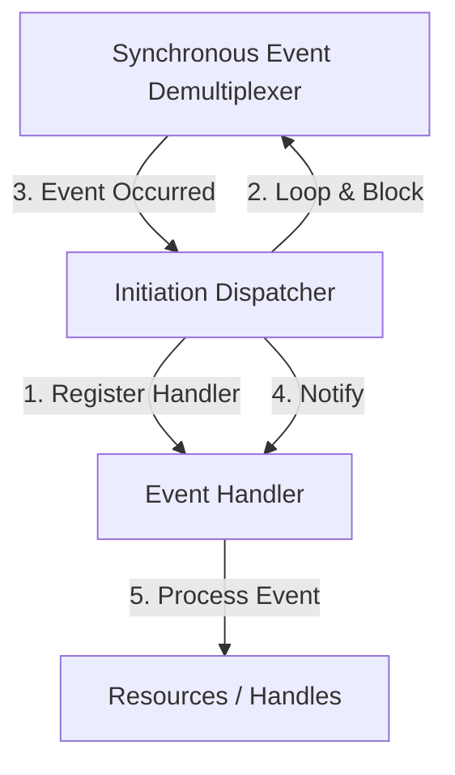
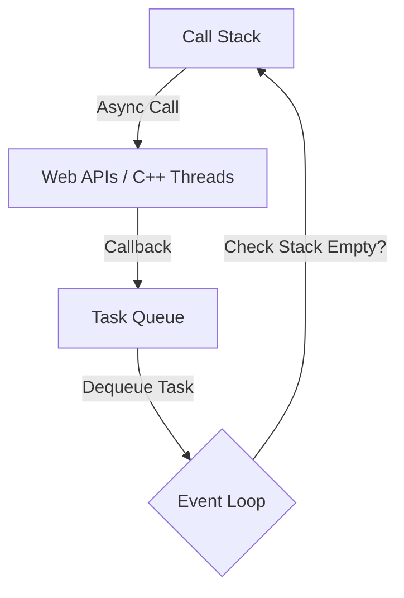
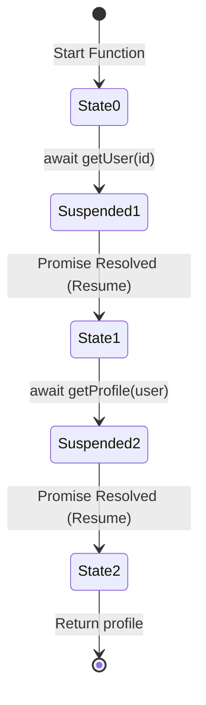

- [1 - Introduction](#1---introduction)
- [2 - Fundamental Theory of Execution](#2---fundamental-theory-of-execution)
  - [2.1 - The Sequential Execution Paradigm](#21---the-sequential-execution-paradigm)
  - [2.2 - Kernel I/O Mechanisms](#22---kernel-io-mechanisms)
    - [2.2.1 - Blocking I/O](#221---blocking-io)
    - [2.2.2 - Non-Blocking I/O](#222---non-blocking-io)
    - [2.2.3 - I/O Multiplexing](#223---io-multiplexing)
- [3 - Historical Context: The C10K Problem](#3---historical-context-the-c10k-problem)
  - [3.1 - The Thread-Per-Connection Model](#31---the-thread-per-connection-model)
  - [3.2 - The Shift to Event-Driven Architecture](#32---the-shift-to-event-driven-architecture)
- [4 - Architectural Components of Asynchrony](#4---architectural-components-of-asynchrony)
  - [4.1 - The Event Loop](#41---the-event-loop)
    - [4.1.1 - The Reactor Pattern](#411---the-reactor-pattern)
    - [4.1.2 - Proactor Pattern Comparison](#412---proactor-pattern-comparison)
  - [4.2 - The Call Stack and Task Queues](#42---the-call-stack-and-task-queues)
    - [4.2.1 - Execution Flow](#421---execution-flow)
  - [4.3 - Deep Dive: The Node.js Event Loop Phases](#43---deep-dive-the-nodejs-event-loop-phases)
- [5 - Implementation Patterns: From Callbacks to State Machines](#5---implementation-patterns-from-callbacks-to-state-machines)
  - [5.1 - The Callback Pattern](#51---the-callback-pattern)
  - [5.2 - Promises](#52---promises)
  - [5.3 - Async/Await and the State Machine](#53---asyncawait-and-the-state-machine)
    - [5.3.1 - Architectural Transpilation](#531---architectural-transpilation)
- [6 - Comparative Analysis: Synchronous vs. Asynchronous Models](#6---comparative-analysis-synchronous-vs-asynchronous-models)
  - [6.1 - Performance and Resource Utilisation](#61---performance-and-resource-utilisation)
  - [6.2 - The "Blocking the Loop" Vulnerability](#62---the-blocking-the-loop-vulnerability)
- [7 - Alternative Concurrency Models](#7---alternative-concurrency-models)
  - [7.1 - Go: Goroutines and CSP](#71---go-goroutines-and-csp)
  - [7.2 - Rust: Zero-Cost Futures](#72---rust-zero-cost-futures)
  - [7.3 - The Actor Model (Erlang/Elixir, Akka)](#73---the-actor-model-erlangelixir-akka)
- [8 - Web Development Paradigms: Frontend vs. Backend](#8---web-development-paradigms-frontend-vs-backend)
  - [8.1 - Frontend: The Responsiveness Imperative](#81---frontend-the-responsiveness-imperative)
  - [8.2 - Backend: The Throughput Imperative](#82---backend-the-throughput-imperative)
  - [8.3 - Communication Patterns](#83---communication-patterns)
- [9 - Modern Best Practices and Patterns](#9---modern-best-practices-and-patterns)
  - [9.1 - Structured Concurrency](#91---structured-concurrency)
  - [9.2 - Error Handling](#92---error-handling)
  - [9.3 - TypeScript Example: Type-Safe Async Wrapper](#93---typescript-example-type-safe-async-wrapper)
- [10 - Conclusion](#10---conclusion)
- [References](#references)


# 1 - Introduction

The distinction between **synchronous** and **asynchronous** programming constitutes the foundational dichotomy of modern software architecture. It dictates not merely how code is written, but how computing resources are allocated, how systems scale under load, and how user interfaces respond to interaction. Historically, software execution mimicked the sequential nature of early processors: one instruction followed another, and if an instruction required external data, the entire system waited. As network demands grew and the era of the internet necessitated servers capable of handling tens of thousands of concurrent connections, this blocking model proved mathematically insufficient, leading to the rise of **non-blocking I/O** and **Event-Driven Architecture (EDA)**.

This report provides an exhaustive technical analysis of these two paradigms. It explores the computer science theory underpinning concurrency, the operating system mechanisms that enable I/O multiplexing, and the specific implementations found in high-level environments like Node.js and modern browsers. We will dissect architectural patterns such as the **Reactor pattern**, the internal state machine transformations of `async`/`await` syntax, and the memory implications of thread-based versus event-based systems. Furthermore, this document offers a comparative evaluation against alternative concurrency models, including Go’s Communicating Sequential Processes (CSP) and the Actor model, to provide a holistic view for engineers designing scalable, fault-tolerant systems.


# 2 - Fundamental Theory of Execution

To comprehend the divergence between synchronous and asynchronous programming, one must first deconstruct the underlying hardware and operating system interactions that govern process execution. At the lowest level, the Central Processing Unit (CPU) functions as a sequential instruction processor. However, software must interact with peripherals (disks, network interface cards (NICs), and user input devices) that operate at speeds orders of magnitude slower than the CPU. The strategy for managing this speed mismatch defines the execution model.

## 2.1 - The Sequential Execution Paradigm

**Synchronous programming**, in its purest form, aligns with the sequential execution model. It assumes a direct correlation between the program counter and the logical progression of tasks. In this model, tasks are executed one after another. If Task A involves reading a file, the program issues a read command to the disk controller and halts execution. The CPU effectively pauses work on that specific thread, entering a 'blocked' or 'waiting' state until the disk controller signals via an interrupt that the data is ready.



This approach is analogous to a relay race where a runner (the code) passes a baton to a teammate (the I/O device) and stands still on the track until the teammate returns. While this model is deterministic and simplifies reasoning about program state (as variable values do not change unexpectedly beneath the programmer's feet), it is inherently inefficient for I/O-bound operations. The CPU, capable of billions of cycles per second, sits idle while waiting for a network packet that might take milliseconds (a virtual eternity in processor time).

## 2.2 - Kernel I/O Mechanisms

The operating system kernel mediates all interactions between user-space applications and hardware. Understanding the transition from blocking to non-blocking architectures requires examining the system calls available for I/O.

### 2.2.1 - Blocking I/O

In a **blocking I/O model**, when a thread invokes a system call such as `read()` on a socket, the kernel checks if data is available in the socket's buffer. If the buffer is empty, the kernel puts the calling thread to sleep. The thread is removed from the run queue and placed in a wait queue, consuming system resources (stack memory, kernel structures) without performing any work. It only wakes up when the hardware generates an interrupt indicating data arrival.

### 2.2.2 - Non-Blocking I/O

**Non-blocking I/O** changes the semantics of the system call. When a thread calls `read()` on a non-blocking socket, the kernel returns immediately. If data is present, it is returned; if not, the kernel returns an error code (such as `EAGAIN` or `EWOULDBLOCK`). This allows the thread to retain control of the CPU. However, this introduces a new challenge: how does the application know when data is finally ready?

Early implementations utilised **Busy Waiting** or **Polling**, where the application executes a tight loop repeatedly checking the status of the socket. This is computationally expensive, burning CPU cycles merely to ask "Is it ready yet?".



### 2.2.3 - I/O Multiplexing

To resolve the inefficiency of busy waiting, operating systems introduced **I/O multiplexing** primitives: `select()`, `poll()`, and later `epoll()` (on Linux) or `kqueue()` (on BSD/macOS). These mechanisms allow a single thread to monitor multiple file descriptors (sockets, files) simultaneously.

  * **`select` and `poll`:** These older system calls allow a program to provide a list of file descriptors to the kernel. The thread blocks on the `select` call itself. When one or more descriptors become ready, the kernel wakes the thread. However, `select` has a time complexity of $O(N)$, meaning performance degrades linearly as the number of connections increases.
  * **`epoll`:** Modern event-driven servers utilise `epoll`, which operates with $O(1)$ complexity. Instead of scanning the entire list of connections to find which one is active, `epoll` provides a list of only those specific connections that have triggered an event. This capability is the cornerstone of solving the scalability problems inherent in synchronous threading.


# 3 - Historical Context: The C10K Problem

The evolution from synchronous, thread-based architectures to asynchronous, event-driven architectures was largely driven by a specific industry challenge known as the **"C10K Problem."** Coined by Dan Kegel in 1999, this referred to the difficulty of configuring a web server to support ten thousand concurrent clients simultaneously.

## 3.1 - The Thread-Per-Connection Model

In the late 1990s, the dominant server architecture (exemplified by early versions of Apache) followed a synchronous **"Thread-Per-Connection"** model. For every incoming HTTP request, the server would spawn a new OS thread (or process). This thread would handle the request sequentially: read the header, block waiting for a database query, block waiting for disk I/O, and finally write the response.

While conceptually simple, this architecture faced severe physical limitations:

  * **Memory Overhead:** Each thread requires its own stack, typically ranging from 1MB to several MBs. Spawning 10,000 threads could require tens of gigabytes of RAM, exceeding the capacity of hardware at the time.
  * **Context Switching:** The OS scheduler must slice CPU time among all active threads. As the number of threads rises, the overhead of saving and restoring register states (context switching) increases. Eventually, the CPU spends more time switching between threads than executing application code, a condition known as "thrashing".

## 3.2 - The Shift to Event-Driven Architecture

To overcome the C10K barrier, developers adopted **Event-Driven Architecture (EDA)**. Instead of a thread for every client, EDA utilises a single thread (or a small pool of threads matching the number of CPU cores) running a continuous loop (the **Event Loop**).

In this model, the server accepts a connection and immediately returns to listening for more connections, registering a lightweight data structure (an event handler) to process the client's data when it eventually arrives. The program state is managed explicitly in heap-allocated objects rather than implicitly on thread stacks. This dramatically reduces the memory footprint per connection. By leveraging `epoll`, an event-driven server like Nginx or Node.js can handle tens or hundreds of thousands of concurrent connections on modest hardware, effectively solving the C10K problem and paving the way for the "C10M" (ten million connections) challenge.


# 4 - Architectural Components of Asynchrony

To provide a robust understanding, we must dissect the components that constitute an asynchronous runtime. While we often use Node.js or browser JavaScript as primary examples due to their popularity, the underlying concepts apply to any event-driven system (e.g., Python's asyncio, C++ with libevent).

## 4.1 - The Event Loop

The **Event Loop** is the central orchestrator of asynchronous execution. It is an infinite loop that waits for tasks, executes them, and then sleeps until more tasks arrive.

### 4.1.1 - The Reactor Pattern

The theoretical underpinning of most event loop implementations is the **Reactor Pattern**. This object-oriented behavioural pattern separates the application-independent demultiplexing logic from the application-specific processing logic.

The Reactor pattern consists of:

  * **Resources:** Handles to Operating System resources (sockets, file descriptors).
  * **Synchronous Event Demultiplexer:** A component that uses `select` or `epoll` to block until events occur on the resources.
  * **Initiation Dispatcher:** The interface that registers Event Handlers and manages the event loop. When the Demultiplexer unblocks, the Dispatcher notifies the appropriate handler.
  * **Event Handler:** Application code (callbacks) responsible for processing the specific event (e.g., "Data Received" or "Connection Accepted").

This separation allows the server to remain responsive. The Dispatcher manages the I/O, and the Handlers process the business logic.



### 4.1.2 - Proactor Pattern Comparison

While the Reactor pattern waits for readiness ("You can write to this socket now"), the **Proactor Pattern** waits for completion ("The write operation to this socket has finished"). The Proactor pattern is often used with Windows I/O Completion Ports (IOCP). Node.js's underlying library, **libuv**, abstracts these differences, using IOCP on Windows and epoll on Linux to provide a unified asynchronous interface.

## 4.2 - The Call Stack and Task Queues

In a JavaScript environment, the execution model interacts with three main structures: the Call Stack, the Task Queue (Macrotasks), and the Microtask Queue.

| Component           | Description                                                                                                             | Examples                                                      |
| :------------------ | :---------------------------------------------------------------------------------------------------------------------- | :------------------------------------------------------------ |
| **Call Stack**      | A LIFO (Last-In, First-Out) structure tracking the currently executing function frames. Synchronous code executes here. | Standard function calls, `console.log`                        |
| **Task Queue**      | A FIFO (First-In, First-Out) queue holding callbacks for external events. Processed one per loop tick.                  | `setTimeout`, `setInterval`, I/O callbacks                    |
| **Microtask Queue** | A high-priority FIFO queue. Drained **completely** after every task completes and before rendering.                     | `Promise.then`, `process.nextTick` (Node), `MutationObserver` |

### 4.2.1 - Execution Flow

1.  **Synchronous Phase:** Code executes on the Call Stack. If an async function (e.g., `fetch`) is called, it initiates the operation in the background (via Web APIs or C++ threads) and immediately returns, popping off the stack.
2.  **Task Scheduling:** When the background operation completes, its callback is placed in the Task Queue.
3.  **The Loop Tick:** The Event Loop constantly checks: "Is the Call Stack empty?" If yes, it dequeues the oldest task from the Task Queue and pushes it onto the Call Stack for execution.

<!-- end list -->



## 4.3 - Deep Dive: The Node.js Event Loop Phases

Unlike the browser's relatively simple loop, the Node.js event loop is composed of distinct phases, each maintaining its own FIFO queue of callbacks. This complexity is necessary to handle system operations and I/O efficiently.

1.  **Timers Phase:** Executes callbacks scheduled by `setTimeout()` and `setInterval()`. The loop checks if the current time has surpassed the timer's threshold.
2.  **Pending Callbacks Phase:** Executes deferred system callbacks, such as TCP errors (e.g., `ECONNREFUSED` when trying to connect to a port).
3.  **Idle, Prepare Phase:** Used internally by Node.js for housekeeping.
4.  **Poll Phase:** This is the most critical phase. The loop calculates how long it should block and polls for I/O events. It processes the queue of I/O callbacks (reading files, receiving network data). If the queue is empty, the loop may block here waiting for incoming data.
5.  **Check Phase:** Executes callbacks scheduled by `setImmediate()`. This allows scripts to execute immediately after the I/O poll phase completes, ensuring I/O callbacks have finished.
6.  **Close Callbacks Phase:** Handles cleanup events, such as `socket.on('close')`, ensuring resources are freed correctly.

> **Critical Insight - `process.nextTick()`:** In Node.js, `process.nextTick()` is technically not part of the event loop. Instead, the `nextTickQueue` is processed after the current operation completes, regardless of the current phase. This means a recursive `nextTick` loop can starve the event loop, preventing it from ever reaching the Poll phase to handle I/O.


# 5 - Implementation Patterns: From Callbacks to State Machines

The syntax used to express asynchronous logic has evolved significantly to manage the inherent complexity of non-linear execution.

## 5.1 - The Callback Pattern

The original mechanism for asynchronous handling was the callback: passing a function pointer to be executed later.

**Mechanism:** `fs.readFile('path', function(err, data) {... }).`

**Disadvantages:** This led to the "Pyramid of Doom" or "Callback Hell," where deeply nested callbacks made code difficult to read and maintain. Furthermore, it suffered from "Inversion of Control," where the developer implicitly trusted the third-party library to call the callback exactly once.

## 5.2 - Promises

Promises were introduced to provide a standardised interface for asynchronous results. A Promise is an object representing a value that may be available now, in the future, or never.

  * **Advantages:** Promises resolved the inversion of control issue (a Promise can only settle once) and allowed for linear chaining (`.then().then()`), flattening the pyramid.
  * **Microtask Integration:** Promise callbacks are handled in the Microtask queue, ensuring they execute with higher priority than standard timers.

## 5.3 - Async/Await and the State Machine

Introduced in ES2017, `async`/`await` offers the syntactic appearance of synchronous code while maintaining non-blocking behaviour. However, it is crucial to understand that `async`/`await` is a compile-time transformation, often referred to as "syntactic sugar" over Promises and Generators.

### 5.3.1 - Architectural Transpilation

When a compiler like TypeScript or Babel processes an async function targeting an older environment (like ES5), it converts the function into a State Machine.

Consider a simple async function:

```typescript
async function fetchUser(id) {
    const user = await getUser(id);
    const profile = await getProfile(user);
    return profile;
}
```

The compiler transforms this into a generator-like structure driven by a switch statement:

1.  **State 0:** Execute code up to the first `await`. Call `getUser(id)`. Return the Promise and suspend execution.
2.  **State 1:** The runtime (or a helper function like `__awaiter`) attaches a `.then()` handler to that Promise. When it resolves, the state machine resumes at State 1. The result is assigned to `user`.
3.  **State 2:** Call `getProfile(user)`. Return the Promise and suspend.
4.  **State 3:** Resume when resolved, assign to `profile`, and return the final value.

<!-- end list -->



This demystifies the "magic" of `await`. It is not pausing the thread; it is returning from the function and scheduling a resumption via a callback, managed entirely by a compiler-generated state machine.


# 6 - Comparative Analysis: Synchronous vs. Asynchronous Models

Architectural decisions require trade-offs. The choice between synchronous (threaded) and asynchronous (evented) models depends heavily on the nature of the workload.

## 6.1 - Performance and Resource Utilisation

| Feature          | Synchronous (Thread-Per-Request)                                                                 | Asynchronous (Event-Driven)                                                                                    |
| :--------------- | :----------------------------------------------------------------------------------------------- | :------------------------------------------------------------------------------------------------------------- |
| **Concurrency**  | Limited by memory (stack size) and OS thread limits. Scaling beyond a few thousand is difficult. | Extremely high scalability. Handles tens of thousands of connections with minimal memory overhead.             |
| **Memory Usage** | High. Each thread allocates a stack (e.g., 1MB). 10k threads = \~10GB RAM.                       | Low. Only allocates small heap objects for closures and state. 10k connections may use only a few hundred MBs. |
| **CPU Overhead** | High context switching costs (**Context Switch Storm**) when many threads are active.            | Low. Context switching is minimised as there is typically only one thread per core.                            |
| **Throughput**   | Lower for I/O-bound tasks due to blocking.                                                       | Higher for I/O-bound tasks due to non-blocking overlap.                                                        |

**Benchmarks:** Synthetic benchmarks consistently show that for high-concurrency, I/O-heavy workloads (such as a proxy server or chat application), event-driven models (Node.js, Nginx) vastly outperform threaded models (Apache Prefork) in terms of connections per second and memory efficiency.

## 6.2 - The "Blocking the Loop" Vulnerability

The Achilles' heel of the asynchronous model is **CPU-bound work**. Because there is only one thread processing the Event Loop, a single long-running calculation (e.g., calculating Fibonacci numbers, image processing, or heavy JSON parsing) blocks the entire process.

In a synchronous threaded model, a heavy calculation only blocks the single thread assigned to that request; other threads continue serving other clients. In an asynchronous model, a heavy calculation blocks the loop, causing all connected clients to experience a freeze. This phenomenon is known as "starving the event loop" and can lead to a Denial of Service (DoS) where the server becomes unresponsive to health checks.

**Mitigation:** CPU-intensive tasks in Node.js must be offloaded to **Worker Threads** (which execute in parallel OS threads) or separate processes to ensure the main event loop remains free to handle I/O.


# 7 - Alternative Concurrency Models

While "Sync vs. Async" is the primary dichotomy, modern languages have introduced hybrid approaches that aim to combine the performance of async with the simplicity of sync.

## 7.1 - Go: Goroutines and CSP

Go (Golang) utilises a concurrency model based on **Communicating Sequential Processes (CSP)**.

  * **Goroutines:** These are "green threads" managed by the Go runtime, not the OS. They start with a tiny stack (2KB) that grows dynamically.
  * **M:N Scheduling:** The Go runtime multiplexes $M$ Goroutines onto $N$ OS threads. If a Goroutine blocks on I/O, the runtime simply parks it and schedules another Goroutine on the same OS thread.

**Advantage:** This allows developers to write synchronous-looking code (blocking style) while achieving asynchronous-level scalability and utilizing all CPU cores automatically.

## 7.2 - Rust: Zero-Cost Futures

Rust employs a **Poll-based** asynchronous model, distinct from the **Push-based** model of JavaScript Promises.

  * **Lazy Execution:** In JavaScript, a Promise starts executing immediately upon creation ("eager"). In Rust, a Future is lazy; it does nothing until it is explicitly polled by an executor.
  * **Zero-Cost Abstraction:** Rust's `async`/`await` compiles down to state machines similar to C\#, but without the runtime overhead of a garbage collector. It requires concepts like `Pin` to handle memory safety for self-referential structs in async state machines.

## 7.3 - The Actor Model (Erlang/Elixir, Akka)

The Actor model avoids shared state entirely. "Actors" are independent entities that communicate exclusively via immutable messages.

  * **Isolation:** If an Actor crashes, it does not corrupt the state of others. Supervisors can restart failed Actors.
  * **Distribution:** Actors can transparently communicate across network boundaries, making this model ideal for distributed systems.


# 8 - Web Development Paradigms: Frontend vs. Backend

The application of asynchronous theory differs significantly depending on the environment.

## 8.1 - Frontend: The Responsiveness Imperative

In the browser, the main thread is a shared resource responsible for:

1.  Running JavaScript.
2.  Parsing HTML/CSS.
3.  Calculating Layout.
4.  Painting pixels to the screen.

The browser attempts to render frames at 60 frames per second (FPS), leaving a "frame budget" of approximately **16.6ms** per frame. If a synchronous task takes longer than this budget, the browser drops frames, causing "jank." If it takes longer than a few seconds, the browser marks the page as unresponsive.

**Implication:** Asynchronous programming is mandatory on the frontend not just for efficiency, but for **User Experience (UX)**. Fetching data synchronously would freeze the UI, preventing the user from scrolling or clicking. Technologies like **Web Workers** allow heavy processing to be offloaded to a background thread, communicating with the main thread via message passing to update the UI.

## 8.2 - Backend: The Throughput Imperative

On the server, the primary metrics are throughput (requests per second) and latency.

  * **I/O Bound Services:** For applications that primarily wait for databases or external APIs (e.g., REST APIs, Proxies), the asynchronous model (Node.js) is ideal because it maximises the number of idle connections the server can hold.
  * **CPU Bound Services:** For applications involving heavy computation (e.g., video encoding, machine learning), the synchronous threaded model or a hybrid (Node.js with Worker Threads/Cluster) is required to prevent loop blockage.

## 8.3 - Communication Patterns

  * **REST (Synchronous/Async):** Standard HTTP is request-response. The client waits for the server.
  * **WebSockets:** A persistent, bi-directional, full-duplex protocol. Essential for real-time apps (chat, gaming) where the server needs to push data to the client without polling.
  * **Server-Sent Events (SSE):** A uni-directional channel where the server pushes updates to the client over HTTP. Simpler than WebSockets for "ticker" style updates.


# 9 - Modern Best Practices and Patterns

## 9.1 - Structured Concurrency

A persistent issue with standard Promises is "fire-and-forget" logic, where a spawned task outlives its parent, potentially causing memory leaks or silent errors. **Structured Concurrency** is a paradigm (popularised by Kotlin and libraries like `trio` in Python) where the lifetime of a child task is strictly bound to its parent scope.

**JavaScript Implementation:** While JS does not enforce this natively, the `AbortController` API is the standard mechanism for cancellation. Passing an `AbortSignal` to async operations allows a parent to cancel all child network requests when a component unmounts or a timeout occurs.

## 9.2 - Error Handling

Correct error handling in async code is critical.

  * **Try/Catch:** With `async`/`await`, standard `try`/`catch` blocks capture both synchronous errors and Promise rejections, unifying error handling logic.
  * **`Promise.allSettled`:** When running parallel tasks, `Promise.all` fails fast (if one fails, all fail). `Promise.allSettled` waits for all tasks to complete, returning a status for each, which is often safer for independent operations.

## 9.3 - TypeScript Example: Type-Safe Async Wrapper

The following example demonstrates a robust, type-safe implementation of an asynchronous fetcher using TypeScript, incorporating error handling and signal cancellation.

```typescript
// Custom Error Class for better debugging
class APIError extends Error {
    constructor(public status: number, message: string) {
        super(message);
        this.name = 'APIError';
    }
}

interface UserProfile {
    id: number;
    username: string;
    email: string;
}

/**
 * Fetches user profile with cancellation support.
 * @param userId - The ID of the user to fetch
 * @param signal - AbortSignal for cancellation (Structured Concurrency)
 */
async function fetchUserProfile(
    userId: number, 
    signal?: AbortSignal): Promise<UserProfile> {
    try {
        const response = await fetch(`/api/users/${userId}`, { signal });
        
        if (!response.ok) {
            throw new APIError(response.status, `Server error: ${response.statusText}`);
        }

        const data: UserProfile = await response.json();
        return data;

    } catch (error) {
        if (error instanceof Error && error.name === 'AbortError') {
            console.warn('Fetch request was cancelled');
        } else if (error instanceof APIError) {
            console.error(`API Error ${error.status}: ${error.message}`);
        } else {
            console.error('Unexpected network error', error);
        }
        throw error; // Propagate error to caller
    }
}
```


# 10 - Conclusion

The transition from synchronous to asynchronous programming represents one of the most significant architectural shifts in software engineering history. It was a transition necessitated by the physical realities of latency: the vast gulf between CPU speed and I/O speed. The synchronous model, while cognitively simpler, treats the CPU as a resource to be wasted while waiting. The asynchronous model, built upon the theoretical foundation of the Reactor pattern and the practical utility of non-blocking I/O multiplexing (`epoll`), treats the CPU as a scarce resource to be maximised.

For the modern engineer, understanding this distinction is not merely about syntax, choosing between `await` or `.then`. It is about understanding the system's heartbeat. It involves visualising the Event Loop spinning, understanding the cost of a stack frame versus a closure, and recognising the dangers of blocking the main thread. While alternative models like Go's Goroutines or Rust's zero-cost Futures offer different ergonomic trade-offs, the underlying principle remains constant: high-performance systems must decouple the initiation of work from the waiting for its completion. As applications continue to move towards real-time interactivity and massive concurrency, the mastery of asynchronous theory remains the defining skill of the backend and frontend architect alike.


# References

1. Welsh, M., Culler, D., & Brewer, E. (2001). [SEDA: An Architecture for Well-Conditioned, Scalable Internet Services](https://www.sosp.org/2001/papers/welsh.pdf). *Proceedings of the 18th ACM Symposium on Operating Systems Principles (SOSP ’01).* ([sosp.org][1])

2. Pai, V. S., Druschel, P., & Zwaenepoel, W. (1999). [Flash: An Efficient and Portable Web Server](https://www.usenix.org/legacy/event/usenix99/full_papers/pai/pai.pdf). *USENIX Annual Technical Conference.* ([USENIX][2])

3. Adya, A., Howell, J., Theimer, M., Bolosky, W. J., & Douceur, J. R. (2002). [Cooperative Task Management Without Manual Stack Management](https://www.usenix.org/conference/2002-usenix-annual-technical-conference/cooperative-task-management-without-manual-stack). *USENIX Annual Technical Conference (USENIX ATC ’02).* ([USENIX][3])

4. von Behren, R., Condit, J., & Brewer, E. (2003). [Why Events Are a Bad Idea (for high-concurrency servers)](https://web.stanford.edu/class/cs240e/papers/threads-hotos-2003.pdf). *Proceedings of the 9th Workshop on Hot Topics in Operating Systems (HotOS IX).* ([Stanford University][4])

5. von Behren, R., Condit, J., Zhou, F., Necula, G. C., & Brewer, E. (2003). [Capriccio: Scalable Threads for Internet Services](https://capriccio.cs.berkeley.edu/pubs/capriccio-sosp-2003.pdf). *Proceedings of the 19th ACM Symposium on Operating Systems Principles (SOSP ’03).* ([capriccio.cs.berkeley.edu][5])

6. Pariag, D., Brecht, T., Harji, A., Buhr, P. A., Shukla, A., & Cheriton, D. R. (2007). [Comparing the Performance of Web Server Architectures](https://people.eecs.berkeley.edu/~brewer/cs262/Pariag07.pdf). *EuroSys ’07 / ACM SIGOPS Operating Systems Review, 41(3), 231–243.* ([people.eecs.berkeley.edu][6])

7. Li, P., & Zdancewic, S. (2007). [Combining Events and Threads for Scalable Network Services: Implementation and Evaluation of Monadic, Application-Level Concurrency Primitives](https://cse.hkust.edu.hk/~charlesz/comp610/paper/event_thread_pldi.pdf). *Proceedings of the ACM SIGPLAN Conference on Programming Language Design and Implementation (PLDI ’07).* ([cse.hkust.edu.hk][7])

8. Haller, P., & Odersky, M. (2009). [Scala Actors: Unifying Thread-Based and Event-Based Programming](https://www.sciencedirect.com/science/article/pii/S0304397508006695/pdf). *Theoretical Computer Science, 410(2–3), 202–220.* ([ACM Digital Library][8])

9. Hoare, C. A. R. (1978). [Communicating Sequential Processes](https://www.cs.cmu.edu/~crary/819-f09/Hoare78.pdf). *Communications of the ACM, 21(8), 666–677.* ([cs.cmu.edu][9])

10. Brookes, S. D., Hoare, C. A. R., & Roscoe, A. W. (1984). [A Theory of Communicating Sequential Processes](https://scispace.com/pdf/a-theory-of-communicating-sequential-processes-557j9b1i7v.pdf). *Journal of the ACM, 31(3), 560–599.* ([SciSpace][10])

11. Hewitt, C., Bishop, P., & Steiger, R. (1973). [A Universal Modular ACTOR Formalism for Artificial Intelligence](https://www.ijcai.org/Proceedings/73/Papers/027B.pdf). *Proceedings of the 3rd International Joint Conference on Artificial Intelligence (IJCAI ’73), 235–245.* ([IJCAI][11])

12. Balasubramanian, A., Baranowski, M. S., Burtsev, A., Panda, A., Rakamarić, Z., Ryzhyk, L., & others. (2017). [System Programming in Rust: Beyond Safety](https://cs.nyu.edu/~apanda/assets/papers/hotos2017-rust.pdf). *Proceedings of the 16th Workshop on Hot Topics in Operating Systems (HotOS ’17).* ([NYU Computer Science][12])

13. Jung, R., Jourdan, J.-H., Krebbers, R., & Dreyer, D. (2020). [Safe Systems Programming in Rust: The Promise and the Challenge](https://people.mpi-sws.org/~dreyer/papers/safe-sysprog-rust/paper.pdf). *Communications of the ACM, 65(11), 74–84.* 

14. Dilley, N., & Lange, J. (2019). [A Large-Scale Study of Message Passing Concurrency in Go](https://kar.kent.ac.uk/71491/1/main.pdf). *Proceedings of the 34th ACM/SIGAPP Symposium on Applied Computing (SAC ’19).* 

15. Tu, F., Zhang, J., Lin, D., Wang, D., Liang, Y., & Wang, X. (2019). [Understanding Real-World Concurrency Bugs in Go](https://songlh.github.io/paper/go-study.pdf). *Proceedings of the 40th ACM SIGPLAN Conference on Programming Language Design and Implementation (PLDI ’19).* ([Linhai Song's Home Page][13])

16. Davis, J. C., Thekumparampil, A., & Lee, D. (2017). [Node.fz: Fuzzing the Server-Side Event-Driven Architecture](https://www3.cs.stonybrook.edu/~dongyoon/papers/EUROSYS-17-NodeFz.pdf). *Proceedings of the 12th European Conference on Computer Systems (EuroSys ’17).* 

17. Schiavio, F., Cassar, I., Francalanza, A., & Pace, G. J. (2019). [NodeMOP: Runtime Verification for Node.js Applications](https://atlarge-research.com/pdfs/2019-nodemop-fschiavio.pdf). *Proceedings of the 19th International Conference on Runtime Verification (RV ’19).* ([AtLarge Research][14])

18. Chen, Y.-A., & You, Y.-P. (2022). [Structured Concurrency: A Review](https://dl.acm.org/doi/pdf/10.1145/3547276.3548519). *ICPP Workshops 2022: Workshop Proceedings of the 51st International Conference on Parallel Processing, 16:1–16:8.* ([ACM Digital Library][15])

19. Elizarov, R., Belyaev, M., Akhin, M., & Usmanov, I. (2021). [Kotlin Coroutines: Design and Implementation](https://dl.acm.org/doi/pdf/10.1145/3486607.3486751). *Onward! ’21: ACM SIGPLAN International Symposium on New Ideas, New Paradigms, and Reflections on Programming and Software.* ([ACM Digital Library][16])

20. Haller, P., & Odersky, M. (2009). [Actors That Unify Threads and Events](https://www.researchgate.net/publication/220994136_Actors_That_Unify_Threads_and_Events). *In *Actors in Concurrent Programming* (extended version of Scala Actors work).* ([researchgate.net][17])

[1]: https://www.sosp.org/2001/papers/welsh.pdf "SEDA: An Architecture for Well-Conditioned, Scalable Internet Services"
[2]: https://www.usenix.org/event/usenix99/full_papers/pai/pai.pdf?utm_source=chatgpt.com "Flash: An Efficient and Portable Web Server"
[3]: https://www.usenix.org/conference/2002-usenix-annual-technical-conference/cooperative-task-management-without-manual-stack "Cooperative Task Management Without Manual Stack Management | USENIX"
[4]: https://web.stanford.edu/class/cs240e/papers/threads-hotos-2003.pdf?utm_source=chatgpt.com "Why Events Are A Bad Idea (for high-concurrency servers)"
[5]: https://capriccio.cs.berkeley.edu/pubs/capriccio-sosp-2003.pdf?utm_source=chatgpt.com "Capriccio: Scalable Threads for Internet Services"
[6]: https://people.eecs.berkeley.edu/~brewer/cs262/Pariag07.pdf?utm_source=chatgpt.com "Comparing the Performance of Web Server Architectures"
[7]: https://cse.hkust.edu.hk/~charlesz/comp610/paper/event_thread_pldi.pdf?utm_source=chatgpt.com "Combining Events And Threads For Scalable Network ..."
[8]: https://dl.acm.org/doi/abs/10.1016/j.tcs.2008.09.019?utm_source=chatgpt.com "Scala Actors: Unifying thread-based and event ..."
[9]: https://www.cs.cmu.edu/~crary/819-f09/Hoare78.pdf?utm_source=chatgpt.com "Communicating sequential processes"
[10]: https://scispace.com/pdf/a-theory-of-communicating-sequential-processes-557j9b1i7v.pdf?utm_source=chatgpt.com "A theory of communicating sequential processes"
[11]: https://www.ijcai.org/Proceedings/73/Papers/027B.pdf?utm_source=chatgpt.com "A Universal Modular ACTOR Formalism"
[12]: https://cs.nyu.edu/~apanda/assets/papers/hotos2017-rust.pdf "System Programming in Rust: Beyond Safety"
[13]: https://songlh.github.io/paper/go-study.pdf " Understanding Real-World Concurrency Bugs in Go "
[14]: https://atlarge-research.com/pdfs/2019-nodemop-fschiavio.pdf "NodeMOP: Runtime Verification for Node.js Applications"
[15]: https://dl.acm.org/doi/pdf/10.1145/3547276.3548519?utm_source=chatgpt.com "Structured Concurrency: A Review"
[16]: https://dl.acm.org/doi/pdf/10.1145/3486607.3486751?utm_source=chatgpt.com "Kotlin Coroutines: Design and Implementation"
[17]: https://www.researchgate.net/publication/220994136_Actors_That_Unify_Threads_and_Events?utm_source=chatgpt.com "Actors That Unify Threads and Events"
