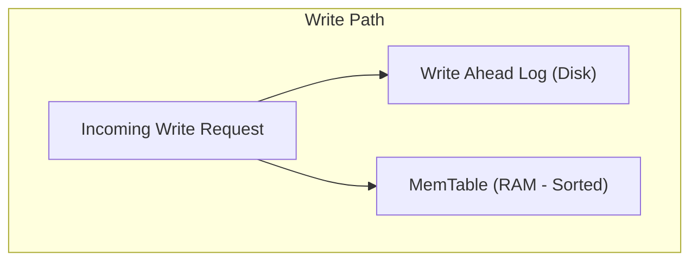
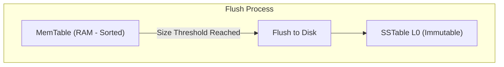
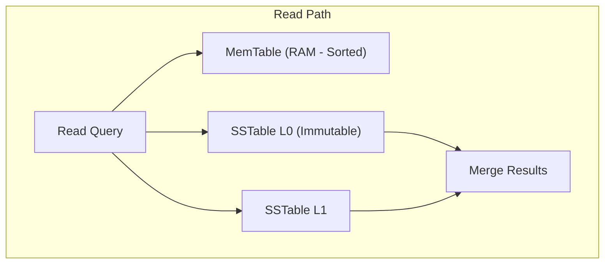
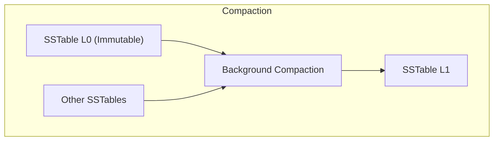
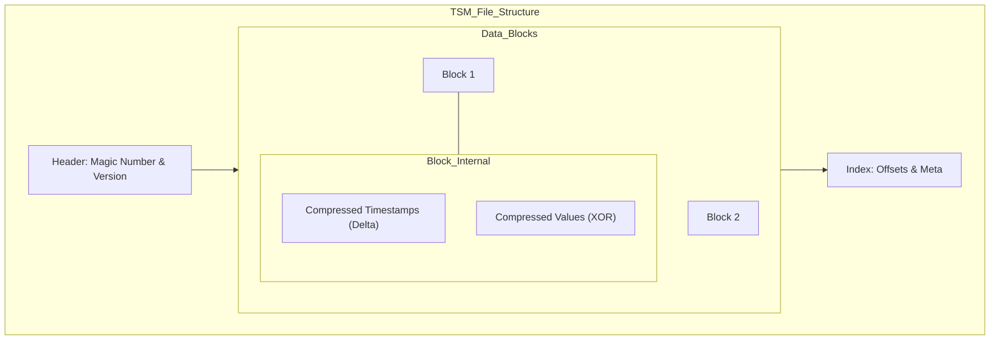
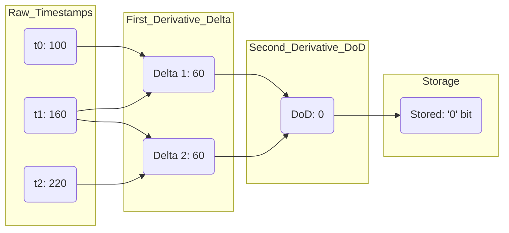
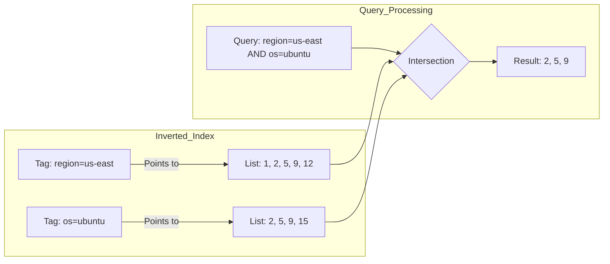
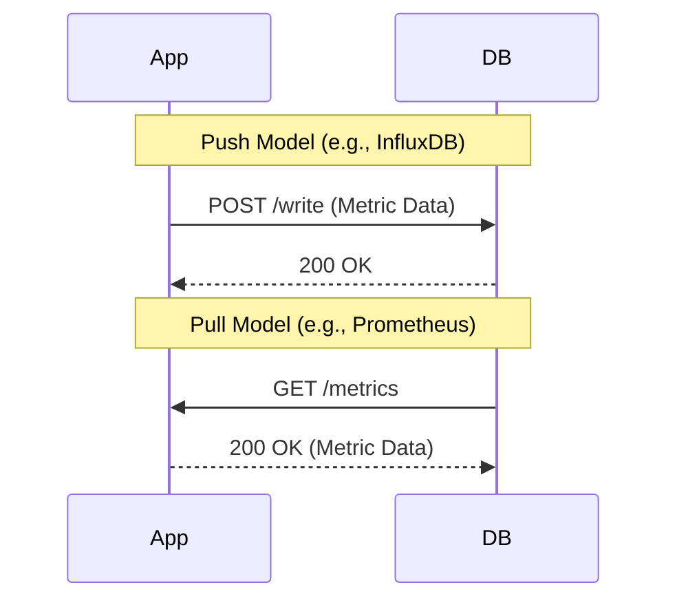

- [1 - Introduction: The Deterministic Nature of Temporal Data](#1---introduction-the-deterministic-nature-of-temporal-data)
- [2 - Theoretical Foundations and Core Requirements](#2---theoretical-foundations-and-core-requirements)
	- [2.1 - The Append-Only Immutable Constraint](#21---the-append-only-immutable-constraint)
	- [2.2 - Cardinality and Dimensions](#22---cardinality-and-dimensions)
	- [2.3 - The Value of Recency](#23---the-value-of-recency)
- [3 - Data Structures and Storage Engines](#3---data-structures-and-storage-engines)
	- [3.1 - Log-Structured Merge (LSM) Trees](#31---log-structured-merge-lsm-trees)
	- [3.2 - Time-Structured Merge (TSM) Trees](#32---time-structured-merge-tsm-trees)
	- [3.3 - Hypertables and Chunking](#33---hypertables-and-chunking)
	- [3.4 - In-Memory Structures (Gorilla/Beringei)](#34---in-memory-structures-gorillaberingei)
- [4 - Mathematical Primitives of Time Series Compression](#4---mathematical-primitives-of-time-series-compression)
	- [4.1 - Delta-of-Delta Timestamp Encoding](#41---delta-of-delta-timestamp-encoding)
	- [4.2 - XOR Floating Point Compression](#42---xor-floating-point-compression)
	- [4.3 - Dictionary and Integer Compression](#43---dictionary-and-integer-compression)
	- [4.4 - Theoretical Comparison to Video Compression](#44---theoretical-comparison-to-video-compression)
- [5 - Indexing High Cardinality Data](#5---indexing-high-cardinality-data)
	- [5.1 - The Inverted Index](#51---the-inverted-index)
	- [5.2 - Roaring Bitmaps](#52---roaring-bitmaps)
- [6 - Query Processing and Aggregation](#6---query-processing-and-aggregation)
	- [6.1 - Vectorisation and SIMD](#61---vectorisation-and-simd)
	- [6.2 - Downsampling Algorithms: LTTB](#62---downsampling-algorithms-lttb)
	- [6.3 - Handling Counter Resets](#63---handling-counter-resets)
- [7 - Distributed Architecture and Scalability](#7---distributed-architecture-and-scalability)
	- [7.1 - Sharding Strategies](#71---sharding-strategies)
	- [7.2 - Consistency vs. Availability (CAP Theorem)](#72---consistency-vs-availability-cap-theorem)
	- [7.3 - Push vs. Pull Models](#73---push-vs-pull-models)
- [8 - Integration with Artificial Intelligence and Signal Processing](#8---integration-with-artificial-intelligence-and-signal-processing)
	- [8.1 - Forecasting and Anomaly Detection](#81---forecasting-and-anomaly-detection)
	- [8.2 - Video Data Processing](#82---video-data-processing)
- [9 - Comparative Analysis: Legacy vs. Modern Implementations](#9---comparative-analysis-legacy-vs-modern-implementations)
	- [9.1 - The Performance Gap](#91---the-performance-gap)
- [10 - Conclusion](#10---conclusion)
- [References](#references)

# 1 - Introduction: The Deterministic Nature of Temporal Data

The exponential growth of telemetry generated by distributed systems, Internet of Things (IoT) sensor networks, and high-frequency financial trading platforms has necessitated a fundamental paradigm shift in database architecture. Traditional Relational Database Management Systems (RDBMS), underpinned by B-Tree indexing and ACID (Atomicity, Consistency, Isolation, Durability) transactional guarantees, struggle to accommodate the unique characteristics of time series data. This report provides a comprehensive technical analysis of Time Series Databases (TSDBs), exploring the mathematical algorithms, storage engines, and indexing strategies that enable the ingestion and analysis of petabytes of temporal data.

Time series data is mathematically distinct from the transactional data typically stored in an RDBMS. Formally, a time series $T$ may be defined as a set of ordered tuples $T = \{(t_1, v_1), (t_2, v_2),..., (t_n, v_n)\}$, where $t_i$ represents a strictly increasing timestamp and $v_i$ represents a measured value or a vector of values, such that $t_1 < t_2 <... < t_n$. Unlike a user profile or a bank balance which undergoes random updates, time series data is predominantly immutable; once a temperature is recorded or a CPU spike is logged, the event is historically fixed. This immutability permits architectural optimisations (such as lock-free write paths and aggressive compression) that are unavailable to general-purpose databases.

The primary limitation of general-purpose databases in this context lies in the mismatch between the B-Tree data structure and the write patterns of high-cardinality time series. While B-Trees offer $O(\log n)$ lookup performance, they rely on data locality within pages (typically 4KB to 16KB) to minimise disk I/O. In a monitoring scenario where millions of distinct sensors (high cardinality) report metrics simultaneously, the database must update millions of disparate pages. This phenomenon, known as **write amplification**, forces the disk head to thrash, effectively degrading sequential write operations into random I/O, which is orders of magnitude slower. Furthermore, the storage overhead of a standard RDBMS (often requiring 16 bytes or more for row headers) is prohibitive when scaling to trillions of data points. Modern TSDBs address these challenges through specialised columnar storage engines and mathematical compression techniques that reduce storage footprints to an average of 1.37 bytes per point.

This report will dissect the internal mechanisms of systems such as Facebook's Gorilla (and its open-source derivative Beringei), Google's Monarch, InfluxDB, and VictoriaMetrics. It will compare the legacy Log-Structured Merge (LSM) tree approaches with modern Time-Structured Merge (TSM) trees, analyse the discrete mathematics of floating-point compression, and explore the intersection of TSDBs with signal processing and artificial intelligence.

# 2 - Theoretical Foundations and Core Requirements

To understand the engineering decisions behind TSDBs, one must first appreciate the theoretical properties of the data they manage. Time series data is not merely a sequence of numbers; it is a signal sampled at discrete intervals.

## 2.1 - The Append-Only Immutable Constraint

A defining characteristic of time series data is its append-only nature. New data points arrive constantly as the "present" moves forward in time. This implies that update and delete operations, which are expensive in traditional databases due to the need for locking and consistency checks, are rare in TSDB workloads. Instead, the primary write operation is a high-velocity insert. TSDB architectures exploit this by using log-structured storage engines that simply append new data to the end of a file, converting random writes into sequential writes. This design choice aligns perfectly with the physical characteristics of both spinning hard disks (HDDs), where seek time is the bottleneck, and Solid State Drives (SSDs), where sequential writes minimise write amplification and extend device longevity.

## 2.2 - Cardinality and Dimensions

In a mathematical sense, a single time series is a one-dimensional array indexed by time. However, modern observability requires multidimensional analysis. A metric is often identified by a name (e.g., `cpu_usage`) and a set of key-value pairs called tags or labels (e.g., `host=server-1`, `region=us-east`). The set of all unique combinations of these tags defines the cardinality of the dataset.

Let $L$ be the set of label keys and $V_l$ be the set of possible values for a label $l \in L$. The cardinality $C$ is the size of the Cartesian product of all active label values:

$$C = |V_{l_1} \times V_{l_2} \times... \times V_{l_k}|$$

In high-scale environments, $C$ can reach tens or hundreds of millions. This "cardinality explosion" renders simple indexing strategies ineffective, necessitating advanced data structures like Inverted Indexes and Roaring Bitmaps to perform efficient set intersections for queries.

## 2.3 - The Value of Recency

The utility function of time series data decays exponentially with time. In an operational monitoring context, data from the last 10 minutes is critical for detecting and diagnosing immediate outages. Data from last week is useful for trend analysis, while data from last year is rarely accessed except for capacity planning or compliance. This property informs the "tiering" architecture of TSDBs: recent data is kept in memory (RAM) or on fast NVMe SSDs, while historical data is compressed heavily and offloaded to cheaper object storage or cold spinning disks. This approach prioritises availability and low latency for the most frequent queries (the "hot" data) while optimising cost for the "cold" data.

# 3 - Data Structures and Storage Engines

The physical layout of data on disk determines the read and write characteristics of the database. Over the last decade, the industry has evolved from adapting general-purpose storage engines to building bespoke formats optimised for time series.

## 3.1 - Log-Structured Merge (LSM) Trees

Early TSDBs, and some modern ones like VictoriaMetrics and Prometheus, rely on concepts derived from the Log-Structured Merge (LSM) tree. The LSM tree optimises for write throughput by buffering incoming data in memory before flushing it to disk in sorted immutable files.

**Write Path**

**Flush Process**

**Read Path**

**Compaction**

The architecture consists of two main components:

  * **MemTable:** Incoming writes are inserted into an in-memory mutable structure, typically a balanced binary search tree or a skip list. This allows for $O(\log N)$ inserts.
  * **SSTable (Sorted String Table):** When the MemTable reaches a size threshold, it is flushed to disk as an SSTable. SSTables are immutable, meaning no further writes can occur within them.

To read data, the system must check the active MemTable and potentially multiple SSTables on disk. To mitigate the read penalty, background processes perform compaction, merging overlapping SSTables into larger, more efficient files. This process removes obsolete data (such as points overwritten by newer values, though rare in TSDBs) and reduces the number of files a query must scan.

While efficient, standard LSM trees implemented in libraries like LevelDB or RocksDB are generic. They store keys as byte arrays. In a time series context, storing the full key (Metric Name + Tags + Timestamp) for every single data point results in massive redundancy. For example, the key `cpu_usage,host=server-1,timestamp=1600000000` is nearly identical to `cpu_usage,host=server-1,timestamp=1600000060`. This observation led to the development of specialised columnar formats.

## 3.2 - Time-Structured Merge (TSM) Trees

InfluxDB introduced the Time-Structured Merge (TSM) tree to address the specific limitations of LSM trees for time series data. TSM is a columnar storage format that separates the storage of timestamps and values to maximise compression ratios.

A TSM file is structured into sections:

  * **Header:** Magic number and version.
  * **Data Blocks:** Compressed pairs of timestamps and values. Crucially, the timestamp column and the value column are compressed independently using algorithms suited to their specific data types (Delta encoding for timestamps, XOR for floats).
  * **Index:** An offset index that allows the query engine to jump to specific blocks without scanning the entire file.

This columnar layout allows TSM to achieve high read throughput for aggregate queries. For instance, calculating the average CPU usage involves reading only the value column (which is packed contiguously on disk) without parsing the associated tags or timestamps for every single row. The TSM engine maintains the write performance of an LSM tree (using a Write-Ahead Log (WAL) and in-memory cache) while providing superior compression and query locality for time series workloads.

## 3.3 - Hypertables and Chunking

TimescaleDB, built as an extension to PostgreSQL, introduces the Hypertable abstraction. To the user, a hypertable appears as a single, massive SQL table. Internally, however, it is automatically partitioned into smaller "chunks" based on time intervals (and optionally, partition keys like server ID).

The mathematical insight here involves the B-Tree index. As discussed, B-Trees degrade when the index size exceeds available RAM. By splitting data into chunks (e.g., one chunk per 6 hours), TimescaleDB ensures that the B-Trees for the "active" write chunk fit entirely within memory. This prevents the random I/O thrashing associated with large, monolithic B-Trees.

  * **Chunk Size Selection:** The optimal chunk size is derived from the available memory. If a machine has 64GB of RAM, chunks should be sized so that the active B-Trees consume perhaps 25-30% of that, leaving room for the operating system's page cache.
  * **Query Routing:** When a query arrives (e.g., `SELECT * FROM metrics WHERE time > '2023-01-01'`), the hypertable abstraction layer prunes the list of chunks, accessing only those that physically contain the requested time range, thereby avoiding unnecessary I/O.

## 3.4 - In-Memory Structures (Gorilla/Beringei)

For scenarios demanding ultra-low latency, disk-based storage is insufficient. Facebook's Gorilla (and its open-source counterpart, Beringei) utilizes an in-memory storage engine. This system functions essentially as a write-through cache. Data is stored in a highly compressed format (using the Gorilla codec) within C++ `std::vector` structures or custom allocators. This approach eliminates disk I/O from the read path entirely, serving queries from RAM. Durability is achieved by logging writes to a disk-based WAL, which is only read during crash recovery.

# 4 - Mathematical Primitives of Time Series Compression

The viability of storing trillions of data points in memory relies on extreme compression. General-purpose compression algorithms like gzip or Snappy are insufficient because they do not exploit the specific mathematical properties of time series data. TSDBs employ "bit-packing" techniques that operate at the binary level.

## 4.1 - Delta-of-Delta Timestamp Encoding

In monitoring systems, data collection is typically periodic. A sensor might report every 60 seconds. Storing full 64-bit timestamps (8 bytes) for every point is highly inefficient. TSDBs use delta encoding, and specifically, delta-of-delta encoding, to reduce this to negligible size.

Let $\{t_0, t_1, t_2,...\}$ be a sequence of timestamps.
The first derivative (delta) is $\Delta_n = t_n - t_{n-1}$.
The second derivative (delta-of-delta) is $D_n = \Delta_n - \Delta_{n-1}$.

Consider a series collected perfectly every 60 seconds:
$t_0 = 100$, $t_1 = 160$, $t_2 = 220$, $t_3 = 280$.

**Deltas:**
$\Delta_1 = 160 - 100 = 60$
$\Delta_2 = 220 - 160 = 60$
$\Delta_3 = 280 - 220 = 60$

**Delta-of-Deltas:**
$D_2 = 60 - 60 = 0$
$D_3 = 60 - 60 = 0$

In a perfect system, the delta-of-delta is always zero. The Gorilla algorithm encodes a '0' for this case using a single bit. If the value is non-zero (due to network jitter or collection delays), it uses a prefix code to store the small difference.

  * If $D_n = 0$: Store bit 0.
  * If $D_n \in [-63, 64]$: Store 10 followed by the value (7 bits).
  * If $D_n \in [-255, 256]$: Store 110 followed by the value (9 bits).
  * And so on for larger ranges.

This technique allows approximately 96% of timestamps in production environments to be compressed to a single bit, reducing the timestamp storage requirement from 8 bytes to approximately 0.1 bits per point.

## 4.2 - XOR Floating Point Compression

Value compression is more challenging due to the complexity of the IEEE 754 floating-point standard. However, physical measurements (like temperature) usually change slowly. This means that the binary representation of adjacent values $v_n$ and $v_{n-1}$ will have many identical bits, particularly in the sign and exponent fields.

The XOR compression algorithm operates as follows:

1.  Calculate the XOR sum: $X = v_n \oplus v_{n-1}$.
2.  If $v_n = v_{n-1}$, then $X = 0$. The algorithm stores a single 0 bit.
3.  If $X \neq 0$, the algorithm analyses the position of the set bits. It calculates the number of leading zeros ($L$) and trailing zeros ($T$).

**Control Bit Case:**

  * If the block of meaningful bits falls within the block of meaningful bits of the previous XOR value, the system stores control bits 10 followed by the meaningful bits only.
  * Otherwise, it stores control bits 11, followed by 5 bits representing the number of leading zeros, 6 bits for the length of the meaningful block, and finally the meaningful bits themselves.

**Example Calculation:**
Value 1: 2.0 $\rightarrow$ `0x4000000000000000`
Value 2: 2.0000000001 $\rightarrow$ `0x400000000000006E` (Hypothetical representation)
XOR Result: `0x000000000000006E`

The result is largely zeros. Instead of storing the full 64 bits of the second value, the database stores the metadata indicating "same leading zeros as before" and the small tail 6E.

This effectively separates the "predictable" part of the number (exponent) from the "unpredictable" part (mantissa), achieving compression ratios of 10x or greater for regular time series.

## 4.3 - Dictionary and Integer Compression

For discrete data (like integer counters or enum-like strings), different strategies apply.

  * **Run-Length Encoding (RLE):** Effective for status codes that remain constant for long periods (e.g., 200, 200, 200, 200 becomes 200, 4).
  * **ZigZag Encoding:** Used for signed integers. It maps signed integers to unsigned integers so that small negative numbers (like -1) become small unsigned numbers (like 1), which can then be compressed efficiently using Variable Length Integers (Varints).
  * **Simple8b:** A packing scheme that fits multiple small integers into a single 64-bit word. For example, if all integers are less than 16, one can pack 16 four-bit integers into a 64-bit space.

## 4.4 - Theoretical Comparison to Video Compression

These compression techniques share a strong theoretical lineage with inter-frame video compression (e.g., H.264/MPEG).

  * **I-Frames vs. Checkpoints:** In video, an I-frame is a complete image. In TSDBs, this is analogous to the first raw sample in a block.
  * **P-Frames vs. Delta Encoding:** Video P-frames store the difference (residuals) between the current image and the previous one. This is mathematically identical to delta encoding.
  * **Entropy Encoding:** Both domains utilise entropy encoding (like Huffman or Arithmetic coding) to map frequent symbols (like a zero delta) to the shortest possible bit sequences.

However, a critical distinction remains: Video compression is often lossy, discarding high-frequency information (quantisation) that the human eye cannot perceive. TSDB compression is almost exclusively lossless (or near-lossless within floating-point error margins) because the data serves as a system of record for auditing, billing, or scientific analysis.

# 5 - Indexing High Cardinality Data

While compression solves the storage of raw data points, indexing is required to find the correct series to query. As discussed, the cardinality $C$ can be immense.

## 5.1 - The Inverted Index

TSDBs borrow the concept of the inverted index from information retrieval systems (like Lucene/Elasticsearch). An inverted index maps a term (in this case, a tag value) to a list of document IDs (in this case, Time Series IDs).

**Structure:**
Tag: `region=us-east` $\rightarrow$ Posting List: `[1, 2, 5, 9, 12]`
Tag: `os=ubuntu` $\rightarrow$ Posting List: `[2, 5, 9, 15]`

To answer the query "Show me CPU usage for Ubuntu servers in US-East", the database engine performs a set intersection on the posting lists:

$$Result = \{1, 2, 5\} \cap \{2, 5, 9\} = \{2, 5\}$$

The engine then retrieves the data blocks for Series 2 and Series 5.

## 5.2 - Roaring Bitmaps

When the posting lists contain millions of IDs, storing them as simple arrays is inefficient. Storing them as standard bitsets (where the $n$-th bit is 1 if ID $n$ is present) is also inefficient if the data is sparse (e.g., ID 1 and ID 1,000,000 are present, requiring 1 million bits to store two values).

Roaring Bitmaps solve this by using a hybrid approach. The 32-bit integer space is divided into chunks of $2^{16}$ integers (the upper 16 bits are the key). Each chunk uses a container type optimised for its density:

  * **Array Container:** Used for sparse chunks (cardinality \< 4096). Stores a sorted array of 16-bit integers.
  * **Bitmap Container:** Used for dense chunks (cardinality \> 4096). Stores a fixed 8KB bitmap ($2^{16}$ bits).
  * **Run Container:** Used for consecutive sequences. Stores pairs of (start, length). For example, the sequence 10, 11, 12... 20 is stored as (10, 10).

This structure allows TSDBs like InfluxDB and Prometheus to perform set operations (Union, Intersection, Difference) extremely quickly using bitwise hardware instructions, often processing billions of IDs per second.

# 6 - Query Processing and Aggregation

Retrieving raw data is rarely the goal of a TSDB user. The primary use case is aggregation (e.g., "Average CPU over the last hour"). This requires specialised query processing.

## 6.1 - Vectorisation and SIMD

Modern query engines, such as those in QuestDB and VictoriaMetrics, employ vectorisation. Instead of iterating through rows one by one (tuple-at-a-time), the engine processes batches of column data. This allows the CPU to utilise SIMD (Single Instruction, Multiple Data) instructions like AVX2 or AVX-512.

For example, to sum a column of floating-point numbers:

  * **Scalar Approach:** Load value 1, add to accumulator. Load value 2, add to accumulator. (N instructions).
  * **SIMD Approach:** Load 8 values into a 512-bit register. Execute a single VADDPD instruction to add them to an accumulator register in parallel. (N/8 instructions).

This results in orders-of-magnitude performance improvements for aggregation queries.

## 6.2 - Downsampling Algorithms: LTTB

Visualising large time series presents a geometric problem. Displaying 10,000 points on a 1,000-pixel screen leads to over-plotting and visual noise. Naive downsampling (taking every $n$-th point) can miss critical spikes (outliers). Averaging smooths out the signal, hiding the very anomalies the user needs to see.

The Largest Triangle Three Buckets (LTTB) algorithm is the standard solution for this. It is a geometric algorithm designed to preserve the visual shape (perceptual importance) of the series.

**Algorithm Steps:**

1.  Divide the data into buckets of equal size, where the number of buckets equals the desired resolution.
2.  Fix the first point $A$ (selected from the previous bucket).
3.  Calculate the "average point" $C$ of the next bucket.
4.  In the current bucket, find the point $B$ that forms the triangle $\triangle ABC$ with the largest area.
5.  Select $B$ as the representative point for the current bucket.

**Mathematical Area Formula:**
$$\text{Area} = \frac{1}{2} |x_A(y_B - y_C) + x_B(y_C - y_A) + x_C(y_A - y_B)|$$

By selecting the point that maximises the triangle area, the algorithm naturally selects local maxima and minima (spikes and dips) because these points create the "widest" triangles relative to the baseline trend.

## 6.3 - Handling Counter Resets

A specific challenge in time series math is the "counter reset". A counter metric (e.g., `http_requests_total`) creates a monotonically increasing series. However, if the server restarts, the counter resets to zero.
Calculating a rate (requests per second) across a reset requires logic to detect the drop.

Prometheus's `rate()` function handles this extrapolation:

$$\Delta V = \sum_{i=1}^{n} \begin{cases} v_{i} - v_{i-1} & \text{if } v_{i} \ge v_{i-1} \\ v_{i} + (\text{correction}) & \text{if } v_{i} < v_{i-1} \end{cases}$$

The system assumes the counter reset immediately after the last sample and adds the new value to the previous total, effectively "stitching" the series back together to provide a continuous rate calculation.

# 7 - Distributed Architecture and Scalability

As data volumes exceed the capacity of a single node, TSDBs must scale horizontally.

## 7.1 - Sharding Strategies

Sharding involves distributing time series across multiple nodes.

  * **Time-Based Sharding:** Data is split by time ranges (e.g., one shard per week). This is simple but creates "hot spots" where all current writes go to a single node.
  * **Key-Based Sharding:** Data is distributed based on a hash of the Series ID.
    $$\text{Node} = \text{Hash(SeriesID)} \mod N$$
    This distributes write load evenly but makes range queries (scanning all metrics for a time range) more expensive as they must hit all nodes.
  * **Hybrid Sharding:** Systems like InfluxDB and VictoriaMetrics often use a combination: creating "Shard Groups" based on time, and within those groups, sharding by Series ID.

## 7.2 - Consistency vs. Availability (CAP Theorem)

In the context of the CAP theorem, TSDBs generally favour Availability and Partition Tolerance (AP) over strong Consistency (CP).

  * **Google Monarch:** Uses a global configuration but localised storage. It is designed to be available even if regions are disconnected.
  * **Eventual Consistency:** In clustered TSDBs, it is acceptable if a query returns slightly stale data or if a gap appears briefly during a node failure. The "Gap Filling" logic in query engines often smooths over missing data points using interpolation.

## 7.3 - Push vs. Pull Models

Two dominant architectural patterns exist for data ingestion:

  * **Push Model (InfluxDB, Graphite, OpenTSDB):** The application or an agent pushes data to the database.
      * **Pros:** Centralised control, easier for short-lived jobs (batch processes).
      * **Cons:** Can overwhelm the database (DDoS risk) if not rate-limited.
  * **Pull Model (Prometheus, Google Monarch):** The database scrapes (pulls) metrics from the application's HTTP endpoint.
      * **Pros:** The database controls the ingestion rate (backpressure), preventing overload. It naturally detects if a target is down (scrape fails).
      * **Cons:** Requires a service discovery mechanism to know where to pull from.

# 8 - Integration with Artificial Intelligence and Signal Processing

Time series databases are increasingly becoming the storage layer for AI/ML pipelines.

## 8.1 - Forecasting and Anomaly Detection

The data stored in TSDBs serves as the training set for predictive models.

  * **ARIMA (AutoRegressive Integrated Moving Average):** A statistical model that predicts future values based on past lags and errors. TSDBs facilitate this by efficiently serving the sliding windows of data required for stationarity tests.
  * **LSTM (Long Short-Term Memory):** A type of Recurrent Neural Network (RNN) capable of learning long-term dependencies. LSTMs require data to be fed as 3D tensors (Samples, Time Steps, Features). TSDBs are optimised to export these exact tensor shapes efficiently.
  * **Prophet:** Facebook's forecasting tool designed to handle seasonality and holidays, which relies heavily on the clean, historical data retention policies managed by the TSDB.

## 8.2 - Video Data Processing

The boundary between high-frequency sensor data and video is blurring. A video feed can be conceptually modelled as a dense time series where the "value" is a 2D matrix of pixels.

  * **Querying Video:** Emerging systems attempt to apply TSDB semantics to video. For example: `SELECT frames FROM camera_1 WHERE motion_vector > threshold`.
  * **Shared Algorithms:** As noted in Section 4, the delta encoding used in TSDBs is a subset of the inter-frame compression used in codecs like H.264. Both rely on the high temporal correlation of the signal.

# 9 - Comparative Analysis: Legacy vs. Modern Implementations

The table below summarises the evolution of time series storage architectures.

| Feature            | Legacy (OpenTSDB / RRDTool)   | Generation 1 (InfluxDB v1 / Graphite) | Generation 2 (VictoriaMetrics / QuestDB / Monarch) |
| :----------------- | :---------------------------- | :------------------------------------ | :------------------------------------------------- |
| **Storage Engine** | HBase / Fixed Circular Buffer | LSM Tree (LevelDB/BoltDB)             | Columnar TSM / Memory-Mapped / In-Memory           |
| **Compression**    | Low / None                    | Snappy / Gzip                         | Gorilla (Delta-of-Delta + XOR) + SIMD              |
| **Indexing**       | Row Key Scan (Slow)           | Inverted Index                        | Roaring Bitmaps + Vectorised Indexing              |
| **Cardinality**    | Low to Medium                 | Medium (Struggles \>10M)              | High (\>100M active series)                        |
| **Language**       | Java / C                      | Go / Python                           | Rust / C++ / Java (Zero-GC)                        |
| **Query Speed**    | Row-at-a-time                 | Row-at-a-time                         | Vectorised (SIMD) Columnar Processing              |

## 9.1 - The Performance Gap

Benchmarks indicate that modern columnar TSDBs (like QuestDB) can achieve ingestion rates of millions of rows per second on a single instance, outperforming legacy LSM-based systems by factors of 5x to 10x. This is primarily due to the reduction in write amplification (via TSM) and the utilisation of CPU vector units (SIMD) which legacy Java-based implementations (like OpenTSDB on HBase) could not easily leverage.

# 10 - Conclusion

The evolution of Time Series Databases represents a triumph of domain-specific engineering over general-purpose abstraction. By abandoning the random-access versatility of B-Trees in favour of append-only, compressed structures like TSM trees, these systems achieve the write throughput and storage density required for the Zettabyte era.

Mathematical innovations such as Gorilla's floating-point compression and Roaring Bitmaps' set operations have become the standard primitives of the industry, allowing systems to operate primarily in memory despite massive data volumes. Furthermore, the integration of these databases with SIMD-accelerated query engines and AI forecasting pipelines positions them as the central nervous system of modern digital infrastructure. As the volume of machine-generated data continues to outpace human-generated data, the architectural principles of TSDBs (immutability, vectorisation, and aggressive compression) are likely to influence the design of future general-purpose data systems.

# References

1. Pelkonen, T., Franklin, S., Teller, J., Cavallaro, P., Huang, Q., Meza, J., & Veeraraghavan, K. (2015). *Gorilla: A Fast, Scalable, In-Memory Time Series Database*. Proceedings of the VLDB Endowment, 8(12), 1816–1827. [PDF](https://www.vldb.org/pvldb/vol8/p1816-teller.pdf) ([vldb.org][1])

2. Adams, C., Alonso, L., Atkin, B., Banning, J., Bhola, S., Buskens, R., Chen, M., Chen, X., Chung, Y., Jia, Q., Sakharov, N., Talbot, G., Taylor, N., & Tart, A. (2020). *Monarch: Google’s Planet-Scale In-Memory Time Series Database*. Proceedings of the VLDB Endowment, 13(12), 3181–3194. [PDF](https://www.vldb.org/pvldb/vol13/p3181-adams.pdf) ([vldb.org][2])

3. Lemire, D., Kaser, O., Kurz, N., Deri, L., O’Hara, C., Saint-Jacques, F., & Ssi-Yan-Kai, G. (2018). *Roaring Bitmaps: Implementation of an Optimized Software Library*. Software: Practice and Experience, 48(4), 867–895. [PDF](https://arxiv.org/pdf/1709.07821.pdf) ([arxiv.org][3])

4. Steinarsson, S. (2013). *Downsampling Time Series for Visual Representation*. Master’s thesis, University of Iceland. [PDF](https://skemman.is/bitstream/1946/15343/3/SS_MSthesis.pdf) ([skemman.is][4])

[1]: https://www.vldb.org/pvldb/vol8/p1816-teller.pdf?utm_source=chatgpt.com "Gorilla: A Fast, Scalable, In-Memory Time Series Database"
[2]: https://www.vldb.org/pvldb/vol13/p3181-adams.pdf?utm_source=chatgpt.com "Monarch: Google's Planet-Scale In-Memory Time Series ..."
[3]: https://arxiv.org/abs/1709.07821?utm_source=chatgpt.com "Roaring Bitmaps: Implementation of an Optimized Software Library"
[4]: https://skemman.is/bitstream/1946/15343/3/SS_MSthesis.pdf?utm_source=chatgpt.com "Downsampling Time Series for Visual Representation"
