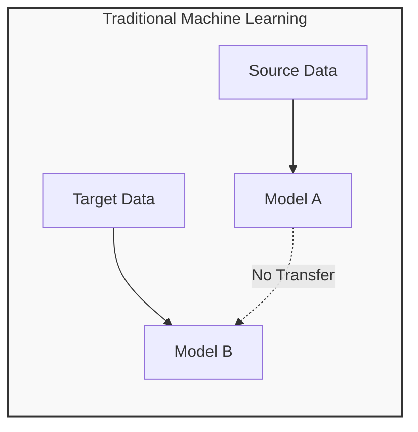
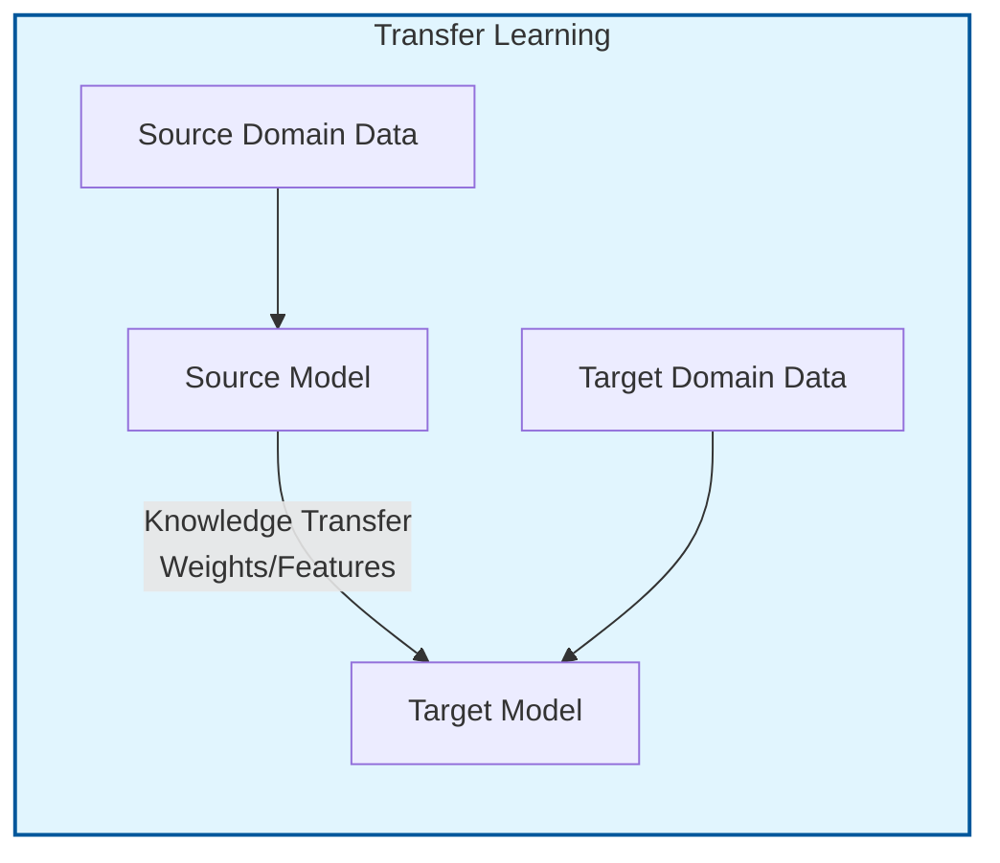
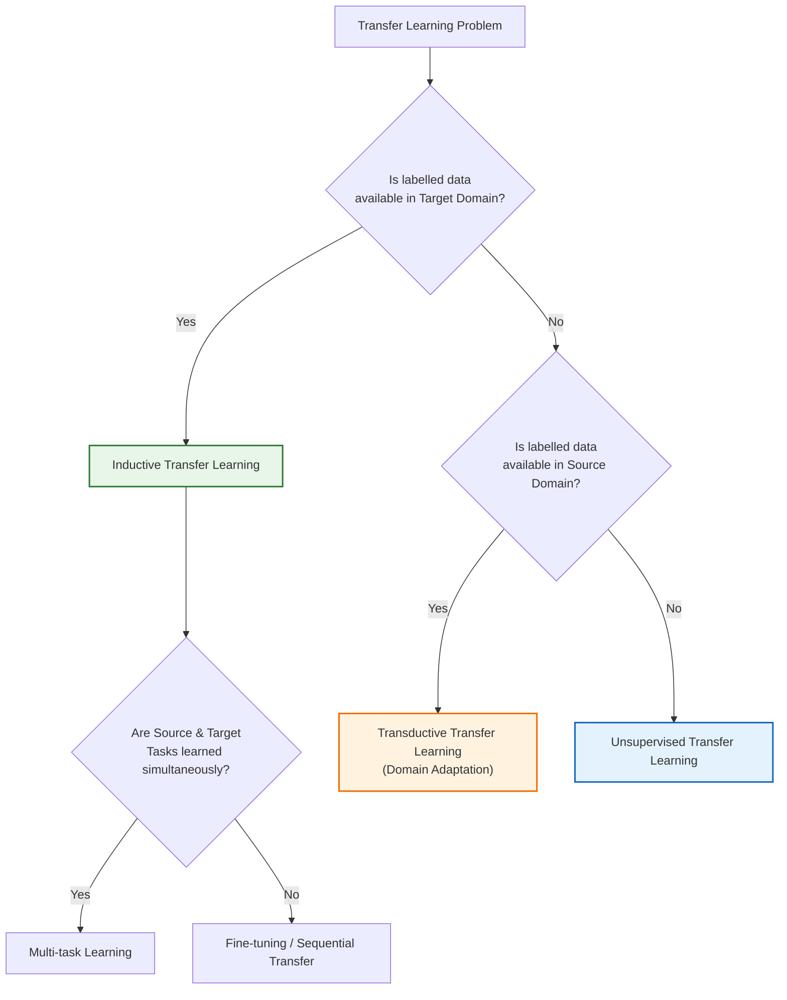
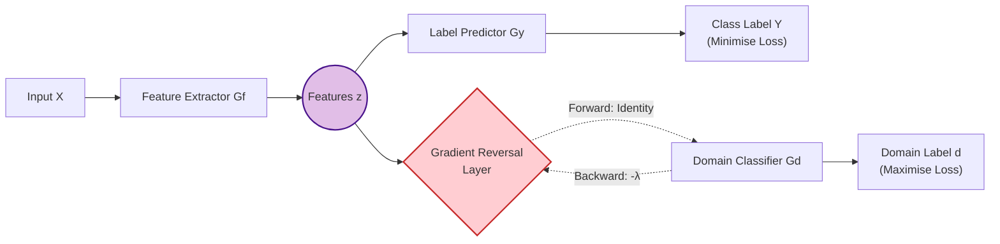
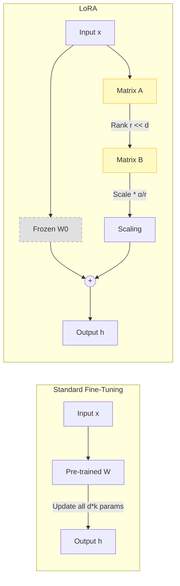

- [1 - Introduction: The Divergence from Traditional Statistical Learning](#1---introduction-the-divergence-from-traditional-statistical-learning)
- [2 - Mathematical Formalism and Core Theory](#2---mathematical-formalism-and-core-theory)
	- [2.1 - The Definition of a Domain](#21---the-definition-of-a-domain)
	- [2.2 - The Definition of a Task](#22---the-definition-of-a-task)
	- [2.3 - The Unified Definition of Transfer Learning](#23---the-unified-definition-of-transfer-learning)
	- [2.4 - Systems Theory Perspective](#24---systems-theory-perspective)
- [3 - Taxonomy and Categorisation of Approaches](#3---taxonomy-and-categorisation-of-approaches)
	- [3.1 - Inductive Transfer Learning](#31---inductive-transfer-learning)
	- [3.2 - Transductive Transfer Learning](#32---transductive-transfer-learning)
	- [3.3 - Unsupervised Transfer Learning](#33---unsupervised-transfer-learning)
- [4 - Theoretical Mechanisms of Distribution Alignment](#4---theoretical-mechanisms-of-distribution-alignment)
	- [4.1 - Maximum Mean Discrepancy (MMD)](#41---maximum-mean-discrepancy-mmd)
	- [4.2 - $\\mathcal{H}$-Divergence and Generalisation Bounds](#42---mathcalh-divergence-and-generalisation-bounds)
- [5 - Algorithmic Approaches: From Instance Reweighting to Deep Representations](#5---algorithmic-approaches-from-instance-reweighting-to-deep-representations)
	- [5.1 - Instance-Based Transfer: TrAdaBoost](#51---instance-based-transfer-tradaboost)
	- [5.2 - Feature-Based Transfer: Correlation Alignment (CORAL)](#52---feature-based-transfer-correlation-alignment-coral)
	- [5.3 - Adversarial Transfer Learning: Domain Adversarial Neural Networks (DANN)](#53---adversarial-transfer-learning-domain-adversarial-neural-networks-dann)
- [6 - Modern Parameter-Based Transfer: The PEFT Revolution](#6---modern-parameter-based-transfer-the-peft-revolution)
	- [6.1 - Adapters](#61---adapters)
	- [6.2 - Low-Rank Adaptation (LoRA)](#62---low-rank-adaptation-lora)
	- [6.3 - Prompt Tuning (Soft Prompts)](#63---prompt-tuning-soft-prompts)
	- [6.4 - BitFit](#64---bitfit)
- [7 - Transferability Estimation: Predicting Success Before Training](#7---transferability-estimation-predicting-success-before-training)
	- [7.1 - Log Expected Empirical Prediction (LEEP)](#71---log-expected-empirical-prediction-leep)
	- [7.2 - H-Score](#72---h-score)
	- [7.3 - Negative Conditional Entropy (NCE)](#73---negative-conditional-entropy-nce)
- [8 - Comparison with Related Paradigms: Multi-Task Learning (MTL)](#8---comparison-with-related-paradigms-multi-task-learning-mtl)
- [9 - Failure Modes and Challenges](#9---failure-modes-and-challenges)
	- [9.1 - Negative Transfer](#91---negative-transfer)
	- [9.2 - Catastrophic Forgetting](#92---catastrophic-forgetting)
- [10 - Example Calculation: Backpropagation in Transfer Learning](#10---example-calculation-backpropagation-in-transfer-learning)
- [11 - Conclusion](#11---conclusion)
- [References](#references)

# 1 - Introduction: The Divergence from Traditional Statistical Learning

The advancement of machine learning, particularly in the domain of deep neural networks, has traditionally relied upon a foundational statistical axiom: the assumption that training data and future testing data are independent and identically distributed (i.i.d.). This premise implies that the underlying probability distribution governing the generation of labelled training examples is identical to that of the unseen examples the model will encounter during deployment. Mathematically, if we denote the training distribution as $P_{train}(X, Y)$ and the testing distribution as $P_{test}(X, Y)$, classical supervision assumes $P_{train} = P_{test}$.

However, this assumption frequently disintegrates in practical applications. The collection of large-scale, annotated datasets for every conceivable domain is often computationally prohibitive or financially completely unfeasible. We frequently encounter scenarios where labelled data is abundant in a specific domain (the source) but scarce in a related, yet distinct, domain of interest (the target). For example, in biomedical imaging, annotating thousands of MRI scans for a specific rare pathology is often impossible, whereas millions of natural images or common medical scans are readily available.

Transfer Learning (TL) emerges as the methodological framework designed to address this discrepancy. It relaxes the i.i.d. assumption, permitting the training and testing distributions to differ ($P_{train} \neq P_{test}$). The fundamental objective is to extract knowledge (manifested as feature representations, weights or distribution parameters) from a source domain and repurpose it to facilitate the learning of a target task. This process mirrors human cognitive development; a physicist does not relearn calculus from first principles when transitioning to quantum mechanics but rather transfers the foundational mathematical structures acquired previously.

The following diagram illustrates the fundamental data flow in Transfer Learning compared to Traditional Machine Learning:

**Traditional Machine Learning**

**Transfer Learning**

This report provides an exhaustive technical examination of Transfer Learning. We will dismantle the field into its constituent mathematical components, analysing the probabilistic definitions of domains and tasks, the statistical measures of distribution divergence, and the algorithmic architectures (ranging from instance re-weighting to parameter-efficient fine-tuning (PEFT)) that enable knowledge portability.

# 2 - Mathematical Formalism and Core Theory

To rigorously analyse transfer learning, one must first establish a unified set-theoretic and probabilistic framework. We adopt the formal definitions established in the seminal literature to define the atomic units of transfer: the Domain and the Task.

## 2.1 - The Definition of a Domain

A domain, denoted as $\mathcal{D}$, is mathematically defined by two primary components:

  * **A Feature Space $\mathcal{X}$:** This represents the space of all possible input vectors. For instance, in an image classification task, this might be the space of pixel intensities $\mathbb{R}^{H \times W \times C}$.
  * **A Marginal Probability Distribution $P(X)$:** This defines the probability of observing a specific instance $X = \{x_1, \dots, x_n\} \in \mathcal{X}$.

Thus, we define a domain as the tuple:

$$\mathcal{D} = \{ \mathcal{X}, P(X) \}$$

Two domains, a source $\mathcal{D}_S$ and a target $\mathcal{D}_T$, are said to be distinct if either their feature spaces differ ($\mathcal{X}_S \neq \mathcal{X}_T$) or their marginal probability distributions differ ($P(X_S) \neq P(X_T)$).

  * **Example of $\mathcal{X}_S \neq \mathcal{X}_T$:** Cross-lingual document classification, where the source vocabulary is in English and the target in French.
  * **Example of $P(X_S) \neq P(X_T)$:** Domain adaptation in visual recognition, where source images are photographs (high resolution, complex background) and target images are sketches (sparse, monochromatic), yet both represent the same object categories.

## 2.2 - The Definition of a Task

Given a specific domain $\mathcal{D}$, a task $\mathcal{T}$ is defined by two components:

  * **A Label Space $\mathcal{Y}$:** The set of all possible output labels (e.g., $\{0, 1\}$ for binary classification).
  * **A Predictive Function $f(\cdot)$:** An objective function that maps inputs to outputs. From a probabilistic perspective, this is often conceptualised as the conditional probability distribution $P(Y|X)$, which is learned from the training data pairs $\{x_i, y_i\}$.

Thus, a task is denoted as:

$$\mathcal{T} = \{ \mathcal{Y}, P(Y|X) \}$$

Two tasks are distinct if their label spaces differ ($\mathcal{Y}_S \neq \mathcal{Y}_T$) or if the conditional probability distributions governing the mapping differ ($P(Y_S|X_S) \neq P(Y_T|X_T)$). The latter scenario, where the conditional distributions diverge, typically implies that the semantic meaning of the features has shifted between domains (e.g., the visual features that define a "sedan" in 1950s car datasets might differ from those in 2020s datasets).

## 2.3 - The Unified Definition of Transfer Learning

Given a source domain $\mathcal{D}_S$ and learning task $\mathcal{T}_S$, and a target domain $\mathcal{D}_T$ and learning task $\mathcal{T}_T$, transfer learning aims to improve the learning of the target predictive function $f_T(\cdot)$ in $\mathcal{D}_T$ using the knowledge in $\mathcal{D}_S$ and $\mathcal{T}_S$, where $\mathcal{D}_S \neq \mathcal{D}_T$ or $\mathcal{T}_S \neq \mathcal{T}_T$.

This inequality ($\mathcal{D}_S \neq \mathcal{D}_T$ or $\mathcal{T}_S \neq \mathcal{T}_T$) gives rise to four distinct scenarios of divergence that algorithms must address:

**Table 1: Typology of Divergence in Transfer Learning**

| Divergence Type            | Mathematical Condition                                | Real-world Analogy                                                           |
| :------------------------- | :---------------------------------------------------- | :--------------------------------------------------------------------------- |
| **Homogeneous Transfer**   | $\mathcal{X}_S = \mathcal{X}_T$, $P(X_S) \neq P(X_T)$ | Training on day-time driving videos, testing on night-time driving videos.   |
| **Heterogeneous Transfer** | $\mathcal{X}_S \neq \mathcal{X}_T$                    | Training on text descriptions, testing on image data (Cross-modal).          |
| **Label Shift**            | $\mathcal{Y}_S \neq \mathcal{Y}_T$                    | Source trains on 1000 object classes; Target classifies only "Dog" vs "Cat". |
| **Concept Drift**          | $P(Y_SX_S) \neq P(Y_T)$                               | Semantic shift in features over time.                                        |

## 2.4 - Systems Theory Perspective

Beyond the probabilistic definition, some theoretical frameworks utilise Mesarovician systems theory to define transfer learning as a relation on sets. Here, domains and tasks are viewed as systems of inputs and outputs, and transfer learning is characterised as a mapping between these systems. This abstraction allows for the modelling of transfer not just as parameter adaptation, but as a structural morphism between the source and target sample spaces. This highlights that transfer is not merely about data statistics, but about the preservation of structural relationships (e.g., the causal link between a feature and a label) across environments.

# 3 - Taxonomy and Categorisation of Approaches

The literature generally categorises transfer learning based on the availability of labelled data in the source and target domains. This taxonomy dictates the algorithmic strategy employed. The decision process for categorisation is visualised below:

## 3.1 - Inductive Transfer Learning

In the inductive setting, the target task is different from the source task ($\mathcal{T}_S \neq \mathcal{T}_T$), and crucially, labelled data is available in the target domain.

  * **Scenario:** We have a pre-trained model on ImageNet (Source Task: 1000-class classification) and wish to build a classifier for identifying specific skin lesions (Target Task: Binary classification). We have a small dataset of labelled skin lesions.
  * **Mechanism:** The model typically learns a general representation on the source task. This representation introduces an inductive bias that restricts the hypothesis space for the target task, allowing the model to converge to a better solution than if it were trained from scratch on the limited target data.
  * **Sub-approach (Multi-task Learning):** This is a specific case of inductive transfer where the source and target tasks are learned simultaneously to force the model to find a representation that satisfies both.

## 3.2 - Transductive Transfer Learning

In the transductive setting, the source and target tasks are identical ($\mathcal{T}_S = \mathcal{T}_T$), but the domains are different ($\mathcal{D}_S \neq \mathcal{D}_T$). Importantly, labelled data is available only in the source domain, while the target domain is unlabelled.

  * **Scenario:** Sentiment analysis where the model is trained on labelled movie reviews (Source) but must predict sentiment for book reviews (Target), where we only have raw text but no ratings.
  * **Mechanism:** This is frequently referred to as Domain Adaptation. The primary challenge here is to correct the marginal distribution mismatch $P(X_S) \neq P(X_T)$ (covariate shift) without target labels to guide the conditional mapping.

## 3.3 - Unsupervised Transfer Learning

In this setting, labelled data is unavailable in both the source and target domains. The objective is typically unsupervised tasks such as clustering or dimensionality reduction.

  * **Scenario:** Transferring the cluster structure learned from one language's vocabulary to another language to aid in dictionary induction.

# 4 - Theoretical Mechanisms of Distribution Alignment

The central mathematical challenge in transfer learning, particularly in transductive settings (Domain Adaptation), is quantifying and minimising the discrepancy between the source distribution $P(X_S)$ and the target distribution $P(X_T)$. Several statistical divergences and bounds govern this process.

## 4.1 - Maximum Mean Discrepancy (MMD)

Maximum Mean Discrepancy (MMD) is a non-parametric metric used to measure the distance between two probability distributions $P$ and $Q$ by mapping them into a Reproducing Kernel Hilbert Space (RKHS), denoted as $\mathcal{H}$.

The core intuition is that two distributions are identical if and only if all their statistical moments are identical. By mapping data to an infinite-dimensional RKHS using a characteristic kernel (like the Gaussian RBF), we can compare all moments simultaneously by comparing the "mean embeddings" of the distributions.

Let $\phi: \mathcal{X} \to \mathcal{H}$ be the feature map associated with a kernel $k(x, x') = \langle \phi(x), \phi(x') \rangle_\mathcal{H}$. The mean embedding of distribution $P$ is $\mu_P = \mathbb{E}_{X \sim P}[\phi(X)]$. The squared MMD distance is defined as the distance between the mean embeddings in the Hilbert space:

$$\text{MMD}^2(P, Q) = \| \mu_P - \mu_Q \|_{\mathcal{H}}^2$$

Expanding the squared norm using the inner product properties yields a formula that can be computed empirically using kernels:

$$\text{MMD}^2(P, Q) = \langle \mu_P - \mu_Q, \mu_P - \mu_Q \rangle_{\mathcal{H}}$$
$$= \langle \mu_P, \mu_P \rangle - 2\langle \mu_P, \mu_Q \rangle + \langle \mu_Q, \mu_Q \rangle$$

Substituting the expectations:

$$\text{MMD}^2(P, Q) = \mathbb{E}_{X,X' \sim P}[k(X,X')] - 2\mathbb{E}_{X \sim P, Y \sim Q} + \mathbb{E}_{Y,Y' \sim Q}$$

**Empirical Estimation:** Given source samples $X_S$ of size $n$ and target samples $X_T$ of size $m$, the empirical estimate is:

$$\widehat{\text{MMD}}^2(X_S, X_T) = \frac{1}{n^2}\sum_{i=1}^n\sum_{j=1}^n k(x_{si}, x_{sj}) - \frac{2}{nm}\sum_{i=1}^n\sum_{j=1}^m k(x_{si}, x_{tj}) + \frac{1}{m^2}\sum_{i=1}^m\sum_{j=1}^m k(x_{ti}, x_{tj})$$

**Significance:** Minimising the MMD constitutes a fundamental strategy in transfer learning algorithms (e.g., Kernel Mean Matching or Deep Domain Adaptation networks). By forcing the network to output features where $\text{MMD}(P(Z_S), P(Z_T)) \approx 0$, we essentially force the source and target data to look statistically indistinguishable in the latent feature space, thereby enabling a classifier trained on source data to generalise to target data.

## 4.2 - $\mathcal{H}$-Divergence and Generalisation Bounds

While MMD handles marginal distributions, we need a theoretical guarantee that aligning distributions actually leads to low error on the target task. This is provided by the generalisation theory proposed by Ben-David et al.

The theory bounds the target error based on the source error and the "distance" between the domains. However, standard distances (like L1 or KL divergence) are too stringent; they can be large even if the domains are easily adaptable. Therefore, the $\mathcal{H}$-divergence is introduced.

For a hypothesis space $\mathcal{H}$ of binary classifiers (discriminators), the $\mathcal{H}$-divergence between source $\mathcal{D}_S$ and target $\mathcal{D}_T$ is:

$$d_{\mathcal{H}}(\mathcal{D}_S, \mathcal{D}_T) = 2 \sup_{h \in \mathcal{H}} | P_{x \sim \mathcal{D}_S}[h(x)=1] - P_{x \sim \mathcal{D}_T}[h(x)=1] |$$

Intuitively, this measures how well the best possible discriminator in $\mathcal{H}$ can distinguish source samples from target samples.

**The Generalisation Bound:**

Let $\epsilon_S(h)$ be the error of hypothesis $h$ on the source domain and $\epsilon_T(h)$ be the error on the target. Then, with high probability:

$$\epsilon_T(h) \leq \epsilon_S(h) + \frac{1}{2} d_{\mathcal{H}\Delta\mathcal{H}}(\mathcal{D}_S, \mathcal{D}_T) + \lambda$$

Here:

  * $\epsilon_S(h)$: The error on the source task (which we minimise during training).
  * $d_{\mathcal{H}\Delta\mathcal{H}}$: The divergence between domains. Minimising this requires finding a feature representation where the domains are indistinguishable.
  * $\lambda$: The error of the ideal joint hypothesis, defined as $\lambda = \min_{h \in \mathcal{H}} (\epsilon_S(h) + \epsilon_T(h))$. This term represents the adaptability of the task. If there exists no single classifier that performs well on both domains simultaneously (e.g., if the labels are flipped between domains), $\lambda$ will be large, and transfer learning will fail regardless of distribution alignment. This is a fundamental limit known as Negative Transfer.

# 5 - Algorithmic Approaches: From Instance Reweighting to Deep Representations

The implementation of transfer learning has evolved historically from statistical reweighting of samples to complex manipulations of deep neural network parameters.

## 5.1 - Instance-Based Transfer: TrAdaBoost

**Why it was created:** In cases where the source and target marginal distributions differ, simply combining the datasets is suboptimal because "misleading" source examples (those in regions of the feature space with different conditional probabilities) will confuse the classifier. Instance-based methods aim to reweight the source data to prioritise samples that are "closest" to the target distribution.

**Mechanism:** TrAdaBoost (Transfer AdaBoost) is an extension of the AdaBoost algorithm. It iteratively trains a base learner.

  * **Target Data Handling:** If a target sample is misclassified, its weight is increased (standard boosting logic: focus on hard examples).
  * **Source Data Handling:** If a source sample is misclassified, its weight is decreased.
  * **Intuition:** A source sample that is misclassified by a hypothesis that performs reasonably well on the target data is likely a "bad" source sample; it contradicts the target decision boundary. Therefore, we should ignore it to avoid negative transfer.

**Weight Update Equations:**
Let $w_i^t$ be the weight of instance $i$ at iteration $t$.
For target instances ($i \in T$):

$$w_i^{t+1} = w_i^t \cdot \beta_T^{-\epsilon_i^t}$$

(Standard boosting: weight increases if error $\epsilon=1$).
For source instances ($i \in S$):

$$w_i^{t+1} = w_i^t \cdot \beta_S^{\epsilon_i^t}$$

where $\beta_S \in (0, 1]$. If error $\epsilon_i^t = 1$ (misclassified), the weight is multiplied by a small factor, reducing it.

**Advantages:** Model-agnostic; works well for traditional classifiers (SVMs, Trees).
**Disadvantages:** Computationally expensive (iterative retraining); susceptible to negative transfer if the target dataset is too small to form a reliable initial hypothesis.

## 5.2 - Feature-Based Transfer: Correlation Alignment (CORAL)

**Why it was created:** Rather than selecting instances, feature-based methods attempt to find a transformation $\phi(x)$ such that the source and target distributions are aligned in the feature space.

**Deep CORAL:** This method extends this to deep neural networks by aligning the second-order statistics (covariance matrices) of the source and target feature activations. The hypothesis is that aligning correlations aligns the underlying distributions (assuming Gaussian-like distributions).

**Mathematical Formulation:**
Let $C_S$ and $C_T$ be the covariance matrices of the source and target feature batches, respectively. The CORAL loss is defined as the Frobenius norm of their difference:

$$\mathcal{L}_{CORAL} = \frac{1}{4d^2} \| C_S - C_T \|_F^2$$

The total loss function minimized during training is:

$$\mathcal{L} = \mathcal{L}_{Classif}(X_S, Y_S) + \lambda \mathcal{L}_{CORAL}(X_S, X_T)$$

**Derivation of Gradients:**
The gradient of the CORAL loss with respect to the source features $D_S$ (where $D_S$ is the matrix of feature activations) can be derived using matrix calculus.

$$\frac{\partial \mathcal{L}_{CORAL}}{\partial D_S} = \frac{1}{d^2(n_S-1)} (D_S^\top - \frac{1}{n_S}\mathbf{1}\mathbf{1}^\top D_S)^\top (C_S - C_T)$$

(Refer to the detailed derivation involving the chain rule on the Frobenius norm).

**Advantages:** "Frustratingly easy" to implement; computationally efficient compared to adversarial methods.
**Disadvantages:** Only aligns second-order statistics; fails if distributions are non-Gaussian or have complex higher-order moment mismatches.

## 5.3 - Adversarial Transfer Learning: Domain Adversarial Neural Networks (DANN)

**Core Theory:** DANN directly implements the minimisation of the $\mathcal{H}$-divergence (from Section 4.2) using a neural architecture inspired by Generative Adversarial Networks (GANs). It plays a minimax game between a feature extractor and a domain discriminator.

The architectural flow of the DANN, including the critical Gradient Reversal Layer (GRL), is illustrated below:

**Components:**

  * Feature Extractor ($G_f(\cdot; \theta_f)$): Maps input $x$ to a latent vector $z$.
  * Label Predictor ($G_y(\cdot; \theta_y)$): Maps $z$ to class labels $y$ (trained on source only).
  * Domain Classifier ($G_d(\cdot; \theta_d)$): Maps $z$ to domain labels $d \in \{0, 1\}$ (0 for source, 1 for target).

**The Minimax Game:**
The goal is to learn parameters $\theta_f$ that minimise the label prediction loss $\mathcal{L}_y$ (ensure features are discriminative) while maximising the domain classification loss $\mathcal{L}_d$ (ensure features are domain-invariant/confusing).

$$E(\theta_f, \theta_y, \theta_d) = \mathcal{L}_y(\theta_f, \theta_y) - \lambda \mathcal{L}_d(\theta_f, \theta_d)$$
$$\hat{\theta}_f, \hat{\theta}_y = \arg\min_{\theta_f, \theta_y} E(\theta_f, \theta_y, \hat{\theta}_d)$$
$$\hat{\theta}_d = \arg\max_{\theta_d} E(\hat{\theta}_f, \hat{\theta}_y, \theta_d)$$

**Gradient Reversal Layer (GRL):**
To implement this in a standard backpropagation framework (which minimises loss), DANN introduces a pseudo-layer $R(x)$ defined as:

  * Forward pass: $R(x) = x$ (Identity)
  * Backward pass: $\frac{d R}{d x} = -\lambda \mathbf{I}$

When gradients flow back from the Domain Classifier loss $\mathcal{L}_d$, they pass through the GRL. The sign is flipped. Thus, while the domain classifier updates its weights to minimise classification error (gradient descent), the feature extractor receives the negative gradient, effectively performing gradient ascent on the domain classification error.

**Advantages:** theoretically grounded in $\mathcal{H}$-divergence; state-of-the-art for unsupervised domain adaptation.
**Disadvantages:** Difficult to train (instability similar to GANs); can lead to "mode collapse" where features lose semantic meaning if $\lambda$ is too high.

# 6 - Modern Parameter-Based Transfer: The PEFT Revolution

With the advent of Large Language Models (LLMs) like GPT and Transformers, the paradigm of "full fine-tuning" (updating all $10^9+$ parameters) became computationally intractable. This necessitated Parameter-Efficient Fine-Tuning (PEFT), which modifies the architecture to enable transfer learning by updating only a tiny fraction of parameters.

## 6.1 - Adapters

**Concept:** Instead of updating the entire pre-trained network, "Adapter" modules are inserted between the frozen layers of the Transformer.

**Architecture:** A standard adapter consists of a bottleneck architecture:

  * Down-projection: $W_{down} \in \mathbb{R}^{d \times r}$, where $d$ is the model dimension and $r \ll d$ (bottleneck dimension).
  * Non-linearity: $\sigma(\cdot)$ (e.g., ReLU).
  * Up-projection: $W_{up} \in \mathbb{R}^{r \times d}$.
  * Residual Connection: $h' = h + W_{up}(\sigma(W_{down}(h)))$.

Only parameters in $W_{down}$ and $W_{up}$ are updated. If $d=1024$ and $r=64$, the parameter count reduction is massive.

**Variants:**

  * **Series Adapters:** Inserted after the feed-forward sub-layers (Houlsby architecture).
  * **Parallel Adapters:** Computed in parallel with the attention or feed-forward layers and summed.

## 6.2 - Low-Rank Adaptation (LoRA)

**Why it was created:** Adapters introduce inference latency (extra layers). LoRA avoids this by reparameterising the weight updates themselves.

**Core Theory (Intrinsic Rank):** The hypothesis is that the weight update matrix $\Delta W$ for a specific downstream task has a low "intrinsic rank." We do not need to optimise the full rank matrix. The difference between standard fine-tuning and LoRA is visualized below:

**Mathematical Formulation:**
For a pre-trained weight matrix $W_0 \in \mathbb{R}^{d \times k}$, the update is constrained by a low-rank decomposition:

$$W = W_0 + \Delta W = W_0 + BA$$

where $B \in \mathbb{R}^{d \times r}$, $A \in \mathbb{R}^{r \times k}$, and rank $r \ll \min(d, k)$.

**Training:** $W_0$ is frozen. Only $A$ and $B$ are trained.
**Initialization:**

  * $A$ is initialized with random Gaussian noise.
  * $B$ is initialized to zeros.

Result: $\Delta W = BA = 0$ at the start, preserving the pre-trained behaviour exactly.

**Scaling:** The update is scaled by $\frac{\alpha}{r}$, where $\alpha$ is a constant hyperparameter.

$$h = W_0 x + \frac{\alpha}{r} BA x$$

**Inference Advantage:** Since $BA$ has the same shape as $W_0$, we can pre-compute $W' = W_0 + BA$ and replace the original weights. This results in zero added inference latency compared to the base model.

**Table 2: Mock Example of Parameter Reduction with LoRA**

| Component                | Dimensions                             | Parameter Count Formula   | Count (d=4096,k=4096)      |
| :----------------------- | :------------------------------------- | :------------------------ | :------------------------- |
| **Standard Fine-Tuning** | $4096 \times 4096$                     | $d \times k$              | 16,777,216                 |
| **LoRA (Rank $r=8$)**    | $A: 8 \times 4096$, $B: 4096 \times 8$ | $r \times k + d \times r$ | $32,768 + 32,768 = 65,536$ |
| **Reduction Factor**     |                                        |                           | \~99.6% Reduction          |

## 6.3 - Prompt Tuning (Soft Prompts)

**Concept:** This method draws inspiration from "Prompt Engineering" (crafting text prompts like "Translate this to French:") but makes the prompt learnable.

**Mechanism:** Instead of discrete text tokens, we prepend a sequence of continuous vectors $P = \{p_1, \dots, p_l\}$ to the input embedding sequence $E$.

$$\text{Input} = [P; E(x)]$$

The model parameters are frozen. During backpropagation, gradients flow only to update the vectors in $P$.

**Formulation:**

$$\theta_{prompt}^* = \arg\min_{P} \mathcal{L}( \text{Model}_{frozen}([P; E(x)]), Y )$$

This effectively learns a "soft" instruction that steers the frozen model's manifold to the target task. It is highly parameter efficient (often \<0.01% of parameters).

## 6.4 - BitFit

**Concept:** BitFit represents the extreme of parameter efficiency. It freezes all weights in the Transformer (attention weights, MLP weights) and trains only the bias terms (and sometimes the LayerNorm parameters).

**Mathematical Insight:** The fact that BitFit works (often achieving \>95% of full fine-tuning performance) suggests that the features learned during pre-training are sufficient, and the transfer task merely requires shifting the activation thresholds (biases) to realign the decision boundaries.

# 7 - Transferability Estimation: Predicting Success Before Training

A critical question in modern ML ops is: Given a target task and a zoo of 100 pre-trained models, which one will transfer best? Training all of them is too expensive. We use analytical metrics to predict transferability.

## 7.1 - Log Expected Empirical Prediction (LEEP)

LEEP estimates transferability using a single forward pass of the target data through the source model (without any training).
It leverages the "dummy label distribution." If the source model (trained on ImageNet) predicts "Dog" for a target image (from a CIFAR dataset labelled "Truck"), this implies a probabilistic relationship between the source label "Dog" and target label "Truck".

**Formulation:**
Compute the joint empirical distribution $\hat{P}(y, z)$ between target labels $y$ and source predictions $z$:

$$\hat{P}(y, z) = \frac{1}{N} \sum_{i=1}^N \mathbb{I}(y_i=y) \cdot \theta(x_i)_z$$

Compute the conditional distribution $\hat{P}(y|z) = \hat{P}(y, z) / \hat{P}(z)$.
The LEEP score is the log-likelihood of the target labels under this empirical predictor:

$$\text{LEEP} = \frac{1}{N} \sum_{i=1}^N \log \left( \sum_{z \in \mathcal{Z}} \hat{P}(y_i|z) \theta(x_i)_z \right)$$

A higher LEEP score implies that the source representations are easier to map to the target labels.

## 7.2 - H-Score

The H-score measures the discriminative power of the features. It uses the trace of the covariance of class means relative to the total feature covariance.

$$H(f) = \text{tr}(\text{cov}(f(X))^{-1} \text{cov}(\mathbb{E}))$$

  * Numerator: $\text{cov}(\mathbb{E})$ measures Inter-Class Variance (we want this high).
  * Denominator: $\text{cov}(f(X))$ measures Total Feature Variance (redundancy).

By maximising this ratio, H-score identifies models where the features for different classes are well-separated.

## 7.3 - Negative Conditional Entropy (NCE)

NCE measures the uncertainty of the target label given the source prediction.

$$\text{NCE} = - H(Y | Z_{source})$$

If the source model consistently predicts "Label A" whenever the target is "Label B", the conditional entropy is low (high NCE), indicating good transferability, even if the labels don't match semantically.

# 8 - Comparison with Related Paradigms: Multi-Task Learning (MTL)

Transfer Learning is often confused with Multi-Task Learning. While both leverage shared representations, their optimisation objectives and data flows differ fundamentally.

**Table 3: Transfer Learning vs. Multi-Task Learning**

| Feature           | Transfer Learning (TL)                                                                              | Multi-Task Learning (MTL)                                                  |
| :---------------- | :-------------------------------------------------------------------------------------------------- | :------------------------------------------------------------------------- |
| **Objective**     | Optimise performance on Target Task ($\mathcal{T}_T$). Source performance is irrelevant.            | Optimise performance on All Tasks simultaneously.                          |
| **Data Flow**     | Sequential: Source $\to$ Target.                                                                    | Parallel: Task A $\leftrightarrow$ Task B.                                 |
| **Loss Function** | $\theta^* = \text{argmin}_\theta \mathcal{L}_{Target}(\theta)$ (Initialised with $\theta_{Source}$) | $\theta^* = \text{argmin}_\theta \sum_{i=1}^T w_i \mathcal{L}_{i}(\theta)$ |
| **Optimization**  | Gradient Descent on Target Loss.                                                                    | Pareto Optimization (finding a trade-off front).                           |
| **Primary Risk**  | Catastrophic Forgetting of Source.                                                                  | Negative Transfer (Task interference).                                     |

In MTL, the "Pareto Optimal" solution is sought where improving one task does not degrade another. In TL, we explicitly accept the degradation of the source task (Catastrophic Forgetting) to maximise target performance.

# 9 - Failure Modes and Challenges

## 9.1 - Negative Transfer

Negative transfer occurs when using source knowledge actually hurts target performance compared to training from scratch.

**Mathematical Cause:** Referring back to the Ben-David bound (Section 4.2), this happens when the $\lambda$ term (error of the ideal joint hypothesis) is large. If the source and target tasks label similar features in contradictory ways (e.g., "Red" = "Stop" in source, but "Red" = "Go" in target), aligning the domains ($d_{\mathcal{H}\Delta\mathcal{H}} \to 0$) will enforce the wrong decision boundary.

**Mitigation:** Safe Transfer Learning algorithms estimate task similarity before transfer. Approaches like Residual Feature Integration add a "correction" term to the source features to handle mismatches.

## 9.2 - Catastrophic Forgetting

This is the inverse problem: in sequential transfer, the model forgets the source task.

**Mathematical Definition:** A drastic increase in $\mathcal{L}_{Source}(\theta_t)$ as training on $\mathcal{L}_{Target}$ proceeds.

**Mitigation (EWC):** Elastic Weight Consolidation adds a regularisation term based on the Fisher Information Matrix $F$. $F_i$ approximates the curvature of the source loss surface with respect to parameter $\theta_i$.

$$\mathcal{L}(\theta) = \mathcal{L}_{Target}(\theta) + \sum_i \frac{\lambda}{2} F_i (\theta_i - \theta_{S,i}^*)^2$$

If $F_i$ is high (parameter was critical for source task), changing it incurs a high penalty. If $F_i$ is low (parameter was unimportant), it can be freely adapted to the target task.

# 10 - Example Calculation: Backpropagation in Transfer Learning

To visualise the mechanics, consider a simple 2-layer perceptron being fine-tuned.

**Setup:**

  * Source Model weights: $W_1$ (Input $\to$ Hidden), $W_2$ (Hidden $\to$ Output).
  * Transfer Strategy: Freeze $W_1$, fine-tune $W_2$.
  * Input $x$, Target $y$, Activation $\sigma$ (Sigmoid).

**Forward Pass:**

$$h = \sigma(W_1 x)$$
$$\hat{y} = \sigma(W_2 h)$$

**Loss (MSE):** $L = \frac{1}{2}(y - \hat{y})^2$

**Backward Pass (Fine-Tuning $W_2$):**

$$\frac{\partial L}{\partial W_2} = \frac{\partial L}{\partial \hat{y}} \cdot \frac{\partial \hat{y}}{\partial W_2}$$
$$= -(y - \hat{y}) \cdot \sigma'(W_2 h) \cdot h^\top$$

New weight: $W_2 \leftarrow W_2 - \eta \frac{\partial L}{\partial W_2}$

**Backward Pass (Frozen $W_1$):**
Since $W_1$ is frozen, we effectively set the learning rate for this layer to 0, or equivalently, we stop the gradient flow at $h$.

$$\frac{\partial L}{\partial W_1} = 0 \quad (\text{Computed but ignored, or not computed})$$

This simple blocking of gradient flow preserves the feature extraction capability of $W_1$ (learned from source) while adapting the classification boundary $W_2$ to the target.

# 11 - Conclusion

Transfer Learning represents a pivotal shift in Artificial Intelligence, enabling systems to generalise beyond their immediate training distributions. By rigorously defining domains and tasks, we have seen that transfer is essentially an optimisation problem constrained by distribution divergence.

From the early instance-weighting algorithms like TrAdaBoost to the sophisticated adversarial alignment of DANN, the field has consistently strived to minimise the statistical distance between domains. In the modern era, PEFT techniques like LoRA and Adapters have redefined the landscape, proving that efficient transfer is possible by manipulating the intrinsic low-rank structures of massive neural networks.

However, theoretical limits remain. The risk of Negative Transfer reminds us that not all knowledge is portable, and Catastrophic Forgetting highlights the plasticity-stability dilemma inherent in all learning systems. Future research, particularly in Test-Time Adaptation and Safe Transfer, will focus on making these systems more robust to the unpredictable shifts of the real world.

# References

Pan, S. J., & Yang, Q. (2010). [A survey on transfer learning](https://doi.org/10.1109/TKDE.2009.191). *IEEE Transactions on Knowledge and Data Engineering, 22*(10), 1345–1359. ([ACM Digital Library][1])

Weiss, K., Khoshgoftaar, T. M., & Wang, D. (2016). [A survey of transfer learning](https://doi.org/10.1186/s40537-016-0043-6). *Journal of Big Data, 3*(1), 9. ([SpringerLink][2])

Day, O., & Khoshgoftaar, T. M. (2017). [A survey on heterogeneous transfer learning](https://doi.org/10.1186/s40537-017-0089-0). *Journal of Big Data, 4*(1), 29. ([SpringerLink][3])

Cook, D. J., Feuz, K. D., & Krishnan, N. C. (2013). [Transfer learning for activity recognition: A survey](https://doi.org/10.1007/s10115-013-0665-3). *Knowledge and Information Systems, 36*, 537–556. ([ACM Digital Library][4])

Gretton, A., Borgwardt, K. M., Rasch, M. J., Schölkopf, B., & Smola, A. (2012). [A kernel two-sample test](https://www.jmlr.org/papers/v13/gretton12a.html). *Journal of Machine Learning Research, 13*, 723–773. ([jmlr.csail.mit.edu][5])

Borgwardt, K. M., Gretton, A., Rasch, M. J., Kriegel, H.-P., Schölkopf, B., & Smola, A. J. (2006). [Integrating structured biological data by Kernel Maximum Mean Discrepancy](https://doi.org/10.1093/bioinformatics/btl242). *Bioinformatics, 22*(14), e49–e57. ([OUP Academic][6])

Dai, W., Yang, Q., Xue, G.-R., & Yu, Y. (2007). [Boosting for transfer learning](https://doi.org/10.1145/1273496.1273521). In *Proceedings of the 24th International Conference on Machine Learning (ICML)* (pp. 193–200). ([ACM Digital Library][7])

Ganin, Y., Ustinova, E., Ajakan, H., Germain, P., Larochelle, H., Laviolette, F., Marchand, M., & Lempitsky, V. (2016). [Domain-adversarial training of neural networks](https://jmlr.org/papers/v17/15-239.html). *Journal of Machine Learning Research, 17*(59), 1–35. ([jmlr.org][8])

Ben-David, S., Blitzer, J., Crammer, K., Kulesza, A., Pereira, F., & Vaughan, J. W. (2010). [A theory of learning from different domains](https://doi.org/10.1007/s10994-009-5152-4). *Machine Learning, 79*(1–2), 151–175. ([SpringerLink][9])

Sun, B., & Saenko, K. (2016). [Deep CORAL: Correlation alignment for deep domain adaptation](https://doi.org/10.1007/978-3-319-49409-8_35). In *Computer Vision – ECCV 2016 Workshops* (pp. 443–450). Springer. ([SpringerLink][10])

Hu, E. J., Shen, Y., Wallis, P., Allen-Zhu, Z., Li, Y., Wang, S., Wang, L., & Chen, W. (2022). [LoRA: Low-rank adaptation of large language models](https://arxiv.org/abs/2106.09685). In *International Conference on Learning Representations (ICLR)*. ([arXiv][11])

Houlsby, N., Giurgiu, A., Jastrzebski, S., Morrone, B., de Laroussilhe, Q., Gesmundo, A., Attariyan, M., & Gelly, S. (2019). [Parameter-efficient transfer learning for NLP](https://arxiv.org/abs/1902.00751). In *Proceedings of the 36th International Conference on Machine Learning (ICML)* (pp. 2790–2799). ([arXiv][12])

Lester, B., Al-Rfou, R., & Constant, N. (2021). [The power of scale for parameter-efficient prompt tuning](https://aclanthology.org/2021.emnlp-main.243/). In *Proceedings of the 2021 Conference on Empirical Methods in Natural Language Processing (EMNLP)* (pp. 3045–3059). ([ACL Anthology][13])

Ben Zaken, E., Ravfogel, S., & Goldberg, Y. (2022). [BitFit: Simple parameter-efficient fine-tuning for transformer-based masked language models](https://aclanthology.org/2022.acl-short.1/). In *Proceedings of the 60th Annual Meeting of the Association for Computational Linguistics (Volume 2: Short Papers)* (pp. 1–9). ([ACL Anthology][14])

Nguyen, C. V., Hassner, T., Seeger, M., & Archambeau, C. (2020). [LEEP: A new measure to evaluate transferability of learned representations](https://proceedings.mlr.press/v119/nguyen20b.html). In *Proceedings of the 37th International Conference on Machine Learning (ICML)* (pp. 7294–7305). ([Proceedings of Machine Learning Research][15])

Bao, Y., Li, Y., Huang, S.-L., Zhang, L., Zheng, L., Zamir, A. R., & Guibas, L. J. (2019). [An information-theoretic approach to transferability in task transfer learning](https://ieeexplore.ieee.org/document/8803726). In *2019 IEEE International Conference on Image Processing (ICIP)* (pp. 2309–2313). ([yangli-feasibility.com][16])

Kirkpatrick, J., Pascanu, R., Rabinowitz, N., Veness, J., Desjardins, G., Rusu, A. A., Milan, K., Quan, J., Ramalho, T., Grabska-Barwinska, A., Hassabis, D., Clopath, C., Kumaran, D., & Hadsell, R. (2017). [Overcoming catastrophic forgetting in neural networks](https://doi.org/10.1073/pnas.1611835114). *Proceedings of the National Academy of Sciences, 114*(13), 3521–3526. ([PNAS][17])

[1]: https://dl.acm.org/doi/abs/10.1109/TKDE.2009.191?utm_source=chatgpt.com "A Survey on Transfer Learning"
[2]: https://journalofbigdata.springeropen.com/articles/10.1186/s40537-016-0043-6?utm_source=chatgpt.com "A survey of transfer learning - Journal of Big Data"
[3]: https://link.springer.com/article/10.1186/s40537-017-0089-0?utm_source=chatgpt.com "A survey on heterogeneous transfer learning"
[4]: https://dl.acm.org/doi/abs/10.1007/s10115-013-0665-3?utm_source=chatgpt.com "Transfer learning for activity recognition: a survey"
[5]: https://jmlr.csail.mit.edu/papers/v13/gretton12a.html?utm_source=chatgpt.com "A Kernel Two-Sample Test"
[6]: https://academic.oup.com/bioinformatics/article/22/14/e49/228383?utm_source=chatgpt.com "Integrating structured biological data by Kernel Maximum ..."
[7]: https://dl.acm.org/doi/10.1145/1273496.1273521?utm_source=chatgpt.com "Boosting for transfer learning | Proceedings of the 24th ..."
[8]: https://jmlr.org/papers/v17/15-239.html?utm_source=chatgpt.com "Domain-Adversarial Training of Neural Networks"
[9]: https://link.springer.com/article/10.1007/s10994-009-5152-4?utm_source=chatgpt.com "A theory of learning from different domains"
[10]: https://link.springer.com/chapter/10.1007/978-3-319-49409-8_35?utm_source=chatgpt.com "Correlation Alignment for Deep Domain Adaptation"
[11]: https://arxiv.org/abs/2106.09685?utm_source=chatgpt.com "LoRA: Low-Rank Adaptation of Large Language Models"
[12]: https://arxiv.org/abs/1902.00751?utm_source=chatgpt.com "Parameter-Efficient Transfer Learning for NLP"
[13]: https://aclanthology.org/2021.emnlp-main.243/?utm_source=chatgpt.com "The Power of Scale for Parameter-Efficient Prompt Tuning"
[14]: https://aclanthology.org/2022.acl-short.1/?utm_source=chatgpt.com "BitFit: Simple Parameter-efficient Fine-tuning for ..."
[15]: https://proceedings.mlr.press/v119/nguyen20b/nguyen20b.pdf?utm_source=chatgpt.com "LEEP: A New Measure to Evaluate Transferability of Learned ..."
[16]: https://yangli-feasibility.com/home/ttl.html?utm_source=chatgpt.com "Task Transfer Learning - Yang Li"
[17]: https://www.pnas.org/doi/10.1073/pnas.1611835114?utm_source=chatgpt.com "Overcoming catastrophic forgetting in neural networks"