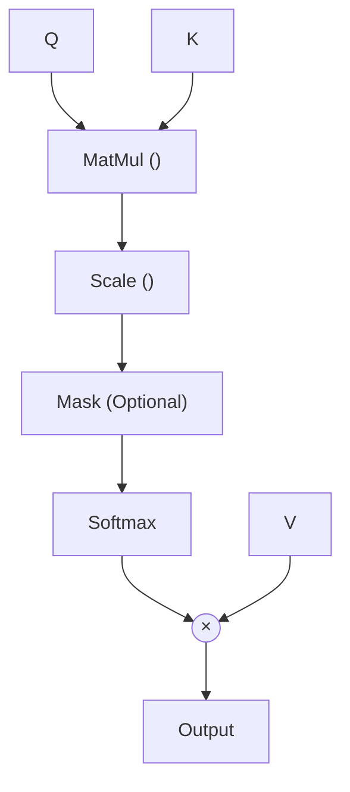

- [1 - Introduction](#1---introduction)
	- [1.1 - The Computational Bottlenecks of Recurrence](#11---the-computational-bottlenecks-of-recurrence)
	- [1.2 - The Vanishing Gradient and Information Transport](#12---the-vanishing-gradient-and-information-transport)
	- [1.3 - The Transformer Solution: $O(1)$ Path Length](#13---the-transformer-solution-o1-path-length)
- [2 - Input Representation and the Geometry of Embedding Spaces](#2---input-representation-and-the-geometry-of-embedding-spaces)
	- [2.1 - Tokenisation and Sub-word Architectures](#21---tokenisation-and-sub-word-architectures)
	- [2.2 - The Necessity of Positional Encodings](#22---the-necessity-of-positional-encodings)
	- [2.3 - Absolute Sinusoidal Positional Encoding (Original Formulation)](#23---absolute-sinusoidal-positional-encoding-original-formulation)
	- [2.4 - Rotary Positional Embedding (RoPE): The Modern Standard](#24---rotary-positional-embedding-rope-the-modern-standard)
	- [2.5 - ALiBi: Attention with Linear Biases](#25---alibi-attention-with-linear-biases)
	- [2.6 - Relative Positional Encoding (T5 Variant)](#26---relative-positional-encoding-t5-variant)
- [3 - The Attention Mechanism: The Mathematical Engine](#3---the-attention-mechanism-the-mathematical-engine)
	- [3.1 - Scaled Dot-Product Attention](#31---scaled-dot-product-attention)
		- [The Dot Product as Similarity](#the-dot-product-as-similarity)
		- [The Necessity of Scaling ($\\sqrt{d\_k}$)](#the-necessity-of-scaling-sqrtd_k)
		- [The Softmax Kernel](#the-softmax-kernel)
	- [3.2 - Multi-Head Attention (MHA)](#32---multi-head-attention-mha)
	- [3.3 - Attention Masking: Controlling Information Flow](#33---attention-masking-controlling-information-flow)
		- [Padding Mask](#padding-mask)
		- [Causal (Look-Ahead) Mask](#causal-look-ahead-mask)
	- [3.4 - Cross-Attention](#34---cross-attention)
	- [3.5 - Computational Complexity and FlashAttention](#35---computational-complexity-and-flashattention)
- [4 - The Feed-Forward Network (FFN) and Nonlinearity](#4---the-feed-forward-network-ffn-and-nonlinearity)
	- [4.1 - Standard Architecture (ReLU)](#41---standard-architecture-relu)
	- [4.2 - Modern Variant: SwiGLU](#42---modern-variant-swiglu)
- [5 - Normalisation: Stabilising Deep Networks](#5---normalisation-stabilising-deep-networks)
	- [5.1 - Layer Normalisation (LayerNorm)](#51---layer-normalisation-layernorm)
	- [5.2 - Pre-Norm vs. Post-Norm Placement](#52---pre-norm-vs-post-norm-placement)
	- [5.3 - Root Mean Square Normalisation (RMSNorm)](#53---root-mean-square-normalisation-rmsnorm)
- [6 - Architectural Paradigms: BERT, GPT, and T5](#6---architectural-paradigms-bert-gpt-and-t5)
	- [6.1 - Encoder-Only (The BERT Family)](#61---encoder-only-the-bert-family)
	- [6.2 - Decoder-Only (The GPT Family)](#62---decoder-only-the-gpt-family)
	- [6.3 - Encoder-Decoder (The T5 Family)](#63---encoder-decoder-the-t5-family)
- [7 - Training Dynamics and Optimization](#7---training-dynamics-and-optimization)
	- [7.1 - Optimisation Algorithms](#71---optimisation-algorithms)
	- [7.2 - Learning Rate Schedules](#72---learning-rate-schedules)
	- [7.3 - Regularisation Techniques](#73---regularisation-techniques)
- [8 - Conclusion](#8---conclusion)
- [References](#references)

# 1 - Introduction

The history of Natural Language Processing (NLP) and sequence transduction is bifurcated by a single moment in 2017: the publication of "Attention Is All You Need" by Vaswani et al..1 Prior to this watershed moment, the domain was hegemonically controlled by Recurrent Neural Networks (RNNs), specifically Long Short-Term Memory (LSTM) and Gated Recurrent Unit (GRU) architectures.3 While these models represented a significant leap over standard feed-forward networks and statistical n-gram models, they suffered from fundamental structural limitations inherent to their sequential design.

## 1.1 - The Computational Bottlenecks of Recurrence

Recurrent models process information sequentially. For a sequence of input vectors $(x_1,..., x_n)$, the hidden state $h_t$ at time step $t$ is a non-linear function of the input $x_t$ and the previous hidden state $h_{t-1}$:

$$h_t = f(h_{t-1}, x_t)$$

This recursive formulation enforces a strict temporal order. The computation for time step $t$ cannot commence until the computation for $t-1$ is complete.1 This sequential dependency precludes parallelisation within training examples. In an era where Graphics Processing Unit (GPU) and Tensor Processing Unit (TPU) architectures were evolving to handle massive parallel workloads, the sequentiality of RNNs became a severe bottleneck. Training on large datasets was prohibitively slow because the hardware could not be fully saturated.

## 1.2 - The Vanishing Gradient and Information Transport

Beyond computational inefficiency, RNNs faced theoretical limitations in information transport. The problem of "long-term dependencies" refers to the difficulty of a model to retain information about an input $x_1$ when processing $x_{1000}$. In an RNN, the gradient signal from the output at step $t$ must propagate backwards through time (Backpropagation Through Time - BPTT) to update weights affecting step 1.

If the recurrent weight matrix $W$ has a spectral radius (largest eigenvalue) less than 1, gradients vanish exponentially as they travel back through the sequence. If the spectral radius is greater than 1, they explode. While LSTMs mitigated this via gating mechanisms (forget gates), the fundamental path length for a signal to travel between position $t_1$ and $t_2$ remained $|t_1 - t_2|$ operations.1 As sequence lengths grew, the ability of the network to model interactions between distant tokens degraded.

## 1.3 - The Transformer Solution: $O(1)$ Path Length

The Transformer architecture proposed a radical solution: dispense with recurrence and convolution entirely. By relying solely on the attention mechanism, the Transformer connects every token to every other token in a single layer operation. The path length between any two positions in the sequence is reduced to $O(1)$ constant time.1 This architecture allows the model to learn relationships between words regardless of their distance in the text, facilitating the capture of complex syntactic structures and long-range semantic dependencies that eluded LSTMs.

> Comparison of information flow. RNNs (left) vs Transformers (right).

This efficiency gain was dramatic. The original Transformer achieved state-of-the-art translation results after training for only 12 hours on 8 GPUs. This was a fraction of the time required by previous RNN-based models.

# 2 - Input Representation and the Geometry of Embedding Spaces

The Transformer views an input sequence not as a stream of time steps, but as a set of vectors processed simultaneously. This "set processing" capability necessitates a robust method for representing discrete tokens as continuous vectors and, crucially, for injecting information about their order.

## 2.1 - Tokenisation and Sub-word Architectures

Before vectorisation, raw text is segmented into discrete units called tokens. Early NLP models used word-level tokenisation, which resulted in massive vocabularies (often exceeding 1 million unique words) and an inability to handle "out-of-vocabulary" (OOV) terms.

Modern Transformers utilise sub-word tokenisation algorithms, primarily Byte-Pair Encoding (BPE) or WordPiece.4

- **Byte-Pair Encoding (BPE):** This algorithm iteratively merges the most frequent pair of adjacent characters (or bytes) in the corpus. It begins with a vocabulary of individual characters and builds up common sub-words (e.g., "ing", "tion", "est"). This ensures that any word can be constructed from the sub-word vocabulary, eliminating OOV tokens while keeping the vocabulary size manageable (typically 30,000 to 100,000 tokens).
- **Embedding Lookup:** Each token ID $i$ corresponds to a row in a learnable embedding matrix $E \in \mathbb{R}^{V \times d_{model}}$, where $V$ is the vocabulary size and $d_{model}$ is the dimensionality of the latent space (e.g., 512, 1024, 4096).

The mathematical implication is that semantic meaning is encoded geometrically. Words with similar meanings (e.g., "king" and "monarch") are mapped to vectors with a high cosine similarity in $\mathbb{R}^{d_{model}}$.

## 2.2 - The Necessity of Positional Encodings

Because the Transformer processes all tokens in parallel via matrix multiplications, the operation is inherently permutation invariant. If one were to shuffle the words in a sentence, the self-attention output (in the absence of positional information) would be identical, merely shuffled in the same way.

$$\text{Attention}(\text{shuffle}(X)) = \text{shuffle}(\text{Attention}(X))$$

To preserve the sequential nature of language (where "dog bites man" differs from "man bites dog"), positional information must be injected explicitly into the embeddings.1

## 2.3 - Absolute Sinusoidal Positional Encoding (Original Formulation)

Vaswani et al. (2017) introduced a functional, non-learnable positional encoding. For a position $pos$ in the sequence and a dimension index $i$ in the embedding vector, the encoding $PE$ is defined as 1:

$$PE_{(pos, 2i)} = \sin\left(\frac{pos}{10000^{\frac{2i}{d_{model}}}}\right)$$

$$PE_{(pos, 2i+1)} = \cos\left(\frac{pos}{10000^{\frac{2i}{d_{model}}}}\right)$$

Mathematical Justification:
The choice of sinusoids is not arbitrary. It facilitates the model's ability to attend to relative positions. Intuitively, these waves act like a fingerprint. High-frequency waves (short wavelengths) distinguish nearby tokens. Low-frequency waves (long wavelengths) track distant positions.

For any fixed offset $k$, the vector $PE_{pos+k}$ can be represented as a linear function of $PE_{pos}$.
Using the rotation addition theorems for sine and cosine:

$$\sin(\omega(pos+k)) = \sin(\omega pos)\cos(\omega k) + \cos(\omega pos)\sin(\omega k)$$

$$\cos(\omega(pos+k)) = \cos(\omega pos)\cos(\omega k) - \sin(\omega pos)\sin(\omega k)$$

This can be expressed as a matrix multiplication:

$$\begin{pmatrix} \sin(\omega(pos+k)) \\ \cos(\omega(pos+k)) \end{pmatrix} = \begin{pmatrix} \cos(\omega k) & \sin(\omega k) \\ -\sin(\omega k) & \cos(\omega k) \end{pmatrix} \begin{pmatrix} \sin(\omega pos) \\ \cos(\omega pos) \end{pmatrix}$$

The matrix depends only on $k$, not on $pos$. This property theoretically allows the model to learn to attend to "the token 5 positions back" regardless of absolute position.6 However, in practice, absolute sinusoidal encodings struggle to generalise to sequence lengths longer than those seen during training.5

## 2.4 - Rotary Positional Embedding (RoPE): The Modern Standard

State-of-the-art models, including LLaMA and PaLM, have largely abandoned additive absolute embeddings in favour of Rotary Positional Embeddings (RoPE).7 RoPE encodes position not by adding a vector, but by rotating the affine-transformed query and key vectors.

> RoPE Rotation

Complex Number Derivation:
Consider the embedding space as a set of complex numbers. Let a 2D slice of the query vector be $q = (q_1, q_2)$. We can represent this as a complex number $z_q = q_1 + iq_2$.
To encode position $m$, we multiply $z_q$ by a complex exponential $e^{im\theta}$:

$$f(q, m) = q \cdot e^{im\theta}$$

In linear algebra terms, this is a rotation. For a vector $x \in \mathbb{R}^d$, RoPE divides the space into $d/2$ subspaces (pairs). For each pair of dimensions $(2i, 2i+1)$, it applies a rotation matrix $R_{\theta, m}^i$:

$$\begin{pmatrix} x'_{2i} \\ x'_{2i+1} \end{pmatrix} = \begin{pmatrix} \cos(m\theta_i) & -\sin(m\theta_i) \\ \sin(m\theta_i) & \cos(m\theta_i) \end{pmatrix} \begin{pmatrix} x_{2i} \\ x_{2i+1} \end{pmatrix}$$

The frequencies $\theta_i$ are usually defined as $\theta_i = 10000^{-2i/d}$.

The Key Property (Relative Attention):
The core innovation of RoPE lies in the dot product between a query at position $m$ and a key at position $n$.

$$\langle R_m q, R_n k \rangle = (R_m q)^T (R_n k) = q^T R_m^T R_n k$$

Since $R$ is an orthogonal rotation matrix, $R_m^T = R_{-m}$. Furthermore, rotations are commutative in 2D: $R_{-m} R_n = R_{n-m}$.

$$\langle R_m q, R_n k \rangle = q^T R_{n-m} k$$

The attention score now depends only on the relative distance $(n-m)$, not on the absolute positions $m$ or $n$. This provides the relative position invariance that absolute additive encodings lacked, while maintaining the computational efficiency of absolute indexing.8

## 2.5 - ALiBi: Attention with Linear Biases

An alternative approach, designed specifically for extreme length extrapolation, is ALiBi.11 Unlike RoPE or Sinusoidal encodings, ALiBi adds no positional information to the embedding layer. Instead, it modifies the attention calculation itself.

A static, non-learned bias is subtracted from the attention score of query $q_i$ and key $k_j$, proportional to their distance:

$$\text{Score}(q_i, k_j) = q_i \cdot k_j - m \cdot |i - j|$$

The scalar $m$ is a slope parameter specific to each attention head. These slopes form a geometric sequence (e.g., $\frac{1}{2^1}, \frac{1}{2^2}, \dots$). This bias imposes a "locality inductive bias," penalising attention to distant tokens. Empirical results show that ALiBi models trained on short sequences (e.g., 1024 tokens) can extrapolate effectively to much longer sequences (e.g., 16k+) during inference, a capability where sinusoidal and even RoPE models often degrade.11

## 2.6 - Relative Positional Encoding (T5 Variant)

The T5 architecture employs a different form of relative encoding. Instead of rotating vectors or adding linear biases, T5 adds a learnable scalar to the attention logit based on the relative distance between query and key.13

$$\text{Attention}(Q, K) = \text{softmax}\left( \frac{QK^T}{\sqrt{d_k}} + B \right)$$

Here, $B_{i,j}$ is a learnable bias derived from a "bucket" function of the distance $i-j$.

$$B_{i,j} = \text{Embed}(\text{Bucket}(i-j))$$

The bucketing function is logarithmic for larger distances. This means the model distinguishes precise relative positions for nearby tokens (e.g., -1 vs -2) but groups distant tokens into broader categories (e.g., "approx. 50-60 tokens away"). This logarithmic scaling aligns with the intuition that precise position matters less as distance increases.14

# 3 - The Attention Mechanism: The Mathematical Engine

The defining component of the Transformer is the Attention Mechanism. In simple terms, it is a differentiable dictionary lookup. The input consists of queries ($Q$), keys ($K$), and values ($V$). The mechanism retrieves values based on the similarity between queries and keys.

## 3.1 - Scaled Dot-Product Attention

The canonical formula for attention is:

$$\text{Attention}(Q, K, V) = \text{softmax}\left(\frac{QK^T}{\sqrt{d_k}}\right)V$$

Where:
$Q \in \mathbb{R}^{L \times d_k}$ (Query Matrix)
$K \in \mathbb{R}^{L \times d_k}$ (Key Matrix)
$V \in \mathbb{R}^{L \times d_v}$ (Value Matrix)
$L$ is the sequence length.
$d_k$ is the dimension of the key/query vectors.

> The Scaled Dot-Product Attention flow.

### The Dot Product as Similarity

The term $QK^T$ computes the dot product between every query vector and every key vector. Geometrically, the dot product $a \cdot b = |a||b|\cos(\theta)$ measures alignment. A large positive dot product implies the vectors point in the same direction (high similarity).

### The Necessity of Scaling ($\sqrt{d_k}$)

The division by $\sqrt{d_k}$ is crucial for gradient stability.
Assume the elements of $q$ and $k$ are independent random variables with mean 0 and variance 1.
The dot product is $q \cdot k = \sum_{i=1}^{d_k} q_i k_i$.
The mean of the product $q_i k_i$ is 0.
The variance of $q_i k_i$ is 1.
Therefore, the variance of the sum (the dot product) is $d_k$.1
As $d_k$ increases (e.g., from 64 to 128), the variance of the dot products grows, leading to larger magnitude values. Large inputs to the softmax function push the function into regions where the gradients are extremely small (the "saturation" zones of the sigmoid/softmax curve).

$$\frac{\partial \text{softmax}(x)}{\partial x} \approx 0 \quad \text{for large } |x|$$

Scaling by $\frac{1}{\sqrt{d_k}}$ rescales the dot product to have unit variance, ensuring gradients flow effectively through the softmax operation.1

### The Softmax Kernel

The softmax function converts the raw similarity scores (logits) into a probability distribution.

$$\text{softmax}(x_i) = \frac{e^{x_i}}{\sum_j e^{x_j}}$$

This ensures the weights for the values sum to 1. It acts as a "soft" switch, allowing the model to focus focus primarily on specific tokens while maintaining differentiability (unlike a "hard" argmax).

## 3.2 - Multi-Head Attention (MHA)

A single attention application is limited. It can only focus on one specific aspect of the context (e.g., syntactic agreement). To capture multiple types of relationships simultaneously, Transformers use Multi-Head Attention.
The model maintains $h$ independent sets of projection matrices $W_i^Q, W_i^K, W_i^V$.

$$\text{head}_i = \text{Attention}(XW_i^Q, XW_i^K, XW_i^V)$$

The outputs of these heads are concatenated and projected back to the model dimension:

$$\text{MultiHead}(Q, K, V) = \text{Concat}(\text{head}_1, \dots, \text{head}_h)W^O$$

Subspace Theory:
Mathematically, this allows the model to attend to information from different "representation subspaces".1 One head might track subject-verb agreement, another might track pronoun antecedents, and a third might track sentiment consistency. If $d_{model}=512$ and $h=8$, each head operates on a 64-dimensional vector ($d_k = d_{model}/h$). This factorisation maintains the computational cost similar to single-head attention with full dimension, while increasing expressivity.1

## 3.3 - Attention Masking: Controlling Information Flow

Masking is implemented by modifying the inputs to the softmax function. We add a bias matrix $M$ to the scaled dot products.

$$\text{softmax}\left(\frac{QK^T}{\sqrt{d_k}} + M\right)$$

### Padding Mask

In batch processing, sequences are padded to the length of the longest sequence. We must ensure the model does not "attend" to these meaningless padding tokens.

$$M_{ij} = \begin{cases} 0 & \text{if token } j \text{ is valid} \\ -\infty & \text{if token } j \text{ is padding} \end{cases}$$

Since $e^{-\infty} \approx 0$, the attention weight for padding tokens becomes zero.18

### Causal (Look-Ahead) Mask

In autoregressive models (like GPT), the model generates text one token at a time. When predicting token $t$, the model cannot see tokens $t+1, t+2, \dots$.
This is enforced via a lower-triangular mask matrix.

$$M_{ij} = \begin{cases} 0 & \text{if } i \ge j \\ -\infty & \text{if } i < j \end{cases}$$

The upper triangle (representing future tokens) is masked out. This preserves the autoregressive property: $P(x) = \prod_t P(x_t | x_{<t})$.19

## 3.4 - Cross-Attention

In Encoder-Decoder architectures (like T5 or the original Transformer), a specialized "Cross-Attention" layer exists in the decoder.
Here, the queries $Q$ come from the decoder (the sequence being generated).
The keys $K$ and values $V$ come from the encoder (the processed input sequence).

$$\text{CrossAttention}(X_{dec}, Y_{enc}) = \text{softmax}\left(\frac{(X_{dec}W^Q)(Y_{enc}W^K)^T}{\sqrt{d_k}}\right)(Y_{enc}W^V)$$

This mechanism allows the generation process to extract relevant information from the source text at every step.1

## 3.5 - Computational Complexity and FlashAttention

The standard attention mechanism requires computing the similarity between every pair of tokens. This results in a complexity of $O(L^2)$ in both time and memory for a sequence of length $L$. This quadratic cost is the primary bottleneck scaling to long contexts (e.g., 100k tokens).

**RNN Comparison:**
In contrast, Recurrent Neural Networks (RNNs) have a complexity of $O(n \cdot d_{model}^2)$. For typical tasks where the dimension $d_{model}$ (e.g., 512) is larger than the sequence length $n$ (e.g., 30 words), attention is actually faster per layer. However, for very long sequences, the $O(n^2)$ term dominates.

**FlashAttention (Modern Optimization):**
While mathematically identical to standard attention, FlashAttention is an IO-aware algorithm that restructures the computation to minimise memory accesses (HBM reads/writes) on GPUs. By tiling the matrix multiplication and computing softmax statistics on the fly, it speeds up training and reduces memory footprint, making longer context windows feasible without approximation.4

# 4 - The Feed-Forward Network (FFN) and Nonlinearity

Following the attention mechanism, each token vector passes through a Feed-Forward Network. Crucially, this network is applied position-wise—the same weights are applied to every token independently. This can be thought of as a 1x1 convolution kernel applied across the sequence.

## 4.1 - Standard Architecture (ReLU)

The original Transformer FFN consists of two linear transformations separated by a ReLU activation:

$$\text{FFN}(x) = \max(0, xW_1 + b_1)W_2 + b_2$$

The hidden dimension $d_{ff}$ is typically $4 \times d_{model}$ (e.g., 2048). For a $d_{model}=512$, the FFN projects the vector to 2048 dimensions before projecting it back.

**Theoretical Interpretation:** Recent research suggests that FFN layers act as Key-Value memories. The first layer ($W_1$) detects patterns (keys) in the input, and the second layer ($W_2$) retrieves the corresponding distribution over the output vocabulary (values). While attention aggregates context, FFNs store static knowledge learned from the training corpus.

## 4.2 - Modern Variant: SwiGLU

Most contemporary LLMs (including LLaMA, PaLM, and Mistral) have replaced ReLU with the Swish-Gated Linear Unit (SwiGLU).22

The Swish Function:

$$\text{Swish}_\beta(x) = x \cdot \sigma(\beta x) = \frac{x}{1 + e^{-\beta x}}$$

Unlike ReLU, Swish is non-monotonic and smooth. It permits a small amount of negative information to flow through (for negative inputs), which improves gradient flow during deep network training.

**The Gated Linear Unit (GLU):** GLU splits the input into two paths. One path acts as a gate for the other.
The SwiGLU formulation is:

$$\text{SwiGLU}(x) = (\text{Swish}(xW_{gate}) \odot (xW_{in}))W_{out}$$

Where $\odot$ represents element-wise multiplication.
This creates a multiplicative interaction between the token features. The gate $W_{gate}$ controls which information from $W_{in}$ is preserved. This multiplicative mechanism increases the capacity of the layer to model complex interactions compared to the purely additive nature of ReLU networks.23 To maintain parameter count parity with standard FFNs, the hidden dimension is usually reduced to $\frac{2}{3} 4d_{model}$ or $\frac{8}{3}d_{model}$.

# 5 - Normalisation: Stabilising Deep Networks

Training very deep neural networks is notoriously difficult due to internal covariate shift—the distribution of layer inputs changes as the parameters of previous layers update. Normalisation is the antidote.

## 5.1 - Layer Normalisation (LayerNorm)

The original Transformer uses LayerNorm.1 Unlike Batch Normalisation (which normalises across the batch dimension), LayerNorm normalises across the feature dimension for a single sample. This makes it independent of batch size and suitable for RNNs/Transformers.
For a vector $x \in \mathbb{R}^d$:

$$\mu = \frac{1}{d}\sum_{i=1}^d x_i, \quad \sigma^2 = \frac{1}{d}\sum_{i=1}^d (x_i - \mu)^2$$

$$\text{LayerNorm}(x) = \frac{x - \mu}{\sqrt{\sigma^2 + \epsilon}} \cdot \gamma + \beta$$

$\gamma$ and $\beta$ are learnable parameters that allow the model to restore the representation power if necessary.25

## 5.2 - Pre-Norm vs. Post-Norm Placement

The placement of the normalisation layer has profound effects on training stability.

- **Post-Norm (Original):** $x_{out} = \text{LayerNorm}(x + \text{Sublayer}(x))$.
In this setup, the gradients must pass through the LayerNorm at every step. Research 26 showed that gradients near the output layer are much larger than those at the input, requiring a "warm-up" stage where the learning rate starts at zero and linearly increases to prevent divergence.
- **Pre-Norm (Modern):** $x_{out} = x + \text{Sublayer}(\text{LayerNorm}(x))$.
Here, the residual connection bypasses the normalization. This creates a direct "superhighway" for gradients to flow from the loss function to the input embeddings unchanged. This setup is significantly more stable and allows for training deeper models without a warm-up phase, although it may slightly limit the ultimate representation capacity.26 Most modern LLMs use Pre-Norm.

## 5.3 - Root Mean Square Normalisation (RMSNorm)

LLaMA and other efficiency-focused architectures utilise RMSNorm.25
RMSNorm simplifies LayerNorm by observing that the re-centring (subtracting mean $\mu$) is not strictly necessary for stabilisation; only the scaling matters.

$$\text{RMSNorm}(x) = \frac{x}{\text{RMS}(x)} \cdot \gamma$$

$$\text{RMS}(x) = \sqrt{\frac{1}{d} \sum_{i=1}^d x_i^2}$$

By removing the calculation of the mean and the subtraction operation, RMSNorm reduces computational overhead while maintaining the benefits of invariance to weight scaling. It enforces re-scaling invariance (the output is the same if inputs are scaled by a constant $c$) but not shift invariance.25

# 6 - Architectural Paradigms: BERT, GPT, and T5

While the Transformer components are universal, their arrangement defines the model's capabilities.
Researchers have also expanded the architecture to other domains. For example, Vision Transformers (ViT) treat images as sequences of "patches". This proves the model's versatility beyond just text.

## 6.1 - Encoder-Only (The BERT Family)

- **Structure:** Stack of Encoder blocks (Bidirectional Attention).
- **Mechanism:** The attention mask is fully open (except for padding). Token $i$ can attend to token $i-1$ and token $i+1$ simultaneously.
- **Training Objective:** Masked Language Modelling (MLM). A percentage of input tokens (e.g., 15%) are replaced with a [MASK] token. The model attempts to predict the original token based on the surrounding context.

$$L_{MLM} = -\sum \log P(x_m | x_{\setminus m})$$

- **Application:** Understanding tasks. Sentiment analysis, classification, named entity recognition. It excels at "reading" but cannot generate coherent text because it wasn't trained to predict the next word.20

## 6.2 - Decoder-Only (The GPT Family)

- **Structure:** Stack of Decoder blocks (Causal Attention).
- **Mechanism:** The causal mask forces token $i$ to attend only to tokens $0 \dots i$.
- **Training Objective:** Causal Language Modelling (CLM). Predict token $x_{t+1}$ given context $x_{1:t}$.

$$L_{CLM} = -\sum_t \log P(x_t | x_{<t})$$

- **Application:** Generation. This architecture corresponds to the standard autoregressive formulation of language. It is the foundation of GPT-3, GPT-4, and LLaMA. It is remarkably scalable and demonstrates "zero-shot" reasoning capabilities.30

## 6.3 - Encoder-Decoder (The T5 Family)

- **Structure:** Full Transformer. An Encoder processes the input, and a Decoder generates the output.
- **Mechanism:** Encoder uses bidirectional attention. Decoder uses causal attention plus cross-attention to the encoder output.
- **Training Objective:** Span Corruption (T5) or Denoising (BART). The model is trained to reconstruct missing spans of text.
- **Application:** Sequence-to-Sequence tasks. Translation, summarisation. T5 unifies all NLP tasks into a "text-to-text" format (e.g., "translate English to German:..." outputs the translation; "summarize:..." outputs the summary).32

**Table 1: Comparative Architecture Analysis**

| Feature                    | BERT (Encoder-Only)          | GPT (Decoder-Only)              | T5 (Encoder-Decoder)                    |
| -------------------------- | ---------------------------- | ------------------------------- | --------------------------------------- |
| **Core Component**         | Encoder stack                | Decoder stack                   | Encoder + decoder                       |
| **Attention Type**         | Bidirectional                | Unidirectional (masked)         | Bidirectional (enc) + uni (dec) + cross |
| **Pre-training Objective** | Masked LM (MLM)              | Causal LM (CLM)                 | Span corruption / denoising             |
| **Context Visibility**     | Past & future (simultaneous) | Past only                       | Past & future (input), past (output)    |
| **Inference Speed**        | Fast (parallel)              | Slow (autoregressive)           | Slow (autoregressive)                   |
| **Ideal Use Case**         | Classification, NLU, search  | Creative generation, chat, code | Translation, summarisation              |
| **Key References**         | 30                           | 20                              | 32                                      |

# 7 - Training Dynamics and Optimization

The success of the Transformer is not just in its architecture but in its training recipe.

## 7.1 - Optimisation Algorithms

The original Transformer used the Adam optimizer with specific hyperparameters: $\beta_1=0.9$, $\beta_2=0.98$, and $\epsilon=10^{-9}$.1
Modern LLMs often use AdamW, which decouples weight decay from the gradient update. This ensures that regularisation is applied correctly to the weights directly, rather than being muddled with the adaptive learning rate momentum.26

## 7.2 - Learning Rate Schedules

Transformers are highly sensitive to learning rates. A constant learning rate often leads to divergence. The standard approach is the "Noam" schedule (inverse square root decay):

$$lr = d_{model}^{-0.5} \cdot \min(step\_num^{-0.5}, step\_num \cdot warmup\_steps^{-1.5})$$

This increases the learning rate linearly for the first warmup_steps (typically 4000) and then decays it proportional to the inverse square root of the step number. The warmup allows the gradients to stabilise in the early phase of training, particularly for the variance estimates in Adam.1

## 7.3 - Regularisation Techniques

- **Residual Dropout:** Applied to the output of each sub-layer before addition to the residual. Typically $P_{drop}=0.1$.1
- **Label Smoothing:** Instead of training with hard one-hot targets (1.0 for the correct word, 0.0 for others), the target distribution is smoothed (e.g., 0.9 for correct, 0.1 spread across vocabulary). This prevents the model from becoming over-confident and improves perplexity.

# 8 - Conclusion

The Transformer architecture stands as the cornerstone of modern Artificial Intelligence. Its transition from the sequential processing of RNNs to the parallel, set-based processing of attention mechanisms resolved the fundamental bottleneck of information transport in sequence modelling.

While the original "Attention Is All You Need" paper 1 provided the blueprint, the architecture has undergone significant refinement. The shift from absolute to relative/rotary positional encodings 8 resolved length generalisation. The evolution from ReLU to SwiGLU 23 enhanced the plasticity of the feed-forward layers. The migration from Post-Norm to Pre-RMSNorm 28 solved the deep-network trainability crisis.

For the technical practitioner, the Transformer is not a static artifact but a modular framework. Understanding the mathematical nuances—the variance scaling in attention, the rotation in RoPE, and the gradient flow in Pre-Norm—is essential for engineering the next generation of Large Language Models. The architecture has proven that, indeed, attention was all we needed to unlock the current era of generative intelligence.

# References

1. Vaswani, A., Shazeer, N., Parmar, N., *et al.* (2017). [Attention Is All You Need](https://arxiv.org/abs/1706.03762). ([arXiv][1])

2. Hochreiter, S., & Schmidhuber, J. (1997). [Long Short-Term Memory](https://www.bioinf.jku.at/publications/older/2604.pdf). ([MIT Press Direct][2])

3. Cho, K., van Merriënboer, B., Gulcehre, C., *et al.* (2014). [Learning Phrase Representations using RNN Encoder–Decoder for Statistical Machine Translation](https://arxiv.org/abs/1406.1078). ([aclanthology.org][3])

4. Bengio, Y., Simard, P., & Frasconi, P. (1994). [Learning Long-Term Dependencies with Gradient Descent is Difficult](https://doi.org/10.1109/72.279181). ([ACM Digital Library][4])

5. Pascanu, R., Mikolov, T., & Bengio, Y. (2013). [On the Difficulty of Training Recurrent Neural Networks](https://arxiv.org/abs/1211.5063). ([Proceedings of Machine Learning Research][5])

6. Sennrich, R., Haddow, B., & Birch, A. (2016). [Neural Machine Translation of Rare Words with Subword Units](https://arxiv.org/abs/1508.07909). ([Dokumen][6])

7. Wu, Y., Schuster, M., Chen, Z., *et al.* (2016). [Google’s Neural Machine Translation System: Bridging the Gap between Human and Machine Translation](https://arxiv.org/abs/1609.08144). ([arXiv][7])

8. Su, J., Lu, Y., Pan, S., *et al.* (2021). [RoFormer: Enhanced Transformer with Rotary Position Embedding](https://arxiv.org/abs/2104.09864). ([arXiv][8])

9. Press, O., Smith, N., & Lewis, M. (2022). [Train Short, Test Long: Attention with Linear Biases Enables Input Length Extrapolation](https://arxiv.org/abs/2108.12409). ([arXiv][9])

10. Shaw, P., Uszkoreit, J., & Vaswani, A. (2018). [Self-Attention with Relative Position Representations](https://arxiv.org/abs/1803.02155). ([arXiv][10])

11. Raffel, C., Shazeer, N., Roberts, A., *et al.* (2020). [Exploring the Limits of Transfer Learning with a Unified Text-to-Text Transformer](https://arxiv.org/abs/1910.10683). ([arXiv][11])

12. Bahdanau, D., Cho, K., & Bengio, Y. (2015). [Neural Machine Translation by Jointly Learning to Align and Translate](https://arxiv.org/abs/1409.0473). ([arXiv][12])

13. Sutskever, I., Vinyals, O., & Le, Q. V. (2014). [Sequence to Sequence Learning with Neural Networks](https://arxiv.org/abs/1409.3215). ([arXiv][13])

14. Ba, J. L., Kiros, J. R., & Hinton, G. E. (2016). [Layer Normalization](https://arxiv.org/abs/1607.06450). ([arXiv][14])

15. Zhang, B., & Sennrich, R. (2019). [Root Mean Square Layer Normalization](https://arxiv.org/abs/1910.07467). ([arXiv][15])

16. Shazeer, N. (2020). [GLU Variants Improve Transformer](https://arxiv.org/abs/2002.05202). ([arXiv][16])

17. Dao, T., Fu, D. Y., Ermon, S., Rudra, A., & Ré, C. (2022). [FlashAttention: Fast and Memory-Efficient Exact Attention with IO-Awareness](https://arxiv.org/abs/2205.14135). ([arXiv][17])

18. Devlin, J., Chang, M.-W., Lee, K., & Toutanova, K. (2019). [BERT: Pre-training of Deep Bidirectional Transformers for Language Understanding](https://arxiv.org/abs/1810.04805). ([arXiv][18])

19. Brown, T. B., Mann, B., Ryder, N., *et al.* (2020). [Language Models are Few-Shot Learners](https://arxiv.org/abs/2005.14165). ([arXiv][19])

20. Lewis, M., Liu, Y., Goyal, N., *et al.* (2020). [BART: Denoising Sequence-to-Sequence Pre-training for Natural Language Generation, Translation, and Comprehension](https://arxiv.org/abs/1910.13461). ([arXiv][20])

21. Dosovitskiy, A., Beyer, L., Kolesnikov, A., *et al.* (2021). [An Image is Worth 16×16 Words: Transformers for Image Recognition at Scale](https://arxiv.org/abs/2010.11929). ([arXiv][21])

22. Kingma, D. P., & Ba, J. (2015). [Adam: A Method for Stochastic Optimization](https://arxiv.org/abs/1412.6980). ([arXiv][22])

23. Loshchilov, I., & Hutter, F. (2019). [Decoupled Weight Decay Regularization](https://arxiv.org/abs/1711.05101). ([arXiv][23])

24. Touvron, H., Lavril, T., Izacard, G., *et al.* (2023). [LLaMA: Open and Efficient Foundation Language Models](https://arxiv.org/abs/2302.13971). ([arXiv][24])

25. Chowdhery, A., Narang, S., Devlin, J., *et al.* (2022). [PaLM: Scaling Language Modeling with Pathways](https://arxiv.org/abs/2204.02311). ([arXiv][25])

[1]: https://arxiv.org/abs/1706.03762?utm_source=chatgpt.com "Attention Is All You Need"
[2]: https://direct.mit.edu/neco/article/9/8/1735/6109/Long-Short-Term-Memory?utm_source=chatgpt.com "Long Short-Term Memory | Neural Computation"
[3]: https://aclanthology.org/D14-1179/?utm_source=chatgpt.com "Learning Phrase Representations using RNN Encoder– ..."
[4]: https://dl.acm.org/doi/10.1109/72.279181?utm_source=chatgpt.com "Learning long-term dependencies with gradient descent is ..."
[5]: https://proceedings.mlr.press/v28/pascanu13.html?utm_source=chatgpt.com "On the difficulty of training recurrent neural networks"
[6]: https://dokumen.pub/neural-machine-translation-of-rare-words-with-subword-units.html?utm_source=chatgpt.com "Neural Machine Translation of Rare Words with Subword Units"
[7]: https://arxiv.org/abs/1609.08144?utm_source=chatgpt.com "Google's Neural Machine Translation System: Bridging the Gap between Human and Machine Translation"
[8]: https://arxiv.org/abs/2104.09864?utm_source=chatgpt.com "Enhanced Transformer with Rotary Position Embedding"
[9]: https://arxiv.org/abs/2108.12409?utm_source=chatgpt.com "Train Short, Test Long: Attention with Linear Biases Enables Input Length Extrapolation"
[10]: https://arxiv.org/abs/1803.02155?utm_source=chatgpt.com "Self-Attention with Relative Position Representations"
[11]: https://arxiv.org/abs/1910.10683?utm_source=chatgpt.com "Exploring the Limits of Transfer Learning with a Unified Text-to-Text Transformer"
[12]: https://arxiv.org/abs/1409.0473?utm_source=chatgpt.com "Neural Machine Translation by Jointly Learning to Align and Translate"
[13]: https://arxiv.org/abs/1409.3215?utm_source=chatgpt.com "Sequence to Sequence Learning with Neural Networks"
[14]: https://arxiv.org/abs/1607.06450?utm_source=chatgpt.com "Layer Normalization"
[15]: https://arxiv.org/abs/1910.07467?utm_source=chatgpt.com "Root Mean Square Layer Normalization"
[16]: https://arxiv.org/abs/2002.05202?utm_source=chatgpt.com "GLU Variants Improve Transformer"
[17]: https://arxiv.org/abs/2205.14135?utm_source=chatgpt.com "FlashAttention: Fast and Memory-Efficient Exact Attention with IO-Awareness"
[18]: https://arxiv.org/abs/1810.04805?utm_source=chatgpt.com "BERT: Pre-training of Deep Bidirectional Transformers for Language Understanding"
[19]: https://arxiv.org/abs/2005.14165?utm_source=chatgpt.com "[2005.14165] Language Models are Few-Shot Learners"
[20]: https://arxiv.org/abs/1910.13461?utm_source=chatgpt.com "BART: Denoising Sequence-to-Sequence Pre-training for Natural Language Generation, Translation, and Comprehension"
[21]: https://arxiv.org/abs/2010.11929?utm_source=chatgpt.com "An Image is Worth 16x16 Words: Transformers for Image Recognition at Scale"
[22]: https://arxiv.org/abs/1412.6980?utm_source=chatgpt.com "Adam: A Method for Stochastic Optimization"
[23]: https://arxiv.org/abs/1711.05101?utm_source=chatgpt.com "Decoupled Weight Decay Regularization"
[24]: https://arxiv.org/abs/2302.13971?utm_source=chatgpt.com "LLaMA: Open and Efficient Foundation Language Models"
[25]: https://arxiv.org/abs/2204.02311?utm_source=chatgpt.com "PaLM: Scaling Language Modeling with Pathways"
