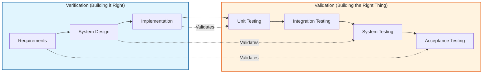
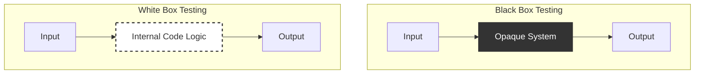
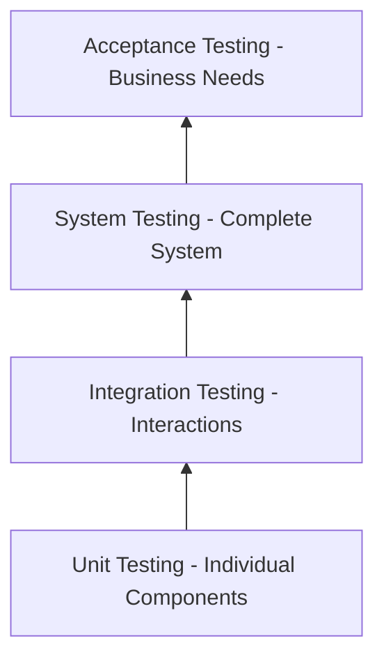
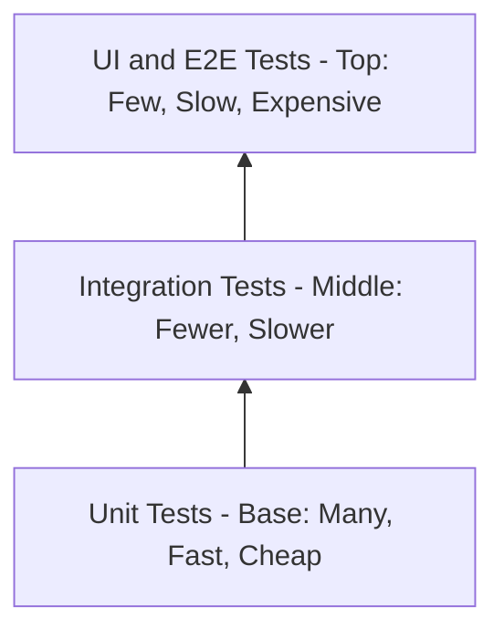
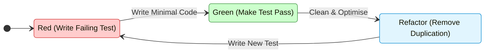
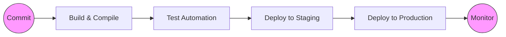

- [1 - The Evolution and Philosophy of Software Quality](#1---the-evolution-and-philosophy-of-software-quality)
	- [1.1 - From Debugging to Prevention](#11---from-debugging-to-prevention)
	- [1.2 - The Two Pillars: Verification and Validation](#12---the-two-pillars-verification-and-validation)
	- [1.3 - The Role of International Standards](#13---the-role-of-international-standards)
	- [1.4 - Static versus Dynamic Testing](#14---static-versus-dynamic-testing)
- [2 - The Core Taxonomy: Black Box and White Box Testing](#2---the-core-taxonomy-black-box-and-white-box-testing)
	- [2.1 - Black Box Testing](#21---black-box-testing)
	- [2.2 - White Box Testing](#22---white-box-testing)
	- [2.3 - Comparing the Approaches](#23---comparing-the-approaches)
- [3 - The Hierarchy of Testing Levels](#3---the-hierarchy-of-testing-levels)
	- [3.1 - Unit Testing](#31---unit-testing)
	- [3.2 - Integration Testing](#32---integration-testing)
	- [3.3 - System Testing](#33---system-testing)
	- [3.4 - Acceptance Testing](#34---acceptance-testing)
- [4 - Architectural Strategies and Models](#4---architectural-strategies-and-models)
	- [4.1 - The Test Pyramid](#41---the-test-pyramid)
	- [4.2 - The Testing Trophy](#42---the-testing-trophy)
	- [4.3 - The Testing Honeycomb](#43---the-testing-honeycomb)
	- [4.4 - Choosing a Strategy](#44---choosing-a-strategy)
- [5 - Isolation and Test Doubles](#5---isolation-and-test-doubles)
	- [5.1 - The Five Types of Test Doubles](#51---the-five-types-of-test-doubles)
	- [5.2 - Mocks vs Stubs: The Schools of TDD](#52---mocks-vs-stubs-the-schools-of-tdd)
	- [5.3 - The Anti-Pattern: Mocking What You Don't Own](#53---the-anti-pattern-mocking-what-you-dont-own)
- [6 - Development Methodologies](#6---development-methodologies)
	- [6.1 - Test-Driven Development (TDD)](#61---test-driven-development-tdd)
	- [6.2 - Behaviour-Driven Development (BDD)](#62---behaviour-driven-development-bdd)
	- [6.3 - Acceptance Test-Driven Development (ATDD)](#63---acceptance-test-driven-development-atdd)
- [7 - Automation, CI/CD, and Modern Architectures](#7---automation-cicd-and-modern-architectures)
	- [7.1 - The CI/CD Pipeline](#71---the-cicd-pipeline)
	- [7.2 - Containerisation and Testing](#72---containerisation-and-testing)
	- [7.3 - Microservices and Contract Testing](#73---microservices-and-contract-testing)
- [8 - Anti-Patterns and Pitfalls](#8---anti-patterns-and-pitfalls)
	- [8.1 - The Ice Cream Cone](#81---the-ice-cream-cone)
	- [8.2 - The God Class](#82---the-god-class)
	- [8.3 - Flaky Tests](#83---flaky-tests)
	- [8.4 - Testing Internal Implementation](#84---testing-internal-implementation)
	- [8.5 - Testing as a Religion](#85---testing-as-a-religion)
- [9 - Conclusion](#9---conclusion)
- [References](#references)

# 1 - The Evolution and Philosophy of Software Quality

The discipline of software testing has evolved significantly over the past half-century. It has transitioned from a primitive debugging activity to a sophisticated engineering discipline. Understanding this evolution is crucial. It provides context for why current practices exist. It also highlights the shifting focus from merely finding faults to preventing them.

## 1.1 - From Debugging to Prevention

In the early days of computing, testing was indistinguishable from debugging. Programs were written, executed, and fixed when they crashed. There was no distinct phase or discipline named "testing". The definition of testing was simply "the process of proving that errors exist". This view, championed by early figures like Myers, emphasised the destructive nature of testing. A successful test was one that broke the software. This mindset was necessary at the time to challenge the assumption that code was correct by default.

However, as software systems grew in complexity, this approach became unsustainable. Waiting until code was written to find errors proved too costly. The industry shifted towards a broader view: evaluation. Testing became a way to measure the quality of the software. It was no longer just about finding bugs. It was about assessing reliability, usability, and performance.

Today, modern software engineering views testing as prevention. The highest value of testing lies not in finding bugs after they are created, but in preventing them from being written in the first place. Methodologies like **Test-Driven Development (TDD)** and **Behaviour-Driven Development (BDD)** exemplify this shift. They move testing to the very beginning of the lifecycle. This "Shift Left" approach ensures that requirements are clear and testable before a single line of production code is written. Quality is built in, not inspected in.

## 1.2 - The Two Pillars: Verification and Validation

The philosophy of software quality rests on two fundamental concepts: **Verification** and **Validation** (V&V). These terms are often confused. In casual conversation, they may seem interchangeable. However, in professional engineering, they represent distinct mechanisms with different goals.

* **Verification** is a process-oriented activity. It answers the question: "Are we building the product right?". It focuses on the adherence to specifications, standards, and design documents. When a developer runs a static analysis tool, they are performing verification. They are checking if the code conforms to syntax rules and coding standards. When a team conducts a code review, they are verifying that the logic implements the design correctly. Verification ensures that the software is being developed correctly according to the rules defined at the start of the task. It relies heavily on static testing techniques, such as inspections and walkthroughs, where the code is examined but not executed.
* **Validation** is a product-oriented activity. It answers the question: "Are we building the right product?". It focuses on the user's needs and the real-world environment. A piece of software can be verified perfectly against a specification but still fail validation if the specification does not meet the user's requirements. Validation ensures that the software fulfils its intended use and satisfies the stakeholder's goals. It relies on dynamic testing techniques, where the software is executed to observe its actual behaviour.

The interplay between these two is critical. The Waterfall model traditionally emphasised formal verification in the early stages, with validation occurring only at the very end. This often led to "verified failures" (software that met the spec but was useless to the customer). Modern Agile methodologies emphasise continuous validation. They require frequent feedback loops with stakeholders to ensure the product remains aligned with user needs throughout development.

## 1.3 - The Role of International Standards

Software testing is not a chaotic art; it is a standardised engineering practice. The International Organization for Standardization (ISO), the International Electrotechnical Commission (IEC), and the Institute of Electrical and Electronics Engineers (IEEE) have collaborated to define the rules of the road.

The **ISO/IEC/IEEE 29119** series is the internationally agreed set of standards for software testing. It was developed to provide a unified vocabulary and process framework. Before this standard, organisations used a mix of disparate standards (like IEEE 829 or BS 7925), leading to confusion. ISO 29119 applies to any organisation, regardless of the lifecycle model used. Whether a team uses Waterfall, Agile, or DevOps, the core concepts of test planning, design, and execution remain relevant.

The standard is divided into multiple parts. Part 1 covers concepts and definitions. Part 2 covers test processes. Part 3 covers test documentation. This standardisation ensures that when an engineer speaks of a "Test Case" or a "Test Procedure," there is a universal understanding of what those artefacts contain. It helps organisations, particularly Small and Medium-sized Enterprises (SMEs), structure their testing without reinventing the wheel. Research has shown that tailoring ISO 29119 to the specific needs of an SME can improve the testing process while minimising resource usage.

Furthermore, the **Software Engineering Body of Knowledge (SWEBOK)** codifies testing as a primary knowledge area. SWEBOK divides software engineering into eighteen distinct knowledge areas (KAs). "Software Testing" is separated from "Software Construction" and "Software Design". This distinction is vital. It signals that testing requires its own specific competencies. It is not merely a sub-task of programming. It involves its own theory, techniques, and management strategies. SWEBOK version 4 has recently integrated Agile and DevOps concepts, acknowledging that modern testing is continuous and integrated rather than a separate phase.

## 1.4 - Static versus Dynamic Testing

A comprehensive testing strategy employs two modes of operation: static and dynamic.

* **Static testing** involves evaluating the software without executing the code. This includes human-centric activities like peer reviews, inspections, and walkthroughs. It also includes automated activities like static code analysis. Tools that check for style violations, potential memory leaks, or security vulnerabilities without running the program are performing static testing. This form of testing is highly efficient. It finds defects early in the lifecycle, often during the coding or design phase. Correcting a defect found during a review is significantly cheaper than fixing one found during execution. Verification relies heavily on static testing.
* **Dynamic testing** involves executing the software with specific inputs and observing the outputs. This is the conventional image of "testing". It includes unit tests, integration tests, and system tests. Dynamic testing validates the behaviour of the system. It proves that the code actually works when compiled and run on a machine. It checks for runtime errors, performance issues, and functional correctness. The ISO/IEC 29119-2 standard specifically details the processes for dynamic testing.

Both modes are necessary. Static testing checks the structure and logic. Dynamic testing checks the execution and behaviour. A strategy that relies only on dynamic testing is inefficient, as it catches bugs late. A strategy that relies only on static testing is insufficient, as it cannot verify runtime behaviour.

# 2 - The Core Taxonomy: Black Box and White Box Testing

At a tactical level, testing techniques are classified by the level of knowledge the tester has about the system's internals. This distinction creates two primary categories: Black Box and White Box testing.

## 2.1 - Black Box Testing

Black Box testing treats the system as an opaque box. The tester has no knowledge of the internal code, structure, or implementation details. They focus solely on the external behaviour. The tester provides inputs and observes the outputs, verifying them against the requirements.

This approach is typically used during System Testing and Acceptance Testing phases. It is often executed by independent testers or actual users who simulate real-world usage. The primary advantage of Black Box testing is that it offers an unbiased user perspective. The user does not care how the sorting algorithm is implemented; they only care that the list is sorted. It is also robust against code refactoring. If a developer changes the internal implementation but maintains the interface, the Black Box tests should still pass.

Common techniques in Black Box testing include:

* **Equivalence Partitioning:** This technique divides input data into valid and invalid partitions. The assumption is that the program will behave similarly for all values within a partition. For example, if a field accepts numbers from 1 to 100, a tester does not need to test every number. They can test one valid number (e.g., 50) and one invalid number (e.g., 101). This reduces the number of test cases while maintaining coverage.
* **Boundary Value Analysis:** Errors often hide at the edges of partitions. This technique focuses on testing the boundaries. Using the previous example, a tester would test 1, 100, 0, and 101. These edge cases are statistically more likely to trigger defects.
* **Decision Table Testing:** This is useful for systems with complex logic where different combinations of inputs result in different actions. A table maps inputs to expected outputs, ensuring all logical combinations are covered.

## 2.2 - White Box Testing

White Box testing, also known as structural or glass-box testing, assumes full knowledge of the internal source code. The tester uses this knowledge to design test cases that exercise specific paths through the code.

This approach is typically used during Unit Testing and Integration Testing phases. It is usually carried out by software developers who understand the code structure. The goal is to verify the internal logic, flow, and structure.

Common techniques in White Box testing include:

* **Statement Coverage:** This metric measures the percentage of executable statements in the code that have been executed by the tests. The goal is 100% statement coverage, ensuring every line of code is run at least once.
* **Branch Coverage:** This is a more rigorous metric. It ensures that every branch in the control flow is taken. For an if-else statement, statement coverage might be achieved by only testing the true condition. Branch coverage requires testing both the true and false conditions. ISTQB standards note that 100% branch coverage implies 100% statement coverage, but the reverse is not true.
* **Path Coverage:** This ensures that every possible independent path through the code is executed. In complex functions with many loops and conditions, the number of paths can be exponential, making full path coverage difficult to achieve.

## 2.3 - Comparing the Approaches

The choice between Black Box and White Box testing is not binary; they are complementary. Black Box testing validates the requirements ("Does it do what the user wants?"). White Box testing verifies the structure ("Is the logic sound?").

| Feature              | Black Box Testing                         | White Box Testing                            |
| :------------------- | :---------------------------------------- | :------------------------------------------- |
| **Visibility**       | Internal logic is hidden.                 | Internal logic is visible.                   |
| **Focus**            | External behaviour and requirements.      | Internal structure and logic paths.          |
| **Primary Executor** | Testers, Users, Business Analysts.        | Developers.                                  |
| **Phase**            | System, Acceptance.                       | Unit, Integration.                           |
| **Efficiency**       | Less time-consuming to design.            | Most time-consuming; requires code analysis. |
| **Techniques**       | Equivalence Partitioning, Boundary Value. | Statement, Branch, Path Coverage.            |

Research comparing these techniques has found that while they may detect a similar number of faults, they detect different types of faults. Black Box approaches are better at identifying missing logic or requirement gaps. White Box approaches are better at identifying hidden coding errors or redundant logic. Interestingly, recent studies on regression test prioritisation found that Black Box techniques (like Combinatorial Interaction Testing) can perform almost as well as White Box techniques, which is positive news for testers who may not have access to source code.

# 3 - The Hierarchy of Testing Levels

Software testing is organised into a hierarchy of levels. These levels correspond to the scope of the software being tested, moving from individual components to the complete system. This structure is defined in standard syllabi like ISTQB and SWEBOK.

## 3.1 - Unit Testing

Unit testing forms the base of the hierarchy. A "unit" is the smallest testable part of an application. In functional programming, this is a function. In object-oriented programming, it is a method or a class.

The primary goal of unit testing is to verify that each individual unit performs as designed in isolation. These tests are written by developers. They are typically White Box tests, as the developer uses their knowledge of the code to write them.

Unit tests must possess two critical attributes: speed and isolation.

* **Speed:** A project may eventually contain thousands of unit tests. If the suite takes minutes to run, developers will stop running it. Good unit tests run in milliseconds.
* **Isolation:** A unit test should not depend on external systems like databases, file systems, or networks. If a test fails, it must be because the logic in the unit is incorrect, not because the network is down. This isolation is achieved using Test Doubles (discussed in Section 5).

Unit testing provides the tightest feedback loop. It supports the "fail fast" philosophy. When a developer changes a line of code, they can run the unit tests immediately. If a test fails, the bug is identified seconds after it was introduced.

## 3.2 - Integration Testing

Once individual units are verified, they must be combined. Integration testing verifies the interactions between these units. Even if two units work perfectly in isolation, they may fail when they try to communicate. One unit might expect data in a specific format (e.g., separate First and Last Name), while the other sends it differently (e.g., Full Name). Integration testing catches these interface defects.

There are two distinct subtypes of integration testing:

* **Component Integration Testing:** This focuses on the interactions between software components or modules within a single system. It is often performed by developers.
* **System Integration Testing (SIT):** This is a higher-level activity. It tests the interactions between different independent systems. For example, testing how an e-commerce application talks to a third-party payment gateway or an ERP system. SIT ensures that the entire ecosystem works in harmony.

Integration strategies include:

* **Big Bang:** All modules are integrated simultaneously. This is risky and discouraged, as isolating the cause of a failure is difficult.
* **Incremental:** Modules are added one by one. This can be Top-Down (starting with the UI and mocking lower layers) or Bottom-Up (starting with the database layer and moving up).

## 3.3 - System Testing

System testing verifies the complete, integrated software system. It tests the system as a whole against its requirements.

This level is predominantly Black Box. The tester interacts with the system via its user interfaces or public APIs, just as a real user would. The focus shifts from "code correctness" to "system behaviour".

System testing encompasses both functional and non-functional requirements:

* **Functional Testing:** Verifies specific features. Can the user login? Does the search function return results?
* **Non-Functional Testing:** Verifies quality attributes. Is the system fast enough (Performance Testing)? Is it secure (Security Testing)? Is it accessible (Accessibility Testing)?

System testing is typically performed in a staging environment that closely mirrors production. This helps identify environment-specific issues, such as configuration errors or resource constraints, before the software reaches the user.

## 3.4 - Acceptance Testing

Acceptance testing is the final level in the hierarchy. Its purpose is to determine if the software is ready for release. It validates that the software meets the business needs and is acceptable to the stakeholders.

There are several forms of acceptance testing:

* **User Acceptance Testing (UAT):** Actual users or business representatives test the software. They verify that the system supports their day-to-day workflows. This is the ultimate validation step.
* **Operational Acceptance Testing (OAT):** This is performed by system administrators or DevOps engineers. They check if the system is maintainable. They test backups, disaster recovery procedures, logging, and alerting.
* **Alpha and Beta Testing:** Alpha testing is performed by internal staff. Beta testing is released to a select group of external users to gather feedback from the field.

If defects are found at this stage, they are the most expensive to fix. They often imply a fundamental misunderstanding of the requirements. Therefore, modern methodologies try to incorporate acceptance criteria earlier in the process (Shift Left).

# 4 - Architectural Strategies and Models

Understanding the levels of testing is one thing; knowing how to distribute effort across them is another. Visual models help teams decide the right mix of tests.

## 4.1 - The Test Pyramid

The Test Pyramid is the most famous model, popularised by Mike Cohn and Martin Fowler. It advocates for a specific distribution of tests based on cost and speed.

* **Base (Unit Tests):** The pyramid has a wide base. The majority of tests should be unit tests. They are fast, cheap to write, and precise.
* **Middle (Integration Tests):** The middle layer is smaller. Integration tests are necessary but should be fewer than unit tests because they are slower to run and harder to debug.
* **Top (UI / End-to-End Tests):** The peak is small. These tests verify the full user journey. They are slow, brittle (prone to breaking with UI changes), and expensive to maintain. Therefore, they should be used sparingly.

The philosophy here is economic. You want the most feedback for the least cost. Unit tests provide cheap, fast feedback. UI tests provide expensive, slow feedback.

## 4.2 - The Testing Trophy

In the context of modern web development, particularly with frontend frameworks like React, the Pyramid has been challenged. Kent C. Dodds proposed the "Testing Trophy".

The Trophy shape differs significantly:

* **Base (Static):** Linters and type checkers (like TypeScript) catch simple errors cheaply.
* **Unit Tests:** A smaller section than in the Pyramid.
* **Integration Tests:** The largest section (the "bulge" of the trophy).
* **End-to-End Tests:** A small top section.

The Trophy argues that for modern components, unit tests often provide little value because components do little in isolation. They mostly interact with other components or the DOM. Therefore, integration tests (which verify these interactions) provide the highest "Return on Investment" (ROI). The mantra is: "Write tests. Not too many. Mostly integration.".

## 4.3 - The Testing Honeycomb

The Honeycomb model is often applied to microservices architectures.

* **Integration Tests:** The widest part. Microservices are small and do little calculation. Their complexity lies in how they talk to other services. Therefore, integration testing is the most critical activity.
* **Implementation Detail (Unit) Tests:** Small.
* **Integrated (System) Tests:** Small.

This model reflects the reality that in distributed systems, the risk is in the connections, not the nodes.

## 4.4 - Choosing a Strategy

There is no single "correct" shape. The strategy depends on the architecture.

* **Complex Algorithmic Logic:** Use the Pyramid. You need many unit tests to verify the complex math or logic.
* **Web Frontend / CRUD Apps:** Use the Trophy. The logic is simple, but the wiring is complex. Focus on integration.
* **Microservices:** Use the Honeycomb. Focus on the contracts and connections between services.

Engineers should not be dogmatic. They should analyse the risk profile of their application and choose the mix of tests that gives the most confidence with the fastest feedback.

# 5 - Isolation and Test Doubles

To write effective unit tests, one must isolate the code under test. If a "unit test" calls a database, it is not a unit test; it is an integration test. It becomes slow and fragile. To achieve isolation, developers use "Test Doubles".

The term "Test Double" was coined by Gerard Meszaros in his seminal book xUnit Test Patterns. It is an umbrella term for any object that replaces a production object for testing purposes. Just as a stunt double stands in for an actor, a test double stands in for a real dependency.

## 5.1 - The Five Types of Test Doubles

Meszaros defined five specific types of doubles. Understanding the nuance between them is a mark of a mature engineer.

* **Dummy:** The simplest double. It is an object that is passed around but never actually used. It is typically used to fill parameter lists to satisfy compiler requirements. For example, if a constructor requires a Logger but the test focuses on a calculation, a DummyLogger can be passed.
* **Fake:** A Fake has a working implementation, but it takes shortcuts that make it unsuitable for production. The classic example is an In-Memory Database. A real database writes to disk (slow). A fake database writes to a list in memory (fast). It behaves like a database—you can save and retrieve data—but the data vanishes when the test ends. Fakes are excellent for integration tests where speed is required.
* **Stub:** A Stub provides canned answers to calls made during the test. It does not respond to anything outside what is programmed. Stubs are used for State Verification. If you are testing a function that depends on the current time, you cannot use the system clock (it changes constantly). You use a Stub that always returns "12:00:00". This makes the test deterministic.
* **Spy:** A Spy is a stub that also records some information about how it was called. It "spies" on the interaction. You might use a Spy to verify that an email service was called exactly once, or to check the arguments passed to it.
* **Mock:** The most complex double. A Mock is pre-programmed with expectations. It knows what calls it should receive. If it receives an unexpected call, or fails to receive an expected one, the test fails automatically. Mocks are used for Behaviour Verification. They verify the interaction between objects, not just the final state.

## 5.2 - Mocks vs Stubs: The Schools of TDD

The choice between using Mocks and Stubs is not just technical; it is philosophical. It defines two different schools of Test-Driven Development.

* **The Classical School (Detroit):** This school prefers Stubs and State Verification. They focus on the final result ("Did the cart total equal £100?"). They use real objects whenever possible and only mock when absolutely necessary (e.g., for slow external services). Their tests are more resilient to refactoring because they do not care about the internal implementation details.
* **The Mockist School (London):** This school prefers Mocks and Behaviour Verification. They focus on the interaction ("Did the cart object call the calculator object?"). They isolate every class strictly, mocking all distinct dependencies. This aids in designing interfaces but can lead to brittle tests. If you change how the answer is calculated, the Mock test might fail even if the answer is still correct.

It is often safer to start with the Classical approach. Focus on what the code returns, not how it calls other code. Use Mocks sparingly for external boundaries.

## 5.3 - The Anti-Pattern: Mocking What You Don't Own

A critical rule in testing is "Don't Mock What You Don't Own".

This principle warns against mocking third-party libraries or APIs directly. If you mock a third-party API (e.g., Stripe or AWS), you are mocking your understanding of that API. If the vendor changes the API behaviour, your Mock will remain unchanged. Your test will pass, but your code will crash in production.

The Solution: Write a wrapper (adapter) around the third-party library. This wrapper is your code; you "own" it.
Write integration tests for your wrapper that hit the real (or faked) third-party service to ensure the wrapper works.
In your application, mock your wrapper.

Since you own the wrapper's interface, you can mock it safely. If the external API changes, you only need to update the wrapper and its integration tests. The rest of your application remains isolated from the change.

# 6 - Development Methodologies

Testing is not an activity that happens after coding; in modern methodologies, it drives the coding process.

## 6.1 - Test-Driven Development (TDD)

Test-Driven Development (TDD) flips the traditional model. Instead of Code-Then-Test, you Test-Then-Code. Developed by Kent Beck as part of Extreme Programming, TDD relies on a micro-cycle known as Red-Green-Refactor.

* **Red:** Write a failing test for a small piece of functionality. It fails because the code does not exist. This verifies that the test is actually testing something.
* **Green:** Write just enough code to make the test pass. Ignore code quality; just get it to pass.
* **Refactor:** Clean up the code. Remove duplication. Improve names. Since the test is green, you can refactor with confidence that you haven't broken anything.

TDD is primarily a design technique. By writing the test first, you are forced to design the API of your code from the consumer's perspective. This leads to loosely coupled, highly cohesive code. It also produces a comprehensive suite of regression tests as a side effect.

However, TDD has a learning curve. It can feel slow initially. "TDD is dead" was a famous controversy sparked by David Heinemeier Hansson, arguing that TDD leads to "test-induced design damage" (over-abstraction). The consensus today is that TDD is a powerful tool, but not a religion. It is most useful for complex logic and less useful for simple boilerplate.

## 6.2 - Behaviour-Driven Development (BDD)

Behaviour-Driven Development (BDD) evolved to bridge the communication gap between technical and non-technical stakeholders. While TDD focuses on the implementation, BDD focuses on the behaviour.

BDD uses a ubiquitous language, typically the Gherkin syntax (Given-When-Then), to describe test scenarios.

* **Given:** The initial context ("Given the user is on the login page").
* **When:** The action ("When the user enters valid credentials").
* **Then:** The outcome ("Then the user is redirected to the dashboard").

These scenarios serve as executable specifications. Tools like Cucumber run these text files as automated tests. BDD ensures that the development team builds features that actually deliver business value. It prevents the "Telephoned Game" effect where requirements get distorted as they pass from business to dev to QA.

## 6.3 - Acceptance Test-Driven Development (ATDD)

ATDD moves the creation of acceptance tests to the very beginning of the sprint. Before any work begins, the "Three Amigos" (Developer, Tester, Product Owner) meet to define the acceptance criteria. These criteria are turned into automated tests. Development is considered complete only when these tests pass. This ensures alignment on the definition of "Done".

# 7 - Automation, CI/CD, and Modern Architectures

Manual testing is unscalable in the modern era. To release software daily or hourly, testing must be automated and integrated into a Continuous Integration/Continuous Deployment (CI/CD) pipeline.

## 7.1 - The CI/CD Pipeline

The CI/CD pipeline is the heartbeat of modern software delivery. It automates the steps from code commit to production deployment. A typical pipeline includes:

| Stage       | Activity                    | Testing Type                        |
| :---------- | :-------------------------- | :---------------------------------- |
| **Commit**  | Developer saves code.       | Local Unit Tests, Pre-commit hooks. |
| **Build**   | Code is compiled/packaged.  | Static Analysis, SAST (Security).   |
| **Test**    | Automated verification.     | Unit Tests, Integration Tests.      |
| **Staging** | Deploy to test environment. | System Tests, E2E Tests, DAST.      |
| **Deploy**  | Release to production.      | Smoke Tests, Canary Tests.          |

The goal is Continuous Integration: merging code frequently (multiple times a day) to avoid "integration hell". The automated tests act as a gatekeeper. If a test fails, the pipeline stops (the "build is broken"), and the team must fix it immediately. This practice is known as "Keeping the Build Green".

## 7.2 - Containerisation and Testing

Technologies like Docker have revolutionised testing. In the past, "it works on my machine" was a common excuse. Environments were inconsistent. Today, we can spin up identical containers for testing and production.

Integration tests can use tools like Testcontainers to spin up real, disposable databases or message queues in Docker containers during the test run. This provides the reliability of a real dependency with the isolation of a test double.

## 7.3 - Microservices and Contract Testing

In a microservices architecture, a system is composed of many small, independent services communicating over networks. Integration testing becomes difficult. Spinning up all 50 microservices to test one is slow and brittle.

Contract Testing is the solution. It focuses on the messages passed between services.

The Consumer (e.g., a frontend) defines a contract: "I expect the User Service to return JSON with an id field."
The Provider (the User Service) verifies that it fulfils this contract.

This effectively decouples the tests. The Consumer can be tested against a mock that simulates the Provider based on the contract. The Provider is tested against the contract itself. This ensures compatibility without the need for end-to-end integration environments. Tools like Pact are the industry standard for this.

# 8 - Anti-Patterns and Pitfalls

Engineers often fall into specific traps. Recognising these anti-patterns is essential for growth.

## 8.1 - The Ice Cream Cone

This is the inverse of the Test Pyramid. The project has very few unit tests, some integration tests, and a massive number of manual or UI tests.

* **Cause:** It is easier to start manual testing than to write code-based tests.
* **Effect:** Feedback is slow. Refactoring is dangerous. Maintenance cost is astronomical.
* **Remedy:** Stop writing UI tests. Push testing down the stack. Invest in unit test training.

## 8.2 - The God Class

A God Class does too much. It handles UI, logic, and database operations in one file.

* **Effect:** It is impossible to unit test because the setup is too complex. You end up needing to mock the entire universe just to test one method.
* **Remedy:** Refactor. Apply the Single Responsibility Principle (SRP). Break the class into smaller, testable components.

## 8.3 - Flaky Tests

A flaky test passes sometimes and fails others, without code changes.

* **Cause:** Race conditions, reliance on system time, or shared state (dirty database from previous test).
* **Effect:** Developers lose trust in the test suite. They ignore failures.
* **Remedy:** Isolate tests rigidly. Ensure every test cleans up its data. Never rely on the execution order of tests.

## 8.4 - Testing Internal Implementation

Tests that check how the code works, not what it does.

* **Example:** Asserting that a private method `_calculateTax` was called, rather than asserting that the final price is correct.
* **Effect:** Refactoring breaks the tests even if the feature still works. This discourages code improvement.
* **Remedy:** Test the public interface. Treat the class as a black box as much as possible, even in unit tests.

## 8.5 - Testing as a Religion

Adhering to TDD or coverage metrics dogmatically.

* **Example:** Writing trivial tests for getters and setters to reach 100% coverage. Refusing to write a useful integration test because it "violates unit isolation".
* **Effect:** Wasted effort. False sense of security.
* **Remedy:** Be pragmatic. Use TDD for complex logic. Use integration tests for wiring. Coverage is a tool to find gaps, not a target to hit.

# 9 - Conclusion

Software testing is not merely a phase to be endured before release. It is a profound engineering discipline that ensures the reliability of the digital world. The journey begins with understanding the difference between Verification and Validation. It progresses through mastering the mechanics of Unit and Integration testing, and navigating the strategic choices of the Test Pyramid.

The modern landscape demands more than just writing assertions. It requires an understanding of architecture (Microservices, Containers), methodology (TDD, BDD), and automation (CI/CD). It requires the wisdom to avoid anti-patterns like the Ice Cream Cone and the discipline to write tests that are fast, isolated, and reliable.

Ultimately, the goal of testing is confidence. Confidence to refactor, confidence to release, and confidence that the software we build will serve its users well. By adopting these practices, an engineer transitions from being a coder to being a true software professional.

# References

> Only peer-reviewed research papers are listed. Each title links to the publisher or DOI page.

1. Wallace, D. R., & Fujii, R. U. (1989). *Software Verification and Validation: An Overview*. IEEE Software, 6(3), 10–17. [https://doi.org/10.1109/52.28119](https://doi.org/10.1109/52.28119)

2. Andersson, C., & Runeson, P. (2002). *Verification and Validation in Industry – A Qualitative Survey on the State of Practice*. Proceedings of the 1st International Symposium on Empirical Software Engineering, 37–47. (Open PDF via thesis collection) [https://lup.lub.lu.se/search/files/5236431/950402.pdf](https://lup.lub.lu.se/search/files/5236431/950402.pdf)

3. Andersson, C., Thelin, T., Runeson, P., & Dzamashvili, N. (2003). *An Experimental Evaluation of Inspection and Testing for Detection of Design Faults*. Proceedings of the 2nd International Symposium on Empirical Software Engineering, 174–184. (Open PDF via thesis collection) [https://lup.lub.lu.se/search/files/5236431/950402.pdf](https://lup.lub.lu.se/search/files/5236431/950402.pdf)

4. Kaur, M., & Singh, R. (2014). *A Review of Software Testing Techniques*. International Journal of Electronics and Electrical Engineering, 2(3), 207–212. [https://doi.org/10.12720/ijeee.2.3.207-212](https://doi.org/10.12720/ijeee.2.3.207-212)

5. Andersson, C. (2003). *Exploring the Software Verification and Validation Process with Focus on Efficient Fault Detection* (PhD thesis, includes several peer-reviewed papers on static vs dynamic techniques and V&V practice). Lund University. [https://lup.lub.lu.se/search/files/5236431/950402.pdf](https://lup.lub.lu.se/search/files/5236431/950402.pdf)

6. Qu, X., Cohen, M. B., & Woolf, K. M. (2007). *Combinatorial Interaction Regression Testing: A Study of Test Case Generation and Prioritization*. Proceedings of the IEEE International Conference on Software Maintenance (ICSM), 255–264. [https://doi.org/10.1109/ICSM.2007.4362638](https://doi.org/10.1109/ICSM.2007.4362638)

7. Nie, C., & Leung, H. (2011). *A Survey of Combinatorial Testing*. ACM Computing Surveys, 43(2), 11:1–11:29. [https://doi.org/10.1145/1883612.1883618](https://doi.org/10.1145/1883612.1883618)

8. Henard, C., Papadakis, M., Harman, M., Jia, Y., & Le Traon, Y. (2016). *Comparing White-Box and Black-Box Test Prioritization*. Proceedings of the 38th International Conference on Software Engineering (ICSE), 523–534. [https://doi.org/10.1145/2884781.2884791](https://doi.org/10.1145/2884781.2884791)

9. Lou, Y., Hao, D., & Zhang, L. (2019). *A Survey on Regression Test-Case Prioritization*. Advances in Computers, 113, 1–46. [https://doi.org/10.1016/bs.adcom.2018.03.004](https://doi.org/10.1016/bs.adcom.2018.03.004)

10. Kasurinen, J., Taipale, O., & Smolander, K. (2010). *Software Test Automation in Practice: Empirical Observations*. International Journal of Software Engineering and Its Applications, 4(4), 35–44. [https://doi.org/10.1155/2010/620836](https://doi.org/10.1155/2010/620836)

11. Kasurinen, J., Taipale, O., & Smolander, K. (2011). *How Test Organizations Adopt New Testing Practices and Methods?* 2011 IEEE Fourth International Conference on Software Testing, Verification and Validation Workshops (ICSTW), 426–433. [https://doi.org/10.1109/ICSTW.2011.63](https://doi.org/10.1109/ICSTW.2011.63)

12. Zarour, M., Desharnais, J.-M., & Abran, A. (2017). *The Software Engineering Body of Knowledge: A Benchmarking Tool for Organizational Process Assessment and Improvement – Case Study*. Indian Journal of Science and Technology, 10(43), 1–19. [https://doi.org/10.17485/ijst/2017/v10i43/120417](https://doi.org/10.17485/ijst/2017/v10i43/120417)

13. Faria, P. M., Dantas, V. L., Marinho, M., & de Almeida, E. S. (2021). *A Study on Software Testing Standard Using ISO/IEC/IEEE 29119-2:2013*. In A. Rocha et al. (Eds.), Trends and Innovations in Information Systems and Technologies (pp. 77–87). Lecture Notes in Networks and Systems, 206. [https://doi.org/10.1007/978-981-33-4850-1_8](https://doi.org/10.1007/978-981-33-4850-1_8)

14. Rafique, Y., & Misic, V. B. (2013). *The Effects of Test-Driven Development on External Quality and Productivity: A Meta-Analysis*. IEEE Transactions on Software Engineering, 39(6), 835–856. [https://doi.org/10.1109/TSE.2012.28](https://doi.org/10.1109/TSE.2012.28)

15. Fucci, D., Turhan, B., Juristo, N., Dieste, O., Tosun-Misirli, A., & Oivo, M. (2015). *Towards an Operationalization of Test-Driven Development Skills: An Industrial Empirical Study*. Information and Software Technology, 68, 82–97. [https://doi.org/10.1016/j.infsof.2015.08.004](https://doi.org/10.1016/j.infsof.2015.08.004)

16. Tosun, A., Dieste, O., Fucci, D., Vegas, S., Turhan, B., Erdogmus, H., … Juristo, N. (2018). *On the Effectiveness of Unit Tests in Test-Driven Development*. Proceedings of the International Conference on Software and System Processes (ICSSP), 113–122. [https://doi.org/10.1145/3202710.3203153](https://doi.org/10.1145/3202710.3203153)

17. Binamungu, L. P., & Maro, S. (2023). *Behaviour Driven Development: A Systematic Mapping Study*. Journal of Systems and Software, 203, 111749. [https://doi.org/10.1016/j.jss.2023.111749](https://doi.org/10.1016/j.jss.2023.111749)

18. Solis, C., & Wang, X. (2011). *A Study of the Characteristics of Behaviour Driven Development*. 2011 37th EUROMICRO Conference on Software Engineering and Advanced Applications (SEAA), 383–387. [https://doi.org/10.1109/SEAA.2011.76](https://doi.org/10.1109/SEAA.2011.76)

19. Minani, J. B., Insfran, E., & Monperrus, M. (2025). *IoT Systems Testing: Taxonomy, Empirical Findings, and Future Directions*. Journal of Systems and Software. (In press; includes taxonomy of test levels and techniques). [https://www.sciencedirect.com/science/article/pii/S0164121225000767](https://www.sciencedirect.com/science/article/pii/S0164121225000767)

20. Ma, S.-P., Tsai, W.-T., Li, X., & Wu, J. (2019). *Graph-Based and Scenario-Driven Microservice Analysis, Retrieval, and Testing*. Future Generation Computer Systems, 90, 335–348. [https://doi.org/10.1016/j.future.2018.07.053](https://doi.org/10.1016/j.future.2018.07.053)

21. Ali, S., Briand, L. C., Hemmati, H., & Panesar-Walawege, R. K. (2010). *A Systematic Review of the Application and Empirical Investigation of Search-Based Test Case Generation*. IEEE Transactions on Software Engineering, 36(6), 742–762. (Summarises unit, integration, system, and acceptance test levels in empirical work.) [https://doi.org/10.1109/TSE.2009.52](https://doi.org/10.1109/TSE.2009.52)

22. Fazzini, M., et al. (2022). *Use of Test Doubles in Android Testing: An In-Depth Investigation*. Empirical Software Engineering, 27, 1–35. (Empirical study of dummies, stubs, mocks and related doubles in practice). [https://doi.org/10.1007/s10664-021-10054-7](https://doi.org/10.1007/s10664-021-10054-7)
