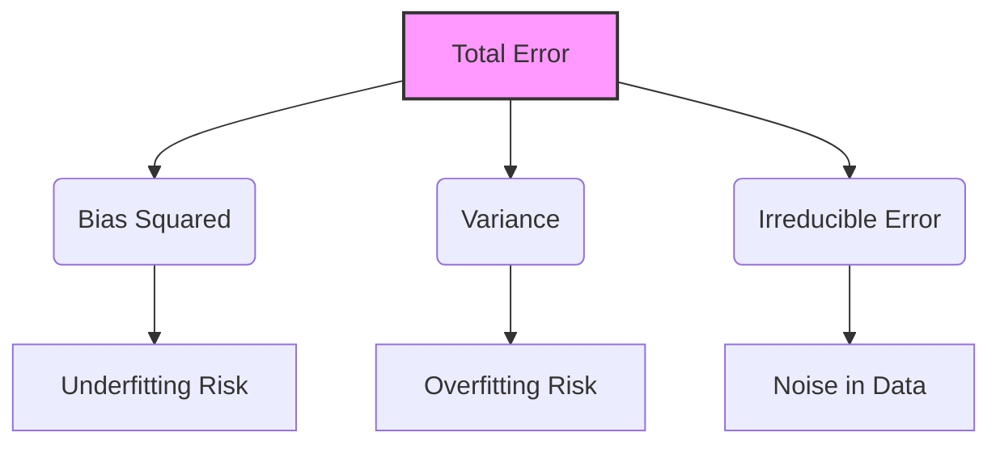
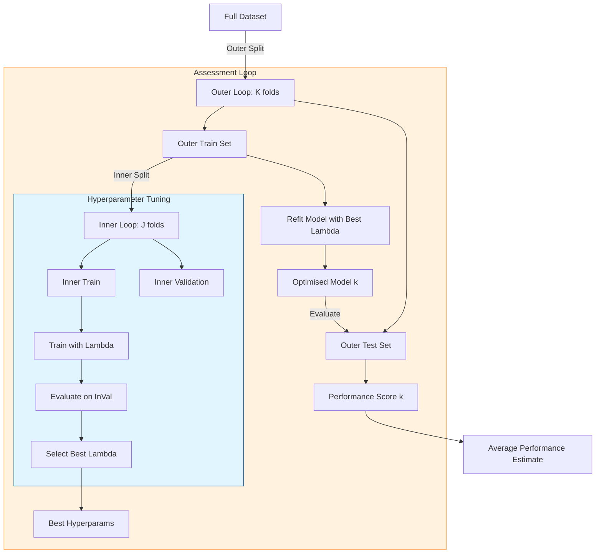

- [1 - Introduction: The Epistemology of Generalisation in Statistical Learning](#1---introduction-the-epistemology-of-generalisation-in-statistical-learning)
  - [1.1 - The Statistical Learning Framework](#11---the-statistical-learning-framework)
  - [1.2 - True Risk vs. Empirical Risk](#12---true-risk-vs-empirical-risk)
- [2 - Theoretical Decomposition of Error](#2---theoretical-decomposition-of-error)
  - [2.1 - The Bias-Variance Decomposition](#21---the-bias-variance-decomposition)
  - [2.2 - Bias and Variance of the Validation Estimator](#22---bias-and-variance-of-the-validation-estimator)
- [3 - Standard Cross-Validation Architectures](#3---standard-cross-validation-architectures)
  - [3.1 - The Hold-Out Method (Simple Split)](#31---the-hold-out-method-simple-split)
  - [3.2 - K-Fold Cross-Validation](#32---k-fold-cross-validation)
  - [3.3 - Leave-One-Out Cross-Validation (LOOCV)](#33---leave-one-out-cross-validation-loocv)
    - [3.3.1 - The Computational Shortcut for Linear Models](#331---the-computational-shortcut-for-linear-models)
  - [3.4 - Repeated K-Fold Cross-Validation](#34---repeated-k-fold-cross-validation)
- [4 - Stratified Sampling in Validation](#4---stratified-sampling-in-validation)
  - [4.1 - The Mathematics of Stratification](#41---the-mathematics-of-stratification)
  - [4.2 - Stratified K-Fold Algorithm](#42---stratified-k-fold-algorithm)
- [5 - Validation in Dependent Domains: Time and Space](#5---validation-in-dependent-domains-time-and-space)
  - [5.1 - Time Series Validation (Temporal Dependence)](#51---time-series-validation-temporal-dependence)
    - [5.1.1 - Rolling Origin (Forward Chaining)](#511---rolling-origin-forward-chaining)
    - [5.1.2 - h-Block Cross-Validation](#512---h-block-cross-validation)
  - [5.2 - Spatial Cross-Validation (Spatial Autocorrelation)](#52---spatial-cross-validation-spatial-autocorrelation)
    - [5.2.1 - Spatial Block Cross-Validation](#521---spatial-block-cross-validation)
- [6 - Model Selection and Nested Cross-Validation](#6---model-selection-and-nested-cross-validation)
  - [6.1 - The Selection Bias Problem](#61---the-selection-bias-problem)
  - [6.2 - Nested Cross-Validation Architecture](#62---nested-cross-validation-architecture)
- [7 - Information Theoretic Approaches: AIC and BIC](#7---information-theoretic-approaches-aic-and-bic)
  - [7.1 - Akaike Information Criterion (AIC)](#71---akaike-information-criterion-aic)
  - [7.2 - Bayesian Information Criterion (BIC)](#72---bayesian-information-criterion-bic)
- [8 - Statistical Inference on Performance](#8---statistical-inference-on-performance)
  - [8.1 - The Problem of Independence](#81---the-problem-of-independence)
  - [8.2 - The Nadeau-Bengio Correction](#82---the-nadeau-bengio-correction)
- [9 - Conclusion](#9---conclusion)
- [References](#references)

# 1 - Introduction: The Epistemology of Generalisation in Statistical Learning

The fundamental challenge of artificial intelligence and statistical learning is the problem of generalisation. In the classical deductive sciences, conclusions follow logically from premises. In inductive learning, however, the algorithm must infer general rules from specific, finite observations. This inference carries an inherent risk: the model may identify patterns that are specific only to the observed data (noise or sampling artefacts) rather than the underlying data-generating process. This phenomenon, known as overfitting, represents a failure of induction.

Validation methodologies provide the mathematical framework to estimate and mitigate this risk. They are not merely procedural steps in a software pipeline but are grounded in deep statistical theory, specifically Empirical Risk Minimisation (ERM), the Bias-Variance Decomposition, and Asymptotic Consistency. A rigorous understanding of these concepts is essential, as the naive application of validation strategies (such as random splitting on time-series data) can lead to catastrophically biased performance estimates.

This report provides an exhaustive analysis of validation architectures. We will traverse from the axiomatic definitions of Risk and Loss to the mechanics of K-Fold and Leave-One-Out estimators, examine the necessary modifications for dependent data (temporal and spatial), and conclude with the advanced statistical testing required to compare models rigorously.

## 1.1 - The Statistical Learning Framework

To discuss validation mathematically, we must first define the learning problem. We assume the existence of an input space $\mathcal{X}$ (e.g., vectors in $\mathbb{R}^d$) and an output space $\mathcal{Y}$ (e.g., $\mathbb{R}$ for regression or $\{0, 1\}$ for classification).

We posit that the data is generated by a fixed but unknown joint probability distribution $P(X, Y)$. A dataset $S_n = \{(x_1, y_1), \dots, (x_n, y_n)\}$ consists of $n$ independent and identically distributed (i.i.d.) samples drawn from $P$.

A learning algorithm $\mathcal{A}$ is a map that takes a dataset $S_n$ and produces a hypothesis (or model) $h: \mathcal{X} \rightarrow \mathcal{Y}$ from a hypothesis class $\mathcal{H}$.

$$\mathcal{A}: (\mathcal{X} \times \mathcal{Y})^n \rightarrow \mathcal{H}$$

We measure the quality of a prediction using a Loss Function $L: \mathcal{Y} \times \mathcal{Y} \rightarrow \mathbb{R}_{\ge 0}$. Common examples include:

  * **Squared Error (Regression):** $L(y, \hat{y}) = (y - \hat{y})^2$
  * **Zero-One Loss (Classification):** $L(y, \hat{y}) = \mathbb{I}(y \neq \hat{y})$
  * **Log Loss (Probabilistic):** $L(y, \hat{p}) = -y \log(\hat{p}) - (1-y)\log(1-\hat{p})$

## 1.2 - True Risk vs. Empirical Risk

The ultimate goal of learning is to minimise the **True Risk** (or Generalisation Error), denoted $R(h)$. This is the expected loss over the entire distribution $P$:

$$R(h) = \mathbb{E}_{(X,Y) \sim P}[L(Y, h(X))] = \int_{\mathcal{X} \times \mathcal{Y}} L(y, h(x)) \, dP(x, y)$$

Crucially, because $P$ is unknown, $R(h)$ is unobservable. We cannot compute the integral directly. We only have access to the **Empirical Risk**, $R_{emp}(h)$, which is the average loss on the training data:

$$R_{emp}(h) = \frac{1}{n} \sum_{i=1}^n L(y_i, h(x_i))$$

The principle of Empirical Risk Minimisation (ERM) states that the algorithm should choose the hypothesis $\hat{h}$ that minimises $R_{emp}$. However, statistical learning theory warns us that $R_{emp}(\hat{h})$ is a biased estimator of $R(\hat{h})$. Specifically, it is optimistically biased. Because the model $\hat{h}$ was chosen specifically to minimise the error on $S_n$, it will likely perform better on $S_n$ than on new data drawn from $P$.

$$\mathbb{E}[R_{emp}(\hat{h})] < \mathbb{E}[R(\hat{h})]$$

The difference between these two quantities is the **Generalisation Gap**. Validation techniques are, essentially, methods for estimating $R(\hat{h})$ using only the available data $S_n$, correcting for the optimism of the empirical risk.

-----

# 2 - Theoretical Decomposition of Error

To understand the trade-offs between different validation methods (e.g. why choose 10-fold over Leave-One-Out?), we must analyse the sources of error in predictive modelling. This is formalised in the **Bias-Variance Decomposition**.

## 2.1 - The Bias-Variance Decomposition

Consider a regression setting where the target variable $Y$ is related to $X$ by a deterministic function $f$ plus random noise $\epsilon$:

$$Y = f(X) + \epsilon, \quad \text{where } \mathbb{E}[\epsilon] = 0, \text{Var}(\epsilon) = \sigma_\epsilon^2$$

We estimate $f$ using a model $\hat{f}_S$ trained on a dataset $S$. We are interested in the expected mean squared error at a specific query point $x_0$, averaged over all possible training sets $S$ of size $n$.

$$\text{Error}(x_0) = \mathbb{E}_S [(Y - \hat{f}_S(x_0))^2]$$

By adding and subtracting terms (specifically $\mathbb{E}_S[\hat{f}_S(x_0)]$ and $f(x_0)$), we can decompose this expectation into three distinct components.

**Step-by-Step Derivation**

Expand the term inside the expectation:

$$(Y - \hat{f}_S)^2 = ( (f(x_0) + \epsilon) - \hat{f}_S )^2$$
$$= ( (f(x_0) - \hat{f}_S) + \epsilon )^2$$
$$= (f(x_0) - \hat{f}_S)^2 + \epsilon^2 + 2\epsilon(f(x_0) - \hat{f}_S)$$

Take the expectation $\mathbb{E}_{S, \epsilon}$. Since $\epsilon$ is independent of $S$:

$$\mathbb{E}[(Y - \hat{f}_S)^2] = \mathbb{E}_S[(f(x_0) - \hat{f}_S)^2] + \sigma_\epsilon^2 + 0$$

Now focus on the first term $\mathbb{E}_S[(f(x_0) - \hat{f}_S)^2]$. Let $\bar{f}(x_0) = \mathbb{E}_S[\hat{f}_S(x_0)]$ be the average prediction of the model over infinite training sets.

$$\mathbb{E}_S[(f(x_0) - \bar{f}(x_0) + \bar{f}(x_0) - \hat{f}_S)^2]$$
$$= \mathbb{E}_S[ (f(x_0) - \bar{f}(x_0))^2 ] + \mathbb{E}_S[ (\bar{f}(x_0) - \hat{f}_S)^2 ] + 2(f(x_0) - \bar{f}(x_0))\mathbb{E}_S[\bar{f}(x_0) - \hat{f}_S]$$

The cross term is zero because $\mathbb{E}_S[\bar{f}(x_0) - \hat{f}_S] = \bar{f}(x_0) - \mathbb{E}_S[\hat{f}_S] = 0$.

This yields the final decomposition:

$$\text{Expected Error} = \underbrace{(f(x_0) - \mathbb{E}[\hat{f}_S(x_0)])^2}_{\text{Bias}^2} + \underbrace{\mathbb{E}[(\hat{f}_S(x_0) - \mathbb{E}[\hat{f}_S(x_0)])^2]}_{\text{Variance}} + \underbrace{\sigma_\epsilon^2}_{\text{Irreducible Error}}$$

**Interpretation of Components**

  * **Bias:** The error introduced by approximating a real-world problem (which may be extremely complex) by a much simpler model. High bias implies the model is not flexible enough to capture the underlying structure (Underfitting).
  * **Variance:** The amount by which the estimate of the target function would change if we used a different training data set. High variance implies the model is tracking the noise in the specific training set (Overfitting).
  * **Irreducible Error ($\sigma_\epsilon^2$):** The noise inherent in the data generation process itself. No model can reduce this error.

<!-- end list -->

## 2.2 - Bias and Variance of the Validation Estimator

Crucially, the validation process itself is an estimator and thus has its own bias and variance properties. This is often a source of confusion; we must distinguish between the bias/variance of the model (discussed above) and the bias/variance of the cross-validation estimator of error.

Let $\text{Err}$ be the true error of the final model trained on all $n$ data points. Let $\widehat{\text{Err}}_{CV}$ be the error estimated by Cross-Validation.

**Bias of the CV Estimator:**
In K-Fold CV, we train on subsets of size $n_{train} = \frac{K-1}{K}n$. Learning curves are typically strictly decreasing functions of sample size (more data $\to$ better model). Therefore, the model trained on the subset is, on average, slightly worse than the model trained on the full dataset.
Consequently, $\widehat{\text{Err}}_{CV}$ tends to overestimate the true error. It has a **pessimistic bias**.

  * **LOOCV ($K=n$):** $n_{train} = n-1$. The bias is minimal because the training set size is almost identical to $n$.
  * **2-Fold CV ($K=2$):** $n_{train} = n/2$. The bias is significant because we are estimating the performance of a model trained on only half the data.

**Variance of the CV Estimator:**
This refers to how much the CV estimate would vary if we drew a completely new dataset $S'$ of size $n$ and repeated the CV procedure.

  * **LOOCV:** The training sets in each fold are highly overlapping (they share $n-2$ samples). This leads to highly positively correlated error estimates across folds. Statistical theory shows that the variance of the mean of highly correlated variables is higher than the mean of independent variables. Thus, LOOCV often has high variance.
  * **K-Fold (e.g. K=10):** The training sets overlap less (sharing roughly $80-90\%$ of data). The error estimates are less correlated, often resulting in a lower variance estimator than LOOCV.

**Conclusion:** For model selection, we generally prefer K-Fold (with $K=5$ or $10$) over LOOCV because the lower variance often leads to more stable model selection, despite the slightly higher bias.

-----

# 3 - Standard Cross-Validation Architectures

We now detail the algorithms and mathematical formulations of the standard validation techniques used for Independent and Identically Distributed (i.i.d.) data.

## 3.1 - The Hold-Out Method (Simple Split)

This is the most elementary form of validation. The dataset $S$ is partitioned into two disjoint sets: $S_{train}$ and $S_{test}$.

$$S_{train} \cup S_{test} = S, \quad S_{train} \cap S_{test} = \emptyset$$

Typically, $|S_{train}| \approx 0.7n$ to $0.8n$.

The Estimator:
$$\hat{R}_{HO} = \frac{1}{|S_{test}|} \sum_{(x_i, y_i) \in S_{test}} L(y_i, \hat{h}_{S_{train}}(x_i))$$

**Advantages:**

  * Computationally efficient (requires training only one model).

**Disadvantages:**

  * **High Variance:** The estimate depends heavily on exactly which points end up in the test set. An "unlucky" split might put all the difficult examples in the test set (pessimistic estimate) or all the easy ones (optimistic estimate).
  * **Wasteful:** A significant portion of data (e.g. 20%) is never used for training the evaluated model, increasing the pessimistic bias discussed in Section 2.2.

## 3.2 - K-Fold Cross-Validation

K-Fold CV mitigates the wastefulness and variance of the hold-out method by repeating the process $K$ times on different partitions.

**Algorithm:**

1.  Partition $S$ randomly into $K$ disjoint subsets (folds) of approximately equal size: $\mathcal{F}_1, \dots, \mathcal{F}_K$.
2.  For $k = 1$ to $K$:
      * Let $T_k = \mathcal{F}_k$ (Validation fold).
      * Let $Tr_k = S \setminus \mathcal{F}_k$ (Training folds).
      * Train model $\hat{f}_k$ on $Tr_k$.
      * Compute error on $T_k$: $\epsilon_k = \frac{1}{|T_k|} \sum_{i \in T_k} L(y_i, \hat{f}_k(x_i))$.
3.  Compute average error:
    $$CV_{(K)} = \frac{1}{K} \sum_{k=1}^K \epsilon_k$$

```mermaid
gantt
    title K-Fold Cross-Validation Architecture (K=5)
    dateFormat  X
    axisFormat %s
    
    section Fold 1
    Test Set       :crit, 0, 20
    Train Set      :active, 20, 100
    
    section Fold 2
    Train Set      :active, 0, 20
    Test Set       :crit, 20, 40
    Train Set      :active, 40, 100

    section Fold 3
    Train Set      :active, 0, 40
    Test Set       :crit, 40, 60
    Train Set      :active, 60, 100

    section Fold 4
    Train Set      :active, 0, 60
    Test Set       :crit, 60, 80
    Train Set      :active, 80, 100

    section Fold 5
    Train Set      :active, 0, 80
    Test Set       :crit, 80, 100
```

<!-- end list -->

**Example Calculation (Manual K-Fold):**
Let us perform a 3-Fold CV on a small regression dataset.
Data: $S = \{(1, 2.0), (2, 3.0), (3, 3.2), (4, 5.0), (5, 5.2), (6, 7.0)\}$.
Model: Nearest Mean (predicts the mean of training $y$ values).
Folds: $F_1 = \{1, 2\}, F_2 = \{3, 4\}, F_3 = \{5, 6\}$.

  * **Fold 1 (Test on indices 1, 2):**

      * Train on $F_2 \cup F_3$: $y_{train} = \{3.2, 5.0, 5.2, 7.0\}$.
      * Prediction $\hat{y} = \text{mean}(3.2, 5.0, 5.2, 7.0) = 5.1$.
      * Test Errors: $(2.0 - 5.1)^2 = 9.61$, $(3.0 - 5.1)^2 = 4.41$.
      * $\epsilon_1 = (9.61 + 4.41)/2 = 7.01$.

  * **Fold 2 (Test on indices 3, 4):**

      * Train on $F_1 \cup F_3$: $y_{train} = \{2.0, 3.0, 5.2, 7.0\}$.
      * Prediction $\hat{y} = 4.3$.
      * Test Errors: $(3.2 - 4.3)^2 = 1.21$, $(5.0 - 4.3)^2 = 0.49$.
      * $\epsilon_2 = (1.21 + 0.49)/2 = 0.85$.

  * **Fold 3 (Test on indices 5, 6):**

      * Train on $F_1 \cup F_2$: $y_{train} = \{2.0, 3.0, 3.2, 5.0\}$.
      * Prediction $\hat{y} = 3.3$.
      * Test Errors: $(5.2 - 3.3)^2 = 3.61$, $(7.0 - 3.3)^2 = 13.69$.
      * $\epsilon_3 = (3.61 + 13.69)/2 = 8.65$.

**Final CV Score:**
$$CV_{(3)} = \frac{7.01 + 0.85 + 8.65}{3} \approx 5.50$$
This value (5.50) is our estimate of the MSE on unseen data.

## 3.3 - Leave-One-Out Cross-Validation (LOOCV)

LOOCV is the special case where $K=n$.

The Estimator:
$$CV_{LOO} = \frac{1}{n} \sum_{i=1}^n L(y_i, \hat{f}_{-i}(x_i))$$
where $\hat{f}_{-i}$ is the model trained on all data except sample $i$.

### 3.3.1 - The Computational Shortcut for Linear Models

A common misconception is that LOOCV is always computationally prohibitive because it requires training $n$ models. For linear regression and many kernel methods, LOOCV can be computed analytically from a single model fit. This result is mathematically elegant and practically useful.

**Theorem:** For a linear smoother $\hat{\mathbf{y}} = \mathbf{H}\mathbf{y}$, where $\mathbf{H}$ is the hat matrix, the LOOCV squared error is:

$$CV_{LOO} = \frac{1}{n} \sum_{i=1}^n \left( \frac{y_i - \hat{y}_i}{1 - h_{ii}} \right)^2$$

where $\hat{y}_i$ is the prediction from the full model and $h_{ii}$ is the $i$-th diagonal element of $\mathbf{H}$.

**Proof Derivation:**
Consider the standard Ordinary Least Squares (OLS) solution: $\hat{\boldsymbol{\beta}} = (\mathbf{X}^T\mathbf{X})^{-1}\mathbf{X}^T\mathbf{y}$.
The Hat Matrix is $\mathbf{H} = \mathbf{X}(\mathbf{X}^T\mathbf{X})^{-1}\mathbf{X}^T$.

Let $\hat{\boldsymbol{\beta}}_{-i}$ be the coefficients when observation $i$ is removed. We want to compute the residual $e_{-i} = y_i - \mathbf{x}_i^T \hat{\boldsymbol{\beta}}_{-i}$.

Removing point $i$ is equivalent to updating the matrix $(\mathbf{X}^T\mathbf{X})$ by subtracting the outer product $\mathbf{x}_i \mathbf{x}_i^T$:

$$(\mathbf{X}_{-i}^T\mathbf{X}_{-i}) = (\mathbf{X}^T\mathbf{X} - \mathbf{x}_i \mathbf{x}_i^T)$$

We can invert this updated matrix using the Sherman-Morrison-Woodbury formula:

$$(\mathbf{A} - \mathbf{u}\mathbf{v}^T)^{-1} = \mathbf{A}^{-1} + \frac{\mathbf{A}^{-1}\mathbf{u}\mathbf{v}^T\mathbf{A}^{-1}}{1 - \mathbf{v}^T\mathbf{A}^{-1}\mathbf{u}}$$

Here $\mathbf{A} = \mathbf{X}^T\mathbf{X}$ and $\mathbf{u} = \mathbf{v} = \mathbf{x}_i$.
Note that the leverage $h_{ii} = \mathbf{x}_i^T (\mathbf{X}^T\mathbf{X})^{-1} \mathbf{x}_i$.

The formula becomes:
$$(\mathbf{X}_{-i}^T\mathbf{X}_{-i})^{-1} = (\mathbf{X}^T\mathbf{X})^{-1} + \frac{(\mathbf{X}^T\mathbf{X})^{-1}\mathbf{x}_i\mathbf{x}_i^T(\mathbf{X}^T\mathbf{X})^{-1}}{1 - h_{ii}}$$

By substituting this into the expression for $\hat{\boldsymbol{\beta}}_{-i}$ and simplifying algebraically (a process involving substantial matrix algebra), we arrive at the relation:

$$y_i - \hat{y}_{-i} = \frac{y_i - \hat{y}_i}{1 - h_{ii}}$$

**Intuition:** The term $1 - h_{ii}$ acts as a scaling factor. If a point has high leverage ($h_{ii}$ close to 1), it strongly influences the model. Removing it would cause a large change in the prediction. The formula inflates the ordinary residual $e_i$ to account for this missing influence without actually refitting the model.

## 3.4 - Repeated K-Fold Cross-Validation

To stabilise the variance of K-Fold CV arising from the randomness of the fold partition, one can repeat the K-Fold procedure $R$ times with different random seeds.

$$CV_{Rep} = \frac{1}{R \times K} \sum_{r=1}^R \sum_{k=1}^K \epsilon_{r,k}$$

This is highly recommended for small datasets where the specific partition of data can significantly alter the error estimate.

-----

# 4 - Stratified Sampling in Validation

The standard K-Fold algorithm assumes that a random split of data will produce training and test sets that are representative of the underlying distribution. However, when the target variable $Y$ is categorical and classes are imbalanced (e.g. 90% Class A, 10% Class B), simple random sampling can fail.

A random split might produce a fold with zero examples of Class B. This leads to two failures:

1.  **Training Failure:** If Class B is missing from the training set, the model cannot learn it.
2.  **Testing Failure:** If Class B is missing from the test set, the error estimate will be biased towards the majority class performance.

## 4.1 - The Mathematics of Stratification

Stratified sampling aims to partition the sample space such that the empirical distribution of classes in each fold $P_{fold}(Y)$ approximates the full empirical distribution $P_S(Y)$.

Let $N_c$ be the count of samples in class $c$. We desire each fold $k$ (of total $K$ folds) to contain $n_{c,k}$ samples of class $c$ such that:

$$n_{c,k} \approx \frac{N_c}{K}$$

## 4.2 - Stratified K-Fold Algorithm

The implementation requires handling the integer division (since $N_c$ might not be divisible by $K$).

**Algorithm:**

1.  Separate the dataset indices by class: $\mathcal{I}_c = \{i : y_i = c\}$ for each class $c$.
2.  For each class set $\mathcal{I}_c$:
      * Shuffle the indices randomly.
      * Distribute the indices into $K$ buckets (folds) sequentially (Round-Robin).
      * $Fold_{1} \leftarrow i_1, Fold_{2} \leftarrow i_2, \dots, Fold_{K} \leftarrow i_K, Fold_{1} \leftarrow i_{K+1}, \dots$
3.  Combine the class-specific buckets to form the final $K$ folds.

**Advantages:**

  * **Variance Reduction:** By locking the class ratios, we remove the component of variance due to the random fluctuation of class prevalence across folds.
  * **Representation:** Guarantees that minority classes are present in both training and evaluation.

-----

# 5 - Validation in Dependent Domains: Time and Space

The standard cross-validation methods described above rely on the assumption that data points are Independent and Identically Distributed (i.i.d.). In many real-world AI applications, this assumption is violated.

## 5.1 - Time Series Validation (Temporal Dependence)

In time series, observations are ordered: $(x_t, y_t)$ depends on $(x_{t-1}, y_{t-1})$. Using standard K-Fold CV destroys this structure and introduces **Lookahead Bias** (or Data Leakage).

**The Problem with Random Splits:**
If we randomly assign $t=100$ to the training set and $t=99$ to the test set, the model can use information from the future ($t=100$) to predict the past ($t=99$). In reality, we never have future data when making predictions. This leads to wildly optimistic error estimates.

### 5.1.1 - Rolling Origin (Forward Chaining)

The correct approach is to respect the temporal arrow. We evaluate the model's ability to predict $t+1$ given data up to $t$.

**Algorithm (Expanding Window):**
Let the total time steps be $T$. We select a minimum training size $S_{min}$.
For $i = 0$ to $T - S_{min} - 1$:

1.  **Train Set:** Observations $\{1, \dots, S_{min} + i\}$.
2.  **Test Set:** Observation $\{S_{min} + i + 1\}$ (or a block of future observations).
3.  Train model, predict, record error.

```mermaid
gantt
    title Rolling Origin Validation (Expanding Window)
    dateFormat  X
    axisFormat %s
    
    section Iteration 1
    Train Set (t=1..20) :active, 0, 20
    Test Set (t=21)     :crit, 20, 25
    Future Data         :done, 25, 60
    
    section Iteration 2
    Train Set (t=1..25) :active, 0, 25
    Test Set (t=26)     :crit, 25, 30
    Future Data         :done, 30, 60
    
    section Iteration 3
    Train Set (t=1..30) :active, 0, 30
    Test Set (t=31)     :crit, 30, 35
    Future Data         :done, 35, 60

    section Iteration 4
    Train Set (t=1..35) :active, 0, 35
    Test Set (t=36)     :crit, 35, 40
    Future Data         :done, 40, 60
```
  

<!-- end list -->

**Mathematical Formulation:**
The Rolling Origin Cross-Validation error is:

$$CV_{RO} = \frac{1}{M} \sum_{t=S_{min}}^{T-1} L(y_{t+1}, \hat{f}_{1:t}(x_{t+1}))$$

where $\hat{f}_{1:t}$ is the model trained on data from time 1 to $t$.

### 5.1.2 - h-Block Cross-Validation

In some cases (e.g. stationary time series analysis or interpolation tasks), we might want to use future data to predict the past, but still need to handle correlation. Burman, Chow, and Nolan (1994) introduced h-block Cross-Validation.

The idea is to enforce a buffer zone of size $h$ around the test observation $i$.

  * **Test:** $x_i$
  * **Gap:** $\{x_{i-h}, \dots, x_{i-1}\}$ and $\{x_{i+1}, \dots, x_{i+h}\}$
  * **Train:** All data outside the test and gap sets.

This ensures that the training data is asymptotically independent of the test point, provided $h$ is large enough relative to the autocorrelation decay of the series.

Burman derived a correction term for this estimator because removing $2h+1$ samples systematically reduces the training size, inducing a pessimistic bias. The corrected estimator adds a term dependent on the marginal distribution of the data, though in practice, choosing $h$ based on the variogram range is often sufficient.

## 5.2 - Spatial Cross-Validation (Spatial Autocorrelation)

Spatial data follows Tobler's First Law of Geography: "Everything is related to everything else, but near things are more related than distant things."

If we use random K-Fold CV on geospatial data (e.g. predicting crop yields from satellite pixels), adjacent pixels will likely fall into different folds. Since adjacent pixels are almost identical, the model in Fold 1 "memorises" the pixel in Fold 2. This is **Spatial Leakage**.

### 5.2.1 - Spatial Block Cross-Validation

To fix this, we must force spatial separation between training and test sets.

**Checkerboard Blocking:**

  * Overlay a coarse grid (checkerboard) on the spatial domain.
  * Assign grid squares to folds.
  * Fold 1: All black squares.
  * Fold 2: All white squares.
  * When testing on a white square, all training data comes from black squares, ensuring a physical distance between train and test points.

**Cluster-Based Blocking:**

  * Apply K-Means clustering to the spatial coordinates $(u, v)$ of the data points.
  * Assign all points within a cluster to the same fold.
  * This simulates the scenario of predicting for a completely new region (e.g. training on Germany, testing on France).

-----

# 6 - Model Selection and Nested Cross-Validation

A subtle but pervasive error in AI research is calculating performance metrics on the same data used to select hyperparameters. This is known as **Optimization Bias** or **Data Peeking**.

## 6.1 - The Selection Bias Problem

Suppose we wish to select the regularisation parameter $\lambda$ for a Support Vector Machine (SVM).

1.  We define a grid of values $\Lambda = \{0.01, 0.1, 1, 10\}$.
2.  For each $\lambda \in \Lambda$, we run 10-Fold CV and get an accuracy score.
3.  We pick $\lambda^*$ with the highest score (e.g. 95%).
4.  We report 95% as the model's accuracy.

This is invalid. The value 95% is the maximum of several random variables. The expectation of the maximum is strictly greater than the maximum of the expectations. We have selected $\lambda^*$ specifically because it performed well on those specific folds. The true performance on fresh data will be lower.

## 6.2 - Nested Cross-Validation Architecture

To solve this, we must separate the **Selection** mechanism (tuning) from the **Assessment** mechanism (evaluation). This requires two nested loops.

**Algorithm:**

1.  **Outer Loop (Assessment):** Split data into $K_{out}$ folds.
2.  For each outer fold $k \in \{1, \dots, K_{out}\}$:
      * Define Outer Train Set $S_{out}$ and Outer Test Set $T_{out}$.
      * **Inner Loop (Model Selection):**
          * Split $S_{out}$ into $K_{in}$ folds.
          * For each hyperparameter $\lambda \in \Lambda$:
              * Perform $K_{in}$-Fold CV on $S_{out}$.
              * Compute average inner accuracy.
          * Select $\lambda^*_k$ that maximises inner accuracy.
      * **Refit:** Train the model on the entire $S_{out}$ using $\lambda^*_k$.
      * **Evaluate:** Compute error $E_k$ on the hidden $T_{out}$.
3.  **Result:** The true performance estimate is the average of $E_k$.

<!-- end list -->

**Interpretation:**
Note that in Nested CV, we do not get a single "final model" with a single $\lambda$. We might find $\lambda=0.1$ in Fold 1 and $\lambda=1.0$ in Fold 2.
Nested CV estimates the performance of the *algorithm-with-tuning-strategy*, not a specific set of parameters. It answers the question: "If I apply this grid-search method to a new dataset, how well will the resulting model perform?".

**Computational Cost:**
The cost is multiplicative: $C \approx K_{out} \times K_{in} \times |\Lambda| \times \text{TrainCost}$. This can be extremely expensive, necessitating parallel computing.

-----

# 7 - Information Theoretic Approaches: AIC and BIC

While Cross-Validation is a computational method to estimate risk, Information Theory offers analytical approximations. These are particularly useful for parametric models (like Linear Regression) where we want to balance fit (Likelihood) against complexity (Number of parameters).

## 7.1 - Akaike Information Criterion (AIC)

$$AIC = 2k - 2\ln(\hat{L})$$

where $k$ is the number of parameters and $\hat{L}$ is the maximum likelihood of the model.

**Stone's Theorem (1977):** An elegant result in statistical theory states that for linear models, AIC is asymptotically equivalent to Leave-One-Out Cross-Validation.

$$AIC \approx CV_{LOO} \quad \text{as } n \to \infty$$

This means that minimising AIC is theoretically grounded in minimising the Kullback-Leibler divergence between the true distribution and the model distribution. It justifies LOOCV as not just a heuristic, but an optimal estimator of predictive capability.

## 7.2 - Bayesian Information Criterion (BIC)

$$BIC = k \ln(n) - 2\ln(\hat{L})$$

The penalty term in BIC ($k \ln n$) grows with sample size $n$, whereas in AIC it is constant ($2k$).

**Comparison:**
AIC is **Minimax Optimal**: It focuses on finding the model that predicts best. It may include some spurious variables if they slightly help prediction.
BIC is **Consistent**: As $n \to \infty$, the probability that BIC selects the "true" data-generating model approaches 1. It imposes a harsher penalty on complexity.

| Feature        | AIC / LOOCV                              | BIC / K-Fold (Specific K)                  |
| :------------- | :--------------------------------------- | :----------------------------------------- |
| **Goal**       | Prediction Accuracy                      | Model Identification (Explanation)         |
| **Penalty**    | Weaker ($2k$)                            | Stronger ($k \ln n$)                       |
| **Tendency**   | Tends to overfit (selects larger models) | Tends to underfit (selects simpler models) |
| **Asymptotic** | Minimax Efficiency                       | Consistency                                |

-----

# 8 - Statistical Inference on Performance

Once we have CV scores for Model A and Model B, how do we determine if the difference is statistically significant?

## 8.1 - The Problem of Independence

A standard Paired T-Test assumes that the differences in errors $d_i = err_A(i) - err_B(i)$ are independent. In K-Fold CV, they are not. The test errors come from models trained on overlapping data. This correlation implies that the standard variance estimator $\hat{\sigma}^2 / K$ underestimates the true variance, leading to high Type I errors (detecting differences where none exist).

## 8.2 - The Nadeau-Bengio Correction

Nadeau and Bengio (2003) derived a corrected variance estimator that accounts for the correlation $\rho$ between folds.

The standard t-statistic is:
$$t = \frac{\bar{d}}{\hat{\sigma}_d / \sqrt{K}}$$

The **Nadeau-Bengio Corrected t-statistic** is:
$$t_{corrected} = \frac{\bar{d}}{\sqrt{\hat{\sigma}_d^2 \left(\frac{1}{K} + \frac{n_{test}}{n_{train}}\right)}}$$

**Analysis:**
The correction factor is $\left(\frac{1}{K} + \frac{n_{test}}{n_{train}}\right)$.
For 10-Fold CV, $n_{test}/n_{train} = 1/9 \approx 0.11$.
The term $1/K = 0.1$.
So the variance is essentially doubled, and the t-statistic is reduced by a factor of $\sqrt{2}$. This correction makes the test more conservative and valid.

-----

# 9 - Conclusion

Validation is the mechanism by which we impose scientific rigour on the art of machine learning. It transforms an algorithmic output into a statistical estimate with known properties.

The choice of validation architecture involves a fundamental **Bias-Variance Trade-off**:

  * **LOOCV** provides an almost unbiased estimate of the true risk but suffers from high variance and computational cost.
  * **K-Fold CV** (with $K=5$ or $10$) introduces a slight pessimistic bias but reduces variance, making it the standard for model selection.
  * **Stratification** is essential for imbalanced classification to reduce variance further.

For dependent data, we must abandon random splitting:

  * **Time Series:** Use Rolling Origin (Forward Chaining) to prevent lookahead bias.
  * **Spatial Data:** Use Spatial Blocking (Checkerboard/Clustering) to prevent spatial leakage.

Finally, we must distinguish between tuning and evaluation using **Nested CV**, and apply the Nadeau-Bengio correction when performing statistical significance testing. By mastering these architectures, we ensure that our models do not merely memorise the past, but robustly generalise to the future.

# References

* Akaike, H. (1974). [A new look at the statistical model identification](https://doi.org/10.1109/TAC.1974.1100705). *IEEE Transactions on Automatic Control*, 19(6), 716–723. ([SCIRP][1])

* Arlot, S., & Celisse, A. (2010). [A survey of cross-validation procedures for model selection](https://doi.org/10.1214/09-SS054). *Statistics Surveys*, 4, 40–79. ([Project Euclid][2])

* Bengio, Y., & Grandvalet, Y. (2004). [No unbiased estimator of the variance of K-fold cross-validation](https://www.jmlr.org/papers/v5/grandvalet04a.html). *Journal of Machine Learning Research*, 5, 1089–1105. ([jmlr.csail.mit.edu][3])

* Burman, P., Chow, E., & Nolan, D. (1994). [A cross-validatory method for dependent data](https://doi.org/10.1093/biomet/81.2.351). *Biometrika*, 81(2), 351–358. ([Oxford Academic][4])

* Kohavi, R. (1995). [A study of cross-validation and bootstrap for accuracy estimation and model selection](https://www.ijcai.org/Proceedings/95-2/Papers/016.pdf). *Proceedings of the 14th International Joint Conference on Artificial Intelligence (IJCAI)*, 1137–1143. ([IJCAI][5])

* Nadeau, C., & Bengio, Y. (2003). [Inference for the generalization error](https://doi.org/10.1023/A:1024068626366). *Machine Learning*, 52(3), 239–281. ([SpringerLink][6])

* Roberts, D. R., Bahn, V., Ciuti, S., Boyce, M. S., Elith, J., Guillera-Arroita, G., *et al.* (2017). [Cross-validation strategies for data with temporal, spatial, hierarchical, or phylogenetic structure](https://doi.org/10.1111/ecog.02881). *Ecography*, 40(8), 913–929. ([research.wright.edu][7])

* Stone, M. (1974). [Cross-validatory choice and assessment of statistical predictions](https://doi.org/10.1111/j.2517-6161.1974.tb00994.x). *Journal of the Royal Statistical Society: Series B (Methodological)*, 36(2), 111–133. ([SCIRP][8])

* Varma, S., & Simon, R. (2006). [Bias in error estimation when using cross-validation for model selection](https://bmcbioinformatics.biomedcentral.com/articles/10.1186/1471-2105-7-91). *BMC Bioinformatics*, 7, 91. ([bmcbioinformatics.biomedcentral.com][9])

[1]: https://www.scirp.org/reference/referencespapers?referenceid=1779865&utm_source=chatgpt.com "Akaike, H. (1974) A New Look at the Statistical Model ..."
[2]: https://projecteuclid.org/journals/statistics-surveys/volume-4/issue-none/A-survey-of-cross-validation-procedures-for-model-selection/10.1214/09-SS054.full?utm_source=chatgpt.com "A survey of cross-validation procedures for model selection"
[3]: https://jmlr.csail.mit.edu/papers/v5/grandvalet04a.html?utm_source=chatgpt.com "No Unbiased Estimator of the Variance of K-Fold Cross- ..."
[4]: https://academic.oup.com/biomet/article/81/2/351/468192?utm_source=chatgpt.com "A cross-validatory method for dependent data - Oxford Academic"
[5]: https://www.ijcai.org/Proceedings/95-2/Papers/016.pdf?utm_source=chatgpt.com "A Study of Cross-Validation and Bootstrap for Accuracy ..."
[6]: https://link.springer.com/article/10.1023/A%3A1024068626366?utm_source=chatgpt.com "Inference for the Generalization Error | Machine Learning"
[7]: https://research.wright.edu/en/publications/cross-validation-strategies-for-data-with-temporal-spatial-hierar/?utm_source=chatgpt.com "Cross-validation strategies for data with temporal, spatial ..."
[8]: https://www.scirp.org/reference/referencespapers?referenceid=3249609&utm_source=chatgpt.com "Stone, M. (1974) Cross-Validatory Choice and Assessment ..."
[9]: https://bmcbioinformatics.biomedcentral.com/articles/10.1186/1471-2105-7-91?utm_source=chatgpt.com "Bias in error estimation when using cross-validation for model ..."
