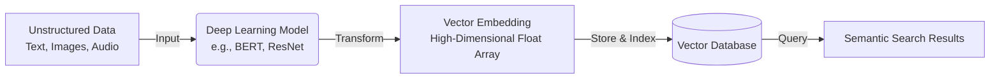
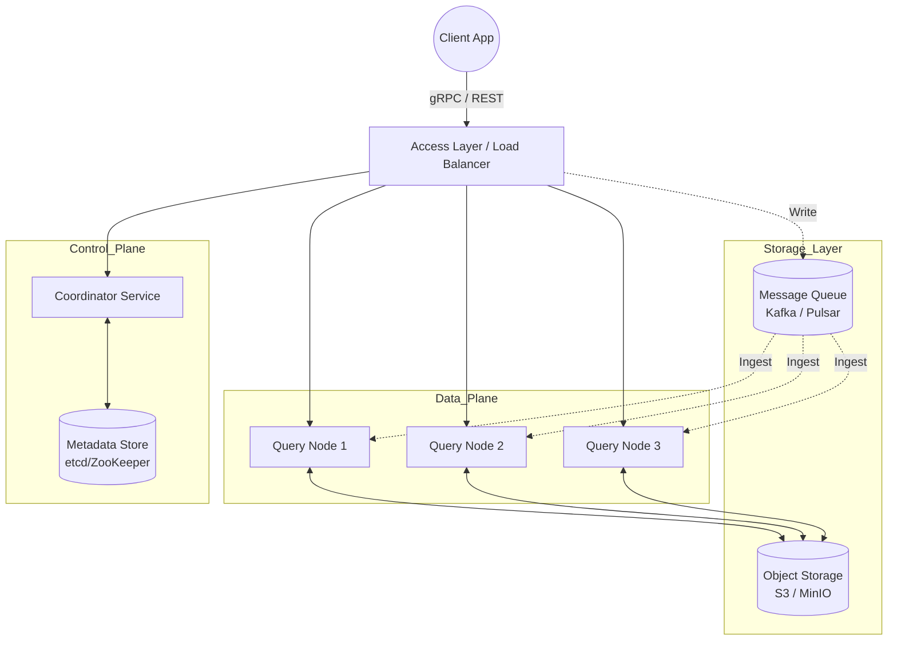

- [1 - Introduction and Historical Context](#1---introduction-and-historical-context)
- [2 - Mathematical Foundations of Vector Spaces](#2---mathematical-foundations-of-vector-spaces)
	- [2.1 - Vector Space Models and Semantics](#21---vector-space-models-and-semantics)
	- [2.2 - The Curse of Dimensionality](#22---the-curse-of-dimensionality)
- [3 - Distance Metrics and Similarity Measures](#3---distance-metrics-and-similarity-measures)
	- [3.1 - Euclidean Distance ($L\_2$ Norm)](#31---euclidean-distance-l_2-norm)
	- [3.2 - Cosine Similarity](#32---cosine-similarity)
	- [3.3 - Dot Product (Inner Product)](#33---dot-product-inner-product)
	- [3.4 - Manhattan Distance ($L\_1$ Norm)](#34---manhattan-distance-l_1-norm)
	- [3.5 - Hamming Distance](#35---hamming-distance)
- [4 - Search Paradigms: Exact vs. Approximate](#4---search-paradigms-exact-vs-approximate)
	- [4.1 - Exact k-Nearest Neighbour (k-NN)](#41---exact-k-nearest-neighbour-k-nn)
	- [4.2 - Approximate Nearest Neighbour (ANN)](#42---approximate-nearest-neighbour-ann)
- [5 - Indexing Algorithms: The Mathematical Engines](#5---indexing-algorithms-the-mathematical-engines)
	- [5.1 - Inverted File Index (IVF)](#51---inverted-file-index-ivf)
		- [5.1.1 - Voronoi Tessellation and Centroids](#511---voronoi-tessellation-and-centroids)
		- [5.1.2 - The Search Procedure](#512---the-search-procedure)
		- [5.1.3 - Theoretical Insight and Complexity](#513---theoretical-insight-and-complexity)
	- [5.2 - Hierarchical Navigable Small Worlds (HNSW)](#52---hierarchical-navigable-small-worlds-hnsw)
		- [5.2.1 - Graph Structure and Skip Lists](#521---graph-structure-and-skip-lists)
		- [5.2.2 - Greedy Search Traversal (Mathematical Working)](#522---greedy-search-traversal-mathematical-working)
		- [5.2.3 - Complexity Analysis](#523---complexity-analysis)
	- [5.3 - Product Quantization (PQ)](#53---product-quantization-pq)
		- [5.3.1 - Subspace Decomposition](#531---subspace-decomposition)
		- [5.3.2 - Quantization and Codebooks](#532---quantization-and-codebooks)
		- [5.3.3 - Asymmetric Distance Computation (ADC)](#533---asymmetric-distance-computation-adc)
	- [5.4 - Locality Sensitive Hashing (LSH)](#54---locality-sensitive-hashing-lsh)
		- [5.4.1 - p-Stable Distributions](#541---p-stable-distributions)
		- [5.4.2 - The Hash Function](#542---the-hash-function)
		- [5.4.3 - Multi-Probe LSH](#543---multi-probe-lsh)
- [6 - Core Architecture of Vector Databases](#6---core-architecture-of-vector-databases)
	- [6.1 - High-Level Components](#61---high-level-components)
	- [6.2 - The Write Path and Storage Engines](#62---the-write-path-and-storage-engines)
	- [6.3 - Consistency Models and Distributed Consensus](#63---consistency-models-and-distributed-consensus)
	- [6.4 - Hybrid Search and Filtering](#64---hybrid-search-and-filtering)
- [7 - Computational Examples](#7---computational-examples)
	- [7.1 - Example 1: Distance Calculation](#71---example-1-distance-calculation)
	- [7.2 - Example 2: Product Quantization (PQ) Trace](#72---example-2-product-quantization-pq-trace)
	- [7.3 - Example 3: HNSW Greedy Routing](#73---example-3-hnsw-greedy-routing)
- [8 - Comparative Analysis of Modern Implementations](#8---comparative-analysis-of-modern-implementations)
- [9 - Operational Considerations and Future Outlook](#9---operational-considerations-and-future-outlook)
	- [9.1 - Cost and Memory Management](#91---cost-and-memory-management)
	- [9.2 - Hardware Acceleration](#92---hardware-acceleration)
	- [9.3 - The Move to Sparse and Hybrid Search](#93---the-move-to-sparse-and-hybrid-search)
- [10 - Conclusion](#10---conclusion)
- [References](#references)

# 1 - Introduction and Historical Context

The management of data has undergone a profound transformation alongside the evolution of machine learning. For decades, the relational database management system (RDBMS) served as the bedrock of software engineering. These systems, optimised for structured data arranged in rows and columns, rely on deterministic logic. A query in Structured Query Language (SQL) looks for exact matches: a specific integer, a precise string, or a boolean flag. However, the digital era has generated an explosion of unstructured data (images, audio, video, and natural language text) that constitutes nearly 80% of the world's total data volume. Traditional databases struggle to process this information because computers fundamentally do not "understand" text or images in the way humans do; they only process numerical representations.

The limitations of traditional keyword-based search, or lexical search, became apparent as the volume of text grew. Lexical search engines, such as those based on the inverted index (e.g., Apache Lucene), operate by tokenising text and mapping words to document identifiers. While effective for exact keyword retrieval, this approach fails to capture semantic meaning. It suffers from the vocabulary mismatch problem: a search for "canine" will not retrieve a document containing "dog" unless an explicit synonym dictionary is manually maintained. Furthermore, lexical search cannot handle multimodal queries, such as searching for an image using a text description.

The solution emerged from the field of Deep Learning, specifically through the development of vector embeddings. Neural networks can be trained to transform unstructured data into fixed-size vectors (arrays of floating-point numbers) in a high-dimensional continuous space. In this vector space, semantic similarity translates to geometric proximity. Two concepts that share meaning will result in vectors that are mathematically close to one another, regardless of the specific words used to describe them. This paradigm shift necessitates a new class of database: the vector database. A vector database is a specialised system optimised for storing, indexing, and querying these high-dimensional embeddings efficiently.

This report provides an exhaustive technical analysis of vector databases. It explores the linear algebra governing vector spaces, the graph theory behind modern indexing algorithms like Hierarchical Navigable Small Worlds (HNSW), the information theoretic principles of Product Quantization (PQ), and the distributed systems engineering required for consistency and scaling.

# 2 - Mathematical Foundations of Vector Spaces

To understand the mechanics of vector databases, one must first establish a rigorous understanding of the underlying mathematical principles. The fundamental data object in these systems is the vector, typically denoted as $\mathbf{v} \in \mathbb{R}^d$, where $d$ represents the dimensionality of the embedding. Modern embedding models, such as those from the BERT family or OpenAI's text-embedding-3, generate vectors with dimensions ranging from 384 to 3072 or more.

## 2.1 - Vector Space Models and Semantics

A vector space is a collection of objects called vectors, which can be added together and multiplied by scalars. In the context of vector databases, we operate primarily in Euclidean space $\mathbb{R}^n$. Each dimension corresponds to a learned feature of the data. In early models like Word2Vec (2013), these dimensions might capture linguistic features, although in modern deep transformers, the specific meaning of a single dimension is often latent and not human-interpretable.

The power of this representation lies in its ability to encode semantic relationships as geometric ones. The position of a vector in this space encodes its meaning. If we visualise a 3-dimensional space, words like "Apple", "Banana", and "Orange" might cluster in one region, while "Car", "Truck", and "Bus" cluster in another. The magnitude and direction of the vectors define these relationships. For instance, the famous arithmetic operation on Word2Vec embeddings demonstrates this linear substructure:
$$\mathbf{v}_{\text{king}} - \mathbf{v}_{\text{man}} + \mathbf{v}_{\text{woman}} \approx \mathbf{v}_{\text{queen}}$$
This algebraic property allows for sophisticated query manipulations, such as adding a "negation" vector or combining multiple concepts into a single query vector.

## 2.2 - The Curse of Dimensionality

A critical concept in vector database theory is the "Curse of Dimensionality." As the number of dimensions $d$ increases, the volume of the space increases exponentially. This leads to several counter-intuitive phenomena that complicate search algorithms:

  * **Data Sparsity:** The available data becomes incredibly sparse. To maintain the same statistical density of points as in a lower-dimensional space, the number of data points must grow exponentially with the dimension. In a high-dimensional cube, most of the volume is concentrated in the corners, not the centre.
  * **Distance Concentration:** In very high dimensions, the distance between any two randomly chosen points tends to converge. The ratio of the distance to the nearest neighbour and the distance to the farthest neighbour approaches 1. This makes it difficult to distinguish "similar" items from dissimilar ones using standard distance metrics, as the contrast between distances diminishes.
  * **Orthogonality:** In high-dimensional spaces, any two random vectors are likely to be nearly orthogonal (perpendicular). This impacts the distribution of cosine similarity scores, often clustering them around zero (or a specific mean) unless the embeddings are specifically trained to spread out.

This phenomenon renders traditional spatial indexing structures like k-d trees or R-trees ineffective. A k-d tree, which splits space along axes to partition data, effectively degrades to a linear scan (brute force) when $d > 20$. Consequently, vector databases must rely on approximation methods rather than exact space partitioning.

# 3 - Distance Metrics and Similarity Measures

The fundamental operation in a vector database is computing the "distance" or "similarity" between two vectors: a query vector $\mathbf{q}$ and a database vector $\mathbf{x}$. The choice of metric depends heavily on the embedding model used during the training phase and the geometric properties of the data.

## 3.1 - Euclidean Distance ($L_2$ Norm)

Euclidean distance measures the straight-line distance between two points in multidimensional space. It is the most intuitive metric, representing physical proximity. For two vectors $\mathbf{a}$ and $\mathbf{b}$ of dimension $n$, the Euclidean distance is defined as the $L_2$ norm of their difference:
$$d(\mathbf{a}, \mathbf{b}) = \|\mathbf{a} - \mathbf{b}\|_2 = \sqrt{\sum_{i=1}^{n} (a_i - b_i)^2}$$
A smaller distance indicates higher similarity. In computational terms, the square root operation is expensive. Therefore, many systems perform ranking using the **Squared Euclidean Distance**:
$$d^2(\mathbf{a}, \mathbf{b}) = \sum_{i=1}^{n} (a_i - b_i)^2$$
Since the square root function is monotonic, the ranking order of neighbours remains preserved without the costly operation. Euclidean distance is sensitive to the magnitude of vectors. If the embedding model does not normalise vectors, a longer document might have a larger vector magnitude, potentially distorting similarity searches based purely on topic.

## 3.2 - Cosine Similarity

Cosine similarity measures the cosine of the angle $\theta$ between two vectors. It focuses on the orientation of the vectors rather than their magnitude. This is particularly useful in text analysis where the magnitude of a vector might represent the length of a document (frequency of terms), but the direction represents its semantic topic.
$$\text{similarity}(\mathbf{a}, \mathbf{b}) = \cos(\theta) = \frac{\mathbf{a} \cdot \mathbf{b}}{|\mathbf{a}| |\mathbf{b}|} = \frac{\sum_{i=1}^{n} a_i b_i}{\sqrt{\sum_{i=1}^{n} a_i^2} \sqrt{\sum_{i=1}^{n} b_i^2}}$$
The result ranges from -1 (exactly opposite) to 1 (exactly the same). A value of 0 indicates orthogonality (no relation). In information retrieval, negative values are rare for term-frequency vectors but possible in dense embeddings.

## 3.3 - Dot Product (Inner Product)

The dot product is the sum of the products of corresponding components.
$$\mathbf{a} \cdot \mathbf{b} = \sum_{i=1}^{n} a_i b_i$$
The dot product is computationally faster than Cosine similarity or Euclidean distance because it involves fewer operations (no square roots, no divisions). It is deeply related to the other metrics.

**Relation to Cosine Similarity:**
If vectors $\mathbf{a}$ and $\mathbf{b}$ are $L_2$-normalised (i.e., their length $\|\mathbf{a}\| = \|\mathbf{b}\| = 1$), the denominator in the Cosine formula becomes 1. Thus, for normalised vectors:
$$\mathbf{a} \cdot \mathbf{b} = \cos(\theta)$$
This equivalence allows databases to store normalised vectors and use the efficient dot product to calculate cosine similarity.

**Relation to Euclidean Distance:**
Expanding the squared Euclidean distance formula reveals a connection to the dot product:
$$\|\mathbf{a} - \mathbf{b}\|^2 = (\mathbf{a} - \mathbf{b}) \cdot (\mathbf{a} - \mathbf{b}) = \|\mathbf{a}\|^2 + \|\mathbf{b}\|^2 - 2(\mathbf{a} \cdot \mathbf{b})$$
If the vectors are normalised, $\|\mathbf{a}\|^2 = \|\mathbf{b}\|^2 = 1$, so:
$$\|\mathbf{a} - \mathbf{b}\|^2 = 2 - 2(\mathbf{a} \cdot \mathbf{b})$$
This implies that for normalised vectors, minimising Euclidean distance is mathematically equivalent to maximising the dot product. Most modern embedding models (e.g., OpenAI, Cohere) produce normalised vectors, allowing databases to default to the highly efficient dot product for calculations.

## 3.4 - Manhattan Distance ($L_1$ Norm)

The Manhattan distance is the sum of the absolute differences of their coordinates.
$$d_1(\mathbf{a}, \mathbf{b}) = \sum_{i=1}^{n} |a_i - b_i|$$
While less common in general-purpose dense vector search, it is used in specific sparse vector applications or specialised metric spaces where the geometry is "blocky" rather than Euclidean.

## 3.5 - Hamming Distance

For binary vectors (vectors composed of 0s and 1s), the Hamming distance measures the number of positions at which the corresponding symbols are different. This is crucial for Binary Quantization (BQ) and hashing techniques where float vectors are compressed into compact bitstrings to save memory and accelerate comparison. XOR operations on modern CPUs can compute Hamming distance at incredible speeds.

# 4 - Search Paradigms: Exact vs. Approximate

The core retrieval task is defined as follows: Given a query $\mathbf{q}$ and a dataset $S$, find the vector $\mathbf{v} \in S$ such that the distance $d(\mathbf{q}, \mathbf{v})$ is minimised.

## 4.1 - Exact k-Nearest Neighbour (k-NN)

The simplest approach is Flat Indexing or Brute Force Search. The system calculates the distance between $\mathbf{q}$ and every single vector $\mathbf{v}_i$ in the database, sorts the distances, and returns the top $k$ results.

  * **Complexity:** $O(N \cdot d)$.
  * **Accuracy:** 100% (Recall = 1.0).
  * **Scalability:** Poor.

For a dataset of $N=10^9$ (1 billion) vectors with dimension $d=1024$, a single query requires roughly $10^{12}$ floating-point operations. On standard hardware, this leads to multi-second or even minute-long latencies, which is unacceptable for real-time applications like chatbots or recommendation engines.

## 4.2 - Approximate Nearest Neighbour (ANN)

To handle large-scale data, vector databases employ Approximate Nearest Neighbour (ANN) algorithms. These algorithms trade a small amount of accuracy (Recall \< 1.0) for orders-of-magnitude improvements in speed. They typically organise data into structures (graphs, trees, clusters) that allow the query to ignore vast swathes of the vector space, pruning the search area significantly.

The key performance metrics for evaluating ANN algorithms are:

  * **Recall@k:** The fraction of the true top-$k$ nearest neighbours found by the algorithm.
  * **Queries Per Second (QPS):** The throughput of the system.
  * **Latency:** The time taken to process a single query (p95 or p99).
  * **Memory Footprint:** The RAM required to hold the index.
  * **Index Build Time:** The time required to construct the index from raw data.

# 5 - Indexing Algorithms: The Mathematical Engines

The index is the core differentiator of vector databases. It is the data structure that enables sub-linear search speeds. We will analyse the three dominant families of indexing algorithms: Clustering (Inverted File Index), Graphs (HNSW), and Compression (Quantization).

## 5.1 - Inverted File Index (IVF)

The Inverted File Index (IVF) adapts the concept of inverted indices from text search to continuous vector space using clustering techniques. It is a space-partitioning algorithm.

### 5.1.1 - Voronoi Tessellation and Centroids

The vector space is partitioned into $K$ regions (clusters) using an algorithm like K-means. The centre of each cluster is called a centroid ($\mathbf{\mu}_i$). The set of all points closer to centroid $\mathbf{\mu}_i$ than to any other centroid forms a geometric region known as a Voronoi cell.
Mathematically, a Voronoi cell $V_i$ associated with centroid $\mathbf{\mu}_i$ is defined as:
$$V_i = \{ \mathbf{x} \in \mathbb{R}^d \mid |\mathbf{x} - \mathbf{\mu}_i| \le |\mathbf{x} - \mathbf{\mu}_j| \forall j \neq i \}$$
Every vector in the database is assigned to the centroid closest to it. This creates an inverted list: Centroid\_ID -\> [Vector\_1, Vector\_2,...].

### 5.1.2 - The Search Procedure

1.  **Coarse Quantization:** When a query vector $\mathbf{q}$ arrives, the system first calculates the distance between $\mathbf{q}$ and all $K$ centroids to identify the closest ones.
2.  **Probe:** The system selects the $nprobe$ closest centroids (where $nprobe$ is a configurable parameter).
3.  **Scan:** It then exhaustively searches (brute-force) only the vectors contained within the Voronoi cells of these selected centroids.

### 5.1.3 - Theoretical Insight and Complexity

If $N$ is the dataset size and $K$ is the number of clusters, the average cluster size is $N/K$. The search complexity drops from $O(N)$ to $O(K + (N/K) \cdot nprobe)$. To minimise this function, $K$ is typically chosen as $\sqrt{N}$. This reduces the overall complexity to roughly $O(\sqrt{N})$.

  * **Advantage:** This method drastically reduces the search space.
  * **Disadvantage:** It suffers from the "boundary problem." If $\mathbf{q}$ is located near the edge of a Voronoi cell, its true nearest neighbour might lie just across the border in an adjacent cell. If that adjacent cell is not included in the $nprobe$ list, the neighbour will be missed, reducing recall. Increasing $nprobe$ mitigates this risk but linearly increases latency.

## 5.2 - Hierarchical Navigable Small Worlds (HNSW)

HNSW is currently considered the state-of-the-art algorithm for in-memory vector search. It balances high recall with logarithmic complexity and is robust against the curse of dimensionality. It combines the data structures of Probability Skip Lists with Navigable Small World (NSW) graphs.

### 5.2.1 - Graph Structure and Skip Lists

An NSW graph creates a network where vertices are vectors and edges connect vectors to their nearest neighbours. The "Small World" property, observed in social networks (the "six degrees of separation" theory), implies that the average path length between any two nodes is small (typically logarithmic relative to the network size).
HNSW introduces a hierarchical structure consisting of multiple layers, denoted as $L_0, L_1, \dots, L_{max}$.

  * **Layer 0 (Bottom):** This layer contains all data points in the database. It is a high-resolution graph with many short-range connections.
  * **Layer $L_{max}$ (Top):** This layer contains very few points. It acts as a fast "highway" or express lane to allow the search algorithm to traverse large distances in the vector space quickly.

The distribution of nodes across layers mimics a Probability Skip List. A node inserted into the database is assigned a maximum layer $l$ based on an exponentially decaying probability distribution:
$$P(l) \propto e^{-l}$$
This ensures that while all nodes exist at Layer 0, exponentially fewer nodes exist at higher layers, forming a pyramid-like structure.

### 5.2.2 - Greedy Search Traversal (Mathematical Working)

The search for a query vector $\mathbf{q}$ begins at the top layer and proceeds downwards.
**Algorithm Steps:**

1.  **Entry:** The algorithm starts at a pre-defined entry point node $E$ in the highest layer $L_{max}$.
2.  **Greedy Step:** It evaluates the distance $d(\mathbf{q}, \text{neighbour})$ for all connected neighbours of the current node $E$.
3.  **Move:** If a neighbour $N$ is found to be closer to $\mathbf{q}$ than $E$ is, the algorithm moves to $N$ (i.e., $E \leftarrow N$).
4.  **Local Min:** This greedy process repeats until no neighbour is closer to the query than the current node. This node is the local minimum for the current layer.
5.  **Descend:** The algorithm drops down to the next layer ($L_{max}-1$). The local minimum found in the upper layer serves as the entry point for the search in this new layer.
6.  **Refine:** The greedy search resumes in the lower layer. Since lower layers have more nodes and shorter links, the search becomes finer and more precise.
7.  **Final:** At Layer 0, a broader search is performed (controlled by a beam width parameter efSearch) to find the final list of $k$ nearest neighbours.

### 5.2.3 - Complexity Analysis

The search complexity is $O(\log N)$. The layered structure allows the algorithm to skip vast portions of the graph, similar to how a binary search tree or a skip list allows skipping elements. By "zooming in" from the coarse global view at the top layer to the fine local view at the bottom layer, HNSW achieves extremely low latency.

## 5.3 - Product Quantization (PQ)

While HNSW offers superior speed, it consumes significant memory because it typically requires storing the full float32 vectors in RAM for distance calculations. Product Quantization (PQ) is a lossy compression technique that addresses this memory bottleneck by decomposing the high-dimensional space into a Cartesian product of lower-dimensional subspaces.

### 5.3.1 - Subspace Decomposition

Given a vector $\mathbf{x} \in \mathbb{R}^d$, PQ splits it into $m$ distinct sub-vectors $\mathbf{u}_1, \dots, \mathbf{u}_m$.
The dimension of each sub-vector is $d^* = d/m$.
**Example:** A 128-dimensional vector ($d=128$) might be split into $m=8$ sub-vectors, each of dimension $16$.

### 5.3.2 - Quantization and Codebooks

For each subspace $j$, a separate K-means clustering is performed on the training data to create a codebook $C_j$. This codebook contains $k^*$ centroids (typically $k^* = 256$). The choice of 256 is strategic as it allows the index of a centroid to be represented by exactly 1 byte (8 bits).
Each sub-vector $\mathbf{u}_j$ of the original vector is replaced by the ID (index) of its nearest centroid in the codebook $C_j$.
$$\mathbf{x} \rightarrow [id_1, id_2, \dots, id_m]$$
If $k^*=256$, the total size of the compressed vector is $m$ bytes.

**Compression Ratio:**
Consider a 128-dimensional vector of 32-bit floats.

  * Original size: $128 \times 4 \text{ bytes} = 512 \text{ bytes}$.
  * PQ Compressed size ($m=8$): $8 \text{ bytes}$.
    This yields a massive 64x reduction in memory usage.

### 5.3.3 - Asymmetric Distance Computation (ADC)

To search the compressed database, we need to calculate the distance between an uncompressed query $\mathbf{q}$ and a compressed database vector $\mathbf{x}'$. This is called Asymmetric Distance Computation (ADC).
The squared Euclidean distance is approximated as the sum of squared distances in each subspace:
$$d(\mathbf{q}, \mathbf{x}')^2 \approx \sum_{j=1}^{m} \|\mathbf{q}_j - C_j[id_j]\|^2$$
**Optimization:**
Before iterating through the database, the system pre-computes a lookup table. It calculates the distance between the query sub-vectors $\mathbf{q}_j$ and every possible centroid in every codebook $C_j$. Since there are only $m \times k^*$ centroids (e.g., $8 \times 256 = 2048$), this is negligible.
During the scan of the database, the distance calculation for each vector becomes a simple series of $m$ table lookups and additions, avoiding expensive floating-point arithmetic entirely.

## 5.4 - Locality Sensitive Hashing (LSH)

Locality Sensitive Hashing (LSH) is an older technique that differs fundamentally from graph or clustering methods. It relies on probabilistic hashing families that preserve similarity. The goal is to hash similar items to the same "bucket" with high probability, and dissimilar items to different buckets.

### 5.4.1 - p-Stable Distributions

LSH for Euclidean distance utilizes p-stable distributions. A distribution $D$ is called p-stable if for any vectors $\mathbf{v}_1, \dots, \mathbf{v}_n$ and random variables $X_1, \dots, X_n \sim D$, the linear combination $\sum v_i X_i$ has the same distribution as $(\sum |v_i|^p)^{1/p} X$, where $X \sim D$.
For Euclidean distance ($L_2$ norm, where $p=2$), the Gaussian (Normal) distribution is 2-stable.

### 5.4.2 - The Hash Function

The LSH hash function for Euclidean space is defined as:
$$h_{\mathbf{a}, b}(\mathbf{v}) = \lfloor \frac{\mathbf{a} \cdot \mathbf{v} + b}{r} \rfloor$$
Where:

  * $\mathbf{a}$ is a random vector where each entry is drawn independently from a Gaussian distribution.
  * $b$ is a random scalar drawn uniformly from $[0, r]$.
  * $r$ is a user-defined parameter representing the bucket width.

Geometrically, this projects the vector $\mathbf{v}$ onto a random line defined by $\mathbf{a}$, shifts it by $b$, and quantizes it into segments of length $r$. Vectors that are close to each other in the original space ($\|\mathbf{v}_1 - \mathbf{v}_2\|$ is small) are highly likely to fall into the same integer segment (bucket).

### 5.4.3 - Multi-Probe LSH

A single hash function is insufficient because the probability of collision for similar items is not 100% (false negatives). To improve recall, LSH constructs multiple hash tables ($L$ tables) using different random $\mathbf{a}$ and $b$ values. During search, vectors that collide with the query $\mathbf{q}$ in any of the $L$ tables are collected as candidates. While LSH provides theoretical guarantees, in practice, it often requires more memory and tuning than HNSW or PQ to achieve comparable performance.

# 6 - Core Architecture of Vector Databases

A production-grade vector database involves significantly more engineering than just the indexing algorithm. It requires a robust architecture to handle data persistence, updates, concurrency, and distributed querying.

## 6.1 - High-Level Components

Modern vector databases (e.g., Milvus, Weaviate, Pinecone, Qdrant) typically adopt a microservices architecture that decouples compute from storage.

  * **Access Layer:** This is the gateway for client applications. It handles authentication, request validation, and routing. It exposes endpoints via gRPC or REST.
  * **Coordinator Service:** This component acts as the "brain" of the cluster. It manages cluster topology, handles sharding (partitioning data across nodes), assigns tasks to worker nodes, and manages metadata (e.g., which collection maps to which segments).
  * **Worker/Query Nodes:** These nodes perform the heavy lifting of vector search. They load vector indices into memory (or cache them on fast SSDs) and execute the ANN algorithms.
  * **Storage Layer:** This layer ensures data durability. It stores the raw data, index files, and logs. It is often implemented using object storage (like AWS S3 or MinIO) or a distributed file system.

## 6.2 - The Write Path and Storage Engines

When a vector is inserted into the database, it must be securely stored before it can be indexed.

  * **Write-Ahead Log (WAL):** To ensure durability in the event of a crash, incoming data is first appended to a Write-Ahead Log. This is a sequential file that records every operation. Only after the WAL is flushed to persistent storage is the write acknowledged to the client.
  * **LSM Trees:** Many systems (like Weaviate and implementations based on RocksDB) utilize Log-Structured Merge (LSM) trees for storage. New data is written to a mutable in-memory buffer called a "MemTable." When the MemTable reaches a certain size, it is flushed to disk as an immutable "SSTable" (Sorted String Table). This structure optimises for write throughput by converting random writes into sequential writes.
  * **Index Construction:** Unlike standard B-trees, vector indices like HNSW are computationally expensive to update. Inserting a node one by one into a large on-disk graph causes massive "write amplification" (random I/O). To mitigate this, databases often use a tiered approach:
      * **Mutable Buffer:** Recent data is kept in a small, dynamic in-memory index.
      * **Immutable Segments:** Older data is sealed into large, static on-disk indices.
      * **Compaction:** A background process periodically merges small segments into larger ones, rebuilding the index effectively.

## 6.3 - Consistency Models and Distributed Consensus

Distributed vector databases must navigate the trade-offs of the CAP theorem (Consistency, Availability, Partition Tolerance). Different applications have different needs; a financial fraud detection system needs immediate consistency, while a product recommender might tolerate a few seconds of delay.
Systems like Milvus offer tunable consistency levels, implemented via a Timestamp Oracle (TSO):

  * **Strong Consistency:** This guarantees that a search query will see all data written prior to the query. The system ensures that all replicas are synchronized before returning results. This incurs the highest latency.
  * **Bounded Staleness:** The system allows the query to read data that is slightly stale, within a defined time window (e.g., 5 seconds). The query node does not wait for the absolute latest operations to apply. This is often the default as it provides a good balance of speed and freshness.
  * **Eventual Consistency:** The system guarantees that updates will propagate eventually, but a read immediately after a write may return old data. This offers the highest read throughput.
  * **Session Consistency:** This guarantees that within a specific user session, the user will always see their own writes.

Distributed consensus algorithms like Raft or Paxos are used to maintain the state of the metadata and coordination service, ensuring that the cluster agrees on the topology and data distribution even if nodes fail.

## 6.4 - Hybrid Search and Filtering

Real-world queries are rarely just "find the nearest vector." They often involve metadata filters (e.g., "Find similar shoes" AND "brand=Nike" AND "price \< 100").
Handling these filters efficiently is a major architectural challenge.

  * **Post-filtering:** The system performs the vector search first to get the top $k$ results, and then filters out items that don't match the metadata.
      * *Risk:* If the top $k$ results all happen to be "Adidas," the filter removes them all, and the user gets zero results, even if relevant "Nike" shoes existed further down the list. This leads to unpredictable recall.
  * **Pre-filtering:** The system selects all items matching "Nike" first, and then performs a brute-force search on that subset.
      * *Risk:* If the subset is large (e.g., 1 million "Nike" shoes), brute force is too slow. If the subset is tiny, the index is ignored.
  * **Single-Stage Filtering (Filtered Indexing):** Modern indices like HNSW allow traversing the graph while checking the filter condition at each node visit. If a node doesn't match the filter, it is not added to the result set, but it can still be used as a bridge to traverse to other nodes. This effectively integrates the two steps. Systems like Qdrant and Weaviate specialise in this optimised hybrid retrieval.

# 7 - Computational Examples

To solidify the theoretical concepts, we present simplified, step-by-step computational examples.

## 7.1 - Example 1: Distance Calculation

Consider a 2-dimensional vector space.
Query Vector: $\mathbf{q} = [1, 2]$
Database Vector: $\mathbf{a} = [3, 4]$

**Euclidean Distance:**

1.  Difference: $\mathbf{q} - \mathbf{a} = [1-3, 2-4] = [-2, -2]$
2.  Squared Difference: $[(-2)^2, (-2)^2] = [4, 4]$
3.  Sum: $4 + 4 = 8$
4.  Square Root: $\sqrt{8} \approx 2.828$
    $$d(\mathbf{q}, \mathbf{a}) \approx 2.828$$

**Cosine Similarity:**

1.  Magnitude of $\mathbf{q}$: $\|\mathbf{q}\| = \sqrt{1^2 + 2^2} = \sqrt{1+4} = \sqrt{5} \approx 2.236$
2.  Magnitude of $\mathbf{a}$: $\|\mathbf{a}\| = \sqrt{3^2 + 4^2} = \sqrt{9+16} = \sqrt{25} = 5$
3.  Dot Product: $\mathbf{q} \cdot \mathbf{a} = (1)(3) + (2)(4) = 3 + 8 = 11$
4.  Cosine:
    $$\cos(\theta) = \frac{11}{2.236 \times 5} = \frac{11}{11.18} \approx 0.984$$
    The result is close to 1, indicating the vectors point in almost the same direction.

## 7.2 - Example 2: Product Quantization (PQ) Trace

**Setup:**

  * Vector Dimension $d=4$.
  * Vector $\mathbf{x} = [1.2, 3.4, 5.6, 7.8]$.
  * Split into $m=2$ sub-vectors of dimension $d^*=2$.
      * $\mathbf{u}_1 = [1.2, 3.4]$
      * $\mathbf{u}_2 = [5.6, 7.8]$
  * **Codebooks (Simplified K-means centroids):**
    Assume we have trained codebooks $C_1$ and $C_2$, each with 2 centroids ($k^*=2$).
      * $C_1$ Centroids:
          * ID 0: $c_{1,0} = [1.0, 3.0]$
          * ID 1: $c_{1,1} = [10.0, 10.0]$
      * $C_2$ Centroids:
          * ID 0: $c_{2,0} = [5.0, 5.0]$
          * ID 1: $c_{2,1} = [5.5, 8.0]$

**Quantization Step:**

1.  Process $\mathbf{u}_1 = [1.2, 3.4]$:
      * Dist to $c_{1,0}$: $\sqrt{(1.2-1.0)^2 + (3.4-3.0)^2} = \sqrt{0.04 + 0.16} = \sqrt{0.20} \approx 0.447$
      * Dist to $c_{1,1}$: $\sqrt{(1.2-10)^2 +...}$ (Very large)
      * **Selection:** ID 0 is closer.
2.  Process $\mathbf{u}_2 = [5.6, 7.8]$:
      * Dist to $c_{2,0}$: $\sqrt{(5.6-5.0)^2 + (7.8-5.0)^2} = \sqrt{0.36 + 7.84} = \sqrt{8.2} \approx 2.86$
      * Dist to $c_{2,1}$: $\sqrt{(5.6-5.5)^2 + (7.8-8.0)^2} = \sqrt{0.01 + 0.04} = \sqrt{0.05} \approx 0.223$
      * **Selection:** ID 1 is closer.

**Compressed Representation:**
The vector $\mathbf{x}$ is stored as the byte array: `[0, 1]`.
We have compressed 4 floating-point numbers (16 bytes) into 2 integers (2 bytes implied if using minimal bit depth).

**Reconstruction:**
To approximate $\mathbf{x}$, the system looks up the centroids:
$\mathbf{x}_{rec} = [c_{1,0}, c_{2,1}] = [1.0, 3.0, 5.5, 8.0]$.
The approximation error is the difference between $\mathbf{x}$ and $\mathbf{x}_{rec}$.

## 7.3 - Example 3: HNSW Greedy Routing

**Scenario:**

  * Search in Layer $L_0$.
  * Query $\mathbf{q}$ is at coordinates $(0,0)$.
  * Algorithm is currently at Node $A$ at $(10, 10)$. Distance to $\mathbf{q} \approx 14.1$.
  * Node $A$ has three neighbours:
      * $B$ at $(5, 5)$
      * $C$ at $(12, 12)$
      * $D$ at $(10, 5)$

**Execution:**

1.  Calculate distance from $\mathbf{q}(0,0)$ to $B(5,5)$: $\sqrt{25+25} = \sqrt{50} \approx 7.07$.
2.  Calculate distance from $\mathbf{q}(0,0)$ to $C(12,12)$: $\sqrt{144+144} \approx 16.97$.
3.  Calculate distance from $\mathbf{q}(0,0)$ to $D(10,5)$: $\sqrt{100+25} \approx 11.18$.
4.  **Comparison:** The closest neighbour is $B$ (7.07).
5.  **Decision:** Is $B$ closer than the current node $A$ (14.1)? Yes.
6.  **Move:** The algorithm hops to Node $B$. $B$ becomes the current node.
7.  **Repeat:** The process repeats with the neighbours of $B$. If all neighbours of $B$ are further away than 7.07, then $B$ is the local minimum for this layer.

# 8 - Comparative Analysis of Modern Implementations

The ecosystem of vector databases has diversified rapidly. While they share common theoretical underpinnings, their architectural choices lead to distinct strengths and weaknesses.

| Feature                  | Milvus                            | Pinecone                   | Weaviate                     | Qdrant                 | FAISS              |
| :----------------------- | :-------------------------------- | :------------------------- | :--------------------------- | :--------------------- | :----------------- |
| **Type**                 | Open-source Dist. DB              | Managed SaaS               | Open-source DB               | Open-source DB         | Library            |
| **Core Index**           | HNSW, IVF, DiskANN                | Proprietary (Graph)        | HNSW (Custom)                | HNSW                   | HNSW, IVF, PQ, LSH |
| **Language**             | Go/C++                            | Closed Source              | Go                           | Rust                   | C++                |
| **Storage Architecture** | Disaggregated (MinIO/S3 + Pulsar) | Cloud Native               | LSM Tree                     | Segmented              | In-memory arrays   |
| **Consistency**          | Tunable (Strong to Eventual)      | Eventual/Strong            | Tunable                      | Strong/Eventual        | N/A (Library)      |
| **Scaling Strategy**     | Kubernetes/Sharding               | Auto-scaling               | Sharding                     | Sharding               | Manual             |
| **Primary Use Case**     | Large-scale Enterprise, tunable   | Ease of use, fully managed | Hybrid Search, Developer Exp | Performance, Filtering | Research, embedded |

**FAISS (Facebook AI Similarity Search):**
FAISS is not a database but a library. It provides the reference implementations for HNSW, IVF, and PQ. It runs entirely in-memory (or on GPU) and offers no persistence, replication, or networking. It is the engine inside many other databases.

**Milvus:**
Milvus is architected for massive scale. It completely separates compute (query nodes), storage (object store), and messaging (Pulsar/Kafka) for log ingestion. This allows each component to scale independently. Its support for tunable consistency makes it adaptable to varying enterprise requirements.

**Weaviate:**
Weaviate distinguishes itself by defining itself as a "vector search engine" that stores data objects alongside their vectors. It uses a custom LSM-tree implementation for storage and supports "modular" vectorization, where modules can be plugged in to vectorise media on the fly. Its "inverted index" for metadata allows for powerful pre-filtering.

**Qdrant:**
Written in Rust, Qdrant emphasises raw performance and memory safety. It implements a custom "Filterable HNSW" which is highly optimised for hybrid search. Its storage engine is designed to work efficiently with SSDs, allowing it to offload vectors from RAM to disk while maintaining high performance.

# 9 - Operational Considerations and Future Outlook

Deploying vector databases in production introduces challenges that go beyond the algorithmic complexity.

## 9.1 - Cost and Memory Management

The primary cost driver in vector search is Random Access Memory (RAM). Storing 1 billion vectors of 768 dimensions (float32) requires roughly 3 TB of RAM. This is prohibitively expensive for many organisations.

  * **Solution 1: Quantization.** Using PQ or Binary Quantization (BQ) can reduce this by 32x-64x, bringing the requirement down to \< 100 GB.
  * **Solution 2: Disk-Based Indexing.** Algorithms like DiskANN (Vamana graph) store the graph structure on fast NVMe SSDs and cache only the compressed vectors in RAM. They utilize the high random read throughput of modern SSDs to achieve performance close to in-memory systems at a fraction of the cost.

## 9.2 - Hardware Acceleration

The future of vector databases is closely tied to hardware.

  * **SIMD:** CPU instructions like AVX-512 are essential for calculating distances efficiently.
  * **GPUs:** Graphics Processing Units are massively parallel and can perform brute-force search or IVF training much faster than CPUs. FAISS has highly optimised GPU implementations.
  * **FPGA/ASIC:** Custom silicon is being developed specifically for tensor operations and nearest neighbour search.

## 9.3 - The Move to Sparse and Hybrid Search

While dense vectors capture semantic meaning, they sometimes fail at precise keyword matching (e.g., product numbers, specific names). The industry is moving towards Hybrid Search, which combines dense vector search (HNSW) with sparse vector search (BM25/SPLADE). Sparse vectors are high-dimensional (e.g., 30,000 dimensions) but mostly zeros. They capture exact lexical matches. A weighted combination of dense and sparse scores (Reciprocal Rank Fusion) often yields the best retrieval quality.

# 10 - Conclusion

Vector databases represent a critical infrastructure component for the Artificial Intelligence age. By bridging the semantic gap between high-dimensional mathematical representations and efficient data retrieval, they enable applications ranging from RAG (Retrieval-Augmented Generation) for Large Language Models to large-scale recommendation systems and fraud detection.

The technology relies on a sophisticated interplay of geometry, graph theory, and systems engineering.

  * **Mathematics:** Dimensionality reduction and distance metrics define the fundamental rules of the space.
  * **Algorithms:** HNSW and IVF provide the navigational mechanisms to solve the nearest neighbour problem with logarithmic complexity.
  * **Systems:** Distributed architectures, LSM trees, and consistency protocols ensure the reliability and scalability required for enterprise adoption.

As embedding models grow larger and datasets expand into the trillions, the field continues to evolve. Research is actively pushing the boundaries of quantization (1-bit embeddings), disk-resident graphs, and hardware-accelerated search, ensuring that vector databases will remain at the forefront of the data management landscape for years to come.

# References

1. Malkov, Y. A., & Yashunin, D. A. (2020). Efficient and robust approximate nearest neighbor search using Hierarchical Navigable Small World graphs. *IEEE Transactions on Pattern Analysis and Machine Intelligence*, 42(4), 824–836. [https://doi.org/10.1109/TPAMI.2018.2889473](https://doi.org/10.1109/TPAMI.2018.2889473) ([ACM Digital Library][1])

2. Jégou, H., Douze, M., & Schmid, C. (2011). Product quantization for nearest neighbor search. *IEEE Transactions on Pattern Analysis and Machine Intelligence*, 33(1), 117–128. [https://doi.org/10.1109/TPAMI.2010.57](https://doi.org/10.1109/TPAMI.2010.57) ([computer.org][2])

3. Datar, M., Immorlica, N., Indyk, P., & Mirrokni, V. S. (2004). Locality-sensitive hashing scheme based on p-stable distributions. In *Proceedings of the 20th Annual Symposium on Computational Geometry (SCG ’04)* (pp. 253–262). [https://doi.org/10.1145/997817.997857](https://doi.org/10.1145/997817.997857) ([ACM Digital Library][3])

4. Fu, C., Xiang, C., Wang, C., & Li, D. (2019). Fast approximate nearest neighbor search with the navigating spreading-out graph. *Proceedings of the VLDB Endowment*, 12(5), 461–474. [https://www.vldb.org/pvldb/vol12/p461-fu.pdf](https://www.vldb.org/pvldb/vol12/p461-fu.pdf) ([VLDB][4])

5. Subramanya, S. J., Devvrit, Kadekodi, R., Krishnaswamy, R., & Simhadri, H. V. (2019). DiskANN: Fast accurate billion-point nearest neighbor search on a single node. In *Advances in Neural Information Processing Systems 32 (NeurIPS 2019)*. [https://papers.nips.cc/paper_files/paper/2019/file/09853c7fb1d3f8ee67a61b6bf4a7f8e6-Paper.pdf](https://papers.nips.cc/paper_files/paper/2019/file/09853c7fb1d3f8ee67a61b6bf4a7f8e6-Paper.pdf) ([NeurIPS Proceedings][5])

6. Aumüller, M., Bernhardsson, E., & Faithfull, A. (2018). ANN-Benchmarks: A benchmarking tool for approximate nearest neighbor algorithms. *Proceedings of the 2017 International Conference on Similarity Search and Applications (SISAP)*; extended version in *Information Systems*, 87, 101738 (2020). [https://arxiv.org/abs/1807.05614](https://arxiv.org/abs/1807.05614) ([arxiv.org][6])

[1]: https://dl.acm.org/doi/10.1109/TPAMI.2018.2889473?utm_source=chatgpt.com "Efficient and Robust Approximate Nearest Neighbor ..."
[2]: https://www.computer.org/csdl/journal/tp/2011/01/ttp2011010117/13rRUxASuU9?utm_source=chatgpt.com "Product Quantization for Nearest Neighbor Search"
[3]: https://dl.acm.org/doi/10.1145/997817.997857?utm_source=chatgpt.com "Locality-sensitive hashing scheme based on p-stable ..."
[4]: https://www.vldb.org/pvldb/vol12/p461-fu.pdf?utm_source=chatgpt.com "Fast Approximate Nearest Neighbor Search With The ..."
[5]: https://papers.nips.cc/paper/9527-rand-nsg-fast-accurate-billion-point-nearest-neighbor-search-on-a-single-node?utm_source=chatgpt.com "DiskANN: Fast Accurate Billion-point Nearest Neighbor ..."
[6]: https://arxiv.org/abs/1807.05614?utm_source=chatgpt.com "ANN-Benchmarks: A Benchmarking Tool for Approximate Nearest Neighbor Algorithms"
